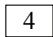
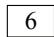
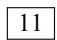
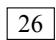
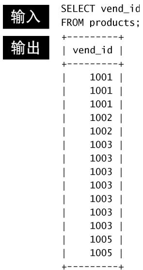
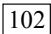
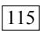
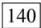

<!-- Source PDF pages 1-120 -->

# MySQL Crash CourseMySQL必知必会

[英] Ben Forta 著

刘晓霞钟鸣 译

《SQL必知必会》作者新作

Amazon全五星评价

学习与参考皆宜

MySQL.

图书在版编目（CIP）数据

MySQL必知必会/（英）福塔（Forta,B.）著；刘晓霞，钟鸣译. —北京：人民邮电出版社，2009.1

（图灵程序设计丛书）书名原文：MySQL Crash CourseISBN 978-7-115-19112-0

Ⅰ.M… Ⅱ.①福… ②刘… ③钟 Ⅲ.关系数据库 —数据库管理系统，MySQL Ⅳ. TP311.138

中国版本图书馆CIP数据核字（2008）第159272号

## 内 容 提 要

MySQL 是世界上最受欢迎的数据库管理系统之一。书中从介绍简单的数据检索开始，逐步深入一些复杂的内容，包括联结的使用、子查询、正则表达式和基于全文本的搜索、存储过程、游标、触发器、表约束，等等。通过重点突出的章节，条理清晰、系统而扼要地讲述了读者应该掌握的知识，使他们不经意间立刻功力大增。

本书注重实用性，操作性很强，适用于广大软件开发和数据库管理人员学习参考。

图灵程序设计丛书

## MySQL必知必会

著◆ [ 英] Ben Forta译 刘晓霞 钟 鸣责任编辑 傅志红执行编辑 刘 静

人民邮电出版社出版发行 北京市崇文区夕照寺街14号◆邮编 100061 电子函件 315@ptpress.com.cn网址 http://www.ptpress.com.cn北京 印刷

开本：850×1168 1/32◆印张：8字数：246千字 2009年 1 月第 1 版印数：1 — 4 000册 2009年1月北京第1次印刷著作权合同登记号 图字：01-2008-4295号ISBN 978-7-115-19112-0/TP

定价：39.00元

读者服务热线：(010)88593802　印装质量热线：(010)67129223

反盗版热线:(010)67171154

图灵社区会员 臭豆腐(StinkBC@gmail.com) 专享 尊

## 版 权 声 明

Authorized translation from the English language edition, entitled MySQL Crash Course, 0672327120 by Ben Forta, published by Pearson Education, Inc., publishing as Sams. Copyright © 2006 by Sams Publishing.

All rights reserved. No part of this book may be reproduced or transmitted in any form or by any means, electronic or mechanical, including photocopying, recording or by any information storage retrieval system, without permission from Pearson Education, Inc.

Simplified Chinese-language edition copyright © 2009 by Posts & Telecom Press. All rights reserved.

本书中文简体字版由 Pearson Education Inc.授权人民邮电出版社独家出版。未经出版者书面许可，不得以任何方式复制或抄袭本书内容。

版权所有，侵权必究。

## 致 谢

首先，我要感谢Sams出版公司的伙伴们，他们再一次给了我灵活的自由度，让我把书写成我认为合适的样子。谢谢Mark Renfrow提供的关于本书和前面几本书的反馈意见。特别感谢Loretta Yates不仅在中途勇敢地介入到出版过程中，使其回归正轨，继续进行，而且还果断地签署了本系列书中后两部书籍的出版合约。

谢谢Jochem van Dieten和Timothy Boronczyk这两位技术编辑，他们对书稿进行了出色的技术审查。余下的那些“错误”都是我“故意”犯的，就是想看看读者们有没有注意到。:-)

最后，本书是应《SQL必知必会》读者的请求编写的。那本书收到了很多极有价值的反馈意见和建议，在此我深表谢意。谢谢大家，我希望自己达到了大家的期望。

## 前 言

MySQL已经成为世界上最受欢迎的数据库管理系统之一。无论是用在小型开发项目上，还是用来构建那些声名显赫的网站，MySQL都证明了自己是个稳定、可靠、快速、可信的系统，足以胜任任何数据存储业务的需要。

本书基于我的一本畅销书Sams Teach Yourself SQL in 10 Minutes（中文版《SQL必知必会》，人民邮电出版社出版），那本书堪称全世界用得最多的一本SQL教程，重点讲解读者必须知道的东西，条理清晰，系统而扼要。但是，即使是那样一本广为使用的成功的书，也还存在着以下这些局限性。

 由于要面向所有主要的数据库管理系统（DBMS），我不得不把针对具体DBMS的内容一再压缩。

 为了简化SQL的讲解，我必须（尽可能）只写各种主要的DBMS通用的SQL语句。这要求我不得不舍弃一些更好的、针对具体DBMS的解决方案。

 虽然基本的SQL在不同的DBMS间具有较好的可移植性，但是高级的SQL显然不是这样的。因此，那本书里无法详细讲解比较高级的内容，如触发器、游标、存储过程、访问控制、事务等。

1

于是就有了这本书。本书沿用了前一本书业已成功的教程模式和组织结构，除了MySQL以外，不在其他内容上过多纠缠。书从简单的数据检索开始，逐步进入一些复杂的内容，包括联结的使用、子查询、正则表达式和基于全文本的搜索、存储过程、游标、触发器、表约束，等等。通过重点突出的章节，条理清晰、系统而扼要地让读者学到应该学到的知识，使他们不经意间立刻功力大增。

请先到第1章开始学习。读者会立刻体会到MySQL提供的所有好处。

## 读者对象

本书的读者对象是这样一些人：

 他没有学过SQL；

 他刚开始用MySQL，并希望一举成功；

 他想迅速地、尽可能多地学会使用MySQL；

 他希望学习怎样在自己的应用程序开发中使用MySQL；

 他希望通过使用MySQL轻松快速地提高工作效率，而不用劳烦他人帮忙。

## 配套网站

本书有一个配套网站，网址是：http://forta.com/books/0672327120/。

读者可以通过该网站访问如下内容：

 表格创建和表格填充的脚本，可用来创建书中使用的样例表；

2

 在线支持论坛；

 在线勘误（如果发现了勘误的话）；

 或许他会感兴趣的其他书。

## 本书约定

本书使用不同的字体区分代码和一般正文内容，对于重要的概念也采用特殊的字体。

键入的文本和屏幕上显示出的文本用等宽代码字体表示。如：It looks like this to mimic the way text looks on your screen.

一行代码最前面如果出现箭头（➥）表示该行代码较长，书中一行放不下。读者录入时需要把这一行的内容紧接着上一行输入。


说明：表示跟上下文的内容相关的一些有意思的信息。


提示：提供建议，教读者用容易的办法完成某项任务。


注意：向读者提示可能出现的问题，避免不必要的麻烦。


新术语，提供新的基本词汇的清晰定义。

3


表示读者自己键入的代码。通常出现在程序清单的旁边。

输出

表示运行MySQL代码后得到的结果，通常出现在程序清单之后。

告诉读者这是作者对输入或输出的逐行分析。分析



## 目 录

第1章 了解SQL....1
1.1 数据库基础....1
1.1.1 什么是数据库....2
1.1.2 表....2
1.1.3 列和数据类型....3
1.1.4 行....4
1.1.5 主键....4
1.2 什么是SQL....5
1.3 动手实践....6
1.4 小结....7
第2章 MySQL简介....8
2.1 什么是MySQL....8
2.1.1 客户机-服务器软件...8
2.1.2 MySQL版本....9
2.2 MySQL工具....10
2.2.1 mysql命令行实用程序....11
2.2.2 MySQL Administrator....12
2.2.3 MySQL Query Browser....13
2.3 小结....14
第3章 使用MySQL....15
3.1 连接....15
3.2 选择数据库....16
3.3 了解数据库和表....17
3.4 小结....19第4章 检索数据....20
4.1 SELECT语句....20
4.2 检索单个列....20
4.3 检索多个列....22
4.4 检索所有列....23
4.5 检索不同的行....24
4.6 限制结果....25
4.7 使用完全限定的表名....26
4.8 小结....27
第5章 排序检索数据....28
5.1 排序数据....28
5.2 按多个列排序....30
5.3 指定排序方向....31
5.4 小结....33
第6章 过滤数据....34
6.1 使用WHERE子句....34
6.2 WHERE子句操作符....35
6.2.1 检查单个值....36
6.2.2 不匹配检查....37
6.2.3 范围值检查....37
6.2.4 空值检查....38
6.3 小结....39
第7章 数据过滤....40
7.1 组合WHERE子句....40
7.1.1 AND操作符....40
7.1.2 OR操作符....41
7.1.3 计算次序....42

7.2 IN操作符....43
7.3 NOT操作符....44
7.4 小结....45
第8章 用通配符进行过滤....46
8.1 LIKE操作符....46
8.1.1 百分号（%）通配符...47
8.1.2 下划线（\_）通配符...48
8.2 使用通配符的技巧....49
8.3 小结....50
第9章 用正则表达式进行搜索...51
9.1 正则表达式介绍....51
9.2 使用MySQL正则表达式....52
9.2.1 基本字符匹配....52
9.2.2 进行OR匹配....54
9.2.3 匹配几个字符之一...54
9.2.4 匹配范围....55
9.2.5 匹配特殊字符....56
9.2.6 匹配字符类....58
9.2.7 匹配多个实例....58
9.2.8 定位符....59
9.3 小结....61
第10章 创建计算字段....62
10.1 计算字段....62
10.2 拼接字段....63
10.3 执行算术计算....66
10.4 小结....67
第11章 使用数据处理函数....68
11.1 函数....68
11.2 使用函数....68
11.2.1 文本处理函数....69
11.2.2 日期和时间处理函数....71
11.2.3 数值处理函数....74
11.3 小结....74第12章 汇总数据……75
12.1 聚集函数……75
12.1.1 AVG()函数……76
12.1.2 COUNT()函数……77
12.1.3 MAX()函数……78
12.1.4 MIN()函数……79
12.1.5 SUM()函数……79
12.2 聚集不同值……80
12.3 组合聚集函数……81
12.4 小结……82
第13章 分组数据……83
13.1 数据分组……83
13.2 创建分组……83
13.3 过滤分组……85
13.4 分组和排序……87
13.5 SELECT子句顺序……88
13.6 小结……89
第14章 使用子查询……90
14.1 子查询……90
14.2 利用子查询进行过滤……90
14.3 作为计算字段使用
子查询……93
14.4 小结……96
第15章 联结表……97
15.1 联结……97
15.1.1 关系表……97
15.1.2 为什么要使用
联结……99
15.2 创建联结……99
15.2.1 WHERE子句的
重要性……100
15.2.2 内部联结……103
15.2.3 联结多个表……104
15.3 小结……105

第16章 创建高级联结……106
16.1 使用表别名……106
16.2 使用不同类型的联结……107
16.2.1 自联结……107
16.2.2 自然联结……109
16.2.3 外部联结……109
16.3 使用带聚集函数的联结……111
16.4 使用联结和联结条件……112
16.5 小结……112
第17章 组合查询……113
17.1 组合查询……113
17.2 创建组合查询……113
17.2.1 使用UNION……114
17.2.2 UNION规则……115
17.2.3 包含或取消重复的行……116
17.2.4 对组合查询结果排序……117
17.3 小结……118
第18章 全文本搜索……119
18.1 理解全文本搜索……119
18.2 使用全文本搜索……120
18.2.1 启用全文本搜索支持……120
18.2.2 进行全文本搜索……121
18.2.3 使用查询扩展……124
18.2.4 布尔文本搜索……126
18.2.5 全文本搜索的使用说明……129
18.3 小结……130
第19章 插入数据……131
19.1 数据插入……131
19.2 插入完整的行……131
19.3 插入多个行……134

19.4 插入检索出的数据 …… 136
19.5 小结 …… 138
第20章 更新和删除数据 …… 139
20.1 更新数据 …… 139
20.2 删除数据 …… 141
20.3 更新和删除的指导原则 …… 142
20.4 小结 …… 143
第21章 创建和操纵表 …… 144
21.1 创建表 …… 144
21.1.1 表创建基础 …… 144
21.1.2 使用NULL值 …… 146
21.1.3 主键再介绍 …… 147
21.1.4 使用AUTO\_
INCREMENT …… 148
21.1.5 指定默认值 …… 149
21.1.6 引擎类型 …… 150
21.2 更新表 …… 151
21.3 删除表 …… 153
21.4 重命名表 …… 153
21.5 小结 …… 154
第22章 使用视图 …… 155
22.1 视图 …… 155
22.1.1 为什么使用
视图 …… 156
22.1.2 视图的规则和
限制 …… 157
22.2 使用视图 …… 157
22.2.1 利用视图简化
复杂的联结 …… 157
22.2.2 用视图重新格式化
检索出的数据 …… 158
22.2.3 用视图过滤不
想要的数据 …… 159
22.2.4 使用视图与计算
字段 …… 160

22.2.5 更新视图 ……161
22.3 小结 ……162
第23章 使用存储过程 ……163
23.1 存储过程 ……163
23.2 为什么要使用存储过程 ……164
23.3 使用存储过程 ……165
23.3.1 执行存储过程 ……165
23.3.2 创建存储过程 ……165
23.3.3 删除存储过程 ……167
23.3.4 使用参数 ……167
23.3.5 建立智能存储
过程 ……170
23.3.6 检查存储过程 ……173
23.4 小结 ……173
第24章 使用游标 ……174
24.1 游标 ……174
24.2 使用游标 ……174
24.2.1 创建游标 ……175
24.2.2 打开和关闭游标 ……175
24.2.3 使用游标数据 ……176
24.3 小结 ……180
第25章 使用触发器 ……181
25.1 触发器 ……181
25.2 创建触发器 ……182
25.3 删除触发器 ……183
25.4 使用触发器 ……183
25.4.1 INSERT触发器 ……183
25.4.2 DELETE触发器 ……184
25.4.3 UPDATE触发器 ……185
25.4.4 关于触发器的进一步介绍 ……186
25.5 小结 ……186
第26章 管理事务处理 ……187
26.1 事务处理 ……187
26.2 控制事务处理 ……189

26.2.1 使用ROLLBACK……189
26.2.2 使用COMMIT……190
26.2.3 使用保留点……191
26.2.4 更改默认的提交行为……192
26.3 小结……192
第27章 全球化和本地化……193
27.1 字符集和校对顺序……193
27.2 使用字符集和校对顺序……194
27.3 小结……196
第28章 安全管理……197
28.1 访问控制……197
28.2 管理用户……198
28.2.1 创建用户账号……199
28.2.2 删除用户账号……200
28.2.3 设置访问权限……200
28.2.4 更改口令……203
28.3 小结……204
第29章 数据库维护……205
29.1 备份数据……205
29.2 进行数据库维护……206
29.3 诊断启动问题……207
29.4 查看日志文件……207
29.5 小结……208
第30章 改善性能……209
30.1 改善性能……209
30.2 小结……211
附录A MySQL入门……212
附录B 样例表……214
附录C MySQL语句的语法……220
附录D MySQL数据类型……224
附录E MySQL保留字……228
索引……232


## 第1章

本章将介绍数据库和SQL，它们是学习MySQL的先决条件。

## 1.1 数据库基础

你正在阅读本书，这表明你需要以某种方式与数据库打交道。在深入学习MySQL及其SQL语言的实现之前，应该对数据库及数据库技术的某些基本概念有所了解。

你可能还没有意识到，其实你自己一直在使用数据库。每当你从自己的电子邮件地址簿里查找名字时，你就在使用数据库。如果你在某个因特网搜索站点上进行搜索，也是在使用数据库。如果你在工作中登录网络，也需要依靠数据库验证自己的名字和密码。即使是在自动取款机上使用ATM卡，也要利用数据库进行PIN码验证和余额检查。

虽然我们一直都在使用数据库，但对究竟什么是数据库并不十分清楚。特别是不同的人可能会使用相同的数据库术语表示不同的事物，更加剧了这种混乱。因此，我们学习的良好切入点就是给出一张最重要的数据库术语清单，并加以说明。


基本概念回顾 下面是某些基本数据库概念的简要介绍。如果你已经具有一定的数据库经验，这可以用于复习巩固；如果你是一个数据库新手，这将给你提供一些必需的基本知识。理解数据库是掌握MySQL的一个重要部分，如果有必要的话，你应该参阅一些有关数据库基础知识的书籍<sup>①</sup>。


## 1.1.1 什么是数据库

数据库这个术语的用法很多，但就本书而言，数据库是一个以某种有组织的方式存储的数据集合。理解数据库的一种最简单的办法是将其想象为一个文件柜。此文件柜是一个存放数据的物理位置，不管数据是什么以及如何组织的。


数据库（database） 保存有组织的数据的容器（通常是一个文件或一组文件）。


误用导致混淆 人们通常用数据库这个术语来代表他们使用的数据库软件。这是不正确的，它是引起混淆的根源。确切地说，数据库软件应称为DBMS（数据库管理系统）。数据库是通过DBMS创建和操纵的容器。数据库可以是保存在硬设备上的文件，但也可以不是。在很大程度上说，数据库究竟是文件还是别的什么东西并不重要，因为你并不直接访问数据库；你使用的是DBMS，它替你访问数据库。

## 1.1.2 表

在你将资料放入自己的文件柜时，并不是随便将它们扔进某个抽屉就完事了，而是在文件柜中创建文件，然后将相关的资料放入特定的文件中。

在数据库领域中，这种文件称为表。表是一种结构化的文件，可用来存储某种特定类型的数据。表可以保存顾客清单、产品目录，或者其他信息清单。


表（table） 某种特定类型数据的结构化清单。



这里关键的一点在于，存储在表中的数据是一种类型的数据或一个清单。决不应该将顾客的清单与订单的清单存储在同一个数据库表中。这样做将使以后的检索和访问很困难。应该创建两个表，每个清单一个表。

数据库中的每个表都有一个名字，用来标识自己。此名字是唯一的，这表示数据库中没有其他表具有相同的名字。


表名 表名的唯一性取决于多个因素，如数据库名和表名等的结合。这表示，虽然在相同数据库中不能两次使用相同的表名，但在不同的数据库中却可以使用相同的表名。

表具有一些特性，这些特性定义了数据在表中如何存储，如可以存储什么样的数据，数据如何分解，各部分信息如何命名，等等。描述表的这组信息就是所谓的模式，模式可以用来描述数据库中特定的表以及整个数据库（和其中表的关系）。


模式（schema） 关于数据库和表的布局及特性的信息。


是模式还是数据库？ 有时，模式用作数据库的同义词。遗憾的是，模式的含义通常在上下文中并不是很清晰。本书中，模式指的是上面给出的定义。

## 1.1.3 列和数据类型

表由列组成。列中存储着表中某部分的信息。


列（column） 表中的一个字段。所有表都是由一个或多个列组成的。

理解列的最好办法是将数据库表想象为一个网格。网格中每一列存储着一条特定的信息。例如，在顾客表中，一个列存储着顾客编号，另一个列存储着顾客名，而地址、城市、州以及邮政编码全都存储在各自的列中。


分解数据 正确地将数据分解为多个列极为重要。例如，城市、州、邮政编码应该总是独立的列。通过把它分解开，才有可能利用特定的列对数据进行排序和过滤（如，找出特定州或特定城市的所有顾客）。如果城市和州组合在一个列中，则按州进行排序或过滤会很困难。

数据库中每个列都有相应的数据类型。数据类型定义列可以存储的数据种类。例如，如果列中存储的为数字（或许是订单中的物品数），则相应的数据类型应该为数值类型。如果列中存储的是日期、文本、注释、金额等，则应该用恰当的数据类型规定出来。


数据类型（datatype） 所容许的数据的类型。每个表列都有相应的数据类型，它限制（或容许）该列中存储的数据。

数据类型限制可存储在列中的数据种类（例如，防止在数值字段中录入字符值）。数据类型还帮助正确地排序数据，并在优化磁盘使用方面起重要的作用。因此，在创建表时必须对数据类型给予特别的关注。

## 1.1.4 行

表中的数据是按行存储的，所保存的每个记录存储在自己的行内。如果将表想象为网格，网格中垂直的列为表列，水平行为表行。

例如，顾客表可以每行存储一个顾客。表中的行数为记录的总数。


行（row） 表中的一个记录。


是记录还是行？ 你可能听到用户在提到行（row）时称其为数据库记录（record）。在很大程度上，这两个术语是可以互相替代的，但从技术上说，行才是正确的术语。

## 1.1.5 主键

表中每一行都应该有可以唯一标识自己的一列（或一组列）。一个顾客表可以使用顾客编号列，而订单表可以使用订单ID，雇员表可以使用雇员ID或雇员社会保险号。


主键（primary key）<sup>①</sup>一一列（或一组列），其值能够唯一区分表中每个行。

唯一标识表中每行的这个列（或这组列）称为主键。主键用来表示一个特定的行。没有主键，更新或删除表中特定行很困难，因为没有安全的方法保证只涉及相关的行。


应该总是定义主键 虽然并不总是都需要主键，但大多数数据库设计人员都应保证他们创建的每个表具有一个主键，以便于以后的数据操纵和管理。

表中的任何列都可以作为主键，只要它满足以下条件：

 任意两行都不具有相同的主键值；

 每个行都必须具有一个主键值（主键列不允许NULL值）。


主键值规则 这里列出的规则是MySQL本身强制实施的。

主键通常定义在表的一列上，但这并不是必需的，也可以一起使用多个列作为主键。在使用多列作为主键时，上述条件必须应用到构成主键的所有列，所有列值的组合必须是唯一的（但单个列的值可以不唯一）。


主键的最好习惯 除MySQL强制实施的规则外，应该坚持的几个普遍认可的最好习惯为：

 不更新主键列中的值；

 不重用主键列的值；

不在主键列中使用可能会更改的值。（例如，如果使用一个名字作为主键以标识某个供应商，当该供应商合并和更改其名字时，必须更改这个主键。）

还有一种非常重要的键，称为外键，我们将在第15章中介绍。

10

## 1.2 什么是SQL

SQL（发音为字母S-Q-L或sequel）是结构化查询语言（Structured QueryLanguage）的缩写。SQL是一种专门用来与数据库通信的语言。



与其他语言（如，英语以及Java和Visual Basic这样的程序设计语言）不一样，SQL由很少的词构成，这是有意而为的。设计SQL的目的是很好地完成一项任务，即提供一种从数据库中读写数据的简单有效的方法。

SQL有如下的优点。

 SQL不是某个特定数据库供应商专有的语言。几乎所有重要的DBMS都支持SQL，所以，学习此语言使你几乎能与所有数据库打交道。

 SQL简单易学。它的语句全都是由描述性很强的英语单词组成，而且这些单词的数目不多。

 SQL尽管看上去很简单，但它实际上是一种强有力的语言，灵活使用其语言元素，可以进行非常复杂和高级的数据库操作。


DBMS专用的SQL SQL不是一种专利语言，而且存在一个标准委员会，他们试图定义可供所有DBMS使用的SQL语法，但事实上任意两个DBMS实现的SQL都不完全相同。本书讲授的SQL是专门针对MySQL的，虽然书中所讲授的多数语法也适用于其他DBMS，但不要认为这些SQL语法是完全可移植的。

## 1.3 动手实践

本书所有章节都采用可上机运行的例子来说明SQL语法，它的功能是什么，为什么起这样的作用。作者强烈建议读者试验每个例子，以便掌握MySQL的第一手资料。

附录B描述了本书中使用的样例表，说明如何获得和安装它们。如果你还没有获得和安装它们，请在继续学习前先学习这个附录。


你需要MySQL 显然，你需要能访问某个MySQL副本，以便学习本书的内容。附录A说明了在何处获得MySQL的副本，并提供一定的入门指导。如果你已经能访问某个MySQL副本，在继续学习之前，也请阅读该附录。

## 1.4 小结

这一章介绍了什么是SQL以及它为什么很有用。因为SQL是用来与数据库打交道的，所以，我们也复习了一些基本的数据库术语。

12

# 第 2 章MySQL简介


本章将介绍什么是MySQL，以及在MySQL中可以应用什么工具。

## 2.1 什么是MySQL

我们在前一章中介绍了数据库和SQL。正如所述，数据的所有存储、检索、管理和处理实际上是由数据库软件——DBMS（数据库管理系统）完成的。MySQL是一种DBMS，即它是一种数据库软件。

MySQL已经存在很久了，它在世界范围内得到了广泛的安装和使用。为什么有那么多的公司和开发人员使用MySQL？以下列出其原因。

 成本——MySQL是开放源代码的，一般可以免费使用（甚至可以免费修改）。

 性能——MySQL执行很快（非常快）。

 可信赖——某些非常重要和声望很高的公司、站点使用MySQL，这些公司和站点都用MySQL来处理自己的重要数据。

 简单——MySQL很容易安装和使用。

事实上，MySQL受到的唯一真正的批评是它并不总是支持其他DBMS提供的功能和特性。然而，这一点也正在逐步得到改善，MySQL的各个新版本正不断增加新特性、新功能。

## 2.1.1 客户机—服务器软件

DBMS可分为两类：一类为基于共享文件系统的DBMS，另一类为基于客户机—服务器的DBMS。前者（包括诸如Microsoft Access和FileMaker）

用于桌面用途，通常不用于高端或更关键的应用。

MySQL、Oracle以及Microsoft SQL Server等数据库是基于客户机—服务器的数据库。客户机—服务器应用分为两个不同的部分。服务器部分是负责所有数据访问和处理的一个软件。这个软件运行在称为数据库服务器的计算机上。

与数据文件打交道的只有服务器软件。关于数据、数据添加、删除和数据更新的所有请求都由服务器软件完成。这些请求或更改来自运行客户机软件的计算机。客户机是与用户打交道的软件。例如，如果你请求一个按字母顺序列出的产品表，则客户机软件通过网络提交该请求给服务器软件。服务器软件处理这个请求，根据需要过滤、丢弃和排序数据；然后把结果送回到你的客户机软件。


有多少计算机？ 客户机和服务器软件可能安装在两台计算机或一台计算机上。不管它们在不在相同的计算机上，为进行所有数据库交互，客户机软件都要与服务器软件进行通信。

所有这些活动对用户都是透明的。数据存储在别的地方，或者数据库服务器为你完成这个处理这一事实是隐藏的。你不需要直接访问数据文件。事实上，多数网络的建立使用户不具有对数据的访问权，甚至不具有对存储数据的驱动器的访问权。

这样的意义何在？因为为了使用MySQL，你需要访问运行MySQL服务器软件的计算机和发布命令到MySQL的客户机软件的计算机。

14

 服务器软件为MySQL DBMS。你可以在本地安装的副本上运行，也可以连接到运行在你具有访问权的远程服务器上的一个副本。

 客户机可以是MySQL提供的工具、脚本语言（如Perl）、Web应用开发语言（如ASP、ColdFusion、JSP和PHP）、程序设计语言（如C、C++、Java）等。

## 2.1.2 MySQL版本

客户机工具稍后介绍。我们先简要介绍DBMS版本。

MySQL的当前版本为版本 $: 5 ^ { \textregistered }$ （虽然许多公司正在使用MySQL 3和4）。下面是最近版本中引入的主要更改。

 4——InnoDB引擎，增加事务处理（第26章）、并（第17章）、改进全文本搜索（第18章）等的支持。

 4.1——对函数库、子查询（第14章）、集成帮助等的重要增加。

 5——存储过程（第23章）、触发器（第25章）、游标（第24章）、视图（第22章）等。

版本4.1和版本5对MySQL增加了重要的功能，本书中涵盖了这些功能的大多数。


使用4.1或更高版本 MySQL 4.1对MySQL函数库引入了重要更改，本书是为使用此版本或更高版本而撰写的。多数内容实际上也适用于MySQL3和4，不过许多例子在这两个版本中不工作。

15


版本要求说明 如果某章针对具体某个MySQL版本，则将在该章开始处明确说明。

## 2.2 MySQL工具

如前所述，MySQL是一个客户机—服务器DBMS，因此，为了使用MySQL，需要有一个客户机，即你需要用来与MySQL打交道（给MySQL提供要执行的命令）的一个应用。

有许多客户机应用可供选择，但在学习MySQL（确切地说，在编写和测试MySQL脚本时），最好是使用专门用途的实用程序。特别是有3个工具需要提及。

## 2.2.1 mysql命令行实用程序

每个MySQL安装都有一个名为mysql的简单命令行实用程序。这个实用程序没有下拉菜单、流行的用户界面、鼠标支持或任何类似的东西。

在操作系统命令提示符下输入mysql将出现一个如下的简单提示：

```txt
Welcome to the MySQL monitor.  Commands end with ; or \g.
Your MySQL connection id is 14 to server version: 5.0.4-nt
Type 'help;' or '\h' for help. Type '\c' to clear the buffer.
mysql>
```


```txt
MySQL选项和参数 如果仅输入mysql，可能会出现一个错误消息。因为可能需要安全证书，或者是因为MySQL没有运行在本地或默认端口上。mysql接受你可以（和可能需要）使用的一组命令行参数。例如，为了指定用户登录名ben，应该使用mysql -u ben。为了给出用户名、主机名、端口和口令，应该使用mysql -u ben -p -h myserver -P 9999。
```

16

```txt
完整的命令行选项和参数列表可用mysql --help获得。
```

当然，具体的版本和连接信息可能不同，但都可以使用这个实用程序。请注意：

 命令输入在mysql>之后；

 命令用;或\g结束，换句话说，仅按Enter不执行命令；

 输入help或\h获得帮助，也可以输入更多的文本获得特定命令的帮助（如，输入help select获得使用SELECT语句的帮助）；

 输入quit或exit退出命令行实用程序。

mysql命令行实用程序是使用最多的实用程序之一，它对于快速测试和执行脚本（如前一章和附录B中的样例表创建和填充脚本）非常有价值。事实上，本书中使用的所有输出例子都是从mysql命令行输出中抓取的。


熟悉mysql命令行实用程序 即使你选择使用后面描述的某个图形工具，也应该保证熟悉mysql命令行实用程序，因为它是你可以安全地依靠的一个总是会被给出的客户机（因为它是核心MySQL安装的一部分）。

## 2.2.2 MySQL Administrator

MySQL Administrator（MySQL管理器）是一个图形交互客户机，用来简化MySQL服务器的管理。


获得MySQL Administrator MySQL Administrator不作为核心MySQL 的 组 成 部 分 安 装 。 必 须 从 http://dev.mysql.com/downloads/下载它（可得到用于Linux、Mac OS X和Windows的版本，其源代码也可以下载）。

MySQL Administrator提示输入服务器和登录信息（并且允许你保存服务器定义供以后选择），然后显示允许选择不同视图的图标。其中：

 Server Information（服务器信息）显示客户机和被连接的服务器的状态和版本信息；

 Service Control（服务控制）允许停止和启动MySQL以及指定服务器特性；

 User Administration（用户管理）用来定义MySQL用户、登录和权限；

 Catalogs（目录）列出可用的数据库并允许创建数据库和表。


为本书创建数据源 可以使用Create New Schema选项为本书的表和各章节创建一个数据源。书中各个例子使用一个名为crashcourse的数据源，你可以使用这个名字，也可以使用自己选择的名字。


快速访问其他工具 MySQL Administrator工具菜单包含有启动mysql命令行实用程序（前面描述）和MySQL Query Browser（MySQL查询浏览器）（下面描述）的选项。

```txt
MySQL Query Browser也包含启动mysql命令行实用程序和MySQL Administrator的菜单选项。
```

## 2.2.3 MySQL Query Browser

MySQL Query Browser为一个图形交互客户机，用来编写和执行MySQL命令。


获得MySQL Query Browser 与MySQL Administrator一样，MySQL Query Browser不作为核心MySQL安装的成分。也必须从http://dev.mysql.com/downloads/下载它（可得到用于Linux、Mac OS X和Windows的版本，其源代码也可以下载）。

MySQL Query Browser要求输入服务器和登录信息（在MySQL QueryBrowser和MySQL Administrator之间共享保存的定义），然后显示应用界面。注意下面几点。

 输入MySQL命令到屏幕顶上的窗口中。在输入语句后，单击Execute按钮把它提交给MySQL处理。

 结果（如果有）显示在屏幕左边的大区域网格中。

 多条语句和结果显示在它们自己的标签中，并且允许快速切换。

 屏幕右边是一个标签，它列出所有可能的数据源（这里称为大纲），展开任一数据源查看它的表，展开任一个表查看它的列。

 你还可以选择表和列让MySQL Query Browser为你编写MySQL语句。

 Schemata（大纲）标签的右边是一个History（历史）标签，它保持MySQL语句的执行历史。在需要测试不同版本的MySQL语句时，它非常有用。

 关于MySQL语法、函数等的帮助可在屏幕右下角得到。


执行保存的脚本 可用MySQL Query Browser执行保存的脚本（如用来创建和填充本书中使用的表的脚本）。为执行保存的脚本，请选择File, Open Script，选择相应的脚本（它将显示在一个新标签中），然后单击Execute按钮。

## 2.3 小结

本章介绍了什么是MySQL，并引入了几个客户机实用程序（一个命20 令行实用程序，两个可选但强烈建议使用的图形实用程序）。


## 第3章

# 使用MySQL

本章将学习如何连接和登录到MySQL，如何执行MySQL语句，以及如何获得数据库和表的信息。

## 3.1 连接

在具有可供使用的MySQL DBMS和客户机软件之后，有必要简要讨论一下如何连接到数据库。

MySQL与所有客户机—服务器DBMS一样，要求在能执行命令之前登录到DBMS。登录名可以与网络登录名不相同（假定你使用网络）。MySQL在内部保存自己的用户列表，并且把每个用户与各种权限关联起来。

在最初安装MySQL时，很可能会要求你输入一个管理登录（通常为root）和一个口令。如果你使用的是自己的本地服务器，并且是简单地试验一下MySQL，使用上述登录就可以了。但现实中，管理登录受到密切保护（因为对它的访问授予了创建表、删除整个数据库、更改登录和口令等完全的权限）。


使用MySQL Administrator MySQL Administrator Users视图提供了一个简单的界面，可用来定义新用户，包括赋予口令和访问权限。

为了连接到MySQL，需要以下信息：

 主机名（计算机名）——如果连接到本地MySQL服务器，为localhost； 21

 端口（如果使用默认端口3306之外的端口）；

 一个合法的用户名；

 用户口令（如果需要）。

如第2章所述，所有这些信息都可以传递给mysql命令行实用程序，或输入到MySQL Administrator和MySQL Query Browser的服务器连接屏幕。


使用其他客户机 如果你使用的客户机不是这里提到的客户机，则为了连接到MySQL，仍然需要提供上述信息。

在连接之后，你就可以访问你的登录名能够访问的任意数据库和表了。（登录、访问控制和安全可参阅第28章。）

## 3.2 选择数据库

在你最初连接到MySQL时，没有任何数据库打开供你使用。在你能执行任意数据库操作前，需要选择一个数据库。为此，可使用USE关键字。


关键字(key word) 作为MySQL语言组成部分的一个保留字。决不要用关键字命名一个表或列。附录E列出了MySQL的关键字。

例如，为了使用crashcourse数据库，应该输入以下内容：

## 输入

USE crashcourse;

## 输出

Database changed

分析 USE语句并不返回任何结果。依赖于使用的客户机，显示某种形式的通知。例如，这里显示出的Database changed消息是mysql命令行实用程序在数据库选择成功后显示的。


使用MySQL Query Browser 在MySQL Query Browser中，双击Schemata列表中列出的任一数据库以使用它。你看不到USE命令的实际执行，但会看到被选择的数据库（黑体加亮），而且应用标题栏将显示所选择的数据库名。

记住，必须先使用USE打开数据库，才能读取其中的数据。

## 3.3 了解数据库和表

如果你不知道可以使用的数据库名时怎么办？这时，MySQLAdministrator和MySQL Query Browser怎样能显示可用的数据库列表？

数据库、表、列、用户、权限等的信息被存储在数据库和表中（MySQL使用MySQL来存储这些信息）。不过，内部的表一般不直接访问。可用MySQL的SHOW命令来显示这些信息（MySQL从内部表中提取这些信息）。请看下面的例子：

```txt
输入
输出
SHOW DATABASES;
+--------------------------+
| Database          |
+--------------------------+
| information_schema  |
| crashcourse       |
| mysql               |
| forta               |
| coldfusion      |
| flex              |
| test             |
+--------------------------+
```

23

分析 SHOW DATABASES;返回可用数据库的一个列表。包含在这个列表中的可能是MySQL内部使用的数据库（如例子中的mysql和information\_schema）。当然，你自己的数据库列表可能看上去与这里的不一样。

为了获得一个数据库内的表的列表，使用SHOW TABLES;，如下所示：

```txt
输入 SHOW TABLES;
输出 +-------------------+
| Tables_in_crashcourse |
+-------------------+
| customers          |
| orderitems         |
| orders          |
| products          |
| productnotes        |
| vendors          |
+------------------+
```

图灵社区会员 臭豆腐(StinkBC@gmail.com) 专享 尊


## 分析

SHOW TABLES;返回当前选择的数据库内可用表的列表。

24 SHOW也可以用来显示表列：

```txt
SHOW COLUMNS FROM customers;
```

```txt
+-----------------------------+-----------------------------+-----------------------------+-----------------------------+-----------------------------+
| Field          | Type       | Null  | Key   | Default   | Extra         |
+-----------------------------+-----------------------------+-----------------------------+-----------------------------+-----------------------------+
| cust_id        | int(11)     | NO    | PRI   | NULL      | auto_increment |
| cust_name        | char(50)     | NO       |               |               |
| cust_address       | char(50)     | YES       |       | NULL       |
| cust_city        | char(50)     | YES       |       | NULL       |
| cust_state        | char(5)     | YES       |       | NULL       |
| cust_zip        | char(10)     | YES       |       | NULL       |
| cust_country       | char(50)     | YES       |       | NULL       |
| cust_contact       | char(50)     | YES       |       | NULL       |
| cust_email       | char(255)     | YES       |       | NULL       |
+-----------------------------+-----------------------------+-----------------------------+-----------------------------+-----------------------------+
```

分析 SHOW COLUMNS 要 求 给 出 一 个 表 名 （ 这 个 例 子 中 的 FROMcustomers），它对每个字段返回一行，行中包含字段名、数据类型、是否允许NULL、键信息、默认值以及其他信息（如字段cust\_id的auto\_increment）。


什么是自动增量？ 某些表列需要唯一值。例如，订单编号、雇员ID或（如上面例子中所示的）顾客ID。在每个行添加到表中时，MySQL可以自动地为每个行分配下一个可用编号，不用在添加一行时手动分配唯一值（这样做必须记住最后一次使用的值）。这个功能就是所谓的自动增量。如果需要它，则必须在用CREATE语句创建表时把它作为表定义的组成部分。我们将在第21章中介绍CREATE语句。


DESCRIBE语句 MySQL支持用DESCRIBE作为SHOW COLUMNSFROM的一种快捷方式。换句话说，DESCRIBE customers;是SHOW COLUMNS FROM customers;的一种快捷方式。

25

所支持的其他SHOW语句还有：



 SHOW STATUS，用于显示广泛的服务器状态信息；

 SHOW CREATE DATABASE和SHOW CREATE TABLE，分别用来显示创建特定数据库或表的MySQL语句；

 SHOW GRANTS，用来显示授予用户（所有用户或特定用户）的安全权限；

 SHOW ERRORS和SHOW WARNINGS，用来显示服务器错误或警告消息。

值得注意的是，客户机应用程序使用与这里相同的MySQL命令。显示数据库和表的交互式列表、允许交互式创建和编辑表、便于数据录入和编辑或允许管理用户账号和权限等的应用全都使用你可以直接执行的相同的MySQL命令完成它们的工作。


进一步了解SHOW 请在mysql命令行实用程序中，执行命令HELP SHOW;显示允许的SHOW语句。


MySQL 5的新增内容 MySQL 5支持一个新的INFORMA-TION\_SCHEMA命令，可用它来获得和过滤模式信息。

## 3.4 小结

本章介绍了如何连接和登录MySQL，如何用USE选择数据库，如何用SHOW查看MySQL数据库、表和内部信息。在这些知识的帮助下，我们可以进一步深入学习所有重要的SELECT语句了。

## 第 4 章

## 检 索 数 据


本章将介绍如何使用SELECT语句从表中检索一个或多个数据列。

## 4.1 SELECT语句

正如第1章所述，SQL语句是由简单的英语单词构成的。这些单词称为关键字，每个SQL语句都是由一个或多个关键字构成的。大概，最经常使用的SQL语句就是SELECT语句了。它的用途是从一个或多个表中检索信息。

为了使用SELECT检索表数据，必须至少给出两条信息——想选择什么，以及从什么地方选择。

## 4.2 检索单个列

我们将从简单的SQL SELECT语句开始介绍，此语句如下所示：

## 输入

```sql
SELECT prod_name
FROM products;
```

## 分析

上述语句利用SELECT语句从products表中检索一个名为prod\_name的列。所需的列名在SELECT关键字之后给出，FROM

27 关键字指出从其中检索数据的表名。此语句的输出如下所示：

## 输出

```txt
+-----------------------------+
| prod_name          |
+-----------------------------+
| .5 ton anvil     |
| 1 ton anvil         |
| 2 ton anvil         |
```

图灵社区会员 臭豆腐(StinkBC@gmail.com) 专享 尊

|0il can Fuses |Sling | TNT (1 stick) | TNT (5 sticks) Bird seed Carrots Safe 1 Detonator | JetPack 1000 JetPack 2000


未排序数据 如果读者自己试验这个查询，可能会发现显示输出的数据顺序与这里的不同。出现这种情况很正常。如果没有明确排序查询结果（下一章介绍），则返回的数据的顺序没有特殊意义。返回数据的顺序可能是数据被添加到表中的顺序，也可能不是。只要返回相同数目的行，就是正常的。

如上的一条简单SELECT语句将返回表中所有行。数据没有过滤（过滤将得出结果集的一个子集），也没有排序。以后几章将讨论这些内容。


结束SQL语句 多条SQL语句必须以分号（；）分隔。MySQL如同多数DBMS一样，不需要在单条SQL语句后加分号。但特定的DBMS可能必须在单条SQL语句后加上分号。当然，如果愿意可以总是加上分号。事实上，即使不一定需要，但加上分号肯定没有坏处。如果你使用的是mysql命令行，必须加上分号来结束SQL语句。

28


SQL语句和大小写 请注意，SQL语句不区分大小写，因此SELECT与select是相同的。同样，写成Select也没有关系。许多SQL开发人员喜欢对所有SQL关键字使用大写，而对所有列和表名使用小写，这样做使代码更易于阅读和调试。

不过，一定要认识到虽然SQL是不区分大小写的，但有些标识符（如数据库名、表名、列名）可能不同：在MySQL 4.1及之前的版本中，这些标识符默认是区分大小写的；在MySQL 4.1.1版本中，这些标识符默认是不区分大小写的。

最佳方式是按照大小写的惯例，且使用时保持一致。


使用空格 在处理SQL语句时，其中所有空格都被忽略。SQL语句可以在一行上给出，也可以分成许多行。多数SQL开发人员认为将SQL语句分成多行更容易阅读和调试。

## 4.3 检索多个列

要想从一个表中检索多个列，使用相同的SELECT语句。唯一的不同是必须在SELECT关键字后给出多个列名，列名之间必须以逗号分隔。


29

当心逗号 在选择多个列时，一定要在列名之间加上逗号，但最后一个列名后不加。如果在最后一个列名后加了逗号，将出现错误。

下面的SELECT语句从products表中选择3列：

## 输入

```sql
SELECT prod_id, prod_name, prod_price
FROM products;
```

分析 与前一个例子一样，这条语句使用SELECT语句从表products中选择数据。在这个例子中，指定了3个列名，列名之间用逗号分隔。此语句的输出如下：

## 输出

```txt
+-----------------+-----------------+-----------------+
| prod_id | prod_name          | prod_price |
+-----------------+-----------------+-----------------+
| ANV01     | .5 ton anvil       |    5.99 |
| ANV02     | 1 ton anvil       |    9.99 |
| ANV03     | 2 ton anvil       |    14.99 |
| OL1      | Oil can        |    8.99 |
```

图灵社区会员 臭豆腐(StinkBC@gmail.com) 专享 尊数据表示 从上述输出可以看到，SQL语句一般返回原始的、无格式的数据。数据的格式化是一个表示问题，而不是一个检索问题。因此，表示（对齐和显示上面的价格值，用货币符号和逗号表示其金额）一般在显示该数据的应用程序中规定。一般很少使用实际检索出的原始数据（没有应用程序提供的格式）。

<table><tr><td>FU1</td><td>Fuses</td><td>3.42</td></tr><tr><td>SLING</td><td>Sling</td><td>4.49</td></tr><tr><td>TNT1</td><td>TNT (1 stick)</td><td>2.50</td></tr><tr><td>TNT2</td><td>TNT (5 sticks)</td><td>10.00</td></tr><tr><td>FB</td><td>Bird seed</td><td>10.00</td></tr><tr><td>FC</td><td>Carrots</td><td>2.50</td></tr><tr><td>SAFE</td><td>Safe</td><td>50.00</td></tr><tr><td>DTNTR</td><td>Detonator</td><td>13.00</td></tr><tr><td>JP1000</td><td>JetPack 1000</td><td>35.00</td></tr><tr><td>JP2000</td><td>JetPack 2000</td><td>55.00</td></tr></table>


30

## 4.4 检索所有列

除了指定所需的列外（如上所述，一个或多个列），SELECT语句还可以检索所有的列而不必逐个列出它们。这可以通过在实际列名的位置使用星号（\*）通配符来达到，如下所示：

## 输入

SELECT\* FROM products;

## 分析

式的变化

如果给定一个通配符（\*），则返回表中所有列。列的顺序一般是列在表定义中出现的顺序。但有时候并不是这样的，表的模（如添加或删除列）可能会导致顺序的变化。


使用通配符 一般，除非你确实需要表中的每个列，否则最好别使用\*通配符。虽然使用通配符可能会使你自己省事，不用明确列出所需列，但检索不需要的列通常会降低检索和应用程序的性能。


检索未知列 使用通配符有一个大优点。由于不明确指定列名（因为星号检索每个列），所以能检索出名字未知的列。

## 4.5 检索不同的行

31

正如所见，SELECT返回所有匹配的行。但是，如果你不想要每个值每次都出现，怎么办？例如，假如你想得出products表中产品的所有供应商ID：



SELECT语句返回14行（即使表中只有4个供应商），因为products表中列出了14个产品。那么，如何检索出有不同值的列表呢？

解决办法是使用DISTINCT关键字，顾名思义，此关键字指示MySQL只返回不同的值。

输入

```sql
SELECT DISTINCT vend_id
FROM products;
```

分析

SELECT DISTINCT vend\_id告诉MySQL只返回不同（唯一）的vend\_id行，因此只返回4行，如下面的输出所示。如果使用

32 DISTINCT关键字，它必须直接放在列名的前面。

## 输出

```diff
+-------+
| vend_id |
+-------+
|     1001 |
|     1002 |
|     1003 |
|     1005 |
+-------+
```


不能部分使用DISTINCT DISTINCT关键字应用于所有列而不仅是前置它的列。如果给出SELECT DISTINCT vend\_id,prod\_price，除非指定的两个列都不同，否则所有行都将被检索出来。

## 4.6 限制结果

SELECT语句返回所有匹配的行，它们可能是指定表中的每个行。为了返回第一行或前几行，可使用LIMIT子句。下面举一个例子：

## 输入

```sql
SELECT prod_name
FROM products
LIMIT 5;
```

## 分析

此语句使用SELECT语句检索单个列。LIMIT 5指示MySQL返回不多于5行。此语句的输出如下所示：

## 输出

```txt
+-------------------+
| prod_name          |
+-------------------+
| .5 ton anvil     |
| 1 ton anvil      |
| 2 ton anvil     |
| Oil can       |
| Fuses           |
+------------------+
```

33

为得出下一个5行，可指定要检索的开始行和行数，如下所示：


```sql
SELECT prod_name
FROM products
LIMIT 5,5;
```

## 分析

LIMIT 5, 5指示MySQL返回从行5开始的5行。第一个数为开始位置，第二个数为要检索的行数。此语句的输出如下所示：

图灵社区会员 臭豆腐(StinkBC@gmail.com) 专享 尊

```txt
输出
+-------------------+
| prod_name          |
+-------------------+
| Sling               |
| TNT (1 stick)       |
| TNT (5 sticks)       |
| Bird seed         |
| Carrots           |
+-------------------+
```

所以，带一个值的LIMIT总是从第一行开始，给出的数为返回的行数。带两个值的LIMIT可以指定从行号为第一个值的位置开始。


34

行0 检索出来的第一行为行0而不是行1。因此，LIMIT 1, 1将检索出第二行而不是第一行。


在行数不够时 LIMIT中指定要检索的行数为检索的最大行数。如果没有足够的行（例如，给出LIMIT 10, 5，但只有13行），MySQL将只返回它能返回的那么多行。


MySQL 5的LIMIT语法 LIMIT 3, 4的含义是从行4开始的3行还是从行3开始的4行？如前所述，它的意思是从行3开始的4行，这容易把人搞糊涂。

由于这个原因，MySQL 5支持LIMIT的另一种替代语法。LIMIT4 OFFSET 3意为从行3开始取4行，就像LIMIT 3, 4一样。

## 4.7 使用完全限定的表名

迄今为止使用的SQL例子只通过列名引用列。也可能会使用完全限定的名字来引用列（同时使用表名和列字）。请看以下例子：

## 输入

```sql
SELECT products.prod_name
FROM products;
```

这条SQL语句在功能上等于本章最开始使用的那一条语句，但这里指

定了一个完全限定的列名。

表名也可以是完全限定的，如下所示：

## 输入

```sql
SELECT products.prod_name
FROM crashcourse.products;
```

这条语句在功能上也等于刚使用的那条语句（当然，假定products表确实位于crashcourse数据库中）。

35

正如以后章节所介绍的那样，有一些情形需要完全限定名。现在，需要注意这个语法，以便在遇到时知道它的作用。

## 4.8 小结

本章学习了如何使用SQL的SELECT语句来检索单个表列、多个表列以及所有表列。下一章将讲授如何排序检索出来的数据。

## 第5章

## 排序检索数据


本章将讲授如何使用SELECT语句的ORDER BY子句，根据需要排序检索出的数据。

## 5.1 排序数据

正如前一章所述，下面的SQL语句返回某个数据库表的单个列。但请看其输出，并没有特定的顺序。

```txt
输入 SELECT prod_name
FROM products;
+-----------------+
输出 | prod_name          |
+-----------------+
| .5 ton anvil         |
| 1 ton anvil         |
| 2 ton anvil         |
| Oil can             |
| Fuses             |
| Sling             |
| TNT (1 stick)       |
| TNT (5 sticks)       |
| Bird seed           |
| Carrots             |
| Safe             |
| Detonator         |
| JetPack 1000     |
| JetPack 2000     |
+-----------------+
```

37

其实，检索出的数据并不是以纯粹的随机顺序显示的。如果不排序，数据一般将以它在底层表中出现的顺序显示。这可以是数据最初添加到表中的顺序。但是，如果数据后来进行过更新或删除，则此顺序将会受到MySQL重用回收存储空间的影响。因此，如果不明确控制的话，不能（也不应该）依赖该排序顺序。关系数据库设计理论认为，如果不明确规定排序顺序，则不应该假定检索出的数据的顺序有意义。


信 子句（clause） SQL语句由子句构成，有些子句是必需的，而有的是可选的。一个子句通常由一个关键字和所提供的数据组成。子句的例子有SELECT语句的FROM子句，我们在前一章看到过这个子句。

为了明确地排序用SELECT语句检索出的数据，可使用ORDER BY子句。ORDER BY子句取一个或多个列的名字，据此对输出进行排序。请看下面的例子：

## 输入

```sql
SELECT prod_name
FROM products
ORDER BY prod_name;
```

## 分析

这条语句除了指示MySQL对prod\_name列以字母顺序排序数据的ORDER BY子句外，与前面的语句相同。结果如下：

## 输出

```txt
+-------------------+
| prod_name          |
+-------------------+
| .5 ton anvil       |
| 1 ton anvil       |
| 2 ton anvil       |
| Bird seed         |
| Carrots            |
| Detonator        |
| Fuses            |
| JetPack 1000     |
| JetPack 2000     |
| Oil can           |
| Safe                |
| Sling             |
| TNT (1 stick)      |
| TNT (5 sticks)      |
+-------------------+
```

38

图灵社区会员 臭豆腐(StinkBC@gmail.com) 专享 尊通过非选择列进行排序 通常，ORDER BY子句中使用的列将是为显示所选择的列。但是，实际上并不一定要这样，用非检索的列排序数据是完全合法的。


## 5.2 按多个列排序

经常需要按不止一个列进行数据排序。例如，如果要显示雇员清单，可能希望按姓和名排序（首先按姓排序，然后在每个姓中再按名排序）。如果多个雇员具有相同的姓，这样做很有用。

为了按多个列排序，只要指定列名，列名之间用逗号分开即可（就像选择多个列时所做的那样）。

下面的代码检索3个列，并按其中两个列对结果进行排序——首先按价格，然后再按名称排序。

39

```sql
SELECT prod_id, prod_price, prod_name
FROM products
ORDER BY prod_price, prod_name;
+----+------+----------------+
| prod_id | prod_price | prod_name          |
+----+------+----------------+
| FC         | 2.50 | Carrots           |
| TNT1       | 2.50 | TNT (1 stick)        |
| FU1       | 3.42 | Fuses               |
| SLING       | 4.49 | Sling                   |
| ANV01       | 5.99 | .5 ton anvil      |
| OL1       | 8.99 | Oil can                  |
| ANV02       | 9.99 | 1 ton anvil        |
| FB         | 10.00 | Bird seed            |
| TNT2       | 10.00 | TNT (5 sticks)        |
| DTNTR       | 13.00 | Detonator            |
| ANV03       | 14.99 | 2 ton anvil        |
| JP1000       | 35.00 | JetPack 1000     |
| SAFE         | 50.00 | Safe                   |
| JP2000       | 55.00 | JetPack 2000     |
+----+------+----------------+
```

重要的是理解在按多个列排序时，排序完全按所规定的顺序进行。换句话说，对于上述例子中的输出，仅在多个行具有相同的prod\_price值时才对产品按prod\_name进行排序。如果prod\_price列中所有的值都是

唯一的，则不会按prod\_name排序。

## 5.3 指定排序方向

数据排序不限于升序排序（从A到Z）。这只是默认的排序顺序，还可以使用ORDER BY子句以降序（从Z到A）顺序排序。为了进行降序排序，必须指定DESC关键字。

下面的例子按价格以降序排序产品（最贵的排在最前面）：

```csv
输入 SELECT prod_id, prod_price, prod_name
FROM products
ORDER BY prod_price DESC;
+----------------+----------------+----------------+
| prod_id | prod_price | prod_name |
+----------------+----------------+----------------+
| JP2000 | 55.00 | JetPack 2000 |
| SAFE | 50.00 | Safe |
| JP1000 | 35.00 | JetPack 1000 |
| ANV03 | 14.99 | 2 ton anvil |
| DTNTR | 13.00 | Detonator |
| TNT2 | 10.00 | TNT (5 sticks) |
| FB | 10.00 | Bird seed |
| ANV02 | 9.99 | 1 ton anvil |
| OL1 | 8.99 | Oil can |
| ANV01 | 5.99 | .5 ton anvil |
| SLING | 4.49 | Sling |
| FU1 | 3.42 | Fuses |
| FC | 2.50 | Carrots |
| TNT1 | 2.50 | TNT (1 stick) |
+----------------+----------------+----------------+
```

但是，如果打算用多个列排序怎么办？下面的例子以降序排序产品（最贵的在最前面），然后再对产品名排序：

```sql
SELECT prod_id, prod_price, prod_name
FROM products
ORDER BY prod_price DESC, prod_name;
```

<table><tr><td colspan="4">+----+----+----+</td></tr><tr><td colspan="4">| prod_id | prod_price | prod_name</td></tr><tr><td colspan="4">+----+----+----+</td></tr><tr><td colspan="4">| JP2000 | 55.00 | JetPack 2000</td></tr><tr><td colspan="4">| SAFE | 50.00 | Safe</td></tr><tr><td colspan="4">| JP1000 | 35.00 | JetPack 1000</td></tr></table>

图灵社区会员 臭豆腐(StinkBC@gmail.com) 专享 尊

41

<table><tr><td>ANV03</td><td>14.99</td><td>2 ton anvil</td></tr><tr><td>DTNTR</td><td>13.00</td><td>Detonator</td></tr><tr><td>FB</td><td>10.00</td><td>Bird seed</td></tr><tr><td>TNT2</td><td>10.00</td><td>TNT (5 sticks)</td></tr><tr><td>ANV02</td><td>9.99</td><td>1 ton anvil</td></tr><tr><td>OL1</td><td>8.99</td><td>Oil can</td></tr><tr><td>ANV01</td><td>5.99</td><td>.5 ton anvil</td></tr><tr><td>SLING</td><td>4.49</td><td>Sling</td></tr><tr><td>FU1</td><td>3.42</td><td>Fuses</td></tr><tr><td>FC</td><td>2.50</td><td>Carrots</td></tr><tr><td>TNT1</td><td>2.50</td><td>TNT (1 stick)</td></tr></table>

分析 DESC关键字只应用到直接位于其前面的列名。在上例中，只对prod\_price 列指定 DESC ，对 prod\_name 列不指定。因此，prod\_price列以降序排序，而prod\_name列（在每个价格内）仍然按标准的升序排序。


在多个列上降序排序 如果想在多个列上进行降序排序，必须对每个列指定DESC关键字。

与DESC相反的关键字是ASC（ASCENDING），在升序排序时可以指定它。但实际上，ASC没有多大用处，因为升序是默认的（如果既不指定ASC也不指定DESC，则假定为ASC）。


区分大小写和排序顺序 在对文本性的数据进行排序时，A与a相同吗？a位于B之前还是位于Z之后？这些问题不是理论问题，其答案取决于数据库如何设置。

在字典（dictionary）排序顺序中，A被视为与a相同，这是MySQL（和大多数数据库管理系统）的默认行为。但是，许多数据库管理员能够在需要时改变这种行为（如果你的数据库包含大量外语字符，可能必须这样做）。

这里，关键的问题是，如果确实需要改变这种排序顺序，用简单的ORDER BY子句做不到。你必须请求数据库管理员的帮助。

使用ORDER BY和LIMIT的组合，能够找出一个列中最高或最低的值。下面的例子演示如何找出最昂贵物品的值：

```sql
输入 SELECT prod_price
FROM products
ORDER BY prod_price DESC
LIMIT 1;
+----------+
| prod_price |
+----------+
|       55.00 |
+----------+
```

## 分析

prod\_price DESC保证行是按照由最昂贵到最便宜检索的，而LIMIT 1告诉MySQL仅返回一行。


ORDER BY子句的位置 在给出ORDER BY子句时，应该保证它位于FROM子句之后。如果使用LIMIT，它必须位于ORDER BY之后。使用子句的次序不对将产生错误消息。

## 5.4 小结

本章学习了如何用SELECT语句的ORDER BY子句对检索出的数据进行排序。这个子句必须是SELECT语句中的最后一条子句。可根据需要，利用它在一个或多个列上对数据进行排序。

43

## 第6章

## 过 滤 数 据


本章将讲授如何使用SELECT语句的WHERE子句指定搜索条件。

## 6.1 使用WHERE子句

数据库表一般包含大量的数据，很少需要检索表中所有行。通常只会根据特定操作或报告的需要提取表数据的子集。只检索所需数据需要指定搜索条件（search criteria），搜索条件也称为过滤条件（filtercondition）。

在SELECT语句中，数据根据WHERE子句中指定的搜索条件进行过滤。WHERE子句在表名（FROM子句）之后给出，如下所示：

```sql
SELECT prod_name, prod_price
FROM products
WHERE prod_price = 2.50;
```

分析 这条语句从products表中检索两个列，但不返回所有行，只返回prod\_price值为2.50的行，如下所示：

## 输出

<table><tr><td colspan="2">| prod_name | prod_price |</td></tr><tr><td colspan="2">+----+----+</td></tr><tr><td colspan="2">| Carrots | 2.50 |</td></tr><tr><td colspan="2">| TNT (1 stick) | 2.50 |</td></tr><tr><td colspan="2">+----+----+</td></tr></table>

这个例子采用了简单的相等测试：它检查一个列是否具有指定的值，据此进行过滤。但是SQL允许做的事情不仅仅是相等测试。


SQL过滤与应用过滤 数据也可以在应用层过滤。为此目的，SQL的SELECT语句为客户机应用检索出超过实际所需的数据，然后客户机代码对返回数据进行循环，以提取出需要的行。

通常，这种实现并不令人满意。因此，对数据库进行了优化，以便快速有效地对数据进行过滤。让客户机应用（或开发语言）处理数据库的工作将会极大地影响应用的性能，并且使所创建的应用完全不具备可伸缩性。此外，如果在客户机上过滤数据，服务器不得不通过网络发送多余的数据，这将导致网络带宽的浪费。


WHERE子句的位置 在同时使用ORDER BY和WHERE子句时，应该让ORDER BY位于WHERE之后，否则将会产生错误（关于ORDERBY的使用，请参阅第5章）。

## 6.2 WHERE子句操作符

我们在关于相等的测试时看到了第一个WHERE子句，它确定一个列是否包含特定的值。MySQL支持表6-1列出的所有条件操作符。

表6-1 WHERE子句操作符

<table><tr><td>操作符</td><td>说明</td></tr><tr><td>=</td><td>等于</td></tr><tr><td>&lt;&gt;</td><td>不等于</td></tr><tr><td>!=</td><td>不等于</td></tr><tr><td>&lt;</td><td>小于</td></tr><tr><td>&lt;=</td><td>小于等于</td></tr><tr><td>&gt;</td><td>大于</td></tr><tr><td>&gt;=</td><td>大于等于</td></tr><tr><td>BETWEEN</td><td>在指定的两个值之间</td></tr></table>

```sql
输入 SELECT prod_name, prod_price
FROM products
WHERE prod_price <= 10;
```

```txt
47
```

## 6.2.1 检查单个值

我们已经看到了测试相等的例子。再来看一个类似的例子：

```sql
SELECT prod_name, prod_price
FROM products
WHERE prod_name = 'fuses';
```

## 输出

<table><tr><td colspan="2">| prod_name | prod_price |</td></tr><tr><td colspan="2">+----+----+</td></tr><tr><td colspan="2">| Fuses | 3.42 |</td></tr><tr><td colspan="2">+----+----+</td></tr></table>

分析 检查WHERE prod\_name=‘fuses’语句，它返回prod\_name的值为Fuses的一行。MySQL在执行匹配时默认不区分大小写，所以fuses与Fuses匹配。

现在来看几个使用其他操作符的例子。

第一个例子是列出价格小于10美元的所有产品：

## 输入

```sql
SELECT prod_name, prod_price
FROM products
WHERE prod_price < 10;
```

## 输出

<table><tr><td>prod_name</td><td>prod_price</td></tr><tr><td>+.5 ton anvil</td><td>5.99</td></tr><tr><td>1 ton anvil</td><td>9.99</td></tr><tr><td>Carrots</td><td>2.50</td></tr><tr><td>Fuses</td><td>3.42</td></tr><tr><td>Oil can</td><td>8.99</td></tr><tr><td>Sling</td><td>4.49</td></tr><tr><td>TNT (1 stick)</td><td>2.50</td></tr></table>

下一条语句检索价格小于等于10美元的所有产品（输出的结果比第一个例子输出的结果多两种产品）：

## 输出

<table><tr><td colspan="2">| prod_name | prod_price |</td></tr><tr><td colspan="2">+----+----+</td></tr><tr><td colspan="2">| .5 ton anvil | 5.99 |</td></tr></table>

图灵社区会员 臭豆腐(StinkBC@gmail.com) 专享 尊

```txt
输入 SELECT vend_id, prod_name
FROM products
WHERE vend_id <> 1003;
+-----------------+----------------+
输出 | vend_id | prod_name |
+-----------------+----------------+
|       1001 | .5 ton anvil |
|       1001 | 1 ton anvil |
|       1001 | 2 ton anvil |
|       1002 | Fuses |
|       1005 | JetPack 1000 |
|       1005 | JetPack 2000 |
|       1002 | Oil can |
+-----------------+----------------+
```

```txt
| 1 ton anvil | 9.99 |
| Bird seed | 10.00 |
| Carrots | 2.50 |
| Fuses | 3.42 |
| Oil can | 8.99 |
| Sling | 4.49 |
| TNT (1 stick) | 2.50 |
| TNT (5 sticks) | 10.00
+----------------+----------------+
```

## 6.2.2 不匹配检查

以下例子列出不是由供应商1003制造的所有产品：


何时使用引号 如果仔细观察上述WHERE子句中使用的条件，会看到有的值括在单引号内（如前面使用的'fuses'），而有的值未括起来。单引号用来限定字符串。如果将值与串类型的列进行比较，则需要限定引号。用来与数值列进行比较的值不用引号。

下面是相同的例子，其中使用!=而不是<>操作符：


```sql
SELECT vend_id, prod_name
FROM products
WHERE vend_id != 1003;
```

## 6.2.3 范围值检查

为了检查某个范围的值，可使用BETWEEN操作符。其语法与其他WHERE子句的操作符稍有不同，因为它需要两个值，即范围的开始值和结束值。例如，BETWEEN操作符可用来检索价格在5美元和10美元之间或日期在指定的开始日期和结束日期之间的所有产品。

下面的例子说明如何使用BETWEEN操作符，它检索价格在5美元和1049 美元之间的所有产品：

## 输入

```sql
SELECT prod_name, prod_price
FROM products
WHERE prod_price BETWEEN 5 AND 10;
```

## 输出

<table><tr><td>prod_name</td><td>prod_price</td></tr><tr><td>.5 ton anvil</td><td>5.99</td></tr><tr><td>1 ton anvil</td><td>9.99</td></tr><tr><td>Bird seed</td><td>10.00</td></tr><tr><td>Oil can</td><td>8.99</td></tr><tr><td>TNT (5 sticks)</td><td>10.00</td></tr></table>

分析 从这个例子中可以看到，在使用BETWEEN时，必须指定两个值——所需范围的低端值和高端值。这两个值必须用AND关键字分隔。BETWEEN匹配范围中所有的值，包括指定的开始值和结束值。

## 6.2.4 空值检查

在创建表时，表设计人员可以指定其中的列是否可以不包含值。在一个列不包含值时，称其为包含空值NULL。


NULL 无值（no value），它与字段包含0、空字符串或仅仅包含空格不同。

SELECT语句有一个特殊的WHERE子句，可用来检查具有NULL值的列。50 这个WHERE子句就是ISNULL子句。其语法如下：

## 输入

```sql
SELECT prod_name
FROM products
WHERE prod_price IS NULL;
```

这条语句返回没有价格（空prod\_price字段，不是价格为0）的所有产品，由于表中没有这样的行，所以没有返回数据。但是，customers表确实包含有具有空值的列，如果在文件中没有某位顾客的电子邮件地

址，则cust\_email列将包含NULL值：

```txt
输入 SELECT cust_id
FROM customers
WHERE cust_email IS NULL;
+----------+
| cust_id |
+----------+
| 10002 |
| 10005 |
+----------+
```


NULL与不匹配 在通过过滤选择出不具有特定值的行时，你可能希望返回具有NULL值的行。但是，不行。因为未知具有特殊的含义，数据库不知道它们是否匹配，所以在匹配过滤或不匹配过滤时不返回它们。

因此，在过滤数据时，一定要验证返回数据中确实给出了被过滤列具有NULL的行。

## 6.3 小结

本章介绍了如何用SELECT语句的WHERE子句过滤返回的数据。我们学习了如何对相等、不相等、大于、小于、值的范围以及NULL值等进行测试。

51


## 第 7 章

## 数 据 过 滤


本章讲授如何组合WHERE子句以建立功能更强的更高级的搜索条件。我们还将学习如何使用NOT和IN操作符。

## 7.1 组合WHERE子句

第6章中介绍的所有WHERE子句在过滤数据时使用的都是单一的条件。为了进行更强的过滤控制，MySQL允许给出多个WHERE子句。这些子句可以两种方式使用：以AND子句的方式或OR子句的方式使用。


操作符（operator） 用来联结或改变WHERE子句中的子句的关键字。也称为逻辑操作符（logical operator）。

## 7.1.1 AND操作符

为了通过不止一个列进行过滤，可使用AND操作符给WHERE子句附加条件。下面的代码给出了一个例子：

```sql
SELECT prod_id, prod_price, prod_name
FROM products
WHERE vend_id = 1003 AND prod_price <= 10;
```

## 分析

此SQL语句检索由供应商1003制造且价格小于等于10美元的所有产品的名称和价格。这条SELECT语句中的WHERE子句包含两

53 个条件，并且用AND关键字联结它们。AND指示DBMS只返回满足所有给定条件的行。如果某个产品由供应商1003制造，但它的价格高于10美元，则不检索它。类似，如果产品价格小于10美元，但不是由指定供应商制造的也不被检索。这条SQL语句产生的输出如下：

## 输出

<table><tr><td colspan="4">+----+----+----+</td></tr><tr><td colspan="4">| prod_id | prod_price | prod_name |</td></tr><tr><td colspan="4">+----+----+----+</td></tr><tr><td colspan="4">| FB | 10.00 | Bird seed |</td></tr><tr><td colspan="4">| FC | 2.50 | Carrots |</td></tr><tr><td colspan="4">| SLING | 4.49 | Sling |</td></tr><tr><td colspan="4">| TNT1 | 2.50 | TNT (1 stick) |</td></tr><tr><td colspan="4">| TNT2 | 10.00 | TNT (5 sticks) |</td></tr><tr><td colspan="4">+----+----+----+</td></tr></table>


AND 用在WHERE子句中的关键字，用来指示检索满足所有给定条件的行。

上述例子中使用了只包含一个关键字AND的语句，把两个过滤条件组合在一起。还可以添加多个过滤条件，每添加一条就要使用一个AND。

## 7.1.2 OR操作符

OR操作符与AND操作符不同，它指示MySQL检索匹配任一条件的行。

请看如下的SELECT语句：

## 输入

```sql
SELECT prod_name, prod_price
FROM products
WHERE vend_id = 1002 OR vend_id = 1003;
```

分析 此SQL语句检索由任一个指定供应商制造的所有产品的产品名和价格。OR操作符告诉DBMS匹配任一条件而不是同时匹配两个条件。如果这里使用的是AND操作符，则没有数据返回（此时创建的WHERE子句不会检索到匹配的产品）。这条SQL语句产生的输出如下：

54

## 输出

<table><tr><td colspan="2">+----+</td></tr><tr><td>| prod_name</td><td>| prod_price |</td></tr><tr><td colspan="2">+----+</td></tr><tr><td>| Detonator</td><td>13.00 |</td></tr><tr><td>| Bird seed</td><td>10.00 |</td></tr><tr><td>| Carrots</td><td>2.50 |</td></tr><tr><td>| Fuses</td><td>3.42 |</td></tr><tr><td>| Oil can</td><td>8.99 |</td></tr><tr><td>| Safe</td><td>50.00 |</td></tr><tr><td>| Sling</td><td>4.49 |</td></tr><tr><td>| TNT (1 stick)</td><td>2.50 |</td></tr><tr><td>| TNT (5 sticks)</td><td>10.00 |</td></tr><tr><td colspan="2">+----+</td></tr></table>


OR WHERE子句中使用的关键字，用来表示检索匹配任一给定条件的行。

## 7.1.3 计算次序

WHERE可包含任意数目的AND和OR操作符。允许两者结合以进行复杂和高级的过滤。

但是，组合AND和OR带来了一个有趣的问题。为了说明这个问题，来看一个例子。假如需要列出价格为10美元（含）以上且由1002或1003制造的所有产品。下面的SELECT语句使用AND和OR操作符的组合建立了一个WHERE子句：

55

```txt
输入 SELECT prod_name, prod_price
FROM products
WHERE vend_id = 1002 OR vend_id = 1003 AND prod_price >= 10;
+---------------------------+--------------------------+
| prod_name          | prod_price |
+---------------------------+--------------------------+
| Detonator         |      13.00 |
| Bird seed        |      10.00 |
| Fuses            |      3.42 |
| Oil can          |      8.99 |
| Safe             |      50.00 |
| TNT (5 sticks)       |      10.00 |
+---------------------------+--------------------------+
```

分析 请看上面的结果。返回的行中有两行价格小于10美元，显然，返回的行未按预期的进行过滤。为什么会这样呢？原因在于计算的次序。SQL（像多数语言一样）在处理OR操作符前，优先处理AND操作符。当SQL看到上述WHERE子句时，它理解为由供应商1003制造的任何价格为10美元（含）以上的产品，或者由供应商1002制造的任何产品，而不管其价格如何。换句话说，由于AND在计算次序中优先级更高，操作符被错误地组合了。

此问题的解决方法是使用圆括号明确地分组相应的操作符。请看下面的SELECT语句及输出：


```sql
SELECT prod_name, prod_price
FROM products
WHERE (vend_id = 1002 OR vend_id = 1003) AND prod_price >= 10;
```

## 输出

<table><tr><td colspan="2">+----+----+</td></tr><tr><td colspan="2">| prod_name | prod_price |</td></tr><tr><td colspan="2">+----+----+</td></tr><tr><td colspan="2">| Detonator | 13.00 |</td></tr><tr><td colspan="2">| Bird seed | 10.00 |</td></tr><tr><td colspan="2">| Safe | 50.00 |</td></tr><tr><td colspan="2">| TNT (5 sticks) | 10.00 |</td></tr><tr><td colspan="2">+----+----+</td></tr></table>

分析 这条SELECT语句与前一条的唯一差别是，这条语句中，前两个条件用圆括号括了起来。因为圆括号具有较AND或OR操作符高的计算次序，DBMS首先过滤圆括号内的OR条件。这时，SQL语句变成了选择由供应商1002或1003制造的且价格都在10美元（含）以上的任何产品，这正是我们所希望的。


在WHERE子句中使用圆括号 任何时候使用具有AND和OR操作符的WHERE子句，都应该使用圆括号明确地分组操作符。不要过分依赖默认计算次序，即使它确实是你想要的东西也是如此。使用圆括号没有什么坏处，它能消除歧义。

## 7.2 IN操作符

圆括号在WHERE子句中还有另外一种用法。IN操作符用来指定条件范围，范围中的每个条件都可以进行匹配。IN取合法值的由逗号分隔的清单，全都括在圆括号中。下面的例子说明了这个操作符：

## 输入

```sql
SELECT prod_name, prod_price
FROM products
WHERE vend_id IN (1002,1003)
ORDER BY prod_name;
```

## 输出

<table><tr><td>| prod_name</td><td>| prod_price</td></tr><tr><td colspan="2">+----+----+</td></tr><tr><td>| Bird seed</td><td>10.00</td></tr><tr><td>| Carrots</td><td>2.50</td></tr><tr><td>| Detonator</td><td>13.00</td></tr><tr><td>| Fuses</td><td>3.42</td></tr><tr><td>| Oil can</td><td>8.99</td></tr><tr><td>| Safe</td><td>50.00</td></tr><tr><td>| Sling</td><td>4.49</td></tr><tr><td>| TNT (1 stick)</td><td>2.50</td></tr><tr><td>| TNT (5 sticks)</td><td>10.00</td></tr><tr><td colspan="2">+----+----+</td></tr></table>

57

图灵社区会员 臭豆腐(StinkBC@gmail.com) 专享 尊

## 分析

中。

此SELECT语句检索供应商1002和1003制造的所有产品。IN操作符后跟由逗号分隔的合法值清单，整个清单必须括在圆括号

如果你认为IN操作符完成与OR相同的功能，那么你的这种猜测是对的。下面的SQL语句完成与上面的例子相同的工作：

```sql
输入 SELECT prod_name, prod_price
FROM products
WHERE vend_id = 1002 OR vend_id = 1003
ORDER BY prod_name;
```

## 输出

<table><tr><td>prod_name</td><td>prod_price</td></tr><tr><td>Bird seed</td><td>10.00</td></tr><tr><td>Carrots</td><td>2.50</td></tr><tr><td>Detonator</td><td>13.00</td></tr><tr><td>Fuses</td><td>3.42</td></tr><tr><td>Oil can</td><td>8.99</td></tr><tr><td>Safe</td><td>50.00</td></tr><tr><td>Sling</td><td>4.49</td></tr><tr><td>TNT (1 stick)</td><td>2.50</td></tr><tr><td>TNT (5 sticks)</td><td>10.00</td></tr></table>

为什么要使用IN操作符？其优点具体如下。

 在使用长的合法选项清单时，IN操作符的语法更清楚且更直观。

 在使用IN时，计算的次序更容易管理（因为使用的操作符更少）。

 IN操作符一般比OR操作符清单执行更快。

 IN的最大优点是可以包含其他SELECT语句，使得能够更动态地建立WHERE子句。第14章将对此进行详细介绍。


IN WHERE子句中用来指定要匹配值的清单的关键字，功能与OR相当。

## 7.3 NOT操作符

WHERE子句中的NOT操作符有且只有一个功能，那就是否定它之后所跟的任何条件。


NOT WHERE子句中用来否定后跟条件的关键字。

下面的例子说明NOT的使用。为了列出除1002和1003之外的所有供应商制造的产品，可编写如下的代码：

## 输入

```sql
SELECT prod_name, prod_price
FROM products
WHERE vend_id NOT IN (1002,1003)
ORDER BY prod_name;
```

## 输出

<table><tr><td>prod_name</td><td>prod_price</td></tr><tr><td>.5 ton anvil</td><td>5.99</td></tr><tr><td>1 ton anvil</td><td>9.99</td></tr><tr><td>2 ton anvil</td><td>14.99</td></tr><tr><td>JetPack 1000</td><td>35.00</td></tr><tr><td>JetPack 2000</td><td>55.00</td></tr></table>

分析 这里的NOT否定跟在它之后的条件，因此，MySQL不是匹配1002和 1003 的 vend\_id ， 而 是 匹 配 1002 和 1003 之 外 供 应 商 的vend\_id。

为什么使用NOT？对于简单的WHERE子句，使用NOT确实没有什么优势。但在更复杂的子句中，NOT是非常有用的。例如，在与IN操作符联合使用时，NOT使找出与条件列表不匹配的行非常简单。


MySQL 中 的 NOT MySQL 支 持 使 用 NOT 对 IN 、 BETWEEN 和EXISTS子句取反，这与多数其他DBMS允许使用NOT对各种条件取反有很大的差别。

## 7.4 小结

本章讲授如何用AND和OR操作符组合成WHERE子句，而且还讲授了如何明确地管理计算的次序，如何使用IN和NOT操作符。

## 第 8 章

# 用通配符进行过滤


本章介绍什么是通配符、如何使用通配符以及怎样使用LIKE操作符进行通配搜索，以便对数据进行复杂过滤。

## 8.1 LIKE操作符

前面介绍的所有操作符都是针对已知值进行过滤的。不管是匹配一个还是多个值，测试大于还是小于已知值，或者检查某个范围的值，共同点是过滤中使用的值都是已知的。但是，这种过滤方法并不是任何时候都好用。例如，怎样搜索产品名中包含文本anvil的所有产品？用简单的比较操作符肯定不行，必须使用通配符。利用通配符可创建比较特定数据的搜索模式。在这个例子中，如果你想找出名称包含anvil的所有产品，可构造一个通配符搜索模式，找出产品名中任何位置出现anvil的产品。


通配符（wildcard） 用来匹配值的一部分的特殊字符。


搜索模式（search pattern）<sup>①</sup> 由字面值、通配符或两者组合构成的搜索条件。


通配符本身实际是SQL的WHERE子句中有特殊含义的字符，SQL支持几61 种通配符。

为在搜索子句中使用通配符，必须使用LIKE操作符。LIKE指示MySQL，后跟的搜索模式利用通配符匹配而不是直接相等匹配进行比较。


谓词 操作符何时不是操作符？答案是在它作为谓词（predi-cate）时。从技术上说，LIKE是谓词而不是操作符。虽然最终的结果是相同的，但应该对此术语有所了解，以免在SQL文档中遇到此术语时不知道。

## 8.1.1 百分号（%）通配符

最常使用的通配符是百分号（%）。在搜索串中，%表示任何字符出现任意次数。例如，为了找出所有以词jet起头的产品，可使用以下SELECT语句：

## 输入

```sql
SELECT prod_id, prod_name
FROM products
WHERE prod_name LIKE 'jet%';
```

## 输出

<table><tr><td colspan="2">+----+----+</td></tr><tr><td colspan="2">| prod_id | prod_name |</td></tr><tr><td colspan="2">+----+----+</td></tr><tr><td colspan="2">| JP1000 | JetPack 1000 |</td></tr><tr><td colspan="2">| JP2000 | JetPack 2000 |</td></tr><tr><td colspan="2">+----+----+</td></tr></table>

分析 此例子使用了搜索模式'jet%'。在执行这条子句时，将检索任意以jet起头的词。%告诉MySQL接受jet之后的任意字符，不管它有多少字符。


区分大小写 根据MySQL的配置方式，搜索可以是区分大小写的。如果区分大小写，'jet%'与JetPack 1000将不匹配。

通配符可在搜索模式中任意位置使用，并且可以使用多个通配符。下面的例子使用两个通配符，它们位于模式的两端：


```sql
SELECT prod_id, prod_name
FROM products
WHERE prod_name LIKE '%anvil%';
```

## 输出

<table><tr><td colspan="2">+----+----+</td></tr><tr><td colspan="2">| prod_id | prod_name |</td></tr><tr><td colspan="2">+----+----+</td></tr><tr><td colspan="2">| ANV01 | .5 ton anvil |</td></tr><tr><td colspan="2">| ANV02 | 1 ton anvil |</td></tr><tr><td colspan="2">| ANV03 | 2 ton anvil |</td></tr><tr><td colspan="2">+----+----+</td></tr></table>

## 分析

搜索模式'%anvil%'表示匹配任何位置包含文本anvil的值，而不论它之前或之后出现什么字符。

通配符也可以出现在搜索模式的中间，虽然这样做不太有用。下面的例子找出以s起头以e结尾的所有产品：

## 输入

```sql
SELECT prod_name
FROM products
WHERE prod_name LIKE 's%e';
```

重要的是要注意到，除了一个或多个字符外，%还能匹配0个字符。%63 代表搜索模式中给定位置的0个、1个或多个字符。


注意尾空格 尾空格可能会干扰通配符匹配。例如，在保存词anvil时，如果它后面有一个或多个空格，则子句WHEREprod\_name LIKE '%anvil'将不会匹配它们，因为在最后的l后有多余的字符。解决这个问题的一个简单的办法是在搜索模式最后附加一个%。一个更好的办法是使用函数（第11章将会介绍）去掉首尾空格。


注意NULL 虽然似乎%通配符可以匹配任何东西，但有一个例外，即NULL。即使是WHERE prod\_name LIKE '%'也不能匹配用值NULL作为产品名的行。

## 8.1.2 下划线（\_）通配符

另一个有用的通配符是下划线（\_）。下划线的用途与%一样，但下划线只匹配单个字符而不是多个字符。

举一个例子：

## 输入

```sql
SELECT prod_id, prod_name
FROM products
WHERE prod_name LIKE '_ ton anvil';
```

## 输出

<table><tr><td colspan="2">| prod_id | prod_name |</td></tr><tr><td colspan="2">+----+----+</td></tr><tr><td colspan="2">| ANV02 | 1 ton anvil |</td></tr><tr><td colspan="2">| ANV03 | 2 ton anvil |</td></tr><tr><td colspan="2">+----+----+</td></tr></table>

## 分析

此WHERE子句中的搜索模式给出了后面跟有文本的两个通配符。结果只显示匹配搜索模式的行：第一行中下划线匹配1，

第二行中匹配2。.5ton anvil产品没有匹配，因为搜索模式要求匹配两个通配符而不是一个。对照一下，下面的SELECT语句使用%通配符，返回三行产品：

## 输入

```sql
SELECT prod_id, prod_name
FROM products
WHERE prod_name LIKE '% ton anvil';
```

## 输出

<table><tr><td colspan="2">| prod_id | prod_name |</td></tr><tr><td colspan="2">+----+----+</td></tr><tr><td colspan="2">| ANV01 | .5 ton anvil |</td></tr><tr><td colspan="2">| ANV02 | 1 ton anvil |</td></tr><tr><td colspan="2">| ANV03 | 2 ton anvil |</td></tr><tr><td colspan="2">+----+----+</td></tr></table>

与%能匹配0个字符不一样，\_总是匹配一个字符，不能多也不能少。

## 8.2 使用通配符的技巧

正如所见，MySQL的通配符很有用。但这种功能是有代价的：通配符搜索的处理一般要比前面讨论的其他搜索所花时间更长。这里给出一些使用通配符要记住的技巧。

 不要过度使用通配符。如果其他操作符能达到相同的目的，应该使用其他操作符。

 在确实需要使用通配符时，除非绝对有必要，否则不要把它们用在搜索模式的开始处。把通配符置于搜索模式的开始处，搜索起来是最慢的。

 仔细注意通配符的位置。如果放错地方，可能不会返回想要的数

65

据。

总之，通配符是一种极重要和有用的搜索工具，以后我们经常会用到它。

## 8.3 小结

本章介绍了什么是通配符以及如何在WHERE子句中使用SQL通配符，66 并且还说明了通配符应该细心使用，不要过度使用。


## 第9章

# 用正则表达式进行搜索

本章将学习如何在MySQL WHERE子句内使用正则表达式来更好地控制数据过滤。

## 9.1 正则表达式介绍

前两章中的过滤例子允许用匹配、比较和通配操作符寻找数据。对于基本的过滤（或者甚至是某些不那么基本的过滤），这样就足够了。但随着过滤条件的复杂性的增加，WHERE子句本身的复杂性也有必要增加。

这也就是正则表达式变得有用的地方。正则表达式是用来匹配文本的特殊的串（字符集合）。如果你想从一个文本文件中提取电话号码，可以使用正则表达式。如果你需要查找名字中间有数字的所有文件，可以使用一个正则表达式。如果你想在一个文本块中找到所有重复的单词，可以使用一个正则表达式。如果你想替换一个页面中的所有URL为这些URL的实际HTML链接，也可以使用一个正则表达式（对于最后这个例子，或者是两个正则表达式）。

所有种类的程序设计语言、文本编辑器、操作系统等都支持正则表达式。有见识的程序员和网络管理员已经关注作为他们技术工具重要内容的正则表达式很长时间了。

正则表达式用正则表达式语言来建立，正则表达式语言是用来完成刚讨论的所有工作以及更多工作的一种特殊语言。与任意语言一样，正则表达式具有你必须学习的特殊的语法和指令。


学习更多内容 完全覆盖正则表达式的内容超出了本书的范围。虽然基础知识都在这里做了介绍，但对正则表达式更为透彻的介绍可能还需要参阅作者的《正则表达式必知必会》<sup>①</sup>。

## 9.2 使用MySQL正则表达式

那么，正则表达式与MySQL有何关系？已经说过，正则表达式的作用是匹配文本，将一个模式（正则表达式）与一个文本串进行比较。MySQL用WHERE子句对正则表达式提供了初步的支持，允许你指定正则表达式，过滤SELECT检索出的数据。


仅为正则表达式语言的一个子集 如果你熟悉正则表达式，需要注意：MySQL仅支持多数正则表达式实现的一个很小的子集。本章介绍MySQL支持的大多数内容。

我们举几个例子，更清晰地描述正则表达式的概念。

## 9.2.1 基本字符匹配

我们从一个非常简单的例子开始。下面的语句检索列prod\_name包含文本1000的所有行：

```sql
输入 SELECT prod_name
FROM products
WHERE prod_name REGEXP '1000'
ORDER BY prod_name;
+-------------------+
输出 | prod_name     |
+-------------------+
| JetPack 1000 |
+-------------------+
```

分析 除关键字LIKE被REGEXP替代外，这条语句看上去非常像使用LIKE的语句（第8章）。它告诉MySQL：REGEXP后所跟的东西作为正则表达式（与文字正文1000匹配的一个正则表达式）处理。

为什么要费力地使用正则表达式？在刚才的例子中，正则表达式确实没有带来太多好处（可能还会降低性能），不过，请考虑下面的例子：

```txt
输入 SELECT prod_name
FROM products
WHERE prod_name REGEXP '.000'
ORDER BY prod_name;
+-------------------+
| prod_name    |
+-------------------+
| JetPack 1000 |
| JetPack 2000 |
+-------------------+
```

## 分析

且返回。

这里使用了正则表达式.000。.是正则表达式语言中一个特殊的字符。它表示匹配任意一个字符，因此，1000和2000都匹配

当然，这个特殊的例子也可以用LIKE和通配符来完成（参阅第8章）。


```sql
LIKE与REGEXP 在LIKE和REGEXP之间有一个重要的差别。请看以下两条语句：
SELECT prod_name
FROM products
WHERE prod_name LIKE '1000'
ORDER BY prod_name;
SELECT prod_name
FROM products
WHERE prod_name REGEXP '1000'
ORDER BY prod_name;
如果执行上述两条语句，会发现第一条语句不返回数据，而第二条语句返回一行。为什么？
正如第8章所述，LIKE匹配整个列。如果被匹配的文本在列值中出现，LIKE将不会找到它，相应的行也不被返回（除非使用通配符）。而REGEXP在列值内进行匹配，如果被匹配的文本在列值中出现，REGEXP将会找到它，相应的行将被返回。这是一个非常重要的差别。
那么，REGEXP能不能用来匹配整个列值（从而起与LIKE相同
```

的作用）？答案是肯定的，使用^和\$定位符（anchor）即可，本章后面介绍。


匹配不区分大小写 MySQL中的正则表达式匹配（自版本3.23.4后）不区分大小写（即，大写和小写都匹配）。为区分大小写，可使用BINARY关键字，如WHERE prod\_name REGEXPBINARY 'JetPack .000'。

## 9.2.2 进行OR匹配

为搜索两个串之一（或者为这个串，或者为另一个串），使用|，如

```txt
70 下所示:
```

## 输入

## 输出

```sql
SELECT prod_name
FROM products
WHERE prod_name REGEXP '1000|2000'
ORDER BY prod_name;
+-------------------+
| prod_name     |
+-------------------+
| JetPack 1000 |
| JetPack 2000 |
+-------------------+
```

## 分析

语句中使用了正则表达式1000|2000。|为正则表达式的OR操作符。它表示匹配其中之一，因此1000和2000都匹配并返回。

使用|从功能上类似于在SELECT语句中使用OR语句，多个OR条件可并入单个正则表达式。


```txt
两个以上的OR条件 可以给出两个以上的OR条件。例如，'1000 | 2000 | 3000'将匹配1000或2000或3000。
```

## 9.2.3 匹配几个字符之一

匹配任何单一字符。但是，如果你只想匹配特定的字符，怎么办？可通过指定一组用[和]括起来的字符来完成，如下所示：

图灵社区会员 臭豆腐(StinkBC@gmail.com) 专享 尊分析 这里，使用了正则表达式[123] Ton。[123]定义一组字符，它的意思是匹配1或2或3，因此，1 ton和2 ton都匹配且返回（没有3 ton）。

```sql
输入 SELECT prod_name
FROM products
WHERE prod_name REGEXP '[123] Ton'
ORDER BY prod_name;
+-------------------+
| prod_name   |
+-------------------+
| 1 ton anvil |
| 2 ton anvil |
+-------------------+
```

正如所见，[]是另一种形式的OR语句。事实上，正则表达式[123]Ton为[1|2|3]Ton的缩写，也可以使用后者。但是，需要用[]来定义OR语句查找什么。为更好地理解这一点，请看下面的例子：

```txt
输入 SELECT prod_name
FROM products
WHERE prod_name REGEXP '1|2|3 Ton'
ORDER BY prod_name;
+-------------------+
| prod_name     |
+-------------------+
| 1 ton anvil    |
| 2 ton anvil    |
| JetPack 1000   |
| JetPack 2000   |
| TNT (1 stick) |
+-------------------+
```

分析 这并不是期望的输出。两个要求的行被检索出来，但还检索出了另外3行。之所以这样是由于MySQL假定你的意思是'1'或'2'或'3 ton'。除非把字符|括在一个集合中，否则它将应用于整个串。

字符集合也可以被否定，即，它们将匹配除指定字符外的任何东西。为否定一个字符集，在集合的开始处放置一个^即可。因此，尽管[123]匹配字符1、2或3，但[^123]却匹配除这些字符外的任何东西。

## 9.2.4 匹配范围

集合可用来定义要匹配的一个或多个字符。例如，下面的集合将匹配数字0到9：

```json
[0123456789]
```

为简化这种类型的集合，可使用-来定义一个范围。下面的式子功能上等同于上述数字列表：

```txt
[0-9]
```

范围不限于完整的集合，[1-3]和[6-9]也是合法的范围。此外，范围不一定只是数值的，[a-z]匹配任意字母字符。

举一个例子：

```sql
输入 SELECT prod_name
FROM products
WHERE prod_name REGEXP '[1-5] Ton'
ORDER BY prod_name;
+-------------------+
输出 | prod_name |
+-------------------+
| .5 ton anvil |
| 1 ton anvil |
| 2 ton anvil |
+-------------------+
```

## 分析

这里使用正则表达式[1-5] Ton。[1-5]定义了一个范围，这个表达式意思是匹配1到5，因此返回3个匹配行。由于5 ton匹配，

73 所以返回.5 ton。

## 9.2.5 匹配特殊字符

正则表达式语言由具有特定含义的特殊字符构成。我们已经看到.、[]、|和-等，还有其他一些字符。请问，如果你需要匹配这些字符，应该怎么办呢？例如，如果要找出包含.字符的值，怎样搜索？请看下面的例子：

```txt
输入 SELECT vend_name
FROM vendors
WHERE vend_name REGEXP '.'
ORDER BY vend_name;
+-------------------+
输出 | vend_name          |
+-------------------+
| ACME            |
| Anvils R Us       |
| Furball Inc.     |
| Jet Set         |
| Jouets Et Ours   |
| LT Supplies      |
+-------------------+
```

图灵社区会员 臭豆腐(StinkBC@gmail.com) 专享 尊

## 分析

这并不是期望的输出，.匹配任意字符，因此每个行都被检索出来。

为了匹配特殊字符，必须用\\为前导。\\-表示查找-，\\.表示查找.。

## 输入

## 输出

```sql
SELECT vend_name
FROM vendors
WHERE vend_name REGEXP '\\.'
ORDER BY vend_name;
+----------+
| vend_name     |
+----------+
| Furball Inc.  |
+----------+
```

分析 这才是期望的输出。\\.匹配.，所以只检索出一行。这种处理就是所谓的转义（escaping），正则表达式内具有特殊意义的所有字符都必须以这种方式转义。这包括.、|、[]以及迄今为止使用过的其他特殊字符。

\\也用来引用元字符（具有特殊含义的字符），如表9-1所列。

表9-1 空白元字符

<table><tr><td>元字符</td><td>说明</td></tr><tr><td>\\f</td><td>换页</td></tr><tr><td>\\n</td><td>换行</td></tr><tr><td>\\r</td><td>回车</td></tr><tr><td>\\t</td><td>制表</td></tr><tr><td>\\v</td><td>纵向制表</td></tr></table>


匹配\ 为了匹配反斜杠（\）字符本身，需要使用\\\。


\或\\? 多数正则表达式实现使用单个反斜杠转义特殊字符，以便能使用这些字符本身。但MySQL要求两个反斜杠（MySQL自己解释一个，正则表达式库解释另一个）。

75

## 9.2.6 匹配字符类

存在找出你自己经常使用的数字、所有字母字符或所有数字字母字符等的匹配。为更方便工作，可以使用预定义的字符集，称为字符类（character class）。表9-2列出字符类以及它们的含义。

表9-2 字符类

<table><tr><td>类</td><td>说明</td></tr><tr><td>[:alnum:]</td><td>任意字母和数字(同[a-zA-Z0-9])</td></tr><tr><td>[:alpha:]</td><td>任意字符(同[a-zA-Z])</td></tr><tr><td>[:blank:]</td><td>空格和制表(同[\t])</td></tr><tr><td>[:cntrl:]</td><td>ASCII控制字符(ASCII 0到31和127)</td></tr><tr><td>[:digit:]</td><td>任意数字(同[0-9])</td></tr><tr><td>[:graph:]</td><td>与[:print:]相同,但不包括空格</td></tr><tr><td>[:lower:]</td><td>任意小写字母(同[a-z])</td></tr><tr><td>[:print:]</td><td>任意可打印字符</td></tr><tr><td>[:punct:]</td><td>既不在[:alnum:]又不在[:cntrl:]中的任意字符</td></tr><tr><td>[:space:]</td><td>包括空格在内的任意空白字符(同[\f\n\r\t\v])</td></tr><tr><td>[:upper:]</td><td>任意大写字母(同[A-Z])</td></tr><tr><td>[:xdigit:]</td><td>任意十六进制数字(同[a-fA-F0-9])</td></tr></table>

## 9.2.7 匹配多个实例

目前为止使用的所有正则表达式都试图匹配单次出现。如果存在一个匹配，该行被检索出来，如果不存在，检索不出任何行。但有时需要对匹配的数目进行更强的控制。例如，你可能需要寻找所有的数，不管数中包含多少数字，或者你可能想寻找一个单词并且还能够适应一个尾随的s（如果存在），等等。

这可以用表9-3列出的正则表达式重复元字符来完成。

表9-3 重复元字符

<table><tr><td>元字符</td><td>说明</td></tr><tr><td>*</td><td>0个或多个匹配</td></tr><tr><td>+</td><td>1个或多个匹配(等于{1,})</td></tr><tr><td>?</td><td>0个或1个匹配(等于{0,1})</td></tr><tr><td>{n}</td><td>指定数目的匹配</td></tr><tr><td>{n,}</td><td>不少于指定数目的匹配</td></tr><tr><td>{n,m}</td><td>匹配数目的范围(m不超过255)</td></tr></table>

下面举几个例子。

## 输入

## 输出

<div class="mineru-algorithm" style="white-space: pre-wrap; font-family:monospace;">
SELECT prod_name
FROM products
WHERE prod_name REGEXP '\$[0-9] sticks?)$'
ORDER BY prod_name;
+-------------------+
| prod_name       |
+-------------------+
| TNT (1 stick)   |
| TNT (5 sticks)  |
+-------------------+
</div>

分析 正则表达式\\([0-9] sticks?\\)需要解说一下。\\(匹配)，[0-9]匹配任意数字（这个例子中为1和5），sticks?匹配stick和sticks（s后的?使s可选，因为?匹配它前面的任何字符的0次或1次出现），\\)匹配)。没有?，匹配stick和sticks会非常困难。

77

以下是另一个例子。这次我们打算匹配连在一起的4位数字：

## 输入

## 输出

```sql
SELECT prod_name
FROM products
WHERE prod_name REGEXP '[[:digit:]]{4}'
ORDER BY prod_name;
+-------------------+
| prod_name     |
+-------------------+
| JetPack 1000 |
| JetPack 2000 |
+-------------------+
```

## 分析

如前所述，[:digit:]匹配任意数字，因而它为数字的一个集合。{4}确切地要求它前面的字符（任意数字）出现4次，所以

[[:digit:]]{4}匹配连在一起的任意4位数字。

需要注意的是，在使用正则表达式时，编写某个特殊的表达式几乎总是有不止一种方法。上面的例子也可以如下编写：

## 输入

```sql
SELECT prod_name
FROM products
WHERE prod_name REGEXP '[0-9][0-9][0-9][0-9]'
ORDER BY prod_name;
```

## 9.2.8 定位符

目前为止的所有例子都是匹配一个串中任意位置的文本。为了匹配

图灵社区会员 臭豆腐(StinkBC@gmail.com) 专享 尊

特定位置的文本，需要使用表9-4列出的定位符。

表9-4 定位元字符

<table><tr><td>元字符</td><td>说明</td></tr><tr><td>^</td><td>文本的开始</td></tr><tr><td>$</td><td>文本的结尾</td></tr><tr><td>[[::&lt;:]]]</td><td>词的开始</td></tr><tr><td>[[:&gt;:]]</td><td>词的结尾</td></tr></table>

例如，如果你想找出以一个数（包括以小数点开始的数）开始的所有产品，怎么办？简单搜索[0-9\\.]（或[[:digit:]\\.]）不行，因为它将在文本内任意位置查找匹配。解决办法是使用^定位符，如下所示：

```sql
输入 SELECT prod_name
FROM products
WHERE prod_name REGEXP '^[0-9\\.']'
ORDER BY prod_name;
+-------------------+
| prod_name   |
+-------------------+
| .5 ton anvil |
| 1 ton anvil |
| 2 ton anvil |
+-------------------+
```

分析 ^匹配串的开始。因此，^[0-9\\.]只在.或任意数字为串中第一个字符时才匹配它们。没有^，则还要多检索出4个别的行（那9 些中间有数字的行）。


^的双重用途 ^有两种用法。在集合中（用[和]定义），用它来否定该集合，否则，用来指串的开始处。


使REGEXP起类似LIKE的作用 本章前面说过，LIKE和REGEXP的不同在于，LIKE匹配整个串而REGEXP匹配子串。利用定位符，通过用^开始每个表达式，用\$结束每个表达式，可以使REGEXP的作用与LIKE一样。


简单的正则表达式测试 可以在不使用数据库表的情况下用SELECT来测试正则表达式。REGEXP检查总是返回0（没有匹配）或1（匹配）。可以用带文字串的REGEXP来测试表达式，并试验它们。相应的语法如下：

$$
\text {SELECT 'hello' REGEXP '[0 - 9]'};
$$

这个例子显然将返回0（因为文本hello中没有数字）。

## 9.3 小结

本章介绍了正则表达式的基础知识，学习了如何在MySQL的SELECT语句中通过REGEXP关键字使用它们。

# 第 10 章创建计算字段


本章介绍什么是计算字段，如何创建计算字段以及怎样从应用程序中使用别名引用它们。

## 10.1 计算字段

存储在数据库表中的数据一般不是应用程序所需要的格式。下面举几个例子。

 如果想在一个字段中既显示公司名，又显示公司的地址，但这两个信息一般包含在不同的表列中。

 城市、州和邮政编码存储在不同的列中（应该这样），但邮件标签打印程序却需要把它们作为一个恰当格式的字段检索出来。

 列数据是大小写混合的，但报表程序需要把所有数据按大写表示出来。

 物品订单表存储物品的价格和数量，但不需要存储每个物品的总价格（用价格乘以数量即可）。为打印发票，需要物品的总价格。

 需要根据表数据进行总数、平均数计算或其他计算。

在上述每个例子中，存储在表中的数据都不是应用程序所需要的。我们需要直接从数据库中检索出转换、计算或格式化过的数据；而不是81 检索出数据，然后再在客户机应用程序或报告程序中重新格式化。

这就是计算字段发挥作用的所在了。与前面各章介绍过的列不同，计算字段并不实际存在于数据库表中。计算字段是运行时在SELECT语句内创建的。


字段（field） 基本上与列（column）的意思相同，经常互换使用，不过数据库列一般称为列，而术语字段通常用在计算字段的连接上。

重要的是要注意到，只有数据库知道SELECT语句中哪些列是实际的表列，哪些列是计算字段。从客户机（如应用程序）的角度来看，计算字段的数据是以与其他列的数据相同的方式返回的。


客户机与服务器的格式 可在SQL语句内完成的许多转换和格式化工作都可以直接在客户机应用程序内完成。但一般来说，在数据库服务器上完成这些操作比在客户机中完成要快得多，因为DBMS是设计来快速有效地完成这种处理的。

## 10.2 拼接字段

为了说明如何使用计算字段，举一个创建由两列组成的标题的简单例子。

vendors表包含供应商名和位置信息。假如要生成一个供应商报表，需要在供应商的名字中按照name(location)这样的格式列出供应商的位置。

此报表需要单个值，而表中数据存储在两个列vend\_name和vend\_country中。此外，需要用括号将vend\_country括起来，这些东西都没有明确存储在数据库表中。我们来看看怎样编写返回供应商名和位置的SELECT语句。


拼接（concatenate） 将值联结到一起构成单个值。

解决办法是把两个列拼接起来。在MySQL的SELECT语句中，可使用Concat()函数来拼接两个列。


MySQL的不同之处 多数DBMS使用+或||来实现拼接，MySQL则使用Concat()函数来实现。当把SQL语句转换成MySQL语句时一定要把这个区别铭记在心。

## 输入

## 输出

```sql
SELECT Concat(vend_name, ' ( ', vend_country, ')')
FROM vendors
ORDER BY vend_name;
+------------------------------------------------------------------+
| Concat(vend_name, ' ( ', vend_country, ')') |
+------------------------------------------------------------------+
| ACME (USA)
| Anvils R Us (USA)
| Furball Inc. (USA)
| Jet Set (England)
| Jouets Et Ours (France)
| LT Supplies (USA)
+------------------------------------------------------------------+
```

## 83

## 分析

Concat()拼接串，即把多个串连接起来形成一个较长的串。Concat()需要一个或多个指定的串，各个串之间用逗号分隔。

上面的SELECT语句连接以下4个元素：

 存储在vend\_name列中的名字；

 包含一个空格和一个左圆括号的串；

 存储在vend\_country列中的国家；

 包含一个右圆括号的串。

从上述输出中可以看到，SELECT语句返回包含上述4个元素的单个列（计算字段）。

在第8章中曾提到通过删除数据右侧多余的空格来整理数据，这可以使用MySQL的RTrim()函数来完成，如下所示：


```sql
SELECT Concat(RTrim(vend_name), '(', RTrim(vend_country), ')')
FROM vendors
ORDER BY vend_name;
```

## 分析

RTrim()函数去掉值右边的所有空格。通过使用RTrim()，各个列都进行了整理。


Trim函数 MySQL除了支持RTrim()（正如刚才所见，它去掉串右边的空格），还支持LTrim()（去掉串左边的空格）以及Trim()（去掉串左右两边的空格）。

## 使用别名

从前面的输出中可以看到，SELECT语句拼接地址字段工作得很好。但此新计算列的名字是什么呢？实际上它没有名字，它只是一个值。如果仅在SQL查询工具中查看一下结果，这样没有什么不好。但是，一个未命名的列不能用于客户机应用中，因为客户机没有办法引用它。

84

为了解决这个问题，SQL支持列别名。别名（alias）是一个字段或值的替换名。别名用AS关键字赋予。请看下面的SELECT语句：

```txt
输入 SELECT Concat(RTrim(vend_name), ' (', RTrim(vend_country), ')') AS
    vend_title
FROM vendors
ORDER BY vend_name;
+-------------------+
| vend_title                  |
+-------------------+
| ACME (USA)                 |
| Anvils R Us (USA)         |
| Furball Inc. (USA)         |
| Jet Set (England)          |
| Jouets Et Ours (France)        |
| LT Supplies (USA)          |
+-------------------+
```

分析 SELECT语句本身与以前使用的相同，只不过这里的语句中计算字段之后跟了文本AS vend\_title。它指示SQL创建一个包含指定计算的名为vend\_title的计算字段。从输出中可以看到，结果与以前的相同，但现在列名为vend\_title，任何客户机应用都可以按名引用这个列，就像它是一个实际的表列一样。


别名的其他用途 别名还有其他用途。常见的用途包括在实际的表列名包含不符合规定的字符（如空格）时重新命名它，在原来的名字含混或容易误解时扩充它，等等。

85


导出列 别名有时也称为导出列（derived column），不管称为什么，它们所代表的都是相同的东西。

## 10.3 执行算术计算

计算字段的另一常见用途是对检索出的数据进行算术计算。举一个例子，orders表包含收到的所有订单，orderitems表包含每个订单中的各项物品。下面的SQL语句检索订单号20005中的所有物品：

```txt
输入 SELECT prod_id, quantity, item_price
FROM orderitems
WHERE order_num = 20005;
```

## 输出

<table><tr><td colspan="4">+----+----+----+</td></tr><tr><td colspan="4">| prod_id | quantity | item_price |</td></tr><tr><td colspan="4">+----+----+----+</td></tr><tr><td colspan="4">| ANV01 | 10 | 5.99 |</td></tr><tr><td colspan="4">| ANV02 | 3 | 9.99 |</td></tr><tr><td colspan="4">| TNT2 | 5 | 10.00 |</td></tr><tr><td colspan="4">| FB | 1 | 10.00 |</td></tr><tr><td colspan="4">+----+----+----+</td></tr></table>

item\_price列包含订单中每项物品的单价。如下汇总物品的价格（单价乘以订购数量）：


```sql
SELECT prod_id,
    quantity,
    item_price,
    quantity*item_price AS expanded_price
FROM orderitems
WHERE order_num = 20005;
```

## 输出

<table><tr><td>prod_id</td><td>quantity</td><td>item_price</td><td>expanded_price</td></tr><tr><td colspan="4">+----+----+----+----+</td></tr><tr><td>ANV01</td><td>10</td><td>5.99</td><td>59.90</td></tr><tr><td>ANV02</td><td>3</td><td>9.99</td><td>29.97</td></tr><tr><td>TNT2</td><td>5</td><td>10.00</td><td>50.00</td></tr><tr><td>FB</td><td>1</td><td>10.00</td><td>10.00</td></tr><tr><td colspan="4">+----+----+----+----+</td></tr></table>

## 分析

输出中显示的expanded\_price列为一个计算字段，此计算为quantity\*item\_price。客户机应用现在可以使用这个新计算

列，就像使用其他列一样。

图灵社区会员 臭豆腐(StinkBC@gmail.com) 专享 尊

MySQL支持表10-1中列出的基本算术操作符。此外，圆括号可用来区分优先顺序。关于优先顺序的介绍，请参阅第7章。

表10-1 MySQL算术操作符

<table><tr><td>操作符</td><td>说明</td></tr><tr><td>+</td><td>加</td></tr><tr><td>-</td><td>减</td></tr><tr><td>*</td><td>乘</td></tr><tr><td>/</td><td>除</td></tr></table>


如何测试计算 SELECT提供了测试和试验函数与计算的一个很好的办法。虽然SELECT通常用来从表中检索数据，但可以省略FROM子句以便简单地访问和处理表达式。例如，SELECT3\*2;将返回6，SELECT Trim('abc');将返回abc，而SELECTNow()利用Now()函数返回当前日期和时间。通过这些例子，可以明白如何根据需要使用SELECT进行试验。

## 10.4 小结

本章介绍了计算字段以及如何创建计算字段。我们用例子说明了计算字段在串拼接和算术计算的用途。此外，还学习了如何创建和使用别名，以便应用程序能引用计算字段。


## 第 11 章

## 使用数据处理函数


本章介绍什么是函数，MySQL支持何种函数，以及如何使用这些函数。

## 11.1 函数

与其他大多数计算机语言一样，SQL支持利用函数来处理数据。函数一般是在数据上执行的，它给数据的转换和处理提供了方便。

在前一章中用来去掉串尾空格的RTrim()就是一个函数的例子。

函数没有SQL的可移植性强 能运行在多个系统上的代码称为可移植的（portable）。相对来说，多数SQL语句是可移植的，在SQL实现之间有差异时，这些差异通常不那么难处理。而函数的可移植性却不强。几乎每种主要的DBMS的实现都支持其他实现不支持的函数，而且有时差异还很大。

为了代码的可移植，许多SQL程序员不赞成使用特殊实现的功能。虽然这样做很有好处，但不总是利于应用程序的性能。如果不使用这些函数，编写某些应用程序代码会很艰难。必须利用其他方法来实现DBMS非常有效地完成的工作。

如果你决定使用函数，应该保证做好代码注释，以便以后你（或其他人）能确切地知道所编写SQL代码的含义。

本函数。

 用于在数值数据上进行算术操作（如返回绝对值，进行代数运算）的数值函数。

 用于处理日期和时间值并从这些值中提取特定成分（例如，返回两个日期之差，检查日期有效性等）的日期和时间函数。

 返回DBMS正使用的特殊信息（如返回用户登录信息，检查版本细节）的系统函数。

## 11.2.1 文本处理函数

上一章中我们已经看过一个文本处理函数的例子，其中使用RTrim()函数来去除列值右边的空格。下面是另一个例子，这次使用Upper()函数：

```txt
输入 SELECT vend_name, Upper(vend_name) AS vend_name_upcase
FROM vendors
ORDER BY vend_name;
+---------------------------+---------------------------+
输出 | vend_name          | vend_name_upcase |
+---------------------------+---------------------------+
| ACME            | ACME            |
| Anvils R Us       | ANVILS R US     |
| Furball Inc.    | FURBALL INC.     |
| Jet Set         | JET SET           |
| Jouets Et Ours   | JOUETS ET OURS     |
| LT Supplies       | LT SUPPLIES      |
+---------------------------+---------------------------+
```

分析 正如所见，Upper()将文本转换为大写，因此本例子中每个供应商都列出两次，第一次为vendors表中存储的值，第二次作为列vend\_name\_upcase转换为大写。

表11-1列出了某些常用的文本处理函数。

表11-1 常用的文本处理函数

<table><tr><td>函数</td><td>说明</td></tr><tr><td>Left()</td><td>返回串左边的字符</td></tr><tr><td>Length()</td><td>返回串的长度</td></tr><tr><td>Locate()</td><td>找出串的一个子串</td></tr><tr><td>Lower()</td><td>将串转换为小写</td></tr><tr><td>LTrim()</td><td>去掉串左边的空格</td></tr><tr><td>Right()</td><td>返回串右边的字符</td></tr></table>

图灵社区会员 臭豆腐(StinkBC@gmail.com) 专享 尊

<table><tr><td>+----+----+</td></tr><tr><td>| cust_name | cust_contact |</td></tr><tr><td>+----+----+</td></tr></table>

（续）

<table><tr><td>函数</td><td>说明</td></tr><tr><td>RTrim()</td><td>去掉串右边的空格</td></tr><tr><td>Soundex()</td><td>返回串的SOUNDEX值</td></tr><tr><td>SubString()</td><td>返回子串的字符</td></tr><tr><td>Upper()</td><td>将串转换为大写</td></tr></table>

表11-1中的SOUNDEX需要做进一步的解释。SOUNDEX是一个将任何文本串转换为描述其语音表示的字母数字模式的算法。SOUNDEX考虑了类似的发音字符和音节，使得能对串进行发音比较而不是字母比较。虽然SOUNDEX不是SQL概念，但MySQL（就像多数DBMS一样）都提供对SOUNDEX的支持。

下面给出一个使用Soundex()函数的例子。customers表中有一个顾客Coyote Inc.，其联系名为Y.Lee。但如果这是输入错误，此联系名实际应该是Y.Lie，怎么办？显然，按正确的联系名搜索不会返回数据，如下所示：

## 输入

```sql
SELECT cust_name, cust_contact
FROM customers
WHERE cust_contact = 'Y. Lie';
```

## 输出

现在试一下使用Soundex()函数进行搜索，它匹配所有发音类似于Y.Lie的联系名：

## 输入

## 输出

```sql
SELECT cust_name, cust_contact
FROM customers
WHERE Soundex(cust_contact) = Soundex('Y Lie');
+----------+----------+
| cust_name   | cust_contact |
+----------+----------+
| Coyote Inc. | Y Lee       |
+----------+----------+
```

## 分析

在这个例子中，WHERE子句使用Soundex()函数来转换cust\_contact列值和搜索串为它们的SOUNDEX值。因为Y.Lee和

Y.Lie发音相似，所以它们的SOUNDEX值匹配，因此WHERE子句正确地过滤92 出了所需的数据。

图灵社区会员 臭豆腐(StinkBC@gmail.com) 专享 尊

## 11.2.2 日期和时间处理函数

日期和时间采用相应的数据类型和特殊的格式存储，以便能快速和有效地排序或过滤，并且节省物理存储空间。

一般，应用程序不使用用来存储日期和时间的格式，因此日期和时间函数总是被用来读取、统计和处理这些值。由于这个原因，日期和时间函数在MySQL语言中具有重要的作用。

表11-2列出了某些常用的日期和时间处理函数。

表11-2 常用日期和时间处理函数

<table><tr><td>函数</td><td>说明</td></tr><tr><td>AddDate()</td><td>增加一个日期(天、周等)</td></tr><tr><td>AddTime()</td><td>增加一个时间(时、分等)</td></tr><tr><td>CurDate()</td><td>返回当前日期</td></tr><tr><td>CurTime()</td><td>返回当前时间</td></tr><tr><td>Date()</td><td>返回日期时间的日期部分</td></tr><tr><td>DateDiff()</td><td>计算两个日期之差</td></tr><tr><td>Date_Add()</td><td>高度灵活的日期运算函数</td></tr><tr><td>Date_Format()</td><td>返回一个格式化的日期或时间串</td></tr><tr><td>Day()</td><td>返回一个日期的天数部分</td></tr><tr><td>DayOfWeek()</td><td>对于一个日期,返回对应的星期几</td></tr><tr><td>Hour()</td><td>返回一个时间的小时部分</td></tr><tr><td>Minute()</td><td>返回一个时间的分钟部分</td></tr><tr><td>Month()</td><td>返回一个日期的月份部分</td></tr><tr><td>Now()</td><td>返回当前日期和时间</td></tr><tr><td>Second()</td><td>返回一个时间的秒部分</td></tr><tr><td>Time()</td><td>返回一个日期时间的时间部分</td></tr><tr><td>Year()</td><td>返回一个日期的年份部分</td></tr></table>

这是重新复习用WHERE进行数据过滤的一个好时机。迄今为止，我们都是用比较数值和文本的WHERE子句过滤数据，但数据经常需要用日期进行过滤。用日期进行过滤需要注意一些别的问题和使用特殊的MySQL函数。

首先需要注意的是MySQL使用的日期格式。无论你什么时候指定一个日期，不管是插入或更新表值还是用WHERE子句进行过滤，日期必须为格式yyyy-mm-dd。因此，2005年9月1日，给出为2005-09-01。虽然其他的日期格式可能也行，但这是首选的日期格式，因为它排除了多义性（如，04/05/06是2006年5月4日或2006年4月5日或2004年5月6日或……）。


应该总是使用4位数字的年份 支持2位数字的年份，MySQL处理00-69为2000-2069，处理70-99为1970-1999。虽然它们可能是打算要的年份，但使用完整的4位数字年份更可靠，因为MySQL不必做出任何假定。

因此，基本的日期比较应该很简单：

## 输入

```sql
SELECT cust_id, order_num
FROM orders
WHERE order_date = '2005-09-01';
```

## 输出

<table><tr><td>+----+----+</td></tr><tr><td>| cust_id | order_num |</td></tr><tr><td>+----+----+</td></tr><tr><td>| 10001 | 20005 |</td></tr><tr><td>+----+----+</td></tr></table>

## 分析

94

此SELECT语句正常运行。它检索出一个订单记录，该订单记录的order\_date为2005-09-01。

但是，使用WHERE order\_date = '2005-09-01'可靠吗？order\_date的数据类型为datetime。这种类型存储日期及时间值。样例表中的值全都具有时间值00:00:00，但实际中很可能并不总是这样。如果用当前日期和时间存储订单日期（因此你不仅知道订单日期，还知道下订单当天的时间），怎么办？比如，存储的order\_date值为2005-09-01 11:30:05，则WHERE order\_date = '2005-09-01'失败。即使给出具有该日期的一行，也不会把它检索出来，因为WHERE匹配失败。

解决办法是指示MySQL仅将给出的日期与列中的日期部分进行比较，而不是将给出的日期与整个列值进行比较。为此，必须使用Date()函数。Date(order\_date)指示MySQL仅提取列的日期部分，更可靠的SELECT语句为：

图灵社区会员 臭豆腐(StinkBC@gmail.com) 专享 尊

## 输入

```sql
SELECT cust_id, order_num
FROM orders
WHERE Date(order_date) = '2005-09-01';
```


如果要的是日期，请使用Date() 如果你想要的仅是日期，则使用Date()是一个良好的习惯，即使你知道相应的列只包含日期也是如此。这样，如果由于某种原因表中以后有日期和时间值，你的SQL代码也不用改变。当然，也存在一个Time()函数，在你只想要时间时应该使用它。

在你知道了如何用日期进行相等测试后，其他操作符（在第6章中介绍）的使用也就很清楚了。

不过，还有一种日期比较需要说明。如果你想检索出2005年9月下的所有订单，怎么办？简单的相等测试不行，因为它也要匹配月份中的天数。有几种解决办法，其中之一如下所示：

```sql
输入 SELECT cust_id, order_num
FROM orders
WHERE Date(order_date) BETWEEN '2005-09-01' AND '2005-09-30';
+----------+----------+
| cust_id | order_num |
+----------+----------+
| 10001 | 20005 |
| 10003 | 20006 |
| 10004 | 20007 |
+----------+----------+
```

## 分析

其中，BETWEEN操作符用来把2005-09-01和2005-09-30定义为一个要匹配的日期范围。

还有另外一种办法（一种不需要记住每个月中有多少天或不需要操心闰年2月的办法）：

## 输入

```sql
SELECT cust_id, order_num
FROM orders
WHERE Year(order_date) = 2005 AND Month(order_date) = 9;
```

## 分析

Year()是一个从日期（或日期时间）中返回年份的函数。类似，Month()从日期中返回月份。因此，WHERE Year(order\_date)

图灵社区会员 臭豆腐(StinkBC@gmail.com) 专享 尊= 2005 AND Month(order\_date) = 9检索出order\_date为2005年9月的所有行。

MySQL的版本差异 MySQL 4.1.1中增加了许多日期和时间函数。如果你使用的是更早的MySQL版本，应该查阅具体的文档以确定可以使用哪些函数。

## 11.2.3 数值处理函数

数值处理函数仅处理数值数据。这些函数一般主要用于代数、三角或几何运算，因此没有串或日期—时间处理函数的使用那么频繁。

具有讽刺意味的是，在主要DBMS的函数中，数值函数是最一致最统一的函数。表11-3列出一些常用的数值处理函数。

表11-3 常用数值处理函数

<table><tr><td>函数</td><td>说明</td></tr><tr><td>Abs()</td><td>返回一个数的绝对值</td></tr><tr><td>Cos()</td><td>返回一个角度的余弦</td></tr><tr><td>Exp()</td><td>返回一个数的指数值</td></tr><tr><td>Mod()</td><td>返回除操作的余数</td></tr><tr><td>Pi()</td><td>返回圆周率</td></tr><tr><td>Rand()</td><td>返回一个随机数</td></tr><tr><td>Sin()</td><td>返回一个角度的正弦</td></tr><tr><td>Sqrt()</td><td>返回一个数的平方根</td></tr><tr><td>Tan()</td><td>返回一个角度的正切</td></tr></table>

## 11.3 小结

本章介绍了如何使用SQL的数据处理函数，并着重介绍了日期处理函数。


## 第 12 章

## 汇 总 数 据

本章介绍什么是SQL的聚集函数以及如何利用它们汇总表的数据。

## 12.1 聚集函数

我们经常需要汇总数据而不用把它们实际检索出来，为此MySQL提供了专门的函数。使用这些函数，MySQL查询可用于检索数据，以便分析和报表生成。这种类型的检索例子有以下几种。

‰ 确定表中行数（或者满足某个条件或包含某个特定值的行数）。

‰ 获得表中行组的和。

‰ 找出表列（或所有行或某些特定的行）的最大值、最小值和平均值。

上述例子都需要对表中数据（而不是实际数据本身）汇总。因此，返回实际表数据是对时间和处理资源的一种浪费（更不用说带宽了）。重复一遍，实际想要的是汇总信息。

为方便这种类型的检索，MySQL给出了5个聚集函数，见表12-1。这些函数能进行上述罗列的检索。


聚集函数（aggregate function） 运行在行组上，计算和返回单个值的函数。

```sql
输入 SELECT AVG(prod_price) AS avg_price
FROM products
WHERE vend_id = 1003;
```

表12-1 SQL聚集函数

<table><tr><td>函数</td><td>说明</td></tr><tr><td>AVG()</td><td>返回某列的平均值</td></tr><tr><td>COUNT()</td><td>返回某列的行数</td></tr><tr><td>MAX()</td><td>返回某列的最大值</td></tr><tr><td>MIN()</td><td>返回某列的最小值</td></tr><tr><td>SUM()</td><td>返回某列值之和</td></tr></table>

以下说明各函数的使用。


标准偏差 MySQL还支持一系列的标准偏差聚集函数，但本书并未涉及这些内容。

## 12.1.1 AVG()函数

AVG()通过对表中行数计数并计算特定列值之和，求得该列的平均值。AVG()可用来返回所有列的平均值，也可以用来返回特定列或行的平均值。

下面的例子使用AVG()返回products表中所有产品的平均价格：

100

输出

```sql
SELECT AVG(prod_price) AS avg_price
FROM products;
+----------+
| avg_price |
+----------+
| 16.133571 |
+----------+
```

## 分析

此SELECT语句返回值avg\_Price，它包含products表中所有产品的平均价格。如第10章所述，avg\_price是一个别名。

AVG()也可以用来确定特定列或行的平均值。下面的例子返回特定供应商所提供产品的平均价格：

图灵社区会员 臭豆腐(StinkBC@gmail.com) 专享 尊分析 这条SELECT语句与前一条的不同之处在于它包含了WHERE子句。此WHERE子句仅过滤出vend\_id为1003的产品，因此avg\_price中返回的值只是该供应商的产品的平均值。

```txt
输出
+----------+
| avg_price |
+----------+
| 13.212857 |
+----------+
```


只用于单个列 AVG()只能用来确定特定数值列的平均值，而且列名必须作为函数参数给出。为了获得多个列的平均值，必须使用多个AVG()函数。

101


NULL值 AVG()函数忽略列值为NULL的行。

## 12.1.2 COUNT()函数

COUNT()函数进行计数。可利用COUNT()确定表中行的数目或符合特定条件的行的数目。

COUNT()函数有两种使用方式。

‰ 使用COUNT(\*)对表中行的数目进行计数，不管表列中包含的是空值（NULL）还是非空值。

‰ 使用COUNT(column)对特定列中具有值的行进行计数，忽略NULL值。

下面的例子返回customers表中客户的总数：

```txt
输入 SELECT COUNT(*) AS num_cust
FROM customers;
+----------+
| num_cust |
+----------+
|       5 |
+----------+
```

## 分析

在此例子中，利用COUNT(\*)对所有行计数，不管行中各列有什么值。计数值在num\_cust中返回。



下面的例子只对具有电子邮件地址的客户计数：


## 输入

## 输出

```sql
SELECT COUNT(cust_email) AS num_cust
FROM customers;
+----------+
| num_cust |
+----------+
|          3 |
+----------+
```

分析 这条SELECT语句使用COUNT(cust\_email)对cust\_email列中有值的行进行计数。在此例子中，cust\_email的计数为3（表示5个客户中只有3个客户有电子邮件地址）。


```txt
NULL值 如果指定列名，则指定列的值为空的行被COUNT()函数忽略，但如果COUNT()函数中用的是星号（*），则不忽略。
```

## 12.1.3 MAX()函数

MAX()返回指定列中的最大值。MAX()要求指定列名，如下所示：


## 输入

## 输出

```sql
SELECT MAX(prod_price) AS max_price
FROM products;
+----------+
| min_price  |
+----------+
| 55.00      |
+----------+
```

## 分析

这里，MAX()返回products表中最贵的物品的价格。


对非数值数据使用MAX() 虽然MAX()一般用来找出最大的数值或日期值，但MySQL允许将它用来返回任意列中的最大值，包括返回文本列中的最大值。在用于文本数据时，如果数据按相应的列排序，则MAX()返回最后一行。


```txt
NULL值 MAX()函数忽略列值为NULL的行。
```

## 12.1.4 MIN()函数

MIN()的功能正好与MAX()功能相反，它返回指定列的最小值。与MAX()一样，MIN()要求指定列名，如下所示：

```txt
输入 SELECT MIN(prod_price) AS min_price
FROM products;
+----------+
输出 | min_price |
+----------+
| 2.50     |
+----------+
```

104


对非数值数据使用MIN() MIN()函数与MAX()函数类似，MySQL允许将它用来返回任意列中的最小值，包括返回文本列中的最小值。在用于文本数据时，如果数据按相应的列排序，则MIN()返回最前面的行。

```txt
NULL值 MIN()函数忽略列值为NULL的行。
```

## 12.1.5 SUM()函数

SUM()用来返回指定列值的和（总计）。

下面举一个例子，orderitems表包含订单中实际的物品，每个物品有相应的数量（quantity）。可如下检索所订购物品的总数（所有quantity值之和）：

```sql
输入 SELECT SUM(quantity) AS items_ordered
FROM orderitems
WHERE order_num = 20005;
+-------------------+
| items_ordered |
+-------------------+
| 19          |
+-------------------+
```

## 分析

105

函数SUM(quantity)返回订单中所有物品数量之和，WHERE子句保证只统计某个物品订单中的物品。

SUM()也可以用来合计计算值。在下面的例子中，合计每项物品的item\_price\*quantity，得出总的订单金额：

输入

## 输出

```sql
SELECT SUM(item_price*quantity) AS total_price
FROM orderitems
WHERE order_num = 20005;
+----------+
| total_price |
+----------+
|       149.87 |
+----------+
```

## 分析

函数SUM(item\_price\*quantity)返回订单中所有物品价钱之和，WHERE子句同样保证只统计某个物品订单中的物品。


在多个列上进行计算 如本例所示，利用标准的算术操作符，所有聚集函数都可用来执行多个列上的计算。


```txt
NULL值 SUM()函数忽略列值为NULL的行。
```

## 12.2 聚集不同值


106

MySQL 5及后期版本 下面将要介绍的聚集函数的DISTINCT的使用，已经被添加到MySQL 5.0.3中。下面所述内容在MySQL 4.x中不能正常运行。

以上5个聚集函数都可以如下使用：

‰ 对所有的行执行计算，指定ALL参数或不给参数（因为ALL是默认行为）；

‰ 只包含不同的值，指定DISTINCT参数。


ALL为默认 ALL参数不需要指定，因为它是默认行为。如果不指定DISTINCT，则假定为ALL。

图灵社区会员 臭豆腐(StinkBC@gmail.com) 专享 尊

下面的例子使用AVG()函数返回特定供应商提供的产品的平均价格。它与上面的SELECT语句相同，但使用了DISTINCT参数，因此平均值只考虑各个不同的价格：

## 输入

## 输出

```sql
SELECT AVG(DISTINCT prod_price) AS avg_price
FROM products
WHERE vend_id = 1003;
+----------+
| avg_price |
+----------+
| 15.998000 |
+----------+
```

分析 可以看到，在使用了DISTINCT后，此例子中的avg\_price比较高，因为有多个物品具有相同的较低价格。排除它们提升了平均价格。

107


注意 如果指定列名，则DISTINCT只能用于COUNT()。DISTINCT不能用于COUNT(\*)，因此不允许使用COUNT（DISTINCT），否则会产生错误。类似地，DISTINCT必须使用列名，不能用于计算或表达式。


将DISTINCT用于MIN()和MAX() 虽然DISTINCT从技术上可用于MIN()和MAX()，但这样做实际上没有价值。一个列中的最小值和最大值不管是否包含不同值都是相同的。

## 12.3 组合聚集函数

目前为止的所有聚集函数例子都只涉及单个函数。但实际上SELECT语句可根据需要包含多个聚集函数。请看下面的例子：


```sql
SELECT COUNT(*) AS num_items,
    MIN(prod_price) AS price_min,
    MAX(prod_price) AS price_max,
    AVG(prod_price) AS price_avg
FROM products;
```

图灵社区会员 臭豆腐(StinkBC@gmail.com) 专享 尊

## 输出

<table><tr><td colspan="5">+----+----+----+----+----+</td></tr><tr><td colspan="5">| num_items | price_min | price_max | price_avg |</td></tr><tr><td colspan="5">+----+----+----+----+----+</td></tr><tr><td colspan="5">| 14 | 2.50 | 55.00 | 16.133571 |</td></tr><tr><td colspan="5">+----+----+----+----+----+</td></tr></table>

## 分析

值）。

这里用单条SELECT语句执行了4个聚集计算，返回4个值（products表中物品的数目，产品价格的最高、最低以及平均


取别名 在指定别名以包含某个聚集函数的结果时，不应该使用表中实际的列名。虽然这样做并非不合法，但使用唯一的名字会使你的SQL更易于理解和使用（以及将来容易排除故障）。

## 12.4 小结

聚集函数用来汇总数据。MySQL支持一系列聚集函数，可以用多种方法使用它们以返回所需的结果。这些函数是高效设计的，它们返回结果一般比你在自己的客户机应用程序中计算要快得多。


## 第 13 章

## 分 组 数 据

本章将介绍如何分组数据，以便能汇总表内容的子集。这涉及两个新SELECT语句子句，分别是GROUP BY子句和HAVING子句。

## 13.1 数据分组

从上一章知道，SQL聚集函数可用来汇总数据。这使我们能够对行进行计数，计算和与平均数，获得最大和最小值而不用检索所有数据。

目前为止的所有计算都是在表的所有数据或匹配特定的WHERE子句的数据上进行的。提示一下，下面的例子返回供应商1003提供的产品数目：

```txt
输入 SELECT COUNT(*) AS num_prods
FROM products
WHERE vend_id = 1003;
+----------+
| num_prods |
+----------+
|       7 |
+----------+
```

但如果要返回每个供应商提供的产品数目怎么办？或者返回只提供单项产品的供应商所提供的产品，或返回提供10个以上产品的供应商怎么办？

111

这就是分组显身手的时候了。分组允许把数据分为多个逻辑组，以便能对每个组进行聚集计算。

## 13.2 创建分组

分组是在SELECT语句的GROUP BY子句中建立的。理解分组的最好办

法是看一个例子：

```sql
输入 SELECT vend_id, COUNT(*) AS num_prods
FROM products
GROUP BY vend_id;
```

## 输出

<table><tr><td colspan="3">+----+----+</td></tr><tr><td colspan="3">| vend_id | num_prods |</td></tr><tr><td colspan="3">+----+----+</td></tr><tr><td colspan="3">| 1001 | 3 |</td></tr><tr><td colspan="3">| 1002 | 2 |</td></tr><tr><td colspan="3">| 1003 | 7 |</td></tr><tr><td colspan="3">| 1005 | 2 |</td></tr><tr><td colspan="3">+----+----+</td></tr></table>

## 分析

上面的SELECT语句指定了两个列，vend\_id包含产品供应商的ID，num\_prods为计算字段（用COUNT(\*)函数建立）。GROUP BY子句指

示MySQL按vend\_id排序并分组数据。这导致对每个vend\_id而不是整个表 计算num\_prods一次。从输出中可以看到，供应商1001有3个产品，供应商 1002有2个产品，供应商1003有7个产品，而供应商1005有2个产品。

因为使用了GROUP BY，就不必指定要计算和估值的每个组了。系统会自动完成。GROUP BY子句指示MySQL分组数据，然后对每个组而不是整个结果集进行聚集。

在具体使用GROUP BY子句前，需要知道一些重要的规定。

 GROUP BY子句可以包含任意数目的列。这使得能对分组进行嵌套，为数据分组提供更细致的控制。

 如果在GROUP BY子句中嵌套了分组，数据将在最后规定的分组上进行汇总。换句话说，在建立分组时，指定的所有列都一起计算（所以不能从个别的列取回数据）。

 GROUP BY子句中列出的每个列都必须是检索列或有效的表达式（但不能是聚集函数）。如果在SELECT中使用表达式，则必须在GROUP BY子句中指定相同的表达式。不能使用别名。

 除聚集计算语句外，SELECT语句中的每个列都必须在GROUP BY子句中给出。

 如果分组列中具有NULL值，则NULL将作为一个分组返回。如果列中有多行NULL值，它们将分为一组。

 GROUP BY子句必须出现在WHERE子句之后，ORDER BY子句之前。

图灵社区会员 臭豆腐(StinkBC@gmail.com) 专享 尊使用ROLLUP 使用WITH ROLLUP关键字，可以得到每个分组以及每个分组汇总级别（针对每个分组）的值，如下所示：


```sql
SELECT vend_id, COUNT(*) AS num_prods
FROM products
GROUP BY vend_id WITH ROLLUP;
```

## 13.3 过滤分组

除了能用GROUP BY分组数据外，MySQL还允许过滤分组，规定包括哪些分组，排除哪些分组。例如，可能想要列出至少有两个订单的所有顾客。为得出这种数据，必须基于完整的分组而不是个别的行进行过滤。

113

我们已经看到了WHERE子句的作用（第6章中引入）。但是，在这个例子中WHERE不能完成任务，因为WHERE过滤指定的是行而不是分组。事实上，WHERE没有分组的概念。

那么，不使用WHERE使用什么呢？MySQL为此目的提供了另外的子句，那就是HAVING子句。HAVING非常类似于WHERE。事实上，目前为止所学过的所有类型的WHERE子句都可以用HAVING来替代。唯一的差别是WHERE过滤行，而HAVING过滤分组。


HAVING支持所有WHERE操作符 在第6章和第7章中，我们学习了WHERE子句的条件（包括通配符条件和带多个操作符的子句）。所学过的有关WHERE的所有这些技术和选项都适用于HAVING。它们的句法是相同的，只是关键字有差别。

那么，怎么过滤分组呢？请看以下的例子：

## 输入

```sql
SELECT cust_id, COUNT(*) AS orders
FROM orders
GROUP BY cust_id
HAVING COUNT(*) >= 2;
```

## 输出

<table><tr><td>+----+----+</td></tr><tr><td>| cust_id | orders |</td></tr><tr><td>+----+----+</td></tr><tr><td>| 10001 | 2 |</td></tr><tr><td>+----+----+</td></tr></table>

## 分析

这条SELECT语句的前3行类似于上面的语句。最后一行增加了HAVING子句，它过滤COUNT(\*) >=2（两个以上的订单）的那些

分组。114

正如所见，这里WHERE子句不起作用，因为过滤是基于分组聚集值而不是特定行值的。


HAVING和WHERE的差别 这里有另一种理解方法，WHERE在数据分组前进行过滤，HAVING在数据分组后进行过滤。这是一个重要的区别，WHERE排除的行不包括在分组中。这可能会改变计算值，从而影响HAVING子句中基于这些值过滤掉的分组。

那么，有没有在一条语句中同时使用WHERE和HAVING子句的需要呢？事实上，确实有。假如想进一步过滤上面的语句，使它返回过去12个月内具有两个以上订单的顾客。为达到这一点，可增加一条WHERE子句，过滤出过去12个月内下过的订单。然后再增加HAVING子句过滤出具有两个以上订单的分组。

为更好地理解，请看下面的例子，它列出具有2个（含）以上、价格为10（含）以上的产品的供应商：

## 输入

```sql
SELECT vend_id, COUNT(*) AS num_prods
FROM products
WHERE prod_price >= 10
GROUP BY vend_id
HAVING COUNT(*) >= 2;
```

## 输出



<table><tr><td colspan="3">+----+----+</td></tr><tr><td colspan="3">| vend_id | num_prods |</td></tr><tr><td colspan="3">+----+----+</td></tr><tr><td colspan="3">| 1003 | 4 |</td></tr><tr><td colspan="3">| 1005 | 2 |</td></tr><tr><td colspan="3">+----+----+</td></tr></table>

## 分析

这条语句中，第一行是使用了聚集函数的基本SELECT，它与前面的例子很相像。WHERE子句过滤所有prod\_price至少为10的

行。然后按vend\_id分组数据，HAVING子句过滤计数为2或2以上的分组。如果没有WHERE子句，将会多检索出两行（供应商1002，销售的所有产品价格都在10以下；供应商1001，销售3个产品，但只有一个产品的价格大于等于10）：

```txt
输入 SELECT vend_id, COUNT(*) AS num_prods
FROM products
GROUP BY vend_id
HAVING COUNT(*) >= 2;
输出 +----------------+----------------+
| vend_id | num_prods |
+----------------+----------------+
|     1001 |          3 |
|     1002 |          2 |
|     1003 |          7 |
|     1005 |          2 |
+----------------+----------------+
```

## 13.4 分组和排序

虽然GROUP BY和ORDER BY经常完成相同的工作，但它们是非常不同的。表13-1汇总了它们之间的差别。

116

表13-1 ORDER BY与GROUP BY

<table><tr><td>ORDER BY</td><td>GROUP BY</td></tr><tr><td>排序产生的输出</td><td>分组行。但输出可能不是分组的顺序</td></tr><tr><td>任意列都可以使用(甚至非选择的列也可以使用)</td><td>只可能使用选择列或表达式列,而且必须使用每个选择列表达式</td></tr><tr><td>不一定需要</td><td>如果与聚集函数一起使用列(或表达式),则必须使用</td></tr></table>

表13-1中列出的第一项差别极为重要。我们经常发现用GROUP BY分组的数据确实是以分组顺序输出的。但情况并不总是这样，它并不是SQL规范所要求的。此外，用户也可能会要求以不同于分组的顺序排序。仅因为你以某种方式分组数据（获得特定的分组聚集值），并不表示你需要以相同的方式排序输出。应该提供明确的ORDER BY子句，即使其效果等同于GROUP BY子句也是如此。


不要忘记ORDER BY 一般在使用GROUP BY子句时，应该也给出ORDER BY子句。这是保证数据正确排序的唯一方法。千万不要仅依赖GROUP BY排序数据。

为说明GROUP BY和ORDER BY的使用方法，请看一个例子。下面的SELECT语句类似于前面那些例子。它检索总计订单价格大于等于50的订单的订单号和总计订单价格：

```sql
SELECT order_num, SUM(quantity*item_price) AS ordertotal
FROM orderitems
GROUP BY order_num
HAVING SUM(quantity*item_price) >= 50;
```

## 输出

<table><tr><td>order_num</td><td>ordertotal</td></tr><tr><td>20005</td><td>149.87</td></tr><tr><td>20006</td><td>55.00</td></tr><tr><td>20007</td><td>1000.00</td></tr><tr><td>20008</td><td>125.00</td></tr></table>

为按总计订单价格排序输出，需要添加ORDER BY子句，如下所示：

## 输入

```sql
SELECT order_num, SUM(quantity*item_price) AS ordertotal
FROM orderitems
GROUP BY order_num
HAVING SUM(quantity*item_price) >= 50
ORDER BY ordertotal;
```

## 输出

<table><tr><td>order_num</td><td>ordertotal</td></tr><tr><td>20006</td><td>55.00</td></tr><tr><td>20008</td><td>125.00</td></tr><tr><td>20005</td><td>149.87</td></tr><tr><td>20007</td><td>1000.00</td></tr></table>

## 分析

在这个例子中，GROUP BY子句用来按订单号（order\_num列）分组数据，以便SUM(\*)函数能够返回总计订单价格。HAVING子

句过滤数据，使得只返回总计订单价格大于等于50的订单。最后，用ORDER118 BY子句排序输出。

## 13.5 SELECT子句顺序

下面回顾一下SELECT语句中子句的顺序。表13-2以在SELECT语句中使用时必须遵循的次序，列出迄今为止所学过的子句。

表13-2 SELECT子句及其顺序

<table><tr><td>子句</td><td>说明</td><td>是否必须使用</td></tr><tr><td>SELECT</td><td>要返回的列或表达式</td><td>是</td></tr><tr><td>FROM</td><td>从中检索数据的表</td><td>仅在从表选择数据时使用</td></tr><tr><td>WHERE</td><td>行级过滤</td><td>否</td></tr></table>

图灵社区会员 臭豆腐(StinkBC@gmail.com) 专享 尊

（续）

<table><tr><td>子句</td><td>说明</td><td>是否必须使用</td></tr><tr><td>GROUP BY</td><td>分组说明</td><td>仅在按组计算聚集时使用</td></tr><tr><td>HAVING</td><td>组级过滤</td><td>否</td></tr><tr><td>ORDER BY</td><td>输出排序顺序</td><td>否</td></tr><tr><td>LIMIT</td><td>要检索的行数</td><td>否</td></tr></table>

## 13.6 小结

在第12章中，我们学习了如何用SQL聚集函数对数据进行汇总计算。本章讲授了如何使用GROUP BY子句对数据组进行这些汇总计算，返回每个组的结果。我们看到了如何使用HAVING子句过滤特定的组，还知道了ORDER BY和GROUP BY之间以及WHERE和HAVING之间的差异。

119

# 第 14 章使用子查询


本章介绍什么是子查询以及如何使用它们。

## 14.1 子查询


版本要求 MySQL 4.1引入了对子查询的支持，所以要想使用本章描述的SQL，必须使用MySQL 4.1或更高级的版本。

SELECT语句是SQL的查询。迄今为止我们所看到的所有SELECT语句都是简单查询，即从单个数据库表中检索数据的单条语句。


查询（query） 任何SQL语句都是查询。但此术语一般指SELECT语句。

SQL还允许创建子查询（subquery），即嵌套在其他查询中的查询。为什么要这样做呢？理解这个概念的最好方法是考察几个例子。

## 14.2 利用子查询进行过滤

本书所有章中使用的数据库表都是关系表（关于每个表及关系的描述，请参阅附录B）。订单存储在两个表中。对于包含订单号、客户ID、订单日期的每个订单，orders表存储一行。各订单的物品存储在相关的orderitems表中。orders表不存储客户信息。它只存储客户的ID。实际的客户信息存储在customers表中。

现在，假如需要列出订购物品TNT2的所有客户，应该怎样检索？下面列出具体的步骤。


(1) 检索包含物品TNT2的所有订单的编号。

(2) 检索具有前一步骤列出的订单编号的所有客户的ID。

(3) 检索前一步骤返回的所有客户ID的客户信息。

上述每个步骤都可以单独作为一个查询来执行。可以把一条SELECT语句返回的结果用于另一条SELECT语句的WHERE子句。

也可以使用子查询来把3个查询组合成一条语句。

第一条SELECT语句的含义很明确，对于prod\_id为TNT2的所有订单物品，它检索其order\_num列。输出列出两个包含此物品的订单：

```txt
输入 SELECT order_num
FROM orderitems
WHERE prod_id = 'TNT2';
+----------+
| order_num |
+----------+
|       20005 |
|       20007 |
+----------+
```

122

下一步，查询具有订单20005和20007的客户ID。利用第7章介绍的IN子句，编写如下的SELECT语句：

```txt
输入 SELECT cust_id
FROM orders
WHERE order_num IN (20005,20007);
+----------+
| cust_id |
+----------+
| 10001 |
| 10004 |
+----------+
```

现在，把第一个查询（返回订单号的那一个）变为子查询组合两个查询。请看下面的SELECT语句：

```sql
SELECT cust_id
FROM orders
WHERE order_num IN (SELECT order_num
                    FROM orderitems
                    WHERE prod_id = 'TNT2');
```

图灵社区会员 臭豆腐(StinkBC@gmail.com) 专享 尊

## 输出

```diff
+-------------------+
| cust_id |
+-------------------+
|     10001 |
|     10004 |
+-------------------+
```

123

## 分析

在SELECT语句中，子查询总是从内向外处理。在处理上面的SELECT语句时，MySQL实际上执行了两个操作。

首先，它执行下面的查询：

```sql
SELECT order_num FROM orderitems WHERE prod_id='TNT2'
```

此查询返回两个订单号：20005和20007。然后，这两个值以IN操作符要求的逗号分隔的格式传递给外部查询的WHERE子句。外部查询变成：

SELECT cust\_id FROM orders WHERE order\_num IN (20005,20007) 可以看到，输出是正确的并且与前面硬编码WHERE子句所返回的值相同。


格式化SQL 包含子查询的SELECT语句难以阅读和调试，特别是它们较为复杂时更是如此。如上所示把子查询分解为多行并且适当地进行缩进，能极大地简化子查询的使用。

现在得到了订购物品TNT2的所有客户的ID。下一步是检索这些客户ID的客户信息。检索两列的SQL语句为：

## 输入

```sql
SELECT cust_name, cust_contact
FROM customers
WHERE cust_id IN (10001,10004);
```

可以把其中的WHERE子句转换为子查询而不是硬编码这些客户ID：

## 输入

124

```sql
SELECT cust_name, cust_contact
FROM customers
WHERE cust_id IN (SELECT cust_id
        FROM orders
        WHERE order_num IN (SELECT order_num
            FROM orderitems
            WHERE prod_id = 'TNT2'));
```

## 输出

<table><tr><td colspan="2">+----+----+</td></tr><tr><td colspan="2">| cust_name | cust_contact |</td></tr><tr><td colspan="2">+----+----+</td></tr><tr><td colspan="2">| Coyote Inc. | Y Lee |</td></tr><tr><td colspan="2">| Yosemite Place | Y Sam |</td></tr><tr><td colspan="2">+----+----+</td></tr></table>

图灵社区会员 臭豆腐(StinkBC@gmail.com) 专享 尊分析 为了执行上述SELECT语句，MySQL实际上必须执行3条SELECT语句。最里边的子查询返回订单号列表，此列表用于其外面的子查询的WHERE子句。外面的子查询返回客户ID列表，此客户ID列表用于最外层查询的WHERE子句。最外层查询确实返回所需的数据。

可见，在WHERE子句中使用子查询能够编写出功能很强并且很灵活的SQL语句。对于能嵌套的子查询的数目没有限制，不过在实际使用时由于性能的限制，不能嵌套太多的子查询。


列必须匹配 在WHERE子句中使用子查询（如这里所示），应该保证SELECT语句具有与WHERE子句中相同数目的列。通常，子查询将返回单个列并且与单个列匹配，但如果需要也可以使用多个列。

虽然子查询一般与IN操作符结合使用，但也可以用于测试等于（=）、不等于（<>）等。


子查询和性能 这里给出的代码有效并获得所需的结果。但是，使用子查询并不总是执行这种类型的数据检索的最有效的方法。更多的论述，请参阅第15章，其中将再次给出这个例子。

125

## 14.3 作为计算字段使用子查询

使用子查询的另一方法是创建计算字段。假如需要显示customers表中每个客户的订单总数。订单与相应的客户ID存储在orders表中。

为了执行这个操作，遵循下面的步骤。

(1) 从customers表中检索客户列表。

(2) 对于检索出的每个客户，统计其在orders表中的订单数目。

正如前两章所述，可使用SELECT COUNT(\*)对表中的行进行计数，并且通过提供一条WHERE子句来过滤某个特定的客户ID，可仅对该客户的订单进行计数。例如，下面的代码对客户10001的订单进行计数：

## 输入

```sql
SELECT COUNT(*) AS orders
FROM orders
WHERE cust_id = 10001;
```

为了对每个客户执行COUNT(\*)计算，应该将COUNT(\*)作为一个子查询。请看下面的代码：

## 输入

```sql
SELECT cust_name,
    cust_state,
    (SELECT COUNT(*)
        FROM orders
        WHERE orders.cust_id = customers.cust_id) AS orders
FROM customers
ORDER BY cust_name;
```

```txt
126
```

## 输出

<table><tr><td colspan="3">+----+</td></tr><tr><td>| cust_name</td><td>| cust_state</td><td>| orders |</td></tr><tr><td colspan="3">+----+</td></tr><tr><td>| Coyote Inc.</td><td>MI</td><td>2</td></tr><tr><td>| E Fudd</td><td>IL</td><td>1</td></tr><tr><td>| Mouse House</td><td>OH</td><td>0</td></tr><tr><td>| Wascals</td><td>IN</td><td>1</td></tr><tr><td>| Yosemite Place</td><td>AZ</td><td>1</td></tr><tr><td colspan="3">+----+</td></tr></table>

## 分析

这 条 SELECT 语 句 对 customers 表 中 每 个 客 户 返 回 3 列 ：cust\_name、cust\_state和orders。orders是一个计算字段，

它是由圆括号中的子查询建立的。该子查询对检索出的每个客户执行一次。在此例子中，该子查询执行了5次，因为检索出了5个客户。

子查询中的WHERE子句与前面使用的WHERE子句稍有不同，因为它使用了完全限定列名（在第4章中首次提到）。下面的语句告诉SQL比较orders表中的cust\_id与当前正从customers表中检索的cust\_id：

```txt
WHERE orders.cust_id = customers.cust_id
```


相关子查询（correlated subquery） 涉及外部查询的子查询。

这种类型的子查询称为相关子查询。任何时候只要列名可能有多义性，就必须使用这种语法（表名和列名由一个句点分隔）。为什么这样？我们来看看如果不使用完全限定的列名会发生什么情况：

图灵社区会员 臭豆腐(StinkBC@gmail.com) 专享 尊


```sql
SELECT cust_name,
    cust_state,
    (SELECT COUNT(*)
        FROM orders
        WHERE cust_id = cust_id) AS orders
FROM customers
ORDER BY cust_name;
```

## 输出

<table><tr><td>cust_name</td><td>cust_state</td><td>orders</td></tr><tr><td>Coyote Inc.</td><td>MI</td><td>5</td></tr><tr><td>E Fudd</td><td>IL</td><td>5</td></tr><tr><td>Mouse House</td><td>OH</td><td>5</td></tr><tr><td>Wascals</td><td>IN</td><td>5</td></tr><tr><td>Yosemite Place</td><td>AZ</td><td>5</td></tr></table>

分析 显然，返回的结果不正确（请比较前面的结果），那么，为什么会这样呢？有两个cust\_id列，一个在customers中，另一个在orders中，需要比较这两个列以正确地把订单与它们相应的顾客匹配。如果不完全限定列名，MySQL将假定你是对orders表中的cust\_id进行自身比较。而SELECT COUNT(\*) FROM orders WHERE cust\_id = cust\_id;总是返回orders表中的订单总数（因为MySQL查看每个订单的cust\_id是否与本身匹配，当然，它们总是匹配的）。

虽然子查询在构造这种SELECT语句时极有用，但必须注意限制有歧义性的列名。

128


不止一种解决方案 正如本章前面所述，虽然这里给出的样例代码运行良好，但它并不是解决这种数据检索的最有效的方法。在后面的章节中我们还要遇到这个例子。


逐渐增加子查询来建立查询 用子查询测试和调试查询很有技巧性，特别是在这些语句的复杂性不断增加的情况下更是如此。用子查询建立（和测试）查询的最可靠的方法是逐渐进行，这与MySQL处理它们的方法非常相同。首先，建立和测试最内层的查询。然后，用硬编码数据建立和测试外层查询，并且仅在确认它正常后才嵌入子查询。这时，再次测试它。对于要增加的每个查询，重复这些步骤。这样做仅给构造查询增加了一点点时间，但节省了以后（找出查询为什么不正常）的大量时间，并且极大地提高了查询一开始就正常工作的可能性。

## 14.4 小结

本章学习了什么是子查询以及如何使用它们。子查询最常见的使用是在WHERE子句的IN操作符中，以及用来填充计算列。我们举了这两种操作类型的例子。


## 联 结 表

本章将介绍什么是联结，为什么要使用联结，如何编写使用联结的SELECT语句。

## 15.1 联结

SQL最强大的功能之一就是能在数据检索查询的执行中联结（join）表。联结是利用SQL的SELECT能执行的最重要的操作，很好地理解联结及其语法是学习SQL的一个极为重要的组成部分。

在能够有效地使用联结前，必须了解关系表以及关系数据库设计的一些基础知识。下面的介绍并不是这个内容的全部知识，但作为入门已经足够了。

## 15.1.1 关系表

理解关系表的最好方法是来看一个现实世界中的例子。

假如有一个包含产品目录的数据库表，其中每种类别的物品占一行。对于每种物品要存储的信息包括产品描述和价格，以及生产该产品的供应商信息。

现在，假如有由同一供应商生产的多种物品，那么在何处存储供应商信息（如，供应商名、地址、联系方法等）呢？将这些数据与产品信息分开存储的理由如下。

 因为同一供应商生产的每个产品的供应商信息都是相同的，对每个产品重复此信息既浪费时间又浪费存储空间。

 如果供应商信息改变（例如，供应商搬家或电话号码变动），只需改动一次即可。

 如果有重复数据（即每种产品都存储供应商信息），很难保证每次输入该数据的方式都相同。不一致的数据在报表中很难利用。

关键是，相同数据出现多次决不是一件好事，此因素是关系数据库设计的基础。关系表的设计就是要保证把信息分解成多个表，一类数据一个表。各表通过某些常用的值（即关系设计中的关系（relational））互相关联。

在这个例子中，可建立两个表，一个存储供应商信息，另一个存储产品信息。vendors表包含所有供应商信息，每个供应商占一行，每个供应商具有唯一的标识。此标识称为主键（primary key）（在第1章中首次提到），可以是供应商ID或任何其他唯一值。

products表只存储产品信息，它除了存储供应商ID（vendors表的主键）外不存储其他供应商信息。vendors表的主键又叫作products的外键，它将vendors表与products表关联，利用供应商ID能从vendors表中找出相应供应商的详细信息。


132

外键（foreign key） 外键为某个表中的一列，它包含另一个表的主键值，定义了两个表之间的关系。

这样做的好处如下：

 供应商信息不重复，从而不浪费时间和空间；

 如果供应商信息变动，可以只更新vendors表中的单个记录，相关表中的数据不用改动；

 由于数据无重复，显然数据是一致的，这使得处理数据更简单。

总之，关系数据可以有效地存储和方便地处理。因此，关系数据库的可伸缩性远比非关系数据库要好。


可伸缩性（scale） 能够适应不断增加的工作量而不失败。设计良好的数据库或应用程序称之为可伸缩性好（scale well）。

## 15.1.2 为什么要使用联结

正如所述，分解数据为多个表能更有效地存储，更方便地处理，并且具有更大的可伸缩性。但这些好处是有代价的。

如果数据存储在多个表中，怎样用单条SELECT语句检索出数据？

答案是使用联结。简单地说，联结是一种机制，用来在一条SELECT语句中关联表，因此称之为联结。使用特殊的语法，可以联结多个表返回一组输出，联结在运行时关联表中正确的行。

```txt
维护引用完整性 重要的是，要理解联结不是物理实体。换句话说，它在实际的数据库表中不存在。联结由MySQL根据需要建立，它存在于查询的执行当中。
在使用关系表时，仅在关系列中插入合法的数据非常重要。回到这里的例子，如果在products表中插入拥有非法供应商ID（即没有在vendors表中出现）的供应商生产的产品，则这些产品是不可访问的，因为它们没有关联到某个供应商。
为防止这种情况发生，可指示MySQL只允许在products表的供应商ID列中出现合法值（即出现在vendors表中的供应商）。这就是维护引用完整性，它是通过在表的定义中指定主键和外键来实现的。（这将在第21章介绍。）
```

133

## 15.2 创建联结

联结的创建非常简单，规定要联结的所有表以及它们如何关联即可。请看下面的例子：

```sql
SELECT vend_name, prod_name, prod_price
FROM vendors, products
WHERE vendors.vend_id = products.vend_id
ORDER BY vend_name, prod_name;
```

<table><tr><td colspan="3">+----+----+----+</td></tr><tr><td colspan="3">| vend_name | prod_name | prod_price |</td></tr><tr><td colspan="3">+----+----+----+</td></tr><tr><td colspan="3">| ACME | Bird seed | 10.00 |</td></tr><tr><td colspan="3">| ACME | Carrots | 2.50 |</td></tr></table>

134

```txt
| ACME | Detonator | 13.00 |
| ACME | Safe | 50.00 |
| ACME | Sling | 4.49 |
| ACME | TNT (1 stick) | 2.50 |
| ACME | TNT (5 sticks) | 10.00 |
| Anvils R Us | .5 ton anvil | 5.99 |
| Anvils R Us | 1 ton anvil | 9.99 |
| Anvils R Us | 2 ton anvil | 14.99 |
| Jet Set | JetPack 1000 | 35.00 |
| Jet Set | JetPack 2000 | 55.00 |
| LT Supplies | Fuses | 3.42 |
| LT Supplies | Oil can | 8.99
```

分析 我们来考察一下此代码。SELECT语句与前面所有语句一样指定要检索的列。这里，最大的差别是所指定的两个列（prod\_name和prod\_price）在一个表中，而另一个列（vend\_name）在另一个表中。

现在来看FROM子句。与以前的SELECT语句不一样，这条语句的FROM子句列出了两个表，分别是vendors和products。它们就是这条SELECT语句联结的两个表的名字。这两个表用WHERE子句正确联结，WHERE子句指示MySQL匹配vendors表中的vend\_id和products表中的vend\_id。

可 以 看 到 要 匹 配 的 两 个 列 以 vendors.vend\_id 和 products.vend\_id指定。这里需要这种完全限定列名，因为如果只给出vend\_id，则MySQL不知道指的是哪一个（它们有两个，每个表中一个）。


完全限定列名 在引用的列可能出现二义性时，必须使用完全限定列名（用一个点分隔的表名和列名）。如果引用一个没有用表名限制的具有二义性的列名，MySQL将返回错误。

## 15.2.1 <sub>WHERE</sub>子句的重要性

利用WHERE子句建立联结关系似乎有点奇怪，但实际上，有一个很充分的理由。请记住，在一条SELECT语句中联结几个表时，相应的关系是在运行中构造的。在数据库表的定义中不存在能指示MySQL如何对表进行联结的东西。你必须自己做这件事情。在联结两个表时，你实际上做的是将第一个表中的每一行与第二个表中的每一行配对。WHERE子句作为过滤条件，它只包含那些匹配给定条件（这里是联结条件）的行。没有

WHERE子句，第一个表中的每个行将与第二个表中的每个行配对，而不管它们逻辑上是否可以配在一起。


笛卡儿积（cartesian product） 由没有联结条件的表关系返回的结果为笛卡儿积。检索出的行的数目将是第一个表中的行数乘以第二个表中的行数。

为理解这一点，请看下面的SELECT语句及其输出：

## 输入

```sql
SELECT vend_name, prod_name, prod_price
FROM vendors, products
ORDER BY vend_name, prod_name;
```

## 输出

```txt
+-----------------------------+-----------------------------+-----------------------------+
| vend_name          | prod_name         | prod_price |
+-----------------------------+-----------------------------+-----------------------------+
| ACME               | .5 ton anvil       | 5.99        |
| ACME               | 1 ton anvil       | 9.99        |
| ACME               | 2 ton anvil       | 14.99        |
| ACME               | Bird seed       | 10.00        |
| ACME               | Carrots           | 2.50        |
| ACME               | Detonator       | 13.00        |
| ACME               | Fuses            | 3.42        |
| ACME               | JetPack 1000     | 35.00        |
| ACME               | JetPack 2000     | 55.00        |
| ACME               | Oil can           | 8.99        |
| ACME               | Safe                | 50.00        |
| ACME               | Sling             | 4.49        |
| ACME               | TNT (1 stick)      | 2.50        |
| ACME               | TNT (5 sticks)   | 10.00        |
| Anvils R Us       | .5 ton anvil       | 5.99        |
| Anvils R Us       | 1 ton anvil       | 9.99        |
| Anvils R Us       | 2 ton anvil       | 14.99        |
| Anvils R Us       | Bird seed       | 10.00        |
| Anvils R Us       | Carrots           | 2.50        |
| Anvils R Us       | Detonator       | 13.00        |
| Anvils R Us       | Fuses            | 3.42        |
| Anvils R Us       | JetPack 1000     | 35.00        |
| Anvils R Us       | JetPack 2000     | 55.00        |
| Anvils R Us       | Oil can           | 8.99        |
| Anvils R Us       | Safe                | 50.00        |
| Anvils R Us       | Sling             | 4.49        |
| Anvils R Us       | TNT (1 stick)   | 2.50        |
| Anvils R Us       | TNT (5 sticks)   | 10.00        |
| Furball Inc.      | .5 ton anvil      | 5.99        |
| Furball Inc.      | 1 ton anvil      | 9.99        |
```

<table><tr><td>Furball Inc.</td><td>2 ton anvil</td><td>14.99</td></tr><tr><td>Furball Inc.</td><td>Bird seed</td><td>10.00</td></tr><tr><td>Furball Inc.</td><td>Carrots</td><td>2.50</td></tr><tr><td>Furball Inc.</td><td>Detonator</td><td>13.00</td></tr><tr><td>Furball Inc.</td><td>Fuses</td><td>3.42</td></tr><tr><td>Furball Inc.</td><td>JetPack 1000</td><td>35.00</td></tr><tr><td>Furball Inc.</td><td>JetPack 2000</td><td>55.00</td></tr><tr><td>Furball Inc.</td><td>Oil can</td><td>8.99</td></tr><tr><td>Furball Inc.</td><td>Safe</td><td>50.00</td></tr><tr><td>Furball Inc.</td><td>Sling</td><td>4.49</td></tr><tr><td>Furball Inc.</td><td>TNT (1 stick)</td><td>2.50</td></tr><tr><td>Furball Inc.</td><td>TNT (5 sticks)</td><td>10.00</td></tr><tr><td>Jet Set</td><td>.5 ton anvil</td><td>5.99</td></tr><tr><td>Jet Set</td><td>1 ton anvil</td><td>9.99</td></tr><tr><td>Jet Set</td><td>2 ton anvil</td><td>14.99</td></tr><tr><td>Jet Set</td><td>Bird seed</td><td>10.00</td></tr><tr><td>Jet Set</td><td>Carrots</td><td>2.50</td></tr><tr><td>Jet Set</td><td>Detonator</td><td>13.00</td></tr><tr><td>Jet Set</td><td>Fuses</td><td>3.42</td></tr><tr><td>Jet Set</td><td>JetPack 1000</td><td>35.00</td></tr><tr><td>Jet Set</td><td>JetPack 2000</td><td>55.00</td></tr><tr><td>Jet Set</td><td>Oil can</td><td>8.99</td></tr><tr><td>Jet Set</td><td>Safe</td><td>50.00</td></tr><tr><td>Jet Set</td><td>Sling</td><td>4.49</td></tr><tr><td>Jet Set</td><td>TNT (1 stick)</td><td>2.50</td></tr><tr><td>Jet Set</td><td>TNT (5 sticks)</td><td>10.00</td></tr><tr><td>Jouets Et Ours</td><td>.5 ton anvil</td><td>5.99</td></tr><tr><td>Jouets Et Ours</td><td>1 ton anvil</td><td>9.99</td></tr><tr><td>Jouets Et Ours</td><td>2 ton anvil</td><td>14.99</td></tr><tr><td>Jouets Et Ours</td><td>Bird seed</td><td>10.00</td></tr><tr><td>Jouets Et Ours</td><td>Carrots</td><td>2.50</td></tr><tr><td>Jouets Et Ours</td><td>Detonator</td><td>13.00</td></tr><tr><td>Jouets Et Ours</td><td>Fuses</td><td>3.42</td></tr><tr><td>Jouets Et Ours</td><td>JetPack 1000</td><td>35.00</td></tr><tr><td>Jouets Et Ours</td><td>JetPack 2000</td><td>55.00</td></tr><tr><td>Jouets Et Ours</td><td>Oil can</td><td>8.99</td></tr><tr><td>Jouets Et Ours</td><td>Safe</td><td>50.00</td></tr><tr><td>Jouets Et Ours</td><td>Sling</td><td>4.49</td></tr><tr><td>Jouets Et Ours</td><td>TNT (1 stick)</td><td>2.50</td></tr><tr><td>Jouets Et Ours</td><td>TNT (5 sticks)</td><td>10.00</td></tr><tr><td>LT Supplies</td><td>.5 ton anvil</td><td>5.99</td></tr><tr><td>LT Supplies</td><td>1 ton anvil</td><td>9.99</td></tr><tr><td>LT Supplies</td><td>2 ton anvil</td><td>14.99</td></tr><tr><td>LT Supplies</td><td>Bird seed</td><td>10.00</td></tr><tr><td>LT Supplies</td><td>Carrots</td><td>2.50</td></tr><tr><td>LT Supplies</td><td>Detonator</td><td>13.00</td></tr><tr><td>LT Supplies</td><td>Fuses</td><td>3.42</td></tr></table>

```txt
| LT Supplies     | JetPack 1000   | 35.00
| LT Supplies     | JetPack 2000   | 55.00
| LT Supplies     | Oil can      | 8.99
| LT Supplies     | Safe         | 50.00
| LT Supplies     | Sling        | 4.49
| LT Supplies     | TNT (1 stick)   | 2.50
| LT Supplies     | TNT (5 sticks) | 10.00
```

分析 从上面的输出中可以看到，相应的笛卡儿积不是我们所想要的。这里返回的数据用每个供应商匹配了每个产品，它包括了供应商不正确的产品。实际上有的供应商根本就没有产品。


不要忘了WHERE子句 应该保证所有联结都有WHERE子句，否则MySQL将返回比想要的数据多得多的数据。同理，应该保证WHERE子句的正确性。不正确的过滤条件将导致MySQL返回不正确的数据。


叉联结 有时我们会听到返回称为叉联结（cross join）的笛卡儿积的联结类型。

138

## 15.2.2 内部联结

目前为止所用的联结称为等值联结（equijoin），它基于两个表之间的相等测试。这种联结也称为内部联结。其实，对于这种联结可以使用稍微不同的语法来明确指定联结的类型。下面的SELECT语句返回与前面例子完全相同的数据：

## 输入

```sql
SELECT vend_name, prod_name, prod_price
FROM vendors INNER JOIN products
ON vendors.vend_id = products.vend_id;
```

分析 此语句中的SELECT与前面的SELECT语句相同，但FROM子句不同。这里，两个表之间的关系是FROM子句的组成部分，以INNERJOIN指定。在使用这种语法时，联结条件用特定的ON子句而不是WHERE子句给出。传递给ON的实际条件与传递给WHERE的相同。




使用哪种语法 ANSI SQL规范首选INNER JOIN语法。此外，尽管使用WHERE子句定义联结的确比较简单，但是使用明确的联结语法能够确保不会忘记联结条件，有时候这样做也能影响性能。

## 15.2.3 联结多个表

SQL对一条SELECT语句中可以联结的表的数目没有限制。创建联结的基本规则也相同。首先列出所有表，然后定义表之间的关系。例如：

## 输入

## 输出

```sql
SELECT prod_name, vend_name, prod_price, quantity
FROM orderitems, products, vendors
WHERE products.vend_id = vendors.vend_id
  AND orderitems.prod_id = products.prod_id
  AND order_num = 20005;
+-----------------+-----------------+-----------------+-----------------+-----------------+
| prod_name      | vend_name     | prod_price   | quantity |
+-----------------+-----------------+-----------------+-----------------+
| .5 ton anvil    | Anvils R Us     |    5.99   |    10 |
| 1 ton anvil    | Anvils R Us     |    9.99   |    3 |
| TNT (5 sticks)   | ACME         |    10.00   |    5 |
| Bird seed       | ACME         |    10.00   |    1 |
+-----------------+-----------------+-----------------+-----------------+
```

分析 此例子显示编号为20005的订单中的物品。订单物品存储在orderitems表中。每个产品按其产品ID存储，它引用products表中的产品。这些产品通过供应商ID联结到vendors表中相应的供应商，供应商ID存储在每个产品的记录中。这里的FROM子句列出了3个表，而WHERE子句定义了这两个联结条件，而第三个联结条件用来过滤出订单20005中的物品。


性能考虑 MySQL在运行时关联指定的每个表以处理联结。这种处理可能是非常耗费资源的，因此应该仔细，不要联结不必要的表。联结的表越多，性能下降越厉害。

现在可以回顾一下第14章中的例子了。该例子如下所示，其SELECT语句返回订购产品TNT2的客户列表：

<table><tr><td colspan="2">+----+----+</td></tr><tr><td colspan="2">| cust_name | cust_contact |</td></tr><tr><td colspan="2">+----+----+</td></tr><tr><td colspan="2">| Coyote Inc. | Y Lee |</td></tr><tr><td colspan="2">| Yosemite Place | Y Sam |</td></tr><tr><td colspan="2">+----+----+</td></tr></table>


## 输入

```sql
SELECT cust_name, cust_contact
FROM customers
WHERE cust_id IN (SELECT cust_id
            FROM orders
            WHERE order_num IN (SELECT order_num
                            FROM orderitems
                            WHERE prod_id = 'TNT2'));
```

正如第14章所述，子查询并不总是执行复杂SELECT操作的最有效的方法，下面是使用联结的相同查询：

## 输入

```sql
SELECT cust_name, cust_contact
FROM customers, orders, orderitems
WHERE customers.cust_id = orders.cust_id
  AND orderitems.order_num = orders.order_num
  AND prod_id = 'TNT2';
```

## 输出

## 分析

正如第14章所述，这个查询中返回数据需要使用3个表。但这里我们没有在嵌套子查询中使用它们，而是使用了两个联结。这

里有3个WHERE子句条件。前两个关联联结中的表，后一个过滤产品TNT2的数据。

141


多做实验 正如所见，为执行任一给定的SQL操作，一般存在不止一种方法。很少有绝对正确或绝对错误的方法。性能可能会受操作类型、表中数据量、是否存在索引或键以及其他一些条件的影响。因此，有必要对不同的选择机制进行实验，以找出最适合具体情况的方法。

## 15.3 小结

联结是SQL中最重要最强大的特性，有效地使用联结需要对关系数据库设计有基本的了解。本章随着对联结的介绍讲述了关系数据库设计的一些基本知识，包括等值联结（也称为内部联结）这种最经常使用的联结形式。下一章将介绍如何创建其他类型的联结。

142

图灵社区会员 臭豆腐(StinkBC@gmail.com) 专享 尊


## 第 16 章

# 创建高级联结


本章将讲解另外一些联结类型（包括它们的含义和使用方法），介绍如何对被联结的表使用表别名和聚集函数。

## 16.1 使用表别名

第10章中介绍了如何使用别名引用被检索的表列。给列起别名的语法如下：


```sql
SELECT Concat(RTrim(vend_name), '(', RTrim(vend_country), ')' AS
vend_title
FROM vendors
ORDER BY vend_name;
```

别名除了用于列名和计算字段外，SQL还允许给表名起别名。这样做有两个主要理由：

 缩短SQL语句；

 允许在单条SELECT语句中多次使用相同的表。

请看下面的SELECT语句。它与前一章的例子中所用的语句基本相同，但改成了使用别名：

143

```sql
SELECT cust_name, cust_contact
FROM customers AS c, orders AS o, orderitems AS oi
WHERE c.cust_id = o.cust_id
    AND oi.order_num = o.order_num
    AND prod_id = 'TNT2';
```

## 分析

可以看到，FROM子句中3个表全都具有别名。customers AS c建立c作为customers的别名，等等。这使得能使用省写的c而

图灵社区会员 臭豆腐(StinkBC@gmail.com) 专享 尊不是全名customers。在此例子中，表别名只用于WHERE子句。但是，表别名不仅能用于WHERE子句，它还可以用于SELECT的列表、ORDER BY子句以及语句的其他部分。

应该注意，表别名只在查询执行中使用。与列别名不一样，表别名不返回到客户机。

## 16.2 使用不同类型的联结

迄今为止，我们使用的只是称为内部联结或等值联结（equijoin）的简单联结。现在来看3种其他联结，它们分别是自联结、自然联结和外部联结。

## 16.2.1 自联结

如前所述，使用表别名的主要原因之一是能在单条SELECT语句中不止一次引用相同的表。下面举一个例子。

假如你发现某物品（其ID为DTNTR）存在问题，因此想知道生产该物品的供应商生产的其他物品是否也存在这些问题。此查询要求首先找到生产ID为DTNTR的物品的供应商，然后找出这个供应商生产的其他物品。下面是解决此问题的一种方法：

```sql
SELECT prod_id, prod_name
FROM products
WHERE vend_id = (SELECT vend_id
            FROM products
            WHERE prod_id = 'DTNTR');
```

144

## 输出

<table><tr><td>DTNTR</td><td>Detonator</td></tr><tr><td>FB</td><td>Bird seed</td></tr><tr><td>FC</td><td>Carrots</td></tr><tr><td>SAFE</td><td>Safe</td></tr><tr><td>SLING</td><td>Sling</td></tr><tr><td>TNT1</td><td>TNT (1 stick)</td></tr><tr><td>TNT2</td><td>TNT (5 sticks)</td></tr></table>

## 分析

这是第一种解决方案，它使用了子查询。内部的SELECT语句做了一个简单的检索，返回生产ID为DTNTR的物品供应商的vend\_id。该ID用于外部查询的WHERE子句中，以便检索出这个供应商生产的所有物品（第14章中讲授了子查询的所有内容。更多信息请参阅该章）。

现在来看使用联结的相同查询：

## 输入

## 输出

```sql
SELECT p1.prod_id, p1.prod_name
FROM products AS p1, products AS p2
WHERE p1.vend_id = p2.vend_id
  AND p2.prod_id = 'DTNTR';
+---------------------------+
| prod_id | prod_name          |
+---------------------------+
| DTNTR     | Detonator         |
| FB       | Bird seed        |
| FC       | Carrots            |
| SAFE      | Safe                |
| SLING    | Sling               |
| TNT1     | TNT (1 stick)   |
| TNT2     | TNT (5 sticks) |
+---------------------------+
```

分析 此查询中需要的两个表实际上是相同的表，因此products表在FROM子句中出现了两次。虽然这是完全合法的，但对products的引用具有二义性，因为MySQL不知道你引用的是products表中的哪个实例。

为解决此问题，使用了表别名。products的第一次出现为别名p1，第二次出现为别名p2。现在可以将这些别名用作表名。例如，SELECT语句使用p1前缀明确地给出所需列的全名。如果不这样，MySQL将返回错误，因为分别存在两个名为prod\_id、prod\_name的列。MySQL不知道想要的是哪一个列（即使它们事实上是同一个列）。WHERE（通过匹配p1中的vend\_id和p2中的vend\_id）首先联结两个表，然后按第二个表中的prod\_id过滤数据，返回所需的数据。


用自联结而不用子查询 自联结通常作为外部语句用来替代从相同表中检索数据时使用的子查询语句。虽然最终的结果是相同的，但有时候处理联结远比处理子查询快得多。应该试一下两种方法，以确定哪一种的性能更好。

图灵社区会员 臭豆腐(StinkBC@gmail.com) 专享 尊

## 16.2.2 自然联结

无论何时对表进行联结，应该至少有一个列出现在不止一个表中（被联结的列）。标准的联结（前一章中介绍的内部联结）返回所有数据，甚至相同的列多次出现。自然联结排除多次出现，使每个列只返回一次。

146

怎样完成这项工作呢？答案是，系统不完成这项工作，由你自己完成它。自然联结是这样一种联结，其中你只能选择那些唯一的列。这一般是通过对表使用通配符（SELECT \*），对所有其他表的列使用明确的子集来完成的。下面举一个例子：

## 输入

```sql
SELECT c.*, o.order_num, o.order_date,
    oi.prod_id, oi.quantity, OI.item_price
FROM customers AS c, orders AS o, orderitems AS oi
WHERE c.cust_id = o.cust_id
  AND oi.order_num = o.order_num
  AND prod_id = 'FB';
```

## 分析

在这个例子中，通配符只对第一个表使用。所有其他列明确列出，所以没有重复的列被检索出来。

事实上，迄今为止我们建立的每个内部联结都是自然联结，很可能我们永远都不会用到不是自然联结的内部联结。

## 16.2.3 外部联结

许多联结将一个表中的行与另一个表中的行相关联。但有时候会需要包含没有关联行的那些行。例如，可能需要使用联结来完成以下工作：

 对每个客户下了多少订单进行计数，包括那些至今尚未下订单的客户；

 列出所有产品以及订购数量，包括没有人订购的产品；

 计算平均销售规模，包括那些至今尚未下订单的客户。

在上述例子中，联结包含了那些在相关表中没有关联行的行。这种类型的联结称为外部联结。

147

下面的SELECT语句给出一个简单的内部联结。它检索所有客户及其订单：
