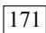
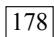
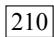
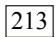
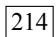
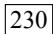
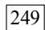
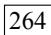

<!-- Source PDF pages 121-240 -->

## 输入

```sql
SELECT customers.cust_id, orders.order_num
FROM customers INNER JOIN orders
  ON customers.cust_id = orders.cust_id;
```

外部联结语法类似。为了检索所有客户，包括那些没有订单的客户，可如下进行：

## 输入

```sql
SELECT customers.cust_id, orders.order_num
FROM customers LEFT OUTER JOIN orders
ON customers.cust_id = orders.cust_id;
```

## 输出

<table><tr><td>+</td><td>cust_id</td><td>order_num</td><td>+</td></tr><tr><td>+</td><td colspan="2">----+----+</td><td>+</td></tr><tr><td>|</td><td>10001</td><td>20005</td><td>|</td></tr><tr><td>|</td><td>10001</td><td>20009</td><td>|</td></tr><tr><td>|</td><td>10002</td><td>NULL</td><td>|</td></tr><tr><td>|</td><td>10003</td><td>20006</td><td>|</td></tr><tr><td>|</td><td>10004</td><td>20007</td><td>|</td></tr><tr><td>|</td><td>10005</td><td>20008</td><td>|</td></tr><tr><td>+</td><td colspan="2">----+----+</td><td>+</td></tr></table>

分析 类似于上一章中所看到的内部联结，这条SELECT语句使用了关键字OUTER JOIN来指定联结的类型（而不是在WHERE子句中指定）。但是，与内部联结关联两个表中的行不同的是，外部联结还包括没有关联行的行。在使用OUTER JOIN语法时，必须使用RIGHT或LEFT关键字指定包括其所有行的表（RIGHT指出的是OUTER JOIN右边的表，而LEFT指出的是OUTER JOIN左边的表）。上面的例子使用LEFT OUTER JOIN从FROM子句的左边表（customers表）中选择所有行。为了从右边的表中选择所有行，应该使用RIGHT OUTER JOIN，如下例所示：

## 148

## 输入

```sql
SELECT customers.cust_id, orders.order_num
FROM customers RIGHT OUTER JOIN orders
ON orders.cust_id = customers.cust_id;
```


没有\*=操作符 MySQL不支持简化字符\*=和=\*的使用，这两种操作符在其他DBMS中是很流行的。


外部联结的类型 存在两种基本的外部联结形式：左外部联结和右外部联结。它们之间的唯一差别是所关联的表的顺序不同。换句话说，左外部联结可通过颠倒FROM或WHERE子句中

表的顺序转换为右外部联结。因此，两种类型的外部联结可互换使用，而究竟使用哪一种纯粹是根据方便而定。

## 16.3 使用带聚集函数的联结

正如第12章所述，聚集函数用来汇总数据。虽然至今为止聚集函数的所有例子只是从单个表汇总数据，但这些函数也可以与联结一起使用。

为说明这一点，请看一个例子。如果要检索所有客户及每个客户所下的订单数，下面使用了COUNT()函数的代码可完成此工作：

## 输入

```sql
SELECT customers.cust_name,
    customers.cust_id,
    COUNT(orders.order_num) AS num_ord
FROM customers INNER JOIN orders
ON customers.cust_id = orders.cust_id
GROUP BY customers.cust_id;
```

149

## 输出

<table><tr><td>cust_name</td><td>cust_id</td><td>num_ord</td></tr><tr><td colspan="3">+----+----+----+</td></tr><tr><td>Coyote Inc.</td><td>10001</td><td>2</td></tr><tr><td>Wascals</td><td>10003</td><td>1</td></tr><tr><td>Yosemite Place</td><td>10004</td><td>1</td></tr><tr><td>E Fudd</td><td>10005</td><td>1</td></tr><tr><td colspan="3">+----+----+----+</td></tr></table>

分析 此SELECT语句使用INNER JOIN将customers和orders表互相关联。GROUP BY子句按客户分组数据，因此，函数调用COUNT(orders.order\_num)对每个客户的订单计数，将它作为num\_ord返回。

聚集函数也可以方便地与其他联结一起使用。请看下面的例子：


```sql
SELECT customers.cust_name,
    customers.cust_id,
    COUNT(orders.order_num) AS num_ord
FROM customers LEFT OUTER JOIN orders
ON customers.cust_id = orders.cust_id
GROUP BY customers.cust_id;
```

## 输出

<table><tr><td>| cust_name</td><td>| cust_id</td><td>| num_ord</td></tr><tr><td>| Coyote Inc.</td><td>10001</td><td>2</td></tr><tr><td>| Mouse House</td><td>10002</td><td>0</td></tr></table>

150

图灵社区会员 臭豆腐(StinkBC@gmail.com) 专享 尊分析 这个例子使用左外部联结来包含所有客户，甚至包含那些没有任何下订单的客户。结果显示也包含了客户Mouse House，它有0个订单。

<table><tr><td>| Wascals</td><td>| 10003</td><td>| 1</td></tr><tr><td>| Yosemite Place</td><td>| 10004</td><td>| 1</td></tr><tr><td>| E Fudd</td><td>| 10005</td><td>| 1</td></tr></table>

## 16.4 使用联结和联结条件

在总结关于联结的这两章前，有必要汇总一下关于联结及其使用的某些要点。

 注意所使用的联结类型。一般我们使用内部联结，但使用外部联结也是有效的。

 保证使用正确的联结条件，否则将返回不正确的数据。

 应该总是提供联结条件，否则会得出笛卡儿积。

 在一个联结中可以包含多个表，甚至对于每个联结可以采用不同的联结类型。虽然这样做是合法的，一般也很有用，但应该在一起测试它们前，分别测试每个联结。这将使故障排除更为简单。

## 16.5 小结

本章是上一章关于联结的继续。本章从讲授如何以及为什么要使用别名开始，然后讨论不同的联结类型及对每种类型的联结使用的各种语法形式。我们还介绍了如何与联结一起使用聚集函数，以及在使用联结时应该注意的某些问题。


## 第 17 章

## 组 合 查 询

本章讲述如何利用UNION操作符将多条SELECT语句组合成一个结果集。

## 17.1 组合查询

多数SQL查询都只包含从一个或多个表中返回数据的单条SELECT语句。MySQL也允许执行多个查询（多条SELECT语句），并将结果作为单个查询结果集返回。这些组合查询通常称为并（union）或复合查询（compound query）。

有两种基本情况，其中需要使用组合查询：

 在单个查询中从不同的表返回类似结构的数据；

 对单个表执行多个查询，按单个查询返回数据。


组合查询和多个WHERE条件 多数情况下，组合相同表的两个查询完成的工作与具有多个WHERE子句条件的单条查询完成的工作相同。换句话说，任何具有多个WHERE子句的SELECT语句都可以作为一个组合查询给出，在以下段落中可以看到这一点。这两种技术在不同的查询中性能也不同。因此，应该试一下这两种技术，以确定对特定的查询哪一种性能更好。

153

## 17.2 创建组合查询

可用UNION操作符来组合数条SQL查询。利用UNION，可给出多条

SELECT语句，将它们的结果组合成单个结果集。

## 17.2.1 使用<sub>UNION</sub>

UNION的使用很简单。所需做的只是给出每条SELECT语句，在各条语句之间放上关键字UNION。

举一个例子，假如需要价格小于等于5的所有物品的一个列表，而且还想包括供应商1001和1002生产的所有物品（不考虑价格）。当然，可以利用WHERE子句来完成此工作，不过这次我们将使用UNION。

正如所述，创建UNION涉及编写多条SELECT语句。首先来看单条语句：

```sql
SELECT vend_id, prod_id, prod_price
FROM products
WHERE prod_price <= 5;
```

## 输出

<table><tr><td colspan="4">+----+----+----+</td></tr><tr><td colspan="4">| vend_id | prod_id | prod_price |</td></tr><tr><td colspan="4">+----+----+----+</td></tr><tr><td colspan="4">| 1003 | FC | 2.50 |</td></tr><tr><td colspan="4">| 1002 | FU1 | 3.42 |</td></tr><tr><td colspan="4">| 1003 | SLING | 4.49 |</td></tr><tr><td colspan="4">| 1003 | TNT1 | 2.50 |</td></tr></table>

## 输入

```sql
SELECT vend_id, prod_id, prod_price
FROM products
WHERE vend_id IN (1001,1002);
```

## 输出

<table><tr><td colspan="4">+----+----+----+</td></tr><tr><td colspan="4">| vend_id | prod_id | prod_price |</td></tr><tr><td colspan="4">+----+----+----+</td></tr><tr><td colspan="4">| 1001 | ANV01 | 5.99 |</td></tr><tr><td colspan="4">| 1001 | ANV02 | 9.99 |</td></tr><tr><td colspan="4">| 1001 | ANV03 | 14.99 |</td></tr><tr><td colspan="4">| 1002 | FU1 | 3.42 |</td></tr><tr><td colspan="4">| 1002 | OL1 | 8.99 |</td></tr><tr><td colspan="4">+----+----+----+</td></tr></table>

## 分析

第一条SELECT检索价格不高于5的所有物品。第二条SELECT使用IN找出供应商1001和1002生产的所有物品。

为了组合这两条语句，按如下进行：


```sql
SELECT vend_id, prod_id, prod_price
FROM products
WHERE prod_price <= 5
UNION
SELECT vend_id, prod_id, prod_price
FROM products
WHERE vend_id IN (1001,1002);
```

## 输出

```txt
+----------------+----------------+----------------+
| vend_id | prod_id | prod_price |
+----------------+----------------+----------------+
| 1003 | FC          | 2.50        |
| 1002 | FU1         | 3.42        |
| 1003 | SLING     | 4.49        |
| 1003 | TNT1       | 2.50        |
| 1001 | ANV01     | 5.99        |
| 1001 | ANV02     | 9.99        |
| 1001 | ANV03     | 14.99        |
| 1002 | OL1         | 8.99        |
+----------------+----------------+----------------+
```

分析 这条语句由前面的两条SELECT语句组成，语句中用UNION关键字分隔。UNION指示MySQL执行两条SELECT语句，并把输出组成单个查询结果集。

作为参考，这里给出使用多条WHERE子句而不是使用UNION的相同查询：

## 输入

```sql
SELECT vend_id, prod_id, prod_price
FROM products
WHERE prod_price <= 5
  OR vend_id IN (1001,1002);
```

在这个简单的例子中，使用UNION可能比使用WHERE子句更为复杂。但对于更复杂的过滤条件，或者从多个表（而不是单个表）中检索数据的情形，使用UNION可能会使处理更简单。

## 17.2.2 <sub>UNION</sub>规则

正如所见，并是非常容易使用的。但在进行并时有几条规则需要注意。

 UNION必须由两条或两条以上的SELECT语句组成，语句之间用关键字UNION分隔（因此，如果组合4条SELECT语句，将要使用3个UNION关键字）。

 UNION中的每个查询必须包含相同的列、表达式或聚集函数（不过

各个列不需要以相同的次序列出）。

156

 列数据类型必须兼容：类型不必完全相同，但必须是DBMS可以隐含地转换的类型（例如，不同的数值类型或不同的日期类型）。

如果遵守了这些基本规则或限制，则可以将并用于任何数据检索任务。

## 17.2.3 包含或取消重复的行

请返回到17.2.1节，考察一下所用的样例SELECT语句。我们注意到，在分别执行时，第一条SELECT语句返回4行，第二条SELECT语句返回5行。但在用UNION组合两条SELECT语句后，只返回了8行而不是9行。

UNION从查询结果集中自动去除了重复的行（换句话说，它的行为与单条SELECT语句中使用多个WHERE子句条件一样）。因为供应商1002生产的一种物品的价格也低于5，所以两条SELECT语句都返回该行。在使用UNION时，重复的行被自动取消。

这是UNION的默认行为，但是如果需要，可以改变它。事实上，如果想返回所有匹配行，可使用UNION ALL而不是UNION。

请看下面的例子：

## 输入

```sql
SELECT vend_id, prod_id, prod_price
FROM products
WHERE prod_price <= 5
UNION ALL
SELECT vend_id, prod_id, prod_price
FROM products
WHERE vend_id IN (1001,1002);
```

## 输出

<table><tr><td colspan="4">+----+----+----+</td></tr><tr><td colspan="4">| vend_id | prod_id | prod_price |</td></tr><tr><td colspan="4">+----+----+----+</td></tr><tr><td colspan="4">| 1003 | FC | 2.50 |</td></tr><tr><td colspan="4">| 1002 | FU1 | 3.42 |</td></tr><tr><td colspan="4">| 1003 | SLING | 4.49 |</td></tr><tr><td colspan="4">| 1003 | TNT1 | 2.50 |</td></tr><tr><td colspan="4">| 1001 | ANV01 | 5.99 |</td></tr><tr><td colspan="4">| 1001 | ANV02 | 9.99 |</td></tr><tr><td colspan="4">| 1001 | ANV03 | 14.99 |</td></tr><tr><td colspan="4">| 1002 | FU1 | 3.42 |</td></tr><tr><td colspan="4">| 1002 | OL1 | 8.99 |</td></tr><tr><td colspan="4">+----+----+----+</td></tr></table>

图灵社区会员 臭豆腐(StinkBC@gmail.com) 专享 尊

## 分析

使用UNION ALL，MySQL不取消重复的行。因此这里的例子返回9行，其中有一行出现两次。


```txt
UNION与WHERE 本章开始时说过，UNION几乎总是完成与多个WHERE条件相同的工作。UNION ALL为UNION的一种形式，它完成WHERE子句完成不了的工作。如果确实需要每个条件的匹配行全部出现（包括重复行），则必须使用UNION ALL而不是WHERE。
```

## 17.2.4 对组合查询结果排序

SELECT语句的输出用ORDER BY子句排序。在用UNION组合查询时，只能使用一条ORDER BY子句，它必须出现在最后一条SELECT语句之后。对于结果集，不存在用一种方式排序一部分，而又用另一种方式排序另一部分的情况，因此不允许使用多条ORDER BY子句。

下面的例子排序前面UNION返回的结果：

## 输入

```sql
SELECT vend_id, prod_id, prod_price
FROM products
WHERE prod_price <= 5
UNION
SELECT vend_id, prod_id, prod_price
FROM products
WHERE vend_id IN (1001,1002)
ORDER BY vend_id, prod_price;
```

158

## 输出

```txt
+----------------+----------------+----------------+
| vend_id | prod_id | prod_price |
+----------------+----------------+----------------+
| 1001 | ANV01 | 5.99 |
| 1001 | ANV02 | 9.99 |
| 1001 | ANV03 | 14.99 |
| 1002 | FU1 | 3.42 |
| 1002 | OL1 | 8.99 |
| 1003 | TNT1 | 2.50 |
| 1003 | FC | 2.50 |
| 1003 | SLING | 4.49 |
+----------------+----------------+----------------+
```

分析 这条UNION在最后一条SELECT语句后使用了ORDER BY子句。虽然ORDER BY子句似乎只是最后一条SELECT语句的组成部分，但实际上MySQL将用它来排序所有SELECT语句返回的所有结果。

图灵社区会员 臭豆腐(StinkBC@gmail.com) 专享 尊组合不同的表 为使表述比较简单，本章例子中的组合查询使用的均是相同的表。但是其中使用UNION的组合查询可以应用不同的表。


## 17.3 小结

本章讲授如何用UNION操作符来组合SELECT语句。利用UNION，可把多条查询的结果作为一条组合查询返回，不管它们的结果中包含还是不包含重复。使用UNION可极大地简化复杂的WHERE子句，简化从多个表中检索数据的工作。


## 全文本搜索

本章将学习如何使用MySQL的全文本搜索功能进行高级的数据查询和选择。

## 18.1 理解全文本搜索


并非所有引擎都支持全文本搜索 正如第21章所述，MySQL支持几种基本的数据库引擎。并非所有的引擎都支持本书所描述的全文本搜索。两个最常使用的引擎为MyISAM和InnoDB，前者支持全文本搜索，而后者不支持。这就是为什么虽然本书中创建的多数样例表使用InnoDB，而有一个样例表（productnotes表）却使用MyISAM的原因。如果你的应用中需要全文本搜索功能，应该记住这一点。

第8章介绍了LIKE关键字，它利用通配操作符匹配文本（和部分文本）。使用LIKE，能够查找包含特殊值或部分值的行（不管这些值位于列内什么位置）。

在第9章中，用基于文本的搜索作为正则表达式匹配列值的更进一步的介绍。使用正则表达式，可以编写查找所需行的非常复杂的匹配模式。

虽然这些搜索机制非常有用，但存在几个重要的限制。

## 第 18 章

 性能——通配符和正则表达式匹配通常要求MySQL尝试匹配表中所有行（而且这些搜索极少使用表索引）。因此，由于被搜索行数不断增加，这些搜索可能非常耗时。

 明确控制——使用通配符和正则表达式匹配，很难（而且并不总是能）明确地控制匹配什么和不匹配什么。例如，指定一个词必须匹配，一个词必须不匹配，而一个词仅在第一个词确实匹配的情况下才可以匹配或者才可以不匹配。

 智能化的结果——虽然基于通配符和正则表达式的搜索提供了非常灵活的搜索，但它们都不能提供一种智能化的选择结果的方法。例如，一个特殊词的搜索将会返回包含该词的所有行，而不区分包含单个匹配的行和包含多个匹配的行（按照可能是更好的匹配来排列它们）。类似，一个特殊词的搜索将不会找出不包含该词但包含其他相关词的行。

所有这些限制以及更多的限制都可以用全文本搜索来解决。在使用全文本搜索时，MySQL不需要分别查看每个行，不需要分别分析和处理每个词。MySQL创建指定列中各词的一个索引，搜索可以针对这些词进行。这样，MySQL可以快速有效地决定哪些词匹配（哪些行包含它们），哪些词不匹配，它们匹配的频率，等等。

## 18.2 使用全文本搜索

为了进行全文本搜索，必须索引被搜索的列，而且要随着数据的改变不断地重新索引。在对表列进行适当设计后，MySQL会自动进行所有的索引和重新索引。

在索引之后，SELECT可与Match()和Against()一起使用以实际执行搜索。

## 18.2.1 启用全文本搜索支持

一般在创建表时启用全文本搜索。CREATE TABLE语句（第21章中介绍）接受FULLTEXT子句，它给出被索引列的一个逗号分隔的列表。

下面的CREATE语句演示了FULLTEXT子句的使用：

## 输入

```sql
CREATE TABLE productnotes
(
    note_id   int          NOT NULL AUTO_INCREMENT,
    prod_id   char(10)      NOT NULL,
    note_date datetime       NOT NULL,
    note_text  text           NULL ,
    PRIMARY KEY(note_id),
    FULLTEXT(note_text)
) ENGINE=MyISAM;
```

第21章将详细考察CREATE TABLE语句。现在，只需知道这条分析CREATE TABLE语句定义表productnotes并列出它所包含的列即可。这些列中有一个名为note\_text的列，为了进行全文本搜索，MySQL根据子句FULLTEXT(note\_text)的指示对它进行索引。这里的FULLTEXT索引单个列，如果需要也可以指定多个列。

在定义之后，MySQL自动维护该索引。在增加、更新或删除行时，索引随之自动更新。

可以在创建表时指定FULLTEXT，或者在稍后指定（在这种情况下所有已有数据必须立即索引）。


不要在导入数据时使用FULLTEXT 更新索引要花时间，虽然不是很多，但毕竟要花时间。如果正在导入数据到一个新表，此时不应该启用FULLTEXT索引。应该首先导入所有数据，然后再修改表，定义FULLTEXT。这样有助于更快地导入数据（而且使索引数据的总时间小于在导入每行时分别进行索引所需的总时间）。

## 18.2.2 进行全文本搜索

在索引之后，使用两个函数Match()和Against()执行全文本搜索，其中Match()指定被搜索的列，Against()指定要使用的搜索表达式。

下面举一个例子：


```sql
SELECT note_text
FROM productnotes
WHERE Match(note_text) Against('rabbit');
```

## 输出

```txt
+------------------------------------------------------------------+
| note_text
+------------------------------------------------------------------+
| Customer complaint: rabbit has been able to detect trap, food
| apparently less effective now.
| Quantity varies, sold by the sack load. All guaranteed to be
| bright and orange, and suitable for use as rabbit bait.
```

164

分析 此SELECT语句检索单个列note\_text。由于WHERE子句，一个全文本搜索被执行。Match(note\_text)指示MySQL针对指定的列进行搜索，Against('rabbit')指定词rabbit作为搜索文本。由于有两行包含词rabbit，这两个行被返回。


使用完整的Match()说明 传递给Match()的值必须与FULLTEXT()定义中的相同。如果指定多个列，则必须列出它们（而且次序正确）。


搜索不区分大小写 除非使用BINARY方式（本章中没有介绍），否则全文本搜索不区分大小写。

事实是刚才的搜索可以简单地用LIKE子句完成，如下所示：

## 输入

## 输出

```sql
SELECT note_text
FROM productnotes
WHERE note_text LIKE '%rabbit%';
+-----------------------------------------------------------------------
| note_text
+-----------------------------------------------------------------------
| Quantity varies, sold by the sack load. All guaranteed to be
| bright and orange, and suitable for use as rabbit bait.
| Customer complaint: rabbit has been able to detect trap, food
| apparently less effective now.
```


## 分析

这条SELECT语句同样检索出两行，但次序不同（虽然并不总是出现这种情况）。

上述两条SELECT语句都不包含ORDER BY子句。后者（使用LIKE）以不特别有用的顺序返回数据。前者（使用全文本搜索）返回以文本匹配的良好程度排序的数据。两个行都包含词rabbit，但包含词rabbit作为第3个词的行的等级比作为第20个词的行高。这很重要。全文本搜索的一个重要部分就是对结果排序。具有较高等级的行先返回（因为这些行很可能是你真正想要的行）。

为演示排序如何工作，请看以下例子：

## 输入

SELECT note\_text, Match(note\_text) Against('rabbit') AS rank FROM productnotes;

## 输出

<table><tr><td colspan="2">+----+</td></tr><tr><td>| note_text</td><td>| rank</td></tr><tr><td colspan="2">+----+</td></tr><tr><td>| Customer complaint: Sticks not individually</td><td>0</td></tr><tr><td>| wrapped, too easy to mistakenly detonate all</td><td></td></tr><tr><td>| at once. Recommend individual wrapping.</td><td></td></tr><tr><td>| Can shipped full, refills not available. Need</td><td>0</td></tr><tr><td>| to order new can if refill needed.</td><td></td></tr><tr><td>| Safe is combination locked, combination not</td><td>0</td></tr><tr><td>| provided with safe. This is rarely a problem</td><td></td></tr><tr><td>| as safes are typically blown up or dropped by</td><td></td></tr><tr><td>| customers.</td><td></td></tr><tr><td>| Quantity varies, sold by the sack load. All</td><td>1.5905543170914</td></tr><tr><td>| guaranteed to be bright and orange, and</td><td></td></tr><tr><td>| suitable for as rabbit bait.</td><td></td></tr><tr><td>| Included fuses are short and have been known to</td><td>0</td></tr><tr><td>| detonate too quickly for some customers. Longer</td><td></td></tr><tr><td>| fuses are available (item FU1) and should be</td><td></td></tr><tr><td>| recommended.</td><td></td></tr><tr><td>| Matches not included, recommend purchase of</td><td>0</td></tr><tr><td>| matches or detonator (item DTNTR).</td><td></td></tr><tr><td>| Please note that no returns will be accepted if</td><td>0</td></tr><tr><td>| safe opened using explosives.</td><td></td></tr><tr><td>| Multiple customer returns, anvils failing to</td><td>0</td></tr><tr><td>| drop fast enough or falling backwards on</td><td></td></tr><tr><td>| purchaser. Recommend that customer considers</td><td></td></tr><tr><td>| using heavier anvils.</td><td></td></tr><tr><td>| Item is extremely heavy. Designed for dropping,</td><td>0</td></tr><tr><td>| not recommended for use with slings, ropes,</td><td></td></tr><tr><td>| pulleys, or tightropes.</td><td></td></tr><tr><td>| Customer complaint: rabbit has been able to</td><td>1.6408053837485</td></tr><tr><td>| detect trap, food apparently less effective</td><td></td></tr></table>

```txt
| now.
| Shipped unassembled, requires common tools | 0 |
| (including oversized hammer).
| Customer complaint: Circular hole in safe floor | 0 |
| can apparently be easily cut with handsaw.
| Customer complaint: Not heavy enough to | 0 |
| generate flying stars around head of victim.
| If being purchased for dropping, recommend | |
| ANVO2 or ANVO3 instead.
| Call from individual trapped in safe plummeting | 0 |
| to the ground, suggests an escape hatch be | |
| added. Comment forwarded to vendor. |
```

这里，在SELECT而不是WHERE子句中使用Match()和Against()。这分析使所有行都被返回（因为没有WHERE子句）。Match()和Against()用来建立一个计算列（别名为rank），此列包含全文本搜索计算出的等级值。等级由MySQL根据行中词的数目、唯一词的数目、整个索引中词的总数以及包含该词的行的数目计算出来。正如所见，不包含词rabbit的行等级为0（因此不被前一例子中的WHERE子句选择）。确实包含词rabbit的两个行每行都有一个等级值，文本中词靠前的行的等级值比词靠后的行的等级值高。

这个例子有助于说明全文本搜索如何排除行（排除那些等级为0的行），如何排序结果（按等级以降序排序）。


排序多个搜索项 如果指定多个搜索项，则包含多数匹配词的那些行将具有比包含较少词（或仅有一个匹配）的那些行高的等级值。

正如所见，全文本搜索提供了简单LIKE搜索不能提供的功能。而且，由于数据是索引的，全文本搜索还相当快。

## 18.2.3 使用查询扩展

查询扩展用来设法放宽所返回的全文本搜索结果的范围。考虑下面的情况。你想找出所有提到anvils的注释。只有一个注释包含词anvils，但你还想找出可能与你的搜索有关的所有其他行，即使它们不包含词

anvils。

这也是查询扩展的一项任务。在使用查询扩展时，MySQL对数据和索引进行两遍扫描来完成搜索：

 首先，进行一个基本的全文本搜索，找出与搜索条件匹配的所有行；

 其次，MySQL检查这些匹配行并选择所有有用的词（我们将会简要地解释MySQL如何断定什么有用，什么无用）。

 再其次，MySQL再次进行全文本搜索，这次不仅使用原来的条件，而且还使用所有有用的词。

利用查询扩展，能找出可能相关的结果，即使它们并不精确包含所查找的词。

168


只用于MySQL版本4.1.1或更高级的版本 查询扩展功能是在MySQL 4.1.1中引入的，因此不能用于之前的版本。

下面举一个例子，首先进行一个简单的全文本搜索，没有查询扩展：

## 输入

```sql
SELECT note_text
FROM productnotes
WHERE Match(note_text) Against('anvils');
```

## 输出

```txt
note_text
```

Multiple customer returns, anvils failing to drop fast enough or falling backwards on purchaser. Recommend that customer considers using heavier anvils.

## 分析

只有一行包含词anvils，因此只返回一行。

下面是相同的搜索，这次使用查询扩展：


```sql
SELECT note_text
FROM productnotes
WHERE Match(note_text) Against('anvils' WITH QUERY EXPANSION);
```

## 输出

```txt
+------------------------------------------------------------------+
| note_text |  
+------------------------------------------------------------------+
| Multiple customer returns, anvils failing to drop fast enough or falling backwards on purchaser. Recommend that customer considers using heavier anvils. |  
| Customer complaint: Sticks not individually wrapped, too easy to mistakenly detonate all at once. Recommend individual wrapping. |  
| Customer complaint: Not heavy enough to generate flying stars around headof victim. If being purchased for dropping, recommend ANVO2 or ANVO3 instead. |  
| Please note that no returns will be accepted if safe opened using explosives. |  
| Customer complaint: rabbit has been able to detect trap, food apparently less effective now. |  
| Customer complaint: Circular hole in safe floor can apparently be easily cut with handsaw. |  
| Matches not included, recommend purchase of matches or detonator (item DTNTR). |  
+------------------------------------------------------------------+
```

分析 这次返回了7行。第一行包含词anvils，因此等级最高。第二行与anvils无关，但因为它包含第一行中的两个词（customer和recommend），所以也被检索出来。第3行也包含这两个相同的词，但它们在文本中的位置更靠后且分开得更远，因此也包含这一行，但等级为第三。第三行确实也没有涉及anvils（按它们的产品名）。

正如所见，查询扩展极大地增加了返回的行数，但这样做也增加了你实际上并不想要的行的数目。


行越多越好 表中的行越多（这些行中的文本就越多），使用查询扩展返回的结果越好。

## 18.2.4 布尔文本搜索

MySQL支持全文本搜索的另外一种形式，称为布尔方式（booleanmode）。以布尔方式，可以提供关于如下内容的细节：



 要匹配的词；

 要排斥的词（如果某行包含这个词，则不返回该行，即使它包含其他指定的词也是如此）；

 排列提示（指定某些词比其他词更重要，更重要的词等级更高）；

 表达式分组；

 另外一些内容。


即使没有FULLTEXT索引也可以使用 布尔方式不同于迄今为止使用的全文本搜索语法的地方在于，即使没有定义FULLTEXT索引，也可以使用它。但这是一种非常缓慢的操作（其性能将随着数据量的增加而降低）。

为演示IN BOOLEAN MODE的作用，举一个简单的例子：

## 输入

```sql
SELECT note_text
FROM productnotes
WHERE Match(note_text) Against('heavy' IN BOOLEAN MODE);
```

## 输出

```txt
| note_text
```

```txt
Item is extremely heavy. Designed for dropping, not recommended for use with slings, ropes, pulleys, or tightropes.  
Customer complaint: Not heavy enough to generate flying stars around head of victim. If being purchased for dropping, recommend ANV02 or ANV03 instead.
```

此全文本搜索检索包含词heavy的所有行（有两行）。其中使用分析了关键字IN BOOLEAN MODE，但实际上没有指定布尔操作符，因此，其结果与没有指定布尔方式的结果相同。


IN BOOLEAN MODE的行为差异 虽然这个例子的结果与没有IN BOOLEAN MODE的相同，但其行为有一个重要的差别（即使在这个特殊的例子没有表现出来）。我们将在18.2.5节指出。

为了匹配包含heavy但不包含任意以rope开始的词的行，可使用以下查询：

## 输入

```sql
SELECT note_text
FROM productnotes
WHERE Match(note_text) Against('heavy -rope*' IN BOOLEAN MODE);
```

## 输出

```txt
+------------------------------------------------------------------+
| note_text                                                                 |
+------------------------------------------------------------------+
| Customer complaint: Not heavy enough to generate flying stars
| around head of victim. If being purchased for dropping, recommend |
| ANV02 or ANV03 instead.
```

分析 这次只返回一行。这一次仍然匹配词heavy，但-rope\*明确地指示MySQL排除包含rope\*（任何以rope开始的词，包括ropes）的行，这就是为什么上一个例子中的第一行被排除的原因。


在MySQL 4.x中所需的代码更改 如果你使用的是MySQL4.x，则上面的例子可能不返回任何行。这是\*操作符处理中的一个错误。为在MySQL 4.x中使用这个例子，使用-ropes而不是-rope\*（排除ropes而不是排除任何以rope开始的词）。

我们已经看到了两个全文本搜索布尔操作符-和\*，-排除一个词，而\*是截断操作符（可想象为用于词尾的一个通配符）。表18-1列出支持的所有布尔操作符。

表18-1 全文本布尔操作符

<table><tr><td>布尔操作符</td><td>说明</td></tr><tr><td>+</td><td>包含,词必须存在</td></tr><tr><td>-</td><td>排除,词必须不出现</td></tr><tr><td>&gt;</td><td>包含,而且增加等级值</td></tr><tr><td>&lt;</td><td>包含,且减少等级值</td></tr><tr><td>()</td><td>把词组成子表达式(允许这些子表达式作为一个组被包含、排除、排列等)</td></tr><tr><td>~</td><td>取消一个词的排序值</td></tr><tr><td>*</td><td>词尾的通配符</td></tr><tr><td>&quot;&quot;</td><td>定义一个短语(与单个词的列表不一样,它匹配整个短语以便包含或排除这个短语)</td></tr></table>

图灵社区会员 臭豆腐(StinkBC@gmail.com) 专享 尊


下面举几个例子，说明某些操作符如何使用：

输入

```sql
SELECT note_text
FROM productnotes
WHERE Match(note_text) Against('+rabbit +bait' IN BOOLEAN MODE); 173
```

分析

这个搜索匹配包含词rabbit和bait的行。

输入

```sql
SELECT note_text
FROM productnotes
WHERE Match(note_text) Against('rabbit bait' IN BOOLEAN MODE);
```

分析

没有指定操作符，这个搜索匹配包含rabbit和bait中的至少一个词的行。

输入

```sql
SELECT note_text
FROM productnotes
WHERE Match(note_text) Against(\"rabbit bait"' IN BOOLEAN MODE);
```

分析

这个搜索匹配短语rabbit bait而不是匹配两个词rabbit和bait。

输入

```sql
SELECT note_text
FROM productnotes
WHERE Match(note_text) Against('>rabbit <carrot' IN BOOLEAN MODE);
```

分析

匹配rabbit和carrot，增加前者的等级，降低后者的等级。

输入

SELECT note\_text FROM productnotes WHERE Match(note\_text) Against('+safe +(<combination)' IN BOOLEAN MODE) ;

174

分析

这个搜索匹配词safe和combination，降低后者的等级。


排列而不排序 在布尔方式中，不按等级值降序排序返回的行。

## 18.2.5 全文本搜索的使用说明

在结束本章之前，给出关于全文本搜索的某些重要的说明。


 在索引全文本数据时，短词被忽略且从索引中排除。短词定义为那些具有3个或3个以下字符的词（如果需要，这个数目可以更改）。 MySQL带有一个内建的非用词（stopword）列表，这些词在索引全文本数据时总是被忽略。如果需要，可以覆盖这个列表（请参阅MySQL文档以了解如何完成此工作）。


 许多词出现的频率很高，搜索它们没有用处（返回太多的结果）。因此，MySQL规定了一条50%规则，如果一个词出现在50%以上的行中，则将它作为一个非用词忽略。50%规则不用于IN BOOLEANMODE。

 如果表中的行数少于3行，则全文本搜索不返回结果（因为每个词或者不出现，或者至少出现在50%的行中）。

 忽略词中的单引号。例如，don't索引为dont。

175

 不具有词分隔符（包括日语和汉语）的语言不能恰当地返回全文本搜索结果。

 如前所述，仅在MyISAM数据库引擎中支持全文本搜索。

没有邻近操作符 邻近搜索是许多全文本搜索支持的一个特性，它能搜索相邻的词（在相同的句子中、相同的段落中或者在特定数目的词的部分中，等等）。MySQL全文本搜索现在还不支持邻近操作符，不过未来的版本有支持这种操作符的计划。

## 18.3 小结

本章介绍了为什么要使用全文本搜索，以及如何使用MySQL的Match()和Against()函数进行全文本搜索。我们还学习了查询扩展（它能增加找到相关匹配的机会）和如何使用布尔方式进行更细致的查找控制。


## 第 19 章

## 插 入 数 据

本章介绍如何利用SQL的INSERT语句将数据插入表中。

## 19.1 数据插入

毫无疑问，SELECT是最常使用的SQL语句了（这就是为什么前17章讲的都是它的原因）。但是，还有其他3个经常使用的SQL语句需要学习。第一个就是INSERT（下一章介绍另外两个）。

顾名思义，INSERT是用来插入（或添加）行到数据库表的。插入可以用几种方式使用：

 插入完整的行；

 插入行的一部分；

 插入多行；

 插入某些查询的结果。

下面将介绍这些内容。


插入及系统安全 可针对每个表或每个用户，利用MySQL的安全机制禁止使用INSERT语句，这将在第28章介绍。

## 19.2 插入完整的行

把数据插入表中的最简单的方法是使用基本的INSERT语法，它要求 177

指定表名和被插入到新行中的值。下面举一个例子：

## 输入

```sql
INSERT INTO Customers
VALUES(NULL,
    'Pep E. LaPew',
    '100 Main Street',
    'Los Angeles',
    'CA',
    '90046',
    'USA',
    NULL,
    NULL);
```


没有输出 INSERT语句一般不会产生输出。

分析 此例子插入一个新客户到customers表。存储到每个表列中的数据在VALUES子句中给出，对每个列必须提供一个值。如果某个列没有值（如上面的cust\_contact和cust\_email列），应该使用NULL值（假定表允许对该列指定空值）。各个列必须以它们在表定义中出现的次序填充。第一列cust\_id也为NULL。这是因为每次插入一个新行时，该列由MySQL自动增量。你不想给出一个值（这是MySQL的工作），又不能省略此列（如前所述，必须给出每个列），所以指定一个NULL值（它被MySQL忽略，MySQL在这里插入下一个可用的cust\_id值）。



虽然这种语法很简单，但并不安全，应该尽量避免使用。上面的SQL178 语句高度依赖于表中列的定义次序，并且还依赖于其次序容易获得的信息。即使可得到这种次序信息，也不能保证下一次表结构变动后各个列保持完全相同的次序。因此，编写依赖于特定列次序的SQL语句是很不安全的。如果这样做，有时难免会出问题。

编写INSERT语句的更安全（不过更烦琐）的方法如下：


```sql
INSERT INTO customers(cust_name,
    cust_address,
    cust_city,
    cust_state,
    cust_zip,
    cust_country,
```

```txt
cust_contact,
cust_email)
VALUES('Pep E. LaPew',
'100 Main Street',
'Los Angeles',
'CA',
'90046',
'USA',
NULL,
NULL);
```

## 分析

此例子完成与前一个INSERT语句完全相同的工作，但在表名后的括号里明确地给出了列名。在插入行时，MySQL将用VALUES

列表中的相应值填入列表中的对应项。VALUES中的第一个值对应于第一个指定的列名。第二个值对应于第二个列名，如此等等。

因为提供了列名，VALUES必须以其指定的次序匹配指定的列名，不一定按各个列出现在实际表中的次序。其优点是，即使表的结构改变，此INSERT语句仍然能正确工作。你会发现cust\_id的NULL值是不必要的，cust\_id列并没有出现在列表中，所以不需要任何值。

179

下面的INSERT语句填充所有列（与前面的一样），但以一种不同的次序填充。因为给出了列名，所以插入结果仍然正确：

## 输入

```sql
INSERT INTO customers(cust_name,
    cust_contact,
    cust_email,
    cust_address,
    cust_city,
    cust_state,
    cust_zip,
    cust_country)
VALUES('Pep E. LaPew',
    NULL,
    NULL,
    '100 Main Street',
    'Los Angeles',
    'CA',
    '90046',
    'USA');
```


总是使用列的列表 一般不要使用没有明确给出列的列表的INSERT语句。使用列的列表能使SQL代码继续发挥作用，即使表结构发生了变化。


仔细地给出值 不管使用哪种INSERT语法，都必须给出VALUES的正确数目。如果不提供列名，则必须给每个表列提供一个值。如果提供列名，则必须对每个列出的列给出一个值。如果不这样，将产生一条错误消息，相应的行插入不成功。

使用这种语法，还可以省略列。这表示可以只给某些列提供值，给180 其他列不提供值。（事实上你已经看到过这样的例子：当列名被明确列出时，cust\_id可以省略。）


省略列 如果表的定义允许，则可以在INSERT操作中省略某些列。省略的列必须满足以下某个条件。

 该列定义为允许NULL值（无值或空值）。

 在表定义中给出默认值。这表示如果不给出值，将使用默认值。

如果对表中不允许NULL值且没有默认值的列不给出值，则MySQL将产生一条错误消息，并且相应的行插入不成功。


提高整体性能 数据库经常被多个客户访问，对处理什么请求以及用什么次序处理进行管理是MySQL的任务。INSERT操作可能很耗时（特别是有很多索引需要更新时），而且它可能降低等待处理的SELECT语句的性能。

如果数据检索是最重要的（通常是这样），则你可以通过在INSERT和INTO之间添加关键字LOW\_PRIORITY，指示MySQL降低INSERT语句的优先级，如下所示：

INSERT LOW\_PRIORITY INTO

顺便说一下，这也适用于下一章介绍的UPDATE和DELETE语句。

## 19.3 插入多个行

INSERT可以插入一行到一个表中。但如果你想插入多个行怎么办？

可以使用多条INSERT语句，甚至一次提交它们，每条语句用一个分号结束，如下所示：

181

## 输入

```sql
INSERT INTO customers(cust_name,
    cust_address,
    cust_city,
    cust_state,
    cust_zip,
    cust_country)
VALUES('Pep E. LaPew',
    '100 Main Street',
    'Los Angeles',
    'CA',
    '90046',
    'USA');
INSERT INTO customers(cust_name,
    cust_address,
    cust_city,
    cust_state,
    cust_zip,
    cust_country)
VALUES('M. Martian',
    '42 Galaxy Way',
    'New York',
    'NY',
    '11213',
    'USA');
```

或者，只要每条INSERT语句中的列名（和次序）相同，可以如下组合各语句：

## 输入

```sql
INSERT INTO customers(cust_name,
    cust_address,
    cust_city,
    cust_state,
    cust_zip,
    cust_country)
VALUES(
        'Pep E. LaPew',
        '100 Main Street',
        'Los Angeles',
        'CA',
        '90046',
        'USA'
    ),
```

```python
(
    'M. Martian',
    '42 Galaxy Way',
    'New York',
    'NY',
    '11213',
    'USA'
```

## 分析

其中单条INSERT语句有多组值，每组值用一对圆括号括起来，用逗号分隔。


提高INSERT的性能 此技术可以提高数据库处理的性能，因为MySQL用单条INSERT语句处理多个插入比使用多条INSERT语句快。

## 19.4 插入检索出的数据

INSERT一般用来给表插入一个指定列值的行。但是，INSERT还存在另一种形式，可以利用它将一条SELECT语句的结果插入表中。这就是所谓的INSERT SELECT，顾名思义，它是由一条INSERT语句和一条SELECT语句组成的。

假如你想从另一表中合并客户列表到你的customers表。不需要每次读取一行，然后再将它用INSERT插入，可以如下进行：


新例子的说明 这个例子把一个名为custnew的表中的数据导入customers表中。为了试验这个例子，应该首先创建和填充custnew表。custnew表的结构与附录B中描述的customers表的相同。在填充custnew时，不应该使用已经在customers中使用过的cust\_id值（如果主键值重复，后续的INSERT操作将会失败）或仅省略这列值让MySQL在导入数据的过程中产生新值。

## 输入

```sql
INSERT INTO customers(cust_id,
    cust_contact,
    cust_email,
    cust_name,
```

```sql
cust_address,
    cust_city,
    cust_state,
    cust_zip,
    cust_country)
SELECT cust_id,
    cust_contact,
    cust_email,
    cust_name,
    cust_address,
    cust_city,
    cust_state,
    cust_zip,
    cust_country
FROM custnew;
```

分析 这个例子使用INSERT SELECT从custnew中将所有数据导入customers。SELECT语句从custnew检索出要插入的值，而不是列出它们。SELECT中列出的每个列对应于customers表名后所跟的列表中的每个列。这条语句将插入多少行有赖于custnew表中有多少行。如果这个表为空，则没有行被插入（也不产生错误，因为操作仍然是合法的）。如果这个表确实含有数据，则所有数据将被插入到customers。

这个例子导入了cust\_id（假设你能够确保cust\_id的值不重复）。你也可以简单地省略这列（从INSERT和SELECT中），这样MySQL就会生成新值。

184


INSERT SELECT中的列名 为简单起见，这个例子在INSERT和SELECT语句中使用了相同的列名。但是，不一定要求列名匹配。事实上，MySQL甚至不关心SELECT返回的列名。它使用的是列的位置，因此SELECT中的第一列（不管其列名）将用来填充表列中指定的第一个列，第二列将用来填充表列中指定的第二个列，如此等等。这对于从使用不同列名的表中导入数据是非常有用的。

INSERT SELECT中SELECT语句可包含WHERE子句以过滤插入的数据。


更多例子 如果想看INSERT用法的更多例子，请参阅附录B中给出的样例表填充脚本，这主要用于创建本书中使用的样例表。

## 19.5 小结

本章介绍如何将行插入到数据库表。我们学习了使用INSERT的几种方法，以及为什么要明确使用列名，学习了如何用INSERT SELECT从其他表中导入行。下一章讲述如何使用UPDATE和DELETE进一步操纵表数据。

185


## 更新和删除数据

本章介绍如何利用UPDATE和DELETE语句进一步操纵表数据。

## 20.1 更新数据

为了更新（修改）表中的数据，可使用UPDATE语句。可采用两种方式使用UPDATE：

 更新表中特定行；

 更新表中所有行。

下面分别对它们进行介绍。


不要省略WHERE子句 在使用UPDATE时一定要注意细心。因为稍不注意，就会更新表中所有行。在使用这条语句前，请完整地阅读本节。


UPDATE与安全 可以限制和控制UPDATE语句的使用，更多内容请参见第28章。

UPDATE语句非常容易使用，甚至可以说是太容易使用了。基本的UPDATE语句由3部分组成，分别是：

 要更新的表；

 列名和它们的新值；

187

 确定要更新行的过滤条件。

举一个简单例子。客户10005现在有了电子邮件地址，因此他的记录需要更新，语句如下：

## 输入

```sql
UPDATE customers
SET cust_email = 'elmer@fudd.com'
WHERE cust_id = 10005;
```

UPDATE语句总是以要更新的表的名字开始。在此例子中，要更新的表的名字为customers。SET命令用来将新值赋给被更新的列。如这里所示，SET子句设置cust\_email列为指定的值：

```python
SET cust_email = 'elmer@fudd.com'
```

UPDATE语句以WHERE子句结束，它告诉MySQL更新哪一行。没有WHERE子句，MySQL将会用这个电子邮件地址更新customers表中所有行，这不是我们所希望的。

更新多个列的语法稍有不同：

## 输入

```sql
UPDATE customers
SET cust_name = 'The Fudds',
    cust_email = 'elmer@fudd.com'
WHERE cust_id = 10005;
```

在更新多个列时，只需要使用单个SET命令，每个“列=值”对之间用逗号分隔（最后一列之后不用逗号）。在此例子中，更新客户10005的cust\_name和cust\_email列。


188

在UPDATE语句中使用子查询 UPDATE语句中可以使用子查询，使得能用SELECT语句检索出的数据更新列数据。关于子查询及使用的更多内容，请参阅第14章。


IGNORE关键字 如果用UPDATE语句更新多行，并且在更新这些行中的一行或多行时出一个现错误，则整个UPDATE操作被取消（错误发生前更新的所有行被恢复到它们原来的值）。为即使是发生错误，也继续进行更新，可使用IGNORE关键字，如下所示：UPDATE IGNORE customers…

图灵社区会员 臭豆腐(StinkBC@gmail.com) 专享 尊

为了删除某个列的值，可设置它为NULL（假如表定义允许NULL值）。如下进行：

```sql
输入 UPDATE customers
SET cust_email = NULL
WHERE cust_id = 10005;
```

其中NULL用来去除cust\_email列中的值。

## 20.2 删除数据

为了从一个表中删除（去掉）数据，使用DELETE语句。可以两种方式使用DELETE：

 从表中删除特定的行；

 从表中删除所有行。

下面分别对它们进行介绍。


不要省略WHERE子句 在使用DELETE时一定要注意细心。因为稍不注意，就会错误地删除表中所有行。在使用这条语句前，请完整地阅读本节。


DELETE与安全 可以限制和控制DELETE语句的使用，更多内容请参见第28章。

189

前面说过，UPDATE非常容易使用，而DELETE更容易使用。

下面的语句从customers表中删除一行：

## 输入

```sql
DELETE FROM customers
WHERE cust_id = 10006;
```

这条语句很容易理解。DELETE FROM要求指定从中删除数据的表名。WHERE子句过滤要删除的行。在这个例子中，只删除客户10006。如果省略WHERE子句，它将删除表中每个客户。

DELETE不需要列名或通配符。DELETE删除整行而不是删除列。为了删除指定的列，请使用UPDATE语句。


删除表的内容而不是表 DELETE语句从表中删除行，甚至是删除表中所有行。但是，DELETE不删除表本身。


更快的删除 如果想从表中删除所有行，不要使用DELETE。可使用TRUNCATE TABLE语句，它完成相同的工作，但速度更快（TRUNCATE实际是删除原来的表并重新创建一个表，而不是逐行删除表中的数据）。

## 20.3 更新和删除的指导原则

前一节中使用的UPDATE和DELETE语句全都具有WHERE子句，这样做的理由很充分。如果省略了WHERE子句，则UPDATE或DELETE将被应用到表中所有的行。换句话说，如果执行UPDATE而不带WHERE子句，则表中每个行都将用新值更新。类似地，如果执行DELETE语句而不带WHERE子句，表的所有数据都将被删除。

下面是许多SQL程序员使用UPDATE或DELETE时所遵循的习惯。

 除非确实打算更新和删除每一行，否则绝对不要使用不带WHERE子句的UPDATE或DELETE语句。

 保证每个表都有主键（如果忘记这个内容，请参阅第15章），尽可能像WHERE子句那样使用它（可以指定各主键、多个值或值的范围）。

 在对UPDATE或DELETE语句使用WHERE子句前，应该先用SELECT进行测试，保证它过滤的是正确的记录，以防编写的WHERE子句不正确。

 使用强制实施引用完整性的数据库（关于这个内容，请参阅第15章），这样MySQL将不允许删除具有与其他表相关联的数据的行。


小心使用 MySQL没有撤销（undo）按钮。应该非常小心地使用UPDATE和DELETE，否则你会发现自己更新或删除了错误的数据。

## 20.4 小结

我们在本章中学习了如何使用UPDATE和DELETE语句处理表中的数据。我们学习了这些语句的语法，知道了它们固有的危险性。本章中还讲解了为什么WHERE子句对UPDATE和DELETE语句很重要，并且给出了应该遵循的一些指导原则，以保证数据的安全。

## 第 21 章

## 创建和操纵表


本章讲授表的创建、更改和删除的基本知识。

## 21.1 创建表

MySQL不仅用于表数据操纵，而且还可以用来执行数据库和表的所有操作，包括表本身的创建和处理。

一般有两种创建表的方法：

 使用具有交互式创建和管理表的工具（如第2章讨论的工具）；

 表也可以直接用MySQL语句操纵。

为了用程序创建表，可使用SQL的CREATE TABLE语句。值得注意的是，在使用交互式工具时，实际上使用的是MySQL语句。但是，这些语句不是用户编写的，界面工具会自动生成并执行相应的MySQL语句（更改现有表时也是这样）。

193


另外的例子 关于表创建脚本的另外例子，请参阅本书中用来创建样例表的代码。

## 21.1.1 表创建基础

为利用CREATE TABLE创建表，必须给出下列信息：

 新表的名字，在关键字CREATE TABLE之后给出；

 表列的名字和定义，用逗号分隔。

CREATE TABLE语句也可能会包括其他关键字或选项，但至少要包括表的名字和列的细节。下面的MySQL语句创建本书中所用的customers表：


```sql
CREATE TABLE customers
(
    cust_id     int       NOT NULL AUTO_INCREMENT,
    cust_name   char(50) NOT NULL ,
    cust_address char(50) NULL ,
    cust_city   char(50) NULL ,
    cust_state   char(5) NULL ,
    cust_zip     char(10) NULL ,
    cust_country char(50) NULL ,
    cust_contact char(50) NULL ,
    cust_email   char(255) NULL ,
    PRIMARY KEY (cust_id)
) ENGINE=InnoDB;
```

分析 从上面的例子中可以看到，表名紧跟在CREATE TABLE关键字后面。实际的表定义（所有列）括在圆括号之中。各列之间用逗号分隔。这个表由9列组成。每列的定义以列名（它在表中必须是唯一的）开始，后跟列的数据类型（关于数据类型的解释，请参阅第1章。此外，附录D列出了MySQL支持的数据类型）。表的主键可以在创建表时用PRIMARY KEY关键字指定。这里，列cust\_id指定作为主键列。整条语句由 右 圆 括 号 后 的 分 号 结 束 。（ 现 在 先 忽 略 ENGINE=InnoDB 和AUTO\_INCREMENT，后面会对它们进行介绍。）


语句格式化 可回忆一下，以前说过MySQL语句中忽略空格。语句可以在一个长行上输入，也可以分成许多行。它们的作用都相同。这允许你以最适合自己的方式安排语句的格式。前面的CREATE TABLE语句就是语句格式化的一个很好的例子，它被安排在多个行上，其中的列定义进行了恰当的缩进，以便阅读和编辑。以何种缩进格式安排SQL语句没有规定，但我强烈推荐采用某种缩进格式。


处理现有的表 在创建新表时，指定的表名必须不存在，否则将出错。如果要防止意外覆盖已有的表，SQL要求首先手工删除该表（请参阅后面的小节），然后再重建它，而不是简单地用创建表语句覆盖它。

如果你仅想在一个表不存在时创建它，应该在表名后给出IFNOT EXISTS。这样做不检查已有表的模式是否与你打算创建的表模式相匹配。它只是查看表名是否存在，并且仅在表名不存在时创建它。

## 21.1.2 使用<sub>NULL</sub>值

第6章中说过，NULL值就是没有值或缺值。允许NULL值的列也允许在插入行时不给出该列的值。不允许NULL值的列不接受该列没有值的行，换句话说，在插入或更新行时，该列必须有值。

每个表列或者是NULL列，或者是NOT NULL列，这种状态在创建时由表的定义规定。请看下面的例子：

## 输入

```sql
CREATE TABLE orders
(
    order_num  int      NOT NULL AUTO_INCREMENT,
    order_date datetime NOT NULL ,
    cust_id   int      NOT NULL ,
    PRIMARY KEY (order_num)
) ENGINE=InnoDB;
```

分析 这条语句创建本书中所用的orders表。orders包含3个列，分别是订单号、订单日期和客户ID。所有3个列都需要，因此每个列的定义都含有关键字NOT NULL。这将会阻止插入没有值的列。如果试图插入没有值的列，将返回错误，且插入失败。

下一个例子将创建混合了NULL和NOT NULL列的表：

## 输入

```sql
CREATE TABLE vendors
(
    vend_id     int      NOT NULL AUTO_INCREMENT,
    vend_name   char(50) NOT NULL ,
    vend_address  char(50) NULL ,
    vend_city   char(50) NULL ,
    vend_state   char(5) NULL ,
    vend_zip       char(10) NULL ,
    vend_country  char(50) NULL ,
    PRIMARY KEY (vend_id)
) ENGINE=InnoDB;
```

## 分析

这条语句创建本书中使用的vendors表。供应商ID和供应商名

图灵社区会员 臭豆腐(StinkBC@gmail.com) 专享 尊字列是必需的，因此指定为NOT NULL。其余5个列全都允许NULL值，所以不指定NOT NULL。NULL为默认设置，如果不指定NOT NULL，则认为指定的是NULL。


理解NULL 不要把NULL值与空串相混淆。NULL值是没有值，它不是空串。如果指定''（两个单引号，其间没有字符），这在NOT NULL列中是允许的。空串是一个有效的值，它不是无值。NULL值用关键字NULL而不是空串指定。

## 21.1.3 主键再介绍

正如所述，主键值必须唯一。即，表中的每个行必须具有唯一的主键值。如果主键使用单个列，则它的值必须唯一。如果使用多个列，则这些列的组合值必须唯一。

迄今为止我们看到的CREATE TABLE例子都是用单个列作为主键。其中主键用以下的类似的语句定义：

```txt
PRIMARY KEY (vend_id)
```

为创建由多个列组成的主键，应该以逗号分隔的列表给出各列名，如下所示：

```sql
CREATE TABLE orderitems
(
    order_num  int          NOT NULL ,
    order_item int         NOT NULL ,
    prod_id   char(10)     NOT NULL ,
    quantity   int          NOT NULL ,
    item_price decimal(8,2) NOT NULL ,
    PRIMARY KEY (order_num, order_item)
) ENGINE=InnoDB;
```

orderitems表包含orders表中每个订单的细节。每个订单有多项物品，但每个订单任何时候都只有1个第一项物品，1个第二项物品，如此等等。因此，订单号（order\_num列）和订单物品（order\_item列）的组合是唯一的，从而适合作为主键，其定义为：

```sql
PRIMARY KEY (order_num, order_item)
```

主键可以在创建表时定义（如这里所示），或者在创建表之后定义（本章稍后讨论）。


主键和NULL值 第1章介绍过，主键为其值唯一标识表中每个行的列。主键中只能使用不允许NULL值的列。允许NULL值的列不能作为唯一标识。

## 21.1.4 使用<sub>AUTO\_INCREMENT</sub>

让我们再次考察customers和orders表。customers表中的顾客由列cust\_id唯一标识，每个顾客有一个唯一编号。类似，orders表中的每个订单有一个唯一的订单号，这个订单号存储在列order\_num中。

这些编号除它们是唯一的以外没有别的特殊意义。在增加一个新顾客或新订单时，需要一个新的顾客ID或订单号。这些编号可以任意，只要它们是唯一的即可。

显然，使用的最简单的编号是下一个编号，所谓下一个编号是大于当前最大编号的编号。例如，如果cust\_id的最大编号为10005，则插入表中的下一个顾客可以具有等于10006的cust\_id。

198

简单吗？不见得。你怎样确定下一个要使用的值？当然，你可以使用SELECT语句得出最大的数（使用第12章介绍的Max()函数），然后对它加1。但这样做并不可靠（你需要找出一种办法来保证，在你执行SELECT和INSERT两条语句之间没有其他人插入行，对于多用户应用，这种情况是很有可能出现的），而且效率也不高（执行额外的MySQL操作肯定不是理想的办法）。

这就是AUTO\_INCREMENT发挥作用的时候了。请看以下代码行（用来创建customers表的CREATE TABLE语句的组成部分）：

$$
\text {cust\_id} \quad \text {int} \quad \text {NOT NULL AUTO\_INCREMENT},
$$

AUTO\_INCREMENT告诉MySQL，本列每当增加一行时自动增量。每次执行一个INSERT操作时，MySQL自动对该列增量（从而才有这个关键字AUTO\_INCREMENT），给该列赋予下一个可用的值。这样给每个行分配一个唯一的cust\_id，从而可以用作主键值。

图灵社区会员 臭豆腐(StinkBC@gmail.com) 专享 尊

```txt
请看下面的例子:
输入 CREATE TABLE orderitems
(
    order_num int NOT NULL ,
```

每个表只允许一个AUTO\_INCREMENT列，而且它必须被索引（如，通过使它成为主键）。


覆盖AUTO\_INCREMENT 如果一个列被指定为AUTO\_INCRE-MENT，则它需要使用特殊的值吗？你可以简单地在INSERT语句中指定一个值，只要它是唯一的（至今尚未使用过）即可，该值将被用来替代自动生成的值。后续的增量将开始使用该手工插入的值。（相关的例子请参阅本书中使用的表填充脚本。）


```txt
确定AUTO_INCREMENT值 让MySQL生成（通过自动增量）主键的一个缺点是你不知道这些值都是谁。
考虑这个场景：你正在增加一个新订单。这要求在orders表中创建一行，然后在orderitms表中对订购的每项物品创建一行。order_num在orderitems表中与订单细节一起存储。这就是为什么orders表和orderitems表为相互关联的表的原因。这显然要求你在插入orders行之后，插入orderitems行之前知道生成的order_num。
那么，如何在使用AUTO_INCREMENT列时获得这个值呢？可使用last_insert_id()函数获得这个值，如下所示：
SELECT last_insert_id()
此语句返回最后一个AUTO_INCREMENT值，然后可以将它用于后续的MySQL语句。
```

199

## 21.1.5 指定默认值

如果在插入行时没有给出值，MySQL允许指定此时使用的默认值。默认值用CREATE TABLE语句的列定义中的DEFAULT关键字指定。


```sql
order_item int NOT NULL ,
prod_id char(10) NOT NULL ,
quantity int NOT NULL DEFAULT 1,
item_price decimal(8,2) NOT NULL ,
PRIMARY KEY (order_num, order_item)
) ENGINE=InnoDB;
```

分析 这条语句创建包含组成订单的各物品的orderitems表（订单本身存储在orders表中）。quantity列包含订单中每项物品的数量。在此例子中，给该列的描述添加文本DEFAULT 1指示MySQL，在未给出数量的情况下使用数量1。


不允许函数 与大多数DBMS不一样，MySQL不允许使用函数作为默认值，它只支持常量。


使用默认值而不是NULL值 许多数据库开发人员使用默认值而不是NULL列，特别是对用于计算或数据分组的列更是如此。

## 21.1.6 引擎类型

你可能已经注意到，迄今为止使用的CREATE TABLE语句全都以ENGINE=InnoDB语句结束。

与其他DBMS一样，MySQL有一个具体管理和处理数据的内部引擎。在你使用CREATE TABLE语句时，该引擎具体创建表，而在你使用SELECT语句或进行其他数据库处理时，该引擎在内部处理你的请求。多数时候，此引擎都隐藏在DBMS内，不需要过多关注它。

但MySQL与其他DBMS不一样，它具有多种引擎。它打包多个引擎，这些引擎都隐藏在MySQL服务器内，全都能执行CREATE TABLE和SELECT等命令。

为什么要发行多种引擎呢？因为它们具有各自不同的功能和特性，为不同的任务选择正确的引擎能获得良好的功能和灵活性。

当然，你完全可以忽略这些数据库引擎。如果省略ENGINE=语句，则使用默认引擎（很可能是MyISAM），多数SQL语句都会默认使用它。但并不是所有语句都默认使用它，这就是为什么ENGINE=语句很重要的原因（也就是为什么本书的样列表中使用两种引擎的原因）。

201

以下是几个需要知道的引擎：

 InnoDB是一个可靠的事务处理引擎（参见第26章），它不支持全文本搜索；

 MEMORY在功能等同于MyISAM，但由于数据存储在内存（不是磁盘）中，速度很快（特别适合于临时表）；

 MyISAM是一个性能极高的引擎，它支持全文本搜索（参见第18章），但不支持事务处理。


更多知识 所支持引擎的完整列表（及它们之间的不同），请参阅http://dev.mysql.com/doc/refman/5.0/en/storage\_engines.html。

引擎类型可以混用。除productnotes表使用MyISAM外，本书中的样例表都使用InnoDB。原因是作者希望支持事务处理（因此，使用InnoDB），但也需要在productnotes中支持全文本搜索（因此，使用MyISAM）。


外键不能跨引擎 混用引擎类型有一个大缺陷。外键（用于强制实施引用完整性，如第1章所述）不能跨引擎，即使用一个引擎的表不能引用具有使用不同引擎的表的外键。

那么，你应该使用哪个引擎？这有赖于你需要什么样的特性。MyISAM由于其性能和特性可能是最受欢迎的引擎。但如果你不需要可靠的事务处理，可以使用其他引擎。

202

## 21.2 更新表

为更新表定义，可使用ALTER TABLE语句。但是，理想状态下，当表中存储数据以后，该表就不应该再被更新。在表的设计过程中需要花费大量时间来考虑，以便后期不对该表进行大的改动。

为了使用ALTER TABLE更改表结构，必须给出下面的信息：


 在ALTER TABLE之后给出要更改的表名（该表必须存在，否则将出错）；


 所做更改的列表。

下面的例子给表添加一个列：

## 输入

```sql
ALTER TABLE vendors
ADD vend_phone CHAR(20);
```

## 分析

这条语句给vendors表增加一个名为vend\_phone的列，必须明确其数据类型。

删除刚刚添加的列，可以这样做：

## 输入

```sql
ALTER TABLE Vendors
DROP COLUMN vend_phone;
```

ALTER TABLE的一种常见用途是定义外键。下面是用来定义本书中的表所用的外键的代码：

```sql
ALTER TABLE orderitems
ADD CONSTRAINT fk_orderitems_orders
FOREIGN KEY (order_num) REFERENCES orders (order_num);
```

```sql
ALTER TABLE orderitems
ADD CONSTRAINT fk_orderitems_products FOREIGN KEY (prod_id)
REFERENCES products (prod_id);
```

ALTER TABLE orders ADD CONSTRAINT fk orders customers FOREIGN KEY (cust id) REFERENCES customers (cust id);

```sql
ALTER TABLE products
ADD CONSTRAINT fk_products_vendors
FOREIGN KEY (vend_id) REFERENCES vendors (vend_id);
```

这里，由于要更改4个不同的表，使用了4条ALTER TABLE语句。为了对单个表进行多个更改，可以使用单条ALTER TABLE语句，每个更改用逗号分隔。

复杂的表结构更改一般需要手动删除过程，它涉及以下步骤：


 用新的列布局创建一个新表；


 使用INSERT SELECT语句（关于这条语句的详细介绍，请参阅第

图灵社区会员 臭豆腐(StinkBC@gmail.com) 专享 尊

19章）从旧表复制数据到新表。如果有必要，可使用转换函数和计算字段；

 检验包含所需数据的新表；

 重命名旧表（如果确定，可以删除它）；

 用旧表原来的名字重命名新表；

 根据需要，重新创建触发器、存储过程、索引和外键。


小心使用ALTER TABLE 使用ALTER TABLE要极为小心，应该在进行改动前做一个完整的备份（模式和数据的备份）。数据库表的更改不能撤销，如果增加了不需要的列，可能不能删除它们。类似地，如果删除了不应该删除的列，可能会丢失该列中的所有数据。

204

## 21.3 删除表

删除表（删除整个表而不是其内容）非常简单，使用DROP TABLE语句即可：

## 输入

DROP TABLE customers2;

## 分析

这条语句删除customers 2表（假设它存在）。删除表没有确认，也不能撤销，执行这条语句将永久删除该表。

## 21.4 重命名表

使用RENAME TABLE语句可以重命名一个表：


RENAME TABLE customers2 TO customers;

## 分析

RENAME TABLE所做的仅是重命名一个表。可以使用下面的语句对多个表重命名：

RENAME TABLE backup\_customers TO customers, backup\_vendors TO vendors, backup\_products TO products;

## 21.5 小结

本章介绍了几条新SQL语句。CREATE TABLE用来创建新表，ALTERTABLE用来更改表列（或其他诸如约束或索引等对象），而DROP TABLE用来完整地删除一个表。这些语句必须小心使用，并且应在做了备份后使用。本章还介绍了数据库引擎、定义主键和外键，以及其他重要的表和列选项。


## 第 22 章

## 使 用 视 图

本章将介绍视图究竟是什么，它们怎样工作，何时使用它们。我们还将看到如何利用视图简化前面章节中执行的某些SQL操作。

## 22.1 视图


```txt
需要MySQL 5 MySQL 5添加了对视图的支持。因此，本章内容适用于MySQL 5及以后的版本。
```

视图是虚拟的表。与包含数据的表不一样，视图只包含使用时动态检索数据的查询。

理解视图的最好方法是看一个例子。第15章中用下面的SELECT语句从3个表中检索数据：

## 输入

```sql
SELECT cust_name, cust_contact
FROM customers, orders, orderitems
WHERE customers.cust_id = orders.cust_id
  AND orderitems.order_num = orders.order_num
  AND prod_id = 'TNT2';
```

此查询用来检索订购了某个特定产品的客户。任何需要这个数据的人都必须理解相关表的结构，并且知道如何创建查询和对表进行联结。为了检索其他产品（或多个产品）的相同数据，必须修改最后的WHERE子句。

207

现在，假如可以把整个查询包装成一个名为productcustomers的虚拟表，则可以如下轻松地检索出相同的数据：


## 输入

```sql
SELECT cust_name, cust_contact
FROM productcustomers
WHERE prod_id = 'TNT2';
```

这就是视图的作用。productcustomers是一个视图，作为视图，它不包含表中应该有的任何列或数据，它包含的是一个SQL查询（与上面用以正确联结表的相同的查询）。

## 22.1.1 为什么使用视图

我们已经看到了视图应用的一个例子。下面是视图的一些常见应用。

 重用SQL语句。

 简化复杂的SQL操作。在编写查询后，可以方便地重用它而不必知道它的基本查询细节。

 使用表的组成部分而不是整个表。

 保护数据。可以给用户授予表的特定部分的访问权限而不是整个表的访问权限。

 更改数据格式和表示。视图可返回与底层表的表示和格式不同的数据。

在视图创建之后，可以用与表基本相同的方式利用它们。可以对视图执行SELECT操作，过滤和排序数据，将视图联结到其他视图或表，甚至能添加和更新数据（添加和更新数据存在某些限制。关于这个内容稍后还要做进一步的介绍）。

重要的是知道视图仅仅是用来查看存储在别处的数据的一种设施。视图本身不包含数据，因此它们返回的数据是从其他表中检索出来的。在添加或更改这些表中的数据时，视图将返回改变过的数据。


性能问题 因为视图不包含数据，所以每次使用视图时，都必须处理查询执行时所需的任一个检索。如果你用多个联结和过滤创建了复杂的视图或者嵌套了视图，可能会发现性能下降得很厉害。因此，在部署使用了大量视图的应用前，应该进行测试。

## 22.1.2 视图的规则和限制

下面是关于视图创建和使用的一些最常见的规则和限制。

 与表一样，视图必须唯一命名（不能给视图取与别的视图或表相同的名字）。

 对于可以创建的视图数目没有限制。

 为了创建视图，必须具有足够的访问权限。这些限制通常由数据库管理人员授予。

 视图可以嵌套，即可以利用从其他视图中检索数据的查询来构造一个视图。

 ORDER BY可以用在视图中，但如果从该视图检索数据SELECT中也含有ORDER BY，那么该视图中的ORDER BY将被覆盖。

 视图不能索引，也不能有关联的触发器或默认值。

 视图可以和表一起使用。例如，编写一条联结表和视图的SELECT语句。

209

## 22.2 使用视图

在理解什么是视图（以及管理它们的规则及约束）后，我们来看一下视图的创建。

 视图用CREATE VIEW语句来创建。

 使用SHOW CREATE VIEW viewname；来查看创建视图的语句。

 用DROP删除视图，其语法为DROP VIEW viewname;。

 更新视图时，可以先用DROP再用CREATE，也可以直接用CREATE ORREPLACE VIEW。如果要更新的视图不存在，则第2条更新语句会创建一个视图；如果要更新的视图存在，则第2条更新语句会替换原有视图。

## 22.2.1 利用视图简化复杂的联结

视图的最常见的应用之一是隐藏复杂的SQL，这通常都会涉及联结。请看下面的例子：

## 输入

```sql
CREATE VIEW productcustomers AS
SELECT cust_name, cust_contact, prod_id
FROM customers, orders, orderitems
WHERE customers.cust_id = orders.cust_id
  AND orderitems.order_num = orders.order_num;
```

## 分析

斤 这条语句创建一个名为productcustomers的视图，它联结三个表，以返回已订购了任意产品的所有客户的列表。如果执行CT \* FROM productcustomers，将列出订购了任意产品的客户。



为检索订购了产品TNT2的客户，可如下进行：

## 输入

```sql
SELECT cust_name, cust_contact
FROM productcustomers
WHERE prod_id = 'TNT2';
```

## 输出

<table><tr><td colspan="2">+----+----+</td></tr><tr><td colspan="2">| cust_name | cust_contact |</td></tr><tr><td colspan="2">+----+----+</td></tr><tr><td colspan="2">| Coyote Inc. | Y Lee |</td></tr><tr><td colspan="2">| Yosemite Place | Y Sam |</td></tr><tr><td colspan="2">+----+----+</td></tr></table>

分析 这条语句通过WHERE子句从视图中检索特定数据。在MySQL处理此查询时，它将指定的WHERE子句添加到视图查询中的已有HERE子句中，以便正确过滤数据。

可以看出，视图极大地简化了复杂SQL语句的使用。利用视图，可一次性编写基础的SQL，然后根据需要多次使用。


创建可重用的视图 创建不受特定数据限制的视图是一种好办法。例如，上面创建的视图返回生产所有产品的客户而不仅仅是生产TNT2的客户。扩展视图的范围不仅使得它能被重用，而且甚至更有用。这样做不需要创建和维护多个类似视图。

## 22.2.2 用视图重新格式化检索出的数据

如上所述，视图的另一常见用途是重新格式化检索出的数据。下面的SELECT语句（来自第10章）在单个组合计算列中返回供应商名和位置：

211

```sql
输入
CREATE VIEW vendorlocations AS
SELECT Concat(RTrim(vend_name), ' (', RTrim(vend_country), ')')
AS vend_title
FROM vendors
ORDER BY vend_name;

分析
这条语句使用与以前的SELECT语句相同的查询创建视图。为了
检索出以创建所有邮件标签的数据，可如下进行：
输入
SELECT *
FROM vendorlocations;
+-------------------+
输出
| vend_title          |
+-------------------+
| ACME (USA)         |
| Anvils R Us (USA)       |
| Furball Inc. (USA)       |
| Jet Set (England)       |
| Jouets Et Ours (France)       |
| LT Supplies (USA)       |
+-------------------+
```

```sql
输入 SELECT Concat(RTrim(vend_name), ' (', RTrim(vend_country), ')')
        AS vend_title
FROM vendors
ORDER BY vend_name;
+-------------------+
输出 | vend_title          |
+-------------------+
| ACME (USA)            |
| Anvils R Us (USA)       |
| Furball Inc. (USA)       |
| Jet Set (England)       |
| Jouets Et Ours (France)       |
| LT Supplies (USA)       |
+-------------------+
```

现在，假如经常需要这个格式的结果。不必在每次需要时执行联结，创建一个视图，每次需要时使用它即可。为把此语句转换为视图，可按如下进行：

212

## 22.2.3 用视图过滤不想要的数据

视图对于应用普通的WHERE子句也很有用。例如，可以定义customeremaillist视图，它过滤没有电子邮件地址的客户。为此目的，可使用下面的语句：

## 输入

```sql
CREATE VIEW customeremaillist AS
SELECT cust_id, cust_name, cust_email
FROM customers
WHERE cust_email IS NOT NULL;
```

## 分析

显然，在发送电子邮件到邮件列表时，需要排除没有电子邮件地址的用户。这里的WHERE子句过滤了cust\_email列中具有

NULL值的那些行，使他们不被检索出来。

现在，可以像使用其他表一样使用视图customeremaillist。



## 输入

## 输出

```sql
SELECT *
FROM customeremaillist;
+------+-------------+-------------------+
| cust_id | cust_name          | cust_email           |
+------+-------------+-------------------+
|   10001 | Coyote Inc.     | ylee@coyote.com      |
|   10003 | Wascals            | rabbit@wascally.com |
|   10004 | Yosemite Place | sam@yosemite.com       |
+------+-------------+-------------------+
```


WHERE子句与WHERE子句 如果从视图检索数据时使用了一条WHERE子句，则两组子句（一组在视图中，另一组是传递给视图的）将自动组合。

## 22.2.4 使用视图与计算字段

视图对于简化计算字段的使用特别有用。下面是第10章中介绍的一条SELECT语句。它检索某个特定订单中的物品，计算每种物品的总价格：

## 输入

```sql
SELECT prod_id,
    quantity,
    item_price,
    quantity*item_price AS expanded_price
FROM orderitems
WHERE order_num = 20005;
```

## 输出



<table><tr><td>prod_id</td><td>quantity</td><td>item_price</td><td>expanded_price</td></tr><tr><td>ANV01</td><td>10</td><td>5.99</td><td>59.90</td></tr><tr><td>ANV02</td><td>3</td><td>9.99</td><td>29.97</td></tr><tr><td>TNT2</td><td>5</td><td>10.00</td><td>50.00</td></tr><tr><td>FB</td><td>1</td><td>10.00</td><td>10.00</td></tr></table>

为将其转换为一个视图，如下进行：

图灵社区会员 臭豆腐(StinkBC@gmail.com) 专享 尊

## 输入

```sql
CREATE VIEW orderitemsexpanded AS
SELECT order_num,
    prod_id,
    quantity,
    item_price,
    quantity*item_price AS expanded_price
FROM orderitems;
```

为检索订单20005的详细内容（上面的输出），如下进行：

## 输入

## 输出

```sql
SELECT *
FROM orderitemsexpanded
WHERE order_num = 20005;
+----------------+------+---------------+----------------+----------------+
| order_num | prod_id | quantity | item_price | expanded_price |
+----------------+------+---------------+----------------+----------------+
|   20005    | ANV01     |      10 | 5.99       | 59.90        |
|   20005    | ANV02     |      3 | 9.99       | 29.97        |
|   20005    | TNT2     |      5 | 10.00       | 50.00        |
|   20005    | FB         |      1 | 10.00       | 10.00        |
+----------------+------+---------------+----------------+----------------+
```

可以看到，视图非常容易创建，而且很好使用。正确使用，视图可极大地简化复杂的数据处理。

## 22.2.5 更新视图

迄今为止的所有视图都是和SELECT语句使用的。然而，视图的数据能否更新？答案视情况而定。

通常，视图是可更新的（即，可以对它们使用INSERT、UPDATE和DELETE）。更新一个视图将更新其基表（可以回忆一下，视图本身没有数据）。如果你对视图增加或删除行，实际上是对其基表增加或删除行。

215

但是，并非所有视图都是可更新的。基本上可以说，如果MySQL不能正确地确定被更新的基数据，则不允许更新（包括插入和删除）。这实际上意味着，如果视图定义中有以下操作，则不能进行视图的更新：

 分组（使用GROUP BY和HAVING）；

 联结；

 子查询；

 并；

 聚集函数（Min()、Count()、Sum()等）；

 DISTINCT；

 导出（计算）列。

换句话说，本章许多例子中的视图都是不可更新的。这听上去好像是一个严重的限制，但实际上不是，因为视图主要用于数据检索。


可能的变动 上面列出的限制自MySQL 5以来是正确的。不过，未来的MySQL很可能会取消某些限制。


将视图用于检索 一般，应该将视图用于检索（SELECT语句）而不用于更新（INSERT、UPDATE和DELETE）。

## 22.3 小结

视图为虚拟的表。它们包含的不是数据而是根据需要检索数据的查询。视图提供了一种MySQL的SELECT语句层次的封装，可用来简化数据处理以及重新格式化基础数据或保护基础数据。


## 使用存储过程

本章介绍什么是存储过程，为什么要使用存储过程以及如何使用存储过程，并且介绍创建和使用存储过程的基本语法。

## 23.1 存储过程

需要MySQL 5 MySQL 5添加了对存储过程的支持，因此，本章内容适用于MySQL 5及以后的版本。

迄今为止，使用的大多数SQL语句都是针对一个或多个表的单条语句。并非所有操作都这么简单，经常会有一个完整的操作需要多条语句才能完成。例如，考虑以下的情形。

 为了处理订单，需要核对以保证库存中有相应的物品。

 如果库存有物品，这些物品需要预定以便不将它们再卖给别的人，并且要减少可用的物品数量以反映正确的库存量。

 库存中没有的物品需要订购，这需要与供应商进行某种交互。

 关于哪些物品入库（并且可以立即发货）和哪些物品退订，需要通知相应的客户。

这显然不是一个完整的例子，它甚至超出了本书中所用样例表的范围，但足以帮助表达我们的意思了。执行这个处理需要针对许多表的多条MySQL语句。此外，需要执行的具体语句及其次序也不是固定的，它们可能会（和将）根据哪些物品在库存中哪些不在而变化。

217

那么，怎样编写此代码？可以单独编写每条语句，并根据结果有条件地执行另外的语句。在每次需要这个处理时（以及每个需要它的应用中）都必须做这些工作。

可以创建存储过程。存储过程简单来说，就是为以后的使用而保存的一条或多条MySQL语句的集合。可将其视为批文件，虽然它们的作用不仅限于批处理。

## 23.2 为什么要使用存储过程

既然我们知道了什么是存储过程，那么为什么要使用它们呢？有许多理由，下面列出一些主要的理由。

 通过把处理封装在容易使用的单元中，简化复杂的操作（正如前面例子所述）。

 由于不要求反复建立一系列处理步骤，这保证了数据的完整性。如果所有开发人员和应用程序都使用同一（试验和测试）存储过程，则所使用的代码都是相同的。

这一点的延伸就是防止错误。需要执行的步骤越多，出错的可能性就越大。防止错误保证了数据的一致性。

 简化对变动的管理。如果表名、列名或业务逻辑（或别的内容）有变化，只需要更改存储过程的代码。使用它的人员甚至不需要知道这些变化。

这一点的延伸就是安全性。通过存储过程限制对基础数据的访问减218 少了数据讹误（无意识的或别的原因所导致的数据讹误）的机会。

 提高性能。因为使用存储过程比使用单独的SQL语句要快。

 存在一些只能用在单个请求中的MySQL元素和特性，存储过程可以使用它们来编写功能更强更灵活的代码（在下一章的例子中可以看到。）

换句话说，使用存储过程有3个主要的好处，即简单、安全、高性能。显然，它们都很重要。不过，在将SQL代码转换为存储过程前，也必须知道它的一些缺陷。

 一般来说，存储过程的编写比基本SQL语句复杂，编写存储过程需要更高的技能，更丰富的经验。

 你可能没有创建存储过程的安全访问权限。许多数据库管理员限制存储过程的创建权限，允许用户使用存储过程，但不允许他们创建存储过程。

尽管有这些缺陷，存储过程还是非常有用的，并且应该尽可能地使用。


不能编写存储过程？你依然可以使用 MySQL将编写存储过程的安全和访问与执行存储过程的安全和访问区分开来。这是好事情。即使你不能（或不想）编写自己的存储过程，也仍然可以在适当的时候执行别的存储过程。

## 23.3 使用存储过程

使用存储过程需要知道如何执行（运行）它们。存储过程的执行远比其定义更经常遇到，因此，我们将从执行存储过程开始介绍。然后再介绍创建和使用存储过程。

219

## 23.3.1 执行存储过程

MySQL称存储过程的执行为调用，因此MySQL执行存储过程的语句为CALL。CALL接受存储过程的名字以及需要传递给它的任意参数。请看以下例子：

## 输入

```txt
CALL productpricing(@pricelow,
                      @pricehigh,
                      @priceaverage);
```

## 分析

其中，执行名为productpricing的存储过程，它计算并返回产品的最低、最高和平均价格。

存储过程可以显示结果，也可以不显示结果，如稍后所述。

## 23.3.2 创建存储过程

正如所述，编写存储过程并不是微不足道的事情。为让你了解这个过程，请看一个例子——一个返回产品平均价格的存储过程。以下是其代码：

## 输入

```sql
CREATE PROCEDURE productpricing()
BEGIN
    SELECT Avg(prod_price) AS priceaverage
    FROM products;
END;
```

分析 我们稍后介绍第一条和最后一条语句。此存储过程名为productpricing，用CREATE PROCEDURE productpricing()语句定义。如果存储过程接受参数，它们将在()中列举出来。此存储过程没有参数，但后跟的()仍然需要。BEGIN和END语句用来限定存储过程体，过程体本身仅是一个简单的SELECT语句（使用第12章介绍的Avg()函数）。

在MySQL处理这段代码时，它创建一个新的存储过程product-pricing。没有返回数据，因为这段代码并未调用存储过程，这里只是为以后使用而创建它。


```txt
mysql命令行客户机的分隔符 如果你使用的是mysql命令行实用程序，应该仔细阅读此说明。
默认的MySQL语句分隔符为；（正如你已经在迄今为止所使用的MySQL语句中所看到的那样）。mysql命令行实用程序也使用；作为语句分隔符。如果命令行实用程序要解释存储过程自身内的；字符，则它们最终不会成为存储过程的成分，这会使存储过程中的SQL出现句法错误。
解决办法是临时更改命令行实用程序的语句分隔符，如下所示：
DELIMITER //
CREATE PROCEDURE productpricing()
BEGIN
SELECT Avg(prod_price) AS priceaverage
FROM products;
END //
DELIMITER ;
其中，DELIMITER //告诉命令行实用程序使用//作为新的语句结束分隔符，可以看到标志存储过程结束的END定义为END //而不是END;。这样，存储过程体内的；仍然保持不动，并且正确地传递给数据库引擎。最后，为恢复为原来的语句分隔符，
```

```txt
输入 CALL productpricing();
输出 +-------------------+
| priceaverage |
+-------------------+
| 16.133571 |
+-------------------+
```

```txt
可使用DELIMITER；。
除\符号外，任何字符都可以用作语句分隔符。
如果你使用的是mysql命令行实用程序，在阅读本章时请记住这里的内容。
```

那么，如何使用这个存储过程？如下所示：

分析 CALL productpricing();执行刚创建的存储过程并显示返回的结果。因为存储过程实际上是一种函数，所以存储过程名后需要有()符号（即使不传递参数也需要）。

## 23.3.3 删除存储过程

存储过程在创建之后，被保存在服务器上以供使用，直至被删除。删除命令（类似于第21章所介绍的语句）从服务器中删除存储过程。

为删除刚创建的存储过程，可使用以下语句：

## 输入

```sql
DROP PROCEDURE productpricing;
```

222

## 分析

这条语句删除刚创建的存储过程。请注意没有使用后面的()，只给出存储过程名。


仅当存在时删除 如果指定的过程不存在，则DROP PROCEDURE将产生一个错误。当过程存在想删除它时（如果过程不存在也不产生错误）可使用DROP PROCEDURE IF EXISTS。

## 23.3.4 使用参数

productpricing只是一个简单的存储过程，它简单地显示SELECT语句的结果。一般，存储过程并不显示结果，而是把结果返回给你指定的

变量。


变量（variable）内存中一个特定的位置，用来临时存储数据。

以下是productpricing的修改版本（如果不先删除此存储过程，则不能再次创建它）：

## 输入

```sql
CREATE PROCEDURE productpricing(
    OUT pl DECIMAL(8,2),
    OUT ph DECIMAL(8,2),
    OUT pa DECIMAL(8,2)
)
BEGIN
    SELECT Min(prod_price)
    INTO pl
    FROM products;
    SELECT Max(prod_price)
    INTO ph
    FROM products;
    SELECT Avg(prod_price)
    INTO pa
    FROM products;
END;
```

223

此存储过程接受3个参数：pl存储产品最低价格，ph存储产品分析最高价格，pa存储产品平均价格。每个参数必须具有指定的类型，这里使用十进制值。关键字OUT指出相应的参数用来从存储过程传出一个值（返回给调用者）。MySQL支持IN（传递给存储过程）、OUT（从存储过程传出，如这里所用）和INOUT（对存储过程传入和传出）类型的参数。存储过程的代码位于BEGIN和END语句内，如前所见，它们是一系列SELECT语句，用来检索值，然后保存到相应的变量（通过指定INTO关键字）。


参数的数据类型 存储过程的参数允许的数据类型与表中使用的数据类型相同。附录D列出了这些类型。

注意，记录集不是允许的类型，因此，不能通过一个参数返回多个行和列。这就是前面的例子为什么要使用3个参数（和3条SELECT语句）的原因。

为调用此修改过的存储过程，必须指定3个变量名，如下所示：

图灵社区会员 臭豆腐(StinkBC@gmail.com) 专享 尊

## 输入

```txt
CALL productpricing(@pricelow,
                      @pricehigh,
                      @priceaverage);
```

分析 由于此存储过程要求3个参数，因此必须正好传递3个参数，不多也不少。所以，这条CALL语句给出3个参数。它们是存储过程将保存结果的3个变量的名字。

224


变量名 所有MySQL变量都必须以@开始。

在调用时，这条语句并不显示任何数据。它返回以后可以显示（或在其他处理中使用）的变量。

为了显示检索出的产品平均价格，可如下进行：

## 输入

```sql
SELECT @priceaverage;
```

## 输出

```diff
+-------------------+
| @priceaverage |
+-------------------+
| 16.133571428    |
+-------------------+
```

为了获得3个值，可使用以下语句：

## 输入

SELECT @pricehigh, @pricelow, @priceaverage;

## 输出

<table><tr><td colspan="3">+----+----+----+</td></tr><tr><td colspan="3">| @pricehigh | @pricelow | @priceaverage |</td></tr><tr><td colspan="3">+----+----+----+</td></tr><tr><td colspan="3">| 55.00 | 2.50 | 16.133571428 |</td></tr><tr><td colspan="3">+----+----+----+</td></tr></table>

下面是另外一个例子，这次使用IN和OUT参数。ordertotal接受订单号并返回该订单的合计：

225

## 输入

```sql
CREATE PROCEDURE ordertotal(
    IN onumber INT,
    OUT ototal DECIMAL(8,2)
)
BEGIN
    SELECT Sum(item_price*quantity)
```

图灵社区会员 臭豆腐(StinkBC@gmail.com) 专享 尊分析 onumber定义为IN，因为订单号被传入存储过程。ototal定义为OUT，因为要从存储过程返回合计。SELECT语句使用这两个参数，WHERE子句使用onumber选择正确的行，INTO使用ototal存储计算出来的合计。

```sql
FROM orderitems
WHERE order_num = onumber
INTO ototal;
END;
```

为调用这个新存储过程，可使用以下语句：

## 输入

```sql
CALL ordertotal(20005, @total);
```

## 分析

必须给ordertotal传递两个参数；第一个参数为订单号，第二个参数为包含计算出来的合计的变量名。

为了显示此合计，可如下进行：

226

## 输入

```sql
SELECT @total;
```

## 输出

```diff
+-------+
| @total |
+-------+
| 149.87 |
+-------+
```

## 分析

@total已由ordertotal的CALL语句填写，SELECT显示它包含的值。

为了得到另一个订单的合计显示，需要再次调用存储过程，然后重新显示变量：

## 输入

```sql
CALL ordertotal(20009, @total);
SELECT @total;
```

## 23.3.5 建立智能存储过程

迄今为止使用的所有存储过程基本上都是封装MySQL简单的SELECT语句。虽然它们全都是有效的存储过程例子，但它们所能完成的工作你直接用这些被封装的语句就能完成（如果说它们还能带来更多的东西，

图灵社区会员 臭豆腐(StinkBC@gmail.com) 专享 尊那就是使事情更复杂）。只有在存储过程内包含业务规则和智能处理时，它们的威力才真正显现出来。

考虑这个场景。你需要获得与以前一样的订单合计，但需要对合计增加营业税，不过只针对某些顾客（或许是你所在州中那些顾客）。那么，你需要做下面几件事情：

 获得合计（与以前一样）；

 把营业税有条件地添加到合计；

 返回合计（带或不带税）。

227

存储过程的完整工作如下：

```sql
-- Name: ordertotal
-- Parameters: onumber = order number
-- taxable = 0 if not taxable, 1 if taxable
-- ototal = order total variable

CREATE PROCEDURE ordertotal(
    IN onumber INT,
    IN taxable BOOLEAN,
    OUT ototal DECIMAL(8,2)
) COMMENT 'Obtain order total, optionally adding tax'
BEGIN

-- Declare variable for total
DECLARE total DECIMAL(8,2);
-- Declare tax percentage
DECLARE taxrate INT DEFAULT 6;

-- Get the order total
SELECT Sum(item_price*quantity)
FROM orderitems
WHERE order_num = onumber
INTO total;

-- Is this taxable?
IF taxable THEN
    -- Yes, so add taxrate to the total
    SELECT total+(total/100*taxrate) INTO total;
END IF;
```

```sql
-- And finally, save to out variable
SELECT total INTO ototal;
```

```txt
END;
```

此存储过程有很大的变动。首先，增加了注释（前面放置--）。分析在存储过程复杂性增加时，这样做特别重要。添加了另外一个参数taxable，它是一个布尔值（如果要增加税则为真，否则为假）。在存储过程体中，用DECLARE语句定义了两个局部变量。DECLARE要求指定变量名和数据类型，它也支持可选的默认值（这个例子中的taxrate的默认被设置为6%）。SELECT语句已经改变，因此其结果存储到total（局部变量）而不是ototal。IF语句检查taxable是否为真，如果为真，则用另一SELECT语句增加营业税到局部变量total。最后，用另一SELECT语句将total（它增加或许不增加营业税）保存到ototal。


COMMENT关键字 本例子中的存储过程在CREATE PROCEDURE语句中包含了一个COMMENT值。它不是必需的，但如果给出，将在SHOW PROCEDURE STATUS的结果中显示。

这显然是一个更高级，功能更强的存储过程。为试验它，请用以下两条语句：

```txt
输入 CALL ordertotal(20005, 0, @total);
SELECT @total;
+----------------+
| @total |
+----------------+
| 149.87 |
+----------------+
输入 CALL ordertotal(20005, 1, @total);
SELECT @total;
+----------------+
| @total          |
+----------------+
| 158.862200000 |
+----------------+
```

229

## 分析

BOOLEAN值指定为1表示真，指定为0表示假（实际上，非零值都考虑为真，只有0被视为假）。通过给中间的参数指定0或1，可以有条件地将营业税加到订单合计上。




IF语句 这个例子给出了MySQL的IF语句的基本用法。IF语句还支持ELSEIF和ELSE子句（前者还使用THEN子句，后者不使用）。在以后章节中我们将会看到IF的其他用法（以及其他流控制语句）。

## 23.3.6 检查存储过程

为显示用来创建一个存储过程的CREATE语句，使用SHOW CREATEPROCEDURE语句：

## 输入

```sql
SHOW CREATE PROCEDURE ordertotal;
```

为了获得包括何时、由谁创建等详细信息的存储过程列表，使用SHOWPROCEDURE STATUS。


限制过程状态结果 SHOW PROCEDURE STATUS列出所有存储过程。为限制其输出，可使用LIKE指定一个过滤模式，例如：SHOW PROCEDURE STATUS LIKE 'ordertotal';

## 23.4 小结

本章介绍了什么是存储过程以及为什么要使用存储过程。我们介绍了存储过程的执行和创建的语法以及使用存储过程的一些方法。下一章我们将继续这个话题。


## 第 24 章使 用 游 标


本章将讲授什么是游标以及如何使用游标。

## 24.1 游标

需要MySQL 5 MySQL 5添加了对游标的支持，因此，本章内容适用于MySQL 5及以后的版本。

由前几章可知，MySQL检索操作返回一组称为结果集的行。这组返回的行都是与SQL语句相匹配的行（零行或多行）。使用简单的SELECT语句，例如，没有办法得到第一行、下一行或前10行，也不存在每次一行地处理所有行的简单方法（相对于成批地处理它们）。

有时，需要在检索出来的行中前进或后退一行或多行。这就是使用游标的原因。游标（cursor）是一个存储在MySQL服务器上的数据库查询，它不是一条SELECT语句，而是被该语句检索出来的结果集。在存储了游标之后，应用程序可以根据需要滚动或浏览其中的数据。

游标主要用于交互式应用，其中用户需要滚动屏幕上的数据，并对231 数据进行浏览或做出更改。

只能用于存储过程 不像多数DBMS，MySQL游标只能用于存储过程（和函数）。

## 24.2 使用游标

使用游标涉及几个明确的步骤。

图灵社区会员 臭豆腐(StinkBC@gmail.com) 专享 尊 在能够使用游标前，必须声明（定义）它。这个过程实际上没有检索数据，它只是定义要使用的SELECT语句。


 一旦声明后，必须打开游标以供使用。这个过程用前面定义的SELECT语句把数据实际检索出来。

 对于填有数据的游标，根据需要取出（检索）各行。

 在结束游标使用时，必须关闭游标。

在声明游标后，可根据需要频繁地打开和关闭游标。在游标打开后，可根据需要频繁地执行取操作。

## 24.2.1 创建游标

游标用DECLARE语句创建（参见第23章）。DECLARE命名游标，并定义相应的SELECT语句，根据需要带WHERE和其他子句。例如，下面的语句定义了名为ordernumbers的游标，使用了可以检索所有订单的SELECT语句。

## 输入

```sql
CREATE PROCEDURE processorders()
BEGIN
    DECLARE ordernumbers CURSOR
    FOR
    SELECT order_num FROM orders;
END;
```

232

分析 这个存储过程并没有做很多事情，DECLARE语句用来定义和命名游标，这里为ordernumbers。存储过程处理完成后，游标就消失（因为它局限于存储过程）。

在定义游标之后，可以打开它。

## 24.2.2 打开和关闭游标

游标用OPEN CURSOR语句来打开：

## 输入

OPEN ordernumbers;

## 分析

在处理OPEN语句时执行查询，存储检索出的数据以供浏览和滚动。

游标处理完成后，应当使用如下语句关闭游标：

图灵社区会员 臭豆腐(StinkBC@gmail.com) 专享 尊

## 输入

```sql
CLOSE ordernumbers;
```

## 分析

CLOSE释放游标使用的所有内部内存和资源，因此在每个游标不再需要时都应该关闭。

在一个游标关闭后，如果没有重新打开，则不能使用它。但是，使233 用声明过的游标不需要再次声明，用OPEN语句打开它就可以了。


隐含关闭 如果你不明确关闭游标，MySQL将会在到达END语句时自动关闭它。

下面是前面例子的修改版本：

## 输入

```sql
CREATE PROCEDURE processorders()
BEGIN
  -- Declare the cursor
  DECLARE ordernumbers CURSOR
  FOR
  SELECT order_num FROM orders;

  -- Open the cursor
  OPEN ordernumbers;

  -- Close the cursor
  CLOSE ordernumbers;
```

END;

## 分析

这个存储过程声明、打开和关闭一个游标。但对检索出的数据什么也没做。

## 24.2.3 使用游标数据

在一个游标被打开后，可以使用FETCH语句分别访问它的每一行。FETCH指定检索什么数据（所需的列），检索出来的数据存储在什么地方。它还向前移动游标中的内部行指针，使下一条FETCH语句检索下一行（不重复读取同一行）。

第一个例子从游标中检索单个行（第一行）：


```sql
CREATE PROCEDURE processorders()
BEGIN

    -- Declare local variables
    DECLARE o INT;

    -- Declare the cursor
    DECLARE ordernumbers CURSOR
    FOR
    SELECT order_num FROM orders;

    -- Open the cursor
    OPEN ordernumbers;

    -- Get order number
    FETCH ordernumbers INTO o;

    -- Close the cursor
    CLOSE ordernumbers;
```

```txt
END;
```

分析 其中FETCH用来检索当前行的order\_num列（将自动从第一行开始）到一个名为o的局部声明的变量中。对检索出的数据不做任何处理。

在下一个例子中，循环检索数据，从第一行到最后一行：

## 输入

```sql
CREATE PROCEDURE processorders()
BEGIN

  -- Declare local variables
  DECLARE done BOOLEAN DEFAULT 0;
  DECLARE o INT;

  -- Declare the cursor
  DECLARE ordernumbers CURSOR
  FOR
  SELECT order_num FROM orders;

  -- Declare continue handler
  DECLARE CONTINUE HANDLER FOR SQLSTATE '02000' SET done=1;

  -- Open the cursor
  OPEN ordernumbers;
```

235

图灵社区会员 臭豆腐(StinkBC@gmail.com) 专享 尊

```sql
-- Loop through all rows
REPEAT

    -- Get order number
    FETCH ordernumbers INTO o;

-- End of loop
UNTIL done END REPEAT;

-- Close the cursor
CLOSE ordernumbers;
```

```txt
END ;
```

与前一个例子一样，这个例子使用FETCH检索当前order\_num分析到声明的名为o的变量中。但与前一个例子不一样的是，这个例子中的FETCH是在REPEAT内，因此它反复执行直到done为真（由UNTILdone END REPEAT;规定）。为使它起作用，用一个DEFAULT 0（假，不结束）定义变量done。那么，done怎样才能在结束时被设置为真呢？答案是用以下语句：

```sql
DECLARE CONTINUE HANDLER FOR SQLSTATE '02000' SET done=1;
```

这条语句定义了一个CONTINUE HANDLER，它是在条件出现时被执行的代码。这里，它指出当SQLSTATE '02000'出现时，SET done=1。SQLSTATE'02000'是一个未找到条件，当REPEAT由于没有更多的行供循环而不能继续时，出现这个条件。


## 236

MySQL的错误代码 关于MySQL 5使用的MySQL错误代码列表，请参阅http://dev.mysql.com/doc/mysql/en/error-handling.html。


DECLARE语句的次序 DECLARE语句的发布存在特定的次序。用DECLARE语句定义的局部变量必须在定义任意游标或句柄之前定义，而句柄必须在游标之后定义。不遵守此顺序将产生错误消息。

如果调用这个存储过程，它将定义几个变量和一个CONTINUEHANDLER，定义并打开一个游标，重复读取所有行，然后关闭游标。

如果一切正常，你可以在循环内放入任意需要的处理（在FETCH语句

之后，循环结束之前）。


重复或循环？ 除这里使用的REPEAT语句外，MySQL还支持循环语句，它可用来重复执行代码，直到使用LEAVE语句手动退出为止。通常REPEAT语句的语法使它更适合于对游标进行循环。

为了把这些内容组织起来，下面给出我们的游标存储过程样例的更进一步修改的版本，这次对取出的数据进行某种实际的处理：


```sql
CREATE PROCEDURE processorders()
BEGIN

  -- Declare local variables
  DECLARE done BOOLEAN DEFAULT 0;
  DECLARE o INT;
  DECLARE t DECIMAL(8,2);

  -- Declare the cursor
  DECLARE ordernumbers CURSOR
  FOR
  SELECT order_num FROM orders;
  -- Declare continue handler
  DECLARE CONTINUE HANDLER FOR SQLSTATE '02000' SET done=1;

  -- Create a table to store the results
  CREATE TABLE IF NOT EXISTS ordertotals
    (order_num INT, total DECIMAL(8,2));

  -- Open the cursor
  OPEN ordernumbers;

  -- Loop through all rows
  REPEAT

    -- Get order number
    FETCH ordernumbers INTO o;

    -- Get the total for this order
    CALL ordertotal(o, 1, t);

    -- Insert order and total into ordertotals
    INSERT INTO ordertotals(order_num, total)
    VALUES(o, t);
```

237

图灵社区会员 臭豆腐(StinkBC@gmail.com) 专享 尊分析 在这个例子中，我们增加了另一个名为t的变量（存储每个订单的合计）。此存储过程还在运行中创建了一个新表（如果它不存在的话），名为ordertotals。这个表将保存存储过程生成的结果。FETCH像以前一样取每个order\_num，然后用CALL执行另一个存储过程（我们在前一章中创建）来计算每个订单的带税的合计（结果存储到t）。最后，用INSERT保存每个订单的订单号和合计。

```sql
-- End of loop
UNTIL done END REPEAT;

-- Close the cursor
CLOSE ordernumbers;
```

```txt
END;
```

此存储过程不返回数据，但它能够创建和填充另一个表，可以用一条简单的SELECT语句查看该表：

```txt
输入
SELECT *
FROM ordertotals;
+-----------------+----------------+
输出
| order_num | total    |
+-----------------+----------------+
|       20005 | 158.86 |
|       20006 | 58.30 |
|       20007 | 1060.00 |
|       20008 | 132.50 |
|       20009 | 40.78 |
+-----------------+----------------+
```

这样，我们就得到了存储过程、游标、逐行处理以及存储过程调用其他存储过程的一个完整的工作样例。

## 24.3 小结

本章介绍了什么是游标以及为什么要使用游标，举了演示基本游标239 使用的例子，并且讲解了对游标结果进行循环以及逐行处理的技术。


## 第 25 章

## 使用触发器

本章学习什么是触发器，为什么要使用触发器以及如何使用触发器。本章还介绍创建和使用触发器的语法。

## 25.1 触发器


需要MySQL 5 对触发器的支持是在MySQL 5中增加的。因此，本章内容适用于MySQL 5或之后的版本。

MySQL语句在需要时被执行，存储过程也是如此。但是，如果你想要某条语句（或某些语句）在事件发生时自动执行，怎么办呢？例如：

 每当增加一个顾客到某个数据库表时，都检查其电话号码格式是否正确，州的缩写是否为大写；

 每当订购一个产品时，都从库存数量中减去订购的数量；

 无论何时删除一行，都在某个存档表中保留一个副本。

所有这些例子的共同之处是它们都需要在某个表发生更改时自动处理。这确切地说就是触发器。触发器是MySQL响应以下任意语句而自动执行的一条MySQL语句（或位于BEGIN和END语句之间的一组语句）：

241

 DELETE；

 INSERT；

 UPDATE。


其他MySQL语句不支持触发器。

## 25.2 创建触发器

在创建触发器时，需要给出4条信息：

 唯一的触发器名；

 触发器关联的表；

 触发器应该响应的活动（DELETE、INSERT或UPDATE）；

 触发器何时执行（处理之前或之后）。


保持每个数据库的触发器名唯一 在MySQL 5中，触发器名必须在每个表中唯一，但不是在每个数据库中唯一。这表示同一数据库中的两个表可具有相同名字的触发器。这在其他每个数据库触发器名必须唯一的DBMS中是不允许的，而且以后的MySQL版本很可能会使命名规则更为严格。因此，现在最好是在数据库范围内使用唯一的触发器名。

触发器用CREATE TRIGGER语句创建。下面是一个简单的例子：

## 输入

```sql
CREATE TRIGGER newproduct AFTER INSERT ON products
FOR EACH ROW SELECT 'Product added';
```

分析 CREATE TRIGGER用来创建名为newproduct的新触发器。触发器可在一个操作发生之前或之后执行，这里给出了AFTERINSERT，所以此触发器将在INSERT语句成功执行后执行。这个触发器还指定FOREACH ROW，因此代码对每个插入行执行。在这个例子中，文本Productadded将对每个插入的行显示一次。

为了测试这个触发器，使用INSERT语句添加一行或多行到products中，你将看到对每个成功的插入，显示Productadded消息。


仅支持表 只有表才支持触发器，视图不支持（临时表也不支持）。

触发器按每个表每个事件每次地定义，每个表每个事件每次只允许一个触发器。因此，每个表最多支持6个触发器（每条INSERT、UPDATE和DELETE的之前和之后）。单一触发器不能与多个事件或多个表关联，所以，如果你需要一个对INSERT和UPDATE操作执行的触发器，则应该定义两个触发器。


触发器失败 如果BEFORE触发器失败，则MySQL将不执行请求的操作。此外，如果BEFORE触发器或语句本身失败，MySQL将不执行AFTER触发器（如果有的话）。

## 25.3 删除触发器

现在，删除触发器的语法应该很明显了。为了删除一个触发器，可使用DROP TRIGGER语句，如下所示：

```sql
DROP TRIGGER newproduct;
```

243

## 分析

触发器不能更新或覆盖。为了修改一个触发器，必须先删除它，然后再重新创建。

## 25.4 使用触发器

在有了前面的基础知识后，我们现在来看所支持的每种触发器类型以及它们的差别。

## 25.4.1 INSERT触发器

INSERT触发器在INSERT语句执行之前或之后执行。需要知道以下几点：

 在INSERT触发器代码内，可引用一个名为NEW的虚拟表，访问被插入的行；

 在BEFORE INSERT触发器中，NEW中的值也可以被更新（允许更改被插入的值）；

 对于AUTO\_INCREMENT列，NEW在INSERT执行之前包含0，在INSERT执行之后包含新的自动生成值。

下面举一个例子（一个实际有用的例子）。AUTO\_INCREMENT列具有MySQL自动赋予的值。第21章建议了几种确定新生成值的方法，但下面是一种更好的方法：

## 输入

```sql
CREATE TRIGGER neworder AFTER INSERT ON orders
FOR EACH ROW SELECT NEW.order_num;
```

## 分析

此代码创建一个名为neworder的触发器，它按照AFTER INSERTON orders执行。在插入一个新订单到orders表时，MySQL生


成一个新订单号并保存到order\_num中。触发器从NEW. order\_num取得这个值并返回它。此触发器必须按照AFTER INSERT执行，因为在BEFOREINSERT语句执行之前，新order\_num还没有生成。对于orders的每次插入使用这个触发器将总是返回新的订单号。

为测试这个触发器，试着插入一下新行，如下所示：

## 输入

输出

```sql
INSERT INTO orders(order_date, cust_id)
VALUES(Now(), 10001);
+----------+
| order_num |
+----------+
|      20010 |
+----------+
```

## 分析

回。

orders 包 含 3 个 列 。 order\_date 和 cust\_id 必 须 给 出 ，order\_num由MySQL自动生成，而现在order\_num还自动被返


BEFORE或AFTER？ 通常，将BEFORE用于数据验证和净化（目的是保证插入表中的数据确实是需要的数据）。本提示也适用于UPDATE触发器。

## 25.4.2 DELETE触发器

DELETE触发器在DELETE语句执行之前或之后执行。需要知道以下两点：

 在DELETE触发器代码内，你可以引用一个名为OLD的虚拟表，访问被删除的行；

图灵社区会员 臭豆腐(StinkBC@gmail.com) 专享 尊

 OLD中的值全都是只读的，不能更新。

245

下面的例子演示使用OLD保存将要被删除的行到一个存档表中：

## 输入

```sql
CREATE TRIGGER deleteorder BEFORE DELETE ON orders
FOR EACH ROW
BEGIN
    INSERT INTO archive_orders(order_num, order_date, cust_id)
    VALUES(OLD.order_num, OLD.order_date, OLD.cust_id);
END;
```

## 分析

在任意订单被删除前将执行此触发器。它使用一条INSERT语句将OLD中的值（要被删除的订单）保存到一个名为archive\_

orders的存档表中（为实际使用这个例子，你需要用与orders相同的列创建一个名为archive\_orders的表）。

使用BEFORE DELETE触发器的优点（相对于AFTER DELETE触发器来说）为，如果由于某种原因，订单不能存档，DELETE本身将被放弃。


多语句触发器 正如所见，触发器deleteorder使用BEGIN和END语句标记触发器体。这在此例子中并不是必需的，不过也没有害处。使用BEGIN END块的好处是触发器能容纳多条SQL语句（在BEGINEND块中一条挨着一条）。

## 25.4.3 UPDATE触发器

UPDATE触发器在UPDATE语句执行之前或之后执行。需要知道以下几点：

 在UPDATE触发器代码中，你可以引用一个名为OLD的虚拟表访问以前（UPDATE语句前）的值，引用一个名为NEW的虚拟表访问新更新的值；

246

 在BEFORE UPDATE触发器中，NEW中的值可能也被更新（允许更改将要用于UPDATE语句中的值）；

 OLD中的值全都是只读的，不能更新。

下面的例子保证州名缩写总是大写（不管UPDATE语句中给出的是大写还是小写）：

## 输入

CREATE TRIGGER updatevendor BEFORE UPDATE ON vendors FOR EACH ROW SET NEW.vend\_state = Upper(NEW.vend\_state);

显然，任个 例 子

## 分析

何数据净化都需要在UPDATE语句之前进行，就像这中一样。每次更新一个行时，NEW.vend\_state中的值（将用来更新表行的值）都用Upper(NEW.vend\_state)替换。 行的值）都用Upper(NEW.vend\_state)替换。

## 25.4.4 关于触发器的进一步介绍

在结束本章之前，我们再介绍一些使用触发器时需要记住的重点。

 与其他DBMS相比，MySQL 5中支持的触发器相当初级。未来的MySQL版本中有一些改进和增强触发器支持的计划。

 创建触发器可能需要特殊的安全访问权限，但是，触发器的执行是自动的。如果INSERT、UPDATE或DELETE语句能够执行，则相关的触发器也能执行。

 应该用触发器来保证数据的一致性（大小写、格式等）。在触发器中执行这种类型的处理的优点是它总是进行这种处理，而且是透明地进行，与客户机应用无关。

247

 触发器的一种非常有意义的使用是创建审计跟踪。使用触发器，把更改（如果需要，甚至还有之前和之后的状态）记录到另一个表非常容易。

 遗憾的是，MySQL触发器中不支持CALL语句。这表示不能从触发器内调用存储过程。所需的存储过程代码需要复制到触发器内。

## 25.5 小结

本章介绍了什么是触发器以及为什么要使用触发器，学习了触发器的类型和何时执行它们，列举了几个用于INSERT、DELETE和UPDATE操作的触发器例子。




## 第 26 章

## 管理事务处理

本章介绍什么是事务处理以及如何利用COMMIT和ROLLBACK语句来管理事务处理。

## 26.1 事务处理


并非所有引擎都支持事务处理 正如第21章所述，MySQL支持几种基本的数据库引擎。正如本章所述，并非所有引擎都支持明确的事务处理管理。MyISAM和InnoDB是两种最常使用的引擎。前者不支持明确的事务处理管理，而后者支持。这就是为什么本书中使用的样例表被创建来使用InnoDB而不是更经常使用的MyISAM的原因。如果你的应用中需要事务处理功能，则一定要使用正确的引擎类型。

事务处理（transaction processing）可以用来维护数据库的完整性，它保证成批的MySQL操作要么完全执行，要么完全不执行。

正如第15章所述，关系数据库设计把数据存储在多个表中，使数据更容易操纵、维护和重用。不用深究如何以及为什么进行关系数据库设计，在某种程度上说，设计良好的数据库模式都是关联的。

前面章中使用的orders表就是一个很好的例子。订单存储在orders和orderitems两个表中：orders存储实际的订单，而orderitems存储订购的各项物品。这两个表使用称为主键（参阅第1章）的唯一ID互相关联。这两个表又与包含客户和产品信息的其他表相关联。

给系统添加订单的过程如下。

(1) 检查数据库中是否存在相应的客户（从customers表查询），如果不存在，添加他/她。

(2) 检索客户的ID。

(3) 添加一行到orders表，把它与客户ID关联。

(4) 检索orders表中赋予的新订单ID。

(5) 对于订购的每个物品在orderitems表中添加一行，通过检索出来的ID把它与orders表关联（以及通过产品ID与products表关联）。

现在，假如由于某种数据库故障（如超出磁盘空间、安全限制、表锁等）阻止了这个过程的完成。数据库中的数据会出现什么情况？

如果故障发生在添加了客户之后，orders表添加之前，不会有什么问题。某些客户没有订单是完全合法的。在重新执行此过程时，所插入的客户记录将被检索和使用。可以有效地从出故障的地方开始执行此过程。

但是，如果故障发生在orders行添加之后，orderitems行添加之前，怎么办呢？现在，数据库中有一个空订单。

更糟的是，如果系统在添加orderitems行之中出现故障。结果是数据库中存在不完整的订单，而且你还不知道。

如何解决这种问题？这里就需要使用事务处理了。事务处理是一种机制，用来管理必须成批执行的MySQL操作，以保证数据库不包含不完整的操作结果。利用事务处理，可以保证一组操作不会中途停止，它们或者作为整体执行，或者完全不执行（除非明确指示）。如果没有错误发生，整组语句提交给（写到）数据库表。如果发生错误，则进行回退（撤销）以恢复数据库到某个已知且安全的状态。

因此，请看相同的例子，这次我们说明过程如何工作。

(1) 检查数据库中是否存在相应的客户，如果不存在，添加他/她。

(2) 提交客户信息。

(3) 检索客户的ID。

(4) 添加一行到orders表。

(5) 如果在添加行到orders表时出现故障，回退。

(6) 检索orders表中赋予的新订单ID。

(7) 对于订购的每项物品，添加新行到orderitems表。

(8) 如果在添加新行到orderitems时出现故障，回退所有添加的orderitems行和orders行。

(9) 提交订单信息。

在使用事务和事务处理时，有几个关键词汇反复出现。下面是关于事务处理需要知道的几个术语：

 事务（transaction）指一组SQL语句；

 回退（rollback）指撤销指定SQL语句的过程；

 提交（commit）指将未存储的SQL语句结果写入数据库表；

 保留点（savepoint）指事务处理中设置的临时占位符（place-holder），你可以对它发布回退（与回退整个事务处理不同）。

251

## 26.2 控制事务处理

既然我们已经知道了什么是事务处理，下面讨论事务处理的管理中所涉及的问题。

管理事务处理的关键在于将SQL语句组分解为逻辑块，并明确规定数据何时应该回退，何时不应该回退。

MySQL使用下面的语句来标识事务的开始：


START TRANSACTION

## 26.2.1 使用ROLLBACK

MySQL的ROLLBACK命令用来回退（撤销）MySQL语句，请看下面的语句：

```sql
输入 SELECT * FROM ordertotals;
START TRANSACTION;
DELETE FROM ordertotals;
SELECT * FROM ordertotals;
```


```sql
ROLLBACK;
SELECT * FROM ordertotals;
```

分析 这个例子从显示ordertotals表（此表在第24章中填充）的内容开始。首先执行一条SELECT以显示该表不为空。然后开始一个事务处理，用一条DELETE语句删除ordertotals中的所有行。另一条SELECT语句验证ordertotals确实为空。这时用一条ROLLBACK语句回退START TRANSACTION之后的所有语句，最后一条SELECT语句显示该表不为空。

显然，ROLLBACK只能在一个事务处理内使用（在执行一条STARTTRANSACTION命令之后）。


哪些语句可以回退？ 事务处理用来管理INSERT、UPDATE和DELETE语句。你不能回退SELECT语句。（这样做也没有什么意义。）你不能回退CREATE或DROP操作。事务处理块中可以使用这两条语句，但如果你执行回退，它们不会被撤销。

## 26.2.2 使用COMMIT

一般的MySQL语句都是直接针对数据库表执行和编写的。这就是所谓的隐含提交（implicit commit），即提交（写或保存）操作是自动进行的。

但是，在事务处理块中，提交不会隐含地进行。为进行明确的提交，使用COMMIT语句，如下所示：

## 输入

```sql
START TRANSACTION;
DELETE FROM orderitems WHERE order_num = 20010;
DELETE FROM orders WHERE order_num = 20010;
COMMIT;
```

分析 在这个例子中，从系统中完全删除订单20010。因为涉及更新两个数据库表orders和orderItems，所以使用事务处理块来保证订单不被部分删除。最后的COMMIT语句仅在不出错时写出更改。如果第一条DELETE起作用，但第二条失败，则DELETE不会提交（实际上，它是被自动撤销的）。


隐含事务关闭 当COMMIT或ROLLBACK语句执行后，事务会自动关闭（将来的更改会隐含提交）。

253

## 26.2.3 使用保留点

简单的ROLLBACK和COMMIT语句就可以写入或撤销整个事务处理。但是，只是对简单的事务处理才能这样做，更复杂的事务处理可能需要部分提交或回退。

例如，前面描述的添加订单的过程为一个事务处理。如果发生错误，只需要返回到添加orders行之前即可，不需要回退到customers表（如果存在的话）。

为了支持回退部分事务处理，必须能在事务处理块中合适的位置放置占位符。这样，如果需要回退，可以回退到某个占位符。

这些占位符称为保留点。为了创建占位符，可如下使用SAVEPOINT语句：

## 输入

SAVEPOINT delete1;

每个保留点都取标识它的唯一名字，以便在回退时，MySQL知道要回退到何处。为了回退到本例给出的保留点，可如下进行：

## 输入

ROLLBACK TO delete1;


保留点越多越好 可以在MySQL代码中设置任意多的保留点，越多越好。为什么呢？因为保留点越多，你就越能按自己的意愿灵活地进行回退。


释放保留点 保留点在事务处理完成（执行一条ROLLBACK或COMMIT）后自动释放。自MySQL 5以来，也可以用RELEASESAVEPOINT明确地释放保留点。

254

## 26.2.4 更改默认的提交行为

正如所述，默认的MySQL行为是自动提交所有更改。换句话说，任何时候你执行一条MySQL语句，该语句实际上都是针对表执行的，而且所做的更改立即生效。为指示MySQL不自动提交更改，需要使用以下语句：

## 输入

```txt
SET autocommit=0;
```

分析 autocommit标志决定是否自动提交更改，不管有没有COMMIT语句。设置autocommit为0（假）指示MySQL不自动提交更改（直到autocommit被设置为真为止）。


标志为连接专用 autocommit标志是针对每个连接而不是服务器的。

## 26.3 小结

本章介绍了事务处理是必须完整执行的SQL语句块。我们学习了如何使用COMMIT和ROLLBACK语句对何时写数据，何时撤销进行明确的管理。

255 还学习了如何使用保留点对回退操作提供更强大的控制。

本章介绍MySQL处理不同字符集和语言的基础知识。


## 第 27 章

## 全球化和本地化

## 27.1 字符集和校对顺序

数据库表被用来存储和检索数据。不同的语言和字符集需要以不同的方式存储和检索。因此，MySQL需要适应不同的字符集（不同的字母和字符），适应不同的排序和检索数据的方法。

在讨论多种语言和字符集时，将会遇到以下重要术语：

 字符集为字母和符号的集合；

 编码为某个字符集成员的内部表示；

 校对为规定字符如何比较的指令。

校对为什么重要 排序英文正文很容易，对吗？或许不。考虑词APE、apex和Apple。它们处于正确的排序顺序吗？这有赖于你是否想区分大小写。使用区分大小写的校对顺序，这些词有一种排序方式，使用不区分大小写的校对顺序有另外一种排序方式。这不仅影响排序（如用ORDER BY排序数据），还影响搜索（例如，寻找apple的WHERE子句是否能找到APPLE）。在使用诸如法文à或德文ö这样的字符时，情况更复杂，在使用不基于拉丁文的字符集（日文、希伯来文、俄文等）时，情况更为复杂。

257

在MySQL的正常数据库活动（SELECT、INSERT等）中，不需要操心太

多的东西。使用何种字符集和校对的决定在服务器、数据库和表级进行。

## 27.2 使用字符集和校对顺序

MySQL支持众多的字符集。为查看所支持的字符集完整列表，使用以下语句：

## 输入

SHOW CHARACTER SET;

## 分析

这条语句显示所有可用的字符集以及每个字符集的描述和默认校对。

为了查看所支持校对的完整列表，使用以下语句：

## 输入

```txt
SHOW COLLATION;
```

## 分析

此语句显示所有可用的校对，以及它们适用的字符集。可以看到有的字符集具有不止一种校对。例如，latin1对不同的欧洲

语言有几种校对，而且许多校对出现两次，一次区分大小写（由\_cs表示），一次不区分大小写（由\_ci表示）。

通常系统管理在安装时定义一个默认的字符集和校对。此外，也可以在创建数据库时，指定默认的字符集和校对。为了确定所用的字符集和校对，可以使用以下语句：


```sql
SHOW VARIABLES LIKE 'character%';
SHOW VARIABLES LIKE 'collation%';
```

实际上，字符集很少是服务器范围（甚至数据库范围）的设置。不同的表，甚至不同的列都可能需要不同的字符集，而且两者都可以在创建表时指定。

为了给表指定字符集和校对，可使用带子句的CREATE TABLE（参见第21章）：

## 输入

```sql
CREATE TABLE mytable
(
    columnn1   INT,
    columnn2   VARCHAR(10)
) DEFAULT CHARACTER SET hebrew
COLLATE hebrew_general_ci;
```

## 分析

此语句创建一个包含两列的表，并且指定一个字符集和一个校对顺序。

图灵社区会员 臭豆腐(StinkBC@gmail.com) 专享 尊

这个例子中指定了CHARACTER SET和COLLATE两者。一般，MySQL如下确定使用什么样的字符集和校对。

 如果指定CHARACTER SET和COLLATE两者，则使用这些值。

 如果只指定CHARACTERSET，则使用此字符集及其默认的校对（如SHOW CHARACTER SET的结果中所示）。

 如果既不指定CHARACTER SET，也不指定COLLATE，则使用数据库默认。

259

除了能指定字符集和校对的表范围外，MySQL还允许对每个列设置它们，如下所示：

## 输入

<div class="mineru-algorithm" style="white-space: pre-wrap; font-family:monospace;">
CREATE TABLE mytable
(
    columnn1   INT,
    columnn2   VARCHAR(10),
    column3    VARCHAR(10) CHARACTER SET latin1 COLLATE
    $\Rightarrow$ latin1_general_ci
) DEFAULT CHARACTER SET hebrew
COLLATE hebrew_general_ci;
</div>

## 分析

这里对整个表以及一个特定的列指定了CHARACTER SET和COLLATE。

如前所述，校对在对用ORDER BY子句检索出来的数据排序时起重要的作用。如果你需要用与创建表时不同的校对顺序排序特定的SELECT语句，可以在SELECT语句自身中进行：

## 输入

```sql
SELECT * FROM customers
ORDER BY lastname, firstname COLLATE latin1_general_cs;
```

## 分析

序。

此SELECT使用COLLATE指定一个备用的校对顺序（在这个例子中，为区分大小写的校对）。这显然将会影响到结果排序的次


临时区分大小写 上面的SELECT语句演示了在通常不区分大小写的表上进行区分大小写搜索的一种技术。当然，反过来也是可以的。

260


SELECT的其他COLLATE子句 除了这里看到的在ORDER BY子句中使用以外，COLLATE还可以用于GROUP BY、HAVING、聚集函数、别名等。

最后，值得注意的是，如果绝对需要，串可以在字符集之间进行转换。为此，使用Cast()或Convert()函数。

## 27.3 小结

本章中，我们学习了字符集和校对的基础知识，还学习了如何对特261 定的表和列定义字符集和校对，如何在需要时使用备用的校对。


## 第 28 章

## 安 全 管 理

数据库服务器通常包含关键的数据，确保这些数据的安全和完整需要利用访问控制。本章将学习MySQL的访问控制和用户管理。

## 28.1 访问控制

MySQL服务器的安全基础是：用户应该对他们需要的数据具有适当的访问权，既不能多也不能少。换句话说，用户不能对过多的数据具有过多的访问权。

考虑以下内容：

 多数用户只需要对表进行读和写，但少数用户甚至需要能创建和删除表；

 某些用户需要读表，但可能不需要更新表；

 你可能想允许用户添加数据，但不允许他们删除数据；

 某些用户（管理员）可能需要处理用户账号的权限，但多数用户不需要；

 你可能想让用户通过存储过程访问数据，但不允许他们直接访问数据；

 你可能想根据用户登录的地点限制对某些功能的访问。

这些都只是例子，但有助于说明一个重要的事实，即你需要给用户提供他们所需的访问权，且仅提供他们所需的访问权。这就是所谓的访问控制，管理访问控制需要创建和管理用户账号。


使用MySQL Administrator MySQL Administrator（在第2章中描述）提供了一个图形用户界面，可用来管理用户及账号权限。MySQL Administrator在内部利用本章介绍的语句，使你能交互地、方便地管理访问控制。

回忆一下第3章的内容，我们知道，为了执行数据库操作，需要登录MySQL。MySQL创建一个名为root的用户账号，它对整个MySQL服务器具有完全的控制。你可能已经在本书各章的学习中使用root进行过登录，在对非现实的数据库试验MySQL时，这样做很好。不过在现实世界的日常工作中，决不能使用root。应该创建一系列的账号，有的用于管理，有的供用户使用，有的供开发人员使用，等等。


防止无意的错误 重要的是注意到，访问控制的目的不仅仅是防止用户的恶意企图。数据梦魇更为常见的是无意识错误的结果，如错打MySQL语句，在不合适的数据库中操作或其他一些用户错误。通过保证用户不能执行他们不应该执行的语句，访问控制有助于避免这些情况的发生。


不要使用root 应该严肃对待root登录的使用。仅在绝对需要时使用它（或许在你不能登录其他管理账号时使用）。不应该在日常的MySQL操作中使用root。

## 28.2 管理用户

MySQL用户账号和信息存储在名为mysql的MySQL数据库中。一般不需要直接访问mysql数据库和表（你稍后会明白这一点），但有时需要直接访问。需要直接访问它的时机之一是在需要获得所有用户账号列表时。为此，可使用以下代码：




输入 UECT UR FRO user:

## 输出

```txt
+-------+
| user |
+-------+
| root |
+-------+
```

分析 mysql数据库有一个名为user的表，它包含所有用户账号。user表有一个名为user的列，它存储用户登录名。新安装的服务器可能只有一个用户（如这里所示），过去建立的服务器可能具有很多用户。


用多个客户机进行试验 试验对用户账号和权限进行更改的最好办法是打开多个数据库客户机（如mysql命令行实用程序的多个副本），一个作为管理登录，其他作为被测试的用户登录。

## 28.2.1 创建用户账号

为了创建一个新用户账号，使用CREATEUSER语句，如下所示：

## 输入

```sql
CREATE USER ben IDENTIFIED BY 'p@$wOrd';
```

分析 CREATEUSER创建一个新用户账号。在创建用户账号时不一定需要口令，不过这个例子用IDENTIFIED BY 'p@\$\$wOrd'给出了一个口令。

265

如果你再次列出用户账号，将会在输出中看到新账号。


指定散列口令 IDENTIFIED BY指定的口令为纯文本，MySQL将在保存到user表之前对其进行加密。为了作为散列值指定口令，使用IDENTIFIED BY PASSWORD。


使用GRANT或INSERT GRANT语句（稍后介绍）也可以创建用户账号，但一般来说CREATE USER是最清楚和最简单的句子。此外，也可以通过直接插入行到user表来增加用户，不过为安全起见，一般不建议这样做。MySQL用来存储用户账号信息的表（以及表模式等）极为重要，对它们的任何毁坏都

可能严重地伤害到MySQL服务器。因此，相对于直接处理来说，最好是用标记和函数来处理这些表。

为重新命名一个用户账号，使用RENAMEUSER语句，如下所示：

## 输入

```sql
RENAME USER ben TO bforta;
```


```txt
MySQL 5之前 仅MySQL 5或之后的版本支持RENAME USER。为了在以前的MySQL中重命名一个用户，可使用UPDATE直接更新user表。
```

## 28.2.2 删除用户账号

为了删除一个用户账号（以及相关的权限），使用DROP USER语句，如下所示：

266

## 输入

```sql
DROP USER bforta;
```


MySQL 5之前 自MySQL 5以来，DROP USER删除用户账号和所有相关的账号权限。在MySQL 5以前，DROP USER只能用来删除用户账号，不能删除相关的权限。因此，如果使用旧版本的MySQL，需要先用REVOKE删除与账号相关的权限，然后再用DROP USER删除账号。

## 28.2.3 设置访问权限

在创建用户账号后，必须接着分配访问权限。新创建的用户账号没有访问权限。它们能登录MySQL，但不能看到数据，不能执行任何数据库操作。

为看到赋予用户账号的权限，使用SHOW GRANTS FOR，如下所示：

```txt
输入 SHOW GRANTS FOR bforta;
输出 +--------------------------+
| Grants for bforta@%                  |
+--------------------------+
| GRANT USAGE ON *.* TO 'bforta'@'%'          |
+--------------------------+
```

图灵社区会员 臭豆腐(StinkBC@gmail.com) 专享 尊分析 输出结果显示用户bforta有一个权限USAGE ON \*.\*。USAGE表示根本没有权限（我知道，这不很直观），所以，此结果表示在任意数据库和任意表上对任何东西没有权限。


用户定义为user@host MySQL的权限用用户名和主机名结合定义。如果不指定主机名，则使用默认的主机名%（授予用户访问权限而不管主机名）。

267

为设置权限，使用GRANT语句。GRANT要求你至少给出以下信息：


 要授予的权限；


 被授予访问权限的数据库或表；


 用户名。

以下例子给出GRANT的用法：

## 输入

```txt
GRANT SELECT ON crashcourse.* TO bforta;
```

## 分析

此GRANT允许用户在crashcourse.\*（crashcourse数据库的所有表）上使用SELECT。通过只授予SELECT访问权限，用户bfortaourse数据库中的所有数据具有只读访问权限。

SHOW GRANTS反映这个更改：

## 输入

```sql
SHOW GRANTS FOR bforta;
```

## 输出

```txt
+------------------------------------------------------------------+
| Grants for bforta@%                                      |
+------------------------------------------------------------------+
| GRANT USAGE ON *.* TO 'bforta'@'%'                  |
| GRANT SELECT ON 'crashcourse'.* TO 'bforta'@'%' |
```

## 分析

每个GRANT添加（或更新）用户的一个权限。MySQL读取所有授权，并根据它们确定权限。

GRANT的反操作为REVOKE，用它来撤销特定的权限。下面举一个例子：

## 输入

```sql
REVOKE SELECT ON crashcourse.* FROM bforta;
```

268

## 分析

这条REVOKE语句取消刚赋予用户bforta的SELECT访问权限。被撤销的访问权限必须存在，否则会出错。

图灵社区会员 臭豆腐(StinkBC@gmail.com) 专享 尊

GRANT和REVOKE可在几个层次上控制访问权限：

 整个服务器，使用GRANT ALL和REVOKE ALL；

 整个数据库，使用ON database.\*；

 特定的表，使用ON database.table；

 特定的列；

 特定的存储过程。

表28-1列出可以授予或撤销的每个权限。

表28-1 权限

<table><tr><td>权限</td><td>说明</td></tr><tr><td>ALL</td><td>除GRANT OPTION外的所有权限</td></tr><tr><td>ALTER</td><td>使用ALTER TABLE</td></tr><tr><td>ALTER ROUTINE</td><td>使用ALTER PROCEDURE和DROP PROCEDURE</td></tr><tr><td>CREATE</td><td>使用CREATE TABLE</td></tr><tr><td>CREATE ROUTINE</td><td>使用CREATE PROCEDURE</td></tr><tr><td>CREATE TEMPORARY TABLES</td><td>使用CREATE TEMPORARY TABLE</td></tr><tr><td>CREATE USER</td><td>使用CREATE USER、DROP USER、RENAME USER和REVOKE ALL PRIVILEGES</td></tr><tr><td>CREATE VIEW</td><td>使用CREATE VIEW</td></tr><tr><td>DELETE</td><td>使用DELETE</td></tr><tr><td>DROP</td><td>使用DROP TABLE</td></tr><tr><td>EXECUTE</td><td>使用CALL和存储过程</td></tr><tr><td>FILE</td><td>使用SELECT INTO OUTFILE和LOAD DATA INFILE</td></tr><tr><td>GRANT OPTION</td><td>使用GRANT和REVOKE</td></tr><tr><td>INDEX</td><td>使用CREATE INDEX和DROP INDEX</td></tr><tr><td>INSERT</td><td>使用INSERT</td></tr><tr><td>LOCK TABLES</td><td>使用LOCK TABLES</td></tr><tr><td>PROCESS</td><td>使用SHOW FULL PROCESSLIST</td></tr><tr><td>RELOAD</td><td>使用FLUSH</td></tr><tr><td>REPLICATION CLIENT</td><td>服务器位置的访问</td></tr><tr><td>REPLICATION SLAVE</td><td>由复制从属使用</td></tr></table>

图灵社区会员 臭豆腐(StinkBC@gmail.com) 专享 尊

（续）

<table><tr><td>权限</td><td>说明</td></tr><tr><td>SELECT</td><td>使用SELECT</td></tr><tr><td>SHOW DATABASES</td><td>使用SHOW DATABASES</td></tr><tr><td>SHOW VIEW</td><td>使用SHOW CREATE VIEW</td></tr><tr><td>SHUTDOWN</td><td>使用mysqladmin shutdown(用来关闭MySQL)</td></tr><tr><td>SUPER</td><td>使用CHANGE MASTER、KILL、LOGS、PURGE、MASTER和SET GLOBAL。还允许mysqladmin调试登录</td></tr><tr><td>UPDATE</td><td>使用UPDATE</td></tr><tr><td>USAGE</td><td>无访问权限</td></tr></table>

使用GRANT和REVOKE，再结合表28-1中列出的权限，你能对用户可以就你的宝贵数据做什么事情和不能做什么事情具有完全的控制。


未来的授权 在使用GRANT和REVOKE时，用户账号必须存在，但对所涉及的对象没有这个要求。这允许管理员在创建数据库和表之前设计和实现安全措施。

270

这样做的副作用是，当某个数据库或表被删除时（用DROP语句），相关的访问权限仍然存在。而且，如果将来重新创建该数据库或表，这些权限仍然起作用。


简化多次授权 可通过列出各权限并用逗号分隔，将多条GRANT语句串在一起，如下所示：

```txt
GRANT SELECT, INSERT ON crashcourse.* TO bforta;
```

## 28.2.4 更改口令

为了更改用户口令，可使用SETPASSWORD语句。新口令必须如下加密：

## 输入

$$
\text {SET PASSWORD FOR bforta} = \text {Password} \left(^ {\prime} n 3 w p @ \\$w0rd ^ {\prime}\right);
$$

## 分析

SET PASSWORD更新用户口令。新口令必须传递到Password()函数进行加密。

SETPASSWORD还可以用来设置你自己的口令：

## 输入

$$
\text {SET PASSWORD} = \text {Password} \left(^ {\prime} n 3 w p @ \\$w0rd ^ {\prime}\right);
$$

在不指定用户名时，SETPASSWORD更新当前登录用户的口令。分析

## 28.3 小结

本章学习了通过赋予用户特殊的权限进行访问控制和保护MySQL服务器。271

  
本章学习如何进行常见的数据库维护。

## 第 29 章

## 数据库维护

## 29.1 备份数据

像所有数据一样，MySQL的数据也必须经常备份。由于MySQL数据库是基于磁盘的文件，普通的备份系统和例程就能备份MySQL的数据。但是，由于这些文件总是处于打开和使用状态，普通的文件副本备份不一定总是有效。

下面列出这个问题的可能解决方案。

 使用命令行实用程序mysqldump转储所有数据库内容到某个外部文件。在进行常规备份前这个实用程序应该正常运行，以便能正确地备份转储文件。

 可用命令行实用程序mysqlhotcopy从一个数据库复制所有数据（并非所有数据库引擎都支持这个实用程序）。

 可以使用MySQL的BACKUP TABLE或SELECT INTO OUTFILE转储所有数据到某个外部文件。这两条语句都接受将要创建的系统文件名，此系统文件必须不存在，否则会出错。数据可以用RESTORETABLE来复原。


首先刷新未写数据 为了保证所有数据被写到磁盘（包括索引数据），可能需要在进行备份前使用FLUSHTABLES语句。

273

## 29.2 进行数据库维护

MySQL提供了一系列的语句，可以（应该）用来保证数据库正确和正常运行。

以下是你应该知道的一些语句。

 ANALYZE TABLE，用来检查表键是否正确。ANALYZE TABLE返回如下所示的状态信息：

## 输入

```sql
ANALYZE TABLE orders;
```

## 输出

<table><tr><td colspan="4">+----+----+----+----+</td></tr><tr><td colspan="4">| Table | Op | Msg_type | Msg_text |</td></tr><tr><td colspan="4">+----+----+----+----+</td></tr><tr><td colspan="4">| crashcourse.orders | analyze | status | OK |</td></tr><tr><td colspan="4">+----+----+----+----+</td></tr></table>

 CHECKTABLE用来针对许多问题对表进行检查。在MyISAM表上还对索引进行检查。CHECKTABLE支持一系列的用于MyISAM表的方式。CHANGED检查自最后一次检查以来改动过的表。EXTENDED执行最彻底的检查，FAST只检查未正常关闭的表，MEDIUM检查所有被删除的链接并进行键检验，QUICK只进行快速扫描。如下所示，CHECKTABLE发现和修复问题：

## 输入

```sql
CHECK TABLE orders, orderitems;
```

## 输出

<table><tr><td colspan="5">+----+----+----+----+</td></tr><tr><td>| Table</td><td>| Op</td><td>| Msg_type</td><td>| Msg_text</td><td></td></tr><tr><td colspan="5">+----+----+----+----+</td></tr><tr><td>| crashcourse.orders</td><td>| check</td><td>| status</td><td>| OK</td><td></td></tr><tr><td>| crashcourse.orderitems</td><td>| check</td><td>| warning</td><td>| Table is marked as</td><td></td></tr><tr><td>|</td><td>|</td><td>|</td><td>| crashed</td><td></td></tr><tr><td>| crashcourse.orderitems</td><td>| check</td><td>| status</td><td>| OK</td><td></td></tr><tr><td colspan="5">+----+----+----+----+</td></tr></table>

 如果MyISAM表访问产生不正确和不一致的结果，可能需要用REPAIR TABLE来修复相应的表。这条语句不应该经常使用，如果需要经常使用，可能会有更大的问题要解决。

 如果从一个表中删除大量数据，应该使用OPTIMIZE TABLE来收回

图灵社区会员 臭豆腐(StinkBC@gmail.com) 专享 尊

所用的空间，从而优化表的性能。

## 29.3 诊断启动问题

服务器启动问题通常在对MySQL配置或服务器本身进行更改时出现。MySQL在这个问题发生时报告错误，但由于多数MySQL服务器是作为系统进程或服务自动启动的，这些消息可能看不到。

在排除系统启动问题时，首先应该尽量用手动启动服务器。MySQL服务器自身通过在命令行上执行mysqld启动。下面是几个重要的mysqld命令行选项：

 --help显示帮助——一个选项列表；

 --safe-mode装载减去某些最佳配置的服务器；

 --verbose显示全文本消息（为获得更详细的帮助消息与--help联合使用）；

 --version显示版本信息然后退出。

几个另外的命令行选项（与日志文件的使用有关）在下一节列出。

## 29.4 查看日志文件

MySQL维护管理员依赖的一系列日志文件。主要的日志文件有以下几种。

275

 错误日志。它包含启动和关闭问题以及任意关键错误的细节。此日志通常名为hostname.err，位于data目录中。此日志名可用--log-error命令行选项更改。

 查询日志。它记录所有MySQL活动，在诊断问题时非常有用。此日志文件可能会很快地变得非常大，因此不应该长期使用它。此日志通常名为hostname.log，位于data目录中。此名字可以用--log命令行选项更改。

 二进制日志。它记录更新过数据（或者可能更新过数据）的所有语句。此日志通常名为hostname-bin，位于data目录内。此名字可以用--log-bin命令行选项更改。注意，这个日志文件是MySQL

5中添加的，以前的MySQL版本中使用的是更新日志。

 缓慢查询日志。顾名思义，此日志记录执行缓慢的任何查询。这个日志在确定数据库何处需要优化很有用。此日志通常名为hostname-slow.log ， 位 于 data 目 录 中 。 此 名 字 可 以 用--log-slow-queries命令行选项更改。

在使用日志时，可用FLUSH LOGS语句来刷新和重新开始所有日志文件。

## 29.5 小结

本章介绍了MySQL数据库的某些维护工具和技术。

  
本章将复习与MySQL性能有关的某些要点。

## 第 30 章

## 改 善 性 能

## 30.1 改善性能

数据库管理员把他们生命中的相当一部份时间花在了调整、试验以改善DBMS性能之上。在诊断应用的滞缓现象和性能问题时，性能不良的数据库（以及数据库查询）通常是最常见的祸因。

可以看出，下面的内容并不能完全决定MySQL的性能。我们只是想回顾一下前面各章的重点，提供进行性能优化探讨和分析的一个出发点。

 首先，MySQL（与所有DBMS一样）具有特定的硬件建议。在学习和研究MySQL时，使用任何旧的计算机作为服务器都可以。但对用于生产的服务器来说，应该坚持遵循这些硬件建议。

 一般来说，关键的生产DBMS应该运行在自己的专用服务器上。

 MySQL是用一系列的默认设置预先配置的，从这些设置开始通常是很好的。但过一段时间后你可能需要调整内存分配、缓冲区大小 等 。（ 为 查 看 当 前 设 置 ， 可 使 用 SHOW VARIABLES; 和 SHOWSTATUS;。）

277

 MySQL一个多用户多线程的DBMS，换言之，它经常同时执行多个任务。如果这些任务中的某一个执行缓慢，则所有请求都会执行缓慢。如果你遇到显著的性能不良，可使用SHOWPROCESSLIST显示所有活动进程（以及它们的线程ID和执行时间）。你还可以用

KILL命令终结某个特定的进程（使用这个命令需要作为管理员登录）。

 总是有不止一种方法编写同一条SELECT语句。应该试验联结、并、子查询等，找出最佳的方法。

 使用EXPLAIN语句让MySQL解释它将如何执行一条SELECT语句。

 一般来说，存储过程执行得比一条一条地执行其中的各条MySQL语句快。

 应该总是使用正确的数据类型。

 决不要检索比需求还要多的数据。换言之，不要用SELECT \*（除非你真正需要每个列）。

 有的操作（包括INSERT）支持一个可选的DELAYED关键字，如果使用它，将把控制立即返回给调用程序，并且一旦有可能就实际执行该操作。

 在导入数据时，应该关闭自动提交。你可能还想删除索引（包括FULLTEXT索引），然后在导入完成后再重建它们。

 必须索引数据库表以改善数据检索的性能。确定索引什么不是一件微不足道的任务，需要分析使用的SELECT语句以找出重复的WHERE和ORDERBY子句。如果一个简单的WHERE子句返回结果所花的时间太长，则可以断定其中使用的列（或几个列）就是需要索引的对象。

 你的SELECT语句中有一系列复杂的OR条件吗？通过使用多条SELECT语句和连接它们的UNION语句，你能看到极大的性能改进。

 索引改善数据检索的性能，但损害数据插入、删除和更新的性能。如果你有一些表，它们收集数据且不经常被搜索，则在有必要之前不要索引它们。（索引可根据需要添加和删除。）

 LIKE很慢。一般来说，最好是使用FULLTEXT而不是LIKE。

 数据库是不断变化的实体。一组优化良好的表一会儿后可能就面目全非了。由于表的使用和内容的更改，理想的优化和配置也会改变。

 最重要的规则就是，每条规则在某些条件下都会被打破。


浏览文档 位于http://dev.mysql.com/doc/的MySQL文档有许多提示和技巧（甚至有用户提供的评论和反馈）。一定要查看这些非常有价值的资料。

## 30.2 小结

本章回顾了与MySQL性能有关的某些提示和说明。当然，这只是一小部分，不过，既然你已经完成了本书的学习，你应该能试验和掌握自己觉得最适合的内容。

279

# 附录 AMySQL入门


如果你是MySQL的初学者，本附录是一些需要知道的基本知识。

## A.1 你需要什么

为使用MySQL和学习本书中各章的内容，你需要访问MySQL服务器和客户机应用（用来访问服务器的软件）副本。

你不一定需要自己安装MySQL副本，但需要访问服务器。基本上有下面两种选择。

 访问一个已有的MySQL服务器，或许是你的公司或许是商用的或院校的服务器。为使用这个服务器，你需要得到一个服务器账号（一个登录名和一个口令）。

 下载MySQL服务器的一个免费副本，安装在你自己的计算机上（MySQL运行在所有主要的平台上，包括Windows、Linux、Solaris、Mac OSX等）。


如果条件允许，安装一个本地服务器 为了得到完全的控制，包括访问你使用别人的MySQL服务器可能得不到授权的命令和特性，你应该安装自己的本地服务器。即使你的最终生产DBMS不使用你自己的服务器，你也能从对服务器必须提供的所有功能具有完全的无约束的访问中受益。

不管是否使用本地服务器，你都需要客户机软件（用来实际运行281 MySQL命令的程序）。最容易得到的客户机软件是mysql命令行实用程序（它包含在每个MySQL安装中）。另外两个重要实用程序是MySQLAdiminstrator和MySQL Query Browser。

## A.2 获得软件

为了学习更多的MySQL知识，请访问http://dev.mysql.com/。

为了下载服务器的一个副本，请访问http://dev.mysql.com/downloads/。为学习本书中的知识，建议下载和安装MySQL 5（或之后的版本）。具体的下载随平台的不同而不同，但它有清晰的解释。

MySQL Adiminstrator和MySQL Query Browser不作为MySQL的核心部分安装，必须从http://dev.mysql.com/downloads/下载。

## A.3 安装软件

如果你要安装一个本地MySQL服务器，应该在安装可选的MySQL实用程序之前进行。安装过程随平台不同而不同，但所有安装都会提示你输入需要的信息，包括：

 安装位置（通常用默认位置就行了）；

 root用户的口令；

 端口、服务或进程名等，一般来说，如果你不确定要指定什么，可使用默认值。


多个MySQL服务器 多个MySQL服务器的副本可安装在单台机器上，只要每个服务器使用不同的端口即可。

282

## A.4 各章准备

第3章说明在安装了MySQL后如何登录和退出服务器，如何执行命令。

本书各章将使用真实的MySQL语句和真实的数据。附录B描述了本书中使用的样例表，说明了如何获得和使用表创建和填充的脚本。

283

# 附录 B

## 样 例 表


本附录简要描述本书中所用的表及它们的用途。

编写SQL语句需要对基础数据库的设计有良好的理解。不知道什么信息存储在什么表中，表之间如何相互关联以及行内数据如何分解，是不可能编写出高效的SQL的。

建议你实际试验本书中每章的每个例子。各章都使用相同的一组数据文件。为帮助你更好地理解这些例子和掌握各章介绍的内容，本附录描述了所用的表、表之间的关系以及如何获得它们。

## B.1 样例表

本书中使用的样例表为一个想象的随身物品推销商使用的订单录入系统，这些随身物品可能是你喜欢的卡通人物需要的（是的，卡通人物，没人规定学习MySQL必须沉闷地学）。这些表用来完成以下几个任务：

 管理供应商；

 管理产品目录；

 管理顾客列表；

285  录入顾客订单。

要完成这几个任务需要作为关系数据库设计成分的紧密联系的6个表。以下几节描述各个表。


简化的例子 这里使用的表并不完整。现实中的订单录入系统必须记录这里没有包含的大量其他数据（如，报酬和记账信息、发货跟踪信息等）。不过，这些表演示了你在多数安装中会遇到的各种数据的组织和关系。你可以把这些方法和技术应用到自己的数据库中。

## 表的描述

以下介绍6个表以及每个表中的列。


表的列出顺序 6个表之所以要用这里的次序列出是因为它们之间的依赖关系。因为products表依赖于vendors表，所以先列出vendors，其他表的列出也有类似的关系。

## vendors表

vendors表存储销售产品的供应商。每个供应商在这个表中有一个记录，供应商ID（vend\_id）列用来匹配产品和供应商。

表B-1 vendors表的列

<table><tr><td>列</td><td>说明</td></tr><tr><td>vend_id</td><td>唯一的供应商ID</td></tr><tr><td>vend_name</td><td>供应商名</td></tr><tr><td>vend_address</td><td>供应商的地址</td></tr><tr><td>vend_city</td><td>供应商的城市</td></tr><tr><td>vend_state</td><td>供应商的州</td></tr><tr><td>vend_zip</td><td>供应商的邮政编码</td></tr><tr><td>vend_country</td><td>供应商的国家</td></tr></table>

 所有表都应该有主键。这个表使用vend\_id作为主键。vend\_id为一个自动增量字段。

## products表

products表包含产品目录，每行一个产品。每个产品有唯一的ID（prod\_id列），通过vend\_id（供应商的唯一ID）关联到它的供应商。

表B-2 products表的列

<table><tr><td>列</td><td>说明</td></tr><tr><td>prod_id</td><td>唯一的产品ID</td></tr><tr><td>vend_id</td><td>产品供应商ID(关联到vendors表中的vend_id)</td></tr><tr><td>prod_name</td><td>产品名</td></tr><tr><td>prod_price</td><td>产品价格</td></tr><tr><td>prod_desc</td><td>产品描述</td></tr></table>

 所有表都应该有一个主键，这个表用prod\_id作为其主键。

 为实施引用完整性，应该在vend\_id上定义一个外键，关联到vendors的vend\_id。

## customers表

customers表存储所有顾客的信息。每个顾客有唯一的ID（cust\_id287 列）。

表B-3 customers表的列

<table><tr><td>列</td><td>说明</td></tr><tr><td>cust_id</td><td>唯一的顾客ID</td></tr><tr><td>cust_name</td><td>顾客名</td></tr><tr><td>cust_address</td><td>顾客的地址</td></tr><tr><td>cust_city</td><td>顾客的城市</td></tr><tr><td>cust_state</td><td>顾客的州</td></tr><tr><td>cust_zip</td><td>顾客的邮政编码</td></tr><tr><td>cust_country</td><td>顾客的国家</td></tr><tr><td>cust_contact</td><td>顾客的联系名</td></tr><tr><td>cust_email</td><td>顾客的联系email地址</td></tr></table>

 所有表都应该定义主键，这个表将使用cust\_id作为它的主键。cust\_id是一个自动增量字段。

## orders表

orders表存储顾客订单（但不是订单细节）。每个订单唯一地编号（order\_num列）。订单用cust\_id列（它关联到customer表的顾客唯一ID）与相应的顾客关联。

表B-4 orders表的列

<table><tr><td>列</td><td>说明</td></tr><tr><td>order_num</td><td>唯一订单号</td></tr><tr><td>order_date</td><td>订单日期</td></tr><tr><td>cust_id</td><td>订单顾客ID(关系到customers表的cust_id)</td></tr></table>

 所有表都应该定义主键，这个表使用order\_num作为它的主键。order\_num是一个自动增量字段。

288

 为实施引用完整性，应该在cust\_id上定义一个外键，关联到customers的cust\_id。

## orderitems表

orderitems表存储每个订单中的实际物品，每个订单的每个物品占一行。对orders中的每一行，orderitems中有一行或多行。每个订单物品由订单号加订单物品（第一个物品、第二个物品等）唯一标识。订单物品通过order\_num列（关联到orders中订单的唯一ID）与它们相应的订单相关联。此外，每个订单项包含订单物品的产品ID（它关联物品到products表）。

表B-5 orderitems表的列

<table><tr><td>列</td><td>说明</td></tr><tr><td>order_num</td><td>订单号(关联到orders表的order_num)</td></tr><tr><td>order_item</td><td>订单物品号(在某个订单中的顺序)</td></tr><tr><td>prod_id</td><td>产品ID(关联到products表的prod_id)</td></tr><tr><td>quantity</td><td>物品数量</td></tr><tr><td>item_price</td><td>物品价格</td></tr></table>

 所有表都应该有主键，这个表使用order\_num和order\_item作为其主键。

 为实施引用完整性，应该在order\_num上定义外键，关联它到 orders的order\_num，在prod\_id上定义外键，关联它到products 的prod\_id。

## productnotes表

productnotes表存储与特定产品有关的注释。并非所有产品都有相关的注释，而有的产品可能有许多相关的注释。

表B-6 productnotes表的列

<table><tr><td>列</td><td>说明</td></tr><tr><td>note_id</td><td>唯一注释ID</td></tr><tr><td>prod_id</td><td>产品ID(对应于products表中的prod_id)</td></tr><tr><td>note_date</td><td>增加注释的日期</td></tr><tr><td>note_text</td><td>注释文本</td></tr></table>

 所有表都应该有主键，这个表应该使用note\_id作为其主键。

 列note\_text必须为FULLTEXT搜索进行索引。

 由于这个表使用全文本搜索，因此必须指定ENGINE=MyISAM。

## B.2 创建样例表

为了学习各个例子，需要一组填充了数据的表。所需要获得和运行的一切东西都可以在http://www.forta.com/books/0672327120/上找到。

此网页包含两个可以下载的SQL脚本文件。

 create.sql包含创建6个数据库表（包括所有主键和外键约束）的MySQL语句。

290

 populate.sql包含用来填充这些表的INSERT语句。


仅对于MySQL 可下载的.sql文件中的SQL语句是DBMS专用的，它们仅用于MySQL。

这两个脚本用MySQL 4.1和MySQL 5进行了广泛的测试，但没有用更早的MySQL版本进行测试。

在下载了脚本后，可用它们创建和填充本书各章所用的表。以下是要遵循的步骤。

(1) 创建一个新数据源（为安全考虑，不要使用已有的数据源）。最

简单的办法是使用MySQL Administrator（第2章中描述）。

(2) 保证选择新数据源（如果使用mysql命令行实用程序，用USE命令；如果使用MySQL Query Browser，则直接选择相应的数据源）。

(3) 执行create.sql脚本。如果使用mysql命令行实用程序，可给出source create.sql;（指定create.sql文件的完全路径）。如果使用MySQL Query Browser，选择File，Open Script，create.sql，然后单击Execute按钮。

(4) 重复前面的步骤，用populate.sql文件填充各个新表。

这样之后就做好了准备。


创建，然后填充 必须在运行表填充脚本之前运行表创建脚本。一定要查看这些脚本返回的错误消息。如果创建脚本失败，则在进行表填充之前需要解决可能存在的问题。

## 附录 C

# MySQL语句的语法


为帮助读者在需要时找到相应语句的语法，本附录列出了最常使用的MySQL语句的语法。每条语句以简要的描述开始，然后给出它的语法。为增加方便性，还给出对讲授相应语句的章的交叉引用。

在阅读语句语法时，应该记住以下约定。

 |符号用来指出几个选择中的一个，因此，NULL | NOT NULL表示或者给出NULL或者给出NOT NULL。

 包含在方括号中的关键字或子句（如[like this]）是可选的。

 既没有列出所有的MySQL语句，也没有列出每一条子句和选项。

## C.1 ALTER TABLE

ALTER TABLE用来更新已存在表的模式。为了创建新表，应该使用CREATE TABLE。详细信息请参阅第21章。

## 输入

293

```sql
ALTER TABLE tablename
(
    ADD     column      datatype [NULL|NOT NULL] [CONSTRAINTS],
    CHANGE   column columns  datatype [NULL|NOT NULL] [CONSTRAINTS],
    DROP     column,
    ...
);
```

## C.2 COMMIT

COMMIT用来将事务处理写到数据库。详细信息请参阅第26章。


COMMIT;

## C.3 CREATE INDEX

CREATE INDEX用于在一个或多个列上创建索引。详细请参阅第21章。


```sql
CREATE INDEX indexname
ON tablename (column [ASC|DESC], ...);
```

## C.4 CREATE PROCEDURE

CREATE PROCEDURE用于创建存储过程。详细信息请参阅第23章。


```sql
CREATE PROCEDURE procedurename( [parameters] )
BEGIN
...
END;
```

## C.5 CREATE TABLE

CREATE TABLE用于创建新数据库表。为更新已经存在的表的结构，使用ALTER TABLE。详细信息请参阅第21章。

```sql
CREATE TABLE tablename
(
    column    datatype    [NULL|NOT NULL]    [CONSTRAINTS],
    column    datatype    [NULL|NOT NULL]    [CONSTRAINTS],
    ...
);
```

294

## C.6 CREATE USER

CREATE USER 用于向系统中添加新的用户账户。详细信息请参阅第28章。


```sql
输入 CREATE USER username[@hostname]
[IDENTIFIED BY [PASSWORD] 'password'];
```

## C.7 CREATE VIEW

CREATE VIEW用来创建一个或多个表上的新视图。详细信息请参阅第22章。


```sql
CREATE [OR REPLACE] VIEW viewname
AS
SELECT ...;
```

## C.8 DELETE

DELETE从表中删除一行或多行。详细信息请参阅第20章。


```sql
DELETE FROM tablename
[WHERE ...];
```

## C.9 DROP

DROP永久地删除数据库对象（表、视图、索引等）。详细信息请参阅第21、22、23和第24章。


DROP DATABASE | INDEX | PROCEDURE | TABLE |TRIGGER |USER |VIEW itemname;

## C.10 INSERT

INSERT给表增加一行。详细信息请参阅第19章。


```sql
INSERT INTO tablename [(columns, ...)]
VALUES(values, ...);
```

## C.11 INSERT SELECT

INSERT SELECT插入SELECT的结果到一个表。详细信息请参阅第19章。

## 输入

```sql
INSERT INTO tablename [(columns, ...)]
SELECT columns, ... FROM tablename, ...
[WHERE ...];
```

## C.12 ROLLBACK

ROLLBACK用于撤销一个事务处理块。详细信息请参阅第26章。


ROLLBACK [ TO savepointname];

## C.13 SAVEPOINT

SAVEPOINT为使用ROLLBACK语句设立保留点。详细信息请参阅第26章。

输入

SAVEPOINT sp1;

296

## C.14 SELECT

SELECT用于从一个或多个表（视图）中检索数据。更多的基本信息，请参阅第4、5和第6章（第4～17章都与SELECT有关）。


```sql
SELECT columnname, ...
FROM tablename, ...
[WHERE ...]
[UNION ...]
[GROUP BY ...]
[HAVING ...]
[ORDER BY ...];
```

## C.15 START TRANSACTION

START TRANSACTION表示一个新的事务处理块的开始。详细信息请参阅第26章。


START TRANSACTION;

## C.16 UPDATE

UPDATE更新表中一行或多行。详细信息请参阅第20章。


```sql
UPDATE tablename
SET colounname = value, ...
[WHERE ...];
```

297

## 附录 D

## MySQL数据类型


本附录介绍了MySQL中不同的数据类型。

正如第1章所述，数据类型是定义列中可以存储什么数据以及该数据实际怎样存储的基本规则。

数据类型用于以下目的。

 数据类型允许限制可存储在列中的数据。例如，数值数据类型列只能接受数值。

 数据类型允许在内部更有效地存储数据。可以用一种比文本串更简洁的格式存储数值和日期时间值。

 数据类型允许变换排序顺序。如果所有数据都作为串处理，则1位于10之前，而10又位于2之前（串以字典顺序排序，从左边开始比较，一次一个字符）。作为数值数据类型，数值才能正确排序。

在设计表时，应该特别重视所用的数据类型。使用错误的数据类型可能会严重地影响应用程序的功能和性能。更改包含数据的列不是一件小事（而且这样做可能会导致数据丢失）。

本附录虽然不是关于数据类型及其如何使用的一个完整的教材，但介绍了MySQL主要的数据类型和用途。299

## D.1 串数据类型

最常用的数据类型是串数据类型。它们存储串，如名字、地址、电话号码、邮政编码等。有两种基本的串类型，分别为定长串和变长串（参见表D-1）。

定长串接受长度固定的字符串，其长度是在创建表时指定的。例如，名字列可允许30个字符，而社会安全号列允许11个字符（允许的字符数目中包括两个破折号）。定长列不允许多于指定的字符数目。它们分配的存储空间与指定的一样多。因此，如果串Ben存储到30个字符的名字字段，则存储的是30个字符，CHAR属于定长串类型。

变长串存储可变长度的文本。有些变长数据类型具有最大的定长，而有些则是完全变长的。不管是哪种，只有指定的数据得到保存（额外的数据不保存）TEXT属于变长串类型。

既然变长数据类型这样灵活，为什么还要使用定长数据类型？回答是因为性能。MySQL处理定长列远比处理变长列快得多。此外，MySQL不允许对变长列（或一个列的可变部分）进行索引。这也会极大地影响性能。

表D-1 串数据类型

<table><tr><td>数据类型</td><td>说明</td></tr><tr><td>CHAR</td><td>1~255个字符的定长串。它的长度必须在创建时指定,否则MySQL假定为CHAR(1)</td></tr><tr><td>ENUM</td><td>接受最多64 K个串组成的一个预定义集合的某个串</td></tr><tr><td>LONGTEXT</td><td>与TEXT相同,但最大长度为4 GB</td></tr><tr><td>MEDIUMTEXT</td><td>与TEXT相同,但最大长度为16 K</td></tr><tr><td>SET</td><td>接受最多64个串组成的一个预定义集合的零个或多个串</td></tr><tr><td>TEXT</td><td>最大长度为64 K的变长文本</td></tr><tr><td>TINYTEXT</td><td>与TEXT相同,但最大长度为255字节</td></tr><tr><td>VARCHAR</td><td>长度可变,最多不超过255字节。如果在创建时指定为VARCHAR(n),则可存储0到n个字符的变长串(其中n≤255)</td></tr></table>

300


使用引号 不管使用何种形式的串数据类型，串值都必须括在引号内（通常单引号更好）。


当数值不是数值时 你可能会认为电话号码和邮政编码应该存储在数值字段中（数值字段只存储数值数据），但是，这样做却是不可取的。如果在数值字段中存储邮政编码01234，则保存的将是数值1234，实际上丢失了一位数字。

需要遵守的基本规则是：如果数值是计算（求和、平均等）中使用的数值，则应该存储在数值数据类型列中。如果作为字符串（可能只包含数字）使用，则应该保存在串数据类型列中。

## D.2 数值数据类型

数值数据类型存储数值。MySQL支持多种数值数据类型，每种存储301 的数值具有不同的取值范围。显然，支持的取值范围越大，所需存储空间越多。此外，有的数值数据类型支持使用十进制小数点（和小数），而有的则只支持整数。表D-2列出了常用的MySQL数值数据类型。

有符号或无符号 所有数值数据类型（除BIT和BOOLEAN外）都可以有符号或无符号。有符号数值列可以存储正或负的数值，无符号数值列只能存储正数。默认情况为有符号，但如果你知道自己不需要存储负值，可以使用UNSIGNED关键字，这样做将允许你存储两倍大小的值。

表D-2 数值数据类型

<table><tr><td>数据类型</td><td>说明</td></tr><tr><td>BIT</td><td>位字段,1~64位。(在MySQL 5之前,BIT在功能上等价于TINYINT</td></tr><tr><td>BIGINT</td><td>整数值,支持-9223372036854775808~9223372036854775807(如果是UNSIGNED,为0~18446744073709551615)的数</td></tr><tr><td>BOOLEAN(或BOOL)</td><td>布尔标志,或者为0或者为1,主要用于开/关(on/off)标志</td></tr><tr><td>DECIMAL(或DEC)</td><td>精度可变的浮点值</td></tr><tr><td>DOUBLE</td><td>双精度浮点值</td></tr><tr><td>FLOAT</td><td>单精度浮点值</td></tr><tr><td>INT(或INTEGER)</td><td>整数值,支持-2147483648~2147483647(如果是UNSIGNED,为0~4294967295)的数</td></tr><tr><td>MEDIUMINT</td><td>整数值,支持-8388608~8388607(如果是UNSIGNED,为0~16777215)的数</td></tr><tr><td>REAL</td><td>4字节的浮点值</td></tr><tr><td>SMALLINT</td><td>整数值,支持-32768~32767(如果是UNSIGNED,为0~65535)的数</td></tr><tr><td>TINYINT</td><td>整数值,支持-128~127(如果为UNSIGNED,为0~255)的数</td></tr></table>


不使用引号 与串不一样，数值不应该括在引号内。


存储货币数据类型 MySQL中没有专门存储货币的数据类型，一般情况下使用DECIMAL(8, 2)

## D.3 日期和时间数据类型

MySQL使用专门的数据类型来存储日期和时间值（见表D-3）。

表D-3 日期和时间数据类型

<table><tr><td>数据类型</td><td>说明</td></tr><tr><td>DATE</td><td>表示1000-01-01~9999-12-31的日期,格式为YYYY-MM-DD</td></tr><tr><td>DATETIME</td><td>DATE和TIME的组合</td></tr><tr><td>TIMESTAMP</td><td>功能和DATETIME相同(但范围较小)</td></tr><tr><td>TIME</td><td>格式为HH:MM:SS</td></tr><tr><td>YEAR</td><td>用2位数字表示,范围是70(1970年)~69(2069年),用4位数字表示,范围是1901年~2155年</td></tr></table>

## D.4 二进制数据类型

二进制数据类型可存储任何数据（甚至包括二进制信息），如图像、多媒体、字处理文档等（参见表D-4）。

表D-4 二进制数据类型

<table><tr><td>数据类型</td><td>说明</td></tr><tr><td>BLOB</td><td>Blob最大长度为64 KB</td></tr><tr><td>MEDIUMBLOB</td><td>Blob最大长度为16 MB</td></tr><tr><td>LONGBLOB</td><td>Blob最大长度为4 GB</td></tr><tr><td>TINYBLOB</td><td>Blob最大长度为255字节</td></tr></table>

图灵社区会员 臭豆腐(StinkBC@gmail.com) 专享 尊

## 附录 E

## MySQL保留字


MySQL是由关键字组成的语言，关键字是一些用于执行MySQL操作的特殊词汇。在命名数据库、表、列和其他数据库对象时，一定不要使用这些关键字。因此，这些关键字是一定要保留的。本附录列出主要MySQL（自MySQL 5以后的版本）中所有的保留字。

<table><tr><td>ACTION</td><td>CASE</td><td>DATABASE</td></tr><tr><td>ADD</td><td>CHANGE</td><td>DATABASES</td></tr><tr><td>ALL</td><td>CHAR</td><td>DATE</td></tr><tr><td>ALTER</td><td>CHARACTER</td><td>DAY_HOUR</td></tr><tr><td>ANALYZE</td><td>CHECK</td><td>DAY_MICROSECOND</td></tr><tr><td>AND</td><td>COLLATE</td><td>DAY_MINUTE</td></tr><tr><td>AS</td><td>COLUMN</td><td>DAY_SECOND</td></tr><tr><td>ASC</td><td>CONDITION</td><td>DEC</td></tr><tr><td>ASENSITIVE</td><td>CONNECTION</td><td>DECIMAL</td></tr><tr><td>BEFORE</td><td>CONSTRAINT</td><td>DECLARE</td></tr><tr><td>BETWEEN</td><td>CONTINUE</td><td>DEFAULT</td></tr><tr><td>BIGINT</td><td>CONVERT</td><td>DELAYED</td></tr><tr><td>BINARY</td><td>CREATE</td><td>DELETE</td></tr><tr><td>BIT</td><td>CROSS</td><td>DESC</td></tr><tr><td>BLOB</td><td>CURRENT_DATE</td><td>DESCRIBE</td></tr><tr><td>BOTH</td><td>CURRENT_TIME</td><td>DETERMINISTIC</td></tr><tr><td>BY</td><td>CURRENT_TIMESTAMP</td><td>DISTINCT</td></tr><tr><td>CALL</td><td>CURRENT_USER</td><td>DISTINCTROW</td></tr><tr><td>CASCADE</td><td>CURSOR</td><td>DIV</td></tr></table>

<table><tr><td>DOUBLE</td><td>HOUR_MINUTE</td><td>LINES</td></tr><tr><td>DROP</td><td>HOUR_SECOND</td><td>LOAD</td></tr><tr><td>DUAL</td><td>IF</td><td>LOCALTIME</td></tr><tr><td>EACH</td><td>IGNORE</td><td>LOCALTIMESTAMP</td></tr><tr><td>ELSE</td><td>IN</td><td>LOCK</td></tr><tr><td>ELSEIF</td><td>INDEX</td><td>LONG</td></tr><tr><td>ENCLOSED</td><td>INFILE</td><td>LONGBLOB</td></tr><tr><td>ENUM</td><td>INNER</td><td>LONGTEXT</td></tr><tr><td>ESCAPED</td><td>INOUT</td><td>LOOP</td></tr><tr><td>EXISTS</td><td>INSENSITIVE</td><td>LOW_PRIORITY</td></tr><tr><td>EXIT</td><td>INSERT</td><td>MATCH</td></tr><tr><td>EXPLAIN</td><td>INT</td><td>MEDIUMBLOB</td></tr><tr><td>FALSE</td><td>INTEGER</td><td>MEDIUMINT</td></tr><tr><td>FETCH</td><td>INTERVAL</td><td>MEDIUMTEXT</td></tr><tr><td>FLOAT</td><td>INTO</td><td>MIDDLEINT</td></tr><tr><td>FOR</td><td>IS</td><td>MINUTE_MICROSECOND</td></tr><tr><td>FORCE</td><td>ITERATE</td><td>MINUTE_SECOND</td></tr><tr><td>FOREIGN</td><td>JOIN</td><td>MOD</td></tr><tr><td>FROM</td><td>KEY</td><td>MODIFIES</td></tr><tr><td>FULLTEXT</td><td>KEYS</td><td>NATURAL</td></tr><tr><td>GOTO</td><td>KILL</td><td>NO</td></tr><tr><td>GRANT</td><td>LEADING</td><td>NO_WRITE_TO_BINLOG</td></tr><tr><td>GROUP</td><td>LEAVE</td><td>NOT</td></tr><tr><td>HAVING</td><td>LEFT</td><td>NULL</td></tr><tr><td>HIGH_PRIORITY</td><td>LIKE</td><td>NUMERIC</td></tr><tr><td>HOUR MICROSECOND</td><td>LIMIT</td><td>ON</td></tr></table>

图灵社区会员 臭豆腐(StinkBC@gmail.com) 专享 尊
