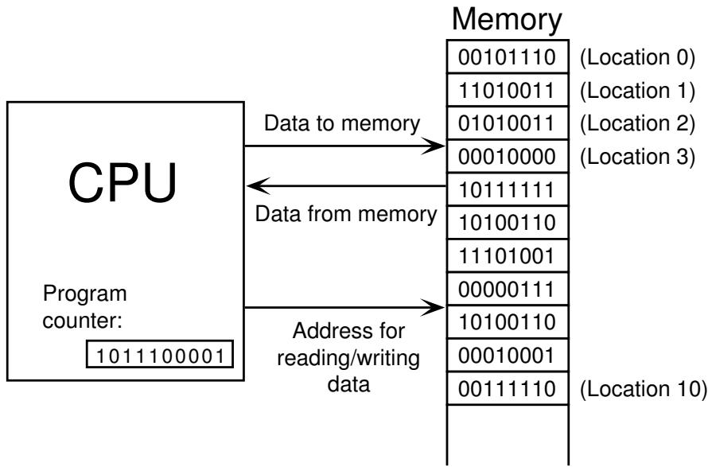
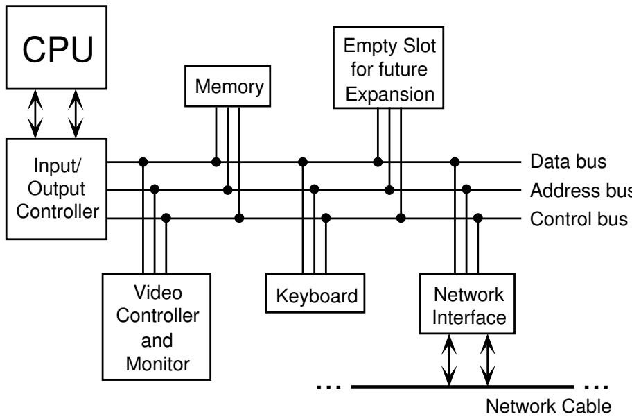
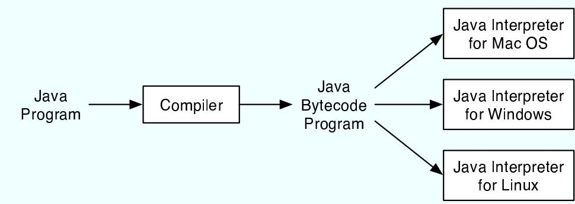
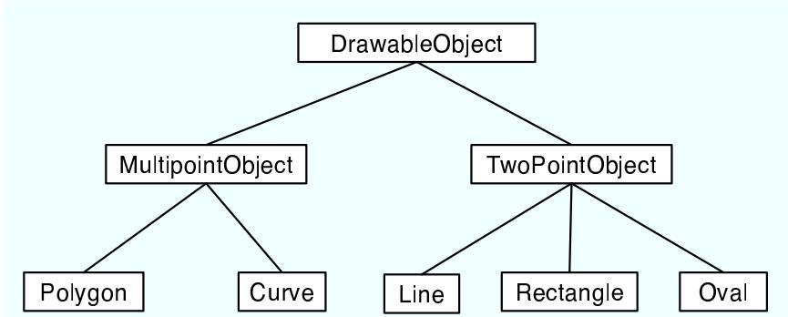
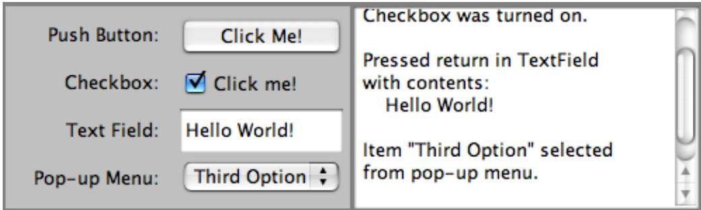
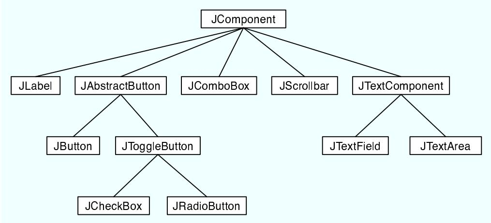

<!-- Source PDF pages 1-120 -->

# Introduction to Programming Using Java

Version 5.0, December 2006

(Version 5.0.2, with minor corrections, November 2007)

David J. Eck

Hobart and William Smith Colleges

c 1996–2007, David J. Eck

David J. Eck (eck@hws.edu) Department of Mathematics and Computer Science Hobart and William Smith Colleges Geneva, NY 14456

This book can be distributed in unmodified form with no restrictions. Modified versions can be made and distributed provided they are distributed under the same license as the original. More specifically: This work is licensed under the Creative Commons Attribution-Share Alike 2.5 License. To view a copy of this license, visit http://creativecommons.org/licenses/bysa/2.5/ or send a letter to Creative Commons, 543 Howard Street, 5th Floor, San Francisco, California, 94105, USA.

The web site for this book is: http://math.hws.edu/javanotes

## Contents

Preface
xiii
1 The Mental Landscape
1
1.1 Machine Language
1.2 Asynchronous Events
1.3 The Java Virtual Machine
1.4 Building Blocks of Programs
1.5 Object-oriented Programming
1.6 The Modern User Interface
1.7 The Internet
Quiz on Chapter 1
2 Names and Things
2.1 The Basic Java Application
2.2 Variables and Types
2.2.1 Variables
2.2.2 Types and Literals
2.2.3 Variables in Programs
2.3 Objects and Subroutines
2.3.1 Built-in Subroutines and Functions
2.3.2 Operations on Strings
2.3.3 Introduction to Ensums
2.4 Text Input and Output
2.4.1 A First Text Input Example
2.4.2 Text Output
2.4.3 TextIO Input Functions
2.4.4 Formatted Output
2.4.5 Introduction to File I/O
2.5 Details of Expressions
2.5.1 Arithmetic Operators
2.5.2 Increment and Decrement
2.5.3 Relational Operators
2.5.4 Boolean Operators
2.5.5 Conditional Operator
2.5.6 Assignment Operators and Type-Casts
2.5.7 Type Conversion of Strings
2.5.8 Precedence Rules
2.6 Programming Environments

2.6.1 Java Development Kit 51  
2.6.2 Command Line Environment 52  
2.6.3 IDEs and Eclipse 54  
2.6.4 The Problem of Packages 56  
Exercises for Chapter 2 58  
Quiz on Chapter 2 60  

Control 61  
3.1 Blocks, Loops, and Branches 61  
3.1.1 Blocks 61  
3.1.2 The Basic While Loop 62  
3.1.3 The Basic If Statement 64  
3.2 Algorithm Development 66  
3.2.1 Pseudocode and Stepwise Refinement 66  
3.2.2 The $3\mathrm{N} + 1$ Problem 69  
3.2.3 Coding, Testing, Debugging 72  
3.3 while and do..while 73  
3.3.1 The while Statement 74  
3.3.2 The do..while Statement 76  
3.3.3 break and continue 78  
3.4 The for Statement 79  
3.4.1 For Loops 80  
3.4.2 Example: Counting Divisors 83  
3.4.3 Nested for Loops 85  
3.4.4 Enums and for-each Loops 87  
3.5 The if Statement 89  
3.5.1 The Dangling else Problem 89  
3.5.2 The if...else if Construction 89  
3.5.3 If Statement Examples 91  
3.5.4 The Empty Statement 95  
3.6 The switch Statement 96  
3.6.1 The Basic switch Statement 96  
3.6.2 Menus and switch Statements 97  
3.6.3 Enums in switch Statements 98  
3.6.4 Definite Assignment 99  
3.7 Exceptions and try..catch 100  
3.7.1 Exceptions 100  
3.7.2 try..catch 101  
3.7.3 Exceptions in TextIO 102  
3.8 GUI Programming 104  
Exercises for Chapter 3 111  
Quiz on Chapter 3 114  

Subroutines 117  
4.1 Black Boxes 117  
4.2 Static Subroutines and Variables 119  
4.2.1 Subroutine Definitions 119  
4.2.2 Calling Subroutines 121

4.2.3 Subroutines in Programs . 122
4.2.4 Member Variables . 124
4.3 Parameters . 127
4.3.1 Using Parameters . 127
4.3.2 Formal and Actual Parameters . 128
4.3.3 Overloading . 129
4.3.4 Subroutine Examples . 130
4.3.5 Throwing Exceptions . 132
4.3.6 Global and Local Variables . 133
4.4 Return Values . 134
4.4.1 The return statement . 134
4.4.2 Function Examples . 135
4.4.3 3N+1 Revisited . 138
4.5 APIs, Packages, and Javadoc . 140
4.5.1 Toolboxes . 140
4.5.2 Java's Standard Packages . 141
4.5.3 Using Classes from Packages . 142
4.5.4 Javadoc . 144
4.6 More on Program Design . 146
4.6.1 Preconditions and Postconditions . 146
4.6.2 A Design Example . 147
4.6.3 The Program . 151
4.7 The Truth About Declarations . 153
4.7.1 Initialization in Declarations . 154
4.7.2 Named Constants . 155
4.7.3 Naming and Scope Rules . 158
Exercises for Chapter 4 . 161
Quiz on Chapter 4 . 164
Objects and Classes . 165
5.1 Objects and Instance Methods . 165
5.1.1 Objects, Classes, and Instances . 166
5.1.2 Fundamentals of Objects . 167
5.1.3 Getters and Setters . 172
5.2 Constructors and Object Initialization . 173
5.2.1 Initializing Instance Variables . 173
5.2.2 Constructors . 174
5.2.3 Garbage Collection . 179
5.3 Programming with Objects . 179
5.3.1 Some Built-in Classes . 180
5.3.2 Wrapper Classes and Autoboxing . 181
5.3.3 The class "Object" . 182
5.3.4 Object-oriented Analysis and Design . 183
5.4 Programming Example: Card, Hand, Deck . 185
5.4.1 Designing the classes . 185
5.4.2 The Card Class . 187
5.4.3 Example: A Simple Card Game . 191

5.5 Inheritance and Polymorphism 194  
5.5.1 Extending Existing Classes 194  
5.5.2 Inheritance and Class Hierarchy 196  
5.5.3 Example: Vehicles 197  
5.5.4 Polymorphism 200  
5.5.5 Abstract Classes 202  
5.6 this and super 205  
5.6.1 The Special Variable this 205  
5.6.2 The Special Variable super 206  
5.6.3 Constructors in Subclasses 208  
5.7 Interfaces, Nested Classes, and Other Details 209  
5.7.1 Interfaces 209  
5.7.2 Nested Classes 211  
5.7.3 Anonymous Inner Classes 214  
5.7.4 Mixing Static and Non-static 214  
5.7.5 Static Import 216  
5.7.6 Enums as Classes 217  
Exercises for Chapter 5 220  
Quiz on Chapter 5 223  
Introduction to GUI Programming 225  
6.1 The Basic GUI Application 225  
6.1.1 JFrame and JPanel 227  
6.1.2 Components and Layout 229  
6.1.3 Events and Listeners 230  
6.2 Applets and HTML 231  
6.2.1 JApplet 231  
6.2.2 Reusing Your JPanels 233  
6.2.3 Basic HTML 235  
6.2.4 Applets on Web Pages 238  
6.3 Graphics and Painting 240  
6.3.1 Coordinates 242  
6.3.2 Colors 243  
6.3.3 Fonts 244  
6.3.4 Shapes 245  
6.3.5 Graphics2D 246  
6.3.6 An Example 247  
6.4 Mouse Events 251  
6.4.1 Event Handling 252  
6.4.2 MouseEvent and MouseListener 253  
6.4.3 Mouse Coordinates 256  
6.4.4 MouseMotionListeners and Dragging 258  
6.4.5 Anonymous Event Handlers 262  
6.5 Timer and Keyboard Events 264  
6.5.1 Timers and Animation 264  
6.5.2 Keyboard Events 266  
6.5.3 Focus Events 269

6.5.4 State Machines 270  
6.6 Basic Components 273  
6.6.1 JButton 275  
6.6.2 JLabel 276  
6.6.3 JCheckBox 277  
6.6.4 JTextField and JTextArea 278  
6.6.5 JComboBox 279  
6.6.6 JSlider 280  
6.7 Basic Layout 282  
6.7.1 Basic Layout Managers 283  
6.7.2 Borders 285  
6.7.3 SliderAndComboBoxDemo 287  
6.7.4 A Simple Calculator 289  
6.7.5 Using a null Layout 291  
6.7.6 A Little Card Game 293  
6.8 Menus and Dialogs 296  
6.8.1 Menus and Menubars 297  
6.8.2 Dialogs 300  
6.8.3 Fine Points of Frames 302  
6.8.4 Creating Jar Files 304  
Exercises for Chapter 6 306  
Quiz on Chapter 6 311  
Arrays 313  
7.1 Creating and Using Arrays 313  
7.1.1 Arrays 314  
7.1.2 Using Arrays 314  
7.1.3 Array Initialization 316  
7.2 Programming With Arrays 318  
7.2.1 Arrays and for Loops 318  
7.2.2 Arrays and for-each Loops 320  
7.2.3 Array Types in Subroutines 321  
7.2.4 Random Access 322  
7.2.5 Arrays of Objects 324  
7.2.6 Variable Arity Methods 327  
7.3 Dynamic Arrays and ArrayLists 329  
7.3.1 Partially Full Arrays 329  
7.3.2 Dynamic Arrays 332  
7.3.3 ArrayLists 335  
7.3.4 Parameterized Types 339  
7.3.5 Vectors 342  
7.4 Searching and Sorting 343  
7.4.1 Searching 343  
7.4.2 Association Lists 345  
7.4.3 Insertion Sort 348  
7.4.4 Selection Sort 349  
7.4.5 Unsorting 351

7.5 Multi-dimensional Arrays 352  
7.5.1 Creating Two-dimensional Arrays 352  
7.5.2 Using Two-dimensional Arrays 354  
7.5.3 Example: Checkers 357  
Exercises for Chapter 7 364  
Quiz on Chapter 7 370  

8 Correctness and Robustness 373  
8.1 Introduction to Correctness and Robustness 373  
8.1.1 Horror Stories 374  
8.1.2 Java to the Rescue 375  
8.1.3 Problems Remain in Java 377  
8.2 Writing Correct Programs 378  
8.2.1 Provably Correct Programs 378  
8.2.2 Robust Handling of Input 381  
8.3 Exceptions and try..catch 385  
8.3.1 Exceptions and Exception Classes 386  
8.3.2 The try Statement 388  
8.3.3 Throwing Exceptions 390  
8.3.4 Mandatory Exception Handling 392  
8.3.5 Programming with Exceptions 393  
8.4 Assertions 396  
8.5 Introduction to Threads 399  
8.5.1 Creating and Running Threads 400  
8.5.2 Operations on Threads 404  
8.5.3 Mutual Exclusion with "synchronized" 405  
8.5.4 Wait and Notify 408  
8.5.5 Volatile Variables 412  
8.6 Analysis of Algorithms 413  
Exercises for Chapter 8 419  
Quiz on Chapter 8 424  

9 Linked Data Structures and Recursion 427  
9.1 Recursion 427  
9.1.1 Recursive Binary Search 428  
9.1.2 Towers of Hanoi 430  
9.1.3 A Recursive Sorting Algorithm 432  
9.1.4 Blob Counting 435  
9.2 Linked Data Structures 439  
9.2.1 Recursive Linking 439  
9.2.2 Linked Lists 441  
9.2.3 Basic Linked List Processing 441  
9.2.4 Inserting into a Linked List 445  
9.2.5 Deleting from a Linked List 447  
9.3 Stacks, Queues, and ADTs 448  
9.3.1 Stacks 449  
9.3.2 Queues 452  
9.3.3 Postfix Expressions 456

9.4 Binary Trees 459
9.4.1 Tree Traversal 460
9.4.2 Binary Sort Trees 462
9.4.3 Expression Trees 467
9.5 A Simple Recursive Descent Parser 470
9.5.1 Backus-Naur Form 470
9.5.2 Recursive Descent Parsing 472
9.5.3 Building an Expression Tree 476
Exercises for Chapter 9 479
Quiz on Chapter 9 482

10 Generic Programming and Collection Classes 485
10.1 Generic Programming 485
10.1.1 Generic Programming in Smalltalk 486
10.1.2 Generic Programming in C++ 487
10.1.3 Generic Programming in Java 488
10.1.4 The Java Collection Framework 489
10.1.5 Iterators and for-each Loops 491
10.1.6 Equality and Comparison 492
10.1.7 Generics and Wrapper Classes 495
10.2 Lists and Sets 496
10.2.1 ArrayList and LinkedList 496
10.2.2 Sorting 499
10.2.3 TreeSet and HashSet 500
10.2.4 EnumSet 503
10.3 Maps 504
10.3.1 The Map Interface 505
10.3.2 Views, SubSets, and SubMaps 506
10.3.3 Hash Tables and Hash Codes 509
10.4 Programming with the Collection Framework 511
10.4.1 Symbol Tables 511
10.4.2 Sets Inside a Map 512
10.4.3 Using a Comparator 515
10.4.4 Word Counting 517
10.5 Writing Generic Classes and Methods 519
10.5.1 Simple Generic Classes 520
10.5.2 Simple Generic Methods 521
10.5.3 Type Wildcards 523
10.5.4 Bounded Types 527
Exercises for Chapter 10 531
Quiz on Chapter 10 535

11 Files and Networking 537
11.1 Streams, Readers, and Writers 537
11.1.1 Character and Byte Streams 537
11.1.2 PrintWriter 539
11.1.3 Data Streams 540
11.1.4 Reading Text 541

11.1.5 The Scanner Class . 544
11.1.6 Serialized Object I/O . 545
11.2 Files . 546
11.2.1 Reading and Writing Files . 546
11.2.2 Files and Directories . 549
11.2.3 File Dialog Boxes . 552
11.3 Programming With Files . 554
11.3.1 Copying a File . 555
11.3.2 Persistent Data . 557
11.3.3 Files in GUI Programs . 559
11.3.4 Storing Objects in Files . 561
11.4 Networking . 568
11.4.1 URLs and URLConnections . 569
11.4.2 TCP/IP and Client/Server . 571
11.4.3 Sockets . 572
11.4.4 A Trivial Client/Server . 574
11.4.5 A Simple Network Chat . 578
11.5 Network Programming and Threads . 581
11.5.1 A Threaded GUI Chat Program . 582
11.5.2 A Multithreaded Server . 585
11.5.3 Distributed Computing . 588
11.6 A Brief Introduction to XML . 596
11.6.1 Basic XML Syntax . 596
11.6.2 XMLEncoder and XMLDecoder . 598
11.6.3 Working With the DOM . 600
Exercises for Chapter 11 . 606
Quiz on Chapter 11 . 609

Advanced GUI Programming 611
12.1 Images and Resources . 611
12.1.1 Images and BufferedImages . 611
12.1.2 Working With Pixels . 617
12.1.3 Resources . 620
12.1.4 Cursors and Icons . 621
12.1.5 Image File I/O . 622
12.2 Fancier Graphics . 624
12.2.1 Measuring Text . 625
12.2.2 Transparency . 627
12.2.3 Antialiasing . 629
12.2.4 Strokes and Paints . 630
12.2.5 Transforms . 633
12.3 Actions and Buttons . 636
12.3.1 Action and AbstractAction . 636
12.3.2 Icons on Buttons . 638
12.3.3 Radio Buttons . 639
12.3.4 Toolbars . 642
12.3.5 Keyboard Accelerators . 643

12.3.6 HTML on Buttons . 645  
12.4 Complex Components and MVC . 646  
12.4.1 Model-View-Controller . 646  
12.4.2 Lists and ListModels . 647  
12.4.3 Tables and TableModels . 650  
12.4.4 Documents and Editors . 654  
12.4.5 Custom Components . 655  
12.5 Finishing Touches . 660  
12.5.1 The Mandelbrot Set . 660  
12.5.2 Design of the Program . 662  
12.5.3 Internationalization . 664  
12.5.4 Events, Events, Events . 666  
12.5.5 Custom Dialogs . 668  
12.5.6 Preferences . 669  
Exercises for Chapter 12 . 671  
Quiz on Chapter 12 . 673  
Appendix: Source Files 675

## Preface

Introduction to Programming Using Java is a free introductory computer programming textbook that uses Java as the language of instruction. It is suitable for use in an introductory programming course and for people who are trying to learn programming on their own. There are no prerequisites beyond a general familiarity with the ideas of computers and programs. There is enough material for a full year of college-level programming. Chapters 1 through 7 can be used as a textbook in a one-semester college-level course or in a year-long high school course.

This version of the book covers “Java 5.0”, and many of the examples use features that were not present in earlier versions of Java. (Sometimes, you will see this version of Java referred to as Java 1.5 instead of Java 5.0.) Note that Java applets appear throughout the pages of the on-line version of this book. Many of those applets will be non-functional in Web browsers that do not support Java 5.0.

The home web site for this book is http://math.hws.edu/javanotes/. The page at that address contains links for downloading a copy of the web site and for downloading a PDF version of the book.

$$
\* *\ *\]*\n\nabla
$$

In style, this is a textbook rather than a tutorial. That is, it concentrates on explaining concepts rather than giving step-by-step how-to-do-it guides. I have tried to use a conversational writing style that might be closer to classroom lecture than to a typical textbook. You’ll find programming exercises at the end of most chapters, and you will find a detailed solution for each exercise, with the sort of discussion that I would give if I presented the solution in class. (Solutions to the exercises can be found in the on-line version only.) I strongly advise that you read the exercise solutions if you want to get the most out of this book. This is certainly not a Java reference book, and it is not even close to a comprehensive survey of all the features of Java. It is not written as a quick introduction to Java for people who already know another programming language. Instead, it is directed mainly towards people who are learning programming for the first time, and it is as much about general programming concepts as it is about Java in particular. I believe that Introduction to Programming using Java is fully competitive with the conventionally published, printed programming textbooks that are available on the market. (Well, all right, I’ll confess that I think it’s better.)

There are several approaches to teaching Java. One approach uses graphical user interface programming from the very beginning. Some people believe that object oriented programming should also be emphasized from the very beginning. This is not the approach that I take. The approach that I favor starts with the more basic building blocks of programming and builds from there. After an introductory chapter, I cover procedural programming in Chapters 2, 3, and 4. Object-oriented programming is introduced in Chapter 5. Chapters 6 covers the closely related topic of event-oriented programming and graphical user interfaces. Arrays are covered in Chapter 7. Chapter 8 marks a turning point in the book, moving beyond the fundamental ideas of programming to cover more advanced topics. Chapter 8 is mostly about writing robust and correct programs, but it also has a section on parallel processing and threads. Chapters 9 and 10 cover recursion and data structures, including the Java Collection Framework. Chapter 11 is about files and networking. Finally, Chapter 12 returns to the topic of graphical user interface programming to cover some of Java’s more advanced capabilities.

## ∗ ∗ ∗

Major changes have been made in the fifth edition. Perhaps the most significant change is the use of parameterized types in the chapter on generic programming. Parameterized types— Java’s version of templates—were the most eagerly anticipated new feature in Java 5.0.

Other new features in Java 5.0 are also covered. Enumerated types are introduced, although they are not covered in their full complexity. The “for-each” loop is covered and is used extensively. Formatted output is also used extensively, and the Scanner class is covered (though not until Chapter 11). Static import is covered briefly, as are variable arity methods.

The non-standard TextIO class that I use for input in the first half of the book has been rewritten to support formatted output. I have also added some file I/O capabilities to this class to make it possible to cover some examples that use files early in the book.

Javadoc comments are covered for the first time in this edition. Almost all code examples have been revised to use Javadoc-style comments.

The coverage of graphical user interface programming has been reorganized, much of it has been rewritten, and new material has been added. In previous editions, I emphasized applets. Stand-alone GUI applications were covered at the end, almost as an afterthought. In the fifth edition, the emphasis on applets is gone, and almost all examples are presented as stand-alone applications. However, applet versions of each example are still presented on the web pages of the on-line version of the book. The chapter on advanced GUI programming has been moved to the end, and a significant amount of new material has been added, including coverage of some of the features of Graphics2D.

Aside from the changes in content, the appearance of the book has been improved, especially the appearance of the PDF version. For the first time, the quality of the PDF approaches that of conventional textbooks.

## ∗ ∗ ∗

The latest complete edition of Introduction to Programming using Java is always available on line at http://math.hws.edu/javanotes/. The first version of the book was written in 1996, and there have been several editions since then. All editions are archived at the following Web addresses:

• First edition: http://math.hws.edu/eck/cs124/javanotes1/ (Covers Java 1.0.)

• Second edition: http://math.hws.edu/eck/cs124/javanotes2/ (Covers Java 1.1.)

• Third edition: http://math.hws.edu/eck/cs124/javanotes3/ (Covers Java 1.1.)

• Fourth edition: http://math.hws.edu/eck/cs124/javanotes4/ (Covers Java 1.4.)

• Fifth edition: http://math.hws.edu/eck/cs124/javanotes5/ (Covers Java 5.0.)

Introduction to Programming using Java is free, but it is not in the public domain. As of Version 5.0, it is published under the terms of the Creative Commons Attribution-Share Alike 2.5 License. To view a copy of this license, visit http://creativecommons.org/licenses/bysa/2.5/ or send a letter to Creative Commons, 543 Howard Street, 5th Floor, San Francisco, California, 94105, USA. This license allows redistribution and modification under certain terms. For example, you can:

## Preface

• Post an unmodified copy of the on-line version on your own Web site (including the parts that list the author and state the license under which it is distributed!).

• Give away or sell printed, unmodified copies of this book, as long as they meet the requirements of the license.

• Make modified copies of the complete book or parts of it and post them on the web or otherwise distribute them, provided that attribution to the author is given, the modifications are clearly noted, and the modified copies are distributed under the same license as the original. This includes translations to other languages.

While it is not actually required by the license, I do appreciate hearing from people who are using or distributing my work.

∗ ∗ ∗

A technical note on production: The on-line and PDF versions of this book are created from a single source, which is written largely in XML. To produce the PDF version, the XML is processed into a form that can be used by the TeX typesetting program. In addition to XML files, the source includes DTDs, XSLT transformations, Java source code files, image files, a TeX macro file, and a couple of scripts that are used in processing. I have not made the source materials available for download, since they are not in a clean enough form to be publishable, and because it would require a fair amount of expertise to make any use of them. However, they are not meant to be secret, and I am willing to make them available on request.

$$
\* *\ *\]*\n\nabla
$$

Professor David J. Eck

Department of Mathematics and Computer Science

Hobart and William Smith Colleges

Geneva, New York 14456, USA

Email: eck@hws.edu

WWW: http://math.hws.edu/eck/

## Chapter 1

## Overview: The Mental Landscape

When you begin a journey, it’s a good idea to have a mental map of the terrain you’ll be passing through. The same is true for an intellectual journey, such as learning to write computer programs. In this case, you’ll need to know the basics of what computers are and how they work. You’ll want to have some idea of what a computer program is and how one is created. Since you will be writing programs in the Java programming language, you’ll want to know something about that language in particular and about the modern, networked computing environment for which Java is designed.

As you read this chapter, don’t worry if you can’t understand everything in detail. (In fact, it would be impossible for you to learn all the details from the brief expositions in this chapter.) Concentrate on learning enough about the big ideas to orient yourself, in preparation for the rest of the book. Most of what is covered in this chapter will be covered in much greater detail later in the book.

## 1.1 The Fetch and Execute Cycle: Machine Language

A computer is a complex system consisting of many diferent components. But at the heart—or the brain, if you want—of the computer is a single component that does the actual computing. This is the Central Processing Unit, or CPU. In a modern desktop computer, the CPU is a single “chip” on the order of one square inch in size. The job of the CPU is to execute programs.

A program is simply a list of unambiguous instructions meant to be followed mechanically by a computer. A computer is built to carry out instructions that are written in a very simple type of language called machine language. Each type of computer has its own machine language, and the computer can directly execute a program only if the program is expressed in that language. (It can execute programs written in other languages if they are first translated into machine language.)

When the CPU executes a program, that program is stored in the computer’s main memory (also called the RAM or random access memory). In addition to the program, memory can also hold data that is being used or processed by the program. Main memory consists of a sequence of locations. These locations are numbered, and the sequence number of a location is called its address. An address provides a way of picking out one particular piece of information from among the millions stored in memory. When the CPU needs to access the program instruction or data in a particular location, it sends the address of that information as a signal to the memory; the memory responds by sending back the data contained in the specified location. The CPU can also store information in memory by specifying the information to be stored and the address of the location where it is to be stored.

On the level of machine language, the operation of the CPU is fairly straightforward (although it is very complicated in detail). The CPU executes a program that is stored as a sequence of machine language instructions in main memory. It does this by repeatedly reading, or fetching, an instruction from memory and then carrying out, or executing, that instruction. This process—fetch an instruction, execute it, fetch another instruction, execute it, and so on forever—is called the fetch-and-execute cycle. With one exception, which will be covered in the next section, this is all that the CPU ever does.

The details of the fetch-and-execute cycle are not terribly important, but there are a few basic things you should know. The CPU contains a few internal registers, which are small memory units capable of holding a single number or machine language instruction. The CPU uses one of these registers—the program counter, or PC—to keep track of where it is in the program it is executing. The PC stores the address of the next instruction that the CPU should execute. At the beginning of each fetch-and-execute cycle, the CPU checks the PC to see which instruction it should fetch. During the course of the fetch-and-execute cycle, the number in the PC is updated to indicate the instruction that is to be executed in the next cycle. (Usually, but not always, this is just the instruction that sequentially follows the current instruction in the program.)

## ∗ ∗ ∗

A computer executes machine language programs mechanically—that is without understanding them or thinking about them—simply because of the way it is physically put together. This is not an easy concept. A computer is a machine built of millions of tiny switches called transistors, which have the property that they can be wired together in such a way that an output from one switch can turn another switch on or of. As a computer computes, these switches turn each other on or of in a pattern determined both by the way they are wired together and by the program that the computer is executing.

Machine language instructions are expressed as binary numbers. A binary number is made up of just two possible digits, zero and one. So, a machine language instruction is just a sequence of zeros and ones. Each particular sequence encodes some particular instruction. The data that the computer manipulates is also encoded as binary numbers. A computer can work directly with binary numbers because switches can readily represent such numbers: Turn the switch on to represent a one; turn it of to represent a zero. Machine language instructions are stored in memory as patterns of switches turned on or of. When a machine language instruction is loaded into the CPU, all that happens is that certain switches are turned on or of in the pattern that encodes that particular instruction. The CPU is built to respond to this pattern by executing the instruction it encodes; it does this simply because of the way all the other switches in the CPU are wired together.

So, you should understand this much about how computers work: Main memory holds machine language programs and data. These are encoded as binary numbers. The CPU fetches machine language instructions from memory one after another and executes them. It does this mechanically, without thinking about or understanding what it does—and therefore the program it executes must be perfect, complete in all details, and unambiguous because the CPU can do nothing but execute it exactly as written. Here is a schematic view of this first-stage understanding of the computer:



## 1.2 Asynchronous Events: Polling Loops and Interrupts

The CPU spends almost all of its time fetching instructions from memory and executing them. However, the CPU and main memory are only two out of many components in a real computer system. A complete system contains other devices such as:

• A hard disk for storing programs and data files. (Note that main memory holds only a comparatively small amount of information, and holds it only as long as the power is turned on. A hard disk is necessary for permanent storage of larger amounts of information, but programs have to be loaded from disk into main memory before they can actually be executed.)

• A keyboard and mouse for user input.

• A monitor and printer which can be used to display the computer’s output.

• A modem that allows the computer to communicate with other computers over telephone lines.

• A network interface that allows the computer to communicate with other computers that are connected to it on a network.

• A scanner that converts images into coded binary numbers that can be stored and manipulated on the computer.

The list of devices is entirely open ended, and computer systems are built so that they can easily be expanded by adding new devices. Somehow the CPU has to communicate with and control all these devices. The CPU can only do this by executing machine language instructions (which is all it can do, period). The way this works is that for each device in a system, there is a device driver, which consists of software that the CPU executes when it has to deal with the device. Installing a new device on a system generally has two steps: plugging the device physically into the computer, and installing the device driver software. Without the device driver, the actual physical device would be useless, since the CPU would not be able to communicate with it.

$$
* * *
$$

A computer system consisting of many devices is typically organized by connecting those devices to one or more busses. A bus is a set of wires that carry various sorts of information between the devices connected to those wires. The wires carry data, addresses, and control signals. An address directs the data to a particular device and perhaps to a particular register or location within that device. Control signals can be used, for example, by one device to alert another that data is available for it on the data bus. A fairly simple computer system might be organized like this:



Now, devices such as keyboard, mouse, and network interface can produce input that needs to be processed by the CPU. How does the CPU know that the data is there? One simple idea, which turns out to be not very satisfactory, is for the CPU to keep checking for incoming data over and over. Whenever it finds data, it processes it. This method is called polling, since the CPU polls the input devices continually to see whether they have any input data to report. Unfortunately, although polling is very simple, it is also very ineficient. The CPU can waste an awful lot of time just waiting for input.

To avoid this ineficiency, interrupts are often used instead of polling. An interrupt is a signal sent by another device to the CPU. The CPU responds to an interrupt signal by putting aside whatever it is doing in order to respond to the interrupt. Once it has handled the interrupt, it returns to what it was doing before the interrupt occurred. For example, when you press a key on your computer keyboard, a keyboard interrupt is sent to the CPU. The CPU responds to this signal by interrupting what it is doing, reading the key that you pressed, processing it, and then returning to the task it was performing before you pressed the key.

Again, you should understand that this is a purely mechanical process: A device signals an interrupt simply by turning on a wire. The CPU is built so that when that wire is turned on, the CPU saves enough information about what it is currently doing so that it can return to the same state later. This information consists of the contents of important internal registers such as the program counter. Then the CPU jumps to some predetermined memory location and begins executing the instructions stored there. Those instructions make up an interrupt handler that does the processing necessary to respond to the interrupt. (This interrupt handler is part of the device driver software for the device that signalled the interrupt.) At the end of the interrupt handler is an instruction that tells the CPU to jump back to what it was doing; it does that by restoring its previously saved state.

Interrupts allow the CPU to deal with asynchronous events. In the regular fetch-andexecute cycle, things happen in a predetermined order; everything that happens is “synchronized” with everything else. Interrupts make it possible for the CPU to deal eficiently with events that happen “asynchronously,” that is, at unpredictable times.

As another example of how interrupts are used, consider what happens when the CPU needs to access data that is stored on the hard disk. The CPU can access data directly only if it is in main memory. Data on the disk has to be copied into memory before it can be accessed. Unfortunately, on the scale of speed at which the CPU operates, the disk drive is extremely slow. When the CPU needs data from the disk, it sends a signal to the disk drive telling it to locate the data and get it ready. (This signal is sent synchronously, under the control of a regular program.) Then, instead of just waiting the long and unpredictalble amount of time that the disk drive will take to do this, the CPU goes on with some other task. When the disk drive has the data ready, it sends an interrupt signal to the CPU. The interrupt handler can then read the requested data.

## ∗ ∗ ∗

Now, you might have noticed that all this only makes sense if the CPU actually has several tasks to perform. If it has nothing better to do, it might as well spend its time polling for input or waiting for disk drive operations to complete. All modern computers use multitasking to perform several tasks at once. Some computers can be used by several people at once. Since the CPU is so fast, it can quickly switch its attention from one user to another, devoting a fraction of a second to each user in turn. This application of multitasking is called timesharing. But a modern personal computer with just a single user also uses multitasking. For example, the user might be typing a paper while a clock is continuously displaying the time and a file is being downloaded over the network.

Each of the individual tasks that the CPU is working on is called a thread. (Or a process; there are technical diferences between threads and processes, but they are not important here.) At any given time, only one thread can actually be executed by a CPU. The CPU will continue running the same thread until one of several things happens:

• The thread might voluntarily yield control, to give other threads a chance to run.

• The thread might have to wait for some asynchronous event to occur. For example, the thread might request some data from the disk drive, or it might wait for the user to press a key. While it is waiting, the thread is said to be blocked, and other threads have a chance to run. When the event occurs, an interrupt will “wake up” the thread so that it can continue running.

• The thread might use up its allotted slice of time and be suspended to allow other threads to run. Not all computers can “forcibly” suspend a thread in this way; those that can are said to use preemptive multitasking. To do preemptive multitasking, a computer needs a special timer device that generates an interrupt at regular intervals, such as 100 times per second. When a timer interrupt occurs, the CPU has a chance to switch from one thread to another, whether the thread that is currently running likes it or not.

Ordinary users, and indeed ordinary programmers, have no need to deal with interrupts and interrupt handlers. They can concentrate on the diferent tasks or threads that they want the computer to perform; the details of how the computer manages to get all those tasks done are not important to them. In fact, most users, and many programmers, can ignore threads and multitasking altogether. However, threads have become increasingly important as computers have become more powerful and as they have begun to make more use of multitasking. Indeed, threads are built into the Java programming language as a fundamental programming concept.

Just as important in Java and in modern programming in general is the basic concept of asynchronous events. While programmers don’t actually deal with interrupts directly, they do often find themselves writing event handlers, which, like interrupt handlers, are called asynchronously when specified events occur. Such “event-driven programming” has a very diferent feel from the more traditional straight-through, synchronous programming. We will begin with the more traditional type of programming, which is still used for programming individual tasks, but we will return to threads and events later in the text.

$$
\* *\ *
$$

By the way, the software that does all the interrupt handling and the communication with the user and with hardware devices is called the operating system. The operating system is the basic, essential software without which a computer would not be able to function. Other programs, such as word processors and World Wide Web browsers, are dependent upon the operating system. Common operating systems include Linux, DOS, Windows 2000, Windows XP, and the Macintosh OS.

## 1.3 The Java Virtual Machine

Machine language consists of very simple instructions that can be executed directly by the CPU of a computer. Almost all programs, though, are written in high-level programming languages such as Java, Pascal, or C++. A program written in a high-level language cannot be run directly on any computer. First, it has to be translated into machine language. This translation can be done by a program called a compiler. A compiler takes a high-level-language program and translates it into an executable machine-language program. Once the translation is done, the machine-language program can be run any number of times, but of course it can only be run on one type of computer (since each type of computer has its own individual machine language). If the program is to run on another type of computer it has to be re-translated, using a diferent compiler, into the appropriate machine language.

There is an alternative to compiling a high-level language program. Instead of using a compiler, which translates the program all at once, you can use an interpreter, which translates it instruction-by-instruction, as necessary. An interpreter is a program that acts much like a CPU, with a kind of fetch-and-execute cycle. In order to execute a program, the interpreter runs in a loop in which it repeatedly reads one instruction from the program, decides what is necessary to carry out that instruction, and then performs the appropriate machine-language commands to do so.

One use of interpreters is to execute high-level language programs. For example, the programming language Lisp is usually executed by an interpreter rather than a compiler. However, interpreters have another purpose: they can let you use a machine-language program meant for one type of computer on a completely diferent type of computer. For example, there is a program called “Virtual PC” that runs on Macintosh computers. Virtual PC is an interpreter that executes machine-language programs written for IBM-PC-clone computers. If you run Virtual PC on your Macintosh, you can run any PC program, including programs written for Windows. (Unfortunately, a PC program will run much more slowly than it would on an actual IBM clone. The problem is that Virtual PC executes several Macintosh machine-language instructions for each PC machine-language instruction in the program it is interpreting. Compiled programs are inherently faster than interpreted programs.)

## ∗ ∗ ∗

The designers of Java chose to use a combination of compilation and interpretation. Programs written in Java are compiled into machine language, but it is a machine language for a computer that doesn’t really exist. This so-called “virtual” computer is known as the Java virtual machine. The machine language for the Java virtual machine is called Java bytecode. There is no reason why Java bytecode could not be used as the machine language of a real computer, rather than a virtual computer.

However, one of the main selling points of Java is that it can actually be used on any computer. All that the computer needs is an interpreter for Java bytecode. Such an interpreter simulates the Java virtual machine in the same way that Virtual PC simulates a PC computer.

Of course, a diferent Jave bytecode interpreter is needed for each type of computer, but once a computer has a Java bytecode interpreter, it can run any Java bytecode program. And the same Java bytecode program can be run on any computer that has such an interpreter. This is one of the essential features of Java: the same compiled program can be run on many diferent types of computers.



Why, you might wonder, use the intermediate Java bytecode at all? Why not just distribute the original Java program and let each person compile it into the machine language of whatever computer they want to run it on? There are many reasons. First of all, a compiler has to understand Java, a complex high-level language. The compiler is itself a complex program. A Java bytecode interpreter, on the other hand, is a fairly small, simple program. This makes it easy to write a bytecode interpreter for a new type of computer; once that is done, that computer can run any compiled Java program. It would be much harder to write a Java compiler for the same computer.

Furthermore, many Java programs are meant to be downloaded over a network. This leads to obvious security concerns: you don’t want to download and run a program that will damage your computer or your files. The bytecode interpreter acts as a bufer between you and the program you download. You are really running the interpreter, which runs the downloaded program indirectly. The interpreter can protect you from potentially dangerous actions on the part of that program.

I should note that there is no necessary connection between Java and Java bytecode. A program written in Java could certainly be compiled into the machine language of a real computer. And programs written in other languages could be compiled into Java bytecode. However, it is the combination of Java and Java bytecode that is platform-independent, secure, and networkcompatible while allowing you to program in a modern high-level object-oriented language.

$$
* * *
$$

I should also note that the really hard part of platform-independence is providing a “Graphical User Interface”—with windows, buttons, etc.—that will work on all the platforms that support Java. You’ll see more about this problem in Section 1.6.

## 1.4 Fundamental Building Blocks of Programs

There are two basic aspects of programming: data and instructions. To work with data, you need to understand variables and types; to work with instructions, you need to understand control structures and subroutines. You’ll spend a large part of the course becoming familiar with these concepts.

A variable is just a memory location (or several locations treated as a unit) that has been given a name so that it can be easily referred to and used in a program. The programmer only has to worry about the name; it is the compiler’s responsibility to keep track of the memory location. The programmer does need to keep in mind that the name refers to a kind of “box” in memory that can hold data, even if the programmer doesn’t have to know where in memory that box is located.

In Java and most other languages, a variable has a type that indicates what sort of data it can hold. One type of variable might hold integers—whole numbers such as 3, -7, and 0— while another holds floating point numbers—numbers with decimal points such as 3.14, -2.7, or 17.0. (Yes, the computer does make a distinction between the integer 17 and the floatingpoint number 17.0; they actually look quite diferent inside the computer.) There could also be types for individual characters (’A’, ’;’, etc.), strings (“Hello”, “A string can include many characters”, etc.), and less common types such as dates, colors, sounds, or any other type of data that a program might need to store.

Programming languages always have commands for getting data into and out of variables and for doing computations with data. For example, the following “assignment statement,” which might appear in a Java program, tells the computer to take the number stored in the variable named “principal”, multiply that number by 0.07, and then store the result in the variable named “interest”:

$$
\text {interest} = \text {principal} * 0. 0 7;
$$

There are also “input commands” for getting data from the user or from files on the computer’s disks and “output commands” for sending data in the other direction.

These basic commands—for moving data from place to place and for performing computations—are the building blocks for all programs. These building blocks are combined into complex programs using control structures and subroutines.

$$
\* \ * \ *
$$

A program is a sequence of instructions. In the ordinary “flow of control,” the computer executes the instructions in the sequence in which they appear, one after the other. However, this is obviously very limited: the computer would soon run out of instructions to execute. Control structures are special instructions that can change the flow of control. There are two basic types of control structure: loops, which allow a sequence of instructions to be repeated over and over, and branches, which allow the computer to decide between two or more diferent courses of action by testing conditions that occur as the program is running.

For example, it might be that if the value of the variable “principal” is greater than 10000, then the “interest” should be computed by multiplying the principal by 0.05; if not, then the interest should be computed by multiplying the principal by 0.04. A program needs some way of expressing this type of decision. In Java, it could be expressed using the following “if statement”:

```txt
if (principal > 10000)
    interest = principal * 0.05;
else
    interest = principal * 0.04;
```

(Don’t worry about the details for now. Just remember that the computer can test a condition and decide what to do next on the basis of that test.)

Loops are used when the same task has to be performed more than once. For example, if you want to print out a mailing label for each name on a mailing list, you might say, “Get the first name and address and print the label; get the second name and address and print the label; get the third name and address and print the label—” But this quickly becomes ridiculous—and might not work at all if you don’t know in advance how many names there are. What you would like to say is something like “While there are more names to process, get the next name and address, and print the label.” A loop can be used in a program to express such repetition.

$$
\* \ * \ *
$$

Large programs are so complex that it would be almost impossible to write them if there were not some way to break them up into manageable “chunks.” Subroutines provide one way to do this. A subroutine consists of the instructions for performing some task, grouped together as a unit and given a name. That name can then be used as a substitute for the whole set of instructions. For example, suppose that one of the tasks that your program needs to perform is to draw a house on the screen. You can take the necessary instructions, make them into a subroutine, and give that subroutine some appropriate name—say, “drawHouse()”. Then anyplace in your program where you need to draw a house, you can do so with the single command:

drawHouse();

This will have the same efect as repeating all the house-drawing instructions in each place.

The advantage here is not just that you save typing. Organizing your program into subroutines also helps you organize your thinking and your program design efort. While writing the house-drawing subroutine, you can concentrate on the problem of drawing a house without worrying for the moment about the rest of the program. And once the subroutine is written, you can forget about the details of drawing houses—that problem is solved, since you have a subroutine to do it for you. A subroutine becomes just like a built-in part of the language which you can use without thinking about the details of what goes on “inside” the subroutine.

$$
\* *\ *\]*
$$

Variables, types, loops, branches, and subroutines are the basis of what might be called “traditional programming.” However, as programs become larger, additional structure is needed to help deal with their complexity. One of the most efective tools that has been found is objectoriented programming, which is discussed in the next section.

## 1.5 Objects and Object-oriented Programming

Programs must be designed. No one can just sit down at the computer and compose a program of any complexity. The discipline called software engineering is concerned with the construction of correct, working, well-written programs. The software engineer tends to use accepted and proven methods for analyzing the problem to be solved and for designing a program to solve that problem.

During the 1970s and into the 80s, the primary software engineering methodology was structured programming. The structured programming approach to program design was based on the following advice: To solve a large problem, break the problem into several pieces and work on each piece separately; to solve each piece, treat it as a new problem which can itself be broken down into smaller problems; eventually, you will work your way down to problems that can be solved directly, without further decomposition. This approach is called top-down programming.

There is nothing wrong with top-down programming. It is a valuable and often-used approach to problem-solving. However, it is incomplete. For one thing, it deals almost entirely with producing the instructions necessary to solve a problem. But as time went on, people realized that the design of the data structures for a program was as least as important as the design of subroutines and control structures. Top-down programming doesn’t give adequate consideration to the data that the program manipulates.

Another problem with strict top-down programming is that it makes it dificult to reuse work done for other projects. By starting with a particular problem and subdividing it into convenient pieces, top-down programming tends to produce a design that is unique to that problem. It is unlikely that you will be able to take a large chunk of programming from another program and fit it into your project, at least not without extensive modification. Producing high-quality programs is dificult and expensive, so programmers and the people who employ them are always eager to reuse past work.

## ∗ ∗ ∗

So, in practice, top-down design is often combined with bottom-up design. In bottom-up design, the approach is to start “at the bottom,” with problems that you already know how to solve (and for which you might already have a reusable software component at hand). From there, you can work upwards towards a solution to the overall problem.

The reusable components should be as “modular” as possible. A module is a component of a larger system that interacts with the rest of the system in a simple, well-defined, straightforward manner. The idea is that a module can be “plugged into” a system. The details of what goes on inside the module are not important to the system as a whole, as long as the module fulfills its assigned role correctly. This is called information hiding, and it is one of the most important principles of software engineering.

One common format for software modules is to contain some data, along with some subroutines for manipulating that data. For example, a mailing-list module might contain a list of names and addresses along with a subroutine for adding a new name, a subroutine for printing mailing labels, and so forth. In such modules, the data itself is often hidden inside the module; a program that uses the module can then manipulate the data only indirectly, by calling the subroutines provided by the module. This protects the data, since it can only be manipulated in known, well-defined ways. And it makes it easier for programs to use the module, since they don’t have to worry about the details of how the data is represented. Information about the representation of the data is hidden.

Modules that could support this kind of information-hiding became common in programming languages in the early 1980s. Since then, a more advanced form of the same idea has more or less taken over software engineering. This latest approach is called object-oriented programming, often abbreviated as OOP.

The central concept of object-oriented programming is the object, which is a kind of module containing data and subroutines. The point-of-view in OOP is that an object is a kind of selfsuficient entity that has an internal state (the data it contains) and that can respond to messages (calls to its subroutines). A mailing list object, for example, has a state consisting of a list of names and addresses. If you send it a message telling it to add a name, it will respond by modifying its state to reflect the change. If you send it a message telling it to print itself, it will respond by printing out its list of names and addresses.

The OOP approach to software engineering is to start by identifying the objects involved in a problem and the messages that those objects should respond to. The program that results is a collection of objects, each with its own data and its own set of responsibilities. The objects interact by sending messages to each other. There is not much “top-down” in such a program, and people used to more traditional programs can have a hard time getting used to OOP. However, people who use OOP would claim that object-oriented programs tend to be better models of the way the world itself works, and that they are therefore easier to write, easier to understand, and more likely to be correct.

## ∗ ∗ ∗

You should think of objects as “knowing” how to respond to certain messages. Diferent objects might respond to the same message in diferent ways. For example, a “print” message would produce very diferent results, depending on the object it is sent to. This property of objects—that diferent objects can respond to the same message in diferent ways—is called polymorphism.

It is common for objects to bear a kind of “family resemblance” to one another. Objects that contain the same type of data and that respond to the same messages in the same way belong to the same class. (In actual programming, the class is primary; that is, a class is created and then one or more objects are created using that class as a template.) But objects can be similar without being in exactly the same class.

For example, consider a drawing program that lets the user draw lines, rectangles, ovals, polygons, and curves on the screen. In the program, each visible object on the screen could be represented by a software object in the program. There would be five classes of objects in the program, one for each type of visible object that can be drawn. All the lines would belong to one class, all the rectangles to another class, and so on. These classes are obviously related; all of them represent “drawable objects.” They would, for example, all presumably be able to respond to a “draw yourself” message. Another level of grouping, based on the data needed to represent each type of object, is less obvious, but would be very useful in a program: We can group polygons and curves together as “multipoint objects,” while lines, rectangles, and ovals are “two-point objects.” (A line is determined by its endpoints, a rectangle by two of its corners, and an oval by two corners of the rectangle that contains it.) We could diagram these relationships as follows:



DrawableObject, MultipointObject, and TwoPointObject would be classes in the program. MultipointObject and TwoPointObject would be subclasses of DrawableObject. The class Line would be a subclass of TwoPointObject and (indirectly) of DrawableObject. A subclass of a class is said to inherit the properties of that class. The subclass can add to its inheritance and it can even “override” part of that inheritance (by defining a diferent response to some method). Nevertheless, lines, rectangles, and so on are drawable objects, and the class DrawableObject expresses this relationship.

Inheritance is a powerful means for organizing a program. It is also related to the problem of reusing software components. A class is the ultimate reusable component. Not only can it be reused directly if it fits exactly into a program you are trying to write, but if it just almost fits, you can still reuse it by defining a subclass and making only the small changes necessary to adapt it exactly to your needs.

So, OOP is meant to be both a superior program-development tool and a partial solution to the software reuse problem. Objects, classes, and object-oriented programming will be important themes throughout the rest of this text.

## 1.6 The Modern User Interface

When computers were first introduced, ordinary people—including most programmers— couldn’t get near them. They were locked up in rooms with white-coated attendants who would take your programs and data, feed them to the computer, and return the computer’s response some time later. When timesharing—where the computer switches its attention rapidly from one person to another—was invented in the 1960s, it became possible for several people to interact directly with the computer at the same time. On a timesharing system, users sit at “terminals” where they type commands to the computer, and the computer types back its response. Early personal computers also used typed commands and responses, except that there was only one person involved at a time. This type of interaction between a user and a computer is called a command-line interface.

Today, of course, most people interact with computers in a completely diferent way. They use a Graphical User Interface, or GUI. The computer draws interface components on the screen. The components include things like windows, scroll bars, menus, buttons, and icons. Usually, a mouse is used to manipulate such components. Assuming that you have not just been teleported in from the 1970s, you are no doubt already familiar with the basics of graphical user interfaces!

A lot of GUI interface components have become fairly standard. That is, they have similar appearance and behavior on many diferent computer platforms including Macintosh, Windows, and Linux. Java programs, which are supposed to run on many diferent platforms without modification to the program, can use all the standard GUI components. They might vary a little in appearance from platform to platform, but their functionality should be identical on any computer on which the program runs.

Shown below is an image of a very simple Java program—actually an “applet”, since it is meant to appear on a Web page—that shows a few standard GUI interface components. There are four components that the user can interact with: a button, a checkbox, a text field, and a pop-up menu. These components are labeled. There are a few other components in the applet. The labels themselves are components (even though you can’t interact with them). The right half of the applet is a text area component, which can display multiple lines of text, and a scrollbar component appears alongside the text area when the number of lines of text becomes larger than will fit in the text area. And in fact, in Java terminology, the whole applet is itself considered to be a “component.”



Now, Java actually has two complete sets of GUI components. One of these, the AWT or Abstract Windowing Toolkit, was available in the original version of Java. The other, which is known as Swing, is included in Java version 1.2 or later, and is used in preference to the AWT in most modern Java programs. The applet that is shown above uses components that are part of Swing. If your Web browser uses an old version of Java, you might get an error when the browser tries to load the applet. Remember that most of the applets in this textbook require Java 5.0 (or higher).

When a user interacts with the GUI components in this applet, an “event” is generated. For example, clicking a push button generates an event, and pressing return while typing in a text field generates an event. Each time an event is generated, a message is sent to the applet telling it that the event has occurred, and the applet responds according to its program. In fact, the program consists mainly of “event handlers” that tell the applet how to respond to various types of events. In this example, the applet has been programmed to respond to each event by displaying a message in the text area.

The use of the term “message” here is deliberate. Messages, as you saw in the previous section, are sent to objects. In fact, Java GUI components are implemented as objects. Java includes many predefined classes that represent various types of GUI components. Some of these classes are subclasses of others. Here is a diagram showing some of Swing’s GUI classes and their relationships:



Don’t worry about the details for now, but try to get some feel about how object-oriented programming and inheritance are used here. Note that all the GUI classes are subclasses, directly or indirectly, of a class called JComponent, which represents general properties that are shared by all Swing components. Two of the direct subclasses of JComponent themselves have subclasses. The classes JTextArea and JTextField, which have certain behaviors in common, are grouped together as subclasses of JTextComponent. Similarly JButton and JToggleButton are subclasses of JAbstractButton, which represents properties common to both buttons and checkboxes. (JComboBox, by the way, is the Swing class that represents pop-up menus.)

Just from this brief discussion, perhaps you can see how GUI programming can make efective use of object-oriented design. In fact, GUI’s, with their “visible objects,” are probably a major factor contributing to the popularity of OOP.

Programming with GUI components and events is one of the most interesting aspects of Java. However, we will spend several chapters on the basics before returning to this topic in Chapter 6.

## 1.7 The Internet and the World-Wide Web

Computers can be connected together on networks. A computer on a network can communicate with other computers on the same network by exchanging data and files or by sending and receiving messages. Computers on a network can even work together on a large computation.

Today, millions of computers throughout the world are connected to a single huge network called the Internet. New computers are being connected to the Internet every day. Computers can join the Internet by using a modem to establish a connection through telephone lines. Broadband connections to the Internet, such as DSL and cable modems, are increasingly common. They allow faster data transmission than is possible through telephone modems.

There are elaborate protocols for communication over the Internet. A protocol is simply a detailed specification of how communication is to proceed. For two computers to communicate at all, they must both be using the same protocols. The most basic protocols on the Internet are the Internet Protocol (IP), which specifies how data is to be physically transmitted from one computer to another, and the Transmission Control Protocol (TCP), which ensures that data sent using IP is received in its entirety and without error. These two protocols, which are referred to collectively as TCP/IP, provide a foundation for communication. Other protocols use TCP/IP to send specific types of information such as web pages, electronic mail, and data files.

All communication over the Internet is in the form of packets. A packet consists of some data being sent from one computer to another, along with addressing information that indicates where on the Internet that data is supposed to go. Think of a packet as an envelope with an address on the outside and a message on the inside. (The message is the data.) The packet also includes a “return address,” that is, the address of the sender. A packet can hold only a limited amount of data; longer messages must be divided among several packets, which are then sent individually over the net and reassembled at their destination.

Every computer on the Internet has an IP address, a number that identifies it uniquely among all the computers on the net. The IP address is used for addressing packets. A computer can only send data to another computer on the Internet if it knows that computer’s IP address. Since people prefer to use names rather than numbers, most computers are also identified by names, called domain names. For example, the main computer of the Mathematics Department at Hobart and William Smith Colleges has the domain name math.hws.edu. (Domain names are just for convenience; your computer still needs to know IP addresses before it can communicate. There are computers on the Internet whose job it is to translate domain names to IP addresses. When you use a domain name, your computer sends a message to a domain name server to find out the corresponding IP address. Then, your computer uses the IP address, rather than the domain name, to communicate with the other computer.)

The Internet provides a number of services to the computers connected to it (and, of course, to the users of those computers). These services use TCP/IP to send various types of data over the net. Among the most popular services are instant messaging, file sharing, electronic mail, and the World-Wide Web. Each service has its own protocols, which are used to control transmission of data over the network. Each service also has some sort of user interface, which allows the user to view, send, and receive data through the service.

For example, the email service uses a protocol known as SMTP (Simple Mail Transfer Protocol) to transfer email messages from one computer to another. Other protocols, such as POP and IMAP, are used to fetch messages from an email account so that the recipient can read them. A person who uses email, however, doesn’t need to understand or even know about these protocols. Instead, they are used behind the scenes by the programs that the person uses to send and receive email messages. These programs provide an easy-to-use user interface to the underlying network protocols.

The World-Wide Web is perhaps the most exciting of network services. The World-Wide Web allows you to request pages of information that are stored on computers all over the Internet. A Web page can contain links to other pages on the same computer from which it was obtained or to other computers anywhere in the world. A computer that stores such pages of information is called a web server. The user interface to the Web is the type of program known as a web browser. Common web browsers include Internet Explorer and Firefox. You use a Web browser to request a page of information. The browser will send a request for that page to the computer on which the page is stored, and when a response is received from that computer, the web browser displays it to you in a neatly formatted form. A web browser is just a user interface to the Web. Behind the scenes, the web browser uses a protocol called HTTP (HyperText Transfer Protocol) to send each page request and to receive the response from the web server.

$$
* * *
$$

Now just what, you might be thinking, does all this have to do with Java? In fact, Java is intimately associated with the Internet and the World-Wide Web. As you have seen in the previous section, special Java programs called applets are meant to be transmitted over the Internet and displayed on Web pages. A Web server transmits a Java applet just as it would transmit any other type of information. A Web browser that understands Java—that is, that includes an interpreter for the Java virtual machine—can then run the applet right on the Web page. Since applets are programs, they can do almost anything, including complex interaction with the user. With Java, a Web page becomes more than just a passive display of information. It becomes anything that programmers can imagine and implement.

But applets are only one aspect of Java’s relationship with the Internet, and not the major one. In fact, as both Java and the Internet have matured, applets have become less important. At the same time, however, Java has increasingly been used to write complex, stand-alone applications that do not depend on a web browser. Many of these programs are networkrelated. For example many of the largest and most complex web sites use web server software that is written in Java. Java includes excellent support for network protocols, and its platform independence makes it possible to write network programs that work on many diferent types of computer.

Its association with the Internet is not Java’s only advantage. But many good programming languages have been invented only to be soon forgotten. Java has had the good luck to ride on the coattails of the Internet’s immense and increasing popularity.

## Quiz on Chapter 1

1. One of the components of a computer is its CPU. What is a CPU and what role does it play in a computer?

2. Explain what is meant by an “asynchronous event.” Give some examples.

3. What is the diference between a “compiler” and an “interpreter”?

4. Explain the diference between high-level languages and machine language.

5. If you have the source code for a Java program, and you want to run that program, you will need both a compiler and an interpreter. What does the Java compiler do, and what does the Java interpreter do?

6. What is a subroutine?

7. Java is an object-oriented programming language. What is an object?

8. What is a variable? (There are four diferent ideas associated with variables in Java. Try to mention all four aspects in your answer. Hint: One of the aspects is the variable’s name.)

9. Java is a “platform-independent language.” What does this mean?

10. What is the “Internet”? Give some examples of how it is used. (What kind of services does it provide?)

# Programming in the Small I: Names and Things

On a basic level (the level of machine language), a computer can perform only very simple operations. A computer performs complex tasks by stringing together large numbers of such operations. Such tasks must be “scripted” in complete and perfect detail by programs. Creating complex programs will never be really easy, but the dificulty can be handled to some extent by giving the program a clear overall structure. The design of the overall structure of a program is what I call “programming in the large.”

Programming in the small, which is sometimes called coding, would then refer to filling in the details of that design. The details are the explicit, step-by-step instructions for performing fairly small-scale tasks. When you do coding, you are working fairly “close to the machine,” with some of the same concepts that you might use in machine language: memory locations, arithmetic operations, loops and branches. In a high-level language such as Java, you get to work with these concepts on a level several steps above machine language. However, you still have to worry about getting all the details exactly right.

This chapter and the next examine the facilities for programming in the small in the Java programming language. Don’t be misled by the term “programming in the small” into thinking that this material is easy or unimportant. This material is an essential foundation for all types of programming. If you don’t understand it, you can’t write programs, no matter how good you get at designing their large-scale structure.

## 2.1 The Basic Java Application

A program is a sequence of instructions that a computer can execute to perform some task. A simple enough idea, but for the computer to make any use of the instructions, they must be written in a form that the computer can use. This means that programs have to be written in programming languages. Programming languages difer from ordinary human languages in being completely unambiguous and very strict about what is and is not allowed in a program. The rules that determine what is allowed are called the syntax of the language. Syntax rules specify the basic vocabulary of the language and how programs can be constructed using things like loops, branches, and subroutines. A syntactically correct program is one that can be successfully compiled or interpreted; programs that have syntax errors will be rejected (hopefully with a useful error message that will help you fix the problem).

So, to be a successful programmer, you have to develop a detailed knowledge of the syntax of the programming language that you are using. However, syntax is only part of the story. It’s not enough to write a program that will run—you want a program that will run and produce the correct result! That is, the meaning of the program has to be right. The meaning of a program is referred to as its semantics. A semantically correct program is one that does what you want it to.

Furthermore, a program can be syntactically and semantically correct but still be a pretty bad program. Using the language correctly is not the same as using it well. For example, a good program has “style.” It is written in a way that will make it easy for people to read and to understand. It follows conventions that will be familiar to other programmers. And it has an overall design that will make sense to human readers. The computer is completely oblivious to such things, but to a human reader, they are paramount. These aspects of programming are sometimes referred to as pragmatics.

When I introduce a new language feature, I will explain the syntax, the semantics, and some of the pragmatics of that feature. You should memorize the syntax; that’s the easy part. Then you should get a feeling for the semantics by following the examples given, making sure that you understand how they work, and maybe writing short programs of your own to test your understanding. And you should try to appreciate and absorb the pragmatics—this means learning how to use the language feature well, with style that will earn you the admiration of other programmers.

Of course, even when you’ve become familiar with all the individual features of the language, that doesn’t make you a programmer. You still have to learn how to construct complex programs to solve particular problems. For that, you’ll need both experience and taste. You’ll find hints about software development throughout this textbook.

## ∗ ∗ ∗

We begin our exploration of Java with the problem that has become traditional for such beginnings: to write a program that displays the message “Hello World!”. This might seem like a trivial problem, but getting a computer to do this is really a big first step in learning a new programming language (especially if it’s your first programming language). It means that you understand the basic process of:

1. getting the program text into the computer,

2. compiling the program, and

3. running the compiled program.

The first time through, each of these steps will probably take you a few tries to get right. I won’t go into the details here of how you do each of these steps; it depends on the particular computer and Java programming environment that you are using. See Section 2.6 for information about creating and running Java programs in specific programming environments. But in general, you will type the program using some sort of text editor and save the program in a file. Then, you will use some command to try to compile the file. You’ll either get a message that the program contains syntax errors, or you’ll get a compiled version of the program. In the case of Java, the program is compiled into Java bytecode, not into machine language. Finally, you can run the compiled program by giving some appropriate command. For Java, you will actually use an interpreter to execute the Java bytecode. Your programming environment might automate some of the steps for you, but you can be sure that the same three steps are being done in the background.

Here is a Java program to display the message “Hello World!”. Don’t expect to understand what’s going on here just yet—some of it you won’t really understand until a few chapters from

```javascript
System.out.println("Hello World!");
```

now:

```java
// A program to display the message
    // "Hello World!" on standard output

    public class HelloWorld {

        public static void main(String[] args) {
            System.out.println("Hello World!");
        }

    }   // end of class HelloWorld
```

The command that actually displays the message is:

This command is an example of a subroutine call statement. It uses a “built-in subroutine” named System.out.println to do the actual work. Recall that a subroutine consists of the instructions for performing some task, chunked together and given a name. That name can be used to “call” the subroutine whenever that task needs to be performed. A built-in subroutine is one that is already defined as part of the language and therefore automatically available for use in any program.

When you run this program, the message “Hello World!” (without the quotes) will be displayed on standard output. Unfortunately, I can’t say exactly what that means! Java is meant to run on many diferent platforms, and standard output will mean diferent things on diferent platforms. However, you can expect the message to show up in some convenient place. (If you use a command-line interface, like that in Sun Microsystem’s Java Development Kit, you type in a command to tell the computer to run the program. The computer will type the output from the program, Hello World!, on the next line.)

You must be curious about all the other stuf in the above program. Part of it consists of comments. Comments in a program are entirely ignored by the computer; they are there for human readers only. This doesn’t mean that they are unimportant. Programs are meant to be read by people as well as by computers, and without comments, a program can be very dificult to understand. Java has two types of comments. The first type, used in the above program, begins with // and extends to the end of a line. The computer ignores the // and everything that follows it on the same line. Java has another style of comment that can extend over many lines. That type of comment begins with /\* and ends with \*/.

Everything else in the program is required by the rules of Java syntax. All programming in Java is done inside “classes.” The first line in the above program (not counting the comments) says that this is a class named HelloWorld. “HelloWorld,” the name of the class, also serves as the name of the program. Not every class is a program. In order to define a program, a class must include a subroutine named main, with a definition that takes the form:

```txt
public static void main(String[] args) {
    <statements>
}
```

When you tell the Java interpreter to run the program, the interpreter calls the main() subroutine, and the statements that it contains are executed. These statements make up the script that tells the computer exactly what to do when the program is executed. The main() routine can call subroutines that are defined in the same class or even in other classes, but it is the main() routine that determines how and in what order the other subroutines are used.

The word “public” in the first line of main() means that this routine can be called from outside the program. This is essential because the main() routine is called by the Java interpreter, which is something external to the program itself. The remainder of the first line of the routine is harder to explain at the moment; for now, just think of it as part of the required syntax. The definition of the subroutine—that is, the instructions that say what it does—consists of the sequence of “statements” enclosed between braces, { and }. Here, I’ve used hstatementsi as a placeholder for the actual statements that make up the program. Throughout this textbook, I will always use a similar format: anything that you see in hthis style of texti (italic in angle brackets) is a placeholder that describes something you need to type when you write an actual program.

As noted above, a subroutine can’t exist by itself. It has to be part of a “class”. A program is defined by a public class that takes the form:

```java
public class <program-name> {
    <optional-variable-declarations-and-subroutines>
    public static void main(String[] args) {
        <statements>
    }
    <optional-variable-declarations-and-subroutines>
}
```

The name on the first line is the name of the program, as well as the name of the class. If the name of the class is HelloWorld, then the class must be saved in a file called HelloWorld.java. When this file is compiled, another file named HelloWorld.class will be produced. This class file, HelloWorld.class, contains the Java bytecode that is executed by a Java interpreter. HelloWorld.java is called the source code for the program. To execute the program, you only need the compiled class file, not the source code.

The layout of the program on the page, such as the use of blank lines and indentation, is not part of the syntax or semantics of the language. The computer doesn’t care about layout— you could run the entire program together on one line as far as it is concerned. However, layout is important to human readers, and there are certain style guidelines for layout that are followed by most programmers. These style guidelines are part of the pragmatics of the Java programming language.

Also note that according to the above syntax specification, a program can contain other subroutines besides main(), as well as things called “variable declarations.” You’ll learn more about these later, but not until Chapter 4.

## 2.2 Variables and the Primitive Types

Names are fundamental to programming. In programs, names are used to refer to many diferent sorts of things. In order to use those things, a programmer must understand the rules for giving names to things and the rules for using the names to work with those things. That is, the programmer must understand the syntax and the semantics of names.

According to the syntax rules of Java, a name is a sequence of one or more characters. It must begin with a letter or underscore and must consist entirely of letters, digits, and underscores. (“Underscore” refers to the character ’ ’.) For example, here are some legal names:

No spaces are allowed in identifiers; HelloWorld is a legal identifier, but “Hello World” is not. Upper case and lower case letters are considered to be diferent, so that HelloWorld, helloworld, HELLOWORLD, and hElloWorLD are all distinct names. Certain names are reserved for special uses in Java, and cannot be used by the programmer for other purposes. These reserved words include: class, public, static, if, else, while, and several dozen other words.

Java is actually pretty liberal about what counts as a letter or a digit. Java uses the Unicode character set, which includes thousands of characters from many diferent languages and diferent alphabets, and many of these characters count as letters or digits. However, I will be sticking to what can be typed on a regular English keyboard.

The pragmatics of naming includes style guidelines about how to choose names for things. For example, it is customary for names of classes to begin with upper case letters, while names of variables and of subroutines begin with lower case letters; you can avoid a lot of confusion by following the same convention in your own programs. Most Java programmers do not use underscores in names, although some do use them at the beginning of the names of certain kinds of variables. When a name is made up of several words, such as HelloWorld or interestRate, it is customary to capitalize each word, except possibly the first; this is sometimes referred to as camel case, since the upper case letters in the middle of a name are supposed to look something like the humps on a camel’s back.

Finally, I’ll note that things are often referred to by compound names which consist of several ordinary names separated by periods. (Compound names are also called qualified names.) You’ve already seen an example: System.out.println. The idea here is that things in Java can contain other things. A compound name is a kind of path to an item through one or more levels of containment. The name System.out.println indicates that something called “System” contains something called “out” which in turn contains something called “println”. Non-compound names are called simple identifiers. I’ll use the term identifier to refer to any name—simple or compound—that can be used to refer to something in Java. (Note that the reserved words are not identifiers, since they can’t be used as names for things.)

## 2.2.1 Variables

Programs manipulate data that are stored in memory. In machine language, data can only be referred to by giving the numerical address of the location in memory where it is stored. In a high-level language such as Java, names are used instead of numbers to refer to data. It is the job of the computer to keep track of where in memory the data is actually stored; the programmer only has to remember the name. A name used in this way—to refer to data stored in memory—is called a variable.

Variables are actually rather subtle. Properly speaking, a variable is not a name for the data itself but for a location in memory that can hold data. You should think of a variable as a container or box where you can store data that you will need to use later. The variable refers directly to the box and only indirectly to the data in the box. Since the data in the box can change, a variable can refer to diferent data values at diferent times during the execution of the program, but it always refers to the same box. Confusion can arise, especially for beginning programmers, because when a variable is used in a program in certain ways, it refers to the container, but when it is used in other ways, it refers to the data in the container. You’ll see examples of both cases below.

(In this way, a variable is something like the title, “The President of the United States.” This title can refer to diferent people at diferent times, but it always refers to the same ofice.

If I say “the President went fishing,” I mean that George W. Bush went fishing. But if I say “Hillary Clinton wants to be President” I mean that she wants to fill the ofice, not that she wants to be George Bush.)

In Java, the only way to get data into a variable—that is, into the box that the variable names—is with an assignment statement. An assignment statement takes the form:

$$
\left\langle \text {variable} \right\rangle = \left\langle \text {expression} \right\rangle ;
$$

where hexpressioni represents anything that refers to or computes a data value. When the computer comes to an assignment statement in the course of executing a program, it evaluates the expression and puts the resulting data value into the variable. For example, consider the simple assignment statement

$$
\text {rate} = 0. 0 7;
$$

The hvariablei in this assignment statement is rate, and the hexpressioni is the number 0.07. The computer executes this assignment statement by putting the number 0.07 in the variable rate, replacing whatever was there before. Now, consider the following more complicated assignment statement, which might come later in the same program:

$$
\text {interest} = \text {rate} * \text {principal};
$$

Here, the value of the expression “rate \* principal” is being assigned to the variable interest. In the expression, the \* is a “multiplication operator” that tells the computer to multiply rate times principal. The names rate and principal are themselves variables, and it is really the values stored in those variables that are to be multiplied. We see that when a variable is used in an expression, it is the value stored in the variable that matters; in this case, the variable seems to refer to the data in the box, rather than to the box itself. When the computer executes this assignment statement, it takes the value of rate, multiplies it by the value of principal, and stores the answer in the box referred to by interest. When a variable is used on the left-hand side of an assignment statement, it refers to the box that is named by the variable.

(Note, by the way, that an assignment statement is a command that is executed by the computer at a certain time. It is not a statement of fact. For example, suppose a program includes the statement “rate = 0.07;”. If the statement “interest = rate \* principal;” is executed later in the program, can we say that the principal is multiplied by 0.07? No! The value of rate might have been changed in the meantime by another statement. The meaning of an assignment statement is completely diferent from the meaning of an equation in mathematics, even though both use the symbol “=”.)

## 2.2.2 Types and Literals

A variable in Java is designed to hold only one particular type of data; it can legally hold that type of data and no other. The compiler will consider it to be a syntax error if you try to violate this rule. We say that Java is a strongly typed language because it enforces this rule.

There are eight so-called primitive types built into Java. The primitive types are named byte, short, int, long, float, double, char, and boolean. The first four types hold integers (whole numbers such as 17, -38477, and 0). The four integer types are distinguished by the ranges of integers they can hold. The float and double types hold real numbers (such as 3.6 and -145.99). Again, the two real types are distinguished by their range and accuracy. A variable of type char holds a single character from the Unicode character set. And a variable of type boolean holds one of the two logical values true or false.

Any data value stored in the computer’s memory must be represented as a binary number, that is as a string of zeros and ones. A single zero or one is called a bit. A string of eight bits is called a byte. Memory is usually measured in terms of bytes. Not surprisingly, the byte data type refers to a single byte of memory. A variable of type byte holds a string of eight bits, which can represent any of the integers between -128 and 127, inclusive. (There are 256 integers in that range; eight bits can represent 256—two raised to the power eight—diferent values.) As for the other integer types,

• short corresponds to two bytes (16 bits). Variables of type short have values in the range -32768 to 32767.

• int corresponds to four bytes (32 bits). Variables of type int have values in the range -2147483648 to 2147483647.

• long corresponds to eight bytes (64 bits). Variables of type long have values in the range -9223372036854775808 to 9223372036854775807.

You don’t have to remember these numbers, but they do give you some idea of the size of integers that you can work with. Usually, you should just stick to the int data type, which is good enough for most purposes.

The float data type is represented in four bytes of memory, using a standard method for encoding real numbers. The maximum value for a float is about 10 raised to the power 38. A float can have about 7 significant digits. (So that 32.3989231134 and 32.3989234399 would both have to be rounded of to about 32.398923 in order to be stored in a variable of type float.) A double takes up 8 bytes, can range up to about 10 to the power 308, and has about 15 significant digits. Ordinarily, you should stick to the double type for real values.

A variable of type char occupies two bytes in memory. The value of a char variable is a single character such as A, \*, x, or a space character. The value can also be a special character such a tab or a carriage return or one of the many Unicode characters that come from diferent languages. When a character is typed into a program, it must be surrounded by single quotes; for example: ’A’, ’\*’, or $\mathrm { \ ' } _ { \mathrm { X } } \mathrm { \ ' }$ . Without the quotes, A would be an identifier and \* would be a multiplication operator. The quotes are not part of the value and are not stored in the variable; they are just a convention for naming a particular character constant in a program.

A name for a constant value is called a literal. A literal is what you have to type in a program to represent a value. ’A’ and ’\*’ are literals of type char, representing the character values A and \*. Certain special characters have special literals that use a backslash, \, as an “escape character”. In particular, a tab is represented as $\overrightarrow { \mathbf { \nabla } } \cdot \mathbf { \nabla } \cdot \mathbf { \nabla } \cdot \mathbf { \nabla } \cdot \mathbf { \nabla } \cdot \mathbf { \nabla } \cdot \mathbf { \nabla } \cdot \mathbf { \nabla } \cdot \mathbf { \nabla } \cdot \mathbf { \nabla } \cdot \nabla \mathbf { \mu } \cdot \nabla \mathbf { \mu } \cdot \nabla \mathbf { \mu } \cdot \nabla \mathbf { \mu }$ , a carriage return as $\cdot \backprime \cdot \overrightarrow { \mathbf { \nabla } }$ , a linefeed as ’\n’, the single quote character as $^ { , } \setminus ^ { , , } { }$ , and the backslash itself as $\overrightarrow { \mathbf { \nabla } } \cdot \setminus \setminus \mathbf { \nabla } ,$ . Note that even though you type two characters between the quotes in ’\t’, the value represented by this literal is a single tab character.

Numeric literals are a little more complicated than you might expect. Of course, there are the obvious literals such as 317 and 17.42. But there are other possibilities for expressing numbers in a Java program. First of all, real numbers can be represented in an exponential form such as 1.3e12 or 12.3737e-108. The $^ { 6 6 } \mathrm { e } 1 2 ^ { 9 }$ and $^ { 6 6 } \mathrm { e } { - } 1 0 8 ^ { 9 }$ represent powers of 10, so that 1.3e12 means 1.3 times $1 0 ^ { 1 2 }$ and 12.3737e-108 means 12.3737 times 10<sup>−108</sup>. This format can be used to express very large and very small numbers. Any numerical literal that contains a decimal point or exponential is a literal of type double. To make a literal of type float, you have to append an $\mathrm { ^ { 6 6 } F ^ { 9 } } { } ^  $ or $^ { 6 6 } \mathrm { f } ^ { 9 }$ to the end of the number. For example, $\mathrm {  { ^ { 6 6 } 1 . 2 F } ^ { 9 } }$ stands for 1.2 considered as a value of type float. (Occasionally, you need to know this because the rules of Java say that you can’t assign a value of type double to a variable of type float, so you might be confronted with a ridiculous-seeming error message if you try to do something like $^ { 6 6 } \mathbf { x } \ = \ 1 . 2 ; ^ { , }$ when x is a variable of type float. You have to say $^ { 6 } \mathbf { \vec { x } } ~ = ~ 1 . 2 \mathbf { F } ; "$ . This is one reason why I advise sticking to type double for real numbers.)

Even for integer literals, there are some complications. Ordinary integers such as 177777 and -32 are literals of type byte, short, or int, depending on their size. You can make a literal of type long by adding “L” as a sufix. For example: 17L or 728476874368L. As another complication, Java allows octal (base-8) and hexadecimal (base-16) literals. I don’t want to cover base-8 and base-16 in detail, but in case you run into them in other people’s programs, it’s worth knowing a few things: Octal numbers use only the digits 0 through 7. In Java, a numeric literal that begins with a 0 is interpreted as an octal number; for example, the literal 045 represents the number 37, not the number 45. Hexadecimal numbers use 16 digits, the usual digits 0 through 9 and the letters A, B, C, D, E, and F. Upper case and lower case letters can be used interchangeably in this context. The letters represent the numbers 10 through 15. In Java, a hexadecimal literal begins with 0x or 0X, as in 0x45 or 0xFF7A.

Hexadecimal numbers are also used in character literals to represent arbitrary Unicode characters. A Unicode literal consists of \u followed by four hexadecimal digits. For example, the character literal ’\u00E9’ represents the Unicode character that is an “e” with an acute accent.

For the type boolean, there are precisely two literals: true and false. These literals are typed just as I’ve written them here, without quotes, but they represent values, not variables. Boolean values occur most often as the values of conditional expressions. For example,

$$
\text {rate} > 0. 0 5
$$

is a boolean-valued expression that evaluates to true if the value of the variable rate is greater than 0.05, and to false if the value of rate is not greater than 0.05. As you’ll see in Chapter 3, boolean-valued expressions are used extensively in control structures. Of course, boolean values can also be assigned to variables of type boolean.

Java has other types in addition to the primitive types, but all the other types represent objects rather than “primitive” data values. For the most part, we are not concerned with objects for the time being. However, there is one predefined object type that is very important: the type String. A String is a sequence of characters. You’ve already seen a string literal: "Hello World!". The double quotes are part of the literal; they have to be typed in the program. However, they are not part of the actual string value, which consists of just the characters between the quotes. Within a string, special characters can be represented using the backslash notation. Within this context, the double quote is itself a special character. For example, to represent the string value

I said, "Are you listening!"

with a linefeed at the end, you would have to type the string literal:

"I said, \"Are you listening!\"\n"

You can also use \t, \r, \\, and unicode sequences such as \u00E9 to represent other special characters in string literals. Because strings are objects, their behavior in programs is peculiar in some respects (to someone who is not used to objects). I’ll have more to say about them in the next section.

```txt
double principal;    // Amount of money invested.
double interestRate; // Rate as a decimal, not percentage.
```

## 2.2.3 Variables in Programs

A variable can be used in a program only if it has first been declared. A variable declaration statement is used to declare one or more variables and to give them names. When the computer executes a variable declaration, it sets aside memory for the variable and associates the variable’s name with that memory. A simple variable declaration takes the form:

<div class="mineru-algorithm" style="white-space: pre-wrap; font-family:monospace;">
$\langle type-name\rangle$ $\langle variable-name-or-names\rangle$;
</div>

The hvariable-name-or-namesi can be a single variable name or a list of variable names separated by commas. (We’ll see later that variable declaration statements can actually be somewhat more complicated than this.) Good programming style is to declare only one variable in a declaration statement, unless the variables are closely related in some way. For example:

```txt
int numberOfStudents;
String name;
double x, y;
boolean isFinished;
char firstInitial, middleInitial, lastInitial;
```

It is also good style to include a comment with each variable declaration to explain its purpose in the program, or to give other information that might be useful to a human reader. For example:

In this chapter, we will only use variables declared inside the main() subroutine of a program. Variables declared inside a subroutine are called local variables for that subroutine. They exist only inside the subroutine, while it is running, and are completely inaccessible from outside. Variable declarations can occur anywhere inside the subroutine, as long as each variable is declared before it is used in any expression. Some people like to declare all the variables at the beginning of the subroutine. Others like to wait to declare a variable until it is needed. My preference: Declare important variables at the beginning of the subroutine, and use a comment to explain the purpose of each variable. Declare “utility variables” which are not important to the overall logic of the subroutine at the point in the subroutine where they are first used. Here is a simple program using some variables and assignment statements:

```java
/**
 * This class implements a simple program that
 * will compute the amount of interest that is
 * earned on $17,000 invested at an interest
 * rate of 0.07 for one year. The interest and
 * the value of the investment after one year are
 * printed to standard output.
 */
public class Interest {
    public static void main(String[] args) {
        /* Declare the variables. */
        double principal;      // The value of the investment.
        double rate;          // The annual interest rate.
        double interest;       // Interest earned in one year.
```

```txt
/* Do the computations. */

principal = 17000;
rate = 0.07;
interest = principal * rate; // Compute the interest.

principal = principal + interest;
// Compute value of investment after one year, with interest.
// (Note: The new value replaces the old value of principal.)

/* Output the results. */

System.out.print("The interest earned is \$");
System.out.println(interest);
System.out.print("The value of the investment after one year is \$");
System.out.println(principal);

} // end of main()

// end of class Interest
```

This program uses several subroutine call statements to display information to the user of the program. Two diferent subroutines are used: System.out.print and System.out.println. The diference between these is that System.out.println adds a linefeed after the end of the information that it displays, while System.out.print does not. Thus, the value of interest, which is displayed by the subroutine call “System.out.println(interest);”, follows on the same line after the string displayed by the previous System.out.print statement. Note that the value to be displayed by System.out.print or System.out.println is provided in parentheses after the subroutine name. This value is called a parameter to the subroutine. A parameter provides a subroutine with information it needs to perform its task. In a subroutine call statement, any parameters are listed in parentheses after the subroutine name. Not all subroutines have parameters. If there are no parameters in a subroutine call statement, the subroutine name must be followed by an empty pair of parentheses.

All the sample programs for this textbook are available in separate source code files in the on-line version of this text at http://math.hws.edu/javanotes/source. They are also included in the downloadable archives of the web site. The source code for the Interest program, for example, can be found in the file Interest.java.

## 2.3 Strings, Objects, Enums, and Subroutines

The previous section introduced the eight primitive data types and the type String. There is a fundamental diference between the primitive types and the String type: Values of type String are objects. While we will not study objects in detail until Chapter 5, it will be useful for you to know a little about them and about a closely related topic: classes. This is not just because strings are useful but because objects and classes are essential to understanding another important programming concept, subroutines.

Another reason for considering classes and objects at this point is so that we can introduce enums. An enum is a data type that can be created by a Java programmer to represent a small collection of possible values. Technically, an enum is a class and its possible values are objects. Enums will be our first example of adding a new type to the Java language. We will look at them later in this section.

## 2.3.1 Built-in Subroutines and Functions

Recall that a subroutine is a set of program instructions that have been chunked together and given a name. In Chapter 4, you’ll learn how to write your own subroutines, but you can get a lot done in a program just by calling subroutines that have already been written for you. In Java, every subroutine is contained in a class or in an object. Some classes that are standard parts of the Java language contain predefined subroutines that you can use. A value of type String, which is an object, contains subroutines that can be used to manipulate that string. These subroutines are “built into” the Java language. You can call all these subroutines without understanding how they were written or how they work. Indeed, that’s the whole point of subroutines: A subroutine is a “black box” which can be used without knowing what goes on inside.

Classes in Java have two very diferent functions. First of all, a class can group together variables and subroutines that are contained in that class. These variables and subroutines are called static members of the class. You’ve seen one example: In a class that defines a program, the main() routine is a static member of the class. The parts of a class definition that define static members are marked with the reserved word “static”, just like the main() routine of a program. However, classes have a second function. They are used to describe objects. In this role, the class of an object specifies what subroutines and variables are contained in that object. The class is a type—in the technical sense of a specification of a certain type of data value—and the object is a value of that type. For example, String is actually the name of a class that is included as a standard part of the Java language. String is also a type, and literal strings such as "Hello World" represent values of type String.

So, every subroutine is contained either in a class or in an object. Classes contain subroutines called static member subroutines. Classes also describe objects and the subroutines that are contained in those objects.

This dual use can be confusing, and in practice most classes are designed to perform primarily or exclusively in only one of the two possible roles. For example, although the String class does contain a few rarely-used static member subroutines, it exists mainly to specify a large number of subroutines that are contained in objects of type String. Another standard class, named Math, exists entirely to group together a number of static member subroutines that compute various common mathematical functions.

## ∗ ∗ ∗

To begin to get a handle on all of this complexity, let’s look at the subroutine System.out.print as an example. As you have seen earlier in this chapter, this subroutine is used to display information to the user. For example, System.out.print("Hello World") displays the message, Hello World.

System is one of Java’s standard classes. One of the static member variables in this class is named out. Since this variable is contained in the class System, its full name—which you have to use to refer to it in your programs—is System.out. The variable System.out refers to an object, and that object in turn contains a subroutine named print. The compound identifier System.out.print refers to the subroutine print in the object out in the class System.

(As an aside, I will note that the object referred to by System.out is an object of the class PrintStream. PrintStream is another class that is a standard part of Java. Any object of type PrintStream is a destination to which information can be printed; any object of type PrintStream has a print subroutine that can be used to send information to that destination. The object System.out is just one possible destination, and System.out.print is the subroutine that sends information to that particular destination. Other objects of type PrintStream might send information to other destinations such as files or across a network to other computers. This is object-oriented programming: Many diferent things which have something in common—they can all be used as destinations for information—can all be used in the same way—through a print subroutine. The PrintStream class expresses the commonalities among all these objects.)

Since class names and variable names are used in similar ways, it might be hard to tell which is which. Remember that all the built-in, predefined names in Java follow the rule that class names begin with an upper case letter while variable names begin with a lower case letter. While this is not a formal syntax rule, I recommend that you follow it in your own programming. Subroutine names should also begin with lower case letters. There is no possibility of confusing a variable with a subroutine, since a subroutine name in a program is always followed by a left parenthesis.

(As one final general note, you should be aware that subroutines in Java are often referred to as methods. Generally, the term “method” means a subroutine that is contained in a class or in an object. Since this is true of every subroutine in Java, every subroutine in Java is a method. The same is not true for other programming languages. Nevertheless, the term “method” is mostly used in the context of object-oriented programming, and until we start doing real object-oriented programming in Chapter 5, I will prefer to use the more general term, “subroutine.”)

## ∗ ∗ ∗

Classes can contain static member subroutines, as well as static member variables. For example, the System class contains a subroutine named exit. In a program, of course, this subroutine must be referred to as System.exit. Calling this subroutine will terminate the program. You could use it if you had some reason to terminate the program before the end of the main routine. For historical reasons, this subroutine takes an integer as a parameter, so the subroutine call statement might look like “System.exit(0);” or “System.exit(1);”. (The parameter tells the computer why the program was terminated. A parameter value of 0 indicates that the program ended normally. Any other value indicates that the program was terminated because an error was detected. But in practice, the value of the parameter is usually ignored.)

Every subroutine performs some specific task. For some subroutines, that task is to compute or retrieve some data value. Subroutines of this type are called functions. We say that a function returns a value. The returned value must then be used somehow in the program.

You are familiar with the mathematical function that computes the square root of a number. Java has a corresponding function called Math.sqrt. This function is a static member subroutine of the class named Math. If x is any numerical value, then Math.sqrt(x) computes and returns the square root of that value. Since Math.sqrt(x) represents a value, it doesn’t make sense to put it on a line by itself in a subroutine call statement such as

Math.sqrt(x); // This doesn’t make sense!

What, after all, would the computer do with the value computed by the function in this case? You have to tell the computer to do something with the value. You might tell the computer to display it:

$$
\text {System.out.print} (\text {Math.sqrt} (x)); / / \text {Display the square root of x.}
$$

or you might use an assignment statement to tell the computer to store that value in a variable:

## lengthOfSide = Math.sqrt(x);

The function call Math.sqrt(x) represents a value of type double, and it can be used anyplace where a numeric literal of type double could be used.

The Math class contains many static member functions. Here is a list of some of the more important of them:

• Math.abs(x), which computes the absolute value of x.

• The usual trigonometric functions, Math.sin(x), Math.cos(x), and Math.tan(x). (For all the trigonometric functions, angles are measured in radians, not degrees.)

• The inverse trigonometric functions arcsin, arccos, and arctan, which are written as: Math.asin(x), Math.acos(x), and Math.atan(x). The return value is expressed in radians, not degrees.

• The exponential function Math.exp(x) for computing the number e raised to the power x, and the natural logarithm function Math.log(x) for computing the logarithm of x in the base e.

• Math.pow(x,y) for computing x raised to the power y.

• Math.floor(x), which rounds x down to the nearest integer value that is less than or equal to x. Even though the return value is mathematically an integer, it is returned as a value of type double, rather than of type int as you might expect. For example, Math.floor(3.76) is 3.0. The function Math.round(x) returns the integer that is closest to x.

• Math.random(), which returns a randomly chosen double in the range 0.0 <= Math.random() < 1.0. (The computer actually calculates so-called “pseudorandom” numbers, which are not truly random but are random enough for most purposes.)

For these functions, the type of the parameter—the x or y inside the parentheses—can be any value of any numeric type. For most of the functions, the value returned by the function is of type double no matter what the type of the parameter. However, for Math.abs(x), the value returned will be the same type as x; if x is of type int, then so is Math.abs(x). So, for example, while Math.sqrt(9) is the double value 3.0, Math.abs(9) is the int value 9.

Note that Math.random() does not have any parameter. You still need the parentheses, even though there’s nothing between them. The parentheses let the computer know that this is a subroutine rather than a variable. Another example of a subroutine that has no parameters is the function System.currentTimeMillis(), from the System class. When this function is executed, it retrieves the current time, expressed as the number of milliseconds that have passed since a standardized base time (the start of the year 1970 in Greenwich Mean Time, if you care). One millisecond is one-thousandth of a second. The return value of System.currentTimeMillis() is of type long. This function can be used to measure the time that it takes the computer to perform a task. Just record the time at which the task is begun and the time at which it is finished and take the diference.

Here is a sample program that performs a few mathematical tasks and reports the time that it takes for the program to run. On some computers, the time reported might be zero, because it is too small to measure in milliseconds. Even if it’s not zero, you can be sure that most of the time reported by the computer was spent doing output or working on tasks other than the program, since the calculations performed in this program occupy only a tiny fraction of a second of a computer’s time.

```java
/**
 * This program performs some mathematical computations and displays
 * the results.  It then reports the number of seconds that the
 * computer spent on this task.
 */
public class TimedComputation {
    public static void main(String[] args) {
        long startTime; // Starting time of program, in milliseconds.
        long endTime;   // Time when computations are done, in milliseconds.
        double time;     // Time difference, in seconds.

        startTime = System.currentTimeMillis();

        double width, height, hypotenuse;  // sides of a triangle
        width = 42.0;
        height = 17.0;
        hypotenuse = Math.sqrt( width*width + height*height );
        System.out.print("A triangle with sides 42 and 17 has hypotenuse ");
        System.out.println(hypotenuse);

        System.out.println("\nMathematically, sin(x)*sin(x) + "
                          + "cos(x)*cos(x) - 1 should be 0.");
        System.out.println("Let's check this for x = 1:");
        System.out.print("      sin(1)*sin(1) + cos(1)*cos(1) - 1 is ");
        System.out.println( Math.sin(1)*Math.sin(1)
                          + Math.cos(1)*Math.cos(1) - 1 );
        System.out.println("(There can be round-off errors when"
                          + " computing with real numbers!)");

        System.out.print("\nHere is a random number:  ");
        System.out.println( Math.random() );

        endTime = System.currentTimeMillis();
        time = (endTime - startTime) / 1000.0;

        System.out.print("\nRun time in seconds was:  ");
        System.out.println(time);
    } // end main()
} // end class TimedComputation
```

## 2.3.2 Operations on Strings

A value of type String is an object. That object contains data, namely the sequence of characters that make up the string. It also contains subroutines. All of these subroutines are in fact functions. For example, every string object contains a function named length that computes the number of characters in that string. Suppose that advice is a variable that refers to a String. For example, advice might have been declared and assigned a value as follows:

```txt
String advice;
advice = "Seize the day!";
```

Then advice.length() is a function call that returns the number of characters in the string “Seize the day!”. In this case, the return value would be 14. In general, for any string variable str, the value of str.length() is an int equal to the number of characters in the string that is the value of str. Note that this function has no parameter; the particular string whose length is being computed is the value of str. The length subroutine is defined by the class String, and it can be used with any value of type String. It can even be used with String literals, which are, after all, just constant values of type String. For example, you could have a program count the characters in “Hello World” for you by saying

System.out.print("The number of characters in ");

System.out.println("the string \"Hello World\" is ");

System.out.println( "Hello World".length() );

The String class defines a lot of functions. Here are some that you might find useful. Assume that s1 and s2 refer to values of type String:

• s1.equals(s2) is a function that returns a boolean value. It returns true if s1 consists of exactly the same sequence of characters as s2, and returns false otherwise.

• s1.equalsIgnoreCase(s2) is another boolean-valued function that checks whether s1 is the same string as s2, but this function considers upper and lower case letters to be equivalent. Thus, if s1 is “cat”, then s1.equals("Cat") is false, while s1.equalsIgnoreCase("Cat") is true.

• s1.length(), as mentioned above, is an integer-valued function that gives the number of characters in s1.

• s1.charAt(N), where N is an integer, returns a value of type char. It returns the Nth character in the string. Positions are numbered starting with 0, so s1.charAt(0) is actually the first character, s1.charAt(1) is the second, and so on. The final position is s1.length() - 1. For example, the value of "cat".charAt(1) is ’a’. An error occurs if the value of the parameter is less than zero or greater than s1.length() - 1.

• s1.substring(N,M), where N and M are integers, returns a value of type String. The returned value consists of the characters in s1 in positions N, N+1,. . . , M-1. Note that the character in position M is not included. The returned value is called a substring of s1.

• s1.indexOf(s2) returns an integer. If s2 occurs as a substring of s1, then the returned value is the starting position of that substring. Otherwise, the returned value is -1. You can also use s1.indexOf(ch) to search for a particular character, ch, in s1. To find the first occurrence of x at or after position N, you can use s1.indexOf(x,N).

• s1.compareTo(s2) is an integer-valued function that compares the two strings. If the strings are equal, the value returned is zero. If s1 is less than s2, the value returned is a number less than zero, and if s1 is greater than s2, the value returned is some number greater than zero. (If both of the strings consist entirely of lower case letters, then “less than” and “greater than” refer to alphabetical order. Otherwise, the ordering is more complicated.)

• s1.toUpperCase() is a String-valued function that returns a new string that is equal to s1, except that any lower case letters in s1 have been converted to upper case. For example, "Cat".toUpperCase() is the string "CAT". There is also a function s1.toLowerCase().

• s1.trim() is a String-valued function that returns a new string that is equal to s1 except that any non-printing characters such as spaces and tabs have been trimmed from the beginning and from the end of the string. Thus, if s1 has the value "fred ", then s1.trim() is the string "fred".

```txt
System.out.print("After ");
System.out.print(years);
System.out.print(" years, the value is ");
System.out.print(principal);
```

For the functions s1.toUpperCase(), s1.toLowerCase(), and s1.trim(), note that the value of s1 is not modified. Instead a new string is created and returned as the value of the function. The returned value could be used, for example, in an assignment statement such as “smallLetters = s1.toLowerCase();”. To change the value of s1, you could use an assignment “s1 = s1.toLowerCase();”.

$$
\* \ * \ *
$$

Here is another extremely useful fact about strings: You can use the plus operator, +, to concatenate two strings. The concatenation of two strings is a new string consisting of all the characters of the first string followed by all the characters of the second string. For example, "Hello" + "World" evaluates to "HelloWorld". (Gotta watch those spaces, of course—if you want a space in the concatenated string, it has to be somewhere in the input data, as in "Hello " + "World".)

Let’s suppose that name is a variable of type String and that it already refers to the name of the person using the program. Then, the program could greet the user by executing the statement:

$$
\text {System.out.println("Hello," + name + ". Pleased to meet you!");}
$$

Even more surprising is that you can actually concatenate values of any type onto a String using the + operator. The value is converted to a string, just as it would be if you printed it to the standard output, and then it is concatenated onto the string. For example, the expression "Number" + 42 evaluates to the string "Number42". And the statements

can be replaced by the single statement:

```javascript
System.out.print("After " + years +
            " years, the value is " + principal);
```

Obviously, this is very convenient. It would have shortened some of the examples presented earlier in this chapter.

## 2.3.3 Introduction to Enums

Java comes with eight built-in primitive types and a large set of types that are defined by classes, such as String. But even this large collection of types is not suficient to cover all the possible situations that a programmer might have to deal with. So, an essential part of Java, just like almost any other programming language, is the ability to create new types. For the most part, this is done by defining new classes; you will learn how to do that in Chapter 5. But we will look here at one particular case: the ability to define enums (short for enumerated types). Enums are a recent addition to Java. They were only added in Version 5.0. Many programming languages have something similar, and many people believe that enums should have been part of Java from the beginning.

Technically, an enum is considered to be a special kind of class, but that is not important for now. In this section, we will look at enums in a simplified form. In practice, most uses of enums will only need the simplified form that is presented here.

An enum is a type that has a fixed list of possible values, which is specified when the enum is created. In some ways, an enum is similar to the boolean data type, which has true and false as its only possible values. However, boolean is a primitive type, while an enum is not.

The definition of an enum types has the (simplified) form:

enum henum-type-namei { hlist-of-enum-valuesi }

This definition cannot be inside a subroutine. You can place it outside the main() routine of the program. The henum-type-namei can be any simple identifier. This identifier becomes the name of the enum type, in the same way that “boolean” is the name of the boolean type and “String” is the name of the String type. Each value in the hlist-of-enum-valuesi must be a simple identifier, and the identifiers in the list are separated by commas. For example, here is the definition of an enum type named Season whose values are the names of the four seasons of the year:

## enum Season { SPRING, SUMMER, FALL, WINTER }

By convention, enum values are given names that are made up of upper case letters, but that is a style guideline and not a syntax rule. Enum values are not variables. Each value is a constant that always has the same value. In fact, the possible values of an enum type are usually referred to as enum constants.

Note that the enum constants of type Season are considered to be “contained in” Season, which means—following the convention that compound identifiers are used for things that are contained in other things—the names that you actually use in your program to refer to them are Season.SPRING, Season.SUMMER, Season.FALL, and Season.WINTER.

Once an enum type has been created, it can be used to declare variables in exactly the same ways that other types are used. For example, you can declare a variable named vacation of type Season with the statement:

Season vacation;

After declaring the variable, you can assign a value to it using an assignment statement. The value on the right-hand side of the assignment can be one of the enum constants of type Season. Remember to use the full name of the constant, including “Season”! For example:

vacation = Season.SUMMER;

You can print out an enum value with an output statement such as System.out.print(vacation). The output value will be the name of the enum constant (without the “Season.”). In this case, the output would be “SUMMER”.

Because an enum is technically a class, the enum values are technically objects. As objects, they can contain subroutines. One of the subroutines in every enum value is named ordinal(). When used with an enum value, it returns the ordinal number of the value in the list of values of the enum. The ordinal number simply tells the position of the value in the list. That is, Season.SPRING.ordinal() is the int value 0, Season.SUMMER.ordinal() is 1, Season.FALL.ordinal() is 2, and Season.WINTER.ordinal() is 3. (You will see over and over again that computer scientists like to start counting at zero!) You can, of course, use the ordinal() method with a variable of type Season, such as vacation.ordinal() in our example.

Right now, it might not seem to you that enums are all that useful. As you work though the rest of the book, you should be convinced that they are. For now, you should at least appreciate them as the first example of an important concept: creating new types. Here is a little example that shows enums being used in a complete program:

```java
public class EnumDemo {
    // Define two enum types -- remember that the definitions
    // go OUTSIDE The main() routine!
    enum Day { SUNDAY, MONDAY, TUESDAY, WEDNESDAY, THURSDAY, FRIDAY, SATURDAY }
    enum Month { JAN, FEB, MAR, APR, MAY, JUN, JUL, AUG, SEP, OCT, NOV, DEC }
    public static void main(String[] args) {
        Day tgif;      // Declare a variable of type Day.
        Month libra;  // Declare a variable of type Month.
        tgif = Day.FRIDAY;     // Assign a value of type Day to tgif.
        libra = Month.OCT;     // Assign a value of type Month to libra.
        System.out.print("My sign is libra, since I was born in ");
        System.out.println(libra);   // Output value will be:  OCT
        System.out.print("That's the ");
        System.out.print( libra.ordinal() );
        System.out.println("-th month of the year.");
        System.out.println("   (Counting from 0, of course!)");
        System.out.print("Isn't it nice to get to ");
        System.out.println(tgif);   // Output value will be:  FRIDAY
        System.out.println( tgif + " is the " + tgif.ordinal()
                          + "-th day of the week.");
            // You can concatenate enum values onto Strings!
    }
}
```

## 2.4 Text Input and Output

For some unfathomable reason, Java has never made it easy to read data typed in by the user of a program. You’ve already seen that output can be displayed to the user using the subroutine System.out.print. This subroutine is part of a pre-defined object called System.out. The purpose of this object is precisely to display output to the user. There is a corresponding object called System.in that exists to read data input by the user, but it provides only very primitive input facilities, and it requires some advanced Java programming skills to use it efectively.

Java 5.0 finally makes input a little easier with a new Scanner class. However, it requires some knowledge of object-oriented programming to use this class, so it’s not appropriate for use here at the beginning of this course. (Furthermore, in my opinion, Scanner still does not get things quite right.)

There is some excuse for this lack of concern with input, since Java is meant mainly to write programs for Graphical User Interfaces, and those programs have their own style of input/output, which is implemented in Java. However, basic support is needed for input/output in old-fashioned non-GUI programs. Fortunately, it is possible to extend Java by creating new classes that provide subroutines that are not available in the standard part of the language. As soon as a new class is available, the subroutines that it contains can be used in exactly the same way as built-in routines.

```txt
* user and computes and prints the square of that integer.
```

Along these lines, I’ve written a class called TextIO that defines subroutines for reading values typed by the user of a non-GUI program. The subroutines in this class make it possible to get input from the standard input object, System.in, without knowing about the advanced aspects of Java that are needed to use Scanner or to use System.in directly. TextIO also contains a set of output subroutines. The output subroutines are similar to those provided in System.out, but they provide a few additional features. You can use whichever set of output subroutines you prefer, and you can even mix them in the same program.

To use the TextIO class, you must make sure that the class is available to your program. What this means depends on the Java programming environment that you are using. In general, you just have to add the source code file, TextIO.java, to the same directory that contains your main program. See Section 2.6 for more information about how to use TextIO.

## 2.4.1 A First Text Input Example

The input routines in the TextIO class are static member functions. (Static member functions were introduced in the previous section.) Let’s suppose that you want your program to read an integer typed in by the user. The TextIO class contains a static member function named getlnInt that you can use for this purpose. Since this function is contained in the TextIO class, you have to refer to it in your program as TextIO.getlnInt. The function has no parameters, so a complete call to the function takes the form “TextIO.getlnInt()”. This function call represents the int value typed by the user, and you have to do something with the returned value, such as assign it to a variable. For example, if userInput is a variable of type int (created with a declaration statement “int userInput;”), then you could use the assignment statement

```javascript
userInput = TextIO.getlnInt();
```

When the computer executes this statement, it will wait for the user to type in an integer value. The value typed will be returned by the function, and it will be stored in the variable, userInput. Here is a complete program that uses TextIO.getlnInt to read a number typed by the user and then prints out the square of the number that the user types:

```txt
* A program that reads an integer that is typed in by the
```

```java
public class PrintSquare {
```

```java
public static void main(String[] args) {
```

```txt
int userInput;  // The number input by the user.
int square;      // The userInput, multiplied by itself.
```

```java
System.out.print("Please type a number: ");
userInput = TextIO.getlnInt();
square = userInput * userInput;
System.out.print("The square of that number is ");
System.out.println(square);
```

```txt
} // end of main()
```

```javascript
} //end of class PrintSquare
```

When you run this program, it will display the message “Please type a number:” and will pause until you type a response, including a carriage return after the number.

## 2.4.2 Text Output

The TextIO class contains static member subroutines TextIO.put and TextIO.putln that can be used in the same way as System.out.print and System.out.println. For example, although there is no particular advantage in doing so in this case, you could replace the two lines

System.out.print("The square of that number is ");

System.out.println(square);

with

```javascript
TextIO.put("The square of that number is ");
TextIO.putln(square);
```

For the next few chapters, I will use TextIO for input in all my examples, and I will often use it for output. Keep in mind that TextIO can only be used in a program if it is available to that program. It is not built into Java in the way that the System class is.

Let’s look a little more closely at the built-in output subroutines System.out.print and System.out.println. Each of these subroutines can be used with one parameter, where the parameter can be a value of any of the primitive types byte, short, int, long, float, double, char, or boolean. The parameter can also be a String, a value belonging to an enum type, or indeed any object. That is, you can say “System.out.print(x);” or “System.out.println(x);”, where x is any expression whose value is of any type whatsoever. The expression can be a constant, a variable, or even something more complicated such as 2\*distance\*time. Now, in fact, the System class actually includes several diferent subroutines to handle diferent parameter types. There is one System.out.print for printing values of type double, one for values of type int, another for values that are objects, and so on. These subroutines can have the same name since the computer can tell which one you mean in a given subroutine call statement, depending on the type of parameter that you supply. Having several subroutines of the same name that difer in the types of their parameters is called overloading. Many programming languages do not permit overloading, but it is common in Java programs.

The diference between System.out.print and System.out.println is that the println version outputs a carriage return after it outputs the specified parameter value. There is a version of System.out.println that has no parameters. This version simply outputs a carriage return, and nothing else. A subroutine call statement for this version of the program looks like “System.out.println();”, with empty parentheses. Note that “System.out.println(x);” is exactly equivalent to “System.out.print(x); System.out.println();”; the carriage return comes after the value of x. (There is no version of System.out.print without parameters. Do you see why?)

As mentioned above, the TextIO subroutines TextIO.put and TextIO.putln can be used as replacements for System.out.print and System.out.println. The TextIO functions work in exactly the same way as the System functions, except that, as we will see below, TextIO can also be used to write to other destinations.

```txt
j = TextIO.getlnInt();      // Reads a value of type int.
y = TextIO.getlnDouble();  // Reads a value of type double.
a = TextIO.getlnBoolean(); // Reads a value of type boolean.
c = TextIO.getlnChar();     // Reads a value of type char.
w = TextIO.getlnWord();    // Reads one "word" as a value of type String.
s = TextIO.getln();          // Reads an entire input line as a String.
```

## 2.4.3 TextIO Input Functions

The TextIO class is a little more versatile at doing output than is System.out. However, it’s input for which we really need it.

With TextIO, input is done using functions. For example, TextIO.getlnInt(), which was discussed above, makes the user type in a value of type int and returns that input value so that you can use it in your program. TextIO includes several functions for reading diferent types of input values. Here are examples of the ones that you are most likely to use:

For these statements to be legal, the variables on the left side of each assignment statement must already be declared and must be of the same type as that returned by the function on the right side. Note carefully that these functions do not have parameters. The values that they return come from outside the program, typed in by the user as the program is running. To “capture” that data so that you can use it in your program, you have to assign the return value of the function to a variable. You will then be able to refer to the user’s input value by using the name of the variable.

When you call one of these functions, you are guaranteed that it will return a legal value of the correct type. If the user types in an illegal value as input—for example, if you ask for an int and the user types in a non-numeric character or a number that is outside the legal range of values that can be stored in in a variable of type int—then the computer will ask the user to re-enter the value, and your program never sees the first, illegal value that the user entered. For TextIO.getlnBoolean(), the user is allowed to type in any of the following: true, false, t, f, yes, no, y, n, 1, or 0. Furthermore, they can use either upper or lower case letters. In any case, the user’s input is interpreted as a true/false value. It’s convenient to use TextIO.getlnBoolean() to read the user’s response to a Yes/No question.

You’ll notice that there are two input functions that return Strings. The first, getlnWord(), returns a string consisting of non-blank characters only. When it is called, it skips over any spaces and carriage returns typed in by the user. Then it reads non-blank characters until it gets to the next space or carriage return. It returns a String consisting of all the non-blank characters that it has read. The second input function, getln(), simply returns a string consisting of all the characters typed in by the user, including spaces, up to the next carriage return. It gets an entire line of input text. The carriage return itself is not returned as part of the input string, but it is read and discarded by the computer. Note that the String returned by this function might be the empty string, "", which contains no characters at all. You will get this return value if the user simply presses return, without typing anything else first.

All the other input functions listed—getlnInt(), getlnDouble(), getlnBoolean(), and getlnChar()—behave like getWord() in that they will skip past any blanks and carriage returns in the input before reading a value.

Furthermore, if the user types extra characters on the line after the input value, all the extra characters will be discarded, along with the carriage return at the end of the line. If the program executes another input function, the user will have to type in another line of input. It might not sound like a good idea to discard any of the user’s input, but it turns out to be the safest thing to do in most programs. Sometimes, however, you do want to read more than one value from the same line of input. TextIO provides the following alternative input functions to allow you to do this:

j = TextIO.getInt(); // Reads a value of type int.

y = TextIO.getDouble(); // Reads a value of type double.

a = TextIO.getBoolean(); // Reads a value of type boolean.

c = TextIO.getChar(); // Reads a value of type char.

w = TextIO.getWord(); // Reads one "word" as a value of type String.

The names of these functions start with “get” instead of “getln”. “Getln” is short for “get line” and should remind you that the functions whose names begin with “getln” will get an entire line of data. A function without the “ln” will read an input value in the same way, but will then save the rest of the input line in a chunk of internal memory called the input bufer. The next time the computer wants to read an input value, it will look in the input bufer before prompting the user for input. This allows the computer to read several values from one line of the user’s input. Strictly speaking, the computer actually reads only from the input bufer. The first time the program tries to read input from the user, the computer will wait while the user types in an entire line of input. TextIO stores that line in the input bufer until the data on the line has been read or discarded (by one of the “getln” functions). The user only gets to type when the bufer is empty.

Clearly, the semantics of input is much more complicated than the semantics of output! Fortunately, for the majority of applications, it’s pretty straightforward in practice. You only need to follow the details if you want to do something fancy. In particular, I strongly advise you to use the “getln” versions of the input routines, rather than the “get” versions, unless you really want to read several items from the same line of input, precisely because the semantics of the “getln” versions is much simpler.

Note, by the way, that although the TextIO input functions will skip past blank spaces and carriage returns while looking for input, they will not skip past other characters. For example, if you try to read two ints and the user types “2,3”, the computer will read the first number correctly, but when it tries to read the second number, it will see the comma. It will regard this as an error and will force the user to retype the number. If you want to input several numbers from one line, you should make sure that the user knows to separate them with spaces, not commas. Alternatively, if you want to require a comma between the numbers, use getChar() to read the comma before reading the second number.

There is another character input function, TextIO.getAnyChar(), which does not skip past blanks or carriage returns. It simply reads and returns the next character typed by the user, even if it’s a blank or carriage return. If the user typed a carriage return, then the char returned by getAnyChar() is the special linefeed character ’\n’. There is also a function, TextIO.peek(), that lets you look ahead at the next character in the input without actually reading it. After you “peek” at the next character, it will still be there when you read the next item from input. This allows you to look ahead and see what’s coming up in the input, so that you can take diferent actions depending on what’s there.

The TextIO class provides a number of other functions. To learn more about them, you can look at the comments in the source code file, TextIO.java.

(You might be wondering why there are only two output routines, print and println, which can output data values of any type, while there is a separate input routine for each data type. As noted above, in reality there are many print and println routines, one for each data type. The computer can tell them apart based on the type of the parameter that you provide. However, the input routines don’t have parameters, so the diferent input routines can only be

## 2.4. TEXT INPUT AND OUTPUT

distinguished by having diferent names.)

```txt
* * *
```

Using TextIO for input and output, we can now improve the program from Section 2.2 for computing the value of an investment. We can have the user type in the initial value of the investment and the interest rate. The result is a much more useful program—for one thing, it makes sense to run it more than once!

```java
/**
 * This class implements a simple program that will compute
 * the amount of interest that is earned on an investment over
 * a period of one year.  The initial amount of the investment
 * and the interest rate are input by the user.  The value of
 * the investment at the end of the year is output.  The
 * rate must be input as a decimal, not a percentage (for
 * example, 0.05 rather than 5).
 */
public class Interest2 {
    public static void main(String[] args) {
        double principal;  // The value of the investment.
        double rate;      // The annual interest rate.
        double interest;   // The interest earned during the year.

        TextIO.put("Enter the initial investment: ");
        principal = TextIO.getlnDouble();

        TextIO.put("Enter the annual interest rate (decimal, not percentage!): ");
        rate = TextIO.getlnDouble();

        interest = principal * rate;       // Compute this year's interest.
        principal = principal + interest;  // Add it to principal.

        TextIO.put("The value of the investment after one year is \$");
        TextIO.putln(principal);
    } // end of main()
} // end of class Interest2
```

## 2.4.4 Formatted Output

If you ran the preceding Interest2 example, you might have noticed that the answer is not always written in the format that is usually used for dollar amounts. In general, dollar amounts are written with two digits after the decimal point. But the program’s output can be a number like 1050.0 or 43.575. It would be better if these numbers were printed as 1050.00 and 43.58.

Java 5.0 introduced a formatted output capability that makes it much easier than it used to be to control the format of output numbers. A lot of formatting options are available. I will cover just a few of the simplest and most commonly used possibilities here.

You can use the function System.out.printf to produce formatted output. (The name “printf,” which stands for “print formatted,” is copied from the C and C++ programming languages, which have always have a similar formatting capability). System.out.printf takes two or more parameters. The first parameter is a String that specifies the format of the output. This parameter is called the format string. The remaining parameters specify the values that are to be output. Here is a statement that will print a number in the proper format for a dollar amount, where amount is a variable of type double:

System.out.printf( "%1.2f", amount );

TextIO can also do formatted output. The function TextIO.putf has the same functionality as System.out.printf. Using TextIO, the above example would be: TextIO.printf("%1.2",amount); and you could say TextIO.putln("%1.2f",principal); instead of TextIO.putln(principal); in the Interest2 program to get the output in the right format.

The output format of a value is specified by a format specifier. The format string (in the simple cases that I cover here) contains one format specifier for each of the values that is to be output. Some typical format specifiers are %d, %12d, %10s, %1.2f, %15.8e and %1.8g. Every format specifier begins with a percent sign (%) and ends with a letter, possibly with some extra formatting information in between. The letter specifies the type of output that is to be produced. For example, in %d and %12d, the “d” specifies that an integer is to be written. The “12” in %12d specifies the minimum number of spaces that should be used for the output. If the integer that is being output takes up fewer than 12 spaces, extra blank spaces are added in front of the integer to bring the total up to 12. We say that the output is “right-justified in a field of length 12.” The value is not forced into 12 spaces; if the value has more than 12 digits, all the digits will be printed, with no extra spaces. The specifier %d means the same as %1d; that is an integer will be printed using just as many spaces as necessary. (The “d,” by the way, stands for “decimal” (base-10) numbers. You can use an “x” to output an integer value in hexadecimal form.)

The letter “s” at the end of a format specifier can be used with any type of value. It means that the value should be output in its default format, just as it would be in unformatted output. A number, such as the “10” in %10s can be added to specify the (minimum) number of characters. The “s” stands for “string,” meaning that the value is converted into a String value in the usual way.

The format specifiers for values of type double are even more complicated. An “f”, as in %1.2f, is used to output a number in “floating-point” form, that is with digits after the decimal point. In %1.2f, the “2” specifies the number of digits to use after the decimal point. The “1” specifies the (minimum) number of characters to output, which efectively means that just as many characters as are necessary should be used. Similarly, %12.3f would specify a floating-point format with 3 digits after the decimal point, right-justified in a field of length 12.

Very large and very small numbers should be written in exponential format, such as 6.00221415e23, representing “6.00221415 times 10 raised to the power 23.” A format specifier such as %15.8e specifies an output in exponential form, with the “8” telling how many digits to use after the decimal point. If you use “g” instead of “e”, the output will be in floating-point form for small values and in exponential form for large values. In %1.8g, the 8 gives the total number of digits in the answer, including both the digits before the decimal point and the digits after the decimal point.

In addition to format specifiers, the format string in a printf statement can include other characters. These extra characters are just copied to the output. This can be a convenient way to insert values into the middle of an output string. For example, if x and y are variables of type int, you could say

$$
\text {System.out.printf("The product of \%d and \%d is \%d", x, y, x*y)};
$$

When this statement is executed, the value of x is substituted for the first %d in the string, the value of y for the second %d, and the value of the expression x\*y for the third, so the output would be something like “The product of 17 and 42 is 714” (quotation marks not included in output!).

## 2.4.5 Introduction to File I/O

System.out sends its output to the output destination known as “standard output.” But standard output is just one possible output destination. For example, data can be written to a file that is stored on the user’s hard drive. The advantage to this, of course, is that the data is saved in the file even after the program ends, and the user can print the file, email it to someone else, edit it with another program, and so on.

TextIO has the ability to write data to files and to read data from files. When you write output using the put, putln, or putf method in TextIO, the output is sent to the current output destination. By default, the current output destination is standard output. However, TextIO has some subroutines that can be used to change the current output destination. To write to a file named “result.txt”, for example, you would use the statement:

TextIO.writeFile("result.txt");

After this statement is executed, any output from TextIO output statements will be sent to the file named “result.txt” instead of to standard output. The file should be created in the same directory that contains the program. Note that if a file with the same name already exists, its previous contents will be erased! In many cases, you want to let the user select the file that will be used for output. The statement

TextIO.writeUserSelectedFile();

will open a typical graphical-user-interface file selection dialog where the user can specify the output file. If you want to go back to sending output to standard output, you can say

TextIO.writeStandardOutput();

You can also specify the input source for TextIO’s various “get” functions. The default input source is standard input. You can use the statement TextIO.readFile("data.txt") to read from a file named “data.txt” instead, or you can let the user select the input file by saying TextIO.readUserSelectedFile(), and you can go back to reading from standard input with TextIO.readStandardInput().

When your program is reading from standard input, the user gets a chance to correct any errors in the input. This is not possible when the program is reading from a file. If illegal data is found when a program tries to read from a file, an error occurs that will crash the program. (Later, we will see that is is possible to “catch” such errors and recover from them.) Errors can also occur, though more rarely, when writing to files.

A complete understanding of file input/output in Java requires a knowledge of object oriented programming. We will return to the topic later, in Chapter 11. The file I/O capabilities in TextIO are rather primitive by comparison. Nevertheless, they are suficient for many applications, and they will allow you to get some experience with files sooner rather than later.

As a simple example, here is a program that asks the user some questions and outputs the user’s responses to a file named “profile.txt”:

public class CreateProfile {

```txt
String name;      // The user's name.
String email;     // The user's email address.
double salary;   // the user's yearly salary.
String favColor; // The user's favorite color.

TextIO.putln("Good Afternoon!  This program will create");
TextIO.putln("your profile file, if you will just answer");
TextIO.putln("a few simple questions.");
TextIO.putln();

/* Gather responses from the user. */

TextIO.put("What is your name?          ");
name = TextIO.getln();
TextIO.put("What is your email address?  ");
email = TextIO.getln();
TextIO.put("What is your yearly income?  ");
salary = TextIO.getlnDouble();
TextIO.put("What is your favorite color?  ");
favColor = TextIO.getln();

/* Write the user's information to the file named profile.txt. */

TextIOaproteFile("profile.txt");  // subsequent output goes to the file
TextIO.putln("Name:           " + name);
TextIO.putln("Email:           " + email);
TextIO.putln("Favorite Color:  " + favColor);
TextIO.putf( "Yearly Income:   %1.2f\n", salary);
        // The "/n" in the previous line is a carriage return.

/* Print a final message to standard output. */

TextIO.writeStandardOutput();
TextIO.putln("Thank you.  Your profile has been written to profile.txt.");
}
}
```

## 2.5 Details of Expressions

This section takes a closer look at expressions. Recall that an expression is a piece of program code that represents or computes a value. An expression can be a literal, a variable, a function call, or several of these things combined with operators such as + and >. The value of an expression can be assigned to a variable, used as a parameter in a subroutine call, or combined with other values into a more complicated expression. (The value can even, in some cases, be ignored, if that’s what you want to do; this is more common than you might think.) Expressions are an essential part of programming. So far, these notes have dealt only informally with expressions. This section tells you the more-or-less complete story (leaving out some of the less commonly used operators).

The basic building blocks of expressions are literals (such as 674, 3.14, true, and ’X’), variables, and function calls. Recall that a function is a subroutine that returns a value. You’ve already seen some examples of functions, such as the input routines from the TextIO class and the mathematical functions from the Math class.

The Math class also contains a couple of mathematical constants that are useful in mathematical expressions: Math.PI represents π (the ratio of the circumference of a circle to its diameter), and Math.E represents e (the base of the natural logarithms). These “constants” are actually member variables in Math of type double. They are only approximations for the mathematical constants, which would require an infinite number of digits to specify exactly.

Literals, variables, and function calls are simple expressions. More complex expressions can be built up by using operators to combine simpler expressions. Operators include + for adding two numbers, > for comparing two values, and so on. When several operators appear in an expression, there is a question of precedence, which determines how the operators are grouped for evaluation. For example, in the expression $ { { ^ 6 \mathrm { ~  ~ A ~ } } } +  { { \mathchoice { \mathrm { ~  ~ B ~ } } { \mathrm { ~  ~ B ~ } } { \mathrm { ~  ~ B ~ } } { \mathrm { ~  ~ A ~ } } { \mathrm { ~  ~ C ~ } } } } ^ { \prime }$ , B\*C is computed first and then the result is added to A. We say that multiplication (\*) has higher precedence than addition (+). If the default precedence is not what you want, you can use parentheses to explicitly specify the grouping you want. For example, you could use $\mathrm { \Omega ^ { \left( 4 \right) } + \mathbb { B } } \mathrm { \Omega ^ { \left( 4 \right) } } \mathrm { \Omega ^ { \left( 5 \right) } }$ if you want to add A to B first and then multiply the result by C.

The rest of this section gives details of operators in Java. The number of operators in Java is quite large, and I will not cover them all here. Most of the important ones are here; a few will be covered in later chapters as they become relevant.

## 2.5.1 Arithmetic Operators

Arithmetic operators include addition, subtraction, multiplication, and division. They are indicated by +, -, \*, and /. These operations can be used on values of any numeric type: byte, short, int, long, float, or double. When the computer actually calculates one of these operations, the two values that it combines must be of the same type. If your program tells the computer to combine two values of diferent types, the computer will convert one of the values from one type to another. For example, to compute 37.4 + 10, the computer will convert the integer 10 to a real number 10.0 and will then compute 37.4 + 10.0. This is called a type conversion. Ordinarily, you don’t have to worry about type conversion in expressions, because the computer does it automatically.

When two numerical values are combined (after doing type conversion on one of them, if necessary), the answer will be of the same type. If you multiply two ints, you get an int; if you multiply two doubles, you get a double. This is what you would expect, but you have to be very careful when you use the division operator /. When you divide two integers, the answer will always be an integer; if the quotient has a fractional part, it is discarded. For example, the value of 7/2 is 3, not 3.5. If N is an integer variable, then N/100 is an integer, and 1/N is equal to zero for any N greater than one! This fact is a common source of programming errors. You can force the computer to compute a real number as the answer by making one of the operands real: For example, when the computer evaluates 1.0/N, it first converts N to a real number in order to match the type of 1.0, so you get a real number as the answer.

Java also has an operator for computing the remainder when one integer is divided by another. This operator is indicated by %. If A and B are integers, then A % B represents the remainder when A is divided by B. (However, for negative operands, % is not quite the same as the usual mathematical “modulus” operator, since if one of A or B is negative, then the value of A % B will be negative.) For example, 7 % 2 is 1, while 34577 % 100 is 77, and 50 % 8 is 2. A common use of % is to test whether a given integer is even or odd. N is even if N % 2 is zero, and it is odd if N % 2 is 1. More generally, you can check whether an integer N is evenly divisible by an integer M by checking whether N % M is zero.

Finally, you might need the unary minus operator, which takes the negative of a number.

For example, -X has the same value as (-1)\*X. For completeness, Java also has a unary plus operator, as in +X, even though it doesn’t really do anything.

By the way, recall that the + operator can also be used to concatenate a value of any type onto a String. This is another example of type conversion. In Java, any type can be automatically converted into type String.

## 2.5.2 Increment and Decrement

You’ll find that adding 1 to a variable is an extremely common operation in programming. Subtracting 1 from a variable is also pretty common. You might perform the operation of adding 1 to a variable with assignment statements such as:

```javascript
counter = counter + 1;
goalsScored = goalsScored + 1;
```

The efect of the assignment statement x = x + 1 is to take the old value of the variable x, compute the result of adding 1 to that value, and store the answer as the new value of x. The same operation can be accomplished by writing x++ (or, if you prefer, ++x). This actually changes the value of x, so that it has the same efect as writing $\mathbf { \tilde { \Sigma } } { \bf { x } } \ = \ \mathbf { x } \ + \ \mathbf { \Omega } 1 ^ { \mathfrak { N } }$ . The two statements above could be written

```javascript
counter++;
goalsScored++;
```

Similarly, you could write $\mathbf { x } \mathbf { -- } \left( \mathrm { o r ~ } \mathbf { -- } \mathbf { x } \right)$ to subtract 1 from x. That is, x-- performs the same computation as x = x - 1. Adding 1 to a variable is called incrementing that variable, and subtracting 1 is called decrementing. The operators ++ and -- are called the increment operator and the decrement operator, respectively. These operators can be used on variables belonging to any of the numerical types and also on variables of type char.

Usually, the operators ++ or -- are used in statements like “x++;” or “x--;”. These statements are commands to change the value of x. However, it is also legal to use x++, ++x, x--, or --x as expressions, or as parts of larger expressions. That is, you can write things like:

```matlab
y = x++;
y = ++x;
TextIO.putln(--x);
z = (++x) * (y--);
```

The statement $\mathrm { ~  ~ \bar { ~ } y ~ } = \mathrm { ~ \bf { x } + \cdot \mathrm { ^ { \prime } ~ } }$ has the efects of adding 1 to the value of x and, in addition, assigning some value to y. The value assigned to y is the value of the expression x++, which is defined to be the old value of x, before the 1 is added. Thus, if the value of x is 6, the statement “y $\mathbf { \mu } = \mathbf { \mu } _ { \mathbf { X } ^ { + + } + ; \dagger }$ will change the value of x to 7, but it will change the value of y to 6 since the value assigned to y is the old value of x. On the other hand, the value of ++x is defined to be the new value of x, after the 1 is added. So if x is 6, then the statement $\mathrm { ^ { 6 } y ~ = ~ + + x ; ^ { 3 } }$ changes the values of both x and y to 7. The decrement operator, --, works in a similar way.

This can be confusing. My advice is: Don’t be confused. Use ++ and -- only in stand-alone statements, not in expressions. I will follow this advice in all the examples in these notes.

## 2.5.3 Relational Operators

Java has boolean variables and boolean-valued expressions that can be used to express conditions that can be either true or false. One way to form a boolean-valued expression is to compare two values using a relational operator. Relational operators are used to test whether two values are equal, whether one value is greater than another, and so forth. The relational operators in Java are: $\ = = , \ ! = , \ < , > , \ < = .$ , and >=. The meanings of these operators are:

```txt
A == B          Is A "equal to" B?
A != B          Is A "not equal to" B?
A < B          Is A "less than" B?
A > B          Is A "greater than" B?
A <= B          Is A "less than or equal to" B?
A >= B          Is A "greater than or equal to" B?
```

These operators can be used to compare values of any of the numeric types. They can also be used to compare values of type char. For characters, < and > are defined according the numeric Unicode values of the characters. (This might not always be what you want. It is not the same as alphabetical order because all the upper case letters come before all the lower case letters.)

When using boolean expressions, you should remember that as far as the computer is concerned, there is nothing special about boolean values. In the next chapter, you will see how to use them in loop and branch statements. But you can also assign boolean-valued expressions to boolean variables, just as you can assign numeric values to numeric variables.

By the way, the operators == and != can be used to compare boolean values. This is occasionally useful. For example, can you figure out what this does:

```javascript
boolean sameSign;
sameSign = ((x > 0) == (y > 0));
```

One thing that you cannot do with the relational operators <, >, <=, and <= is to use them to compare values of type String. You can legally use == and != to compare Strings, but because of peculiarities in the way objects behave, they might not give the results you want. (The == operator checks whether two objects are stored in the same memory location, rather than whether they contain the same value. Occasionally, for some objects, you do want to make such a check—but rarely for strings. I’ll get back to this in a later chapter.) Instead, you should use the subroutines equals(), equalsIgnoreCase(), and compareTo(), which were described in Section 2.3, to compare two Strings.

## 2.5.4 Boolean Operators

In English, complicated conditions can be formed using the words “and”, “or”, and “not.” For example, “If there is a test and you did not study for it. . . ”. “And”, “or”, and “not” are boolean operators, and they exist in Java as well as in English.

In Java, the boolean operator “and” is represented by &&. The && operator is used to combine two boolean values. The result is also a boolean value. The result is true if both of the combined values are true, and the result is false if either of the combined values is false. For example, $^ { 6 6 } ( \mathbf { x _ { \alpha } = \delta 0 } )$ && $( \mathrm { y \Omega } = = \mathrm { 0 } ) ^ { \mathrm { , } }$ is true if and only if both x is equal to 0 and y is equal to 0.

The boolean operator $^ { 6 6 } \mathrm { o r } ^ { 9 9 }$ is represented by ||. (That’s supposed to be two of the vertical line characters, |.) The expression $^ { 6 6 } \texttt { A } | \texttt { B } ^ { \flat }$ is true if either A is true or B is true, or if both are true. $^ { 6 6 } \texttt { A } | \texttt { B } ^ { \prime }$ is false only if both A and B are false.

The operators && and || are said to be short-circuited versions of the boolean operators. This means that the second operand of && or || is not necessarily evaluated. Consider the test

$$
(x! = 0) \& \& (y / x > 1)
$$

Suppose that the value of x is in fact zero. In that case, the division y/x is undefined math matically. However, the computer will never perform the division, since when the computer evaluates $( \textbf { x } : = \mathbf { \Omega } 0 )$ , it finds that the result is false, and so it knows that ((x != 0) && anything) has to be false. Therefore, it doesn’t bother to evaluate the second operand, $( \mathbb { y } / \mathbb { x } > 1 )$ The evaluation has been short-circuited and the division by zero is avoided. Without the shortcircuiting, there would have been a division by zero. (This may seem like a technicality, and it is. But at times, it will make your programming life a little easier.)

The boolean operator “not” is a unary operator. In Java, it is indicated by ! and is written in front of its single operand. For example, if test is a boolean variable, then

```txt
test = ! test;
```

will reverse the value of test, changing it from true to false, or from false to true.

## 2.5.5 Conditional Operator

Any good programming language has some nifty little features that aren’t really necessary but that let you feel cool when you use them. Java has the conditional operator. It’s a ternary operator—that is, it has three operands—and it comes in two pieces, ? and :, that have to be used together. It takes the form

$$
\langle \text {boolean - expression} \rangle ? \langle \text {expression1} \rangle : \langle \text {expression2} \rangle
$$

The computer tests the value of hboolean-expressioni. If the value is true, it evaluates hexpression1 i; otherwise, it evaluates hexpression2i. For example:

$$
\text {next} = (\mathrm{N} \% 2 = = 0)? (\mathrm{N} / 2): (3 * \mathrm{N} + 1);
$$

will assign the value N/2 to next if N is even (that is, if N % 2 == 0 is true), and it will assign the value (3\*N+1) to next if N is odd. (The parentheses in this example are not required, but they do make the expression easier to read.)

## 2.5.6 Assignment Operators and Type-Casts

You are already familiar with the assignment statement, which uses the symbol “=” to assign the value of an expression to a variable. In fact, = is really an operator in the sense that an assignment can itself be used as an expression or as part of a more complex expression. The value of an assignment such as A=B is the same as the value that is assigned to A. So, if you want to assign the value of B to A and test at the same time whether that value is zero, you could say:

```txt
if ((A=B) == 0) ...
```

Usually, I would say, don’t do things like that!

In general, the type of the expression on the right-hand side of an assignment statement must be the same as the type of the variable on the left-hand side. However, in some cases, the computer will automatically convert the value computed by the expression to match the type of the variable. Consider the list of numeric types: byte, short, int, long, float, double. A value of a type that occurs earlier in this list can be converted automatically to a value that occurs later. For example:

```txt
int A;
double X;
short B;
```

```javascript
A = 17;
X = A;      // OK; A is converted to a double
B = A;      // illegal; no automatic conversion
            //          from int to short
```

The idea is that conversion should only be done automatically when it can be done without changing the semantics of the value. Any int can be converted to a double with the same numeric value. However, there are int values that lie outside the legal range of shorts. There is simply no way to represent the int 100000 as a short, for example, since the largest value of type short is 32767.

In some cases, you might want to force a conversion that wouldn’t be done automatically. For this, you can use what is called a type cast. A type cast is indicated by putting a type name, in parentheses, in front of the value you want to convert. For example,

```txt
int A;
short B;
A = 17;
B = (short)A;  // OK; A is explicitly type cast
            //      to a value of type short
```

You can do type casts from any numeric type to any other numeric type. However, you should note that you might change the numeric value of a number by type-casting it. For example, (short)100000 is -31072. (The -31072 is obtained by taking the 4-byte int 100000 and throwing away two of those bytes to obtain a short—you’ve lost the real information that was in those two bytes.)

As another example of type casts, consider the problem of getting a random integer between 1 and 6. The function Math.random() gives a real number between 0.0 and 0.9999. . . , and so 6\*Math.random() is between 0.0 and 5.999. . . . The type-cast operator, (int), can be used to convert this to an integer: (int)(6\*Math.random()). A real number is cast to an integer by discarding the fractional part. Thus, (int)(6\*Math.random()) is one of the integers 0, 1, 2, 3, 4, and 5. To get a number between 1 and 6, we can add 1: “(int)(6\*Math.random()) + 1”.

You can also type-cast between the type char and the numeric types. The numeric value of a char is its Unicode code number. For example, (char)97 is ’a’, and (int)’+’ is 43. (However, a type conversion from char to int is automatic and does not have to be indicated with an explicit type cast.)

Java has several variations on the assignment operator, which exist to save typing. For example, $\mathit { \hat { \Sigma } } ^ { \langle \zeta } \hat { \mathrm { ~ \bf ~ A ~ } } + = \mathrm { ~ \bf ~ B ~ } ^ { \prime \prime }$ is defined to be the same as $\begin{array} { r } { \mathrm { ~  ~ \tilde { ~ } { ~ A ~ } ~ } = \mathrm { ~  ~ A ~ } + \mathrm { ~  ~ B ~ } ^ { \prime } } \end{array}$ . Every operator in Java that applies to two operands gives rise to a similar assignment operator. For example:

```lisp
x -= y;      // same as:   x = x - y;
x *= y;      // same as:   x = x * y;
x /= y;      // same as:   x = x / y;
x %= y;      // same as:   x = x % y;    (for integers x and y)
q &&= p;      // same as:   q = q && p;    (for booleans q and p)
```

The combined assignment operator += even works with strings. Recall that when the + operator is used with a string as one of the operands, it represents concatenation. Since str += x is equivalent to str = str + x, when += is used with a string on the left-hand side, it appends the value on the right-hand side onto the string. For example, if str has the value “tire”, then the statement str += ’d’; changes the value of str to “tired”.

## 2.5.7 Type Conversion of Strings

In addition to automatic type conversions and explicit type casts, there are some other cases where you might want to convert a value of one type into a value of a diferent type. One common example is the conversion of a String value into some other type, such as converting the string "10" into the int value 10 or the string "17.42e-2" into the double value 0.1742. In Java, these conversions are handled by built-in functions.

There is a standard class named Integer that contains several subroutines and variables related to the int data type. (Recall that since int is not a class, int itself can’t contain any subroutines or variables.) In particular, if str is any expression of type String, then Integer.parseInt(str) is a function call that attempts to convert the value of str into a value of type int. For example, the value of Integer.parseInt("10") is the int value 10. If the parameter to Integer.parseInt does not represent a legal int value, then an error occurs.

Similarly, the standard class named Double includes a function Double.parseDouble that tries to convert a parameter of type String into a value of type double. For example, the value of the function call Double.parseDouble("3.14") is the double value 3.14. (Of course, in practice, the parameter used in Double.parseDouble or Integer.parseInt would be a variable or expression rather than a constant string.)

Type conversion functions also exist for converting strings into enumerated type values. (Enumerated types, or enums, were introduced in Subsection 2.3.3.) For any enum type, a predefined function named valueOf is automatically defined for that type. This is a function that takes a string as parameter and tries to convert it to a value belonging to the enum. The valueOf function is part of the enum type, so the name of the enum is part of the full name of the function. For example, if an enum Suit is defined as

## enum Suit { SPADE, DIAMOND, CLUB, HEART }

then the name of the type conversion function would be Suit.valueOf. The value of the function call Suit.valueOf("CLUB") would be the enumerated type value Suit.CLUB. For the conversion to succeed, the string must exactly match the simple name of one of the enumerated type constants (without the “Suit.” in front).

## 2.5.8 Precedence Rules

If you use several operators in one expression, and if you don’t use parentheses to explicitly indicate the order of evaluation, then you have to worry about the precedence rules that determine the order of evaluation. (Advice: don’t confuse yourself or the reader of your program; use parentheses liberally.)

Here is a listing of the operators discussed in this section, listed in order from highest precedence (evaluated first) to lowest precedence (evaluated last):

```txt
Unary operators:          ++, --, !, unary - and +, type-cast
Multiplication and division:  *, /, %
Addition and subtraction:      +, -
Relational operators:       <, >, <=, >=
Equality and inequality:     ==,  !=
Boolean and:                   &&
Boolean or:                   ||
Conditional operator:      ?: 
Assignment operators:        =, +=, -=, *=, /=, %=
```

Operators on the same line have the same precedence. When operators of the same precedence are strung together in the absence of parentheses, unary operators and assignment operators are evaluated right-to-left, while the remaining operators are evaluated left-to-right. For example, A\*B/C means (A\*B)/C, while A=B=C means A=(B=C). (Can you see how the expression A=B=C might be useful, given that the value of B=C as an expression is the same as the value that is assigned to B?)

## 2.6 Programming Environments

Although the Java language is highly standardized, the procedures for creating, compiling, and editing Java programs vary widely from one programming environment to another. There are two basic approaches: a command line environment, where the user types commands and the computer responds, and an integrated development environment (IDE), where the user uses the keyboard and mouse to interact with a graphical user interface. While there is just one common command line environment for Java programming, there is a wide variety of IDEs.

I cannot give complete or definitive information on Java programming environments in this section, but I will try to give enough information to let you compile and run the examples from this textbook, at least in a command line environment. There are many IDEs, and I can’t cover them all here. I will concentrate on Eclipse, one of the most popular IDEs for Java programming, but some of the information that is presented will apply to other IDEs as well.

One thing to keep in mind is that you do not have to pay any money to do Java programming (aside from buying a computer, of course). Everything that you need can be downloaded for free on the Internet.

## 2.6.1 Java Development Kit

The basic development system for Java programming is usually referred to as the JDK (Java Development Kit). It is a part of J2SE, the Java 2 Platform Standard Edition. This book requires J2SE version 5.0 (or higher). Confusingly, the JDK that is part of J2SE version 5.0 is sometimes referred to as JDK 1.5 instead of 5.0. Note that J2SE comes in two versions, a Development Kit version and a Runtime version. The Runtime can be used to run Java programs and to view Java applets in Web pages, but it does not allow you to compile your own Java programs. The Development Kit includes the Runtime and adds to it the JDK which lets you compile programs. You need a JDK for use with this textbook.

Java was developed by Sun Microsystems, Inc., which makes its JDK for Windows and Linux available for free download at its Java Web site, java.sun.com. If you have a Windows computer, it might have come with a Java Runtime, but you might still need to download the JDK. Some versions of Linux come with the JDK either installed by default or on the installation media. If you need to download and install the JDK, be sure to get JDK 5.0 (or higher). As of June, 2006, the download page for JDK 5.0 can be found at http://java.sun.com/j2se/1.5.0/download.jsp.

Mac OS comes with Java. The version included with Mac OS 10.4 is 1.4.2, the version previous to Java 5.0. However, JDK Version 5.0 is available for Mac OS 10.4 on Apple’s Web site and can also be installed through the standard Mac OS Software Update application.

If a JDK is installed on your computer, you can use the command line environment to compile and run Java programs. Some IDEs depend on the JDK, so even if you plan to use an IDE for programming, you might still need a JDK.

## 2.6.2 Command Line Environment

Many modern computer users find the command line environment to be pretty alien and unintuitive. It is certainly very diferent from the graphical user interfaces that most people are used to. However, it takes only a little practice to learn the basics of the command line environment and to become productive using it.

To use a command line programming environment, you will have to open a window where you can type in commands. In Windows, you can open such a command window by running the program named cmd. One way to run cmd is to use the “Run Program” feature in the Start menu, and enter “cmd” as the name of the program. In Mac OS, you want to run the Terminal program, which can be be found in the Utilities folder inside the Applications folder. In Linux, there are several possibilities, including Konsole, gterm, and xterm.

No matter what type of computer you are using, when you open a command window, it will display a prompt of some sort. Type in a command at the prompt and press return. The computer will carry out the command, displaying any output in the command window, and will then redisplay the prompt so that you can type another command. One of the central concepts in the command line environment is the current directory which contains the files to which commands that you type apply. (The words “directory” and “folder” mean the same thing.) Often, the name of the current directory is part of the command prompt. You can get a list of the files in the current directory by typing in the command dir (on Windows) or ls (on Linux and Mac OS). When the window first opens, the current directory is your home directory, where all your files are stored. You can change the current directory using the cd command with the name of the directory that you want to use. For example, to change into your Desktop directory, type in the command cd Desktop and press return.

You should create a directory (that is, a folder) to hold your Java work. For example, create a directory named javawork in your home directory. You can do this using your computer’s GUI; another way to do it is to open a command window and enter the command mkdir javawork. When you want to work on programming, open a command window and enter the command cd javawork to change into your work directory. Of course, you can have more than one working directory for your Java work; you can organize your files any way you like.

## ∗ ∗ ∗

The most basic commands for using Java on the command line are javac and java; javac is used to compile Java source code, and java is used to run Java stand-alone applications. If a JDK is correctly installed on your computer, it should recognize these commands when you type them in on the command line. Try typing the commands java -version and javac -version which should tell you which version of Java is installed. If you get a message such as “Command not found,” then Java is not correctly installed. If the “java” command works, but “javac” does not, it means that a Java Runtime is installed rather than a Development Kit.

To test the javac command, place a copy of TextIO.java into your working directory. (If you downloaded the Web site of this book, you can find it in the directory named source; you can use your computer’s GUI to copy-and-paste this file into your working directory. Alternatively, you can navigate to TextIO.java on the book’s Web site and use the “Save As” command in your Web browser to save a copy of the file into your working directory.) Type the command:

javac TextIO.java

This will compile TextIO.java and will create a bytecode file named TextIO.class in the same directory. Note that if the command succeeds, you will not get any response from the computer; it will just redisplay the command prompt to tell you it’s ready for another command.

To test the java command, copy sample program Interest2.java from this book’s source directory into your working directory. First, compile the program with the command

javac Interest2.java

Remember that for this to succeed, TextIO must already be in the same directory. Then you can execute the program using the command

java Interest2

Be careful to use just the name of the program, Interest2, not the name of the Java source code file or the name of the compiled class file. When you give this command, the program will run. You will be asked to enter some information, and you will respond by typing your answers into the command window, pressing return at the end of the line. When the program ends, you will see the command prompt, and you can enter another command.

You can follow the same procedure to run all of the examples in the early sections of this book. When you start work with applets, you will need a diferent command to execute the applets. That command will be introduced later in the book.

∗ ∗ ∗

To create your own programs, you will need a text editor. A text editor is a computer program that allows you to create and save documents that contain plain text. It is important that the documents be saved as plain text, that is without any special encoding or formatting information. Word processor documents are not appropriate, unless you can get your word processor to save as plain text. A good text editor can make programming a lot more pleasant. Linux comes with several text editors. On Windows, you can use notepad in a pinch, but you will probably want something better. For Mac OS, you might download the free TextWrangler application. One possibility that will work on any platform is to use jedit, a good programmer’s text editor that is itself written in Java and that can be downloaded for free from www.jedit.org.

To create your own programs, you should open a command line window and cd into the working directory where you will store your source code files. Start up your text editor program, such as by double-clicking its icon or selecting it from a Start menu. Type your code into the editor window, or open an existing source code file that you want to modify. Save the file. Remember that the name of a Java source code file must end in “.java”, and the rest of the file name must match the name of the class that is defined in the file. Once the file is saved in your working directory, go to the command window and use the javac command to compile it, as discussed above. If there are syntax errors in the code, they will be listed in the command window. Each error message contains the line number in the file where the computer found the error. Go back to the editor and try to fix the errors, save your changes, and they try the javac command again. (It’s usually a good idea to just work on the first few errors; sometimes fixing those will make other errors go away.) Remember that when the javac command finally succeeds, you will get no message at all. Then you can use the java command to run your program, as described above. Once you’ve compiled the program, you can run it as many times as you like without recompiling it.

That’s really all there is to it: Keep both editor and command-line window open. Edit, save, and compile until you have eliminated all the syntax errors. (Always remember to save the file before compiling it—the compiler only sees the saved file, not the version in the editor window.) When you run the program, you might find that it has semantic errors that cause it to run incorrectly. It that case, you have to go back to the edit/save/compile loop to try to find and fix the problem.

## 2.6.3 IDEs and Eclipse

In an Integrated Development Environment, everything you need to create, compile, and run programs is integrated into a single package, with a graphical user interface that will be familiar to most computer users. There are many diferent IDEs for Java program development, ranging from fairly simple wrappers around the JDK to highly complex applications with a multitude of features. For a beginning programmer, there is a danger in using an IDE, since the dificulty of learning to use the IDE, on top of the dificulty of learning to program, can be overwhelming. Recently, however, I have begun using one IDE, Eclipse, in my introductory programming courses. Eclipse has a variety of features that are very useful for a beginning programmer. And even though it has many advanced features, its design makes it possible to use Eclipse without understanding its full complexity. It is likely that other modern IDEs have similar properties, but my only in-depth experience is with Eclipse. Eclipse is used by many professional programmers and is probably the most commonly used Java IDE. (In fact, Eclipse is actually a general development platform that can be used for other purposes besides Java development, but its most common use is Java.)

Eclipse is itself written in Java. It requires Java 1.4 (or higher) to run, so it works on any computer platform that supports Java 1.4, including Linux, Windows, and recent versions of Mac OS. If you want to use Eclipse to compile and run Java 5.0 programs, you need Eclipse version 3.1 (or higher). Furthermore, Eclipse requires a JDK. You should make sure that JDK 5.0 (or higher) is installed on your computer, as described above, before you install Eclipse. Eclipse can be downloaded for free from www.eclipse.org.

The first time you start Eclipse, you will be asked to specify a workspace, which is the directory where all your work will be stored. You can accept the default name, or provide one of your own. When startup is complete, the Eclipse window will be filled by a large “Welcome” screen that includes links to extensive documentation and tutorials. You can close this screen, by clicking the “X” next to the word “Welcome”; you can get back to it later by choosing “Welcome” from the “Help” menu.

The Eclipse GUI consists of one large window that is divided into several sections. Each section contains one or more views. If there are several views in one section, there there wil be tabs at the top of the section to select the view that is displayed in that section. Each view displays a diferent type of information. The whole set of views is called a perspective. Eclipse uses diferent perspectives, that is diferent sets of views of diferent types of information, for diferent tasks. The only perspective that you will need is the “Java Perspective.” Select the “Java Perspective” from the “Open Perspective” submenu of the “Window” menu. (You will only have to do this once, the first time you start Eclipse.) The Java perspective includes a large area in the center of the window where you will create and edit your Java programs. To the left of this is the Package Explorer view, which will contain a list of your Java projects and source code files. To the right is an “Outline” view which shows an outline of the file that you are currently editing; I don’t find this very useful, and I suggest that you close the Outline view by clicking the “X” next to the word Outline. Several other views that will be useful while you are compiling and running programs appear in a section of the window below the editing area. If you accidently close one of the important views, such as the Package Explorer, you can get it back by selecting it form the “Show View” submenu of the “Window” menu.

$$
* * *
$$

To do any work in Eclipse, you need a project. To start a Java project, go to the “New” submenu in the “File” menu, and select the “Project” command. In the window that pops up, make sure “Java Project” is selected, and click the “Next” button. In the next window, it should only be necessary to fill in a “Project Name” for the project and click the “Finish” button. The project should appear in the “Package Explorer” view. Click on the small triangle next to the project name to see the contents of the project. At the beginning, it contains only the “JRE System Library”; this is the collection of standard built-in classes that come with Java.

To run the TextIO based examples from this textbook, you must add the source code file TextIO.java to your project. If you have downloaded the Web site of this book, you can find a copy of TextIO.java in the source directory. Alternatively, you can navigate to the file on-line and use the “Save As” command of your Web browser to save a copy of the file onto your computer. The easiest way to get TextIO into your project is to locate the source code file on your computer and drag the file icon onto the project name in the Eclipse window. If that doesn’t work, you can try using copy-and-paste: Right-click the file icon (or control-click on Mac OS), select “Copy” from the pop-up menu, right-click the project name in the Eclipse window, and select “Paste”. If you also have trouble with that, you can try using the “Import” command in the “File” menu; select “File system” in the window that pops up, click “Next”, and provide the necessary information in the next window. (Unfortunately, using the file import window is rather complicated. If you find that you have to use it, you should consult the Eclipse documentation about it.) In any case, TextIO should appear in your project, inside a package named “default package”. You will need to click the small triangle next to “default package” to see the file. Once a file is in this list, you can open it by double-clicking it; it will appear in the editing area of the Eclipse window.

To run any of the Java programs from this textbook, copy the source code file into your Eclipse Java project. To run the program, right-click the file name in the Package Explorer view (or control-click in Mac OS). In the menu that pops up, go to the “Run As” submenu, and select “Java Application”. The program will be executed. If the program writes to standard output, the output will appear in the “Console” view, under the editing area. If the program uses TextIO for input, you will have to type the required input into the “Console” view—click the “Console” view before you start typing, so that the characters that you type will be sent to the correct part of the window. (Note that if you don’t like doing I/O in the “Console” view, you can use an alternative version of TextIO.java that opens a separate window for I/O. You can find this “GUI” version of TextIO in a directory named TextIO-GUI inside this textbook’s source directory.)

You can have more than one program in the same Eclipse project, or you can create additional projects to organize your work better. Remember to place a copy of TextIO.java in any project that requires it.

$$
\* \ * \ *
$$

To create your own Java program, you must create a new Java class. To do this, right-click the Java project name in the “Project Explorer” view. Go to the “New” submenu of the popup menu, and select “Class”. In the window that opens, type in the name of the class, and click the “Finish” button. Note that you want the name of the class, not the name of the source code file, so don’t add “.java” at the end of the name. The class should appear inside the “default package,” and it should automatically open in the editing area so that you can start typing in your program.

Eclipse has several features that aid you as you type your code. It will underline any syntax error with a jagged red line, and in some cases will place an error marker in the left border of the edit window. If you hover the mouse cursor over the error marker, a description of the error will appear. Note that you do not have to get rid of every error immediately as you type; some errors will go away as you type in more of the program. If an error marker displays a small “light bulb,” Eclipse is ofering to try to fix the error for you. Click the light bulb to get a list of possible fixes, then double click the fix that you want to apply. For example, if you use an undeclared variable in your program, Eclipse will ofer to declare it for you. You can actually use this error-correcting feature to get Eclipse to write certain types of code for you! Unfortunately, you’ll find that you won’t understand a lot of the proposed fixes until you learn more about the Java language.

Another nice Eclipse feature is code assist. Code assist can be invoked by typing Control-Space. It will ofer possible completions of whatever you are typing at the moment. For example, if you type part of an identifier and hit Control-Space, you will get a list of identifiers that start with the characters that you have typed; use the up and down arrow keys to select one of the items in the list, and press Return or Enter. (Or hit Escape to dismiss the list.) If there is only one possible completion when you hit Control-Space, it will be inserted automatically. By default, Code Assist will also pop up automatically, after a short delay, when you type a period or certain other characters. For example, if you type “TextIO.” and pause for just a fraction of a second, you will get a list of all the subroutines in the TextIO class. Personally, I find this auto-activation annoying. You can disable it in the Eclipse Preferences. (Look under Java / Editor / Code Assist, and turn of the “Enable auto activation” option.) You can still call up Code Assist manually with Control-Space.

Once you have an error-free program, you can run it as described above, by right-clicking its name in the Package Explorer and using “Run As / Java Application”. If you find a problem when you run it, it’s very easy to go back to the editor, make changes, and run it again. Note that using Eclipse, there is no explicit “compile” command. The source code files in your project are automatically compiled, and are re-compiled whenever you modify them.

Although I have only talked about Eclipse here, if you are using a diferent IDE, you will probably find a lot of similarities. Most IDEs use the concept of a “project” to which you have to add your source code files, and most of them have menu commands for running a program. All of them, of course, come with built-in text editors.

## 2.6.4 The Problem of Packages

Every class in Java is contained in something called a package. Classes that are not explicitly put into a diferent package are in the “default” package. Almost all the examples in this textbook are in the default package, and I will not even discuss packages in any depth until Section 4.5. However, some IDEs might force you to pay attention to packages.

When you create a class in Eclipse, you might notice a message that says that “The use of the default package is discouraged.” Although this is true, I have chosen to use it anyway, since it seems easier for beginning programmers to avoid the whole issue of packages, at least at first. Some IDEs might be even less willing than Eclipse to use the default package. If you create a class in a package, the source code starts with a line that specifies which package the class is in. For example, if the class is in a package named testpkg, then the first line of the source code will be

## package testpkg;

In an IDE, this will not cause any problem unless the program you are writing depends on TextIO. You will not be able to use TextIO in a program unless TextIO is placed into the same package as the program. This means that you have to modify the source code file TextIO.java to specify the package; just add a package statement using the same package name as the program. Then add the modified TextIO.java to the same folder that contains the program source code. Once you’ve done this, the example should run in the same way as if it were in the default package.

By the way, if you use packages in a command-line environment, other complications arise. For example, if a class is in a package named testpkg, then the source code file must be in a subdirectory named testpkg that is inside your main Java working directory. Nevertheless, when you compile or execute the program, you should be in the main directory, not in the subdirectory. When you compile the source code file, you have to include the name of the directory in the command: Use “javac testpkg/ClassName.java” on Linux or Mac OS, or “javac testpkg\ClassName.java” on Windows. The command for executing the program is then “java testpkg.ClassName”, with a period separating the package name from the class name. Since packages can contain subpackages, it can get even worse than this! However, you will not need to worry about any of that when using the examples in this book.

## Exercises for Chapter 2

1. Write a program that will print your initials to standard output in letters that are nine lines tall. Each big letter should be made up of a bunch of \*’s. For example, if your initials were “DJE”, then the output would look something like:

<table><tr><td colspan="2">**********</td><td colspan="2">**********</td><td>**********</td></tr><tr><td>**</td><td>**</td><td></td><td>**</td><td>**</td></tr><tr><td>**</td><td>**</td><td></td><td>**</td><td>**</td></tr><tr><td>**</td><td>**</td><td></td><td>**</td><td>**</td></tr><tr><td>**</td><td>**</td><td></td><td>**</td><td>**********</td></tr><tr><td>**</td><td>**</td><td>**</td><td>**</td><td>**</td></tr><tr><td>**</td><td>**</td><td>**</td><td>**</td><td>**</td></tr><tr><td>**</td><td>**</td><td>**</td><td>**</td><td>**</td></tr><tr><td colspan="2">****</td><td colspan="2">****</td><td>**********</td></tr></table>

2. Write a program that simulates rolling a pair of dice. You can simulate rolling one die by choosing one of the integers 1, 2, 3, 4, 5, or 6 at random. The number you pick represents the number on the die after it is rolled. As pointed out in Section 2.5, The expression

```javascript
(int)(Math.random()*6) + 1
```

does the computation you need to select a random integer between 1 and 6. You can assign this value to a variable to represent one of the dice that are being rolled. Do this twice and add the results together to get the total roll. Your program should report the number showing on each die as well as the total roll. For example:

```txt
The first die comes up 3
The second die comes up 5
Your total roll is 8
```

3. Write a program that asks the user’s name, and then greets the user by name. Before outputting the user’s name, convert it to upper case letters. For example, if the user’s name is Fred, then the program should respond “Hello, FRED, nice to meet you!”.

4. Write a program that helps the user count his change. The program should ask how many quarters the user has, then how many dimes, then how many nickels, then how many pennies. Then the program should tell the user how much money he has, expressed in dollars.

5. If you have N eggs, then you have N/12 dozen eggs, with N%12 eggs left over. (This is essentially the definition of the / and % operators for integers.) Write a program that asks the user how many eggs she has and then tells the user how many dozen eggs she has and how many extra eggs are left over.

A gross of eggs is equal to 144 eggs. Extend your program so that it will tell the user how many gross, how many dozen, and how many left over eggs she has. For example, if the user says that she has 1342 eggs, then your program would respond with

since 1342 is equal to $9 ^ { * } 1 4 4 + 3 ^ { * } 1 2 + 1 0 .$

6. Suppose that a file named “testdata.txt” contains the following information: The first line of the file is the name of a student. Each of the next three lines contains an integer. The integers are the student’s scores on three exams. Write a program that will read the information in the file and display (on standard output) a message the contains the name of the student and the student’s average grade on the three exams. The average is obtained by adding up the individual exam grades and then dividing by the number of exams.

## Quiz on Chapter 2

1. Briefly explain what is meant by the syntax and the semantics of a programming language. Give an example to illustrate the diference between a syntax error and a semantics error.

2. What does the computer do when it executes a variable declaration statement. Give an example.

3. What is a type, as this term relates to programming?

4. One of the primitive types in Java is boolean. What is the boolean type? Where are boolean values used? What are its possible values?

5. Give the meaning of each of the following Java operators:

<table><tr><td>a)</td><td>++</td></tr><tr><td>b)</td><td>&amp;&amp;</td></tr><tr><td>c)</td><td>!=</td></tr></table>

6. Explain what is meant by an assignment statement, and give an example. What are assignment statements used for?

7. What is meant by precedence of operators?

8. What is a literal?

9. In Java, classes have two fundamentally diferent purposes. What are they?

10. What is the diference between the statement “x = TextIO.getDouble();” and the statement “x = TextIO.getlnDouble();”

11. Explain why the value of the expression 2 + 3 + "test" is the string "5test" while the value of the expression "test" + 2 + 3 is the string "test23". What is the value of "test" + 2 \* 3 ?

12. Integrated Development Environments such as Eclipse often use syntax coloring, which assigns various colors to the characters in a program to reflect the syntax of the language. A student notices that Eclipse colors the word String diferently from int, double, and boolean. The student asks why String should be a diferent color, since all these words are names of types. What’s the answer to the student’s question?

# Programming in the Small II: Control

The basic building blocks of programs—variables, expressions, assignment statements, and subroutine call statements—were covered in the previous chapter. Starting with this chapter, we look at how these building blocks can be put together to build complex programs with more interesting behavior.

Since we are still working on the level of “programming in the small” in this chapter, we are interested in the kind of complexity that can occur within a single subroutine. On this level, complexity is provided by control structures. The two types of control structures, loops and branches, can be used to repeat a sequence of statements over and over or to choose among two or more possible courses of action. Java includes several control structures of each type, and we will look at each of them in some detail.

This chapter will also begin the study of program design. Given a problem, how can you come up with a program to solve that problem? We’ll look at a partial answer to this question in Section 3.2.

## 3.1 Blocks, Loops, and Branches

The ability of a computer to perform complex tasks is built on just a few ways of combining simple commands into control structures. In Java, there are just six such structures that are used to determine the normal flow of control in a program—and, in fact, just three of them would be enough to write programs to perform any task. The six control structures are: the block, the while loop, the do..while loop, the for loop, the if statement, and the switch statement. Each of these structures is considered to be a single “statement,” but each is in fact a structured statement that can contain one or more other statements inside itself.

## 3.1.1 Blocks

The block is the simplest type of structured statement. Its purpose is simply to group a sequence of statements into a single statement. The format of a block is:

```txt
{
    <statements>
}
```

That is, it consists of a sequence of statements enclosed between a pair of braces, “{” and “}”. (In fact, it is possible for a block to contain no statements at all; such a block is called an empty block, and can actually be useful at times. An empty block consists of nothing but an empty pair of braces.) Block statements usually occur inside other statements, where their purpose is to group together several statements into a unit. However, a block can be legally used wherever a statement can occur. There is one place where a block is required: As you might have already noticed in the case of the main subroutine of a program, the definition of a subroutine is a block, since it is a sequence of statements enclosed inside a pair of braces.

I should probably note again at this point that Java is what is called a free-format language. There are no syntax rules about how the language has to be arranged on a page. So, for example, you could write an entire block on one line if you want. But as a matter of good programming style, you should lay out your program on the page in a way that will make its structure as clear as possible. In general, this means putting one statement per line and using indentation to indicate statements that are contained inside control structures. This is the format that I will generally use in my examples.

Here are two examples of blocks:

```txt
{
    System.out.print("The answer is ");
    System.out.println(ans);
}

{  // This block exchanges the values of x and y
    int temp;      // A temporary variable for use in this block.
    temp = x;       // Save a copy of the value of x in temp.
    x = y;          // Copy the value of y into x.
    y = temp;        // Copy the value of temp into y.
}
```

In the second example, a variable, temp, is declared inside the block. This is perfectly legal, and it is good style to declare a variable inside a block if that variable is used nowhere else but inside the block. A variable declared inside a block is completely inaccessible and invisible from outside that block. When the computer executes the variable declaration statement, it allocates memory to hold the value of the variable. When the block ends, that memory is discarded (that is, made available for reuse). The variable is said to be local to the block. There is a general concept called the “scope” of an identifier. The scope of an identifier is the part of the program in which that identifier is valid. The scope of a variable defined inside a block is limited to that block, and more specifically to the part of the block that comes after the declaration of the variable.

## 3.1.2 The Basic While Loop

The block statement by itself really doesn’t afect the flow of control in a program. The five remaining control structures do. They can be divided into two classes: loop statements and branching statements. You really just need one control structure from each category in order to have a completely general-purpose programming language. More than that is just convenience. In this section, I’ll introduce the while loop and the if statement. I’ll give the full details of these statements and of the other three control structures in later sections.

A while loop is used to repeat a given statement over and over. Of course, it’s not likely that you would want to keep repeating it forever. That would be an infinite loop, which is generally a bad thing. (There is an old story about computer pioneer Grace Murray Hopper, who read instructions on a bottle of shampoo telling her to “lather, rinse, repeat.” As the story goes, she claims that she tried to follow the directions, but she ran out of shampoo. (In case you don’t get it, this is a joke about the way that computers mindlessly follow instructions.))

To be more specific, a while loop will repeat a statement over and over, but only so long as a specified condition remains true. A while loop has the form:

```txt
while (⟨boolean-expression⟩)
    ⟨statement⟩
```

Since the statement can be, and usually is, a block, many while loops have the form:

```txt
while (<boolean-expression>) {
    <statements>
}
```

The semantics of this statement go like this: When the computer comes to a while statement, it evaluates the hboolean-expressioni, which yields either true or false as the value. If the value is false, the computer skips over the rest of the while loop and proceeds to the next command in the program. If the value of the expression is true, the computer executes the hstatementi or block of hstatementsi inside the loop. Then it returns to the beginning of the while loop and repeats the process. That is, it re-evaluates the hboolean-expressioni, ends the loop if the value is false, and continues it if the value is true. This will continue over and over until the value of the expression is false; if that never happens, then there will be an infinite loop.

Here is an example of a while loop that simply prints out the numbers 1, 2, 3, 4, 5:

```txt
int number;   // The number to be printed.
number = 1;   // Start with 1.
while ( number < 6 ) {  // Keep going as long as number is < 6.
    System.out.println(number);
    number = number + 1;  // Go on to the next number.
}
System.out.println("Done!");
```

The variable number is initialized with the value 1. So the first time through the while loop, when the computer evaluates the expression “number < 6”, it is asking whether 1 is less than 6, which is true. The computer therefor proceeds to execute the two statements inside the loop. The first statement prints out “1”. The second statement adds 1 to number and stores the result back into the variable number; the value of number has been changed to 2. The computer has reached the end of the loop, so it returns to the beginning and asks again whether number is less than 6. Once again this is true, so the computer executes the loop again, this time printing out 2 as the value of number and then changing the value of number to 3. It continues in this way until eventually number becomes equal to 6. At that point, the expression “number < 6” evaluates to false. So, the computer jumps past the end of the loop to the next statement and prints out the message “Done!”. Note that when the loop ends, the value of number is 6, but the last value that was printed was 5.

By the way, you should remember that you’ll never see a while loop standing by itself in a real program. It will always be inside a subroutine which is itself defined inside some class. As an example of a while loop used inside a complete program, here is a little program that computes the interest on an investment over several years. This is an improvement over examples from the previous chapter that just reported the results for one year:

```java
public class Interest3 {
    /*
     This class implements a simple program that
     will compute the amount of interest that is
     earned on an investment over a period of
     5 years.  The initial amount of the investment
     and the interest rate are input by the user.
     The value of the investment at the end of each
     year is output.
    */
    public static void main(String[] args) {
        double principal;  // The value of the investment.
        double rate;      // The annual interest rate.
        /* Get the initial investment and interest rate from the user. */
        TextIO.put("Enter the initial investment: ");
        principal = TextIO.getlnDouble();
        TextIO.put("Enter the annual interest rate: ");
        rate = TextIO.getlnDouble();
        /* Simulate the investment for 5 years. */
        int years;  // Counts the number of years that have passed.
        years = 0;
        while (years < 5) {
            double interest;  // Interest for this year.
            interest = principal * rate;
            principal = principal + interest;      // Add it to principal.
            years = years + 1;      // Count the current year.
            System.out.print("The value of the investment after ");
            System.out.print(years);
            System.out.print(" years is \$");
            System.out.printf("%1.2f", principal);
            System.out.println();
        } // end of while loop
    } // end of main()
// end of class Interest3
```

You should study this program, and make sure that you understand what the computer does step-by-step as it executes the while loop.

## 3.1.3 The Basic If Statement

An if statement tells the computer to take one of two alternative courses of action, depending on whether the value of a given boolean-valued expression is true or false. It is an example of a “branching” or “decision” statement. An if statement has the form:

```txt
if ( <boolean-expression> )
    <statement>
else
    <statement>
```

When the computer executes an if statement, it evaluates the boolean expression. If the value is true, the computer executes the first statement and skips the statement that follows the “else”. If the value of the expression is false, then the computer skips the first statement and executes the second one. Note that in any case, one and only one of the two statements inside the if statement is executed. The two statements represent alternative courses of action; the computer decides between these courses of action based on the value of the boolean expression.

In many cases, you want the computer to choose between doing something and not doing it. You can do this with an if statement that omits the else part:

```txt
if ( <boolean-expression> )
    <statement>
```

To execute this statement, the computer evaluates the expression. If the value is true, the computer executes the hstatementi that is contained inside the if statement; if the value is false, the computer skips that hstatementi.

Of course, either or both of the hstatementi’s in an if statement can be a block, so that an if statement often looks like:

```txt
if ( <boolean-expression> ) {
    <statements>
}
else {
    <statements>
}

if ( <boolean-expression> ) {
    <statements>
}
```

As an example, here is an if statement that exchanges the value of two variables, x and y, but only if x is greater than y to begin with. After this if statement has been executed, we can be sure that the value of x is definitely less than or equal to the value of y:

```txt
if ( x > y ) {
    int temp;      // A temporary variable for use in this block.
    temp = x;       // Save a copy of the value of x in temp.
    x = y;          // Copy the value of y into x.
    y = temp;       // Copy the value of temp into y.
}
```

Finally, here is an example of an if statement that includes an else part. See if you can figure out what it does, and why it would be used:

```txt
if ( years > 1 ) {  // handle case for 2 or more years
    System.out.print("The value of the investment after ");
    System.out.print(years);
    System.out.print(" years is \$");
}
else {  // handle case for 1 year
```

```cpp
System.out.print("The value of the investment after 1 year is \$");
} // end of if statement
System.out.printf("%1.2f", principal); // this is done in any case
```

I’ll have more to say about control structures later in this chapter. But you already know the essentials. If you never learned anything more about control structures, you would already know enough to perform any possible computing task. Simple looping and branching are all you really need!

## 3.2 Algorithm Development

Programming is difficult (like many activities that are useful and worthwhile—and like most of those activities, it can also be rewarding and a lot of fun). When you write a program, you have to tell the computer every small detail of what to do. And you have to get everything exactly right, since the computer will blindly follow your program exactly as written. How, then, do people write any but the most simple programs? It’s not a big mystery, actually. It’s a matter of learning to think in the right way.

A program is an expression of an idea. A programmer starts with a general idea of a task for the computer to perform. Presumably, the programmer has some idea of how to perform the task by hand, at least in general outline. The problem is to flesh out that outline into a complete, unambiguous, step-by-step procedure for carrying out the task. Such a procedure is called an “algorithm.” (Technically, an algorithm is an unambiguous, step-by-step procedure that terminates after a finite number of steps; we don’t want to count procedures that go on forever.) An algorithm is not the same as a program. A program is written in some particular programming language. An algorithm is more like the idea behind the program, but it’s the idea of the steps the program will take to perform its task, not just the idea of the task itself. The steps of the algorithm don’t have to be filled in in complete detail, as long as the steps are unambiguous and it’s clear that carrying out the steps will accomplish the assigned task. An algorithm can be expressed in any language, including English. Of course, an algorithm can only be expressed as a program if all the details have been filled in.

So, where do algorithms come from? Usually, they have to be developed, often with a lot of thought and hard work. Skill at algorithm development is something that comes with practice, but there are techniques and guidelines that can help. I’ll talk here about some techniques and guidelines that are relevant to “programming in the small,” and I will return to the subject several times in later chapters.

## 3.2.1 Pseudocode and Stepwise Refinement

When programming in the small, you have a few basics to work with: variables, assignment statements, and input/output routines. You might also have some subroutines, objects, or other building blocks that have already been written by you or someone else. (Input/output routines fall into this class.) You can build sequences of these basic instructions, and you can also combine them into more complex control structures such as while loops and if statements.

Suppose you have a task in mind that you want the computer to perform. One way to proceed is to write a description of the task, and take that description as an outline of the algorithm you want to develop. Then you can refine and elaborate that description, gradually adding steps and detail, until you have a complete algorithm that can be translated directly into programming language. This method is called stepwise refinement, and it is a type of top-down design. As you proceed through the stages of stepwise refinement, you can write out descriptions of your algorithm in pseudocode—informal instructions that imitate the structure of programming languages without the complete detail and perfect syntax of actual program code.

As an example, let’s see how one might develop the program from the previous section, which computes the value of an investment over five years. The task that you want the program to perform is: “Compute and display the value of an investment for each of the next five years, where the initial investment and interest rate are to be specified by the user.” You might then write—or at least think—that this can be expanded as:

```txt
Get the user's input
Compute the value of the investment after 1 year
Display the value
Compute the value after 2 years
Display the value
Compute the value after 3 years
Display the value
Compute the value after 4 years
Display the value
Compute the value after 5 years
Display the value
```

This is correct, but rather repetitive. And seeing that repetition, you might notice an opportunity to use a loop. A loop would take less typing. More important, it would be more general: Essentially the same loop will work no matter how many years you want to process. So, you might rewrite the above sequence of steps as:

```python
Get the user's input
while there are more years to process:
    Compute the value after the next year
    Display the value
```

Following this algorithm would certainly solve the problem, but for a computer, we’ll have to be more explicit about how to “Get the user’s input,” how to “Compute the value after the next year,” and what it means to say “there are more years to process.” We can expand the step, “Get the user’s input” into

```txt
Ask the user for the initial investment
Read the user's response
Ask the user for the interest rate
Read the user's response
```

To fill in the details of the step “Compute the value after the next year,” you have to know how to do the computation yourself. (Maybe you need to ask your boss or professor for clarification?) Let’s say you know that the value is computed by adding some interest to the previous value. Then we can refine the while loop to:

```txt
while there are more years to process:
    Compute the interest
    Add the interest to the value
    Display the value
```

As for testing whether there are more years to process, the only way that we can do that is by counting the years ourselves. This displays a very common pattern, and you should expect to use something similar in a lot of programs: We have to start with zero years, add one each time we process a year, and stop when we reach the desired number of years. So the while loop becomes:

```python
years = 0
while years < 5:
    years = years + 1
    Compute the interest
    Add the interest to the value
    Display the value
```

We still have to know how to compute the interest. Let’s say that the interest is to be computed by multiplying the interest rate by the current value of the investment. Putting this together with the part of the algorithm that gets the user’s inputs, we have the complete algorithm:

```python
Ask the user for the initial investment
Read the user's response
Ask the user for the interest rate
Read the user's response
years = 0
while years < 5:
    years = years + 1
    Compute interest = value * interest rate
    Add the interest to the value
    Display the value
```

Finally, we are at the point where we can translate pretty directly into proper programminglanguage syntax. We still have to choose names for the variables, decide exactly what we want to say to the user, and so forth. Having done this, we could express our algorithm in Java as:

```txt
double principal, rate, interest;  // declare the variables
int years;
System.out.print("Type initial investment: ");
principal = TextIO.getInDouble();
System.out.print("Type interest rate: ");
rate = TextIO.getInDouble();
years = 0;
while (years < 5) {
    years = years + 1;
    interest = principal * rate;
    principal = principal + interest;
    System.out.println(principal);
}
```

This still needs to be wrapped inside a complete program, it still needs to be commented, and it really needs to print out more information in a nicer format for the user. But it’s essentially the same program as the one in the previous section. (Note that the pseudocode algorithm uses indentation to show which statements are inside the loop. In Java, indentation is completely ignored by the computer, so you need a pair of braces to tell the computer which statements are in the loop. If you leave out the braces, the only statement inside the loop would be “years = years + 1;". The other statements would only be executed once, after the loop ends. The nasty thing is that the computer won’t notice this error for you, like it would if you left out the parentheses around “(years < 5)”. The parentheses are required by the syntax of the while statement. The braces are only required semantically. The computer can recognize syntax errors but not semantic errors.)

One thing you should have noticed here is that my original specification of the problem— “Compute and display the value of an investment for each of the next five years”—was far from being complete. Before you start writing a program, you should make sure you have a complete specification of exactly what the program is supposed to do. In particular, you need to know what information the program is going to input and output and what computation it is going to perform. Here is what a reasonably complete specification of the problem might look like in this example:

“Write a program that will compute and display the value of an investment for each of the next five years. Each year, interest is added to the value. The interest is computed by multiplying the current value by a fixed interest rate. Assume that the initial value and the rate of interest are to be input by the user when the program is run. 7

## 3.2.2 The 3N+1 Problem

Let’s do another example, working this time with a program that you haven’t already seen. The assignment here is an abstract mathematical problem that is one of my favorite programming exercises. This time, we’ll start with a more complete specification of the task to be performed:

“Given a positive integer, N, define the ’3N+1’ sequence starting from N as follows: If N is an even number, then divide N by two; but if N is odd, then multiply N by 3 and add 1. Continue to generate numbers in this way until N becomes equal to 1. For example, starting from N = 3, which is odd, we multiply by 3 and add 1, giving N = 3\*3+1 = 10. Then, since N is even, we divide by 2, giving N = 10/2 = 5. We continue in this way, stopping when we reach 1, giving the complete sequence: 3, 10, 5, 16, 8, 4, 2, 1.

“Write a program that will read a positive integer from the user and will print out the 3N+1 sequence starting from that integer. The program should also count and print out the number of terms in the sequence.”

A general outline of the algorithm for the program we want is:

```txt
Get a positive integer N from the user;
Compute, print, and count each number in the sequence;
Output the number of terms;
```

The bulk of the program is in the second step. We’ll need a loop, since we want to keep computing numbers until we get 1. To put this in terms appropriate for a while loop, we want to continue as long as the number is not 1. So, we can expand our pseudocode algorithm to:

```c
Get a positive integer N from the user;
while N is not 1:
    Compute N = next term;
    Output N;
    Count this term;
Output the number of terms;
```

In order to compute the next term, the computer must take diferent actions depending on whether N is even or odd. We need an if statement to decide between the two cases:

```txt
Get a positive integer N from the user;
while N is not 1:
    if N is even:
        Compute N = N/2;
    else
        Compute N = 3 * N + 1;
    Output N;
    Count this term;
Output the number of terms;
```

We are almost there. The one problem that remains is counting. Counting means that you start with zero, and every time you have something to count, you add one. We need a variable to do the counting. (Again, this is a common pattern that you should expect to see over and over.) With the counter added, we get:

```matlab
Get a positive integer N from the user;
Let counter = 0;
while N is not 1:
    if N is even:
        Compute N = N/2;
    else
        Compute N = 3 * N + 1;
    Output N;
    Add 1 to counter;
Output the counter;
```

We still have to worry about the very first step. How can we get a positive integer from the user? If we just read in a number, it’s possible that the user might type in a negative number or zero. If you follow what happens when the value of N is negative or zero, you’ll see that the program will go on forever, since the value of N will never become equal to 1. This is bad. In this case, the problem is probably no big deal, but in general you should try to write programs that are foolproof. One way to fix this is to keep reading in numbers until the user types in a positive number:

```txt
Ask user to input a positive number;
Let N be the user's response;
while N is not positive:
    Print an error message;
    Read another value for N;
Let counter = 0;
while N is not 1:
    if N is even:
        Compute N = N/2;
    else
        Compute N = 3 * N + 1;
    Output N;
    Add 1 to counter;
Output the counter;
```

The first while loop will end only when N is a positive number, as required. (A common beginning programmer’s error is to use an if statement instead of a while statement here: “If N is not positive, ask the user to input another value.” The problem arises if the second number input by the user is also non-positive. The if statement is only executed once, so the second input number is never tested. With the while loop, after the second number is input, the computer jumps back to the beginning of the loop and tests whether the second number is positive. If not, it asks the user for a third number, and it will continue asking for numbers until the user enters an acceptable input.)

Here is a Java program implementing this algorithm. It uses the operators <= to mean “is less than or equal to” and != to mean “is not equal to.” To test whether N is even, it uses “N % 2 == 0”. All the operators used here were discussed in Section 2.5.

```java
/**
 * This program prints out a 3N+1 sequence starting from a positive
 * integer specified by the user.  It also counts the number of
 * terms in the sequence, and prints out that number.
 */
public class ThreeN1 {

    public static void main(String[] args) {

        int N;          // for computing terms in the sequence
        int counter; // for counting the terms

        TextIO.put("Starting point for sequence: ");
        N = TextIO.getlnInt();
        while (N <= 0) {
            TextIO.put("The starting point must be positive. Please try again: ");
            N = TextIO.getlnInt();
        }
        // At this point, we know that N > 0

        counter = 0;
        while (N != 1) {
            if (N % 2 == 0)
                N = N / 2;
            else
                N = 3 * N + 1;
            TextIO.putln(N);
            counter = counter + 1;
        }

        TextIO.putln();
        TextIO.put("There were ");
        TextIO.put(counter);
        TextIO.putln(" terms in the sequence.");

    } // end of main()
} // end of class ThreeN1
```

Two final notes on this program: First, you might have noticed that the first term of the sequence—the value of N input by the user—is not printed or counted by this program. Is this an error? It’s hard to say. Was the specification of the program careful enough to decide? This is the type of thing that might send you back to the boss/professor for clarification. The problem (if it is one!) can be fixed easily enough. Just replace the line “counter = 0” before the while loop with the two lines:

```txt
TextIO.putln(N);    // print out initial term
counter = 1;          // and count it
```

Second, there is the question of why this problem is at all interesting. Well, it’s interesting to mathematicians and computer scientists because of a simple question about the problem that they haven’t been able to answer: Will the process of computing the 3N+1 sequence finish after a finite number of steps for all possible starting values of N? Although individual sequences are easy to compute, no one has been able to answer the general question. To put this another way, no one knows whether the process of computing 3N+1 sequences can properly be called an algorithm, since an algorithm is required to terminate after a finite number of steps! (This discussion assumes that the value of N can take on arbitrarily large integer values, which is not true for a variable of type int in a Java program.)

## 3.2.3 Coding, Testing, Debugging

It would be nice if, having developed an algorithm for your program, you could relax, press a button, and get a perfectly working program. Unfortunately, the process of turning an algorithm into Java source code doesn’t always go smoothly. And when you do get to the stage of a working program, it’s often only working in the sense that it does something. Unfortunately not what you want it to do.

After program design comes coding: translating the design into a program written in Java or some other language. Usually, no matter how careful you are, a few syntax errors will creep in from somewhere, and the Java compiler will reject your program with some kind of error message. Unfortunately, while a compiler will always detect syntax errors, it’s not very good about telling you exactly what’s wrong. Sometimes, it’s not even good about telling you where the real error is. A spelling error or missing “{” on line 45 might cause the compiler to choke on line 105. You can avoid lots of errors by making sure that you really understand the syntax rules of the language and by following some basic programming guidelines. For example, I never type a “{” without typing the matching “}”. Then I go back and fill in the statements between the braces. A missing or extra brace can be one of the hardest errors to find in a large program. Always, always indent your program nicely. If you change the program, change the indentation to match. It’s worth the trouble. Use a consistent naming scheme, so you don’t have to struggle to remember whether you called that variable interestrate or interestRate. In general, when the compiler gives multiple error messages, don’t try to fix the second error message from the compiler until you’ve fixed the first one. Once the compiler hits an error in your program, it can get confused, and the rest of the error messages might just be guesses. Maybe the best advice is: Take the time to understand the error before you try to fix it. Programming is not an experimental science.

When your program compiles without error, you are still not done. You have to test the program to make sure it works correctly. Remember that the goal is not to get the right output for the two sample inputs that the professor gave in class. The goal is a program that will work correctly for all reasonable inputs. Ideally, when faced with an unreasonable input, it will respond by gently chiding the user rather than by crashing. Test your program on a wide variety of inputs. Try to find a set of inputs that will test the full range of functionality that you’ve coded into your program. As you begin writing larger programs, write them in stages and test each stage along the way. You might even have to write some extra code to do the testing—for example to call a subroutine that you’ve just written. You don’t want to be faced, if you can avoid it, with 500 newly written lines of code that have an error in there somewhere.

The point of testing is to find bugs—semantic errors that show up as incorrect behavior rather than as compilation errors. And the sad fact is that you will probably find them. Again, you can minimize bugs by careful design and careful coding, but no one has found a way to avoid them altogether. Once you’ve detected a bug, it’s time for debugging. You have to track down the cause of the bug in the program’s source code and eliminate it. Debugging is a skill that, like other aspects of programming, requires practice to master. So don’t be afraid of bugs. Learn from them. One essential debugging skill is the ability to read source code—the ability to put aside preconceptions about what you think it does and to follow it the way the computer does—mechanically, step-by-step—to see what it really does. This is hard. I can still remember the time I spent hours looking for a bug only to find that a line of code that I had looked at ten times had a “1” where it should have had an “i”, or the time when I wrote a subroutine named WindowClosing which would have done exactly what I wanted except that the computer was looking for windowClosing (with a lower case “w”). Sometimes it can help to have someone who doesn’t share your preconceptions look at your code.

Often, it’s a problem just to find the part of the program that contains the error. Most programming environments come with a debugger, which is a program that can help you find bugs. Typically, your program can be run under the control of the debugger. The debugger allows you to set “breakpoints” in your program. A breakpoint is a point in the program where the debugger will pause the program so you can look at the values of the program’s variables. The idea is to track down exactly when things start to go wrong during the program’s execution. The debugger will also let you execute your program one line at a time, so that you can watch what happens in detail once you know the general area in the program where the bug is lurking.

I will confess that I only rarely use debuggers myself. A more traditional approach to debugging is to insert debugging statements into your program. These are output statements that print out information about the state of the program. Typically, a debugging statement would say something like

System.out.println("At start of while loop, N = "+ N);

You need to be able to tell from the output where in your program the output is coming from, and you want to know the value of important variables. Sometimes, you will find that the computer isn’t even getting to a part of the program that you think it should be executing. Remember that the goal is to find the first point in the program where the state is not what you expect it to be. That’s where the bug is.

And finally, remember the golden rule of debugging: If you are absolutely sure that everything in your program is right, and if it still doesn’t work, then one of the things that you are absolutely sure of is wrong.

## 3.3 The while and do..while Statements

Statements in Java can be either simple statements or compound statements. Simple statements, such as assignment statements and subroutine call statements, are the basic building blocks of a program. Compound statements, such as while loops and if statements, are used to organize simple statements into complex structures, which are called control structures because they control the order in which the statements are executed. The next five sections explore the details of control structures that are available in Java, starting with the while statement and the do..while statement in this section. At the same time, we’ll look at examples of programming with each control structure and apply the techniques for designing algorithms

that were introduced in the previous section.

## 3.3.1 The while Statement

The while statement was already introduced in Section 3.1. A while loop has the form

```txt
while ( <boolean-expression> )
    <statement>
```

The hstatementi can, of course, be a block statement consisting of several statements grouped together between a pair of braces. This statement is called the body of the loop. The body of the loop is repeated as long as the hboolean-expressioni is true. This boolean expression is called the continuation condition, or more simply the test, of the loop. There are a few points that might need some clarification. What happens if the condition is false in the first place, before the body of the loop is executed even once? In that case, the body of the loop is never executed at all. The body of a while loop can be executed any number of times, including zero. What happens if the condition is true, but it becomes false somewhere in the middle of the loop body? Does the loop end as soon as this happens? It doesn’t, because the computer continues executing the body of the loop until it gets to the end. Only then does it jump back to the beginning of the loop and test the condition, and only then can the loop end.

Let’s look at a typical problem that can be solved using a while loop: finding the average of a set of positive integers entered by the user. The average is the sum of the integers, divided by the number of integers. The program will ask the user to enter one integer at a time. It will keep count of the number of integers entered, and it will keep a running total of all the numbers it has read so far. Here is a pseudocode algorithm for the program:

```txt
Let sum = 0
Let count = 0
while there are more integers to process:
    Read an integer
    Add it to the sum
    Count it
Divide sum by count to get the average
Print out the average
```

But how can we test whether there are more integers to process? A typical solution is to tell the user to type in zero after all the data have been entered. This will work because we are assuming that all the data are positive numbers, so zero is not a legal data value. The zero is not itself part of the data to be averaged. It’s just there to mark the end of the real data. A data value used in this way is sometimes called a sentinel value. So now the test in the while loop becomes “while the input integer is not zero”. But there is another problem! The first time the test is evaluated, before the body of the loop has ever been executed, no integer has yet been read. There is no “input integer” yet, so testing whether the input integer is zero doesn’t make sense. So, we have to do something before the while loop to make sure that the test makes sense. Setting things up so that the test in a while loop makes sense the first time it is executed is called priming the loop. In this case, we can simply read the first integer before the beginning of the loop. Here is a revised algorithm:

```txt
Let sum = 0
Let count = 0
Read an integer
while the integer is not zero:
```

```txt
Add the integer to the sum
Count it
Read an integer
Divide sum by count to get the average
Print out the average
```

Notice that I’ve rearranged the body of the loop. Since an integer is read before the loop, the loop has to begin by processing that integer. At the end of the loop, the computer reads a new integer. The computer then jumps back to the beginning of the loop and tests the integer that it has just read. Note that when the computer finally reads the sentinel value, the loop ends before the sentinel value is processed. It is not added to the sum, and it is not counted. This is the way it’s supposed to work. The sentinel is not part of the data. The original algorithm, even if it could have been made to work without priming, was incorrect since it would have summed and counted all the integers, including the sentinel. (Since the sentinel is zero, the sum would still be correct, but the count would be of by one. Such so-called of-by-one errors are very common. Counting turns out to be harder than it looks!)

We can easily turn the algorithm into a complete program. Note that the program cannot use the statement “average = sum/count;” to compute the average. Since sum and count are both variables of type int, the value of sum/count is an integer. The average should be a real number. We’ve seen this problem before: we have to convert one of the int values to a double to force the computer to compute the quotient as a real number. This can be done by type-casting one of the variables to type double. The type cast “(double)sum” converts the value of sum to a real number, so in the program the average is computed as “average = ((double)sum) / count;”. Another solution in this case would have been to declare sum to be a variable of type double in the first place.

One other issue is addressed by the program: If the user enters zero as the first input value, there are no data to process. We can test for this case by checking whether count is still equal to zero after the while loop. This might seem like a minor point, but a careful programmer should cover all the bases.

Here is the program:

```txt
* This program reads a sequence of positive integers input
* by the user, and it will print out the average of those
* integers. The user is prompted to enter one integer at a
* time. The user must enter a 0 to mark the end of the
* data. (The zero is not counted as part of the data to
* be averaged.) The program does not check whether the
* user's input is positive, so it will actually work for
* both positive and negative input values.
*/
```

public class ComputeAverage {

public static void main(String[] args) {

```txt
int inputNumber;    // One of the integers input by the user.
int sum;             // The sum of the positive integers.
int count;          // The number of positive integers.
double average;     // The average of the positive integers.
```

```txt
/* Initialize the summation and counting variables. */
```

```javascript
sum = 0;
```

```javascript
count = 0;
/* Read and process the user's input. */
TextIO.put("Enter your first positive integer: ");
inputNumber = TextIO.getlnInt();
while (inputNumber != 0) {
    sum += inputNumber;   // Add inputNumber to running sum.
    count++;                 // Count the input by adding 1 to count.
    TextIO.put("Enter your next positive integer, or 0 to end: ");
    inputNumber = TextIO.getlnInt();
}
/* Display the result. */
if (count == 0) {
    TextIO.putln("You didn't enter any data!");
}
else {
    average = ((double)sum) / count;
    TextIO.putln();
    TextIO.putln("You entered " + count + " positive integers.");
    TextIO.putf("Their average is %1.3f.\n", average);
}
// end main()
end class ComputeAverage
```

## 3.3.2 The do..while Statement

Sometimes it is more convenient to test the continuation condition at the end of a loop, instead of at the beginning, as is done in the while loop. The do..while statement is very similar to the while statement, except that the word “while,” along with the condition that it tests, has been moved to the end. The word “do” is added to mark the beginning of the loop. A do..while statement has the form

```javascript
do
    <statement>
while ( <boolean-expression> );
```

or, since, as usual, the hstatementi can be a block,

```txt
do {
    <statements>
} while ( <boolean-expression> );
```

Note the semicolon, ’;’, at the very end. This semicolon is part of the statement, just as the semicolon at the end of an assignment statement or declaration is part of the statement. Omitting it is a syntax error. (More generally, every statement in Java ends either with a semicolon or a right brace, ’}’.)

To execute a do loop, the computer first executes the body of the loop—that is, the statement or statements inside the loop—and then it evaluates the boolean expression. If the value of the expression is true, the computer returns to the beginning of the do loop and repeats the process; if the value is false, it ends the loop and continues with the next part of the program.

Since the condition is not tested until the end of the loop, the body of a do loop is always executed at least once.

For example, consider the following pseudocode for a game-playing program. The do loop makes sense here instead of a while loop because with the do loop, you know there will be at least one game. Also, the test that is used at the end of the loop wouldn’t even make sense at the beginning:

```txt
do {
    Play a Game
    Ask user if he wants to play another game
    Read the user's response
} while ( the user's response is yes );
```

Let’s convert this into proper Java code. Since I don’t want to talk about game playing at the moment, let’s say that we have a class named Checkers, and that the Checkers class contains a static member subroutine named playGame() that plays one game of checkers against the user. Then, the pseudocode “Play a game” can be expressed as the subroutine call statement “Checkers.playGame();”. We need a variable to store the user’s response. The TextIO class makes it convenient to use a boolean variable to store the answer to a yes/no question. The input function TextIO.getlnBoolean() allows the user to enter the value as “yes” or “no”. “Yes” is considered to be true, and “no” is considered to be false. So, the algorithm can be coded as

```txt
boolean wantsToContinue;  // True if user wants to play again.
do {
    Checkers.playGame();
    TextIO.put("Do you want to play again? ");
    wantsToContinue = TextIO.getInBoolean();
} while (wantsToContinue == true);
```

When the value of the boolean variable is set to false, it is a signal that the loop should end. When a boolean variable is used in this way—as a signal that is set in one part of the program and tested in another part—it is sometimes called a flag or flag variable (in the sense of a signal flag).

By the way, a more-than-usually-pedantic programmer would sneer at the test “while (wantsToContinue == true)”. This test is exactly equivalent to “while (wantsToContinue)”. Testing whether “wantsToContinue == true” is true amounts to the same thing as testing whether “wantsToContinue” is true. A little less ofensive is an expression of the form “flag == false”, where flag is a boolean variable. The value of “flag == false” is exactly the same as the value of “!flag”, where ! is the boolean negation operator. So you can write “while (!flag)” instead of “while (flag == false)”, and you can write “if (!flag)” instead of “if (flag == false)”.

Although a do..while statement is sometimes more convenient than a while statement, having two kinds of loops does not make the language more powerful. Any problem that can be solved using do..while loops can also be solved using only while statements, and vice versa. In fact, if hdoSomethingi represents any block of program code, then

```txt
do {
    <doSomething>
} while ( <boolean-expression> );
```

has exactly the same efect as

```typescript
<doSomething>
    while ( <boolean-expression> ) {
        <doSomething>
    }

Similarly,
    while ( <boolean-expression> ) {
        <doSomething>
    }

can be replaced by
    if ( <boolean-expression> ) {
        do {
            <doSomething>
        } while ( <boolean-expression> );
    }
```

without changing the meaning of the program in any way.

## 3.3.3 break and continue

The syntax of the while and do..while loops allows you to test the continuation condition at either the beginning of a loop or at the end. Sometimes, it is more natural to have the test in the middle of the loop, or to have several tests at diferent places in the same loop. Java provides a general method for breaking out of the middle of any loop. It’s called the break statement, which takes the form

break;

When the computer executes a break statement in a loop, it will immediately jump out of the loop. It then continues on to whatever follows the loop in the program. Consider for example:

```txt
while (true) {  // looks like it will run forever!
    TextIO.put("Enter a positive number: ");
    N = TextIO.getlnInt();
    if (N > 0)   // input is OK; jump out of loop
        break;
    TextIO.putln("Your answer must be > 0.");
}
// continue here after break
```

If the number entered by the user is greater than zero, the break statement will be executed and the computer will jump out of the loop. Otherwise, the computer will print out “Your answer must be > 0.” and will jump back to the start of the loop to read another input value.

(The first line of this loop, “while (true)” might look a bit strange, but it’s perfectly legitimate. The condition in a while loop can be any boolean-valued expression. The computer evaluates this expression and checks whether the value is true or false. The boolean literal “true” is just a boolean expression that always evaluates to true. So “while (true)” can be used to write an infinite loop, or one that will be terminated by a break statement.)

A break statement terminates the loop that immediately encloses the break statement. It is possible to have nested loops, where one loop statement is contained inside another. If you use a break statement inside a nested loop, it will only break out of that loop, not out of the loop that contains the nested loop. There is something called a labeled break statement that allows you to specify which loop you want to break. This is not very common, so I will go over it quickly. Labels work like this: You can put a label in front of any loop. A label consists of a simple identifier followed by a colon. For example, a while with a label might look like “mainloop: while...”. Inside this loop you can use the labeled break statement “break mainloop;” to break out of the labeled loop. For example, here is a code segment that checks whether two strings, s1 and s2, have a character in common. If a common character is found, the value of the flag variable nothingInCommon is set to false, and a labeled break is is used to end the processing at that point:

```javascript
boolean nothingInCommon;
nothingInCommon = true;  // Assume s1 and s2 have no chars in common.
int i,j;  // Variables for iterating through the chars in s1 and s2.

i = 0;
bigloop: while (i < s1.length()) {
    j = 0;
    while (j < s2.length()) {
        if (s1.charAt(i) == s2.charAt(j)) { // s1 and s2 have a comman char.
            nothingInCommon = false;
            break bigloop;  // break out of BOTH loops
        }
        j++;  // Go on to the next char in s2.
    }
    i++;  //Go on to the next char in s1.
}
```

The continue statement is related to break, but less commonly used. A continue statement tells the computer to skip the rest of the current iteration of the loop. However, instead of jumping out of the loop altogether, it jumps back to the beginning of the loop and continues with the next iteration (including evaluating the loop’s continuation condition to see whether any further iterations are required). As with break, when a continue is in a nested loop, it will continue the loop that directly contains it; a “labeled continue” can be used to continue the containing loop instead.

break and continue can be used in while loops and do..while loops. They can also be used in for loops, which are covered in the next section. In Section 3.6, we’ll see that break can also be used to break out of a switch statement. A break can occur inside an if statement, but in that case, it does not mean to break out of the if. Instead, it breaks out of the loop or switch statement that contains the if statement. If the if statement is not contained inside a loop or switch, then the if statement cannot legally contain a break. A similar consideration applies to continue statements inside ifs.

## 3.4 The for Statement

We turn in this section to another type of loop, the for statement. Any for loop is equivalent to some while loop, so the language doesn’t get any additional power by having for statements. But for a certain type of problem, a for loop can be easier to construct and easier to read than the corresponding while loop. It’s quite possible that in real programs, for loops actually outnumber while loops.

## 3.4.1 For Loops

The for statement makes a common type of while loop easier to write. Many while loops have the general form:

```txt
⟨initialization⟩
while ( ⟨continuation-condition⟩ ) {
    ⟨statements⟩
    ⟨update⟩
}
```

For example, consider this example, copied from an example in Section 3.2:

```txt
years = 0;  // initialize the variable years
while ( years < 5 ) {   // condition for continuing loop
    interest = principal * rate;     //
    principal += interest;         // do three statements
    System.out.println(principal);  //
    years++;   // update the value of the variable, years
}
```

This loop can be written as the following equivalent for statement:

```txt
for ( years = 0;  years < 5;  years++ ) {
    interest = principal * rate;
    principal += interest;
    System.out.println(principal);
}
```

The initialization, continuation condition, and updating have all been combined in the first line of the for loop. This keeps everything involved in the “control” of the loop in one place, which helps makes the loop easier to read and understand. The for loop is executed in exactly the same way as the original code: The initialization part is executed once, before the loop begins. The continuation condition is executed before each execution of the loop, and the loop ends when this condition is false. The update part is executed at the end of each execution of the loop, just before jumping back to check the condition.

The formal syntax of the for statement is as follows:

```txt
for ( <initialization>; <continuation-condition>; <update> )
    <statement>
```

or, using a block statement:

```txt
for ( <initialization>; <continuation-condition>; <update>) {
    <statements>
}
```

The hcontinuation-conditioni must be a boolean-valued expression. The hinitializationi can be any expression, but is usually an assignment statement. The hupdatei can also be any expression, but is usually an increment, a decrement, or an assignment statement. Any of the three can be empty. If the continuation condition is empty, it is treated as if it were “true,” so the loop will be repeated forever or until it ends for some other reason, such as a break statement. (Some people like to begin an infinite loop with “for (;;)” instead of “while (true)”.)

Usually, the initialization part of a for statement assigns a value to some variable, and the update changes the value of that variable with an assignment statement or with an increment or decrement operation. The value of the variable is tested in the continuation condition, and the loop ends when this condition evaluates to false. A variable used in this way is called a loop control variable. In the for statement given above, the loop control variable is years.

Certainly, the most common type of for loop is the counting loop, where a loop control variable takes on all integer values between some minimum and some maximum value. A counting loop has the form

```lisp
for ( ⟨variable⟩ = ⟨min⟩;  ⟨variable⟩ <= ⟨max⟩; ⟨variable⟩++ ) {
    ⟨statements⟩
}
```

where hmini and hmax i are integer-valued expressions (usually constants). The hvariablei takes on the values hmini, hmini+1, hmini+2, . . . , hmaxi. The value of the loop control variable is often used in the body of the loop. The for loop at the beginning of this section is a counting loop in which the loop control variable, years, takes on the values 1, 2, 3, 4, 5. Here is an even simpler example, in which the numbers 1, 2, . . . , 10 are displayed on standard output:

```txt
for ( N = 1 ;  N <= 10 ;  N++ )
    System.out.println( N );
```

For various reasons, Java programmers like to start counting at 0 instead of 1, and they tend to use a “<” in the condition, rather than a “<=”. The following variation of the above loop prints out the ten numbers 0, 1, 2, . . . , 9:

```txt
for ( N = 0 ;  N < 10 ;  N++ )
    System.out.println( N );
```

Using < instead of <= in the test, or vice versa, is a common source of of-by-one errors in programs. You should always stop and think, Do I want the final value to be processed or not?

It’s easy to count down from 10 to 1 instead of counting up. Just start with 10, decrement the loop control variable instead of incrementing it, and continue as long as the variable is greater than or equal to one.

```txt
for ( N = 10 ;  N >= 1 ;  N--)
    System.out.println( N );
```

Now, in fact, the oficial syntax of a for statemenent actually allows both the initialization part and the update part to consist of several expressions, separated by commas. So we can even count up from 1 to 10 and count down from 10 to 1 at the same time!

```javascript
for ( i=1, j=10;  i <= 10;  i++, j--) {
    TextIO.putf("%5d", i); // Output i in a 5-character wide column.
    TextIO.putf("%5d", j); // Output j in a 5-character column
    TextIO.putln();          //      and end the line.
}
```

As a final example, let’s say that we want to use a for loop that prints out just the even numbers between 2 and 20, that is: 2, 4, 6, 8, 10, 12, 14, 16, 18, 20. There are several ways to do this. Just to show how even a very simple problem can be solved in many ways, here are four diferent solutions (three of which would get full credit):

```txt
// There are 10 numbers to print.
// Use a for loop to count 1, 2,
// ..., 10. The numbers we want
// to print are 2*1, 2*2, ... 2*10.

for (N = 1; N <= 10; N++) {
    System.out.println( 2*N );
}

// Use a for loop that counts
// 2, 4, ..., 20 directly by
// adding 2 to N each time through
// the loop.

for (N = 2; N <= 20; N = N + 2) {
    System.out.println( N );
}

// Count off all the numbers
// 2, 3, 4, ..., 19, 20, but
// only print out the numbers
// that are even.

for (N = 2; N <= 20; N++) {
    if ( N % 2 == 0 ) // is N even?
        System.out.println( N );
}

// Irritate the professor with
// a solution that follows the
// letter of this silly assignment
// while making fun of it.

for (N = 1; N <= 1; N++) {
    System.out.print("2 4 6 8 10 12 14 16 18 20");
}
```

Perhaps it is worth stressing one more time that a for statement, like any statement, never occurs on its own in a real program. A statement must be inside the main routine of a program or inside some other subroutine. And that subroutine must be defined inside a class. I should also remind you that every variable must be declared before it can be used, and that includes the loop control variable in a for statement. In all the examples that you have seen so far in this section, the loop control variables should be declared to be of type int. It is not required that a loop control variable be an integer. Here, for example, is a for loop in which the variable, ch, is of type char, using the fact that the ++ operator can be applied to characters as well as to numbers:

```javascript
// Print out the alphabet on one line of output.
char ch;  // The loop control variable;
        //      one of the letters to be printed.
for ( ch = 'A';  ch <= 'Z';  ch++ )
    System.out.print(ch);
System.out.println();
```

## 3.4.2 Example: Counting Divisors

Let’s look at a less trivial problem that can be solved with a for loop. If N and D are positive integers, we say that D is a divisor of N if the remainder when D is divided into N is zero. (Equivalently, we could say that N is an even multiple of D.) In terms of Java programming, D is a divisor of N if N % D is zero.

Let’s write a program that inputs a positive integer, N, from the user and computes how many diferent divisors N has. The numbers that could possibly be divisors of N are 1, 2, . . . , N. To compute the number of divisors of N, we can just test each possible divisor of N and count the ones that actually do divide N evenly. In pseudocode, the algorithm takes the form

```txt
Get a positive integer, N, from the user
Let divisorCount = 0
for each number, testDivisor, in the range from 1 to N:
    if testDivisor is a divisor of N:
        Count it by adding 1 to divisorCount
Output the count
```

This algorithm displays a common programming pattern that is used when some, but not all, of a sequence of items are to be processed. The general pattern is

```python
for each item in the sequence:
    if the item passes the test:
        process it
```

The for loop in our divisor-counting algorithm can be translated into Java code as

```txt
for (testDivisor = 1; testDivisor <= N; testDivisor++) {
    if ( N % testDivisor == 0 )
        divisorCount++;
}
```

On a modern computer, this loop can be executed very quickly. It is not impossible to run it even for the largest legal int value, 2147483647. (If you wanted to run it for even larger values, you could use variables of type long rather than int.) However, it does take a noticeable amount of time for very large numbers. So when I implemented this algorithm, I decided to output a dot every time the computer has tested one million possible divisors. In the improved version of the program, there are two types of counting going on. We have to count the number of divisors and we also have to count the number of possible divisors that have been tested. So the program needs two counters. When the second counter reaches 1000000, the program outputs a ’.’ and resets the counter to zero so that we can start counting the next group of one million. Reverting to pseudocode, the algorithm now looks like

```txt
Get a positive integer, N, from the user
Let divisorCount = 0  // Number of divisors found.
Let numberTested = 0  // Number of possible divisors tested
            //      since the last period was output.
for each number, testDivisor, in the range from 1 to N:
    if testDivisor is a divisor of N:
        Count it by adding 1 to divisorCount
    Add 1 to numberTested
    if numberTested is 1000000:
        print out a '.'
        Let numberTested = 0
Output the count
```

Finally, we can translate the algorithm into a complete Java program:

```java
/**
 * This program reads a positive integer from the user.
 * It counts how many divisors that number has, and
 * then it prints the result.
 */
public class CountDivisors {
    public static void main(String[] args) {
        int N;  // A positive integer entered by the user.
            // Divisors of this number will be counted.
        int testDivisor;  // A number between 1 and N that is a
            // possible divisor of N.
        int divisorCount;  // Number of divisors of N that have been found.
        int numberTested;  // Used to count how many possible divisors
            // of N have been tested.  When the number
            // reaches 1000000, a period is output and
            // the value of numberTested is reset to zero.
        /* Get a positive integer from the user. */
        while (true) {
            TextIO.put("Enter a positive integer: ");
            N = TextIO.getlnInt();
            if (N > 0)
                break;
            TextIO.putln("That number is not positive.  Please try again.");
        }
        /* Count the divisors, printing a "." after every 1000000 tests. */
        divisorCount = 0;
        numberTested = 0;

        for (testDivisor = 1; testDivisor <= N; testDivisor++) {
            if ( N % testDivisor == 0 )
                divisorCount++;
            numberTested++;
            if (numberTested == 1000000) {
                TextIO.put('.');
                numberTested = 0;
            }
        }

        /* Display the result. */

        TextIO.putln();
        TextIO.putln("The number of divisors of " + N
                + " is " + divisorCount);
    } // end main()
} // end class CountDivisors
```
