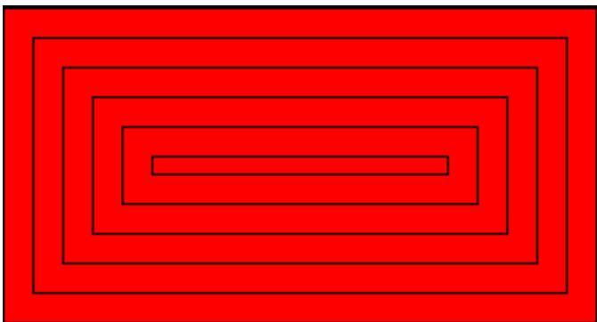
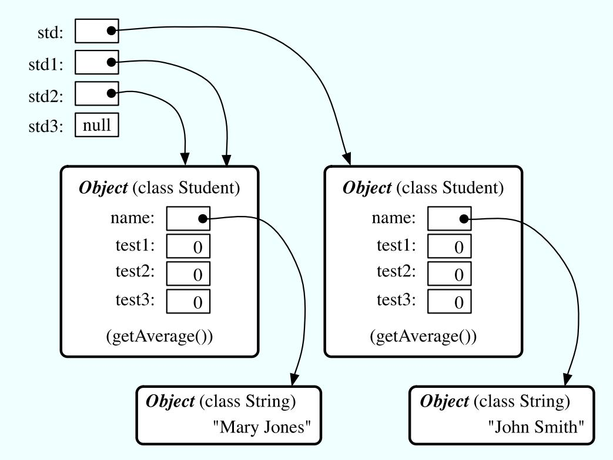

<!-- Source PDF pages 121-240 -->

## 3.4.3 Nested for Loops

Control structures in Java are statements that contain statements. In particular, control structures can contain control structures. You’ve already seen several examples of if statements inside loops, and one example of a while loop inside another while, but any combination of one control structure inside another is possible. We say that one structure is nested inside another. You can even have multiple levels of nesting, such as a while loop inside an if statement inside another while loop. The syntax of Java does not set a limit on the number of levels of nesting. As a practical matter, though, it’s dificult to understand a program that has more than a few levels of nesting.

Nested for loops arise naturally in many algorithms, and it is important to understand how they work. Let’s look at a couple of examples. First, consider the problem of printing out a multiplication table like this one:

<table><tr><td>1</td><td>2</td><td>3</td><td>4</td><td>5</td><td>6</td><td>7</td><td>8</td><td>9</td><td>10</td><td>11</td><td>12</td></tr><tr><td>2</td><td>4</td><td>6</td><td>8</td><td>10</td><td>12</td><td>14</td><td>16</td><td>18</td><td>20</td><td>22</td><td>24</td></tr><tr><td>3</td><td>6</td><td>9</td><td>12</td><td>15</td><td>18</td><td>21</td><td>24</td><td>27</td><td>30</td><td>33</td><td>36</td></tr><tr><td>4</td><td>8</td><td>12</td><td>16</td><td>20</td><td>24</td><td>28</td><td>32</td><td>36</td><td>40</td><td>44</td><td>48</td></tr><tr><td>5</td><td>10</td><td>15</td><td>20</td><td>25</td><td>30</td><td>35</td><td>40</td><td>45</td><td>50</td><td>55</td><td>60</td></tr><tr><td>6</td><td>12</td><td>18</td><td>24</td><td>30</td><td>36</td><td>42</td><td>48</td><td>54</td><td>60</td><td>66</td><td>72</td></tr><tr><td>7</td><td>14</td><td>21</td><td>28</td><td>35</td><td>42</td><td>49</td><td>56</td><td>63</td><td>70</td><td>77</td><td>84</td></tr><tr><td>8</td><td>16</td><td>24</td><td>32</td><td>40</td><td>48</td><td>56</td><td>64</td><td>72</td><td>80</td><td>88</td><td>96</td></tr><tr><td>9</td><td>18</td><td>27</td><td>36</td><td>45</td><td>54</td><td>63</td><td>72</td><td>81</td><td>90</td><td>99</td><td>108</td></tr><tr><td>10</td><td>20</td><td>30</td><td>40</td><td>50</td><td>60</td><td>70</td><td>80</td><td>90</td><td>100</td><td>110</td><td>120</td></tr><tr><td>11</td><td>22</td><td>33</td><td>44</td><td>55</td><td>66</td><td>77</td><td>88</td><td>99</td><td>110</td><td>121</td><td>132</td></tr><tr><td>12</td><td>24</td><td>36</td><td>48</td><td>60</td><td>72</td><td>84</td><td>96</td><td>108</td><td>120</td><td>132</td><td>144</td></tr></table>

The data in the table are arranged into 12 rows and 12 columns. The process of printing them out can be expressed in a pseudocode algorithm as

```python
for each rowNumber = 1, 2, 3, ..., 12:
    Print the first twelve multiples of rowNumber on one line
    Output a carriage return
```

The first step in the for loop can itself be expressed as a for loop. We can expand “Print the first twelve multiples of rowNumber on one line” as:

```python
for N = 1, 2, 3, ..., 12:
    Print N * rowNumber
```

so a refined algorithm for printing the table has one for loop nested inside another:

```python
for each rowNumber = 1, 2, 3, ..., 12:
    for N = 1, 2, 3, ..., 12:
        Print N * rowNumber
    Output a carriage return
```

We want to print the output in neat columns, with each output number taking up four spaces. This can be done using formatted output with format specifier %4d. Assuming that rowNumber and N have been declared to be variables of type int, the algorithm can be expressed in Java as

```txt
for ( rowNumber = 1; rowNumber <= 12; rowNumber++ ) {
    for ( N = 1; N <= 12; N++ ) {
        // print in 4-character columns
        System.out.printf( "%4d;, N * rowNumber ); // No carriage return !
    }
```

```txt
/**
 * This program reads a line of text entered by the user.
 * It prints a list of the letters that occur in the text,
 * and it reports how many different letters were found.
 */
```

```txt
System.out.println();  // Add a carriage return at end of the line.
}
```

This section has been weighed down with lots of examples of numerical processing. For our next example, let’s do some text processing. Consider the problem of finding which of the 26 letters of the alphabet occur in a given string. For example, the letters that occur in “Hello World” are D, E, H, L, O, R, and W. More specifically, we will write a program that will list all the letters contained in a string and will also count the number of diferent letters. The string will be input by the user. Let’s start with a pseudocode algorithm for the program.

```python
Ask the user to input a string
Read the response into a variable, str
Let count = 0 (for counting the number of different letters)
for each letter of the alphabet:
    if the letter occurs in str:
        Print the letter
        Add 1 to count
Output the count
```

Since we want to process the entire line of text that is entered by the user, we’ll use TextIO.getln() to read it. The line of the algorithm that reads “for each letter of the alphabet” can be expressed as “for (letter=’A’; letter<=’Z’; letter++)”. But the body of this for loop needs more thought. How do we check whether the given letter, letter, occurs in str? One idea is to look at each character in the string in turn, and check whether that character is equal to letter. We can get the i-th character of str with the function call str.charAt(i), where i ranges from 0 to str.length() - 1. One more dificulty: A letter such as ’A’ can occur in str in either upper or lower case, ’A’ or ’a’. We have to check for both of these. But we can avoid this dificulty by converting str to upper case before processing it. Then, we only have to check for the upper case letter. We can now flesh out the algorithm fully. Note the use of break in the nested for loop. It is required to avoid printing or counting a given letter more than once (in the case where it occurs more than once in the string). The break statement breaks out of the inner for loop, but not the outer for loop. Upon executing the break, the computer continues the outer loop with the next value of letter.

```python
Ask the user to input a string
Read the response into a variable, str
Convert str to upper case
Let count = 0
for letter = 'A', 'B', ..., 'Z':
    for i = 0, 1, ..., str.length()-1:
        if letter == str.charAt(i):
            Print letter
            Add 1 to count
            break // jump out of the loop
Output the count
```

Here is the complete program:

```java
public class ListLetters {
    public static void main(String[] args) {
        String str;  // Line of text entered by the user.
        int count;   // Number of different letters found in str.
        char letter; // A letter of the alphabet.

        TextIO.putln("Please type in a line of text.");
        str = TextIO.getln();

        str = str.toUpperCase();

        count = 0;
        TextIO.putln("Your input contains the following letters:");
        TextIO.putln();
        TextIO.put("  ");
        for ( letter = 'A'; letter <= 'Z'; letter++ ) {
            int i;  // Position of a character in str.
            for ( i = 0; i < str.length(); i++ ) {
                if ( letter == str.charAt(i) ) {
                    TextIO.put(letter);
                    TextIO.put(' ');
                    count++;
                    break;
                }
            }
        }

        TextIO.putln();
        TextIO.putln();
        TextIO.putln("There were " + count + " different letters.");
    } // end main()
} // end class ListLetters
```

In fact, there is actually an easier way to determine whether a given letter occurs in a string, str. The built-in function str.indexOf(letter) will return -1 if letter does not occur in the string. It returns a number greater than or equal to zero if it does occur. So, we could check whether letter occurs in str simply by checking “if (str.indexOf(letter) >= 0)”. If we used this technique in the above program, we wouldn’t need a nested for loop. This gives you a preview of how subroutines can be used to deal with complexity.

## 3.4.4 Enums and for-each Loops

Java 5.0 introduces a new “enhanced” form of the for loop that is designed to be convenient for processing data structures. A data structure is a collection of data items, considered as a unit. For example, a list is a data structure that consists simply of a sequence of items. The enhanced for loop makes it easy to apply the same processing to every element of a list or other data structure. Data structures are a major topic in computer science, but we won’t encounter them in any serious way until Chapter 7. However, one of the applications of the enhanced for loop is to enum types, and so we consider it briefly here. (Enums were introduced in Subsection 2.3.3.)

The enhanced for loop can be used to perform the same processing on each of the enum constants that are the possible values of an enumerated type. The syntax for doing this is:

```txt
for ( <enum-type-name>  <variable-name>  :  <enum-type-name>.values() )
    <statement>

for ( <enum-type-name>  <variable-name>  :  <enum-type-name>.values() ) {
    <statements>
}
```

If MyEnum is the name of any enumerated type, then MyEnum.values() is a function call that returns a list containing all of the values of the enum. (values() is a static member function in MyEnum and of any other enum.) For this enumerated type, the for loop would have the form:

```txt
for ( MyEnum  <variable-name> : MyEnum.values() )
    <statement>
```

The intent of this is to execute the hstatementi once for each of the possible values of the MyEnum type. The hvariable-namei is the loop control variable. In the hstatementi, it represents the enumerated type value that is currently being processed. This variable should not be declared before the for loop; it is essentially being declared in the loop itself.

To give a concrete example, suppose that the following enumerated type has been defined to represent the days of the week:

enum Day { MONDAY, TUESDAY, WEDNESDAY, THURSDAY, FRIDAY, SATURDAY, SUNDAY }

Then we could write:

```typescript
for ( Day d : Day.values() ) {
    System.out.print( d );
    System.out.print(" is day number ");
    System.out.println( d.ordinal() );
}
```

Day.values() represents the list containing the seven constants that make up the enumerated type. The first time through this loop, the value of d would be the first enumerated type value Day.MONDAY, which has ordinal number 0, so the output would be “MONDAY is day number 0”. The second time through the loop, the value of d would be Day.TUESDAY, and so on through Day.SUNDAY. The body of the loop is executed once for each item in the list Day.values(), with d taking on each of those values in turn. The full output from this loop would be:

```txt
MONDAY is day number 0
TUESDAY is day number 1
WEDNESDAY is day number 2
THURSDAY is day number 3
FRIDAY is day number 4
SATURDAY is day number 5
SUNDAY is day number 6
```

Since the intent of the enhanced for loop is to do something “for each” item in a data structure, it is often called a for-each loop. The syntax for this type of loop is unfortunate. It would be better if it were written something like “foreach Day d in Day.values()”, which conveys the meaning much better and is similar to the syntax used in other programming languages for similar types of loops. It’s helpful to think of the colon (:) in the loop as meaning “in.”

## 3.5 The if Statement

The first of the two branching statements in Java is the if statement, which you have already seen in Section 3.1. It takes the form

```txt
if (⟨boolean-expression⟩)
    ⟨statement-1⟩
else
    ⟨statement-2⟩
```

As usual, the statements inside an if statements can be blocks. The if statement represents a two-way branch. The else part of an if statement—consisting of the word “else” and the statement that follows it—can be omitted.

## 3.5.1 The Dangling else Problem

Now, an if statement is, in particular, a statement. This means that either hstatement-1 i or hstatement-2i in the above if statement can itself be an if statement. A problem arises, however, if hstatement-1 i is an if statement that has no else part. This special case is efectively forbidden by the syntax of Java. Suppose, for example, that you type

```txt
if ( x > 0 )
    if (y > 0)
        System.out.println("First case");
else
    System.out.println("Second case");
```

Now, remember that the way you’ve indented this doesn’t mean anything at all to the computer. You might think that the else part is the second half of your “if (x > 0)” statement, but the rule that the computer follows attaches the else to “if (y > 0)”, which is closer. That is, the computer reads your statement as if it were formatted:

```txt
if ( x > 0 )
    if (y > 0)
        System.out.println("First case");
    else
        System.out.println("Second case");
```

You can force the computer to use the other interpretation by enclosing the nested if in a block:

```java
if ( x > 0 ) {
    if (y > 0)
        System.out.println("First case");
}
else
    System.out.println("Second case");
```

These two if statements have diferent meanings: In the case when x <= 0, the first statement doesn’t print anything, but the second statement prints “Second case.”.

## 3.5.2 The if...else if Construction

Much more interesting than this technicality is the case where hstatement-2i, the else part of the if statement, is itself an if statement. The statement would look like this (perhaps without the final else part):

```txt
if (<boolean-expression-1>)
    <statement-1>
else
    if (<boolean-expression-2>)
        <statement-2>
    else
        <statement-3>
```

However, since the computer doesn’t care how a program is laid out on the page, this is almost always written in the format:

```txt
if (⟨boolean-expression-1⟩)
    ⟨statement-1⟩
else if (⟨boolean-expression-2⟩)
    ⟨statement-2⟩
else
    ⟨statement-3⟩
```

You should think of this as a single statement representing a three-way branch. When the computer executes this, one and only one of the three statements—hstatement-1 i, hstatement-2i, or hstatement-3i—will be executed. The computer starts by evaluating hboolean-expression-1 i. If it is true, the computer executes hstatement-1 i and then jumps all the way to the end of the outer if statement, skipping the other two hstatementis. If hboolean-expression-1 i is false, the computer skips hstatement-1 i and executes the second, nested if statement. To do this, it tests the value of hboolean-expression-2i and uses it to decide between hstatement-2i and hstatement-3i.

Here is an example that will print out one of three diferent messages, depending on the value of a variable named temperature:

```txt
if (temperature < 50)
    System.out.println("It's cold.");
else if (temperature < 80)
    System.out.println("It's nice.");
else
    System.out.println("It's hot.");
```

If temperature is, say, 42, the first test is true. The computer prints out the message “It’s cold”, and skips the rest—without even evaluating the second condition. For a temperature of 75, the first test is false, so the computer goes on to the second test. This test is true, so the computer prints “It’s nice” and skips the rest. If the temperature is 173, both of the tests evaluate to false, so the computer says “It’s hot” (unless its circuits have been fried by the heat, that is).

You can go on stringing together “else-if’s” to make multi-way branches with any number of cases:

```lisp
if (⟨boolean-expression-1⟩)
    ⟨statement-1⟩
else if (⟨boolean-expression-2⟩)
    ⟨statement-2⟩
else if (⟨boolean-expression-3⟩)
    ⟨statement-3⟩
.
. // (more cases)
.
```

<div class="mineru-algorithm" style="white-space: pre-wrap; font-family:monospace;">
else if ($\langle$boolean-expression-$N\rangle$)
    $\langle statement-N\rangle$
else
    $\langle statement-(N+1)\rangle$
</div>

The computer evaluates boolean expressions one after the other until it comes to one that is true. It executes the associated statement and skips the rest. If none of the boolean expressions evaluate to true, then the statement in the else part is executed. This statement is called a multi-way branch because only one of the statements will be executed. The final else part can be omitted. In that case, if all the boolean expressions are false, none of the statements is executed. Of course, each of the statements can be a block, consisting of a number of statements enclosed between { and }. (Admittedly, there is lot of syntax here; as you study and practice, you’ll become comfortable with it.)

## 3.5.3 If Statement Examples

As an example of using if statements, lets suppose that x, y, and z are variables of type int, and that each variable has already been assigned a value. Consider the problem of printing out the values of the three variables in increasing order. For examples, if the values are 42, 17, and 20, then the output should be in the order 17, 20, 42.

One way to approach this is to ask, where does x belong in the list? It comes first if it’s less than both y and z. It comes last if it’s greater than both y and z. Otherwise, it comes in the middle. We can express this with a 3-way if statement, but we still have to worry about the order in which y and z should be printed. In pseudocode,

```awk
if (x < y && x < z) {
    output x, followed by y and z in their correct order
}
else if (x > y && x > z) {
    output y and z in their correct order, followed by x
}
else {
    output x in between y and z in their correct order
}
```

Determining the relative order of y and z requires another if statement, so this becomes

```txt
if (x < y && x < z) {          // x comes first
    if (y < z)
        System.out.println( x + " " + y + " " + z );
    else
        System.out.println( x + " " + z + " " + y );
}
else if (x > y && x > z) {   // x comes last
    if (y < z)
        System.out.println( y + " " + z + " " + x );
    else
        System.out.println( z + " " + y + " " + x );
}
else {                       // x in the middle
    if (y < z)
        System.out.println( y + " " + x + " " + z );
    else
```

```javascript
System.out.println( z + " " + x + " " + y );
```

You might check that this code will work correctly even if some of the values are the same. If the values of two variables are the same, it doesn’t matter which order you print them in.

Note, by the way, that even though you can say in English “if x is less than y and ${ \bf z } , \ '$ you can’t say in Java “if $( \mathbf { x } \ < \ \mathbf { y } \ \& \& \ z ) ^ { \prime \prime }$ . The && operator can only be used between boolean values, so you have to make separate tests, x<y and x<z, and then combine the two tests with &&.

There is an alternative approach to this problem that begins by asking, “which order should x and y be printed in?” Once that’s known, you only have to decide where to stick in z. This line of thought leads to diferent Java code:

```txt
if ( x < y ) {  // x comes before y
    if ( z < x )   // z comes first
        System.out.println( z + " " + x + " " + y);
    else if ( z > y )   // z comes last
        System.out.println( x + " " + y + " " + z);
    else   // z is in the middle
        System.out.println( x + " " + z + " " + y);
}
else {            // y comes before x
    if ( z < y )   // z comes first
        System.out.println( z + " " + y + " " + x);
    else if ( z > x )  // z comes last
        System.out.println( y + " " + x + " " + z);
    else  // z is in the middle
        System.out.println( y + " " + z + " " + x);
}
```

Once again, we see how the same problem can be solved in many diferent ways. The two approaches to this problem have not exhausted all the possibilities. For example, you might start by testing whether x is greater than y. If so, you could swap their values. Once you’ve done that, you know that x should be printed before y.

Finally, let’s write a complete program that uses an if statement in an interesting way. I want a program that will convert measurements of length from one unit of measurement to another, such as miles to yards or inches to feet. So far, the problem is extremely underspecified. Let’s say that the program will only deal with measurements in inches, feet, yards, and miles. It would be easy to extend it later to deal with other units. The user will type in a measurement in one of these units, such as “17 feet” or “2.73 miles”. The output will show the length in terms of each of the four units of measure. (This is easier than asking the user which units to use in the output.) An outline of the process is

```txt
Read the user's input measurement and units of measure Express the measurement in inches, feet, yards, and miles Display the four results
```

The program can read both parts of the user’s input from the same line by using TextIO.getDouble() to read the numerical measurement and TextIO.getlnWord() to read the unit of measure. The conversion into diferent units of measure can be simplified by first converting the user’s input into inches. From there, the number of inches can easily be converted into feet, yards, and miles. Before converting into inches, we have to test the input to determine which unit of measure the user has specified:

```txt
Let measurement = TextIO.getDouble()
Let units = TextIO.getlnWord()
if the units are inches
    Let inches = measurement
else if the units are feet
    Let inches = measurement * 12          // 12 inches per foot
else if the units are yards
    Let inches = measurement * 36          // 36 inches per yard
else if the units are miles
    Let inches = measurement * 12 * 5280  // 5280 feet per mile
else
    The units are illegal!
    Print an error message and stop processing
Let feet = inches / 12.0
Let yards = inches / 36.0
Let miles = inches / (12.0 * 5280.0)
Display the results
```

Since units is a String, we can use units.equals("inches") to check whether the specified unit of measure is “inches”. However, it would be nice to allow the units to be specified as “inch” or abbreviated to “in”. To allow these three possibilities, we can check if (units.equals("inches") || units.equals("inch") || units.equals("in")). It would also be nice to allow upper case letters, as in “Inches” or “IN”. We can do this by converting units to lower case before testing it or by substituting the function units.equalsIgnoreCase for units.equals.

In my final program, I decided to make things more interesting by allowing the user to enter a whole sequence of measurements. The program will end only when the user inputs 0. To do this, I just have to wrap the above algorithm inside a while loop, and make sure that the loop ends when the user inputs a 0. Here’s the complete program:

```java
/*
 * This program will convert measurements expressed in inches,
 * feet, yards, or miles into each of the possible units of
 * measure.  The measurement is input by the user, followed by
 * the unit of measure.  For example: "17 feet", "1 inch",
 * "2.73 mi".  Abbreviations in, ft, yd, and mi are accepted.
 * The program will continue to read and convert measurements
 * until the user enters an input of 0.
 */
public class LengthConverter {

    public static void main(String[] args) {

        double measurement;  // Numerical measurement, input by user.
        String units;          // The unit of measure for the input, also
                       //     specified by the user.

        double inches, feet, yards, miles;  // Measurement expressed in
                       //   each possible unit of
                       //   measure.
```

```txt
TextIO.putln("Enter measurements in inches, feet, yards, or miles.");
TextIO.putln("For example: 1 inch 17 feet 2.73 miles");
TextIO.putln("You can use abbreviations: in ft yd mi");
TextIO.putln("I will convert your input into the other units");
TextIO.putln("of measure.");
TextIO.putln();

while (true) {
    /* Get the user's input, and convert units to lower case. */
    TextIO.put("Enter your measurement, or 0 to end: ");
    measurement = TextIO.getDouble();
    if (measurement == 0)
        break; // Terminate the while loop.
    units = TextIO.getlnWord();
    units = units.toLowerCase();

    /* Convert the input measurement to inches. */
    if (units.equals("inch") || units.equals("inches")
                                || units.equals("in")) {
        inches = measurement;
    }
    else if (units.equals("foot") || units.equals("feet")
                                || units.equals("ft")) {
        inches = measurement * 12;
    }
    else if (units.equals("yard") || units.equals("yards")
                                || units.equals("yd")) {
        inches = measurement * 36;
    }
    else if (units.equals("mile") || units.equals("miles")
                                || units.equals("mi")) {
        inches = measurement * 12 * 5280;
    }
    else {
        TextIO.putln("Sorry, but I don't understand \""
                                    + units + "\".");
        continue; // back to start of while loop
    }

    /* Convert measurement in inches to feet, yards, and miles. */
    feet = inches / 12;
    yards = inches / 36;
    miles = inches / (12*5280);

    /* Output measurement in terms of each unit of measure. */
    TextIO.putln();
    TextIO.putln("That's equivalent to:");
    TextIO.printf("%12.5g", inches);
    TextIO.putln(" inches");
    TextIO.putln("%12.5g", feet);
    TextIO.putln(" feet");
    TextIO.putf("%12.5g", yards);
```

```javascript
TextIO.putln(" yards");
TextIO.printf("%12.5g", miles);
TextIO.putln(" miles");
TextIO.putln();

} // end while

TextIO.putln();
TextIO.putln("OK!  Bye for now.");
} // end main()
} // end class LengthConverter
```

(Note that this program uses formatted output with the “g” format specifier. In this program, we have no control over how large or how small the numbers might be. It could easily make sense for the user to enter very large or very small measurements. The “g” format will print a real number in exponential form if it is very large or very small, and in the usual decimal form otherwise. Remember that in the format specification %12.5g, the 5 is the total number of significant digits that are to be printed, so we will always get the same number of signifant digits in the output, no matter what the size of the number. If we had used an “f” format specifier such as %12.5f, the output would be in decimal form with 5 digits after the decimal point. This would print the number 0.0000000007454 as 0.00000, with no significant digits at all! With the “g” format specifier, the output would be 7.454e-10.)

## 3.5.4 The Empty Statement

As a final note in this section, I will mention one more type of statement in Java: the empty statement. This is a statement that consists simply of a semicolon and which tells the computer to do nothing. The existence of the empty statement makes the following legal, even though you would not ordinarily see a semicolon after a } :

```javascript
if (x < 0) {
    x = -x;
};
```

The semicolon is legal after the }, but the computer considers it to be an empty statement, not part of the if statement. Occasionally, you might find yourself using the empty statement when what you mean is, in fact, “do nothing”. For example, the rather contrived if statement

```txt
if ( done )
    ;  // Empty statement
else
    System.out.println( "Not done yet. );
```

does nothing when the boolean variable done is true, and prints out “Not done yet” when it is false. You can’t just leave out the semicolon in this example, since Java syntax requires an actual statement between the if and the else. I prefer, though, to use an empty block, consisting of { and } with nothing between, for such cases.

Occasionally, stray empty statements can cause annoying, hard-to-find errors in a program. For example, the following program segment prints out “Hello” just once, not ten times:

```txt
for (int i = 0; i < 10; i++);
    System.out.println("Hello");
```

Why? Because the “;” at the end of the first line is a statement, and it is this statement that is executed ten times. The System.out.println statement is not really inside the for statement at all, so it is executed just once, after the for loop has completed.

## 3.6 The switch Statement

The second branching statement in Java is the switch statement, which is introduced in this section. The switch statement is used far less often than the if statement, but it is sometimes useful for expressing a certain type of multi-way branch.

## 3.6.1 The Basic switch Statement

A switch statement allows you to test the value of an expression and, depending on that value, to jump directly to some location within the switch statement. Only expressions of certain types can be used. The value of the expression can be one of the primitive integer types int, short, or byte. It can be the primitive char type. Or, as we will see later in this section, it can be an enumuerated type. In particular, the expression cannot be a String or a real number. The positions that you can jump to are marked with case labels that take the form: “case hconstanti:”. This marks the position the computer jumps to when the expression evaluates to the given hconstanti. As the final case in a switch statement you can, optionally, use the label “default:”, which provides a default jump point that is used when the value of the expression is not listed in any case label.

A switch statement, as it is most oftern used, has the form:

```txt
switch (expression) {
    case <constant-1>:
        <statements-1>
        break;
    case <constant-2>:
        <statements-2>
        break;
        .
        . // (more cases)
        .
    case <constant-N>:
        <statements-N>
        break;
    default: // optional default case
    <statements-(N+1)>
} // end of switch statement
```

The break statements are technically optional. The efect of a break is to make the computer jump to the end of the switch statement. If you leave out the break statement, the computer will just forge ahead after completing one case and will execute the statements associated with the next case label. This is rarely what you want, but it is legal. (I will note here—although you won’t understand it until you get to the next chapter—that inside a subroutine, the break statement is sometimes replaced by a return statement.)

Note that you can leave out one of the groups of statements entirely (including the break). You then have two case labels in a row, containing two diferent constants. This just means that the computer will jump to the same place and perform the same action for each of the two constants.

Here is an example of a switch statement. This is not a useful example, but it should be easy for you to follow. Note, by the way, that the constants in the case labels don’t have to be in any particular order, as long as they are all diferent:

```txt
switch ( N ) {   // (Assume N is an integer variable.)
    case 1:
        System.out.println("The number is 1.");
        break;
    case 2:
    case 4:
    case 8:
        System.out.println("The number is 2, 4, or 8.");
        System.out.println("(That's a power of 2!)");
        break;
    case 3:
    case 6:
    case 9:
        System.out.println("The number is 3, 6, or 9.");
        System.out.println("(That's a multiple of 3!)");
        break;
    case 5:
        System.out.println("The number is 5.");
        break;
    default:
        System.out.println("The number is 7 or is outside the range 1 to 9.");
}
```

The switch statement is pretty primitive as control structures go, and it’s easy to make mistakes when you use it. Java takes all its control structures directly from the older programming languages C and C++. The switch statement is certainly one place where the designers of Java should have introduced some improvements.

## 3.6.2 Menus and switch Statements

One application of switch statements is in processing menus. A menu is a list of options. The user selects one of the options. The computer has to respond to each possible choice in a diferent way. If the options are numbered 1, 2, . . . , then the number of the chosen option can be used in a switch statement to select the proper response.

In a TextIO-based program, the menu can be presented as a numbered list of options, and the user can choose an option by typing in its number. Here is an example that could be used in a variation of the LengthConverter example from the previous section:

```txt
int optionNumber; // Option number from menu, selected by user.
double measurement; // A numerical measurement, input by the user.
// The unit of measurement depends on which
// option the user has selected.
double inches; // The same measurement, converted into inches.
/* Display menu and get user's selected option number. */
TextIO.putln("What unit of measurement does your input use?");
TextIO.putln();
```

```txt
TextIO.putln("          1. inches");
TextIO.putln("          2. feet");
TextIO.putln("          3. yards");
TextIO.putln("          4. miles");
TextIO.putln();
TextIO.putln("Enter the number of your choice: ");
optionNumber = TextIO.getlnInt();

/* Read user's measurement and convert to inches. */
switch ( optionNumber ) {
    case 1:
        TextIO.putln("Enter the number of inches: ");
        measurement = TextIO.getlnDouble();
        inches = measurement;
        break;
    case 2:
        TextIO.putln("Enter the number of feet: ");
        measurement = TextIO.getlnDouble();
        inches = measurement * 12;
        break;
    case 3:
        TextIO.putln("Enter the number of yards: ");
        measurement = TextIO.getlnDouble();
        inches = measurement * 36;
        break;
    case 4:
        TextIO.putln("Enter the number of miles: ");
        measurement = TextIO.getlnDouble();
        inches = measurement * 12 * 5280;
        break;
    default:
        TextIO.putln("Error! Illegal option number! I quit!");
        System.exit(1);
} // end switch

/* Now go on to convert inches to feet, yards, and miles... */
```

## 3.6.3 Enums in switch Statements

The type of the expression in a switch can be an enumerated type. In that case, the constants in the case labels must be values from the enumerated type. For example, if the type of the expression is the enumerated type Season defined by

## enum Season { SPRING, SUMMER, FALL, WINTER }

then the constants in the case label must be chosen from among the values Season.SPRING, Season.SUMMER, Season.FALL, or Season.WINTER. However, there is another quirk in the syntax: when an enum constant is used in a case label, only the simple name, such as “SPRING” can be used, not the full name “Season.SPRING”. Of course, the computer already knows that the value in the case label must belong to the enumerated type, since it can tell that from the type of expression used, so there is really no need to specify the type name in the constant. As an example, suppose that currentSeason is a variable of type Season. Then we could have the switch statement:

## 3.6. THE SWITCH STATEMENT

```txt
switch ( currentSeason ) {
    case WINTER:      // ( NOT Season.WINTER ! )
        System.out.println("December, January, February");
        break;
    case SPRING:
        System.out.println("March, April, May");
        break;
    case SUMMER:
        System.out.println("June, July, August");
        break;
    case FALL:
        System.out.println("September, October, November");
        break;
}
```

## 3.6.4 Definite Assignment

As a somwhat more realistic example, the following switch statement makes a random choice among three possible alternatives. Recall that the value of the expression (int)(3\*Math.random()) is one of the integers 0, 1, or 2, selected at random with equal probability, so the switch statement below will assign one of the values "Rock", "Scissors", "Paper" to computerMove, with probability 1/3 for each case. Although the switch statement in this example is correct, this code segment as a whole illustrates a subtle syntax error that sometimes comes up:

```txt
String computerMove;
switch ((int)(3*Math.random())) {
    case 0:
        computerMove = "Rock";
        break;
    case 1:
        computerMove = "Scissors";
        break;
    case 2:
        computerMove = "Paper";
        break;
}
System.out.println("Computer's move is " + computerMove); // ERROR!
```

You probably haven’t spotted the error, since it’s not an error from a human point of view. The computer reports the last line to be an error, because the variable computerMove might not have been assigned a value. In Java, it is only legal to use the value of a variable if a value has already been definitely assigned to that variable. This means that the computer must be able to prove, just from looking at the code when the program is compiled, that the variable must have been assigned a value. Unfortunately, the computer only has a few simple rules that it can apply to make the determination. In this case, it sees a switch statement in which the type of expression is int and in which the cases that are covered are 0, 1, and 2. For other values of the expression, computerMove is never assigned a value. So, the computer thinks computerMove might still be undefined after the switch statement. Now, in fact, this isn’t true: 0, 1, and 2 are actually the only possible values of the expression (int)(3\*Math.random()), but the computer isn’t smart enough to figure that out. The easiest way to fix the problem is to replace the case label case 2 with default. The computer can see that a value is assigned to computerMove in all cases.

More generally, we say that a value has been definitely assigned to a variable at a given point in a program if every execution path leading from the declaration of the variable to that point in the code includes an assignment to the variable. This rule takes into account loops and if statements as well as switch statements. For example, the following two if statements both do the same thing as the switch statement given above, but only the one on the right definitely assigns a value to computerMove:

```matlab
String computerMove;
int rand;
rand = (int)(3*Math.random());
if ( rand == 0 )
    computerMove = "Rock";
else if ( rand == 1 )
    computerMove = "Scissors";
else if ( rand == 2 )
    computerMove = "Paper";
```

In the code on the left, the test “if ( rand == 2 )” in the final else clause is unnecessary because if rand is not 0 or 1, the only remaining possibility is that rand == 2. The computer, however, can’t figure that out.

## 3.7 Introduction to Exceptions and try..catch

In addition to the control structures that determine the normal flow of control in a program, Java has a way to deal with “exceptional” cases that throw the flow of control of its normal track. When an error occurs during the execution of a program, the default behavior is to terminate the program and to print an error message. However, Java makes it possible to “catch” such errors and program a response diferent from simply letting the program crash. This is done with the try..catch statement. In this section, we will take a preliminary, incomplete look at using try..catch to handle errors. Error handling is a complex topic, which we will return to in Chapter 8.

## 3.7.1 Exceptions

The term exception is used to refer to the type of error that one might want to handle with a try..catch. An exception is an exception to the normal flow of control in the program. The term is used in preference to “error” because in some cases, an exception might not be considered to be an error at all. You can sometimes think of an exception as just another way to organize a program.

Exceptions in Java are represented as objects of type Exception. Actual exceptions are defined by subclasses of Exception. Diferent subclasses represent diferent types of exceptions We will look at only two types of exception in this section: NumberFormatException and IllegalArgumentException.

A NumberFormatException can occur when an attempt is made to convert a string into a number. Such conversions are done by the functions Integer.parseInt and Integer.parseDouble. (See Subsection 2.5.7.) Consider the function call Integer.parseInt(str) where str is a variable of type String. If the value of str is the string "42", then the function call will correctly convert the string into the int 42. However, if the value of str is, say, "fred", the function call will fail because "fred" is not a legal string representation of an int value. In this case, an exception of type NumberFormatException occurs. If nothing is done to handle the exception, the program will crash.

An IllegalArgumentException can occur when an illegal value is passed as a parameter to a subroutine. For example, if a subroutine requires that a parameter be greater than or equal to zero, an IllegalArgumentException might occur when a negative value is passed to the subroutine. How to respond to the illegal value is up to the person who wrote the subroutine, so we can’t simply say that every illegal parameter value will result in an IllegalArgumentException. However, it is a common response.

One case where an IllegalArgumentException can occur is in the valueOf function of an enumerated type. Recall from Subsection 2.3.3 that this function tries to convert a string into one of the values of the enumerated type. If the string that is passed as a parameter to valueOf is not the name of one of the enumerated type’s values, then an IllegalArgumentException occurs. For example, given the enumerated type

```txt
enum Toss { HEADS, TAILS }
```

Toss.valueOf("HEADS") correctly returns the value Toss.HEADS, while Toss.valueOf("FEET") results in an IllegalArgumentException.

## 3.7.2 try..catch

When an exception occurs, we say that the exception is “thrown”. For example, we say that Integer.parseInt(str) throws an exception of type NumberFormatException when the value of str is illegal. When an exception is thrown, it is possible to “catch” the exception and prevent it from crashing the program. This is done with a try..catch statement. In somewhat simplified form, the syntax for a try..catch is:

```txt
try {
    <statements-1>
}
catch ( <exception-class-name>  <variable-name>) {
    <statements-2>
}
```

The hexception-class-namei could be NumberFormatException, IllegalArgumentException, or some other exception class. When the computer executes this statement, it executes the statements in the try part. If no error occurs during the execution of hstatements-1 i, then the computer just skips over the catch part and proceeds with the rest of the program. However, if an exception of type hexception-class-namei occurs during the execution of hstatements-1 i, the computer immediately jumps to the catch part and executes hstatements-2i, skipping any remaining statements in hstatements-1 i. During the execution of hstatements-2i, the hvariablenamei represents the exception object, so that you can, for example, print it out. At the end of the catch part, the computer proceeds with the rest of the program; the exception has been caught and handled and does not crash the program. Note that only one type of exception is caught; if some other type of exception occurs during the execution of hstatements-1 i, it will crash the program as usual.

(By the way, note that the braces, { and }, are part of the syntax of the try..catch statement. They are required even if there is only one statement between the braces. This is diferent from the other statements we have seen, where the braces around a single statement are optional.)

As an example, suppose that str is a variable of type String whose value might or might not represent a legal real number. Then we could say:

```txt
try {
    double x;
    x = Double.parseDouble(str);
    System.out.println( "The number is " + x );
}
catch ( NumberFormatException e ) {
    System.out.println( "Not a legal number." );
}
```

If an error is thrown by the call to Double.parseDouble(str), then the output statement in the try part is skipped, and the statement in the catch part is executed.

It’s not always a good idea to catch exceptions and continue with the program. Often that can just lead to an even bigger mess later on, and it might be better just to let the exception crash the program at the point where it occurs. However, sometimes it’s possible to recover from an error. For example, suppose that we have the enumerated type

## enum Day { MONDAY, TUESDAY, WEDNESDAY, THURSDAY, FRIDAY, SATURDAY, SUNDAY }

and we want the user to input a value belonging to this type. TextIO does not know about this type, so we can only read the user’s response as a string. The function Day.valueOf can be used to convert the user’s response to a value of type Day. This will throw an exception of type IllegalArgumentException if the user’s response is not the name of one of the values of type Day, but we can respond to the error easily enough by asking the user to enter another response. Here is a code segment that does this. (Converting the user’s response to upper case will allow responses such as “Monday” or “monday” in addition to “MONDAY”.)

```txt
Day weekday; // User's response as a value of type Day.
while ( true ) {
    String response; // User's response as a String.
    TextIO.put("Please enter a day of the week: ");
    response = TextIO.getln();
    response = response.toUpperCase();
    try {
        weekday = Day.valueOf(response);
        break;
    }
    catch ( IllegalArgumentException e ) {
        TextIO.putln( response + " is not the name of a day of the week." );
    }
}
```

The break statement will be reached only if the user’s response is acceptable, and so the loop will end only when a legal value has been assigned to weekday.

## 3.7.3 Exceptions in TextIO

When TextIO reads a numeric value from the user, it makes sure that the user’s response is legal, using a technique similar to the while loop and try..catch in the previous example. However, TextIO can read data from other sources besides the user. (See Subsection 2.4.5.) When it is reading from a file, there is no reasonable way for TextIO to recover from an illegal value in the input, so it responds by throwing an exception. To keep things simple, TextIO only throws exceptions of type IllegalArgumentException, no matter what type of error it encounters. For example, an exception will occur if an attempt is made to read from a file after all the data in the file has already been read. In TextIO, the exception is of type IllegalArgumentException. If you have a better response to file errors than to let the program crash, you can use a try..catch to catch exceptions of type IllegalArgumentException.

For example, suppose that a file contains nothing but real numbers, and we want a program that will read the numbers and find their sum and their average. Since it is unknown how many numbers are in the file, there is the question of when to stop reading. One approach is simply to try to keep reading indefinitely. When the end of the file is reached, an exception occurs. This exception is not really an error—it’s just a way of detecting the end of the data, so we can catch the exception and finish up the program. We can read the data in a while (true) loop and break out of the loop when an exception occurs. This is an example of the somewhat unusual technique of using an exception as part of the expected flow of control in a program.

To read from the file, we need to know the file’s name. To make the program more general, we can let the user enter the file name, instead of hard-coding a fixed file name in the program. However, it is possible that the user will enter the name of a file that does not exist. When we use TextIO.readfile to open a file that does not exist, an exception of type IllegalArgumentException occurs. We can catch this exception and ask the user to enter a diferent file name. Here is a complete program that uses all these ideas:

```java
/**
 * This program reads numbers from a file.  It computes the sum and
 * the average of the numbers that it reads.  The file should contain
 * nothing but numbers of type double; if this is not the case, the
 * output will be the sum and average of however many numbers were
 * successfully read from the file.  The name of the file will be
 * input by the user.
 */
public class ReadNumbersFromFile {
    public static void main(String[] args) {
        while (true) {
            String fileName;  // The name of the file, to be input by the user.
            TextIO.put("Enter the name of the file: ");
            fileName = TextIO.getln();
            try {
                TextIO.readFile( fileName );  // Try to open the file for input.
                break;  // If that succeeds, break out of the loop.
            }
            catch ( IllegalArgumentException e ) {
                TextIO.putln("Can't read from the file \"\" + fileName + "\".");
                TextIO.putln("Please try again.\n");
            }
        }
        // At this point, TextIO is reading from the file.
        double number;  // A number read from the data file.
        double sum;      // The sum of all the numbers read so far.
        int count;       // The number of numbers that were read.
        sum = 0;
```

```javascript
count = 0;

try {
    while (true) { // Loop ends when an exception occurs.
        number = TextIO.getDouble();
        count++;  // This is skipped when the exception occurs
        sum += number;
    }
}
catch ( IllegalArgumentException e ) {
    // We expect this to occur when the end-of-file is encountered.
    // We don't consider this to be an error, so there is nothing to do
    // in this catch clause. Just proceed with the rest of the program.
}

// At this point, we've read the entire file.

TextIO.putln();
TextIO.putln("Number of data values read: " + count);
TextIO.putln("The sum of the data values: " + sum);
if ( count == 0 )
    TextIO.putln("Can't compute an average of 0 values.");
else
    TextIO.putln("The average of the values: " + (sum/count));
}
}
```

## 3.8 Introduction to GUI Programming

For the past two chapters, you’ve been learning the sort of programming that is done inside a single subroutine. In the rest of the text, we’ll be more concerned with the larger scale structure of programs, but the material that you’ve already learned will be an important foundation for everything to come.

In this section, before moving on to programming-in-the-large, we’ll take a look at how programming-in-the-small can be used in other contexts besides text-based, command-linestyle programs. We’ll do this by taking a short, introductory look at applets and graphical programming.

An applet is a Java program that runs on a Web page. An applet is not a stand-alone application, and it does not have a main() routine. In fact, an applet is an object rather than a class. When Java first appeared on the scene, applets were one of its major appeals. Since then, they have become less important, although they can still be very useful. When we study GUI programming in Chapter 6, we will concentrate on stand-alone GUI programs rather than on applets, but applets are a good place to start for our first look at the subject.

When an applet is placed on a Web page, it is assigned a rectangular area on the page. It is the job of the applet to draw the contents of that rectangle. When the region needs to be drawn, the Web page calls a subroutine in the applet to do so. This is not so diferent from what happens with stand-alone programs. When such a program needs to be run, the system calls the main() routine of the program. Similarly, when an applet needs to be drawn, the Web page calls the paint() routine of the applet. The programmer specifies what happens when these routines are called by filling in the bodies of the routines. Programming in the small! Applets can do other things besides draw themselves, such as responding when the user clicks the mouse on the applet. Each of the applet’s behaviors is defined by a subroutine. The programmer specifies how the applet behaves by filling in the bodies of the appropriate subroutines.

A very simple applet, which does nothing but draw itself, can be defined by a class that contains nothing but a paint() routine. The source code for the class would then have the form:

```java
import java.awt.*;
import java.applet.*;

public class <name-of-applet> extends Applet {
    public void paint(Graphics g) {
        <statements>
    }
}
```

where hname-of-appleti is an identifier that names the class, and the hstatementsi are the code that actually draws the applet. This looks similar to the definition of a stand-alone program, but there are a few things here that need to be explained, starting with the first two lines.

When you write a program, there are certain built-in classes that are available for you to use. These built-in classes include System and Math. If you want to use one of these classes, you don’t have to do anything special. You just go ahead and use it. But Java also has a large number of standard classes that are there if you want them but that are not automatically available to your program. (There are just too many of them.) If you want to use these classes in your program, you have to ask for them first. The standard classes are grouped into so-called “packages.” Two of these packages are called “java.awt” and “java.applet”. The directive “import java.awt.\*;” makes all the classes from the package java.awt available for use in your program. The java.awt package contains classes related to graphical user interface programming, including a class called Graphics. The Graphics class is referred to in the paint() routine above. The java.applet package contains classes specifically related to applets, including the class named Applet.

The first line of the class definition above says that the class “extends Applet.” Applet is a standard class that is defined in the java.applet package. It defines all the basic properties and behaviors of applet objects. By extending the Applet class, the new class we are defining inherits all those properties and behaviors. We only have to define the ways in which our class difers from the basic Applet class. In our case, the only diference is that our applet will draw itself diferently, so we only have to define the paint() routine that does the drawing. This is one of the main advantages of object-oriented programming.

(Actually, in the future, our applets will be defined to extend JApplet rather than Applet. The JApplet class is itself an extension of Applet. The Applet class has existed since the original version of Java, while JApplet is part of the newer “Swing” set of graphical user interface components. For the moment, the distinction is not important.)

One more thing needs to be mentioned—and this is a point where Java’s syntax gets unfortunately confusing. Applets are objects, not classes. Instead of being static members of a class, the subroutines that define the applet’s behavior are part of the applet object. We say that they are “non-static” subroutines. Of course, objects are related to classes because every object is described by a class. Now here is the part that can get confusing: Even though a non-static subroutine is not actually part of a class (in the sense of being part of the behavior of the class), it is nevertheless defined in a class (in the sense that the Java code that defines the subroutine is part of the Java code that defines the class). Many objects can be described by the same class. Each object has its own non-static subroutine. But the common definition of those subroutines—the actual Java source code—is physically part of the class that describes all the objects. To put it briefly: static subroutines in a class definition say what the class does; non-static subroutines say what all the objects described by the class do. An applet’s paint() routine is an example of a non-static subroutine. A stand-alone program’s main() routine is an example of a static subroutine. The distinction doesn’t really matter too much at this point: When working with stand-alone programs, mark everything with the reserved word, “static”; leave it out when working with applets. However, the distinction between static and non-static will become more important later in the course.

## ∗ ∗ ∗

Let’s write an applet that draws something. In order to write an applet that draws something, you need to know what subroutines are available for drawing, just as in writing textoriented programs you need to know what subroutines are available for reading and writing text. In Java, the built-in drawing subroutines are found in objects of the class Graphics, one of the classes in the java.awt package. In an applet’s paint() routine, you can use the Graphics object g for drawing. (This object is provided as a parameter to the paint() routine when that routine is called.) Graphics objects contain many subroutines. I’ll mention just three of them here. You’ll encounter more of them in Chapter 6.

• g.setColor(c), is called to set the color that is used for drawing. The parameter, c is an object belonging to a class named Color, another one of the classes in the java.awt package. About a dozen standard colors are available as static member variables in the Color class. These standard colors include Color.BLACK, Color.WHITE, Color.RED, Color.GREEN, and Color.BLUE. For example, if you want to draw in red, you would say “g.setColor(Color.RED);”. The specified color is used for all subsequent drawing operations up until the next time setColor is called.

• g.drawRect(x,y,w,h) draws the outline of a rectangle. The parameters x, y, w, and h must be integer-valued expressions. This subroutine draws the outline of the rectangle whose top-left corner is x pixels from the left edge of the applet and y pixels down from the top of the applet. The width of the rectangle is w pixels, and the height is h pixels.

• g.fillRect(x,y,w,h) is similar to drawRect except that it fills in the inside of the rectangle instead of just drawing an outline.

This is enough information to write an applet that will draw the following image on a Web page:



The applet first fills its entire rectangular area with red. Then it changes the drawing color to black and draws a sequence of rectangles, where each rectangle is nested inside the previous one. The rectangles can be drawn with a while loop. Each time through the loop, the rectangle gets smaller and it moves down and over a bit. We’ll need variables to hold the width and height of the rectangle and a variable to record how far the top-left corner of the rectangle is inset from the edges of the applet. The while loop ends when the rectangle shrinks to nothing. In general outline, the algorithm for drawing the applet is

```python
Set the drawing color to red (using the g.setColor subroutine)
Fill in the entire applet (using the g.fillRect subroutine)
Set the drawing color to black
Set the top-left corner inset to be 0
Set the rectangle width and height to be as big as the applet
while the width and height are greater than zero:
    draw a rectangle (using the g.drawRect subroutine)
    increase the inset
    decrease the width and the height
```

In my applet, each rectangle is 15 pixels away from the rectangle that surrounds it, so the inset is increased by 15 each time through the while loop. The rectangle shrinks by 15 pixels on the left and by 15 pixels on the right, so the width of the rectangle shrinks by 30 each time through the loop. The height also shrinks by 30 pixels each time through the loop.

It is not hard to code this algorithm into Java and use it to define the paint() method of an applet. I’ve assumed that the applet has a height of 160 pixels and a width of 300 pixels. The size is actually set in the source code of the Web page where the applet appears. In order for an applet to appear on a page, the source code for the page must include a command that specifies which applet to run and how big it should be. (We’ll see how to do that later.) It’s not a great idea to assume that we know how big the applet is going to be. On the other hand, it’s also not a great idea to write an applet that does nothing but draw a static picture. I’ll address both these issues before the end of this section. But for now, here is the source code for the applet:

```java
import java.awt.*;
import java.applet.Applet;

public class StaticRects extends Applet {

    public void paint(Graphics g) {

        // Draw a set of nested black rectangles on a red background.
        // Each nested rectangle is separated by 15 pixels on
        // all sides from the rectangle that encloses it.

    int inset;    // Gap between borders of applet
        //          and one of the rectangles.

    int rectWidth, rectHeight;   // The size of one of the rectangles.
    g.setColor(Color.red);
    g.fillRect(0,0,300,160);  // Fill the entire applet with red.
    g.setColor(Color.black);  // Draw the rectangles in black.
    inset = 0;

    rectWidth = 299;     // Set size of first rect to size of applet.
```

```cpp
rectHeight = 159;

while (rectWidth >= 0 && rectHeight >= 0) {
    g.drawRect(inset, inset, rectWidth, rectHeight);
    inset += 15;          // Rects are 15 pixels apart.
    rectWidth -= 30;   // Width decreases by 15 pixels
                        //                  on left and 15 on right.
    rectHeight -= 30;  // Height decreases by 15 pixels
                        //                  on top and 15 on bottom.
}

} // end paint()

// end class StaticRects
```

(You might wonder why the initial rectWidth is set to 299, instead of to 300, since the width of the applet is 300 pixels. It’s because rectangles are drawn as if with a pen whose nib hangs below and to the right of the point where the pen is placed. If you run the pen exactly along the right edge of the applet, the line it draws is actually outside the applet and therefore is not seen. So instead, we run the pen along a line one pixel to the left of the edge of the applet. The same reasoning applies to rectHeight. Careful graphics programming demands attention to details like these.)

## ∗ ∗ ∗

When you write an applet, you get to build on the work of the people who wrote the Applet class. The Applet class provides a framework on which you can hang your own work. Any programmer can create additional frameworks that can be used by other programmers as a basis for writing specific types of applets or stand-alone programs. I’ve written a small framework that makes it possible to write applets that display simple animations. One example that we will consider is an animated version of the nested rectangles applet from earlier in this section. You can see the applet in action at the bottom of the on-line version of this page.

A computer animation is really just a sequence of still images. The computer displays the images one after the other. Each image difers a bit from the preceding image in the sequence. If the diferences are not too big and if the sequence is displayed quickly enough, the eye is tricked into perceiving continuous motion.

In the example, rectangles shrink continually towards the center of the applet, while new rectangles appear at the edge. The perpetual motion is, of course, an illusion. If you think about it, you’ll see that the applet loops through the same set of images over and over. In each image, there is a gap between the borders of the applet and the outermost rectangle. This gap gets wider and wider until a new rectangle appears at the border. Only it’s not a new rectangle. What has really happened is that the applet has started over again with the first image in the sequence.

The problem of creating an animation is really just the problem of drawing each of the still images that make up the animation. Each still image is called a frame. In my framework for animation, which is based on a non-standard class called SimpleAnimationApplet2, all you have to do is fill in the code that says how to draw one frame. The basic format is as follows:

import java.awt.\*;

public class hname-of-classi extends SimpleAnimationApplet2 {

The “import java.awt.\*;” is required to get access to graphics-related classes such as Graphics and Color. You get to fill in any name you want for the class, and you get to fill in the statements inside the subroutine. The drawFrame() subroutine will be called by the system each time a frame needs to be drawn. All you have to do is say what happens when this subroutine is called. Of course, you have to draw a diferent picture for each frame, and to do that you need to know which frame you are drawing. The class SimpleAnimationApplet2 provides a function named getFrameNumber() that you can call to find out which frame to draw. This function returns an integer value that represents the frame number. If the value returned is 0, you are supposed to draw the first frame; if the value is 1, you are supposed to draw the second frame, and so on.

In the sample applet, the thing that difers from one frame to another is the distance between the edges of the applet and the outermost rectangle. Since the rectangles are 15 pixels apart, this distance increases from 0 to 14 and then jumps back to 0 when a “new” rectangle appears. The appropriate value can be computed very simply from the frame number, with the statement “inset = getFrameNumber() % 15;”. The value of the expression getFrameNumber() % 15 is between 0 and 14. When the frame number reaches 15 or any multiple of 15, the value of getFrameNumber() % 15 jumps back to 0.

Drawing one frame in the sample animated applet is very similar to drawing the single image of the StaticRects applet, as given above. The paint() method in the StaticRects applet becomes, with only minor modification, the drawFrame() method of my MovingRects animation applet. I’ve chosen to make one improvement: The StaticRects applet assumes that the applet is 300 by 160 pixels. The MovingRects applet will work for any applet size. To implement this, the drawFrame() routine has to know how big the applet is. There are two functions that can be called to get this information. The function getWidth() returns an integer value representing the width of the applet, and the function getHeight() returns the height. The width and height, together with the frame number, are used to compute the size of the first rectangle that is drawn. Here is the complete source code:

import java.awt.\*;

public class MovingRects extends SimpleAnimationApplet2 {

public void drawFrame(Graphics g) {

```verilog
// Draw one frame in the animation by filling in the background
// with a solid red and then drawing a set of nested black
// rectangles. The frame number tells how much the first
// rectangle is to be inset from the borders of the applet.

int width; // Width of the applet, in pixels.
int height; // Height of the applet, in pixels.

int inset; // Gap between borders of applet and a rectangle.
// The inset for the outermost rectangle goes
// from 0 to 14 then back to 0, and so on,
// as the frameNumber varies.

int rectWidth, rectHeight; // The size of one of the rectangles.
width = getWidth(); // Find out the size of the drawing area.
```

```javascript
height = getHeight();
g.setColor(Color.red);          // Fill the frame with red.
g.fillRect(0,0,width,height);

g.setColor(Color.black);          // Switch color to black.

inset = getFrameNumber() % 15;   // Get the inset for the
                                      //         outermost rect.

rectWidth = width - 2*inset - 1;   // Set size of outermost rect.
rectHeight = height - 2*inset - 1;

while (rectWidth >= 0 && rectHeight >= 0) {
    g.drawRect(inset,inset,rectWidth,rectHeight);
    inset += 15;       // Rects are 15 pixels apart.
    rectWidth -= 30;   // Width decreases by 15 pixels
                                      //             on left and 15 on right.
    rectHeight -= 30;   // Height decreases by 15 pixels
                                      //             on top and 15 on bottom.
}
} // end drawFrame()
} // end class MovingRects
```

The main point here is that by building on an existing framework, you can do interesting things using the type of local, inside-a-subroutine programming that was covered in Chapter 2 and Chapter 3. As you learn more about programming and more about Java, you’ll be able to do more on your own—but no matter how much you learn, you’ll always be dependent on other people’s work to some extent.

## Exercises for Chapter 3

1. How many times do you have to roll a pair of dice before they come up snake eyes? You could do the experiment by rolling the dice by hand. Write a computer program that simulates the experiment. The program should report the number of rolls that it makes before the dice come up snake eyes. (Note: “Snake eyes” means that both dice show a value of 1.) Exercise 2.2 explained how to simulate rolling a pair of dice.

2. Which integer between 1 and 10000 has the largest number of divisors, and how many divisors does it have? Write a program to find the answers and print out the results. It is possible that several integers in this range have the same, maximum number of divisors. Your program only has to print out one of them. Subsection 3.4.2 discussed divisors. The source code for that example is CountDivisors.java.

You might need some hints about how to find a maximum value. The basic idea is to go through all the integers, keeping track of the largest number of divisors that you’ve seen so far. Also, keep track of the integer that had that number of divisors.

3. Write a program that will evaluate simple expressions such as 17 + 3 and 3.14159 \* 4.7. The expressions are to be typed in by the user. The input always consist of a number, followed by an operator, followed by another number. The operators that are allowed are +, -, \*, and /. You can read the numbers with TextIO.getDouble() and the operator with TextIO.getChar(). Your program should read an expression, print its value, read another expression, print its value, and so on. The program should end when the user enters 0 as the first number on the line.

4. Write a program that reads one line of input text and breaks it up into words. The words should be output one per line. A word is defined to be a sequence of letters. Any characters in the input that are not letters should be discarded. For example, if the user inputs the line

He said, "That’s not a good idea."

then the output of the program should be

```ignorefile
He
said
that
s
not
a
good
idea
```

An improved version of the program would list “that’s” as a single word. An apostrophe can be considered to be part of a word if there is a letter on each side of the apostrophe.

To test whether a character is a letter, you might use (ch >= ’a’ && ch $< = ~ ^ { , } z ^ { , } )$ ) || (ch >= ’A’ && ch $< = ~ ^ { , } Z ' )$ . However, this only works in English and similar languages. A better choice is to call the standard function Character.isLetter(ch), which returns a boolean value of true if ch is a letter and false if it is not. This works for any Unicode character.

5. Suppose that a file contains information about sales figures for a company in various cities. Each line of the file contains a city name, followed by a colon (:) followed by the data for that city. The data is a number of type double. However, for some cities, no data was available. In these lines, the data is replaced by a comment explaining why the data is missing. For example, several lines from the file might look like:

San Francisco: 19887.32

Chicago: no report received

New York: 298734.12

Write a program that will compute and print the total sales from all the cities together. The program should also report the number of cities for which data was not available. The name of the file is “sales.dat”.

To complete this program, you’ll need one fact about file input with TextIO that was not covered in Subsection 2.4.5. Since you don’t know in advance how many lines there are in the file, you need a way to tell when you have gotten to the end of the file. When TextIO is reading from a file, the function TextIO.eof() can be used to test for end of file. This boolean-valued function returns true if the file has been entirely read and returns false if there is more data to read in the file. This means that you can read the lines of the file in a loop while (TextIO.eof() == false).... The loop will end when all the lines of the file have been read.

Suggestion: For each line, read and ignore characters up to the colon. Then read the rest of the line into a variable of type String. Try to convert the string into a number, and use try..catch to test whether the conversion succeeds.

6. Write an applet that draws a checkerboard. Assume that the size of the applet is 160 by 160 pixels. Each square in the checkerboard is 20 by 20 pixels. The checkerboard contains 8 rows of squares and 8 columns. The squares are red and black. Here is a tricky way to determine whether a given square is red or black: If the row number and the column number are either both even or both odd, then the square is red. Otherwise, it is black. Note that a square is just a rectangle in which the height is equal to the width, so you can use the subroutine g.fillRect() to draw the squares. Here is an image of the checkerboard:


(To run an applet, you need a Web page to display it. A very simple page will do. Assume that your applet class is called Checkerboard, so that when you compile it you get a class file named Checkerboard.class Make a file that contains only the lines:

<applet code="Checkerboard.class" width=160 height=160> </applet>

Call this file Checkerboard.html. This is the source code for a simple Web page that shows nothing but your applet. You can open the file in a Web browser or with Sun’s appletviewer program. The compiled class file, Checkerboard.class, must be in the same directory with the Web-page file, Checkerboard.html.

(If you are using the Eclipse Integrated Development Environment, you can simply right-click the name of the source code file in the Package Explorer. In the pop-up menu, go to “Run As” then to “Java Applet”. This will open the window in which the applet appears. The default size for the window is bigger than 160-by-160, so the drawing of the checkerboard will not fill the entire window.)

7. Write an animation applet that shows a checkerboard pattern in which the even numbered rows slide to the left while the odd numbered rows slide to the right. You can assume that the applet is 160 by 160 pixels. Each row should be ofset from its usual position by the amount getFrameNumber() % 40. Hints: Anything you draw outside the boundaries of the applet will be invisible, so you can draw more than 8 squares in a row. You can use negative values of x in g.fillRect(x,y,w,h). (Before trying to do this exercise, it would be a good idea to look at a working applet, which can be found in the on-line version of this book.)

Your applet will extend the non-standard class, SimpleAnimationApplet2, which was introduced in Section 3.8. The compiled class files, SimpleAnimationApplet2.class and SimpleAnimationApplet2\$1.class, must be in the same directory as your Web-page source file along with the compiled class file for your own class. These files are produced when you compile SimpleAnimationApplet2.java. Assuming that the name of your class is SlidingCheckerboard, then the source file for the Web page should contain the lines:

<applet code="SlidingCheckerboard.class" width=160 height=160> </applet>

## Quiz on Chapter 3

1. What is an algorithm?

2. Explain briefly what is meant by “pseudocode” and how is it useful in the development of algorithms.

3. What is a block statement? How are block statements used in Java programs?

4. What is the main diference between a while loop and a do..while loop?

5. What does it mean to prime a loop?

6. Explain what is meant by an animation and how a computer displays an animation.

7. Write a for loop that will print out all the multiples of 3 from 3 to 36, that is: 3 6 9 12 15 18 21 24 27 30 33 36.

8. Fill in the following main() routine so that it will ask the user to enter an integer, read the user’s response, and tell the user whether the number entered is even or odd. (You can use TextIO.getInt() to read the integer. Recall that an integer n is even if n % 2 == 0.)

## }

9. Suppose that s1 and s2 are variables of type String, whose values are expected to be string representations of values of type int. Write a code segment that will compute and print the integer sum of those values, or will print an error message if the values cannot successfully be converted into integers. (Use a try..catch statement.)

10. Show the exact output that would be produced by the following main() routine:

```java
public static void main(String[] args) {
    int N;
    N = 1;
    while (N <= 32) {
        N = 2 * N;
        System.out.println(N);
    }
}
```

11. Show the exact output produced by the following main() routine:

```java
public static void main(String[] args) {
    int x,y;
    x = 5;
    y = 1;
    while (x > 0) {
        x = x - 1;
        y = y * x;
        System.out.println(y);
    }
}
```

```txt
QUIZ
```

12. What output is produced by the following program segment? Why? (Recall that name.charAt(i) is the i-th character in the string, name.)

```dart
String name;
int i;
boolean startWord;

name = "Richard M. Nixon";
startWord = true;
for (i = 0; i < name.length(); i++) {
    if (startWord)
        System.out.println(name.charAt(i));
    if (name.charAt(i) == ' ')
        startWord = true;
    else
        startWord = false;
}
```

# Programming in the Large I: Subroutines

One way to break up a complex program into manageable pieces is to use subroutines. A subroutine consists of the instructions for carrying out a certain task, grouped together and given a name. Elsewhere in the program, that name can be used as a stand-in for the whole set of instructions. As a computer executes a program, whenever it encounters a subroutine name, it executes all the instructions necessary to carry out the task associated with that subroutine.

Subroutines can be used over and over, at diferent places in the program. A subroutine can even be used inside another subroutine. This allows you to write simple subroutines and then use them to help write more complex subroutines, which can then be used in turn in other subroutines. In this way, very complex programs can be built up step-by-step, where each step in the construction is reasonably simple.

As mentioned in Section 3.8, subroutines in Java can be either static or non-static. This chapter covers static subroutines only. Non-static subroutines, which are used in true objectoriented programming, will be covered in the next chapter.

## 4.1 Black Boxes

A subroutine consists of instructions for performing some task, chunked together and given a name. “Chunking” allows you to deal with a potentially very complicated task as a single concept. Instead of worrying about the many, many steps that the computer might have to go though to perform that task, you just need to remember the name of the subroutine. Whenever you want your program to perform the task, you just call the subroutine. Subroutines are a major tool for dealing with complexity.

A subroutine is sometimes said to be a “black box” because you can’t see what’s “inside” it (or, to be more precise, you usually don’t want to see inside it, because then you would have to deal with all the complexity that the subroutine is meant to hide). Of course, a black box that has no way of interacting with the rest of the world would be pretty useless. A black box needs some kind of interface with the rest of the world, which allows some interaction between what’s inside the box and what’s outside. A physical black box might have buttons on the outside that you can push, dials that you can set, and slots that can be used for passing information back and forth. Since we are trying to hide complexity, not create it, we have the first rule of black boxes:

## The interface of a black box should be fairly straightforward, well-defined, and easy to understand.

Are there any examples of black boxes in the real world? Yes; in fact, you are surrounded by them. Your television, your car, your VCR, your refrigerator. . . . You can turn your television on and of, change channels, and set the volume by using elements of the television’s interface— dials, remote control, don’t forget to plug in the power—without understanding anything about how the thing actually works. The same goes for a VCR, although if the stories are true about how hard people find it to set the time on a VCR, then maybe the VCR violates the simple interface rule.

Now, a black box does have an inside—the code in a subroutine that actually performs the task, all the electronics inside your television set. The inside of a black box is called its implementation. The second rule of black boxes is that:

## To use a black box, you shouldn’t need to know anything about its implementation; all you need to know is its interface.

In fact, it should be possible to change the implementation, as long as the behavior of the box, as seen from the outside, remains unchanged. For example, when the insides of TV sets went from using vacuum tubes to using transistors, the users of the sets didn’t even need to know about it—or even know what it means. Similarly, it should be possible to rewrite the inside of a subroutine, to use more eficient code, for example, without afecting the programs that use that subroutine.

Of course, to have a black box, someone must have designed and built the implementation in the first place. The black box idea works to the advantage of the implementor as well as of the user of the black box. After all, the black box might be used in an unlimited number of diferent situations. The implementor of the black box doesn’t need to know about any of that. The implementor just needs to make sure that the box performs its assigned task and interfaces correctly with the rest of the world. This is the third rule of black boxes:

## The implementor of a black box should not need to know anything about the larger systems in which the box will be used.

In a way, a black box divides the world into two parts: the inside (implementation) and the outside. The interface is at the boundary, connecting those two parts.

$$
* * *
$$

By the way, you should not think of an interface as just the physical connection between the box and the rest of the world. The interface also includes a specification of what the box does and how it can be controlled by using the elements of the physical interface. It’s not enough to say that a TV set has a power switch; you need to specify that the power switch is used to turn the TV on and of!

To put this in computer science terms, the interface of a subroutine has a semantic as well as a syntactic component. The syntactic part of the interface tells you just what you have to type in order to call the subroutine. The semantic component specifies exactly what task the subroutine will accomplish. To write a legal program, you need to know the syntactic specification of the subroutine. To understand the purpose of the subroutine and to use it efectively, you need to know the subroutine’s semantic specification. I will refer to both parts of the interface—syntactic and semantic—collectively as the contract of the subroutine.

The contract of a subroutine says, essentially, “Here is what you have to do to use me, and here is what I will do for you, guaranteed.” When you write a subroutine, the comments that you write for the subroutine should make the contract very clear. (I should admit that in practice, subroutines’ contracts are often inadequately specified, much to the regret and annoyance of the programmers who have to use them.)

For the rest of this chapter, I turn from general ideas about black boxes and subroutines in general to the specifics of writing and using subroutines in Java. But keep the general ideas and principles in mind. They are the reasons that subroutines exist in the first place, and they are your guidelines for using them. This should be especially clear in Section 4.6, where I will discuss subroutines as a tool in program development.

$$
\* \ * \ *
$$

You should keep in mind that subroutines are not the only example of black boxes in programming. For example, a class is also a black box. We’ll see that a class can have a “public” part, representing its interface, and a “private” part that is entirely inside its hidden implementation. All the principles of black boxes apply to classes as well as to subroutines.

## 4.2 Static Subroutines and Static Variables

Every subroutine in Java must be defined inside some class. This makes Java rather unusual among programming languages, since most languages allow free-floating, independent subroutines. One purpose of a class is to group together related subroutines and variables. Perhaps the designers of Java felt that everything must be related to something. As a less philosophical motivation, Java’s designers wanted to place firm controls on the ways things are named, since a Java program potentially has access to a huge number of subroutines created by many diferent programmers. The fact that those subroutines are grouped into named classes (and classes are grouped into named “packages”) helps control the confusion that might result from so many diferent names.

A subroutine that is a member of a class is often called a method, and “method” is the term that most people prefer for subroutines in Java. I will start using the term “method” occasionally; however, I will continue to prefer the more general term “subroutine” for static subroutines. I will use the term “method” most often to refer to non-static subroutines, which belong to objects rather than to classes. This chapter will deal with static subroutines almost exclusively. We’ll turn to non-static methods and object-oriented programming in the next chapter.

## 4.2.1 Subroutine Definitions

A subroutine definition in Java takes the form:

$$
\begin{array}{l} \langle \text {modifiers} \rangle \quad \langle \text {return - type} \rangle \quad \langle \text {subroutine - name} \rangle \quad (\langle \text {parameter - list} \rangle) \\ \langle \text {statements} \rangle \\ \} \end{array}
$$

It will take us a while—most of the chapter—to get through what all this means in detail. Of course, you’ve already seen examples of subroutines in previous chapters, such as the main() routine of a program and the paint() routine of an applet. So you are familiar with the general format.

The hstatementsi between the braces, { and }, in a subroutine definition make up the body of the subroutine. These statements are the inside, or implementation part, of the “black box”, as discussed in the previous section. They are the instructions that the computer executes when the method is called. Subroutines can contain any of the statements discussed in Chapter 2 and Chapter 3.

The hmodifiersi that can occur at the beginning of a subroutine definition are words that set certain characteristics of the subroutine, such as whether it is static or not. The modifiers that you’ve seen so far are “static” and “public”. There are only about a half-dozen possible modifiers altogether.

If the subroutine is a function, whose job is to compute some value, then the hreturn-typei is used to specify the type of value that is returned by the function. We’ll be looking at functions and return types in some detail in Section 4.4. If the subroutine is not a function, then the hreturn-typei is replaced by the special value void, which indicates that no value is returned. The term “void” is meant to indicate that the return value is empty or non-existent.

Finally, we come to the hparameter-listi of the method. Parameters are part of the interface of a subroutine. They represent information that is passed into the subroutine from outside, to be used by the subroutine’s internal computations. For a concrete example, imagine a class named Television that includes a method named changeChannel(). The immediate question is: What channel should it change to? A parameter can be used to answer this question. Since the channel number is an integer, the type of the parameter would be int, and the declaration of the changeChannel() method might look like

## public void changeChannel(int channelNum) { ... }

This declaration specifies that changeChannel() has a parameter named channelNum of type int. However, channelNum does not yet have any particular value. A value for channelNum is provided when the subroutine is called; for example: changeChannel(17);

The parameter list in a subroutine can be empty, or it can consist of one or more parameter declarations of the form htypei hparameter-namei. If there are several declarations, they are separated by commas. Note that each declaration can name only one parameter. For example, if you want two parameters of type double, you have to say “double x, double y”, rather than “double x, y”.

Parameters are covered in more detail in the next section.

Here are a few examples of subroutine definitions, leaving out the statements that define what the subroutines do:

```cpp
public static void playGame() {
    // "public" and "static" are modifiers; "void" is the
    // return-type; "playGame" is the subroutine-name;
    // the parameter-list is empty.
    ...  // Statements that define what playGame does go here.
}

int getNextN(int N) {
    // There are no modifiers; "int" in the return-type
    // "getNextN" is the subroutine-name; the parameter-list
    // includes one parameter whose name is "N" and whose
    // type is "int".
    ...  // Statements that define what getNextN does go here.
}

static boolean lessThan(double x, double y) {
    // "static" is a modifier; "boolean" is the
    // return-type; "lessThan" is the subroutine-name; the
```

```txt
// parameter-list includes two parameters whose names are
// "x" and "y", and the type of each of these parameters
// is "double".
... // Statements that define what lessThan does go here.
}
```

In the second example given here, getNextN is a non-static method, since its definition does not include the modifier “static”—and so it’s not an example that we should be looking at in this chapter! The other modifier shown in the examples is “public”. This modifier indicates that the method can be called from anywhere in a program, even from outside the class where the method is defined. There is another modifier, “private”, which indicates that the method can be called only from inside the same class. The modifiers public and private are called access specifiers. If no access specifier is given for a method, then by default, that method can be called from anywhere in the “package” that contains the class, but not from outside that package. (Packages were introduced in Subsection 2.6.4, and you’ll learn more about them later in this chapter, in Section 4.5.) There is one other access modifier, protected, which will only become relevant when we turn to object-oriented programming in Chapter 5.

Note, by the way, that the main() routine of a program follows the usual syntax rules for a subroutine. In

```txt
public static void main(String[] args) { ... }
```

the modifiers are public and static, the return type is void, the subroutine name is main, and the parameter list is “String[] args”. The only question might be about “String[]”, which has to be a type if it is to match the syntax of a parameter list. In fact, String[] represents a so-called “array type”, so the syntax is valid. We will cover arrays in Chapter 7. (The parameter, args, represents information provided to the program when the main() routine is called by the system. In case you know the term, the information consists of any “command-line arguments” specified in the command that the user typed to run the program.)

You’ve already had some experience with filling in the implementation of a subroutine. In this chapter, you’ll learn all about writing your own complete subroutine definitions, including the interface part.

## 4.2.2 Calling Subroutines

When you define a subroutine, all you are doing is telling the computer that the subroutine exists and what it does. The subroutine doesn’t actually get executed until it is called. (This is true even for the main() routine in a class—even though you don’t call it, it is called by the system when the system runs your program.) For example, the playGame() method given as an example above could be called using the following subroutine call statement:

playGame();

This statement could occur anywhere in the same class that includes the definition of playGame(), whether in a main() method or in some other subroutine. Since playGame() is a public method, it can also be called from other classes, but in that case, you have to tell the computer which class it comes from. Since playGame() is a static method, its full name includes the name of the class in which it is defined. Let’s say, for example, that playGame() is defined in a class named Poker. Then to call playGame() from outside the Poker class, you would have to say

Poker.playGame();

The use of the class name here tells the computer which class to look in to find the method. It also lets you distinguish between Poker.playGame() and other potential playGame() methods defined in other classes, such as Roulette.playGame() or Blackjack.playGame().

More generally, a subroutine call statement for a static subroutine takes the form

<div class="mineru-algorithm" style="white-space: pre-wrap; font-family:monospace;">
$\langle$ subroutine-name $\rangle (\langle$ parameters $\rangle)$ ;
</div>

if the subroutine that is being called is in the same class, or

<div class="mineru-algorithm" style="white-space: pre-wrap; font-family:monospace;">
$\langle class-name\rangle .\langle subroutine-name\rangle (\langle parameters\rangle);$
</div>

if the subroutine is defined elsewhere, in a diferent class. (Non-static methods belong to objects rather than classes, and they are called using object names instead of class names. More on that later.) Note that the parameter list can be empty, as in the playGame() example, but the parentheses must be there even if there is nothing between them.

## 4.2.3 Subroutines in Programs

It’s time to give an example of what a complete program looks like, when it includes other subroutines in addition to the main() routine. Let’s write a program that plays a guessing game with the user. The computer will choose a random number between 1 and 100, and the user will try to guess it. The computer tells the user whether the guess is high or low or correct. If the user gets the number after six guesses or fewer, the user wins the game. After each game, the user has the option of continuing with another game.

Since playing one game can be thought of as a single, coherent task, it makes sense to write a subroutine that will play one guessing game with the user. The main() routine will use a loop to call the playGame() subroutine over and over, as many times as the user wants to play. We approach the problem of designing the playGame() subroutine the same way we write a main() routine: Start with an outline of the algorithm and apply stepwise refinement. Here is a short pseudocode algorithm for a guessing game program:

```txt
Pick a random number
while the game is not over:
    Get the user's guess
    Tell the user whether the guess is high, low, or correct.
```

The test for whether the game is over is complicated, since the game ends if either the user makes a correct guess or the number of guesses is six. As in many cases, the easiest thing to do is to use a “while (true)” loop and use break to end the loop whenever we find a reason to do so. Also, if we are going to end the game after six guesses, we’ll have to keep track of the number of guesses that the user has made. Filling out the algorithm gives:

```python
Let computersNumber be a random number between 1 and 100
Let guessCount = 0
while (true):
    Get the user's guess
    Count the guess by adding 1 to guess count
    if the user's guess equals computersNumber:
        Tell the user he won
        break out of the loop
    if the number of guesses is 6:
        Tell the user he lost
        break out of the loop
    if the user's guess is less than computersNumber:
```

```python
Tell the user the guess was low
else if the user's guess is higher than computersNumber:
    Tell the user the guess was high
```

With variable declarations added and translated into Java, this becomes the definition of the playGame() routine. A random integer between 1 and 100 can be computed as (int)(100 \* Math.random()) + 1. I’ve cleaned up the interaction with the user to make it flow better.

```typescript
static void playGame() {
    int computersNumber; // A random number picked by the computer.
    int usersGuess;      // A number entered by user as a guess.
    int guessCount;       // Number of guesses the user has made.
    computersNumber = (int)(100 * Math.random()) + 1;
        // The value assigned to computersNumber is a randomly
        //   chosen integer between 1 and 100, inclusive.
    guessCount = 0;
    TextIO.putln();
    TextIO.put("What is your first guess? ");
    while (true) {
        usersGuess = TextIO.getInt();  // Get the user's guess.
        guessCount++;
        if (usersGuess == computersNumber) {
            TextIO.putln("You got it in " + guessCount
                + " guesses! My number was " + computersNumber);
            break; // The game is over; the user has won.
        }
        if (guessCount == 6) {
            TextIO.putln("You didn't get the number in 6 guesses.");
            TextIO.putln("You lose. My number was " + computersNumber)
            break; // The game is over; the user has lost.
        }
        // If we get to this point, the game continues.
        // Tell the user if the guess was too high or too low.
        if (usersGuess < computersNumber)
            TextIO.put("That's too low. Try again: ");
        else if (usersGuess > computersNumber)
            TextIO.put("That's too high. Try again: ");
    }
    TextIO.putln();
} // end of playGame()
```

Now, where exactly should you put this? It should be part of the same class as the main() routine, but not inside the main routine. It is not legal to have one subroutine physically nested inside another. The main() routine will call playGame(), but not contain it physically. You can put the definition of playGame() either before or after the main() routine. Java is not very picky about having the members of a class in any particular order.

It’s pretty easy to write the main routine. You’ve done things like this before. Here’s what the complete program looks like (except that a serious program needs more comments than I’ve included here).

```java
public class GuessingGame {

    public static void main(String[] args) {
        TextIO.putln("Let's play a game.  I'll pick a number between");
        TextIO.putln("1 and 100, and you try to guess it.");
```

```txt
boolean playAgain;
do {
    playGame();  // call subroutine to play one game
    TextIO.put("Would you like to play again? ");
    playAgain = TextIO.getlnBoolean();
} while (playAgain);
TextIO.putln("Thanks for playing. Goodbye.");
} // end of main()
static void playGame() {
    int computersNumber; // A random number picked by the computer.
    int usersGuess;      // A number entered by user as a guess.
    int guessCount;       // Number of guesses the user has made.
    computersNumber = (int)(100 * Math.random()) + 1;
        // The value assigned to computersNumber is a randomly
        //   chosen integer between 1 and 100, inclusive.
    guessCount = 0;
    TextIO.putln();
    TextIO.put("What is your first guess? ");
    while (true) {
        usersGuess = TextIO.getInt();  // Get the user's guess.
        guessCount++;
        if (usersGuess == computersNumber) {
            TextIO.putln("You got it in " + guessCount
                + " guesses! My number was " + computersNumber);
            break; // The game is over; the user has won.
        }
        if (guessCount == 6) {
            TextIO.putln("You didn't get the number in 6 guesses.");
            TextIO.putln("You lose. My number was " + computersNumber);
            break; // The game is over; the user has lost.
        }
        // If we get to this point, the game continues.
        // Tell the user if the guess was too high or too low.
        if (usersGuess < computersNumber)
            TextIO.put("That's too low. Try again: ");
        else if (usersGuess > computersNumber)
            TextIO.put("That's too high. Try again: ");
    }
    TextIO.putln();
} // end of playGame()
```

## } // end of class GuessingGame

Take some time to read the program carefully and figure out how it works. And try to convince yourself that even in this relatively simple case, breaking up the program into two methods makes the program easier to understand and probably made it easier to write each piece.

## 4.2.4 Member Variables

A class can include other things besides subroutines. In particular, it can also include variable declarations. Of course, you can declare variables inside subroutines. Those are called local variables. However, you can also have variables that are not part of any subroutine. To distinguish such variables from local variables, we call them member variables, since they are members of a class.

Just as with subroutines, member variables can be either static or non-static. In this chapter, we’ll stick to static variables. A static member variable belongs to the class itself, and it exists as long as the class exists. Memory is allocated for the variable when the class is first loaded by the Java interpreter. Any assignment statement that assigns a value to the variable changes the content of that memory, no matter where that assignment statement is located in the program. Any time the variable is used in an expression, the value is fetched from that same memory, no matter where the expression is located in the program. This means that the value of a static member variable can be set in one subroutine and used in another subroutine. Static member variables are “shared” by all the static subroutines in the class. A local variable in a subroutine, on the other hand, exists only while that subroutine is being executed, and is completely inaccessible from outside that one subroutine.

The declaration of a member variable looks just like the declaration of a local variable except for two things: The member variable is declared outside any subroutine (although it still has to be inside a class), and the declaration can be marked with modifiers such as static, public, and private. Since we are only working with static member variables for now, every declaration of a member variable in this chapter will include the modifier static. They might also be marked as public or private. For example:

static String usersName;

public static int numberOfPlayers;

private static double velocity, time;

A static member variable that is not declared to be private can be accessed from outside the class where it is defined, as well as inside. When it is used in some other class, it must be referred to with a compound identifier of the form hclass-namei.hvariable-namei. For example, the System class contains the public static member variable named out, and you use this variable in your own classes by referring to System.out. If numberOfPlayers is a public static member variable in a class named Poker, then subroutines in the Poker class would refer to it simply as numberOfPlayers, while subroutines in another class would refer to it as Poker.numberOfPlayers.

As an example, let’s add a static member variable to the GuessingGame class that we wrote earlier in this section. This variable will be used to keep track of how many games the user wins. We’ll call the variable gamesWon and declare it with the statement “static int gamesWon;”. In the playGame() routine, we add 1 to gamesWon if the user wins the game. At the end of the main() routine, we print out the value of gamesWon. It would be impossible to do the same thing with a local variable, since we need access to the same variable from both subroutines.

When you declare a local variable in a subroutine, you have to assign a value to that variable before you can do anything with it. Member variables, on the other hand are automatically initialized with a default value. For numeric variables, the default value is zero. For boolean variables, the default is false. And for char variables, it’s the unprintable character that has Unicode code number zero. (For objects, such as Strings, the default initial value is a special value called null, which we won’t encounter oficially until later.)

Since it is of type int, the static member variable gamesWon automatically gets assigned an initial value of zero. This happens to be the correct initial value for a variable that is being used as a counter. You can, of course, assign a diferent value to the variable at the beginning of the main() routine if you are not satisfied with the default initial value.

Here’s a revised version of GuessingGame.java that includes the gamesWon variable. The changes from the above version are shown in italic:

```groovy
public class GuessingGame2 {
    static int gamesWon;      // The number of games won by
                    //     the user.

    public static void main(String[] args) {
        gamesWon = 0;  // This is actually redundant, since 0 is
                //             the default initial value.
        TextIO.putln("Let's play a game.  I'll pick a number between");
        TextIO.putln("1 and 100, and you try to guess it.");
        boolean playAgain;
        do {
            playGame();  // call subroutine to play one game
            TextIO.put("Would you like to play again? ");
            playAgain = TextIO.getlnBoolean();
        } while (playAgain);
        TextIO.putln();
        TextIO.putln("You won " + gamesWon + " games.");
        TextIO.putln("Thanks for playing.  Goodbye.");
    } // end of main()
    static void playGame() {
        int computersNumber; // A random number picked by the computer.
        int usersGuess;      // A number entered by user as a guess.
        int guessCount;      // Number of guesses the user has made.
        computersNumber = (int)(100 * Math.random()) + 1;
                // The value assigned to computersNumber is a randomly
                //   chosen integer between 1 and 100, inclusive.
        guessCount = 0;
        TextIO.putln();
        TextIO.put("What is your first guess? ");
        while (true) {
            usersGuess = TextIO.getInt();  // Get the user's guess.
            guessCount++;
            if (usersGuess == computersNumber) {
                TextIO.putln("You got it in " + guessCount
                    + " guesses!  My number was " + computersNumber);
                gamesWon++;  // Count this game by incrementing gamesWon.
                break;       // The game is over; the user has won.
            }
            if (guessCount == 6) {
                TextIO.putln("You didn't get the number in 6 guesses.");
                TextIO.putln("You lose.  My number was " + computersNumber);
                break;  // The game is over; the user has lost.
            }
            // If we get to this point, the game continues.
            // Tell the user if the guess was too high or too low.
            if (usersGuess < computersNumber)
                TextIO.put("That's too low.  Try again: ");
            else if (usersGuess > computersNumber)
                TextIO.put("That's too high.  Try again: ");
        }
    }
}
```

```typescript
TextIO.putln();
} // end of playGame()
} // end of class GuessingGame2
```

## 4.3 Parameters

If a subroutine is a black box, then a parameter provides a mechanism for passing information from the outside world into the box. Parameters are part of the interface of a subroutine. They allow you to customize the behavior of a subroutine to adapt it to a particular situation.

As an analogy, consider a thermostat—a black box whose task it is to keep your house at a certain temperature. The thermostat has a parameter, namely the dial that is used to set the desired temperature. The thermostat always performs the same task: maintaining a constant temperature. However, the exact task that it performs—that is, which temperature it maintains—is customized by the setting on its dial.

## 4.3.1 Using Parameters

As an example, let’s go back to the “3N+1” problem that was discussed in Subsection 3.2.2. (Recall that a 3N+1 sequence is computed according to the rule, “if N is odd, multiply by 3 and add 1; if N is even, divide by 2; continue until N is equal to 1.” For example, starting from N=3 we get the sequence: 3, 10, 5, 16, 8, 4, 2, 1.) Suppose that we want to write a subroutine to print out such sequences. The subroutine will always perform the same task: Print out a 3N+1 sequence. But the exact sequence it prints out depends on the starting value of N. So, the starting value of N would be a parameter to the subroutine. The subroutine could be written like this:

```txt
/**
 * This subroutine prints a 3N+1 sequence to standard output, using
 * startingValue as the initial value of N.  It also prints the number
 * of terms in the sequence. The value of the parameter, startingValue,
 * must be a positive integer.
 */
static void print3NSequence(int startingValue) {
    int N;      // One of the terms in the sequence.
    int count;  // The number of terms.

    N = startingValue;  // The first term is whatever value
                  //   is passed to the subroutine as
                  //   a parameter.

    int count = 1; // We have one term, the starting value, so far.

    System.out.println("The 3N+1 sequence starting from " + N);
    System.out.println();
    System.out.println(N);  // print initial term of sequence

    while (N > 1) {
        if (N % 2 == 1)     // is N odd?
            N = 3 * N + 1;
        else
            N = N / 2;
```

```txt
count++;  // count this term
    System.out.println(N); // print this term
}
System.out.println();
System.out.println("There were " + count + " terms in the sequence.");
```

## } // end print3NSequence

The parameter list of this subroutine, “(int startingValue)”, specifies that the subroutine has one parameter, of type int. Within the body of the subroutine, the parameter name can be used in the same way as a variable name. However, the parameter gets its initial value from outside the subroutine. When the subroutine is called, a value must be provided for this parameter in the subroutine call statement. This value will be assigned to the parameter, startingValue, before the body of the subroutine is executed. For example, the subroutine could be called using the subroutine call statement “print3NSequence(17);”. When the computer executes this statement, the computer assigns the value 17 to startingValue and then executes the statements in the subroutine. This prints the 3N+1 sequence starting from 17. If K is a variable of type int, then when the computer executes the subroutine call statement “print3NSequence(K);”, it will take the value of the variable K, assign that value to startingValue, and execute the body of the subroutine.

The class that contains print3NSequence can contain a main() routine (or other subroutines) that call print3NSequence. For example, here is a main() program that prints out 3N+1 sequences for various starting values specified by the user:

```java
public static void main(String[] args) {
    TextIO.putln("This program will print out 3N+1 sequences");
    TextIO.putln("for starting values that you specify.");
    TextIO.putln();
    int K;  // Input from user; loop ends when K < 0.
    do {
        TextIO.putln("Enter a starting value;");
        TextIO.put("To end the program, enter 0: ");
        K = TextIO.getInt();  // Get starting value from user.
        if (K > 0)   // Print sequence, but only if K is > 0.
            print3NSequence(K);
    } while (K > 0);   // Continue only if K > 0.
} // end main
```

Remember that before you can use this program, the definitions of main and of print3NSequence must both be wrapped inside a class definition.

## 4.3.2 Formal and Actual Parameters

Note that the term “parameter” is used to refer to two diferent, but related, concepts. There are parameters that are used in the definitions of subroutines, such as startingValue in the above example. And there are parameters that are used in subroutine call statements, such as the K in the statement “print3NSequence(K);”. Parameters in a subroutine definition are called formal parameters or dummy parameters. The parameters that are passed to a subroutine when it is called are called actual parameters or arguments. When a subroutine is called, the actual parameters in the subroutine call statement are evaluated and the values are assigned to the formal parameters in the subroutine’s definition. Then the body of the subroutine is executed.

A formal parameter must be a name, that is, a simple identifier. A formal parameter is very much like a variable, and—like a variable—it has a specified type such as int, boolean, or String. An actual parameter is a value, and so it can be specified by any expression, provided that the expression computes a value of the correct type. The type of the actual parameter must be one that could legally be assigned to the formal parameter with an assignment statement. For example, if the formal parameter is of type double, then it would be legal to pass an int as the actual parameter since ints can legally be assigned to doubles. When you call a subroutine, you must provide one actual parameter for each formal parameter in the subroutine’s definition. Consider, for example, a subroutine

```txt
static void doTask(int N, double x, boolean test) {
    // statements to perform the task go here
}
```

This subroutine might be called with the statement

```javascript
doTask(17, Math.sqrt(z+1), z >= 10);
```

When the computer executes this statement, it has essentially the same efect as the block of statements:

```txt
{
    int N;          // Allocate memory locations for the formal parameters.
    double x;
    boolean test;
    N = 17;            // Assign 17 to the first formal parameter, N.
    x = Math.sqrt(z+1);   // Compute Math.sqrt(z+1), and assign it to
                        //     the second formal parameter, x.
    test = (z >= 10);     // Evaluate "z >= 10" and assign the resulting
                        //     true/false value to the third formal
                        //     parameter, test.
    // statements to perform the task go here
}
```

(There are a few technical diferences between this and “doTask(17,Math.sqrt(z+1),z>=10);” —besides the amount of typing—because of questions about scope of variables and what happens when several variables or parameters have the same name.)

Beginning programming students often find parameters to be surprisingly confusing. Calling a subroutine that already exists is not a problem—the idea of providing information to the subroutine in a parameter is clear enough. Writing the subroutine definition is another matter. A common mistake is to assign values to the formal parameters at the beginning of the subroutine, or to ask the user to input their values. This represents a fundamental misunderstanding. When the statements in the subroutine are executed, the formal parameters will already have values. The values come from the subroutine call statement. Remember that a subroutine is not independent. It is called by some other routine, and it is the calling routine’s responsibility to provide appropriate values for the parameters.

## 4.3.3 Overloading

In order to call a subroutine legally, you need to know its name, you need to know how many formal parameters it has, and you need to know the type of each parameter. This information is called the subroutine’s signature. The signature of the subroutine doTask, used as an example above, can be expressed as as: doTask(int,double,boolean). Note that the signature does not include the names of the parameters; in fact, if you just want to use the subroutine, you don’t even need to know what the formal parameter names are, so the names are not part of the interface.

Java is somewhat unusual in that it allows two diferent subroutines in the same class to have the same name, provided that their signatures are diferent. (The language C++ on which Java is based also has this feature.) When this happens, we say that the name of the subroutine is overloaded because it has several diferent meanings. The computer doesn’t get the subroutines mixed up. It can tell which one you want to call by the number and types of the actual parameters that you provide in the subroutine call statement. You have already seen overloading used in the TextIO class. This class includes many diferent methods named putln, for example. These methods all have diferent signatures, such as:

putln(int) putln(double) putln(String) putln(char) putln(boolean) putln()

The computer knows which of these subroutines you want to use based on the type of the actual parameter that you provide. TextIO.putln(17) calls the subroutine with signature putln(int), while TextIO.putln("Hello") calls the subroutine with signature putln(String). Of course all these diferent subroutines are semantically related, which is why it is acceptable programming style to use the same name for them all. But as far as the computer is concerned, printing out an int is very diferent from printing out a String, which is diferent from printing out a boolean, and so forth—so that each of these operations requires a diferent method.

Note, by the way, that the signature does not include the subroutine’s return type. It is illegal to have two subroutines in the same class that have the same signature but that have diferent return types. For example, it would be a syntax error for a class to contain two methods defined as:

$$
\begin{array}{l} \text {int getln() {...}} \\ \text {double getln() {...}} \end{array}
$$

So it should be no surprise that in the TextIO class, the methods for reading diferent types are not all named getln(). In a given class, there can only be one routine that has the name getln and has no parameters. So, the input routines in TextIO are distinguished by having diferent names, such as getlnInt() and getlnDouble().

Java 5.0 introduced another complication: It is possible to have a single subroutine that takes a variable number of actual parameters. You have already used subroutines that do this—the formatted output routines System.out.printf and TextIO.putf. When you call these subroutines, the number of parameters in the subroutine call can be arbitrarily large, so it would be impossible to have diferent subroutines to handle each case. Unfortunately, writing the definition of such a subroutine requires some knowledge of arrays, which will not be covered until Chapter 7. When we get to that chapter, you’ll learn how to write subroutines with a variable number of parameters. For now, we will ignore this complication.

## 4.3.4 Subroutine Examples

Let’s do a few examples of writing small subroutines to perform assigned tasks. Of course, this is only one side of programming with subroutines. The task performed by a subroutine is always a subtask in a larger program. The art of designing those programs—of deciding how to break them up into subtasks—is the other side of programming with subroutines. We’ll return to the question of program design in Section 4.6.

As a first example, let’s write a subroutine to compute and print out all the divisors of a given positive integer. The integer will be a parameter to the subroutine. Remember that the syntax of any subroutine is:

```txt
⟨modifiers⟩  ⟨return-type⟩  ⟨subroutine-name⟩  ( ⟨parameter-list⟩ ) {
    ⟨statements⟩
}
```

Writing a subroutine always means filling out this format. In this case, the statement of the problem tells us that there is one parameter, of type int, and it tells us what the statements in the body of the subroutine should do. Since we are only working with static subroutines for now, we’ll need to use static as a modifier. We could add an access modifier (public or private), but in the absence of any instructions, I’ll leave it out. Since we are not told to return a value, the return type is void. Since no names are specified, we’ll have to make up names for the formal parameter and for the subroutine itself. I’ll use N for the parameter and printDivisors for the subroutine name. The subroutine will look like

```txt
static void printDivisors( int N ) {
    <statements>
}
```

and all we have left to do is to write the statements that make up the body of the routine. This is not dificult. Just remember that you have to write the body assuming that N already has a value! The algorithm is: “For each possible divisor D in the range from 1 to N, if D evenly divides N, then print D.” Written in Java, this becomes:

```java
/**
 * Print all the divisors of N.
 * We assume that N is a positive integer.
 */
static void printDivisors( int N ) {
    int D;   // One of the possible divisors of N.
    System.out.println("The divisors of " + N + " are:");
    for ( D = 1; D <= N; D++ ) {
        if ( N % D == 0 )
            System.out.println(D);
    }
}
```

I’ve added a comment before the subroutine definition indicating the contract of the subroutine—that is, what it does and what assumptions it makes. The contract includes the assumption that N is a positive integer. It is up to the caller of the subroutine to make sure that this assumption is satisfied.

As a second short example, consider the problem: Write a subroutine named printRow. It should have a parameter ch of type char and a parameter N of type int. The subroutine should print out a line of text containing N copies of the character ch.

Here, we are told the name of the subroutine and the names of the two parameters, so we don’t have much choice about the first line of the subroutine definition. The task in this case is pretty simple, so the body of the subroutine is easy to write. The complete subroutine is given by

```java
/**
 * Write one line of output containing N copies of the
 * character ch.  If N <= 0, an empty line is output.
 */
static void printRow( char ch, int N ) {
    int i;  // Loop-control variable for counting off the copies.
    for ( i = 1; i <= N; i++ ) {
        System.out.print( ch );
    }
    System.out.println();
}
```

Note that in this case, the contract makes no assumption about N, but it makes it clear what will happen in all cases, including the unexpected case that N < 0.

Finally, let’s do an example that shows how one subroutine can build on another. Let’s write a subroutine that takes a String as a parameter. For each character in the string, it will print a line of output containing 25 copies of that character. It should use the printRow() subroutine to produce the output.

Again, we get to choose a name for the subroutine and a name for the parameter. I’ll call the subroutine printRowsFromString and the parameter str. The algorithm is pretty clear: For each position i in the string str, call printRow(str.charAt(i),25) to print one line of the output. So, we get:

```java
/**
 * For each character in str, write a line of output
 * containing 25 copies of that character.
 */
static void printRowsFromString( String str ) {
    int i;  // Loop-control variable for counting off the chars.
    for ( i = 0; i < str.length(); i++ ) {
        printRow( str.charAt(i), 25 );
    }
}
```

We could use printRowsFromString in a main() routine such as

```java
public static void main(String[] args) {
    String inputLine;  // Line of text input by user.
    TextIO.put("Enter a line of text: ");
    inputLine = TextIO.getln();
    TextIO.putln();
    printRowsFromString( inputLine );
}
```

Of course, the three routines, main(), printRowsFromString(), and printRow(), would have to be collected together inside the same class. The program is rather useless, but it does demonstrate the use of subroutines. You’ll find the program in the file RowsOfChars.java, if you want to take a look.

## 4.3.5 Throwing Exceptions

I have been talking about the “contract” of a subroutine. The contract says what the subroutine will do, provided that the caller of the subroutine provides acceptable values for subroutine’s parameters. The question arises, though, what should the subroutine do when the caller violates the contract by providing bad parameter values?

We’ve already seen that some subroutines respond to bad parameter values by throwing exceptions. (See Section 3.7.) For example, the contract of the built-in subroutine Double.parseDouble says that the parameter should be a string representation of a number of type double; if this is true, then the subroutine will convert the string into the equivalent numeric value. If the caller violates the contract by passing an invalid string as the actual parameter, the subroutine responds by throwing an exception of type NumberFormatException.

Many subroutines throw IllegalArgumentExceptions in response to bad parameter values. You might want to take this response in your own subroutines. This can be done with a throw statement. An exception is an object, and in order to throw an exception, you must create an exception object. You won’t oficially learn how to do this until Chapter 5, but for now, you can use the following syntax for a throw statement that throws an IllegalArgumentException:

throw new IllegalArgumentException( herror-messagei );

where herror-messagei is a string that describes the error that has been detected. (The word “new” in this statement is what creates the object.) To use this statement in a subroutine, you would check whether the values of the parameters are legal. If not, you would throw the exception. For example, consider the print3NSequence subroutine from the beginning of this section. The parameter of print3NSequence is supposed to be a positive integer. We can modify the subroutine definition to make it throw an exception when this condition is violated:

static void print3NSequence(int startingValue) {

if (startingValue <= 0) // The contract is violated!

throw new IllegalArgumentException( "Starting value must be positive." );

. // (The rest of the subroutine is the same as before.)

If the start value is bad, the computer executes the throw statement. This will immediate terminate the subroutine, without executing the rest of the body of the subroutine. Furthermore, the program as a whole will crash unless the exception is “caught” and handled elsewhere in the program by a try..catch statement, as discussed in Section 3.7.

## 4.3.6 Global and Local Variables

I’ll finish this section on parameters by noting that we now have three diferent sorts of variables that can be used inside a subroutine: local variables declared in the subroutine, formal parameter names, and static member variables that are declared outside the subroutine but inside the same class as the subroutine.

Local variables have no connection to the outside world; they are purely part of the internal working of the subroutine. Parameters are used to “drop” values into the subroutine when it is called, but once the subroutine starts executing, parameters act much like local variables. Changes made inside a subroutine to a formal parameter have no efect on the rest of the program (at least if the type of the parameter is one of the primitive types—things are more complicated in the case of objects, as we’ll see later).

Things are diferent when a subroutine uses a variable that is defined outside the subroutine. That variable exists independently of the subroutine, and it is accessible to other parts of the program, as well as to the subroutine. Such a variable is said to be global to the subroutine, as opposed to the local variables defined inside the subroutine. The scope of a global variable includes the entire class in which it is defined. Changes made to a global variable can have efects that extend outside the subroutine where the changes are made. You’ve seen how this works in the last example in the previous section, where the value of the global variable, gamesWon, is computed inside a subroutine and is used in the main() routine.

It’s not always bad to use global variables in subroutines, but you should realize that the global variable then has to be considered part of the subroutine’s interface. The subroutine uses the global variable to communicate with the rest of the program. This is a kind of sneaky, back-door communication that is less visible than communication done through parameters, and it risks violating the rule that the interface of a black box should be straightforward and easy to understand. So before you use a global variable in a subroutine, you should consider whether it’s really necessary.

I don’t advise you to take an absolute stand against using global variables inside subroutines. There is at least one good reason to do it: If you think of the class as a whole as being a kind of black box, it can be very reasonable to let the subroutines inside that box be a little sneaky about communicating with each other, if that will make the class as a whole look simpler from the outside.

## 4.4 Return Values

A subroutine that returns a value is called a function. A given function can only return a value of a specified type, called the return type of the function. A function call generally occurs in a position where the computer is expecting to find a value, such as the right side of an assignment statement, as an actual parameter in a subroutine call, or in the middle of some larger expression. A boolean-valued function can even be used as the test condition in an if, while, for or do..while statement.

(It is also legal to use a function call as a stand-alone statement, just as if it were a regular subroutine. In this case, the computer ignores the value computed by the subroutine. Sometimes this makes sense. For example, the function TextIO.getln(), with a return type of String, reads and returns a line of input typed in by the user. Usually, the line that is returned is assigned to a variable to be used later in the program, as in the statement “name = TextIO.getln();”. However, this function is also useful as a subroutine call statement “TextIO.getln();”, which still reads all input up to and including the next carriage return. Since the return value is not assigned to a variable or used in an expression, it is simply discarded. So, the efect of the subroutine call is to read and discard some input. Sometimes, discarding unwanted input is exactly what you need to do.)

## 4.4.1 The return statement

You’ve already seen how functions such as Math.sqrt() and TextIO.getInt() can be used. What you haven’t seen is how to write functions of your own. A function takes the same form as a regular subroutine, except that you have to specify the value that is to be returned by the subroutine. This is done with a return statement, which has the following syntax:

return hexpression i ;

Such a return statement can only occur inside the definition of a function, and the type of the hexpressioni must match the return type that was specified for the function. (More exactly, it must be legal to assign the expression to a variable whose type is specified by the return type.) When the computer executes this return statement, it evaluates the expression, terminates execution of the function, and uses the value of the expression as the returned value of the function.

For example, consider the function definition

```txt
static double pythagoras(double x, double y) {
    // Computes the length of the hypotenuse of a right
    // triangle, where the sides of the triangle are x and y.
    return Math.sqrt( x*x + y*y );
}
```

Suppose the computer executes the statement “totalLength = 17 + pythagoras(12,5);”. When it gets to the term pythagoras(12,5), it assigns the actual parameters 12 and 5 to the formal parameters x and y in the function. In the body of the function, it evaluates Math.sqrt(12.0\*12.0 + 5.0\*5.0), which works out to 13.0. This value is “returned” by the function, so the 13.0 essentially replaces the function call in the statement “totalLength = 17 + pythagoras(12,5);”. The return value is added to 17, and the result, 30.0, is stored in the variable, totalLength. The efect is the same as if the statement had been “totalLength = 17 + 13.0;”.

Note that a return statement does not have to be the last statement in the function definition. At any point in the function where you know the value that you want to return, you can return it. Returning a value will end the function immediately, skipping any subsequent statements in the function. However, it must be the case that the function definitely does return some value, no matter what path the execution of the function takes through the code.

You can use a return statement inside an ordinary subroutine, one with declared return type “void”. Since a void subroutine does not return a value, the return statement does not include an expression; it simply takes the form “return;”. The efect of this statement is to terminate execution of the subroutine and return control back to the point in the program from which the subroutine was called. This can be convenient if you want to terminate execution somewhere in the middle of the subroutine, but return statements are optional in non-function subroutines. In a function, on the other hand, a return statement, with expression, is always required.

## 4.4.2 Function Examples

Here is a very simple function that could be used in a program to compute 3N+1 sequences. (The 3N+1 sequence problem is one we’ve looked at several times already, including in the previous section). Given one term in a 3N+1 sequence, this function computes the next term of the sequence:

```txt
static int nextN(int currentN) {
    if (currentN % 2 == 1)      // test if current N is odd
        return 3*currentN + 1;   // if so, return this value
    else
        return currentN / 2;     // if not, return this instead
}
```

This function has two return statements. Exactly one of the two return statements is executed to give the value of the function. Some people prefer to use a single return statement at the very end of the function when possible. This allows the reader to find the return statement easily. You might choose to write nextN() like this, for example:

```txt
* * *
```

```txt
static int nextN(int currentN) {
    int answer;  // answer will be the value returned
    if (currentN % 2 == 1)      // test if current N is odd
        answer = 3*currentN+1; // if so, this is the answer
    else
        answer = currentN / 2; // if not, this is the answer
    return answer;   // (Don't forget to return the answer!)
}
```

Here is a subroutine that uses this nextN function. In this case, the improvement from the version of this subroutine in Section 4.3 is not great, but if nextN() were a long function that performed a complex computation, then it would make a lot of sense to hide that complexity inside a function:

```javascript
static void print3NSequence(int startingValue) {
    int N;      // One of the terms in the sequence.
    int count;   // The number of terms found.

    N = startingValue;  // Start the sequence with startingValue.
    count = 1;

    TextIO.putln("The 3N+1 sequence starting from " + N);
    TextIO.putln();
    TextIO.putln(N);  // print initial term of sequence

    while (N > 1) {
        N = nextN( N );   // Compute next term, using the function nextN.
        count++;          // Count this term.
        TextIO.putln(N);  // Print this term.
    }

    TextIO.putln();
    TextIO.putln("There were " + count + " terms in the sequence.");
```

Here are a few more examples of functions. The first one computes a letter grade corresponding to a given numerical grade, on a typical grading scale:

```txt
static char letterGrade(int numGrade) {
    if (numGrade >= 90)
        return 'A';   // 90 or above gets an A
    else if (numGrade >= 80)
        return 'B';   // 80 to 89 gets a B
    else if (numGrade >= 65)
        return 'C';   // 65 to 79 gets a C
    else if (numGrade >= 50)
        return 'D';   // 50 to 64 gets a D
    else
```

```javascript
return 'F';   // anything else gets an F
```

```txt
} // end of function isPrime
```

## } // end of function letterGrade

The type of the return value of letterGrade() is char. Functions can return values of any type at all. Here’s a function whose return value is of type boolean. It demonstrates some interesting programming points, so you should read the comments:

```javascript
/**
 * The function returns true if N is a prime number.  A prime number
 * is an integer greater than 1 that is not divisible by any positive
 * integer, except itself and 1.  If N has any divisor, D, in the range
 * 1 < D < N, then it has a divisor in the range 2 to Math.sqrt(N), namely
 * either D itself or N/D.  So we only test possible divisors from 2 to
 * Math.sqrt(N).
 */
static boolean isPrime(int N) {
    int divisor;  // A number we will test to see whether it evenly divides N.
    if (N <= 1)
        return false;  // No number <= 1 is a prime.
    int maxToTry;  // The largest divisor that we need to test.
    maxToTry = (int)Math.sqrt(N);
        // We will try to divide N by numbers between 2 and maxToTry.
        // If N is not evenly divisible by any of these numbers, then
        // N is prime.  (Note that since Math.sqrt(N) is defined to
        // return a value of type double, the value must be typecast
        // to type int before it can be assigned to maxToTry.)
    for (divisor = 2; divisor <= maxToTry; divisor++) {
        if ( N % divisor == 0 )  // Test if divisor evenly divides N.
            return false;          // If so, we know N is not prime.
                    // No need to continue testing!
    }
    // If we get to this point, N must be prime.  Otherwise,
    // the function would already have been terminated by
    // a return statement in the previous loop.
    return true;  // Yes, N is prime.
    // end of function isPrime
```

Finally, here is a function with return type String. This function has a String as parameter. The returned value is a reversed copy of the parameter. For example, the reverse of “Hello World” is “dlroW olleH”. The algorithm for computing the reverse of a string, str, is to start with an empty string and then to append each character from str, starting from the last character of str and working backwards to the first:

```txt
static String reverse(String str) {
    String copy;  // The reversed copy.
    int i;          // One of the positions in str,
                    //      from str.length() - 1 down to 0.
    copy = "";     // Start with an empty string.
    for ( i = str.length() - 1;  i >= 0;  i-- ) {
```

```txt
// Append i-th char of str to copy.
    copy = copy + str.charAt(i);
}
return copy;
}
```

A palindrome is a string that reads the same backwards and forwards, such as “radar”. The reverse() function could be used to check whether a string, word, is a palindrome by testing “if (word.equals(reverse(word)))”.

By the way, a typical beginner’s error in writing functions is to print out the answer, instead of returning it. This represents a fundamental misunderstanding. The task of a function is to compute a value and return it to the point in the program where the function was called. That’s where the value is used. Maybe it will be printed out. Maybe it will be assigned to a variable. Maybe it will be used in an expression. But it’s not for the function to decide.

## 4.4.3 3N+1 Revisited

I’ll finish this section with a complete new version of the 3N+1 program. This will give me a chance to show the function nextN(), which was defined above, used in a complete program. I’ll also take the opportunity to improve the program by getting it to print the terms of the sequence in columns, with five terms on each line. This will make the output more presentable. This idea is this: Keep track of how many terms have been printed on the current line; when that number gets up to 5, start a new line of output. To make the terms line up into neat columns, I use formatted output.

```java
/**
 * A program that computes and displays several 3N+1 sequences.  Starting
 * values for the sequences are input by the user.  Terms in the sequence
 * are printed in columns, with five terms on each line of output.
 * After a sequence has been displayed, the number of terms in that
 * sequence is reported to the user.
 */
public class ThreeN2 {

    public static void main(String[] args) {

        TextIO.putln("This program will print out 3N+1 sequences");
        TextIO.putln("for starting values that you specify.");
        TextIO.putln();

        int K;   // Starting point for sequence, specified by the user.
        do {
            TextIO.putln("Enter a starting value;");
            TextIO.put("To end the program, enter 0: ");
            K = TextIO.getInt();   // get starting value from user
            if (K > 0)          // print sequence, but only if K is > 0
                print3NSequence(K);
        } while (K > 0);       // continue only if K > 0

    } // end main

    /**
     * print3NSequence prints a 3N+1 sequence to standard output, using
```

## 4.4. RETURN VALUES

```txt
int N;          // One of the terms in the sequence.
    int count;   // The number of terms found.
    int onLine;  // The number of terms that have been output
        //      so far on the current line.

    N = startingValue;   // Start the sequence with startingValue;
    count = 1;           // We have one term so far.

    TextIO.putln("The 3N+1 sequence starting from " + N);
    TextIO.putln();
    TextIO.put(N, 8);  // Print initial term, using 8 characters.
    onLine = 1;         // There's now 1 term on current output line.

    while (N > 1) {
        N = nextN(N);  // compute next term
        count++;   // count this term
        if (onLine == 5) {  // If current output line is full
            TextIO.putln();  // ...then output a carriage return
            onLine = 0;       // ...and note that there are no terms
                //          on the new line.
        }
        TextIO.putf("%8d", N);  // Print this term in an 8-char column.
        onLine++;   // Add 1 to the number of terms on this line.
    }

    TextIO.putln();  // end current line of output
    TextIO.putln();  // and then add a blank line
    TextIO.putln("There were " + count + " terms in the sequence.");
} // end of Print3NSequence

/**
 * nextN computes and returns the next term in a 3N+1 sequence,
 * given that the current term is currentN.
 */
static int nextN(int currentN) {
    if (currentN % 2 == 1)
        return 3 * currentN + 1;
    else
        return currentN / 2;
} // end of nextN()
// end of class ThreeN2
```

You should read this program carefully and try to understand how it works. (Try using 27 for the starting value!)

## 4.5 APIs, Packages, and Javadoc

As computers and their user interfaces have become easier to use, they have also become more complex for programmers to deal with. You can write programs for a simple console-style user interface using just a few subroutines that write output to the console and read the user’s typed replies. A modern graphical user interface, with windows, buttons, scroll bars, menus, text-input boxes, and so on, might make things easier for the user, but it forces the programmer to cope with a hugely expanded array of possibilities. The programmer sees this increased complexity in the form of great numbers of subroutines that are provided for managing the user interface, as well as for other purposes.

## 4.5.1 Toolboxes

Someone who wants to program for Macintosh computers—and to produce programs that look and behave the way users expect them to—must deal with the Macintosh Toolbox, a collection of well over a thousand diferent subroutines. There are routines for opening and closing windows, for drawing geometric figures and text to windows, for adding buttons to windows, and for responding to mouse clicks on the window. There are other routines for creating menus and for reacting to user selections from menus. Aside from the user interface, there are routines for opening files and reading data from them, for communicating over a network, for sending output to a printer, for handling communication between programs, and in general for doing all the standard things that a computer has to do. Microsoft Windows provides its own set of subroutines for programmers to use, and they are quite a bit diferent from the subroutines used on the Mac. Linux has several diferent GUI toolboxes for the programmer to choose from.

The analogy of a “toolbox” is a good one to keep in mind. Every programming project involves a mixture of innovation and reuse of existing tools. A programmer is given a set of tools to work with, starting with the set of basic tools that are built into the language: things like variables, assignment statements, if statements, and loops. To these, the programmer can add existing toolboxes full of routines that have already been written for performing certain tasks. These tools, if they are well-designed, can be used as true black boxes: They can be called to perform their assigned tasks without worrying about the particular steps they go through to accomplish those tasks. The innovative part of programming is to take all these tools and apply them to some particular project or problem (word-processing, keeping track of bank accounts, processing image data from a space probe, Web browsing, computer games, . . . ). This is called applications programming.

A software toolbox is a kind of black box, and it presents a certain interface to the programmer. This interface is a specification of what routines are in the toolbox, what parameters they use, and what tasks they perform. This information constitutes the API , or Applications Programming Interface, associated with the toolbox. The Macintosh API is a specification of all the routines available in the Macintosh Toolbox. A company that makes some hardware device—say a card for connecting a computer to a network—might publish an API for that device consisting of a list of routines that programmers can call in order to communicate with and control the device. Scientists who write a set of routines for doing some kind of complex computation—such as solving “diferential equations,” say—would provide an API to allow others to use those routines without understanding the details of the computations they perform.

The Java programming language is supplemented by a large, standard API. You’ve seen part of this API already, in the form of mathematical subroutines such as Math.sqrt(), the String data type and its associated routines, and the System.out.print() routines. The standard Java API includes routines for working with graphical user interfaces, for network communication, for reading and writing files, and more. It’s tempting to think of these routines as being built into the Java language, but they are technically subroutines that have been written and made available for use in Java programs.

Java is platform-independent. That is, the same program can run on platforms as diverse as Macintosh, Windows, Linux, and others. The same Java API must work on all these platforms. But notice that it is the interface that is platform-independent; the implementation varies from one platform to another. A Java system on a particular computer includes implementations of all the standard API routines. A Java program includes only calls to those routines. When the Java interpreter executes a program and encounters a call to one of the standard routines, it will pull up and execute the implementation of that routine which is appropriate for the particular platform on which it is running. This is a very powerful idea. It means that you only need to learn one API to program for a wide variety of platforms.

## 4.5.2 Java’s Standard Packages

Like all subroutines in Java, the routines in the standard API are grouped into classes. To provide larger-scale organization, classes in Java can be grouped into packages, which were introduced briefly in Subsection 2.6.4. You can have even higher levels of grouping, since packages can also contain other packages. In fact, the entire standard Java API is implemented in several packages. One of these, which is named “java”, contains several non-GUI packages as well as the original AWT graphics user interface classes. Another package, “javax”, was added in Java version 1.2 and contains the classes used by the Swing graphical user interface and other additions to the API.

A package can contain both classes and other packages. A package that is contained in another package is sometimes called a “sub-package.” Both the java package and the javax package contain sub-packages. One of the sub-packages of java, for example, is called “awt”. Since awt is contained within java, its full name is actually java.awt. This package contains classes that represent GUI components such as buttons and menus in the AWT, the older of the two Java GUI toolboxes, which is no longer widely used. However, java.awt also contains a number of classes that form the foundation for all GUI programming, such as the Graphics class which provides routines for drawing on the screen, the Color class which represents colors, and the Font class which represents the fonts that are used to display characters on the screen. Since these classes are contained in the package java.awt, their full names are actually java.awt.Graphics, java.awt.Color, and java.awt.Font. (I hope that by now you’ve gotten the hang of how this naming thing works in Java.) Similarly, javax contains a sub-package named javax.swing, which includes such classes as javax.swing.JButton, javax.swing.JMenu, and javax.swing.JFrame. The GUI classes in javax.swing, together with the foundational classes in java.awt, are all part of the API that makes it possible to program graphical user interfaces in Java.

The java package includes several other sub-packages, such as java.io, which provides facilities for input/output, java.net, which deals with network communication, and java.util, which provides a variety of “utility” classes. The most basic package is called java.lang. This package contains fundamental classes such as String, Math, Integer, and Double.

It might be helpful to look at a graphical representation of the levels of nesting in the java package, its sub-packages, the classes in those sub-packages, and the subroutines in those classes. This is not a complete picture, since it shows only a very few of the many items in each element:

  
S u b r o u t i n e s n e s t e d i n c l a s s e s n e s t e d i n t w o l a y e r s o f p a c k a g e s . T h e f u l l n a m e o f s q r t ( ) i s j a v a . l a n g . M a t h . s q r t ( )

The oficial documentation for the standard Java 5.0 API lists 165 diferent packages, including sub-packages, and it lists 3278 classes in these packages. Many of these are rather obscure or very specialized, but you might want to browse through the documentation to see what is available. As I write this, the documentation for the complete API can be found at

## http://java.sun.com/j2se/1.5.0/docs/api/index.html

Even an expert programmer won’t be familiar with the entire API, or even a majority of it. In this book, you’ll only encounter several dozen classes, and those will be suficient for writing a wide variety of programs.

## 4.5.3 Using Classes from Packages

Let’s say that you want to use the class java.awt.Color in a program that you are writing. Like any class, java.awt.Color is a type, which means that you can use it to declare variables and parameters and to specify the return type of a function. One way to do this is to use the full name of the class as the name of the type. For example, suppose that you want to declare a variable named rectColor of type java.awt.Color. You could say:

## java.awt.Color rectColor;

This is just an ordinary variable declaration of the form “htype-namei hvariable-namei;”. Of course, using the full name of every class can get tiresome, so Java makes it possible to avoid using the full name of a class by importing the class. If you put

import java.awt.Color;

at the beginning of a Java source code file, then, in the rest of the file, you can abbreviate the full name java.awt.Color to just the simple name of the class, Color. Note that the import line comes at the start of a file and is not inside any class. Although it is sometimes referred to as a statement, it is more properly called an import directive since it is not a statement in the usual sense. Using this import directive would allow you to say

Color rectColor;

to declare the variable. Note that the only efect of the import directive is to allow you to use simple class names instead of full “package.class” names; you aren’t really importing anything substantial. If you leave out the import directive, you can still access the class—you just have to use its full name. There is a shortcut for importing all the classes from a given package. You can import all the classes from java.awt by saying

import java.awt.\*;

The “\*” is a wildcard that matches every class in the package. (However, it does not match sub-packages; you cannot import the entire contents of all the sub-packages of the java package by saying import java.\*.)

Some programmers think that using a wildcard in an import statement is bad style, since it can make a large number of class names available that you are not going to use and might not even know about. They think it is better to explicitly import each individual class that you want to use. In my own programming, I often use wildcards to import all the classes from the most relevant packages, and use individual imports when I am using just one or two classes from a given package.

In fact, any Java program that uses a graphical user interface is likely to use many classes from the java.awt and java.swing packages as well as from another package named java.awt.event, and I usually begin such programs with

import java.awt.\*;

import java.awt.event.\*;

import javax.swing.\*;

A program that works with networking might include the line “import java.net.\*;”, while one that reads or writes files might use “import java.io.\*;”. (But when you start importing lots of packages in this way, you have to be careful about one thing: It’s possible for two classes that are in diferent packages to have the same name. For example, both the java.awt package and the java.util package contain classes named List. If you import both java.awt.\* and java.util.\*, the simple name List will be ambiguous. If you try to declare a variable of type List, you will get a compiler error message about an ambiguous class name. The solution is simple: Use the full name of the class, either java.awt.List or java.util.List. Another solution, of course, is to use import to import the individual classes you need, instead of importing entire packages.)

Because the package java.lang is so fundamental, all the classes in java.lang are automatically imported into every program. It’s as if every program began with the statement “import java.lang.\*;”. This is why we have been able to use the class name String instead of java.lang.String, and Math.sqrt() instead of java.lang.Math.sqrt(). It would still, however, be perfectly legal to use the longer forms of the names.

Programmers can create new packages. Suppose that you want some classes that you are writing to be in a package named utilities. Then the source code file that defines those classes must begin with the line

package utilities;

This would come even before any import directive in that file. Furthermore, as mentioned in Subsection 2.6.4, the source code file would be placed in a folder with the same name as the package. A class that is in a package automatically has access to other classes in the same package; that is, a class doesn’t have to import the package in which it is defined.

In projects that define large numbers of classes, it makes sense to organize those classes into packages. It also makes sense for programmers to create new packages as toolboxes that provide functionality and API’s for dealing with areas not covered in the standard Java API. (And in fact such “toolmaking” programmers often have more prestige than the applications programmers who use their tools.)

However, I will not be creating any packages in this textbook. For the purposes of this book, you need to know about packages mainly so that you will be able to import the standard packages. These packages are always available to the programs that you write. You might wonder where the standard classes are actually located. Again, that can depend to some extent on the version of Java that you are using, but in the standard Java 5.0, they are stored in jar files in a subdirectory of the main Java installation directory. A jar (or “Java archive”) file is a single file that can contain many classes. Most of the standard classes can be found in a jar file named classes.jar. In fact, Java programs are generally distributed in the form of jar files, instead of as individual class files.

Although we won’t be creating packages explicitly, every class is actually part of a package. If a class is not specifically placed in a package, then it is put in something called the default package, which has no name. All the examples that you see in this book are in the default package.

## 4.5.4 Javadoc

To use an API efectively, you need good documentation for it. The documentation for most Java APIs is prepared using a system called Javadoc. For example, this system is used to prepare the documentation for Java’s standard packages. And almost everyone who creates a toolbox in Java publishes Javadoc documentation for it.

Javadoc documentation is prepared from special comments that are placed in the Java source code file. Recall that one type of Java comment begins with /\* and ends with \*/. A Javadoc comment takes the same form, but it begins with /\*\* rather than simply /\*. You have already seen comments of this form in some of the examples in this book, such as this subroutine from Section 4.3:

/\*\*

\* This subroutine prints a 3N+1 sequence to standard output, using

\* startingValue as the initial value of N. It also prints the number

\* of terms in the sequence. The value of the parameter, startingValue,

\* must be a positive integer.

\*/

static void print3NSequence(int startingValue) { ...

Note that the Javadoc comment is placed just before the subroutine that it is commenting on. This rule is always followed. You can have Javadoc comments for subroutines, for member variables, and for classes. The Javadoc comment always immediately precedes the thing it is commenting on.

Like any comment, a Javadoc comment is ignored by the computer when the file is compiled. But there is a tool called javadoc that reads Java source code files, extracts any Javadoc comments that it finds, and creates a set of Web pages containing the comments in a nicely formatted, interlinked form. By default, javadoc will only collect information about public classes, subroutines, and member variables, but it allows the option of creating documentation for non-public things as well. If javadoc doesn’t find any Javadoc comment for something, it will construct one, but the comment will contain only basic information such as the name and type of a member variable or the name, return type, and parameter list of a subroutine. This is syntactic information. To add information about semantics and pragmatics, you have to write a Javadoc comment.

As an example, you can look at the documentation Web page for TextIO. The documentation page was created by applying the javadoc tool to the source code file, TextIO.java. If you have downloaded the on-line version of this book, the documentation can be found in the TextIO Javadoc directory, or you can find a link to it in the on-line version of this section.

In a Javadoc comment, the \*’s at the start of each line are optional. The javadoc tool will remove them. In addition to normal text, the comment can contain certain special codes. For one thing, the comment can contain HTML mark-up commands. HTML is the language that is used to create web pages, and Javadoc comments are meant to be shown on web pages. The javadoc tool will copy any HTML commands in the comments to the web pages that it creates. You’ll learn some basic HTML in Section 6.2, but as an example, you can add <p> to indicate the start of a new paragraph. (Generally, in the absence of HTML commands, blank lines and extra spaces in the comment are ignored.)

In addition to HTML commands, Javadoc comments can include doc tags, which are processed as commands by the javadoc tool. A doc tag has a name that begins with the character @. I will only discuss three tags: @param, @return, and @throws. These tags are used in Javadoc comments for subroutines to provide information about its parameters, its return value, and the exceptions that it might throw. These tags are always placed at the end of the comment, after any description of the subroutine itself. The syntax for using them is:

@param hparameter-namei hdescription-of-parameteri

@return hdescription-of-return-valuei

$$
\text {@throws} \quad \langle \text {exception - class - name} \rangle \quad \langle \text {description - of - exception} \rangle
$$

The hdescriptionsi can extend over several lines. The description ends at the next tag or at the end of the comment. You can include a @param tag for every parameter of the subroutine and a @throws for as many types of exception as you want to document. You should have a @return tag only for a non-void subroutine. These tags do not have to be given in any particular order.

Here is an example that doesn’t do anything exciting but that does use all three types of doc tag:

/\*\*

\* This subroutine computes the area of a rectangle, given its width

\* and its height. The length and the width should be positive numbers.

\* @param width the length of one side of the rectangle

\* @param height the length the second side of the rectangle

\* @return the area of the rectangle

\* @throws IllegalArgumentException if either the width or the height

\* is a negative number.

\*/

public static double areaOfRectangle( double length, double width ) {

$$
\text {if} (\text {width} <   0 \quad | | \quad \text {height} <   0)
$$

throw new IllegalArgumentException("Sides must have positive length.");

```txt
double area;
    area = width * height;
    return area;
}
```

I will use Javadoc comments for some of my examples. I encourage you to use them in your own code, even if you don’t plan to generate Web page documentation of your work, since it’s a standard format that other Java programmers will be familiar with.

If you do want to create Web-page documentation, you need to run the javadoc tool. This tool is available as a command in the Java Development Kit that was discussed in Section 2.6. You can use javadoc in a command line interface similarly to the way that the javac and java commands are used. Javadoc can also be applied in the Eclipse integrated development environment that was also discussed in Section 2.6: Just right-click the class or package that you want to document in the Package Explorer, select “Export,” and select “Javadoc” in the window that pops up. I won’t go into any of the details here; see the documentation.

## 4.6 More on Program Design

Understanding how programs work is one thing. Designing a program to perform some particular task is another thing altogether. In Section 3.2, I discussed how pseudocode and stepwise refinement can be used to methodically develop an algorithm. We can now see how subroutines can fit into the process.

Stepwise refinement is inherently a top-down process, but the process does have a “bottom,” that is, a point at which you stop refining the pseudocode algorithm and translate what you have directly into proper programming language. In the absence of subroutines, the process would not bottom out until you get down to the level of assignment statements and very primitive input/output operations. But if you have subroutines lying around to perform certain useful tasks, you can stop refining as soon as you’ve managed to express your algorithm in terms of those tasks.

This allows you to add a bottom-up element to the top-down approach of stepwise refinement. Given a problem, you might start by writing some subroutines that perform tasks relevant to the problem domain. The subroutines become a toolbox of ready-made tools that you can integrate into your algorithm as you develop it. (Alternatively, you might be able to buy or find a software toolbox written by someone else, containing subroutines that you can use in your project as black boxes.)

Subroutines can also be helpful even in a strict top-down approach. As you refine your algorithm, you are free at any point to take any sub-task in the algorithm and make it into a subroutine. Developing that subroutine then becomes a separate problem, which you can work on separately. Your main algorithm will merely call the subroutine. This, of course, is just a way of breaking your problem down into separate, smaller problems. It is still a top-down approach because the top-down analysis of the problem tells you what subroutines to write. In the bottom-up approach, you start by writing or obtaining subroutines that are relevant to the problem domain, and you build your solution to the problem on top of that foundation of subroutines.

## 4.6.1 Preconditions and Postconditions

When working with subroutines as building blocks, it is important to be clear about how a subroutine interacts with the rest of the program. This interaction is specified by the contract of the subroutine, as discussed in Section 4.1. A convenient way to express the contract of a subroutine is in terms of preconditions and postconditions.

The precondition of a subroutine is something that must be true when the subroutine is called, if the subroutine is to work correctly. For example, for the built-in function Math.sqrt(x), a precondition is that the parameter, x, is greater than or equal to zero, since it is not possible to take the square root of a negative number. In terms of a contract, a precondition represents an obligation of the caller of the subroutine. If you call a subroutine without meeting its precondition, then there is no reason to expect it to work properly. The program might crash or give incorrect results, but you can only blame yourself, not the subroutine.

A postcondition of a subroutine represents the other side of the contract. It is something that will be true after the subroutine has run (assuming that its preconditions were met—and that there are no bugs in the subroutine). The postcondition of the function Math.sqrt() is that the square of the value that is returned by this function is equal to the parameter that is provided when the subroutine is called. Of course, this will only be true if the preconditiion— that the parameter is greater than or equal to zero—is met. A postcondition of the built-in subroutine System.out.print() is that the value of the parameter has been displayed on the screen.

Preconditions most often give restrictions on the acceptable values of parameters, as in the example of Math.sqrt(x). However, they can also refer to global variables that are used in the subroutine. The postcondition of a subroutine specifies the task that it performs. For a function, the postcondition should specify the value that the function returns.

Subroutines are often described by comments that explicitly specify their preconditions and postconditions. When you are given a pre-written subroutine, a statement of its preconditions and postconditions tells you how to use it and what it does. When you are assigned to write a subroutine, the preconditions and postconditions give you an exact specification of what the subroutine is expected to do. I will use this approach in the example that constitutes the rest of this section. The comments are given in the form of Javadoc comments, but I will explicitly label the preconditions and postconditions. (Many computer scientists think that new doc tags @precondition and @postcondition should be added to the Javadoc system for explicit labeling of preconditions and postconditions, but that has not yet been done.)

## 4.6.2 A Design Example

Let’s work through an example of program design using subroutines. In this example, we will use prewritten subroutines as building blocks and we will also design new subroutines that we need to complete the project.

Suppose that I have found an already-written class called Mosaic. This class allows a program to work with a window that displays little colored rectangles arranged in rows and columns. The window can be opened, closed, and otherwise manipulated with static member subroutines defined in the Mosaic class. In fact, the class defines a toolbox or API that can be used for working with such windows. Here are some of the available routines in the API, with Javadoc-style comments:

/\*\*

\* Opens a "mosaic" window on the screen.

\* Precondition: The parameters rows, cols, w, and h are positive integers.

\* Postcondition: A window is open on the screen that can display rows and

\* columns of colored rectangles. Each rectangle is w pixels

\* second. Initially, all rectangles are black.

public static void open(int rows, int cols, int w, int h)

## /\*\*

\* Sets the color of one of the rectangles in the window.

\* Precondition: row and col are in the valid range of row and column numbers,

\* and r, g, and b are in the range 0 to 255, inclusive.

\* Postcondition: The color of the rectangle in row number row and column

\* number col has been set to the color specified by r, g,

\* and b. r gives the amount of red in the color with 0

\* representing no red and 255 representing the maximum

\* possible amount of red. The larger the value of r, the

\* more red in the color. g and b work similarly for the

\* green and blue color components.

public static void setColor(int row, int col, int r, int g, int b)

## /\*\*

\* Gets the red component of the color of one of the rectangles.

\* Precondition: row and col are in the valid range of row and column numbers.

\* Postcondition: The red component of the color of the specified rectangle is

\* returned as an integer in the range 0 to 255 inclusive.

public static int getRed(int row, int col)

## /\*\*

\* Like getRed, but returns the green component of the color.

public static int getGreen(int row, int col)

## /\*\*

\* Like getRed, but returns the blue component of the color.

public static int getBlue(int row, int col)

\* Tests whether the mosaic window is currently open.

\* Postcondition: The return value is true if the window is open when this

\* function is called, and it is false if the window is

public static boolean isOpen()

\* Inserts a delay in the program (to regulate the speed at which the colors

\* are changed, for example).

\* Precondition: milliseconds is a positive integer.

\* Postcondition: The program has paused for at least the specified number

\* of milliseconds, where one second is equal to 1000

\* milliseconds.

public static void delay(int milliseconds)

Remember that these subroutines are members of the Mosaic class, so when they are called from outside Mosaic, the name of the class must be included as part of the name of the routine. For example, we’ll have to use the name Mosaic.isOpen() rather than simply isOpen().

∗ ∗ ∗

My idea is to use the Mosaic class as the basis for a neat animation. I want to fill the window with randomly colored squares, and then randomly change the colors in a loop that continues as long as the window is open. “Randomly change the colors” could mean a lot of diferent things, but after thinking for a while, I decide it would be interesting to have a “disturbance” that wanders randomly around the window, changing the color of each square that it encounters. Here’s a picture showing what the contents of the window might look like at one point in time:


With basic routines for manipulating the window as a foundation, I can turn to the specific problem at hand. A basic outline for my program is

Open a Mosaic window

Fill window with random colors;

Move around, changing squares at random.

Filling the window with random colors seems like a nice coherent task that I can work on separately, so let’s decide to write a separate subroutine to do it. The third step can be expanded a bit more, into the steps: Start in the middle of the window, then keep moving to a new square and changing the color of that square. This should continue as long as the mosaic window is still open. Thus we can refine the algorithm to:

Open a Mosaic window

Fill window with random colors;

Set the current position to the middle square in the window;

As long as the mosaic window is open:

Randomly change color of the square at the current position;

Move current position up, down, left, or right, at random;

I need to represent the current position in some way. That can be done with two int variables named currentRow and currentColumn that hold the row number and the column number of the square where the disturbance is currently located. I’ll use 10 rows and 20 columns of squares in my mosaic, so setting the current position to be in the center means setting currentRow to 5 and currentColumn to 10. I already have a subroutine, Mosaic.open(), to open the window, and I have a function, Mosaic.isOpen(), to test whether the window is open. To keep the main routine simple, I decide that I will write two more subroutines of my own to carry out the two tasks in the while loop. The algorithm can then be written in Java as:

```javascript
Mosaic.open(10,20,10,10)
fillWithRandomColors();
currentRow = 5;      // Middle row, halfway down the window.
currentColumn = 10;   // Middle column.
while ( Mosaic.isOpen() ) {
    changeToRandomColor(currentRow, currentColumn);
    randomMove();
}
```

With the proper wrapper, this is essentially the main() routine of my program. It turns out I have to make one small modification: To prevent the animation from running too fast, the line “Mosaic.delay(20);” is added to the while loop.

The main() routine is taken care of, but to complete the program, I still have to write the subroutines fillWithRandomColors(), changeToRandomColor(int,int), and randomMove(). Writing each of these subroutines is a separate, small task. The fillWithRandomColors() routine is defined by the postcondition that “each of the rectangles in the mosaic has been changed to a random color.” Pseudocode for an algorithm to accomplish this task can be given as:

```txt
For each row:
    For each column:
        set the square in that row and column to a random color
```

“For each row” and “for each column” can be implemented as for loops. We’ve already planned to write a subroutine changeToRandomColor that can be used to set the color. (The possibility of reusing subroutines in several places is one of the big payofs of using them!) So, fillWithRandomColors() can be written in proper Java as:

```txt
static void fillWithRandomColors() {
    for (int row = 0; row < 10; row++)
        for (int column = 0; column < 20; column++)
            changeToRandomColor(row, column);
}
```

Turning to the changeToRandomColor subroutine, we already have a method in the Mosaic class, Mosaic.setColor(), that can be used to change the color of a square. If we want a random color, we just have to choose random values for r, g, and b. According to the precondition of the Mosaic.setColor() subroutine, these random values must be integers in the range from 0 to 255. A formula for randomly selecting such an integer is “(int)(256\*Math.random())”. So the random color subroutine becomes:

```javascript
static void changeToRandomColor(int rowNum, int colNum) {
    int red = (int)(256*Math.random());
    int green = (int)(256*Math.random());
    int blue = (int)(256*Math.random());
```

```javascript
mosaic.setColor(rowNum,colNum,red,green,blue);
}
```

Finally, consider the randomMove subroutine, which is supposed to randomly move the disturbance up, down, left, or right. To make a random choice among four directions, we can choose a random integer in the range 0 to 3. If the integer is 0, move in one direction; if it is 1, move in another direction; and so on. The position of the disturbance is given by the variables currentRow and currentColumn. To “move up” means to subtract 1 from currentRow. This leaves open the question of what to do if currentRow becomes -1, which would put the disturbance above the window. Rather than let this happen, I decide to move the disturbance to the opposite edge of the applet by setting currentRow to 9. (Remember that the 10 rows are numbered from 0 to 9.) Moving the disturbance down, left, or right is handled similarly. If we use a switch statement to decide which direction to move, the code for randomMove becomes:

```txt
int directionNum;
directionNum = (int)(4*Math.random());
switch (directionNum) {
    case 0:  // move up
        currentRow--;
        if (currentRow < 0)   // CurrentRow is outside the mosaic;
            currentRow = 9;     // move it to the opposite edge.
        break;
    case 1:  // move right
        currentColumn++;
        if (currentColumn >= 20)
            currentColumn = 0;
        break;
    case 2:  // move down
        currentRow++;
        if (currentRow >= 10)
            currentRow = 0;
        break;
    case 3:  // move left
        currentColumn--;
        if (currentColumn < 0)
            currentColumn = 19;
        break;
}
```

## 4.6.3 The Program

Putting this all together, we get the following complete program. Note that I’ve added Javadocstyle comments for the class itself and for each of the subroutines. The variables currentRow and currentColumn are defined as static members of the class, rather than local variables, because each of them is used in several diferent subroutines. This program actually depends on two other classes, Mosaic and another class called MosaicCanvas that is used by Mosaic. If you want to compile and run this program, both of these classes must be available to the program.

```java
/**
 * This program opens a window full of randomly colored squares. A "disturbance"
 * moves randomly around in the window, randomly changing the color of each
 * square that it visits. The program runs until the user closes the window.
 */
public class RandomMosaicWalk {

    static int currentRow;     // Row currently containing the disturbance.
    static int currentColumn; // Column currently containing disturbance.

    /**
     * The main program creates the window, fills it with random colors,
     * and then moves the disturbances in a random walk around the window
     * as long as the window is open.
     */
    public static void main(String[] args) {
        Mosaic.open(10,20,10,10);
        fillWithRandomColors();
        currentRow = 5;   // start at center of window
        currentColumn = 10;
        while (Mosaic.isOpen()) {
            changeToRandomColor(currentRow, currentColumn);
            randomMove();
            Mosaic.delay(20);
        }
    } // end main

    /**
     * Fills the window with randomly colored squares.
     * Precondition:  The mosaic window is open.
     * Postcondition:  Each square has been set to a random color.
     */
    static void fillWithRandomColors() {
        for (int row=0; row < 10; row++) {
            for (int column=0; column < 20; column++) {
                changeToRandomColor(row, column);
            }
        }
    } // end fillWithRandomColors

    /**
     * Changes one square to a new randomly selected color.
     * Precondition:  The specified rowNum and colNum are in the valid range
     *                 of row and column numbers.
     * Postcondition:  The square in the specified row and column has
     *                 been set to a random color.
     * @param rowNum the row number of the square, counting rows down
     *       from 0 at the top
     * @param colNum the column number of the square, counting columns over
     *       from 0 at the left
     */
    static void changeToRandomColor(int rowNum, int colNum) {
        int red = (int)(256*Math.random());    // Choose random levels in range
        int green = (int)(256*Math.random());    //      0 to 255 for red, green,
        int blue = (int)(256*Math.random());    //      and blue color components
```

```txt
Mosaic.setColor(rowNum,colNum,red,green,blue);
} // end of changeToRandomColor()

/**
 * Move the disturbance.
 * Precondition: The global variables currentRow and currentColumn
 * are within the legal range of row and column numbers.
 * Postcondition: currentRow or currentColumn is changed to one of the
 * neighboring positions in the grid -- up, down, left, or
 * right from the current position. If this moves the
 * position outside of the grid, then it is moved to the
 * opposite edge of the grid.
 */
static void randomMove() {
 int directionNum; // Randomly set to 0, 1, 2, or 3 to choose direction.
 directionNum = (int)(4*Math.random());
 switch (directionNum) {
 case 0: // move up
 currentRow--;
 if (currentRow < 0)
 currentRow = 9;
 break;
 case 1: // move right
 currentColumn++;
 if (currentColumn >= 20)
 currentColumn = 0;
 break;
 case 2: // move down
 currentRow++;
 if (currentRow >= 10)
 currentRow = 0;
 break;
 case 3: // move left
 currentColumn--;
 if (currentColumn < 0)
 currentColumn = 19;
 break;
 }
} // end randomMove
// end class RandomMosaicWalk
```

## 4.7 The Truth About Declarations

Names are fundamental to programming, as I said a few chapters ago. There are a lot of details involved in declaring and using names. I have been avoiding some of those details. In this section, I’ll reveal most of the truth (although still not the full truth) about declaring and using variables in Java. The material in the subsections “Initialization in Declarations” and “Named Constants” is particularly important, since I will be using it regularly in future chapters.

```txt
char firstInitial = 'D', secondInitial = 'E';
int x, y = 1;   // OK, but only y has been initialized!
int N = 3, M = N+2;  // OK, N is initialized
            //          before its value is used.
```

## 4.7.1 Initialization in Declarations

When a variable declaration is executed, memory is allocated for the variable. This memory must be initialized to contain some definite value before the variable can be used in an expression. In the case of a local variable, the declaration is often followed closely by an assignment statement that does the initialization. For example,

```txt
int count;      // Declare a variable named count.
count = 0;       // Give count its initial value.
```

However, the truth about declaration statements is that it is legal to include the initialization of the variable in the declaration statement. The two statements above can therefore be abbreviated as

int count = 0; // Declare count and give it an initial value.

The computer still executes this statement in two steps: Declare the variable count, then assign the value 0 to the newly created variable. The initial value does not have to be a constant. It can be any expression. It is legal to initialize several variables in one declaration statement. For example,

This feature is especially common in for loops, since it makes it possible to declare a loop control variable at the same point in the loop where it is initialized. Since the loop control variable generally has nothing to do with the rest of the program outside the loop, it’s reasonable to have its declaration in the part of the program where it’s actually used. For example:

```txt
for ( int i = 0;  i < 10;  i++ ) {
    System.out.println(i);
}
```

Again, you should remember that this is simply an abbreviation for the following, where I’ve added an extra pair of braces to show that i is considered to be local to the for statement and no longer exists after the for loop ends:

```txt
{
    int i;
    for ( i = 0;  i < 10;  i++ ) {
        System.out.println(i);
    }
}
```

(You might recall, by the way, that for “for-each” loops, the special type of for statement that is used with enumerated types, declaring the variable in the for is required. See Subsection 3.4.4.)

A member variable can also be initialized at the point where it is declared, just as for a local variable. For example:

```java
public class Bank {
    static double interestRate = 0.05;
    static int maxWithdrawal = 200;
```

```txt
.     . // More variables and subroutines.
    .
}
```

A static member variable is created as soon as the class is loaded by the Java interpreter, and the initialization is also done at that time. In the case of member variables, this is not simply an abbreviation for a declaration followed by an assignment statement. Declaration statements are the only type of statement that can occur outside of a subroutine. Assignment statements cannot, so the following is illegal:

```typescript
public class Bank {
    static double interestRate;
    interestRate = 0.05;  // ILLEGAL:
        //      Can't be outside a subroutine!: 
    .
    .
```

Because of this, declarations of member variables often include initial values. In fact, as mentioned in Subsection 4.2.4, if no initial value is provided for a member variable, then a default initial value is used. For example, when declaring an integer member variable, count, “static int count;” is equivalent to “static int count = 0;”.

## 4.7.2 Named Constants

Sometimes, the value of a variable is not supposed to change after it is initialized. For example, in the above example where interestRate is initialized to the value 0.05, it’s quite possible that that is meant to be the value throughout the entire program. In this case, the programmer is probably defining the variable, interestRate, to give a meaningful name to the otherwise meaningless number, 0.05. It’s easier to understand what’s going on when a program says “principal += principal\*interestRate;” rather than “principal += principal\*0.05;”.

In Java, the modifier “final” can be applied to a variable declaration to ensure that the value stored in the variable cannot be changed after the variable has been initialized. For example, if the member variable interestRate is declared with

```txt
final static double interestRate = 0.05;
```

then it would be impossible for the value of interestRate to change anywhere else in the program. Any assignment statement that tries to assign a value to interestRate will be rejected by the computer as a syntax error when the program is compiled.

It is legal to apply the final modifier to local variables and even to formal parameters, but it is most useful for member variables. I will often refer to a static member variable that is declared to be final as a named constant, since its value remains constant for the whole time that the program is running. The readability of a program can be greatly enhanced by using named constants to give meaningful names to important quantities in the program. A recommended style rule for named constants is to give them names that consist entirely of upper case letters, with underscore characters to separate words if necessary. For example, the preferred style for the interest rate constant would be

This is the style that is generally used in Java’s standard classes, which define many named constants. For example, we have already seen that the Math class contains a variable Math.PI. This variable is declared in the Math class as a “public final static” variable of type double.

Similarly, the Color class contains named constants such as Color.RED and Color.YELLOW which are public final static variables of type Color. Many named constants are created just to give meaningful names to be used as parameters in subroutine calls. For example, the standard class named Font contains named constants Font.PLAIN, Font.BOLD, and Font.ITALIC. These constants are used for specifying diferent styles of text when calling various subroutines in the Font class.

Enumerated type constants (See Subsection 2.3.3.) are also examples of named constants. The enumerated type definition

enum Alignment { LEFT, RIGHT, CENTER }

defines the constants Alignment.LEFT, Alignment.RIGHT, and Alignment.CENTER. Technically, Alignment is a class, and the three constants are public final static members of that class. Defining the enumerated type is similar to defining three constants of type, say, int:

public static final int ALIGNMENT LEFT = 0;

public static final int ALIGNMNENT RIGHT = 1;

public static final int ALIGNMENT CENTER = 2;

In fact, this is how things were generally done before the introduction of enumerated types in Java 5.0, and it is what is done with the constants Font.PLAIN, Font.BOLD, and Font.ITALIC mentioned above. Using the integer constants, you could define a variable of type int and assign it the values ALIGNMENT LEFT, ALIGNMENT RIGHT, or ALIGNMENT CENTER to represent diferent types of alignment. The only problem with this is that the computer has no way of knowing that you intend the value of the variable to represent an alignment, and it will not raise any objection if the value that is assigned to the variable is not one of the three valid alignment values.

With the enumerated type, on the other hand, the only values that can be assigned to a variable of type Alignment are the constant values that are listed in the definition of the enumerated type. Any attempt to assign an invalid value to the variable is a syntax error which the computer will detect when the program is compiled. This extra safety is one of the major advantages of enumerated types.

$$
\* *\ *\]*\n\nabla
$$

Curiously enough, one of the major reasons to use named constants is that it’s easy to change the value of a named constant. Of course, the value can’t change while the program is running. But between runs of the program, it’s easy to change the value in the source code and recompile the program. Consider the interest rate example. It’s quite possible that the value of the interest rate is used many times throughout the program. Suppose that the bank changes the interest rate and the program has to be modified. If the literal number 0.05 were used throughout the program, the programmer would have to track down each place where the interest rate is used in the program and change the rate to the new value. (This is made even harder by the fact that the number 0.05 might occur in the program with other meanings besides the interest rate, as well as by the fact that someone might have used 0.025 to represent half the interest rate.) On the other hand, if the named constant INTEREST RATE is declared and used consistently throughout the program, then only the single line where the constant is initialized needs to be changed.

As an extended example, I will give a new version of the RandomMosaicWalk program from the previous section. This version uses named constants to represent the number of rows in the mosaic, the number of columns, and the size of each little square. The three constants are declared as final static member variables with the lines:

```txt
final static int ROWS = 30;          // Number of rows in mosaic.
final static int COLUMNS = 30;       // Number of columns in mosaic.
final static int SQUARE_SIZE = 15; // Size of each square in mosaic.
```

The rest of the program is carefully modified to use the named constants. For example, in the new version of the program, the Mosaic window is opened with the statement

```javascript
Mosaic.open(ROWS, COLUMNS, SQUARE_SIZE, SQUARE_SIZE);
```

Sometimes, it’s not easy to find all the places where a named constant needs to be used. If you don’t use the named constant consistently, you’ve more or less defeated the purpose. It’s always a good idea to run a program using several diferent values for any named constants, to test that it works properly in all cases.

Here is the complete new program, RandomMosaicWalk2, with all modifications from the previous version shown in italic. I’ve left out some of the comments to save space.

public class RandomMosaicWalk2 {

```lisp
final static int ROWS = 30;          // Number of rows in mosaic.
final static int COLUMNS = 30;      // Number of columns in mosaic.
final static int SQUARE_SIZE = 15; // Size of each square in mosaic.

static int currentRow;    // Row currently containing the disturbance.
static int currentColumn; // Column currently containing disturbance.

public static void main(String[] args) {
    Mosaic.open( ROWS, COLUMNS, SQUARE_SIZE, SQUARE_SIZE );
    fillWithRandomColors();
    currentRow = ROWS / 2;   // start at center of window
    currentColumn = COLUMNS / 2;
    while (Mosaic.isOpen()) {
        changeToRandomColor(currentRow, currentColumn);
        randomMove();
        Mosaic.delay(20);
    }
} // end main

static void fillWithRandomColors() {
    for (int row=0; row < ROWS; row++) {
        for (int column=0; column < COLUMNS; column++) {
            changeToRandomColor(row, column);
        }
    }
} // end fillWithRandomColors

static void changeToRandomColor(int rowNum, int colNum) {
    int red = (int)(256*Math.random());     // Choose random levels in range
    int green = (int)(256*Math.random()); //      0 to 255 for red, green,
    int blue = (int)(256*Math.random());     //      and blue color components.
    Mosaic.setColor(rowNum,colNum,red,green,blue);
} // end changeToRandomColor

static void randomMove() {
    int directionNum; // Randomly set to 0, 1, 2, or 3 to choose direction.
    directionNum = (int)(4*Math.random());
    switch (directionNum) {
        case 0:  // move up
```

```txt
currentRow--;
    if (currentRow < 0)
        currentRow = ROWS - 1;
    break;
case 1:  // move right
    currentColumn++;
    if (currentColumn >= COLUMNS)
        currentColumn = 0;
    break;
case 2:  // move down
    currentRow ++;
    if (currentRow >= ROWS)
        currentRow = 0;
    break;
case 3:  // move left
    currentColumn--;
    if (currentColumn < 0)
        currentColumn = COLUMNS - 1;
    break;
}
} // end randomMove
} // end class RandomMosaicWalk2
```

## 4.7.3 Naming and Scope Rules

When a variable declaration is executed, memory is allocated for that variable. The variable name can be used in at least some part of the program source code to refer to that memory or to the data that is stored in the memory. The portion of the program source code where the variable name is valid is called the scope of the variable. Similarly, we can refer to the scope of subroutine names and formal parameter names.

For static member subroutines, scope is straightforward. The scope of a static subroutine is the entire source code of the class in which it is defined. That is, it is possible to call the subroutine from any point in the class, including at a point in the source code before the point where the definition of the subroutine appears. It is even possible to call a subroutine from within itself. This is an example of something called “recursion,” a fairly advanced topic that we will return to later.

For a variable that is declared as a static member variable in a class, the situation is similar, but with one complication. It is legal to have a local variable or a formal parameter that has the same name as a member variable. In that case, within the scope of the local variable or parameter, the member variable is hidden. Consider, for example, a class named Game that has the form:

```swift
public class Game {
    static int count;  // member variable
    static void playGame() {
        int count;  // local variable
        .
        .   // Some statements to define playGame()
        .
    }
}
```

. // More variables and subroutines.

## } // end Game

In the statements that make up the body of the playGame() subroutine, the name “count” refers to the local variable. In the rest of the Game class, “count” refers to the member variable, unless hidden by other local variables or parameters named count. However, there is one further complication. The member variable named count can also be referred to by the full name Game.count. Usually, the full name is only used outside the class where count is defined. However, there is no rule against using it inside the class. The full name, Game.count, can be used inside the playGame() subroutine to refer to the member variable. So, the full scope rule is that the scope of a static member variable includes the entire class in which it is defined, but where the simple name of the member variable is hidden by a local variable or formal parameter name, the member variable must be referred to by its full name of the form hclassNamei.hvariableNamei. (Scope rules for non-static members are similar to those for static members, except that, as we shall see, non-static members cannot be used in static subroutines.)

The scope of a formal parameter of a subroutine is the block that makes up the body of the subroutine. The scope of a local variable extends from the declaration statement that defines the variable to the end of the block in which the declaration occurs. As noted above, it is possible to declare a loop control variable of a for loop in the for statement, as in “for (int i=0; i < 10; i++)”. The scope of such a declaration is considered as a special case: It is valid only within the for statement and does not extend to the remainder of the block that contains the for statement.

It is not legal to redefine the name of a formal parameter or local variable within its scope, even in a nested block. For example, this is not allowed:

```txt
void badSub(int y) {
    int x;
    while (y > 0) {
        int x;  // ERROR:  x is already defined.
        .
        .
        .
    }
}
```

In many languages, this would be legal; the declaration of x in the while loop would hide the original declaration. It is not legal in Java; however, once the block in which a variable is declared ends, its name does become available for reuse in Java. For example:

```txt
void goodSub(int y) {
    while (y > 10) {
        int x;
        .
        .
        .
        // The scope of x ends here.
    }
    while (y > 0) {
```

```txt
int x;  // OK: Previous declaration of x has expired.
    .
    .
    .
}
}
```

You might wonder whether local variable names can hide subroutine names. This can’t happen, for a reason that might be surprising. There is no rule that variables and subroutines have to have diferent names. The computer can always tell whether a name refers to a variable or to a subroutine, because a subroutine name is always followed by a left parenthesis. It’s perfectly legal to have a variable called count and a subroutine called count in the same class. (This is one reason why I often write subroutine names with parentheses, as when I talk about the main() routine. It’s a good idea to think of the parentheses as part of the name.) Even more is true: It’s legal to reuse class names to name variables and subroutines. The syntax rules of Java guarantee that the computer can always tell when a name is being used as a class name. A class name is a type, and so it can be used to declare variables and formal parameters and to specify the return type of a function. This means that you could legally have a class called Insanity in which you declare a function

## static Insanity Insanity( Insanity Insanity ) { ... }

The first Insanity is the return type of the function. The second is the function name, the third is the type of the formal parameter, and the fourth is a formal parameter name. However, please remember that not everything that is possible is a good idea!

## Exercises for Chapter 4

1. To “capitalize” a string means to change the first letter of each word in the string to upper case (if it is not already upper case). For example, a capitalized version of “Now is the time to act!” is “Now Is The Time To Act!”. Write a subroutine named printCapitalized that will print a capitalized version of a string to standard output. The string to be printed should be a parameter to the subroutine. Test your subroutine with a main() routine that gets a line of input from the user and applies the subroutine to it.

Note that a letter is the first letter of a word if it is not immediately preceded in the string by another letter. Recall that there is a standard boolean-valued function Character.isLetter(char) that can be used to test whether its parameter is a letter. There is another standard char-valued function, Character.toUpperCase(char), that returns a capitalized version of the single character passed to it as a parameter. That is, if the parameter is a letter, it returns the upper-case version. If the parameter is not a letter, it just returns a copy of the parameter.

2. The hexadecimal digits are the ordinary, base-10 digits ’0’ through ’9’ plus the letters ’A’ through ’F’. In the hexadecimal system, these digits represent the values 0 through 15, respectively. Write a function named hexValue that uses a switch statement to find the hexadecimal value of a given character. The character is a parameter to the function, and its hexadecimal value is the return value of the function. You should count lower case letters ’a’ through ’f’ as having the same value as the corresponding upper case letters. If the parameter is not one of the legal hexadecimal digits, return -1 as the value of the function.

A hexadecimal integer is a sequence of hexadecimal digits, such as 34A7, FF8, 174204, or FADE. If str is a string containing a hexadecimal integer, then the corresponding base-10 integer can be computed as follows:

$$
\begin{array}{l} \text {value = 0;} \\ \text {for (i = 0; i <   str.length(); i++)} \\ \text {value = value*16 + hexValue(str.charAt(i));} \end{array}
$$

Of course, this is not valid if str contains any characters that are not hexadecimal digits. Write a program that reads a string from the user. If all the characters in the string are hexadecimal digits, print out the corresponding base-10 value. If not, print out an error message.

3. Write a function that simulates rolling a pair of dice until the total on the dice comes up to be a given number. The number that you are rolling for is a parameter to the function. The number of times you have to roll the dice is the return value of the function. The parameter should be one of the possible totals: 2, 3, . . . , 12. The function should throw an IllegalArgumentException if this is not the case. Use your function in a program that computes and prints the number of rolls it takes to get snake eyes. (Snake eyes means that the total showing on the dice is 2.)

4. This exercise builds on Exercise 4.3. Every time you roll the dice repeatedly, trying to get a given total, the number of rolls it takes can be diferent. The question naturally arises, what’s the average number of rolls to get a given total? Write a function that performs the experiment of rolling to get a given total 10000 times. The desired total is a parameter to the subroutine. The average number of rolls is the return value. Each individual experiment should be done by calling the function you wrote for Exercise 4.3. Now, write a main program that will call your function once for each of the possible totals (2, 3, ..., 12). It should make a table of the results, something like:

<table><tr><td>Total On Dice</td><td>Average Number of Rolls</td></tr><tr><td>2</td><td>35.8382</td></tr><tr><td>3</td><td>18.0607</td></tr><tr><td>.</td><td>.</td></tr><tr><td>.</td><td>.</td></tr></table>

5. The sample program RandomMosaicWalk.java from Section 4.6 shows a “disturbance” that wanders around a grid of colored squares. When the disturbance visits a square, the color of that square is changed. The applet at the bottom of Section 4.7 in the on-line version of this book shows a variation on this idea. In this applet, all the squares start out with the default color, black. Every time the disturbance visits a square, a small amount is added to the red component of the color of that square. Write a subroutine that will add 25 to the red component of one of the squares in the mosaic. The row and column numbers of the square should be passed as parameters to the subroutine. Recall that you can discover the current red component of the square in row r and column c with the function call Mosaic.getRed(r,c). Use your subroutine as a substitute for the changeToRandomColor() subroutine in the program RandomMosaicWalk2.java. (This is the improved version of the program from Section 4.7 that uses named constants for the number of rows, number of columns, and square size.) Set the number of rows and the number of columns to 80. Set the square size to 5.

6. For this exercise, you will write another program based on the non-standard Mosaic class that was presented in Section 4.6. While the program does not do anything particularly interesting, it’s interesting as a programming problem. An applet that does the same thing as the program can be seen in the on-line version of this book. Here is a picture showing what it looks like at several diferent times:


The program will show a rectangle that grows from the center of the applet to the edges, getting brighter as it grows. The rectangle is made up of the little squares of the mosaic. You should first write a subroutine that draws a rectangle on a Mosaic window. More specifically, write a subroutine named rectangle such that the subroutine call statement will call Mosaic.setColor(row,col,r,g,b) for each little square that lies on the outline of a rectangle. The topmost row of the rectangle is specified by top. The number of rows in the rectangle is specified by height (so the bottommost row is top+height-1). The leftmost column of the rectangle is specified by left. The number of columns in the rectangle is specified by width (so the rightmost column is left+width-1.)

The animation loops through the same sequence of steps over and over. In each step, a rectangle is drawn in gray (that is, with all three color components having the same value). There is a pause of 200 milliseconds so the user can see the rectangle. Then the very same rectangle is drawn in black, efectively erasing the gray rectangle. Finally, the variables giving the top row, left column, size, and color level of the rectangle are adjusted to get ready for the next step. In the applet, the color level starts at 50 and increases by 10 after each step. When the rectangle gets to the outer edge of the applet, the loop ends. The animation then starts again at the beginning of the loop. You might want to make a subroutine that does one loop through all the steps of the animation.

The main() routine simply opens a Mosaic window and then does the animation loop over and over until the user closes the window. There is a 1000 millisecond delay between one animation loop and the next. Use a Mosaic window that has 41 rows and 41 columns. (I advise you not to used named constants for the numbers of rows and columns, since the problem is complicated enough already.)

## Quiz on Chapter 4

1. A “black box” has an interface and an implementation. Explain what is meant by the terms interface and implementation.

2. A subroutine is said to have a contract. What is meant by the contract of a subroutine? When you want to use a subroutine, why is it important to understand its contract? The contract has both “syntactic” and “semantic” aspects. What is the syntactic aspect? What is the semantic aspect?

3. Briefly explain how subroutines can be a useful tool in the top-down design of programs.

4. Discuss the concept of parameters. What are parameters for? What is the diference between formal parameters and actual parameters?

5. Give two diferent reasons for using named constants (declared with the final modifier).

6. What is an API? Give an example.

7. Write a subroutine named “stars” that will output a line of stars to standard output. (A star is the character “\*”.) The number of stars should be given as a parameter to the subroutine. Use a for loop. For example, the command “stars(20)” would output

\*\*\*\*\*\*\*\*\*\*\*\*\*\*\*\*\*\*\*\*

8. Write a main() routine that uses the subroutine that you wrote for Question 7 to output 10 lines of stars with 1 star in the first line, 2 stars in the second line, and so on, as shown below.

\* \*\* \*\*\* \*\*\*\* \*\*\*\*\* \*\*\*\*\*\* \*\*\*\*\*\*\* \*\*\*\*\*\*\*\* \*\*\*\*\*\*\*\*\* \*\*\*\*\*\*\*\*\*\*

9. Write a function named countChars that has a String and a char as parameters. The function should count the number of times the character occurs in the string, and it should return the result as the value of the function.

10. Write a subroutine with three parameters of type int. The subroutine should determine which of its parameters is smallest. The value of the smallest parameter should be returned as the value of the subroutine.

# Programming in the Large II: Objects and Classes

Whereas a subroutine represents a single task, an object can encapsulate both data (in the form of instance variables) and a number of diferent tasks or “behaviors” related to that data (in the form of instance methods). Therefore objects provide another, more sophisticated type of structure that can be used to help manage the complexity of large programs.

This chapter covers the creation and use of objects in Java. Section 5.5 covers the central ideas of object-oriented programming: inheritance and polymorphism. However, in this textbook, we will generally use these ideas in a limited form, by creating independent classes and building on existing classes rather than by designing entire hierarchies of classes from scratch. Section 5.6 and Section 5.7 cover some of the many details of object oriented programming in Java. Although these details are used occasionally later in the book, you might want to skim through them now and return to them later when they are actually needed.

## 5.1 Objects, Instance Methods, and Instance Variables

Object-oriented programming (OOP) represents an attempt to make programs more closely model the way people think about and deal with the world. In the older styles of programming, a programmer who is faced with some problem must identify a computing task that needs to be performed in order to solve the problem. Programming then consists of finding a sequence of instructions that will accomplish that task. But at the heart of objectoriented programming, instead of tasks we find objects—entities that have behaviors, that hold information, and that can interact with one another. Programming consists of designing a set of objects that somehow model the problem at hand. Software objects in the program can represent real or abstract entities in the problem domain. This is supposed to make the design of the program more natural and hence easier to get right and easier to understand.

To some extent, OOP is just a change in point of view. We can think of an object in standard programming terms as nothing more than a set of variables together with some subroutines for manipulating those variables. In fact, it is possible to use object-oriented techniques in any programming language. However, there is a big diference between a language that makes OOP possible and one that actively supports it. An object-oriented programming language such as Java includes a number of features that make it very diferent from a standard language. In order to make efective use of those features, you have to “orient” your thinking correctly.

## 5.1.1 Objects, Classes, and Instances

Objects are closely related to classes. We have already been working with classes for several chapters, and we have seen that a class can contain variables and subroutines. If an object is also a collection of variables and subroutines, how do they difer from classes? And why does it require a diferent type of thinking to understand and use them efectively? In the one section where we worked with objects rather than classes, Section 3.8, it didn’t seem to make much diference: We just left the word “static” out of the subroutine definitions!

I have said that classes “describe” objects, or more exactly that the non-static portions of classes describe objects. But it’s probably not very clear what this means. The more usual terminology is to say that objects belong to classes, but this might not be much clearer. (There is a real shortage of English words to properly distinguish all the concepts involved. An object certainly doesn’t “belong” to a class in the same way that a member variable “belongs” to a class.) From the point of view of programming, it is more exact to say that classes are used to create objects. A class is a kind of factory for constructing objects. The non-static parts of the class specify, or describe, what variables and subroutines the objects will contain. This is part of the explanation of how objects difer from classes: Objects are created and destroyed as the program runs, and there can be many objects with the same structure, if they are created using the same class.

Consider a simple class whose job is to group together a few static member variables. For example, the following class could be used to store information about the person who is using the program:

```dart
class UserData {
    static String name;
    static int age;
}
```

In a program that uses this class, there is only one copy of each of the variables UserData.name and UserData.age. There can only be one “user,” since we only have memory space to store data about one user. The class, UserData, and the variables it contains exist as long as the program runs. Now, consider a similar class that includes non-static variables:

```dart
class PlayerData {
    String name;
    int age;
}
```

In this case, there is no such variable as PlayerData.name or PlayerData.age, since name and age are not static members of PlayerData. So, there is nothing much in the class at all— except the potential to create objects. But, it’s a lot of potential, since it can be used to create any number of objects! Each object will have its own variables called name and age. There can be many “players” because we can make new objects to represent new players on demand. A program might use this class to store information about multiple players in a game. Each player has a name and an age. When a player joins the game, a new PlayerData object can be created to represent that player. If a player leaves the game, the PlayerData object that represents that player can be destroyed. A system of objects in the program is being used to dynamically model what is happening in the game. You can’t do this with “static” variables!

In Section 3.8, we worked with applets, which are objects. The reason they didn’t seem to be any diferent from classes is because we were only working with one applet in each class that we looked at. But one class can be used to make many applets. Think of an applet that scrolls a message across a Web page. There could be several such applets on the same page, all created from the same class. If the scrolling message in the applet is stored in a non-static variable, then each applet will have its own variable, and each applet can show a diferent message. The situation is even clearer if you think about windows, which, like applets, are objects. As a program runs, many windows might be opened and closed, but all those windows can belong to the same class. Here again, we have a dynamic situation where multiple objects are created and destroyed as a program runs.

$$
\* \ * \ *
$$

An object that belongs to a class is said to be an instance of that class. The variables that the object contains are called instance variables. The subroutines that the object contains are called instance methods. (Recall that in the context of object-oriented programming, method is a synonym for “subroutine”. From now on, since we are doing object-oriented programming, I will prefer the term “method.”) For example, if the PlayerData class, as defined above, is used to create an object, then that object is an instance of the PlayerData class, and name and age are instance variables in the object. It is important to remember that the class of an object determines the types of the instance variables; however, the actual data is contained inside the individual objects, not the class. Thus, each object has its own set of data.

An applet that scrolls a message across a Web page might include a subroutine named scroll(). Since the applet is an object, this subroutine is an instance method of the applet. The source code for the method is in the class that is used to create the applet. Still, it’s better to think of the instance method as belonging to the object, not to the class. The non-static subroutines in the class merely specify the instance methods that every object created from the class will contain. The scroll() methods in two diferent applets do the same thing in the sense that they both scroll messages across the screen. But there is a real diference between the two scroll() methods. The messages that they scroll can be diferent. You might say that the method definition in the class specifies what type of behavior the objects will have, but the specific behavior can vary from object to object, depending on the values of their instance variables.

As you can see, the static and the non-static portions of a class are very diferent things and serve very diferent purposes. Many classes contain only static members, or only non-static. However, it is possible to mix static and non-static members in a single class, and we’ll see a few examples later in this chapter where it is reasonable to do so. You should distiguish between the source code for the class, and the class itself. The source code determines both the class and the objects that are created from that class. The “static” definitions in the source code specify the things that are part of the class itself, whereas the non-static definitions in the source code specify things that will become part of every instance object that is created from the class. By the way, static member variables and static member subroutines in a class are sometimes called class variables and class methods, since they belong to the class itself, rather than to instances of that class.

## 5.1.2 Fundamentals of Objects

So far, I’ve been talking mostly in generalities, and I haven’t given you much idea what you have to put in a program if you want to work with objects. Let’s look at a specific example to see how it works. Consider this extremely simplified version of a Student class, which could be used to store information about students taking a course:

```cpp
public class Student {
    public String name;  // Student's name.
    public double test1, test2, test3;   // Grades on three tests.
    public double getAverage() {  // compute average test grade
        return (test1 + test2 + test3) / 3;
    }
} // end of class Student
```

None of the members of this class are declared to be static, so the class exists only for creating objects. This class definition says that any object that is an instance of the Student class will include instance variables named name, test1, test2, and test3, and it will include an instance method named getAverage(). The names and tests in diferent objects will generally have diferent values. When called for a particular student, the method getAverage() will compute an average using that student’s test grades. Diferent students can have diferent averages. (Again, this is what it means to say that an instance method belongs to an individual object, not to the class.)

In Java, a class is a type, similar to the built-in types such as int and boolean. So, a class name can be used to specify the type of a variable in a declaration statement, the type of a formal parameter, or the return type of a function. For example, a program could define a variable named std of type Student with the statement

Student std;

However, declaring a variable does not create an object! This is an important point, which is related to this Very Important Fact:

## In Java, no variable can ever hold an object. A variable can only hold a reference to an object.

You should think of objects as floating around independently in the computer’s memory. In fact, there is a special portion of memory called the heap where objects live. Instead of holding an object itself, a variable holds the information necessary to find the object in memory. This information is called a reference or pointer to the object. In efect, a reference to an object is the address of the memory location where the object is stored. When you use a variable of class type, the computer uses the reference in the variable to find the actual object.

In a program, objects are created using an operator called new, which creates an object and returns a reference to that object. For example, assuming that std is a variable of type Student, declared as above, the assignment statement

```javascript
std = new Student();
```

would create a new object which is an instance of the class Student, and it would store a reference to that object in the variable std. The value of the variable is a reference to the object, not the object itself. It is not quite true, then, to say that the object is the “value of the variable std” (though sometimes it is hard to avoid using this terminology). It is certainly not at all true to say that the object is “stored in the variable std.” The proper terminology is that “the variable std refers to the object,” and I will try to stick to that terminology as much as possible.

So, suppose that the variable std refers to an object belonging to the class Student. That object has instance variables name, test1, test2, and test3. These instance variables can be referred to as std.name, std.test1, std.test2, and std.test3. This follows the usual naming convention that when B is part of A, then the full name of B is A.B. For example, a program might include the lines

```javascript
System.out.println("Hello, " + std.name + ". Your test grades are:");
System.out.println(std.test1);
System.out.println(std.test2);
System.out.println(std.test3);
```

This would output the name and test grades from the object to which std refers. Similarly, std can be used to call the getAverage() instance method in the object by saying std.getAverage(). To print out the student’s average, you could say:

```javascript
System.out.println( "Your average is " + std.getAverage() );
```

More generally, you could use std.name any place where a variable of type String is legal. You can use it in expressions. You can assign a value to it. You can even use it to call subroutines from the String class. For example, std.name.length() is the number of characters in the student’s name.

It is possible for a variable like std, whose type is given by a class, to refer to no object at all. We say in this case that std holds a null reference. The null reference is written in Java as “null”. You can store a null reference in the variable std by saying

```rust
std = null;
```

and you could test whether the value of std is null by testing

```txt
if (std == null) . . .
```

If the value of a variable is null, then it is, of course, illegal to refer to instance variables or instance methods through that variable—since there is no object, and hence no instance variables to refer to. For example, if the value of the variable std is null, then it would be illegal to refer to std.test1. If your program attempts to use a null reference illegally like this, the result is an error called a null pointer exception.

Let’s look at a sequence of statements that work with objects:

```txt
Student std, std1,          // Declare four variables of
        std2, std3;     //   type Student.
std = new Student();       // Create a new object belonging
                        //   to the class Student, and
                        //   store a reference to that
                        //   object in the variable std.
std1 = new Student();      // Create a second Student object
                        //   and store a reference to
                        //   it in the variable std1.
std2 = std1;               // Copy the reference value in std1
                        //   into the variable std2.
std3 = null;               // Store a null reference in the
                        //   variable std3.

std.name = "John Smith";  // Set values of some instance variables.
std1.name = "Mary Jones";

    // (Other instance variables have default
    //   initial values of zero.)
```

After the computer executes these statements, the situation in the computer’s memory looks like this:



This picture shows variables as little boxes, labeled with the names of the variables. Objects are shown as boxes with round corners. When a variable contains a reference to an object, the value of that variable is shown as an arrow pointing to the object. The variable std3, with a value of null, doesn’t point anywhere. The arrows from std1 and std2 both point to the same object. This illustrates a Very Important Point:

## When one object variable is assigned to another, only a reference is copied. The object referred to is not copied.

When the assignment “std2 = std1;” was executed, no new object was created. Instead, std2 was set to refer to the very same object that std1 refers to. This has some consequences that might be surprising. For example, std1.name and std2.name are two diferent names for the same variable, namely the instance variable in the object that both std1 and std2 refer to. After the string "Mary Jones" is assigned to the variable std1.name, it is also true that the value of std2.name is "Mary Jones". There is a potential for a lot of confusion here, but you can help protect yourself from it if you keep telling yourself, “The object is not in the variable. The variable just holds a pointer to the object.”

You can test objects for equality and inequality using the operators == and !=, but here again, the semantics are diferent from what you are used to. When you make a test “if (std1 == std2)”, you are testing whether the values stored in std1 and std2 are the same. But the values are references to objects, not objects. So, you are testing whether std1 and std2 refer to the same object, that is, whether they point to the same location in memory. This is fine, if its what you want to do. But sometimes, what you want to check is whether the instance variables in the objects have the same values. To do that, you would need to ask whether “std1.test1 == std2.test1 && std1.test2 == std2.test2 && std1.test3 == std2.test3 && std1.name.equals(std2.name)”.

I’ve remarked previously that Strings are objects, and I’ve shown the strings "Mary Jones" and "John Smith" as objects in the above illustration. A variable of type String can only hold a reference to a string, not the string itself. It could also hold the value null, meaning that it does not refer to any string at all. This explains why using the == operator to test strings for equality is not a good idea. Suppose that greeting is a variable of type String, and that the string it refers to is "Hello". Then would the test greeting == "Hello" be true? Well, maybe, maybe not. The variable greeting and the String literal "Hello" each refer to a string that contains the characters H-e-l-l-o. But the strings could still be diferent objects, that just happen to contain the same characters. The function greeting.equals("Hello") tests whether greeting and "Hello" contain the same characters, which is almost certainly the question you want to ask. The expression greeting == "Hello" tests whether greeting and "Hello" contain the same characters stored in the same memory location.

The fact that variables hold references to objects, not objects themselves, has a couple of other consequences that you should be aware of. They follow logically, if you just keep in mind the basic fact that the object is not stored in the variable. The object is somewhere else; the variable points to it.

Suppose that a variable that refers to an object is declared to be final. This means that the value stored in the variable can never be changed, once the variable has been initialized. The value stored in the variable is a reference to the object. So the variable will continue to refer to the same object as long as the variable exists. However, this does not prevent the data in the object from changing. The variable is final, not the object. It’s perfectly legal to say

```java
final Student stu = new Student();

stu.name = "John Doe";  // Change data in the object;
                     // The value stored in stu is not changed!
                     // It still refers to the same object.
```

Next, suppose that obj is a variable that refers to an object. Let’s consider what happens when obj is passed as an actual parameter to a subroutine. The value of obj is assigned to a formal parameter in the subroutine, and the subroutine is executed. The subroutine has no power to change the value stored in the variable, obj. It only has a copy of that value. However, that value is a reference to an object. Since the subroutine has a reference to the object, it can change the data stored in the object. After the subroutine ends, obj still points to the same object, but the data stored in the object might have changed. Suppose x is a variable of type int and stu is a variable of type Student. Compare:

```txt
void dontChange(int z) {
    z = 42;
}
The lines:
    x = 17;
    dontChange(x);
    System.out.println(x);
void change(Student s) {
    s.name = "Fred";
}
The lines:
    stu.name = "Jane";
    change(stu);
    System.out.println(stu.name);
```

```txt
output the value 17.
The value of x is not
changed by the subroutine,
which is equivalent to
    z = x;
    z = 42;
output the value "Fred".
The value of stu is not
changed, but stu.name is.
This is equivalent to
    s = stu;
    s.name = "Fred";
```

## 5.1.3 Getters and Setters

When writing new classes, it’s a good idea to pay attention to the issue of access control. Recall that making a member of a class public makes it accessible from anywhere, including from other classes. On the other hand, a private member can only be used in the class where it is defined.

In the opinion of many programmers, almost all member variables should be declared private. This gives you complete control over what can be done with the variable. Even if the variable itself is private, you can allow other classes to find out what its value is by providing a public accessor method that returns the value of the variable. For example, if your class contains a private member variable, title, of type String, you can provide a method

```java
public String getTitle() {
    return title;
}
```

that returns the value of title. By convention, the name of an accessor method for a variable is obtained by capitalizing the name of variable and adding “get” in front of the name. So, for the variable title, we get an accessor method named “get” + “Title”, or getTitle(). Because of this naming convention, accessor methods are more often referred to as getter methods. A getter method provides “read access” to a variable.

You might also want to allow “write access” to a private variable. That is, you might want to make it possible for other classes to specify a new value for the variable. This is done with a setter method. (If you don’t like simple, Anglo-Saxon words, you can use the fancier term mutator method.) The name of a setter method should consist of “set” followed by a capitalized copy of the variable’s name, and it should have a parameter with the same type as the variable. A setter method for the variable title could be written

```java
public void setTitle( String newTitle ) {
    title = newTitle;
}
```

It is actually very common to provide both a getter and a setter method for a private member variable. Since this allows other classes both to see and to change the value of the variable, you might wonder why not just make the variable public? The reason is that getters and setters are not restricted to simply reading and writing the variable’s value. In fact, they can take any action at all. For example, a getter method might keep track of the number of times that the variable has been accessed:

```java
public String getTitle() {
    titleAccessCount++;  // Increment member variable titleAccessCount.
    return title;
}
```

and a setter method might check that the value that is being assigned to the variable is legal:

```txt
public void setTitle( String newTitle ) {
    if ( newTitle == null )  // Don't allow null strings as titles!
        title = "(Untitled)";  // Use an appropriate default value instead.
    else
        title = newTitle;
}
```

Even if you can’t think of any extra chores to do in a getter or setter method, you might change your mind in the future when you redesign and improve your class. If you’ve used a getter and setter from the beginning, you can make the modification to your class without afecting any of the classes that use your class. The private member variable is not part of the public interface of your class; only the public getter and setter methods are. If you haven’t used get and set from the beginning, you’ll have to contact everyone who uses your class and tell them, “Sorry guys, you’ll have to track down every use that you’ve made of this variable and change your code to use my new get and set methods instead.”

A couple of final notes: Some advanced aspects of Java rely on the naming convention for getter and setter methods, so it’s a good idea to follow the convention rigorously. And though I’ve been talking about using getter and setter methods for a variable, you can define get and set methods even if there is no variable. A getter and/or setter method defines a property of the class, that might or might not correspond to a variable. For example, if a class includes a public void instance method with signature setValue(double), then the class has a “property” named value of type double, and it has this property whether or not the class has a member variable named value.

## 5.2 Constructors and Object Initialization

Object types in Java are very diferent from the primitive types. Simply declaring a variable whose type is given as a class does not automatically create an object of that class. Objects must be explicitly constructed. For the computer, the process of constructing an object means, first, finding some unused memory in the heap that can be used to hold the object and, second, filling in the object’s instance variables. As a programmer, you don’t care where in memory the object is stored, but you will usually want to exercise some control over what initial values are stored in a new object’s instance variables. In many cases, you will also want to do more complicated initialization or bookkeeping every time an object is created.

## 5.2.1 Initializing Instance Variables

An instance variable can be assigned an initial value in its declaration, just like any other variable. For example, consider a class named PairOfDice. An object of this class will represent a pair of dice. It will contain two instance variables to represent the numbers showing on the dice and an instance method for rolling the dice:

```java
public class PairOfDice {

    public int die1 = 3;   // Number showing on the first die.
    public int die2 = 4;   // Number showing on the second die.

    public void roll() {
        // Roll the dice by setting each of the dice to be
        // a random number between 1 and 6.
        die1 = (int)(Math.random()*6) + 1;
```

```txt
die2 = (int)(Math.random()*6) + 1;
    }
} // end class PairOfDice
```

The instance variables die1 and die2 are initialized to the values 3 and 4 respectively. These initializations are executed whenever a PairOfDice object is constructed. It’s important to understand when and how this happens. There can be many PairOfDice objects. Each time one is created, it gets its own instance variables, and the assignments “die1 = 3” and “die2 = 4” are executed to fill in the values of those variables. To make this clearer, consider a variation of the PairOfDice class:

```java
public class PairOfDice {

    public int die1 = (int)(Math.random()*6) + 1;
    public int die2 = (int)(Math.random()*6) + 1;

    public void roll() {
        die1 = (int)(Math.random()*6) + 1;
        die2 = (int)(Math.random()*6) + 1;
    }

} // end class PairOfDice
```

Here, the dice are initialized to random values, as if a new pair of dice were being thrown onto the gaming table. Since the initialization is executed for each new object, a set of random initial values will be computed for each new pair of dice. Diferent pairs of dice can have diferent initial values. For initialization of static member variables, of course, the situation is quite diferent. There is only one copy of a static variable, and initialization of that variable is executed just once, when the class is first loaded.

If you don’t provide any initial value for an instance variable, a default initial value is provided automatically. Instance variables of numerical type (int, double, etc.) are automatically initialized to zero if you provide no other values; boolean variables are initialized to false; and char variables, to the Unicode character with code number zero. An instance variable can also be a variable of object type. For such variables, the default initial value is null. (In particular, since Strings are objects, the default initial value for String variables is null.)

## 5.2.2 Constructors

Objects are created with the operator, new. For example, a program that wants to use a PairOfDice object could say:

PairOfDice dice; // Declare a variable of type PairOfDice.

```txt
dice = new PairOfDice();  // Construct a new object and store a
// reference to it in the variable.
```

In this example, “new PairOfDice()” is an expression that allocates memory for the object, initializes the object’s instance variables, and then returns a reference to the object. This reference is the value of the expression, and that value is stored by the assignment statement in the variable, dice, so that after the assignment statement is executed, dice refers to the newly created object. Part of this expression, “PairOfDice()”, looks like a subroutine call, and that is no accident. It is, in fact, a call to a special type of subroutine called a constructor. This might puzzle you, since there is no such subroutine in the class definition. However, every class has at least one constructor. If the programmer doesn’t write a constructor definition in a class, then the system will provide a default constructor for that class. This default constructor does nothing beyond the basics: allocate memory and initialize instance variables. If you want more than that to happen when an object is created, you can include one or more constructors in the class definition.

The definition of a constructor looks much like the definition of any other subroutine, with three exceptions. A constructor does not have any return type (not even void). The name of the constructor must be the same as the name of the class in which it is defined. The only modifiers that can be used on a constructor definition are the access modifiers public, private, and protected. (In particular, a constructor can’t be declared static.)

However, a constructor does have a subroutine body of the usual form, a block of statements. There are no restrictions on what statements can be used. And it can have a list of formal parameters. In fact, the ability to include parameters is one of the main reasons for using constructors. The parameters can provide data to be used in the construction of the object. For example, a constructor for the PairOfDice class could provide the values that are initially showing on the dice. Here is what the class would look like in that case:

```java
public class PairOfDice {

    public int die1;   // Number showing on the first die.
    public int die2;   // Number showing on the second die.

    public PairOfDice(int val1, int val2) {
        // Constructor.  Creates a pair of dice that
        // are initially showing the values val1 and val2.
        die1 = val1;  // Assign specified values
        die2 = val2;  //          to the instance variables.
    }

    public void roll() {
        // Roll the dice by setting each of the dice to be
        // a random number between 1 and 6.
        die1 = (int)(Math.random()*6) + 1;
        die2 = (int)(Math.random()*6) + 1;
    }

} // end class PairOfDice
```

The constructor is declared as “public PairOfDice(int val1, int val2) ...”, with no return type and with the same name as the name of the class. This is how the Java compiler recognizes a constructor. The constructor has two parameters, and values for these parameters must be provided when the constructor is called. For example, the expression “new PairOfDice(3,4)” would create a PairOfDice object in which the values of the instance variables die1 and die2 are initially 3 and 4. Of course, in a program, the value returned by the constructor should be used in some way, as in

```txt
PairOfDice dice;          // Declare a variable of type PairOfDice.
dice = new PairOfDice(1,1); // Let dice refer to a new PairOfDice
                        //   object that initially shows 1, 1.
```

Now that we’ve added a constructor to the PairOfDice class, we can no longer create an object by saying “new PairOfDice()”! The system provides a default constructor for a class only if the class definition does not already include a constructor, so there is only one constructor in the class, and it requires two actual parameters. However, this is not a big problem, since we can add a second constructor to the class, one that has no parameters. In fact, you can have as many diferent constructors as you want, as long as their signatures are diferent, that is, as long as they have diferent numbers or types of formal parameters. In the PairOfDice class, we might have a constructor with no parameters which produces a pair of dice showing random numbers:

```java
public class PairOfDice {
    public int die1;  // Number showing on the first die.
    public int die2;  // Number showing on the second die.

    public PairOfDice() {
        // Constructor.  Rolls the dice, so that they initially
        // show some random values.
        roll();  // Call the roll() method to roll the dice.
    }

    public PairOfDice(int val1, int val2) {
        // Constructor.  Creates a pair of dice that
        // are initially showing the values val1 and val2.
        die1 = val1;  // Assign specified values
        die2 = val2;  //          to the instance variables.
    }

    public void roll() {
        // Roll the dice by setting each of the dice to be
        // a random number between 1 and 6.
        die1 = (int)(Math.random()*6) + 1;
        die2 = (int)(Math.random()*6) + 1;
    }

} // end class PairOfDice
```

Now we have the option of constructing a PairOfDice object either with “new PairOfDice()” or with “new PairOfDice(x,y)”, where x and y are int-valued expressions.

This class, once it is written, can be used in any program that needs to work with one or more pairs of dice. None of those programs will ever have to use the obscure incantation “(int)(Math.random()\*6)+1”, because it’s done inside the PairOfDice class. And the programmer, having once gotten the dice-rolling thing straight will never have to worry about it again. Here, for example, is a main program that uses the PairOfDice class to count how many times two pairs of dice are rolled before the two pairs come up showing the same value. This illustrates once again that you can create several instances of the same class:

```java
public class RollTwoPairs {
    public static void main(String[] args) {
        PairOfDice firstDice;  // Refers to the first pair of dice.
        firstDice = new PairOfDice();

        PairOfDice secondDice; // Refers to the second pair of dice.
        secondDice = new PairOfDice();

        int countRolls;  // Counts how many times the two pairs of
            //     dice have been rolled.

        int total1;      // Total showing on first pair of dice.
        int total2;      // Total showing on second pair of dice.
```

```txt
countRolls = 0;
    do {  // Roll the two pairs of dice until totals are the same.
        firstDice.roll();   // Roll the first pair of dice.
        total1 = firstDice.die1 + firstDice.die2;  // Get total.
        System.out.println("First pair comes up " + total1);
        secondDice.roll();   // Roll the second pair of dice.
        total2 = secondDice.die1 + secondDice.die2;  // Get total.
        System.out.println("Second pair comes up " + total2);
        countRolls++;  // Count this roll.
        System.out.println();  // Blank line.
    } while (total1 != total2);
    System.out.println("It took " + countRolls
            + " rolls until the totals were the same.");
} // end main()
// end class RollTwoPairs
```

Constructors are subroutines, but they are subroutines of a special type. They are certainly not instance methods, since they don’t belong to objects. Since they are responsible for creating objects, they exist before any objects have been created. They are more like static member subroutines, but they are not and cannot be declared to be static. In fact, according to the Java language specification, they are technically not members of the class at all! In particular, constructors are not referred to as “methods.”

Unlike other subroutines, a constructor can only be called using the new operator, in an expression that has the form

<div class="mineru-algorithm" style="white-space: pre-wrap; font-family:monospace;">
new  $\langle class-name\rangle$  (  $\langle parameter-list\rangle$  )
</div>

where the hparameter-listi is possibly empty. I call this an expression because it computes and returns a value, namely a reference to the object that is constructed. Most often, you will store the returned reference in a variable, but it is also legal to use a constructor call in other ways, for example as a parameter in a subroutine call or as part of a more complex expression. Of course, if you don’t save the reference in a variable, you won’t have any way of referring to the object that was just created.

A constructor call is more complicated than an ordinary subroutine or function call. It is helpful to understand the exact steps that the computer goes through to execute a constructor call:

1. First, the computer gets a block of unused memory in the heap, large enough to hold an object of the specified type.

2. It initializes the instance variables of the object. If the declaration of an instance variable specifies an initial value, then that value is computed and stored in the instance variable. Otherwise, the default initial value is used.

3. The actual parameters in the constructor, if any, are evaluated, and the values are assigned to the formal parameters of the constructor.

4. The statements in the body of the constructor, if any, are executed.

5. A reference to the object is returned as the value of the constructor call.

The end result of this is that you have a reference to a newly constructed object. You can use this reference to get at the instance variables in that object or to call its instance methods.

For another example, let’s rewrite the Student class that was used in Section 1. I’ll add a constructor, and I’ll also take the opportunity to make the instance variable, name, private.

```txt
public class Student {

    private String name;                 // Student's name.
    public double test1, test2, test3;   // Grades on three tests.

    Student(String theName) {
        // Constructor for Student objects;
        // provides a name for the Student.
        name = theName;
    }

    public String getName() {
        // Getter method for reading the value of the private
        // instance variable, name.
        return name;
    }

    public double getAverage() {
        // Compute average test grade.
        return (test1 + test2 + test3) / 3;
    }

} // end of class Student
```

An object of type Student contains information about some particular student. The constructor in this class has a parameter of type String, which specifies the name of that student. Objects of type Student can be created with statements such as:

```javascript
std = new Student("John Smith");
std1 = new Student("Mary Jones");
```

In the original version of this class, the value of name had to be assigned by a program after it created the object of type Student. There was no guarantee that the programmer would always remember to set the name properly. In the new version of the class, there is no way to create a Student object except by calling the constructor, and that constructor automatically sets the name. The programmer’s life is made easier, and whole hordes of frustrating bugs are squashed before they even have a chance to be born.

Another type of guarantee is provided by the private modifier. Since the instance variable, name, is private, there is no way for any part of the program outside the Student class to get at the name directly. The program sets the value of name, indirectly, when it calls the constructor. I’ve provided a function, getName(), that can be used from outside the class to find out the name of the student. But I haven’t provided any setter method or other way to change the name. Once a student object is created, it keeps the same name as long as it exists.

## 5.2.3 Garbage Collection

So far, this section has been about creating objects. What about destroying them? In Java, the destruction of objects takes place automatically.

An object exists in the heap, and it can be accessed only through variables that hold references to the object. What should be done with an object if there are no variables that refer to it? Such things can happen. Consider the following two statements (though in reality, you’d never do anything like this):

$$
\begin{array}{l} \text {Student std = new Student("John Smith");} \\ \text {std = null;} \end{array}
$$

In the first line, a reference to a newly created Student object is stored in the variable std. But in the next line, the value of std is changed, and the reference to the Student object is gone. In fact, there are now no references whatsoever to that object stored in any variable. So there is no way for the program ever to use the object again. It might as well not exist. In fact, the memory occupied by the object should be reclaimed to be used for another purpose.

Java uses a procedure called garbage collection to reclaim memory occupied by objects that are no longer accessible to a program. It is the responsibility of the system, not the programmer, to keep track of which objects are “garbage.” In the above example, it was very easy to see that the Student object had become garbage. Usually, it’s much harder. If an object has been used for a while, there might be several references to the object stored in several variables. The object doesn’t become garbage until all those references have been dropped.

In many other programming languages, it’s the programmer’s responsibility to delete the garbage. Unfortunately, keeping track of memory usage is very error-prone, and many serious program bugs are caused by such errors. A programmer might accidently delete an object even though there are still references to that object. This is called a dangling pointer error, and it leads to problems when the program tries to access an object that is no longer there. Another type of error is a memory leak, where a programmer neglects to delete objects that are no longer in use. This can lead to filling memory with objects that are completely inaccessible, and the program might run out of memory even though, in fact, large amounts of memory are being wasted.

Because Java uses garbage collection, such errors are simply impossible. Garbage collection is an old idea and has been used in some programming languages since the 1960s. You might wonder why all languages don’t use garbage collection. In the past, it was considered too slow and wasteful. However, research into garbage collection techniques combined with the incredible speed of modern computers have combined to make garbage collection feasible. Programmers should rejoice.

## 5.3 Programming with Objects

There are several ways in which object-oriented concepts can be applied to the process of designing and writing programs. The broadest of these is object-oriented analysis and design which applies an object-oriented methodology to the earliest stages of program development, during which the overall design of a program is created. Here, the idea is to identify things in the problem domain that can be modeled as objects. On another level, object-oriented programming encourages programmers to produce generalized software components that can be used in a wide variety of programming projects.

Of course, for the most part, you will experience “generalized software components” by using the standard classes that come along with Java. We begin this section by looking at some built-in classes that are used for creating objects. At the end of the section, we will get back to generalities.

## 5.3.1 Some Built-in Classes

Although the focus of object-oriented programming is generally on the design and implementation of new classes, it’s important not to forget that the designers of Java have already provided a large number of reusable classes. Some of these classes are meant to be extended to produce new classes, while others can be used directly to create useful objects. A true mastery of Java requires familiarity with a large number of built-in classes—something that takes a lot of time and experience to develop. In the next chapter, we will begin the study of Java’s GUI classes, and you will encounter other built-in classes throughout the remainder of this book. But let’s take a moment to look at a few built-in classes that you might find useful.

A string can be built up from smaller pieces using the + operator, but this is not very eficient. If str is a String and ch is a character, then executing the command “str = str + ch;” involves creating a whole new string that is a copy of str, with the value of ch appended onto the end. Copying the string takes some time. Building up a long string letter by letter would require a surprising amount of processing. The class StringBufer makes it possible to be eficient about building up a long string from a number of smaller pieces. To do this, you must make an object belonging to the StringBufer class. For example:

StringBuffer buffer = new StringBuffer();

(This statement both declares the variable buffer and initializes it to refer to a newly created StringBufer object. Combining declaration with initialization was covered in Subsection 4.7.1 and works for objects just as it does for primitive types.)

Like a String, a StringBufer contains a sequence of characters. However, it is possible to add new characters onto the end of a StringBuffer without making a copy of the data that it already contains. If x is a value of any type and buffer is the variable defined above, then the command buffer.append(x) will add x, converted into a string representation, onto the end of the data that was already in the bufer. This command actually modifies the bufer, rather than making a copy, and that can be done eficiently. A long string can be built up in a StringBufer using a sequence of append() commands. When the string is complete, the function buffer.toString() will return a copy of the string in the bufer as an ordinary value of type String. The StringBufer class is in the standard package java.lang, so you can use its simple name without importing it.

A number of useful classes are collected in the package java.util. For example, this package contains classes for working with collections of objects. We will study these collection classes in Chapter 10. Another class in this package, java.util.Date, is used to represent times. When a Date object is constructed without parameters, the result represents the current date and time, so an easy way to display this information is:

System.out.println( new Date() );

Of course, to use the Date class in this way, you must make it available by importing it with one of the statements “import java.util.Date;” or “import java.util.\*;” at the beginning of your program. (See Subsection 4.5.3 for a discussion of packages and import.)

I will also mention the class java.util.Random. An object belonging to this class is a source of random numbers (or, more precisely pseudorandom numbers). The standard function

Math.random() uses one of these objects behind the scenes to generate its random numbers. An object of type Random can generate random integers, as well as random real numbers. If randGen is created with the command:

$$
\text {Random randGen} = \text {new Random();}
$$

and if N is a positive integer, then randGen.nextInt(N) generates a random integer in the range from 0 to N-1. For example, this makes it a little easier to roll a pair of dice. Instead of saying “die1 = (int)(6\*Math.random())+1;”, one can say “die1 = randGen.nextInt(6)+1;”. (Since you also have to import the class java.util.Random and create the Random object, you might not agree that it is actually easier.) An object of type Random can also be used to generate so-called Gaussian distributed random real numbers.

The main point here, again, is that many problems have already been solved, and the solutions are available in Java’s standard classes. If you are faced with a task that looks like it should be fairly common, it might be worth looking through a Java reference to see whether someone has already written a class that you can use.

## 5.3.2 Wrapper Classes and Autoboxing

We have already encountered the classes Double and Integer in Subsection 2.5.7. These classes contain the static methods Double.parseDouble and Integer.parseInteger that are used to convert strings to numerical values. We have also encountered the Character class in some examples, and static methods such as Character.isLetter, which can be used to test whether a given value of type char is a letter. There is a similar class for each of the other primitive types, Long, Short, Byte, Float, and Boolean. These classes are called wrapper classes. Although they contain useful static members, they have another use as well: They are used for creating objects that represent primitive type values.

Remember that the primitive types are not classes, and values of primitive type are not objects. However, sometimes it’s useful to treat a primitive value as if it were an object. You can’t do that literally, but you can “wrap” the primitive type value in an object belonging to one of the wrapper classes.

For example, an object of type Double contains a single instance variable, of type double. The object is a wrapper for the double value. For example, you can create an object that wraps the double value 6.0221415e23 with

$$
\text {Double} \mathrm{d} = \text {new Double} (6. 0 2 2 1 4 1 5 \mathrm{e} 2 3);
$$

The value of d contains the same information as the value of type double, but it is an object. If you want to retrieve the double value that is wrapped in the object, you can call the function d.doubleValue(). Similarly, you can wrap an int in an object of type Integer, a boolean value in an object of type Boolean, and so on. (As an example of where this would be useful, the collection classes that will be studied in Chapter 10 can only hold objects. If you want to add a primitive type value to a collection, it has to be put into a wrapper object first.)

In Java 5.0, wrapper classes have become easier to use. Java 5.0 introduced automatic conversion between a primitive type and the corresponding wrapper class. For example, if you use a value of type int in a context that requires an object of type Integer, the int will automatically be wrapped in an Integer object. For example, you can say

$$
\text {Integer answer} = 4 2;
$$

and the computer will silently read this as if it were

$$
\text {Integer answer} = \text {new Integer(42)};
$$

This is called autoboxing. It works in the other direction, too. For example, if d refers to an object of type Double, you can use d in a numerical expression such as 2\*d. The double value inside d is automatically unboxed and multiplied by 2. Autoboxing and unboxing also apply to subroutine calls. For example, you can pass an actual parameter of type int to a subroutine that has a formal parameter of type Integer. In fact, autoboxing and unboxing make it possible in many circumstances to ignore the diference between primitive types and objects.

$$
\* *\ *\]*\n\nabla
$$

The wrapper classes contain a few other things that deserve to be mentioned. Integer, for example, contains constants Integer.MIN VALUE and Integer.MAX VALUE, which are equal to the largest and smallest possible values of type int, that is, to -2147483648 and 2147483647 respectively. It’s certainly easier to remember the names than the numerical values. There are similar named constants in Long, Short, and Byte. Double and Float also have constants named MIN VALUE and MAX VALUE. MAX VALUE still gives the largest number that can be represented in the given type, but MIN VALUE represents the smallest possible positive value. For type double, Double.MIN VALUE is 4.9 times 10<sup>−324</sup>. Since double values have only a finite accuracy, they can’t get arbitrarily close to zero. This is the closest they can get without actually being equal to zero.

The class Double deserves special mention, since doubles are so much more complicated than integers. The encoding of real numbers into values of type double has room for a few special val ues that are not real numbers at all in the mathematical sense. These values are given by named constants in class Double: Double.POSITIVE INFINITY, Double.NEGATIVE INFINITY, and Double.NaN. The infinite values can occur as the values of certain mathematical expressions. For example, dividing a positive number by zero will give the result Double.POSITIVE INFINITY. (It’s even more complicated than this, actually, because the double type includes a value called “negative zero”, written -0.0. Dividing a positive number by negative zero gives Double.NEGATIVE INFINITY.) You also get Double.POSITIVE INFINITY whenever the mathe matical value of an expression is greater than Double.MAX VALUE. For example, 1e200\*1e200 is considered to be infinite. The value Double.NaN is even more interesting. “NaN” stands for Not a Number, and it represents an undefined value such as the square root of a negative number or the result of dividing zero by zero. Because of the existence of Double.NaN, no math ematical operation on real numbers will ever throw an exception; it simply gives Double.NaN as the result.

You can test whether a value, x, of type double is infinite or undefined by calling the boolean-valued static functions Double.isInfinite(x) and Double.isNaN(x). (It’s especially important to use Double.isNaN() to test for undefined values, because Double.NaN has really weird behavior when used with relational operators such as ==. In fact, the values of x == Double.NaN and x != Double.NaN are both false, no matter what the value of x, so you really can’t use these expressions to test whether x is Double.NaN.)

## 5.3.3 The class “Object”

We have already seen that one of the major features of object-oriented programming is the ability to create subclasses of a class. The subclass inherits all the properties or behaviors of the class, but can modify and add to what it inherits. In Section 5.5, you’ll learn how to create subclasses. What you don’t know yet is that every class in Java (with just one exception) is a subclass of some other class. If you create a class and don’t explicitly make it a subclass of some other class, then it automatically becomes a subclass of the special class named Object. (Object is the one class that is not a subclass of any other class.)

Class Object defines several instance methods that are inherited by every other class. These methods can be used with any object whatsoever. I will mention just one of them here. You will encounter more of them later in the book.

The instance method toString() in class Object returns a value of type String that is supposed to be a string representation of the object. You’ve already used this method implicitly, any time you’ve printed out an object or concatenated an object onto a string. When you use an object in a context that requires a string, the object is automatically converted to type String by calling its toString() method.

The version of toString that is defined in Object just returns the name of the class that the object belongs to, concatenated with a code number called the hash code of the object; this is not very useful. When you create a class, you can write a new toString() method for it, which will replace the inherited version. For example, we might add the following method to any of the PairOfDice classes from the previous section:

```txt
public String toString() {
    // Return a String representation of a pair of dice, where die1
    // and die2 are instance variables containing the numbers that are
    // showing on the two dice.
    if (die1 == die2)
        return "double " + die1;
    else
        return die1 + " and " + die2;
}
```

If dice refers to a PairOfDice object, then dice.toString() will return strings such as “3 and 6”, “5 and 1”, and “double 2”, depending on the numbers showing on the dice. This method would be used automatically to convert dice to type String in a statement such as

```txt
System.out.println( "The dice came up " + dice );
```

so this statement might output, “The dice came up 5 and 1” or “The dice came up double 2”. You’ll see another example of a toString() method in the next section.

## 5.3.4 Object-oriented Analysis and Design

Every programmer builds up a stock of techniques and expertise expressed as snippets of code that can be reused in new programs using the tried-and-true method of cut-and-paste: The old code is physically copied into the new program and then edited to customize it as necessary. The problem is that the editing is error-prone and time-consuming, and the whole enterprise is dependent on the programmer’s ability to pull out that particular piece of code from last year’s project that looks like it might be made to fit. (On the level of a corporation that wants to save money by not reinventing the wheel for each new project, just keeping track of all the old wheels becomes a major task.)

Well-designed classes are software components that can be reused without editing. A welldesigned class is not carefully crafted to do a particular job in a particular program. Instead, it is crafted to model some particular type of object or a single coherent concept. Since objects and concepts can recur in many problems, a well-designed class is likely to be reusable without modification in a variety of projects.

Furthermore, in an object-oriented programming language, it is possible to make subclasses of an existing class. This makes classes even more reusable. If a class needs to be customized, a subclass can be created, and additions or modifications can be made in the subclass without making any changes to the original class. This can be done even if the programmer doesn’t have access to the source code of the class and doesn’t know any details of its internal, hidden implementation.

## ∗ ∗ ∗

The PairOfDice class in the previous section is already an example of a generalized software component, although one that could certainly be improved. The class represents a single, coherent concept, “a pair of dice.” The instance variables hold the data relevant to the state of the dice, that is, the number showing on each of the dice. The instance method represents the behavior of a pair of dice, that is, the ability to be rolled. This class would be reusable in many diferent programming projects.

On the other hand, the Student class from the previous section is not very reusable. It seems to be crafted to represent students in a particular course where the grade will be based on three tests. If there are more tests or quizzes or papers, it’s useless. If there are two people in the class who have the same name, we are in trouble (one reason why numerical student ID’s are often used). Admittedly, it’s much more dificult to develop a general-purpose student class than a general-purpose pair-of-dice class. But this particular Student class is good mostly as an example in a programming textbook.

## ∗ ∗ ∗

A large programming project goes through a number of stages, starting with specification of the problem to be solved, followed by analysis of the problem and design of a program to solve it. Then comes coding, in which the program’s design is expressed in some actual programming language. This is followed by testing and debugging of the program. After that comes a long period of maintenance, which means fixing any new problems that are found in the program and modifying it to adapt it to changing requirements. Together, these stages form what is called the software life cycle. (In the real world, the ideal of consecutive stages is seldom if ever achieved. During the analysis stage, it might turn out that the specifications are incomplete or inconsistent. A problem found during testing requires at least a brief return to the coding stage. If the problem is serious enough, it might even require a new design. Maintenance usually involves redoing some of the work from previous stages. . . .)

Large, complex programming projects are only likely to succeed if a careful, systematic approach is adopted during all stages of the software life cycle. The systematic approach to programming, using accepted principles of good design, is called software engineering. The software engineer tries to eficiently construct programs that verifiably meet their specifications and that are easy to modify if necessary. There is a wide range of “methodologies” that can be applied to help in the systematic design of programs. (Most of these methodologies seem to involve drawing little boxes to represent program components, with labeled arrows to represent relationships among the boxes.)

We have been discussing object orientation in programming languages, which is relevant to the coding stage of program development. But there are also object-oriented methodologies for analysis and design. The question in this stage of the software life cycle is, How can one discover or invent the overall structure of a program? As an example of a rather simple object-oriented approach to analysis and design, consider this advice: Write down a description of the problem. Underline all the nouns in that description. The nouns should be considered as candidates for becoming classes or objects in the program design. Similarly, underline all the verbs. These
