<!-- Source PDF pages 241-360 -->

are candidates for methods. This is your starting point. Further analysis might uncover the need for more classes and methods, and it might reveal that subclassing can be used to take advantage of similarities among classes.

This is perhaps a bit simple-minded, but the idea is clear and the general approach can be efective: Analyze the problem to discover the concepts that are involved, and create classes to represent those concepts. The design should arise from the problem itself, and you should end up with a program whose structure reflects the structure of the problem in a natural way.

## 5.4 Programming Example: Card, Hand, Deck

In this section, we look at some specific examples of object-oriented design in a domain that is simple enough that we have a chance of coming up with something reasonably reusable. Consider card games that are played with a standard deck of playing cards (a so-called “poker” deck, since it is used in the game of poker).

## 5.4.1 Designing the classes

In a typical card game, each player gets a hand of cards. The deck is shufled and cards are dealt one at a time from the deck and added to the players’ hands. In some games, cards can be removed from a hand, and new cards can be added. The game is won or lost depending on the value (ace, 2, . . . , king) and suit (spades, diamonds, clubs, hearts) of the cards that a player receives. If we look for nouns in this description, there are several candidates for objects: game, player, hand, card, deck, value, and suit. Of these, the value and the suit of a card are simple values, and they will just be represented as instance variables in a Card object. In a complete program, the other five nouns might be represented by classes. But let’s work on the ones that are most obviously reusable: card, hand, and deck.

If we look for verbs in the description of a card game, we see that we can shufle a deck and deal a card from a deck. This gives use us two candidates for instance methods in a Deck class: shuffle() and dealCard(). Cards can be added to and removed from hands. This gives two candidates for instance methods in a Hand class: addCard() and removeCard(). Cards are relatively passive things, but we need to be able to determine their suits and values. We will discover more instance methods as we go along.

First, we’ll design the deck class in detail. When a deck of cards is first created, it contains 52 cards in some standard order. The Deck class will need a constructor to create a new deck. The constructor needs no parameters because any new deck is the same as any other. There will be an instance method called shuffle() that will rearrange the 52 cards into a random order. The dealCard() instance method will get the next card from the deck. This will be a function with a return type of Card, since the caller needs to know what card is being dealt. It has no parameters—when you deal the next card from the deck, you don’t provide any information to the deck; you just get the next card, whatever it is. What will happen if there are no more cards in the deck when its dealCard() method is called? It should probably be considered an error to try to deal a card from an empty deck, so the deck can throw an exception in that case. But this raises another question: How will the rest of the program know whether the deck is empty? Of course, the program could keep track of how many cards it has used. But the deck itself should know how many cards it has left, so the program should just be able to ask the deck object. We can make this possible by specifying another instance method, cardsLeft(), that returns the number of cards remaining in the deck. This leads to a full specification of all

the subroutines in the Deck class:

Constructor and instance methods in class Deck:

```swift
public Deck()
    // Constructor. Create an unshuffled deck of cards.

public void shuffle()
    // Put all the used cards back into the deck,
    // and shuffle it into a random order.

public int cardsLeft()
    // As cards are dealt from the deck, the number of
    // cards left decreases. This function returns the
    // number of cards that are still left in the deck.

public Card dealCard()
    // Deals one card from the deck and returns it.
    // Throws an exception if no more cards are left.
```

This is everything you need to know in order to use the Deck class. Of course, it doesn’t tell us how to write the class. This has been an exercise in design, not in programming. In fact, writing the class involves a programming technique, arrays, which will not be covered until Chapter 7. Nevertheless, you can look at the source code, Deck.java, if you want. Even though you won’t understand the implementation, the Javadoc comments give you all the information that you need to understand the interface. With this information, you can use the class in your programs without understanding the implementation.

We can do a similar analysis for the Hand class. When a hand object is first created, it has no cards in it. An addCard() instance method will add a card to the hand. This method needs a parameter of type Card to specify which card is being added. For the removeCard() method, a parameter is needed to specify which card to remove. But should we specify the card itself (“Remove the ace of spades”), or should we specify the card by its position in the hand (“Remove the third card in the hand”)? Actually, we don’t have to decide, since we can allow for both options. We’ll have two removeCard() instance methods, one with a parameter of type Card specifying the card to be removed and one with a parameter of type int specifying the position of the card in the hand. (Remember that you can have two methods in a class with the same name, provided they have diferent types of parameters.) Since a hand can contain a variable number of cards, it’s convenient to be able to ask a hand object how many cards it contains. So, we need an instance method getCardCount() that returns the number of cards in the hand. When I play cards, I like to arrange the cards in my hand so that cards of the same value are next to each other. Since this is a generally useful thing to be able to do, we can provide instance methods for sorting the cards in the hand. Here is a full specification for a reusable Hand class:

Constructor and instance methods in class Hand:

```txt
public Hand() {
    // Create a Hand object that is initially empty.

public void clear() {
    // Discard all cards from the hand, making the hand empty.
public void addCard(Card c) {
    // Add the card c to the hand.  c should be non-null.
    // If c is null, a NullPointerException is thrown.
```

```txt
public void removeCard(Card c) {
    // If the specified card is in the hand, it is removed.

public void removeCard(int position) {
    // Remove the card in the specified position from the
    // hand. Cards are numbered counting from zero. If
    // the specified position does not exist, then an
    // exception is thrown.

public int getCardCount() {
    // Return the number of cards in the hand.

public Card getCard(int position) {
    // Get the card from the hand in given position, where
    // positions are numbered starting from 0. If the
    // specified position is not the position number of
    // a card in the hand, an exception is thrown.

public void sortBySuit() {
    // Sorts the cards in the hand so that cards of the same
    // suit are grouped together, and within a suit the cards
    // are sorted by value. Note that aces are considered
    // to have the lowest value, 1.

public void sortByValue() {
    // Sorts the cards in the hand so that cards are sorted into
    // order of increasing value. Cards with the same value
    // are sorted by suit. Note that aces are considered
    // to have the lowest value.
```

Again, you don’t yet know enough to implement this class. But given the source code, Hand.java, you can use the class in your own programming projects.

## 5.4.2 The Card Class

We have covered enough material to write a Card class. The class will have a constructor that specifies the value and suit of the card that is being created. There are four suits, which can be represented by the integers 0, 1, 2, and 3. It would be tough to remember which number represents which suit, so I’ve defined named constants in the Card class to represent the four possibilities. For example, Card.SPADES is a constant that represents the suit, spades. (These constants are declared to be public final static ints. It might be better to use an enumerated type, but for now we will stick to integer-valued constants. I’ll return to the question of using enumerated types in this example at the end of the chapter.) The possible values of a card are the numbers 1, 2, . . . , 13, with 1 standing for an ace, 11 for a jack, 12 for a queen, and 13 for a king. Again, I’ve defined some named constants to represent the values of aces and face cards. (When you read the Card class, you’ll see that I’ve also added support for Jokers.)

A Card object can be constructed knowing the value and the suit of the card. For example, we can call the constructor with statements such as:

```javascript
card1 = new Card( Card.ACE, Card.SPADES );  // Construct ace of spades.
card2 = new Card( 10, Card.DIAMONDS );   // Construct 10 of diamonds.
card3 = new Card( v, s );  // This is OK, as long as v and s
                        //          are integer expressions.
```

A Card object needs instance variables to represent its value and suit. I’ve made these private so that they cannot be changed from outside the class, and I’ve provided getter methods getSuit() and getValue() so that it will be possible to discover the suit and value from outside the class. The instance variables are initialized in the constructor, and are never changed after that. In fact, I’ve declared the instance variables suit and value to be final, since they are never changed after they are initialized. (An instance variable can be declared final provided it is either given an initial value in its declaration or is initialized in every constructor in the class.)

Finally, I’ve added a few convenience methods to the class to make it easier to print out cards in a human-readable form. For example, I want to be able to print out the suit of a card as the word “Diamonds”, rather than as the meaningless code number 2, which is used in the class to represent diamonds. Since this is something that I’ll probably have to do in many programs, it makes sense to include support for it in the class. So, I’ve provided instance methods getSuitAsString() and getValueAsString() to return string representations of the suit and value of a card. Finally, I’ve defined the instance method toString() to return a string with both the value and suit, such as “Queen of Hearts”. Recall that this method will be used whenever a Card needs to be converted into a String, such as when the card is concatenated onto a string with the + operator. Thus, the statement

```txt
System.out.println( "Your card is the " + card );
is equivalent to
    System.out.println( "Your card is the " + card.toString() );
```

If the card is the queen of hearts, either of these will print out “Your card is the Queen of Hearts”.

Here is the complete Card class. It is general enough to be highly reusable, so the work that went into designing, writing, and testing it pays of handsomely in the long run.

```java
* An object of type Card represents a playing card from a
* standard Poker deck, including Jokers. The card has a suit, which
* can be spades, hearts, diamonds, clubs, or joker. A spade, heart,
* diamond, or club has one of the 13 values: ace, 2, 3, 4, 5, 6, 7,
* 8, 9, 10, jack, queen, or king. Note that "ace" is considered to be
* the smallest value. A joker can also have an associated value;
* this value can be anything and can be used to keep track of several
* different jokers.
*/

public class Card {

    public final static int SPADES = 0; // Codes for the 4 suits, plus Joker.
    public final static int HEARTS = 1;
    public final static int DIAMONDS = 2;
    public final static int CLUBS = 3;
    public final static int JOKER = 4;

    public final static int ACE = 1; // Codes for the non-numeric cards.
    public final static int JACK = 11; // Cards 2 through 10 have their
    public final static int QUEEN = 12; // numerical values for their codes.
    public final static int KING = 13;
```

```java
* This card's suit, one of the constants SPADES, HEARTS, DIAMONDS,
* CLUBS, or JOKER.  The suit cannot be changed after the card is
* constructed.
*/
private final int suit;

/**
 * The card's value.  For a normal cards, this is one of the values
 * 1 through 13, with 1 representing ACE.  For a JOKER, the value
 * can be anything.  The value cannot be changed after the card
 * is constructed.
 */
private final int value;

/**
 * Creates a Joker, with 1 as the associated value.  (Note that
 * "new Card()" is equivalent to "new Card(1,Card.JOKER)".)
 */
public Card() {
    suit = JOKER;
    value = 1;
}

/**
 * Creates a card with a specified suit and value.
 * @param theValue the value of the new card.  For a regular card (non-joker
 * the value must be in the range 1 through 13, with 1 representing an Ace.
 * You can use the constants Card.ACE, Card.JACK, Card.QUEEN, and Card.KING.
 * For a Joker, the value can be anything.
 * @param theSuit the suit of the new card.  This must be one of the values
 * Card.SPADES, Card.HEARTS, Card.DIAMONDS, Card.CLUBS, or Card.JOKER.
 * @throws IllegalArgumentException if the parameter values are not in the
 * permissible ranges
 */
public Card(int theValue, int theSuit) {
    if (theSuit != SPADES && theSuit != HEARTS && theSuit != DIAMONDS &&
        theSuit != CLUBS && theSuit != JOKER)
        throw new IllegalArgumentException("Illegal playing card suit");
    if (theSuit != JOKER && (theValue < 1 || theValue > 13))
        throw new IllegalArgumentException("Illegal playing card value");
    value = theValue;
    suit = theSuit;
}

/**
 * Returns the suit of this card.
 * @returns the suit, which is one of the constants Card.SPADES,
 * Card.HEARTS, Card.DIAMONDS, Card.CLUBS, or Card.JOKER
 */
public int getSuit() {
    return suit;
}

/**
 * Returns the value of this card.
 * @return the value, which is one the numbers 1 through 13, inclusive for
```

```java
* a regular card, and which can be any value for a Joker.
*/
public int getValue() {
    return value;
}

/**
 * Returns a String representation of the card's suit.
 * @return one of the strings "Spades", "Hearts", "Diamonds", "Clubs"
 * or "Joker".
 */
public String getSuitAsString() {
    switch ( suit ) {
        case SPADES:   return "Spades";
        case HEARTS:   return "Hearts";
        case DIAMONDS: return "Diamonds";
        case CLUBS:    return "Clubs";
        default:      return "Joker";
    }
}

/**
 * Returns a String representation of the card's value.
 * @return for a regular card, one of the strings "Ace", "2",
 * "3", ..., "10", "Jack", "Queen", or "King". For a Joker, the
 * string is always a numerical.
 */
public String getValueAsString() {
    if (suit == JOKER)
        return "" + value;
    else {
        switch ( value ) {
            case 1:   return "Ace";
            case 2:   return "2";
            case 3:   return "3";
            case 4:   return "4";
            case 5:   return "5";
            case 6:   return "6";
            case 7:   return "7";
            case 8:   return "8";
            case 9:   return "9";
            case 10:   return "10";
            case 11:   return "Jack";
            case 12:   return "Queen";
            default:   return "King";
        }
    }
}

/**
 * Returns a string representation of this card, including both
 * its suit and its value (except that for a Joker with value 1,
 * the return value is just "Joker"). Sample return values
 * are: "Queen of Hearts", "10 of Diamonds", "Ace of Spades",
 * "Joker", "Joker #2"
```

```java
*/
public String toString() {
    if (suit == JOKER) {
        if (value == 1)
            return "Joker";
        else
            return "Joker #" + value;
    }
    else
        return getValueAsString() + " of " + getSuitAsString();
}

// end class Card
```

## 5.4.3 Example: A Simple Card Game

I will finish this section by presenting a complete program that uses the Card and Deck classes. The program lets the user play a very simple card game called HighLow. A deck of cards is shufled, and one card is dealt from the deck and shown to the user. The user predicts whether the next card from the deck will be higher or lower than the current card. If the user predicts correctly, then the next card from the deck becomes the current card, and the user makes another prediction. This continues until the user makes an incorrect prediction. The number of correct predictions is the user’s score.

My program has a subroutine that plays one game of HighLow. This subroutine has a return value that represents the user’s score in the game. The main() routine lets the user play several games of HighLow. At the end, it reports the user’s average score.

I won’t go through the development of the algorithms used in this program, but I encourage you to read it carefully and make sure that you understand how it works. Note in particular that the subroutine that plays one game of HighLow returns the user’s score in the game as its return value. This gets the score back to the main program, where it is needed. Here is the program:

```txt
/**
 * This program lets the user play HighLow, a simple card game
 * that is described in the output statements at the beginning of
 * the main() routine.  After the user plays several games,
 * the user's average score is reported.
 */
```

```txt
System.out.println("This program lets you play the simple card game,");
System.out.println("HighLow.  A card is dealt from a deck of cards.");
System.out.println("You have to predict whether the next card will be");
System.out.println("higher or lower.  Your score in the game is the");
System.out.println("number of correct predictions you make before");
System.out.println("you guess wrong.");
System.out.println();

int gamesPlayed = 0;      // Number of games user has played.
int sumOfScores = 0;      // The sum of all the scores from
```

```txt
// all the games played.
double averageScore; // Average score, computed by dividing
// sumOfScores by gameplayed.
boolean playAgain; // Record user's response when user is
// asked whether he wants to play
// another game.
do {
    int scoreThisGame; // Score for one game.
    scoreThisGame = play(); // Play the game and get the score.
    sumOfScores += scoreThisGame;
    gameplayed++;
    TextIO.put("Play again? ");
    playAgain = TextIO.getInBoolean();
} while (playAgain);
averageScore = ((double)sumOfScores) / gameplayed;
System.out.println();
System.out.println("You played " + gameplayed + " games.");
System.out.printf("Your average score was %1.3f.\n", averageScore);
// end main()
**
* Lets the user play one game of HighLow, and returns the
* user's score on that game. The score is the number of
* correct guesses that the user makes.
*/
rivate static int play() {
    Deck deck = new Deck(); // Get a new deck of cards, and
        // store a reference to it in
        // the variable, deck.
    Card currentCard; // The current card, which the user sees.
    Card nextCard; // The next card in the deck. The user tries
        // to predict whether this is higher or lower
        // than the current card.
    int correctGuesses ; // The number of correct predictions the
        // user has made. At the end of the game,
        // this will be the user's score.
    char guess; // The user's guess. 'H' if the user predicts that
        // the next card will be higher, 'L' if the user
        // predicts that it will be lower.
    deck.shuffle(); // Shuffle the deck into a random order before
        // starting the game.
    correctGuesses = 0;
    currentCard = deck.dealCard();
    TextIO.putIn("The first card is the " + currentCard);
    while (true) { // Loop ends when user's prediction is wrong.
        /* Get the user's prediction, 'H' or 'L' (or 'h' or 'l'). */
```

```javascript
TextIO.put("Will the next card be higher (H) or lower (L)?  ");
do {
    guess = TextIO.getlnChar();
    guess = Character.toUpperCase(guess);
    if (guess != 'H' && guess != 'L')
        TextIO.put("Please respond with H or L:  ");
} while (guess != 'H' && guess != 'L');

/* Get the next card and show it to the user. */
nextCard = deck.dealCard();
TextIO.putln("The next card is " + nextCard);

/* Check the user's prediction. */
if (nextCard.getValue() == currentCard.getValue()) {
    TextIO.putln("The value is the same as the previous card.");
    TextIO.putln("You lose on ties.  Sorry!");
    break;  // End the game.
}
else if (nextCard.getValue() > currentCard.getValue()) {
    if (guess == 'H') {
        TextIO.putln("Your prediction was correct.");
        correctGuesses++;
    }
    else {
        TextIO.putln("Your prediction was incorrect.");
        break;  // End the game.
    }
}
else {  // nextCard is lower
    if (guess == 'L') {
        TextIO.putln("Your prediction was correct.");
        correctGuesses++;
    }
    else {
        TextIO.putln("Your prediction was incorrect.");
        break;  // End the game.
    }
}

/* To set up for the next iteration of the loop, the nextCard becomes the currentCard, since the currentCard has to be the card that the user sees, and the nextCard will be set to the next card in the deck after the user makes his prediction.  */

currentCard = nextCard;
TextIO.putln();
TextIO.putln("The card is " + currentCard);

// end of while loop
extIO.putln();
extIO.putln("The game is over.");
extIO.putln("You made " + correctGuesses
```

```javascript
+ " correct predictions.");
    TextIO.putln();
    return correctGuesses;
} // end play()
} // end class
```

## 5.5 Inheritance, Polymorphism, and Abstract Classes

A class represents a set of objects which share the same structure and behaviors. The class determines the structure of objects by specifying variables that are contained in each instance of the class, and it determines behavior by providing the instance methods that express the behavior of the objects. This is a powerful idea. However, something like this can be done in most programming languages. The central new idea in object-oriented programming—the idea that really distinguishes it from traditional programming—is to allow classes to express the similarities among objects that share some, but not all, of their structure and behavior. Such similarities can be expressed using inheritance and polymorphism.

## 5.5.1 Extending Existing Classes

The topics covered later in this section are relatively advanced aspects of object-oriented programming. Any programmer should know what is meant by subclass, inheritance, and polymorphism. However, it will probably be a while before you actually do anything with inheritance except for extending classes that already exist. In the first part of this section, we look at how that is done.

In day-to-day programming, especially for programmers who are just beginning to work with objects, subclassing is used mainly in one situation: There is an existing class that can be adapted with a few changes or additions. This is much more common than designing groups of classes and subclasses from scratch. The existing class can be extended to make a subclass. The syntax for this is

```txt
public class <subclass-name> extends <existing-class-name> {
    .
    .   // Changes and additions.
    .
}
```

As an example, suppose you want to write a program that plays the card game, Blackjack. You can use the Card, Hand, and Deck classes developed in Section 5.4. However, a hand in the game of Blackjack is a little diferent from a hand of cards in general, since it must be possible to compute the “value” of a Blackjack hand according to the rules of the game. The rules are as follows: The value of a hand is obtained by adding up the values of the cards in the hand. The value of a numeric card such as a three or a ten is its numerical value. The value of a Jack, Queen, or King is 10. The value of an Ace can be either 1 or 11. An Ace should be counted as 11 unless doing so would put the total value of the hand over 21. Note that this means that the second, third, or fourth Ace in the hand will always be counted as 1.

One way to handle this is to extend the existing Hand class by adding a method that computes the Blackjack value of the hand. Here’s the definition of such a class:

## 5.5. INHERITANCE AND POLYMORPHISM

```javascript
/**
 * Computes and returns the value of this hand in the game
 * of Blackjack.
 */
public int getBlackjackValue() {
    int val;      // The value computed for the hand.
    boolean ace;  // This will be set to true if the
                    //   hand contains an ace.
    int cards;     // Number of cards in the hand.

    val = 0;
    ace = false;
    cards = getCardCount();

    for ( int i = 0;  i < cards;  i++ ) {
        // Add the value of the i-th card in the hand.
        Card card;    // The i-th card;
        int cardVal;  // The blackjack value of the i-th card.
        card = getCard(i);
        cardVal = card.getValue();  // The normal value, 1 to 13.
        if (cardVal > 10) {
            cardVal = 10;   // For a Jack, Queen, or King.
        }
        if (cardVal == 1) {
            ace = true;     // There is at least one ace.
        }
        val = val + cardVal;
    }

    // Now, val is the value of the hand, counting any ace as 1.
    // If there is an ace, and if changing its value from 1 to
    // 11 would leave the score less than or equal to 21,
    // then do so by adding the extra 10 points to val.

    if ( ace == true  &&  val + 10 <= 21 )
        val = val + 10;

    return val;
} // end getBlackjackValue()
/ end class BlackjackHand
```

## } // end class BlackjackHand

Since BlackjackHand is a subclass of Hand, an object of type BlackjackHand contains all the instance variables and instance methods defined in Hand, plus the new instance method named getBlackjackValue(). For example, if bjh is a variable of type BlackjackHand, then the following are all legal: bjh.getCardCount(), bjh.removeCard(0), and bjh.getBlackjackValue(). The first two methods are defined in Hand, but are inherited by BlackjackHand.

Inherited variables and methods from the Hand class can also be used in the definition of BlackjackHand (except for any that are declared to be private, which prevents access even by subclasses). The statement “cards = getCardCount();” in the above definition of getBlackjackValue() calls the instance method getCardCount(), which was defined in Hand.

Extending existing classes is an easy way to build on previous work. We’ll see that many standard classes have been written specifically to be used as the basis for making subclasses.

$$
\* \ * \ *
$$

Access modifiers such as public and private are used to control access to members of a class. There is one more access modifier, protected, that comes into the picture when subclasses are taken into consideration. When protected is applied as an access modifier to a method or member variable in a class, that member can be used in subclasses—direcct or indirect—of the class in which it is defined, but it cannot be used in non-subclasses. (There is one exception: A protected member can also be accessed by any class in the same package as the class that contains the protected member. Recall that using no access modifier makes a member accessible to classes in the same package, and nowhere else. Using the protected modifier is strictly more liberal than using no modifier at all: It allows access from classes in the same package and from subclasses that are not in the same package.)

When you declare a method or member variable to be protected, you are saying that it is part of the implementation of the class, rather than part of the public interface of the class. However, you are allowing subclasses to use and modify that part of the implementation.

For example, consider a PairOfDice class that has instance variables die1 and die2 to represent the numbers appearing on the two dice. We could make those variables private to make it impossible to change their values from outside the class, while still allowing read access through getter methods. However, if we think it possible that PairOfDice will be used to create subclasses, we might want to make it possible for subclasses to change the numbers on the dice. For example, a GraphicalDice subclass that draws the dice might want to change the numbers at other times besides when the dice are rolled. In that case, we could make die1 and die2 protected, which would allow the subclass to change their values without making them public to the rest of the world. (An even better idea would be to define protected setter methods for the variables. A setter method could, for example, ensure that the value that is being assigned to the variable is in the legal range 1 through 6.)

## 5.5.2 Inheritance and Class Hierarchy

The term inheritance refers to the fact that one class can inherit part or all of its structure and behavior from another class. The class that does the inheriting is said to be a subclass of the class from which it inherits. If class B is a subclass of class A, we also say that class A is a superclass of class B. (Sometimes the terms derived class and base class are used instead of subclass and superclass; this is the common terminology in C++.) A subclass can add to the structure and behavior that it inherits. It can also replace or modify inherited behavior (though not inherited structure). The relationship between subclass and superclass is sometimes shown by a diagram in which the subclass is shown below, and connected to, its superclass, as shown here on the left.

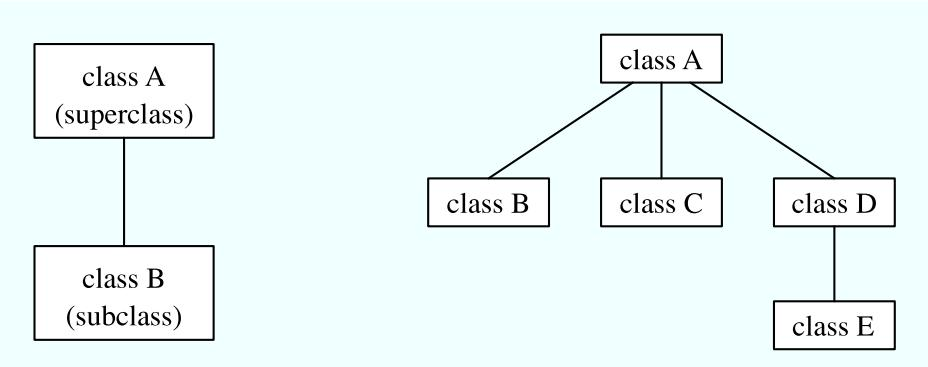

In Java, to create a class named “B” as a subclass of a class named “A”, you would write class B extends A {

. // additions to, and modifications of,

. // stuff inherited from class A

Several classes can be declared as subclasses of the same superclass. The subclasses, which might be referred to as “sibling classes,” share some structures and behaviors—namely, the ones they inherit from their common superclass. The superclass expresses these shared structures and behaviors. In the diagram shown on the right, above, classes B, C, and D are sibling classes. Inheritance can also extend over several “generations” of classes. This is shown in the diagram, where class E is a subclass of class D which is itself a subclass of class A. In this case, class E is considered to be a subclass of class A, even though it is not a direct subclass. This whole set of classes forms a small class hierarchy.

## 5.5.3 Example: Vehicles

Let’s look at an example. Suppose that a program has to deal with motor vehicles, including cars, trucks, and motorcycles. (This might be a program used by a Department of Motor Vehicles to keep track of registrations.) The program could use a class named Vehicle to represent all types of vehicles. Since cars, trucks, and motorcycles are types of vehicles, they would be represented by subclasses of the Vehicle class, as shown in this class hierarchy diagram:

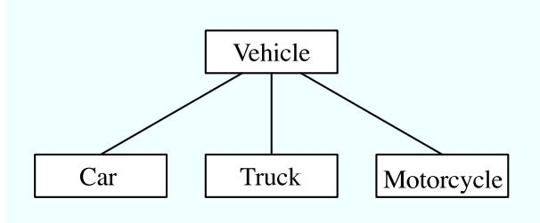

The Vehicle class would include instance variables such as registrationNumber and owner and instance methods such as transferOwnership(). These are variables and methods common to all vehicles. The three subclasses of Vehicle—Car, Truck, and Motorcycle—could then be used to hold variables and methods specific to particular types of vehicles. The Car class might add an instance variable numberOfDoors, the Truck class might have numberOfAxles, and the Motorcycle class could have a boolean variable hasSidecar. (Well, it could in theory at least, even if it might give a chuckle to the people at the Department of Motor Vehicles.) The declarations of these classes in a Java program would look, in outline, like this (although in practice, they would probably be public classes, defined in separate files):

```txt
class Vehicle {
    int registrationNumber;
    Person owner;  // (Assuming that a Person class has been defined!)
    void transferOwnership(Person newOwner) {
        ...
    }
    ...
}

class Car extends Vehicle {
    int numberOfDoors;
    ...
}

class Truck extends Vehicle {
    int numberOfAxles;
    ...
}

class Motorcycle extends Vehicle {
    boolean hasSidecar;
    ...
}
```

Suppose that myCar is a variable of type Car that has been declared and initialized with the statement

```javascript
Car myCar = new Car();
```

Given this declaration, a program could refer to myCar.numberOfDoors, since numberOfDoors is an instance variable in the class Car. But since class Car extends class Vehicle, a car also has all the structure and behavior of a vehicle. This means that myCar.registrationNumber, myCar.owner, and myCar.transferOwnership() also exist.

Now, in the real world, cars, trucks, and motorcycles are in fact vehicles. The same is true in a program. That is, an object of type Car or Truck or Motorcycle is automatically an object of type Vehicle too. This brings us to the following Important Fact:

## A variable that can hold a reference to an object of class A can also hold a reference to an object belonging to any subclass of A.

The practical efect of this in our example is that an object of type Car can be assigned to a variable of type Vehicle. That is, it would be legal to say

or even

After either of these statements, the variable myVehicle holds a reference to a Vehicle object that happens to be an instance of the subclass, Car. The object “remembers” that it is in fact a Car, and not just a Vehicle. Information about the actual class of an object is stored as part of that object. It is even possible to test whether a given object belongs to a given class, using the instanceof operator. The test:

```txt
if (myVehicle instanceof Car) ...
```

determines whether the object referred to by myVehicle is in fact a car.

On the other hand, the assignment statement

```txt
myCar = myVehicle;
```

would be illegal because myVehicle could potentially refer to other types of vehicles that are not cars. This is similar to a problem we saw previously in Subsection 2.5.6: The computer will not allow you to assign an int value to a variable of type short, because not every int is a short. Similarly, it will not allow you to assign a value of type Vehicle to a variable of type Car because not every vehicle is a car. As in the case of ints and shorts, the solution here is to use type-casting. If, for some reason, you happen to know that myVehicle does in fact refer to a Car, you can use the type cast (Car)myVehicle to tell the computer to treat myVehicle as if it were actually of type Car. So, you could say

```javascript
myCar = (Car)myVehicle;
```

and you could even refer to ((Car)myVehicle).numberOfDoors. As an example of how this could be used in a program, suppose that you want to print out relevant data about a vehicle. You could say:

```txt
System.out.println("Vehicle Data:");
System.out.println("Registration number: "
+ myVehicle.registrationNumber);
if (myVehicle instanceof Car) {
    System.out.println("Type of vehicle:  Car");
    Car c;
    c = (Car)myVehicle;
    System.out.println("Number of doors:  " + c.numberOfDoors);
}
else if (myVehicle instanceof Truck) {
    System.out.println("Type of vehicle:  Truck");
    Truck t;
    t = (Truck)myVehicle;
    System.out.println("Number of axles:  " + t.numberOfAxles);
}
else if (myVehicle instanceof Motorcycle) {
    System.out.println("Type of vehicle:  Motorcycle");
    Motorcycle m;
    m = (Motorcycle)myVehicle;
    System.out.println("Has a sidecar:   " + m.hasSidecar);
}
```

Note that for object types, when the computer executes a program, it checks whether type-casts are valid. So, for example, if myVehicle refers to an object of type Truck, then the type cast (Car)myVehicle would be an error. When this happes, an exception of type ClassCastException is thrown.

## 5.5.4 Polymorphism

As another example, consider a program that deals with shapes drawn on the screen. Let’s say that the shapes include rectangles, ovals, and roundrects of various colors. (A “roundrect” is just a rectangle with rounded corners.)

  
Rectangles

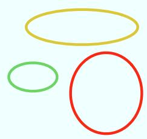  
Ovals

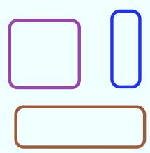  
RoundRects

Three classes, Rectangle, Oval, and RoundRect, could be used to represent the three types of shapes. These three classes would have a common superclass, Shape, to represent features that all three shapes have in common. The Shape class could include instance variables to represent the color, position, and size of a shape, and it could include instance methods for changing the color, position, and size. Changing the color, for example, might involve changing the value of an instance variable, and then redrawing the shape in its new color:

class Shape {

```txt
class Shape {
    Color color;   // Color of the shape. (Recall that class Color
                   // is defined in package java.awt. Assume
                   // that this class has been imported.)

    void setColor(Color newColor) {
        // Method to change the color of the shape.
        color = newColor; // change value of instance variable
        redraw(); // redraw shape, which will appear in new color
    }

    void redraw() {
        // method for drawing the shape
        ? ? ?  // what commands should go here?
    }

    . . .          // more instance variables and methods

// end of class Shape
```

Now, you might see a problem here with the method redraw(). The problem is that each diferent type of shape is drawn diferently. The method setColor() can be called for any type of shape. How does the computer know which shape to draw when it executes the redraw()? Informally, we can answer the question like this: The computer executes redraw() by asking the shape to redraw itself. Every shape object knows what it has to do to redraw itself.

In practice, this means that each of the specific shape classes has its own redraw() method:

class Rectangle extends Shape { void redraw() { . . . // commands for drawing a rectangle

```txt
}
... // possibly, more methods and variables
}
class Oval extends Shape {
    void redraw() {
        ... // commands for drawing an oval
    }
    ... // possibly, more methods and variables
}
class RoundRect extends Shape {
    void redraw() {
        ... // commands for drawing a rounded rectangle
    }
    ... // possibly, more methods and variables
}
```

If oneShape is a variable of type Shape, it could refer to an object of any of the types, Rectangle, Oval, or RoundRect. As a program executes, and the value of oneShape changes, it could even refer to objects of diferent types at diferent times! Whenever the statement

## oneShape.redraw();

is executed, the redraw method that is actually called is the one appropriate for the type of object to which oneShape actually refers. There may be no way of telling, from looking at the text of the program, what shape this statement will draw, since it depends on the value that oneShape happens to have when the program is executed. Even more is true. Suppose the statement is in a loop and gets executed many times. If the value of oneShape changes as the loop is executed, it is possible that the very same statement “oneShape.redraw();” will call diferent methods and draw diferent shapes as it is executed over and over. We say that the redraw() method is polymorphic. A method is polymorphic if the action performed by the method depends on the actual type of the object to which the method is applied. Polymorphism is one of the major distinguishing features of object-oriented programming.

Perhaps this becomes more understandable if we change our terminology a bit: In objectoriented programming, calling a method is often referred to as sending a message to an object. The object responds to the message by executing the appropriate method. The statement “oneShape.redraw();” is a message to the object referred to by oneShape. Since that object knows what type of object it is, it knows how it should respond to the message. From this point of view, the computer always executes “oneShape.redraw();” in the same way: by sending a message. The response to the message depends, naturally, on who receives it. From this point of view, objects are active entities that send and receive messages, and polymorphism is a natural, even necessary, part of this view. Polymorphism just means that diferent objects can respond to the same message in diferent ways.

One of the most beautiful things about polymorphism is that it lets code that you write do things that you didn’t even conceive of, at the time you wrote it. Suppose that I decide to add beveled rectangles to the types of shapes my program can deal with. A beveled rectangle has a triangle cut of each corner:


# BeveledRects

To implement beveled rectangles, I can write a new subclass, BeveledRect, of class Shape and give it its own redraw() method. Automatically, code that I wrote previously—such as the statement oneShape.redraw()—can now suddenly start drawing beveled rectangles, even though the beveled rectangle class didn’t exist when I wrote the statement!

In the statement “oneShape.redraw();”, the redraw message is sent to the object oneShape. Look back at the method from the Shape class for changing the color of a shape:

void setColor(Color newColor) {

color = newColor; // change value of instance variable

redraw(); // redraw shape, which will appear in new color

A redraw message is sent here, but which object is it sent to? Well, the setColor method is itself a message that was sent to some object. The answer is that the redraw message is sent to that same object, the one that received the setColor message. If that object is a rectangle, then it is the redraw() method from the Rectangle class that is executed. If the object is an oval, then it is the redraw() method from the Oval class. This is what you should expect, but it means that the “redraw();” statement in the setColor() method does not necessarily call the redraw() method in the Shape class! The redraw() method that is executed could be in any subclass of Shape.

Again, this is not a real surprise if you think about it in the right way. Remember that an instance method is always contained in an object. The class only contains the source code for the method. When a Rectangle object is created, it contains a redraw() method. The source code for that method is in the Rectangle class. The object also contains a setColor() method. Since the Rectangle class does not define a setColor() method, the source code for the rectangle’s setColor() method comes from the superclass, Shape, but the method itself is in the object of type Rectangle. Even though the source codes for the two methods are in diferent classes, the methods themselves are part of the same object. When the rectangle’s setColor() method is executed and calls redraw(), the redraw() method that is executed is the one in the same object.

## 5.5.5 Abstract Classes

Whenever a Rectangle, Oval, or RoundRect object has to draw itself, it is the redraw() method in the appropriate class that is executed. This leaves open the question, What does the redraw() method in the Shape class do? How should it be defined?

The answer may be surprising: We should leave it blank! The fact is that the class Shape represents the abstract idea of a shape, and there is no way to draw such a thing. Only particular, concrete shapes like rectangles and ovals can be drawn. So, why should there even be a redraw() method in the Shape class? Well, it has to be there, or it would be illegal to call it in the setColor() method of the Shape class, and it would be illegal to write “oneShape.redraw();”, where oneShape is a variable of type Shape. The compiler would complain that oneShape is a variable of type Shape and there’s no redraw() method in the Shape class.

Nevertheless the version of redraw() in the Shape class itself will never actually be called. In fact, if you think about it, there can never be any reason to construct an actual object of type Shape! You can have variables of type Shape, but the objects they refer to will always belong to one of the subclasses of Shape. We say that Shape is an abstract class. An abstract class is one that is not used to construct objects, but only as a basis for making subclasses. An abstract class exists only to express the common properties of all its subclasses. A class that is not abstract is said to be concrete. You can create objects belonging to a concrete class, but not to an abstract class. A variable whose type is given by an abstract class can only refer to objects that belong to concrete subclasses of the abstract class.

Similarly, we say that the redraw() method in class Shape is an abstract method, since it is never meant to be called. In fact, there is nothing for it to do—any actual redrawing is done by redraw() methods in the subclasses of Shape. The redraw() method in Shape has to be there. But it is there only to tell the computer that all Shapes understand the redraw message. As an abstract method, it exists merely to specify the common interface of all the actual, concrete versions of redraw() in the subclasses of Shape. There is no reason for the abstract redraw() in class Shape to contain any code at all.

Shape and its redraw() method are semantically abstract. You can also tell the computer, syntactically, that they are abstract by adding the modifier “abstract” to their definitions. For an abstract method, the block of code that gives the implementation of an ordinary method is replaced by a semicolon. An implementation must be provided for the abstract method in any concrete subclass of the abstract class. Here’s what the Shape class would look like as an abstract class:

```cpp
public abstract class Shape {
    Color color;  // color of shape.
    void setColor(Color newColor) {
        // method to change the color of the shape
        color = newColor; // change value of instance variable
        redraw(); // redraw shape, which will appear in new color
    }

    abstract void redraw();
        // abstract method---must be defined in
        // concrete subclasses

    ...          // more instance variables and methods
```

} // end of class Shape

Once you have declared the class to be abstract, it becomes illegal to try to create actual objects of type Shape, and the computer will report a syntax error if you try to do so.

$$
\* \ * \ *
$$

Recall from Subsection 5.3.3 that a class that is not explicitly declared to be a subclass of some other class is automatically made a subclass of the standard class Object. That is, a class declaration with no “extends” part such as

public class myClass { . . .

is exactly equivalent to

public class myClass extends Object { . . .

This means that class Object is at the top of a huge class hierarchy that includes every other class. (Semantially, Object is an abstract class, in fact the most abstract class of all. Curiously, however, it is not declared to be abstract syntactially, which means that you can create objects of type Object. What you would do with them, however, I have no idea.)

Since every class is a subclass of Object, a variable of type Object can refer to any object whatsoever, of any type. Java has several standard data structures that are designed to hold Objects, but since every object is an instance of class Object, these data structures can actually hold any object whatsoever. One example is the “ArrayList” data structure, which is defined by the class ArrayList in the package java.util. (ArrayList is discussed more fully in Section 7.3.) An ArrayList is simply a list of Objects. This class is very convenient, because an ArrayList can hold any number of objects, and it will grow, when necessary, as objects are added to it. Since the items in the list are of type Object, the list can actually hold objects of any type.

A program that wants to keep track of various Shapes that have been drawn on the screen can store those shapes in an ArrayList. Suppose that the ArrayList is named listOfShapes. A shape, oneShape, can be added to the end of the list by calling the instance method “listOfShapes.add(oneShape);”. The shape can be removed from the list with the instance method “listOfShapes.remove(oneShape);”. The number of shapes in the list is given by the function “listOfShapes.size()”. And it is possible to retrieve the i-th object from the list with the function call “listOfShapes.get(i)”. (Items in the list are numbered from 0 to listOfShapes.size() - 1.) However, note that this method returns an Object, not a Shape. (Of course, the people who wrote the ArrayList class didn’t even know about Shapes, so the method they wrote could hardly have a return type of Shape!) Since you know that the items in the list are, in fact, Shapes and not just Objects, you can type-cast the Object returned by listOfShapes.get(i) to be a value of type Shape:

oneShape = (Shape)listOfShapes.get(i);

Let’s say, for example, that you want to redraw all the shapes in the list. You could do this with a simple for loop, which is lovely example of object-oriented programming and of polymorphism:

```txt
for (int i = 0; i < listOfShapes.size(); i++) {
    Shape s;  // i-th element of the list, considered as a Shape
    s = (Shape)listOfShapes.get(i);
    s.redraw();  // What is drawn here depends on what type of shape s is!
}
```

## ∗ ∗ ∗

The sample source code file ShapeDraw.java uses an abstract Shape class and an ArrayList to hold a list of shapes. The file defines an applet in which the user can add various shapes to a drawing area. Once a shape is in the drawing area, the user can use the mouse to drag it around.

You might want to look at this file, even though you won’t be able to understand all of it at this time. Even the definitions of the shape classes are somewhat diferent from those that I have described in this section. (For example, the draw() method has a parameter of type Graphics. This parameter is required because of the way Java handles all drawing.) I’ll return to this example in later chapters when you know more about GUI programming. However, it would still be worthwhile to look at the definition of the Shape class and its subclasses in the source code. You might also check how an ArrayList is used to hold the list of shapes.

In the applet the only time when the actual class of a shape is used is when that shape is added to the screen. Once the shape has been created, it is manipulated entirely as an abstract shape. The routine that implements dragging, for example, works only with variables of type Shape. As the Shape is being dragged, the dragging routine just calls the Shape’s draw method each time the shape has to be drawn, so it doesn’t have to know how to draw the shape or even what type of shape it is. The object is responsible for drawing itself. If I wanted to add a new type of shape to the program, I would define a new subclass of Shape, add another button to the applet, and program the button to add the correct type of shape to the screen. No other changes in the programming would be necessary.

If you want to try out the applet, you can find it at the end of the on-line version of this section.

## 5.6 this and super

Although the basic ideas of object-oriented programming are reasonably simple and clear, they are subtle, and they take time to get used to. And unfortunately, beyond the basic ideas there are a lot of details. This section and the next cover more of those annoying details. You should not necessarily master everything in these two sections the first time through, but you should read it to be aware of what is possible. For the most part, when I need to use this material later in the text, I will explain it again briefly, or I will refer you back to it. In this section, we’ll look at two variables, this and super, that are automatically defined in any instance method.

## 5.6.1 The Special Variable this

A static member of a class has a simple name, which can only be used inside the class definition. For use outside the class, it has a full name of the form hclass-namei.hsimple-namei. For example, “System.out” is a static member variable with simple name “out” in the class “System”. It’s always legal to use the full name of a static member, even within the class where it’s defined. Sometimes it’s even necessary, as when the simple name of a static member variable is hidden by a local variable of the same name.

Instance variables and instance methods also have simple names. The simple name of such an instance member can be used in instance methods in the class where the instance member is defined. Instance members also have full names, but remember that instance variables and methods are actually contained in objects, not classes. The full name of an instance member has to contain a reference to the object that contains the instance member. To get at an instance variable or method from outside the class definition, you need a variable that refers to the object. Then the full name is of the form hvariable-namei.hsimple-namei. But suppose you are writing the definition of an instance method in some class. How can you get a reference to the object that contains that instance method? You might need such a reference, for example, if you want to use the full name of an instance variable, because the simple name of the instance variable is hidden by a local variable or parameter.

Java provides a special, predefined variable named “this” that you can use for such purposes. The variable, this, is used in the source code of an instance method to refer to the object that contains the method. This intent of the name, this, is to refer to “this object,” the one right here that this very method is in. If x is an instance variable in the same object, then this.x can be used as a full name for that variable. If otherMethod() is an instance method in the same object, then this.otherMethod() could be used to call that method. Whenever the computer executes an instance method, it automatically sets the variable, this, to refer to the object that contains the method.

One common use of this is in constructors. For example:

```java
public class Student {

    private String name;  // Name of the student.

    public Student(String name) {
        // Constructor. Create a student with specified name.
        this.name = name;
    }
    .
    .   // More variables and methods.
    .
}
```

In the constructor, the instance variable called name is hidden by a formal parameter. However, the instance variable can still be referred to by its full name, this.name. In the assignment statement, the value of the formal parameter, name, is assigned to the instance variable, this.name. This is considered to be acceptable style: There is no need to dream up cute new names for formal parameters that are just used to initialize instance variables. You can use the same name for the parameter as for the instance variable.

There are other uses for this. Sometimes, when you are writing an instance method, you need to pass the object that contains the method to a subroutine, as an actual parameter. In that case, you can use this as the actual parameter. For example, if you wanted to print out a string representation of the object, you could say “System.out.println(this);”. Or you could assign the value of this to another variable in an assignment statement. In fact, you can do anything with this that you could do with any other variable, except change its value.

## 5.6.2 The Special Variable super

Java also defines another special variable, named “super”, for use in the definitions of instance methods. The variable super is for use in a subclass. Like this, super refers to the object that contains the method. But it’s forgetful. It forgets that the object belongs to the class you are writing, and it remembers only that it belongs to the superclass of that class. The point is that the class can contain additions and modifications to the superclass. super doesn’t know about any of those additions and modifications; it can only be used to refer to methods and variables in the superclass.

Let’s say that the class that you are writing contains an instance method named doSomething(). Consider the subroutine call statement super.doSomething(). Now, super doesn’t know anything about the doSomething() method in the subclass. It only knows about things in the superclass, so it tries to execute a method named doSomething() from the superclass. If there is none—if the doSomething() method was an addition rather than a modification—you’ll get a syntax error.

The reason super exists is so you can get access to things in the superclass that are hidden by things in the subclass. For example, super.x always refers to an instance variable named x in the superclass. This can be useful for the following reason: If a class contains an instance variable with the same name as an instance variable in its superclass, then an object of that class will actually contain two variables with the same name: one defined as part of the class itself and one defined as part of the superclass. The variable in the subclass does not replace the variable of the same name in the superclass; it merely hides it. The variable from the superclass can still be accessed, using super.

When you write a method in a subclass that has the same signature as a method in its superclass, the method from the superclass is hidden in the same way. We say that the method in the subclass overrides the method from the superclass. Again, however, super can be used to access the method from the superclass.

The major use of super is to override a method with a new method that extends the behavior of the inherited method, instead of replacing that behavior entirely. The new method can use super to call the method from the superclass, and then it can add additional code to provide additional behavior. As an example, suppose you have a PairOfDice class that includes a roll() method. Suppose that you want a subclass, GraphicalDice, to represent a pair of dice drawn on the computer screen. The roll() method in the GraphicalDice class should do everything that the roll() method in the PairOfDice class does. We can express this with a call to super.roll(), which calls the method in the superclass. But in addition to that, the roll() method for a GraphicalDice object has to redraw the dice to show the new values. The GraphicalDice class might look something like this:

public class GraphicalDice extends PairOfDice {

```txt
public void roll() {
    // Roll the dice, and redraw them.
    super.roll();  // Call the roll method from PairOfDice.
    redraw();      // Call a method to draw the dice.
}
.
.  // More stuff, including definition of redraw().
.
}
```

Note that this allows you to extend the behavior of the roll() method even if you don’t know how the method is implemented in the superclass!

Here is a more complete example. The applet at the end of Section 4.7 in the on-line version of this book shows a disturbance that moves around in a mosaic of little squares. As it moves, each square it visits become a brighter shade of red. The result looks interesting, but I think it would be prettier if the pattern were symmetric. A symmetric version of the applet is shown at the bottom of the Section 5.7 (in the on-line version). The symmetric applet can be programmed as an easy extension of the original applet.

In the symmetric version, each time a square is brightened, the squares that can be obtained from that one by horizontal and vertical reflection through the center of the mosaic are also brightened. This picture might make the symmetry idea clearer:

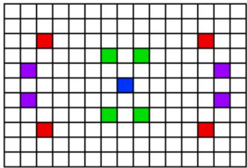

The four red squares in the picture, for example, form a set of such symmetrically placed squares, as do the purple squares and the green squares. (The blue square is at the center of the mosaic, so reflecting it doesn’t produce any other squares; it’s its own reflection.)

The original applet is defined by the class RandomBrighten. In that class, the actual task of brightening a square is done by a method called brighten(). If row and col are the row and column numbers of a square, then “brighten(row,col);” increases the brightness of that square. All we need is a subclass of RandomBrighten with a modified brighten() routine. Instead of just brightening one square, the modified routine will also brighten the horizontal and vertical reflections of that square. But how will it brighten each of the four individual squares? By calling the brighten() method from the original class. It can do this by calling super.brighten().

There is still the problem of computing the row and column numbers of the horizontal and vertical reflections. To do this, you need to know the number of rows and the number of columns. The RandomBrighten class has instance variables named ROWS and COLUMNS to represent these quantities. Using these variables, it’s possible to come up with formulas for the reflections, as shown in the definition of the brighten() method below.

Here’s the complete definition of the new class:

public class SymmetricBrighten extends RandomBrighten {

```txt
void brighten(int row, int col) {
    // Brighten the specified square and its horizontal
    // and vertical reflections.  This overrides the brighten
    // method from the RandomBrighten class, which just
    // brightens one square.
    super.brighten(row, col);
    super.brighten(ROWS - 1 - row, col);
    super.brighten(row, COLUMNS - 1 - col);
    super.brighten(ROWS - 1 - row, COLUMNS - 1 - col);
}
```

} // end class SymmetricBrighten

This is the entire source code for the applet!

## 5.6.3 Constructors in Subclasses

Constructors are not inherited. That is, if you extend an existing class to make a subclass, the constructors in the superclass do not become part of the subclass. If you want constructors in the subclass, you have to define new ones from scratch. If you don’t define any constructors in the subclass, then the computer will make up a default constructor, with no parameters, for you.

This could be a problem, if there is a constructor in the superclass that does a lot of necessary work. It looks like you might have to repeat all that work in the subclass! This could be a real problem if you don’t have the source code to the superclass, and don’t know how it works, or if the constructor in the superclass initializes private member variables that you don’t even have access to in the subclass!

Obviously, there has to be some fix for this, and there is. It involves the special variable, super. As the very first statement in a constructor, you can use super to call a constructor from the superclass. The notation for this is a bit ugly and misleading, and it can only be used in this one particular circumstance: It looks like you are calling super as a subroutine (even though super is not a subroutine and you can’t call constructors the same way you call other subroutines anyway). As an example, assume that the PairOfDice class has a constructor that takes two integers as parameters. Consider a subclass:

## public class GraphicalDice extends PairOfDice {

```cpp
public GraphicalDice() {  // Constructor for this class.
    super(3,4);  // Call the constructor from the
        //   PairOfDice class, with parameters 3, 4.
    initializeGraphics();  // Do some initialization specific
        //   to the GraphicalDice class.
}
.
.  // More constructors, methods, variables...
.
}
```

The statement “super(3,4);” calls the constructor from the superclass. This call must be the first line of the constructor in the subclass. Note that if you don’t explicitly call a constructor from the superclass in this way, then the default constructor from the superclass, the one with no parameters, will be called automatically.

This might seem rather technical, but unfortunately it is sometimes necessary. By the way, you can use the special variable this in exactly the same way to call another constructor in the same class. This can be useful since it can save you from repeating the same code in several constructors.

## 5.7 Interfaces, Nested Classes, and Other Details

THIS SECTION simply pulls together a few more miscellaneous features of object oriented programming in Java. Read it now, or just look through it and refer back to it later when you need this material. (You will need to know about the first topic, interfaces, almost as soon as we begin GUI programming.)

## 5.7.1 Interfaces

Some object-oriented programming languages, such as C++, allow a class to extend two or more superclasses. This is called multiple inheritance. In the illustration below, for example, class E is shown as having both class A and class B as direct superclasses, while class F has three direct superclasses.

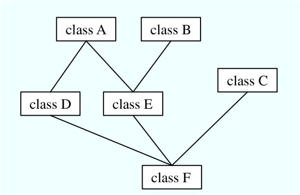  
Multiple inheritance (NOT allowed in Java)

Such multiple inheritance is not allowed in Java. The designers of Java wanted to keep the language reasonably simple, and felt that the benefits of multiple inheritance were not worth the cost in increased complexity. However, Java does have a feature that can be used to accomplish many of the same goals as multiple inheritance: interfaces.

We’ve encountered the term “interface” before, in connection with black boxes in general and subroutines in particular. The interface of a subroutine consists of the name of the subroutine, its return type, and the number and types of its parameters. This is the information you need to know if you want to call the subroutine. A subroutine also has an implementation: the block of code which defines it and which is executed when the subroutine is called.

In Java, interface is a reserved word with an additional, technical meaning. An “interface” in this sense consists of a set of instance method interfaces, without any associated implementations. (Actually, a Java interface can contain other things as well, but we won’t discuss them here.) A class can implement an interface by providing an implementation for each of the methods specified by the interface. Here is an example of a very simple Java interface:

```java
public interface Drawable {
    public void draw(Graphics g);
}
```

This looks much like a class definition, except that the implementation of the draw() method is omitted. A class that implements the interface Drawable must provide an implementation for this method. Of course, the class can also include other methods and variables. For example,

```txt
public class Line implements Drawable {
    public void draw(Graphics g) {
        ... // do something---presumably, draw a line
    }
    ... // other methods and variables
}
```

Note that to implement an interface, a class must do more than simply provide an implementation for each method in the interface; it must also state that it implements the interface, using the reserved word implements as in this example: “public class Line implements Drawable”. Any class that implements the Drawable interface defines a draw() instance method. Any ob ject created from such a class includes a draw() method. We say that an object implements an interface if it belongs to a class that implements the interface. For example, any object of type Line implements the Drawable interface.

```txt
}
```

While a class can extend only one other class, it can implement any number of interfaces. In fact, a class can both extend one other class and implement one or more interfaces. So, we can have things like

class FilledCircle extends Circle implements Drawable, Fillable {

The point of all this is that, although interfaces are not classes, they are something very similar. An interface is very much like an abstract class, that is, a class that can never be used for constructing objects, but can be used as a basis for making subclasses. The subroutines in an interface are abstract methods, which must be implemented in any concrete class that implements the interface. And as with abstract classes, even though you can’t construct an object from an interface, you can declare a variable whose type is given by the interface. For example, if Drawable is an interface, and if Line and FilledCircle are classes that implement Drawable, then you could say:

```txt
Drawable figure; // Declare a variable of type Drawable.  It can
//     refer to any object that implements the
//     Drawable interface.
```

figure = new Line(); // figure now refers to an object of class Line figure.draw(g); // calls draw() method from class Line

figure = new FilledCircle(); // Now, figure refers to an object // of class FilledCircle. figure.draw(g); // calls draw() method from class FilledCircle

A variable of type Drawable can refer to any object of any class that implements the Drawable interface. A statement like figure.draw(g), above, is legal because figure is of type Drawable, and any Drawable object has a draw() method. So, whatever object figure refers to, that object must have a draw() method.

Note that a type is something that can be used to declare variables. A type can also be used to specify the type of a parameter in a subroutine, or the return type of a function. In Java, a type can be either a class, an interface, or one of the eight built-in primitive types. These are the only possibilities. Of these, however, only classes can be used to construct new objects.

You are not likely to need to write your own interfaces until you get to the point of writing fairly complex programs. However, there are a few interfaces that are used in important ways in Java’s standard packages. You’ll learn about some of these standard interfaces in the next few chapters.

## 5.7.2 Nested Classes

A class seems like it should be a pretty important thing. A class is a high-level building block of a program, representing a potentially complex idea and its associated data and behaviors. I’ve always felt a bit silly writing tiny little classes that exist only to group a few scraps of data together. However, such trivial classes are often useful and even essential. Fortunately, in Java, I can ease the embarrassment, because one class can be nested inside another class. My trivial little class doesn’t have to stand on its own. It becomes part of a larger more respectable class. This is particularly useful when you want to create a little class specifically to support the work of a larger class. And, more seriously, there are other good reasons for nesting the definition of one class inside another class.

In Java, a nested class is any class whose definition is inside the definition of another class. Nested classes can be either named or anonymous. I will come back to the topic of anonymous classes later in this section. A named nested class, like most other things that occur in classes, can be either static or non-static.

The definition of a static nested class looks just like the definition of any other class, except that it is nested inside another class and it has the modifier static as part of its declaration. A static nested class is part of the static structure of the containing class. It can be used inside that class to create objects in the usual way. If it has not been declared private, then it can also be used outside the containing class, but when it is used outside the class, its name must indicate its membership in the containing class. This is similar to other static components of a class: A static nested class is part of the class itself in the same way that static member variables are parts of the class itself.

For example, suppose a class named WireFrameModel represents a set of lines in threedimensional space. (Such models are used to represent three-dimensional objects in graphics programs.) Suppose that the WireFrameModel class contains a static nested class, Line, that represents a single line. Then, outside of the class WireFrameModel, the Line class would be referred to as WireFrameModel.Line. Of course, this just follows the normal naming convention for static members of a class. The definition of the WireFrameModel class with its nested Line class would look, in outline, like this:

## public class WireFrameModel {

```txt
... // other members of the WireFrameModel class
static public class Line {
    // Represents a line from the point (x1,y1,z1)
    // to the point (x2,y2,z2) in 3-dimensional space.
    double x1, y1, z1;
    double x2, y2, z2;
} // end class Line
... // other members of the WireFrameModel class
// end WireFrameModel
```

Inside the WireFrameModel class, a Line object would be created with the constructor “new Line()”. Outside the class, “new WireFrameModel.Line()” would be used.

A static nested class has full access to the static members of the containing class, even to the private members. Similarly, the containing class has full access to the members of the nested class. This can be another motivation for declaring a nested class, since it lets you give one class access to the private members of another class without making those members generally available to other classes.

When you compile the above class definition, two class files will be created. Even though the definition of Line is nested inside WireFrameModel, the compiled Line class is stored in a separate file. The name of the class file for Line will be WireFrameModel\$Line.class.

Non-static nested classes are referred to as inner classes. Inner classes are not, in practice, very diferent from static nested classes, but a non-static nested class is actually associated with an object rather than to the class in which it is nested. This can take some getting used to.

Any non-static member of a class is not really part of the class itself (although its source code is contained in the class definition). This is true for inner classes, just as it is for any other non-static part of a class. The non-static members of a class specify what will be contained in objects that are created from that class. The same is true—at least logically—for inner classes. It’s as if each object that belongs to the containing class has its own copy of the nested class. This copy has access to all the instance methods and instance variables of the object, even to those that are declared private. The two copies of the inner class in two diferent objects difer because the instance variables and methods they refer to are in diferent objects. In fact, the rule for deciding whether a nested class should be static or non-static is simple: If the nested class needs to use any instance variable or instance method from the containing class, make the nested class non-static. Otherwise, it might as well be static.

From outside the containing class, a non-static nested class has to be referred to using a name of the form hvariableNamei.hNestedClassNamei, where hvariableNamei is a variable that refers to the object that contains the class. This is actually rather rare, however. A non-static nested class is generally used only inside the class in which it is nested, and there it can be referred to by its simple name.

In order to create an object that belongs to an inner class, you must first have an object that belongs to the containing class. (When working inside the class, the object “this” is used implicitly.) The inner class object is permanently associated with the containing class object, and it has complete access to the members of the containing class object. Looking at an example will help, and will hopefully convince you that inner classes are really very natural. Consider a class that represents poker games. This class might include a nested class to represent the players of the game. This structure of the PokerGame class could be:

public class PokerGame { // Represents a game of poker.

```txt
private class Player {  // Represents one of the players in this game.
    .
    .
    .
} // end class Player
private Deck deck;      // A deck of cards for playing the game.
private int pot;       // The amount of money that has been bet.
.
.
.
```

## } // end class PokerGame

If game is a variable of type PokerGame, then, conceptually, game contains its own copy of the Player class. In an an instance method of a PokerGame object, a new Player object would be created by saying “new Player()”, just as for any other class. (A Player object could be created outside the PokerGame class with an expression such as “game.new Player()”. Again, however, this is very rare.) The Player object will have access to the deck and pot instance variables in the PokerGame object. Each PokerGame object has its own deck and pot and Players. Players of that poker game use the deck and pot for that game; players of another poker game use the other game’s deck and pot. That’s the efect of making the Player class non-static. This is the most natural way for players to behave. A Player object represents a player of one particular poker game. If Player were a static nested class, on the other hand, it would represent the general idea of a poker player, independent of a particular poker game.

## 5.7.3 Anonymous Inner Classes

In some cases, you might find yourself writing an inner class and then using that class in just a single line of your program. Is it worth creating such a class? Indeed, it can be, but for cases like this you have the option of using an anonymous inner class. An anonymous class is created with a variation of the new operator that has the form

```txt
new  <superclass-or-interface> ( <parameter-list>) {
    <methods-and-variables>
}
```

This constructor defines a new class, without giving it a name, and it simultaneously creates an object that belongs to that class. This form of the new operator can be used in any statement where a regular “new” could be used. The intention of this expression is to create: “a new object belonging to a class that is the same as hsuperclass-or-interfacei but with these hmethods-andvariablesi added.” The efect is to create a uniquely customized object, just at the point in the program where you need it. Note that it is possible to base an anonymous class on an interface, rather than a class. In this case, the anonymous class must implement the interface by defining all the methods that are declared in the interface. If an interface is used as a base, the hparameter-listi must be empty. Otherwise, it can contain parameters for a constructor in the hsuperclassi.

Anonymous classes are often used for handling events in graphical user interfaces, and we will encounter them several times in the chapters on GUI programming. For now, we will look at one not-very-plausible example. Consider the Drawable interface, which is defined earlier in this section. Suppose that we want a Drawable object that draws a filled, red, 100-pixel square. Rather than defining a new, separate class and then using that class to create the object, we can use an anonymous class to create the object in one statement:

```javascript
Drawable redSquare = new Drawable() {
    void draw(Graphics g) {
        g.setColor(Color.red);
        g.fillRect(10,10,100,100);
    }
};
```

The semicolon at the end of this statement is not part of the class definition. It’s the semicolon that is required at the end of every declaration statement.

When a Java class is compiled, each anonymous nested class will produce a separate class file. If the name of the main class is MainClass, for example, then the names of the class files for the anonymous nested classes will be MainClass\$1.class, MainClass\$2.class, MainClass\$3.class, and so on.

## 5.7.4 Mixing Static and Non-static

Classes, as I’ve said, have two very distinct purposes. A class can be used to group together a set of static member variables and static member subroutines. Or it can be used as a factory for making objects. The non-static variables and subroutines in the class definition specify the instance variables and methods of the objects. In most cases, a class performs one or the other of these roles, not both.

Sometimes, however, static and non-static members are mixed in a single class. In this case, the class plays a dual role. Sometimes, these roles are completely separate. It is also possible for the static and non-static parts of a class to interact. This happens when instance methods use static member variables or call static member subroutines. An instance method belongs to an object, not to the class itself, and there can be many objects with their own versions of the instance method. But there is only one copy of a static member variable. So, efectively, we have many objects sharing that one variable.

Suppose, for example, that we want to write a PairOfDice class that uses the Random class mentioned in Section 5.3 for rolling the dice. To do this, a PairOfDice object needs access to an object of type Random. But there is no need for each PairOfDice object to have a separate Random object. (In fact, it would not even be a good idea: Because of the way random number generators work, a program should, in general, use only one source of random numbers.) A nice solution is to have a single Random variable as a static member of the PairOfDice class, so that it can be shared by all PairOfDice objects. For example:

```java
import java.util.Random;

public class PairOfDice {

    private static Random randGen = new Random();

    public int die1;   // Number showing on the first die.
    public int die2;   // Number showing on the second die.

    public PairOfDice() {
        // Constructor.  Creates a pair of dice that
        // initially shows random values.
        roll();
    }

    public void roll() {
        // Roll the dice by setting each of the dice to be
        // a random number between 1 and 6.
        die1 = randGen.nextInt(6) + 1;
        die2 = randGen.nextInt(6) + 1;
    }

} // end class PairOfDice
```

As another example, let’s rewrite the Student class that was used in Section 5.2. I’ve added an ID for each student and a static member called nextUniqueID. Although there is an ID variable in each student object, there is only one nextUniqueID variable.

```java
public class Student {

    private String name;  // Student's name.
    private int ID;  // Unique ID number for this student.
    public double test1, test2, test3;   // Grades on three tests.

    private static int nextUniqueID = 0;
        // keep track of next available unique ID number

    Student(String theName) {
        // Constructor for Student objects; provides a name for the Student,
```

```java
// and assigns the student a unique ID number.
    name = thenName;
    nextUniqueID++;
    ID = nextUniqueID;
}

public String getName() {
    // Accessor method for reading value of private
    // instance variable, name.
    return name;
}

public int getID() {
    // Accessor method for reading value of ID.
    return ID;
}

public double getAverage() {
    // Compute average test grade.
    return (test1 + test2 + test3) / 3;
}

// end of class Student
```

The initialization “nextUniqueID = 0” is done only once, when the class is first loaded. Whenever a Student object is constructed and the constructor says “nextUniqueID++;”, it’s always the same static member variable that is being incremented. When the very first Student object is created, nextUniqueID becomes 1. When the second object is created, nextUniqueID becomes 2. After the third object, it becomes 3. And so on. The constructor stores the new value of nextUniqueID in the ID variable of the object that is being created. Of course, ID is an instance variable, so every object has its own individual ID variable. The class is constructed so that each student will automatically get a diferent value for its ID variable. Furthermore, the ID variable is private, so there is no way for this variable to be tampered with after the object has been created. You are guaranteed, just by the way the class is designed, that every student object will have its own permanent, unique identification number. Which is kind of cool if you think about it.

## 5.7.5 Static Import

The import directive makes it possible to refer to a class such as java.awt.Color using its simple name, Color. All you have to do is say import java.awt.Color or import java.awt.\*. But you still have to use compound names to refer to static member variables such as System.out and to static methods such as Math.sqrt.

Java 5.0 introduced a new form of the import directive that can be used to import static members of a class in the same way that the ordinary import directive imports classes from a package. The new form of the directive is called a static import, and it has syntax

```typescript
import static <package-name>.<class-name>.<static-member-name>;
```

to import one static member name from a class, or

```typescript
import static <package-name>.<class-name>.*;
```

to import all the public static members from a class. For example, if you preface a class definition with

import static java.lang.System.out;

then you can use the simple name out instead of the compound name System.out. This means you can use out.println instead of System.out.println. If you are going to work extensively with the Math class, you can preface your class definition with

import static java.lang.Math.\*;

This would allow you to say sqrt instead of Math.sqrt, log instead of Math.log, PI instead of Math.PI, and so on.

Note that the static import directive requires a hpackage-namei, even for classes in the standard package java.lang. One consequence of this is that you can’t do a static import from a class in the default package. In particular, it is not possible to do a static import from my TextIO class—if you wanted to do that, you would have to move TextIO into a package.

## 5.7.6 Enums as Classes

Enumerated types were introduced in Subsection 2.3.3. Now that we have covered more material on classes and objects, we can revisit the topic (although still not covering enumerated types in their full complexity).

Enumerated types are actually classes, and each enumerated type constant is a public, final, static member variable in that class (even though they are not declared with these modifiers). The value of the variable is an object belonging to the enumerated type class. There is one such object for each enumerated type constant, and these are the only objects of the class that can ever be created. It is really these objects that represent the possible values of the enumerated type. The enumerated type constants are actually variables that refer to these objects.

When an enumerated type is defined inside another class, it is a nested class inside the enclosing class. In fact, it is a static nested class, whether you declare it to be static or not. But it can also be declared as a non-nested class, in a file of its own. For example, we could define the following enumerated type in a file named Suit.java:

public enum Suit {

SPADES, HEARTS, DIAMONDS, CLUBS

## }

This enumerated type represents the four possible suits for a playing card, and it could have been used in the example Card.java from Subsection 5.4.2.

Furthermore, in addition to its list of values, an enumerated type can contain some of the other things that a regular class can contain, including methods and additional member variables. Just add a semicolon (;) at the end of the list of values, and then add definitions of the methods and variables in the usual way. For example, we might make an enumerated type to represent the possible values of a playing card. It might be useful to have a method that returns the corresponding value in the game of Blackjack. As another example, suppose that when we print out one of the values, we’d like to see something diferent from the default string representation (the identifier that names the constant). In that case, we can override the toString() method in the class to print out a diferent string representation. This would gives something like:

```java
ACE, TWO, THREE, FOUR, FIVE, SIX, SEVEN, EIGHT,
    NINE, TEN, JACK, QUEEN, KING;

/**
 * Return the value of this CardValue in the game of Blackjack.
 * Note that the value returned for an ace is 1.
 */
public int blackjackValue() {
    if (this == JACK || this == QUEEN || this == KING)
        return 10;
    else
        return 1 + ordinal();
}

/**
 * Return a String representation of this CardValue, using numbers
 * for the numerical cards and names for the ace and face cards.
 */
public String toString() {
    switch (this) {          // "this" is one of the enumerated type values
    case ACE:             // ordinal number of ACE
        return "Ace";
    case JACK:             // ordinal number of JACK
        return "Jack";
    case QUEEN:         // ordinal number of QUEEN
        return "Queen";
    case KING:             // ordinal number of KING
        return "King";
    default:            // it's a numeric card value
        int numericValue = 1 + ordinal();
        return "" + numericValue;
}
// end CardValue
```

The methods blackjackValue() and toString() are instance methods in Card-Value. Since CardValue.JACK is an object belonging to that class, you can call CardValue.JACK.blackjackValue(). Suppose that cardVal is declared to be a variable of type CardValue, so that it can refer to any of the values in the enumerated type. We can call cardVal.blackjackValue() to find the Blackjack value of the CardValue object to which cardVal refers, and System.out.println(cardVal) will implicitly call the method cardVal.toString() to obtain the print representation of that CardValue. (One other thing to keep in mind is that since CardValue is a class, the value of cardVal can be null, which means it does not refer to any object.)

Remember that ACE, TWO, . . . , KING are the only possible objects of type CardValue, so in an instance method in that class, this will refer to one of those values. Recall that the instance method ordinal() is defined in any enumerated type and gives the position of the enumerated type value in the list of possible values, with counting starting from zero.

(If you find it annoying to use the class name as part of the name of every enumerated type constant, you can use static import to make the simple names of the constants directly available—but only if you put the enumerated type into a package. For example, if the enumerated type CardValue is defined in a package named cardgames, then you could place

at the beginning of a source code file. This would allow you, for example, to use the name JACK in that file instead of CardValue.JACK.)

## Exercises for Chapter 5

1. In all versions of the PairOfDice class in Section 5.2, the instance variables die1 and die2 are declared to be public. They really should be private, so that they are protected from being changed from outside the class. Write another version of the PairOfDice class in which the instance variables die1 and die2 are private. Your class will need “getter” methods that can be used to find out the values of die1 and die2. (The idea is to protect their values from being changed from outside the class, but still to allow the values to be read.) Include other improvements in the class, if you can think of any. Test your class with a short program that counts how many times a pair of dice is rolled, before the total of the two dice is equal to two.

2. A common programming task is computing statistics of a set of numbers. (A statistic is a number that summarizes some property of a set of data.) Common statistics include the mean (also known as the average) and the standard deviation (which tells how spread out the data are from the mean). I have written a little class called StatCalc that can be used to compute these statistics, as well as the sum of the items in the dataset and the number of items in the dataset. You can read the source code for this class in the file StatCalc.java. If calc is a variable of type StatCalc, then the following methods are defined:

• calc.enter(item); where item is a number, adds the item to the dataset.

• calc.getCount() is a function that returns the number of items that have been added to the dataset.

• calc.getSum() is a function that returns the sum of all the items that have been added to the dataset.

• calc.getMean() is a function that returns the average of all the items.

• calc.getStandardDeviation() is a function that returns the standard deviation of the items.

Typically, all the data are added one after the other by calling the enter() method over and over, as the data become available. After all the data have been entered, any of the other methods can be called to get statistical information about the data. The methods getMean() and getStandardDeviation() should only be called if the number of items is greater than zero.

Modify the current source code, StatCalc.java, to add instance methods getMax() and getMin(). The getMax() method should return the largest of all the items that have been added to the dataset, and getMin() should return the smallest. You will need to add two new instance variables to keep track of the largest and smallest items that have been seen so far.

Test your new class by using it in a program to compute statistics for a set of non-zero numbers entered by the user. Start by creating an object of type StatCalc:

StatCalc calc; // Object to be used to process the data.

calc = new StatCalc();

Read numbers from the user and add them to the dataset. Use 0 as a sentinel value (that is, stop reading numbers when the user enters 0). After all the user’s non-zero numbers have been entered, print out each of the six statistics that are available from calc.

3. This problem uses the PairOfDice class from Exercise 5.1 and the StatCalc class from Exercise 5.2.

The program in Exercise 4.4 performs the experiment of counting how many times a pair of dice is rolled before a given total comes up. It repeats this experiment 10000 times and then reports the average number of rolls. It does this whole process for each possible total (2, 3, . . . , 12).

Redo that exercise. But instead of just reporting the average number of rolls, you should also report the standard deviation and the maximum number of rolls. Use a PairOfDice object to represent the dice. Use a StatCalc object to compute the statistics. (You’ll need a new StatCalc object for each possible total, 2, 3, . . . , 12. You can use a new pair of dice if you want, but it’s not necessary.)

4. The BlackjackHand class from Subsection 5.5.1 is an extension of the Hand class from Sec tion 5.4. The instance methods in the Hand class are discussed in that section. In addition to those methods, BlackjackHand includes an instance method, getBlackjackValue(), that returns the value of the hand for the game of Blackjack. For this exercise, you will also need the Deck and Card classes from Section 5.4.

A Blackjack hand typically contains from two to six cards. Write a program to test the BlackjackHand class. You should create a BlackjackHand object and a Deck object. Pick a random number between 2 and 6. Deal that many cards from the deck and add them to the hand. Print out all the cards in the hand, and then print out the value computed for the hand by getBlackjackValue(). Repeat this as long as the user wants to continue.

In addition to TextIO.java, your program will depend on Card.java, Deck.java, Hand.java, and BlackjackHand.java.

5. Write a program that lets the user play Blackjack. The game will be a simplified version of Blackjack as it is played in a casino. The computer will act as the dealer. As in the previous exercise, your program will need the classes defined in Card.java, Deck.java, Hand.java, and BlackjackHand.java. (This is the longest and most complex program that has come up so far in the exercises.)

You should first write a subroutine in which the user plays one game. The subroutine should return a boolean value to indicate whether the user wins the game or not. Return true if the user wins, false if the dealer wins. The program needs an object of class Deck and two objects of type BlackjackHand, one for the dealer and one for the user. The general object in Blackjack is to get a hand of cards whose value is as close to 21 as possible, without going over. The game goes like this.

• First, two cards are dealt into each player’s hand. If the dealer’s hand has a value of 21 at this point, then the dealer wins. Otherwise, if the user has 21, then the user wins. (This is called a “Blackjack”.) Note that the dealer wins on a tie, so if both players have Blackjack, then the dealer wins.

• Now, if the game has not ended, the user gets a chance to add some cards to her hand. In this phase, the user sees her own cards and sees one of the dealer’s two cards. (In a casino, the dealer deals himself one card face up and one card face down. All the user’s cards are dealt face up.) The user makes a decision whether to “Hit”, which means to add another card to her hand, or to “Stand”, which means to stop taking cards.

• If the user Hits, there is a possibility that the user will go over 21. In that case, the game is over and the user loses. If not, then the process continues. The user gets to decide again whether to Hit or Stand.

• If the user Stands, the game will end, but first the dealer gets a chance to draw cards. The dealer only follows rules, without any choice. The rule is that as long as the value of the dealer’s hand is less than or equal to 16, the dealer Hits (that is, takes another card). The user should see all the dealer’s cards at this point. Now, the winner can be determined: If the dealer has gone over 21, the user wins. Otherwise, if the dealer’s total is greater than or equal to the user’s total, then the dealer wins. Otherwise, the user wins.

Two notes on programming: At any point in the subroutine, as soon as you know who the winner is, you can say “return true;” or “return false;” to end the subroutine and return to the main program. To avoid having an overabundance of variables in your subroutine, remember that a function call such as userHand.getBlackjackValue() can be used anywhere that a number could be used, including in an output statement or in the condition of an if statement.

Write a main program that lets the user play several games of Blackjack. To make things interesting, give the user 100 dollars, and let the user make bets on the game. If the user loses, subtract the bet from the user’s money. If the user wins, add an amount equal to the bet to the user’s money. End the program when the user wants to quit or when she runs out of money.

An applet version of this program can be found in the on-line version of this exercise. You might want to try it out before you work on the program.

6. Subsection 5.7.6 discusses the possibility of representing the suits and values of playing cards as enumerated types. Rewrite the Card class from Subsection 5.4.2 to use these enumerated types. Test your class with a program that prints out the 52 possible playing cards. Suggestions: You can modify the source code file Card.java, but you should leave out support for Jokers. In your main program, use nested for loops to generated cards of all possible suits and values; the for loops will be “for-each” loops of the type discussed in Subsection 3.4.4. It would be nice to add a toString() method to the Suit class from Subsection 5.7.6, so that a suit prints out as “Spades” or “Hearts” instead of “SPADES” or “HEARTS”.

## Quiz on Chapter 5

1. Object-oriented programming uses classes and objects. What are classes and what are objects? What is the relationship between classes and objects?

2. Explain carefully what null means in Java, and why this special value is necessary.

3. What is a constructor? What is the purpose of a constructor in a class?

4. Suppose that Kumquat is the name of a class and that fruit is a variable of type Kumquat. What is the meaning of the statement “fruit = new Kumquat();”? That is, what does the computer do when it executes this statement? (Try to give a complete answer. The computer does several things.)

5. What is meant by the terms instance variable and instance method?

6. Explain what is meant by the terms subclass and superclass.

7. Modify the following class so that the two instance variables are private and there is a getter method and a setter method for each instance variable:

```txt
public class Player {
    String name;
    int score;
}
```

8. Explain why the class Player that is defined in the previous question has an instance method named toString(), even though no definition of this method appears in the definition of the class.

9. Explain the term polymorphism.

10. Java uses “garbage collection” for memory management. Explain what is meant here by garbage collection. What is the alternative to garbage collection?

11. For this problem, you should write a very simple but complete class. The class represents a counter that counts 0, 1, 2, 3, 4, . . . . The name of the class should be Counter. It has one private instance variable representing the value of the counter. It has two instance methods: increment() adds one to the counter value, and getValue() returns the current counter value. Write a complete definition for the class, Counter.

12. This problem uses the Counter class from the previous question. The following program segment is meant to simulate tossing a coin 100 times. It should use two Counter objects, headCount and tailCount, to count the number of heads and the number of tails. Fill in the blanks so that it will do so:

```javascript
Counter headCount, tailCount;
tailCount = new Counter();
headCount = new Counter();
for ( int flip = 0; flip < 100; flip++ ) {
    if (Math.random() < 0.5) // There's a 50/50 chance that this is true.
        _______; // Count a "head".
    else
        _______; // Count a "tail".
}
System.out.println("There were " + _______ + " heads.");
System.out.println("There were " + _______ + " tails.");
```

## Chapter 6

## Introduction to GUI Programming

Computer users today expect to interact with their computers using a graphical user interface (GUI). Java can be used to write GUI programs ranging from simple applets which run on a Web page to sophisticated stand-alone applications.

GUI programs difer from traditional “straight-through” programs that you have encountered in the first few chapters of this book. One big diference is that GUI programs are event-driven. That is, user actions such as clicking on a button or pressing a key on the keyboard generate events, and the program must respond to these events as they occur. Eventdriven programming builds on all the skills you have learned in the first five chapters of this text. You need to be able to write the subroutines that respond to events. Inside these subroutines, you are doing the kind of programming-in-the-small that was covered in Chapter 2 and Chapter 3.

And of course, objects are everywhere in GUI programming. Events are objects. Colors and fonts are objects. GUI components such as buttons and menus are objects. Events are handled by instance methods contained in objects. In Java, GUI programming is object-oriented programming.

This chapter covers the basics of GUI programming. The discussion will continue in Chapter 12 with more details and with more advanced techniques.

## 6.1 The Basic GUI Application

There are two basic types of GUI program in Java: stand-alone applications and applets. An applet is a program that runs in a rectangular area on a Web page. Applets are generally small programs, meant to do fairly simple things, although there is nothing to stop them from being very complex. Applets were responsible for a lot of the initial excitement about Java when it was introduced, since they could do things that could not otherwise be done on Web pages. However, there are now easier ways to do many of the more basic things that can be done with applets, and they are no longer the main focus of interest in Java. Nevertheless, there are still some things that can be done best with applets, and they are still fairly common on the Web. We will look at applets in the next section.

A stand-alone application is a program that runs on its own, without depending on a Web browser. You’ve been writing stand-alone applications all along. Any class that has a main() routine defines a stand-alone application; running the program just means executing this main() routine. However, the programs that you’ve seen up till now have been “commandline” programs, where the user and computer interact by typing things back and forth to each other. A GUI program ofers a much richer type of user interface, where the user uses a mouse and keyboard to interact with GUI components such as windows, menus, buttons, check boxes, text input boxes, scroll bars, and so on. The main routine of a GUI program creates one or more such components and displays them on the computer screen. Very often, that’s all it does. Once a GUI component has been created, it follows its own programming—programming that tells it how to draw itself on the screen and how to respond to events such as being clicked on by the user.

A GUI program doesn’t have to be immensely complex. We can, for example, write a very simple GUI “Hello World” program that says “Hello” to the user, but does it by opening a window where the the greeting is displayed:

```java
import javax.swing.JOptionPane;

public class HelloWorldGUI1 {

    public static void main(String[] args) {
        JOptionPane.showMessageDialog( null, "Hello World!" );
    }

}
```

When this program is run, a window appears on the screen that contains the message “Hello World!”. The window also contains an “OK” button for the user to click after reading the message. When the user clicks this button, the window closes and the program ends. By the way, this program can be placed in a file named HelloWorldGUI1.java, compiled, and run just like any other Java program.

Now, this program is already doing some pretty fancy stuf. It creates a window, it draws the contents of that window, and it handles the event that is generated when the user clicks the button. The reason the program was so easy to write is that all the work is done by showMessageDialog(), a static method in the built-in class JOptionPane. (Note that the source code “imports” the class javax.swing.JOptionPane to make it possible to refer to the JOptionPane class using its simple name. See Subsection 4.5.3 for information about importing classes from Java’s standard packages.)

If you want to display a message to the user in a GUI program, this is a good way to do it: Just use a standard class that already knows how to do the work! And in fact, JOptionPane is regularly used for just this purpose (but as part of a larger program, usually). Of course, if you want to do anything serious in a GUI program, there is a lot more to learn. To give you an idea of the types of things that are involved, we’ll look at a short GUI program that does the same things as the previous program—open a window containing a message and an OK button, and respond to a click on the button by ending the program—but does it all by hand instead of by using the built-in JOptionPane class. Mind you, this is not a good way to write the program, but it will illustrate some important aspects of GUI programming in Java.

Here is the source code for the program. You are not expected to understand it yet. I will explain how it works below, but it will take the rest of the chapter before you will really understand completely. In this section, you will just get a brief overview of GUI programming.

```java
public void paintComponent(Graphics g) {
    super.paintComponent(g);
    g.drawString( "Hello World!", 20, 30 );
}
}

private static class ButtonHandler implements ActionListener {
    public void actionPerformed(ActionEvent e) {
        System.exit(0);
    }
}

public static void main(String[] args) {

    HelloWorldDisplay displayPanel = new HelloWorldDisplay();
    JButton okButton = new JButton("OK");
    ButtonHandler listener = new ButtonHandler();
    ookButton.addActionListener(listener);

    JPanel content = new JPanel();
    content.setLayout(new BorderLayout());
    content.add(displayPanel, BorderLayout.CENTER);
    content.add(okButton, BorderLayout.SOUTH);

    JFrame window = new JFrame("GUI Test");
    window.setContentPane(content);
    window.setSize(250,100);
    window.setLocation(100,100);
    window.setVisible(true);

}
}
```

## 6.1.1 JFrame and JPanel

In a Java GUI program, each GUI component in the interface is represented by an object in the program. One of the most fundamental types of component is the window. Windows have many behaviors. They can be opened and closed. They can be resized. They have “titles” that are displayed in the title bar above the window. And most important, they can contain other GUI components such as buttons and menus.

Java, of course, has a built-in class to represent windows. There are actually several diferent types of window, but the most common type is represented by the JFrame class (which is included in the package javax.swing). A JFrame is an independent window that can, for example, act as the main window of an application. One of the most important things to understand is that a JFrame object comes with many of the behaviors of windows already programmed in. In particular, it comes with the basic properties shared by all windows, such as a titlebar and the ability to be opened and closed. Since a JFrame comes with these behaviors, you don’t have to program them yourself! This is, of course, one of the central ideas of objectoriented programming. What a JFrame doesn’t come with, of course, is content, the stuf that is contained in the window. If you don’t add any other content to a JFrame, it will just display a large blank area. You can add content either by creating a JFrame object and then adding the content to it or by creating a subclass of JFrame and adding the content in the constructor of that subclass.

The main program above declares a variable, window, of type JFrame and sets it to refer to a new window object with the statement:

JFrame window = new JFrame("GUI Test");

The parameter in the constructor, “GUI Test”, specifies the title that will be displayed in the titlebar of the window. This line creates the window object, but the window itself is not yet visible on the screen. Before making the window visible, some of its properties are set with these statements:

```javascript
window.setContentPane(content);
window.setSize(250,100);
window.setLocation(100,100);
```

The first line here sets the content of the window. (The content itself was created earlier in the main program.) The second line says that the window will be 250 pixels wide and 100 pixels high. The third line says that the upper left corner of the window will be 100 pixels over from the left edge of the screen and 100 pixels down from the top. Once all this has been set up, the window is actually made visible on the screen with the command:

```javascript
window.setVisible(true);
```

It might look as if the program ends at that point, and, in fact, the main() routine does end. However, the the window is still on the screen and the program as a whole does not end until the user clicks the OK button.

The content that is displayed in a JFrame is called its content pane. (In addition to its content pane, a JFrame can also have a menu bar, which is a separate thing that I will talk about later.) A basic JFrame already has a blank content pane; you can either add things to that pane or you can replace the basic content pane entirely. In my sample program, the line window.setContentPane(content) replaces the original blank content pane with a diferent component. (Remember that a “component” is just a visual element of a graphical user interface). In this case, the new content is a component of type JPanel.

JPanel is another of the fundamental classes in Swing. The basic JPanel is, again, just a blank rectangle. There are two ways to make a useful JPanel: The first is to add other components to the panel; the second is to draw something in the panel. Both of these techniques are illustrated in the sample program. In fact, you will find two JPanels in the program: content, which is used to contain other components, and displayPanel, which is used as a drawing surface.

Let’s look more closely at displayPanel. This variable is of type HelloWorldDisplay, which is a nested static class inside the HelloWorldGUI2 class. (Nested classes were introduced in Subsection 5.7.2.) This class defines just one instance method, paintComponent(), which overrides a method of the same name in the JPanel class:

```java
private static class HelloWorldDisplay extends JPanel {
    public void paintComponent(Graphics g) {
        super.paintComponent(g);
        g.drawString( "Hello World!", 20, 30 );
    }
}
```

The paintComponent() method is called by the system when a component needs to be painted on the screen. In the JPanel class, the paintComponent method simply fills the panel with the panel’s background color. The paintComponent() method in HelloWorldDisplay begins by calling super.paintComponent(g). This calls the version of paintComponent() that is defined in the superclass, JPanel; that is, it fills the panel with the background color. (See Subsection 5.6.2 for a discussion of the special variable super.) Then it calls g.drawString() to paint the string “Hello World!” onto the panel. The net result is that whenever a HelloWorldDisplay is shown on the screen, it displays the string “Hello World!”.

We will often use JPanels in this way, as drawing surfaces. Usually, when we do this, we will define a nested class that is a subclass of JPanel and we will write a paintComponent method in that class to draw the desired content in the panel.

## 6.1.2 Components and Layout

Another way of using a JPanel is as a container to hold other components. Java has many classes that define GUI components. Before these components can appear on the screen, they must be added to a container. In this program, the variable named content refers to a JPanel that is used as a container, and two other components are added to that container. This is done in the statements:

content.add(displayPanel, BorderLayout.CENTER);

content.add(okButton, BorderLayout.SOUTH);

Here, content refers to an object of type JPanel; later in the program, this panel becomes the content pane of the window. The first component that is added to content is displayPanel which, as discussed above, displays the message, “Hello World!”. The second is okButton which represents the button that the user clicks to close the window. The variable okButton is of type JButton, the Java class that represents push buttons.

The “BorderLayout” stuf in these statements has to do with how the two components are arranged in the container. When components are added to a container, there has to be some way of deciding how those components are arranged inside the container. This is called “laying out” the components in the container, and the most common technique for laying out components is to use a layout manager. A layout manager is an object that implements some policy for how to arrange the components in a container; diferent types of layout manager implement diferent policies. One type of layout manager is defined by the BorderLayout class. In the program, the statement

content.setLayout(new BorderLayout());

creates a new BorderLayout object and tells the content panel to use the new object as its layout manager. Essentially, this line determines how components that are added to the content panel will be arranged inside the panel. We will cover layout managers in much more detail later, but for now all you need to know is that adding okButton in the BorderLayout.SOUTH position puts the button at the bottom of the panel, and putting displayPanel in the BorderLayout.CENTER position makes it fill any space that is not taken up by the button.

This example shows a general technique for setting up a GUI: Create a container and assign a layout manager to it, create components and add them to the container, and use the container as the content pane of a window or applet. A container is itself a component, so it is possible that some of the components that are added to the top-level container are themselves containers, with their own layout managers and components. This makes it possible to build up complex user interfaces in a hierarchical fashion, with containers inside containers inside containers. . .

## 6.1.3 Events and Listeners

The structure of containers and components sets up the physical appearance of a GUI, but it doesn’t say anything about how the GUI behaves. That is, what can the user do to the GUI and how will it respond? GUIs are largely event-driven; that is, the program waits for events that are generated by the user’s actions (or by some other cause). When an event occurs, the program responds by executing an event-handling method. In order to program the behavior of a GUI, you have to write event-handling methods to respond to the events that you are interested in.

The most common technique for handling events in Java is to use event listeners. A listener is an object that includes one or more event-handling methods. When an event is detected by another object, such as a button or menu, the listener object is notified and it responds by running the appropriate event-handling method. An event is detected or generated by an object. Another object, the listener, has the responsibility of responding to the event. The event itself is actually represented by a third object, which carries information about the type of event, when it occurred, and so on. This division of responsibilities makes it easier to organize large programs.

As an example, consider the OK button in the sample program. When the user clicks the button, an event is generated. This event is represented by an object belonging to the class ActionEvent. The event that is generated is associated with the button; we say that the button is the source of the event. The listener object in this case is an object belonging to the class ButtonHandler, which is defined as a nested class inside HelloWorldGUI2:

```java
private static class ButtonHandler implements ActionListener {
    public void actionPerformed(ActionEvent e) {
        System.exit(0);
    }
}
```

This class implements the ActionListener interface—a requirement for listener objects that handle events from buttons. (Interfaces were introduced in Subsection 5.7.1.) The eventhandling method is named actionPerformed, as specified by the ActionListener interface. This method contains the code that is executed when the user clicks the button; in this case, the code is a call to System.exit(), which will terminate the program.

There is one more ingredient that is necessary to get the event from the button to the listener object: The listener object must register itself with the button as an event listener. This is done with the statement:

okButton.addActionListener(listener);

This statement tells okButton that when the user clicks the button, the ActionEvent that is generated should be sent to listener. Without this statement, the button has no way of knowing that some other object would like to listen for events from the button.

This example shows a general technique for programming the behavior of a GUI: Write classes that include event-handling methods. Create objects that belong to these classes and register them as listeners with the objects that will actually detect or generate the events. When an event occurs, the listener is notified, and the code that you wrote in one of its event-handling methods is executed. At first, this might seem like a very roundabout and complicated way to get things done, but as you gain experience with it, you will find that it is very flexible and that it goes together very well with object oriented programming. (We will return to events and listeners in much more detail in Section 6.3 and later sections, and I do not expect you to completely understand them at this time.)

## 6.2 Applets and HTML

Although stand-alone applications are probably more important than applets at this point in the history of Java, applets are still widely used. They can do things on Web pages that can’t easily be done with other technologies. It is easy to distribute applets to users: The user just has to open a Web page, and the applet is there, with no special installation required (although the user must have an appropriate version of Java installed on their computer). And of course, applets are fun; now that the Web has become such a common part of life, it’s nice to be able to see your work running on a web page.

The good news is that writing applets is not much diferent from writing stand-alone applications. The structure of an applet is essentially the same as the structure of the JFrames that were introduced in the previous section, and events are handled in the same way in both types of program. So, most of what you learn about applications applies to applets, and vice versa.

Of course, one diference is that an applet is dependent on a Web page, so to use applets efectively, you have to learn at least a little about creating Web pages. Web pages are written using a language called HTML (HyperText Markup Language). In Subsection 6.2.3, below, you’ll learn how to use HTML to create Web pages that display applets.

## 6.2.1 JApplet

The JApplet class (in package javax.swing) can be used as a basis for writing applets in the same way that JFrame is used for writing stand-alone applications. The basic JApplet class represents a blank rectangular area. Since an applet is not a stand-alone application, this area must appear on a Web page, or in some other environment that knows how to display an applet. Like a JFrame, a JApplet contains a content pane (and can contain a menu bar). You can add content to an applet either by adding content to its content pane or by replacing the content pane with another component. In my examples, I will generally create a JPanel and use it as a replacement for the applet’s content pane.

To create an applet, you will write a subclass of JApplet. The JApplet class defines several instance methods that are unique to applets. These methods are called by the applet’s environment at certain points during the applet’s “life cycle.” In the JApplet class itself, these methods do nothing; you can override these methods in a subclass. The most important of these special applet methods is

## public void init()

An applet’s init() method is called when the applet is created. You can use the init() method as a place where you can set up the physical structure of the applet and the event handling that will determine its behavior. (You can also do some initialization in the constructor for your class, but there are certain aspects of the applet’s environment that are set up after its constructor is called but before the init() method is called, so there are a few operations that will work in the init() method but will not work in the constructor.) The other applet life-cycle methods are start(), stop(), and destroy(). I will not use these methods for the time being and will not discuss them here except to mention that destroy() is called at the end of the applet’s lifetime and can be used as a place to do any necessary cleanup, such as closing any windows that were opened by the applet.

With this in mind, we can look at our first example of a JApplet. It is, of course, an applet that says “Hello World!”. To make it a little more interesting, I have added a button that changes the text of the message, and a state variable, currentMessage, that holds the text of the current message. This example is very similar to the stand-alone application HelloWorldGUI2 from the previous section. It uses an event-handling class to respond when the user clicks the button, a panel to display the message, and another panel that serves as a container for the message panel and the button. The second panel becomes the content pane of the applet. Here is the source code for the applet; again, you are not expected to understand all the details at this time:

```java
import java.awt.*;
import java.awt.event.*;
import javax.swing.*;

/**
 * A simple applet that can display the messages "Hello World"
 * and "Goodbye World".  The applet contains a button, and it
 * switches from one message to the other when the button is
 * clicked.
 */
public class HelloWorldApplet extends JApplet {

    private String currentMessage = "Hello World!"; // Currently displayed message.
    private MessageDisplay displayPanel;  // The panel where the message is displayed

    private class MessageDisplay extends JPanel {   // Defines the display panel.
        public void paintComponent(Graphics g) {
            super.paintComponent(g);
            g.drawString(currentMessage, 20, 30);
        }
    }

    private class ButtonHandler implements ActionListener {  // The event listener.
        public void actionPerformed(ActionEvent e) {
            if (currentMessage.equals("Hello World!"))
                currentMessage = "Goodbye World!";
            else
                currentMessage = "Hello World!";
            displayPanel.repaint(); // Paint display panel with new message.
        }
    }

    /**
     * The applet's init() method creates the button and display panel and
     * adds them to the applet, and it sets up a listener to respond to
     * clicks on the button.
     */
    public void init() {

        displayPanel = new MessageDisplay();
        JButton changeMessageButton = new JButton("Change Message");
        ButtonHandler listener = new ButtonHandler();
        changeMessageButton.addActionListener(listener);

        JPanel content = new JPanel();
        content.setLayout(new BorderLayout());
```

```txt
content.add(displayPanel, BorderLayout.CENTER);
    content.add(changeMessageButton, BorderLayout.SOUTH);

    setContentPane(content);
}
}
```

You should compare this class with HelloWorldGUI2.java from the previous section. One subtle diference that you will notice is that the member variables and nested classes in this example are non-static. Remember that an applet is an object. A single class can be used to make several applets, and each of those applets will need its own copy of the applet data, so the member variables in which the data is stored must be non-static instance variables. Since the variables are non-static, the two nested classes, which use those variables, must also be non-static. (Static nested classes cannot access non-static member variables in the containing class; see Subsection 5.7.2.) Remember the basic rule for deciding whether to make a nested class static: If it needs access to any instance variable or instance method in the containing class, the nested class must be non-static; otherwise, it can be declared to be static.

## 6.2.2 Reusing Your JPanels

Both applets and frames can be programmed in the same way: Design a JPanel, and use it to replace the default content pane in the applet or frame. This makes it very easy to write two versions of a program, one which runs as an applet and one which runs as a frame. The idea is to create a subclass of JPanel that represents the content pane for your program; all the hard programming work is done in this panel class. An object of this class can then be used as the content pane either in a frame or in an applet. Only a very simple main() program is needed to show your panel in a frame, and only a very simple applet class is needed to show your panel in an applet, so it’s easy to make both versions.

As an example, we can rewrite HelloWorldApplet by writing a subclass of JPanel. That class can then be reused to make a frame in a standalone application. This class is very similar to HelloWorldApplet, but now the initialization is done in a constructor instead of in an init() method:

```java
import java.awt.*;
import java.awt.event.*;
import javax.swing.*;

public class HelloWorldPanel extends JPanel {

    private String currentMessage = "Hello World!"; // Currently displayed message.
    private MessageDisplay displayPanel;  // The panel where the message is displayed

    private class MessageDisplay extends JPanel {   // Defines the display panel.
        public void paintComponent(Graphics g) {
            super.paintComponent(g);
            g.drawString(currentMessage, 20, 30);
        }
    }

    private class ButtonHandler implements ActionListener {  // The event listener.
        public void actionPerformed(ActionEvent e) {
            if (currentMessage.equals("Hello World!"))
                currentMessage = "Goodbye World!";
```

```java
else
    currentMessage = "Hello World!";
    displayPanel.repaint(); // Paint display panel with new message.
}
}

/**
 * The constructor creates the components that will be contained inside this
 * panel, and then adds those components to this panel.
 */
public HelloWorldPanel() {

    displayPanel = new MessageDisplay();  // Create the display subpanel.

    JButton changeMessageButton = new JButton("Change Message"); // The button ButtonHandler listener = new ButtonHandler();
    changeMessageButton.addActionListener(listener);

    setLayout(new BorderLayout());  // Set the layout manager for this panel.
    add(displayPanel, BorderLayout.CENTER);  // Add the display panel.
    add(changeMessageButton, BorderLayout.SOUTH);  // Add the button.
}
```

Once this class exists, it can be used in an applet. The applet class only has to create an object of type HelloWorldPanel and use that object as its content pane:

```java
import javax.swing.JApplet;

public class HelloWorldApplet2 extends JApplet {
    public void init() {
        HelloWorldPanel content = new HelloWorldPanel();
        setContentPane(content);
    }
}
```

Similarly, its easy to make a frame that uses an object of type HelloWorldPanel as its content pane:

```java
import javax.swing.JFrame;

public class HelloWorldGUI3 {

    public static void main(String[] args) {
        JFrame window = new JFrame("GUI Test");
        HelloWorldPanel content = new HelloWorldPanel();
        window.setContentPane(content);
        window.setSize(250,100);
        window.setLocation(100,100);
        window.setDefaultCloseOperation( JFrame.EXIT_ON_CLOSE );
        window.setVisible(true);
    }

}
```

One new feature of this example is the line

This says that when the user closes the window by clicking the close box in the title bar of the window, the program should be terminated. This is necessary because no other way is provided to end the program. Without this line, the default close operation of the window would simply hide the window when the user clicks the close box, leaving the program running. This brings up one of the dificulties of reusing the same panel class both in an applet and in a frame: There are some things that a stand-alone application can do that an applet can’t do. Terminating the program is one of those things. If an applet calls System.exit(), it has no efect except to generate an error.

Nevertheless, in spite of occasional minor dificulties, many of the GUI examples in this book will be written as subclasses of JPanel that can be used either in an applet or in a frame.

## 6.2.3 Basic HTML

Before you can actually use an applet that you have written, you need to create a Web page on which to place the applet. Such pages are themselves written in a language called HTML (HyperText Markup Language). An HTML document describes the contents of a page. A Web browser interprets the HTML code to determine what to display on the page. The HTML code doesn’t look much like the resulting page that appears in the browser. The HTML document does contain all the text that appears on the page, but that text is “marked up” with commands that determine the structure and appearance of the text and determine what will appear on the page in addition to the text.

HTML has become a rather complicated language. In this section, I will cover just the most basic aspects of the language. You can easily find more information on the Web, if you want to learn more. Although there are many Web-authoring programs that make it possible to create Web pages without ever looking at the underlying HTML code, it is possible to write an HTML page using an ordinary text editor, typing in all the mark-up commands by hand, and it is worthwhile to learn how to create at least simple pages in this way.

There is a strict syntax for HTML documents (although in practice Web browsers will do their best to display a page even if it does not follow the syntax strictly). Leaving out optional features, an HTML document has the form:

```html
<html>
<head>
<title><document-title></title>
</head>
<body>
<document-content>
</body>
</html>
```

The hdocument-titlei is text that will appear in the title bar of the Web browser window when the page is displayed. The hdocument-contenti is what is displayed on the page itself. The rest of this section describes some of the things that can go into the hdocument-contenti section of an HTML document

$$
* * *
$$

The mark-up commands used by HTML are called tags. Examples include <html> and <title> in the document outline given above. An HTML tag takes the form

$$
<   \langle t a g - n a m e \rangle \quad \langle o p t i o n a l - m o d i f i e r s \rangle >
$$

where the htag-namei is a word that specifies the command, and the hoptional-modifiersi, if present, are used to provide additional information for the command (much like parameters in subroutines). A modifier takes the form

$$
\langle \text {modifier - name} \rangle = \langle \text {value} \rangle
$$

Usually, the hvaluei is enclosed in quotes, and it must be if it is more than one word long or if it contains certain special characters. There are a few modifiers which have no value, in which case only the name of the modifier is present. HTML is case insensitive, which means that you can use upper case and lower case letters interchangeably in tags and modifiers. (However, lower case is generally used because XHTML, a successor language to HTML, requires lower case.)

A simple example of a tag is <hr>, which draws a line—also called a “horizontal rule”— across the page. The hr tag can take several possible modifiers such as width and align. For example, a horizontal line that extends halfway across the page could be generated with the tag:

$$
<   \mathrm{hr} \quad \text {width} = " 50\%">
$$

The width here is specified as 50% of the available space, meaning a line that extends halfway across the page. The width could also be given as a fixed number of pixels.

Many tags require matching closing tags, which take the form

$$
<   / \langle t a g - n a m e \rangle >
$$

For example, the <html> tag at the beginning of an HTML document must be matched by a closing </html> tag at the end of the document. As another example, the tag <pre> must always have a matching closing tag </pre> later in the document. An opening/closing tag pair applies to everything that comes between the opening tag and the closing tag. The <pre> tag tells a Web browser to display everything between the <pre> and the </pre> just as it is formatted in the original HTML source code, including all the spaces and carriage returns. (But tags between <pre> and </pre> are still interpreted by the browser.) “Pre” stands for preformatted text. All of the sample programs in the on-line version of this book are formatted using the <pre> command.

It is important for you to understand that when you don’t use <pre>, the computer will completely ignore the formatting of the text in the HTML source code. The only thing it pays attention to is the tags. Five blank lines in the source code have no more efect than one blank line or even a single blank space. Outside of <pre>, if you want to force a new line on the Web page, you can use the tag <br>, which stands for “break”. For example, I might give my address as:

David Eck<br>

Department of Mathematics and Computer Science<br>

Hobart and William Smith Colleges<br>

Geneva, NY 14456<br>

If you want extra vertical space in your web page, you can use several <br>’s in a row.

Similarly, you need a tag to indicate how the text should be broken up into paragraphs. This is done with the <p> tag, which should be placed at the beginning of every paragraph. The <p> tag has a matching $< / { \mathfrak { p } } >$ , which should be placed at the end of each paragraph. The closing ${ < } / { \mathfrak { p } } { > }$ is technically optional, but it is considered good form to use it. If you want all the lines of the paragraph to be shoved over to the right, you can use <p align=right> instead of <p>. (This is mostly useful when used with one short line, or when used with <br> to make several short lines.) You can also use <p align=center> for centered lines.

By the way, if tags like <p> and <hr> have special meanings in HTML, you might wonder how one can get them to appear literally on a web page. To get certain special characters to appear on the page, you have to use an entity name in the HTML source code. The entity name for < is &lt;, and the entity name for > is &gt;. Entity names begin with & and end with a semicolon. The character & is itself a special character whose entity name is &amp;. There are also entity names for nonstandard characters such as an accented “e”, which has the entity name &eacute;.

There are several useful tags that change the appearance of text. For example, to get italic text, enclose the text between <i> and </i>. For example,

<i>Introduction to Programming using Java</i>

in an HTML document gives Introduction to Programming using Java in italics when the document is displayed as a Web page. Similarly, the tags <b>, <u>, and <tt> can be used for bold, underlined, and typewriter-style (“monospace”) text.

A headline, with very large text, can be made by placing the the text between <h1> and </h1>. Headlines with smaller text can be made using <h2> or <h3> instead of <h1>. Note that these headline tags stand on their own; they are not used inside paragraphs. You can add the modifier align=center to center the headline, and you can include break tags (<br>) in a headline to break it up into multiple lines. For example, the following HTML code will produce a medium–sized, centered, two-line headline:

<h2 align=center>Chapter 6:<br>Introduction to GUI Programming</h2>

## ∗ ∗ ∗

The most distinctive feature of HTML is that documents can contain links to other documents. The user can follow links from page to page and in the process visit pages from all over the Internet.

The <a> tag is used to create a link. The text between the <a> and its matching </a> appears on the page as the text of the link; the user can follow the link by clicking on this text. The <a> tag uses the modifier href to say which document the link should connect to. The value for href must be a URL (Uniform Resource Locator). A URL is a coded set of instructions for finding a document on the Internet. For example, the URL for my own “home page” is

http://math.hws.edu/eck/

To make a link to this page, I would use the HTML source code

<a href="http://math.hws.edu/eck/">David’s Home Page</a>

The best place to find URLs is on existing Web pages. Web browsers display the URL for the page you are currently viewing, and they can display the URL of a link if you point to the link with the mouse.

If you are writing an HTML document and you want to make a link to another document that is in the same directory, you can use a relative URL. The relative URL consists of just the name of the file. For example, to create a link to a file named “s1.html” in the same directory as the HTML document that you are writing, you could use

There are also relative URLs for linking to files that are in other directories. Using relative URLs is a good idea, since if you use them, you can move a whole collection of files without changing any of the links between them (as long as you don’t change the relative locations of the files).

When you type a URL into a Web browser, you can omit the “http://” at the beginning of the URL. However, in an <a> tag in an HTML document, the $\mathrm { { ^ { 6 6 } h t t p } { : } / / ^ { 9 9 } }$ can only be omitted if the URL is a relative URL. For a normal URL, it is required.

$$
\* \ * \ *
$$

You can add images to a Web page with the  tag. (This is a tag that has no matching closing tag.) The actual image must be stored in a separate file from the HTML document. The  tag has a required modifier, named src, to specify the URL of the image file. For most browsers, the image should be in one of the formats PNG (with a file name ending in “.png”), JPEG (with a file name ending in “.jpeg” or “.jpg”), or GIF (with a file name ending in “.gif”). Usually, the image is stored in the same place as the HTML document, and a relative URL—that is, just the name of the image file—is used to specify the image file.

The  tag also has several optional modifiers. It’s a good idea to always include the height and width modifiers, which specify the size of the image in pixels. Some browsers handle images better if they know in advance how big they are. The align modifier can be used to afect the placement of the image: “align=right” will shove the image to the right edge of the page, and the text on the page will flow around the image; “align=left” works similarly. (Unfortunately, “align=center” doesn’t have the meaning you would expect. Browsers treat images as if they are just big characters. Images can occur inside paragraphs, links, and headings, for example. Alignment values of center, top, and bottom are used to specify how the image should line up with other characters in a line of text: Should the baseline of the text be at the center, the top, or the bottom of the image? Alignment values of right and left were added to HTML later, but they are the most useful values. If you want an image centered on the page, put it inside a <p align=center> tag.)

For example, here is HTML code that will place an image from a file named figure1.png on the page.

$$
<   \text {img src} = \text {"figure1.png" align = right height = 150 width = 100 >}
$$

The image is 100 pixels wide and 150 pixels high, and it will appear on the right edge of the page.

## 6.2.4 Applets on Web Pages

The main point of this whole discussion of HTML is to learn how to use applets on the Web. The <applet> tag can be used to add a Java applet to a Web page. This tag must have a matching </applet>. A required modifier named code gives the name of the compiled class file that contains the applet class. The modifiers height and width are required to specify the size of the applet, in pixels. If you want the applet to be centered on the page, you can put the applet in a paragraph with center alignment So, an applet tag to display an applet named HelloWorldApplet centered on a Web page would look like this:

```html
<p align=center>
<applet code="HelloWorldApplet.class" height=100 width=250>
</applet>
</p>
```

This assumes that the file HelloWorldApplet.class is located in the same directory with the HTML document. If this is not the case, you can use another modifier, codebase, to give the URL of the directory that contains the class file. The value of code itself is always just a class, not a URL.

If the applet uses other classes in addition to the applet class itself, then those class files must be in the same directory as the applet class (always assuming that your classes are all in the “default package”; see Subsection 2.6.4). If an applet requires more than one or two class files, it’s a good idea to collect all the class files into a single jar file. Jar files are “archive files” which hold a number of smaller files. If your class files are in a jar archive, then you have to specify the name of the jar file in an archive modifier in the <applet> tag, as in

```html
<applet code="HelloWorldApplet.class" archive="HelloWorld.jar" height=50...
```

I will have more to say about creating and using jar files at the end of this chapter.

Applets can use applet parameters to customize their behavior. Applet parameters are specified by using <param> tags, which can only occur between an <applet> tag and the closing </applet>. The param tag has required modifiers named name and value, and it takes the form

```twig
<param name="〈param-name〉" value="〈param-value〉">
```

The parameters are available to the applet when it runs. An applet can use the predefined method getParameter() to check for parameters specified in param tags. The getParameter() method has the following interface:

String getParameter(String paramName)

The parameter paramName corresponds to the hparam-namei in a param tag. If the specified paramName actually occurs in one of the param tags, then getParameter(paramName) returns the associated hparam-valuei. If the specified paramName does not occur in any param tag, then getParameter(paramName) returns the value null. Parameter names are case-sensitive, so you cannot use “size” in the param tag and ask for “Size” in getParameter. The getParameter() method is often called in the applet’s init() method. It will not work correctly in the applet’s constructor, since it depends on information about the applet’s environment that is not available when the constructor is called.

Here is an example of an applet tag with several params:

```xml
<applet code="ShowMessage.class" width=200 height=50>
    <param name="message" value="Goodbye World!">
    <param name="font" value="Serif">
    <param name="size" value="36">
</applet>
```

The ShowMessage applet would presumably read these parameters in its init() method, which could go something like this:

```java
String message; // Instance variable: message to be displayed.
String fontName; // Instance variable: font to use for display.
int fontSize; // Instance variable: size of the display font.

public void init() {
    String value;
    value = getParameter("message"); // Get message param, if any.
    if (value == null)
```

```txt
message = "Hello World!";  // Default value, if no param is present
else
    message = value;  // Value from PARAM tag.
value = getParameter("font");
if (value == null)
    fontName = "SansSerif";  // Default value, if no param is present.
else
    fontName = value;
value = getParameter("size");
try {
    fontSize = Integer.parseInt(value);  // Convert string to number.
}
catch (NumberFormatException e) {
    fontSize = 20; // Default value, if no param is present, or if
}                  //   the parameter value is not a legal integer.
.
```

Elsewhere in the applet, the instance variables message, fontName, and fontSize would be used to determine the message displayed by the applet and the appearance of that message. Note that the value returned by getParameter() is always a String. If the param represents a numerical value, the string must be converted into a number, as is done here for the size parameter.

## 6.3 Graphics and Painting

Everthing you see on a computer screen has to be drawn there, even the text. The Java API includes a range of classes and methods that are devoted to drawing. In this section, I’ll look at some of the most basic of these.

The physical structure of a GUI is built of components. The term component refers to a visual element in a GUI, including buttons, menus, text-input boxes, scroll bars, check boxes, and so on. In Java, GUI components are represented by objects belonging to subclasses of the class java.awt.Component. Most components in the Swing GUI—although not top-level components like JApplet and JFrame—belong to subclasses of the class javax.swing.JComponent, which is itself a subclass of java.awt.Component. Every component is responsible for drawing itself. If you want to use a standard component, you only have to add it to your applet or frame. You don’t have to worry about painting it on the screen. That will happen automatically, since it already knows how to draw itself.

Sometimes, however, you do want to draw on a component. You will have to do this whenever you want to display something that is not included among the standard, pre-defined component classes. When you want to do this, you have to define your own component class and provide a method in that class for drawing the component. I will always use a subclass of JPanel when I need a drawing surface of this kind, as I did for the MessageDisplay class in the example HelloWorldApplet.java in the previous section. A JPanel, like any JComponent, draws its content in the method

## public void paintComponent(Graphics g)

To create a drawing surface, you should define a subclass of JPanel and provide a custom paintComponent() method. Create an object belonging to this class and use it in your applet or frame. When the time comes for your component to be drawn on the screen, the system will call its paintComponent() to do the drawing. That is, the code that you put into the paintComponent() method will be executed whenever the panel needs to be drawn on the screen; by writing this method, you determine the picture that will be displayed in the panel.

Note that the paintComponent() method has a parameter of type Graphics. The Graphics object will be provided by the system when it calls your method. You need this object to do the actual drawing. To do any drawing at all in Java, you need a graphics context. A graphics context is an object belonging to the class java.awt.Graphics. Instance methods are provided in this class for drawing shapes, text, and images. Any given Graphics object can draw to only one location. In this chapter, that location will always be a GUI component belonging to some subclass of JPanel. The Graphics class is an abstract class, which means that it is impossible to create a graphics context directly, with a constructor. There are actually two ways to get a graphics context for drawing on a component: First of all, of course, when the paintComponent() method of a component is called by the system, the parameter to that method is a graphics context for drawing on the component. Second, every component has an instance method called getGraphics(). This method is a function that returns a graphics context that can be used for drawing on the component outside its paintComponent() method. The oficial line is that you should not do this, and I will avoid it for the most part. But I have found it convenient to use getGraphics() in a few cases.

The paintComponent() method in the JPanel class simply fills the panel with the panel’s background color. When defining a subclass of JPanel for use as a drawing surface, you will almost always want to fill the panel with the background color before drawing other content onto the panel (although it is not necessary to do this if the drawing commands in the method cover the background of the component completely.) This is traditionally done with a call to super.paintComponent(g), so most paintComponent() methods that you write will have the form:

public void paintComponent(g) {

super.paintComponent(g);

. . . // Draw the content of the component.

## ∗ ∗ ∗

Most components do, in fact, do all drawing operations in their paintComponent() methods. What happens if, in the middle of some other method, you realize that the content of the component needs to be changed? You should not call paintComponent() directly to make the change; this method is meant to be called only by the system. Instead, you have to inform the system that the component needs to be redrawn, and let the system do its job by calling paintComponent(). You do this by calling the component’s repaint() method. The method

public void repaint();

is defined in the Component class, and so can be used with any component. You should call repaint() to inform the system that the component needs to be redrawn. The repaint() method returns immediately, without doing any painting itself. The system will call the component’s paintComponent() method later, as soon as it gets a chance to do so, after processing other pending events if there are any.

Note that the system can also call paintComponent() for other reasons. It is called when the component first appears on the screen. It will also be called if the component is resized or if it is covered up by another window and then uncovered. The system does not save a copy of the component’s contents when it is covered. When it is uncovered, the component is responsible for redrawing itself. (As you will see, some of our early examples will not be able to do this correctly.)

This means that, to work properly, the paintComponent() method must be smart enough to correctly redraw the component at any time. To make this possible, a program should store data about the state of the component in its instance variables. These variables should contain all the information necessary to redraw the component completely. The paintComponent() method should use the data in these variables to decide what to draw. When the program wants to change the content of the component, it should not simply draw the new content. It should change the values of the relevant variables and call repaint(). When the system calls paintComponent(), that method will use the new values of the variables and will draw the component with the desired modifications. This might seem a roundabout way of doing things. Why not just draw the modifications directly? There are at least two reasons. First of all, it really does turn out to be easier to get things right if all drawing is done in one method. Second, even if you did make modifications directly, you would still have to make the paintComponent() method aware of them in some way so that it will be able to redraw the component correctly on demand.

You will see how all this works in practice as we work through examples in the rest of this chapter. For now, we will spend the rest of this section looking at how to get some actual drawing done.

## 6.3.1 Coordinates

The screen of a computer is a grid of little squares called pixels. The color of each pixel can be set individually, and drawing on the screen just means setting the colors of individual pixels.

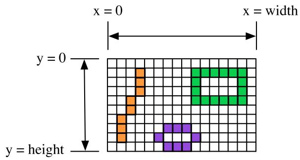

A graphics context draws in a rectangle made up of pixels. A position in the rectangle is specified by a pair of integer coordinates, (x,y). The upper left corner has coordinates (0,0). The x coordinate increases from left to right, and the y coordinate increases from top to bottom. The illustration shows a 16-by-10 pixel component (with very large pixels). A small line, rectangle, and oval are shown as they would be drawn by coloring individual pixels. (Note that, properly speaking, the coordinates don’t belong to the pixels but to the grid lines between them.)

For any component, you can find out the size of the rectangle that it occupies by calling the instance methods getWidth() and getHeight(), which return the number of pixels in the horizontal and vertical directions, respectively. In general, it’s not a good idea to assume that you know the size of a component, since the size is often set by a layout manager and can even change if the component is in a window and that window is resized by the user. This means that it’s good form to check the size of a component before doing any drawing on that component. For example, you can use a paintComponent() method that looks like:

```txt
public void paintComponent(Graphics g) {
    super.paintComponent(g);
    int width = getWidth();  // Find out the width of this component.
    int height = getHeight();  // Find out its height.
    . . .   // Draw the content of the component.
}
```

Of course, your drawing commands will have to take the size into account. That is, they will have to use (x,y) coordinates that are calculated based on the actual height and width of the component.

## 6.3.2 Colors

You will probably want to use some color when you draw. Java is designed to work with the RGB color system. An RGB color is specified by three numbers that give the level of red, green, and blue, respectively, in the color. A color in Java is an object of the class, java.awt.Color. You can construct a new color by specifying its red, blue, and green components. For example,

```javascript
Color myColor = new Color(r,g,b);
```

There are two constructors that you can call in this way. In the one that I almost always use, r, g, and b are integers in the range 0 to 255. In the other, they are numbers of type float in the range 0.0F to 1.0F. (Recall that a literal of type float is written with an “F” to distinguish it from a double number.) Often, you can avoid constructing new colors altogether, since the Color class defines several named constants representing common colors: Color.WHITE, Color.BLACK, Color.RED, Color.GREEN, Color.BLUE, Color.CYAN, Color.MAGENTA, Color.YELLOW, Color.PINK, Color.ORANGE, Color.LIGHT GRAY, Color.GRAY, and Color.DARK GRAY. (There are older, alternative names for these constants that use lower case rather than upper case constants, such as Color.red instead of Color.RED, but the upper case versions are preferred because they follow the convention that constant names should be upper case.)

An alternative to RGB is the HSB color system. In the HSB system, a color is specified by three numbers called the hue, the saturation, and the brightness. The hue is the basic color, ranging from red through orange through all the other colors of the rainbow. The brightness is pretty much what it sounds like. A fully saturated color is a pure color tone. Decreasing the saturation is like mixing white or gray paint into the pure color. In Java, the hue, saturation and brightness are always specified by values of type float in the range from 0.0F to 1.0F. The Color class has a static member function named getHSBColor for creating HSB colors. To create the color with HSB values given by h, s, and b, you can say:

```javascript
Color myColor = Color.getHSBColor(h,s,b);
```

For example, to make a color with a random hue that is as bright and as saturated as possible, you could use:

```javascript
Color randomColor = Color.getHSBColor((float)Math.random(), 1.0F, 1.0F);
```

The type cast is necessary because the value returned by Math.random() is of type double, and Color.getHSBColor() requires values of type float. (By the way, you might ask why RGB colors are created using a constructor while HSB colors are created using a static member function. The problem is that we would need two diferent constructors, both of them with three parameters of type float. Unfortunately, this is impossible. You can have two constructors only if the number of parameters or the parameter types difer.)

The RGB system and the HSB system are just diferent ways of describing the same set of colors. It is possible to translate between one system and the other. The best way to understand the color systems is to experiment with them. In the on-line version of this section, you will find an applet that you can use to experiment with RGB and HSB colors.

One of the properties of a Graphics object is the current drawing color, which is used for all drawing of shapes and text. If g is a graphics context, you can change the current drawing color for g using the method g.setColor(c), where c is a Color. For example, if you want to draw in green, you would just say g.setColor(Color.GREEN) before doing the drawing. The graphics context continues to use the color until you explicitly change it with another setColor() command. If you want to know what the current drawing color is, you can call the function g.getColor(), which returns an object of type Color. This can be useful if you want to change to another drawing color temporarily and then restore the previous drawing color.

Every component has an associated foreground color and background color. Generally, the component is filled with the background color before anything else is drawn (although some components are “transparent,” meaning that the background color is ignored). When a new graphics context is created for a component, the current drawing color is set to the foreground color. Note that the foreground color and background color are properties of the component, not of a graphics context.

The foreground and background colors can be set by instance methods setForeground(c) and setBackground(c), which are defined in the Component class and therefore are available for use with any component. This can be useful even for standard components, if you want them to use colors that are diferent from the defaults.

## 6.3.3 Fonts

A font represents a particular size and style of text. The same character will appear diferent in diferent fonts. In Java, a font is characterized by a font name, a style, and a size. The available font names are system dependent, but you can always use the following four strings as font names: “Serif”, “SansSerif”, “Monospaced”, and “Dialog”. (A “serif” is a little decoration on a character, such as a short horizontal line at the bottom of the letter i. “SansSerif” means “without serifs.” “Monospaced” means that all the characters in the font have the same width. The “Dialog” font is the one that is typically used in dialog boxes.)

The style of a font is specified using named constants that are defined in the Font class. You can specify the style as one of the four values:

• Font.PLAIN,

• Font.ITALIC,

• Font.BOLD, or

• Font.BOLD + Font.ITALIC.

The size of a font is an integer. Size typically ranges from about 10 to 36, although larger sizes can also be used. The size of a font is usually about equal to the height of the largest characters in the font, in pixels, but this is not an exact rule. The size of the default font is 12.

Java uses the class named java.awt.Font for representing fonts. You can construct a new font by specifying its font name, style, and size in a constructor:

Font plainFont = new Font("Serif", Font.PLAIN, 12);

Font bigBoldFont = new Font("SansSerif", Font.BOLD, 24);

Every graphics context has a current font, which is used for drawing text. You can change the current font with the setFont() method. For example, if g is a graphics context and bigBoldFont is a font, then the command g.setFont(bigBoldFont) will set the current font of g to bigBoldFont. The new font will be used for any text that is drawn after the setFont() command is given. You can find out the current font of g by calling the method g.getFont(), which returns an object of type Font.

Every component has an associated font. It can be set with the instance method setFont(font), which is defined in the Component class. When a graphics context is created for drawing on a component, the graphic context’s current font is set equal to the font of the component.

## 6.3.4 Shapes

The Graphics class includes a large number of instance methods for drawing various shapes, such as lines, rectangles, and ovals. The shapes are specified using the (x,y) coordinate system described above. They are drawn in the current drawing color of the graphics context. The current drawing color is set to the foreground color of the component when the graphics context is created, but it can be changed at any time using the setColor() method.

Here is a list of some of the most important drawing methods. With all these commands, any drawing that is done outside the boundaries of the component is ignored. Note that all these methods are in the Graphics class, so they all must be called through an object of type Graphics.

• drawString(String str, int x, int y) — Draws the text given by the string str. The string is drawn using the current color and font of the graphics context. x specifies the position of the left end of the string. y is the y-coordinate of the baseline of the string. The baseline is a horizontal line on which the characters rest. Some parts of the characters, such as the tail on a y or g, extend below the baseline.

• drawLine(int x1, int y1, int x2, int y2) — Draws a line from the point (x1,y1) to the point (x2,y2). The line is drawn as if with a pen that hangs one pixel to the right and one pixel down from the (x,y) point where the pen is located. For example, if g refers to an object of type Graphics, then the command g.drawLine(x,y,x,y), which corresponds to putting the pen down at a point, colors the single pixel with upper left corner at the point (x,y).

• drawRect(int x, int y, int width, int height) — Draws the outline of a rectangle. The upper left corner is at (x,y), and the width and height of the rectangle are as specified. If width equals height, then the rectangle is a square. If the width or the height is negative, then nothing is drawn. The rectangle is drawn with the same pen that is used for drawLine(). This means that the actual width of the rectangle as drawn is width+1, and similarly for the height. There is an extra pixel along the right edge and the bottom edge. For example, if you want to draw a rectangle around the edges of the component, you can say “g.drawRect(0, 0, getWidth()-1, getHeight()-1);”, where g is a graphics context for the component. If you use “g.drawRect(0, 0, getWidth(), getHeight());”, then the right and bottom edges of the rectangle will be drawn outside the component.

• drawOval(int x, int y, int width, int height) — Draws the outline of an oval. The oval is one that just fits inside the rectangle specified by x, y, width, and height. If width equals height, the oval is a circle.

• drawRoundRect(int x, int y, int width, int height, int xdiam, int ydiam) — Draws the outline of a rectangle with rounded corners. The basic rectangle is specified by x, y, width, and height, but the corners are rounded. The degree of rounding is given by xdiam and ydiam. The corners are arcs of an ellipse with horizontal diameter xdiam and vertical diameter ydiam. A typical value for xdiam and ydiam is 16, but the value used should really depend on how big the rectangle is.

• draw3DRect(int x, int y, int width, int height, boolean raised) — Draws the outline of a rectangle that is supposed to have a three-dimensional efect, as if it is raised from the screen or pushed into the screen. The basic rectangle is specified by x, y, width, and height. The raised parameter tells whether the rectangle seems to be raised from the screen or pushed into it. The 3D efect is achieved by using brighter and darker versions of the drawing color for diferent edges of the rectangle. The documentation recommends setting the drawing color equal to the background color before using this method. The efect won’t work well for some colors.

• drawArc(int x, int y, int width, int height, int startAngle, int arcAngle) — Draws part of the oval that just fits inside the rectangle specified by x, y, width, and height. The part drawn is an arc that extends arcAngle degrees from a starting angle at startAngle degrees. Angles are measured with 0 degrees at the 3 o’clock position (the positive direction of the horizontal axis). Positive angles are measured counterclockwise from zero, and negative angles are measured clockwise. To get an arc of a circle, make sure that width is equal to height.

• fillRect(int x, int y, int width, int height) — Draws a filled-in rectangle. This fills in the interior of the rectangle that would be drawn by drawRect(x,y,width,height). The extra pixel along the bottom and right edges is not included. The width and height parameters give the exact width and height of the rectangle. For example, if you wanted to fill in the entire component, you could say “g.fillRect(0, 0, getWidth(), getHeight());”

• fillOval(int x, int y, int width, int height) — Draws a filled-in oval.

• fillRoundRect(int x, int y, int width, int height, int xdiam, int ydiam) — Draws a filled-in rounded rectangle.

• fill3DRect(int x, int y, int width, int height, boolean raised) — Draws a filled-in three-dimensional rectangle.

• fillArc(int x, int y, int width, int height, int startAngle, int arcAngle) — Draw a filled-in arc. This looks like a wedge of pie, whose crust is the arc that would be drawn by the drawArc method.

## 6.3.5 Graphics2D

All drawing in Java is done through an object of type Graphics. The Graphics class provides basic commands for such things as drawing shapes and text and for selecting a drawing color.

These commands are adequate in many cases, but they fall far short of what’s needed in a serious computer graphics program. Java has another class, Graphics2D, that provides a larger set of drawing operations. Graphics2D is a sub-class of Graphics, so all the methods from the Graphics class are also available in a Graphics2D.

The paintComponent() method of a JComponent gives you a graphics context of type Graphics that you can use for drawing on the component. In fact, the graphics context actually belongs to the sub-class Graphics2D (in Java version 1.2 and later), and can be type-cast to gain access to the advanced Graphics2D drawing methods:

```txt
public void paintComponent(Graphics g) {
    super.paintComponent(g);
    Graphics2D g2;
    g2 = (Graphics2D)g;
    .
    . // Draw on the component using g2.
    .
}
```

Drawing in Graphics2D is based on shapes, which are objects that implement an interface named Shape. Shape classes include Line2D, Rectangle2D, Ellipse2D, Arc2D, and CubicCurve2D, among others; all these classes are defined in the package java.awt.geom. CubicCurve2D can be used to draw Bezier Curves, which are used in many graphics programs. Graphics2D has methods draw(Shape) and fill(Shape) for drawing the outline of a shape and for filling its interior. Advanced capabilities include: lines that are more than one pixel thick, dotted and dashed lines, filling a shape with a texture (this is, with a repeated image), filling a shape with a gradient, and drawing translucent objects that will blend with their background.

In the Graphics class, coordinates are specified as integers and are based on pixels. The shapes that are used with Graphics2D use real numbers for coordinates, and they are not necessarily bound to pixels. In fact, you can change the coordinate system and use any coordinates that are convenient to your application. In computer graphics terms, you can apply a “transformation” to the coordinate system. The transformation can be any combination of translation, scaling, and rotation.

I mention Graphics2D here for completeness. I will not use any of the advanced capabilities of Graphics2D in this chapter, but I will cover a few of them in Section 12.2.

## 6.3.6 An Example

Let’s use some of the material covered in this section to write a subclass of JPanel for use as a drawing surface. The panel can then be used in either an applet or a frame, as discussed in Subsection 6.2.2. All the drawing will be done in the paintComponent() method of the panel class. The panel will draw multiple copies of a message on a black background. Each copy of the message is in a random color. Five diferent fonts are used, with diferent sizes and styles. The message can be specified in the constructor; if the default constructor is used, the message is the string “Java!”. The panel works OK no matter what its size. Here is what the panel looks like:


There is one problem with the way this class works. When the panel’s paintComponent() method is called, it chooses random colors, fonts, and locations for the messages. The information about which colors, fonts, and locations are used is not stored anywhere. The next time paintComponent() is called, it will make diferent random choices and will draw a diferent picture. For this particular applet, the problem only really appears when the panel is partially covered and then uncovered (and even then the problem does not show up in all environments). It is possible that only the part that was covered will be redrawn, and in the part that’s not redrawn, the old picture will remain. The user might see partial messages, cut of by the dividing line between the new picture and the old. A better approach would be to compute the contents of the picture elsewhere, outside the paintComponent() method. Information about the picture should be stored in instance variables, and the paintComponent() method should use that information to draw the picture. If paintComponent() is called twice, it should draw the same picture twice, unless the data has changed in the meantime. Unfortunately, to store the data for the picture in this applet, we would need to use either arrays, which will not be covered until Chapter 7, or of-screen images, which will not be covered until Chapter 12. Other examples in this chapter will sufer from the same problem.

The source for the panel class is shown below. I use an instance variable called message to hold the message that the panel will display. There are five instance variables of type Font that represent diferent sizes and styles of text. These variables are initialized in the constructor and are used in the paintComponent() method.

The paintComponent() method for the panel simply draws 25 copies of the message. For each copy, it chooses one of the five fonts at random, and it calls g.setFont() to select that font for drawing the text. It creates a random HSB color and uses g.setColor() to select that color for drawing. It then chooses random (x,y) coordinates for the location of the message. The x coordinate gives the horizontal position of the left end of the string. The formula used for the x coordinate, “-50 + (int)(Math.random() \* (width+40))” gives a random integer in the range from -50 to width-10. This makes it possible for the string to extend beyond the left edge or the right edge of the panel. Similarly, the formula for y allows the string to extend beyond the top and bottom of the applet.

Here is the complete source code for the RandomStringsPanel

import java.awt.Color;

import java.awt.Font;

import java.awt.Graphics;

import javax.swing.JPanel;

/\*\*

\* This panel displays 25 copies of a message. The color and

\* position of each message is selected at random. The font

```java
* of each message is randomly chosen from among five possible
* fonts.  The messages are displayed on a black background.
* <p>Note:  The style of drawing used here is bad, because every
* time the paintComponent() method is called, new random values are
* used.  This means that a different picture will be drawn each
* time.  This is particularly bad if only part of the panel
* needs to be redrawn, since then the panel will contain
* cut-off pieces of messages.
* <p>This panel is meant to be used as the content pane in
* either an applet or a frame.
*/
public class RandomStringsPanel extends JPanel {
    private String message;  // The message to be displayed.  This can be set in
                          // the constructor.  If no value is provided in the
                          // constructor, then the string "Java!" is used.
    private Font font1, font2, font3, font4, font5;  // The five fonts.
    /**
     * Default constructor creates a panel that displays the message "Java!".
     *
     */
    public RandomStringsPanel() {
        this(null);  // Call the other constructor, with parameter null.
    }

    /**
     * Constructor creates a panel to display 25 copies of a specified message.
     * @param messageString The message to be displayed.  If this is null,
     * then the default message "Java!" is displayed.
     */
    public RandomStringsPanel(String messageString) {

        message = messageString;
        if (message == null)
            message = "Java!";

        font1 = new Font("Serif", Font.BOLD, 14);
        font2 = new Font("SansSerif", Font.BOLD + Font.ITALIC, 24);
        font3 = new Font("Monospaced", Font.PLAIN, 30);
        font4 = new Font("Dialog", Font.PLAIN, 36);
        font5 = new Font("Serif", Font.ITALIC, 48);

        setBackground(Color.BLACK);
    }

    /**
     * The paintComponent method is responsible for drawing the content of the panel.
     * It draws 25 copies of the message string, using a random color, font, and
     * position for each string.
     */
    public void paintComponent(Graphics g) {
        super.paintComponent(g);  // Call the paintComponent method from the
                          // superclass, JPanel.  This simply fills the
                          // entire panel with the background color, black.
```

```javascript
int width = getWidth();
int height = getHeight();

for (int i = 0; i < 25; i++) {
    // Draw one string. First, set the font to be one of the five
    // available fonts, at random.

    int fontNum = (int)(5*Math.random()) + 1;
    switch (fontNum) {
        case 1:
            g.setFont(font1);
            break;
        case 2:
            g.setFont(font2);
            break;
        case 3:
            g.setFont(font3);
            break;
        case 4:
            g.setFont(font4);
            break;
        case 5:
            g.setFont(font5);
            break;
    } // end switch

    // Set the color to a bright, saturated color, with random hue.
    float hue = (float)Math.random();
    g.setColor( Color.getHSBColor(hue, 1.0F, 1.0F) );

    // Select the position of the string, at random.

    int x,y;
    x = -50 + (int)(Math.random()*(width+40));
    y = (int)(Math.random()*(height+20));

    // Draw the message.

    g.drawString(message,x,y);
} // end for
} // end paintComponent()

// end class RandomStringsPanel
defines a panel, which is not something that can stand on its own. To see it where we have to use it in an applet or a frame. Here is a simple applet class that contains stringsPanel as its content pane:
```

```typescript
import javax.swing.JApplet;
```

\* A RandomStringsApplet displays 25 copies of a string, using random colors,

```java
* The actual content of the applet is an object of type RandomStringsPanel.
*/
public class RandomStringsApplet extends JApplet {

    public void init() {
        String message = getParameter("message");
        RandomStringsPanel content = new RandomStringsPanel(message);
        setContentPane(content);
    }

}
```

Note that the message to be displayed in the applet can be set using an applet parameter when the applet is added to an HTML document. Using applets on Web pages was discussed in Subsection 6.2.4. Remember that to use the applet on a Web page, you must include both the panel class file, RandomStringsPanel.class, and the applet class file, RandomStringsApplet.class, in the same directory as the HTML document (or, alternatively, bundle the two class files into a jar file, and put the jar file in the document directory).

Instead of writing an applet, of course, we could use the panel in the window of a standalone application. You can find the source code for a main program that does this in the file RandomStringsApp.java.

## 6.4 Mouse Events

Events are central to programming for a graphical user interface. A GUI program doesn’t have a main() routine that outlines what will happen when the program is run, in a step-by-step process from beginning to end. Instead, the program must be prepared to respond to various kinds of events that can happen at unpredictable times and in an order that the program doesn’t control. The most basic kinds of events are generated by the mouse and keyboard. The user can press any key on the keyboard, move the mouse, or press a button on the mouse. The user can do any of these things at any time, and the computer has to respond appropriately.

In Java, events are represented by objects. When an event occurs, the system collects all the information relevant to the event and constructs an object to contain that information. Diferent types of events are represented by objects belonging to diferent classes. For example, when the user presses one of the buttons on a mouse, an object belonging to a class called MouseEvent is constructed. The object contains information such as the source of the event (that is, the component on which the user clicked), the (x,y) coordinates of the point in the component where the click occurred, and which button on the mouse was pressed. When the user presses a key on the keyboard, a KeyEvent is created. After the event object is constructed, it is passed as a parameter to a designated subroutine. By writing that subroutine, the programmer says what should happen when the event occurs.

As a Java programmer, you get a fairly high-level view of events. There is a lot of processing that goes on between the time that the user presses a key or moves the mouse and the time that a subroutine in your program is called to respond to the event. Fortunately, you don’t need to know much about that processing. But you should understand this much: Even though your GUI program doesn’t have a main() routine, there is a sort of main routine running somewhere that executes a loop of the form

```txt
while the program is still running:
    Wait for the next event to occur
    Call a subroutine to handle the event
```

This loop is called an event loop. Every GUI program has an event loop. In Java, you don’t have to write the loop. It’s part of “the system.” If you write a GUI program in some other language, you might have to provide a main routine that runs an event loop.

In this section, we’ll look at handling mouse events in Java, and we’ll cover the framework for handling events in general. The next section will cover keyboard-related events and timer events. Java also has other types of events, which are produced by GUI components. These will be introduced in Section 6.6.

## 6.4.1 Event Handling

For an event to have any efect, a program must detect the event and react to it. In order to detect an event, the program must “listen” for it. Listening for events is something that is done by an object called an event listener. An event listener object must contain instance methods for handling the events for which it listens. For example, if an object is to serve as a listener for events of type MouseEvent, then it must contain the following method (among several others):

public void mousePressed(MouseEvent evt) { . . . }

The body of the method defines how the object responds when it is notified that a mouse button has been pressed. The parameter, evt, contains information about the event. This information can be used by the listener object to determine its response.

The methods that are required in a mouse event listener are specified in an interface named MouseListener. To be used as a listener for mouse events, an object must implement this MouseListener interface. Java interfaces were covered in Subsection 5.7.1. (To review briefly: An interface in Java is just a list of instance methods. A class can “implement” an interface by doing two things. First, the class must be declared to implement the interface, as in “class MyListener implements MouseListener” or “class MyApplet extends JApplet implements MouseListener”. Second, the class must include a definition for each instance method specified in the interface. An interface can be used as the type for a variable or formal parameter. We say that an object implements the MouseListener interface if it belongs to a class that implements the MouseListener interface. Note that it is not enough for the object to include the specified methods. It must also belong to a class that is specifically declared to implement the interface.)

Many events in Java are associated with GUI components. For example, when the user presses a button on the mouse, the associated component is the one that the user clicked on. Before a listener object can “hear” events associated with a given component, the listener object must be registered with the component. If a MouseListener object, mListener, needs to hear mouse events associated with a Component object, comp, the listener must be registered with the component by calling “comp.addMouseListener(mListener);”. The addMouseListener() method is an instance method in class Component, and so can be used with any GUI component object. In our first few examples, we will listen for events on a JPanel that is being used as a drawing surface.

The event classes, such as MouseEvent, and the listener interfaces, such as MouseListener, are defined in the package java.awt.event. This means that if you want to work with events, you should either include the line “import java.awt.event.\*;” at the beginning of your source code file or import the individual classes and interfaces.

Admittedly, there is a large number of details to tend to when you want to use events. To summarize, you must

1. Put the import specification “import java.awt.event.\*;” (or individual imports) at the beginning of your source code;

2. Declare that some class implements the appropriate listener interface, such as MouseListener;

3. Provide definitions in that class for the subroutines from the interface;

4. Register the listener object with the component that will generate the events by calling a method such as addMouseListener() in the component.

Any object can act as an event listener, provided that it implements the appropriate interface. A component can listen for the events that it itself generates. A panel can listen for events from components that are contained in the panel. A special class can be created just for the purpose of defining a listening object. Many people consider it to be good form to use anonymous inner classes to define listening objects (see Subsection 5.7.3). You will see all of these patterns in examples in this textbook.

## 6.4.2 MouseEvent and MouseListener

The MouseListener interface specifies five diferent instance methods:

public void mousePressed(MouseEvent evt);

public void mouseReleased(MouseEvent evt);

public void mouseClicked(MouseEvent evt);

public void mouseEntered(MouseEvent evt);

public void mouseExited(MouseEvent evt);

The mousePressed method is called as soon as the user presses down on one of the mouse buttons, and mouseReleased is called when the user releases a button. These are the two methods that are most commonly used, but any mouse listener object must define all five methods; you can leave the body of a method empty if you don’t want to define a response. The mouseClicked method is called if the user presses a mouse button and then releases it quickly, without moving the mouse. (When the user does this, all three routines—mousePressed, mouseReleased, and mouseClicked—will be called in that order.) In most cases, you should define mousePressed instead of mouseClicked. The mouseEntered and mouseExited methods are called when the mouse cursor enters or leaves the component. For example, if you want the component to change appearance whenever the user moves the mouse over the component, you could define these two methods.

As an example, we will look at a small addition to the RandomStringsPanel example from the previous section. In the new version, the panel will repaint itself when the user clicks on it. In order for this to happen, a mouse listener should listen for mouse events on the panel, and when the listener detects a mousePressed event, it should respond by calling the repaint() method of the panel.

For the new version of the program, we need an object that implements the MouseListener interface. One way to create the object is to define a separate class, such as:

```java
import java.awt.Component;
import java.awt.event.*;

/**
 * An object of type RepaintOnClick is a MouseListener that
 * will respond to a mousePressed event by calling the repaint()
 * method of the source of the event.  That is, a RepaintOnClick
```

```java
* object can be added as a mouse listener to any Component;
* when the user clicks that component, the component will be
* repainted.
*/
public class RepaintOnClick implements MouseListener {

    public void mousePressed(MouseEvent evt) {
        Component source = (Component)evt.getSource();
        source.repaint();  // Call repaint() on the Component that was clicked.
    }

    public void mouseClicked(MouseEvent evt) { }
    public void mouseReleased(MouseEvent evt) { }
    public void mouseEntered(MouseEvent evt) { }
    public void mouseExited(MouseEvent evt) { }

}
```

This class does three of the four things that we need to do in order to handle mouse events: First, it imports java.awt.event.\* for easy access to event-related classes. Second, it is declared that the class “implements MouseListener”. And third, it provides definitions for the five methods that are specified in the MouseListener interface. (Note that four of the five event-handling methods have empty defintions. We really only want to define a response to mousePressed events, but in order to implement the MouseListener interface, a class must define all five methods.)

We must do one more thing to set up the event handling for this example: We must register an event-handling object as a listener with the component that will generate the events. In this case, the mouse events that we are interested in will be generated by an object of type RandomStringsPanel. If panel is a variable that refers to the panel object, we can create a mouse listener object and register it with the panel with the statements:

```javascript
RepaintOnClick listener = new RepaintOnClick(); // Create MouseListener object.
panel.addMouseListener(listener); // Register MouseListener with the panel.
```

Once this is done, the listener object will be notified of mouse events on the panel. When a mousePressed event occurs, the mousePressed() method in the listener will be called. The code in this method calls the repaint() method in the component that is the source of the event, that is, in the panel. The result is that the RandomStringsPanel is repainted with its strings in new random colors, fonts, and positions.

Although we have written the RepaintOnClick class for use with our RandomStringsPanel example, the event-handling class contains no reference at all to the RandomStringsPanel class. How can this be? The mousePressed() method in class RepaintOnClick looks at the source of the event, and calls its repaint() method. If we have registered the RepaintOnClick object as a listener on a RandomStringsPanel, then it is that panel that is repainted. But the listener object could be used with any type of component, and it would work in the same way.

Similarly, the RandomStringsPanel class contains no reference to the RepaintOnClick class— in fact, RandomStringsPanel was written before we even knew anything about mouse events! The panel will send mouse events to any object that has registered with it as a mouse listener. It does not need to know anything about that object except that it is capable of receiving mouse events.

The relationship between an object that generates an event and an object that responds to that event is rather loose. The relationship is set up by registering one object to listen for events from the other object. This is something that can potentially be done from outside both objects. Each object can be developed independently, with no knowledge of the internal operation of the other object. This is the essence of modular design: Build a complex system out of modules that interact only in straightforward, easy to understand ways. Then each module is a separate design problem that can be tackled independently.

To make this clearer, consider the application version of the ClickableRandomStrings program. I have included RepaintOnClick as a nested class, although it could just as easily be a separate class. The main point is that this program uses the same RandomStringsPanel class that was used in the original program, which did not respond to mouse clicks. The mouse handling has been “bolted on” to an existing class, without having to make any changes at all to that class:

```java
import java.awt.Component;
import java.awt.event.MouseEvent;
import java.awt.event.MouseListener;
import javax.swing.JFrame;

/**
 * Displays a window that shows 25 copies of the string "Java!" in
 * random colors, fonts, and positions. The content of the window
 * is an object of type RandomStringsPanel. When the user clicks
 * the window, the content of the window is repainted, with the
 * strings in newly selected random colors, fonts, and positions.
 */
public class ClickableRandomStringsApp {

    public static void main(String[] args) {
        JFrame window = new JFrame("Random Strings");
        RandomStringsPanel content = new RandomStringsPanel();
        content.addMouseListener( new RepaintOnClick() ); // Register mouse listener.
        window.setContentPane(content);
        window.setDefaultCloseOperation(JFrame.EXIT_ON_CLOSE);
        window.setLocation(100,75);
        window.setSize(300,240);
        window.setVisible(true);
    }

    private static class RepaintOnClick implements MouseListener {

        public void mousePressed(MouseEvent evt) {
            Component source = (Component)evt.getSource();
            source.repaint();
        }

        public void mouseClicked(MouseEvent evt) { }
        public void mouseReleased(MouseEvent evt) { }
        public void mouseEntered(MouseEvent evt) { }
        public void mouseExited(MouseEvent evt) { }

    }
}
```

## 6.4.3 Mouse Coordinates

Often, when a mouse event occurs, you want to know the location of the mouse cursor. This information is available from the MouseEvent parameter to the event-handling method, which contains instance methods that return information about the event. If evt is the parameter, then you can find out the coordinates of the mouse cursor by calling evt.getX() and evt.getY(). These methods return integers which give the x and y coordinates where the mouse cursor was positioned at the time when the event occurred. The coordinates are expressed in the coordinate system of the component that generated the event, where the top left corner of the component is (0,0).

The user can hold down certain modifier keys while using the mouse. The possible mod ifier keys include: the Shift key, the Control key, the ALT key (called the Option key on the Macintosh), and the Meta key (called the Command or Apple key on the Macintosh). You might want to respond to a mouse event diferently when the user is holding down a modi fier key. The boolean-valued instance methods evt.isShiftDown(), evt.isControlDown(), evt.isAltDown(), and evt.isMetaDown() can be called to test whether the modifier keys are pressed.

You might also want to have diferent responses depending on whether the user presses the left mouse button, the middle mouse button, or the right mouse button. Now, not every mouse has a middle button and a right button, so Java handles the information in a peculiar way. It treats pressing the right button as equivalent to holding down the Meta key while pressing the left mouse button. That is, if the right button is pressed, then the instance method evt.isMetaDown() will return true (even if the Meta key is not pressed). Similarly, pressing the middle mouse button is equivalent to holding down the ALT key. In practice, what this really means is that pressing the right mouse button under Windows is equivalent to holding down the Command key while pressing the mouse button on Macintosh. A program tests for either of these by calling evt.isMetaDown().

As an example, consider a JPanel that does the following: Clicking on the panel with the left mouse button will place a red rectangle on the panel at the point where the mouse was clicked. Clicking with the right mouse button (or holding down the Command key while clicking on a Macintosh) will place a blue oval on the applet. Holding down the Shift key while clicking will clear the panel by removing all the shapes that have been placed.

There are several ways to write this example. I could write a separate class to handle mouse events, as I did in the previous example. However, in this case, I decided to let the panel respond to mouse events itself. Any object can be a mouse listener, as long as it imple ments the MouseListener interface. In this case, the panel class implements the MouseListener interface, so any object belonging to that class can act as a mouse listener. The constructor for the panel class registers the panel with itself as a mouse listener. It does this with the statement “addMouseListener(this)”. Since this command is in a method in the panel class, the addMouseListener() method in the panel object is being called, and a listener is being registered with that panel. The parameter “this” also refers to the panel object, so it is the same panel object that is listening for events. Thus, the panel object plays a dual role here. (If you find this too confusing, remember that you can always write a separate class to define the listening object.)

The source code for the panel class is shown below. You should check how the instance methods in the MouseEvent object are used. You can also check for the Four Steps of Event Handling (“import java.awt.event.\*”, “implements MouseListener”, definitions for the event-handling methods, and “addMouseListener”):

```java
import java.awt.*;
import java.awt.event.*;
import javax.swing.*;

/**
 * A simple demonstration of MouseEvents.  Shapes are drawn
 * on a black background when the user clicks the panel  If
 * the user Shift-clicks, the applet is cleared.  If the user
 * right-clicks the applet, a blue oval is drawn.  Otherwise,
 * when the user clicks, a red rectangle is drawn.  The contents of
 * the panel are not persistent.  For example, they might disappear
 * if the panel is covered and uncovered.
 */
public class SimpleStamperPanel extends JPanel implements MouseListener {

    /**
     * This constructor simply sets the background color of the panel to be black
     * and sets the panel to listen for mouse events on itself.
     */
    public SimpleStamperPanel() {
        setBackground(Color.BLACK);
        addMouseListener(this);
    }

    /**
     * Since this panel has been set to listen for mouse events on itself,
     * this method will be called when the user clicks the mouse on the panel.
     * This method is part of the MouseListener interface.
     */
    public void mousePressed(MouseEvent evt) {

        if ( evt.isShiftDown() ) {
            // The user was holding down the Shift key.  Just repaint the panel.
            // Since this class does not define a paintComponent() method, the
            // method from the superclass, JPanel, is called.  That  method simply
            // fills the panel with its background color, which is black.  The
            // effect is to clear the panel.
            repaint();
            return;
        }

        int x = evt.getX();  // x-coordinate where user clicked.
        int y = evt.getY();  // y-coordinate where user clicked.

        Graphics g = getGraphics();  // Graphics context for drawing directly.
                                    // NOTE:  This is considered to be bad style!

        if ( evt.isMetaDown() ) {
            // User right-clicked at the point (x,y). Draw a blue oval centered
            // at the point (x,y). (A black outline around the oval will make it
            // more distinct when ovals and rects overlap.)
            g.setColor(Color.BLUE);  // Blue interior.
            g.fillOval( x - 30, y - 15, 60, 30 );
            g.setColor(Color.BLACK); // Black outline.
            g.drawOval( x - 30, y - 15, 60, 30 );
        }
    }
}
```

```txt
else {
    // User left-clicked (or middle-clicked) at (x,y).
    // Draw a red rectangle centered at (x,y).
    g.setColor(Color.RED);   // Red interior.
    g.fillRect( x - 30, y - 15, 60, 30 );
    g.setColor(Color.BLACK); // Black outline.
    g.drawRect( x - 30, y - 15, 60, 30 );
}
```

g.dispose(); // We are finished with the graphics context, so dispose of it. } // end mousePressed();

```txt
// The next four empty routines are required by the MouseListener interface.
// Since they don't do anything in this class, so their definitions are empty.
```

```java
public void mouseEntered(MouseEvent evt) { }
public void mouseExited(MouseEvent evt) { }
public void mouseClicked(MouseEvent evt) { }
public void mouseReleased(MouseEvent evt) { }
```

```javascript
} // end class SimpleStamperPanel
```

Note, by the way, that this class violates the rule that all drawing should be done in a paintComponent() method. The rectangles and ovals are drawn directly in the mousePressed() routine. To make this possible, I need to obtain a graphics context by saying “g = getGraphics()”. After using g for drawing, I call g.dispose() to inform the operating system that I will no longer be using g for drawing. It is a good idea to do this to free the system resources that are used by the graphics context. I do not advise doing this type of direct drawing if it can be avoided, but you can see that it does work in this case, and at this point we really have no other way to write this example.

## 6.4.4 MouseMotionListeners and Dragging

Whenever the mouse is moved, it generates events. The operating system of the computer detects these events and uses them to move the mouse cursor on the screen. It is also possible for a program to listen for these “mouse motion” events and respond to them. The most common reason to do so is to implement dragging. Dragging occurs when the user moves the mouse while holding down a mouse button.

The methods for responding to mouse motion events are defined in an interface named MouseMotionListener. This interface specifies two event-handling methods:

public void mouseDragged(MouseEvent evt);

public void mouseMoved(MouseEvent evt);

The mouseDragged method is called if the mouse is moved while a button on the mouse is pressed. If the mouse is moved while no mouse button is down, then mouseMoved is called instead. The parameter, evt, is an object of type MouseEvent. It contains the x and y coordinates of the mouse’s location. As long as the user continues to move the mouse, one of these methods will be called over and over. (So many events are generated that it would be ineficient for a program to hear them all, if it doesn’t want to do anything in response. This is why the mouse motion event-handlers are defined in a separate interface from the other mouse events: You can listen for the mouse events defined in MouseListener without automatically hearing all mouse motion events as well.)

If you want your program to respond to mouse motion events, you must create an object that implements the MouseMotionListener interface, and you must register that object to listen for events. The registration is done by calling a component’s addMouseMotionListener method. The object will then listen for mouseDragged and mouseMoved events associated with that component. In most cases, the listener object will also implement the MouseListener interface so that it can respond to the other mouse events as well.

To get a better idea of how mouse events work, you should try the SimpleTrackMouseApplet in the on-line version of this section. The applet is programmed to respond to any of the seven diferent kinds of mouse events by displaying the coordinates of the mouse, the type of event, and a list of the modifier keys that are down (Shift, Control, Meta, and Alt). You can experiment with the applet to see what happens when you use the mouse on the applet. (Alternatively, you could run the stand-alone application version of the program, SimpleTrackMouse.java.)

The source code for the applet can be found in SimpleTrackMousePanel.java, which defines the panel that is used as the content pane of the applet, and in SimpleTrackMouseApplet.java, which defines the applet class. The panel class includes a nested class, MouseHandler, that defines the mouse-handling object. I encourage you to read the source code. You should now be familiar with all the techniques that it uses.

It is interesting to look at what a program needs to do in order to respond to dragging operations. In general, the response involves three methods: mousePressed(), mouseDragged(), and mouseReleased(). The dragging gesture starts when the user presses a mouse button, it continues while the mouse is dragged, and it ends when the user releases the button. This means that the programming for the response to one dragging gesture must be spread out over the three methods! Furthermore, the mouseDragged() method can be called many times as the mouse moves. To keep track of what is going on between one method call and the next, you need to set up some instance variables. In many applications, for example, in order to process a mouseDragged event, you need to remember the previous coordinates of the mouse. You can store this information in two instance variables prevX and prevY of type int. It can also be useful to save the starting coordinates, where the mousePressed event occurred, in instance variables. I also suggest having a boolean variable, dragging, which is set to true while a dragging gesture is being processed. This is necessary because not every mousePressed event starts a dragging operation to which you want to respond. The mouseDragged and mouseReleased methods can use the value of dragging to check whether a drag operation is actually in progress. You might need other instance variables as well, but in general outline, a class that handles mouse dragging looks like this:

import java.awt.event.\*;

public class MouseDragHandler implements MouseListener, MouseMotionListener {

```txt
private int startX, startY; // Point where mouse is pressed.
private int prevX, prevY;   // Most recently processed mouse coords.
private boolean dragging;   // Set to true when dragging is in process.
. . . // other instance variables for use in dragging

public void mousePressed(MouseEvent evt) {
    if ( we-want-to-start-dragging ) {
        dragging = true;
        startX = evt.getX();  // Remember starting position.
        startY = evt.getY();
        prevX = startX;      // Remember most recent coords.
        prevY = startY;
```

```lisp
.
    . // Other processing.
    .
}
}

public void mouseDragged(MouseEvent evt) {
    if ( dragging == false )  // First, check if we are
        return;            //   processing a dragging gesture.
    int x = evt.getX(); // Current position of Mouse.
    int y = evt.getY();
    .
    . // Process a mouse movement from (prevX, prevY) to (x,y).
    .
    prevX = x;  // Remember the current position for the next call
    prevY = y;
}

public void mouseReleased(MouseEvent evt) {
    if ( dragging == false )  // First, check if we are
        return;            //   processing a dragging gesture.
    dragging = false;  // We are done dragging.
    .
    . // Other processing and clean-up.
    .
}
}
```

As an example, let’s look at a typical use of dragging: allowing the user to sketch a curve by dragging the mouse. This example also shows many other features of graphics and mouse processing. In the program, you can draw a curve by dragging the mouse on a large white drawing area, and you can select a color for drawing by clicking on one of several colored rectangles to the right of the drawing area. The complete source code can be found in SimplePaint.java, which can be run as a stand-alone application, and you can find an applet version in the on-line version of this section. Here is a picture of the program:

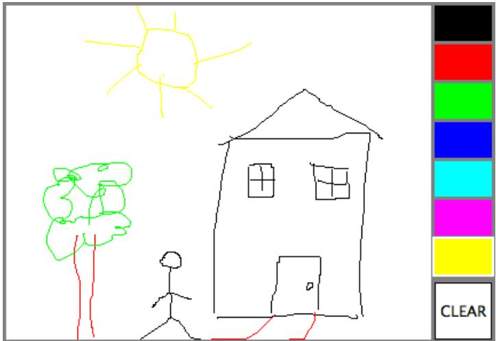

I will discuss a few aspects of the source code here, but I encourage you to read it carefully in its entirety. There are lots of informative comments in the source code. (The source code uses one unusual technique: It defines a subclass of JApplet, but it also includes a main() routine. The main() routine has nothing to do with the class’s use as an applet, but it makes it possible to run the class as a stand-alone application. When this is done, the application opens a window that shows the same panel that would be shown in the applet version. This example thus shows how to write a single file that can be used either as a stand-alone application or as an applet.)

The panel class for this example is designed to work for any reasonable size, that is, unless the panel is too small. This means that coordinates are computed in terms of the actual width and height of the panel. (The width and height are obtained by calling getWidth() and getHeight().) This makes things quite a bit harder than they would be if we assumed some particular fixed size for the panel. Let’s look at some of these computations in detail. For example, the large white drawing area extends from y = 3 to y = height - 3 vertically and from x = 3 to x = width - 56 horizontally. These numbers are needed in order to interpret the meaning of a mouse click. They take into account a gray border around the panel and the color palette along the right edge of the panel. The border is 3 pixels wide. The colored rectangles are 50 pixels wide. Together with the 3-pixel border around the panel and a 3-pixel divider between the drawing area and the colored rectangles, this adds up to put the right edge of the drawing area 56 pixels from the right edge of the panel.

A white square labeled “CLEAR” occupies a 50-by-50 pixel region beneath the colored rectangles on the right edge of the panel. Allowing for this square, we can figure out how much vertical space is available for the seven colored rectangles, and then divide that space by 7 to get the vertical space available for each rectangle. This quantity is represented by a variable, colorSpace. Out of this space, 3 pixels are used as spacing between the rectangles, so the height of each rectangle is colorSpace - 3. The top of the N-th rectangle is located (N\*colorSpace + 3) pixels down from the top of the panel, assuming that we count the rectangles starting with zero. This is because there are N rectangles above the N-th rectangle, each of which uses colorSpace pixels. The extra 3 is for the border at the top of the panel. After all that, we can write down the command for drawing the N-th rectangle:

g.fillRect(width - 53, N\*colorSpace + 3, 50, colorSpace - 3);

That was not easy! But it shows the kind of careful thinking and precision graphics that are sometimes necessary to get good results.

The mouse in this panel is used to do three diferent things: Select a color, clear the drawing, and draw a curve. Only the third of these involves dragging, so not every mouse click will start a dragging operation. The mousePressed routine has to look at the (x,y) coordinates where the mouse was clicked and decide how to respond. If the user clicked on the CLEAR rectangle, the drawing area is cleared by calling repaint(). If the user clicked somewhere in the strip of colored rectangles, the selected color is changed. This involves computing which color the user clicked on, which is done by dividing the y coordinate by colorSpace. Finally, if the user clicked on the drawing area, a drag operation is initiated. A boolean variable, dragging, is set to true so that the mouseDragged and mouseReleased methods will know that a curve is being drawn. The code for this follows the general form given above. The actual drawing of the curve is done in the mouseDragged method, which draws a line from the previous location of the mouse to its current location. Some efort is required to make sure that the line does not extend beyond the white drawing area of the panel. This is not automatic, since as far as the computer is concerned, the border and the color bar are part of the drawing surface. If the user drags the mouse outside the drawing area while drawing a line, the mouseDragged routine changes the x and y coordinates to make them lie within the drawing area.

## 6.4.5 Anonymous Event Handlers

As I mentioned above, it is a fairly common practice to use anonymous nested classes to define listener objects. As discussed in Subsection 5.7.3, a special form of the new operator is used to create an object that belongs to an anonymous class. For example, a mouse listener object can be created with an expression of the form:

```java
new MouseListener() {
    public void mousePressed(MouseEvent evt) { . . . }
    public void mouseReleased(MouseEvent evt) { . . . }
    public void mouseClicked(MouseEvent evt) { . . . }
    public void mouseEntered(MouseEvent evt) { . . . }
    public void mouseExited(MouseEvent evt) { . . . }
}
```

This is all just one long expression that both defines an un-named class and creates an object that belongs to that class. To use the object as a mouse listener, it should be passed as the parameter to some component’s addMouseListener() method in a command of the form:

```java
component.addMouseListener( new MouseListener() {
    public void mousePressed(MouseEvent evt) { . . . }
    public void mouseReleased(MouseEvent evt) { . . . }
    public void mouseClicked(MouseEvent evt) { . . . }
    public void mouseEntered(MouseEvent evt) { . . . }
    public void mouseExited(MouseEvent evt) { . . . }
} );
```

Now, in a typical application, most of the method definitions in this class will be empty. A class that implements an interface must provide definitions for all the methods in that interface, even if the definitions are empty. To avoid the tedium of writing empty method definitions in cases like this, Java provides adapter classes. An adapter class implements a listener interface by providing empty definitions for all the methods in the interface. An adapter class is useful only as a basis for making subclasses. In the subclass, you can define just those methods that you actually want to use. For the remaining methods, the empty definitions that are provided by the adapter class will be used. The adapter class for the MouseListener interface is named MouseAdapter. For example, if you want a mouse listener that only responds to mouse-pressed events, you can use a command of the form:

```java
component.addMouseListener( new MouseAdapter() {
    public void mousePressed(MouseEvent evt) { . . . }
} );
```

To see how this works in a real example, let’s write another version of the ClickableRandomStringsApp application from Subsection 6.4.2. This version uses an anonymous class based on MouseAdapter to handle mouse events:

```java
import java.awt.Component;
import java.awt.event.MouseEvent;
import java.awt.event.MouseListener;
import javax.swing.JFrame;

public class ClickableRandomStringsApp {
```

```java
public static void main(String[] args) {
    JFrame window = new JFrame("Random Strings");
    RandomStringsPanel content = new RandomStringsPanel();

    content.addMouseListener(new MouseAdapter() {
        // Register a mouse listener that is defined by an anonymous subclass
        // of MouseAdapter.  This replaces the RepaintOnClick class that was
        // used in the original version.
        public void mousePressed(MouseEvent evt) {
            Component source = (Component)evt.getSource();
            source.repaint();
        }
    } );

    window.setContentPane(content);
    window.setDefaultCloseOperation(JFrame.EXIT_ON_CLOSE);
    window.setLocation(100,75);
    window.setSize(300,240);
    window.setVisible(true);
}
```

Anonymous inner classes can be used for other purposes besides event handling. For example, suppose that you want to define a subclass of JPanel to represent a drawing surface. The subclass will only be used once. It will redefine the paintComponent() method, but will make no other changes to JPanel. It might make sense to define the subclass as an anonymous nested class. As an example, I present HelloWorldGUI4.java. This version is a variation of HelloWorldGUI2.java that uses anonymous nested classes where the original program uses ordinary, named nested classes:

```java
import java.awt.*;
import java.awt.event.*;
import javax.swing.*;

/**
 * A simple GUI program that creates and opens a JFrame containing
 * the message "Hello World" and an "OK" button.  When the user clicks
 * the OK button, the program ends.  This version uses anonymous
 * classes to define the message display panel and the action listener
 * object.  Compare to HelloWorldGUI2, which uses nested classes.
 */
public class HelloWorldGUI4 {

    /**
     * The main program creates a window containing a HelloWorldDisplay
     * and a button that will end the program when the user clicks it.
     */
    public static void main(String[] args) {

        JPanel displayPanel = new JPanel() {
            // An anonymous subclass of JPanel that displays "Hello World!".
        public void paintComponent(Graphics g) {
            super.paintComponent(g);
            g.drawString( "Hello World!", 20, 30 );
        }
    }
}
```

```java
};
JButton okButton = new JButton("OK");
okButton.addActionListener(new ActionListener() {
    // An anonymous class that defines the listener object.
    public void actionPerformed(ActionEvent e) {
        System.exit(0);
    }
} );

JPanel content = new JPanel();
content.setLayout(new BorderLayout());
content.add(displayPanel, BorderLayout.CENTER);
content.add(okButton, BorderLayout.SOUTH);

JFrame window = new JFrame("GUI Test");
window.setContentPane(content);
window.setSize(250,100);
window.setLocation(100,100);
window.setVisible(true);

}
}
```

## 6.5 Timer and Keyboard Events

Not every event is generated by an action on the part of the user. Events can also be generated by objects as part of their regular programming, and these events can be monitored by other objects so that they can take appropriate actions when the events occur. One example of this is the class javax.swing.Timer. A Timer generates events at regular intervals. These events can be used to drive an animation or to perform some other task at regular intervals. We will begin this section with a look at timer events and animation. We will then look at another type of basic user-generated event: the KeyEvents that are generated when the user types on the keyboard. The example at the end of the section uses both a timer and keyboard events to implement a simple game.

## 6.5.1 Timers and Animation

An object belonging to the class javax.swing.Timer exists only to generate events. A Timer, by default, generates a sequence of events with a fixed delay between each event and the next. (It is also possible to set a Timer to emit a single event after a specified time delay; in that case, the timer is being used as an “alarm.”) Each event belongs to the class ActionEvent. An object that is to listen for the events must implement the interface ActionListener, which defines just one method:

## public void actionPerformed(ActionEvent evt)

To use a Timer, you must create an object that implements the ActionListener interface. That is, the object must belong to a class that is declared to “implement ActionListener”, and that class must define the actionPerformed method. Then, if the object is set to listen for events from the timer, the code in the listener’s actionPerformed method will be executed every time the timer generates an event.

Since there is no point to having a timer without having a listener to respond to its events, the action listener for a timer is specified as a parameter in the timer’s constructor. The time delay between timer events is also specified in the constructor. If timer is a variable of type Timer, then the statement

```javascript
timer = new Timer( millisDelay, listener );
```

creates a timer with a delay of millisDelay milliseconds between events (where 1000 milliseconds equal one second). Events from the timer are sent to the listener. (millisDelay must be of type int, and listener must be of type ActionListener.) Note that a timer is not guaranteed to deliver events at precisely regular intervals. If the computer is busy with some other task, an event might be delayed or even dropped altogether.

A timer does not automatically start generating events when the timer object is created. The start() method in the timer must be called to tell the timer to start generating events. The timer’s stop() method can be used to turn the stream of events of—it can be restarted by calling start() again.

## ∗ ∗ ∗

One application of timers is computer animation. A computer animation is just a sequence of still images, presented to the user one after the other. If the time between images is short, and if the change from one image to another is not too great, then the user perceives continuous motion. The easiest way to do animation in Java is to use a Timer to drive the animation. Each time the timer generates an event, the next frame of the animation is computed and drawn on the screen—the code that implements this goes in the actionPerformed method of an object that listens for events from the timer.

Our first example of using a timer is not exactly an animation, but it does display a new image for each timer event. The program shows randomly generated images that vaguely resemble works of abstract art. In fact, the program draws a new random image every time its paintComponent() method is called, and the response to a timer event is simply to call repaint(), which in turn triggers a call to paintComponent. The work of the program is done in a subclass of JPanel, which starts like this:

```java
import java.awt.*;
import java.awt.event.*;
import javax.swing.*;

public class RandomArtPanel extends JPanel {
```

\* A RepaintAction object calls the repaint method of this panel each

\* time its actionPerformed() method is called. An object of this

\* type is used as an action listener for a Timer that generates an

\* ActionEvent every four seconds. The result is that the panel is

\* redrawn every four seconds.

private class RepaintAction implements ActionListener {

```java
/**
 * The constructor creates a timer with a delay time of four seconds
 * (4000 milliseconds), and with a RepaintAction object as its
 * ActionListener.  It also starts the timer running.
 */
public RandomArtPanel() {
    RepaintAction action = new RepaintAction();
    Timer timer = new Timer(4000, action);
    timer.start();
}

/**
 * The paintComponent() method fills the panel with a random shade of
 * gray and then draws one of three types of random "art".  The type
 * of art to be drawn is chosen at random.
 */
public void paintComponent(Graphics g) {
    .
    .   // The rest of the class is omitted
    .
```

You can find the full source code for this class in the file RandomArtPanel.java; An application version of the program is RandomArt.java, while the applet version is RandomArtApplet.java. You can see the applet version in the on-line version of this section.

Later in this section, we will use a timer to drive the animation in a simple computer game.

## 6.5.2 Keyboard Events

In Java, user actions become events in a program. These events are associated with GUI components. When the user presses a button on the mouse, the event that is generated is associated with the component that contains the mouse cursor. What about keyboard events? When the user presses a key, what component is associated with the key event that is generated?

A GUI uses the idea of input focus to determine the component associated with keyboard events. At any given time, exactly one interface element on the screen has the input focus, and that is where all keyboard events are directed. If the interface element happens to be a Java component, then the information about the keyboard event becomes a Java object of type KeyEvent, and it is delivered to any listener objects that are listening for KeyEvents associated with that component. The necessity of managing input focus adds an extra twist to working with keyboard events.

It’s a good idea to give the user some visual feedback about which component has the input focus. For example, if the component is the typing area of a word-processor, the feedback is usually in the form of a blinking text cursor. Another common visual clue is to draw a brightly colored border around the edge of a component when it has the input focus, as I do in the examples given later in this section.

A component that wants to have the input focus can call the method requestFocus(), which is defined in the Component class. Calling this method does not absolutely guarantee that the component will actually get the input focus. Several components might request the focus; only one will get it. This method should only be used in certain circumstances in any case, since it can be a rude surprise to the user to have the focus suddenly pulled away from a component that the user is working with. In a typical user interface, the user can choose to give the focus to a component by clicking on that component with the mouse. And pressing the tab key will often move the focus from one component to another.

Some components do not automatically request the input focus when the user clicks on them. To solve this problem, a program has to register a mouse listener with the component to detect user clicks. In response to a user click, the mousePressed() method should call requestFocus() for the component. This is true, in particular, for the components that are used as drawing surfaces in the examples in this chapter. These components are defined as subclasses of JPanel, and JPanel objects do not receive the input focus automatically. If you want to be able to use the keyboard to interact with a JPanel named drawingSurface, you have to register a listener to listen for mouse events on the drawingSurface and call drawingSurface.requestFocus() in the mousePressed() method of the listener object.

As our first example of processing key events, we look at a simple program in which the user moves a square up, down, left, and right by pressing arrow keys. When the user hits the ’R’, ’G’, ’B’, or ’K’ key, the color of the square is set to red, green, blue, or black, respectively. Of course, none of these key events are delivered to the program unless it has the input focus. The panel in the program changes its appearance when it has the input focus: When it does, a cyan-colored border is drawn around the panel; when it does not, a gray-colored border is drawn. Also, the panel displays a diferent message in each case. If the panel does not have the input focus, the user can give the input focus to the panel by clicking on it. The complete source code for this example can be found in the file KeyboardAndFocusDemo.java. I will discuss some aspects of it below. After reading this section, you should be able to understand the source code in its entirety. Here is what the program looks like in its focussed state:

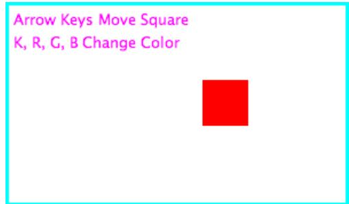

In Java, keyboard event objects belong to a class called KeyEvent. An object that needs to listen for KeyEvents must implement the interface named KeyListener. Furthermore, the object must be registered with a component by calling the component’s addKeyListener() method. The registration is done with the command “component.addKeyListener(listener);” where listener is the object that is to listen for key events, and component is the object that will generate the key events (when it has the input focus). It is possible for component and listener to be the same object. All this is, of course, directly analogous to what you learned about mouse events in the previous section. The KeyListener interface defines the following methods, which must be included in any class that implements KeyListener:

public void keyPressed(KeyEvent evt);

public void keyReleased(KeyEvent evt);

public void keyTyped(KeyEvent evt);

Java makes a careful distinction between the keys that you press and the characters that you type. There are lots of keys on a keyboard: letter keys, number keys, modifier keys such as Control and Shift, arrow keys, page up and page down keys, keypad keys, function keys. In many cases, pressing a key does not type a character. On the other hand, typing a character sometimes involves pressing several keys. For example, to type an uppercase ’A’, you have to press the Shift key and then press the A key before releasing the Shift key. On my Macintosh computer, I can type an accented e, by holding down the Option key, pressing the E key, releasing the Option key, and pressing E again. Only one character was typed, but I had to perform three key-presses and I had to release a key at the right time. In Java, there are three types of KeyEvent. The types correspond to pressing a key, releasing a key, and typing a character. The keyPressed method is called when the user presses a key, the keyReleased method is called when the user releases a key, and the keyTyped method is called when the user types a character. Note that one user action, such as pressing the E key, can be responsible for two events, a keyPressed event and a keyTyped event. Typing an upper case ’A’ can generate two keyPressed, two keyReleased, and one keyTyped event.

Usually, it is better to think in terms of two separate streams of events, one consisting of keyPressed and keyReleased events and the other consisting of keyTyped events. For some applications, you want to monitor the first stream; for other applications, you want to monitor the second one. Of course, the information in the keyTyped stream could be extracted from the keyPressed/keyReleased stream, but it would be dificult (and also system-dependent to some extent). Some user actions, such as pressing the Shift key, can only be detected as keyPressed events. I have a solitaire game on my computer that hilites every card that can be moved, when I hold down the Shift key. You could do something like that in Java by hiliting the cards when the Shift key is pressed and removing the hilite when the Shift key is released.

There is one more complication. Usually, when you hold down a key on the keyboard, that key will auto-repeat. This means that it will generate multiple keyPressed events, as long as it is held down. It can also generate multiple keyTyped events. For the most part, this will not afect your programming, but you should not expect every keyPressed event to have a corresponding keyReleased event.

Every key on the keyboard has an integer code number. (Actually, this is only true for keys that Java knows about. Many keyboards have extra keys that can’t be used with Java.) When the keyPressed or keyReleased method is called, the parameter, evt, contains the code of the key that was pressed or released. The code can be obtained by calling the function evt.getKeyCode(). Rather than asking you to memorize a table of code numbers, Java provides a named constant for each key. These constants are defined in the KeyEvent class. For example the constant for the shift key is KeyEvent.VK SHIFT. If you want to test whether the key that the user pressed is the Shift key, you could say “if (evt.getKeyCode() == KeyEvent.VK SHIFT)”. The key codes for the four arrow keys are KeyEvent.VK LEFT, KeyEvent.VK RIGHT, KeyEvent.VK UP, and KeyEvent.VK DOWN. Other keys have similar codes. (The “VK” stands for “Virtual Keyboard”. In reality, diferent keyboards use diferent key codes, but Java translates the actual codes from the keyboard into its own “virtual” codes. Your program only sees these virtual key codes, so it will work with various keyboards on various platforms without modification.)

In the case of a keyTyped event, you want to know which character was typed. This information can be obtained from the parameter, evt, in the keyTyped method by calling the function evt.getKeyChar(). This function returns a value of type char representing the character that was typed.

In the KeyboardAndFocusDemo program, I use the keyPressed routine to respond when the user presses one of the arrow keys. The applet includes instance variables, squareLeft and squareTop, that give the position of the upper left corner of the movable square. When the user presses one of the arrow keys, the keyPressed routine modifies the appropriate instance variable and calls repaint() to redraw the panel with the square in its new position. Note that the values of squareLeft and squareTop are restricted so that the square never moves outside the white area of the panel:

```java
/**
 * This is called each time the user presses a key while the panel has
 * the input focus.  If the key pressed was one of the arrow keys,
 * the square is moved (except that it is not allowed to move off the
 * edge of the panel, allowing for a 3-pixel border).
 */
public void keyPressed(KeyEvent evt) {
    int key = evt.getKeyCode();  // keyboard code for the pressed key
    if (key == KeyEvent.VK_LEFT) {  // move the square left
        squareLeft -= 8;
        if (squareLeft < 3)
            squareLeft = 3;
        repaint();
    }
    else if (key == KeyEvent.VK_RIGHT) {  // move the square right
        squareLeft += 8;
        if (squareLeft > getWidth() - 3 - SQUARE_SIZE)
            squareLeft = getWidth() - 3 - SQUARE_SIZE;
        repaint();
    }
    else if (key == KeyEvent.VK_UP) {  // move the square up
        squareTop -= 8;
        if (squareTop < 3)
            squareTop = 3;
        repaint();
    }
    else if (key == KeyEvent.VK_DOWN) {  // move the square down
        squareTop += 8;
        if (squareTop > getHeight() - 3 - SQUARE_SIZE)
            squareTop = getHeight() - 3 - SQUARE_SIZE;
        repaint();
    }
} // end keyPressed()
```

Color changes—which happen when the user types the characters ’R’, ’G’, ’B’, and ’K’, or the lower case equivalents—are handled in the keyTyped method. I won’t include it here, since it is so similar to the keyPressed method. Finally, to complete the KeyListener interface, the keyReleased method must be defined. In the sample program, the body of this method is empty since the applet does nothing in response to keyReleased events.

## 6.5.3 Focus Events

If a component is to change its appearance when it has the input focus, it needs some way to know when it has the focus. In Java, objects are notified about changes of input focus by events of type FocusEvent. An object that wants to be notified of changes in focus can implement the FocusListener interface. This interface declares two methods:

```java
public void focusGained(FocusEvent evt);
public void focusLost(FocusEvent evt);
```

Furthermore, the addFocusListener() method must be used to set up a listener for the focus events. When a component gets the input focus, it calls the focusGained() method of any object that has been registered with that component as a FocusListener. When it loses the focus, it calls the listener’s focusLost() method. Sometimes, it is the component itself that listens for focus events.

In the sample KeyboardAndFocusDemo program, the response to a focus event is simply to redraw the panel. The paintComponent() method checks whether the panel has the input focus by calling the boolean-valued function hasFocus(), which is defined in the Component class, and it draws a diferent picture depending on whether or not the panel has the input focus. The net result is that the appearance of the panel changes when the panel gains or loses focus. The methods from the FocusListener interface are defined simply as:

```txt
public void focusGained(FocusEvent evt) {
    // The panel now has the input focus.
    repaint();  // will redraw with a new message and a cyan border
}

public void focusLost(FocusEvent evt) {
    // The panel has now lost the input focus.
    repaint();  // will redraw with a new message and a gray border
}
```

The other aspect of handling focus is to make sure that the panel gets the focus when the user clicks on it. To do this, the panel implements the MouseListener interface and listens for mouse events on itself. It defines a mousePressed routine that asks that the input focus be given to the panel:

```java
public void mousePressed(MouseEvent evt) {
    requestFocus();
}
```

The other four methods of the mouseListener interface are defined to be empty. Note that the panel implements three diferent listener interfaces, KeyListener, FocusListener, and MouseListener, and the constructor in the panel class registers itself to listen for all three types of events with the statements:

```javascript
addKeyListener(this);
addFocusListener(this);
addMouseListener(this);
```

There are, of course, other ways to organize this example. It would be possible, for example, to use a nested class to define the listening object. Or anonymous classes could be used to define separate listening objects for each type of event. In my next example, I will take the latter approach.

## 6.5.4 State Machines

The information stored in an object’s instance variables is said to represent the state of that object. When one of the object’s methods is called, the action taken by the object can depend on its state. (Or, in the terminology we have been using, the definition of the method can look at the instance variables to decide what to do.) Furthermore, the state can change. (That is, the definition of the method can assign new values to the instance variables.) In computer science, there is the idea of a state machine, which is just something that has a state and can change state in response to events or inputs. The response of a state machine to an event or input depends on what state it’s in. An object is a kind of state machine. Sometimes, this point of view can be very useful in designing classes.

The state machine point of view can be especially useful in the type of event-oriented programming that is required by graphical user interfaces. When designing a GUI program, you can ask yourself: What information about state do I need to keep track of? What events can change the state of the program? How will my response to a given event depend on the current state? Should the appearance of the GUI be changed to reflect a change in state? How should the paintComponent() method take the state into account? All this is an alternative to the top-down, step-wise-refinement style of program design, which does not apply to the overall design of an event-oriented program.

In the KeyboardAndFocusDemo program, shown above, the state of the program is recorded in the instance variables squareColor, squareLeft, and squareTop. These state variables are used in the paintComponent() method to decide how to draw the panel. They are changed in the two key-event-handling methods.

In the rest of this section, we’ll look at another example, where the state plays an even bigger role. In this example, the user plays a simple arcade-style game by pressing the arrow keys. The main panel of the program is defined in the souce code file SubKillerPanel.java. An applet that uses this panel can be found in SubKillerApplet.java, while the stand-alone application version is SubKiller.java. You can try out the applet in the on-line version of this section. Here is what it looks like:


You have to click on the panel to give it the input focus. The program shows a black “submarine” near the bottom of the panel. When the panel has the input focus, this submarine moves back and forth erratically near the bottom. Near the top, there is a blue “boat”. You can move this boat back and forth by pressing the left and right arrow keys. Attached to the boat is a red “bomb” (or “depth charge”). You can drop the bomb by hitting the down arrow key. The objective is to blow up the submarine by hitting it with the bomb. If the bomb falls of the bottom of the screen, you get a new one. If the submarine explodes, a new sub is created and you get a new bomb. Try it! Make sure to hit the sub at least once, so you can see the explosion.

Let’s think about how this program can be programmed. First of all, since we are doing object-oriented programming, I decided to represent the boat, the depth charge, and the submarine as objects. Each of these objects is defined by a separate nested class inside the main panel class, and each object has its own state which is represented by the instance variables in the corresponding class. I use variables boat, bomb, and sub in the panel class to refer to the boat, bomb, and submarine objects.

Now, what constitutes the “state” of the program? That is, what things change from time to time and afect the appearance or behavior of the program? Of course, the state includes the positions of the boat, submarine, and bomb, so I need variables to store the positions. Anything else, possibly less obvious? Well, sometimes the bomb is falling, and sometimes it’s not. That is a diference in state. Since there are two possibilities, I represent this aspect of the state with a boolean variable in the bomb object, bomb.isFalling. Sometimes the submarine is moving left and sometimes it is moving right. The diference is represented by another boolean variable, sub.isMovingLeft. Sometimes, the sub is exploding. This is also part of the state, and it is represented by a boolean variable, sub.isExploding. However, the explosions require a little more thought. An explosion is something that takes place over a series of frames. While an explosion is in progress, the sub looks diferent in each frame, as the size of the explosion increases. Also, I need to know when the explosion is over so that I can go back to moving and drawing the sub as usual. So, I use an integer variable, sub.explosionFrameNumber to record how many frames have been drawn since the explosion started; the value of this variable is used only when an explosion is in progress.

How and when do the values of these state variables change? Some of them seem to change on their own: For example, as the sub moves left and right, the state variables the that specify its position are changing. Of course, these variables are changing because of an animation, and that animation is driven by a timer. Each time an event is generated by the timer, some of the state variables have to change to get ready for the next frame of the animation. The changes are made by the action listener that listens for events from the timer. The boat, bomb, and sub objects each contain an updateForNextFrame() method that updates the state variables of the object to get ready for the next frame of the animation. The action listener for the timer calls these methods with the statements

boat.updateForNewFrame();

bomb.updateForNewFrame();

sub.updateForNewFrame();

The action listener also calls repaint(), so that the panel will be redrawn to reflect its new state. There are several state variables that change in these update methods, in addition to the position of the sub: If the bomb is falling, then its y-coordinate increases from one frame to the next. If the bomb hits the sub, then the isExploding variable of the sub changes to true, and the isFalling variable of the bomb becomes false. The isFalling variable also becomes false when the bomb falls of the bottom of the screen. If the sub is exploding, then its explosionFrameNumber increases from one frame to the next, and when it reaches a certain value, the explosion ends and isExploding is reset to false. At random times, the sub switches between moving to the left and moving to the right. Its direction of motion is recorded in the the sub’s isMovingLeft variable. The sub’s updateForNewFrame() method includes the lines

if ( Math.random() < 0.04 )

isMovingLeft = ! isMovingLeft;

There is a 1 in 25 chance that Math.random() will be less than 0.04, so the statement “isMovingLeft = ! isMovingLeft” is executed in one in every twenty-five frames, on the average. The efect of this statement is to reverse the value of isMovingLeft, from false to true or from true to false. That is, the direction of motion of the sub is reversed.

In addtion to changes in state that take place from one frame to the next, a few state variables change when the user presses certain keys. In the program, this is checked in a method that responds to user keystrokes. If the user presses the left or right arrow key, the position of the boat is changed. If the user presses the down arrow key, the bomb changes from not-falling to falling. This is coded in the keyPressed()method of a KeyListener that is registered to listen for key events on the panel; that method reads as follows:

```java
public void keyPressed(KeyEvent evt) {
    int code = evt.getKeyCode();  // which key was pressed.
    if (code == KeyEvent.VK_LEFT) {
        // Move the boat left.  (If this moves the boat out of the frame, its
        // position will be adjusted in the boat.updateForNewFrame() method.)
        boat.centerX -= 15;
    }
    else if (code == KeyEvent.VK_RIGHT) {
        // Move the boat right.  (If this moves boat out of the frame, its
        // position will be adjusted in the boat.updateForNewFrame() method.)
        boat.centerX += 15;
    }
    else if (code == KeyEvent.VK_DOWN) {
        // Start the bomb falling, it is is not already falling.
        if ( bomb.isFalling == false )
            bomb.isFalling = true;
    }
}
```

Note that it’s not necessary to call repaint() when the state changes, since this panel shows an animation that is constantly being redrawn anyway. Any changes in the state will become visible to the user as soon as the next frame is drawn. At some point in the program, I have to make sure that the user does not move the boat of the screen. I could have done this in keyPressed(), but I choose to check for this in another routine, in the boat object.

I encourage you to read the source code in SubKillerPanel.java. Although a few points are tricky, you should with some efort be able to read and understand the entire program. Try to understand the program in terms of state machines. Note how the state of each of the three objects in the program changes in response to events from the timer and from the user.

You should also note that the program uses four listeners, to respond to action events from the timer, key events from the user, focus events, and mouse events. (The mouse is used only to request the input focus when the user clicks the panel.) The timer runs only when the panel has the input focus; this is programmed by having the focus listener start the timer when the panel gains the input focus and stop the timer when the panel loses the input focus. All four listeners are created in the constructor of the SubKillerPanel class using anonymous inner classes. (See Subsection 6.4.5.)

While it’s not at all sophisticated as arcade games go, the SubKiller game does use some interesting programming. And it nicely illustrates how to apply state-machine thinking in event-oriented programming.

## 6.6 Basic Components

In preceding sections, you’ve seen how to use a graphics context to draw on the screen and how to handle mouse events and keyboard events. In one sense, that’s all there is to GUI programming. If you’re willing to program all the drawing and handle all the mouse and keyboard events, you have nothing more to learn. However, you would either be doing a lot more work than you need to do, or you would be limiting yourself to very simple user interfaces. A typical user interface uses standard GUI components such as buttons, scroll bars, text-input boxes, and menus. These components have already been written for you, so you don’t have to duplicate the work involved in developing them. They know how to draw themselves, and they can handle the details of processing the mouse and keyboard events that concern them.

Consider one of the simplest user interface components, a push button. The button has a border, and it displays some text. This text can be changed. Sometimes the button is disabled, so that clicking on it doesn’t have any efect. When it is disabled, its appearance changes. When the user clicks on the push button, the button changes appearance while the mouse button is pressed and changes back when the mouse button is released. In fact, it’s more complicated than that. If the user moves the mouse outside the push button before releasing the mouse button, the button changes to its regular appearance. To implement this, it is necessary to respond to mouse exit or mouse drag events. Furthermore, on many platforms, a button can receive the input focus. The button changes appearance when it has the focus. If the button has the focus and the user presses the space bar, the button is triggered. This means that the button must respond to keyboard and focus events as well.

Fortunately, you don’t have to program any of this, provided you use an object belonging to the standard class javax.swing.JButton. A JButton object draws itself and processes mouse, keyboard, and focus events on its own. You only hear from the Button when the user triggers it by clicking on it or pressing the space bar while the button has the input focus. When this happens, the JButton object creates an event object belonging to the class java.awt.event.ActionEvent. The event object is sent to any registered listeners to tell them that the button has been pushed. Your program gets only the information it needs—the fact that a button was pushed.

## ∗ ∗ ∗

The standard components that are defined as part of the Swing graphical user interface API are defined by subclasses of the class JComponent, which is itself a subclass of Component. (Note that this includes the JPanel class that we have already been working with extensively.) Many useful methods are defined in the Component and JComponent classes and so can be used with any Swing component. We begin by looking at a few of these methods. Suppose that comp is a variable that refers to some JComponent. Then the following methods can be used:

• comp.getWidth() and comp.getHeight() are functions that give the current size of the component, in pixels. One warning: When a component is first created, its size is zero. The size will be set later, probably by a layout manager. A common mistake is to check the size of a component before that size has been set, such as in a constructor.

• comp.setEnabled(true) and comp.setEnabled(false) can be used to enable and disable the component. When a component is disabled, its appearance might change, and the user cannot do anything with it. There is a boolean-valued function, comp.isEnabled() that you can call to discover whether the component is enabled.

• comp.setVisible(true) and comp.setVisible(false) can be called to hide or show the component.

• comp.setFont(font) sets the font that is used for text displayed on the component. See Subsection 6.3.3 for a discussion of fonts.

• comp.setBackground(color) and comp.setForeground(color) set the background and foreground colors for the component. See Subsection 6.3.2.

• comp.setOpaque(true) tells the component that the area occupied by the component should be filled with the component’s background color before the content of the component is painted. By default, only JLabels are non-opaque. A non-opaque, or “transparent”, component ignores its background color and simply paints its content over the content of its container. This usually means that it inherits the background color from its container.

• comp.setToolTipText(string) sets the specified string as a “tool tip” for the component. The tool tip is displayed if the mouse cursor is in the component and the mouse is not moved for a few seconds. The tool tip should give some information about the meaning of the component or how to use it.

• comp.setPreferredSize(size) sets the size at which the component should be displayed, if possible. The parameter is of type java.awt.Dimension, where an object of type Dimension has two public integer-valued instance variables, width and height. A call to this method usually looks something like “setPreferredSize( new Dimension(100,50) )”. The preferred size is used as a hint by layout managers, but will not be respected in all cases. Standard components generally compute a correct preferred size automatically, but it can be useful to set it in some cases. For example, if you use a JPanel as a drawing surface, it might be a good idea to set a preferred size for it.

Note that using any component is a multi-step process. The component object must be created with a constructor. It must be added to a container. In many cases, a listener must be registered to respond to events from the component. And in some cases, a reference to the component must be saved in an instance variable so that the component can be manipulated by the program after it has been created. In this section, we will look at a few of the basic standard components that are available in Swing. In the next section we will consider the problem of laying out components in containers.

## 6.6.1 JButton

An object of class JButton is a push button that the user can click to trigger some action. You’ve already seen buttons used in Section 6.1 and Section 6.2, but we consider them in much more detail here. To use any component efectively, there are several aspects of the corresponding class that you should be familiar with. For JButton, as an example, I list these aspects explicitely:

• Constructors: The JButton class has a constructor that takes a string as a parameter. This string becomes the text displayed on the button. For example: stopGoButton = new JButton("Go"). This creates a button object that will display the text, “Go” (but remember that the button must still be added to a container before it can appear on the screen).

• Events: When the user clicks on a button, the button generates an event of type Action-Event. This event is sent to any listener that has been registered with the button as an ActionListener.

• Listeners: An object that wants to handle events generated by buttons must implement the ActionListener interface. This interface defines just one method, “public void actionPerformed(ActionEvent evt)”, which is called to notify the object of an action event.

• Registration of Listeners: In order to actually receive notification of an event from a button, an ActionListener must be registered with the button. This is done with the button’s addActionListener() method. For example: stopGoButton.addActionListener( buttonHandler );

• Event methods: When actionPerformed(evt) is called by the button, the parameter, evt, contains information about the event. This information can be retrieved by calling methods in the ActionEvent class. In particular, evt.getActionCommand() returns a String giving the command associated with the button. By default, this command is the text that is displayed on the button, but it is possible to set it to some other string. The method evt.getSource() returns a reference to the Object that produced the event, that is, to the JButton that was pressed. The return value is of type Object, not JButton, because other types of components can also produce ActionEvents.

• Component methods: Several useful methods are defined in the JButton class. For example, stopGoButton.setText("Stop") changes the text displayed on the button to “Stop”. And stopGoButton.setActionCommand("sgb") changes the action command associated to this button for action events.

Of course, JButtons also have all the general Component methods, such as setEnabled() and setFont(). The setEnabled() and setText() methods of a button are particularly useful for giving the user information about what is going on in the program. A disabled button is better than a button that gives an obnoxious error message such as “Sorry, you can’t click on me now!”

## 6.6.2 JLabel

JLabel is certainly the simplest type of component. An object of type JLabel exists just to display a line of text. The text cannot be edited by the user, although it can be changed by your program. The constructor for a JLabel specifies the text to be displayed:

```javascript
JLabel message = new JLabel("Hello World!");
```

There is another constructor that specifies where in the label the text is located, if there is extra space. The possible alignments are given by the constants JLabel.LEFT, JLabel.CENTER, and JLabel.RIGHT. For example,

JLabel message = new JLabel("Hello World!", JLabel.CENTER);

creates a label whose text is centered in the available space. You can change the text displayed in a label by calling the label’s setText() method:

message.setText("Goodby World!");

Since the JLabel class is a subclass of JComponent, you can use methods such as setForeground() with labels. If you want the background color to have any efect, you should call setOpaque(true) on the label, since otherwise the JLabel might not fill in its background. For example:

```javascript
JLabel message = new JLabel("Hello World!", JLabel.CENTER);
message.setForeground(Color.RED);  // Display red text...
message.setBackground(Color.BLACK); //      on a black background...
message.setFont(new Font("Serif",Font.BOLD,18));  // in a big bold font.
message.setOpaque(true);  // Make sure background is filled in.
```

## 6.6.3 JCheckBox

A JCheckBox is a component that has two states: selected or unselected. The user can change the state of a check box by clicking on it. The state of a checkbox is represented by a boolean value that is true if the box is selected and false if the box is unselected. A checkbox has a label, which is specified when the box is constructed:

JCheckBox showTime = new JCheckBox("Show Current Time");

Usually, it’s the user who sets the state of a JCheckBox, but you can also set the state in your program. The current state of a checkbox is set using its setSelected(boolean) method. For example, if you want the checkbox showTime to be checked, you would say “showTime.setSelected(true)". To uncheck the box, say “showTime.setSelected(false)". You can determine the current state of a checkbox by calling its isSelected() method, which returns a boolean value.

In many cases, you don’t need to worry about events from checkboxes. Your program can just check the state whenever it needs to know it by calling the isSelected() method. However, a checkbox does generate an event when its state is changed by the user, and you can detect this event and respond to it if you want something to happen at the moment the state changes. When the state of a checkbox is changed by the user, it generates an event of type ActionEvent. If you want something to happen when the user changes the state, you must register an ActionListener with the checkbox by calling its addActionListener() method. (Note that if you change the state by calling the setSelected() method, no ActionEvent is generated. However, there is another method in the JCheckBox class, doClick(), which simulates a user click on the checkbox and does generate an ActionEvent.)

When handling an ActionEvent, you can call evt.getSource() in the actionPerformed() method to find out which object generated the event. (Of course, if you are only listening for events from one component, you don’t even have to do this.) The returned value is of type Object, but you can type-cast it to another type if you want. Once you know the object that generated the event, you can ask the object to tell you its current state. For example, if you know that the event had to come from one of two checkboxes, cb1 or cb2, then your actionPerformed() method might look like this:

```txt
public void actionPerformed(ActionEvent evt) {
    Object source = evt.getSource();
    if (source == cb1) {
        boolean newState = cb1.isSelected();
        ... // respond to the change of state
    }
    else if (source == cb2) {
        boolean newState = cb2.isSelected();
        ... // respond to the change of state
    }
}
```

Alternatively, you can use evt.getActionCommand() to retrieve the action command associated with the source. For a JCheckBox, the action command is, by default, the label of the checkbox.

## 6.6.4 JTextField and JTextArea

The JTextField and JTextArea classes represent components that contain text that can be edited by the user. A JTextField holds a single line of text, while a JTextArea can hold multiple lines. It is also possible to set a JTextField or JTextArea to be read-only so that the user can read the text that it contains but cannot edit the text. Both classes are subclasses of an abstract class, JTextComponent, which defines their common properties.

JTextField and JTextArea have many methods in common. The instance method setText(), which takes a parameter of type String, can be used to change the text that is displayed in an input component. The contents of the component can be retrieved by calling its getText() instance method, which returns a value of type String. If you want to stop the user from modifying the text, you can call setEditable(false). Call the same method with a parameter of true to make the input component user-editable again.

The user can only type into a text component when it has the input focus. The user can give the input focus to a text component by clicking it with the mouse, but sometimes it is useful to give the input focus to a text field programmatically. You can do this by calling its requestFocus() method. For example, when I discover an error in the user’s input, I usually call requestFocus() on the text field that contains the error. This helps the user see where the error occurred and lets the user start typing the correction immediately.

By default, there is no space between the text in a text component and the edge of the component, which usually doesn’t look very good. You can use the setMargin() method of the component to add some blank space between the edge of the component and the text. This method takes a parameter of type java.awt.Insets which contains four integer instance variables that specify the margins on the top, left, bottom, and right edge of the component. For example,

textComponent.setMargin( new Insets(5,5,5,5) );

adds a five-pixel margin between the text in textComponent and each edge of the component.

∗ ∗ ∗

The JTextField class has a constructor

public JTextField(int columns)

where columns is an integer that specifies the number of characters that should be visible in the text field. This is used to determine the preferred width of the text field. (Because characters can be of diferent sizes and because the preferred width is not always respected, the actual number of characters visible in the text field might not be equal to columns.) You don’t have to specify the number of columns; for example, you might use the text field in a context where it will expand to fill whatever space is available. In that case, you can use the constructor JTextField(), with no parameters. You can also use the following constructors, which specify the initial contents of the text field:

public JTextField(String contents);

public JTextField(String contents, int columns);

The constructors for a JTextArea are

public JTextArea()

public JTextArea(int rows, int columns)

public JTextArea(String contents)

public JTextArea(String contents, int rows, int columns)

The parameter rows specifies how many lines of text should be visible in the text area. This determines the preferred height of the text area, just as columns determines the preferred width. However, the text area can actually contain any number of lines; the text area can be scrolled to reveal lines that are not currently visible. It is common to use a JTextArea as the CENTER component of a BorderLayout. In that case, it is less useful to specify the number of lines and columns, since the TextArea will expand to fill all the space available in the center area of the container.

The JTextArea class adds a few useful methods to those inherited from JTextComponent. For example, the instance method append(moreText), where moreText is of type String, adds the specified text at the end of the current content of the text area. (When using append() or setText() to add text to a JTextArea, line breaks can be inserted in the text by using the newline character, ’\n’.) And setLineWrap(wrap), where wrap is of type boolean, tells what should happen when a line of text is too long to be displayed in the text area. If wrap is true, then any line that is too long will be “wrapped” onto the next line; if wrap is false, the line will simply extend outside the text area, and the user will have to scroll the text area horizontally to see the entire line. The default value of wrap is false.

Since it might be necessary to scroll a text area to see all the text that it contains, you might expect a text area to come with scroll bars. Unfortunately, this does not happen automatically. To get scroll bars for a text area, you have to put the JTextArea inside another component, called a JScrollPane. This can be done as follows:

$$
\text {JTextArea inputArea} = \text {new JTextArea();}
$$

JScrollPane scroller = new JScrollPane( inputArea );

The scroll pane provides scroll bars that can be used to scroll the text in the text area. The scroll bars will appear only when needed, that is when the size of the text exceeds the size of the text area. Note that when you want to put the text area into a container, you should add the scroll pane, not the text area itself, to the container.

$$
\* \ * \ *
$$

When the user is typing in a JTextField and presses return, an ActionEvent is generated. If you want to respond to such events, you can register an ActionListener with the text field, using the text field’s addActionListener() method. (Since a JTextArea can contain multiple lines of text, pressing return in a text area does not generate an event; is simply begins a new line of text.)

JTextField has a subclass, JPasswordField, which is identical except that it does not reveal the text that it contains. The characters in a JPasswordField are all displayed as asterisks (or some other fixed character). A password field is, obviously, designed to let the user enter a password without showing that password on the screen.

Text components are actually quite complex, and I have covered only their most basic properties here. I will return to the topic of text components in Subsection 12.4.4.

## 6.6.5 JComboBox

The JComboBox class provides a way to let the user select one option from a list of options. The options are presented as a kind of pop-up menu, and only the currently selected option is visible on the screen.

When a JComboBox object is first constructed, it initially contains no items. An item is added to the bottom of the menu by calling the combo box’s instance method, addItem(str), where str is the string that will be displayed in the menu.

For example, the following code will create an object of type JComboBox that contains the options Red, Blue, Green, and Black:

JComboBox colorChoice = new JComboBox();

colorChoice.addItem("Red");

colorChoice.addItem("Blue");

colorChoice.addItem("Green");

colorChoice.addItem("Black");

You can call the getSelectedIndex() method of a JComboBox to find out which item is currently selected. This method returns an integer that gives the position of the selected item in the list, where the items are numbered starting from zero. Alternatively, you can call getSelectedItem() to get the selected item itself. (This method returns a value of type Object, since a JComboBox can actually hold other types of objects besides strings.) You can change the selection by calling the method setSelectedIndex(n), where n is an integer giving the position of the item that you want to select.

The most common way to use a JComboBox is to call its getSelectedIndex() method when you have a need to know which item is currently selected. However, like other components that we have seen, JComboBox components generate ActionEvents when the user selects an item. You can register an ActionListener with the JComboBox if you want to respond to such events as they occur.

JComboBoxes have a nifty feature, which is probably not all that useful in practice. You can make a JComboBox “editable” by calling its method setEditable(true). If you do this, the user can edit the selection by clicking on the JComboBox and typing. This allows the user to make a selection that is not in the pre-configured list that you provide. (The “Combo” in the name “JComboBox” refers to the fact that it’s a kind of combination of menu and text-input box.) If the user has edited the selection in this way, then the getSelectedIndex() method will return the value -1, and getSelectedItem() will return the string that the user typed. An ActionEvent is triggered if the user presses return while typing in the JComboBox.

## 6.6.6 JSlider

A JSlider provides a way for the user to select an integer value from a range of possible values. The user does this by dragging a “knob” along a bar. A slider can, optionally, be decorated with tick marks and with labels. This picture shows three sliders with diferent decorations and with diferent ranges of values:

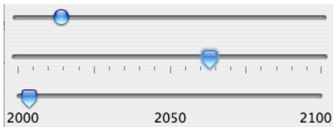

Here, the second slider is decorated with ticks, and the third one is decorated with labels. It’s possible for a single slider to have both types of decorations.

The most commonly used constructor for JSliders specifies the start and end of the range of values for the slider and its initial value when it first appears on the screen:

public JSlider(int minimum, int maximum, int value)

```javascript
slider2.setPaintTicks(true);
```

If the parameters are omitted, the values 0, 100, and 50 are used. By default, a slider is horizontal, but you can make it vertical by calling its method setOrientation(JSlider.VERTICAL). The current value of a JSlider can be read at any time with its getValue() method, which returns a value of type int. If you want to change the value, you can do so with the method setValue(n), which takes a parameter of type int.

If you want to respond immediately when the user changes the value of a slider, you can register a listener with the slider. JSliders, unlike other components we have seen, do not generate ActionEvents. Instead, they generate events of type ChangeEvent. ChangeEvent and related classes are defined in the package javax.swing.event rather than java.awt.event, so if you want to use ChangeEvents, you should import javax.swing.event.\* at the beginning of your program. You must also define some object to implement the ChangeListener interface, and you must register the change listener with the slider by calling its addChangeListener() method. A ChangeListener must provide a definition for the method:

## public void stateChanged(ChangeEvent evt)

This method will be called whenever the value of the slider changes. (Note that it will also be called when you change the value with the setValue() method, as well as when the user changes the value.) In the stateChanged() method, you can call evt.getSource() to find out which object generated the event.

Using tick marks on a slider is a two-step process: Specify the interval between the tick marks, and tell the slider that the tick marks should be displayed. There are actually two types of tick marks, “major” tick marks and “minor” tick marks. You can have one or the other or both. Major tick marks are a bit longer than minor tick marks. The method setMinorTickSpacing(i) indicates that there should be a minor tick mark every i units along the slider. The parameter is an integer. (The spacing is in terms of values on the slider, not pixels.) For the major tick marks, there is a similar command, setMajorTickSpacing(i). Calling these methods is not enough to make the tick marks appear. You also have to call setPaintTicks(true). For example, the second slider in the above picture was created and configured using the commands:

slider2 = new JSlider(); // (Uses default min, max, and value.)

slider2.addChangeListener(this);

slider2.setMajorTickSpacing(25);

slider2.setMinorTickSpacing(5);

Labels on a slider are handled similarly. You have to specify the labels and tell the slider to paint them. Specifying labels is a tricky business, but the JSlider class has a method to simplify it. You can create a set of labels and add them to a slider named sldr with the command:

sldr.setLabelTable( sldr.createStandardLabels(i) );

where i is an integer giving the spacing between the labels. To arrange for the labels to be displayed, call setPaintLabels(true). For example, the third slider in the above picture was created and configured with the commands:

```javascript
slider3 = new JSlider(2000,2100,2006);
slider3.addChangeListener(this);
slider3.setLabelTable( slider3.createStandardLabels(50) );
slider3.setPaintLabels(true);
```

## 6.7 Basic Layout

Components are the fundamental building blocks of a graphical user interface. But you have to do more with components besides create them. Another aspect of GUI programming is laying out components on the screen, that is, deciding where they are drawn and how big they are. You have probably noticed that computing coordinates can be a dificult problem, especially if you don’t assume a fixed size for the drawing area. Java has a solution for this, as well.

Components are the visible objects that make up a GUI. Some components are containers, which can hold other components. Containers in Java are objects that belong to some subclass of java.awt.Container. The content pane of a JApplet or JFrame is an example of a container. The standard class JPanel, which we have mostly used as a drawing surface up till now, is another example of a container.

Because a JPanel object is a container, it can hold other components. Because a JPanel is itself a component, you can add a JPanel to another JPanel. This makes complex nesting of components possible. JPanels can be used to organize complicated user interfaces, as shown in this illustration:

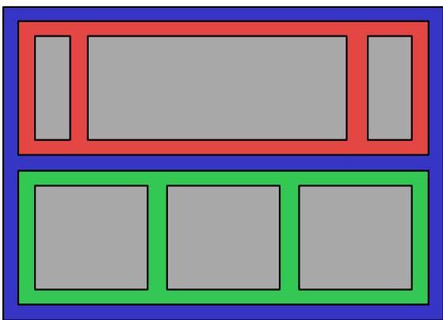  
Three panels, shown in color, containing six other components, shown in gray.

The components in a container must be “laid out,” which means setting their sizes and positions. It’s possible to program the layout yourself, but ordinarily layout is done by a layout manager. A layout manager is an object associated with a container that implements some policy for laying out the components in that container. Diferent types of layout manager implement diferent policies. In this section, we will cover the three most common types of layout manager, and then we will look at several programming examples that use components and layout.

Every container has an instance method, setLayout(), that takes a parameter of type LayoutManager and that is used to specify the layout manager that will be responsible for laying out any components that are added to the container. Components are added to a container by calling an instance method named add() in the container object. There are actually several versions of the add() method, with diferent parameter lists. Diferent versions of add() are appropriate for diferent layout managers, as we will see below.

## 6.7.1 Basic Layout Managers

Java has a variety of standard layout managers that can be used as parameters in the setLayout() method. They are defined by classes in the package java.awt. Here, we will look at just three of these layout manager classes: FlowLayout, BorderLayout, and GridLayout.

A FlowLayout simply lines up components in a row across the container. The size of each component is equal to that component’s “preferred size.” After laying out as many items as will fit in a row across the container, the layout manager will move on to the next row. The default layout for a JPanel is a FlowLayout; that is, a JPanel uses a FlowLayout unless you specify a diferent layout manager by calling the panel’s setLayout() method.

The components in a given row can be either left-aligned, right-aligned, or centered within that row, and there can be horizontal and vertical gaps between components. If the default constructor, “new FlowLayout()”, is used, then the components on each row will be centered and both the horizontal and the vertical gaps will be five pixels. The constructor

public FlowLayout(int align, int hgap, int vgap)

can be used to specify alternative alignment and gaps. The possible values of align are FlowLayout.LEFT, FlowLayout.RIGHT, and FlowLayout.CENTER.

Suppose that cntr is a container object that is using a FlowLayout as its layout manager. Then, a component, comp, can be added to the container with the statement

cntr.add(comp);

The FlowLayout will line up all the components that have been added to the container in this way. They will be lined up in the order in which they were added. For example, this picture shows five buttons in a panel that uses a FlowLayout:

Button Number 1Button Number 2Button Number 3


Button Number 4 Button Number 5

Note that since the five buttons will not fit in a single row across the panel, they are arranged in two rows. In each row, the buttons are grouped together and are centered in the row. The buttons were added to the panel using the statements:

panel.add(button1);

panel.add(button2);

panel.add(button3);

panel.add(button4);

panel.add(button5);

When a container uses a layout manager, the layout manager is ordinarily responsible for computing the preferred size of the container (although a diferent preferred size could be set by calling the container’s setPreferredSize method). A FlowLayout prefers to put its components in a single row, so the preferred width is the total of the preferred widths of all the components, plus the horizontal gaps between the components. The preferred height is the maximum preferred height of all the components.

A BorderLayout layout manager is designed to display one large, central component, with up to four smaller components arranged along the edges of the central component. If a container, cntr, is using a BorderLayout, then a component, comp, should be added to the container using a statement of the form

cntr.add( comp, borderLayoutPosition );

where borderLayoutPosition specifies what position the component should occupy in the layout and is given as one of the constants BorderLayout.CENTER, BorderLayout.NORTH, BorderLayout.SOUTH, BorderLayout.EAST, or BorderLayout.WEST. The meaning of the five positions is shown in this diagram:


Note that a border layout can contain fewer than five compompontnts, so that not all five of the possible positions need to be filled.

A BorderLayout selects the sizes of its components as follows: The NORTH and SOUTH components (if present) are shown at their preferred heights, but their width is set equal to the full width of the container. The EAST and WEST components are shown at their preferred widths, but their height is set to the height of the container, minus the space occupied by the NORTH and SOUTH components. Finally, the CENTER component takes up any remaining space; the preferred size of the CENTER component is completely ignored. You should make sure that the components that you put into a BorderLayout are suitable for the positions that they will occupy. A horizontal slider or text field, for example, would work well in the NORTH or SOUTH position, but wouldn’t make much sense in the EAST or WEST position.

The default constructor, new BorderLayout(), leaves no space between components. If you would like to leave some space, you can specify horizontal and vertical gaps in the constructor of the BorderLayout object. For example, if you say

panel.setLayout(new BorderLayout(5,7));

then the layout manager will insert horizontal gaps of 5 pixels between components and vertical gaps of 7 pixels between components. The background color of the container will show through in these gaps. The default layout for the original content pane that comes with a JFrame or JApplet is a BorderLayout with no horizontal or vertical gap.

$$
\* \ * \ *
$$

Finally, we consider the GridLayout layout manager. A grid layout lays out components in a grid of equal sized rectangles. This illustration shows how the components would be arranged in a grid layout with 3 rows and 2 columns:
