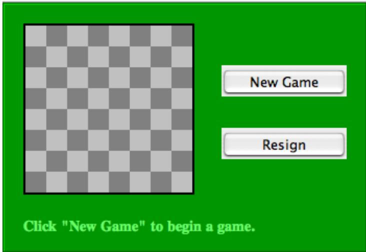
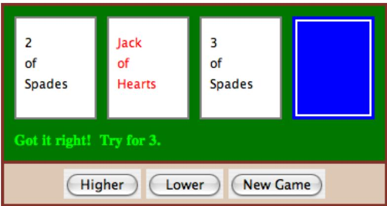
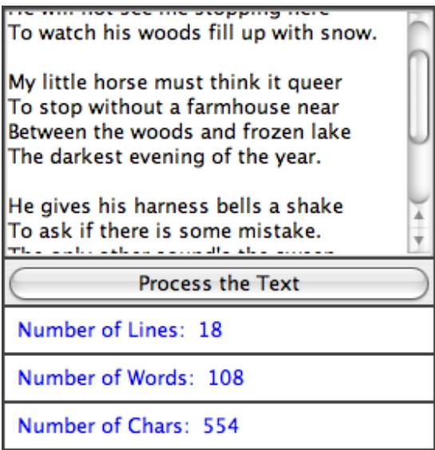
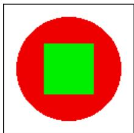
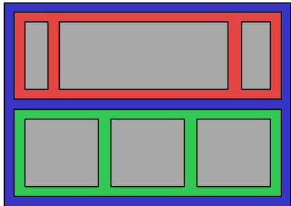
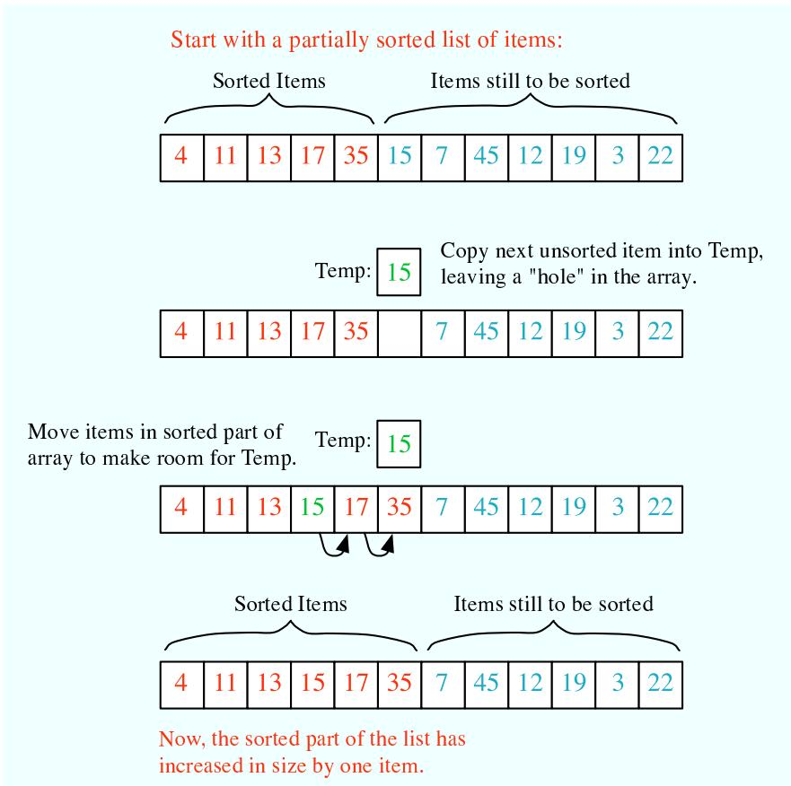
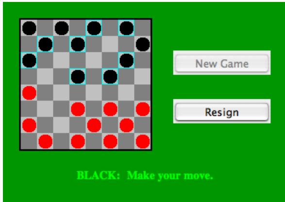
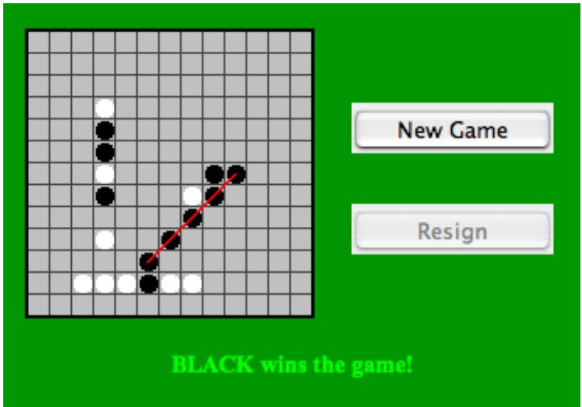

<table><tr><td>#1</td><td>#2</td></tr><tr><td>#3</td><td>#4</td></tr><tr><td>#5</td><td>#6</td></tr></table>

If a container uses a GridLayout, the appropriate add method for the container takes a single parameter of type Component (for example: cntr.add(comp)). Components are added to the grid in the order shown; that is, each row is filled from left to right before going on the next row.

The constructor for a GridLayout takes the form “new GridLayout(R,C)”, where R is the number of rows and C is the number of columns. If you want to leave horizontal gaps of H pixels between columns and vertical gaps of V pixels between rows, use “new GridLayout(R,C,H,V)” instead.

When you use a GridLayout, it’s probably good form to add just enough components to fill the grid. However, this is not required. In fact, as long as you specify a non-zero value for the number of rows, then the number of columns is essentially ignored. The system will use just as many columns as are necessary to hold all the components that you add to the container. If you want to depend on this behavior, you should probably specify zero as the number of columns. You can also specify the number of rows as zero. In that case, you must give a non-zero number of columns. The system will use the specified number of columns, with just as many rows as necessary to hold the components that are added to the container.

Horizontal grids, with a single row, and vertical grids, with a single column, are very common. For example, suppose that button1, button2, and button3 are buttons and that you’d like to display them in a horizontal row in a panel. If you use a horizontal grid for the panel, then the buttons will completely fill that panel and will all be the same size. The panel can be created as follows:

```javascript
JPanel buttonBar = new JPanel();
buttonBar.setLayout( new GridLayout(1,3) );
    // (Note:  The "3" here is pretty much ignored, and
    //  you could also say "new GridLayout(1,0)".
    //  To leave gaps between the buttons, you could use
    //  "new GridLayout(1,0,5,5)".)
buttonBar.add(button1);
buttonBar.add(button2);
buttonBar.add(button3);
```

You might find this button bar to be more attractive than the one that uses the default FlowLayout layout manager.

## 6.7.2 Borders

We have seen how to leave gaps between the components in a container, but what if you would like to leave a border around the outside of the container? This problem is not handled by layout managers. Instead, borders in Swing are represented by objects. A Border object can be added to any JComponent, not just to containers. Borders can be more than just empty space. The class javax.swing.BorderFactory contains a large number of static methods for creating border objects. For example, the function

## BorderFactory.createLineBorder(Color.BLACK)

returns an object that represents a one-pixel wide black line around the outside of a component. If comp is a JComponent, a border can be added to comp using its setBorder() method. For example:

comp.setBorder( BorderFactory.createLineBorder(Color.BLACK) );

When a border has been set for a JComponent, the border is drawn automatically, without any further efort on the part of the programmer. The border is drawn along the edges of the component, just inside its boundary. The layout manager of a JPanel or other container will take the space occupied by the border into account. The components that are added to the container will be displayed in the area inside the border. I don’t recommend using a border on a JPanel that is being used as a drawing surface. However, if you do this, you should take the border into account. If you draw in the area occupied by the border, that part of your drawing will be covered by the border.

Here are some of the static methods that can be used to create borders:

• BorderFactory.createEmptyBorder(top,left,bottom,right) — leaves an empty border around the edges of a component. Nothing is drawn in this space, so the background color of the component will appear in the area occupied by the border. The parameters are integers that give the width of the border along the top, left, bottom, and right edges of the component. This is actually very useful when used on a JPanel that contains other components. It puts some space between the components and the edge of the panel. It can also be useful on a JLabel, which otherwise would not have any space between the text and the edge of the label.

• BorderFactory.createLineBorder(color,thickness) — draws a line around all four edges of a component. The first parameter is of type Color and specifies the color of the line. The second parameter is an integer that specifies the thickness of the border. If the second parameter is omitted, a line of thickness 1 is drawn.

• BorderFactory.createMatteBorder(top,left,bottom,right,color) — is similar to createLineBorder, except that you can specify individual thicknesses for the top, left, bottom, and right edges of the component.

• BorderFactory.createEtchedBorder() — creates a border that looks like a groove etched around the boundary of the component. The efect is achieved using lighter and darker shades of the component’s background color, and it does not work well with every background color.

• BorderFactory.createLoweredBevelBorder()—gives a component a three-dimensional efect that makes it look like it is lowered into the computer screen. As with an Etched-Border, this only works well for certain background colors.

• BorderFactory.createRaisedBevelBorder()—similar to a LoweredBevelBorder, but the component looks like it is raised above the computer screen.

• BorderFactory.createTitledBorder(title)—creates a border with a title. The title is a String, which is displayed in the upper left corner of the border.

There are many other methods in the BorderFactory class, most of them providing variations of the basic border styles given here. The following illustration shows six components with six diferent border styles. The text in each component is the command that created the border for that component:

  
(The source code for the applet that produced this picture can be found in BorderDemo.java.)

## 6.7.3 SliderAndComboBoxDemo

Now that we have looked at components and layouts, it’s time to put them together into some complete programs. We start with a simple demo that uses a JLabel, a JComboBox, and a couple of JSliders, all laid out in a GridLayout, as shown in this picture:


The sliders in this applet control the foreground and background color of the label, and the combo box controls its font style. Writing this program is a matter of creating the components, laying them out, and programming listeners to respond to events from the sliders and combo box. In my program, I define a subclass of JPanel which will be used for the applet’s content pane. This class implements ChangeListener and ActionListener, so the panel itself can act as the listener for change events from the sliders and action events from the combo box. In the constructor, the four components are created and configured, a GridLayout is installed as the layout manager for the panel, and the components are added to the panel:

/\* Create the sliders, and set up this panel to listen for

ChangeEvents that are generated by the sliders. \*/

$$
\text {bgColorSlider} = \text {new JSlider(0,255,100)};
$$

bgColorSlider.addChangeListener(this);

```javascript
/* Create the combo box, and add four items to it, listing
    different font styles.  Set up the panel to listen for
    ActionEvents from the combo box. */

fontStyleSelect = new JComboBox();
fontStyleSelect.addItem("Plain Font");
fontStyleSelect.addItem("Italic Font");
fontStyleSelect.addItem("Bold Font");
fontStyleSelect.addItem("Bold Italic Font");
fontStyleSelect.setSelectedIndex(2);
fontStyleSelect.addActionListener(this);

/* Create the display label, with properties to match the
    values of the sliders and the setting of the combo box. */
displayLabel = new JLabel("Hello World!", JLabel.CENTER);
displayLabel.setOpaque(true);
displayLabel.setBackground(new Color(100,100,100));
displayLabel.setForeground(new Color(255, 200, 200));
displayLabel.setFont(new Font("Serif", Font.BOLD, 30));

/* Set the layout for the panel, and add the four components.
    Use a GridLayout with 4 rows and 1 column. */

setLayout(new GridLayout(4,1));
add(displayLabel);
add(bgColorSlider);
add(fgColorSlider);
add(fontStyleSelect);
```

The class also defines the methods required by the ActionListener and ChangeListener interfaces. The actionPerformed() method is called when the user selects an item in the combo box. This method changes the font in the JLable, where the font depends on which item is currently selected in the combo box, fontStyleSelect:

```java
public void actionPerformed(ActionEvent evt) {
    switch ( fontStyleSelect.getSelectedIndex() ) {
        case 0:
            displayLabel.setFont( new Font("Serif", Font.PLAIN, 30) );
            break;
        case 1:
            displayLabel.setFont( new Font("Serif", Font.ITALIC, 30) );
            break;
        case 2:
            displayLabel.setFont( new Font("Serif", Font.BOLD, 30) );
            break;
        case 3:
            displayLabel.setFont( new Font("Serif", Font.BOLD + Font.ITALIC, 30) );
            break;
    }
}
```

And the stateChanged() method, which is called when the user manipulates one of the sliders, uses the value on the slider to compute a new foreground or background color for the label. The method checks evt.getSource() to determine which slider was changed:

```txt
public void stateChanged(ChangeEvent evt) {
    if (evt.getSource() == bgColor) {
        int bgVal = bgColor.getValue();
        displayLabel.setBackground(new Color(bgVal,bgVal,bgVal));
            // NOTE: The background color is a shade of gray,
            // determined by the setting on the slider.
    }
    else {
        int fgVal = fgetsValue();
        displayLabel.setForeground(new Color( 255, fgVal, fgVal));
            // Note: The foreground color ranges from pure red to pure
            // white as the slider value increases from 0 to 255.
    }
}
```

(The complete source code is in the file SliderAndComboBoxDemo.java.)

## 6.7.4 A Simple Calculator

As our next example, we look briefly at an example that uses nested subpanels to build a more complex user interface. The program has two JTextFields where the user can enter two numbers, four JButtons that the user can click to add, subtract, multiply, or divide the two numbers, and a JLabel that displays the result of the operation:


Like the previous example, this example uses a main panel with a GridLayout that has four rows and one column. In this case, the layout is created with the statement:

```javascript
setLayout(new GridLayout(4,1,3,3));
```

which allows a 3-pixel gap between the rows where the gray background color of the panel is visible. The gray border around the edges of the panel is added with the statement

setBorder( BorderFactory.createEmptyBorder(5,5,5,5) );

The first row of the grid layout actually contains two components, a JLabel displaying the text “x =” and a JTextField. A grid layout can only only have one component in each position. In this case, that component is a JPanel, a subpanel that is nested inside the main panel. This subpanel in turn contains the label and text field. This can be programmed as follows:

```txt
xInput = new JTextField("0", 10); // Create a text field sized to hold 10 chars.
JPanel xPanel = new JPanel();      // Create the subpanel.
xPanel.add( new JLabel(" x = ")); // Add a label to the subpanel.
xPanel.add(xInput);                  // Add the text field to the subpanel
mainPanel.add(xPanel);              // Add the subpanel to the main panel.
```

The subpanel uses the default FlowLayout layout manager, so the label and text field are simply placed next to each other in the subpanel at their preferred size, and are centered in the subpanel.

Similarly, the third row of the grid layout is a subpanel that contains four buttons. In this case, the subpanel uses a GridLayout with one row and four columns, so that the buttons are all the same size and completely fill the subpanel.

One other point of interest in this example is the actionPerformed() method that responds when the user clicks one of the buttons. This method must retrieve the user’s numbers from the text field, perform the appropriate arithmetic operation on them (depending on which button was clicked), and set the text of the label to represent the result. However, the contents of the text fields can only be retrieved as strings, and these strings must be converted into numbers. If the conversion fails, the label is set to display an error message:

```java
blic void actionPerformed(ActionEvent evt) {
    double x, y;  // The numbers from the input boxes.
    try {
        String xStr = xInput.getText();
        x = Double.parseDouble(xStr);
    }
    catch (NumberFormatException e) {
        // The string xStr is not a legal number.
        answer.setText("Illegal data for x.");
        xInput.requestFocus();
        return;
    }

    try {
        String yStr = yInput.getText();
        y = Double.parseDouble(yStr);
    }
    catch (NumberFormatException e) {
        // The string yStr is not a legal number.
        answer.setText("Illegal data for y.");
        yInput.requestFocus();
        return;
    }

    /* Perfrom the operation based on the action command from the button.  The action command is the text displayed on the button
    Note that division by zero produces an error message. */
    String op = evt.getActionCommand();
    if (op.equals("+"))
        answer.setText( "x + y = " + (x+y) );
    else if (op.equals("-"))
        answer.setText( "x - y = " + (x-y) );
    else if (op.equals("*"))
        answer.setText( "x * y = " + (x*y) );
    else if (op.equals("/")) {
        if (y == 0)
            answer.setText("Can't divide by zero!");
        else
            answer.setText( "x / y = " + (x/y) );
```

## } // end actionPerformed()

(The complete source code for this example can be found in SimpleCalc.java.)

## 6.7.5 Using a null Layout

As mentioned above, it is possible to do without a layout manager altogether. For out next example, we’ll look at a panel that does not use a layout manager. If you set the layout manager of a container to be null, by calling container.setLayout(null), then you assume complete responsibility for positioning and sizing the components in that container.

If comp is any component, then the statement

comp.setBounds(x, y, width, height);

puts the top left corner of the component at the point (x,y), measured in the coordinate system of the container that contains the component, and it sets the width and height of the component to the specified values. You should only set the bounds of a component if the container that contains it has a null layout manager. In a container that has a non-null layout manager, the layout manager is responsible for setting the bounds, and you should not interfere with its job.

Assuming that you have set the layout manager to null, you can call the setBounds() method any time you like. (You can even make a component that moves or changes size while the user is watching.) If you are writing a panel that has a known, fixed size, then you can set the bounds of each component in the panel’s constructor. Note that you must also add the components to the panel, using the panel’s add(component) instance method; otherwise, the component will not appear on the screen.

Our example contains four components: two buttons, a label, and a panel that displays a checkerboard pattern:



This is just an example of using a null layout; it doesn’t do anything, except that clicking the buttons changes the text of the label. (We will use this example in Section 7.5 as a starting point for a checkers game.)

For its content pane, this example uses a main panel that is defined by a class named NullLayoutPanel. The four components are created and added to the panel in the constructor of the NullLayoutPanel class. Then the setBounds() method of each component is called to set the size and position of the component:

```txt
blic NullLayoutPanel() {
    setLayout(null);  // I will do the layout myself!
    setBackground(new Color(0,150,0));  // A dark green background.
    setBorder( BorderFactory.createEtchedBorder() );
    setPreferredSize( new Dimension(350,240) );
        // I assume that the size of the panel is, in fact, 350-by-240
    /* Create the components and add them to the content pane.  If you don't add them to the a container, they won't appear, even if you set their bounds! */
    board = new Checkerboard();
        // (Checkerborad is a subclass of JPanel, defined elsewhere.) add(board);
    newGameButton = new JButton("New Game");
    newGameButton.addActionListener(this);
    add(newGameButton);
    resignButton = new JButton("Resign");
    resignButton.addActionListener(this);
    add(resignButton);
    message = new JLabel("Click \"New Game\" to begin a game.");
    message.setForeground( new Color(100,255,100) ); // Light green. message.setFont(new Font("Serif", Font.BOLD, 14));
    add(message);
    /* Set the position and size of each component by calling its setBounds() method. */
    board.setBounds(20,20,164,164);
    newGameButton.setBounds(210, 60, 120, 30);
    resignButton.setBounds(210, 120, 120, 30);
    message.setBounds(20, 200, 330, 30);
```

## } // end constructor

It’s reasonably easy, in this case, to get an attractive layout. It’s much more dificult to do your own layout if you want to allow for changes of size. In that case, you have to respond to changes in the container’s size by recomputing the sizes and positions of all the components that it contains. If you want to respond to changes in a container’s size, you can register an appropriate listener with the container. Any component generates an event of type ComponentEvent when its size changes (and also when it is moved, hidden, or shown). You can register a ComponentListener with the container and respond to size change events by recomputing the sizes and positions of all the components in the container. Consult a Java reference for more information about ComponentEvents. However, my real advice is that if you want to allow for changes in the container’s size, try to find a layout manager to do the work for you.

(The complete source code for this example is in NullLayoutDemo.java.)

## 6.7.6 A Little Card Game

For a final example, let’s look at something a little more interesting as a program. The example is a simple card game in which you look at a playing card and try to predict whether the next card will be higher or lower in value. (Aces have the lowest value in this game.) You’ve seen a text-oriented version of the same game in Subsection 5.4.3. Section 5.4 also introduced Deck, Hand, and Card classes that are used in the game program. In this GUI version of the game, you click on a button to make your prediction. If you predict wrong, you lose. If you make three correct predictions, you win. After completing one game, you can click the “New Game” button to start a new game. Here is what the game looks like:



The complete source code for this example is in the file HighLowGUI.java. You can try out the game in the on-line version of this section, or by running the program as a stand-alone application.

The overall structure of the main panel in this example should be clear: It has three buttons in a subpanel at the bottom of the main panel and a large drawing surface that displays the cards and a message. The main panel uses a BorderLayout. The drawing surface occupies the CENTER position of the border layout. The subpanel that contains the buttons occupies the SOUTH position of the border layout, and the other three positions of the layout are empty.

The drawing surface is defined by a nested class named CardPanel, which is a subclass of JPanel. I have chosen to let the drawing surface object do most of the work of the game: It listens for events from the three buttons and responds by taking the appropriate actions. The main panel is defined by HighLowGUI itself, which is another subclass of JPanel. The constructor of the HighLowGUI class creates all the other components, sets up event handling, and lays out the components:

```javascript
blic HighLowGUI() {   // The constructor.
    setBackground( new Color(130,50,40) );
    setLayout( new BorderLayout(3,3) );  // BorderLayout with 3-pixel gaps.
    CardPanel board = new CardPanel();  // Where the cards are drawn.
    add(board, BorderLayout.CENTER);
    JPanel buttonPanel = new JPanel();  // The subpanel that holds the buttons.
    buttonPanel.setBackground( new Color(220,200,180) );
    add(buttonPanel, BorderLayout.SOUTH);
    JButton higher = new JButton( "Higher" );
```

```javascript
higher.addActionListener(board);  // The CardPanel listens for events.
buttonPanel.add(higher);

JButton lower = new JButton( "Lower" );
lower.addActionListener(board);
buttonPanel.add(lower);

JButton newGame = new JButton( "New Game" );
newGame.addActionListener(board);
buttonPanel.add(newGame);

setBorder(BorderFactory.createLineBorder( new Color(130,50,40), 3) );
// end constructor
```

The programming of the drawing surface class, CardPanel, is a nice example of thinking in terms of a state machine. (See Subsection 6.5.4.) It is important to think in terms of the states that the game can be in, how the state can change, and how the response to events can depend on the state. The approach that produced the original, text-oriented game in Subsection 5.4.3 is not appropriate here. Trying to think about the game in terms of a process that goes step-by-step from beginning to end is more likely to confuse you than to help you.

The state of the game includes the cards and the message. The cards are stored in an object of type Hand. The message is a String. These values are stored in instance variables. There is also another, less obvious aspect of the state: Sometimes a game is in progress, and the user is supposed to make a prediction about the next card. Sometimes we are between games, and the user is supposed to click the “New Game” button. It’s a good idea to keep track of this basic diference in state. The CardPanel class uses a boolean instance variable named gameInProgress for this purpose.

The state of the game can change whenever the user clicks on a button. The CardPanel class implements the ActionListener interface and defines an actionPerformed() method to respond to the user’s clicks. This method simply calls one of three other methods, doHigher(), doLower(), or newGame(), depending on which button was pressed. It’s in these three eventhandling methods that the action of the game takes place.

We don’t want to let the user start a new game if a game is currently in progress. That would be cheating. So, the response in the newGame() method is diferent depending on whether the state variable gameInProgress is true or false. If a game is in progress, the message instance variable should be set to show an error message. If a game is not in progress, then all the state variables should be set to appropriate values for the beginning of a new game. In any case, the board must be repainted so that the user can see that the state has changed. The complete newGame() method is as follows:

```txt
/**
 * Called by the CardPanel constructor, and called by actionPerformed() if
 * the user clicks the "New Game" button.  Start a new game.
 */
void doNewGame() {
    if (gameInProgress) {
        // If the current game is not over, it is an error to try
        // to start a new game.
        message = "You still have to finish this game!";
        repaint();
        return;
    }
```

```javascript
deck = new Deck();  // Create the deck and hand to use for this game.
hand = new Hand();
deck.shuffle();
hand.addCard( deck.dealCard() );  // Deal the first card into the hand.
message = "Is the next card higher or lower?";
gameInProgress = true;
repaint();
// end doNewGame()
```

The doHigher() and doLower() methods are almost identical to each other (and could probably have been combined into one method with a parameter, if I were more clever). Let’s look at the doHigher() routine. This is called when the user clicks the “Higher” button. This only makes sense if a game is in progress, so the first thing doHigher() should do is check the value of the state variable gameInProgress. If the value is false, then doHigher() should just set up an error message. If a game is in progress, a new card should be added to the hand and the user’s prediction should be tested. The user might win or lose at this time. If so, the value of the state variable gameInProgress must be set to false because the game is over. In any case, the board is repainted to show the new state. Here is the doHigher() method:

```javascript
/**
 * Called by actionPerformed() when user clicks "Higher" button.
 * Check the user's prediction.  Game ends if user guessed
 * wrong or if the user has made three correct predictions.
 */
void doHigher() {
    if (gameInProgress == false) {
        // If the game has ended, it was an error to click "Higher",
        // So set up an error message and abort processing.
        message = "Click \"New Game\" to start a new game!";
        repaint();
        return;
    }
    hand.addCard( deck.dealCard() );      // Deal a card to the hand.
    int cardCt = hand.getCardCount();
    Card thisCard = hand.getCard( cardCt - 1 );  // Card just dealt.
    Card prevCard = hand.getCard( cardCt - 2 );  // The previous card.
    if ( thisCard.getValue() < prevCard.getValue() ) {
        gameInProgress = false;
        message = "Too bad! You lose.";
    }
    else if ( thisCard.getValue() == prevCard.getValue() ) {
        gameInProgress = false;
        message = "Too bad!  You lose on ties.";
    }
    else if ( cardCt == 4) {
        gameInProgress = false;
        message = "You win!  You made three correct guesses.";
    }
    else {
        message = "Got it right!  Try for " + cardCt + ".";
    }
    repaint();
} // end doHigher()
```

The paintComponent() method of the CardPanel class uses the values in the state variables to decide what to show. It displays the string stored in the message variable. It draws each of the cards in the hand. There is one little tricky bit: If a game is in progress, it draws an extra face-down card, which is not in the hand, to represent the next card in the deck. Drawing the cards requires some care and computation. I wrote a method, “void drawCard(Graphics g, Card card, int x, int y)”, which draws a card with its upper left corner at the point (x,y). The paintComponent() routine decides where to draw each card and calls this routine to do the drawing. You can check out all the details in the source code, HighLowGUI.java.

$$
* * *
$$

One further note on the programming of this example: The source code defines HighLowGUI as a subclass of JPanel. The class contains a main() routine so that it can be run as a stand-alone application; the main() routine simply opens a window that uses a panel of type HighLowGUI as its content pane. In addition, I decided to write an applet version of the program as a static nested class named Applet inside the HighLowGUI class. Since this is a nested class, its full name is HighLowGUI.Applet and the class file that is produced when the source code is compiled is named HighLowGUI\$Applet.class. This class is used for the applet version of the program in the on-line version of the book. The <applet> tag lists the class file for the applet as code="HighLowGUI\$Applet.class". This is admittedly an unusual way to organize the program, and it is probably more natural to have the panel, applet, and stand-alone program defined in separate classes. However, writing the program in this way does show the flexibility of Java classes. (Nested classes were discussed in Subsection 5.7.2.)

## 6.8 Menus and Dialogs

We have already encountered many of the basic aspects of GUI programming, but professional programs use many additional features. We will cover some of the advanced features of Java GUI programming in Chapter 12, but in this section we look briefly at a few more basic features that are essential for writing GUI programs. I will discuss these features in the context of a “MosaicDraw” program that is shown in this picture:


As the user clicks-and-drags the mouse in the large drawing area of this program, it leaves a trail of little colored squares. There is some random variation in the color of the squares. (This is meant to make the picture look a little more like a real mosaic, which is a picture made out of small colored stones in which there would be some natural color variation.) There is a menu bar above the drawing area. The “Control” menu contains commands for filling and clearing the drawing area, along with a few options that afect the appearance of the picture. The “Color” menu lets the user select the color that will be used when the user draws. The “Tools” menu afects the behavior of the mouse. Using the default “Draw” tool, the mouse leaves a trail of single squares. Using the “Draw 3x3” tool, the mouse leaves a swath of colored squares that is three squares wide. There are also “Erase” tools, which let the user set squares back to their default black color.

The drawing area of the program is a panel that belongs to the MosaicPanel class, a subclass of JPanel that is defined in MosaicPanel.java. MosaicPanel is a highly reusable class for representing mosaics of colored rectangles. It does not directly support drawing on the mosaic, but it does support setting the color of each individual square. The MosaicDraw program installs a mouse listener on the panel; the mouse listener responds to mousePressed and mouseDragged events on the panel by setting the color of the square that contains the mouse. This is a nice example of applying a listener to an object to do something that was not programmed into the object itself.

Most of the programming for MosaicDraw can be found in MosaicDrawController.java. (It could have gone into the MosaicPanel class, if I had not decided to use that pre-existing class in unmodified form.) It is the MosaicDrawController class that creates a MosaicPanel object and adds a mouse listener to it. It also creates the menu bar that is shown at the top of the program and implements all the commands in the menu bar. It has an instance method getMosaicPanel() that returns a reference to the mosaic panel that it has created, and it has another instance method getMenuBar() that returns a menu bar for the program. These methods are used to obtain the panel and menu bar so that they can be added to an applet or a frame.

To get a working program, an object of type JApplet or JFrame is needed. The files MosaicDrawApplet.java and MosaicDrawFrame.java define the applet and frame versions of the program. These are rather simple classes; they simply create a MosaicDrawController object and use its mosaic panel and menu bar. I urge you to study these files, along with MosaicDraw-Controller.java. I will not be discussing all aspects of the code here, but you should be able to understand it all after reading this section. As for MosaicPanel.java, it uses some techniques that you would not understand at this point, but I encourage you to at least read the comments in this file to learn about the API for mosaic panels.

## 6.8.1 Menus and Menubars

MosaicDraw is the first example that we have seen that uses a menu bar. Fortunately, menus are very easy to use in Java. The items in a menu are represented by the class JMenuItem (this class and other menu-related classes are in package javax.swing). Menu items are used in almost exactly the same way as buttons. In fact, JMenuItem and JButton are both subclasses of a class, AbstractButton, that defines their common behavior. In particular, a JMenuItem is created using a constructor that specifies the text of the menu item, such as:

$$
\text {JMenuItem fillCommand} = \text {new JMenuItem("Fill");}
$$

You can add an ActionListener to a JMenuItem by calling the menu item’s addActionListener()

method. The actionPerformed() method of the action listener is called when the user selects the item from the menu. You can change the text of the item by calling its setText(String) method, and you can enable it and disable it using the setEnabled(boolean) method. All this works in exactly the same way as for a JButton.

The main diference between a menu item and a button, of course, is that a menu item is meant to appear in a menu rather than in a panel. A menu in Java is represented by the class JMenu. A JMenu has a name, which is specified in the constructor, and it has an add(JMenuItem) method that can be used to add a JMenuItem to the menu. So, the “Tools” menu in the MosaicDraw program could be created as follows, where listener is a variable of type ActionListener:

```txt
JMenu toolsMenu = new JMenu("Tools");  // Create a menu with name "Tools"
JMenuItem drawCommand = new JMenuItem("Draw");    // Create a menu item.
drawCommand.addActionListener(listener);          // Add listener to menu item.
toolsMenu.add(drawCommand);                    // Add menu item to menu.
JMenuItem eraseCommand = new JMenuItem("Erase"); // Create a menu item.
eraseCommand.addActionListener(listener);      // Add listener to menu item.
toolsMenu.add(eraseCommand);                   // Add menu item to menu.
.
.  // Create and add other menu items.
.
```

Once a menu has been created, it must be added to a menu bar. A menu bar is represented by the class JMenuBar. A menu bar is just a container for menus. It does not have a name, and its constructor does not have any parameters. It has an add(JMenu) method that can be used to add menus to the menu bar. For example, the MosaicDraw program uses three menus, controlMenu, colorMenu, and toolsMenu. We could create a menu bar and add the menus to it with the statements:

```javascript
JMenuBar menuBar = new JMenuBar();
menuBar.add(controlMenu);
menuBar.add(colorMenu);
menuBar.add(toolsMenu);
```

The final step in using menus is to use the menu bar in a JApplet or JFrame. We have already seen that an applet or frame has a “content pane.” The menu bar is another component of the applet or frame, not contained inside the content pane. Both the JApplet and the JFrame classes include an instance method setMenuBar(JMenuBar) that can be used to set the menu bar. (There can only be one, so this is a “set” method rather than an “add” method.) In the MosaicDraw program, the menu bar is created by a MosaicDrawController object and can be obtained by calling that object’s getMenuBar() method. Here is the basic code that is used (in somewhat modified form) to set up the interface both in the applet and in the frame version of the program:

MosaicDrawController controller = new MosaicDrawController();

MoasicPanel content = controller.getMosaicPanel();

Using menus always follows the same general pattern: Create a menu bar. Create menus and add them to the menu bar. Create menu items and add them to the menus (and set up listening to handle action events from the menu items). Use the menu bar in a JApplet or JFrame by calling the setJMenuBar() method of the applet or frame.

## ∗ ∗ ∗

There are other kinds of menu items, defined by subclasses of JMenuItem, that can be added to menus. One of these is JCheckBoxMenuItem, which represents menu items that can be in one of two states, selected or not selected. A JCheckBoxMenuItem has the same functionality and is used in the same way as a JCheckBox (see Subsection 6.6.3). Three JCheckBoxMenuItems are used in the “Control” menu of the MosaicDraw program. One can be used to turn the random color variation of the squares on and of. Another turns a symmetry feature on and of; when symmetry is turned on, the user’s drawing is reflected horizontally and vertically to produce a symmetric pattern. And the third check box menu item shows and hides the “grouting” in the mosaic; the grouting is the gray lines that are drawn around each of the little squares in the mosaic. The menu item that corresponds to the “Use Randomness” option in the “Control” menu could be set up with the statements:

JMenuItem useRandomnessToggle = new JCheckBoxMenuItem("Use Randomness");

useRandomnessToggle.addActionListener(listener); // Set up a listener.

useRandomnessToggle.setSelected(true); // Randomness is initially turned on.

controlMenu.add(useRandomnessToggle); // Add the menu item to the menu.

The “Use Randomness” JCheckBoxMenuItem corresponds to a boolean-valued instance variable named useRandomness in the MosaicDrawController class. This variable is part of the state of the controller object. Its value is tested whenever the user draws one of the squares, to decide whether or not to add a random variation to the color of the square. When the user selects the “Use Randomness” command from the menu, the state of the JCheckBoxMenuItem is reversed, from selected to not-selected or from not-selected to selected. The ActionListener for the menu item checks whether the menu item is selected or not, and it changes the value of useRandomness to match. Note that selecting the menu command does not have any immediate efect on the picture that is shown in the window. It just changes the state of the program so that future drawing operations on the part of the user will have a diferent efect. The “Use Symmetry” option in the “Control” menu works in much the same way. The “Show Grouting” option is a little diferent. Selecting the “Show Grouting” option does have an immediate efect: The picture is redrawn with or without the grouting, depending on the state of the menu item.

My program uses a single ActionListener to respond to all of the menu items in all the menus. This is not a particularly good design, but it is easy to implement for a small program like this one. The actionPerformed() method of the listener object uses the statement

String command = evt.getActionCommand();

to get the action command of the source of the event; this will be the text of the menu item. The listener tests the value of command to determine which menu item was selected by the user. If the menu item is a JCheckBoxMenuItem, the listener must check the state of the menu item. Then menu item is the source of the event that is being processed. The listener can get its hands on the menu item object by calling evt.getSource(). Since the return value of getSource() is Object, the the return value must be type-cast to the correct type. Here, for example, is the code that handles the “Use Randomness” command:

// Set the value of useRandomness depending on the menu item’s state.

```txt
JCheckBoxMenuItem toggle = (JCheckBoxMenuItem)evt.getSource();
    useRandomness = toggle.isSelected();
}
```

## ∗ ∗ ∗

In addition to menu items, a menu can contain lines that separate the menu items into groups. In the MosaicDraw program, the “Control” menu contains a separator. A JMenu has an instance method addSeparator() that can be used to add a separator to the menu. For example, the separator in the “Control” menu was created with the statement:

controlMenu.addSeparator();

A menu can also contain a submenu. The name of the submenu appears as an item in the main menu. When the user moves the mouse over the submenu name, the submenu pops up. (There is no example of this in the MosaicDraw program.) It is very easy to do this in Java: You can add one JMenu to another JMenu using a statement such as mainMenu.add(submenu).

## 6.8.2 Dialogs

One of the commands in the “Color” menu of the MosaicDraw program is “Custom Color. . . ”. When the user selects this command, a new window appears where the user can select a color. This window is an example of a dialog or dialog box. A dialog is a type of window that is generally used for short, single purpose interactions with the user. For example, a dialog box can be used to display a message to the user, to ask the user a question, to let the user select a file to be opened, or to let the user select a color. In Swing, a dialog box is represented by an object belonging to the class JDialog or to a subclass.

The JDialog class is very similar to JFrame and is used in much the same way. Like a frame, a dialog box is a separate window. Unlike a frame, however, a dialog is not completely independent. Every dialog is associated with a frame (or another dialog), which is called its parent window. The dialog box is dependent on its parent. For example, if the parent is closed, the dialog box will also be closed. It is possible to create a dialog box without specifying a parent, but in that case a an invisible frame is created by the system to serve as the parent.

Dialog boxes can be either modal or modeless. When a modal dialog is created, its parent frame is blocked. That is, the user will not be able to interact with the parent until the dialog box is closed. Modeless dialog boxes do not block their parents in the same way, so they seem a lot more like independent windows. In practice, modal dialog boxes are easier to use and are much more common than modeless dialogs. All the examples we will look at are modal.

Aside from having a parent, a JDialog can be created and used in the same way as a JFrame. However, I will not give any examples here of using JDialog directly. Swing has many convenient methods for creating many common types of dialog boxes. For example, the color choice dialog that appears when the user selects the “Custom Color” command in the MosaicDraw program belongs to the class JColorChooser, which is a subclass of JDialog. The JColorChooser class has a static method static method that makes color choice dialogs very easy to use:

Color JColorChooser.showDialog(Component parentComp, String title, Color initialColor)

When you call this method, a dialog box appears that allows the user to select a color. The first parameter specifies the parent of the dialog; the parent window of the dialog will be the window (if any) that contains parentComp; this parameter can be null and it can itself be a frame or dialog object. The second parameter is a string that appears in the title bar of the dialog box. And the third parameter, initialColor, specifies the color that is selected when the color choice dialog first appears. The dialog has a sophisticated interface that allows the user to change the selected color. When the user presses an “OK” button, the dialog box closes and the selected color is returned as the value of the method. The user can also click a “Cancel” button or close the dialog box in some other way; in that case, null is returned as the value of the method. By using this predefined color chooser dialog, you can write one line of code that will let the user select an arbitrary color. Swing also has a JFileChooser class that makes it almost as easy to show a dialog box that lets the user select a file to be opened or saved.

The JOptionPane class includes a variety of methods for making simple dialog boxes that are variations on three basic types: a “message” dialog, a “confirm” dialog, and an “input” dialog. (The variations allow you to provide a title for the dialog box, to specify the icon that appears in the dialog, and to add other components to the dialog box. I will only cover the most basic forms here.) The on-line version of this section includes an applet that demonstrates JOptionPane as well as JColorChooser.

A message dialog simply displays a message string to the user. The user (hopefully) reads the message and dismisses the dialog by clicking the “OK” button. A message dialog can be shown by calling the static method:

void JOptionPane.showMessageDialog(Component parentComp, String message)

The message can be more than one line long. Lines in the message should be separated by newline characters, \n. New lines will not be inserted automatically, even if the message is very long.

An input dialog displays a question or request and lets the user type in a string as a response. You can show an input dialog by calling:

String JOptionPane.showInputDialog(Component parentComp, String question)

Again, the question can include newline characters. The dialog box will contain an input box, an “OK” button, and a “Cancel” button. If the user clicks “Cancel”, or closes the dialog box in some other way, then the return value of the method is null. If the user clicks “OK”, then the return value is the string that was entered by the user. Note that the return value can be an empty string (which is not the same as a null value), if the user clicks “OK” without typing anything in the input box. If you want to use an input dialog to get a numerical value from the user, you will have to convert the return value into a number; see Subsection 3.7.2.

Finally, a confirm dialog presents a question and three response buttons: “Yes”, “No”, and “Cancel”. A confirm dialog can be shown by calling:

int JOptionPane.showConfirmDialog(Component parentComp, String question)

The return value tells you the user’s response. It is one of the following constants:

• JOptionPane.YES OPTION — the user clicked the “Yes” button

• JOptionPane.NO OPTION — the user clicked the “No” button

• JOptionPane.CANCEL OPTION — the user clicked the “Cancel” button

• JOptionPane.CLOSE OPTION — the dialog was closed in some other way.

By the way, it is possible to omit the Cancel button from a confirm dialog by calling one of the other methods in the JOptionPane class. Just call:

The final parameter is a constant which specifies that only a “Yes” button and a “No” button should be used. The third parameter is a string that will be displayed as the title of the dialog box window.

If you would like to see how dialogs are created and used in the sample applet, you can find the source code in the file SimpleDialogDemo.java.

## 6.8.3 Fine Points of Frames

In previous sections, whenever I used a frame, I created a JFrame object in a main() routine and installed a panel as the content pane of that frame. This works fine, but a more objectoriented approach is to define a subclass of JFrame and to set up the contents of the frame in the constructor of that class. This is what I did in the case of the MosaicDraw program. MosaicDrawFrame is defined as a subclass of JFrame. The definition of this class is very short, but it illustrates several new features of frames that I want to discuss:

```java
public class MosaicDrawFrame extends JFrame {

    public static void main(String[] args) {
        JFrame window = new MosaicDrawFrame();
        window.setDefaultCloseOperation(JFrame.EXIT_ON_CLOSE);
        window.setVisible(true);
    }

    public MosaicDrawFrame() {
        super("Mosaic Draw");
        MosaicDrawController controller = new MosaicDrawController();
        setContentView( controller.getMosaicPanel() );
        setJMenuBar( controller.getMenuBar() );
        pack();
        Dimension screensize = Toolkit.getDefaultToolkit().getScreenSize();
        setLocation( (screensize.width - getWidth()/2,
                             (screensize.height - getHeight()/2 );
    }
}
```

The constructor in this class begins with the statement super("Mosaic Draw"), which calls the constructor in the superclass, JFrame. The parameter specifies a title that will appear in the title bar of the window. The next three lines of the constructor set up the contents of the window; a MosaicDrawController is created, and the content pane and menu bar of the window are obtained from the controller. The next line is something new. If window is a variable of type JFrame (or JDialog), then the statement window.pack() will resize the window so that its size matches the preferred size of its contents. (In this case, of course, “pack()” is equivalent to “this.pack()”; that is, it refers to the window that is being created by the constructor.) The pack() method is usually the best way to set the size of a window. Note that it will only work correctly if every component in the window has a correct preferred size. This is only a problem in two cases: when a panel is used as a drawing surface and when a panel is used as a container with a null layout manager. In both these cases there is no way for the system to determine the correct preferred size automatically, and you should set a preferred size by hand. For example:

panel.setPreferredSize( new Dimension(400, 250) );

The last two lines in the constructor position the window so that it is exactly centered on the screen. The line

## Dimension screensize = Toolkit.getDefaultToolkit().getScreenSize();

determines the size of the screen. The size of the screen is screensize.width pixels in the horizontal direction and screensize.height pixels in the vertical direction. The setLocation() method of the frame sets the position of the upper left corner of the frame on the screen. The expression “screensize.width - getWidth()” is the amount of horizontal space left on the screen after subtracting the width of the window. This is divided by 2 so that half of the empty space will be to the left of the window, leaving the other half of the space to the right of the window. Similarly, half of the extra vertical space is above the window, and half is below.

Note that the constructor has created the window and set its size and position, but that at the end of the constructor, the window is not yet visible on the screen. (More exactly, the constructor has created the window object, but the visual representation of that object on the screen has not yet been created.) To show the window on the screen, it will be necessary to call its instance method, window.setVisible(true).

In addition to the constructor, the MosaicDrawFrame class includes a main() routine. This makes it possible to run MosaicDrawFrame as a stand-alone application. (The main() routine, as a static method, has nothing to do with the function of a MosaicDrawFrame object, and it could (and perhaps should) be in a separate class.) The main() routine creates a MosaicDrawFrame and makes it visible on the screen. It also calls

## window.setDefaultCloseOperation(JFrame.EXIT ON CLOSE);

which means that the program will end when the user closes the window. Note that this is not done in the constructor because doing it there would make MosaicDrawFrame less flexible. It would be possible, for example, to write a program that lets the user open multiple MosaicDraw windows. In that case, we don’t want to end the program just because the user has closed one of the windows. Furthermore, it is possible for an applet to create a frame, which will open as a separate window on the screen. An applet is not allowed to “terminate the program” (and it’s not even clear what that should mean in the case of an applet), and attempting to do so will produce an exception. There are other possible values for the default close operation of a window:

• JFrame.DO NOTHING ON CLOSE — the user’s attempts to close the window by clicking its close box will be ignored.

• JFrame.HIDE ON CLOSE — when the user clicks its close box, the window will be hidden just as if window.setVisible(false) were called. The window can be made visible again by calling window.setVisible(true). This is the value that is used if you do not specify another value by calling setDefaultCloseOperation.

• JFrame.DISPOSE ON CLOSE — the window is closed and any operating system resources used by the window are released. It is not possible to make the window visible again. (This is the proper way to permanently get rid of a window without ending the program. You can accomplish the same thing by calling the instance method window.dispose().)

I’ve written an applet version of the MosaicDraw program that appears on a Web page as a single button. When the user clicks the button, the applet opens a MosaicDrawFrame. In this case, the applet sets the default close operation of the window to JFrame.DISPOSE ON CLOSE. You can try the applet in the on-line version of this section.

The file MosaicDrawLauncherApplet.java contains the source code for the applet. One interesting point in the applet is that the text of the button changes depending on whether a window is open or not. If there is no window, the text reads “Launch MosaicDraw”. When the window is open, it changes to “Close MosaicDraw”, and clicking the button will close the window. The change is implemented by attaching a WindowListener to the window. The listener responds to WindowEvents that are generated when the window opens and closes. Although I will not discuss window events further here, you can look at the source code for an example of how they can be used.

## 6.8.4 Creating Jar Files

As the final topic for this chapter, we look again at jar files. Recall that a jar file is a “java archive” that can contain a number of class files. When creating a program that uses more than one class, it’s usually a good idea to place all the classes that are required by the program into a jar file, since then a user will only need that one file to run the program. Subsection 6.2.4 discusses how a jar file can be used for an applet. Jar files can also be used for stand-alone applications. In fact, it is possible to make a so-called executable jar file. A user can run an executable jar file in much the same way as any other application, usually by double-clicking the icon of the jar file. (The user’s computer must have a correct version of Java installed, and the computer must be configured correctly for this to work. The configuration is usually done automatically when Java is installed, at least on Windows and Mac OS.)

The question, then, is how to create a jar file. The answer depends on what programming environment you are using. The two basic types of programming environment—command line and IDE—were discussed in Section 2.6. Any IDE (Integrated Programming Environment) for Java should have a command for creating jar files. In the Eclipse IDE, for example, it’s done as follows: In the Package Explorer pane, select the programming project (or just all the individual source code files that you need). Right-click on the selection, and choose “Export” from the menu that pops up. In the window that appears, select “JAR file” and click “Next”. In the window that appears next, enter a name for the jar file in the box labeled “JAR file”. (Click the “Browse” button next to this box to select the file name using a file dialog box.) The name of the file should end with “.jar”. If you are creating a regular jar file, not an executable one, you can hit “Finish” at this point, and the jar file will be created. You could do this, for example, if the jar file contains an applet but no main program. To create an executable file, hit the “Next” button twice to get to the “Jar Manifest Specification” screen. At the bottom of this screen is an input box labeled “Main class”. You have to enter the name of the class that contains the main() routine that will be run when the jar file is executed. If you hit the “Browse” button next to the “Main class” box, you can select the class from a list of classes that contain main() routines. Once you’ve selected the main class, you can click the “Finish” button to create the executable jar file.

It is also possible to create jar files on the command line. The Java Development Kit includes a command-line program named jar that can be used to create jar files. If all your classes are in the default package (like the examples in this book), then the jar command is easy to use. To create a non-executable jar file on the command line, change to the directory that contains the class files that you want to include in the jar. Then give the command

$$
\text {jar} \quad \text {cf} \quad \text {JarFileName.jar} \quad *. \text {class}
$$

where JarFileName can be any name that you want to use for the jar file. The “\*” in “\*.class” is a wildcard that makes \*.class match every class file in the current directory. This means that all the class files in the directory will be included in the jar file. If you want to include only certain class files, you can name them individually, separated by spaces. (Things get more complicated if your classes are not in the default package. In that case, the class files must be in subdirectories of the directory in which you issue the jar file. See Subsection 2.6.4.)

Making an executable jar file on the command line is a little more complicated. There has to be some way of specifying which class contains the main() routine. This is done by creating a manifest file. The manifest file can be a plain text file containing a single line of the form

Main-Class: ClassName

where ClassName should be replaced by the name of the class that contains the main() routine. For example, if the main() routine is in the class MosaicDrawFrame, then the manifest file should read “Main-Class: MosaicDrawFrame”. You can give the manifest file any name you like. Put it in the same directory where you will issue the jar command, and use a command of the form

## jar cmf ManifestFileName JarFileName.jar \*.class

to create the jar file. (The jar command is capable of performing a variety of diferent operations. The first parameter to the command, such as “cf” or “cmf”, tells it which operation to perform.)

By the way, if you have successfully created an executable jar file, you can run it on the command line using the command “java -jar”. For example:

java -jar JarFileName.jar

## Exercises for Chapter 6

1. In the SimpleStamperPanel example from Subsection 6.4.2, a rectangle or oval is drawn on the panel when the user clicks the mouse, except that when the user shift-clicks, the panel is cleared instead. Modify this class so that the modified version will continue to draw figures as the user drags the mouse. That is, the mouse will leave a trail of figures as the user drags the mouse. However, if the user shift-clicks, the panel should simply be cleared and no figures should be drawn even if the user drags the mouse after shift-clicking. Use your panel either in an applet or in a stand-alone application (or both). Here is a picture of my solution:


The source code for the original panel class is SimpleStamperPanel.java. An applet that uses this class can be found in SimpleStamperApplet.java, and a main program that uses the panel in a frame is in SimpleStamper.java. See the discussion of dragging in Subsection 6.4.4. (Note that in the original version, I drew a black outline around each shape. In the modified version, I decided that it would look better to draw a gray outline instead.)

2. Write a panel that shows a small red square and a small blue square. The user should be able to drag either square with the mouse. (You’ll need an instance variable to remember which square the user is dragging.) The user can drag the square of the applet if she wants; if she does this, it’s gone. Use your panel in either an applet or a stand-alone application.

3. Write a panel that shows a pair of dice. When the user clicks on the panel, the dice should be rolled (that is, the dice should be assigned newly computed random values). Each die should be drawn as a square showing from 1 to 6 dots. Since you have to draw two dice, its a good idea to write a subroutine, “void drawDie(Graphics g, int val, int x, int y)”, to draw a die at the specified (x,y) coordinates. The second parameter, val, specifies the value that is showing on the die. Assume that the size of the panel is 100 by 100 pixels. Also write an applet that uses your panel as its content pane. Here is a picture of the applet:


4. In Exercise 6.3, you wrote a pair-of-dice panel where the dice are rolled when the user clicks on the panel Now make a pair-of-dice program in which the user rolls the dice by clicking a button. The button should appear under the panel that shows the dice. Also make the following change: When the dice are rolled, instead of just showing the new value, show a short animation during which the values on the dice are changed in every frame. The animation is supposed to make the dice look more like they are actually rolling. Write your program as a stand-alone application.

5. In Exercise 3.6, you drew a checkerboard. For this exercise, write a checkerboard applet where the user can select a square by clicking on it. Hilite the selected square by drawing a colored border around it. When the applet is first created, no square is selected. When the user clicks on a square that is not currently selected, it becomes selected. If the user clicks the square that is selected, it becomes unselected. Assume that the size of the applet is exactly 160 by 160 pixels, so that each square on the checkerboard is 20 by 20 pixels.

6. For this exercise, you should modify the SubKiller game from Subsection 6.5.4. You can start with the existing source code, from the file SubKillerPanel.java. Modify the game so it keeps track of the number of hits and misses and displays these quantities. That is, every time the depth charge blows up the sub, the number of hits goes up by one. Every time the depth charge falls of the bottom of the screen without hitting the sub, the number of misses goes up by one. There is room at the top of the panel to display these numbers. To do this exercise, you only have to add a half-dozen lines to the source code. But you have to figure out what they are and where to add them. To do this, you’ll have to read the source code closely enough to understand how it works.

7. Exercise 5.2 involved a class, StatCalc.java, that could compute some statistics of a set of numbers. Write a program that uses the StatCalc class to compute and display statistics of numbers entered by the user. The panel will have an instance variable of type StatCalc that does the computations. The panel should include a JTextField where the user enters a number. It should have four labels that display four statistics for the numbers that have been entered: the number of numbers, the sum, the mean, and the standard deviation. Every time the user enters a new number, the statistics displayed on the labels should change. The user enters a number by typing it into the JTextField and pressing return. There should be a “Clear” button that clears out all the data. This means creating a new StatCalc object and resetting the displays on the labels. My panel also has an “Enter” button that does the same thing as pressing the return key in the JTextField. (Recall that a JTextField generates an ActionEvent when the user presses return, so your panel should register itself to listen for ActionEvents from the JTextField.) Write your program as a stand-alone application. Here is a picture of my solution to this problem:


8. Write a panel with a JTextArea where the user can enter some text. The panel should have a button. When the user clicks on the button, the panel should count the number of lines in the user’s input, the number of words in the user’s input, and the number of characters in the user’s input. This information should be displayed on three labels in the panel. Recall that if textInput is a JTextArea, then you can get the contents of the JTextArea by calling the function textInput.getText(). This function returns a String containing all the text from the text area. The number of characters is just the length of this String. Lines in the String are separated by the new line character, ’\n’, so the number of lines is just the number of new line characters in the String, plus one. Words are a little harder to count. Exercise 3.4 has some advice about finding the words in a String. Essentially, you want to count the number of characters that are first characters in words. Don’t forget to put your JTextArea in a JScrollPane, and add the scroll pane to the container, not the text area. Scrollbars should appear when the user types more text than will fit in the available area. Here is a picture of my solution:

My little horse must think it queer To stop without a farmhouse near Between the woods and frozen lake The darkest evening of the year.



9. Write a Blackjack program that lets the user play a game of Blackjack, with the computer as the dealer. The applet should draw the user’s cards and the dealer’s cards, just as was done for the graphical HighLow card game in Subsection 6.7.6. You can use the source code for that game, HighLowGUI.java, for some ideas about how to write your Blackjack game. The structures of the HighLow panel and the Blackjack panel are very similar. You will certainly want to use the drawCard() method from the HighLow program.

You can find a description of the game of Blackjack in Exercise 5.5. Add the following rule to that description: If a player takes five cards without going over 21, that player wins immediately. This rule is used in some casinos. For your program, it means that you only have to allow room for five cards. You should assume that the panel is just wide enough to show five cards, and that it is tall enough show the user’s hand and the dealer’s hand.

Note that the design of a GUI Blackjack game is very diferent from the design of the text-oriented program that you wrote for Exercise 5.5. The user should play the game by clicking on “Hit” and “Stand” buttons. There should be a “New Game” button that can be used to start another game after one game ends. You have to decide what happens when each of these buttons is pressed. You don’t have much chance of getting this right unless you think in terms of the states that the game can be in and how the state can change.

Your program will need the classes defined in Card.java, Hand.java, Deck.java, and BlackjackHand.java.

10. In the Blackjack game from Exercise 6.9, the user can click on the “Hit”, “Stand”, and “NewGame” buttons even when it doesn’t make sense to do so. It would be better if the buttons were disabled at the appropriate times. The “New Game” button should be disabled when there is a game in progress. The “Hit” and “Stand” buttons should be disabled when there is not a game in progress. The instance variable gameInProgress tells whether or not a game is in progress, so you just have to make sure that the buttons are properly enabled and disabled whenever this variable changes value. I strongly advise writing a subroutine that can be called whenever it is necessary to set the value of the gameInProgress variable. Then the subroutine can take responsibility for enabling and disabling the buttons. Recall that if bttn is a variable of type JButton, then bttn.setEnabled(false) disables the button and bttn.setEnabled(true) enables the button.

As a second (and more dificult) improvement, make it possible for the user to place bets on the Blackjack game. When the applet starts, give the user \$100. Add a JTextField to the strip of controls along the bottom of the applet. The user can enter the bet in this JTextField. When the game begins, check the amount of the bet. You should do this when the game begins, not when it ends, because several errors can occur: The contents of the JTextField might not be a legal number. The bet that the user places might be more money than the user has, or it might be <= 0. You should detect these errors and show an error message instead of starting the game. The user’s bet should be an integral number of dollars.

It would be a good idea to make the JTextField uneditable while the game is in progress. If betInput is the JTextField, you can make it editable and uneditable by the user with the commands betInput.setEditable(true) and betInput.setEditable(false).

In the paintComponent() method, you should include commands to display the amount of money that the user has left.

There is one other thing to think about: Ideally, the applet should not start a new game when it is first created. The user should have a chance to set a bet amount before the game starts. So, in the constructor for the drawing surface class, you should not call doNewGame(). You might want to display a message such as “Welcome to Blackjack” before the first game starts.

Here is a picture of my program:


## Quiz on Chapter 6

1. Programs written for a graphical user interface have to deal with “events.” Explain what is meant by the term event. Give at least two diferent examples of events, and discuss how a program might respond to those events.

2. Explain carefully what the repaint() method does.

3. What is HTML?

4. Java has a standard class called JPanel. Discuss two ways in which JPanels can be used.

5. Draw the picture that will be produced by the following paintComponent() method:

```txt
public static void paintComponent(Graphics g) {
    super.paintComponent(g);
    for (int i=10; i <= 210; i = i + 50)
        for (int j = 10; j <= 210; j = j + 50)
            g.drawLine(i,10,j,60);
}
```

6. Suppose you would like a panel that displays a green square inside a red circle, as illustrated. Write a paintComponent() method for the panel class that will draw the image.



7. Java has a standard class called MouseEvent. What is the purpose of this class? What does an object of type MouseEvent do?

8. One of the main classes in Swing is the JComponent class. What is meant by a component? What are some examples?

9. What is the function of a LayoutManager in Java?

10. What type of layout manager is being used for each of the three panels in the following illustration from Section 6.7?

  
T h r e e p a n e l s , s h o w n i n c o l o r , c o n t a i n i n g s i x o t h e r c o m p o n e n t s , s h o w n i n g r a y .

11. Explain how Timers are used to do animation.

12. What is a JCheckBox and how is it used?

## Chapter 7

## Arrays

Computers get a lot of their power from working with data structures. A data structure is an organized collection of related data. An object is a data structure, but this type of data structure—consisting of a fairly small number of named instance variables—is just the beginning. In many cases, programmers build complicated data structures by hand, by linking objects together. We’ll look at these custom-built data structures in Chapter 9. But there is one type of data structure that is so important and so basic that it is built into every programming language: the array.

An array is a data structure consisting of a numbered list of items, where all the items are of the same type. In Java, the items in an array are always numbered from zero up to some maximum value, which is set when the array is created. For example, an array might contain 100 integers, numbered from zero to 99. The items in an array can belong to one of Java’s primitive types. They can also be references to objects, so that you could, for example, make an array containing all the buttons in a GUI program.

This chapter discusses how arrays are created and used in Java. It also covers the standard class java.util.ArrayList. An object of type ArrayList is very similar to an array of Objects, but it can grow to hold any number of items.

## 7.1 Creating and Using Arrays

When a number of data items are chunked together into a unit, the result is a data structure. Data structures can be very complex, but in many applications, the appropriate data structure consists simply of a sequence of data items. Data structures of this simple variety can be either arrays or records.

The term “record” is not used in Java. A record is essentially the same as a Java object that has instance variables only, but no instance methods. Some other languages, which do not support objects in general, nevertheless do support records. The C programming language, for example, is not object-oriented, but it has records, which in C go by the name “struct.” The data items in a record—in Java, an object’s instance variables—are called the fields of the record. Each item is referred to using a field name. In Java, field names are just the names of the instance variables. The distinguishing characteristics of a record are that the data items in the record are referred to by name and that diferent fields in a record are allowed to be of diferent types. For example, if the class Person is defined as:

class Person { String name;

```c
int id_number;
    Date birthday;
    int age;
}
```

then an object of class Person could be considered to be a record with four fields. The field names are name, id number, birthday, and age. Note that the fields are of various types: String, int, and Date.

Because records are just a special type of object, I will not discuss them further.

## 7.1.1 Arrays

Like a record, an array is a sequence of items. However, where items in a record are referred to by name, the items in an array are numbered, and individual items are referred to by their position number. Furthermore, all the items in an array must be of the same type. The definition of an array is: a numbered sequence of items, which are all of the same type. The number of items in an array is called the length of the array. The position number of an item in an array is called the index of that item. The type of the individual items in an array is called the base type of the array.

The base type of an array can be any Java type, that is, one of the primitive types, or a class name, or an interface name. If the base type of an array is int, it is referred to as an “array of ints.” An array with base type String is referred to as an “array of Strings.” However, an array is not, properly speaking, a list of integers or strings or other values. It is better thought of as a list of variables of type int, or of type String, or of some other type. As always, there is some potential for confusion between the two uses of a variable: as a name for a memory location and as a name for the value stored in that memory location. Each position in an array acts as a variable. Each position can hold a value of a specified type (the base type of the array). The value can be changed at any time. Values are stored in an array. The array is the container, not the values.

The items in an array—really, the individual variables that make up the array—are more often referred to as the elements of the array. In Java, the elements in an array are always numbered starting from zero. That is, the index of the first element in the array is zero. If the length of the array is N, then the index of the last element in the array is N-1. Once an array has been created, its length cannot be changed.

Java arrays are objects. This has several consequences. Arrays are created using a form of the new operator. No variable can ever hold an array; a variable can only refer to an array. Any variable that can refer to an array can also hold the value null, meaning that it doesn’t at the moment refer to anything. Like any object, an array belongs to a class, which like all classes is a subclass of the class Object. The elements of the array are, essentially, instance variables in the array object, except that they are referred to by number rather than by name.

Nevertheless, even though arrays are objects, there are diferences between arrays and other kinds of objects, and there are a number of special language features in Java for creating and using arrays.

## 7.1.2 Using Arrays

Suppose that A is a variable that refers to an array. Then the element at index k in A is referred to as A[k]. The first element is A[0], the second is A[1], and so forth. “A[k]” is really a variable, and it can be used just like any other variable. You can assign values to it, you can use it in expressions, and you can pass it as a parameter to a subroutine. All of this will be discussed in more detail below. For now, just keep in mind the syntax

harray-variablei [ hinteger-expressioni ]

for referring to an element of an array.

Although every array, as an object, belongs to some class, array classes never have to be defined. Once a type exists, the corresponding array class exists automatically. If the name of the type is BaseType, then the name of the associated array class is BaseType[ ]. That is to say, an object belonging to the class BaseType[ ] is an array of items, where each item is a variable of type BaseType. The brackets, “[]”, are meant to recall the syntax for referring to the individual items in the array. “BaseType[ ]” is read as “array of BaseType” or “BaseType array.” It might be worth mentioning here that if ClassA is a subclass of ClassB, then the class ClassA[ ] is automatically a subclass of ClassB[ ].

The base type of an array can be any legal Java type. From the primitive type int, the array type int[ ] is derived. Each element in an array of type int[ ] is a variable of type int, which holds a value of type int. From a class named Shape, the array type Shape[ ] is derived. Each item in an array of type Shape[ ] is a variable of type Shape, which holds a value of type Shape. This value can be either null or a reference to an object belonging to the class Shape. (This includes objects belonging to subclasses of Shape.)

$$
* * *
$$

Let’s try to get a little more concrete about all this, using arrays of integers as our first example. Since int[ ] is a class, it can be used to declare variables. For example,

int[] list;

creates a variable named list of type int[ ]. This variable is capable of referring to an array of ints, but initially its value is null (if list is a member variable in a class) or undefined (if list is a local variable in a method). The new operator is used to create a new array object, which can then be assigned to list. The syntax for using new with arrays is diferent from the syntax you learned previously. As an example,

list = new int[5];

creates an array of five integers. More generally, the constructor “new BaseType[N]” is used to create an array belonging to the class BaseType[ ]. The value N in brackets specifies the length of the array, that is, the number of elements that it contains. Note that the array “knows” how long it is. The length of the array is an instance variable in the array object. In fact, the length of an array, list, can be referred to as list.length. (However, you are not allowed to change the value of list.length, so it’s really a “final” instance variable, that is, one whose value cannot be changed after it has been initialized.)

The situation produced by the statement “list = new int[5];” can be pictured like this:

<table><tr><td rowspan="6">list:</td><td>(5) list.length</td></tr><tr><td>0 list[0]</td></tr><tr><td>0 list[1]</td></tr><tr><td>0 list[2]</td></tr><tr><td>0 list[3]</td></tr><tr><td>0 list[4]</td></tr></table>

Note that the newly created array of integers is automatically filled with zeros. In Java, a newly created array is always filled with a known, default value: zero for numbers, false for boolean, the character with Unicode number zero for char, and null for objects.

The elements in the array, list, are referred to as list[0], list[1], list[2], list[3], and list[4]. (Note again that the index for the last item is one less than list.length.) However, array references can be much more general than this. The brackets in an array reference can contain any expression whose value is an integer. For example if indx is a variable of type int, then list[indx] and list[2\*indx+7] are syntactically correct references to elements of the array list. Thus, the following loop would print all the integers in the array, list, to standard output:

```javascript
for (int i = 0; i < list.length; i++) {
    System.out.println( list[i] );
}
```

The first time through the loop, i is 0, and list[i] refers to list[0]. So, it is the value stored in the variable list[0] that is printed. The second time through the loop, i is 1, and the value stored in list[1] is printed. The loop ends after printing the value of list[4], when i becomes equal to 5 and the continuation condition “i < list.length” is no longer true. This is a typical example of using a loop to process an array. I’ll discuss more examples of array processing throughout this chapter.

Every use of a variable in a program specifies a memory location. Think for a moment about what the computer does when it encounters a reference to an array element, list[k], while it is executing a program. The computer must determine which memory location is being referred to. To the computer, list[k] means something like this: “Get the pointer that is stored in the variable, list. Follow this pointer to find an array object. Get the value of k. Go to the k-th position in the array, and that’s the memory location you want.” There are two things that can go wrong here. Suppose that the value of list is null. If that is the case, then list doesn’t even refer to an array. The attempt to refer to an element of an array that doesn’t exist is an error that will cause an exception of type NullPointerException to be thrown. The second possible error occurs if list does refer to an array, but the value of k is outside the legal range of indices for that array. This will happen if k < 0 or if k >= list.length. This is called an “array index out of bounds” error. When an error of this type occurs, an exception of type ArrayIndexOutOfBoundsException is thrown. When you use arrays in a program, you should be mindful that both types of errors are possible. However, array index out of bounds errors are by far the most common error when working with arrays.

## 7.1.3 Array Initialization

For an array variable, just as for any variable, you can declare the variable and initialize it in a single step. For example,

```txt
int[] list = new int[5];
```

If list is a local variable in a subroutine, then this is exactly equivalent to the two statements:

```txt
int[] list;
list = new int[5];
```

(If list is an instance variable, then of course you can’t simply replace “int[] list = new int[5];” with “int[] list; list = new int[5];” since the assignment statement “list = new int[5];” is only legal inside a subroutine.)

The new array is filled with the default value appropriate for the base type of the array—zero for int and null for class types, for example. However, Java also provides a way to initialize an array variable with a new array filled with a specified list of values. In a declaration statement that creates a new array, this is done with an array initializer. For example,

```javascript
int[] list = { 1, 4, 9, 16, 25, 36, 49 };
```

creates a new array containing the seven values 1, 4, 9, 16, 25, 36, and 49, and sets list to refer to that new array. The value of list[0] will be 1, the value of list[1] will be 4, and so forth. The length of list is seven, since seven values are provided in the initializer.

An array initializer takes the form of a list of values, separated by commas and enclosed between braces. The length of the array does not have to be specified, because it is implicit in the list of values. The items in an array initializer don’t have to be constants. They can be variables or arbitrary expressions, provided that their values are of the appropriate type. For example, the following declaration creates an array of eight Colors. Some of the colors are given by expressions of the form “new Color(r,g,b)” instead of by constants:

```javascript
Color[] palette = {
    Color.BLACK,
    Color.RED,
    Color.PINK,
    new Color(0,180,0),  // dark green
    Color.GREEN,
    Color.BLUE,
    new Color(180,180,255),  // light blue
    Color.WHITE
};
```

A list initializer of this form can be used only in a declaration statement, to give an initial value to a newly declared array variable. It cannot be used in an assignment statement to assign a value to a variable that has been previously declared. However, there is another, similar notation for creating a new array that can be used in an assignment statement or passed as a parameter to a subroutine. The notation uses another form of the new operator to both create and initialize a new array object at the same time. (The rather odd syntax is similar to the syntax for anonymous classes, which were discussed in Subsection 5.7.3.) For example to assign a new value to an array variable, list, that was declared previously, you could use:

```javascript
list = new int[] { 1, 8, 27, 64, 125, 216, 343 };
```

The general syntax for this form of the new operator is

```txt
new ⟨base-type⟩ [ ] { ⟨list-of-values⟩ }
```

This is actually an expression whose value is a reference to a newly created array object. This means that it can be used in any context where an object of type hbase-typei[] is expected. For example, if makeButtons is a method that takes an array of Strings as a parameter, you could say:

```typescript
makeButtons( new String[] { "Stop", "Go", "Next", "Previous" } );
```

Being able to create and use an array “in place” in this way can be very convenient, in the same way that anonymous nested classes are convenient.

By the way, it is perfectly legal to use the “new BaseType[] { ... }” syntax instead of the array initializer syntax in the declaration of an array variable. For example, instead of saying:

```javascript
int[] primes = { 2, 3, 5, 7, 11, 13, 17, 19 };
```

you can say, equivalently,

```txt
int[] primes = new int[] { 2, 3, 5, 7, 11, 17, 19 };
```

In fact, rather than use a special notation that works only in the context of declaration statements, I prefer to use the second form.

```txt
* * *
```

One final note: For historical reasons, an array declaration such as

int[] list;

can also be written as

int list[];

which is a syntax used in the languages C and C++. However, this alternative syntax does not really make much sense in the context of Java, and it is probably best avoided. After all, the intent is to declare a variable of a certain type, and the name of that type is “int[ ]”. It makes sense to follow the “htype-namei hvariable-namei;” syntax for such declarations.

## 7.2 Programming With Arrays

Arrays are the most basic and the most important type of data structure, and techniques for processing arrays are among the most important programming techniques you can learn. Two fundamental array processing techniques—searching and sorting—will be covered in Section 7.4. This section introduces some of the basic ideas of array processing in general.

## 7.2.1 Arrays and for Loops

In many cases, processing an array means applying the same operation to each item in the array. This is commonly done with a for loop. A loop for processing all the elements of an array A has the form:

```txt
// do any necessary initialization
for (int i = 0; i < A.length; i++) {
    . . . // process A[i]
}
```

Suppose, for example, that A is an array of type double[ ]. Suppose that the goal is to add up all the numbers in the array. An informal algorithm for doing this would be:

```txt
Start with 0;
Add A[0];   (process the first item in A)
Add A[1];   (process the second item in A)
.
.
.
Add A[ A.length - 1 ];   (process the last item in A)
```

Putting the obvious repetition into a loop and giving a name to the sum, this becomes:

```txt
double sum;  // The sum of the numbers in A.
sum = 0;      // Start with 0.
for (int i = 0; i < A.length; i++)
    sum += A[i];  // add A[i] to the sum, for
        //     i = 0, 1, ..., A.length - 1
```

Note that the continuation condition, “i < A.length”, implies that the last value of i that is actually processed is A.length-1, which is the index of the final item in the array. It’s important to use “<” here, not “<=”, since “<=” would give an array index out of bounds error. There is no element at position A.length in A.

Eventually, you should just about be able to write loops similar to this one in your sleep. I will give a few more simple examples. Here is a loop that will count the number of items in the array A which are less than zero:

```txt
int count;  // For counting the items.
count = 0;  // Start with 0 items counted.
for (int i = 0; i < A.length; i++) {
    if (A[i] < 0.0)   // if this item is less than zero...
        count++;          //      ...then count it
}
// At this point, the value of count is the number
// of items that have passed the test of being < 0
```

Replace the test “A[i] < 0.0”, if you want to count the number of items in an array that satisfy some other property. Here is a variation on the same theme. Suppose you want to count the number of times that an item in the array A is equal to the item that follows it. The item that follows A[i] in the array is A[i+1], so the test in this case is “if (A[i] == A[i+1])”. But there is a catch: This test cannot be applied when A[i] is the last item in the array, since then there is no such item as A[i+1]. The result of trying to apply the test in this case would be an ArrayIndexOutOfBoundsException. This just means that we have to stop one item short of the final item:

```txt
int count = 0;
for (int i = 0; i < A.length - 1; i++) {
    if (A[i] == A[i+1])
        count++;
}
```

Another typical problem is to find the largest number in A. The strategy is to go through the array, keeping track of the largest number found so far. We’ll store the largest number found so far in a variable called max. As we look through the array, whenever we find a number larger than the current value of max, we change the value of max to that larger value. After the whole array has been processed, max is the largest item in the array overall. The only question is, what should the original value of max be? One possibility is to start with max equal to A[0], and then to look through the rest of the array, starting from A[1], for larger items:

```javascript
double max = A[0];
for (int i = 1; i < A.length; i++) {
    if (A[i] > max)
        max = A[i];
}
// at this point, max is the largest item in A
```

(There is one subtle problem here. It’s possible in Java for an array to have length zero. In that case, A[0] doesn’t exist, and the reference to A[0] in the first line gives an array index out of bounds error. However, zero-length arrays are normally something that you want to avoid in real problems. Anyway, what would it mean to ask for the largest item in an array that contains no items at all?)

As a final example of basic array operations, consider the problem of copying an array. To make a copy of our sample array A, it is not suficient to say

```txt
double[] B = A;
```

since this does not create a new array object. All it does is declare a new array variable and make it refer to the same object to which A refers. (So that, for example, a change to A[i] will automatically change B[i] as well.) To make a new array that is a copy of A, it is necessary to make a new array object and to copy each of the individual items from A into the new array:

```txt
for (int i = 0; i < A.length; i++)
    B[i] = A[i];   // Copy each item from A to B.
```

Copying values from one array to another is such a common operation that Java has a predefined subroutine to do it. The subroutine, System.arraycopy(), is a static member subroutine in the standard System class. Its declaration has the form

public static void arraycopy(Object sourceArray, int sourceStartIndex, Object destArray, int destStartIndex, int count)

where sourceArray and destArray can be arrays with any base type. Values are copied from sourceArray to destArray. The count tells how many elements to copy. Values are taken from sourceArray starting at position sourceStartIndex and are stored in destArray starting at position destStartIndex. For example, to make a copy of the array, A, using this subroutine, you would say:

```txt
double B = new double[A.length];
System.arraycopy( A, 0, B, 0, A.length );
```

## 7.2.2 Arrays and for-each Loops

Java 5.0 introduced a new form of the for loop, the “for-each loop” that was introduced in Subsection 3.4.4. The for-each loop is meant specifically for processing all the values in a data structure. When used to process an array, a for-each loop can be used to perform the same operation on each value that is stored in the array. If anArray is an array of type BaseType[ ], then a for-each loop for anArray has the form:

```txt
for ( BaseType item : anArray ) {
    .
    . // process the item
    .
}
```

In this loop, item is the loop control variable. It is being declared as a variable of type BaseType, where BaseType is the base type of the array. (In a for-each loop, the loop control variable must be declared in the loop.) When this loop is executed, each value from the array is assigned to item in turn and the body of the loop is executed for each value. Thus, the above loop is exactly equivalent to:

```java
/**
 * Create a new array of doubles that is a copy of a given array.
 * @param source the array that is to be copied; the value can be null
 * @return a copy of source; if source is null, then the return value is also null
 */
public static double[]  copy( double[] source ) {
    if ( source == null )
```

## 7.2. PROGRAMMING WITH ARRAYS

```txt
for ( int index = 0; index < anArray.length; index++ ) {
    BaseType item;
    item = anArray[index];  // Get one of the values from the array
    .
    .   // process the item
    .
}
```

For example, if A is an array of type int[ ], then we could print all the values from A with the for-each loop:

```txt
for ( int item : A )
    System.out.println( item );
```

and we could add up all the positive integers in A with:

```txt
int sum = 0;   // This will be the sum of all the positive numbers in A
for ( int item : A ) {
    if (item > 0)
        sum = sum + item;
}
```

The for-each loop is not always appropriate. For example, there is no simple way to use it to process the items in just a part of an array. However, it does make it a little easier to process all the values in an array, since it eliminates any need to use array indices.

It’s important to note that a for-each loop processes the values in the array, not the elements (where an element means the actual memory location that is part of the array). For example, consider the following incorrect attempt to fill an array of integers with 17’s:

```txt
int[] intList = new int[10];
for ( int item : intList ) {   // INCORRECT! DOES NOT MODIFY THE ARRAY!
    item = 17;
}
```

The assignment statement item = 17 assigns the value 17 to the loop control variable, item. However, this has nothing to do with the array. When the body of the loop is executed, the value from one of the elements of the array is copied into item. The statement item = 17 replaces that copied value but has no efect on the array element from which it was copied; the value in the array is not changed.

## 7.2.3 Array Types in Subroutines

Any array type, such as double[ ], is a full-fledged Java type, so it can be used in all the ways that any other Java type can be used. In particular, it can be used as the type of a formal parameter in a subroutine. It can even be the return type of a function. For example, it might be useful to have a function that makes a copy of an array of double:

```txt
return null;
double[]  cpy;  // A copy of the source array.
cpy = new double[source.length];
System.arraycopy( source, 0, cpy, 0, source.length );
return cpy;
```

The main() routine of a program has a parameter of type String[ ]. You’ve seen this used since all the way back in Section 2.1, but I haven’t really been able to explain it until now. The parameter to the main() routine is an array of Strings. When the system calls the main() routine, the strings in this array are the command-line arguments from the command that was used to run the program. When using a command-line interface, the user types a command to tell the system to execute a program. The user can include extra input in this command, beyond the name of the program. This extra input becomes the command-line arguments. For example, if the name of the class that contains the main() routine is myProg, then the user can type “java myProg” to execute the program. In this case, there are no command-line arguments. But if the user types the command

## java myProg one two three

then the command-line arguments are the strings “one”, “two”, and “three”. The system puts these strings into an array of Strings and passes that array as a parameter to the main() routine. Here, for example, is a short program that simply prints out any command line arguments entered by the user:

```java
public class CLDemo {

    public static void main(String[] args) {
        System.out.println("You entered " + args.length
                          + " command-line arguments");
        if (args.length > 0) {
            System.out.println("They were:");
            for (int i = 0; i < args.length; i++)
                System.out.println("  " + args[i]);
        }
    } // end main()

} // end class CLDemo
```

Note that the parameter, args, is never null when main() is called by the system, but it might be an array of length zero.

In practice, command-line arguments are often the names of files to be processed by the program. I will give some examples of this in Chapter 11, when I discuss file processing.

## 7.2.4 Random Access

So far, all my examples of array processing have used sequential access. That is, the elements of the array were processed one after the other in the sequence in which they occur in the array. But one of the big advantages of arrays is that they allow random access. That is, every element of the array is equally accessible at any given time.

As an example, let’s look at a well-known problem called the birthday problem: Suppose that there are N people in a room. What’s the chance that there are two people in the room who have the same birthday? (That is, they were born on the same day in the same month, but not necessarily in the same year.) Most people severely underestimate the probability. We will actually look at a diferent version of the question: Suppose you choose people at random and check their birthdays. How many people will you check before you find one who has the same birthday as someone you’ve already checked? Of course, the answer in a particular case depends on random factors, but we can simulate the experiment with a computer program and run the program several times to get an idea of how many people need to be checked on average.

To simulate the experiment, we need to keep track of each birthday that we find. There are 365 diferent possible birthdays. (We’ll ignore leap years.) For each possible birthday, we need to keep track of whether or not we have already found a person who has that birthday. The answer to this question is a boolean value, true or false. To hold the data for all 365 possible birthdays, we can use an array of 365 boolean values:

```txt
boolean[] used;
used = new boolean[365];
```

The days of the year are numbered from 0 to 364. The value of used[i] is true if someone has been selected whose birthday is day number i. Initially, all the values in the array, used, are false. When we select someone whose birthday is day number i, we first check whether used[i] is true. If so, then this is the second person with that birthday. We are done. If used[i] is false, we set used[i] to be true to record the fact that we’ve encountered someone with that birthday, and we go on to the next person. Here is a subroutine that carries out the simulated experiment (of course, in the subroutine, there are no simulated people, only simulated birthdays):

```txt
boolean[] used;  // For recording the possible birthdays
            //   that have been seen so far.  A value
            //   of true in used[i] means that a person
            //   whose birthday is the i-th day of the
            //   year has been found.

int count;      // The number of people who have been checked.
used = new boolean[365];  // Initially, all entries are false.
count = 0;

while (true) {
    // Select a birthday at random, from 0 to 364.
    // If the birthday has already been used, quit.
    // Otherwise, record the birthday as used.
    int birthday;  // The selected birthday.
    birthday = (int)(Math.random()*365);
    count++;
    if ( used[birthday] )  // This day was found before; It's a duplicate.
        break;
    used[birthday] = true;
}

System.out.println("A duplicate birthday was found after "
```

```javascript
+ count + " tries.");
```

## } // end birthdayProblem()

This subroutine makes essential use of the fact that every element in a newly created array of boolean is set to be false. If we wanted to reuse the same array in a second simulation, we would have to reset all the elements in it to be false with a for loop:

```txt
for (int i = 0; i < 365; i++)
    used[i] = false;
```

The program that uses this subroutine is BirthdayProblemDemo.java. An applet version of the program can be found in the online version of this section.

## 7.2.5 Arrays of Objects

One of the examples in Subsection 6.4.2 was an applet that shows multiple copies of a message in random positions, colors, and fonts. When the user clicks on the applet, the positions, colors, and fonts are changed to new random values. Like several other examples from that chapter, the applet had a flaw: It didn’t have any way of storing the data that would be necessary to redraw itself. Arrays provide us with one possible solution to this problem. We can write a new version of the RandomStrings applet that uses an array to store the position, font, and color of each string. When the content pane of the applet is painted, this information is used to draw the strings, so the applet will paint itself correctly whenever it has to be redrawn. When the user clicks on the applet, the array is filled with new random values and the applet is repainted using the new data. So, the only time that the picture will change is in response to a mouse click.

In this applet, the number of copies of the message is given by a named constant, MESSAGE COUNT. One way to store the position, color, and font of MESSAGE COUNT strings would be to use four arrays:

```txt
int[] x = new int[MESSAGE_COUNT];
int[] y = new int[MESSAGE_COUNT];
Color[] color = new Color[MESSAGE_COUNT];
Font[] font = new Font[MESSAGE_COUNT];
```

These arrays would be filled with random values. In the paintComponent() method, the i-th copy of the string would be drawn at the point (x[i],y[i]). Its color would be given by color[i]. And it would be drawn in the font font[i]. This would be accomplished by the paintComponent() method

```java
public void paintComponent(Graphics g) {
    super.paintComponent(); // (Fill with background color.)
    for (int i = 0; i < MESSAGE_COUNT; i++) {
        g.setColor( color[i] );
        g.setFont( font[i] );
        g.drawString( message, x[i], y[i] );
    }
}
```

This approach is said to use parallel arrays. The data for a given copy of the message is spread out across several arrays. If you think of the arrays as laid out in parallel columns— array x in the first column, array y in the second, array color in the third, and array font in the fourth—then the data for the i-th string can be found along the the i-th row. There is nothing wrong with using parallel arrays in this simple example, but it does go against the object-oriented philosophy of keeping related data in one object. If we follow this rule, then we don’t have to imagine the relationship among the data, because all the data for one copy of the message is physically in one place. So, when I wrote the applet, I made a simple class to represent all the data that is needed for one copy of the message:

```txt
/**
 * An object of this type holds the position, color, and font
 * of one copy of the string.
 */
private static class StringData {
    int x, y;      // The coordinates of the left end of baseline of string.
    Color color;  // The color in which the string is drawn.
    Font font;     // The font that is used to draw the string.
}
```

(This class is actually defined as a static nested class in the main applet class.) To store the data for multiple copies of the message, I use an array of type StringData[ ]. The array is declared as an instance variable, with the name stringData:

```txt
StringData[] stringData;
```

Of course, the value of stringData is null until an actual array is created and assigned to it. This is done in the init() method of the applet with the statement

```txt
stringData = new StringData[MESSAGE_COUNT];
```

The base type of this array is StringData, which is a class. We say that stringData is an array of objects. This means that the elements of the array are variables of type StringData. Like any object variable, each element of the array can either be null or can hold a reference to an object. (Note that the term “array of objects” is a little misleading, since the objects are not in the array; the array can only contain references to objects). When the stringData array is first created, the value of each element in the array is null.

The data needed by the RandomStrings program will be stored in objects of type StringData, but no such objects exist yet. All we have so far is an array of variables that are capable of referring to such objects. I decided to create the StringData objects in the applet’s init method. (It could be done in other places—just so long as we avoid trying to use an object that doesn’t exist. This is important: Remember that a newly created array whose base type is an object type is always filled with null elements. There are no objects in the array until you put them there.) The objects are created with the for loop

```txt
for (int i = 0; i < MESSAGE_COUNT; i++)
    stringData[i] = new StringData();
```

For the RandomStrings applet, the idea is to store data for the i-th copy of the message in the variables stringData[i].x, stringData[i].y, stringData[i].color, and stringData[i].font. Make sure that you understand the notation here: stringData[i] refers to an object. That object contains instance variables. The notation stringData[i].x tells the computer: “Find your way to the object that is referred to by stringData[i]. Then go to the instance variable named x in that object.” Variable names can get even more complicated than this, so it is important to learn how to read them. Using the array, stringData, the paintComponent() method for the applet could be written

```java
public void paintComponent(Graphics g) {
    super.paintComponent(g); // (Fill with background color.)
    for (int i = 0; i < MESSAGE_COUNT; i++) {
        g.setColor( stringData[i].color );
        g.setFont( stringData[i].font );
        g.drawString( message, stringData[i].x, stringData[i].y );
    }
}
```

However, since the for loop is processing every value in the array, an alternative would be to use a for-each loop:

```java
public void paintComponent(Graphics g) {
    super.paintComponent(g);
    for ( StringData data : stringData) {
        // Draw a copy of the message in the position, color,
        // and font stored in data.
        g.setColor( data.color );
        g.setFont( data.font );
        g.drawString( message, data.x, data.y );
    }
}
```

In the loop, the loop control variable, data, holds a copy of one of the values from the array. That value is a reference to an object of type StringData, which has instance variables named color, font, x, and y. Once again, the use of a for-each loop has eliminated the need to work with array indices.

There is still the matter of filling the array, data, with random values. If you are interested, you can look at the source code for the applet, RandomStringsWithArray.java.

```txt
* * *
```

The RandomStrings applet uses one other array of objects. The font for a given copy of the message is chosen at random from a set of five possible fonts. In the original version of the applet, there were five variables of type Font to represent the fonts. The variables were named font1, font2, font3, font4, and font5. To select one of these fonts at random, a switch statement could be used:

```txt
Font randomFont;  // One of the 5 fonts, chosen at random.
int rand;          // A random integer in the range 0 to 4.

rand = (int)(Math.random() * 5);
switch (rand) {
    case 0:
        randomFont = font1;
        break;
    case 1:
        randomFont = font2;
        break;
    case 2:
        randomFont = font3;
        break;
    case 3:
        randomFont = font4;
        break;
    case 4:
```

## 7.2. PROGRAMMING WITH ARRAYS

```txt
randomFont = font5;
    break;
}
```

In the new version of the applet, the five fonts are stored in an array, which is named fonts. This array is declared as an instance variable of type Font[ ]

```txt
Font[] fonts;
```

The array is created in the init() method of the applet, and each element of the array is set to refer to a new Font object:

```txt
fonts = new Font[5];  // Create the array to hold the five fonts.
```

```javascript
fonts[0] = new Font("Serif", Font.BOLD, 14);
fonts[1] = new Font("SansSerif", Font.BOLD + Font.ITALIC, 24);
fonts[2] = new Font("Monospaced", Font.PLAIN, 20);
fonts[3] = new Font("Dialog", Font.PLAIN, 30);
fonts[4] = new Font("Serif", Font.ITALIC, 36);
```

This makes it much easier to select one of the fonts at random. It can be done with the statements

```javascript
Font randomFont;  // One of the 5 fonts, chosen at random.
int fontIndex;    // A random number in the range 0 to 4.
fontIndex = (int)(Math.random() * 5);
randomFont = fonts[ fontIndex ];
```

The switch statement has been replaced by a single line of code. In fact, the preceding four lines could be replaced by the single line:

```txt
Font randomFont = fonts[(int)(Math.random()*5)];
```

This is a very typical application of arrays. Note that this example uses the random access property of arrays: We can pick an array index at random and go directly to the array element at that index.

Here is another example of the same sort of thing. Months are often stored as numbers 1, 2, 3, . . . , 12. Sometimes, however, these numbers have to be translated into the names January, February, . . . , December. The translation can be done with an array. The array can be declared and initialized as

```txt
static String[] monthName = { "January", "February", "March",
            "April",   "May",      "June",
            "July",    "August",   "September",
            "October", "November", "December" };
```

If mnth is a variable that holds one of the integers 1 through 12, then monthName[mnth-1] is the name of the corresponding month. We need the “-1” because months are numbered starting from 1, while array elements are numbered starting from 0. Simple array indexing does the translation for us!

## 7.2.6 Variable Arity Methods

Arrays are used in the implementation of one of the new features in Java 5.0. Before version 5.0, every method in Java had a fixed arity. (The arity of a subroutine is defined as the number of parameters in a call to the method.) In a fixed arity method, the number of parameters must be the same in every call to the method. Java 5.0 introduced variable arity methods. In a variable arity method, diferent calls to the method can have diferent numbers of parameters. For example, the formatted output method System.out.printf, which was introduced in Subsection 2.4.4, is a variable arity method. The first parameter of System.out.printf must be a String, but it can have any number of additional parameters, of any types.

Calling a variable arity method is no diferent from calling any other sort of method, but writing one requires some new syntax. As an example, consider a method that can compute the average of any number of values of type double. The definition of such a method could begin with:

```txt
public static double average( double... numbers ) {
```

Here, the ... after the type name, double, indicates that any number of values of type double can be provided when the subroutine is called, so that for example average(1,2,3), average(3.14,2.17), average(0.375), and even average() are all legal calls to this method. Note that actual parameters of type int can be passed to average. The integers will, as usual, be automatically converted to real numbers.

When the method is called, the values of all the actual parameters that correspond to the variable arity parameter are placed into an array, and it is this array that is actually passed to the method. That is, in the body of a method, a variable arity parameter of type T actually looks like an ordinary parameter of type T[ ]. The length of the array tells you how many actual parameters were provided in the method call. In the average example, the body of the method would see an array named numbers of type double[ ]. The number of actual parameters in the method call would be numbers.length, and the values of the actual parameters would be numbers[0], numbers[1], and so on. A complete definition of the method would be:

```txt
public static double average( double... numbers ) {
    double sum;      // The sum of all the actual parameters.
    double average;  // The average of all the actual parameters.
    sum = 0;
    for (int i = 0; i < numbers.length; i++) {
        sum = sum + numbers[i];  // Add one of the actual parameters to the sum.
    }
    average = sum / numbers.length;
    return average;
}
```

Note that the “...” can be applied only to the last formal parameter in a method definition. Note also that it is possible to pass an actual array to the method, instead of a list of individual values. For example, if salesData is a variable of type double[ ], then it would be legal to call average(salesData), and this would compute the average of all the numbers in the array.

As another example, consider a method that can draw a polygon through any number of points. The points are given as values of type Point, where an object of type Point has two instance variables, x and y, of type int. In this case, the method has one ordinary parameter— the graphics context that will be used to draw the polygon—in addition to the variable arity parameter:

```txt
public static void drawPolygon(Graphics g, Point... points) {
    if (points.length > 1) { // (Need at least 2 points to draw anything.)
        for (int i = 0; i < points.length - 1; i++) {
            // Draw a line from i-th point to (i+1)-th point
            g.drawline( points[i].x, points[i].y, points[i+1].x, points[i+1].y );
        }
    }
}
```

```txt
// Now, draw a line back to the starting point.
g.drawLine( points[points.length-1].x, points[points.length-1].y,
               points[0].x, points[0].y );
}
}
```

Because of automatic type conversion, a variable arity parameter of type “Object...” can take actual parameters of any type whatsoever. Even primitive type values are allowed, because of autoboxing. (A primitive type value belonging to a type such as int is converted to an object belonging to a “wrapper” class such as Integer. See Subsection 5.3.2.) For example, the method definition for System.out.printf could begin:

```txt
public void printf(String format, Object... values) {
```

This allows the printf method to output values of any type. Similarly, we could write a method that strings together the string representations of all its parameters into one long string:

```txt
public static String concat( Object... values ) {
    String str = "";  // Start with an empty string.
    for ( Object obj : values ) {   // A "for each" loop for processing the values.
        if (obj == null )
            str = str + "null";  // Represent null values by "null".
        else
            str = str + obj.toString();
    }
}
```

## 7.3 Dynamic Arrays and ArrayLists

The size of an array is fixed when it is created. In many cases, however, the number of data items that are actually stored in the array varies with time. Consider the following examples: An array that stores the lines of text in a word-processing program. An array that holds the list of computers that are currently downloading a page from a Web site. An array that contains the shapes that have been added to the screen by the user of a drawing program. Clearly, we need some way to deal with cases where the number of data items in an array is not fixed.

## 7.3.1 Partially Full Arrays

Consider an application where the number of items that we want to store in an array changes as the program runs. Since the size of the array can’t actually be changed, a separate counter variable must be used to keep track of how many spaces in the array are in use. (Of course, every space in the array has to contain something; the question is, how many spaces contain useful or valid items?)

Consider, for example, a program that reads positive integers entered by the user and stores them for later processing. The program stops reading when the user inputs a number that is less than or equal to zero. The input numbers can be kept in an array, numbers, of type int[ ]. Let’s say that no more than 100 numbers will be input. Then the size of the array can be fixed at 100. But the program must keep track of how many numbers have actually been read and stored in the array. For this, it can use an integer variable, numCount. Each time a number is stored in the array, numCount must be incremented by one. As a rather silly example, let’s write a program that will read the numbers input by the user and then print them in reverse order. (This is, at least, a processing task that requires that the numbers be saved in an array. Remember that many types of processing, such as finding the sum or average or maximum of the numbers, can be done without saving the individual numbers.)

```java
public class ReverseInputNumbers {
    public static void main(String[] args) {
        int[] numbers;  // An array for storing the input values.
        int numCount;   // The number of numbers saved in the array.
        int num;           // One of the numbers input by the user.

        numbers = new int[100];   // Space for 100 ints.
        numCount = 0;             // No numbers have been saved yet.

        TextIO.putln("Enter up to 100 positive integers; enter 0 to end.");
        while (true) {   // Get the numbers and put them in the array.
            TextIO.put("? ");
            num = TextIO.getlnInt();
            if (num <= 0)
                break;
            numbers[numCount] = num;
            numCount++;
        }

        TextIO.putln("\nYour numbers in reverse order are:\n");
        for (int i = numCount - 1; i >= 0; i--) {
            TextIO.putln( numbers[i] );
        }
    } // end main();
    // end class ReverseInputNumbers
```

It is especially important to note that the variable numCount plays a dual role. It is the number of items that have been entered into the array. But it is also the index of the next available spot in the array. For example, if 4 numbers have been stored in the array, they occupy locations number 0, 1, 2, and 3. The next available spot is location 4. When the time comes to print out the numbers in the array, the last occupied spot in the array is location numCount - 1, so the for loop prints out values starting from location numCount - 1 and going down to 0.

Let’s look at another, more realistic example. Suppose that you write a game program, and that players can join the game and leave the game as it progresses. As a good object-oriented programmer, you probably have a class named Player to represent the individual players in the game. A list of all players who are currently in the game could be stored in an array, playerList, of type Player[ ]. Since the number of players can change, you will also need a variable, playerCt, to record the number of players currently in the game. Assuming that there will never be more than 10 players in the game, you could declare the variables as:

```txt
Player[] playerList = new Player[10];  // Up to 10 players.
int      playerCt = 0;   // At the start, there are no players.
```

After some players have joined the game, playerCt will be greater than 0, and the player objects representing the players will be stored in the array elements playerList[0], playerList[1], . . . , playerList[playerCt-1]. Note that the array element playerList[playerCt] is not in use. The procedure for adding a new player, newPlayer, to the game is simple:

```txt
playerList[playerCt] = newPlayer; // Put new player in next
                                //      available spot.
playerCt++;  // And increment playerCt to count the new player.
```

Deleting a player from the game is a little harder, since you don’t want to leave a “hole” in the array. Suppose you want to delete the player at index k in playerList. If you are not worried about keeping the players in any particular order, then one way to do this is to move the player from the last occupied position in the array into position k and then to decrement the value of playerCt:

```txt
playerList[k] = playerList[playerCt - 1];
playerCt--;
```

The player previously in position k is no longer in the array. The player previously in position playerCt - 1 is now in the array twice. But it’s only in the occupied or valid part of the array once, since playerCt has decreased by one. Remember that every element of the array has to hold some value, but only the values in positions 0 through playerCt - 1 will be looked at or processed in any way. (By the way, you should think about what happens if the player that is being deleted is in the last position in the list. The code does still work in this case. What exactly happens?)

Suppose that when deleting the player in position k, you’d like to keep the remaining players in the same order. (Maybe because they take turns in the order in which they are stored in the array.) To do this, all the players in positions k+1 and above must move down one position in the array. Player k+1 replaces player k, who is out of the game. Player k+2 fills the spot left open when player k+1 is moved. And so on. The code for this is

```txt
for (int i = k+1; i < playerCt; i++) {
    playerList[i-1] = playerList[i];
}
playerCt--;
```

It’s worth emphasizing that the Player example deals with an array whose base type is a class. An item in the array is either null or is a reference to an object belonging to the class, Player. The Player objects themselves are not really stored in the array, only references to them. Note that because of the rules for assignment in Java, the objects can actually belong to subclasses of Player. Thus there could be diferent classes of players such as computer players, regular human players, players who are wizards, . . . , all represented by diferent subclasses of Player.

As another example, suppose that a class Shape represents the general idea of a shape drawn on a screen, and that it has subclasses to represent specific types of shapes such as lines, rectangles, rounded rectangles, ovals, filled-in ovals, and so forth. (Shape itself would be an abstract class, as discussed in Subsection 5.5.5.) Then an array of type Shape[ ] can hold references to objects belonging to the subclasses of Shape. For example, the situation created by the statements

```txt
Shape[] shapes = new Shape[100]; // Array to hold up to 100 shapes.
shapes[0] = new Rect();          // Put some objects in the array.
shapes[1] = new Line();
shapes[2] = new FilledOval();
int shapeCt = 3;   // Keep track of number of objects in array.
```

could be illustrated as:


Such an array would be useful in a drawing program. The array could be used to hold a list of shapes to be displayed. If the Shape class includes a method, “void redraw(Graphics g)”, for drawing the shape in a graphics context g, then all the shapes in the array could be redrawn with a simple for loop:

$$
\begin{array}{l} \text {for (int i = 0; i <   shapeCt; i++)} \\ \text {shapes[i].redraw(g);} \end{array}
$$

The statement “shapes[i].redraw(g);” calls the redraw() method belonging to the particular shape at index i in the array. Each object knows how to redraw itself, so that repeated executions of the statement can produce a variety of diferent shapes on the screen. This is nice example both of polymorphism and of array processing.

## 7.3.2 Dynamic Arrays

In each of the above examples, an arbitrary limit was set on the number of items—100 ints, 10 Players, 100 Shapes. Since the size of an array is fixed, a given array can only hold a certain maximum number of items. In many cases, such an arbitrary limit is undesirable. Why should a program work for 100 data values, but not for 101? The obvious alternative of making an array that’s so big that it will work in any practical case is not usually a good solution to the problem. It means that in most cases, a lot of computer memory will be wasted on unused space in the array. That memory might be better used for something else. And what if someone is using a computer that could handle as many data values as the user actually wants to process, but doesn’t have enough memory to accommodate all the extra space that you’ve allocated for your huge array?

Clearly, it would be nice if we could increase the size of an array at will. This is not possible, but what is possible is almost as good. Remember that an array variable does not actually hold an array. It just holds a reference to an array object. We can’t make the array bigger, but we can make a new, bigger array object and change the value of the array variable so that it refers to the bigger array. Of course, we also have to copy the contents of the old array into the new array. The array variable then refers to an array object that contains all the data of the old array, with room for additional data. The old array will be garbage collected, since it is no longer in use.

Let’s look back at the game example, in which playerList is an array of type Player[ ] and playerCt is the number of spaces that have been used in the array. Suppose that we don’t want to put a pre-set limit on the number of players. If a new player joins the game and the current array is full, we just make a new, bigger one. The same variable, playerList, will refer to the new array. Note that after this is done, playerList[0] will refer to a diferent memory location, but the value stored in playerList[0] will still be the same as it was before. Here is some code that will do this:

```java
/**
 * An object of type DynamicArrayOfInt acts like an array of int
 * of unlimited size.  The notation A.get(i) must be used instead
 * of A[i], and A.set(i,v) must be used instead of A[i] = v.
 */
public class DynamicArrayOfInt {

    private int[] data;  // An array to hold the data.

    /**
     * Constructor creates an array with an initial size of 1,
     * but the array size will be increased whenever a reference
     * is made to an array position that does not yet exist.
     */
    public DynamicArrayOfInt() {
        data = new int[1];
    }

    /**
     * Get the value from the specified position in the array.
     * Since all array elements are initialized to zero, when the
     * specified position lies outside the actual physical size
     * of the data array, a value of 0 is returned.  Note that
     * a negative value of position will still produce an
     * IndexOutOfBoundsException.
```

// Add a new player, even if the current array is full.

```javascript
if (playerCt == playerList.length) {
    // Array is full.  Make a new, bigger array,
    // copy the contents of the old array into it,
    // and set playerList to refer to the new array.
    intcraftSize = 2 * playerList.length;  // Size of new array.
    Player[] temp = new Player[newSize];  // The new array.
    System.arraycopy(playerList, 0, temp, 0, playerList.length);
    playerList = temp;  // Set playerList to refer to new array.
}

// At this point, we KNOW there is room in the array.
```

```javascript
playerList[playerCt] = newPlayer; // Add the new player...
playerCt++;                      //      ...and count it.
```

If we are going to be doing things like this regularly, it would be nice to define a reusable class to handle the details. An array-like object that changes size to accommodate the amount of data that it actually contains is called a dynamic array. A dynamic array supports the same operations as an array: putting a value at a given position and getting the value that is stored at a given position. But there is no upper limit on the positions that can be used (except those imposed by the size of the computer’s memory). In a dynamic array class, the put and get operations must be implemented as instance methods. Here, for example, is a class that implements a dynamic array of ints:

```txt
*/
public int get(int position) {
    if (position >= data.length)
        return 0;
    else
        return data[position];
}

/**
 * Store the value in the specified position in the array.
 * The data array will increase in size to include this
 * position, if necessary.
 */
public void put(int position, int value) {
    if (position >= data.length) {
        // The specified position is outside the actual size of
        // the data array. Double the size, or if that still does
        // not include the specified position, set the new size
        // to 2*position.
        int新西兰 = 2 * data.length;
        if (position >=新西兰)
           新西兰 = 2 * position;
        int[]新西兰 = new int[newSize];
        System.arraycopy(data, 0, newData, 0, data.length);
        data = newData;
        // The following line is for demonstration purposes only !! 
        System.out.println("Size of dynamic array increased to " +新西兰);
    }
    data[position] = value;
}

// end class DynamicArrayOfInt
```

The data in a DynamicArrayOfInt object is actually stored in a regular array, but that array is discarded and replaced by a bigger array whenever necessary. If numbers is a variable of type DynamicArrayOfInt, then the command numbers.put(pos,val) stores the value val at position number pos in the dynamic array. The function numbers.get(pos) returns the value stored at position number pos.

The first example in this section used an array to store positive integers input by the user. We can rewrite that example to use a DynamicArrayOfInt. A reference to numbers[i] is replaced by numbers.get(i). The statement “numbers[numCount] = num;” is replaced by “numbers.put(numCount,num);”. Here’s the program:

public class ReverseWithDynamicArray {

```java
public static void main(String[] args) {
    DynamicArrayOfInt numbers;  // To hold the input numbers.
    int numCount;  // The number of numbers stored in the array.
    int num;      // One of the numbers input by the user.

    numbers = new DynamicArrayOfInt();
    numCount = 0;

    TextIO.putln("Enter some positive integers; Enter 0 to end");
    while (true) {  // Get numbers and put them in the dynamic array.
```

```javascript
TextIO.put("? ");
num = TextIO.getlnInt();
if (num <= 0)
    break;
numbers.put(numCount, num); // Store num in the dynamic array.
numCount++;
}
TextIO.putln("\nYour numbers in reverse order are:\n");
for (int i = numCount - 1; i >= 0; i--) {
    TextIO.putln( numbers.get(i) ); // Print the i-th number.
}
} // end main();
} // end class ReverseWithDynamicArray
```

## 7.3.3 ArrrayLists

The DynamicArrayOfInt class could be used in any situation where an array of int with no preset limit on the size is needed. However, if we want to store Shapes instead of ints, we would have to define a new class to do it. That class, probably named “DynamicArrayOfShape”, would look exactly the same as the DynamicArrayOfInt class except that everywhere the type “int” appears, it would be replaced by the type “Shape”. Similarly, we could define a DynamicArrayOfDouble class, a DynamicArrayOfPlayer class, and so on. But there is something a little silly about this, since all these classes are close to being identical. It would be nice to be able to write some kind of source code, once and for all, that could be used to generate any of these classes on demand, given the type of value that we want to store. This would be an example of generic programming. Some programming languages, including C++, have had support for generic programming for some time. With version 5.0, Java introduced true generic programming, but even before that it had something that was very similar: One can come close to generic programming in Java by working with data structures that contain elements of type Object. We will first consider the almost-generic programming that has been available in Java from the beginning, and then we will look at the change that was introduced in Java 5.0. A full discussion of generic programming will be given in Chapter 10.

In Java, every class is a subclass of the class named Object. This means that every object can be assigned to a variable of type Object. Any object can be put into an array of type Object[ ]. If we defined a DynamicArrayOfObject class, then we could store objects of any type. This is not true generic programming, and it doesn’t apply to the primitive types such as int and double. But it does come close. In fact, there is no need for us to define a DynamicArrayOfObject class. Java already has a standard class named ArrayList that serves much the same purpose. The ArrayList class is in the package java.util, so if you want to use it in a program, you should put the directive “import java.util.ArrayList;” at the beginning of your source code file.

The ArrayList class difers from my DynamicArrayOfInt class in that an ArrayList object always has a definite size, and it is illegal to refer to a position in the ArrayList that lies outside its size. In this, an ArrayList is more like a regular array. However, the size of an ArrayList can be increased at will. The ArrayList class defines many instance methods. I’ll describe some of the most useful. Suppose that list is a variable of type ArrayList. Then we have:

• list.size() — This function returns the current size of the ArrayList. The only valid positions in the list are numbers in the range 0 to list.size()-1. Note that the size can be zero. A call to the default constructor new ArrayList() creates an ArrayList of size zero.

• list.add(obj) — Adds an object onto the end of the list, increasing the size by 1. The parameter, obj, can refer to an object of any type, or it can be null.

• list.get(N) — This function returns the value stored at position N in the ArrayList. N must be an integer in the range 0 to list.size()-1. If N is outside this range, an error of type IndexOutOfBoundsException occurs. Calling this function is similar to referring to A[N] for an array, A, except that you can’t use list.get(N) on the left side of an assignment statement.

• list.set(N, obj) — Assigns the object, obj, to position N in the ArrayList, replacing the item previously stored at position N. The integer N must be in the range from 0 to list.size()-1. A call to this function is equivalent to the command A[N] = obj for an array A.

• list.remove(obj) — If the specified object occurs somewhere in the ArrayList, it is removed from the list. Any items in the list that come after the removed item are moved down one position. The size of the ArrayList decreases by 1. If obj occurs more than once in the list, only the first copy is removed.

• list.remove(N) — For an integer, N, this removes the N-th item in the ArrayList. N must be in the range 0 to list.size()-1. Any items in the list that come after the removed item are moved down one position. The size of the ArrayList decreases by 1.

• list.indexOf(obj) — A function that searches for the object, obj, in the ArrayList. If the object is found in the list, then the position number where it is found is returned. If the object is not found, then -1 is returned.

For example, suppose again that players in a game are represented by objects of type Player. The players currently in the game could be stored in an ArrayList named players. This variable would be declared as

ArrayList players;

and initialized to refer to a new, empty ArrayList object with

players = new ArrayList();

If newPlayer is a variable that refers to a Player object, the new player would be added to the ArrayList and to the game by saying

players.add(newPlayer);

and if player number i leaves the game, it is only necessary to say

players.remove(i);

Or, if player is a variable that refers to the Player that is to be removed, you could say

players.remove(player);

All this works very nicely. The only slight dificulty arises when you use the function players.get(i) to get the value stored at position i in the ArrayList. The return type of this function is Object. In this case the object that is returned by the function is actually of type Player. In order to do anything useful with the returned value, it’s usually necessary to type-cast it to type Player:

```javascript
Player plr = (Player)players.get(i);
```

For example, if the Player class includes an instance method makeMove() that is called to allow a player to make a move in the game, then the code for letting every player make a move is

```java
for (int i = 0;  i < players.size();  i++) {
    Player plr = (Player)players.get(i);
    plr.makeMove();
}
```

The two lines inside the for loop can be combined to a single line:

```txt
((Player)players.get(i)).makeMove();
```

This gets an item from the list, type-casts it, and then calls the makeMove() method on the resulting Player. The parentheses around “(Player)players.get(i)” are required because of Java’s precedence rules. The parentheses force the type-cast to be performed before the makeMove() method is called.

For-each loops work for ArrayLists just as they do for arrays. But note that since the items in an ArrayList are only known to be Objects, the type of the loop control variable must be Object. For example, the for loop used above to let each Player make a move could be written as the for-each loop

```txt
for ( Object plrObj : players ) {
    Player plr = (Player)plrObj;
    plr.makeMove();
}
```

In the body of the loop, the value of the loop control variable, plrObj, is one of the objects from the list, players. This object must be type-cast to type Player before it can be used.

```txt
* * *
```

In Subsection 5.5.5, I discussed a program, ShapeDraw, that uses ArrayLists. Here is another version of the same idea, simplified to make it easier to see how ArrayList is being used. The program supports the following operations: Click the large white drawing area to add a colored rectangle. (The color of the rectangle is given by a “rainbow palette” along the bottom of the applet; click the palette to select a new color.) Drag rectangles using the right mouse button. Hold down the Alt key and click on a rectangle to delete it. Shift-click a rectangle to move it out in front of all the other rectangles. You can try an applet version of the program in the on-line version of this section.

Source code for the main panel for this program can be found in SimpleDrawRects.java. You should be able to follow the source code in its entirety. (You can also take a look at the file RainbowPalette.java, which defines the color palette shown at the bottom of the applet, if you like.) Here, I just want to look at the parts of the program that use an ArrayList.

The applet uses a variable named rects, of type ArrayList, to hold information about the rectangles that have been added to the drawing area. The objects that are stored in the list belong to a static nested class, ColoredRect, that is defined as

```txt
/**
 * An object of type ColoredRect holds the data for one colored rectangle.
 */
private static class ColoredRect {
    int x,y;          // Upper left corner of the rectangle.
    int width,height;  // Size of the rectangle.
    Color color;       // Color of the rectangle.
}
```

If g is a variable of type Graphics, then the following code draws all the rectangles that are stored in the list rects (with a black outline around each rectangle):

```txt
for (int i = 0;  i < rects.size();  i++) {
    ColoredRect rect = (ColoredRect)rects.get(i);
    g.setColor( rect.color );
    g.fillRect( rect.x, rect.y, rect.width, rect.height);
    g.setColor( Color.BLACK );
    g.drawRect( rect.x, rect.y, rect.width - 1, rect.height - 1);
}
```

The i-th rectangle in the list is obtained by calling rects.get(i). Since this method returns a value of type Object, the return value must be typecast to its actual type, ColoredRect, to get access to the data that it contains.

To implement the mouse operations, it must be possible to find the rectangle, if any, that contains the point where the user clicked the mouse. To do this, I wrote the function

```javascript
/**
 * Find the topmost rect that contains the point (x,y). Return null
 * if no rect contains that point.  The rects in the ArrayList are
 * considered in reverse order so that if one lies on top of another,
 * the one on top is seen first and is returned.
 */
ColoredRect findRect(int x, int y) {

    for (int i = rects.size() - 1;  i >= 0;  i--) {
        ColoredRect rect = (ColoredRect)rects.get(i);
        if ( x >= rect.x && x < rect.x + rect.width
            && y >= rect.y && y < rect.y + rect.height )
        return rect;  // (x,y) is inside this rect.
    }

    return null;  // No rect containing (x,y) was found.
}
```

The code for removing a ColoredRect, rect, from the drawing area is simply rects.remove(rect) (followed by a repaint()). Bringing a given rectangle out in front of all the other rectangles is just a little harder. Since the rectangles are drawn in the order in which they occur in the ArrayList, the rectangle that is in the last position in the list is in front of all the other rectangles on the screen. So we need to move the selected rectangle to the last position in the list. This can most easily be done in a slightly tricky way using built-in ArrayList operations: The rectangle is simply removed from its current position in the list and then adding back at the end of the list:

```javascript
void bringToFront(ColoredRect rect) {
    if (rect != null) {
        rows.remove(rect); // Remove rect from the list.
        rows.add(rect);   // Add it back; it will be placed in the last position.
        repaint();
    }
}
```

This should be enough to give you the basic idea. You can look in the source code for more details.

## 7.3.4 Parameterized Types

The main diference between true generic programming and the ArrayList examples in the previous subsection is the use of the type Object as the basic type for objects that are stored in a list. This has at least two unfortunate consequences: First, it makes it necessary to use type-casting in almost every case when an element is retrieved from that list. Second, since any type of object can legally be added to the list, there is no way for the compiler to detect an attempt to add the wrong type of object to the list; the error will be detected only at run time when the object is retrieved from the list and the attempt to type-cast the object fails. Compare this to arrays. An array of type BaseType[ ] can only hold objects of type BaseType. An attempt to store an object of the wrong type in the array will be detected by the compiler, and there is no need to type-cast items that are retrieved from the array back to type BaseType.

To address this problem, Java 5.0 introduced parameterized types. ArrayList is an example: Instead of using the plain “ArrayList” type, it is possible to use ArrayList<BaseType>, where BaseType is any object type, that is, the name of a class or of an interface. (BaseType cannot be one of the primitive types.) ArrayList<BaseType> can be used to create lists that can hold only objects of type BaseType. For example,

ArrayList<ColoredRect> rects;

declares a variable named rects of type ArrayList<ColoredRect>, and

```txt
rects = new ArrayList<ColoredRect>();
```

sets rects to refer to a newly created list that can only hold objects belonging to the class ColoredRect (or to a subclass). The funny-looking name “ArrayList<ColoredRect>” is being used here in exactly the same way as an ordinary class name—don’t let the “<ColoredRect>” confuse you; it’s just part of the name of the type. When a statement such as rects.add(x); occurs in the program, the compiler can check whether x is in fact of type ColoredRect. If not, the compiler will report a syntax error. When an object is retrieve from the list, the compiler knows that the object must be of type ColoredRect, so no type-cast is necessary. You can say simply:

$$
\text {ColoredRect rect} = \text {rects.get(i)}
$$

You can even refer directly to an instance variable in the object, such as rects.get(i).color. This makes using ArrayList<ColoredRect> very similar to using ColoredRect[ ] with the added advantage that the list can grow to any size. Note that if a for-each loop is used to process the items in rects, the type of the loop control variable can be ColoredRect, and no type-cast is necessary. For example, when using ArrayList<ColoredRect> as the type for the list rects, the code for drawing all the rectangles in the list could be rewritten as:

```txt
for ( ColoredRect rect : rects ) {
    g.setColor( rect.color );
    g.fillRect( rect.x, rect.y, rect.width, rect.height);
    g.setColor( Color.BLACK );
    g.drawRect( rect.x, rect.y, rect.width - 1, rect.height - 1);
}
```

You can use ArrayList<ColoredRect> anyplace where you could use a normal type: to declare variables, as the type of a formal parameter in a subroutine, or as the return type of a subroutine. You can even create a subclass of ArrayList<ColoredRect>! (Nevertheless, technically speaking, ArrayList<ColoredRect> is not considered to be a separate class from ArrayList. An object of type ArrayList<ColoredRect> actually belongs to the class ArrayList, but the compiler restricts the type of objects that can be added to the list.)

The only drawback to using parameterized types is that the base type cannot be a primitive type. For example, there is no such thing as “ArrayList<int>”. However, this is not such a big drawback as it might seem at first, because of the “wrapper types” and “autoboxing” that were introduced in Subsection 5.3.2. A wrapper type such as Double or Integer can be used as a base type for a parameterized type. An object of type ArrayList<Double> can hold objects of type Double. Since each object of type Double holds a value of type double, it’s almost like having a list of doubles. If numlist is declared to be of type ArrayList<Double> and if x is of type double, then the value of x can be added to the list by saying:

numlist.add( new Double(x) );

Furthermore, because of autoboxing, the compiler will automatically do double-to-Double and Double-to-double type conversions when necessary. This means that the compiler will treat “numlist.add(x)” as begin equivalent to “numlist.add( new Double(x) )”. So, behind the scenes, “numlist.add(x)” is actually adding an object to the list, but it looks a lot as if you are working with a list of doubles.

## ∗ ∗ ∗

The sample program SimplePaint2.java demonstrates the use of parameterized types. In this program, the user can sketch curves in a drawing area by clicking and dragging with the mouse. The curves can be of any color, and the user can select the drawing color using a menu. The background color of the drawing area can also be selected using a menu. And there is a “Control” menu that contains several commands: An “Undo” command, which removes the most recently drawn curve from the screen, a “Clear” command that removes all the curves, and a “Use Symmetry” command that turns a symmetry feature on and of. Curves that are drawn by the user when the symmetry option is on are reflected horizontally and vertically to produce a symmetric pattern. You can try an applet version of the program in the on-line version of this section.

Unlike the original SimplePaint program in Subsection 6.4.4, this new version uses a data structure to store information about the picture that has been drawn by the user. This data is used in the paintComponent() method to redraw the picture whenever necessary. Thus, the picture doesn’t disappear when, for example, the picture is covered and then uncovered. The data structure is implemented using ArrayLists.

The main data for a curve consists of a list of the points on the curve. This data can be stored in an object of type ArrayList<Point>, where java.awt.Point is one of Java’s standard classes. (A Point object contains two public integer variables x and y that represent the coordinates of a point.) However, to redraw the curve, we also need to know its color, and we need to know whether the symmetry option should be applied to the curve. All the data that is needed to redraw the curve can be grouped into an object of type CurveData that is defined as

private static class CurveData {

Color color; // The color of the curve.

boolean symmetric; // Are horizontal and vertical reflections also drawn? ArrayList<Point> points; // The points on the curve.

However, a picture can contain many curves, not just one, so to store all the data necessary to redraw the entire picture, we need a list of objects of type CurveData. For this list, we can use a variable curves declared as

```java
currentCurve.points.add( new Point(evt.getX(), evt.getY()) );
    // The point where the user pressed the mouse is the first point on
    // the curve.  A new Point object is created to hold the coordinates
    // of that point and is added to the list of points for the curve.
```

```typescript
ArrayList<CurveData> curves = new ArrayList<CurveData>();
```

Here we have a list of objects, where each object contains a list of points as part of its data! Let’s look at a few examples of processing this data structure. When the user clicks the mouse on the drawing surface, it’s the start of a new curve, and a new CurveData object must be created and added to the list of curves. The instance variables in the new CurveData object must also be initialized. Here is the code from the mousePressed() routine that does this:

```txt
currentCurve = new CurveData();          // Create a new CurveData object.
currentCurve.color = currentColor;       // The color of the curve is taken from an
                                // instance variable that represents the
                                // currently selected drawing color.
currentCurve.symmetric = useSymmetry;   // The "symmetric" property of the curve
                                // is also copied from the current value
                                // of an instance variable, useSymmetry.
```

```typescript
currentCurve.points = new ArrayList<Point>();  // Create a new point list object.
```

```javascript
curves.add(currentCurve);  // Add the CurveData object to the list of curves.
```

As the user drags the mouse, new points are added to currentCurve, and repaint() is called. When the picture is redrawn, the new point will be part of the picture.

The paintComponent() method has to use the data in curves to draw all the curves. The basic structure is a for-each loop that processes the data for each individual curve in turn. This has the form:

```txt
for ( CurveData curve : curves ) {
    .
    . // Draw the curve represented by the object, curve, of type CurveData.
    .
}
```

In the body of this loop, curve.points is a variable of type ArrayList<Point> that holds the list of points on the curve. The i-th point on the curve can be obtained by calling the get() method of this list: curve.points.get(i). This returns a value of type Point which contains instance variables named x and y. We can refer directly to the x-coordinate of the i-th point as:

```txt
curve.points.get(i).x
```

This might seem rather complicated, but it’s a nice example of a complex name that specifies a path to a desired piece of data: Go to the object, curve. Inside curve, go to points. Inside points, get the i-th item. And from that item, get the instance variable named x. Here is the complete definition of the paintCompontent() method:

```java
public void paintComponent(Graphics g) {
    super.paintComponent(g);
    for ( CurveData curve : curves) {
        g.setColor(curve.color);
        for (int i = 1; i < curve.points.size(); i++) {
```

```javascript
// Draw a line segment from point number i-1 to point number i.
int x1 = curve.points.get(i-1).x;
int y1 = curve.points.get(i-1).y;
int x2 = curve.points.get(i).x;
int y2 = curve.points.get(i).y;
g.drawLine(x1,y1,x2,y2);
if (curve.symmetric) {
    // Also draw the horizontal and vertical reflections
    // of the line segment.
    int w = getWidth();
    int h = getHeight();
    g.drawLine(w-x1,y1,w-x2,y2);
    g.drawLine(x1,h-y1,x2,h-y2);
    g.drawLine(w-x1,h-y1,w-x2,h-y2);
}
}
} // end paintComponent()
```

I encourage you to read the full source code, SimplePaint2.java. In addition to serving as an example of using parameterized types, it also serves an another example of creating and using menus.

## 7.3.5 Vectors

The ArrayList class was introduced in Java version 1.2, as one of a group of classes designed for working with collections of objects. We’ll look at these “collection classes” in Chapter 10. Early versions of Java did not include ArrayList, but they did have a very similar class named java.util.Vector. You can still see Vectors used in older code and in many of Java’s standard classes, so it’s worth knowing about them. Using a Vector is similar to using an ArrayList, except that diferent names are used for some commonly used instance methods, and some instance methods in one class don’t correspond to any instance method in the other class.

Like an ArrayList, a Vector is similar to an array of Objects that can grow to be as large as necessary. The default constructor, new Vector(), creates a vector with no elements. Suppose that vec is a Vector. Then we have:

• vec.size() — a function that returns the number of elements currently in the vector.

• vec.elementAt(N) — returns the N-th element of the vector, for an integer N. N must be in the range 0 to vec.size()-1. This is the same as get(N) for an ArrayList.

• vec.setElementAt(obj,N) — sets the N-th element in the vector to be obj. N must be in the range 0 to vec.size()-1. This is the same as set(N,obj) for an ArrayList.

• vec.addElement(obj) — adds the Object, obj, to the end of the vector. This is the same as the add() method of an ArrayList.

• vec.removeElement(obj) — removes obj from the vector, if it occurs. Only the first occurrence is removed. This is the same as remove(obj) for an ArrayList.

• vec.removeElementAt(N) — removes the N-th element, for an integer N. N must be in the range 0 to vec.size()-1. This is the same as remove(N) for an ArrayList.

• vec.setSize(N) — sets the size of the vector to N. If there were more than N elements in vec, the extra elements are removed. If there were fewer than N elements, extra spaces are filled with null. The ArrayList class, unfortunately, does not have a setSize() method.

The Vector class includes many more methods, but these are probably the most commonly used. Note that in Java 5.0, Vector can be used as a paramaterized type in exactly the same way as ArrayList. That is, if BaseType is any class or interface name, then Vector<BaseType> represents vectors that can hold only objects of type BaseType.

## 7.4 Searching and Sorting

Two array processing techniques that are particularly common are searching and sorting. Searching here refers to finding an item in the array that meets some specified criterion. Sorting refers to rearranging all the items in the array into increasing or decreasing order (where the meaning of increasing and decreasing can depend on the context).

Sorting and searching are often discussed, in a theoretical sort of way, using an array of numbers as an example. In practical situations, though, more interesting types of data are usually involved. For example, the array might be a mailing list, and each element of the array might be an object containing a name and address. Given the name of a person, you might want to look up that person’s address. This is an example of searching, since you want to find the object in the array that contains the given name. It would also be useful to be able to sort the array according to various criteria. One example of sorting would be ordering the elements of the array so that the names are in alphabetical order. Another example would be to order the elements of the array according to zip code before printing a set of mailing labels. (This kind of sorting can get you a cheaper postage rate on a large mailing.)

This example can be generalized to a more abstract situation in which we have an array that contains objects, and we want to search or sort the array based on the value of one of the instance variables in that array. We can use some terminology here that originated in work with “databases,” which are just large, organized collections of data. We refer to each of the objects in the array as a record. The instance variables in an object are then called fields of the record. In the mailing list example, each record would contain a name and address. The fields of the record might be the first name, last name, street address, state, city and zip code. For the purpose of searching or sorting, one of the fields is designated to be the key field. Searching then means finding a record in the array that has a specified value in its key field. Sorting means moving the records around in the array so that the key fields of the record are in increasing (or decreasing) order.

In this section, most of my examples follow the tradition of using arrays of numbers. But I’ll also give a few examples using records and keys, to remind you of the more practical applications.

## 7.4.1 Searching

There is an obvious algorithm for searching for a particular item in an array: Look at each item in the array in turn, and check whether that item is the one you are looking for. If so, the search is finished. If you look at every item without finding the one you want, then you can be sure that the item is not in the array. It’s easy to write a subroutine to implement this algorithm. Let’s say the array that you want to search is an array of ints. Here is a method that will search the array for a specified integer. If the integer is found, the method returns the index of the location in the array where it is found. If the integer is not in the array, the method returns the value -1 as a signal that the integer could not be found:

```c
* Searches the array A for the integer N.  If N is not in the array,
* then -1 is returned.  If N is in the array, then return value is
* the first integer i that satisfies A[i] == N.
*/
static int find(int[] A, int N) {

    for (int index = 0; index < A.length; index++) {
        if ( A[index] == N )
            return index;  // N has been found at this index!
    }

    // If we get this far, then N has not been found
    // anywhere in the array.  Return a value of -1.

    return -1;
}
```

This method of searching an array by looking at each item in turn is called linear search. If nothing is known about the order of the items in the array, then there is really no better alternative algorithm. But if the elements in the array are known to be in increasing or decreasing order, then a much faster search algorithm can be used. An array in which the elements are in order is said to be sorted. Of course, it takes some work to sort an array, but if the array is to be searched many times, then the work done in sorting it can really pay of.

Binary search is a method for searching for a given item in a sorted array. Although the implementation is not trivial, the basic idea is simple: If you are searching for an item in a sorted list, then it is possible to eliminate half of the items in the list by inspecting a single item. For example, suppose that you are looking for the number 42 in a sorted array of 1000 integers. Let’s assume that the array is sorted into increasing order. Suppose you check item number 500 in the array, and find that the item is 93. Since 42 is less than 93, and since the elements in the array are in increasing order, we can conclude that if 42 occurs in the array at all, then it must occur somewhere before location 500. All the locations numbered 500 or above contain values that are greater than or equal to 93. These locations can be eliminated as possible locations of the number 42.

The next obvious step is to check location 250. If the number at that location is, say, -21, then you can eliminate locations before 250 and limit further search to locations between 251 and 499. The next test will limit the search to about 125 locations, and the one after that to about 62. After just 10 steps, there is only one location left. This is a whole lot better than looking through every element in the array. If there were a million items, it would still take only 20 steps for binary search to search the array! (Mathematically, the number of steps is approximately equal to the logarithm, in the base 2, of the number of items in the array.)

In order to make binary search into a Java subroutine that searches an array A for an item N, we just have to keep track of the range of locations that could possibly contain N. At each step, as we eliminate possibilities, we reduce the size of this range. The basic operation is to look at the item in the middle of the range. If this item is greater than N, then the second half of the range can be eliminated. If it is less than N, then the first half of the range can be eliminated. If the number in the middle just happens to be N exactly, then the search is finished. If the size of the range decreases to zero, then the number N does not occur in the array. Here is a subroutine that returns the location of N in a sorted array A. If N cannot be found in the array, then a value of -1 is returned instead:

## 7.4. SEARCHING AND SORTING

```solidity
* Searches the array A for the integer N.
* Precondition:  A must be sorted into increasing order.
* Postcondition: If N is in the array, then the return value, i,
*   satisfies A[i] == N.  If N is not in the array, then the
*   return value is -1.
*/
static int binarySearch(int[] A, int N) {

    int lowestPossibleLoc = 0;
    int highestPossibleLoc = A.length - 1;

    while (highestPossibleLoc >= lowestPossibleLoc) {
        int middle = (lowestPossibleLoc + highestPossibleLoc) / 2;
        if (A[middle] == N) {
            // N has been found at this index!
            return middle;
        }
        else if (A[middle] > N) {
            // eliminate locations >= middle
            highestPossibleLoc = middle - 1;
        }
        else {
            // eliminate locations <= middle
            lowestPossibleLoc = middle + 1;
        }
    }

    // At this point, highestPossibleLoc < LowestPossibleLoc,
    // which means that N is known to be not in the array.  Return
    // a -1 to indicate that N could not be found in the array.

    return -1;

}
```

## 7.4.2 Association Lists

One particularly common application of searching is with association lists. The standard example of an association list is a dictionary. A dictionary associates definitions with words. Given a word, you can use the dictionary to look up its definition. We can think of the dictionary as being a list of pairs of the form (w,d), where w is a word and d is its definition. A general association list is a list of pairs (k,v), where k is some “key” value, and v is a value associated to that key. In general, we want to assume that no two pairs in the list have the same key. There are two basic operations on association lists: Given a key, k, find the value v associated with k, if any. And given a key, k, and a value v, add the pair (k,v) to the association list (replacing the pair, if any, that had the same key value). The two operations are usually called get and put.

Association lists are very widely used in computer science. For example, a compiler has to keep track of the location in memory associated with each variable. It can do this with an association list in which each key is a variable name and the associated value is the address of that variable in memory. Another example would be a mailing list, if we think of it as associating an address to each name on the list. As a related example, consider a phone directory that associates a phone number to each name. The items in the list could be objects belonging to the class:

```dart
class PhoneEntry {
    String name;
    String phoneNum;
}
```

The data for a phone directory consists of an array of type PhoneEntry[ ] and an integer variable to keep track of how many entries are actually stored in the directory. The technique of “dynamic arrays” (Subsection 7.3.2) can be used in order to avoid putting an arbitrary limit on the number of entries that the phone directory can hold. Using an ArrayList would be another possibility. A PhoneDirectory class should include instance methods that implement the “get” and “put” operations. Here is one possible simple definition of the class:

```java
* A PhoneDirectory holds a list of names with a phone number for
* each name.  It is possible to find the number associated with
* a given name, and to specify the phone number for a given name.
*/
public class PhoneDirectory {

    /**
     * An object of type PhoneEntry holds one name/number pair.
     */
    private static class PhoneEntry {
        String name;      // The name.
        String number;   // The associated phone number.
    }

    private PhoneEntry[] data;  // Array that holds the name/number pairs.
    private int dataCount;       // The number of pairs stored in the array.

    /**
     * Constructor creates an initially empty directory.
     */
    public PhoneDirectory() {
        data = new PhoneEntry[1];
        dataCount = 0;
    }

    /**
     * Looks for a name/number pair with a given name.  If found, the index
     * of the pair in the data array is returned.  If no pair contains the
     * given name, then the return value is -1.
     */
    private int find( String name ) {
        for (int i = 0; i < dataCount; i++) {
            if (data[i].name.equals(name))
                return i;  // The name has been found in position i.
        }
        return -1;  // The name does not exist in the array.
    }

    /**
     * Finds the phone number, if any, for a given name.
```

```java
* @return The phone number associated with the name; if the name does
*     not occur in the phone directory, then the return value is null.
*/
public String getNumber( String name ) {
    int position = find(name);
    if (position == -1)
        return null;   // There is no phone entry for the given name.
    else
        return data[position].number;
}

/**
 * Associates a given name with a given phone number.  If the name
 * already exists in the phone directory, then the new number replaces
 * the old one.  Otherwise, a new name/number pair is added.  The
 * name and number should both be non-null.  An IllegalArgumentException
 * is thrown if this is not the case.
 */
public void putNumber( String name, String number ) {
    if (name == null || number == null)
        throw new IllegalArgumentException("name and number cannot be null")
    int i = find(name);
    if (i >= 0) {
        // The name already exists, in position i in the array.
        // Just replace the old number at that position with the new.
        data[i].number = number;
    }
    else {
        // Add a new name/number pair to the array.  If the array is
        // already full, first create a new, larger array.
        if (dataCount == data.length) {
            PhoneEntry[] newData = new PhoneEntry[ 2*data.length ];
            System.arraycopy(newData,0,data,0,dataCount);
            data = newData;
        }
        PhoneEntry新征程 = new PhoneEntry();  // Create a new pair.
       新征程.name = name;
       新征程.number = number;
        data[dataCount] =新征程;   // Add the new pair to the array.
        dataCount++;
    }
}

// end class PhoneDirectory
```

The class defines a private instance method, find(), that uses linear search to find the position of a given name in the array of name/number pairs. The find() method is used both in the getNumber() method and in the putNumber() method. Note in particular that putNumber(name,number) has to check whether the name is in the phone directory. If so, it just changes the number in the existing entry; if not, it has to create a new phone entry and add it to the array.

This class could use a lot of improvement. For one thing, it would be nice to use binary search instead of simple linear search in the getNumber method. However, we could only do that if the list of PhoneEntries were sorted into alphabetical order according to name. In fact, it’s really not all that hard to keep the list of entries in sorted order, as you’ll see in the next subsection.

## 7.4.3 Insertion Sort

We’ve seen that there are good reasons for sorting arrays. There are many algorithms available for doing so. One of the easiest to understand is the insertion sort algorithm. This method is also applicable to the problem of keeping a list in sorted order as you add new items to the list. Let’s consider that case first:

Suppose you have a sorted list and you want to add an item to that list. If you want to make sure that the modified list is still sorted, then the item must be inserted into the right location, with all the smaller items coming before it and all the bigger items after it. This will mean moving each of the bigger items up one space to make room for the new item.

```txt
/*
 * Precondition: itemsInArray is the number of items that are
 * stored in A. These items must be in increasing order
 * (A[0] <= A[1] <= ... <= A[itemsInArray-1]).
 * The array size is at least one greater than itemsInArray.
 * Postcondition: The number of items has increased by one,
 * newItem has been added to the array, and all the items
 * in the array are still in increasing order.
 * Note: To complete the process of inserting an item in the
 * array, the variable that counts the number of items
 * in the array must be incremented, after calling this
 * subroutine.
 */
static void insert(int[] A, int itemsInArray, int newItem) {
    int loc = itemsInArray - 1; // Start at the end of the array.
    /* Move items bigger than newItem up one space;
        Stop when a smaller item is encountered or when the
        beginning of the array (loc == 0) is reached. */
    while (loc >= 0 && A[loc] > newItem) {
        A[loc + 1] = A[loc]; // Bump item from A[loc] up to loc+1.
        loc = loc - 1;          // Go on to next location.
    }

    A[loc + 1] = newItem; // Put newItem in last vacated space.
}
```

Conceptually, this could be extended to a sorting method if we were to take all the items out of an unsorted array, and then insert them back into the array one-by-one, keeping the list in sorted order as we do so. Each insertion can be done using the insert routine given above. In the actual algorithm, we don’t really take all the items from the array; we just remember what part of the array has been sorted:

```txt
static void insertionSort(int[] A) {
    // Sort the array A into increasing order.
    int itemsSorted; // Number of items that have been sorted so far.
    for (itemsSorted = 1; itemsSorted < A.length; itemsSorted++) {
```

```txt
// Assume that items A[0], A[1], ... A[itemsSorted-1]
    // have already been sorted.  Insert A[itemsSorted]
    // into the sorted part of the list.

    int temp = A[itemsSorted];  // The item to be inserted.
    int loc = itemsSorted - 1;  // Start at end of list.

    while (loc >= 0 && A[loc] > temp) {
        A[loc + 1] = A[loc]; // Bump item from A[loc] up to loc+1.
        loc = loc - 1;          // Go on to next location.
    }

    A[loc + 1] = temp; // Put temp in last vacated space.
}
}
```

The following is an illustration of one stage in insertion sort. It shows what happens during one execution of the for loop in the above method, when itemsSorted is 5:



## 7.4.4 Selection Sort

Another typical sorting method uses the idea of finding the biggest item in the list and moving it to the end—which is where it belongs if the list is to be in increasing order. Once the biggest item is in its correct location, you can then apply the same idea to the remaining items. That is, find the next-biggest item, and move it into the next-to-last space, and so forth. This algorithm is called selection sort. It’s easy to write:

```txt
static void selectionSort(int[] A) {
    // Sort A into increasing order, using selection sort
    for (int lastPlace = A.length-1; lastPlace > 0; lastPlace--) {
        // Find the largest item among A[0], A[1], ...,
        // A[lastPlace], and move it into position lastPlace
        // by swapping it with the number that is currently
        // in position lastPlace.

        int maxLoc = 0;  // Location of largest item seen so far.

        for (int j = 1; j <= lastPlace; j++) {
            if (A[j] > A[maxLoc]) {
                // Since A[j] is bigger than the maximum we've seen
                // so far, j is the new location of the maximum value
                // we've seen so far.
                maxLoc = j;
            }
        }

        int temp = A[maxLoc];  // Swap largest item with A[lastPlace].
        A[maxLoc] = A[lastPlace];
        A[lastPlace] = temp;

    } // end of for loop
}
```

Insertion sort and selection sort are suitable for sorting fairly small arrays (up to a few hundred elements, say). There are more complicated sorting algorithms that are much faster than insertion sort and selection sort for large arrays. I’ll discuss one such algorithm in Chapter 9.

```txt
* * *
```

A variation of selection sort is used in the Hand class that was introduced in Subsection 5.4.1. (By the way, you are finally in a position to fully understand the source code for both the Hand class and the Deck class from that section. See the source files Deck.java and Hand.java.)

In the Hand class, a hand of playing cards is represented by a Vector. This is older code, which used Vector instead of ArrayList, and I have chosen not to modify it so that you would see at least one example of using Vectors. See Subsection 7.3.5 for a discussion of Vectors.

The objects stored in the Vector are of type Card. A Card object contains instance methods getSuit() and getValue() that can be used to determine the suit and value of the card. In my sorting method, I actually create a new vector and move the cards one-by-one from the old vector to the new vector. The cards are selected from the old vector in increasing order. In the end, the new vector becomes the hand and the old vector is discarded. This is certainly not the most eficient procedure! But hands of cards are so small that the ineficiency is negligible. Here is the code for sorting cards by suit:

```java
/**
 * Sorts the cards in the hand so that cards of the same suit are
 * grouped together, and within a suit the cards are sorted by value.
 * Note that aces are considered to have the lowest value, 1.
 */
public void sortBySuit() {
    Vector newHand = new Vector();
    while (hand.size() > 0) {
```

```javascript
int pos = 0;  // Position of minimal card found so far.
    Card c = (Card)hand.elementAt(0);  // The minimal card.
    for (int i = 1; i < hand.size(); i++) {
        Card c1 = (Card)hand.elementAt(i);
        if ( c1.getSuit() < c.getSuit() ||
            (c1.getSuit() == c.getSuit() && c1.getValue() < c.getValue())) {
            pos = i;
            c = c1;
        }
    }
    hand.removeElementAt(pos);
    newHand.addElement(c);
}
hand = newHand;
}
```

This example illustrates the fact that comparing items in a list is not usually as simple as using the operator “<”. In this case, we consider one card to be less than another if the suit of the first card is less than the suit of the second, and also if the suits are the same and the value of the second card is less than the value of the first. The second part of this test ensures that cards with the same suit will end up sorted by value.

Sorting a list of Strings raises a similar problem: the “<” operator is not defined for strings. However, the String class does define a compareTo method. If str1 and str2 are of type String, then

## str1.compareTo(str2)

returns an int that is 0 when str1 is equal to str2, is less than 0 when str1 preceeds str2, and is greater than 0 when str1 follows str2. The definition of “succeeds” and “follows” for strings uses what is called lexicographic ordering, which is based on the Unicode values of the characters in the strings. Lexicographic ordering is not the same as alphabetical ordering, even for strings that consist entirely of letters (because in lexicographic ordering, all the upper case letters come before all the lower case letters). However, for words consisting strictly of the 26 lower case letters in the English alphabet, lexicographic and alphabetic ordering are the same. Thus, if str1 and str2 are strings containing only letters from the English alphabet, then the test

```txt
str1.toLowerCase().compareTo(str2.toLowerCase()) < 0
```

is true if and only if str1 comes before str2 in alphabetical order.

## 7.4.5 Unsorting

I can’t resist ending this section on sorting with a related problem that is much less common, but is a bit more fun. That is the problem of putting the elements of an array into a random order. The typical case of this problem is shufling a deck of cards. A good algorithm for shufling is similar to selection sort, except that instead of moving the biggest item to the end of the list, an item is selected at random and moved to the end of the list. Here is a subroutine to shufle an array of ints:

```txt
/**
 * Postcondition:  The items in A have been rearranged into a random order.
 */
static void shuffle(int[] A) {
```

```javascript
for (int lastPlace = A.length-1; lastPlace > 0; lastPlace--) {
    // Choose a random location from among 0,1,...,lastPlace.
    int randLoc = (int)(Math.random()*(lastPlace+1));
    // Swap items in locations randLoc and lastPlace.
    int temp = A[randLoc];
    A[randLoc] = A[lastPlace];
    A[lastPlace] = temp;
}
}
```

## 7.5 Multi-dimensional Arrays

Any type can be used as the base type of an array. You can have an array of ints, an array of Strings, an array of Objects, and so on. In particular, since an array type is a first-class Java type, you can have an array of arrays. For example, an array of ints has type int[ ]. This means that there is automatically another type, int[ ][ ], which represents an “array of arrays of ints”. Such an array is said to be a two-dimensional array. Of course once you have the type int[ ][ ], there is nothing to stop you from forming the type int[ ][ ][ ], which represents a three-dimensional array—and so on. There is no limit on the number of dimensions that an array type can have. However, arrays of dimension three or higher are fairly uncommon, and I concentrate here mainly on two-dimensional arrays. The type BaseType[ ][ ] is usually read “two-dimensional array of BaseType” or “BaseType array array”.

## 7.5.1 Creating Two-dimensional Arrays

The declaration statement “int[][] A;” declares a variable named A of type int[ ][ ]. This variable can hold a reference to an object of type int[ ][ ]. The assignment statement “A = new int[3][4];” creates a new two-dimensional array object and sets A to point to the newly created object. As usual, the declaration and assignment could be combined in a single declaration statement “int[][] A = new int[3][4];”. The newly created object is an array of arraysof-ints. The notation int[3][4] indicates that there are 3 arrays-of-ints in the array A, and that there are 4 ints in each array-of-ints. However, trying to think in such terms can get a bit confusing—as you might have already noticed. So it is customary to think of a two-dimensional array of items as a rectangular grid or matrix of items. The notation “new int[3][4]” can then be taken to describe a grid of ints with 3 rows and 4 columns. The following picture might help:

If you create an array A = new int[3][4], you should think of it as a "matrix" with 3 rows and 4 columns.


For the most part, you can ignore the reality and keep the picture of a grid in mind. Sometimes, though, you will need to remember that each row in the grid is really an array in itself. These arrays can be referred to as A[0], A[1], and A[2]. Each row is in fact a value of type int[ ]. It could, for example, be passed to a subroutine that asks for a parameter of type int[ ].

The notation A[1] refers to one of the rows of the array A. Since A[1] is itself an array of ints, you can use another subscript to refer to one of the positions in that row. For example, A[1][3] refers to item number 3 in row number 1. Keep in mind, of course, that both rows and columns are numbered starting from zero. So, in the above example, A[1][3] is 5. More generally, A[i][j] refers to the grid position in row number i and column number j. The 12 items in A are named as follows:

A[0][0] A[0][1] A[0][2] A[0][3]

A[1][0] A[1][1] A[1][2] A[1][3]

A[2][0] A[2][1] A[2][2] A[2][3]

A[i][j] is actually a variable of type int. You can assign integer values to it or use it in any other context where an integer variable is allowed.

It might be worth noting that A.length gives the number of rows of A. To get the number of columns in A, you have to ask how many ints there are in a row; this number would be given by A[0].length, or equivalently by A[1].length or A[2].length. (There is actually no rule that says that all the rows of an array must have the same length, and some advanced applications of arrays use varying-sized rows. But if you use the new operator to create an array in the manner described above, you’ll always get an array with equal-sized rows.)

Three-dimensional arrays are treated similarly. For example, a three-dimensional array of ints could be created with the declaration statement “int[][][] B = new int[7][5][11];”. It’s possible to visualize the value of B as a solid 7-by-5-by-11 block of cells. Each cell holds an int and represents one position in the three-dimensional array. Individual positions in the array can be referred to with variable names of the form B[i][j][k]. Higher-dimensional arrays follow the same pattern, although for dimensions greater than three, there is no easy way to visualize the structure of the array.

It’s possible to fill a multi-dimensional array with specified items at the time it is declared. Recall that when an ordinary one-dimensional array variable is declared, it can be assigned an “array initializer,” which is just a list of values enclosed between braces, { and }. Array initializers can also be used when a multi-dimensional array is declared. An initializer for a two-dimensional array consists of a list of one-dimensional array initializers, one for each row in the two-dimensional array. For example, the array A shown in the picture above could be created with:

```txt
int[][] A = { { 1, 0, 12, -1 },
        { 7, -3, 2, 5 },
        { -5, -2, 2, -9 }
};
```

If no initializer is provided for an array, then when the array is created it is automatically filled with the appropriate value: zero for numbers, false for boolean, and null for objects.

## 7.5.2 Using Two-dimensional Arrays

Just as in the case of one-dimensional arrays, two-dimensional arrays are often processed using for statements. To process all the items in a two-dimensional array, you have to use one for statement nested inside another. If the array A is declared as

```javascript
int[][] [ ] A = new int[3][4];
```

then you could store a zero into each location in A with:

```txt
for (int row = 0; row < 3; row++) {
    for (int column = 0; column < 4; column++) {
        A[row][column] = 0;
    }
}
```

The first time the outer for loop executes (with row = 0), the inner for loop fills in the four values in the first row of A, namely A[0][0] = 0, A[0][1] = 0, A[0][2] = 0, and A[0][3] = 0. The next execution of the outer for loop fills in the second row of A. And the third and final execution of the outer loop fills in the final row of A.

Similarly, you could add up all the items in A with:

```matlab
int sum = 0;
for (int i = 0; i < 3; i++)
    for (int j = 0; j < 4; j++)
        sum = sum + A[i][j];
```

This could even be done with nested for-each loops. Keep in mind that the elements in A are objects of type int[ ], while the elements in each row of A are of type int:

```txt
int sum = 0;
for ( int[] row : A ) {      // For each row in A...
    for ( int item : row )   // For each item in that row...
        sum = sum + item;       // Add item to the sum.
}
```

To process a three-dimensional array, you would, of course, use triply nested for loops.

```txt
* * *
```

A two-dimensional array can be used whenever the data that is being represented can be arranged into rows and columns in a natural way. Often, the grid is built into the problem. For example, a chess board is a grid with 8 rows and 8 columns. If a class named ChessPiece is available to represent individual chess pieces, then the contents of a chess board could be represented by a two-dimensional array:

```javascript
ChessPiece[][] board = new ChessPiece[8][8];
```

Or consider the “mosaic” of colored rectangles used in an example in Subsection 4.6.2. The mosaic is implemented by a class named MosaicCanvas.java. The data about the color of each of the rectangles in the mosaic is stored in an instance variable named grid of type Color[ ][ ]. Each position in this grid is occupied by a value of type Color. There is one position in the grid for each colored rectangle in the mosaic. The actual two-dimensional array is created by the statement:

```javascript
grid = new Color[ROWS][COLUMNS];
```

where ROWS is the number of rows of rectangles in the mosaic and COLUMNS is the number of columns. The value of the Color variable grid[i][j] is the color of the rectangle in row number i and column number j. When the color of that rectangle is changed to some color, c, the value stored in grid[i][j] is changed with a statement of the form “grid[i][j] = c;”. When the mosaic is redrawn, the values stored in the two-dimensional array are used to decide what color to make each rectangle. Here is a simplified version of the code from the MosaicCanvas class that draws all the colored rectangles in the grid. You can see how it uses the array:

```javascript
int rowHeight = getHeight() / ROWS;
int colWidth = getWidth() / COLUMNS;
for (int row = 0; row < ROWS; row++) {
    for (int col = 0; col < COLUMNS; col++) {
        g.setColor( grid[row][col] ); // Get color from array.
        g.fillRect( col*colWidth, row*rowHeight,
                             colWidth, rowHeight );
    }
}
```

Sometimes two-dimensional arrays are used in problems in which the grid is not so visually obvious. Consider a company that owns 25 stores. Suppose that the company has data about the profit earned at each store for each month in the year 2006. If the stores are numbered from 0 to 24, and if the twelve months from January ’06 through December ’06 are numbered from 0 to 11, then the profit data could be stored in an array, profit, constructed as follows:

$$
\text {double} [ ] [ ] \quad \text {profit} = \text {new double} [ 2 5 ] [ 1 2 ];
$$

profit[3][2] would be the amount of profit earned at store number 3 in March, and more generally, profit[storeNum][monthNum] would be the amount of profit earned in store number storeNum in month number monthNum. In this example, the one-dimensional array profit[storeNum] has a very useful meaning: It is just the profit data for one particular store for the whole year.

Let’s assume that the profit array has already been filled with data. This data can be processed in a lot of interesting ways. For example, the total profit for the company—for the whole year from all its stores—can be calculated by adding up all the entries in the array:

```txt
double totalProfit;  // Company's total profit in 2006.
totalProfit = 0;
for (int store = 0; store < 25; store++) {
    for (int month = 0; month < 12; month++)
        totalProfit += profit[store][month];
}
```

Sometimes it is necessary to process a single row or a single column of an array, not the entire array. For example, to compute the total profit earned by the company in December, that is, in month number 11, you could use the loop:

```txt
double decemberProfit = 0.0;
for (storeNum = 0; storeNum < 25; storeNum++)
    decemberProfit += profit[storeNum][11];
```

Let’s extend this idea to create a one-dimensional array that contains the total profit for each month of the year:

```solidity
double[] monthlyProfit;  // Holds profit for each month.
monthlyProfit = new double[12];

for (int month = 0; month < 12; month++) {
    // compute the total profit from all stores in this month.
    monthlyProfit[month] = 0.0;
    for (int store = 0; store < 25; store++) {
        // Add the profit from this store in this month
        // into the total profit figure for the month.
        monthlyProfit[month] += profit[store][month];
    }
}
```

As a final example of processing the profit array, suppose that we wanted to know which store generated the most profit over the course of the year. To do this, we have to add up the monthly profits for each store. In array terms, this means that we want to find the sum of each row in the array. As we do this, we need to keep track of which row produces the largest total.

```txt
double maxProfit; // Maximum profit earned by a store.
int bestStore;    // The number of the store with the
        // maximum profit.

double total = 0.0;    // Total profit for one store.

// First compute the profit from store number 0.

for (int month = 0; month < 12; month++)
    total += profit[0][month];

bestStore = 0;      // Start by assuming that the best
maxProfit = total;  //     store is store number 0.

// Now, go through the other stores, and whenever we
// find one with a bigger profit than maxProfit, revise
// the assumptions about bestStore and maxProfit.

for (store = 1; store < 25; store++) {
    // Compute this store's profit for the year.
    total = 0.0;
```

```txt
for (month = 0; month < 12; month++)
    total += profit[store][month];

// Compare this store's profits with the highest
// profit we have seen among the preceding stores.

if (total > maxProfit) {
    maxProfit = total;   // Best profit seen so far!
    bestStore = store;   // It came from this store.
}

} // end for

// At this point, maxProfit is the best profit of any
// of the 25 stores, and bestStore is a store that
// generated that profit. (Note that there could also be
// other stores that generated exactly the same profit.)
```

## 7.5.3 Example: Checkers

For the rest of this section, we’ll look at a more substantial example. We look at a program that lets two users play checkers against each other. A player moves by clicking on the piece to be moved and then on the empty square to which it is to be moved. The squares that the current player can legally click are hilited. The square containing a piece that has been selected to be moved is surrounded by a white border. Other pieces that can legally be moved are surrounded by a cyan-colored border. If a piece has been selected, each empty square that it can legally move to is hilited with a green border. The game enforces the rule that if the current player can jump one of the opponent’s pieces, then the player must jump. When a player’s piece becomes a king, by reaching the opposite end of the board, a big white “K” is drawn on the piece. You can try an applet version of the program in the on-line version of this section. Here is what it looks like:



I will only cover a part of the programming of this applet. I encourage you to read the complete source code, Checkers.java. At over 750 lines, this is a more substantial example than anything you’ve seen before in this course, but it’s an excellent example of state-based, event-driven programming.

The data about the pieces on the board are stored in a two-dimensional array. Because of the complexity of the program, I wanted to divide it into several classes. In addition to the main class, there are several nested classes. One of these classes is CheckersData, which handles the data for the board. It is mainly this class that I want to talk about.

The CheckersData class has an instance variable named board of type int[][]. The value of board is set to “new int[8][8]”, an 8-by-8 grid of integers. The values stored in the grid are defined as constants representing the possible contents of a square on a checkerboard:

```txt
static final int
    EMPTY = 0,          // Value representing an empty square.
    RED = 1,            // A regular red piece.
    RED_KING = 2,       // A red king.
    BLACK = 3,           // A regular black piece.
    BLACK_KING = 4;      // A black king.
```

The constants RED and BLACK are also used in my program (or, perhaps, misused) to represent the two players in the game. When a game is started, the values in the variable, board, are set to represent the initial state of the board. The grid of values looks like

<table><tr><td></td><td>0</td><td>1</td><td>2</td><td>3</td><td>4</td><td>5</td><td>6</td><td>7</td></tr><tr><td>0</td><td>BLACK</td><td>EMPTY</td><td>BLACK</td><td>EMPTY</td><td>BLACK</td><td>EMPTY</td><td>BLACK</td><td>EMPTY</td></tr><tr><td>1</td><td>EMPTY</td><td>BLACK</td><td>EMPTY</td><td>BLACK</td><td>EMPTY</td><td>BLACK</td><td>EMPTY</td><td>BLACK</td></tr><tr><td>2</td><td>BLACK</td><td>EMPTY</td><td>BLACK</td><td>EMPTY</td><td>BLACK</td><td>EMPTY</td><td>BLACK</td><td>EMPTY</td></tr><tr><td>3</td><td>EMPTY</td><td>EMPTY</td><td>EMPTY</td><td>EMPTY</td><td>EMPTY</td><td>EMPTY</td><td>EMPTY</td><td>EMPTY</td></tr><tr><td>4</td><td>EMPTY</td><td>EMPTY</td><td>EMPTY</td><td>EMPTY</td><td>EMPTY</td><td>EMPTY</td><td>EMPTY</td><td>EMPTY</td></tr><tr><td>5</td><td>EMPTY</td><td>RED</td><td>EMPTY</td><td>RED</td><td>EMPTY</td><td>RED</td><td>EMPTY</td><td>RED</td></tr><tr><td>6</td><td>RED</td><td>EMPTY</td><td>RED</td><td>EMPTY</td><td>RED</td><td>EMPTY</td><td>RED</td><td>EMPTY</td></tr><tr><td>7</td><td>EMPTY</td><td>RED</td><td>EMPTY</td><td>RED</td><td>EMPTY</td><td>RED</td><td>EMPTY</td><td>RED</td></tr></table>

A black piece can only move “down” the grid. That is, the row number of the square it moves to must be greater than the row number of the square it comes from. A red piece can only move up the grid. Kings of either color, of course, can move in both directions.

One function of the CheckersData class is to take care of all the details of making moves on the board. An instance method named makeMove() is provided to do this. When a player moves a piece from one square to another, the values stored at two positions in the array are changed. But that’s not all. If the move is a jump, then the piece that was jumped is removed from the board. (The method checks whether the move is a jump by checking if the square to which the piece is moving is two rows away from the square where it starts.) Furthermore, a RED piece that moves to row 0 or a BLACK piece that moves to row 7 becomes a king. This is good programming: the rest of the program doesn’t have to worry about any of these details. It just calls this makeMove() method:

/\*\*

```txt
* Make the move from (fromRow,fromCol) to (toRow,toCol).  It is
```

\* ASSUMED that this move is legal! If the move is a jump, the

\* jumped piece is removed from the board. If a piece moves

\* to the last row on the opponent’s side of the board, the

\* piece becomes a king.

void makeMove(int fromRow, int fromCol, int toRow, int toCol) {

```lisp
board[toRow][toCol] = board[fromRow][fromCol]; // Move the piece.
board[fromRow][fromCol] = EMPTY;

if (fromRow - toRow == 2 || fromRow - toRow == -2) {
    // The move is a jump. Remove the jumped piece from the board.
    int jumpRow = (fromRow + toRow) / 2; // Row of the jumped piece.
    int jumpCol = (fromCol + toCol) / 2; // Column of the jumped piece.
    board[jumpRow][jumpCol] = EMPTY;
}

if (toRow == 0 && board[toRow][toCol] == RED)
    board[toRow][toCol] = RED_KING; // Red piece becomes a king.
if (toRow == 7 && board[toRow][toCol] == BLACK)
    board[toRow][toCol] = BLACK_KING; // Black piece becomes a king.
// end makeMove()
```

An even more important function of the CheckersData class is to find legal moves on the board. In my program, a move in a Checkers game is represented by an object belonging to the following class:

```groovy
/**
 * A CheckersMove object represents a move in the game of
 * Checkers.  It holds the row and column of the piece that is
 * to be moved and the row and column of the square to which
 * it is to be moved.  (This class makes no guarantee that
 * the move is legal.)
 */
private static class CheckersMove {

    int fromRow, fromCol;  // Position of piece to be moved.
    int toRow, toCol;      // Square it is to move to.

    CheckersMove(int r1, int c1, int r2, int c2) {
        // Constructor.  Set the values of the instance variables
        fromRow = r1;
        fromCol = c1;
        toRow = r2;
        toCol = c2;
    }

    boolean isJump() {
        // Test whether this move is a jump.  It is assumed that
        // the move is legal.  In a jump, the piece moves two
        // rows.  (In a regular move, it only moves one row.)
        return (fromRow - toRow == 2 || fromRow - toRow == -2);
    }

} // end class CheckersMove.
```

The CheckersData class has an instance method which finds all the legal moves that are currently available for a specified player. This method is a function that returns an array of type CheckersMove[ ]. The array contains all the legal moves, represented as CheckersMove objects. The specification for this method reads

```c
* Return an array containing all the legal CheckersMoves
* for the specified player on the current board.  If the player
* has no legal moves, null is returned.  The value of player
* should be one of the constants RED or BLACK; if not, null
* is returned.  If the returned value is non-null, it consists
* entirely of jump moves or entirely of regular moves, since
* if the player can jump, only jumps are legal moves.
*/
CheckersMove[] getLegalMoves(int player)
```

A brief pseudocode algorithm for the method is

```python
Start with an empty list of moves
Find any legal jumps and add them to the list
if there are no jumps:
    Find any other legal moves and add them to the list
if the list is empty:
    return null
else:
    return the list
```

Now, what is this “list”? We have to return the legal moves in an array. But since an array has a fixed size, we can’t create the array until we know how many moves there are, and we don’t know that until near the end of the method, after we’ve already made the list! A neat solution is to use an ArrayList instead of an array to hold the moves as we find them. In fact, I use an object defined by the parameterized type ArrayList<CheckersMove> so that the list is restricted to holding objects of type CheckersMove. As we add moves to the list, it will grow just as large as necessary. At the end of the method, we can create the array that we really want and copy the data into it:

```python
Let "moves" be an empty ArrayList<CheckerMove>
Find any legal jumps and add them to moves
if moves.size() is 0:
    Find any other legal moves and add them to moves
if moves.size() is 0:
    return null
else:
    Let moveArray be an array of CheckersMoves of length moves.size()
    Copy the contents of moves into moveArray
    return moveArray
```

Now, how do we find the legal jumps or the legal moves? The information we need is in the board array, but it takes some work to extract it. We have to look through all the positions in the array and find the pieces that belong to the current player. For each piece, we have to check each square that it could conceivably move to, and check whether that would be a legal move. There are four squares to consider. For a jump, we want to look at squares that are two rows and two columns away from the piece. Thus, the line in the algorithm that says “Find any legal jumps and add them to moves” expands to:

```python
For each row of the board:
    For each column of the board:
        if one of the player's pieces is at this location:
            if it is legal to jump to row + 2, column + 2
                add this move to moves
```

```txt
if it is legal to jump to row - 2, column + 2
    add this move to moves
if it is legal to jump to row + 2, column - 2
    add this move to moves
if it is legal to jump to row - 2, column - 2
    add this move to moves
```

The line that says “Find any other legal moves and add them to moves” expands to something similar, except that we have to look at the four squares that are one column and one row away from the piece. Testing whether a player can legally move from one given square to another given square is itself non-trivial. The square the player is moving to must actually be on the board, and it must be empty. Furthermore, regular red and black pieces can only move in one direction. I wrote the following utility method to check whether a player can make a given non-jump move:

```txt
/**
 * This is called by the getLegalMoves() method to determine
 * whether the player can legally move from (r1,c1) to (r2,c2).
 * It is ASSUMED that (r1,c1) contains one of the player's
 * pieces and that (r2,c2) is a neighboring square.
 */
private boolean canMove(int player, int r1, int c1, int r2, int c2) {
    if (r2 < 0 || r2 >= 8 || c2 < 0 || c2 >= 8)
        return false;  // (r2,c2) is off the board.
    if (board[r2][c2] != EMPTY)
        return false;  // (r2,c2) already contains a piece.
    if (player == RED) {
        if (board[r1][c1] == RED && r2 > r1)
            return false;  // Regular red piece can only move down.
        return true;  // The move is legal.
    }
    else {
        if (board[r1][c1] == BLACK && r2 < r1)
            return false;  // Regular black piece can only move up.
        return true;  // The move is legal.
    }
} // end canMove()
```

This method is called by my getLegalMoves() method to check whether one of the possible moves that it has found is actually legal. I have a similar method that is called to check whether a jump is legal. In this case, I pass to the method the square containing the player’s piece, the square that the player might move to, and the square between those two, which the player would be jumping over. The square that is being jumped must contain one of the opponent’s pieces. This method has the specification:

```txt
/**
 * This is called by other methods to check whether
 * the player can legally jump from (r1,c1) to (r3,c3).
 * It is assumed that the player has a piece at (r1,c1), that
 * (r3,c3) is a position that is 2 rows and 2 columns distant
 * from (r1,c1) and that (r2,c2) is the square between (r1,c1)
 * and (r3,c3).
```

```txt
*/
private boolean canJump(int player, int r1, int c1,
                          int r2, int c2, int r3, int c3) { . . .
```

Given all this, you should be in a position to understand the complete getLegalMoves() method. It’s a nice way to finish of this chapter, since it combines several topics that we’ve looked at: one-dimensional arrays, ArrayLists, and two-dimensional arrays:

```txt
eckersMove[] getLegalMoves(int player) {
    if (player != RED && player != BLACK)
        return null;

    int playerKing;  // The constant for a King belonging to the player.
    if (player == RED)
        playerKing = RED_KING;
    else
        playerKing = BLACK_KING;

    ArrayList<ChecherMove> moves = new ArrayList<CheckerMove>();
            // Moves will be stored in this list.

    /* First, check for any possible jumps. Look at each square on
        the board. If that square contains one of the player's pieces,
        look at a possible jump in each of the four directions from that
        square. If there is a legal jump in that direction, put it in
        the moves ArrayList.
    */

    for (int row = 0; row < 8; row++) {
        for (int col = 0; col < 8; col++) {
            if (board[row][col] == player || board[row][col] == playerKing) {
                if (canJump(player, row, col, row+1, col+1, row+2, col+2))
                    moves.add(new CheckersMove(row, col, row+2, col+2));
                if (canJump(player, row, col, row-1, col+1, row-2, col+2))
                    moves.add(new CheckersMove(row, col, row-2, col+2));
                if (canJump(player, row, col, row+1, col-1, row+2, col-2))
                    moves.add(new CheckersMove(row, col, row+2, col-2));
                if (canJump(player, row, col, row-1, col-1, row-2, col-2))
                    moves.add(new CheckersMove(row, col, row-2, col-2));
            }
        }
    }

    /* If any jump moves were found, then the user must jump, so we
        don't add any regular moves. However, if no jumps were found,
        check for any legal regular moves. Look at each square on
        the board. If that square contains one of the player's pieces,
        look at a possible move in each of the four directions from
        that square. If there is a legal move in that direction,
        put it in the moves ArrayList.
    */

    if (moves.size() == 0) {
        for (int row = 0; row < 8; row++) {
            for (int col = 0; col < 8; col++) {
                if (board[row][col] == player || board[row][col] == playerKing) {
```

```javascript
if (canMove(player,row,col,row+1,col+1))
    moves.add(new CheckersMove(row,col,row+1,col+1));
if (canMove(player,row,col,row-1,col+1))
    moves.add(new CheckersMove(row,col,row-1,col+1));
if (canMove(player,row,col,row+1,col-1))
    moves.add(new CheckersMove(row,col,row+1,col-1));
if (canMove(player,row,col,row-1,col-1))
    moves.add(new CheckersMove(row,col,row-1,col-1));
}
}
}
}
/* If no legal moves have been found, return null. Otherwise, create
an array just big enough to hold all the legal moves, copy the
legal moves from the ArrayList into the array, and return the array.
*/
if (moves.size() == 0)
return null;
else {
CheckersMove[] moveArray = new CheckersMove[moves.size()];
for (int i = 0; i < moves.size(); i++)
moveArray[i] = moves.get(i);
return moveArray;
}
// end getLegalMoves
```

## Exercises for Chapter 7

1. An example in Subsection 7.2.4 tried to answer the question, How many random people do you have to select before you find a duplicate birthday? The source code for that program can be found in the file BirthdayProblemDemo.java. Here are some related questions:

• How many random people do you have to select before you find three people who share the same birthday? (That is, all three people were born on the same day in the same month, but not necessarily in the same year.)

• Suppose you choose 365 people at random. How many diferent birthdays will they have? (The number could theoretically be anywhere from 1 to 365).

• How many diferent people do you have to check before you’ve found at least one person with a birthday on each of the 365 days of the year?

Write three programs to answer these questions. Each of your programs should simulate choosing people at random and checking their birthdays. (In each case, ignore the possibility of leap years.)

2. Write a program that will read a sequence of positive real numbers entered by the user and will print the same numbers in sorted order from smallest to largest. The user will input a zero to mark the end of the input. Assume that at most 100 positive numbers will be entered.

3. A polygon is a geometric figure made up of a sequence of connected line segments. The points where the line segments meet are called the vertices of the polygon. The Graphics class includes commands for drawing and filling polygons. For these commands, the coordinates of the vertices of the polygon are stored in arrays. If g is a variable of type Graphics then

• g.drawPolygon(xCoords, yCoords, pointCt) will draw the outline of the polygon with vertices at the points (xCoords[0],yCoords[0]), (xCoords[1],yCoords[1]), . . . , (xCoords[pointCt-1],yCoords[pointCt-1]). The third parameter, pointCt, is an int that specifies the number of vertices of the polygon. Its value should be 3 or greater. The first two parameters are arrays of type int[]. Note that the polygon automatically includes a line from the last point, (xCoords[pointCt-1],yCoords[pointCt-1]), back to the starting point (xCoords[0],yCoords[0]).

• g.fillPolygon(xCoords, yCoords, pointCt) fills the interior of the polygon with the current drawing color. The parameters have the same meaning as in the drawPolygon() method. Note that it is OK for the sides of the polygon to cross each other, but the interior of a polygon with self-intersections might not be exactly what you expect.

Write a panel class that lets the user draw polygons, and use your panel as the content pane in an applet (or standalone application). As the user clicks a sequence of points, count them and store their x- and y-coordinates in two arrays. These points will be the vertices of the polygon. Also, draw a line between each consecutive pair of points to give the user some visual feedback. When the user clicks near the starting point, draw the complete polygon. Draw it with a red interior and a black border. The user should then be able to start drawing a new polygon. When the user shift-clicks on the applet, clear it.

For this exercise, there is no need to store information about the contents of the applet. Do the drawing directly in the mouseDragged() routine, and use the getGraphics() method to get a Graphics object that you can use to draw the line. (Remember, though, that this is considered to be bad style.) You will not need a paintComponent() method, since the default action of filling the panel with its background color is good enough.

Here is a picture of my solution after the user has drawn a few polygons:


4. For this problem, you will need to use an array of objects. The objects belong to the class MovingBall, which I have already written. You can find the source code for this class in the file MovingBall.java. A MovingBall represents a circle that has an associated color, radius, direction, and speed. It is restricted to moving in a rectangle in the (x,y) plane. It will “bounce back” when it hits one of the sides of this rectangle. A MovingBall does not actually move by itself. It’s just a collection of data. You have to call instance methods to tell it to update its position and to draw itself. The constructor for the MovingBall class takes the form

new MovingBall(xmin, xmax, ymin, ymax)

where the parameters are integers that specify the limits on the x and y coordinates of the ball. In this exercise, you will want balls to bounce of the sides of the applet, so you will create them with the constructor call

new MovingBall(0, getWidth(), 0, getHeight())

The constructor creates a ball that initially is colored red, has a radius of 5 pixels, is located at the center of its range, has a random speed between 4 and 12, and is headed in a random direction. There is one problem here: You can’t use this constructor until the width and height of the component are known. It would be OK to use it in the init() method of an applet, but not in the constructor of an applet or panel class. If you are using a panel class to display the ball, one slightly messy solution is to create the MovingBall objects in the panel’s paintComponent() method the first time that method is called. You can be sure that the size of the panel has been determined before paintComponent() is called. This is what I did in my own solution to this exercise.

If ball is a variable of type MovingBall, then the following methods are available:

• ball.draw(g) — draw the ball in a graphics context. The parameter, g, must be of type Graphics. (The drawing color in g will be changed to the color of the ball.)

• ball.travel() — change the (x,y)-coordinates of the ball by an amount equal to its speed. The ball has a certain direction of motion, and the ball is moved in that direction. Ordinarily, you will call this once for each frame of an animation, so the speed is given in terms of “pixels per frame”. Calling this routine does not move the ball on the screen. It just changes the values of some instance variables in the object. The next time the object’s draw() method is called, the ball will be drawn in the new position.

• ball.headTowards(x,y) — change the direction of motion of the ball so that it is headed towards the point (x,y). This does not afect the speed.

These are the methods that you will need for this exercise. There are also methods for setting various properties of the ball, such as ball.setColor(color) for changing the color and ball.setRadius(radius) for changing its size. See the source code for more information.

For this exercise, you should create an applet that shows an animation of balls bouncing around on a black background. Use a Timer to drive the animation. (See Subsection 6.5.1.) Use an array of type MovingBall[] to hold the data for the balls. In addition, your program should listen for mouse and mouse motion events. When the user presses the mouse or drags the mouse, call each of the ball’s headTowards() methods to make the balls head towards the mouse’s location. My solution uses 50 balls and a time delay of 50 milliseconds for the timer.

5. The sample program RandomArtPanel.java from Subsection 6.5.1 shows a diferent random “artwork” every four seconds. There are three types of “art”, one made from lines, one from circles, and one from filled squares. However, the program does not save the data for the picture that is shown on the screen. As a result, the picture cannot be redrawn when necessary. In fact, every time paintComponent() is called, a new picture is drawn.

Write a new version of RandomArtPanel.java that saves the data needed to redraw its pictures. The paintComponent() method should simply use the data to draw the picture. New data should be recomputed only every four seconds, in response to an event from the timer that drives the program.

To make this interesting, write a separate class for each of the three diferent types of art. Also write an abstract class to serve as the common base class for the three classes. Since all three types of art use a random gray background, the background color can be defined in their superclass. The superclass also contains a draw() method that draws the picture; this is an abstract method because its implementation depends on the particular type of art that is being drawn. The abstract class can be defined as:

```txt
private abstract class ArtData {
    Color thirdColor;  // The background color for the art.
    ArtData() {  // Constructor sets background color to be a random gray.
        int x = (int)(256*Math.random());
        thirdColor = new Color( x, x, x, );
    }
    abstract void draw(Graphics g);  // Draws this artwork.
}
```

Each of the three subclasses of ArtData must define its own draw() method. It must also define instance variables to hold the data necessary to draw the picture. I suggest that you should create random data for the picture in the constructor of the class, so that constructing the object will automatically create the data for a random artwork. (One problem with this is that you can’t create the data until you know the size of the panel, so you can’t create an artdata object in the constructor of the panel. One solution is to create an artdata object at the beginning of the paintComponent() method, if the object has not already been created.) In all three subclasses, you will need to use several arrays to store the data.

The file RandomArtPanel.java only defines a panel class. A main program that uses this panel can be found in RandomArt.java, and an applet that uses it can be found in RandomArtApplet.java.

6. Write a program that will read a text file selected by the user, and will make an alphabetical list of all the diferent words in that file. All words should be converted to lower case, and duplicates should be eliminated from the list. The list should be written to an output file selected by the user. As discussed in Subsection 2.4.5, you can use TextIO to read and write files. Use a variable of type ArrayList<String> to store the words. (See Subsection 7.3.4.) It is not easy to separate a file into words as you are reading it. You can use the following method:

```javascript
/**
 * Read the next word from TextIO, if there is one.  First, skip past
 * any non-letters in the input.  If an end-of-file is encountered before
 * a word is found, return null.  Otherwise, read and return the word.
 * A word is defined as a sequence of letters.  Also, a word can include
 * an apostrophe if the apostrophe is surrounded by letters on each side.
 * @return the next word from TextIO, or null if an end-of-file is
 * encountered
 */
private static String readNextWord() {
    char ch = TextIO.peek(); // Look at next character in input.
    while (ch != TextIO.EOF && ! Character.isLetter(ch)) {
        TextIO.getAnyChar();  // Read the character.
        ch = TextIO.peek();   // Look at the next character.
    }
    if (ch == TextIO.EOF) // Encountered end-of-file
        return null;
    // At this point, we know the next character is a letter, so read a word.
    String word = "";  // This will be the word that is read.
    while (true) {
        word += TextIO.getAnyChar();  // Append the letter onto word.
        ch = TextIO.peek();  // Look at next character.
        if ( ch == '\') {
            // The next character is an apostrophe.  Read it, and
            // if the following character is a letter, add both the
            // apostrophe and the letter onto the word and continue
            // reading the word.  If the character after the apostrophe
            // is not a letter, the word is done, so break out of the loop.
        TextIO.getAnyChar();   // Read the apostrophe.
        ch = TextIO.peek();      // Look at char that follows apostrophe.
        if (Character.isLetter(ch)) {
```

```dart
word += "\"' + TextIO.getAnyChar();
ch = TextIO.peek(); // Look at next char.
}
else
break;
}
if ( ! Character.isLetter(ch) ) {
// If the next character is not a letter, the word is
// finished, so break out of the loop.
break;
}
// If we haven't broken out of the loop, next char is a letter.
}
return word; // Return the word that has been read.
}
```

Note that this method will return null when the file has been entirely read. You can use this as a signal to stop processing the input file.

7. The game of Go Moku (also known as Pente or Five Stones) is similar to Tic-Tac-Toe, except that it played on a much larger board and the object is to get five squares in a row rather than three. Players take turns placing pieces on a board. A piece can be placed in any empty square. The first player to get five pieces in a row—horizontally, vertically, or diagonally—wins. If all squares are filled before either player wins, then the game is a draw. Write a program that lets two players play Go Moku against each other.

Your program will be simpler than the Checkers program from Subsection 7.5.3. Play alternates strictly between the two players, and there is no need to hilite the legal moves. You will only need two classes, a short panel class to set up the interface and a Board class to draw the board and do all the work of the game. Nevertheless, you will probably want to look at the source code for the checkers program, Checkers.java, for ideas about the general outline of the program.

The hardest part of the program is checking whether the move that a player makes is a winning move. To do this, you have to look in each of the four possible directions from the square where the user has placed a piece. You have to count how many pieces that player has in a row in that direction. If the number is five or more in any direction, then that player wins. As a hint, here is part of the code from my applet. This code counts the number of pieces that the user has in a row in a specified direction. The direction is specified by two integers, dirX and dirY. The values of these variables are 0, 1, or -1, and at least one of them is non-zero. For example, to look in the horizontal direction, dirX is 1 and dirY is 0.

```javascript
int ct = 1;  // Number of pieces in a row belonging to the player.
int r, c;    // A row and column to be examined
r = row + dirX;  // Look at square in specified direction.
c = col + dirY;
while ( r >= 0 && r < 13 && c >= 0 && c < 13
                          && board[r][c] == player ) {
    // Square is on the board, and it
    // contains one of the players's pieces.
    ct++;
```

```lisp
r += dirX;  // Go on to next square in this direction.
    c += dirY;
}

r = row - dirX;  // Now, look in the opposite direction.
c = col - dirY;
while ( r >= 0 && r < 13 && c >= 0 && c < 13
                          && board[r][c] == player ) {
    ct++;
    r -= dirX;   // Go on to next square in this direction.
    c -= dirY;
}
```

Here is a picture of my program It uses a 13-by-13 board. You can do the same or use a normal 8-by-8 checkerboard.



## Quiz on Chapter 7

1. What does the computer do when it executes the following statement? Try to give as complete an answer as possible.

```txt
Color[] palette = new Color[12];
```

2. What is meant by the basetype of an array?

3. What does it mean to sort an array?

4. What is the main advantage of binary search over linear search? What is the main disadvantage?

5. What is meant by a dynamic array? What is the advantage of a dynamic array over a regular array?

6. Suppose that a variable strlst has been declared as

```dart
ArrayList<String> strlst = new ArrayList<String>();
```

Assume that the list is not empty and that all the items in the list are non-null. Write a code segment that will find and print the string in the list that comes first in lexicographic order. How would your answer change if strlst were declared to be of type ArrayList instead of ArrayList<String>?

7. What is the purpose of the following subroutine? What is the meaning of the value that it returns, in terms of the value of its parameter?

```txt
static String concat( String[] str ) {
    if (str == null)
        return "";
    String ans = "";
    for (int i = 0; i < str.length; i++) {
        ans = ans + str[i];
    return ans;
}
```

8. Show the exact output produced by the following code segment.

```txt
char[][] pic = new char[6][6];
for (int i = 0; i < 6; i++)
    for (int j = 0; j < 6; j++) {
        if ( i == j || i == 0 || i == 5 )
            pic[i][j] = '*';
        else
            pic[i][j] = '.';
    }
for (int i = 0; i < 6; i++) {
    for (int j = 0; j < 6; j++)
        System.out.print(pic[i][j]);
    System.out.println();
}
```

9. Write a complete subroutine that finds the largest value in an array of ints. The subroutine should have one parameter, which is an array of type int[]. The largest number in the array should be returned as the value of the subroutine.

10. Suppose that temperature measurements were made on each day of 1999 in each of 100 cities. The measurements have been stored in an array

```javascript
int[][] temps = new int[100][365];
```

where temps[c][d] holds the measurement for city number c on the ${ \mathsf { d } } ^ { t h }$ day of the year. Write a code segment that will print out the average temperature, over the course of the whole year, for each city. The average temperature for a city can be obtained by adding up all 365 measurements for that city and dividing the answer by 365.0.

11. Suppose that a class, Employee, is defined as follows:

```dart
class Employee {
    String lastName;
    String firstName;
    double hourlyWage;
    int yearsWithCompany;
}
```

Suppose that data about 100 employees is already stored in an array:

```txt
Employee[] employeeData = new Employee[100];
```

Write a code segment that will output the first name, last name, and hourly wage of each employee who has been with the company for 20 years or more.

12. Suppose that A has been declared and initialized with the statement

```javascript
double[] A = new double[20];
```

and suppose that A has already been filled with 20 values. Write a program segment that will find the average of all the non-zero numbers in the array. (The average is the sum of the numbers, divided by the number of numbers. Note that you will have to count the number of non-zero entries in the array.) Declare any variables that you use.

## Chapter 8

# Correctness and Robustness

In previous chapters, we have covered the fundamentals of programming. The chapters that follow will cover more advanced aspects of programming. The ideas that are presented will be a little more complex and the programs that use them a little more complicated. This chapter is a kind of turning point in which we look at the problem of getting such complex programs right.

Computer programs that fail are much too common. Programs are fragile. A tiny error can cause a program to misbehave or crash. Most of us are familiar with this from our own experience with computers. And we’ve all heard stories about software glitches that cause spacecraft to crash, telephone service to fail, and, in a few cases, people to die.

Programs don’t have to be as bad as they are. It might well be impossible to guarantee that programs are problem-free, but careful programming and well-designed programming tools can help keep the problems to a minimum. This chapter will look at issues of correctness and robustness of programs. It also looks more closely at exceptions and the try..catch statement, and it introduces assertions, another of the tools that Java provides as an aid in writing correct programs.

This chapter also includes sections on two topics that are only indirectly related to correctness and robustness. Section 8.5 will introduce threads while Section 8.6 looks briefly at the Analysis of Algorithms. Both of these topics do fit into this chapter in its role as a turning point, since they are part of the foundation for more advanced programming.

## 8.1 Introduction to Correctness and Robustness

A program is correct if it accomplishes the task that it was designed to perform. It is robust if it can handle illegal inputs and other unexpected situations in a reasonable way. For example, consider a program that is designed to read some numbers from the user and then print the same numbers in sorted order. The program is correct if it works for any set of input numbers. It is robust if it can also deal with non-numeric input by, for example, printing an error message and ignoring the bad input. A non-robust program might crash or give nonsensical output in the same circumstance.

Every program should be correct. (A sorting program that doesn’t sort correctly is pretty useless.) It’s not the case that every program needs to be completely robust. It depends on who will use it and how it will be used. For example, a small utility program that you write for your own use doesn’t have to be particularly robust.

The question of correctness is actually more subtle than it might appear. A programmer works from a specification of what the program is supposed to do. The programmer’s work is correct if the program meets its specification. But does that mean that the program itself is correct? What if the specification is incorrect or incomplete? A correct program should be a correct implementation of a complete and correct specification. The question is whether the specification correctly expresses the intention and desires of the people for whom the program is being written. This is a question that lies largely outside the domain of computer science.

## 8.1.1 Horror Stories

Most computer users have personal experience with programs that don’t work or that crash. In many cases, such problems are just annoyances, but even on a personal computer there can be more serious consequences, such as lost work or lost money. When computers are given more important tasks, the consequences of failure can be proportionately more serious.

Just a few years ago, the failure of two multi-million space missions to Mars was prominent in the news. Both failures were probably due to software problems, but in both cases the problem was not with an incorrect program as such. In September 1999, the Mars Climate Orbiter burned up in the Martian atmosphere because data that was expressed in English units of measurement (such as feet and pounds) was entered into a computer program that was designed to use metric units (such as centimeters and grams). A few months later, the Mars Polar Lander probably crashed because its software turned of its landing engines too soon. The program was supposed to detect the bump when the spacecraft landed and turn of the engines then. It has been determined that deployment of the landing gear might have jarred the spacecraft enough to activate the program, causing it to turn of the engines when the spacecraft was still in the air. The unpowered spacecraft would then have fallen to the Martian surface. A more robust system would have checked the altitude before turning of the engines!

There are many equally dramatic stories of problems caused by incorrect or poorly written software. Let’s look at a few incidents recounted in the book Computer Ethics by Tom Forester and Perry Morrison. (This book covers various ethical issues in computing. It, or something like it, is essential reading for any student of computer science.)

In 1985 and 1986, one person was killed and several were injured by excess radiation, while undergoing radiation treatments by a mis-programmed computerized radiation machine. In another case, over a ten-year period ending in 1992, almost 1,000 cancer patients received radiation dosages that were 30% less than prescribed because of a programming error.

In 1985, a computer at the Bank of New York started destroying records of on-going security transactions because of an error in a program. It took less than 24 hours to fix the program, but by that time, the bank was out \$5,000,000 in overnight interest payments on funds that it had to borrow to cover the problem.

The programming of the inertial guidance system of the F-16 fighter plane would have turned the plane upside-down when it crossed the equator, if the problem had not been discovered in simulation. The Mariner 18 space probe was lost because of an error in one line of a program. The Gemini V space capsule missed its scheduled landing target by a hundred miles, because a programmer forgot to take into account the rotation of the Earth.

In 1990, AT&T’s long-distance telephone service was disrupted throughout the United States when a newly loaded computer program proved to contain a bug.

These are just a few examples. Software problems are all too common. As programmers, we need to understand why that is true and what can be done about it.

## 8.1.2 Java to the Rescue

Part of the problem, according to the inventors of Java, can be traced to programming languages themselves. Java was designed to provide some protection against certain types of errors. How can a language feature help prevent errors? Let’s look at a few examples.

Early programming languages did not require variables to be declared. In such languages, when a variable name is used in a program, the variable is created automatically. You might consider this more convenient than having to declare every variable explicitly. But there is an unfortunate consequence: An inadvertent spelling error might introduce an extra variable that you had no intention of creating. This type of error was responsible, according to one famous story, for yet another lost spacecraft. In the FORTRAN programming language, the command “DO 20 $\mathrm { ~ I ~ } = \mathrm { ~ 1 ~ } , 5 ^ { \prime }$ is the first statement of a counting loop. Now, spaces are insignificant in FORTRAN, so this is equivalent to $\mathrm { \Omega ^ { 6 4 } D 0 2 0 I { = } 1 } , 5 ^ { \mathrm { 9 } }$ . On the other hand, the command $\therefore \mathrm { D } 0 2 0 \mathrm { I } = 1 . 5 ^ { \mathrm { 3 } }$ , with a period instead of a comma, is an assignment statement that assigns the value 1.5 to the variable DO20I. Supposedly, the inadvertent substitution of a period for a comma in a statement of this type caused a rocket to blow up on take-of. Because FORTRAN doesn’t require variables to be declared, the compiler would be happy to accept the statement $\mathrm { \mathrm { ~ \stackrel { . . } { D 0 2 0 I } = 1 . 5 . \mathrm { ~ \stackrel { . } { ~ } } } }$ It would just create a new variable named DO20I. If FORTRAN required variables to be declared, the compiler would have complained that the variable DO20I was undeclared.

While most programming languages today do require variables to be declared, there are other features in common programming languages that can cause problems. Java has eliminated some of these features. Some people complain that this makes Java less eficient and less powerful. While there is some justice in this criticism, the increase in security and robustness is probably worth the cost in most circumstances. The best defense against some types of errors is to design a programming language in which the errors are impossible. In other cases, where the error can’t be completely eliminated, the language can be designed so that when the error does occur, it will automatically be detected. This will at least prevent the error from causing further harm, and it will alert the programmer that there is a bug that needs fixing. Let’s look at a few cases where the designers of Java have taken these approaches.

An array is created with a certain number of locations, numbered from zero up to some specified maximum index. It is an error to try to use an array location that is outside of the specified range. In Java, any attempt to do so is detected automatically by the system. In some other languages, such as C and C++, it’s up to the programmer to make sure that the index is within the legal range. Suppose that an array, A, has three locations, A[0], A[1], and A[2]. Then A[3], A[4], and so on refer to memory locations beyond the end of the array. In Java, an attempt to store data in A[3] will be detected. The program will be terminated (unless the error is “caught”, as discussed in Section 3.7). In C or C++, the computer will just go ahead and store the data in memory that is not part of the array. Since there is no telling what that memory location is being used for, the result will be unpredictable. The consequences could be much more serious than a terminated program. (See, for example, the discussion of bufer overflow errors later in this section.)

Pointers are a notorious source of programming errors. In Java, a variable of object type holds either a pointer to an object or the special value null. Any attempt to use a null value as if it were a pointer to an actual object will be detected by the system. In some other languages, again, it’s up to the programmer to avoid such null pointer errors. In my old Macintosh computer, a null pointer was actually implemented as if it were a pointer to memory location zero. A program could use a null pointer to change values stored in memory near location zero. Unfortunately, the Macintosh stored important system data in those locations. Changing that data could cause the whole system to crash, a consequence more severe than a single failed program.

Another type of pointer error occurs when a pointer value is pointing to an object of the wrong type or to a segment of memory that does not even hold a valid object at all. These types of errors are impossible in Java, which does not allow programmers to manipulate pointers directly. In other languages, it is possible to set a pointer to point, essentially, to any location in memory. If this is done incorrectly, then using the pointer can have unpredictable results.

Another type of error that cannot occur in Java is a memory leak. In Java, once there are no longer any pointers that refer to an object, that object is “garbage collected” so that the memory that it occupied can be reused. In other languages, it is the programmer’s responsibility to return unused memory to the system. If the programmer fails to do this, unused memory can build up, leaving less memory for programs and data. There is a story that many common programs for older Windows computers had so many memory leaks that the computer would run out of memory after a few days of use and would have to be restarted.

Many programs have been found to sufer from bufer overflow errors. Bufer overflow errors often make the news because they are responsible for many network security problems. When one computer receives data from another computer over a network, that data is stored in a bufer. The bufer is just a segment of memory that has been allocated by a program to hold data that it expects to receive. A bufer overflow occurs when more data is received than will fit in the bufer. The question is, what happens then? If the error is detected by the program or by the networking software, then the only thing that has happened is a failed network data transmission. The real problem occurs when the software does not properly detect bufer overflows. In that case, the software continues to store data in memory even after the bufer is filled, and the extra data goes into some part of memory that was not allocated by the program as part of the bufer. That memory might be in use for some other purpose. It might contain important data. It might even contain part of the program itself. This is where the real security issues come in. Suppose that a bufer overflow causes part of a program to be replaced with extra data received over a network. When the computer goes to execute the part of the program that was replaced, it’s actually executing data that was received from another computer. That data could be anything. It could be a program that crashes the computer or takes it over. A malicious programmer who finds a convenient bufer overflow error in networking software can try to exploit that error to trick other computers into executing his programs.

For software written completely in Java, bufer overflow errors are impossible. The language simply does not provide any way to store data into memory that has not been properly allocated. To do that, you would need a pointer that points to unallocated memory or you would have to refer to an array location that lies outside the range allocated for the array. As explained above, neither of these is possible in Java. (However, there could conceivably still be errors in Java’s standard classes, since some of the methods in these classes are actually written in the C programming language rather than in Java.)

It’s clear that language design can help prevent errors or detect them when they occur. Doing so involves restricting what a programmer is allowed to do. Or it requires tests, such as checking whether a pointer is null, that take some extra processing time. Some programmers feel that the sacrifice of power and eficiency is too high a price to pay for the extra security. In some applications, this is true. However, there are many situations where safety and security are primary considerations. Java is designed for such situations.

## 8.1.3 Problems Remain in Java

There is one area where the designers of Java chose not to detect errors automatically: numerical computations. In Java, a value of type int is represented as a 32-bit binary number. With 32 bits, it’s possible to represent a little over four billion diferent values. The values of type int range from -2147483648 to 2147483647. What happens when the result of a computation lies outside this range? For example, what is 2147483647 + 1? And what is 2000000000 \* 2? The mathematically correct result in each case cannot be represented as a value of type int. These are examples of integer overflow. In most cases, integer overflow should be considered an error. However, Java does not automatically detect such errors. For example, it will compute the value of 2147483647 + 1 to be the negative number, -2147483648. (What happens is that any extra bits beyond the 32-nd bit in the correct answer are discarded. Values greater than 2147483647 will “wrap around” to negative values. Mathematically speaking, the result is always “correct modulo 2<sup>32</sup>”.)

For example, consider the 3N+1 program, which was discussed in Subsection 3.2.2. Starting from a positive integer N, the program computes a certain sequence of integers:

```txt
while ( N != 1 ) {
    if ( N % 2 == 0 )  // If N is even...
        N = N / 2;
    else
        N = 3 * N + 1;
    System.out.println(N);
}
```

But there is a problem here: If N is too large, then the value of 3\*N+1 will not be mathematically correct because of integer overflow. The problem arises whenever 3\*N+1 > 2147483647, that is when N > 2147483646/3. For a completely correct program, we should check for this possibility before computing 3\*N+1:

```txt
while ( N != 1 ) {
    if ( N % 2 == 0 )  // If N is even...
        N = N / 2;
    else {
        if (N > 2147483646/3) {
            System.out.println("Sorry, but the value of N has become");
            System.out.println("too large for your computer!");
            break;
        }
        N = 3 * N + 1;
    }
    System.out.println(N);
}
```

The problem here is not that the original algorithm for computing 3N+1 sequences was wrong. The problem is that it just can’t be correctly implemented using 32-bit integers. Many programs ignore this type of problem. But integer overflow errors have been responsible for their share of serious computer failures, and a completely robust program should take the possibility of integer overflow into account. (The infamous “Y2K” bug was, in fact, just this sort of error.)

For numbers of type double, there are even more problems. There are still overflow errors, which occur when the result of a computation is outside the range of values that can be represented as a value of type double. This range extends up to about 1.7 times 10 to the power 308. Numbers beyond this range do not “wrap around” to negative values. Instead, they are represented by special values that have no real numerical equivalent. The special values Double.POSITIVE INFINITY and Double.NEGATIVE INFINITY represent numbers outside the range of legal values. For example, 20 \* 1e308 is computed to be Double.POSITIVE INFINITY. Another special value of type double, Double.NaN, represents an illegal or undefined result. (“NaN” stands for “Not a Number”.) For example, the result of dividing by zero or taking the square root of a negative number is Double.NaN. You can test whether a number x is this special non-a-number value by calling the boolean-valued function Double.isNaN(x).

For real numbers, there is the added complication that most real numbers can only be represented approximately on a computer. A real number can have an infinite number of digits after the decimal point. A value of type double is only accurate to about 15 digits. The real number $1 / 3 ,$ , for example, is the repeating decimal 0.333333333333..., and there is no way to represent it exactly using a finite number of digits. Computations with real numbers generally involve a loss of accuracy. In fact, if care is not exercised, the result of a large number of such computations might be completely wrong! There is a whole field of computer science, known as numerical analysis, which is devoted to studying algorithms that manipulate real numbers.

So you see that not all possible errors are avoided or detected automatically in Java. Furthermore, even when an error is detected automatically, the system’s default response is to report the error and terminate the program. This is hardly robust behavior! So, a Java programmer still needs to learn techniques for avoiding and dealing with errors. These are the main topics of the rest of this chapter.

## 8.2 Writing Correct Programs

Correct programs don’t just happen. It takes planning and attention to detail to avoid errors in programs. There are some techniques that programmers can use to increase the likelihood that their programs are correct.

## 8.2.1 Provably Correct Programs

In some cases, it is possible to prove that a program is correct. That is, it is possible to demonstrate mathematically that the sequence of computations represented by the program will always produce the correct result. Rigorous proof is dificult enough that in practice it can only be applied to fairly small programs. Furthermore, it depends on the fact that the “correct result” has been specified correctly and completely. As I’ve already pointed out, a program that correctly meets its specification is not useful if its specification was wrong. Nevertheless, even in everyday programming, we can apply some of the ideas and techniques that are used in proving that programs are correct.

The fundamental ideas are process and state. A state consists of all the information relevant to the execution of a program at a given moment during its execution. The state includes, for example, the values of all the variables in the program, the output that has been produced, any input that is waiting to be read, and a record of the position in the program where the computer is working. A process is the sequence of states that the computer goes through as it executes the program. From this point of view, the meaning of a statement in a program can be expressed in terms of the efect that the execution of that statement has on the computer’s state. As a simple example, the meaning of the assignment statement $\mathrm { ~ \ddot { ~ } \vec { ~ } x ~ } = \mathrm { ~ 7 ; ~ } \mathrm { ~ \ddot { ~ } \vec { ~ } x ~ }$ is that after this statement is executed, the value of the variable x will be 7. We can be absolutely sure of this fact, so it is something upon which we can build part of a mathematical proof.

In fact, it is often possible to look at a program and deduce that some fact must be true at a given point during the execution of a program. For example, consider the do loop:

```javascript
do {
    TextIO.put("Enter a positive integer: ");
    N = TextIO.getlnInt();
} while (N <= 0);
```

After this loop ends, we can be absolutely sure that the value of the variable N is greater than zero. The loop cannot end until this condition is satisfied. This fact is part of the meaning of the while loop. More generally, if a while loop uses the test “while (hconditioni)”, then after the loop ends, we can be sure that the hcondition i is false. We can then use this fact to draw further deductions about what happens as the execution of the program continues. (With a loop, by the way, we also have to worry about the question of whether the loop will ever end. This is something that has to be verified separately.)

A fact that can be proven to be true after a given program segment has been executed is called a postcondition of that program segment. Postconditions are known facts upon which we can build further deductions about the behavior of the program. A postcondition of a program as a whole is simply a fact that can be proven to be true after the program has finished executing. A program can be proven to be correct by showing that the postconditions of the program meet the program’s specification.

Consider the following program segment, where all the variables are of type double:

```matlab
disc = B*B - 4*A*C;
x = (-B + Math.sqrt(disc)) / (2*A);
```

The quadratic formula (from high-school mathematics) assures us that the value assigned to x is a solution of the equation $\mathtt { A } * \mathtt { x } ^ { 2 } \ + \ \mathtt { B } * \mathtt { x } \ + \ \mathtt { C } \ = \ 0$ , provided that the value of disc is greater than or equal to zero and the value of A is not zero. If we can assume or guarantee that $\mathtt { B } * \mathtt { B } - 4 * \mathtt { A } * \mathtt { C } > = \ 0$ and that A != 0, then the fact that x is a solution of the equation becomes a postcondition of the program segment. We say that the condition, B\*B-4\*A\*C >= 0 is a precondition of the program segment. The condition that A != 0 is another precondition. A precondition is defined to be condition that must be true at a given point in the execution of a program in order for the program to continue correctly. A precondition is something that you want to be true. It’s something that you have to check or force to be true, if you want your program to be correct.

We’ve encountered preconditions and postconditions once before, in Subsection 4.6.1. That section introduced preconditions and postconditions as a way of specifying the contract of a subroutine. As the terms are being used here, a precondition of a subroutine is just a precondition of the code that makes up the definition of the subroutine, and the postcondition of a subroutine is a postcondition of the same code. In this section, we have generalized these terms to make them more useful in talking about program correctness.

Let’s see how this works by considering a longer program segment:

```javascript
do {
TextIO.putln("Enter A, B, and C.  B*B-4*A*C must be >= 0.");
TextIO.put("A = ");
A = TextIO.getlnDouble();
TextIO.put("B = ");
B = TextIO.getlnDouble();
TextIO.put("C = ");
```

```matlab
C = TextIO.getInDouble();
if (A == 0 || B*B - 4*A*C < 0)
    TextIO.putIn("Your input is illegal.  Try again.");
} while (A == 0 || B*B - 4*A*C < 0);

disc = B*B - 4*A*C;
x = (-B + Math.sqrt(disc)) / (2*A);
```

After the loop ends, we can be sure that B\*B-4\*A\*C >= 0 and that A != 0. The preconditions for the last two lines are fulfilled, so the postcondition that x is a solution of the equation A\*x<sup>2</sup> + B\*x + C = 0 is also valid. This program segment correctly and provably computes a solution to the equation. (Actually, because of problems with representing numbers on computers, this is not 100% true. The algorithm is correct, but the program is not a perfect implementation of the algorithm. See the discussion in Subsection 8.1.3.)

Here is another variation, in which the precondition is checked by an if statement. In the first part of the if statement, where a solution is computed and printed, we know that the preconditions are fulfilled. In the other parts, we know that one of the preconditions fails to hold. In any case, the program is correct.

```txt
TextIO.putln("Enter your values for A, B, and C.");
TextIO.put("A = ");
A = TextIO.getInDouble();
TextIO.put("B = ");
B = TextIO.getInDouble();
TextIO.put("C = ");
C = TextIO.getInDouble();

if (A != 0 && B*B - 4*A*C >= 0) {
    disc = B*B - 4*A*C;
    x = (-B + Math.sqrt(disc)) / (2*A);
    TextIO.putln("A solution of A*X*X + B*X + C = 0 is " + x);
}
else if (A == 0) {
    TextIO.putln("The value of A cannot be zero.");
}
else {
    TextIO.putln("Since B*B - 4*A*C is less than zero, the");
    TextIO.putln("equation A*X*X + B*X + C = 0 has no solution.");
}
```

Whenever you write a program, it’s a good idea to watch out for preconditions and think about how your program handles them. Often, a precondition can ofer a clue about how to write the program.

For example, every array reference, such as A[i], has a precondition: The index must be within the range of legal indices for the array. For A[i], the precondition is that 0 <= i < A.length. The computer will check this condition when it evaluates A[i], and if the condition is not satisfied, the program will be terminated. In order to avoid this, you need to make sure that the index has a legal value. (There is actually another precondition, namely that A is not null, but let’s leave that aside for the moment.) Consider the following code, which searches for the number x in the array A and sets the value of i to be the index of the array element that contains x:

```txt
i = 0;
while (A[i] != x) {
    i++;
}
```

As this program segment stands, it has a precondition, namely that x is actually in the array. If this precondition is satisfied, then the loop will end when A[i] == x. That is, the value of i when the loop ends will be the position of x in the array. However, if x is not in the array, then the value of i will just keep increasing until it is equal to A.length. At that time, the reference to A[i] is illegal and the program will be terminated. To avoid this, we can add a test to make sure that the precondition for referring to A[i] is satisfied:

```txt
i = 0;
while (i < A.length && A[i] != x) {
    i++;
}
```

Now, the loop will definitely end. After it ends, i will satisfy either i == A.length or A[i] == x. An if statement can be used after the loop to test which of these conditions caused the loop to end:

```txt
i = 0;
while (i < A.length && A[i] != x) {
    i++;
}

if (i == A.length)
    System.out.println("x is not in the array");
else
    System.out.println("x is in position " + i);
```

## 8.2.2 Robust Handling of Input

One place where correctness and robustness are important—and especially dificult—is in the processing of input data, whether that data is typed in by the user, read from a file, or received over a network. Files and networking will be covered in Chapter 11, which will make essential use of material that will be covered in the next two sections of this chapter. For now, let’s look at an example of processing user input.

Examples in this textbook use my TextIO class for reading input from the user. This class has built-in error handling. For example, the function TextIO.getDouble() is guaranteed to return a legal value of type double. If the user types an illegal value, then TextIO will ask the user to re-enter their response; your program never sees the illegal value. However, this approach can be clumsy and unsatisfactory, especially when the user is entering complex data. In the following example, I’ll do my own error-checking.

Sometimes, it’s useful to be able to look ahead at what’s coming up in the input without actually reading it. For example, a program might need to know whether the next item in the input is a number or a word. For this purpose, the TextIO class includes the function TextIO.peek(). This function returns a char which is the next character in the user’s input, but it does not actually read that character. If the next thing in the input is an end-of-line, then TextIO.peek() returns the new-line character, ’\n’.

Often, what we really need to know is the next non-blank character in the user’s input. Before we can test this, we need to skip past any spaces (and tabs). Here is a function that does this. It uses TextIO.peek() to look ahead, and it reads characters until the next character in the input is either an end-of-line or some non-blank character. (The function TextIO.getAnyChar() reads and returns the next character in the user’s input, even if that character is a space. By contrast, the more common TextIO.getChar() would skip any blanks and then read and return the next non-blank character. We can’t use TextIO.getChar() here since the object is to skip the blanks without reading the next non-blank character.)

```txt
/**
 * Reads past any blanks and tabs in the input.
 * Postcondition:  The next character in the input is an
 *               end-of-line or a non-blank character.
 */
static void skipBlanks() {
    char ch;
    ch = TextIO.peek();
    while (ch == ' ' || ch == '\t') {
        // Next character is a space or tab; read it
        // and look at the character that follows it.
        ch = TextIO.getAnyChar();
        ch = TextIO.peek();
    }
} // end skipBlanks()
```

(In fact, this operation is so common that it is built into the most recent version of TextIO. The method TextIO.skipBlanks() does essentially the same thing as the skipBlanks() method presented here.)

An example in Subsection 3.5.3 allowed the user to enter length measurements such as “3 miles” or “1 foot”. It would then convert the measurement into inches, feet, yards, and miles. But people commonly use combined measurements such as “3 feet 7 inches”. Let’s improve the program so that it allows inputs of this form.

More specifically, the user will input lines containing one or more measurements such as “1 foot” or “3 miles 20 yards 2 feet”. The legal units of measure are inch, foot, yard, and mile. The program will also recognize plurals (inches, feet, yards, miles) and abbreviations (in, ft, yd, mi). Let’s write a subroutine that will read one line of input of this form and compute the equivalent number of inches. The main program uses the number of inches to compute the equivalent number of feet, yards, and miles. If there is any error in the input, the subroutine will print an error message and return the value -1. The subroutine assumes that the input line is not empty. The main program tests for this before calling the subroutine and uses an empty line as a signal for ending the program.

Ignoring the possibility of illegal inputs, a pseudocode algorithm for the subroutine is

```txt
inches = 0      // This will be the total number of inches
while there is more input on the line:
    read the numerical measurement
    read the units of measure
    add the measurement to inches
return inches
```

We can test whether there is more input on the line by checking whether the next non-blank character is the end-of-line character. But this test has a precondition: Before we can test the next non-blank character, we have to skip over any blanks. So, the algorithm becomes

```python
inches = 0
skipBlanks()
while TextIO.peek() is not '\n':
    read the numerical measurement
    read the unit of measure
    add the measurement to inches
    skipBlanks()
return inches
```

Note the call to skipBlanks() at the end of the while loop. This subroutine must be executed before the computer returns to the test at the beginning of the loop. More generally, if the test in a while loop has a precondition, then you have to make sure that this precondition holds at the end of the while loop, before the computer jumps back to re-evaluate the test.

What about error checking? Before reading the numerical measurement, we have to make sure that there is really a number there to read. Before reading the unit of measure, we have to test that there is something there to read. (The number might have been the last thing on the line. An input such as “3”, without a unit of measure, is illegal.) Also, we have to check that the unit of measure is one of the valid units: inches, feet, yards, or miles. Here is an algorithm that includes error-checking:

```python
inches = 0
skipBlanks()

while TextIO.peek() is not '\n':

    if the next character is not a digit:
        report an error and return -1
    Let measurement = TextIO.getDouble();

    skipBlanks()   // Precondition for the next test!!
    if the next character is end-of-line:
        report an error and return -1
    Let units = TextIO.getWord()

    if the units are inches:
        add measurement to inches
    else if the units are feet:
        add 12*measurement to inches
    else if the units are yards:
        add 36*measurement to inches
    else if the units are miles:
        add 12*5280*measurement to inches
    else
        report an error and return -1

    skipBlanks()

return inches
```

As you can see, error-testing adds significantly to the complexity of the algorithm. Yet this is still a fairly simple example, and it doesn’t even handle all the possible errors. For example, if the user enters a numerical measurement such as 1e400 that is outside the legal range of values of type double, then the program will fall back on the default error-handling in TextIO. Something even more interesting happens if the measurement is “1e308 miles”. The number 1e308 is legal, but the corresponding number of inches is outside the legal range of values for type double. As mentioned in the previous section, the computer will get the value Double.POSITIVE INFINITY when it does the computation.

Here is the subroutine written out in Java:

```txt
/**
 * Reads the user's input measurement from one line of input.
 * Precondition:    The input line is not empty.
 * Postcondition:   If the user's input is legal, the measurement
 *                  is converted to inches and returned.  If the
 *                  input is not legal, the value -1 is returned.
 *                  The end-of-line is NOT read by this routine.
 */
static double readMeasurement() {
    double inches;  // Total number of inches in user's measurement.
    double measurement;  // One measurement,
                   //   such as the 12 in "12 miles"
    String units;      // The units specified for the measurement,
                   //   such as "miles"
    char ch;  // Used to peek at next character in the user's input.
    inches = 0;  // No inches have yet been read.
    skipBlanks();
    ch = TextIO.peek();
    /* As long as there is more input on the line, read a measurement and
       add the equivalent number of inches to the variable, inches.  If an
       error is detected during the loop, end the subroutine immediately
       by returning -1. */
    while (ch != '\n') {
        /* Get the next measurement and the units.  Before reading
          anything, make sure that a legal value is there to read. */
        if ( ! Character.isdigit(ch) ) {
            TextIO.putln(
                "Error:  Expected to find a number, but found " + ch);
            return -1;
        }
        measurement = TextIO.getDouble();
        skipBlanks();
        if (TextIO.peek() == '\n') {
            TextIO.putln(
                "Error:  Missing unit of measure at end of line.");
            return -1;
        }
        units = TextIO.getWord();
        units = units.toLowerCase();

        /* Convert the measurement to inches and add it to the total. */
        if (units.equals("inch")
            || units.equals("inches") || units.equals("in")) {
            inches += measurement;
```