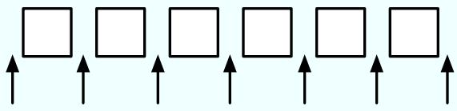
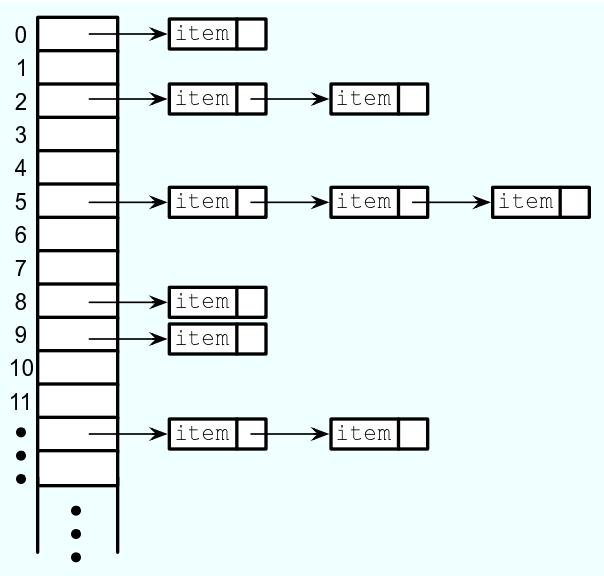

Chapter 10

# Generic Programming and Collection Classes

How to avoid reinventing the wheel? Many data structures and algorithms, such as those from Chapter 9, have been studied, programmed, and re-programmed by generations of computer science students. This is a valuable learning experience. Unfortunately, they have also been programmed and re-programmed by generations of working computer professionals, taking up time that could be devoted to new, more creative work. A programmer who needs a list or a binary tree shouldn’t have to re-code these data structures from scratch. They are well-understood and have been programmed thousands of times before. The problem is how to make pre-written, robust data structures available to programmers. In this chapter, we’ll look at Java’s attempt to address this problem.

## 10.1 Generic Programming

Generic programming refers to writing code that will work for many types of data. We encountered the term in Section 7.3, where we looked at dynamic arrays of integers. The source code presented there for working with dynamic arrays of integers works only for data of type int. But the source code for dynamic arrays of double, String, JButton, or any other type would be almost identical, except for the substitution of one type name for another. It seems silly to write essentially the same code over and over. As we saw in Subsection 7.3.3, Java goes some distance towards solving this problem by providing the ArrayList class. An ArrayList is essentially a dynamic array of values of type Object. Since every class is a subclass of Object, objects of any type can be stored in an ArrayList. Java goes even further by providing “parameterized types,” which were introduced in Subsection 7.3.4. There we saw that the ArrayList type can be parameterized, as in “ArrayList<String>”, to limit the values that can be stored in the list to objects of a specified type. Parameterized types extend Java’s basic philosophy of type-safe programming to generic programming.

The ArrayList class is just one of several standard classes that are used for generic programming in Java. We will spend the next few sections looking at these classes and how they are used, and we’ll see that there are also generic methods and generic interfaces (see Subsection 5.7.1). All the classes and interfaces discussed in these sections are defined in the package java.util, and you will need an import statement at the beginning of your program to get access to them. (Before you start putting “import java.util.\*” at the beginning of every program, you should know that some things in java.util have names that are the same as things in other packages. For example, both java.util.List and java.awt.List exist, so it is often better to import the individual classes that you need.)

In the final section of this chapter, we will see that it is possible to define new generic classes, interfaces, and methods. Until then, we will stick to using the generics that are predefined in Java’s standard library.

It is no easy task to design a library for generic programming. Java’s solution has many nice features but is certainly not the only possible approach. It is almost certainly not the best, and has a few features that in my opinion can only be called bizarre, but in the context of the overall design of Java, it might be close to optimal. To get some perspective on generic programming in general, it might be useful to look very briefly at generic programming in two other languages.

## 10.1.1 Generic Programming in Smalltalk

Smalltalk was one of the very first object-oriented programming languages. It is still used today, although its use is not very common. It has not achieved anything like the popularity of Java or C++, but it is the source of many ideas used in these languages. In Smalltalk, essentially all programming is generic, because of two basic properties of the language.

First of all, variables in Smalltalk are typeless. A data value has a type, such as integer or string, but variables do not have types. Any variable can hold data of any type. Parameters are also typeless, so a subroutine can be applied to parameter values of any type. Similarly, a data structure can hold data values of any type. For example, once you’ve defined a binary tree data structure in SmallTalk, you can use it for binary trees of integers or strings or dates or data of any other type. There is simply no need to write new code for each data type.

Secondly, all data values are objects, and all operations on objects are defined by methods in a class. This is true even for types that are “primitive” in Java, such as integers. When the “+” operator is used to add two integers, the operation is performed by calling a method in the integer class. When you define a new class, you can define a “+” operator, and you will then be able to add objects belonging to that class by saying “a + b” just as if you were adding numbers. Now, suppose that you write a subroutine that uses the “+” operator to add up the items in a list. The subroutine can be applied to a list of integers, but it can also be applied, automatically, to any other data type for which “+” is defined. Similarly, a subroutine that uses the “<" operator to sort a list can be applied to lists containing any type of data for which “<” is defined. There is no need to write a diferent sorting subroutine for each type of data.

Put these two features together and you have a language where data structures and algorithms will work for any type of data for which they make sense, that is, for which the appropriate operations are defined. This is real generic programming. This might sound pretty good, and you might be asking yourself why all programming languages don’t work this way. This type of freedom makes it easier to write programs, but unfortunately it makes it harder to write programs that are correct and robust (see Chapter 8). Once you have a data structure that can contain data of any type, it becomes hard to ensure that it only holds the type of data that you want it to hold. If you have a subroutine that can sort any type of data, it’s hard to ensure that it will only be applied to data for which the “<” operator is defined. More particularly, there is no way for a compiler to ensure these things. The problem will only show up at run time when an attempt is made to apply some operation to a data type for which it is not defined, and the program will crash.

## 10.1.2 Generic Programming in C++

Unlike Smalltalk, C++ is a very strongly typed language, even more so than Java. Every variable has a type, and can only hold data values of that type. This means that the kind of generic programming that is used in Smalltalk is impossible in C++. Furthermore, C++ does not have anything corresponding to Java’s Object class. That is, there is no class that is a superclass of all other classes. This means that C++ can’t use Java’s style of generic programming with non-parameterized generic types either. Nevertheless, C++ has a powerful and flexible system of generic programming. It is made possible by a language feature known as templates. In C++, instead of writing a diferent sorting subroutine for each type of data, you can write a single subroutine template. The template is not a subroutine; it’s more like a factory for making subroutines. We can look at an example, since the syntax of C++ is very similar to Java’s:

```cpp
template<class ItemType>
void sort( ItemType A[], int count ) {
    // Sort items in the array, A, into increasing order.
    // The items in positions 0, 1, 2, ..., (count-1) are sorted.
    // The algorithm that is used here is selection sort.
    for (int i = count-1; i > 0; i--) {
        int position_of_max = 0;
        for (int j = 1; j <= count ; j++)
            if ( A[j] > A[position_of_max] )
                position_of_max = j;
        ItemType temp = A[count];
        A[count] = A[position_of_max];
        A[position_of_max] = temp;
    }
}
```

This piece of code defines a subroutine template. If you remove the first line, “template<class ItemType>”, and substitute the word “int” for the word “ItemType” in the rest of the template, you get a subroutine for sorting arrays of ints. (Even though it says “class ItemType”, you can actually substitute any type for ItemType, including the primitive types.) If you substitute “string” for “ItemType”, you get a subroutine for sorting arrays of strings. This is pretty much what the compiler does with the template. If your program says “sort(list,10)” where list is an array of ints, the compiler uses the template to generate a subroutine for sorting arrays of ints. If you say “sort(cards,10)” where cards is an array of objects of type Card, then the compiler generates a subroutine for sorting arrays of Cards. At least, it tries to. The template uses the “>” operator to compare values. If this operator is defined for values of type Card, then the compiler will successfully use the template to generate a subroutine for sorting cards. If “>” is not defined for Cards, then the compiler will fail—but this will happen at compile time, not, as in Smalltalk, at run time where it would make the program crash.

In addition to subroutine templates, C++ also has templates for making classes. If you write a template for a binary tree class, you can use it to generate classes for binary trees of ints, binary trees of strings, binary trees of dates, and so on—all from one template. The most recent version of C++ comes with a large number of pre-written templates called the Standard Template Library or STL. The STL is quite complex. Many people would say that its much too complex. But it is also one of the most interesting features of C++.

## 10.1.3 Generic Programming in Java

Java’s generic programming features have gone through several stages of development. The original version of Java had just a few generic data structure classes, such as Vector, that could hold values of type Object. Java version 1.2 introduced a much larger group of generics that followed the same basic model. These generic classes and interfaces as a group are known as the Java Collection Framework. The ArrayList class is part of the Collection Framework. The original Collection Framework was closer in spirit to Smalltalk than it was to C++, since a data structure designed to hold Objects can be used with objects of any type. Unfortunately, as in Smalltalk, the result is a category of errors that show up only at run time, rather than at compile time. If a programmer assumes that all the items in a data structure are strings and tries to process those items as strings, a run-time error will occur if other types of data have inadvertently been added to the data structure. In Java, the error will most likely occur when the program retrieves an Object from the data structure and tries to type-cast it to type String. If the object is not actually of type String, the illegal type-cast will throw an error of type ClassCastException.

Java 5.0 introduced parameterized types, such as ArrayList<String>. This made it possible to create generic data structures that can be type-checked at compile time rather than at run time. With these data structures, type-casting is not necessary, so ClassCastExceptions are avoided. The compiler will detect any attempt to add an object of the wrong type to the data structure; it will report a syntax error and will refuse to compile the program. In Java 5.0, all of the classes and interfaces in the Collection Framework, and even some classes that are not part of that framework, have been parameterized. Java’s parameterized classes are similar to template classes in C++ (although the implementation is very diferent), and their introduction moves Java’s generic programming model closer to C++ and farther from Smalltalk. In this chapter, I will use the parameterized types almost exclusively, but you should remember that their use is not mandatory. It is still legal to use a parameterized class as a non-parameterized type, such as a plain ArrayList.

Note that there is a significant diference between parameterized classes in Java and template classes in C++. A template class in C++ is not really a class at all—it’s a kind of factory for generating classes. Every time the template is used with a new type, a new compiled class is created. With a Java parameterized class, there is only one compiled class file. For example, there is only one compiled class file, ArrayList.class, for the parameterized class ArrayList. The parameterized types ArrayList<String> and ArrayList<Integer> both use the some compiled class file, as does the plain ArrayList type. The type parameter—String or Integer—just tells the compiler to limit the type of object that can be stored in the data structure. The type parameter has no efect at run time and is not even known at run time. The type information is said to be “erased” at run time. This type erasuer introduces a certain amount of weirdness. For example, you can’t test “if (list instanceof ArrayList<String>)” because the instanceof operator is evaluated at run time, and at run time only the plain ArrayList exists. Even worse, you can’t create an array that has base type ArrayList<String> by using the new operator, as in “new ArrayList<String>[N]”. This is because the new operator is evaluated at run time, and at run time there is no such thing as “ArrayList<String>”; only the non-parameterized type ArrayList exists at run time.

Fortunately, most programmers don’t have to deal with such problems, since they turn up only in fairly advanced programming. Most people who use the Java Collection Framework will not encounter them, and they will get the benefits of type-safe generic programming with little dificulty.

## 10.1.4 The Java Collection Framework

Java’s generic data structures can be divided into two categories: collections and maps. A collection is more or less what it sound like: a collection of objects. A map associates objects in one set with objects in another set in the way that a dictionary associates definitions with words or a phone book associates phone numbers with names. A map is similar to what I called an “association list” in Subsection 7.4.2. In Java, collections and maps are represented by the parameterized interfaces Collection<T> and Map<T,S>. Here, “T” and “S” stand for any type except for the primitive types. Map<T,S> is the first example we have seen where there are two type parameters, T and S; we will not deal further with this possibility until we look at maps more closely in Section 10.3. In this section and the next, we look at collections only.

There are two types of collections: lists and sets. A list is a collection in which the objects are arranged in a linear sequence. A list has a first item, a second item, and so on. For any item in the list, except the last, there is an item that directly follows it. The defining property of a set is that no object can occur more than once in a set; the elements of a set are not necessarily thought of as being in any particular order. The ideas of lists and sets are represented as parameterized interfaces List<T> and Set<T>. These are sub-interfaces of Collection<T>. That is, any object that implements the interface List<T> or Set<T> automatically implements Collection<T> as well. The interface Collection<T> specifies general operations that can be applied to any collection at all. List<T> and Set<T> add additional operations that are appropriate for lists and sets respectively.

Of course, any actual object that is a collection, list, or set must belong to a concrete class that implements the corresponding interface. For example, the class ArrayList<T> implements the interface List<T> and therefore also implements Collection<T>. This means that all the methods that are defined in the list and collection interfaces can be used with, for example, an ArrayList<String> object. We will look at various classes that implement the list and set interfaces in the next section. But before we do that, we’ll look briefly at some of the general operations that are available for all collections.

## ∗ ∗ ∗

The interface Collection<T> specifies methods for performing some basic operations on any collection of objects. Since “collection” is a very general concept, operations that can be applied to all collections are also very general. They are generic operations in the sense that they can be applied to various types of collections containing various types of objects. Suppose that coll is an object that implements the interface Collection<T> (for some specific non-primitive type T). Then the following operations, which are specified in the interface Collection<T>, are defined for coll:

• coll.size() — returns an int that gives the number of objects in the collection.

• coll.isEmpty() — returns a boolean value which is true if the size of the collection is 0.

• coll.clear() — removes all objects from the collection.

• coll.add(tobject) — adds tobject to the collection. The parameter must be of type T; if not, a syntax error occurs at compile time. This method returns a boolean value which tells you whether the operation actually modified the collection. For example, adding an object to a Set has no efect if that object was already in the set.

• coll.contains(object) — returns a boolean value that is true if object is in the collection. Note that object is not required to be of type T, since it makes sense to check whether object is in the collection, no matter what type object has. (For testing equality, null is considered to be equal to itself. The criterion for testing non-null objects for equality can difer from one kind of collection to another; see Subsection 10.1.6, below.)

• coll.remove(object) — removes object from the collection, if it occurs in the collection, and returns a boolean value that tells you whether the object was found. Again, object is not required to be of type T.

• coll.containsAll(coll2) — returns a boolean value that is true if every object in coll2 is also in the coll. The parameter can be any collection.

• coll.addAll(coll2) — adds all the objects in coll2 to coll. The parameter, coll2, can be any collection of type Collection<T>. However, it can also be more general. For example, if T is a class and S is a sub-class of T, then coll2 can be of type Collection<S>. This makes sense because any object of type S is automatically of type T and so can legally be added to coll.

• coll.removeAll(coll2) — removes every object from coll that also occurs in the collection coll2. coll2 can be any collection.

• coll.retainAll(coll2) — removes every object from coll that does not occur in the collection coll2. It “retains” only the objects that do occur in coll2. coll2 can be any collection.

• coll.toArray() — returns an array of type Object[ ] that contains all the items in the collection. The return value can be type-cast to another array type, if appropriate. Note that the return type is Object[ ], not T[ ]! However, you can type-cast the return value to a more specific type. For example, if you know that all the items in coll are of type String, then (String[])coll.toArray() gives you an array of Strings containing all the strings in the collection.

Since these methods are part of the Collection<T> interface, they must be defined for every object that implements that interface. There is a problem with this, however. For example, the size of some kinds of collection cannot be changed after they are created. Methods that add or remove objects don’t make sense for these collections. While it is still legal to call the methods, an exception will be thrown when the call is evaluated at run time. The type of the exception is UnsupportedOperationException. Furthermore, since Collection<T> is only an interface, not a concrete class, the actual implementation of the method is left to the classes that implement the interface. This means that the semantics of the methods, as described above, are not guaranteed to be valid for all collection objects; they are valid, however, for classes in the Java Collection Framework.

There is also the question of eficiency. Even when an operation is defined for several types of collections, it might not be equally eficient in all cases. Even a method as simple as size() can vary greatly in eficiency. For some collections, computing the size() might involve counting the items in the collection. The number of steps in this process is equal to the number of items. Other collections might have instance variables to keep track of the size, so evaluating size() just means returning the value of a variable. In this case, the computation takes only one step, no matter how many items there are. When working with collections, it’s good to have some idea of how eficient operations are and to choose a collection for which the operations that you need can be implemented most eficiently. We’ll see specific examples of this in the next two sections.

## 10.1.5 Iterators and for-each Loops

The interface Collection<T> defines a few basic generic algorithms, but suppose you want to write your own generic algorithms. Suppose, for example, you want to do something as simple as printing out every item in a collection. To do this in a generic way, you need some way of going through an arbitrary collection, accessing each item in turn. We have seen how to do this for specific data structures: For an array, you can use a for loop to iterate through all the array indices. For a linked list, you can use a while loop in which you advance a pointer along the list. For a binary tree, you can use a recursive subroutine to do an infix traversal. Collections can be represented in any of these forms and many others besides. With such a variety of traversal mechanisms, how can we even hope to come up with a single generic method that will work for collections that are stored in wildly diferent forms? This problem is solved by iterators. An iterator is an object that can be used to traverse a collection. Diferent types of collections have iterators that are implemented in diferent ways, but all iterators are used in the same way. An algorithm that uses an iterator to traverse a collection is generic, because the same technique can be applied to any type of collection. Iterators can seem rather strange to someone who is encountering generic programming for the first time, but you should understand that they solve a dificult problem in an elegant way.

The interface Collection<T> defines a method that can be used to obtain an iterator for any collection. If coll is a collection, then coll.iterator() returns an iterator that can be used to traverse the collection. You should think of the iterator as a kind of generalized pointer that starts at the beginning of the collection and can move along the collection from one item to the next. Iterators are defined by a parameterized interface named Iterator<T>. If coll implements the interface Collection<T> for some specific type T, then coll.iterator() returns an iterator of type Iterator<T>, with the same type T as its type parameter. The interface Iterator<T> defines just three methods. If iter refers to an object that implements Iterator<T>, then we have:

• iter.next() — returns the next item, and advances the iterator. The return value is of type T. This method lets you look at one of the items in the collection. Note that there is no way to look at an item without advancing the iterator past that item. If this method is called when no items remain, it will throw a NoSuchElementException.

• iter.hasNext() — returns a boolean value telling you whether there are more items to be processed. In general, you should test this before calling iter.next().

• iter.remove() — if you call this after calling iter.next(), it will remove the item that you just saw from the collection. Note that this method has no parameter. It removes the item that was most recently returned by iter.next(). This might produce an UnsupportedOperationException, if the collection does not support removal of items.

Using iterators, we can write code for printing all the items in any collection. Suppose, for example, that coll is of type Collection<String>. In that case, the value returned by coll.iterator() is of type Iterator<String>, and we can say:

```txt
Iterator<String> iter;          // Declare the iterator variable.
iter = coll.iterator();         // Get an iterator for the collection.
while ( iter.hasNext() ) {
    String item = iter.next();   // Get the next item.
    System.out.println(item);
}
```

The same general form will work for other types of processing. For example, the following code will remove all null values from any collection of type Collection<JButton> (as long as that collection supports removal of values):

```txt
Iterator<JButton> iter = coll.iterator():
while ( iter.hasNext() ) {
    JButton item = iter.next();
    if (item == null)
        iter.remove();
}
```

(Note, by the way, that when Collection<T>, Iterator<T>, or any other parameterized type is used in actual code, they are always used with actual types such as String or JButton in place of the “formal type parameter” T. An iterator of type Iterator<String> is used to iterate through a collection of Strings; an iterator of type Iterator<JButton> is used to iterate through a collection of JButtons; and so on.)

An iterator is often used to apply the same operation to all the elements in a collection. In many cases, it’s possible to avoid the use of iterators for this purpose by using a for-each loop. The for-each loop was discussed in Subsection 3.4.4 for use with enumerated types and in Subsection 7.2.2 for use with arrays. A for-each loop can also be used to iterate through any collection. For a collection coll of type Collection<T>, a for-each loop takes the form:

```txt
for ( T x : coll ) { // "for each object x, of type T, in coll"
    // process x
}
```

Here, x is the loop control variable. Each object in coll will be assigned to x in turn, and the body of the loop will be executed for each object. Since objects in coll are of type T, x is declared to be of type T. For example, if namelist is of type Collection<String>, we can print out all the names in the collection with:

```txt
for ( String name : namelist ) {
    System.out.println( name );
}
```

This for-each loop could, of course, be written as a while loop using an iterator, but the for-each loop is much easier to follow.

## 10.1.6 Equality and Comparison

There are several methods in the collection interface that test objects for equality. For example, the methods coll.contains(object) and coll.remove(object) look for an item in the collection that is equal to object. However, equality is not such a simple matter. The obvious technique for testing equality—using the == operator—does not usually give a reasonable answer when applied to objects. The == operator tests whether two objects are identical in the sense that they share the same location in memory. Usually, however, we want to consider two objects to be equal if they represent the same value, which is a very diferent thing. Two values of type String should be considered equal if they contain the same sequence of characters. The question of whether those characters are stored in the same location in memory is irrelevant. Two values of type Date should be considered equal if they represent the same time.

The Object class defines the boolean-valued method equals(Object) for testing whether one object is equal to another. This method is used by many, but not by all, collection classes for deciding whether two objects are to be considered the same. In the Object class, obj1.equals(obj2) is defined to be the same as obj1 == obj2. However, for most sub-classes of Object, this definition is not reasonable, and it should be overridden. The String class, for example, overrides equals() so that for a String str, str.equals(obj) if obj is also a String and obj contains the same sequence of characters as str.

If you write your own class, you might want to define an equals() method in that class to get the correct behavior when objects are tested for equality. For example, a Card class that will work correctly when used in collections could be defined as:

```txt
public class Card {  // Class to represent playing cards.
    int suit;  // Number from 0 to 3 that codes for the suit --
        // spades, diamonds, clubs or hearts.
    int value; // Number from 1 to 13 that represents the value.
    public boolean equals(Object obj) {
        try {
            Card other = (Card)obj;  // Type-cast obj to a Card.
            if (suit == other.suit && value == other.value) {
                // The other card has the same suit and value as
                // this card, so they should be considered equal.
            return true;
        }
        else
            return false;
    }
    catch (Exception e) {
        // This will catch the NullPointerException that occurs if obj
        // is null and the ClassCastException that occurs if obj is
        // not of type Card.  In these cases, obj is not equal to
        // this Card, so return false.
        return false;
    }
}
.
. // other methods and constructors
.
}
```

Without the equals() method in this class, methods such as contains() and remove() in the interface Collection<Card> will not work as expected.

A similar concern arises when items in a collection are sorted. Sorting refers to arranging a sequence of items in ascending order, according to some criterion. The problem is that there is no natural notion of ascending order for arbitrary objects. Before objects can be sorted, some method must be defined for comparing them. Objects that are meant to be compared should implement the interface java.lang.Comparable. In fact, Comparable is defined as a parameterized interface, Comparable<T>, which represents the ability to be compared to an object of type T. The interface Comparable<T> defines one method:

## public int compareTo( T obj )

The value returned by obj1.compareTo(obj2) should be negative if and only if obj1 comes before obj2, when the objects are arranged in ascending order. It should be positive if and only if obj1 comes after obj2. A return value of zero means that the objects are considered to be the same for the purposes of this comparison. This does not necessarily mean that the objects are equal in the sense that obj1.equals(obj2) is true. For example, if the objects are of type Address, representing mailing addresses, it might be useful to sort the objects by zip code. Two Addresses are considered the same for the purposes of the sort if they have the same zip code—but clearly that would not mean that they are the same address.

The String class implements the interface Comparable<String> and defines compareTo in a reasonable way (and in this case, the return value of compareTo is zero if and only if the two strings that are being compared are equal). If you define your own class and want to be able to sort objects belonging to that class, you should do the same. For example:

```java
/**
 * Represents a full name consisting of a first name and a last name.
 */
public class FullName implements Comparable<FullName> {

    private String firstName, lastName;  // Non-null first and last names.

    public FullName(String first, String last) {  // Constructor.
        if (first == null || last == null)
            throw new IllegalArgumentException("Names must be non-null.");
        firstName = first;
        lastName = last;
    }

    public boolean equals(Object obj) {
        try {
            FullName other = (FullName)obj;  // Type-cast obj to type FullName
            return firstName.equals(other.firstName)
                && lastName.equals(other.lastName);
        }
        catch (Exception e) {
            return false;  // if obj is null or is not of type FirstName
        }
    }

    public int compareTo( FullName other ) {
        if ( lastName.compareTo(other.lastName) < 0 ) {
            // If lastName comes before the last name of
            // the other object, then this FullName comes
            // before the other FullName.  Return a negative
            // value to indicate this.
            return -1;
        }
        if ( lastName.compareTo(other.lastName) > 0 ) {
            // If lastName comes after the last name of
            // the other object, then this FullName comes
            // after the other FullName.  Return a positive
            // value to indicate this.
            return 1;
        }
        else {
            // Last names are the same, so base the comparison on
            // the first names, using compareTo from class String.
            return firstName.compareTo(other.firstName);
        }
```

## 10.1. GENERIC PROGRAMMING

```txt
}

    .
    . // other methods
    .
}
```

(I find it a little odd that the class here is declared as “class FullName implements Comparable<FullName>”, with “FullName” repeated as a type parameter in the name of the interface. However, it does make sense. It means that we are going to compare objects that belong to the class FullName to other objects of the same type. Even though this is the only reasonable thing to do, that fact is not obvious to the Java compiler—and the type parameter in Comparable<FullName> is there for the compiler.)

There is another way to allow for comparison of objects in Java, and that is to provide a separate object that is capable of making the comparison. The object must implement the interface Comparator<T>, where T is the type of the objects that are to be compared. The interface Comparator<T> defines the method:

```txt
public int compare( T obj1, T obj2 )
```

This method compares two objects of type T and returns a value that is negative, or positive, or zero, depending on whether obj1 comes before obj2, or comes after obj2, or is considered to be the same as obj2 for the purposes of this comparison. Comparators are useful for comparing objects that do not implement the Comparable interface and for defining several diferent orderings on the same collection of objects.

In the next two sections, we’ll see how Comparable and Comparator are used in the context of collections and maps.

## 10.1.7 Generics and Wrapper Classes

As noted above, Java’s generic programming does not apply to the primitive types, since generic data structures can only hold objects, while values of primitive type are not objects. However, the “wrapper classes” that were introduced in Subsection 5.3.2 make it possible to get around this restriction to a great extent.

Recall that each primitive type has an associated wrapper class: class Integer for type int, class Boolean for type boolean, class Character for type char, and so on.

An object of type Integer contains a value of type int. The object serves as a “wrapper” for the primitive type value, which allows it to be used in contexts where objects are required, such as in generic data structures. For example, a list of Integers can be stored in a variable of type ArrayList<Integer>, and interfaces such as Collection<Integer> and Set<Integer> are defined. Furthermore, class Integer defines equals(), compareTo(), and toString() methods that do what you would expect (that is, that compare and write out the corresponding primitive type values in the usual way). Similar remarks apply for all the wrapper classes.

Recall also that Java does automatic conversions between a primitive type and the corresponding wrapper type. (These conversions, which are called autoboxing and unboxing, were also introduced in Subsection 5.3.2.) This means that once you have created a generic data structure to hold objects belonging to one of the wrapper classes, you can use the data structure pretty much as if it actually contained primitive type values. For example, if numbers is a variable of type Collection<Integer>, it is legal to call numbers.add(17) or numbers.remove(42). You can’t literally add the primitive type value 17 to numbers, but Java will automatically convert the 17 to the corresponding wrapper object, new Integer(17), and the wrapper object will be added to the collection. (The creation of the object does add some time and memory overhead to the operation, and you should keep that in mind in situations where eficiency is important. An array of int is more eficient than an ArrayList<Integer>.)

## 10.2 Lists and Sets

In the previous section, we looked at the general properties of collection classes in Java. In this section, we look at some specific collection classes and how to use them. These classes can be divided into two categories: lists and sets. A list consists of a sequence of items arranged in a linear order. A list has a definite order, but is not necessarily sorted into ascending order. A set is a collection that has no duplicate entries. The elements of a set might or might not be arranged into some definite order.

## 10.2.1 ArrayList and LinkedList

There are two obvious ways to represent a list: as a dynamic array and as a linked list. We’ve encountered these already in Section 7.3 and Section 9.2. Both of these options are available in generic form as the collection classes java.util.ArrayList and java.util.LinkedList. These classes are part of the Java Collection Framework. Each implements the interface List<T>, and therefor the interface Collection<T>. An object of type ArrayList<T> represents an ordered sequence of objects of type T, stored in an array that will grow in size whenever necessary as new items are added. An object of type LinkedList<T> also represents an ordered sequence of objects of type T, but the objects are stored in nodes that are linked together with pointers.

Both list classes support the basic list operations that are defined in the interface List<T>, and an abstract data type is defined by its operations, not by its representation. So why two classes? Why not a single List class with a single representation? The problem is that there is no single representation of lists for which all list operations are eficient. For some operations, linked lists are more eficient than arrays. For others, arrays are more eficient. In a particular application of lists, it’s likely that only a few operations will be used frequently. You want to choose the representation for which the frequently used operations will be as eficient as possible.

Broadly speaking, the LinkedList class is more eficient in applications where items will often be added or removed at the beginning of the list or in the middle of the list. In an array, these operations require moving a large number of items up or down one position in the array, to make a space for a new item or to fill in the hole left by the removal of an item. In terms of asymptotic analysis (Section 8.6), adding an element at the beginning or in the middle of an array has run time Θ(n), where n is the number of items in the array. In a linked list, nodes can be added or removed at any position by changing a few pointer values, an operation that has run time Θ(1). That is, the operation takes only some constant amount of time, independent of how many items are in the list.

On the other hand, the ArrayList class is more eficient when random access to items is required. Random access means accessing the k-th item in the list, for any integer k. Random access is used when you get or change the value stored at a specified position in the list. This is trivial for an array, with run time Θ(1). But for a linked list it means starting at the beginning of the list and moving from node to node along the list for k steps, an operation that has run time Θ(n).

Operations that can be done eficiently for both types of lists include sorting and adding an item at the end of the list.

All lists implement the methods from interface Collection<T> that were discussed in Subsection 10.1.4. These methods include size(), isEmpty(), add(T), remove(Object), and clear(). The add(T) method adds the object at the end of the list. The remove(Object) method involves first finding the object, which is not very eficient for any list since it involves going through the items in the list from beginning to end until the object is found. The interface List<T> adds some methods for accessing list items according to their numerical positions in the list. Suppose that list is an object of type List<T>. Then we have the methods:

• list.get(index) — returns the object of type T that is at position index in the list, where index is an integer. Items are numbered 0, 1, 2, . . . , list.size()-1. The parameter must be in this range, or an IndexOutOfBoundsException is thrown.

• list.set(index,obj) — stores the object obj at position number index in the list, replacing the object that was there previously. The object obj must be of type T. This does not change the number of elements in the list or move any of the other elements.

• list.add(index,obj) — inserts an object obj into the list at position number index, where obj must be of type T. The number of items in the list increases by one, and items that come after position index move up one position to make room for the new item. The value of index must be in the range 0 to list.size(), inclusive. If index is equal to list.size(), then obj is added at the end of the list.

• list.remove(index) — removes the object at position number index, and returns that object as the return value of the method. Items after this position move up one space in the list to fill the hole, and the size of the list decreases by one. The value of index must be in the range 0 to list.size()-1

• list.indexOf(obj) — returns an int that gives the position of obj in the list, if it occurs. If it does not occur, the return value is -1. The object obj can be of any type, not just of type T. If obj occurs more than once in the list, the index of the first occurrence is returned.

These methods are defined both in class ArrayList<T> and in class LinkedList<T>, although some of them—get and set—are only eficient for ArrayLists. The class LinkedList<T> adds a few additional methods, which are not defined for an ArrayList. If linkedlist is an object of type LinkedList<T>, then we have

• linkedlist.getFirst() — returns the object of type T that is the first item in the list. The list is not modified. If the list is empty when the method is called, an exception of type NoSuchElementException is thrown (the same is true for the next three methods as well).

• linkedlist.getLast() — returns the object of type T that is the last item in the list. The list is not modified.

• linkedlist.removeFirst() — removes the first item from the list, and returns that object of type T as its return value.

• linkedlist.removeLast() — removes the last item from the list, and returns that object of type T as its return value.

• linkedlist.addFirst(obj) — adds the obj, which must be of type T, to the beginning of the list.

• linkedlist.addLast(obj) — adds the object obj, which must be of type T, to the end of the list. (This is exactly the same as linkedlist.add(obj) and is apparently defined just to keep the naming consistent.)

These methods are apparently defined to make it easy to use a LinkedList as if it were a stack or a queue. (See Section 9.3.) For example, we can use a LinkedList as a queue by adding items onto one end of the list (using the addLast() method) and removing them from the other end (using the removeFirst() method).

If list is an object of type List<T>, then the method list.iterator(), defined in the interface Collection<T>, returns an Iterator that can be used to traverse the list from beginning to end. However, for Lists, there is a special type of Iterator, called a ListIterator, which ofers additional capabilities. ListIterator<T> is an interface that extends the interface Iterator<T>. The method list.listIterator() returns an object of type ListIterator<T>.

A ListIterator has the usual Iterator methods, hasNext(), next(), and remove(), but it also has methods hasPrevious(), previous(), and add(obj) that make it possible to move backwards in the list and to add an item at the current position of the iterator. To understand how these work, it’s best to think of an iterator as pointing to a position between two list elements, or at the beginning or end of the list. In this diagram, the items in a list are represented by squares, and arrows indicate the possible positions of an iterator:



If iter is of type ListIterator<T>, then iter.next() moves the iterator one space to the right along the list and returns the item that the iterator passes as it moves. The method iter.previous() moves the iterator one space to the left along the list and returns the item that it passes. The method iter.remove() removes an item from the list; the item that is removed is the item that the iterator passed most recently in a call to either iter.next() or iter.previous(). There is also a method iter.add(obj) that adds the specified object to the list at the current position of the iterator (where obj must be of type T). This can be between two existing items or at the beginning of the list or at the end of the list.

(By the way, the lists that are used in class LinkedList<T> are doubly linked lists. That is, each node in the list contains two pointers—one to the next node in the list and one to the previous node. This makes it possible to eficiently implement both the next() and previous() methods of a ListIterator. Also, to make the addLast() and getLast() methods of a LinkedList eficient, the class LinkedList<T> includes an instance variable that points to the last node in the list.)

As an example of using a ListIterator, suppose that we want to maintain a list of items that is always sorted into increasing order. When adding an item to the list, we can use a ListIterator to find the position in the list where the item should be added. Once the position has been found, we use the same list iterator to place the item in that position. The idea is to start at the beginning of the list and to move the iterator forward past all the items that are smaller than the item that is being inserted. At that point, the iterator’s add() method can be used to insert the item. To be more definite, suppose that stringList is a variable of type List<String>. Assume that that the strings that are already in the list are stored in ascending order and that newItem is a string that we would like to insert into the list. The following code will place newItem in the list in its correct position, so that the modified list is still in ascending order:

```dart
ListIterator<String> iter = stringList.listIterator();

// Move the iterator so that it points to the position where
// newItem should be inserted into the list.  If newItem is
// bigger than all the items in the list, then the while loop
// will end when iter.hasNext() becomes false, that is, when
// the iterator has reached the end of the list.

while (iter.hasNext()) {
    String item = iter.next();
    if (newItem.compareTo(item) <= 0) {
        // newItem should come BEFORE item in the list.
        // Move the iterator back one space so that
        // it points to the correct insertion point,
        // and end the loop.
        iter.previous();
        break;
    }
}

iter.add(newItem);
```

Here, stringList might be of type ArrayList<String> or of type LinkedList<String>. The algorithm that is used to insert newItem into the list will be about equally eficient for both types of lists, and it will even work for other classes that implement the interface List<String>. You would probably find it easier to design an insertion algorithm that uses array-like indexing with the methods get(index) and add(index,obj). However, that algorithm would be horribly ineficient for LinkedLists because random access is so ineficient for linked lists. (By the way, the insertion algorithm works when the list is empty. It might be useful for you to think about why this is true.)

## 10.2.2 Sorting

Sorting a list is a fairly common operation, and there should really be a sorting method in the List interface. There is not, presumably because it only makes sense to sort lists of certain types of objects, but methods for sorting lists are available as static methods in the class java.util.Collections. This class contains a variety of static utility methods for working with collections. The methods are generic; that is, they will work for collections of objects of various types. Suppose that list is of type List<T>. The command

```javascript
Collections.sort(list);
```

can be used to sort the list into ascending order. The items in the list should implement the interface Comparable<T> (see Subsection 10.1.6). The method Collections.sort() will work, for example, for lists of String and for lists of any of the wrapper classes such as Integer and Double. There is also a sorting method that takes a Comparator as its second argument:

```javascript
Collections.sort(list,comparator);
```

In this method, the comparator will be used to compare the items in the list. As mentioned in the previous section, a Comparator is an object that defines a compare() method that can be used to compare two objects. We’ll see an example of using a Comparator in Section 10.4.

The sorting method that is used by Collections.sort() is the so-called “merge sort” algorithm, which has both worst-case and average-case run times that are Θ(n\*log(n)) for a list of size n. Although the average run time for MergeSort is a little slower than that of QuickSort, its worst-case performance is much better than QuickSort’s. (QuickSort was covered in Subsection 9.1.3.) MergeSort also has a nice property called “stability” that we will encounter at the end of Subsection 10.4.3.

The Collections class has at least two other useful methods for modifying lists. Collections.shuffle(list) will rearrange the elements of the list into a random order. Collections.reverse(list) will reverse the order of the elements, so that the last element is moved to the beginning of the list, the next-to-last element to the second position, and so on.

Since an eficient sorting method is provided for Lists, there is no need to write one yourself. You might be wondering whether there is an equally convenient method for standard arrays. The answer is yes. Array-sorting methods are available as static methods in the class java.util.Arrays. The statement

Arrays.sort(A);

will sort an array, A, provided either that the base type of A is one of the primitive types (except boolean) or that A is an array of Objects that implement the Comparable interface. You can also sort part of an array. This is important since arrays are often only “partially filled.” The command:

Arrays.sort(A,fromIndex,toIndex);

sorts the elements A[fromIndex], A[fromIndex+1], . . . , A[toIndex-1] into ascending order. You can use Arrays.sort(A,0,N-1) to sort a partially filled array which has items in the first N positions.

Java does not support generic programming for primitive types. In order to implement the command Arrays.sort(A), the Arrays class contains eight methods: one method for arrays of Objects and one method for each of the primitive types byte, short, int, long, float, double, and char.

## 10.2.3 TreeSet and HashSet

A set is a collection of objects in which no object occurs more than once. Sets implement all the methods in the interface Collection<T>, but do so in a way that ensures that no element occurs twice in the set. For example, if set is an object of type Set<T>, then set.add(obj) will have no efect on the set if obj is already an element of the set. Java has two classes that implement the interface Set<T>: java.util.TreeSet and java.util.HashSet.

In addition to being a Set, a TreeSet has the property that the elements of the set are arranged into ascending sorted order. An Iterator for a TreeSet will always visit the elements of the set in ascending order.

A TreeSet cannot hold arbitrary objects, since there must be a way to determine the sorted order of the objects it contains. Ordinarily, this means that the objects in a set of type TreeSet<T> should implement the interface Comparable<T> and that obj1.compareTo(obj2) should be defined in a reasonable way for any two objects obj1 and obj2 in the set. Alternatively, an object of type Comparator<T> can be provided as a parameter to the constructor when the TreeSet is created. In that case, the compareTo() method of the Comparator will be used to compare objects that are added to the set.

A TreeSet does not use the equals() method to test whether two objects are the same. Instead, it uses the compareTo() method. This can be a problem. Recall from Subsection 10.1.6 that compareTo() can consider two objects to be the same for the purpose of the comparison even though the objects are not equal. For a TreeSet, this means that only one of those objects can be in the set. For example, if the TreeSet contains mailing addresses and if the compareTo() method for addresses just compares their zip codes, then the set can contain only one address in each zip code. Clearly, this is not right! But that only means that you have to be aware of the semantics of TreeSets, and you need to make sure that compareTo() is defined in a reasonable way for objects that you put into a TreeSet. This will be true, by the way, for Strings, Integers, and many other built-in types, since the compareTo() method for these types considers two objects to be the same only if they are actually equal.

In the implementation of a TreeSet, the elements are stored in something similar to a binary sort tree. (See Subsection 9.4.2.) However, the data structure that is used is balanced in the sense that all the leaves of the tree are at about the same distance from the root of the tree. This ensures that all the basic operations—inserting, deleting, and searching—are eficient, with worst-case run time Θ(log(n)), where n is the number of items in the set.

The fact that a TreeSet sorts its elements and removes duplicates makes it very useful in some applications. Exercise 7.6 asked you to write a program that would read a file and output an alphabetical list of all the words that occurred in the file, with duplicates removed. The words were to be stored in an ArrayList, so it was up to you to make sure that the list was sorted and contained no duplicates. The same task can be programmed much more easily using a TreeSet instead of a list. A TreeSet automatically eliminates duplicates, and an iterator for the set will automatically visit the items in the set in sorted order. An algorithm for the program, using a TreeSet, would be:

```txt
TreeSet<String> words = new TreeSet<String>();

while there is more data in the input file:
    Let word = the next word from the file
    Convert word to lower case
    words.add(word)  // Adds the word only if not already present.

Iterator<String> iter = words.iterator();
while (iter.hasNext()):
    Output iter.next()  // Prints the words in sorted order.
```

If you would like to see a complete, working program, you can find it in the file WordListWith-TreeSet.java.

As another example, suppose that coll is any Collection of Strings. (This would also work for any other type for which compareTo() is properly defined). We can use a TreeSet to sort the items of coll and remove the duplicates simply by saying:

```java
TreeSet<String> set = new TreeSet();
set.addAll(coll);
```

The second statement adds all the elements of the collection to the set. Since it’s a Set, duplicates are ignored. Since it’s a TreeSet, the elements of the set are sorted. If you would like to have the data in some other type of data structure, it’s easy to copy the data from the set. For example, to place the answer in an ArrayList, you could say:

```java
TreeSet<String> set = new TreeSet<String>();
set.addAll(coll);
ArrayList<String> list = new ArrayList<String>();
list.addAll(set);
```

Now, in fact, every one of Java’s collection classes has a constructor that takes a Collection as an argument. All the items in that Collection are added to the new collection when it is created. So, if coll is of type Collection<String>, then “new TreeSet<String>(coll) creates a TreeSet that contains the same elements as coll, but with duplicates removed and in sorted order. This means that we can abbreviate the four lines in the above example to the single command:

ArrayList<String> list = new ArrayList<String>( new TreeSet<String>(coll) );

This makes a sorted list of the elements of coll with no duplicates. Although the repeated type parameter, “<String>”, makes it a bit ugly to look at, this is still a nice example of the power of generic programming. (It seems, by the way, there is no equally easy way to get a sorted list with duplicates. To do this, we would need something like a TreeSet that allows duplicates. The C++ programming language has such a thing and refers to it as a multiset. The Smalltalk language has something similar and calls it a bag. Java, for the time being at least, lacks this data type.)

## ∗ ∗ ∗

A HashSet stores its elements in a hash table, a type of data structure that I will discuss in the next section. The operations of finding, adding, and removing elements are implemented very eficiently in hash tables, even more so than for TreeSets. The elements of a HashSet are not stored in any particular order, and so do not need to implement the Comparable interface. The equals() method is used to determine whether two objects in a HashSet are to be considered the same. An Iterator for a HashSet will visit its elements in what seems to be a completely arbitrary order, and it’s possible for the order to change completely when a new element is added. Use a HashSet instead of a TreeSet when the elements it contains are not comparable, or when the order is not important, or when the small advantage in eficiency is important

## ∗ ∗ ∗

A note about the mathematics of sets: In mathematical set theory, the items in a set are called members or elements of that set. Important operations include adding an element to a set, removing an element from a set, and testing whether a given entity is an element of a set. Operations that can be performed on two sets include union, intersection, and set diference. All these operations are defined in Java for objects of type Set, but with diferent names. Suppose that A and B are Sets. Then:

• A.add(x) adds the element x to the set A.

• A.remove(x) removes the element x from the set A.

• A.contains(x) tests whether x is an element of the set A.

• A.addAll(B) computes the union of A and B.

• A.retainAll(B) computes the intersection of A and B.

• A.removeAll(B) computes the set diference, A - B.

There are of course, diferences between mathematical sets and sets in Java. Most important, perhaps, sets in Java must be finite, while in mathematics, most of the fun in set theory comes from working with infinity. In mathematics, a set can contain arbitrary elements, while in Java, a set of type Set<T> can only contain elements of type T. The operation A.addAll(B) acts by modifying the value of A, while in mathematics the operation A union B computes a new set, without changing the value of A or B. See Exercise 10.2 for an example of mathematical set operations in Java.

## 10.2.4 EnumSet

Enumerated types (or “enums”) were introduced in Subsection 2.3.3. Suppose that E is an enumerated type. Since E is a class, it is possible to create objects of type TreeSet<E> and Hash-Set<E>. However, because enums are so simple, trees and hash tables are not the most eficient implementation for sets of enumerated type values. Java provides the class java.util.EnumSet as an alternative way to create such sets.

Sets of enumerated type values are created using static methods in the class EnumSet. For example, if e1, e2, and e3 are values belonging to the enumerated type E, then the method

EnumSet.of( e1, e2, e3 )

creates and returns a set of type EnumSet<E> that contains exactly the elements e1, e2, and e3. The set implements the interface Set<E>, so all the usual set and collection operations are available. The implementation of these operations is very eficient. The implementation uses what is called a bit vector. A bit is a quantity that has only two possible values, zero and one. A set of type EnumSet<E> is represented by a bit vector that contains one bit for each enum constant in the enumerated type E; the bit corresponding to the enum constant e is 1 if e is a member of the set and is 0 if e is not a member of the set. The bit vectors for two sets of type EnumSet<E> can be very easily combined to represent such operations as the union and intersection of two sets. The bit vector representation is feasible for EnumSets, but not for other sets in Java, because an enumerated type contains only a small finite number of enum constants. (Java actually has a class named BitSet that uses bit vectors to represent finite sets of non-negative integers, but this class is not part of the Java Collection Framework and does not implement the Set interface.)

The function EnumSet.of can be used with any positive number of parameters. All the parameters must be values of the same enumerated type. Null values are not allowed. An EnumSet cannot contain the value null—any attempt to add null to an EnumSet will result in a NullPointerException.

There is also a function EnumSet.range(e1,e2) that returns an EnumSet consisting of the enum constants between e1 and e2, inclusive. The ordering of enum constants is the same as the order in which they are listed in the definition of the enum. In EnumSet.range(e1,e2), e1 and e2 must belong to the same enumerated type, and e1 must be less than or equal to e2.

If E is an enum, then EnumSet.allOf(E.class) is a set that contains all values of type E. EnumSet.noneOf(E.class) is an empty set, a set of type EnumSet<E> that contains no elements at all. Note that in EnumSet.allOf(E.class) and EnumSet.noneOf(E.class), the odd-looking paramter represents the enumerated type class itself. If eset is a set of type EnumSet<E>, then EnumSet.complementOf(eset) is a set that contains all the enum constants of E that are not in eset.

As an example, consider a program that keeps schedules of events. The program must keep track of repeating events that happen on specified days of the week. For example, an event might take place only on weekdays, or only on Wednesdays and Fridays. In other words, associated with the event is the set of days of the week on which it takes place. This information can be represented using the enumerated type

enum Day { SUNDAY, MONDAY, TUESDAY, WEDNESDAY, THURSDAY, FRIDAY, SATURDAY }

The days of the week on which an event takes place would then be a value of type EnumSet<Day>. An object of type RepeatingEvent would have an instance variable of type EnumSet<Day> to hold this information. An event that takes place on Wednesdays and Fridays would have the associated set

```txt
EnumSet<Day> weekday = EnumSet.range( Day.MONDAY, Day.FRIDAY );
EnumSet<Day> weekend = EnumSet.complementOf( weekday );
EnumSet<Day> everyday = EnumSet.allOf( Day.class );
```

```txt
EnumSet.of( Day.WEDNESDAY, Day.FRIDAY )
```

We could define some common sets of Days as

EnumSets are often used to specify sets of “options” that are to be applied during some type of processing. For example, a program that draws characters in fancy fonts might have various options that can be applied. Let’s say that the options are bold, italic, underlined, strikethrough, and boxed. Note that we are assuming that options can be combined in arbitrary ways. For example, you can have italic, boxed, underlined characters. This just means that we need to keep track of a set of options. If the options are represented by the enumerated type

enum FontOption { BOLD, ITALIC, UNDERLINED, STRIKETHROUGH, BOXED }

then a set of options is represented by a value of type EnumSet<FontOption>. Suppose that options is a variable of this type that represents the set of options that are currently being applied by the program. Then we can do things like:

• options = EnumSet.noneOf( FontOption.class ) — Turn of all options.

• options = EnumSet.of( FontOption.BOLD ) — Use bold, with no other options.

• options.add( FontOption.BOLD ) — Add bold to any options that are already on.

• options.remove( FontOption.UNDERLINED ) — Turn underlining of (if it’s on).

This is a nice, safe way to work with sets of options, and applications like this are one of the major reasons that enumerated types were introduced.

## 10.3 Maps

An array of N elements can be thought of as a way of associating some item with each of the integers 0, 1, . . . , N-1. If i is one of these integers, it’s possible to get the item associated with i, and it’s possible to put a new item in the i-th position. These “get” and “put” operations define what it means to be an array.

A map is a kind of generalized array. Like an array, a map is defined by “get” and “put” operations. But in a map, these operations are defined not for integers 0, 1, . . . , N-1, but for arbitrary objects of some specified type T. Associated to these objects of type T are objects of some possibly diferent type S.

In fact, some programming languages use the term associative array instead of “map” and use the same notation for associative arrays as for regular arrays. In those languages, for example, you might see the notation A["fred"] used to indicate the item associated to the string “fred” in the associative array A. Java does not use array notation for maps, unfortunately, but the idea is the same: A map is like an array, but the indices for a map are objects, not integers. In a map, an object that serves as an “index” is called a key. The object that is associated with a key is called a value. Note that a key can have at most one associated value, but the same value can be associated to several diferent keys. A map can be considered to be a set of “associations,” where each association is a key/value pair.

## 10.3.1 The Map Interface

In Java, maps are defined by the interface java.util.Map, which includes put and get methods as well as other general methods for working with maps. The map interface, Map<T,S>, is parameterized by two types. The first type parameter, T, specifies the type of objects that are possible keys in the map; the second type parameter, S, specifies the type of objects that are possible values in the map. For example, a map of type Map<Date,JButton> would associate values of type JButton to keys of type Date. For a map of type Map<String,String>, both the keys and the values are of type String.

Suppose that map is a variable of type Map<T,S> for some specific types T and S. Then the following are some of the methods that are defined for map:

• map.get(key) — returns the object of type S that is associated by the map to the key. key can be any object; it does not have to be of type T. If the map does not associate any value with obj, then the return value is null. Note that it’s also possible for the return value to be null when the map explicitly associates the value null with the key. Referring to “map.get(key)” is similar to referring to “A[key]” for an array A. (But note that there is nothing like an IndexOutOfBoundsException for maps.)

• map.put(key,value) — Associates the specified value with the specified key, where key must be of type T and value must be of type S. If the map already associated some other value with the key, then the new value replaces the old one. This is similar to the command “A[key] = value” for an array.

• map.putAll(map2) — if map2 is another map of type Map<T,S>, this copies all the associations from map2 into map.

• map.remove(key) — if map associates a value to the specified key, that association is removed from the map. key can be any object; it does not have to be of type T.

• map.containsKey(key) — returns a boolean value that is true if the map associates some value to the specified key. key can be any object; it does not have to be of type T.

• map.containsValue(value) — returns a boolean value that is true if the map associates the specified value to some key. value can be any object; it does not have to be of type S.

• map.size() — returns an int that gives the number of associations in the map.

• map.isEmpty() — returns a boolean value that is true if the map is empty, that is if it contains no associations.

• map.clear() — removes all associations from the map, leaving it empty.

The put and get methods are certainly the most commonly used of the methods in the Map interface. In many applications, these are the only methods that are needed, and in such cases a map is really no more dificult to use than a standard array.

Java includes two classes that implement the interface Map<T,S>: TreeMap<T,S> and HashMap<T,S>. In a TreeMap, the key/value associations are stored in a sorted tree, in which they are sorted according to their keys. For this to work, it must be possible to compare the keys to one another. This means either that the keys must implement the interface Comparable<T>, or that a Comparator must be provided for comparing keys. (The Comparator can be provided as a parameter to the TreeMap constructor.) Note that in a TreeMap, as in a TreeSet, the compareTo() method is used to decide whether two keys are to be considered the same. This can have undesirable consequences if the compareTo() method does not agree with the usual notion of equality, and you should keep this in mind when using TreeMaps.

A HashMap does not store associations in any particular order, so the keys that can be used in a HashMap do not have to be comparable. However, the key class should have reasonable definitions for the equals() method and for a hashCode() method that is discussed later in this section; most of Java’s standard classes define these methods correctly. Most operations are a little faster on HashMaps than they are on TreeMaps. In general, you should use a HashMap unless you have some particular need for the ordering property of a TreeMap. In particular, if you are only using the put and get operations, you can safely use a HashMap.

Let’s consider an example where maps would be useful. In Subsection 7.4.2, I presented a simple PhoneDirectory class that associated phone numbers with names. That class defined operations addEntry(name,number) and getNumber(name), where both name and number are given as Strings. In fact, the phone directory is acting just like a map, with the addEntry method playing the role of the put operation and getNumber playing the role of get. In a real programming application, there would be no need to define a new class; we could simply use a map of type Map<String,String>. A directory would be defined as

```txt
Map<String,String> directory = new Map<String,String>();
```

and then directory.put(name,number) would record a phone number in the directory and directory.get(name) would retrieve the phone number associated with a given name.

## 10.3.2 Views, SubSets, and SubMaps

A Map is not a Collection, and maps do not implement all the operations defined on collections. In particular, there are no iterators for maps. Sometimes, though, it’s useful to be able to iterate through all the associations in a map. Java makes this possible is a roundabout but clever way. If map is a variable of type Map<T,S>, then the method

```txt
map.keySet()
```

returns the set of all objects that occur as keys for associations in the map. The value returned by this method is an object that implements the interface Set<T>. The elements of this set are the map’s keys. The obvious way to implement the keySet() method would be to create a new set object, add all the keys from the map, and return that set. But that’s not how it’s done. The value returned by map.keySet() is not an independent object. It is what is called a view of the actual objects that are stored in the map. This “view” of the map implements the Set<T> interface, but it does it in such a way that the methods defined in the interface refer directly to keys in the map. For example, if you remove a key from the view, that key—along with its associated value—is actually removed from the map. It’s not legal to add an object to the view, since it doesn’t make sense to add a key to a map without specifying the value that should be associated to the key. Since map.keySet() does not create a new set, it’s very eficient, even for very large maps.

One of the things that you can do with a Set is get an Iterator for it and use the iterator to visit each of the elements of the set in turn. We can use an iterator for the key set of a map to traverse the map. For example, if map is of type Set<String,Double>, we could write:

```java
Set<String> keys = map.keySet();      // The set of keys in the map.
Iterator<String> keyIter = keys.iterator();
System.out.println("The map contains the following associations:");
while (keyIter.hasNext()) {
    String key = keyIter.next();  // Get the next key.
    Double value = map.get(key);  // Get the value for that key.
    System.out.println( "      (" + key + "," + value + ")");
```

Or we could do the same thing more easily, avoiding the explicit use of an iterator, with a for-each loop:

```javascript
System.out.println("The map contains the following associations:");
for ( String key : map.keySet() ) {  // "for each key in the map's key set"
    Double value = map.get(key);
    System.out.println( "      (" + key + "," + value + ")" );
}
```

If the map is a TreeMap, then the key set of the map is a sorted set, and the iterator will visit the keys in ascending order. For a HashMap, the keys are visited in an arbitrary, unpredictable order.

The Map interface defines two other views. If map is a variable of type Map<T,S>, then the method:

## map.values()

returns an object of type Collection<S> that contains all the values from the associations that are stored in the map. The return value is a Collection rather than a Set because it can contain duplicate elements (since a map can associate the same value to any number of keys). The method:

## map.entrySet()

returns a set that contains all the associations from the map. The elements in the set are objects of type Map.Entry<T,S>. Map.Entry<T,S> is defined as a static nested interface inside the interface Map<T,S>, so its full name contains a period. However, it can be used in the same way as any other type name. (The return type of the method map.entrySet() is written as Set<Map.Entry<T,S>>. The type parameter in this case is itself a parameterized type. Although this might look confusing, it’s just Java’s way of saying that the elements of the set are of type Map.Entry<T,S>.) The information in the set returned by map.entrySet() is actually no diferent from the information in the map itself, but the set provides a diferent view of this information, with diferent operations. Each Map.Entry object contains one key/value pair, and defines methods getKey() and getValue() for retrieving the key and the value. There is also a method, setValue(value), for setting the value; calling this method for a Map.Entry object will modify the map itself, just as if the map’s put method were called. As an example, we can use the entry set of a map to print all the key/value pairs in the map. This is more eficient than using the key set to print the same information, as I did in the above example, since we don’t have to use the get() method to look up the value associated with each key. Suppose again that map is of type Map<String,Double>. Then we can write:

```java
Set<Map.Entry<String,Double>> entries = map.entrySet();
Iterator<Map.Entry<String,Double>> entryIter = entries.iterator();
System.out.println("The map contains the following associations:");
while (entryIter.hasNext()) {
    Map.Entry<String,Double> entry = entryIter.next();
    String key = entry.getKey();  // Get the key from the entry.
    Double value = entry.getValue();  // Get the value.
    System.out.println( "      (" + key + "," + value + ")" );
}
ing a for-each loop:
```

```javascript
System.out.println("The map contains the following associations:");
for ( Map.Entry<String,Double> entry : map.entrySet() )
    System.out.println( "      (" + entry.getKey() + "," + entry.getValue() + ")" );
```

```txt
* * *
```

Maps are not the only place in Java’s generic programming framework where views are used. For example, the interface List<T> defines a sublist as a view of a part of a list. If list implements the interface List<T>, then the method:

## list.subList( fromIndex, toIndex )

where fromIndex and toList are integers, returns a view of the part of the list consisting of the list elements in positions between fromIndex and toIndex (including fromIndex but excluding toIndex). This view lets you operate on the sublist using any of the operations defined for lists, but the sublist is not an independent list. Changes made to the sublist are actually made to the original list.

Similarly, it is possible to obtain views that represent certain subsets of a sorted set. If set is of type TreeSet<T>, then set.subSet(fromElement,toElement) returns a Set<T> that contains all the elements of set that are between fromElement and toElement (including fromElement and excluding toElement). The parameters fromElement and toElement must be objects of type T. For example, if words is a set of type TreeSet<String> in which all the elements are strings of lower case letters, then words.subSet("m","n") contains all the ele ments of words that begin with the letter ’m’. This subset is a view of part of the original set. That is, creating the subset does not involve copying elements. And changes made to the subset, such as adding or removing elements, are actually made to the original set. The view set.headSet(toElement) consists of all elements from the set which are strictly less than toElement, and set.tailSet(fromElement) is a view that contains all elements from the set that are greater than or equal to fromElement.

The class TreeMap<T,S> defines three submap views. A submap is similar to a subset. A submap is a Map that contains a subset of the keys from the original Map, along with their associated values. If map is a variable of type TreeMap<T,S>, and if fromKey and toKey are of type T, then map.subMap(fromKey,toKey) returns a view that contains all key/value pairs from map whose keys are between fromKey and toKey (including fromKey and excluding toKey). There are also views map.headMap(toKey) and map.tailMap(fromKey) which are defined analogously to headSet and tailSet. Suppose, for example, that blackBook is a map of type TreeMap<String,String> in which the keys are names and the values are phone numbers. We can print out all the entries from blackBook where the name begins with “M” as follows:

```txt
Map<String,String> ems = blackBook.subMap("M","N");
    // This submap contains entries for which the key is greater
    // than or equal to "M" and strictly less than "N".
if (ems.isEmpty()) {
    System.out.println("No entries beginning with M.");
}
else {
    System.out.println("Entries beginning with M:");
    for ( Map.Entry<String,String> entry : ems.entrySet() )
        System.out.println( "  " + entry.getKey() + ": " + entry.getValue() );
}
```

Subsets and submaps are probably best thought of as generalized search operations that make it possible to find all the items in a range of values, rather than just to find a single value. Suppose, for example that a database of scheduled events is stored in a map of type TreeMap<Date,Event> in which the keys are the times of the events, and suppose you want a listing of all events that are scheduled for some time on July 4, 2007. Just make a submap containing all keys in the range from 12:00 AM, July 4, 2007 to 12:00 AM, July 5, 2007, and output all the entries from that submap. This type of search, which is known as a subrange query is quite common.

## 10.3.3 Hash Tables and Hash Codes

HashSets and HashMaps are implemented using a data structure known as a hash table. You don’t need to understand hash tables to use HashSets or HashMaps, but any computer programmer should be familiar with hash tables and how they work.

Hash tables are an elegant solution to the search problem. A hash table, like a HashMap, stores key/value pairs. Given a key, you have to search the table for the corresponding key/value pair. When a hash table is used to implement a set, the values are all null, and the only question is whether or not the key occurs in the set. You still have to search for the key to check whether it is there or not.

In most search algorithms, in order to find the item you are interested in, you have to look through a bunch of other items that don’t interest you. To find something in an unsorted list, you have to go though the items one-by-one until you come to the one you are looking for. In a binary sort tree, you have to start at the root and move down the tree until you find the item you want. When you search for a key/value pair in a hash table, you can go directly to the location that contains the item you want. You don’t have to look through any other items. (This is not quite true, but it’s close.) The location of the key/value pair is computed from the key: You just look at the key, and then you go directly to the location where it is stored.

How can this work? If the keys were integers in the range 0 to 99, we could store the key/value pairs in an array, A, of 100 elements. The key/value pair with key K would be stored in A[K]. The key takes us directly to the location of the key/value pair. The problem is that there are usually far too many diferent possible keys for us to be able to use an array with one location for each possible key. For example, if the key can be any value of type int, then we would need an array with over four billion locations—quite a waste of space if we are only going to store, say, a few thousand items! If the key can be a string of any length, then the number of possible keys is infinite, and using an array with one location for each possible key is simply impossible.

Nevertheless, hash tables store their data in an array, and the array index where a key is stored is based on the key. The index is not equal to the key, but it is computed from the key. The array index for a key is called the hash code for that key. A function that computes a hash code, given a key, is called a hash function. To find a key in a hash table, you just have to compute the hash code of the key and go directly to the array location given by that hash code. If the hash code is 17, look in array location number 17.

Now, since there are fewer array locations than there are possible keys, it’s possible that we might try to store two or more keys in the same array location. This is called a collision. A collision is not an error. We can’t reject a key just because another key happened to have the same hash code. A hash table must be able to handle collisions in some reasonable way. In the type of hash table that is used in Java, each array location actually holds a linked list of key/value pairs (possibly an empty list). When two items have the same hash code, they are in the same linked list. The structure of the hash table looks something like this:



In this diagram, there is one item with hash code 0, no items with hash code 1, two items with hash code 2, and so on. In a properly designed hash table, most of the linked lists are of length zero or one, and the average length of the lists is less than one. Although the hash code of a key doesn’t necessarily take you directly to that key, there are probably no more than one or two other items that you have to look through before finding the key you want. For this to work properly, the number of items in the hash table should be somewhat less than the number of locations in the array. In Java’s implementation, whenever the number of items exceeds 75% of the array size, the array is replaced by a larger one and all the items in the old array are inserted into the new one. (This is why adding one new item will sometimes cause the ordering of all the items in the hash table to change completely.)

There is still the question of where hash codes come from. Every object in Java has a hash code. The Object class defines the method hashCode(), which returns a value of type int. When an object, obj, is stored in a hash table that has N locations, a hash code in the range 0 to N-1 is needed. This hash code is computed as Math.abs(obj.hashCode()) % N, the remainder when the absolute value of obj.hashCode() is divided by N. (The Math.abs is necessary because obj.hashCode() can be a negative integer, and we need a non-negative number to use as an array index.)

For hashing to work properly, two objects that are equal according to the equals() method must have the same hash code. In the Object class, this condition is satisfied because both equals() and hashCode() are based on the address of the memory location where the object is stored. However, as noted in Subsection 10.1.6, many classes redefine the equals() method. If a class redefines the equals() method, and if objects of that class will be used as keys in hash tables, then the class should also redefine the hashCode() method. For example, in the String class, the equals() method is redefined so that two objects of type String are considered to be equal if they contain the same sequence of characters. The hashCode() method is also redefined in the String class, so that the hash code of a string is computed from the characters in that string rather than from its location in memory. For Java’s standard classes, you can expect equals() and hashCode() to be correctly defined. However, you might need to define these methods in classes that you write yourself.

## 10.4 Programming with the Collection Framework

In this section, we’ll look at some programming examples that use classes from the Java Collection Framework. The Collection Framework is easy to use, especially compared to the dificulty of programming new data structures from scratch.

## 10.4.1 Symbol Tables

We begin with a straightforward but important application of maps. When a compiler reads the source code of a program, it encounters definitions of variables, subroutines, and classes. The names of these things can be used later in the program. The compiler has to remember the definition of each name, so that it can recognize the name and apply the definition when the name is encountered later in the program. This is a natural application for a Map. The name can be used as a key in the map. The value associated to the key is the definition of the name, encoded somehow as an object. A map that is used in this way is called a symbol table.

In a compiler, the values in a symbol table can be quite complicated, since the compiler has to deal with names for various sorts of things, and it needs a diferent type of information for each diferent type of name. We will keep things simple by looking at a symbol table in another context. Suppose that we want a program that can evaluate expressions entered by the user, and suppose that the expressions can contain variables, in addition to operators, numbers, and parentheses. For this to make sense, we need some way of assigning values to variables. When a variable is used in an expression, we need to retrieve the variable’s value. A symbol table can be used to store the data that we need. The keys for the symbol table are variable names. The value associated with a key is the value of that variable, which is of type double. The symbol table will be an object of type Map<String,Double>. (Remember that primitive types such as double can’t be used as type parameters; a wrapper class such as Double must be used instead. See Subsection 10.1.7.)

To demonstrate the idea, we’ll use a rather simple-minded program in which the user types commands such as:

```txt
let x = 3 + 12
print 2 + 2
print 10*x +17
let rate = 0.06
print 1000*(1+rate)
```

The program is an interpreter for a very simple language. The only two commands that the program understands are “print” and “let”. When a “print” command is executed, the computer evaluates the expression and displays the value. If the expression contains a variable, the computer has to look up the value of that variable in the symbol table. A “let” command is used to give a value to a variable. The computer has to store the value of the variable in the symbol table. (Note: The “variables” I am talking about here are not variables in the Java program. The Java program is executing a sort of program typed in by the user. I am talking about variables in the user’s program. The user gets to make up variable names, so there is no way for the Java program to know in advance what the variables will be.)

In Subsection 9.5.2, we saw how to write a program, SimpleParser2.java, that can evaluate expressions that do not contain variables. Here, I will discuss another example program, SimpleInterpreter.java, that is based on the older program. I will only talk about the parts that are relevant to the symbol table.

The program uses a HashMap as the symbol table. A TreeMap could also be used, but since the program does not need to access the variables in alphabetical order, we don’t need to have the keys stored in sorted order. The symbol table in the program is represented by a variable named symbolTable of type HashMap<String,Double>. At the beginning of the program, the symbol table object is created with the command:

```txt
symbolTable = new HashMap<String,Double>();
```

This creates a map that initially contains no key/value associations. To execute a “let” command, the program uses the symbol table’s put() method to associate a value with the variable name. Suppose that the name of the variable is given by a String, varName, and the value of the variable is stored in a variable val of type double. The following command would then set the value associated with the variable in the symbol table:

```javascript
symbolTable.put( varName, val );
```

In the program SimpleInterpreter.java, you’ll find this in the method named doLetCommand(). The actual value that is stored in the symbol table is an object of type Double. We can use the double value val in the call to put because Java does an automatic conversion of type double to Double when necessary. The double value is “wrapped” in an object of type Double, so that, in efect, the above statement is equivalent to

```javascript
symbolTable.put( varName, new Double(val) );
```

Just for fun, I decided to pre-define two variables named “pi” and “e” whose values are the usual mathematical constants π and e. In Java, the values of these constants are given by Math.PI and Math.E. To make these variables available to the user of the program, they are added to the symbol table with the commands:

```txt
symbolTable.put( "pi", Math.PI );
symbolTable.put( "e", Math.E );
```

When the program encounters a variable while evaluating an expression, the symbol table’s get() method is used to retrieve its value. The function symbolTable.get(varName) returns a value of type Double. It is possible that the return value is null; this will happen if no value has ever been assigned to varName in the symbol table. It’s important to check this possibility. It indicates that the user is trying to use a variable that the user has not defined. The program considers this to be an error, so the processing looks something like this:

```txt
Double val = symbolTable.get(varName);
if (val == null) {
    ... // Throw an exception:  Undefined variable.
}
// The value associated to varName is val.doubleValue()
```

You will find this code, more or less, in a method named primaryValue() in SimpleInterpreter.java.

As you can see from this example, Maps are very useful and are really quite easy to use.

## 10.4.2 Sets Inside a Map

The objects in a collection or map can be of any type. They can even be collections. Here’s an example where it’s natural to store sets as the value objects in a map.

\* Add a page reference to the index.

Consider the problem of making an index for a book. An index consists of a list of terms that appear in the book. Next to each term is a list of the pages on which that term appears. To represent an index in a program, we need a data structure that can hold a list of terms, along with a list of pages for each term. Adding new data should be easy and eficient. When it’s time to print the index, it should be easy to access the terms in alphabetical order. There are many ways this could be done, but I’d like to use Java’s generic data structures and let them do as much of the work as possible.

We can think of an index as a Map that associates a list of page references to each term. The terms are keys, and the value associated with a given key is the list of page references for that term. A Map can be either a TreeMap or a HashMap, but only a TreeMap will make it easy to access the terms in sorted order. The value associated with a term is a list of page references. How can we represent such a value? If you think about it, you see that it’s not really a list in the sense of Java’s generic classes. If you look in any index, you’ll see that a list of page references has no duplicates, so it’s really a set rather than a list. Furthermore, the page references for a given term are always printed in increasing order, so we want a sorted set. This means that we should use a TreeSet to represent each list of page references. The values that we really want to put in this set are of type int, but once again we have to deal with the fact that generic data structures can only hold objects, so we must use the wrapper class, Integer, for the objects in the set.

To summarize, an index will be represented by a TreeMap. The keys for the map will be terms, which are of type String. The values in the map will be TreeSets that contain the Integers which give the page numbers of every page on which a term appears. The parameterized type that we should use for the sets is TreeSet<Integer>. For the TreeMap that represents the index as a whole, the key type is String and the value type is TreeSet<Integer>. This means that the index has type

TreeMap< String, TreeSet<Integer> >

This is just the usual TreeMap<T,S> with T=String and S=TreeSet<Integer>. A type name as complicated as this one can look intimidating (especially, I think, when used in a constructor with the new operator), but if you think about the data structure that we want to represent, it makes sense. Given a little time and practice, you can get used to types like this one.

To make an index, we need to start with an empty TreeMap, look through the book, inserting every reference that we want to be in the index into the map, and then print out the data from the map. Let’s leave aside the question of how we find the references to put in the index, and just look at how the TreeMap is used. It can be created with the commands:

TreeMap<String,TreeSet<Integer>> index; // Declare the variable.

index = new TreeMap<String,TreeSet<Integer>>(); // Create the map object.

Now, suppose that we find a reference to some term (of type String) on some pageNum (of type int). We need to insert this information into the index. To do this, we should look up the term in the index, using index.get(term). The return value is either null or is the set of page references that we have previously found for the term. If the return value is null, then this is the first page reference for the term, so we should add the term to the index, with a new set that contains the page reference we’ve just found. If the return value is non-null, we already have a set of page references, and we should just add the new page reference to the set. Here is a subroutine that does this:

```txt
*/
void addReference(String term, int pageNum) {
    TreeSet<Integer> references; // The set of page references that we
                          //     have so far for the term.
    references = index.get(term);
    if (references == null){
        // This is the first reference that we have
        // found for the term.  Make a new set containing
        // the page number and add it to the index, with
        // the term as the key.
        TreeSet<Integer> firstRef = new TreeSet<Integer>();
        firstRef.add(pageNum );  //pageNum is "autoboxed" to give an Integer!
        index.put(term,firstRef);
    }
    else {
        // references is the set of page references
        // that we have found previously for the term.
        // Add the new page number to that set.  This
        // set is already associated to term in the index.
        references.add(pageNum ); //pageNum is "autoboxed" to give an Integer!
    }
}
```

The only other thing we need to do with the index is print it out. We want to iterate through the index and print out each term, together with the set of page references for that term. We could use an Iterator to iterate through the index, but it’s much easier to do it with a for-each loop. The loop will iterate through the entry set of the map (see Subsection 10.3.2). Each “entry” is a key/value pair from the map; the key is a term and the value is the associated set of page references. Inside the for-each loop, we will have to print out a set of Integers, which can also be done with a for-each loop. So, here we have an example of nested for-each loops. (You might try to do the same thing entirely with iterators; doing so should give you some appreciation for the for-each loop!). Here is a subroutine that will print the index:

```java
/**
 * Print each entry in the index.
 */
void printIndex() {
    for ( Map.Entry<String,TreeSet<Integer>> entry : index.entrySet() ) {
        String term = entry.getKey();
        TreeSet<Integer> pageSet = entry.getValue();
        System.out.print( term + " " );
        for ( int page : pageSet ) {
            System.out.print( page + " " );
        }
        System.out.println();
    }
}
```

The hardest thing here is the name of the type Map.Entry<String,TreeSet<Integer>>! Remember that the entries in a map of type Map<T,S> have type Map.Entry<T,S>, so the type parameters in Map.Entry<String,TreeSet<Integer>> are simply copied from the declaration of index. Another thing to note is that I used a loop control variable, page, of type int to iterate through the elements of pageSet, which is of type TreeSet<Integer>. You might have expected page to be of type Integer, not int, and in fact Integer would have worked just as well here. However, int does work, because of automatic type conversion: it’s legal to assign a value of type Integer to a variable of type int. (To be honest, I was sort of surprised that this worked when I first tried it!)

This is not a lot of code, considering the complexity of the operations. I have not written a complete indexing program, but Exercise 10.5 presents a problem that is almost identical to the indexing problem.

```txt
* * *
```

By the way, in this example, I would prefer to print each list of page references with the integers separated by commas. In the printIndex() method given above,they are separated by spaces. There is an extra space after the last page reference in the list, but it does no harm since it’s invisible in the printout. An extra comma at the end of the list would be annoying. The lists should be in a form such as “17,42,105” and not “17,42,105,”. The problem is, how to leave that last comma out. Unfortunately, this is not so easy to do with a for-each loop. It might be fun to look at a few ways to solve this problem. One alternative is to use an iterator:

```txt
Iterator<Integer> iter = pageSet.iterator();
int firstPage = iter.next(); // In this program, we know the set has at least
// one element. Note also that this statement
// uses an auto-conversion from Integer to int.
System.out.print(firstPage);
while ( iter.hasNext() ) {
    int nextPage = iter.next();
    System.out.print("", " + nextPage);
}
```

Another possibility is to use the fact that the TreeSet class defines a method first() that returns the first item in the set, that is, the one that is smallest in terms of the ordering that is used to compare items in the set. (It also defines the method last().) We can solve our problem using this method and a for-each loop:

```txt
int firstPage = pageSet.first();  // Find out the first page number in the set.
for ( int page : pageSet ) {
    if ( page != firstPage )
        System.out.print(","); // Output comma only if this is not the first page.
    System.out.print(page);
}
```

Finally, here is an elegant solution using a subset view of the tree. (See Subsection 10.3.2.) Actually, this solution might be a bit extreme:

```txt
int firstPage = pageSet.first();  // Get first item, which we know exists.
System.out.print(firstPage);      // Print first item, with no comma.
for ( int page : pageSet.tailSet( firstPage+1 ) ) // Process remaining items.
    System.out.print( "," + page );
```

## 10.4.3 Using a Comparator

There is a potential problem with our solution to the indexing problem. If the terms in the index can contain both upper case and lower case letters, then the terms will not be in alphabetical order! The ordering on String is not alphabetical. It is based on the Unicode codes of the characters in the string. The codes for all the upper case letters are less than the codes for the lower case letters. So, for example, terms beginning with “Z” come before terms beginning with “a”. If the terms are restricted to use lower case letters only (or upper case only), then the ordering would be alphabetical. But suppose that we allow both upper and lower case, and that we insist on alphabetical order. In that case, our index can’t use the usual ordering for Strings. Fortunately, it’s possible to specify a diferent method to be used for comparing the keys of a map. This is a typical use for a Comparator.

Recall that an object that implements the interface Comparator<T> defines a method for comparing two objects of type T:

```txt
public int compare( T obj1, T obj2 )
```

This method should return an integer that is positive, zero, or negative, depending on whether obj1 is less than, equal to, or greater than obj2. We need an object of type Comparator<String> that will compare two Strings based on alphabetical order. The easiest way to do this is to convert the Strings to lower case and use the default comparison on the lower case Strings. The following class defines such a comparator:

```txt
/**
 * Represents a Comparator that can be used for comparing two
 * strings based on alphabetical order.
 */
class AlphabeticalOrder implements Comparator<String> {
    public int compare(String str1, String str2) {
        String s1 = str1.toLowerCase();  // Convert to lower case.
        String s2 = str2.toLowerCase();
        return s1.compareTo(s2);  // Compare lower-case Strings.
    }
}
```

To solve our indexing problem, we just need to tell our index to use an object of type AlphabeticalOrder for comparing keys. This is done by providing a Comparator object as a parameter to the constructor. We just have to create the index in our example with the command:

index = new TreeMap<String,TreeSet<Integer>>( new AlphabeticalOrder() );

This does work. However, I’ve been concealing one technicality. Suppose, for example, that the indexing program calls addReference("aardvark",56) and that it later calls addReference("Aardvark",102). The words “aardvark” and “Aardvark” difer only in that one of them begins with an upper case letter; when converted to lower case, they are the same. When we insert them into the index, do they count as two diferent terms or as one term? The answer depends on the way that a TreeMap tests objects for equality. In fact, TreeMaps and TreeSets always use a Comparator object or a compareTo method to test for equality. They do not use the equals() method for this purpose. The Comparator that is used for the TreeMap in this example returns the value zero when it is used to compare “aardvark” and “Aardvark”, so the TreeMap considers them to be the same. Page references to “aardvark” and “Aardvark” are combined into a single list. This is probably the correct behavior in this example. If not, some other technique must be used to sort the terms into alphabetical order.

## 10.4.4 Word Counting

The final example in this section also deals with storing information about words. The problem here is to make a list of all the words that occur in a file, along with the number of times that each word occurs. The file will be selected by the user. The output of the program will consist of two lists. Each list contains all the words from the file, along with the number of times that the word occurred. One list is sorted alphabetically, and the other is sorted according to the number of occurrences, with the most common words at the top and the least common at the bottom. The problem here is a generalization of Exercise 7.6, which asked you to make an alphabetical list of all the words in a file, without counting the number of occurrences.

My word counting program can be found in the file WordCount.java. As the program reads an input file, it must keep track of how many times it encounters each word. We could simply throw all the words, with duplicates, into a list and count them later. But that would require a lot of storage and would not be very eficient. A better method is to keep a counter for each word. The first time the word is encountered, the counter is initialized to 1. On subsequent encounters, the counter is incremented. To keep track of the data for one word, the program uses a simple class that holds a word and the counter for that word. The class is a static nested class:

```txt
/**
 * Represents the data we need about a word:  the word and
 * the number of times it has been encountered.
 */
private static class WordData {
    String word;
    int count;
    WordData(String w) {
        // Constructor for creating a WordData object when
        // we encounter a new word.
        word = w;
        count = 1;  // The initial value of count is 1.
    }
} // end class WordData
```

The program has to store all the WordData objects in some sort of data structure. We want to be able to add new words eficiently. Given a word, we need to check whether a WordData object already exists for that word, and if it does, we need to find that object so that we can increment its counter. A Map can be used to implement these operations. Given a word, we want to look up a WordData object in the Map. This means that the word is the key, and the WordData object is the value. (It might seem strange that the key is also one of the instance variables in the value object, but in fact this is probably the most common situation: The value object contains all the information about some entity, and the key is one of those pieces of information; the partial information in the key is used to retrieve the full information in the value object.) After reading the file, we want to output the words in alphabetical order, so we should use a TreeMap rather than a HashMap. This program converts all words to lower case so that the default ordering on Strings will put the words in alphabetical order. The data is stored in a variable named words of type TreeMap<String,WordData>. The variable is declared and the map object is created with the statement:

When the program reads a word from a file, it calls words.get(word) to find out if that word is already in the map. If the return value is null, then this is the first time the word has been encountered, so a new WordData object is created and inserted into the map with the command words.put(word, new WordData(word)). If words.get(word) is not null, then its value is the WordData object for this word, and the program only has to increment the counter in that object. The program uses a method readNextWord(), which was given in Exercise 7.6, to read one word from the file. This method returns null when the end of the file is encountered. Here is the complete code segment that reads the file and collects the data:

```txt
String word = readNextWord();
while (word != null) {
    word = word.toLowerCase();  // convert word to lower case
    WordData data = words.get(word);
    if (data == null)
        words.put( word, new WordData(word) );
    else
        data.count++;
    word = readNextWord();
}
```

After reading the words and printing them out in alphabetical order, the program has to sort the words by frequency and print them again. To do the sorting using a generic algorithm, I defined a simple Comparator class for comparing two word objects according to their frequency counts. The class implements the interface Comparator<WordData>, since it will be used to compare two objects of type WordData:

```txt
}
} // end class CountCompare
```

Given this class, we can sort the WordData objects according to frequency by first copying them into a list and then using the generic method Collections.sort(list,comparator). The WordData objects that we need are the values in the map, words. Recall that words.values() returns a Collection that contains all the values from the map. The constructor for the ArrayList class lets you specify a collection to be copied into the list when it is created. So, we can use the following commands to create a list of type ArrayList<WordData> containing the word data and then sort that list according to frequency:

ArrayList<WordData> wordsByFrequency = new ArrayList<WordData>( words.values() ); Collections.sort( wordsByFrequency, new CountCompare() );

You should notice that these two lines replace a lot of code! It requires some practice to think in terms of generic data structures and algorithms, but the payof is significant in terms of saved time and efort.

The only remaining problem is to print the data. We have to print the data from all the WordData objects twice, first in alphabetical order and then sorted according to frequency count. The data is in alphabetical order in the TreeMap, or more precisely, in the values of the TreeMap. We can use a for-each loop to print the data in the collection words.values(), and the words will appear in alphabetical order. Another for-each loop can be used to print the data in the list wordsByFrequency, and the words will be printed in order of decreasing frequency. Here is the code that does it:

```txt
TextIO.putln("List of words in alphabetical order"
    + " (with counts in parentheses):\n");
for ( WordData data : words.values() )
    TextIO.putln("  " + data.word + " (" + data.count + ")");
TextIO.putln("\n\nList of words by frequency of occurrence:\n");
for ( WordData data : wordsByFrequency )
    TextIO.putln("  " + data.word + " (" + data.count + ")");
```

You can find the complete word-counting program in the file WordCount.java. Note that for reading and writing files, it uses the file I/O capabilities of TextIO.java, which were discussed in Subsection 2.4.5.

By the way, if you run the WordCount program on a reasonably large file and take a look at the output, it will illustrate something about the Collections.sort() method. The second list of words in the output is ordered by frequency, but if you look at a group of words that all have the same frequency, you will see that the words in that group are in alphabetical order. The method Collections.sort() was applied to sort the words by frequency, but before it was applied, the words were already in alphabetical order. When Collections.sort() rearranged the words, it did not change the ordering of words that have the same frequency, so they were still in alphabetical order within the group of words with that frequency. This is because the algorithm used by Collections.sort() is a stable sorting algorithm. A sorting algorithm is said to be stable if it satisfies the following condition: When the algorithm is used to sort a list according to some property of the items in the list, then the sort does not change the relative order of items that have the same value of that property. That is, if item B comes after item A in the list before the sort, and if both items have the same value for the property that is being used as the basis for sorting, then item B will still come after item A after the sorting has been done. Neither SelectionSort nor QuickSort are stable sorting algorithms. Insertion sort is stable, but is not very fast. The sorting algorithm used by Collections.sort() is both stable and fast.

I hope that the programming examples in this section have convinced you of the usefulness of the Java Collection Framework!

## 10.5 Writing Generic Classes and Methods

So far in this chapter, you have learned about using the generic classes and methods that are part of the Java Collection Framework. Now, it’s time to learn how to write new generic classes and methods from scratch. Generic programming produces highly general and reusable code—it’s very useful for people who write reusable software libraries to know how to do generic programming, since it enables them to write code that can be used in many diferent situations. Not every programmer needs to write reusable software libraries, but every programmer should know at least a little about how to do it. In fact, just to read the JavaDoc documentation for

Java’s standard generic classes, you need to know some of the syntax that is introduced in this section.

I will not cover every detail of generic programming in Java in this section, but the material presented here should be suficient to cover the most common cases.

## 10.5.1 Simple Generic Classes

Let’s start with an example that illustrates the motivation for generic programming. In Subsection 10.2.1, I remarked that it would be easy to use a LinkedList to implement a queue. (Queues were introduced in Subsection 9.3.2.) To ensure that the only operations that are performed on the list are the queue operations enqueue, dequeue, and isEmpty, we can create a new class that contains the linked list as a private instance variable. To implement queues of strings, for example, we can define the class:

```java
class QueueOfStrings {
    private LinkedList<String> items = new LinkedList<String>();
    public void enqueue(String item) {
        items.addLast(item);
    }
    public String dequeue() {
        return items.removeFirst();
    }
    public boolean isEmpty() {
        return (items.size() == 0);
    }
}
```

This is a fine and useful class. But, if this is how we write queue classes, and if we want queues of Integers or Doubles or JButtons or any other type, then we will have to write a diferent class for each type. The code for all of these classes will be almost identical, which seems like a lot of redundant programming. To avoid the redundancy, we can write a generic Queue class that can be used to define queues of any type of object.

The syntax for writing the generic class is straightforward: We replace the specific type String with a type parameter such as T, and we add the type parameter to the name of the class:

```java
class Queue<T> {
    private LinkedList<T> items = new LinkedList<T>();
    public void enqueue(T item) {
        items.addLast(item);
    }
    public T dequeue() {
        return items.removeFirst();
    }
    public boolean isEmpty() {
        return (items.size() == 0);
    }
}
```

Note that within the class, the type parameter T is used just like any regular type name. It’s used to declare the return type for dequeue, as the type of the formal parameter item in enqueue, and even as the actual type parameter in LinkedList<T>. Given this class definition, we can use parameterized types such as Queue<String> and Queue<Integer> and Queue<JButton>.

That is, the Queue class is used in exactly the same way as built-in generic classes like LinkedList and HashSet.

Note that you don’t have to use “T” as the name of the type parameter in the definition of the generic class. Type parameters are like formal parameters in subroutines. You can make up any name you like in the definition of the class. The name in the definition will be replaced by an actual type name when the class is used to declare variables or create objects. If you prefer to use a more meaningful name for the type parameter, you might define the Queue class as:

```java
class Queue<ItemType> {
    private LinkedList<ItemType> items = new LinkedList<ItemType>();
    public void enqueue(ItemType item) {
        items.addLast(item);
    }
    public ItemType dequeue() {
        return items.removeFirst();
    }
    public boolean isEmpty() {
        return (items.size() == 0);
    }
}
```

Changing the name from “T” to “ItemType” has absolutely no efect on the meaning of the class definition or on the way that Queue is used.

Generic interfaces can be defined in a similar way. It’s also easy to define generic classes and interfaces that have two or more type parameters, as is done with the standard interface Map<T,S>. A typical example is the definition of a “Pair” that contains two objects, possibly of diferent types. A simple version of such a class can be defined as:

```txt
class Pair<T,S> {
    public T first;
    public S second;
    public Pair( T a, S b ) {  // Constructor.
        first = a;
        second = b;
    }
}
```

This class can be used to declare variables and create objects such as:

```txt
Pair<String,Color> colorName = new Pair<String,Color>("Red", Color.RED);
Pair<Double,Double> coordinates = new Pair<Double,Double>(17.3,42.8);
```

Note that in the definition of the constructor in this class, the name “Pair” does not have type parameters. You might have expected “Pair<T,S>. However, the name of the class is “Pair”, not “Pair<T,S>, and within the definition of the class, “T” and “S” are used as if they are the names of specific, actual types. Note in any case that type parameters are never added to the names of methods or constructors, only to the names of classes and interfaces.

## 10.5.2 Simple Generic Methods

In addition to generic classes, Java also has generic methods. An example is the method Collections.sort(), which can sort collections of objects of any type. To see how to write generic methods, let’s start with a non-generic method for counting the number of times that a given string occurs in an array of strings:

```java
public static int countOccurrences(String[] list, String itemCount) {
    int count = 0;
    if (itemCount == null) {
        for ( String listItem : list )
            if (listItem == null)
                count++;
    }
    else {
        for ( String listItem : list )
            if (itemCount.equals(listItem))
                count++;
    }
    return count;
}
```

Once again, we have some code that works for type String, and we can imagine writing almost identical code to work with other types of objects. By writing a generic method, we get to write a single method definition that will work for objects of any type. We need to replace the specific type String in the definition of the method with a the name of a type parameter, such as T. However, if that’s the only change we make, the compiler will think that “T” is the name of an actual type, and it will mark it as an undeclared identifier. We need some way of telling the compiler that “T” is a type parameter. That’s what the “<T>” does in the definition of the generic class “class Queue<T> { ...”. For a generic method, the “<T>” goes just before the name of the return type of the method:

```java
public static <T> int countOccurrences(T[] list, T itemCount) {
    int count = 0;
    if (itemCount == null) {
        for ( T listItem : list )
            if (listItem == null)
                count++;
    }
    else {
        for ( T listItem : list )
            if (itemCount.equals(listItem))
                count++;
    }
    return count;
}
```

The “<T>” marks the method as being generic and specifies the name of the type parameter that will be used in the definition. Of course, the name of the type parameter doesn’t have to be “T”; it can be anything. (The “<T>” looks a little strange in that position, I know, but it had to go somewhere and that’s just where the designers of Java decided to put it.)

Given the generic method definition, we can apply it to objects of any type. If wordList is a variable of type String[ ] and word is a variable of type String, then

```txt
int ct = countOccurrences( wordList, word );
```

```java
public static <T> int countOccurrences(Collection<T> collection, T itemCount) {
    int count = 0;
    if (itemToCount == null) {
        for ( T item : collection )
            if (item == null)
                count++;
    }
    else {
        for ( T item : collection )
            if (itemToCount.equals(item))
                count++;
    }
    return count;
}
```

will count the number of times that word occurs in wordList. If palette is a variable of type Color[ ] and color is a variable of type Color, then

```txt
int ct = countOccurrences( palette, color );
```

will count the number of times that color occurs in palette. If numbers is a variable of type Integer[ ], then

```javascript
int ct = countOccurrences(numbers, 17);
```

will count the number of times that 17 occurs in numbers. This last example uses autoboxing; the 17 is automatically converted to a value of type Integer, as if we had said “countOccurrences( numbers, new Integer(17) )”. Note that, since generic programming in Java applies only to objects, we cannot use countOccurrences to count the number of occurrences of 17 in an array of type int[ ].

A generic method can have one or more type parameters, such as the “T” in countOccurrences. Note that when a generic method is used, as in the function call “countOccurrences(wordlist, word)”, there is no explicit mention of the type that is substituted for the type parameter. The compiler deduces the type from the types of the actual parameters in the method call. Since wordlist is of type String[ ], the compiler can tell that in “countOccurrences(wordlist, word)”, the type that replaces T is String. This contrasts with the use of generic classes, as in “new Queue<String>()”, where the type parameter is specified explicitly.

The countOccurrences method operates on an array. We could also write a similar method to count occurrences of an object in any collection:

Since Collection<T> is itself a generic type, this method is very general. It can operate on an ArrayList of Integers, a TreeSet of Strings, a LinkedList of JButtons, . . . .

## 10.5.3 Type Wildcards

There is a limitation on the sort of generic classes and methods that we have looked at so far: The type parameter in our examples, usually named T, can be any type at all. This is OK in many cases, but it means that the only things that you can do with T are things that can be done with every type, and the only things that you can do with objects of type T are things that you can do with every object. With the techniques that we have covered so far, you can’t, for example, write a generic method that compares objects with the compareTo() method, since that method is not defined for all objects. The compareTo() method is defined in the Comparable interface. What we need is a way of specifying that a generic class or method only applies to objects of type Comparable and not to arbitrary objects. With that restriction, we should be free to use compareTo() in the definition of the generic class or method.

There are two diferent but related syntaxes for putting restrictions on the types that are used in generic programming. One of these is bounded type parameters, which are used as formal type parameters in generic class and method definitions; a bounded type parameter would be used in place of the simple type parameter T in “class GenericClass<T> ...” or in “public static <T> void genericMethod(...”. The second syntax is wildcard types, which are used as type parameters in the declarations of variables and of formal method parameters; a wildcard type could be used in place of the type parameter String in the declaration statement “List<String> list;” or in the formal parameter list “void max(Collection<String> c)”. We will look at wildcard types first, and we will return to the topic of bounded types later in this section.

Let’s start with a simple example in which a wildcard type is useful. Suppose that Shape is a class that defines a method public void draw(), and suppose that Shape has subclasses such as Rect and Oval. Suppose that we want a method that can draw all the shapes in a collection of Shapes. We might try:

```txt
public static void drawAll(Collection<Shape> shapes) {
    for ( Shape s : shapes )
        s.draw();
}
```

This method works fine if we apply it to a variable of type Collection<Shape>, or ArrayList<Shape>, or any other collection class with type parameter Shape. Suppose, however, that you have list of Rects stored in a variable named rectangles of type Collection<Rect>. Since Rects are Shapes, you might expect to be able to call drawAll(rectangles). Unfortunately, this will not work; a collection of Rects is not considered to be a collection of Shapes! The variable rectangles cannot be assigned to the formal parameter shapes. The solution is to replace the type parameter “Shape” in the declaration of shapes with the wildcard type “? extends Shape”:

```txt
public static void drawAll(Collection<? extends Shape> shapes) {
    for ( Shape s : shapes )
        s.draw();
}
```

The wildcard type “? extends Shape” means roughly “any type that is either equal to Shape or that is a subclass of Shape”. When the parameter shapes is declared to be of type Collection<? extends Shape>, it becomes possible to call the drawAll method with an actual parameter of type Collection<Rect> since Rect is a subclass of Shape and therefore matches the wildcard “? extends Shape”. We could also pass actual parameters to drawAll of type ArrayList<Rect> or Set<Oval> or List<Oval>. And we can still pass variables of type Collection<Shape> or ArrayList<Shape>, since the class Shape itself matches “? extends Shape”. We have greatly increased the usefulness of the method by using the wildcard type.

(Although it is not essential, you might be interested in knowing why Java does not allow a collection of Rects to be used as a collection of Shapes, even though every Rect is considered to be a Shape. Consider the rather silly but legal method that adds an oval to a list of shapes:

Suppose that rectangles is of type List<Rect>. It’s illegal to call addOval(rectangles,oval), because of the rule that a list of Rects is not a list of Shapes. If we dropped that rule, then addOval(rectangles,oval) would be legal, and it would add an Oval to a list of Rects. This would be bad: Since Oval is not a subclass of Rect, an Oval is not a Rect, and a list of Rects should never be able to contain an Oval. The method call addOval(rectangles,oval) does not make sense and should be illegal, so the rule that a collection of Rects is not a collection of Shapes is a good rule.)

As another example, consider the method addAll() from the interface Collection<T>. In my description of this method in Subsection 10.1.4, I say that for a collection, coll, of type Collection<T>, coll.addAll(coll2) “adds all the objects in coll2 to coll. The parameter, coll2, can be any collection of type Collection<T>. However, it can also be more general. For example, if T is a class and S is a sub-class of T, then coll2 can be of type Collection<S>. This makes sense because any object of type S is automatically of type T and so can legally be added to coll.” If you think for a moment, you’ll see that what I’m describing here, a little awkwardly, is a use of wildcard types: We don’t want to require coll2 to be a collection of of objects of type T; we want to allow collections of any subclass of T. To be more specific, let’s look at how a similar addAll() method could be added to the generic Queue class that was defined earlier in this section:

```java
class Queue<T> {
    private LinkedList<T> items = new LinkedList<T>();
    public void enqueue(T item) {
        items.addLast(item);
    }
    public T dequeue() {
        return items.removeFirst();
    }
    public boolean isEmpty() {
        return (items.size() == 0);
    }
    public void addAll(Collection<? extends T> collection) {
        // Add all the items from the collection to the end of the queue
        for (T item : collection)
            enqueue(item);
    }
}
```

Here, T is a type parameter in the generic class definition. We are combining wildcard types with generic classes. Inside the generic class definition, “T” is used as if it is a specific, though unknown, type. The wildcard type “? extends T” means some type that extends that specific type. When we create a queue of type Queue<Shape>, “T” refers to “Shape”, and the wildcard type “? extends T” in the class definition means “? extends Shape”, meaning that the addAll method of the queue can be applied to collections of Rects and Ovals as well as to collections of Shapes.

The for-each loop in the definition of addAll iterates through the collection using a variable, item, of type T. Now, collection can be of type Collection<S>, where S is a subclass of T. Since item is of type T, not S, do we have a problem here? No, no problem. As long as S is a subclass of T, a value of type S can be assigned to a variable of type T. The restriction on the wildcard type makes everything work nicely.

The addAll method adds all the items from a collection to the queue. Suppose that we wanted to do the opposite: Add all the items that are currently on the queue to a given collection. An instance method defined as

```java
public void addAllTo(Collection<T> collection)
```

would only work for collections whose base type is exactly the same as T. This is too restrictive. We need some sort of wildcard. However, “? extends T” won’t work. Suppose we try it:

```txt
public void addAllTo(Collection<? extends T> collection) {
    // Remove all items currently on the queue and add them to collection
    while ( ! isEmpty() ) {
        T item = dequeue();  // Remove an item from the queue.
        collection.add( item );  // Add it to the collection.  ILLEGAL!!
    }
}
```

The problem is that we can’t add an item of type T to a collection that might only be able to hold items belonging to some subclass, S, of T. The containment is going in the wrong direction: An item of type T is not necessarily of type S. For example, if we have a queue of type Queue<Shape>, it doesn’t make sense to add items from the queue to a collection of type Collection<Rect>, since not every Shape is a Rect. On the other hand, if we have a Queue<Rect>, it would make sense to add items from that queue to a Collection<Shape> or indeed to any collection Collection<S> where S is a superclass of Rect.

To express this type of relationship, we need a new kind of type wildcard: “? super T”. This wildcard means, roughly, “either T itself or any class that is a superclass of T.” For example, Collection<? super Rect> would match the types Collection<Shape>, ArrayList<Object>, and Set<Rect>. This is what we need for our addAllTo method. With this change, our complete generic queue class becomes:

```java
class Queue<T> {
    private LinkedList<T> items = new LinkedList<T>();
    public void enqueue(T item) {
        items.addLast(item);
    }
    public T dequeue() {
        return items.removeFirst();
    }
    public boolean isEmpty() {
        return (items.size() == 0);
    }
    public void addAll(Collection<? extends T> collection) {
        // Add all the items from the collection to the end of the queue
        for ( T item : collection )
            enqueue(item);
    }
    public void addAllTo(Collection<? super T> collection) {
        // Remove all items currently on the queue and add them to collection
        while ( ! isEmpty() ) {
            T item = dequeue();  // Remove an item from the queue.
            collection.add( item );  // Add it to the collection.
        }
    }
}
```

In a wildcard type such as “? extends T”, T can be an interface instead of a class. Note that the term “extends” (not “implements”) is used in the wildcard type, even if T is an interface. For example, recall that Runnable is an interface that defines the method public void run(). Runnable objects are usually associated with threads (see Section 8.5). Here is a method that runs all the objects in a collection of Runnables in parallel, by creating a separate thread for each object:

```txt
public static runAllInParallel( Collection<? extends Runnable> runnables ) {
    for ( Runnable runnable : runnables ) {
        Thread runner;  // A thread to run the method runnable.run()
        runner = new Thread( runnable );   // Create the thread.
        runner.start();  // Start the thread running.
    }
}
```

Wildcard types are used only as type parameters in parameterized types, such as Collection<? extends Runnable>. The place where a wildcard type is most likely to occur, by far, is in a formal parameter list, where the wildcard type is used in the declaration of the type of a formal parameter. However, they can also be used in a few other places. For example, they can be used in the type specification in a variable declaration statement.

One final remark: The wildcard type “<?>” is equivalent to “<? extends Object>”. That is, it matches any possible type. For example, the removeAll() method in the generic interface Collections<T> is declared as

```java
public boolean removeAll( Collection<?> c ) { ...
```

This just means that the removeAll method can be applied to any collection of any type of object.

## 10.5.4 Bounded Types

Wildcard types don’t solve all of our problems. They allow us to generalize method definitions so that they can work with collections of objects of various types, rather than just a single type. However, they do not allow us to restrict the types that are allowed as type parameters in a generic class or method definition. Bounded types exist for this purpose.

We start with a small, not very realistic example. Suppose that you would like to create groups of GUI components using a generic class named ComponentGroup. For example, the parameterized type ComponentGroup<JButton> would represent a group of JButtons, while ComponentGroup<JPanel> would represent a group of JPanels. The class will include methods that can be called to apply certain operations to all components in the group at once. For example, there will be a instance method of the form

```txt
public void repaintAll() {
    .
    . // Call the repaint() method of every component in the group.
    .
}
```

The problem is that the repaint() method is defined in any JComponent object, but not for objects of arbitrary type. It wouldn’t make sense to allow types such as ComponentGroup<String> or ComponentGroup<Integer>, since Strings and Integers don’t have repaint() methods. We need some way to restrict the type parameter T in ComponentGroup<T> so that only JComponent and subclasses of JComponent are allowed as actual type parameters. We can do this by using the bounded type “T extends JComponent” instead of a plain “T” in the definition of the class:

```java
public class ComponentGroup<T extends JComponent> {
    private ArrayList<T> components; // For storing the components in this group.
    public void repaintAll() {
        for ( JComponent c : components )
            if (c != null)
                c.repaint();
    }
    public void setAllEnabled( boolean enable ) {
        for ( JComponent c : components )
            if (c != null)
                c.setEnabled(enable);
        }
    }
    public void add( T c ) {  // Add a value c, of type T, to the group.
        components.add(c);
    }
    .
    .  // Additional methods and constructors.
    .
}
```

The restriction “extends JComponent” on T makes it illegal to create the parameterized types ComponentGroup<String> and ComponentGroup<Integer>, since the actual type parameter that replaces “T” is required to be either JComponent itself or a subclass of JComponent. With this restriction, we know—and, more important, the compiler knows—that the objects in the group are of type JComponent and the operations c.repaint() and c.setEnabled() are defined for any c in the group.

In general, a bounded type parameter “T extends SomeType” means roughly “a type, T, that is either equal to SomeType or is a subclass of SomeType”, and the upshot is that any object of type T is also of type SomeType, and any operation that is defined for objects of type SomeType is defined for objects of type T. The type SomeType doesn’t have to be the name of a class. It can be anything that represents an actual type. For example, it can be an interface or even a parameterized type.

Bounded types and wildcard types are clearly related. They are, however, used in very diferent ways. A bounded type can be used only as a formal type parameter in the definition of a generic method, class, or interface. A wildcard type is used most often to declare the type of a formal parameter in a method and cannot be used as a formal type parameter. One other diference, by the way, is that, in contrast to wildcard types, bounded type parameters can only use “extends”, never “super”.

Bounded type parameters can be used when declaring generic methods. For example, as an alternative to the generic ComponentGroup class, one could write a free-standing generic static method that can repaint any collection of JComponents as follows:

```java
public static <T extends JComponent> void repaintAll(Collection<T> comps) {
    for ( JComponent c : comps )
        if (c != null)
            c.repaint();
```

Using “<T extends JComponent>” as the formal type parameter means that the method can only be called for collections whose base type is JComponent or some subclass of JComponent. Thus, it is legal to call repaintAll(coll) where coll is of type List<JPanel> but not where coll is of type Set<String>.

Note that we don’t really need a generic type parameter in this case. We can write an equivalent method using a wildcard type:

```txt
public static void repaintAll(Collection<? extends JComponent> comps) {
    for ( JComponent c : comps )
        if (c != null)
            c.repaint();
}
```

In this situation, the version that uses the wildcard type is to be preferred, since the implementation is simpler. However, there are some situations where a generic method with a bounded type parameter cannot be rewritten using a wildcard type. Note that a generic type parameter gives a name, such as T, to the unknown type, while a wildcard type does not give a name to the unknown type. The name makes it possible to refer to the unknown type in the body of the method that is being defined. If a generic method definition uses the generic type name more than once or uses it outside the formal parameter list of the method, then the generic type cannot be replaced with a wildcard type.

Let’s look at a generic method in which a bounded type parameter is essential. In Subsection 10.2.1, I presented a code segment for inserting a string into a sorted list of strings, in such a way that the modified list is still in sorted order. Here is the same code, but this time in the form of a method definition (and without the comments):

```java
static void sortedInsert(List<String> sortedList, String newItem) {
    ListIterator<String> iter = sortedList.listIterator();
    while (iter.hasNext()) {
        String item = iter.next();
        if (newItem.compareTo(item) <= 0) {
            iter.previous();
            break;
        }
    }
    iter.add(newItem);
}
```

This method works fine for lists of strings, but it would be nice to have a generic method that can be applied to lists of other types of objects. The problem, of course, is that the code assumes that the compareTo() method is defined for objects in the list, so the method can only work for lists of objects that implement the Comparable interface. We can’t simply use a wildcard type to enforce this restriction. Suppose we try to do it, by replacing List<String> with List<? extends Comparable>:

```java
static void sortedInsert(List<? extends Comparable> sortedList, ???? newItem) {
    ListIterator<???> iter = stringList.listIterator();
```

We immediately run into a problem, because we have no name for the unknown type represented by the wildcard. We need a name for that type because the type of newItem and of iter should be the same as the type of the items in the list. The problem is solved if we write a generic method with a bounded type parameter, since then we have a name for the unknown type, and we can write a valid generic method:

```java
static <T extends Comparable> void sortedInsert(List<T> sortedList, T newItem) {
    ListIterator<T> iter = sortedList.listIterator();
    while (iter.hasNext()) {
        T item = iter.next();
        if (newItem.compareTo(item) <= 0) {
            iter.previous();
            break;
        }
    }
    iter.add(newItem);
}
```

There is still one technicality to cover in this example. Comparable is itself a parameterized type, but I have used it here without a type parameter. This is legal but the compiler might give you a warning about using a “raw type.” In fact, the objects in the list should implement the parameterized interface Comparable<T>, since they are being compared to items of type T. This just means that instead of using Comparable as the type bound, we should use Comparable<T>:

```html
static <T extends Comparable<T>> void sortedInsert(List<T> sortedList, ...
```

## ∗ ∗ ∗

With this example, I will leave the topic of generic types and generic programming. In this chapter, I have occasionally used terms such as “strange” and “weird” to talk about generic programming in Java. I will confess that I have some afection for the more simple-minded generic programming style of Smalltalk. Nevertheless, I recognize the power and increased robustness of generics in Java. I hope that I have convinced you that using the Java Collection Framework is reasonably natural and straightforward, and that using it can save you a lot of time and efort compared to repeatedly recoding the same data structures and algorithms from scratch. Things become a little more technical when you start writing new generic classes and methods of your own, and the syntax is (as I’ve said) a little strange. But with some practice, you’ll get used to the syntax and will find that it’s not that dificult after all.

## Exercises for Chapter 10

1. Rewrite the PhoneDirectory class from Subsection 7.4.2 so that it uses a TreeMap to store directory entries, instead of an array. (Doing this was suggested in Subsection 10.3.1.)

2. In mathematics, several operations are defined on sets. The union of two sets A and B is a set that contains all the elements that are in A together with all the elements that are in B. The intersection of A and B is the set that contains elements that are in both A and B. The diference of A and B is the set that contains all the elements of A except for those elements that are also in B.

Suppose that A and B are variables of type set in Java. The mathematical operations on A and B can be computed using methods from the Set interface. In particular: A.addAll(B) computes the union of A and B; A.retainAll(B) computes the intersection of A and B; and A.removeAll(B) computes the diference of A and B. (These operations change the contents of the set A, while the mathematical operations create a new set without changing A, but that diference is not relevant to this exercise.)

For this exercise, you should write a program that can be used as a “set calculator” for simple operations on sets of non-negative integers. (Negative integers are not allowed.) A set of such integers will be represented as a list of integers, separated by commas and, optionally, spaces and enclosed in square brackets. For example: [1,2,3] or [17, 42, 9, 53,108]. The characters +, \*, and - will be used for the union, intersection, and diference operations. The user of the program will type in lines of input containing two sets, separated by an operator. The program should perform the operation and print the resulting set. Here are some examples:

$$
\begin{array}{l l} \text {Input} & \text {Output} \\ \hline [ 1, 2, 3 ] + [ 3, 5, 7 ] & [ 1, 2, 3, 5, 7 ] \\ [ 1 0, 9, 8, 7 ] * [ 2, 4, 6, 8 ] & [ 8 ] \\ [ 5, 1 0, 1 5, 2 0 ] - [ 0, 1 0, 2 0 ] & [ 5, 1 5 ] \end{array}
$$

To represent sets of non-negative integers, use sets of type TreeSet<Integer>. Read the user’s input, create two TreeSets, and use the appropriate TreeSet method to perform the requested operation on the two sets. Your program should be able to read and process any number of lines of input. If a line contains a syntax error, your program should not crash. It should report the error and move on to the next line of input. (Note: To print out a Set, A, of Integers, you can just say System.out.println(A). I’ve chosen the syntax for sets to be the same as that used by the system for outputting a set.)

3. The fact that Java has a HashMap class means that no Java programmer has to write an implementation of hash tables from scratch—unless, of course, you are a computer science student.

For this exercise, you should write a hash table in which both the keys and the values are of type String. (This is not an exercise in generic programming; do not try to write a generic class.) Write an implementation of hash tables from scratch. Define the following methods: get(key), put(key,value), remove(key), containsKey(key), and size(). Remember that every object, obj, has a method obj.hashCode() that can be used for computing a hash code for the object, so at least you don’t have to define your own hash function. Do not use any of Java’s built-in generic types; create your own linked lists using nodes as covered in Subsection 9.2.2. However, you do not have to worry about increasing the size of the table when it becomes too full.

You should also write a short program to test your solution.

4. A predicate is a boolean-valued function with one parameter. Some languages use predicates in generic programming. Java doesn’t, but this exercise looks at how predicates might work in Java.

In Java, we could implement “predicate objects” by defining a generic interface:

```java
public interface Predicate<T> {
    public boolean test( T obj );
}
```

The idea is that an object that implements this interface knows how to “test” objects of type T in some way. Define a class that contains the following generic static methods for working with predicate objects. The name of the class should be Predicates, in analogy with the standard class Collections that provides various static methods for working with collections.

```txt
public static <T> void remove(Collection<T> coll, Predicate<T> pred)
    // Remove every object, obj, from coll for which
    // pred.test(obj) is true.
```

```txt
public static <T> void retain(Collection<T> coll, Predicate<T> pred)
    // Remove every object, obj, from coll for which
    // pred.test(obj) is false.  (That is, retain the
    // objects for which the predicate is true.)
```

public static <T> List<T> collect(Collection<T> coll, Predicate<T> pred) // Return a List that contains all the objects, obj, // from the collection, coll, such that pred.test(obj) // is true.

```txt
public static <T> int find(ArrayList<T> list, Predicate<T> pred)
    // Return the index of the first item in list
    // for which the predicate is true, if any.
    // If there is no such item, return -1.
```

(In C++, methods similar to these are included as a standard part of the generic programming framework.)

5. An example in Subsection 10.4.2 concerns the problem of making an index for a book. A related problem is making a concordance for a document. A concordance lists every word that occurs in the document, and for each word it gives the line number of every line in the document where the word occurs. All the subroutines for creating an index that were presented in Subsection 10.4.2 can also be used to create a concordance. The only real diference is that the integers in a concordance are line numbers rather than page numbers.

Write a program that can create a concordance. The document should be read from an input file, and the concordance data should be written to an output file. You can use the indexing subroutines from Subsection 10.4.2, modified to write the data to TextIO instead of to System.out. (You will need to make these subroutines static.) The input and output files should be selected by the user when the program is run. The sample program WordCount.java, from Subsection 10.4.4, can be used as a model of how to use files. That program also has a useful subroutine that reads one word from input.

As you read the file, you want to take each word that you encounter and add it to the concordance along with the current line number. Keeping track of the line numbers is one of the trickiest parts of the problem. In an input file, the end of each line in the file is marked by the newline character, ’\n’. Every time you encounter this character, you have to add one to the line number. WordCount.java ignores ends of lines. Because you need to find and count the end-of-line characters, your program cannot process the input file in exactly the same way as does WordCount.java. Also, you will need to detect the end of the file. The function TextIO.peek(), which is used to look ahead at the next character in the input, returns the value TextIO.EOF at end-of-file, after all the characters in the file have been read.

Because it is so common, don’t include the word “the” in your concordance. Also, do not include words that have length less than 3.

6. The sample program SimpleInterpreter.java from Subsection 10.4.1 can carry out commands of the form “let variable = expression” or “print expression”. That program can handle expressions that contain variables, numbers, operators, and parentheses. Extend the program so that it can also handle the standard mathematical functions sin, cos, tan, abs, sqrt, and log. For example, the program should be able to evaluate an expression such as sin(3\*x-7)+log(sqrt(y)), assuming that the variables x and y have been given values. Note that the name of a function must be followed by an expression that is enclosed in parentheses.

In the original program, a symbol table holds a value for each variable that has been defined. In your program, you should add another type of symbol to the table to represent standard functions. You can use the following nested enumerated type and class for this purpose:

```java
private enum Functions { SIN, COS, TAN, ABS, SQRT, LOG }

/**
 * An object of this class represents one of the standard functions.
 */
private static class StandardFunction {

    /**
     * Tells which function this is.
     */
    Functions functionCode;

    /**
     * Constructor creates an object to represent one of
     * the standard functions
     * @param code which function is represented.
     */
    StandardFunction(Functions code) {
        functionCode = code;
    }

    /**
     * Finds the value of this function for the specified
     * parameter value, x.
```

```javascript
*/
double evaluate(double x) {
    switch(functionCode) {
    case SIN:
        return Math.sin(x);
    case COS:
        return Math.cos(x);
    case TAN:
        return Math.tan(x);
    case ABS:
        return Math.abs(x);
    case SQRT:
        return Math.sqrt(x);
    default:
        return Math.log(x);
    }
}
```

## } // end class StandardFunction

Add a symbol to the symbol table to represent each function. The key is the name of the function and the value is an object of type StandardFunction that represents the function. For example:

## symbolTable.put("sin", new StandardFunction(StandardFunction.SIN));

In SimpleInterpreter.java, the symbol table is a map of type HashMap<String,Double>. It’s not legal to use a StandardFunction as the value in such a map, so you will have to change the type of the map. The map has to hold two diferent types of objects. The easy way to make this possible is to create a map of type HashMap<String,Object>. (A better way is to create a general type to represent objects that can be values in the symbol table, and to define two subclasses of that class, one to represent variables and one to represent standard functions, but for this exercise, you should do it the easy way.)

In your parser, when you encounter a word, you have to be able to tell whether it’s a variable or a standard function. Look up the word in the symbol table. If the associated object is non-null and is of type Double, then the word is a variable. If it is of type StandardFunction, then the word is a function. Remember that you can test the type of an object using the instanceof operator. For example: if (obj instanceof Double)

## Quiz on Chapter 10

1. What is meant by generic programming and what is the alternative?

2. Why can’t you make an object of type LinkedList<int>? What should you do instead?

3. What is an iterator and why are iterators necessary for generic programming?

4. Suppose that integers is a variable of type Collection<Integer>. Write a code segment that uses an iterator to compute the sum of all the integer values in the collection. Write a second code segment that does the same thing using a for-each loop.

5. Interfaces such as List, Set, and Map define abstract data types. Explain what this means.

6. What is the fundamental property that distinguishes Sets from other types of Collections?

7. What is the essential diference in functionality between a TreeMap and a HashMap?

8. Explain what is meant by a hash code.

9. Modify the following Date class so that it implements the interface Comparable<Date>. The ordering on objects of type Date should be the natural, chronological ordering.

```txt
class Date {
    int month;  // Month number in range 1 to 12.
    int day;     // Day number in range 1 to 31.
    int year;   // Year number.
    Date(int m, int d, int y) { // Convenience constructor.
        month = m;
        day = d;
        year = y;
    }
}
```

10. Suppose that syllabus is a variable of type TreeMap<Date,String>, where Date is the class from the preceding exercise. Write a code segment that will write out the value string for every key that is in the month of December, 2006.

11. Write a generic class Stack<T> that can be used to represent stacks of objects of type T. The class should include methods push(), pop(), and isEmpty(). Inside the class, use an ArrayList to hold the items on the stack.

12. Write a generic method, using a generic type parameter <T>, that replaces every occurrence in a ArrayList<T> of a specified item with a specified replacement item. The list and the two items are parameters to the method. Both items are of type T. Take into account the fact that the item that is being replaced might be null. For a non-null item, use equals() to do the comparison.

## Chapter 11

## Files and Networking

Computer programs are only useful if they interact with the rest of the world in some way. This interaction is referred to as input/output, or I/O. Up until now, this book has concentrated on just one type of interaction: interaction with the user, through either a graphical user interface or a command-line interface. But the user is only one possible source of information and only one possible destination for information. We have already encountered one other type of input/output, since TextIO can read data from files and write data to files. However, Java has an input/output framework that provides much more power and flexibility than does TextIO, and that covers other kinds of I/O in addition to files. Most importantly, it supports communication over network connections. In Java, input/output involving files and networks is based on streams, which are objects that support I/O commands that are similar to those that you have already used. In fact, standard output (System.out) and standard input (System.in) are examples of streams.

Working with files and networks requires familiarity with exceptions, which were covered in Chapter 8. Many of the subroutines that are used can throw exceptions that require mandatory exception handling. This generally means calling the subroutine in a try..catch statement that can deal with the exception if one occurs.

## 11.1 Streams, Readers, and Writers

Without the ability to interact with the rest of the world, a program would be useless. The interaction of a program with the rest of the world is referred to as input/output or I/O. Historically, one of the hardest parts of programming language design has been coming up with good facilities for doing input and output. A computer can be connected to many diferent types of input and output devices. If a programming language had to deal with each type of device as a special case, the complexity would be overwhelming. One of the major achievements in the history of programming has been to come up with good abstractions for representing I/O devices. In Java, the main I/O abstractions are called streams. Other I/O abstractions, such as “files” and “channels” also exist, but in this section we will look only at streams. Every stream represents either a source of input or a destination to which output can be sent.

## 11.1.1 Character and Byte Streams

When dealing with input/output, you have to keep in mind that there are two broad categories of data: machine-formatted data and human-readable data. Machine-formatted data is represented in binary form, the same way that data is represented inside the computer, that is, as strings of zeros and ones. Human-readable data is in the form of characters. When you read a number such as 3.141592654, you are reading a sequence of characters and interpreting them as a number. The same number would be represented in the computer as a bit-string that you would find unrecognizable.

To deal with the two broad categories of data representation, Java has two broad categories of streams: byte streams for machine-formatted data and character streams for humanreadable data. There are many predefined classes that represent streams of each type.

An object that outputs data to a byte stream belongs to one of the subclasses of the abstract class OutputStream. Objects that read data from a byte stream belong to subclasses of InputStream. If you write numbers to an OutputStream, you won’t be able to read the resulting data yourself. But the data can be read back into the computer with an InputStream. The writing and reading of the data will be very eficient, since there is no translation involved: the bits that are used to represent the data inside the computer are simply copied to and from the streams.

For reading and writing human-readable character data, the main classes are the abstract classes Reader and Writer. All character stream classes are subclasses of one of these. If a number is to be written to a Writer stream, the computer must translate it into a humanreadable sequence of characters that represents that number. Reading a number from a Reader stream into a numeric variable also involves a translation, from a character sequence into the appropriate bit string. (Even if the data you are working with consists of characters in the first place, such as words from a text editor, there might still be some translation. Characters are stored in the computer as 16-bit Unicode values. For people who use Western alphabets, character data is generally stored in files in ASCII code, which uses only 8 bits per character. The Reader and Writer classes take care of this translation, and can also handle non-western alphabets in countries that use them.)

Byte streams can be useful for direct machine-to-machine communication, and they can sometimes be useful for storing data in files, especially when large amounts of data need to be stored eficiently, such as in large databases. However, binary data is fragile in the sense that its meaning is not self-evident. When faced with a long series of zeros and ones, you have to know what information it is meant to represent and how that information is encoded before you will be able to interpret it. Of course, the same is true to some extent for character data, which is itself coded into binary form. But the binary encoding of character data has been standardized and is well understood, and data expressed in character form can be made meaningful to human readers. The current trend seems to be towards increased use of character data, represented in a way that will make its meaning as self-evident as possible. We’ll look at how this is done in Section 11.6.

I should note that the original version of Java did not have character streams, and that for ASCII-encoded character data, byte streams are largely interchangeable with character streams. In fact, the standard input and output streams, System.in and System.out, are byte streams rather than character streams. However, you should use Readers and Writers rather than InputStreams and OutputStreams when working with character data.

The standard stream classes discussed in this section are defined in the package java.io, along with several supporting classes. You must import the classes from this package if you want to use them in your program. That means either importing individual classes or putting the directive “import java.io.\*;” at the beginning of your source file. Streams are necessary for working with files and for doing communication over a network. They can be also used for communication between two concurrently running threads, and there are stream classes for reading and writing data stored in the computer’s memory.

The beauty of the stream abstraction is that it is as easy to write data to a file or to send data over a network as it is to print information on the screen.

$$
\* \ * \ *
$$

The basic I/O classes Reader, Writer, InputStream, and OutputStream provide only very primitive I/O operations. For example, the InputStream class declares the instance method

public int read() throws IOException

for reading one byte of data, as a number in the range 0 to 255, from an input stream. If the end of the input stream is encountered, the read() method will return the value -1 instead. If some error occurs during the input attempt, an exception of type IOException is thrown. Since IOException is an exception class that requires mandatory exception-handling, this means that you can’t use the read() method except inside a try statement or in a subroutine that is itself declared with a “throws IOException” clause. (Mandatory exception handling was covered in Subsection 8.3.4.)

The InputStream class also defines methods for reading several bytes of data in one step into an array of bytes. However, InputStream provides no convenient methods for reading other types of data, such as int or double, from a stream. This is not a problem because you’ll never use an object of type InputStream itself. Instead, you’ll use subclasses of InputStream that add more convenient input methods to InputStream’s rather primitive capabilities. Similarly, the OutputStream class defines a primitive output method for writing one byte of data to an output stream. The method is defined as:

public void write(int b) throws IOException

The parameter is of type int rather than byte, but the parameter value is type-cast to type byte before it is written; this efectively discards all but the eight low order bytes of b. Again, in practice, you will almost always use higher-level output operations defined in some subclass of OutputStream.

The Reader and Writer classes provide identical low-level read and write methods. As in the byte stream classes, the parameter of the write(c) method in Writer and the return value of the read() method in Reader are of type int, but in these character-oriented classes, the I/O operations read and write characters rather than bytes. The return value of read() is -1 if the end of the input stream has been reached. Otherwise, the return value must be type-cast to type char to obtain the character that was read. In practice, you will use ordinarily use higher level I/O operations provided by sub-classes of Reader and Writer, as discussed below.

## 11.1.2 PrintWriter

One of the neat things about Java’s I/O package is that it lets you add capabilities to a stream by “wrapping” it in another stream object that provides those capabilities. The wrapper object is also a stream, so you can read from or write to it—but you can do so using fancier operations than those available for basic streams.

For example, PrintWriter is a subclass of Writer that provides convenient methods for outputting human-readable character representations of all of Java’s basic data types. If you have an object belonging to the Writer class, or any of its subclasses, and you would like to use PrintWriter methods to output data to that Writer, all you have to do is wrap the Writer in a PrintWriter object. You do this by constructing a new PrintWriter object, using the Writer as input to the constructor. For example, if charSink is of type Writer, then you could say

PrintWriter printableCharSink = new PrintWriter(charSink);

When you output data to printableCharSink, using the high-level output methods in Print-Writer, that data will go to exactly the same place as data written directly to charSink. You’ve just provided a better interface to the same output stream. For example, this allows you to use PrintWriter methods to send data to a file or over a network connection.

For the record, if out is a variable of type PrintWriter, then the following methods are defined:

• out.print(x) — prints the value of x, represented in the form of a string of characters, to the output stream; x can be an expression of any type, including both primitive types and object types. An object is converted to string form using its toString() method. A null value is represented by the string “null”.

• out.println() — outputs an end-of-line to the output stream.

• out.println(x) — outputs the value of x, followed by an end-of-line; this is equivalent to out.print(x) followed by out.println().

• out.printf(formatString, x1, x2, ...) — does formated output of x1, x2, ... to the output stream. The first parameter is a string that specifies the format of the output. There can be any number of additional parameters, of any type, but the types of the parameters must match the formatting directives in the format string. Formatted output for the standard output stream, System.out, was introduced in Subsection 2.4.4, and out.printf has the same functionality.

Note that none of these methods will ever throw an IOException. Instead, the PrintWriter class includes the method

public boolean checkError()

which will return true if any error has been encountered while writing to the stream. The PrintWriter class catches any IOExceptions internally, and sets the value of an internal error flag if one occurs. The checkError() method can be used to check the error flag. This allows you to use PrintWriter methods without worrying about catching exceptions. On the other hand, to write a fully robust program, you should call checkError() to test for possible errors whenever you used a PrintWriter.

## 11.1.3 Data Streams

When you use a PrintWriter to output data to a stream, the data is converted into the sequence of characters that represents the data in human-readable form. Suppose you want to output the data in byte-oriented, machine-formatted form? The java.io package includes a byte stream class, DataOutputStream that can be used for writing data values to streams in internal, binary-number format. DataOutputStream bears the same relationship to OutputStream that PrintWriter bears to Writer. That is, whereas OutputStream only has methods for outputting bytes, DataOutputStream has methods writeDouble(double x) for outputting values of type double, writeInt(int x) for outputting values of type int, and so on. Furthermore, you can wrap any OutputStream in a DataOutputStream so that you can use the higher level output methods on it. For example, if byteSink is of type OutputStream, you could say

```txt
Reader charSource = new InputStreamReader( byteSource );
Writer charSink   = new OutputStreamWriter( byteSink );
```

to wrap byteSink in a DataOutputStream, dataSink.

For input of machine-readable data, such as that created by writing to a DataOutputStream, java.io provides the class DataInputStream. You can wrap any InputStream in a DataInputStream object to provide it with the ability to read data of various types from the bytestream. The methods in the DataInputStream for reading binary data are called readDouble(), readInt(), and so on. Data written by a DataOutputStream is guaranteed to be in a format that can be read by a DataInputStream. This is true even if the data stream is created on one type of computer and read on another type of computer. The cross-platform compatibility of binary data is a major aspect of Java’s platform independence.

In some circumstances, you might need to read character data from an InputStream or write character data to an OutputStream. This is not a problem, since characters, like all data, are represented as binary numbers. However, for character data, it is convenient to use Reader and Writer instead of InputStream and OutputStream. To make this possible, you can wrap a byte stream in a character stream. If byteSource is a variable of type InputStream and byteSink is of type OutputStream, then the statements

create character streams that can be used to read character data from and write character data to the byte streams. In particular, the standard input stream System.in, which is of type InputStream for historical reasons, can be wrapped in a Reader to make it easier to read character data from standard input:

Reader charIn = new InputStreamReader( System.in );

As another application, the input and output streams that are associated with a network connection are byte streams rather than character streams, but the byte streams can be wrapped in character streams to make it easy to send and receive character data over the network. We will encounter network I/O in Section 11.4.

## 11.1.4 Reading Text

Still, the fact remains that much I/O is done in the form of human-readable characters. In view of this, it is surprising that Java does not provide a standard character input class that can read character data in a manner that is reasonably symmetrical with the character output capabilities of PrintWriter. There is one basic case that is easily handled by a standard class. The BuferedReader class has a method

public String readLine() throws IOException

that reads one line of text from its input source. If the end of the stream has been reached, the return value is null. When a line of text is read, the end-of-line marker is read from the input stream, but it is not part of the string that is returned. Diferent input streams use diferent characters as end-of-line markers, but the readLine method can deal with all the common cases. (Traditionally, Unix computers, including Linux and Mac OS X, use a line feed character, ’\n’, to mark an end of line; classic Macintosh used a carriage return character, ’\r’; and Windows uses the two-character sequence “\r\n”. In general, modern computers can deal correctly with all of these possibilities.)

Line-by-line processing is very common. Any Reader can be wrapped in a BuferedReader to make it easy to read full lines of text. If reader is of type Reader, then a BuferedReader wrapper can be created for reader with

```javascript
BufferedReader in = new BufferedReader(reader );
```

This can be combined with the InputStreamReader class that was mentioned above to read lines of text from an InputStream. For example, we can apply this to System.in:

```txt
BufferedReader in;  // BufferedReader for reading from standard input.
in = new BufferedReader( new InputStreamReader( System.in ) );
try {
    String line = in.readLine();
    while ( line != null && line.length() > 0 ) {
        processOneLineOfInput( line );
        line = in.readLine();
    }
}
catch (IOException e) {
}
```

This code segment reads and processes lines from standard input until either an empty line or an end-of-stream is encountered. (An end-of-stream is possible even for interactive input. For example, on at least some computers, typing a Control-D generates an end-of-stream on the standard input stream.) The try..catch statement is necessary because the readLine method can throw an exception of type IOException, which requires mandatory exception handling; an alternative to try..catch would be to declare that the method that contains the code “throws IOException”. Also, remember that BuferedReader, InputStreamReader, and IOException must be imported from the package java.io.

## ∗ ∗ ∗

Previously in this book, we have used the non-standard class TextIO for input both from users and from files. The advantage of TextIO is that it makes it fairly easy to read data values of any of the primitive types. Disadvantages include the fact that TextIO can only read from one file at a time, that it can’t do I/O operations on network connections, and that it does not follow the same pattern as Java’s built-in input/output classes.

I have written a class named TextReader to fix some of these disadvantages, while providing input capabilities similar to those of TextIO. Like TextIO, TextReader is a non-standard class, so you have to be careful to make it available to any program that uses it. The source code for the class can be found in the file TextReader.java

Just as for many of Java’s stream classes, an object of type TextReader can be used as a wrapper for an existing input stream, which becomes the source of the characters that will be read by the TextReader. (Unlike the standard classes, however, a TextReader is not itself a stream and cannot be wrapped inside other stream classes.) The constructors

public TextReader(Reader characterSource)

## and

## public TextReader(InputStream byteSource)

create objects that can be used to read human-readable data from the given Reader or InputStream using the convenient input methods of the TextReader class. In TextIO, the input methods were static members of the class. The input methods in the TextReader class are instance methods. The instance methods in a TextReader object read from the data source that was specified in the object’s constructor. This makes it possible for several TextReader objects to exist at the same time, reading from diferent streams; as a result, TextReader can be used to read data from more than one file at the same time.

A TextReader object has essentially the same set of input methods as the TextIO class. One big diference is how errors are handled. When a TextReader encounters an error in the input, it throws an exception of type IOException. This follows the standard pattern that is used by Java’s standard input streams. IOExceptions require mandatory exception handling, so TextReader methods are generally called inside try..catch statements. If an IOException is thrown by the input stream that is wrapped inside a TextReader, that IOException is simply passed along. However, other types of errors can also occur. One such possible error is an attempt to read data from the input stream when there is no more data left in the stream. A TextReader throws an exception of type TextReader.EndOfStreamException when this happens. The exception class in this case is a nested class in the TextReader class; it is a subclass of IOException, so a try..catch statement that handles IOExceptions will also handle end-ofstream exceptions. However, having a class to represent end-of-stream errors makes it possible to detect such errors and provide special handling for them. Another type of error occurs when a TextReader tries to read a data value of a certain type, and the next item in the input stream is not of the correct type. In this case, the TextReader throws an exception of type TextReader.BadDataException, which is another subclass of IOException.

For reference, here is a list of some of the more useful instance methods in the TextReader class. All of these methods can throw exceptions of type IOException:

• public char peek() — looks ahead at the next character in the input stream, and returns that character. The character is not removed from the stream. If the next character is an end-of-line, the return value is ’\n’. It is legal to call this method even if there is no more data left in the stream; in that case, the return value is the constant TextReader.EOF. (“EOF” stands for “End-Of-File,” a term that is more commonly used than “End-Of-Stream”, even though not all streams are files.)

• public boolean eoln() and public boolean eof()— convenience methods for testing whether the next thing in the file is an end-of-line or an end-of-file. Note that these methods do not skip whitespace. If eof() is false, you know that there is still at least one character to be read, but there might not be any more non-blank characters in the stream.

• public void skipBlanks() and public void skipWhiteSpace() — skip past whitespace characters in the input stream; skipWhiteSpace() skips all whitespace characters, including end-of-line while skipBlanks() only skips spaces and tabs.

• public String getln() — reads characters up to the next end-of-line (or end-of-stream), and returns those characters in a string. The end-of-line marker is read but it not part of the returned string. This will throw an exception if there are no more characters in the stream.

• public char getAnyChar() — reads and returns the next character from the stream. The character can be a whitespace character such as a blank or end-of-line. If this method is called after all the characters in the stream have been read, an exception is thrown.

• public int getlnInt(), public double getlnDouble(), public char getlnChar(), etc. — skip any whitespace characters in the stream, including end-of-lines, then read a value of the specified type, which will be the return value of the method. Any remaining characters on the line are then discarded, including the end-of-line marker. There is a method for each primitive type. An exception occurs if it’s not possible to read a data value of the requested type.

• public int getInt(), public double getDouble(), public char getChar(), etc. — skip any whitespace characters in the stream, including end-of-lines, then read and return a value of the specified type. Extra characters on the line are not discarded and are still available to be read by subsequent input methods. There is a method for each primitive type. An exception occurs if it’s not possible to read a data value of the requested type.

## 11.1.5 The Scanner Class

Since its introduction, Java has been notable for its lack of built-in support for basic input, and for its reliance on fairly advanced techniques for the support that it does ofer. (This is my opinion, at least.) The Scanner class was introduced in Java 5.0 to make it easier to read basic data types from a character input source. It does not (again, in my opinion) solve the problem completely, but it is a big improvement. The Scanner class is in the package java.util.

Input routines are defined as instance methods in the Scanner class, so to use the class, you need to create a Scanner object. The constructor specifies the source of the characters that the Scanner will read. The scanner acts as a wrapper for the input source. The source can be a Reader, an InputStream, a String, or a File. (If a String is used as the input source, the Scanner will simply read the characters in the string from beginning to end, in the same way that it would process the same sequence of characters from a stream. The File class will be covered in the next section.) For example, you can use a Scanner to read from standard input by saying:

Scanner standardInputScanner = new Scanner( System.in );

and if charSource is of type Reader, you can create a Scanner for reading from charSource with:

Scanner scanner = new Scanner( charSource );

When processing input, a scanner usually works with tokens. A token is a meaningful string of characters that cannot, for the purposes at hand, be further broken down into smaller meaningful pieces. A token can, for example, be an individual word or a string of characters that represents a value of type double. In the case of a scanner, tokens must be separated by “delimiters.” By default, the delimiters are whitespace characters such as spaces and end-of-line markers. In normal processing, whitespace characters serve simply to separate tokens and are discarded by the scanner. A scanner has instance methods for reading tokens of various types. Suppose that scanner is an object of type Scanner. Then we have:

• scanner.next() — reads the next token from the input source and returns it as a String.

• scanner.nextInt(), scanner.nextDouble(), and so on — reads the next token from the input source and tries to convert it to a value of type int, double, and so on. There are methods for reading values of any of the primitive types.

• scanner.nextLine() — reads an entire line from the input source, up to the next endof-line and returns the line as a value of type String. The end-of-line marker is read but is not part of the return value. Note that this method is not based on tokens. An entire line is read and returned, including any whitespace characters in the line.

All of these methods can generate exceptions. If an attempt is made to read past the end of input, an exception of type NoSuchElementException is thrown. Methods such as scanner.getInt() will throw an exception of type InputMismatchException if the next token in the input does not represent a value of the requested type. The exceptions that can be generated do not require mandatory exception handling.

The Scanner class has very nice look-ahead capabilities. You can query a scanner to determine whether more tokens are available and whether the next token is of a given type. If scanner is of type Scanner:

• scanner.hasNext() — returns a boolean value that is true if there is at least one more token in the input source.

• scanner.hasNextInt(), scanner.hasNextDouble(), and so on — returns a boolean value that is true if there is at least one more token in the input source and that token represents a value of the requested type.

• scanner.hasNextLine() — returns a boolean value that is true if there is at least one more line in the input source.

Although the insistence on defining tokens only in terms of delimiters limits the usability of scanners to some extent, they are easy to use and are suitable for many applications.

## 11.1.6 Serialized Object I/O

The classes PrintWriter, TextReader, Scanner, DataInputStream, and DataOutputStream allow you to easily input and output all of Java’s primitive data types. But what happens when you want to read and write objects? Traditionally, you would have to come up with some way of encoding your object as a sequence of data values belonging to the primitive types, which can then be output as bytes or characters. This is called serializing the object. On input, you have to read the serialized data and somehow reconstitute a copy of the original object. For complex objects, this can all be a major chore. However, you can get Java to do all the work for you by using the classes ObjectInputStream and ObjectOutputStream. These are subclasses of InputStream and Outputstream that can be used for writing and reading serialized objects.

ObjectInputStream and ObjectOutputStream are wrapper classes that can be wrapped around arbitrary InputStreams and OutputStreams. This makes it possible to do object input and output on any byte stream. The methods for object I/O are readObject(), in ObjectInputStream, and writeObject(Object obj), in ObjectOutputStream. Both of these methods can throw IOExceptions. Note that readObject() returns a value of type Object, which generally has to be type-cast to a more useful type.

ObjectOutputStream also has methods writeInt(), writeDouble(), and so on, for outputting primitive type values to the stream, and ObjectInputStream has corresponding methods for reading primitive type values.

Object streams are byte streams. The objects are represented in binary, machine-readable form. This is good for eficiency, but it does sufer from the fragility that is often seen in binary data. They sufer from the additional problem that the binary format of Java objects is very specific to Java, so the data in object streams is not easily available to programs written in other programming languages. For these reasons, object streams are appropriate mostly for short-term storage of objects and for transmitting objects over a network connection from one Java program to another. For long-term storage and for communication with non-Java programs, other approaches to object serialization are usually better. (See Subsection 11.6.2 for a character-based approach.)

ObjectInputStream and ObjectOutputStream only work with objects that implement an interface named Serializable. Furthermore, all of the instance variables in the object must be serializable. However, there is little work involved in making an object serializable, since the Serializable interface does not declare any methods. It exists only as a marker for the compiler, to tell it that the object is meant to be writable and readable. You only need to add the words “implements Serializable” to your class definitions. Many of Java’s standard classes are already declared to be serializable, including all the component classes and many other classes in Swing and in the AWT. One of the programming examples in Section 11.3 uses object IO.

## 11.2 Files

The data and programs in a computer’s main memory survive only as long as the power is on. For more permanent storage, computers use files, which are collections of data stored on a hard disk, on a USB memory stick, on a CD-ROM, or on some other type of storage device. Files are organized into directories (sometimes called folders). A directory can hold other directories, as well as files. Both directories and files have names that are used to identify them.

Programs can read data from existing files. They can create new files and can write data to files. In Java, such input and output can be done using streams. Human-readable character data is read from a file using an object belonging to the class FileReader, which is a subclass of Reader. Similarly, data is written to a file in human-readable format through an object of type FileWriter, a subclass of Writer. For files that store data in machine format, the appropriate I/O classes are FileInputStream and FileOutputStream. In this section, I will only discuss characteroriented file I/O using the FileReader and FileWriter classes. However, FileInputStream and FileOutputStream are used in an exactly parallel fashion. All these classes are defined in the java.io package.

It’s worth noting right at the start that applets which are downloaded over a network connection are not allowed to access files (unless you have made a very foolish change to your web browser’s configuration). This is a security consideration. You can download and run an applet just by visiting a Web page with your browser. If downloaded applets had access to the files on your computer, it would be easy to write an applet that would destroy all the data on a computer that downloads it. To prevent such possibilities, there are a number of things that downloaded applets are not allowed to do. Accessing files is one of those forbidden things. Standalone programs written in Java, however, have the same access to your files as any other program. When you write a standalone Java application, you can use all the file operations described in this section.

## 11.2.1 Reading and Writing Files

The FileReader class has a constructor which takes the name of a file as a parameter and creates an input stream that can be used for reading from that file. This constructor will throw an exception of type FileNotFoundException if the file doesn’t exist. It requires mandatory exception handling, so you have to call the constructor in a try..catch statement (or inside a routine that is declared to throw the exception). For example, suppose you have a file named “data.txt”, and you want your program to read data from that file. You could do the following to create an input stream for the file:

```javascript
FileReader data;    // (Declare the variable before the
                        //   try statement, or else the variable
                        //   is local to the try block and you won't
                        //   be able to use it later in the program.)
```

```txt
try {
    data = new FileReader("data.txt");  // create the stream
```

```txt
}
catch (FileNotFoundException e) {
  ... // do something to handle the error---maybe, end the program
}
```

The FileNotFoundException class is a subclass of IOException, so it would be acceptable to catch IOExceptions in the above try...catch statement. More generally, just about any error that can occur during input/output operations can be caught by a catch clause that handles IOException.

Once you have successfully created a FileReader, you can start reading data from it. But since FileReaders have only the primitive input methods inherited from the basic Reader class, you will probably want to wrap your FileReader in a Scanner, in a TextReader, or in some other wrapper class. (The TextReader class is not a standard part of Java; it is described in Subsection 11.1.4. Scanner is discussed in Subsection 11.1.5.) To create a TextReader for reading from a file named data.dat, you could say:

```txt
TextReader data;

try {
    data = new TextReader( new FileReader("data.dat") );
}
catch (FileNotFoundException e) {
    ... // handle the exception
}
```

Once you have a TextReader named data, you can read from it using such methods as data.getInt() and data.peek(), exactly as you would from any other TextReader.

Working with output files is no more dificult than this. You simply create an object belonging to the class FileWriter. You will probably want to wrap this output stream in an object of type PrintWriter. For example, suppose you want to write data to a file named “result.dat”. Since the constructor for FileWriter can throw an exception of type IOException, you should use a try..catch statement:

```txt
PrintWriter result;

try {
  result = new PrintWriter(new FileWriter("result.dat"));
}
catch (IOException e) {
  ... // handle the exception
}
```

If no file named result.dat exists, a new file will be created. If the file already exists, then the current contents of the file will be erased and replaced with the data that your program writes to the file. This will be done without any warning. To avoid overwriting a file that already exists, you can check whether a file of the same name already exists before trying to create the stream, as discussed later in this section. An IOException might occur in the PrintWriter constructor if, for example, you are trying to create a file on a disk that is “writeprotected,” meaning that it cannot be modified.

After you are finished using a file, it’s a good idea to close the file, to tell the operating system that you are finished using it. You can close a file by calling the close() method of the associated stream. Once a file has been closed, it is no longer possible to read data from it or write data to it, unless you open it again as a new stream. (Note that for most stream classes, the close() method can throw an IOException, which must be handled; however, both PrintWriter and TextReader override this method so that it cannot throw such exceptions.) If you forget to close a file, the file will ordinarily be closed automatically when the program terminates or when the file object is garbage collected, but in the case of an output file, some of the data that has been written to the file might be lost. This can occur because data that is written to a file can be bufered; that is, the data is not sent immediately to the file but is retained in main memory (in a “bufer”) until a larger chunk of data is ready to be written. This is done for eficiency. The close() method of an output stream will cause all the data in the bufer to be sent to the file. Every output stream also has a flush() method that can be called to force any data in the bufer to be written to the file without closing the file.

As a complete example, here is a program that will read numbers from a file named data.dat, and will then write out the same numbers in reverse order to another file named result.dat. It is assumed that data.dat contains only one number on each line. Exceptionhandling is used to check for problems along the way. Although the application is not a particularly useful one, this program demonstrates the basics of working with files. (By the way, at the end of this program, you’ll find our first useful example of a finally clause in a try statement. When the computer executes a try statement, the commands in its finally clause are guaranteed to be executed, no matter what.)

```java
import java.io.*;
import java.util.ArrayList;

/**
 * Reads numbers from a file named data.dat and writes them to a file
 * named result.dat in reverse order.  The input file should contain
 * exactly one real number per line.
 */
public class ReverseFile {

    public static void main(String[] args) {

        TextReader data;      // Character input stream for reading data.
        PrintWriter result;   // Character output stream for writing data.

        ArrayList<Double> numbers;  // An ArrayList for holding the data.
        numbers = new ArrayList<Double>();

        try {  // Create the input stream.
            data = new TextReader(new FileReader("data.dat"));
        }
        catch (FileNotFoundException e) {
            System.out.println("Can't find file data.dat!");
            return;  // End the program by returning from main().
        }

        try {  // Create the output stream.
            result = new PrintWriter(new FileWriter("result.dat"));
        }
        catch (IOException e) {
            System.out.println("Can't open file result.dat!");
            System.out.println("Error: " + e);
            data.close();  // Close the input file.
            return;          // End the program.
        }
```

```java
try {
    // Read numbers from the input file, adding them to the ArrayList.
    while ( data.eof() == false ) {  // Read until end-of-file.
        double inputNumber = data.getlnDouble();
        numbers.add( inputNumber );
    }

    // Output the numbers in reverse order.
    for (int i = numbers.size()-1; i >= 0; i--)
        result.println(numbers.get(i));

    System.out.println("Done!");
}
catch (IOException e) {
    // Some problem reading the data from the input file.
    System.out.println("Input Error: " + e.getMessage());
}
finally {
    // Finish by closing the files, whatever else may have happened.
    data.close();
    result.close();
}
} // end of main()
+ // end of class
```

## 11.2.2 Files and Directories

The subject of file names is actually more complicated than I’ve let on so far. To fully specify a file, you have to give both the name of the file and the name of the directory where that file is located. A simple file name like “data.dat” or “result.dat” is taken to refer to a file in a directory that is called the current directory (also known as the “default directory” or “working directory”). The current directory is not a permanent thing. It can be changed by the user or by a program. Files not in the current directory must be referred to by a path name, which includes both the name of the file and information about the directory where it can be found.

To complicate matters even further, there are two types of path names, absolute path names and relative path names. An absolute path name uniquely identifies one file among all the files available to the computer. It contains full information about which directory the file is in and what the file’s name is. A relative path name tells the computer how to locate the file starting from the current directory.

Unfortunately, the syntax for file names and path names varies somewhat from one type of computer to another. Here are some examples:

• data.dat — on any computer, this would be a file named “data.dat” in the current directory.

• /home/eck/java/examples/data.dat — This is an absolute path name in a UNIX operating system, including Linux and Mac OS X. It refers to a file named data.dat in a directory named examples, which is in turn in a directory named java, . . . .

• C:\eck\java\examples\data.dat — An absolute path name on a Windows computer.

• Hard Drive:java:examples:data.dat — Assuming that “Hard Drive” is the name of a disk drive, this would be an absolute path name on a computer using a classic Macintosh operating system such as Mac OS 9.

• examples/data.dat — a relative path name under UNIX. “Examples” is the name of a directory that is contained within the current directory, and data.data is a file in that directory. The corresponding relative path name for Windows would be examples\data.dat.

• ../examples/data.dat — a relative path name in UNIX that means “go to the directory that contains the current directory, then go into a directory named examples inside that directory, and look there for a file named data.data.” In general, “..” means “go up one directory.”

It’s reasonably safe to say, though, that if you stick to using simple file names only, and if the files are stored in the same directory with the program that will use them, then you will be OK. Later in this section, we’ll look at a convenient way of letting the user specify a file in a GUI program, which allows you to avoid the issue of path names altogether.

It is possible for a Java program to find out the absolute path names for two important directories, the current directory and the user’s home directory. The names of these directories are system properties, and they can be read using the function calls:

• System.getProperty("user.dir") — returns the absolute path name of the current directory as a String.

• System.getProperty("user.home") — returns the absolute path name of the user’s home directory as a String.

To avoid some of the problems caused by diferences in path names between platforms, Java has the class java.io.File. An object belonging to this class represents a file. More precisely, an object of type File represents a file name rather than a file as such. The file to which the name refers might or might not exist. Directories are treated in the same way as files, so a File object can represent a directory just as easily as it can represent a file.

A File object has a constructor, new File(String), that creates a File object from a path name. The name can be a simple name, a relative path, or an absolute path. For example, new File("data.dat") creates a File object that refers to a file named data.dat, in the current directory. Another constructor, new File(File,String), has two parameters. The first is a File object that refers to the directory that contains the file. The second can be the name of the file or a relative path from the directory to the file.

File objects contain several useful instance methods. Assuming that file is a variable of type File, here are some of the methods that are available:

• file.exists() — This boolean-valued function returns true if the file named by the File object already exists. You can use this method if you want to avoid overwriting the contents of an existing file when you create a new FileWriter.

• file.isDirectory() — This boolean-valued function returns true if the File object refers to a directory. It returns false if it refers to a regular file or if no file with the given name exists.

• file.delete() — Deletes the file, if it exists. Returns a boolean value to indicate whether the file was successfully deleted.

• file.list() — If the File object refers to a directory, this function returns an array of type String[] containing the names of the files in that directory. Otherwise, it returns null.

Here, for example, is a program that will list the names of all the files in a directory specified by the user. Just for fun, I have used a Scanner (Subsection 11.1.5) to read the user’s input:

```java
import java.io.File;
import java.util.Scanner;

/**
 * This program lists the files in a directory specified by
 * the user.  The user is asked to type in a directory name.
 * If the name entered by the user is not a directory, a
 * message is printed and the program ends.
 */
public class DirectoryList {

    public static void main(String[] args) {

        String directoryName;  // Directory name entered by the user.
        File directory;          // File object referring to the directory.
        String[] files;         // Array of file names in the directory.
        Scanner scanner;       // For reading a line of input from the user.

        scanner = new Scanner(System.in);  // scanner reads from standard input.

        System.out.print("Enter a directory name: ");
        directoryName = scanner.nextLine().trim();
        directory = new File(directoryName);

        if (directory.isDirectory() == false) {
            if (directory.exists() == false)
                System.out.println("There is no such directory!");
            else
                System.out.println("That file is not a directory.");
        }
        else {
            files = directory.list();
            System.out.println("Files in directory \"\" + directory + "\":");
            for (int i = 0; i < files.length; i++)
                System.out.println("   " + files[i]);
        }

    } // end main()
} // end class DirectoryList
```

All the classes that are used for reading data from files and writing data to files have constructors that take a File object as a parameter. For example, if file is a variable of type File, and you want to read character data from that file, you can create a FileReader to do so by saying new FileReader(file). If you want to use a TextReader to read from the file, you could say:

```txt
TextReader data;

try {
    data = new TextReader( new FileReader(file) );
}
catch (FileNotFoundException e) {
    ... // handle the exception
}
```

## 11.2.3 File Dialog Boxes

In many programs, you want the user to be able to select the file that is going to be used for input or output. If your program lets the user type in the file name, you will just have to assume that the user understands how to work with files and directories. But in a graphical user interface, the user expects to be able to select files using a file dialog box, which is a window that a program can open when it wants the user to select a file for input or output. Swing includes a platform-independent technique for using file dialog boxes in the form of a class called JFileChooser. This class is part of the package javax.swing. We looked at using some basic dialog boxes in Subsection 6.8.2. File dialog boxes are similar to those, but are a little more complicated to use.

A file dialog box shows the user a list of files and sub-directories in some directory, and makes it easy for the user to specify a file in that directory. The user can also navigate easily from one directory to another. The most common constructor for JFileChooser has no parameter and sets the starting directory in the dialog box to be the user’s home directory. There are also constructors that specify the starting directory explicitly:

new JFileChooser( File startDirectory )

## new JFileChooser( String pathToStartDirectory )

Constructing a JFileChooser object does not make the dialog box appear on the screen. You have to call a method in the object to do that. There are two diferent methods that can be used because there are two types of file dialog: An open file dialog allows the user to specify an existing file to be opened for reading data into the program; a save file dialog lets the user specify a file, which might or might not already exist, to be opened for writing data from the program. File dialogs of these two types are opened using the showOpenDialog and showSaveDialog methods. These methods make the dialog box appear on the screen; the methods do not end until the user selects a file or cancels the dialog.

A file dialog box always has a parent, another component which is associated with the dialog box. The parent is specified as a parameter to the showOpenDialog or showSaveDialog methods. The parent is a GUI component, and can often be specified as “this” in practice, since file dialogs are often used in instance methods of GUI component classes. (The parameter can also be null, in which case an invisible component is created to be used as the parent.) Both showOpenDialog and showSaveDialog have a return value, which will be one of the constants JFileChooser.CANCEL OPTION, JFileChooser.ERROR OPTION, or JFileChooser.APPROVE OPTION. If the return value is JFileChooser.APPROVE OPTION, then the user has selected a file. If the return value is something else, then the user did not select a file. The user might have clicked a “Cancel” button, for example. You should always check the return value, to make sure that the user has, in fact, selected a file. If that is the case, then you can find out which file was selected by calling the JFileChooser’s getSelectedFile() method, which returns an object of type File that represents the selected file.

Putting all this together, we can look at a typical subroutine that reads data from a file that is selected using a JFileChooser:

```java
public void readFile() {
    if (fileDialog == null)  // (fileDialog is an instance variable)
        fileDialog = new JFileChooser();
    fileDialog.setDialogTitle("Select File for Reading");
    fileDialog.setSelectedFile(null);  // No file is initially selected.
    int option = fileDialog.showOpenDialog(this);
        // (Using "this" as a parameter to showOpenDialog() assumes that the
        //  readFile() method is an instance method in a GUI component class.)
    if (option != JFileChooser.APPROVE_OPTION)
        return;  // User canceled or clicked the dialog's close box.
    File selectedFile = fileDialog.getSelectedFile();
    TextReader in;  // (or use some other wrapper class)
    try {
        FileReader stream = new FileReader(selectedFile); // (or a FileInputStream);
        in = new TextReader( stream );
    }
    catch (Exception e) {
        JOptionPane.showMessageDialog(this,
            "Sorry, but an error occurred while trying to open the file:\n" + e);
        return;
    }
    try {
        .
        .  // Read and process the data from the input stream, in.
        .
        in.close();
    }
    catch (Exception e) {
        JOptionPane.showMessageDialog(this,
            "Sorry, but an error occurred while trying to read the data:\n" + e);
    }
}
```

One fine point here is that the variable fileDialog is an instance variable of type JFileChoser. This allows the file dialog to continue to exist between calls to readFile(). The main efect of this is that the dialog box will keep the same selected directory from one call of readFile() to the next. When the dialog reappears, it will show the same directory that the user selected the previous time it appeared. This is probably what the user expects.

Note that it’s common to do some configuration of a JFileChooser before calling showOpenDialog or showSaveDialog. For example, the instance method setDialogTitle(String) is used to specify a title to appear in the title bar of the window. And setSelectedFile(File) is used to set the file that is selected in the dialog box when it appears. This can be used to provide a default file choice for the user. In the readFile() method, above, fileDialog.setSelectedFile(null) specifies that no file is pre-selected when the dialog box appears.

Writing data to a file is similar, but it’s a good idea to add a check to determine whether the output file that is selected by the user already exists. In that case, ask the user whether to replace the file. Here is a typical subroutine for writing to a user-selected file:

```java
public void writeFile() {
    if (fileDialog == null)
        fileDialog = new JFileChooser();  // (fileDialog is an instance variable)
    File selectedFile = new File("(default file name)");
    fileDialog.setSelectedFile(selectedFile);  // Specify a default file name.
    fileDialog.setDialogTitle("Select File for Writing");
    int option = fileDialog.showSaveDialog(this);
    if (option != JFileChooser.APPROVE_OPTION)
        return;  // User canceled or clicked the dialog's close box.
    selectedFile = fileDialog.getSelectedFile();
    if (selectedFile.exists()) {  // Ask the user whether to replace the file.
        int response = JOptionPane.showConfirmDialog( this,
            "The file \"\" + selectedFile.getName()
                + "\" already exists.\nDo you want to replace it?",
            "Confirm Save",
            JOptionPane.YES_NO_OPTION,
            JOptionPane.WARNING_MESSAGE );
        if (response == JOptionPane.NO_OPTION)
            return;  // User does not want to replace the file.
    }
    PrintWriter out;  // (or use some other wrapper class)
    try {
        FileWriter stream = new FileWriter(selectedFile); // (or FileOutputStream)
        out = new PrintWriter( stream );
    }
    catch (Exception e) {
        JOptionPane.showMessageDialog(this,
            "Sorry, but an error occurred while trying to open the file:\n" + e);
        return;
    }
    try {
        .
        .  // Write data to the output stream, out.
        .
        out.close();
        if (out.checkError())  // (need to check for errors in PrintWriter)
            throw new IOException("Error check failed.");
    }
    catch (Exception e) {
        JOptionPane.showMessageDialog(this,
            "Sorry, but an error occurred while trying to write the data:\n" + e);
    }
}
```

The readFile() and writeFile() routines presented here can be used, with just a few changes, when you need to read or write a file in a GUI program. We’ll look at some more complete examples of using files and file dialogs in the next section.

## 11.3 Programming With Files

In this section, we look at several programming examples that work with files, using the techniques that were introduced in Section 11.1 and Section 11.2.

## 11.3.1 Copying a File

As a first example, we look at a simple command-line program that can make a copy of a file. Copying a file is a pretty common operation, and every operating system already has a command for doing it. However, it is still instructive to look at a Java program that does the same thing. Many file operations are similar to copying a file, except that the data from the input file is processed in some way before it is written to the output file. All such operations can be done by programs with the same general form.

Since the program should be able to copy any file, we can’t assume that the data in the file is in human-readable form. So, we have to use InputStream and OutputStream to operate on the file rather than Reader and Writer. The program simply copies all the data from the InputStream to the OutputStream, one byte at a time. If source is the variable that refers to the InputStream, then the function source.read() can be used to read one byte. This function returns the value -1 when all the bytes in the input file have been read. Similarly, if copy refers to the OutputStream, then copy.write(b) writes one byte to the output file. So, the heart of the program is a simple while loop. As usual, the I/O operations can throw exceptions, so this must be done in a try..catch statement:

```txt
while(true) {
    int data = source.read();
    if (data < 0)
        break;
    copy.write(data);
}
```

The file-copy command in an operating system such as UNIX uses command line arguments to specify the names of the files. For example, the user might say “copy original.dat backup.dat” to copy an existing file, original.dat, to a file named backup.dat. Commandline arguments can also be used in Java programs. The command line arguments are stored in the array of strings, args, which is a parameter to the main() routine. The program can retrieve the command-line arguments from this array. (See Subsection 7.2.3.) For example, if the program is named CopyFile and if the user runs the program with the command “java CopyFile work.dat oldwork.dat”, then in the program, args[0] will be the string "work.dat" and args[1] will be the string "oldwork.dat". The value of args.length tells the program how many command-line arguments were specified by the user.

My CopyFile program gets the names of the files from the command-line arguments. It prints an error message and exits if the file names are not specified. To add a little interest, there are two ways to use the program. The command line can simply specify the two file names. In that case, if the output file already exists, the program will print an error message and end. This is to make sure that the user won’t accidently overwrite an important file. However, if the command line has three arguments, then the first argument must be “-f” while the second and third arguments are file names. The -f is a command-line option, which is meant to modify the behavior of the program. The program interprets the -f to mean that it’s OK to overwrite an existing program. (The “f” stands for “force,” since it forces the file to be copied in spite of what would otherwise have been considered an error.) You can see in the source code how the command line arguments are interpreted by the program:

```java
import java.io.*;

/**
 * Makes a copy of a file. The original file and the name of the
```

```txt
* copy must be given as command-line arguments. In addition, the
* first command-line argument can be "-f"; if present, the program
* will overwrite an existing file; if not, the program will report
* an error and end if the output file already exists. The number
* of bytes that are copied is reported.
*/
public class CopyFile {
```

```txt
blic static void main(String[] args) {
String sourceName; // Name of the source file,
// as specified on the command line.
String copyName; // Name of the copy,
// as specified on the command line.
InputStream source; // Stream for reading from the source file.
OutputStream copy; // Stream for writing the copy.
boolean force; // This is set to true if the "-f" option
// is specified on the command line.
int byteCount; // Number of bytes copied from the source file.
/* Get file names from the command line and check for the
presence of the -f option. If the command line is not one
of the two possible legal forms, print an error message and
end this program. */
if (args.length == 3 && args[0].equalsIgnoreCase("-f")) {
sourceName = args[1];
copyName = args[2];
force = true;
}
else if (args.length == 2) {
sourceName = args[0];
copyName = args[1];
force = false;
}
else {
System.out.println(
"Usage: java CopyFile <source-file> <copy-name>");
System.out.println(
" or java CopyFile -f <source-file> <copy-name>");
return;
}
/* Create the input stream. If an error occurs, end the program. */
try {
source = new FileInputStream(sourceName);
}
catch (FileNotFoundException e) {
System.out.println("Can't find file \"\" + sourceName + "\".");
return;
}
/* If the output file already exists and the -f option was not
specified, print an error message and end the program. */
File file = new File(copyName);
```

```txt
if (file.exists() && force == false) {
    System.out.println(
        "Output file exists.  Use the -f option to replace it.");
    return;
}

/* Create the output stream.  If an error occurs, end the program. */
try {
    copy = new FileOutputStream(copyName);
}
catch (IOException e) {
    System.out.println("Can't open output file \"\" + copyName + "\".");
    return;
}

/* Copy one byte at a time from the input stream to the output
    stream, ending when the read() method returns -1 (which is
    the signal that the end of the stream has been reached).  If any
    error occurs, print an error message.  Also print a message if
    the file has been copied successfully.  */
byteCount = 0;

try {
    while (true) {
        int data = source.read();
        if (data < 0)
            break;
        copy.write(data);
        byteCount++;
    }
    source.close();
    copy.close();
    System.out.println("Successfully copied " + byteCount + " bytes.");
}
catch (Exception e) {
    System.out.println("Error occurred while copying.  "
                                + byteCount + " bytes copied.");
    System.out.println("Error: " + e);
}
} // end main()

// end class CopyFile
```

## 11.3.2 Persistent Data

Once a program ends, any data that was stored in variables and objects in the program is gone. In many cases, it would be useful to have some of that data stick around so that it will be available when the program is run again. The problem is, how to make the data persistent between runs of the program? The answer, of course, is to store the data in a file (or, for some applications, in a database—but the data in a database is itself stored in files).

Consider a “phone book” program that allows the user to keep track of a list of names and associated phone numbers. The program would make no sense at all if the user had to create the whole list from scratch each time the program is run. It would make more sense to think of the phone book as a persistent collection of data, and to think of the program as an interface to that collection of data. The program would allow the user to look up names in the phone book and to add new entries. Any changes that are made should be preserved after the program ends.

The sample program PhoneDirectoryFileDemo.java is a very simple implementation of this idea. It is meant only as an example of file use; the phone book that it implements is a “toy” version that is not meant to taken seriously. This program stores the phone book data in a file named “.phone book demo” in the user’s home directory. To find the user’s home directory, it uses the System.getProperty() method that was mentioned in Subsection 11.2.2. When the program starts, it checks whether the file already exists. If it does, it should contain the user’s phone book, which was saved in a previous run of the program, so the data from the file is read and entered into a TreeMap named phoneBook that represents the phone book while the program is running. (See Subsection 10.3.1.) In order to store the phone book in a file, some decision must be made about how the data in the phone book will be represented. For this example, I chose a simple representation in which each line of the file contains one entry consisting of a name and the associated phone number. A percent sign (’%’) separates the name from the number. The following code at the beginning of the program will read the phone book data file, if it exists and has the correct format:

```txt
File userHomeDirectory = new File( System.getProperty("user.home") );
File dataFile = new File( userHomeDirectory, ".phone_book_data" );

if ( ! dataFile.exists() ) {
    System.out.println("No phone book data file found.");
    System.out.println("A new one will be created.");
    System.out.println("File name:  " + dataFile.getAbsolutePath());
}
else {
    System.out.println("Reading phone book data...");
    try {
        Scanner scanner = new Scanner( dataFile );
        while (scanner.hasNextLine()) {
            // Read one line from the file, containing one name/number pair
            String phoneEntry = scanner.nextLine();
            int separatorPosition = phoneEntry.indexOf('%');
            if (separatorPosition == -1)
                throw new IOException("File is not a phonebook data file.");
            name = phoneEntry.substring(0, separatorPosition);
            number = phoneEntry.substring(separatorPosition+1);
            phoneBook.put(name,number);
        }
    }
    catch (IOException e) {
        System.out.println("Error in phone book data file.");
        System.out.println("File name:  " + dataFile.getAbsolutePath());
        System.out.println("This program cannot continue.");
        System.exit(1);
    }
}
```

The program then lets the user do various things with the phone book, including making modifications. Any changes that are made are made only to the TreeMap that holds the data. When the program ends, the phone book data is written to the file (if any changes have been made while the program was running), using the following code:

```java
if (changed) {
    System.out.println("Saving phone directory changes to file " +
        dataFile.getAbsolutePath() + " ...");
    PrintWriter out;
    try {
        out = new PrintWriter( new FileWriter(dataFile) );
    }
    catch (IOException e) {
        System.out.println("ERROR: Can't open data file for output.");
        return;
    }
    for ( Map.Entry<String,String> entry : phoneBook.entrySet() )
        out.println(entry.getKey() + "%" + entry.getValue() );
    out.close();
    if (out.checkError())
        System.out.println("ERROR: Some error occurred while writing data file.");
    else
        System.out.println("Done.");
}
```

The net efect of this is that all the data, including the changes, will be there the next time the program is run. I’ve shown you all the file-handling code from the program. If you would like to see the rest of the program, including an example of using a Scanner to read integer-valued responses from the user, see the source code file, PhoneDirectoryFileDemo.java.

## 11.3.3 Files in GUI Programs

The previous examples in this section use a command-line interface, but graphical user interface programs can also manipulate files. Programs typically have an “Open” command that reads the data from a file and displays it in a window and a “Save” command that writes the data from the window into a file. We can illustrate this in Java with a simple text editor program, TrivialEdit.java. The window for this program uses a JTextArea component to display some text that the user can edit. It also has a menu bar, with a “File” menu that includes “Open” and “Save” commands. These commands are implemented using the techniques for reading and writing files that were covered in Section 11.2.

When the user selects the Open command from the File menu in the TrivialEdit program, the program pops up a file dialog box where the user specifies the file. It is assumed that the file is a text file. A limit of 10000 characters is put on the size of the file, since a JTextArea is not meant for editing large amounts of text. The program reads the text contained in the specified file, and sets that text to be the content of the JTextArea. In this case, I decided to use a BuferedReader to read the file line-by-line. The program also sets the title bar of the window to show the name of the file that was opened. All this is done in the following method, which is just a variation of the readFile() method presented in Section 11.2:

\* Carry out the Open command by letting the user specify a file to be opened \* and reading up to 10000 characters from that file. If the file is read

```java
* successfully and is not too long, then the text from the file replaces the
* text in the JTextArea.
*/
public void doOpen() {
    if (fileDialog == null)
        fileDialog = new JFileChooser();
    fileDialog.setDialogTitle("Select File to be Opened");
    fileDialog.setSelectedFile(null);  // No file is initially selected.
    int option = fileDialog.showOpenDialog(this);
    if (option != JFileChooser.APPROVE_OPTION)
        return;  // User canceled or clicked the dialog's close box.
    File selectedFile = fileDialog.getSelectedFile();
    BufferedReader in;
    try {
        FileReader stream = new FileReader(selectedFile);
        in = new BufferedReader( stream );
    }
    catch (Exception e) {
        JOptionPane.showMessageDialog(this,
            "Sorry, but an error occurred while trying to open the file:\n" + e);
        return;
    }
    try {
        String input = "";
        while (true) {
            String lineFromFile = in.readLine();
            if (lineFromFile == null)
                break;  // End-of-file has been reached.
            input = input + lineFromFile + '\n';
            if (input.length() > 10000)
                throw new IOException("Input file is too large for this program.");
        }
        in.close();
        text.setText(input);
        editFile = selectedFile;
        setTitle("TrivialEdit: " + editFile.getName());
    }
    catch (Exception e) {
        JOptionPane.showMessageDialog(this,
            "Sorry, but an error occurred while trying to read the data:\n" + e);
    }
}
```

In this program, the instance variable editFile is used to keep track of the file that is currently being edited, if any, and the setTitle() method (from class JFrame) is used to set the title of the window to show the name of the file.

Similarly, the response to the Save command is a minor variation on the writeFile() method from Section 11.2. I will not repeat it here. If you would like to see the entire program, you will find the source code in the file TrivialEdit.java.

## 11.3.4 Storing Objects in Files

Whenever data is stored in files, some definite format must be adopted for representing the data. As long as the output routine that writes the data and the input routine that reads the data use the same format, the files will be usable. However, as usual, correctness is not the end of the story. The representation that is used for data in files should also be robust. (See Section 8.1) To see what this means, we will look at several diferent ways of representing the same data. This example builds on the example SimplePaint2.java from Subsection 7.3.4. In that program, the user could use the mouse to draw simple sketches. Now, we will add file input/output capabilities to that program. This will allow the user to save a sketch to a file and later read the sketch back from the file into the program so that the user can continue to work on the sketch. The basic requirement is that all relevant data about the sketch must be saved in the file, so that the sketch can be exactly restored when the file is read by the program.

The new version of the program can be found in the source code file SimplePaintWith-Files.java. A “File” menu has been added to the new version. It contains two sets of Save/Open commands, one for saving and reloading sketch data in text form and one for data in binary form. We will consider both possibilities here, in some detail.

The data for a sketch consists of the background color of the picture and a list of the curves that were drawn by the user. A curve consists of a list of Points. (Point is a standard class in package java.awt; a Point pt has instance variables x and y of type int that represent the coordinates of a point on the xy-plane.) Each curve can be a diferent color. Furthermore, a curve can be “symmetric,” which means that in addition to the curve itself, the horizontal and vertical reflections of the curve are also drawn.) The data for each curve is stored in an object of type CurveData, which is defined in the program as:

/\*\*

\* An object of type CurveData represents the data required to redraw one

\* of the curves that have been sketched by the user.

private static class CurveData implements Serializable {

Color color; // The color of the curve.

boolean symmetric; // Are horizontal and vertical reflections also drawn?

ArrayList<Point> points; // The points on the curve.

Note that this class has been declared to “implement Serializable”. This allows objects of type CurveData to be written in binary form to an ObjectOutputStream. See Subsection 11.1.6.

Let’s think about how the data for a sketch could be saved to an ObjectOuputStream. The sketch is displayed on the screen in an object of type SimplePaintPanel, which is a subclass of JPanel. All the data needed for the sketch is stored in instance variables of that object. One possibility would be to simply write the entire SimplePaintPanel component as a single object to the stream. The could be done in a method in the SimplePaintPanel class with the statement

outputStream.writeObject(this);

where outputStream is the ObjectOutputStream and “this” refers to the SimplePaintPanel itself. This statement saves the entire current state of the panel. To read the data back into the program, you would create an ObjectInputStream for reading the object from the file, and you would retrieve the object from the file with the statement

$$
\text {SimplePaintPanel newPanel} = (\text {SimplePaintPanel}) \text {in.readObject();}
$$

where in is the ObjectInputStream. Note that the type-cast is necessary because the method in.readObject() returns a value of type Object. (To get the saved sketch to appear on the screen, the newPanel must replace the current content pane in the program’s window; furthermore, the menu bar of the window must be replaced, because the menus are associated with a particular SimplePaintPanel object.)

It might look tempting to be able to save data and restore it with a single command, but in this case, it’s not a good idea. The main problem with doing things this way is that the serialized form of objects that represent Swing components can change from one version of Java to the next. This means that data files that contain serialized components such as a SimplePaintPanel might become unusable in the future, and the data that they contain will be efectively lost. This is an important consideration for any serious application.

Taking this into consideration, my program uses a diferent format when it creates a binary file. The data written to the file consists of (1) the background color of the sketch, (2) the number of curves in the sketch, and (3) all the CurveData objects that describe the individual curves. The method that saves the data is similar to the writeFile() method from Subsec tion 11.2.3. Here is the complete doSaveAsBinary() from SimplePaintWithFiles, with the changes from the generic readFile() method shown in italic:

```groovy
/**
 * Save the user's sketch to a file in binary form as serialized
 * objects, using an ObjectOutputStream. Files created by this method
 * can be read back into the program using the doOpenAsBinary() method.
 */
private void doSaveAsBinary() {
    if (fileDialog == null)
        fileDialog = new JFileChooser();
    File selectedFile; //Initially selected file name in the dialog.
    if (editFile == null)
        selectionFile = new File("sketchData.binary");
    else
        selectionFile = new File(editFile.getName());
    fileDialog.setSelectedFile(selectedFile);
    fileDialog.setDialogTitle("Select File to be Saved");
    int option = fileDialog.showSaveDialog(this);
    if (option != JFileChooser.APPROVE_OPTION)
        return; // User canceled or clicked the dialog's close box.
    selectedFile = fileDialog.getSelectedFile();
    if (selectedFile.exists()) { // Ask the user whether to replace the file.
        int response = JOptionPane.showConfirmDialog( this,
            "The file \"\" + selectedFile.getName()
            + "\" already exists.\nDo you want to replace it?",
            "Confirm Save",
            JOptionPane.YES_NO_OPTION,
            JOptionPane.WARNING_MESSAGE );
        if (response == JOptionPane.NO_OPTION)
            return; // User does not want to replace the file.
    }
    ObjectOutputStream out;
    try {
        FileOutputStream stream = new FileOutputStream(selectedFile);
        out = new ObjectOutputStream( stream );
    }
```

```javascript
catch (Exception e) {
    JOptionPane.showMessageDialog(this,
        "Sorry, but an error occurred while trying to open the file:\n" + e);
    return;
}
try {
    out.writeObject(getBackground());
    out.writeInt(curves.size());
    for ( CurveData curve : curves )
        out.writeObject(curve);
    out.close();
    editFile = selectedFile;
    setTitle("SimplePaint: " + editFile.getName());
}
catch (Exception e) {
    JOptionPane.showMessageDialog(this,
        "Sorry, but an error occurred while trying to write the text:\n" + e);
}
```

The heart of this method consists of the following lines, which do the actual writing of the data to the file:

```javascript
out.writeObject(getBackground()); // Writes the panel's background color.
out.writeInt(curves.size());      // Writes the number of curves.
for ( CurveData curve : curves )  // For each curve...
    out.writeObject(curve);       //   write the corresponding CurveData object.
```

The doOpenAsBinary() method, which is responsible for reading sketch data back into the program from an ObjectInputStream, has to read exactly the same data that was written, in the same order, and use that data to build the data structures that will represent the sketch while the program is running. Once the data structures have been successfully built, they replace the data structures that describe the previous contents of the panel. This is done as follows:

/\* Read data from the file into local variables \*/

```txt
Color newBackgroundColor = (Color)in.readObject();
int curveCount = in.readInt();
ArrayList<CurveData> newCurves = new ArrayList<CurveData>();
for (int i = 0; i < curveCount; i++)
    newCurves.add( (CurveData)in.readObject() );
in.close();

/* Copy the data that was read into the instance variables that
    describe the sketch that is displayed by the program.*/
curves = newCurves;
setBackground(newBackgroundColor);
repaint();
```

This is only a little harder than saving the entire SimplePaintPanel component to the file in one step, and it is more robust since the serialized form of the objects that are saved to file is unlikely to change in the future. But it still sufers from the general fragility of binary data.

An alternative to using object streams is to save the data in human-readable, character form. The basic idea is the same: All the data necessary to reconstitute a sketch must be saved to the output file in some definite format. The method that reads the file must follow exactly the same format as it reads the data, and it must use the data to rebuild the data structures that represent the sketch while the program is running.

When writing character data, we can’t write out entire objects in one step. All the data has to be expressed, ultimately, in terms of simple data values such as strings and primitive type values. A color, for example, can be expressed in terms of three integers giving the red, green, and blue components of the color. The first (not very good) idea that comes to mind might be to just dump all the necessary data, in some definite order, into the file. Suppose that out is a PrintWriter that is used to write to the file. We could then say:

```txt
Color bgColor = getBackground();    // Write the background color to the file.
out.println( bgColor.getRed());
out.println( bgColor.getGreen());
out.println( bgColor.getBlue());

out.println( curves.size() );        // Write the number of curves.

for ( CurveData curve : curves ) {  // For each curve, write...
    out.println( curve.color.getRed() );      // the color of the curve
    out.println( curve.color.getGreen() );
    out.println( curve.color.getBlue() );
    out.println( curve.symmetric ? 0 : 1 );   // the curve's symmetry property
    out.println( curve.points.size() );       // the number of points on curve
    for ( Point pt : curve.points ) {          // the coordinates of each point
        out.println( pt.x );
        out.println( pt.y );
    }
}
```

This works in the sense that the file-reading method can read the data and rebuild the data structures. Suppose that the input method uses a Scanner named scanner to read the data file (see Subsection 11.1.5). Then it could say:

```txt
Color newBackgroundColor;                 // Read the background Color.
int red = scanner.nextInt();
int green = scanner.nextInt();
int blue = scanner.nextInt();
newBackgroundColor = new Color(red,green,blue);

ArrayList<CurveData> newCurves = new ArrayList<CurveData>();

int curveCount = scanner.nextInt();      // The number of curves to be read.
for (int i = 0; i < curveCount; i++) {
    CurveData curve = new CurveData();
    int r = scanner.nextInt();          // Read the curve's color.
    int g = scanner.nextInt();
    int b = scanner.nextInt();
    curve.color = new Color(r,g,b);
    int symmetryCode = scanner.nextInt(); // Read the curve's symmetry property.
    curve.symmetric = (symmetryCode == 1);
    curveData.points = new ArrayList<Point>();
    int pointCount = scanner.nextInt();  // The number of points on this curve.
    for (int j = 0; j < pointCount; j++) {
```

```javascript
int x = scanner.nextInt();          // Read the coordinates of the point.
    int y = scanner.nextInt();
    curveData.points.add(new Point(x,y));
}
newCurves.add(curve);
}

curves = newCurves;                  // Install the new data structures.
setBackground(newBackgroundColor);
```

Note how every piece of data that was written by the output method is read, in the same order, by the input method. While this does work, the data file is just a long string of numbers. It doesn’t make much more sense to a human reader than a binary-format file would. Furthermore, it is still fragile in the sense that any small change made to the data representation in the program, such as adding a new property to curves, will render the data file useless (unless you happen to remember exactly which version of the program created the file).

So, I decided to use a more complex, more meaningful data format for the text files created by my program. Instead of just writing numbers, I add words to say what the numbers mean. Here is a short but complete data file for the program; just by looking at it, you can probably tell what is going on:

```txt
SimplePaintWithFiles 1.0
background 110 110 180

startcurve
    color 255 255 255
    symmetry true
    coords 10 10
    coords 200 250
    coords 300 10
endcurve

startcurve
    color 0 255 255
    symmetry false
    coords 10 400
    coords 590 400
endcurve
```

The first line of the file identifies the program that created the data file; when the user selects a file to be opened, the program can check the first word in the file as a simple test to make sure the the file is of the correct type. The first line also contains a version number, 1.0. If the file format changes in a later version of the program, a higher version number would be used; if the program sees a version number of 1.2 in a file, but the program only understands version 1.0, the program can explain to the user that a newer version of the program is needed to read the data file.

The second line of the file specifies the background color of the picture. The three integers specify the red, green, and blue components of the color. The word “background” at the beginning of the line makes the meaning clear. The remainder of the file consists of data for the curves that appear in the picture. The data for each curve is clearly marked with “startcurve” and “endcurve.” The data consists of the color and symmetry properties of the curve and the xy-coordinates of each point on the curve. Again, the meaning is clear. Files in this format can easily be created or edited by hand. In fact, the data file shown above was actually created in a text editor rather than by the program. Furthermore, it’s easy to extend the format to allow for additional options. Future versions of the program could add a “thickness” property to the curves to make it possible to have curves that are more than one pixel wide. Shapes such as rectangles and ovals could easily be added.

Outputting data in this format is easy. Suppose that out is a PrintWriter that is being used to write the sketch data to a file. Then the output can be done with:

```txt
out.println("SimplePaintWithFiles 1.0"); // Version number.
Color bgColor = getBackground();
out.println( "background " + bgColor.getRed() + " " +
    bgColor.getGreen() + " " + bgColor.getBlue() );
for ( CurveData curve : curves ) {
    out.println();
    out.println("startcurve");
    out.println(" color " + curve.color.getRed() + " " +
        curve.color.getGreen() + " " + curve.color.getBlue() );
    out.println( " symmetry " + curve.symmetric );
    for ( Point pt : curve.points )
        out.println( " coords " + pt.x + " " + pt.y );
    out.println("endcurve");
}
```

Reading the data is somewhat harder, since the input routine has to deal with all the extra words in the data. In my input routine, I decided to allow some variation in the order in which the data occurs in the file. For example, the background color can be specified at the end of the file, instead of at the beginning. It can even be left out altogether, in which case white will be used as the default background color. This is possible because each item of data is labeled with a word that describes its meaning; the labels can be used to drive the processing of the input. Here is the complete method from SimplePaintWithFiles.java that reads data files in text format. It uses a Scanner to read items from the file:

```java
ivate void doOpenAsText() {
    if (fileDialog == null)
        fileDialog = new JFileChooser();
    fileDialog.setDialogTitle("Select File to be Opened");
    fileDialog.setSelectedFile(null);  // No file is initially selected.
    int option = fileDialog.showOpenDialog(this);
    if (option != JFileChooser.APPROVE_OPTION)
        return;  // User canceled or clicked the dialog's close box.
    File selectedFile = fileDialog.getSelectedFile();

    Scanner scanner;  // For reading from the data file.
    try {
        Reader stream = new BufferedReader(new FileReader(selectedFile));
        scanner = new Scanner( stream );
    }
    catch (Exception e) {
        JOptionPane.showMessageDialog(this,
            "Sorry, but an error occurred while trying to open the file:\n" + e);
        return;
    }

    try {  // Read the contents of the file.
        String programName = scanner.next();
```

```java
if ( ! programaName.equals("SimplePaintWithFiles") )
    throw new IOException("File is not a SimplePaintWithFiles data file.")
double version = scanner.nextDouble();
if (version > 1.0)
    throw new IOException("File requires newer version of this program.");
Color newBackgroundColor = Color.WHITE;
ArrayList<CurveData> newCurves = new ArrayList<CurveData>();
while (scanner.hasNext()) {
    String itemName = scanner.next();
    if (itemName.equalsIgnoreCase("background")) {
        int red = scanner.nextInt();
        int green = scanner.nextInt();
        int blue = scanner.nextInt();
        newBackgroundColor = new Color(red,green,blue);
    }
    else if (itemName.equalsIgnoreCase("startcurve")) {
        CurveData curve = new CurveData();
        curve.color = Color.BLACK;
        curve.symmetric = false;
        curve.points = new ArrayList<Point>();
        RecordName = scanner.next();
        while ( ! itemName.equalsIgnoreCase("endcurve")) {
            if (itemName.equalsIgnoreCase("color")) {
                int r = scanner.nextInt();
                int g = scanner.nextInt();
                int b = scanner.nextInt();
                curve.color = new Color(r,g,b);
            }
            else if (itemName.equalsIgnoreCase("symmetry")) {
                curve.symmetric = scanner.nestBoolean();
            }
            else if (itemName.equalsIgnoreCase("coords")) {
                int x = scanner.nextInt();
                int y = scanner.nextInt();
                curve.points.add(new Point(x,y));
            }
            else {
                throw new Exception("Unknown term in input.");
            }
            RecordName = scanner.next();
        }
        newCurves.add(curve);
    }
    else {
        throw new Exception("Unknown term in input.");
    }
}

scanner.close();
setBackground(newBackgroundColor); // Install the new picture data.
curves = newCurves;
repaint();
editFile = selectedFile;
setTitle("SimplePaint: " + editFile.getName());
```

```txt
}
catch (Exception e) {
    JOptionPane.showMessageDialog(this,
        "Sorry, but an error occurred while trying to read the data:\n" + e);
}
}
```

The main reason for this long discussion of file formats has been to get you to think about the problem of representing complex data in a form suitable for storing the data in a file. The same problem arises when data must be transmitted over a network. There is no one correct solution to the problem, but some solutions are certainly better than others. In Section 11.6, we will look at one solution to the data representation problem that has become increasingly common.

In addition to being able to save sketch data in both text form and binary form, SimplePaintWithFiles can also save the picture itself as an image file that could be, for example, printed or put on a web page. This is a preview of image-handling techniques that will be covered in Chapter 12.

## 11.4 Networking

As far as a program is concerned, a network is just another possible source of input data, and another place where data can be output. That does oversimplify things, because networks are not as easy to work with as files are. But in Java, you can do network communication using input streams and output streams, just as you can use such streams to communicate with the user or to work with files. Nevertheless, opening a network connection between two computers is a bit tricky, since there are two computers involved and they have to somehow agree to open a connection. And when each computer can send data to the other, synchronizing communication can be a problem. But the fundamentals are the same as for other forms of I/O.

One of the standard Java packages is called java.net. This package includes several classes that can be used for networking. Two diferent styles of network I/O are supported. One of these, which is fairly high-level, is based on the World-Wide Web, and provides the sort of network communication capability that is used by a Web browser when it downloads pages for you to view. The main classes for this style of networking are java.net.URL and java.net.URLConnection. An object of type URL is an abstract representation of a Universal Resource Locator, which is an address for an HTML document or other resource on the Web. A URLConnection represents a network connection to such a resource.

The second style of I/O, which is more general and much more important, views the network at a lower level. It is based on the idea of a socket. A socket is used by a program to establish a connection with another program on a network. Communication over a network involves two sockets, one on each of the computers involved in the communication. Java uses a class called java.net.Socket to represent sockets that are used for network communication. The term “socket” presumably comes from an image of physically plugging a wire into a computer to establish a connection to a network, but it is important to understand that a socket, as the term is used here, is simply an object belonging to the class Socket. In particular, a program can have several sockets at the same time, each connecting it to another program running on some other computer on the network. All these connections use the same physical network connection.

This section gives a brief introduction to these basic networking classes, and shows how they relate to input and output streams.

## 11.4.1 URLs and URLConnections

The URL class is used to represent resources on the World-Wide Web. Every resource has an address, which identifies it uniquely and contains enough information for a Web browser to find the resource on the network and retrieve it. The address is called a “url” or “universal resource locator.”

An object belonging to the URL class represents such an address. Once you have a URL object, you can use it to open a URLConnection to the resource at that address. A url is ordinarily specified as a string, such as “http://math.hws.edu/eck/index.html”. There are also relative url’s. A relative url specifies the location of a resource relative to the location of another url, which is called the base or context for the relative url. For example, if the context is given by the url http://math.hws.edu/eck/, then the incomplete, relative url “index.html” would really refer to http://math.hws.edu/eck/index.html.

An object of the class URL is not simply a string, but it can be constructed from a string representation of a url. A URL object can also be constructed from another URL object, representing a context, and a string that specifies a url relative to that context. These constructors have prototypes

public URL(String urlName) throws MalformedURLException

and

public URL(URL context, String relativeName) throws MalformedURLException

Note that these constructors will throw an exception of type MalformedURLException if the specified strings don’t represent legal url’s. The MalformedURLException class is a subclass of IOException, and it requires mandatory exception handling. That is, you must call the constructor inside a try..catch statement that handles the exception or in a subroutine that is declared to throw the exception.

The second constructor is especially convenient when writing applets. In an applet, two methods are available that provide useful URL contexts. The method getDocumentBase(), defined in the Applet and JApplet classes, returns an object of type URL. This URL represents the location from which the HTML page that contains the applet was downloaded. This allows the applet to go back and retrieve other files that are stored in the same location as that document. For example,

URL url = new URL(getDocumentBase(), "data.txt");

constructs a URL that refers to a file named data.txt on the same computer and in the same directory as the source file for the web page on which the applet is running. Another method, getCodeBase(), returns a URL that gives the location of the applet class file (which is not necessarily the same as the location of the document).

Once you have a valid URL object, you can call its openConnection() method to set up a connection. This method returns a URLConnection. The URLConnection object can, in turn, be used to create an InputStream for reading data from the resource represented by the URL. This is done by calling its getInputStream() method. For example:

URL url = new URL(urlAddressString);

URLConnection connection = url.openConnection();

InputStream in = connection.getInputStream();

The openConnection() and getInputStream() methods can both throw exceptions of type IOException. Once the InputStream has been created, you can read from it in the usual way, including wrapping it in another input steam type, such as TextReader, or using a Scanner. Reading from the stream can, of course, generate exceptions.

One of the other useful instance methods in the URLConnection class is getContentType(), which returns a String that describes the type of information available from the URL. The return value can be null if the type of information is not yet known or if it is not possible to determine the type. The type might not be available until after the input stream has been created, so you should generally call getContentType() after getInputStream(). The string returned by getContentType() is in a format called a mime type. Mime types include “text/plain”, “text/html”, “image/jpeg”, “image/gif”, and many others. All mime types contain two parts: a general type, such as “text” or “image”, and a more specific type within that general category, such as “html” or “gif”. If you are only interested in text data, for example, you can check whether the string returned by getContentType() starts with “text”. (Mime types were first introduced to describe the content of email messages. The name stands for “Multipurpose Internet Mail Extensions.” They are now used almost universally to specify the type of information in a file or other resource.)

Let’s look at a short example that uses all this to read the data from a URL. This subroutine opens a connection to a specified URL, checks that the type of data at the URL is text, and then copies the text onto the screen. Many of the operations in this subroutine can throw exceptions. They are handled by declaring that the subroutine “throws IOException” and leaving it up to the main program to decide what to do when an error occurs.

static void readTextFromURL( String urlString ) throws IOException {

```txt
/* Open a connection to the URL, and get an input stream
    for reading data from the URL. */

URL url = new URL(urlString);
URLConnection connection = url.openConnection();
InputStream urlData = connection.getInputStream();

/* Check that the content is some type of text. */

String contentType = connection.getContentType();
if (contentType == null || contentType.startsWith("text") == false)
    throw new IOException("URL does not seem to refer to a text file.");
/* Copy lines of text from the input stream to the screen, until
    end-of-file is encountered (or an error occurs). */

BufferedReader in;  // For reading from the connection's input stream.
in = new BufferedReader( new InputStreamReader(urlData) );

while (true) {
    String line = in.readLine();
    if (line == null)
        break;
    System.out.println(line);
}
// end readTextFromURL()
```

A complete program that uses this subroutine can be found in the file ReadURL.java. When using the program, note that you have to specify a complete url, including the “http://” at the beginning. There is also an applet version of the program, which you can find in the on-line version of this section.

## 11.4.2 TCP/IP and Client/Server

Communication over the Internet is based on a pair of protocols called the Transmission Control Protocol and the Internet Protocol, which are collectively referred to as TCP/IP. (In fact, there is a more basic communication protocol called UDP that can be used instead of TCP in certain applications. UDP is supported in Java, but for this discussion, I’ll stick to the full TCP/IP, which provides reliable two-way communication between networked computers.)

For two programs to communicate using TCP/IP, each program must create a socket, as discussed earlier in this section, and those sockets must be connected. Once such a connection is made, communication takes place using input streams and output streams. Each program has its own input stream and its own output stream. Data written by one program to its output stream is transmitted to the other computer. There, it enters the input stream of the program at the other end of the network connection. When that program reads data from its input stream, it is receiving the data that was transmitted to it over the network.

The hard part, then, is making a network connection in the first place. Two sockets are involved. To get things started, one program must create a socket that will wait passively until a connection request comes in from another socket. The waiting socket is said to be listening for a connection. On the other side of the connection-to-be, another program creates a socket that sends out a connection request to the listening socket. When the listening socket receives the connection request, it responds, and the connection is established. Once that is done, each program can obtain an input stream and an output stream for sending data over the connection. Communication takes place through these streams until one program or the other closes the connection.

A program that creates a listening socket is sometimes said to be a server, and the socket is called a server socket. A program that connects to a server is called a client, and the socket that it uses to make a connection is called a client socket. The idea is that the server is out there somewhere on the network, waiting for a connection request from some client. The server can be thought of as ofering some kind of service, and the client gets access to that service by connecting to the server. This is called the client/server model of network communication. In many actual applications, a server program can provide connections to several clients at the same time. When a client connects to a server’s listening socket, that socket does not stop listening. Instead, it continues listening for additional client connections at the same time that the first client is being serviced. To do this, it is necessary to use threads (Section 8.5). We’ll look at how it works in the next section.

The URL class that was discussed at the beginning of this section uses a client socket behind the scenes to do any necessary network communication. On the other side of that connection is a server program that accepts a connection request from the URL object, reads a request from that object for some particular file on the server computer, and responds by transmitting the contents of that file over the network back to the URL object. After transmitting the data, the server closes the connection.

$$
\* *\ *
$$

A client program has to have some way to specify which computer, among all those on the network, it wants to communicate with. Every computer on the Internet has an IP address which identifies it uniquely among all the computers on the net. Many computers can also be referred to by domain names such as math.hws.edu or www.whitehouse.gov. (See Section 1.7.) Traditional (or IPv4 ) IP addresses are 32-bit integers. They are usually written in the so-called “dotted decimal” form, such as 69.9.161.200, where each of the four numbers in the address represents an 8-bit integer in the range 0 through 255. A new version of the Internet Protocol, IPv6, is currently being introduced. IPv6 addresses are 128-bit integers and are usually written in hexadecimal form (with some colons and maybe some extra information thrown in). In actual use, IPv6 addresses are still farily rare.

A computer can have several IP addresses, and can have both IPv4 and IPv6 addresses. Usually, one of these is the loopback address, which can be used when a program wants to communicate with another program on the same computer. The loopback address has IPv4 address 127.0.0.1 and can also, in general, be referred to using the domain name localhost. In addition, there can be one or more IP addresses associated with physical network connections. Your computer probably has some utility for displaying your computer’s IP addresses. I have written a small Java program, ShowMyNetwork.java, that does the same thing. When I run ShowMyNetwork on my computer, the output is:

en1 : /192.168.1.47 /fe80:0:0:0:211:24ff:fe9c:5271%5

lo0 : /127.0.0.1 /fe80:0:0:0:0:0:0:1%1 /0:0:0:0:0:0:0:1%0

The first thing on each line is a network interface name, which is really meaningful only to the computer’s operating system. The output also contains the IP addresses for that interface. In this example, lo0 refers to the loopback address, which has IPv4 address 127.0.0.1 as usual. The most important number here is 192.168.1.47, which is the IPv4 address that can be used for communication over the network.

Now, a single computer might have several programs doing network communication at the same time, or one program communicating with several other computers. To allow for this possibility, a network connection is actually identified by a port number in combination with an IP address. A port number is just a 16-bit integer. A server does not simply listen for connections—it listens for connections on a particular port. A potential client must know both the Internet address (or domain name) of the computer on which the server is running and the port number on which the server is listening. A Web server, for example, generally listens for connections on port 80; other standard Internet services also have standard port numbers. (The standard port numbers are all less than 1024, and are reserved for particular services. If you create your own server programs, you should use port numbers greater than 1024.)

## 11.4.3 Sockets

To implement TCP/IP connections, the java.net package provides two classes, ServerSocket and Socket. A ServerSocket represents a listening socket that waits for connection requests from clients. A Socket represents one endpoint of an actual network connection. A Socket can be a client socket that sends a connection request to a server. But a Socket can also be created by a server to handle a connection request from a client. This allows the server to create multiple sockets and handle multiple connections. A ServerSocket does not itself participate in connections; it just listens for connection requests and creates Sockets to handle the actual connections.

When you construct a ServerSocket object, you have to specify the port number on which the server will listen. The specification for the constructor is

The port number must be in the range 0 through 65535, and should generally be greater than 1024. (A value of 0 tells the server socket to listen on any available port.) The constructor might throw a SecurityException if a smaller port number is specified. An IOException can occur if, for example, the specified port number is already in use.

As soon as a ServerSocket is created, it starts listening for connection requests. The accept() method in the ServerSocket class accepts such a request, establishes a connection with the client, and returns a Socket that can be used for communication with the client. The accept() method has the form

```java
public Socket accept() throws IOException
```

When you call the accept() method, it will not return until a connection request is received (or until some error occurs). The method is said to block while waiting for the connection. (While the method is blocked, the thread that called the method can’t do anything else. However, other threads in the same program can proceed.) You can call accept() repeatedly to accept multiple connection requests. The ServerSocket will continue listening for connections until it is closed, using its close() method, or until some error occurs, or until the program is terminated in some way.

Suppose that you want a server to listen on port 1728, and suppose that you’ve written a method provideService(Socket) to handle the communication with one client. Then the basic form of the server program would be:

```txt
try {
    ServerSocket server = new ServerSocket(1728);
    while (true) {
        Socket connection = server.accept();
        provideService(connection);
    }
}
catch (IOException e) {
    System.out.println("Server shut down with error: " + e);
}
```

On the client side, a client socket is created using a constructor in the Socket class. To connect to a server on a known computer and port, you would use the constructor

```java
public Socket(String computer, int port) throws IOException
```

The first parameter can be either an IP number or a domain name. This constructor will block until the connection is established or until an error occurs.

Once you have a connected socket, no matter how it was created, you can use the Socket methods getInputStream() and getOutputStream() to obtain streams that can be used for communication over the connection. These methods return objects of type InputStream and OutputStream, respectively. Keeping all this in mind, here is the outline of a method for working with a client connection:

```txt
/**
 * Open a client connection to a specified server computer and
 * port number on the server, and then do communication through
 * the connection.
 */
void doClientConnection(String computerName, int serverPort) {
    Socket connection;
    InputStream in;
```

```txt
OutputStream out;
try {
    connection = new Socket(computerName,serverPort);
    in = connection.getInputStream();
    out = connection.getOutputStream();
}
catch (IOException e) {
    System.out.println(
        "Attempt to create connection failed with error: " + e);
    return;
}
.
. // Use the streams, in and out, to communicate with server.
.
try {
    connection.close();
        // (Alternatively, you might depend on the server
        // to close the connection.)
}
catch (IOException e) {
}
// end doClientConnection()
```

All this makes network communication sound easier than it really is. (And if you think it sounded hard, then it’s even harder.) If networks were completely reliable, things would be almost as easy as I’ve described. The problem, though, is to write robust programs that can deal with network and human error. I won’t go into detail here. However, what I’ve covered here should give you the basic ideas of network programming, and it is enough to write some simple network applications. Let’s look at a few working examples of client/server programming.

## 11.4.4 A Trivial Client/Server

The first example consists of two programs. The source code files for the programs are Date-Client.java and DateServer.java. One is a simple network client and the other is a matching server. The client makes a connection to the server, reads one line of text from the server, and displays that text on the screen. The text sent by the server consists of the current date and time on the computer where the server is running. In order to open a connection, the client must know the computer on which the server is running and the port on which it is listening. The server listens on port number 32007. The port number could be anything between 1025 and 65535, as long the server and the client use the same port. Port numbers between 1 and 1024 are reserved for standard services and should not be used for other servers. The name or IP number of the computer on which the server is running must be specified as a command-line argument For example, if the server is running on a computer named math.hws.edu, then you would typically run the client with the command “java DateClient math.hws.edu”. Here is the complete client program:

```java
import java.net.*;
import java.io.*;

/**
 * This program opens a connection to a computer specified
 * as the first command-line argument.  The connection is made to
 * the port specified by LISTENING_PORT.  The program reads one
```

```java
* line of text from the connection and then closes the
* connection.  It displays the text that it read on
* standard output.  This program is meant to be used with
* the server program, DateServer, which sends the current
* date and time on the computer where the server is running.
*/
public class DateClient {

    public static final int LISTENING_PORT = 32007;

    public static void main(String[] args) {

        String hostName;          // Name of the server computer to connect to.
        Socket connection;          // A socket for communicating with server.
        BufferedReader incoming; // For reading data from the connection.

        /* Get computer name from command line. */

        if (args.length > 0)
            hostName = args[0];
        else {
            // No computer name was given.  Print a message and exit.
            System.out.println("Usage:  java DateClient <server_host_name>");
            return;
        }

        /* Make the connection, then read and display a line of text. */
        try {
            connection = new Socket( hostName, LISTENING_PORT );
            incoming = new BufferedReader(
                new InputStreamReader(connection.getInputStream()) );
            String lineFromServer = incoming.readLine();
            if (lineFromServer == null) {
                // A null from incoming.readLine() indicates that
                // end-of-stream was encountered.
                throw new IOException("Connection was opened, " +
                    "but server did not send any data.");
            }
            System.out.println();
            System.out.println(lineFromServer);
            System.out.println();
            incoming.close();
        }
        catch (Exception e) {
            System.out.println("Error:  " + e);
        }
    } // end main()

//end class DateClient
```

## } //end class DateClient

Note that all the communication with the server is done in a try..catch statement. This will catch the IOExceptions that can be generated when the connection is opened or closed and when data is read from the input stream. The connection’s input stream is wrapped in a BuferedReader, which has a readLine() method that makes it easy to read one line of text. (See Subsection 11.1.4.)

In order for this program to run without error, the server program must be running on the computer to which the client tries to connect. By the way, it’s possible to run the client and the server program on the same computer. For example, you can open two command windows, start the server in one window and then run the client in the other window. To make things like this easier, most computers will recognize the domain name localhost and the IP number 127.0.0.1 as referring to “this computer.” This means that the command “java DateClient localhost” will tell the DateClient program to connect to a server running on the same computer. If that command doesn’t work, try “java DateClient 127.0.0.1”.

The server program that corresponds to the DateClient client program is called DateServer. The DateServer program creates a ServerSocket to listen for connection requests on port 32007. After the listening socket is created, the server will enter an infinite loop in which it accepts and processes connections. This will continue until the program is killed in some way—for example by typing a CONTROL-C in the command window where the server is running. When a connection is received from a client, the server calls a subroutine to handle the connection. In the subroutine, any Exception that occurs is caught, so that it will not crash the server. Just because a connection to one client has failed for some reason, it does not mean that the server should be shut down; the error might have been the fault of the client. The connection-handling subroutine creates a PrintWriter for sending data over the connection. It writes the current date and time to this stream and then closes the connection. (The standard class java.util.Date is used to obtain the current time. An object of type Date represents a particular date and time. The default constructor, “new Date()”, creates an object that represents the time when the object is created.) The complete server program is as follows:

```java
import java.net.*;
import java.io.*;
import java.util.Date;

/**
 * This program is a server that takes connection requests on
 * the port specified by the constant LISTENING_PORT.  When a
 * connection is opened, the program sends the current time to
 * the connected socket.  The program will continue to receive
 * and process connections until it is killed (by a CONTROL-C,
 * for example).  Note that this server processes each connection
 * as it is received, rather than creating a separate thread
 * to process the connection.
 */
public class DateServer {

    public static final int LISTENING_PORT = 32007;

    public static void main(String[] args) {

        ServerSocket listener;  // Listens for incoming connections.
        Socket connection;      // For communication with the connecting program.

        /* Accept and process connections forever, or until some error occurs.
            (Note that errors that occur while communicating with a connected
            program are caught and handled in the sendDate() routine, so
            they will not crash the server.) */

        try {
            listener = new ServerSocket(LISTENING_PORT);
            System.out.println("Listening on port " + LISTENING_PORT);
```

```groovy
while (true) {
    // Accept next connection request and handle it.
    connection = listener.accept();
    sendDate(connection);
}
}
catch (Exception e) {
    System.out.println("Sorry, the server has shut down.");
    System.out.println("Error:  " + e);
    return;
}
} // end main()
/**
 * The parameter, client, is a socket that is already connected to another
 * program.  Get an output stream for the connection, send the current time
 * and close the connection.
 */
private static void sendDate(Socket client) {
    try {
        System.out.println("Connection from " +
                                    client.getInetAddress().toString() );
        Date now = new Date();  // The current date and time.
        PrintWriter outgoing;   // Stream for sending data.
        outgoing = new PrintWriter( client.getOutputStream() );
        outgoing.println( now.toString() );
        outgoing.flush();  // Make sure the data is actually sent!
        client.close();
    }
    catch (Exception e){
        System.out.println("Error: " + e);
    }
} // end sendDate()
```

## } //end class DateServer

When you run DateServer in a command-line interface, it will sit and wait for connection requests and report them as they are received. To make the DateServer service permanently available on a computer, the program really should be run as a daemon. A daeman is a program that runs continually on a computer, independently of any user. The computer can be configured to start the daemon automatically as soon as the computer boots up. It then runs in the background, even while the computer is being used for other purposes. For example, a computer that makes pages available on the World Wide Web runs a daemon that listens for requests for pages and responds by transmitting the pages. It’s just a souped-up analog of the DateServer program! However, the question of how to set up a program as a daemon is not one I want to go into here. For testing purposes, it’s easy enough to start the program by hand, and, in any case, my examples are not really robust enough or full-featured enough to be run as serious servers. (By the way, the word “daemon” is just an alternative spelling of “demon” and is usually pronounced the same way.)

Note that after calling out.println() to send a line of data to the client, the server program calls out.flush(). The flush() method is available in every output stream class. Calling it ensures that data that has been written to the stream is actually sent to its destination. You should generally call this function every time you use an output stream to send data over a network connection. If you don’t do so, it’s possible that the stream will collect data until it has a large batch of data to send. This is done for eficiency, but it can impose unacceptable delays when the client is waiting for the transmission. It is even possible that some of the data might remain untransmitted when the socket is closed, so it is especially important to call flush() before closing the connection. This is one of those unfortunate cases where diferent implementations of Java can behave diferently. If you fail to flush your output streams, it is possible that your network application will work on some types of computers but not on others.

## 11.4.5 A Simple Network Chat

In the DateServer example, the server transmits information and the client reads it. It’s also possible to have two-way communication between client and server. As a first example, we’ll look at a client and server that allow a user on each end of the connection to send messages to the other user. The program works in a command-line interface where the users type in their messages. In this example, the server waits for a connection from a single client and then closes down its listener so that no other clients can connect. After the client and server are connected, both ends of the connection work in much the same way. The user on the client end types a message, and it is transmitted to the server, which displays it to the user on that end. Then the user of the server types a message that is transmitted to the client. Then the client user types another message, and so on. This continues until one user or the other enters “quit” when prompted for a message. When that happens, the connection is closed and both programs terminate. The client program and the server program are very similar. The techniques for opening the connections difer, and the client is programmed to send the first message while the server is programmed to receive the first message. The client and server programs can be found in the files CLChatClient.java and CLChatServer.java. (The name “CLChat” stands for “command-line chat.”) Here is the source code for the server:

/\*\* \* This program is one end of a simple command-line interface chat program. \* It acts as a server which waits for a connection from the CLChatClient \* program. The port on which the server listens can be specified as a \* command-line argument. If it is not, then the port specified by the \* constant DEFAULT PORT is used. Note that if a port number of zero is \* specified, then the server will listen on any available port. \* This program only supports one connection. As soon as a connection is \* opened, the listening socket is closed down. The two ends of the connection \* each send a HANDSHAKE string to the other, so that both ends can verify \* that the program on the other end is of the right type. Then the connected \* programs alternate sending messages to each other. The client always sends \* the first message. The user on either end can close the connection by \* entering the string "quit" when prompted for a message. Note that the first \* character of any string sent over the connection must be 0 or 1; this \* character is interpreted as a command. \*/ public class CLChatServer {

## 11.4. NETWORKING

```txt
* Port to listen on, if none is specified on the command line.
*/
static final int DEFAULT_PORT = 1728;

/**
 * Handshake string. Each end of the connection sends this string to the
 * other just after the connection is opened. This is done to confirm that
 * the program on the other side of the connection is a CLChat program.
 */
static final String HANDSHAKE = "CLChat";

/**
 * This character is prepended to every message that is sent.
 */
static final char MESSAGE = '0';

/**
 * This character is sent to the connected program when the user quits.
 */
static final char CLOSE = '1';
```

## public static void main(String[] args) {

```txt
int port;    // The port on which the server listens.
ServerSocket listener;  // Listens for a connection request.
Socket connection;      // For communication with the client.
BufferedReader incoming;  // Stream for receiving data from client.
PrintWriter outgoing;       // Stream for sending data to client.
String messageOut;          // A message to be sent to the client.
String messageIn;            // A message received from the client.
BufferedReader userInput; // A wrapper for System.in, for reading
                          // lines of input from the user.

/* First, get the port number from the command line,
   or use the default port if none is specified. */
if (args.length == 0)
   port = DEFAULT_PORT;
else {
   try {
      port= Integer.parseInt(args[0]);
      if (port < 0 || port > 65535)
        throw new NumberFormatException();
    }
    catch (NumberFormatException e) {
      System.out.println("Illegal port number, " + args[0]);
      return;
    }
}

/* Wait for a connection request.  When it arrives, close
   down the listener.  Create streams for communication
   and exchange the handshake. */
try {
```

```java
listener = new ServerSocket(port);
System.out.println("Listening on port " + listener.getLocalPort());
connection = listener.accept();
listener.close();
incoming = new BufferedReader(
            new InputStreamReader(connection.getInputStream()) );
outgoing = new PrintWriter(connection.getOutputStream());
outgoing.println(HANDSHAKE);  // Send handshake to client.
outgoing.flush();
messageIn = incoming.readLine();  // Receive handshake from client.
if (! HANDSHAKE.equals(messageIn) ) {
    throw new Exception("Connected program is not a CLChat!");
}
System.out.println("Connected.  Waiting for the first message.");
}
catch (Exception e) {
    System.out.println("An error occurred while opening connection.");
    System.out.println(e.toString());
    return;
}

/* Exchange messages with the other end of the connection until one side
or the other closes the connection.  This server program waits for
the first message from the client.  After that, messages alternate
strictly back and forth. */
try {
    userInput = new BufferedReader(new InputStreamReader(System.in));
    System.out.println("NOTE: Enter 'quit' to end the program.\n");
    while (true) {
        System.out.println("WAITING...");
        messageIn = incoming.readLine();
        if (messageIn.length() > 0) {
            // The first character of the message is a command. If
            // the command is CLOSE, then the connection is closed.
            // Otherwise, remove the command character from the
            // message and proceed.
        if (messageIn.charAt(0) == CLOSE) {
            System.out.println("Connection closed at other end.");
            connection.close();
            break;
        }
        messageIn = messageIn.substring(1);
    }
    System.out.println("RECEIVED:  " + messageIn);
    System.out.print("SEND:      ");
    messageOut = userInput.readLine();
    if (messageOut.equalsIgnoreCase("quit")) {
        // User wants to quit.  Inform the other side
        // of the connection, then close the connection.
        outgoing.println(CLOSE);
        outgoing.flush();  // Make sure the data is sent!
        connection.close();
        System.out.println("Connection closed.");
```

```txt
break;
        }
        outgoing.println(MESSAGE + messageOut);
        outgoing.flush(); // Make sure the data is sent!
        if (outgoing.checkError()) {
            throw new IOException("Error occurred while transmitting message.");
        }
    }
}
catch (Exception e) {
    System.out.println("Sorry, an error has occurred.  Connection lost.");
    System.out.println("Error:  " + e);
    System.exit(1);
}

} // end main()

//end class CLChatServer
```

This program is a little more robust than DateServer. For one thing, it uses a handshake to make sure that a client who is trying to connect is really a CLChatClient program. A handshake is simply information sent between client and server as part of setting up the connection, before any actual data is sent. In this case, each side of the connection sends a string to the other side to identify itself. The handshake is part of the protocol that I made up for communication between CLChatClient and CLChatServer. A protocol is a detailed specification of what data and messages can be exchanged over a connection, how they must be represented, and what order they can be sent in. When you design a client/server application, the design of the protocol is an important consideration. Another aspect of the CLChat protocol is that after the handshake, every line of text that is sent over the connection begins with a character that acts as a command. If the character is 0, the rest of the line is a message from one user to the other. If the character is 1, the line indicates that a user has entered the “quit” command, and the connection is to be shut down.

Remember that if you want to try out this program on a single computer, you can use two command-line windows. In one, give the command “java CLChatServer” to start the server. Then, in the other, use the command “java CLChatClient localhost” to connect to the server that is running on the same machine.

## 11.5 Network Programming and Threads

In the previous section, we looked at several examples of network programming. Those examples showed how to create network connections and communicate through them, but they didn’t deal with one of the fundamental characteristics of network programming, the fact that network communication is fundamentally asynchronous. From the point of view of a program on one end of a network connection, messages can arrive from the other side of the connection at any time; the arrival of a message is an event that is not under the control of the program that is receiving the message. Certainly, it is possible to design a network communication protocol that proceeds in a synchronous, step-by-step process from beginning to end—but whenever the process gets to a point in the protocol where it needs to read a message from the other side of the connection, it has to wait for that message to arrive. Essentially, the process has to wait for a message-arrival event to occur before it can proceed. While it is waiting for the message, we say that the process is blocked.

Perhaps an event-oriented networking API would be a good approach to dealing with the asynchronous nature of network communication, but that is not the approach that is taken in Java (or, typically, in other languages). Instead, a serious network program in Java uses threads. Threads were introduced in Section 8.5. A thread is a separate computational process that can run in parallel with other threads. When a program uses threads to do network communication, it is possible that some threads will be blocked, waiting for incoming messages, but other threads will still be able to continue performing useful work.

## 11.5.1 A Threaded GUI Chat Program.

The command-line chat programs, CLChatClient.java and CLChatServer.java, from the previous section use a straight-through, step-by-step protocol for communication. After a user on one side of a connection enters a message, the user must wait for a reply from the other side of the connection. An asynchronous chat program would be much nicer. In such a program, a user could just keep typing lines and sending messages without waiting for any response. Messages that arrive—asynchronously—from the other side would be displayed as soon as they arrive. It’s not easy to do this in a command-line interface, but it’s a natural application for a graphical user interface. The basic ides for a GUI chat program is to create a thread whose job is to read messages that arrive from the other side of the connection. As soon as the message arrives, it is displayed to the user; then, the message-reading thread blocks until the next incoming message arrives. While it is blocked, however, other threads can continue to run. In particular, the GUI event-handling thread that responds to user actions keeps running; that thread can send outgoing messages as soon as the user generates them

The sample program GUIChat.java is an example of this. GUIChat is a two-way network chat program that allows two users to send messages to each other over the network. In this chat program, each user can send messages at any time, and incoming messages are displayed as soon as they are received.

The GUIChat program can act as both the client end and the server end of a connection. When GUIChat is started, a window appears on the screen. This window has a “Listen” button that the user can click to create a server socket that will listen for an incoming connection request; this makes the program act as a server. It also has a “Connect” button that the the user can click to send a connection request; this makes the program act as a client. As usual, the server listens on a specified port number. The client needs to know the computer on which the server is running and the port on which the server is listening. There are input boxes in the GUIChat window where the user can enter this information. Once a connection has been established between two GUIChat windows, each user can send messages to the other. The window has an input box where the user types the message. Pressing return while typing in this box sends the message. This means that the sending of the message is handled by the usual event-handling thread, in response to an event generated by a user action. Messages are received by a separate thread that just sits around waiting for incoming messages. This thread blocks while waiting for a message to arrive; when a message does arrive, it displays that message to the user. The window contains a large transcript area that displays both incoming and outgoing messages, along with other information about the network connection.

I urge you to compile the source code, GUIChat.java, and try the program. To make it easy to try it on a single computer, you can make a connection between one window and another window on the same computer, using “localhost” or “127.0.0.1” as the name of the computer.

(Once you have one GUIChat window open, you can open a second one by clicking the “New” button.) I also urge you to read the source code. I will discuss only parts of it here.

The program uses a nested class, ConnectionHandler, to handle most network-related tasks. ConnectionHandler is a subclass of Thread. The ConnectionHandler thread is responsible for opening the network connection and then for reading incoming messages once the connection has been opened. (By putting the connection-opening code in a separate thread, we make sure that the GUI is not blocked while the connection is being opened. Like reading incoming messages, opening a connection is a blocking operation that can take some time to complete.) A ConnectionHandler is created when the user clicks the “Listen” or “Connect” button. The “Listen” button should make the thread act as a server, while “Connect” should make it act as a client. To distinguish these two cases, the ConnectionHandler class has two constructors:

```javascript
/**
 * Listen for a connection on a specified port.  The constructor
 * does not perform any network operations; it just sets some
 * instance variables and starts the thread.  Note that the
 * thread will only listen for one connection, and then will
 * close its server socket.
 */
ConnectionHandler(int port) {
    state = ConnectionState.LISTENING;
    this.port = port;
    postMessage("\nLISTENING ON PORT " + port + "\n");
    start();
}

/**
 * Open a connection to specified computer and port.  The constructor
 * does not perform any network operations; it just sets some
 * instance variables and starts the thread.
 */
ConnectionHandler(String remoteHost, int port) {
    state = ConnectionState.CONNECTING;
    this.remoteHost = remoteHost;
    this.port = port;
    postMessage("\nCONNECTING TO " + remoteHost + " ON PORT " + port + "\n");
    start();
}
```

Here, state is an instance variable whose type is defined by an enumerated type

```javascript
enum ConnectionState { LISTENING, CONNECTING, CONNECTED, CLOSED };
```

The values of this enum represent diferent possible states of the network connection. It is often useful to treat a network connection as a state machine (see Subsection 6.5.4), since the response to various events can depend on the state of the connection when the event occurs. Setting the state variable to LISTENING or CONNECTING tells the thread whether it should act as a server or as a client. Note that the postMessage() method posts a message to the transcript area of the window, where it will be visible to the user.

Once the thread has been started, it executes the following run() method:

```txt
* The run() method that is executed by the thread.  It opens a
* connection as a client or as a server (depending on which
```

```java
* constructor was used).
*/
public void run() {
    try {
        if (state == ConnectionState.LISTENING) {
            // Open a connection as a server.
            listener = new ServerSocket(port);
            socket = listener.accept();
            listener.close();
        }
        else if (state == ConnectionState.CONNECTING) {
            // Open a connection as a client.
            socket = new Socket(remoteHost,port);
        }
        connectionOpened();  // Sets up to use the connection (including
                                    // creating a BufferedReader, in, for reading
                                    // incoming messages).
        while (state == ConnectionState.CONNECTED) {
            // Read one line of text from the other side of
            // the connection, and report it to the user.
            String input = in.readLine();
            if (input == null)
                connectionClosedFromOtherSide();
            else
                received(input);  // Report message to user.
        }
    }
    catch (Exception e) {
        // An error occurred.  Report it to the user, but not
        // if the connection has been closed (since the error
        // might be the expected error that is generated when
        // a socket is closed).
        if (state != ConnectionState.CLOSED)
            postMessage("\n\n ERROR:  " + e);
    }
    finally {  // Clean up before terminating the thread.
        cleanUp();
    }
}
```

This method calls several other methods to do some of its work, but you can see the general outline of how it works. After opening the connection as either a server or client, the run() method enters a while loop in which it receives and processes messages from the other side of the connection until the connection is closed. It is important to understand how the connection can be closed. The GUIChat window has a “Disconnect” button that the user can click to close the connection. The program responds to this event by closing the socket that represents the connection. It is likely that when this happens, the connection-handling thread is blocked in the in.readLine() method, waiting for an incoming message. When the socket is closed by another thread, this method will fail and will throw an exception; this exception causes the thread to terminate. (If the connection-handling thread happens to be between calls to in.readLine() when the socket is closed, the while loop will terminate because the connection state changes