<!-- Source PDF pages 241-360 -->

## Chapter 6

## Introduction to GUI Programming

Computer users today expect to interact with their computers using a graphical user interface (GUI). Java can be used to write GUI programs ranging from simple applets which run on a Web page to sophisticated stand-alone applications.

GUI programs difer from traditional “straight-through” programs that you have encountered in the first few chapters of this book. One big diference is that GUI programs are event-driven. That is, user actions such as clicking on a button or pressing a key on the keyboard generate events, and the program must respond to these events as they occur. Eventdriven programming builds on all the skills you have learned in the first five chapters of this text. You need to be able to write the subroutines that respond to events. Inside these subroutines, you are doing the kind of programming-in-the-small that was covered in Chapter 2 and Chapter 3.

And of course, objects are everywhere in GUI programming. Events are objects. Colors and fonts are objects. GUI components such as buttons and menus are objects. Events are handled by instance methods contained in objects. In Java, GUI programming is object-oriented programming.

This chapter covers the basics of GUI programming. The discussion will continue in Chapter 12 with more details and with more advanced techniques.

## 6.1 The Basic GUI Application

There are two basic types of GUI program in Java: stand-alone applications and applets. An applet is a program that runs in a rectangular area on a Web page. Applets are generally small programs, meant to do fairly simple things, although there is nothing to stop them from being very complex. Applets were responsible for a lot of the initial excitement about Java when it was introduced, since they could do things that could not otherwise be done on Web pages. However, there are now easier ways to do many of the more basic things that can be done with applets, and they are no longer the main focus of interest in Java. Nevertheless, there are still some things that can be done best with applets, and they are still fairly common on the Web. We will look at applets in the next section.

A stand-alone application is a program that runs on its own, without depending on a Web browser. You’ve been writing stand-alone applications all along. Any class that has a main() routine defines a stand-alone application; running the program just means executing this main() routine. However, the programs that you’ve seen up till now have been “commandline” programs, where the user and computer interact by typing things back and forth to each other. A GUI program ofers a much richer type of user interface, where the user uses a mouse and keyboard to interact with GUI components such as windows, menus, buttons, check boxes, text input boxes, scroll bars, and so on. The main routine of a GUI program creates one or more such components and displays them on the computer screen. Very often, that’s all it does. Once a GUI component has been created, it follows its own programming—programming that tells it how to draw itself on the screen and how to respond to events such as being clicked on by the user.

A GUI program doesn’t have to be immensely complex. We can, for example, write a very simple GUI “Hello World” program that says “Hello” to the user, but does it by opening a window where the the greeting is displayed:

```java
import javax.swing.JOptionPane;

public class HelloWorldGUI1 {

    public static void main(String[] args) {
        JOptionPane.showMessageDialog( null, "Hello World!" );
    }

}
```

When this program is run, a window appears on the screen that contains the message “Hello World!”. The window also contains an “OK” button for the user to click after reading the message. When the user clicks this button, the window closes and the program ends. By the way, this program can be placed in a file named HelloWorldGUI1.java, compiled, and run just like any other Java program.

Now, this program is already doing some pretty fancy stuf. It creates a window, it draws the contents of that window, and it handles the event that is generated when the user clicks the button. The reason the program was so easy to write is that all the work is done by showMessageDialog(), a static method in the built-in class JOptionPane. (Note that the source code “imports” the class javax.swing.JOptionPane to make it possible to refer to the JOptionPane class using its simple name. See Subsection 4.5.3 for information about importing classes from Java’s standard packages.)

If you want to display a message to the user in a GUI program, this is a good way to do it: Just use a standard class that already knows how to do the work! And in fact, JOptionPane is regularly used for just this purpose (but as part of a larger program, usually). Of course, if you want to do anything serious in a GUI program, there is a lot more to learn. To give you an idea of the types of things that are involved, we’ll look at a short GUI program that does the same things as the previous program—open a window containing a message and an OK button, and respond to a click on the button by ending the program—but does it all by hand instead of by using the built-in JOptionPane class. Mind you, this is not a good way to write the program, but it will illustrate some important aspects of GUI programming in Java.

Here is the source code for the program. You are not expected to understand it yet. I will explain how it works below, but it will take the rest of the chapter before you will really understand completely. In this section, you will just get a brief overview of GUI programming.

```java
public void paintComponent(Graphics g) {
    super.paintComponent(g);
    g.drawString( "Hello World!", 20, 30 );
}
}

private static class ButtonHandler implements ActionListener {
    public void actionPerformed(ActionEvent e) {
        System.exit(0);
    }
}

public static void main(String[] args) {

    HelloWorldDisplay displayPanel = new HelloWorldDisplay();
    JButton okButton = new JButton("OK");
    ButtonHandler listener = new ButtonHandler();
    ookButton.addActionListener(listener);

    JPanel content = new JPanel();
    content.setLayout(new BorderLayout());
    content.add(displayPanel, BorderLayout.CENTER);
    content.add(okButton, BorderLayout.SOUTH);

    JFrame window = new JFrame("GUI Test");
    window.setContentPane(content);
    window.setSize(250,100);
    window.setLocation(100,100);
    window.setVisible(true);

}
}
```

## 6.1.1 JFrame and JPanel

In a Java GUI program, each GUI component in the interface is represented by an object in the program. One of the most fundamental types of component is the window. Windows have many behaviors. They can be opened and closed. They can be resized. They have “titles” that are displayed in the title bar above the window. And most important, they can contain other GUI components such as buttons and menus.

Java, of course, has a built-in class to represent windows. There are actually several diferent types of window, but the most common type is represented by the JFrame class (which is included in the package javax.swing). A JFrame is an independent window that can, for example, act as the main window of an application. One of the most important things to understand is that a JFrame object comes with many of the behaviors of windows already programmed in. In particular, it comes with the basic properties shared by all windows, such as a titlebar and the ability to be opened and closed. Since a JFrame comes with these behaviors, you don’t have to program them yourself! This is, of course, one of the central ideas of objectoriented programming. What a JFrame doesn’t come with, of course, is content, the stuf that is contained in the window. If you don’t add any other content to a JFrame, it will just display a large blank area. You can add content either by creating a JFrame object and then adding the content to it or by creating a subclass of JFrame and adding the content in the constructor of that subclass.

The main program above declares a variable, window, of type JFrame and sets it to refer to a new window object with the statement:

JFrame window = new JFrame("GUI Test");

The parameter in the constructor, “GUI Test”, specifies the title that will be displayed in the titlebar of the window. This line creates the window object, but the window itself is not yet visible on the screen. Before making the window visible, some of its properties are set with these statements:

```javascript
window.setContentPane(content);
window.setSize(250,100);
window.setLocation(100,100);
```

The first line here sets the content of the window. (The content itself was created earlier in the main program.) The second line says that the window will be 250 pixels wide and 100 pixels high. The third line says that the upper left corner of the window will be 100 pixels over from the left edge of the screen and 100 pixels down from the top. Once all this has been set up, the window is actually made visible on the screen with the command:

```javascript
window.setVisible(true);
```

It might look as if the program ends at that point, and, in fact, the main() routine does end. However, the the window is still on the screen and the program as a whole does not end until the user clicks the OK button.

The content that is displayed in a JFrame is called its content pane. (In addition to its content pane, a JFrame can also have a menu bar, which is a separate thing that I will talk about later.) A basic JFrame already has a blank content pane; you can either add things to that pane or you can replace the basic content pane entirely. In my sample program, the line window.setContentPane(content) replaces the original blank content pane with a diferent component. (Remember that a “component” is just a visual element of a graphical user interface). In this case, the new content is a component of type JPanel.

JPanel is another of the fundamental classes in Swing. The basic JPanel is, again, just a blank rectangle. There are two ways to make a useful JPanel: The first is to add other components to the panel; the second is to draw something in the panel. Both of these techniques are illustrated in the sample program. In fact, you will find two JPanels in the program: content, which is used to contain other components, and displayPanel, which is used as a drawing surface.

Let’s look more closely at displayPanel. This variable is of type HelloWorldDisplay, which is a nested static class inside the HelloWorldGUI2 class. (Nested classes were introduced in Subsection 5.7.2.) This class defines just one instance method, paintComponent(), which overrides a method of the same name in the JPanel class:

```java
private static class HelloWorldDisplay extends JPanel {
    public void paintComponent(Graphics g) {
        super.paintComponent(g);
        g.drawString( "Hello World!", 20, 30 );
    }
}
```

The paintComponent() method is called by the system when a component needs to be painted on the screen. In the JPanel class, the paintComponent method simply fills the panel with the panel’s background color. The paintComponent() method in HelloWorldDisplay begins by calling super.paintComponent(g). This calls the version of paintComponent() that is defined in the superclass, JPanel; that is, it fills the panel with the background color. (See Subsection 5.6.2 for a discussion of the special variable super.) Then it calls g.drawString() to paint the string “Hello World!” onto the panel. The net result is that whenever a HelloWorldDisplay is shown on the screen, it displays the string “Hello World!”.

We will often use JPanels in this way, as drawing surfaces. Usually, when we do this, we will define a nested class that is a subclass of JPanel and we will write a paintComponent method in that class to draw the desired content in the panel.

## 6.1.2 Components and Layout

Another way of using a JPanel is as a container to hold other components. Java has many classes that define GUI components. Before these components can appear on the screen, they must be added to a container. In this program, the variable named content refers to a JPanel that is used as a container, and two other components are added to that container. This is done in the statements:

content.add(displayPanel, BorderLayout.CENTER);

content.add(okButton, BorderLayout.SOUTH);

Here, content refers to an object of type JPanel; later in the program, this panel becomes the content pane of the window. The first component that is added to content is displayPanel which, as discussed above, displays the message, “Hello World!”. The second is okButton which represents the button that the user clicks to close the window. The variable okButton is of type JButton, the Java class that represents push buttons.

The “BorderLayout” stuf in these statements has to do with how the two components are arranged in the container. When components are added to a container, there has to be some way of deciding how those components are arranged inside the container. This is called “laying out” the components in the container, and the most common technique for laying out components is to use a layout manager. A layout manager is an object that implements some policy for how to arrange the components in a container; diferent types of layout manager implement diferent policies. One type of layout manager is defined by the BorderLayout class. In the program, the statement

content.setLayout(new BorderLayout());

creates a new BorderLayout object and tells the content panel to use the new object as its layout manager. Essentially, this line determines how components that are added to the content panel will be arranged inside the panel. We will cover layout managers in much more detail later, but for now all you need to know is that adding okButton in the BorderLayout.SOUTH position puts the button at the bottom of the panel, and putting displayPanel in the BorderLayout.CENTER position makes it fill any space that is not taken up by the button.

This example shows a general technique for setting up a GUI: Create a container and assign a layout manager to it, create components and add them to the container, and use the container as the content pane of a window or applet. A container is itself a component, so it is possible that some of the components that are added to the top-level container are themselves containers, with their own layout managers and components. This makes it possible to build up complex user interfaces in a hierarchical fashion, with containers inside containers inside containers. . .

## 6.1.3 Events and Listeners

The structure of containers and components sets up the physical appearance of a GUI, but it doesn’t say anything about how the GUI behaves. That is, what can the user do to the GUI and how will it respond? GUIs are largely event-driven; that is, the program waits for events that are generated by the user’s actions (or by some other cause). When an event occurs, the program responds by executing an event-handling method. In order to program the behavior of a GUI, you have to write event-handling methods to respond to the events that you are interested in.

The most common technique for handling events in Java is to use event listeners. A listener is an object that includes one or more event-handling methods. When an event is detected by another object, such as a button or menu, the listener object is notified and it responds by running the appropriate event-handling method. An event is detected or generated by an object. Another object, the listener, has the responsibility of responding to the event. The event itself is actually represented by a third object, which carries information about the type of event, when it occurred, and so on. This division of responsibilities makes it easier to organize large programs.

As an example, consider the OK button in the sample program. When the user clicks the button, an event is generated. This event is represented by an object belonging to the class ActionEvent. The event that is generated is associated with the button; we say that the button is the source of the event. The listener object in this case is an object belonging to the class ButtonHandler, which is defined as a nested class inside HelloWorldGUI2:

```java
private static class ButtonHandler implements ActionListener {
    public void actionPerformed(ActionEvent e) {
        System.exit(0);
    }
}
```

This class implements the ActionListener interface—a requirement for listener objects that handle events from buttons. (Interfaces were introduced in Subsection 5.7.1.) The eventhandling method is named actionPerformed, as specified by the ActionListener interface. This method contains the code that is executed when the user clicks the button; in this case, the code is a call to System.exit(), which will terminate the program.

There is one more ingredient that is necessary to get the event from the button to the listener object: The listener object must register itself with the button as an event listener. This is done with the statement:

okButton.addActionListener(listener);

This statement tells okButton that when the user clicks the button, the ActionEvent that is generated should be sent to listener. Without this statement, the button has no way of knowing that some other object would like to listen for events from the button.

This example shows a general technique for programming the behavior of a GUI: Write classes that include event-handling methods. Create objects that belong to these classes and register them as listeners with the objects that will actually detect or generate the events. When an event occurs, the listener is notified, and the code that you wrote in one of its event-handling methods is executed. At first, this might seem like a very roundabout and complicated way to get things done, but as you gain experience with it, you will find that it is very flexible and that it goes together very well with object oriented programming. (We will return to events and listeners in much more detail in Section 6.3 and later sections, and I do not expect you to completely understand them at this time.)

## 6.2 Applets and HTML

Although stand-alone applications are probably more important than applets at this point in the history of Java, applets are still widely used. They can do things on Web pages that can’t easily be done with other technologies. It is easy to distribute applets to users: The user just has to open a Web page, and the applet is there, with no special installation required (although the user must have an appropriate version of Java installed on their computer). And of course, applets are fun; now that the Web has become such a common part of life, it’s nice to be able to see your work running on a web page.

The good news is that writing applets is not much diferent from writing stand-alone applications. The structure of an applet is essentially the same as the structure of the JFrames that were introduced in the previous section, and events are handled in the same way in both types of program. So, most of what you learn about applications applies to applets, and vice versa.

Of course, one diference is that an applet is dependent on a Web page, so to use applets efectively, you have to learn at least a little about creating Web pages. Web pages are written using a language called HTML (HyperText Markup Language). In Subsection 6.2.3, below, you’ll learn how to use HTML to create Web pages that display applets.

## 6.2.1 JApplet

The JApplet class (in package javax.swing) can be used as a basis for writing applets in the same way that JFrame is used for writing stand-alone applications. The basic JApplet class represents a blank rectangular area. Since an applet is not a stand-alone application, this area must appear on a Web page, or in some other environment that knows how to display an applet. Like a JFrame, a JApplet contains a content pane (and can contain a menu bar). You can add content to an applet either by adding content to its content pane or by replacing the content pane with another component. In my examples, I will generally create a JPanel and use it as a replacement for the applet’s content pane.

To create an applet, you will write a subclass of JApplet. The JApplet class defines several instance methods that are unique to applets. These methods are called by the applet’s environment at certain points during the applet’s “life cycle.” In the JApplet class itself, these methods do nothing; you can override these methods in a subclass. The most important of these special applet methods is

## public void init()

An applet’s init() method is called when the applet is created. You can use the init() method as a place where you can set up the physical structure of the applet and the event handling that will determine its behavior. (You can also do some initialization in the constructor for your class, but there are certain aspects of the applet’s environment that are set up after its constructor is called but before the init() method is called, so there are a few operations that will work in the init() method but will not work in the constructor.) The other applet life-cycle methods are start(), stop(), and destroy(). I will not use these methods for the time being and will not discuss them here except to mention that destroy() is called at the end of the applet’s lifetime and can be used as a place to do any necessary cleanup, such as closing any windows that were opened by the applet.

With this in mind, we can look at our first example of a JApplet. It is, of course, an applet that says “Hello World!”. To make it a little more interesting, I have added a button that changes the text of the message, and a state variable, currentMessage, that holds the text of the current message. This example is very similar to the stand-alone application HelloWorldGUI2 from the previous section. It uses an event-handling class to respond when the user clicks the button, a panel to display the message, and another panel that serves as a container for the message panel and the button. The second panel becomes the content pane of the applet. Here is the source code for the applet; again, you are not expected to understand all the details at this time:

```java
import java.awt.*;
import java.awt.event.*;
import javax.swing.*;

/**
 * A simple applet that can display the messages "Hello World"
 * and "Goodbye World".  The applet contains a button, and it
 * switches from one message to the other when the button is
 * clicked.
 */
public class HelloWorldApplet extends JApplet {

    private String currentMessage = "Hello World!"; // Currently displayed message.
    private MessageDisplay displayPanel;  // The panel where the message is displayed

    private class MessageDisplay extends JPanel {   // Defines the display panel.
        public void paintComponent(Graphics g) {
            super.paintComponent(g);
            g.drawString(currentMessage, 20, 30);
        }
    }

    private class ButtonHandler implements ActionListener {  // The event listener.
        public void actionPerformed(ActionEvent e) {
            if (currentMessage.equals("Hello World!"))
                currentMessage = "Goodbye World!";
            else
                currentMessage = "Hello World!";
            displayPanel.repaint(); // Paint display panel with new message.
        }
    }

    /**
     * The applet's init() method creates the button and display panel and
     * adds them to the applet, and it sets up a listener to respond to
     * clicks on the button.
     */
    public void init() {

        displayPanel = new MessageDisplay();
        JButton changeMessageButton = new JButton("Change Message");
        ButtonHandler listener = new ButtonHandler();
        changeMessageButton.addActionListener(listener);

        JPanel content = new JPanel();
        content.setLayout(new BorderLayout());
```

```txt
content.add(displayPanel, BorderLayout.CENTER);
    content.add(changeMessageButton, BorderLayout.SOUTH);

    setContentPane(content);
}
}
```

You should compare this class with HelloWorldGUI2.java from the previous section. One subtle diference that you will notice is that the member variables and nested classes in this example are non-static. Remember that an applet is an object. A single class can be used to make several applets, and each of those applets will need its own copy of the applet data, so the member variables in which the data is stored must be non-static instance variables. Since the variables are non-static, the two nested classes, which use those variables, must also be non-static. (Static nested classes cannot access non-static member variables in the containing class; see Subsection 5.7.2.) Remember the basic rule for deciding whether to make a nested class static: If it needs access to any instance variable or instance method in the containing class, the nested class must be non-static; otherwise, it can be declared to be static.

## 6.2.2 Reusing Your JPanels

Both applets and frames can be programmed in the same way: Design a JPanel, and use it to replace the default content pane in the applet or frame. This makes it very easy to write two versions of a program, one which runs as an applet and one which runs as a frame. The idea is to create a subclass of JPanel that represents the content pane for your program; all the hard programming work is done in this panel class. An object of this class can then be used as the content pane either in a frame or in an applet. Only a very simple main() program is needed to show your panel in a frame, and only a very simple applet class is needed to show your panel in an applet, so it’s easy to make both versions.

As an example, we can rewrite HelloWorldApplet by writing a subclass of JPanel. That class can then be reused to make a frame in a standalone application. This class is very similar to HelloWorldApplet, but now the initialization is done in a constructor instead of in an init() method:

```java
import java.awt.*;
import java.awt.event.*;
import javax.swing.*;

public class HelloWorldPanel extends JPanel {

    private String currentMessage = "Hello World!"; // Currently displayed message.
    private MessageDisplay displayPanel;  // The panel where the message is displayed

    private class MessageDisplay extends JPanel {   // Defines the display panel.
        public void paintComponent(Graphics g) {
            super.paintComponent(g);
            g.drawString(currentMessage, 20, 30);
        }
    }

    private class ButtonHandler implements ActionListener {  // The event listener.
        public void actionPerformed(ActionEvent e) {
            if (currentMessage.equals("Hello World!"))
                currentMessage = "Goodbye World!";
```

```java
else
    currentMessage = "Hello World!";
    displayPanel.repaint(); // Paint display panel with new message.
}
}

/**
 * The constructor creates the components that will be contained inside this
 * panel, and then adds those components to this panel.
 */
public HelloWorldPanel() {

    displayPanel = new MessageDisplay();  // Create the display subpanel.

    JButton changeMessageButton = new JButton("Change Message"); // The button ButtonHandler listener = new ButtonHandler();
    changeMessageButton.addActionListener(listener);

    setLayout(new BorderLayout());  // Set the layout manager for this panel.
    add(displayPanel, BorderLayout.CENTER);  // Add the display panel.
    add(changeMessageButton, BorderLayout.SOUTH);  // Add the button.
}
```

Once this class exists, it can be used in an applet. The applet class only has to create an object of type HelloWorldPanel and use that object as its content pane:

```java
import javax.swing.JApplet;

public class HelloWorldApplet2 extends JApplet {
    public void init() {
        HelloWorldPanel content = new HelloWorldPanel();
        setContentPane(content);
    }
}
```

Similarly, its easy to make a frame that uses an object of type HelloWorldPanel as its content pane:

```java
import javax.swing.JFrame;

public class HelloWorldGUI3 {

    public static void main(String[] args) {
        JFrame window = new JFrame("GUI Test");
        HelloWorldPanel content = new HelloWorldPanel();
        window.setContentPane(content);
        window.setSize(250,100);
        window.setLocation(100,100);
        window.setDefaultCloseOperation( JFrame.EXIT_ON_CLOSE );
        window.setVisible(true);
    }

}
```

One new feature of this example is the line

This says that when the user closes the window by clicking the close box in the title bar of the window, the program should be terminated. This is necessary because no other way is provided to end the program. Without this line, the default close operation of the window would simply hide the window when the user clicks the close box, leaving the program running. This brings up one of the dificulties of reusing the same panel class both in an applet and in a frame: There are some things that a stand-alone application can do that an applet can’t do. Terminating the program is one of those things. If an applet calls System.exit(), it has no efect except to generate an error.

Nevertheless, in spite of occasional minor dificulties, many of the GUI examples in this book will be written as subclasses of JPanel that can be used either in an applet or in a frame.

## 6.2.3 Basic HTML

Before you can actually use an applet that you have written, you need to create a Web page on which to place the applet. Such pages are themselves written in a language called HTML (HyperText Markup Language). An HTML document describes the contents of a page. A Web browser interprets the HTML code to determine what to display on the page. The HTML code doesn’t look much like the resulting page that appears in the browser. The HTML document does contain all the text that appears on the page, but that text is “marked up” with commands that determine the structure and appearance of the text and determine what will appear on the page in addition to the text.

HTML has become a rather complicated language. In this section, I will cover just the most basic aspects of the language. You can easily find more information on the Web, if you want to learn more. Although there are many Web-authoring programs that make it possible to create Web pages without ever looking at the underlying HTML code, it is possible to write an HTML page using an ordinary text editor, typing in all the mark-up commands by hand, and it is worthwhile to learn how to create at least simple pages in this way.

There is a strict syntax for HTML documents (although in practice Web browsers will do their best to display a page even if it does not follow the syntax strictly). Leaving out optional features, an HTML document has the form:

```html
<html>
<head>
<title><document-title></title>
</head>
<body>
<document-content>
</body>
</html>
```

The hdocument-titlei is text that will appear in the title bar of the Web browser window when the page is displayed. The hdocument-contenti is what is displayed on the page itself. The rest of this section describes some of the things that can go into the hdocument-contenti section of an HTML document

$$
* * *
$$

The mark-up commands used by HTML are called tags. Examples include <html> and <title> in the document outline given above. An HTML tag takes the form

$$
<   \langle t a g - n a m e \rangle \quad \langle o p t i o n a l - m o d i f i e r s \rangle >
$$

where the htag-namei is a word that specifies the command, and the hoptional-modifiersi, if present, are used to provide additional information for the command (much like parameters in subroutines). A modifier takes the form

$$
\langle \text {modifier - name} \rangle = \langle \text {value} \rangle
$$

Usually, the hvaluei is enclosed in quotes, and it must be if it is more than one word long or if it contains certain special characters. There are a few modifiers which have no value, in which case only the name of the modifier is present. HTML is case insensitive, which means that you can use upper case and lower case letters interchangeably in tags and modifiers. (However, lower case is generally used because XHTML, a successor language to HTML, requires lower case.)

A simple example of a tag is <hr>, which draws a line—also called a “horizontal rule”— across the page. The hr tag can take several possible modifiers such as width and align. For example, a horizontal line that extends halfway across the page could be generated with the tag:

$$
<   \mathrm{hr} \quad \text {width} = " 50\%">
$$

The width here is specified as 50% of the available space, meaning a line that extends halfway across the page. The width could also be given as a fixed number of pixels.

Many tags require matching closing tags, which take the form

$$
<   / \langle t a g - n a m e \rangle >
$$

For example, the <html> tag at the beginning of an HTML document must be matched by a closing </html> tag at the end of the document. As another example, the tag <pre> must always have a matching closing tag </pre> later in the document. An opening/closing tag pair applies to everything that comes between the opening tag and the closing tag. The <pre> tag tells a Web browser to display everything between the <pre> and the </pre> just as it is formatted in the original HTML source code, including all the spaces and carriage returns. (But tags between <pre> and </pre> are still interpreted by the browser.) “Pre” stands for preformatted text. All of the sample programs in the on-line version of this book are formatted using the <pre> command.

It is important for you to understand that when you don’t use <pre>, the computer will completely ignore the formatting of the text in the HTML source code. The only thing it pays attention to is the tags. Five blank lines in the source code have no more efect than one blank line or even a single blank space. Outside of <pre>, if you want to force a new line on the Web page, you can use the tag <br>, which stands for “break”. For example, I might give my address as:

David Eck<br>

Department of Mathematics and Computer Science<br>

Hobart and William Smith Colleges<br>

Geneva, NY 14456<br>

If you want extra vertical space in your web page, you can use several <br>’s in a row.

Similarly, you need a tag to indicate how the text should be broken up into paragraphs. This is done with the <p> tag, which should be placed at the beginning of every paragraph. The <p> tag has a matching $< / { \mathfrak { p } } >$ , which should be placed at the end of each paragraph. The closing ${ < } / { \mathfrak { p } } { > }$ is technically optional, but it is considered good form to use it. If you want all the lines of the paragraph to be shoved over to the right, you can use <p align=right> instead of <p>. (This is mostly useful when used with one short line, or when used with <br> to make several short lines.) You can also use <p align=center> for centered lines.

By the way, if tags like <p> and <hr> have special meanings in HTML, you might wonder how one can get them to appear literally on a web page. To get certain special characters to appear on the page, you have to use an entity name in the HTML source code. The entity name for < is &lt;, and the entity name for > is &gt;. Entity names begin with & and end with a semicolon. The character & is itself a special character whose entity name is &amp;. There are also entity names for nonstandard characters such as an accented “e”, which has the entity name &eacute;.

There are several useful tags that change the appearance of text. For example, to get italic text, enclose the text between <i> and </i>. For example,

<i>Introduction to Programming using Java</i>

in an HTML document gives Introduction to Programming using Java in italics when the document is displayed as a Web page. Similarly, the tags <b>, <u>, and <tt> can be used for bold, underlined, and typewriter-style (“monospace”) text.

A headline, with very large text, can be made by placing the the text between <h1> and </h1>. Headlines with smaller text can be made using <h2> or <h3> instead of <h1>. Note that these headline tags stand on their own; they are not used inside paragraphs. You can add the modifier align=center to center the headline, and you can include break tags (<br>) in a headline to break it up into multiple lines. For example, the following HTML code will produce a medium–sized, centered, two-line headline:

<h2 align=center>Chapter 6:<br>Introduction to GUI Programming</h2>

## ∗ ∗ ∗

The most distinctive feature of HTML is that documents can contain links to other documents. The user can follow links from page to page and in the process visit pages from all over the Internet.

The <a> tag is used to create a link. The text between the <a> and its matching </a> appears on the page as the text of the link; the user can follow the link by clicking on this text. The <a> tag uses the modifier href to say which document the link should connect to. The value for href must be a URL (Uniform Resource Locator). A URL is a coded set of instructions for finding a document on the Internet. For example, the URL for my own “home page” is

http://math.hws.edu/eck/

To make a link to this page, I would use the HTML source code

<a href="http://math.hws.edu/eck/">David’s Home Page</a>

The best place to find URLs is on existing Web pages. Web browsers display the URL for the page you are currently viewing, and they can display the URL of a link if you point to the link with the mouse.

If you are writing an HTML document and you want to make a link to another document that is in the same directory, you can use a relative URL. The relative URL consists of just the name of the file. For example, to create a link to a file named “s1.html” in the same directory as the HTML document that you are writing, you could use

There are also relative URLs for linking to files that are in other directories. Using relative URLs is a good idea, since if you use them, you can move a whole collection of files without changing any of the links between them (as long as you don’t change the relative locations of the files).

When you type a URL into a Web browser, you can omit the “http://” at the beginning of the URL. However, in an <a> tag in an HTML document, the $\mathrm { { ^ { 6 6 } h t t p } { : } / / ^ { 9 9 } }$ can only be omitted if the URL is a relative URL. For a normal URL, it is required.

$$
\* \ * \ *
$$

You can add images to a Web page with the  tag. (This is a tag that has no matching closing tag.) The actual image must be stored in a separate file from the HTML document. The  tag has a required modifier, named src, to specify the URL of the image file. For most browsers, the image should be in one of the formats PNG (with a file name ending in “.png”), JPEG (with a file name ending in “.jpeg” or “.jpg”), or GIF (with a file name ending in “.gif”). Usually, the image is stored in the same place as the HTML document, and a relative URL—that is, just the name of the image file—is used to specify the image file.

The  tag also has several optional modifiers. It’s a good idea to always include the height and width modifiers, which specify the size of the image in pixels. Some browsers handle images better if they know in advance how big they are. The align modifier can be used to afect the placement of the image: “align=right” will shove the image to the right edge of the page, and the text on the page will flow around the image; “align=left” works similarly. (Unfortunately, “align=center” doesn’t have the meaning you would expect. Browsers treat images as if they are just big characters. Images can occur inside paragraphs, links, and headings, for example. Alignment values of center, top, and bottom are used to specify how the image should line up with other characters in a line of text: Should the baseline of the text be at the center, the top, or the bottom of the image? Alignment values of right and left were added to HTML later, but they are the most useful values. If you want an image centered on the page, put it inside a <p align=center> tag.)

For example, here is HTML code that will place an image from a file named figure1.png on the page.

$$
<   \text {img src} = \text {"figure1.png" align = right height = 150 width = 100 >}
$$

The image is 100 pixels wide and 150 pixels high, and it will appear on the right edge of the page.

## 6.2.4 Applets on Web Pages

The main point of this whole discussion of HTML is to learn how to use applets on the Web. The <applet> tag can be used to add a Java applet to a Web page. This tag must have a matching </applet>. A required modifier named code gives the name of the compiled class file that contains the applet class. The modifiers height and width are required to specify the size of the applet, in pixels. If you want the applet to be centered on the page, you can put the applet in a paragraph with center alignment So, an applet tag to display an applet named HelloWorldApplet centered on a Web page would look like this:

```html
<p align=center>
<applet code="HelloWorldApplet.class" height=100 width=250>
</applet>
</p>
```

This assumes that the file HelloWorldApplet.class is located in the same directory with the HTML document. If this is not the case, you can use another modifier, codebase, to give the URL of the directory that contains the class file. The value of code itself is always just a class, not a URL.

If the applet uses other classes in addition to the applet class itself, then those class files must be in the same directory as the applet class (always assuming that your classes are all in the “default package”; see Subsection 2.6.4). If an applet requires more than one or two class files, it’s a good idea to collect all the class files into a single jar file. Jar files are “archive files” which hold a number of smaller files. If your class files are in a jar archive, then you have to specify the name of the jar file in an archive modifier in the <applet> tag, as in

```html
<applet code="HelloWorldApplet.class" archive="HelloWorld.jar" height=50...
```

I will have more to say about creating and using jar files at the end of this chapter.

Applets can use applet parameters to customize their behavior. Applet parameters are specified by using <param> tags, which can only occur between an <applet> tag and the closing </applet>. The param tag has required modifiers named name and value, and it takes the form

```twig
<param name="〈param-name〉" value="〈param-value〉">
```

The parameters are available to the applet when it runs. An applet can use the predefined method getParameter() to check for parameters specified in param tags. The getParameter() method has the following interface:

String getParameter(String paramName)

The parameter paramName corresponds to the hparam-namei in a param tag. If the specified paramName actually occurs in one of the param tags, then getParameter(paramName) returns the associated hparam-valuei. If the specified paramName does not occur in any param tag, then getParameter(paramName) returns the value null. Parameter names are case-sensitive, so you cannot use “size” in the param tag and ask for “Size” in getParameter. The getParameter() method is often called in the applet’s init() method. It will not work correctly in the applet’s constructor, since it depends on information about the applet’s environment that is not available when the constructor is called.

Here is an example of an applet tag with several params:

```xml
<applet code="ShowMessage.class" width=200 height=50>
    <param name="message" value="Goodbye World!">
    <param name="font" value="Serif">
    <param name="size" value="36">
</applet>
```

The ShowMessage applet would presumably read these parameters in its init() method, which could go something like this:

```java
String message; // Instance variable: message to be displayed.
String fontName; // Instance variable: font to use for display.
int fontSize; // Instance variable: size of the display font.

public void init() {
    String value;
    value = getParameter("message"); // Get message param, if any.
    if (value == null)
```

```txt
message = "Hello World!";  // Default value, if no param is present
else
    message = value;  // Value from PARAM tag.
value = getParameter("font");
if (value == null)
    fontName = "SansSerif";  // Default value, if no param is present.
else
    fontName = value;
value = getParameter("size");
try {
    fontSize = Integer.parseInt(value);  // Convert string to number.
}
catch (NumberFormatException e) {
    fontSize = 20; // Default value, if no param is present, or if
}                  //   the parameter value is not a legal integer.
.
```

Elsewhere in the applet, the instance variables message, fontName, and fontSize would be used to determine the message displayed by the applet and the appearance of that message. Note that the value returned by getParameter() is always a String. If the param represents a numerical value, the string must be converted into a number, as is done here for the size parameter.

## 6.3 Graphics and Painting

Everthing you see on a computer screen has to be drawn there, even the text. The Java API includes a range of classes and methods that are devoted to drawing. In this section, I’ll look at some of the most basic of these.

The physical structure of a GUI is built of components. The term component refers to a visual element in a GUI, including buttons, menus, text-input boxes, scroll bars, check boxes, and so on. In Java, GUI components are represented by objects belonging to subclasses of the class java.awt.Component. Most components in the Swing GUI—although not top-level components like JApplet and JFrame—belong to subclasses of the class javax.swing.JComponent, which is itself a subclass of java.awt.Component. Every component is responsible for drawing itself. If you want to use a standard component, you only have to add it to your applet or frame. You don’t have to worry about painting it on the screen. That will happen automatically, since it already knows how to draw itself.

Sometimes, however, you do want to draw on a component. You will have to do this whenever you want to display something that is not included among the standard, pre-defined component classes. When you want to do this, you have to define your own component class and provide a method in that class for drawing the component. I will always use a subclass of JPanel when I need a drawing surface of this kind, as I did for the MessageDisplay class in the example HelloWorldApplet.java in the previous section. A JPanel, like any JComponent, draws its content in the method

## public void paintComponent(Graphics g)

To create a drawing surface, you should define a subclass of JPanel and provide a custom paintComponent() method. Create an object belonging to this class and use it in your applet or frame. When the time comes for your component to be drawn on the screen, the system will call its paintComponent() to do the drawing. That is, the code that you put into the paintComponent() method will be executed whenever the panel needs to be drawn on the screen; by writing this method, you determine the picture that will be displayed in the panel.

Note that the paintComponent() method has a parameter of type Graphics. The Graphics object will be provided by the system when it calls your method. You need this object to do the actual drawing. To do any drawing at all in Java, you need a graphics context. A graphics context is an object belonging to the class java.awt.Graphics. Instance methods are provided in this class for drawing shapes, text, and images. Any given Graphics object can draw to only one location. In this chapter, that location will always be a GUI component belonging to some subclass of JPanel. The Graphics class is an abstract class, which means that it is impossible to create a graphics context directly, with a constructor. There are actually two ways to get a graphics context for drawing on a component: First of all, of course, when the paintComponent() method of a component is called by the system, the parameter to that method is a graphics context for drawing on the component. Second, every component has an instance method called getGraphics(). This method is a function that returns a graphics context that can be used for drawing on the component outside its paintComponent() method. The oficial line is that you should not do this, and I will avoid it for the most part. But I have found it convenient to use getGraphics() in a few cases.

The paintComponent() method in the JPanel class simply fills the panel with the panel’s background color. When defining a subclass of JPanel for use as a drawing surface, you will almost always want to fill the panel with the background color before drawing other content onto the panel (although it is not necessary to do this if the drawing commands in the method cover the background of the component completely.) This is traditionally done with a call to super.paintComponent(g), so most paintComponent() methods that you write will have the form:

public void paintComponent(g) {

super.paintComponent(g);

. . . // Draw the content of the component.

## ∗ ∗ ∗

Most components do, in fact, do all drawing operations in their paintComponent() methods. What happens if, in the middle of some other method, you realize that the content of the component needs to be changed? You should not call paintComponent() directly to make the change; this method is meant to be called only by the system. Instead, you have to inform the system that the component needs to be redrawn, and let the system do its job by calling paintComponent(). You do this by calling the component’s repaint() method. The method

public void repaint();

is defined in the Component class, and so can be used with any component. You should call repaint() to inform the system that the component needs to be redrawn. The repaint() method returns immediately, without doing any painting itself. The system will call the component’s paintComponent() method later, as soon as it gets a chance to do so, after processing other pending events if there are any.

Note that the system can also call paintComponent() for other reasons. It is called when the component first appears on the screen. It will also be called if the component is resized or if it is covered up by another window and then uncovered. The system does not save a copy of the component’s contents when it is covered. When it is uncovered, the component is responsible for redrawing itself. (As you will see, some of our early examples will not be able to do this correctly.)

This means that, to work properly, the paintComponent() method must be smart enough to correctly redraw the component at any time. To make this possible, a program should store data about the state of the component in its instance variables. These variables should contain all the information necessary to redraw the component completely. The paintComponent() method should use the data in these variables to decide what to draw. When the program wants to change the content of the component, it should not simply draw the new content. It should change the values of the relevant variables and call repaint(). When the system calls paintComponent(), that method will use the new values of the variables and will draw the component with the desired modifications. This might seem a roundabout way of doing things. Why not just draw the modifications directly? There are at least two reasons. First of all, it really does turn out to be easier to get things right if all drawing is done in one method. Second, even if you did make modifications directly, you would still have to make the paintComponent() method aware of them in some way so that it will be able to redraw the component correctly on demand.

You will see how all this works in practice as we work through examples in the rest of this chapter. For now, we will spend the rest of this section looking at how to get some actual drawing done.

## 6.3.1 Coordinates

The screen of a computer is a grid of little squares called pixels. The color of each pixel can be set individually, and drawing on the screen just means setting the colors of individual pixels.


A graphics context draws in a rectangle made up of pixels. A position in the rectangle is specified by a pair of integer coordinates, (x,y). The upper left corner has coordinates (0,0). The x coordinate increases from left to right, and the y coordinate increases from top to bottom. The illustration shows a 16-by-10 pixel component (with very large pixels). A small line, rectangle, and oval are shown as they would be drawn by coloring individual pixels. (Note that, properly speaking, the coordinates don’t belong to the pixels but to the grid lines between them.)

For any component, you can find out the size of the rectangle that it occupies by calling the instance methods getWidth() and getHeight(), which return the number of pixels in the horizontal and vertical directions, respectively. In general, it’s not a good idea to assume that you know the size of a component, since the size is often set by a layout manager and can even change if the component is in a window and that window is resized by the user. This means that it’s good form to check the size of a component before doing any drawing on that component. For example, you can use a paintComponent() method that looks like:

```txt
public void paintComponent(Graphics g) {
    super.paintComponent(g);
    int width = getWidth();  // Find out the width of this component.
    int height = getHeight();  // Find out its height.
    . . .   // Draw the content of the component.
}
```

Of course, your drawing commands will have to take the size into account. That is, they will have to use (x,y) coordinates that are calculated based on the actual height and width of the component.

## 6.3.2 Colors

You will probably want to use some color when you draw. Java is designed to work with the RGB color system. An RGB color is specified by three numbers that give the level of red, green, and blue, respectively, in the color. A color in Java is an object of the class, java.awt.Color. You can construct a new color by specifying its red, blue, and green components. For example,

```javascript
Color myColor = new Color(r,g,b);
```

There are two constructors that you can call in this way. In the one that I almost always use, r, g, and b are integers in the range 0 to 255. In the other, they are numbers of type float in the range 0.0F to 1.0F. (Recall that a literal of type float is written with an “F” to distinguish it from a double number.) Often, you can avoid constructing new colors altogether, since the Color class defines several named constants representing common colors: Color.WHITE, Color.BLACK, Color.RED, Color.GREEN, Color.BLUE, Color.CYAN, Color.MAGENTA, Color.YELLOW, Color.PINK, Color.ORANGE, Color.LIGHT GRAY, Color.GRAY, and Color.DARK GRAY. (There are older, alternative names for these constants that use lower case rather than upper case constants, such as Color.red instead of Color.RED, but the upper case versions are preferred because they follow the convention that constant names should be upper case.)

An alternative to RGB is the HSB color system. In the HSB system, a color is specified by three numbers called the hue, the saturation, and the brightness. The hue is the basic color, ranging from red through orange through all the other colors of the rainbow. The brightness is pretty much what it sounds like. A fully saturated color is a pure color tone. Decreasing the saturation is like mixing white or gray paint into the pure color. In Java, the hue, saturation and brightness are always specified by values of type float in the range from 0.0F to 1.0F. The Color class has a static member function named getHSBColor for creating HSB colors. To create the color with HSB values given by h, s, and b, you can say:

```javascript
Color myColor = Color.getHSBColor(h,s,b);
```

For example, to make a color with a random hue that is as bright and as saturated as possible, you could use:

```javascript
Color randomColor = Color.getHSBColor((float)Math.random(), 1.0F, 1.0F);
```

The type cast is necessary because the value returned by Math.random() is of type double, and Color.getHSBColor() requires values of type float. (By the way, you might ask why RGB colors are created using a constructor while HSB colors are created using a static member function. The problem is that we would need two diferent constructors, both of them with three parameters of type float. Unfortunately, this is impossible. You can have two constructors only if the number of parameters or the parameter types difer.)

The RGB system and the HSB system are just diferent ways of describing the same set of colors. It is possible to translate between one system and the other. The best way to understand the color systems is to experiment with them. In the on-line version of this section, you will find an applet that you can use to experiment with RGB and HSB colors.

One of the properties of a Graphics object is the current drawing color, which is used for all drawing of shapes and text. If g is a graphics context, you can change the current drawing color for g using the method g.setColor(c), where c is a Color. For example, if you want to draw in green, you would just say g.setColor(Color.GREEN) before doing the drawing. The graphics context continues to use the color until you explicitly change it with another setColor() command. If you want to know what the current drawing color is, you can call the function g.getColor(), which returns an object of type Color. This can be useful if you want to change to another drawing color temporarily and then restore the previous drawing color.

Every component has an associated foreground color and background color. Generally, the component is filled with the background color before anything else is drawn (although some components are “transparent,” meaning that the background color is ignored). When a new graphics context is created for a component, the current drawing color is set to the foreground color. Note that the foreground color and background color are properties of the component, not of a graphics context.

The foreground and background colors can be set by instance methods setForeground(c) and setBackground(c), which are defined in the Component class and therefore are available for use with any component. This can be useful even for standard components, if you want them to use colors that are diferent from the defaults.

## 6.3.3 Fonts

A font represents a particular size and style of text. The same character will appear diferent in diferent fonts. In Java, a font is characterized by a font name, a style, and a size. The available font names are system dependent, but you can always use the following four strings as font names: “Serif”, “SansSerif”, “Monospaced”, and “Dialog”. (A “serif” is a little decoration on a character, such as a short horizontal line at the bottom of the letter i. “SansSerif” means “without serifs.” “Monospaced” means that all the characters in the font have the same width. The “Dialog” font is the one that is typically used in dialog boxes.)

The style of a font is specified using named constants that are defined in the Font class. You can specify the style as one of the four values:

• Font.PLAIN,

• Font.ITALIC,

• Font.BOLD, or

• Font.BOLD + Font.ITALIC.

The size of a font is an integer. Size typically ranges from about 10 to 36, although larger sizes can also be used. The size of a font is usually about equal to the height of the largest characters in the font, in pixels, but this is not an exact rule. The size of the default font is 12.

Java uses the class named java.awt.Font for representing fonts. You can construct a new font by specifying its font name, style, and size in a constructor:

Font plainFont = new Font("Serif", Font.PLAIN, 12);

Font bigBoldFont = new Font("SansSerif", Font.BOLD, 24);

Every graphics context has a current font, which is used for drawing text. You can change the current font with the setFont() method. For example, if g is a graphics context and bigBoldFont is a font, then the command g.setFont(bigBoldFont) will set the current font of g to bigBoldFont. The new font will be used for any text that is drawn after the setFont() command is given. You can find out the current font of g by calling the method g.getFont(), which returns an object of type Font.

Every component has an associated font. It can be set with the instance method setFont(font), which is defined in the Component class. When a graphics context is created for drawing on a component, the graphic context’s current font is set equal to the font of the component.

## 6.3.4 Shapes

The Graphics class includes a large number of instance methods for drawing various shapes, such as lines, rectangles, and ovals. The shapes are specified using the (x,y) coordinate system described above. They are drawn in the current drawing color of the graphics context. The current drawing color is set to the foreground color of the component when the graphics context is created, but it can be changed at any time using the setColor() method.

Here is a list of some of the most important drawing methods. With all these commands, any drawing that is done outside the boundaries of the component is ignored. Note that all these methods are in the Graphics class, so they all must be called through an object of type Graphics.

• drawString(String str, int x, int y) — Draws the text given by the string str. The string is drawn using the current color and font of the graphics context. x specifies the position of the left end of the string. y is the y-coordinate of the baseline of the string. The baseline is a horizontal line on which the characters rest. Some parts of the characters, such as the tail on a y or g, extend below the baseline.

• drawLine(int x1, int y1, int x2, int y2) — Draws a line from the point (x1,y1) to the point (x2,y2). The line is drawn as if with a pen that hangs one pixel to the right and one pixel down from the (x,y) point where the pen is located. For example, if g refers to an object of type Graphics, then the command g.drawLine(x,y,x,y), which corresponds to putting the pen down at a point, colors the single pixel with upper left corner at the point (x,y).

• drawRect(int x, int y, int width, int height) — Draws the outline of a rectangle. The upper left corner is at (x,y), and the width and height of the rectangle are as specified. If width equals height, then the rectangle is a square. If the width or the height is negative, then nothing is drawn. The rectangle is drawn with the same pen that is used for drawLine(). This means that the actual width of the rectangle as drawn is width+1, and similarly for the height. There is an extra pixel along the right edge and the bottom edge. For example, if you want to draw a rectangle around the edges of the component, you can say “g.drawRect(0, 0, getWidth()-1, getHeight()-1);”, where g is a graphics context for the component. If you use “g.drawRect(0, 0, getWidth(), getHeight());”, then the right and bottom edges of the rectangle will be drawn outside the component.

• drawOval(int x, int y, int width, int height) — Draws the outline of an oval. The oval is one that just fits inside the rectangle specified by x, y, width, and height. If width equals height, the oval is a circle.

• drawRoundRect(int x, int y, int width, int height, int xdiam, int ydiam) — Draws the outline of a rectangle with rounded corners. The basic rectangle is specified by x, y, width, and height, but the corners are rounded. The degree of rounding is given by xdiam and ydiam. The corners are arcs of an ellipse with horizontal diameter xdiam and vertical diameter ydiam. A typical value for xdiam and ydiam is 16, but the value used should really depend on how big the rectangle is.

• draw3DRect(int x, int y, int width, int height, boolean raised) — Draws the outline of a rectangle that is supposed to have a three-dimensional efect, as if it is raised from the screen or pushed into the screen. The basic rectangle is specified by x, y, width, and height. The raised parameter tells whether the rectangle seems to be raised from the screen or pushed into it. The 3D efect is achieved by using brighter and darker versions of the drawing color for diferent edges of the rectangle. The documentation recommends setting the drawing color equal to the background color before using this method. The efect won’t work well for some colors.

• drawArc(int x, int y, int width, int height, int startAngle, int arcAngle) — Draws part of the oval that just fits inside the rectangle specified by x, y, width, and height. The part drawn is an arc that extends arcAngle degrees from a starting angle at startAngle degrees. Angles are measured with 0 degrees at the 3 o’clock position (the positive direction of the horizontal axis). Positive angles are measured counterclockwise from zero, and negative angles are measured clockwise. To get an arc of a circle, make sure that width is equal to height.

• fillRect(int x, int y, int width, int height) — Draws a filled-in rectangle. This fills in the interior of the rectangle that would be drawn by drawRect(x,y,width,height). The extra pixel along the bottom and right edges is not included. The width and height parameters give the exact width and height of the rectangle. For example, if you wanted to fill in the entire component, you could say “g.fillRect(0, 0, getWidth(), getHeight());”

• fillOval(int x, int y, int width, int height) — Draws a filled-in oval.

• fillRoundRect(int x, int y, int width, int height, int xdiam, int ydiam) — Draws a filled-in rounded rectangle.

• fill3DRect(int x, int y, int width, int height, boolean raised) — Draws a filled-in three-dimensional rectangle.

• fillArc(int x, int y, int width, int height, int startAngle, int arcAngle) — Draw a filled-in arc. This looks like a wedge of pie, whose crust is the arc that would be drawn by the drawArc method.

## 6.3.5 Graphics2D

All drawing in Java is done through an object of type Graphics. The Graphics class provides basic commands for such things as drawing shapes and text and for selecting a drawing color.

These commands are adequate in many cases, but they fall far short of what’s needed in a serious computer graphics program. Java has another class, Graphics2D, that provides a larger set of drawing operations. Graphics2D is a sub-class of Graphics, so all the methods from the Graphics class are also available in a Graphics2D.

The paintComponent() method of a JComponent gives you a graphics context of type Graphics that you can use for drawing on the component. In fact, the graphics context actually belongs to the sub-class Graphics2D (in Java version 1.2 and later), and can be type-cast to gain access to the advanced Graphics2D drawing methods:

```txt
public void paintComponent(Graphics g) {
    super.paintComponent(g);
    Graphics2D g2;
    g2 = (Graphics2D)g;
    .
    . // Draw on the component using g2.
    .
}
```

Drawing in Graphics2D is based on shapes, which are objects that implement an interface named Shape. Shape classes include Line2D, Rectangle2D, Ellipse2D, Arc2D, and CubicCurve2D, among others; all these classes are defined in the package java.awt.geom. CubicCurve2D can be used to draw Bezier Curves, which are used in many graphics programs. Graphics2D has methods draw(Shape) and fill(Shape) for drawing the outline of a shape and for filling its interior. Advanced capabilities include: lines that are more than one pixel thick, dotted and dashed lines, filling a shape with a texture (this is, with a repeated image), filling a shape with a gradient, and drawing translucent objects that will blend with their background.

In the Graphics class, coordinates are specified as integers and are based on pixels. The shapes that are used with Graphics2D use real numbers for coordinates, and they are not necessarily bound to pixels. In fact, you can change the coordinate system and use any coordinates that are convenient to your application. In computer graphics terms, you can apply a “transformation” to the coordinate system. The transformation can be any combination of translation, scaling, and rotation.

I mention Graphics2D here for completeness. I will not use any of the advanced capabilities of Graphics2D in this chapter, but I will cover a few of them in Section 12.2.

## 6.3.6 An Example

Let’s use some of the material covered in this section to write a subclass of JPanel for use as a drawing surface. The panel can then be used in either an applet or a frame, as discussed in Subsection 6.2.2. All the drawing will be done in the paintComponent() method of the panel class. The panel will draw multiple copies of a message on a black background. Each copy of the message is in a random color. Five diferent fonts are used, with diferent sizes and styles. The message can be specified in the constructor; if the default constructor is used, the message is the string “Java!”. The panel works OK no matter what its size. Here is what the panel looks like:

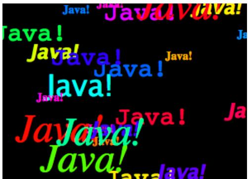

There is one problem with the way this class works. When the panel’s paintComponent() method is called, it chooses random colors, fonts, and locations for the messages. The information about which colors, fonts, and locations are used is not stored anywhere. The next time paintComponent() is called, it will make diferent random choices and will draw a diferent picture. For this particular applet, the problem only really appears when the panel is partially covered and then uncovered (and even then the problem does not show up in all environments). It is possible that only the part that was covered will be redrawn, and in the part that’s not redrawn, the old picture will remain. The user might see partial messages, cut of by the dividing line between the new picture and the old. A better approach would be to compute the contents of the picture elsewhere, outside the paintComponent() method. Information about the picture should be stored in instance variables, and the paintComponent() method should use that information to draw the picture. If paintComponent() is called twice, it should draw the same picture twice, unless the data has changed in the meantime. Unfortunately, to store the data for the picture in this applet, we would need to use either arrays, which will not be covered until Chapter 7, or of-screen images, which will not be covered until Chapter 12. Other examples in this chapter will sufer from the same problem.

The source for the panel class is shown below. I use an instance variable called message to hold the message that the panel will display. There are five instance variables of type Font that represent diferent sizes and styles of text. These variables are initialized in the constructor and are used in the paintComponent() method.

The paintComponent() method for the panel simply draws 25 copies of the message. For each copy, it chooses one of the five fonts at random, and it calls g.setFont() to select that font for drawing the text. It creates a random HSB color and uses g.setColor() to select that color for drawing. It then chooses random (x,y) coordinates for the location of the message. The x coordinate gives the horizontal position of the left end of the string. The formula used for the x coordinate, “-50 + (int)(Math.random() \* (width+40))” gives a random integer in the range from -50 to width-10. This makes it possible for the string to extend beyond the left edge or the right edge of the panel. Similarly, the formula for y allows the string to extend beyond the top and bottom of the applet.

Here is the complete source code for the RandomStringsPanel

import java.awt.Color;

import java.awt.Font;

import java.awt.Graphics;

import javax.swing.JPanel;

/\*\*

\* This panel displays 25 copies of a message. The color and

\* position of each message is selected at random. The font

```java
* of each message is randomly chosen from among five possible
* fonts.  The messages are displayed on a black background.
* <p>Note:  The style of drawing used here is bad, because every
* time the paintComponent() method is called, new random values are
* used.  This means that a different picture will be drawn each
* time.  This is particularly bad if only part of the panel
* needs to be redrawn, since then the panel will contain
* cut-off pieces of messages.
* <p>This panel is meant to be used as the content pane in
* either an applet or a frame.
*/
public class RandomStringsPanel extends JPanel {
    private String message;  // The message to be displayed.  This can be set in
                          // the constructor.  If no value is provided in the
                          // constructor, then the string "Java!" is used.
    private Font font1, font2, font3, font4, font5;  // The five fonts.
    /**
     * Default constructor creates a panel that displays the message "Java!".
     *
     */
    public RandomStringsPanel() {
        this(null);  // Call the other constructor, with parameter null.
    }

    /**
     * Constructor creates a panel to display 25 copies of a specified message.
     * @param messageString The message to be displayed.  If this is null,
     * then the default message "Java!" is displayed.
     */
    public RandomStringsPanel(String messageString) {

        message = messageString;
        if (message == null)
            message = "Java!";

        font1 = new Font("Serif", Font.BOLD, 14);
        font2 = new Font("SansSerif", Font.BOLD + Font.ITALIC, 24);
        font3 = new Font("Monospaced", Font.PLAIN, 30);
        font4 = new Font("Dialog", Font.PLAIN, 36);
        font5 = new Font("Serif", Font.ITALIC, 48);

        setBackground(Color.BLACK);
    }

    /**
     * The paintComponent method is responsible for drawing the content of the panel.
     * It draws 25 copies of the message string, using a random color, font, and
     * position for each string.
     */
    public void paintComponent(Graphics g) {
        super.paintComponent(g);  // Call the paintComponent method from the
                          // superclass, JPanel.  This simply fills the
                          // entire panel with the background color, black.
```

```javascript
int width = getWidth();
int height = getHeight();

for (int i = 0; i < 25; i++) {
    // Draw one string. First, set the font to be one of the five
    // available fonts, at random.

    int fontNum = (int)(5*Math.random()) + 1;
    switch (fontNum) {
        case 1:
            g.setFont(font1);
            break;
        case 2:
            g.setFont(font2);
            break;
        case 3:
            g.setFont(font3);
            break;
        case 4:
            g.setFont(font4);
            break;
        case 5:
            g.setFont(font5);
            break;
    } // end switch

    // Set the color to a bright, saturated color, with random hue.
    float hue = (float)Math.random();
    g.setColor( Color.getHSBColor(hue, 1.0F, 1.0F) );

    // Select the position of the string, at random.

    int x,y;
    x = -50 + (int)(Math.random()*(width+40));
    y = (int)(Math.random()*(height+20));

    // Draw the message.

    g.drawString(message,x,y);
} // end for
} // end paintComponent()

// end class RandomStringsPanel
defines a panel, which is not something that can stand on its own. To see it where we have to use it in an applet or a frame. Here is a simple applet class that contains stringsPanel as its content pane:
```

```typescript
import javax.swing.JApplet;
```

\* A RandomStringsApplet displays 25 copies of a string, using random colors,

```java
* The actual content of the applet is an object of type RandomStringsPanel.
*/
public class RandomStringsApplet extends JApplet {

    public void init() {
        String message = getParameter("message");
        RandomStringsPanel content = new RandomStringsPanel(message);
        setContentPane(content);
    }

}
```

Note that the message to be displayed in the applet can be set using an applet parameter when the applet is added to an HTML document. Using applets on Web pages was discussed in Subsection 6.2.4. Remember that to use the applet on a Web page, you must include both the panel class file, RandomStringsPanel.class, and the applet class file, RandomStringsApplet.class, in the same directory as the HTML document (or, alternatively, bundle the two class files into a jar file, and put the jar file in the document directory).

Instead of writing an applet, of course, we could use the panel in the window of a standalone application. You can find the source code for a main program that does this in the file RandomStringsApp.java.

## 6.4 Mouse Events

Events are central to programming for a graphical user interface. A GUI program doesn’t have a main() routine that outlines what will happen when the program is run, in a step-by-step process from beginning to end. Instead, the program must be prepared to respond to various kinds of events that can happen at unpredictable times and in an order that the program doesn’t control. The most basic kinds of events are generated by the mouse and keyboard. The user can press any key on the keyboard, move the mouse, or press a button on the mouse. The user can do any of these things at any time, and the computer has to respond appropriately.

In Java, events are represented by objects. When an event occurs, the system collects all the information relevant to the event and constructs an object to contain that information. Diferent types of events are represented by objects belonging to diferent classes. For example, when the user presses one of the buttons on a mouse, an object belonging to a class called MouseEvent is constructed. The object contains information such as the source of the event (that is, the component on which the user clicked), the (x,y) coordinates of the point in the component where the click occurred, and which button on the mouse was pressed. When the user presses a key on the keyboard, a KeyEvent is created. After the event object is constructed, it is passed as a parameter to a designated subroutine. By writing that subroutine, the programmer says what should happen when the event occurs.

As a Java programmer, you get a fairly high-level view of events. There is a lot of processing that goes on between the time that the user presses a key or moves the mouse and the time that a subroutine in your program is called to respond to the event. Fortunately, you don’t need to know much about that processing. But you should understand this much: Even though your GUI program doesn’t have a main() routine, there is a sort of main routine running somewhere that executes a loop of the form

```txt
while the program is still running:
    Wait for the next event to occur
    Call a subroutine to handle the event
```

This loop is called an event loop. Every GUI program has an event loop. In Java, you don’t have to write the loop. It’s part of “the system.” If you write a GUI program in some other language, you might have to provide a main routine that runs an event loop.

In this section, we’ll look at handling mouse events in Java, and we’ll cover the framework for handling events in general. The next section will cover keyboard-related events and timer events. Java also has other types of events, which are produced by GUI components. These will be introduced in Section 6.6.

## 6.4.1 Event Handling

For an event to have any efect, a program must detect the event and react to it. In order to detect an event, the program must “listen” for it. Listening for events is something that is done by an object called an event listener. An event listener object must contain instance methods for handling the events for which it listens. For example, if an object is to serve as a listener for events of type MouseEvent, then it must contain the following method (among several others):

public void mousePressed(MouseEvent evt) { . . . }

The body of the method defines how the object responds when it is notified that a mouse button has been pressed. The parameter, evt, contains information about the event. This information can be used by the listener object to determine its response.

The methods that are required in a mouse event listener are specified in an interface named MouseListener. To be used as a listener for mouse events, an object must implement this MouseListener interface. Java interfaces were covered in Subsection 5.7.1. (To review briefly: An interface in Java is just a list of instance methods. A class can “implement” an interface by doing two things. First, the class must be declared to implement the interface, as in “class MyListener implements MouseListener” or “class MyApplet extends JApplet implements MouseListener”. Second, the class must include a definition for each instance method specified in the interface. An interface can be used as the type for a variable or formal parameter. We say that an object implements the MouseListener interface if it belongs to a class that implements the MouseListener interface. Note that it is not enough for the object to include the specified methods. It must also belong to a class that is specifically declared to implement the interface.)

Many events in Java are associated with GUI components. For example, when the user presses a button on the mouse, the associated component is the one that the user clicked on. Before a listener object can “hear” events associated with a given component, the listener object must be registered with the component. If a MouseListener object, mListener, needs to hear mouse events associated with a Component object, comp, the listener must be registered with the component by calling “comp.addMouseListener(mListener);”. The addMouseListener() method is an instance method in class Component, and so can be used with any GUI component object. In our first few examples, we will listen for events on a JPanel that is being used as a drawing surface.

The event classes, such as MouseEvent, and the listener interfaces, such as MouseListener, are defined in the package java.awt.event. This means that if you want to work with events, you should either include the line “import java.awt.event.\*;” at the beginning of your source code file or import the individual classes and interfaces.

Admittedly, there is a large number of details to tend to when you want to use events. To summarize, you must

1. Put the import specification “import java.awt.event.\*;” (or individual imports) at the beginning of your source code;

2. Declare that some class implements the appropriate listener interface, such as MouseListener;

3. Provide definitions in that class for the subroutines from the interface;

4. Register the listener object with the component that will generate the events by calling a method such as addMouseListener() in the component.

Any object can act as an event listener, provided that it implements the appropriate interface. A component can listen for the events that it itself generates. A panel can listen for events from components that are contained in the panel. A special class can be created just for the purpose of defining a listening object. Many people consider it to be good form to use anonymous inner classes to define listening objects (see Subsection 5.7.3). You will see all of these patterns in examples in this textbook.

## 6.4.2 MouseEvent and MouseListener

The MouseListener interface specifies five diferent instance methods:

public void mousePressed(MouseEvent evt);

public void mouseReleased(MouseEvent evt);

public void mouseClicked(MouseEvent evt);

public void mouseEntered(MouseEvent evt);

public void mouseExited(MouseEvent evt);

The mousePressed method is called as soon as the user presses down on one of the mouse buttons, and mouseReleased is called when the user releases a button. These are the two methods that are most commonly used, but any mouse listener object must define all five methods; you can leave the body of a method empty if you don’t want to define a response. The mouseClicked method is called if the user presses a mouse button and then releases it quickly, without moving the mouse. (When the user does this, all three routines—mousePressed, mouseReleased, and mouseClicked—will be called in that order.) In most cases, you should define mousePressed instead of mouseClicked. The mouseEntered and mouseExited methods are called when the mouse cursor enters or leaves the component. For example, if you want the component to change appearance whenever the user moves the mouse over the component, you could define these two methods.

As an example, we will look at a small addition to the RandomStringsPanel example from the previous section. In the new version, the panel will repaint itself when the user clicks on it. In order for this to happen, a mouse listener should listen for mouse events on the panel, and when the listener detects a mousePressed event, it should respond by calling the repaint() method of the panel.

For the new version of the program, we need an object that implements the MouseListener interface. One way to create the object is to define a separate class, such as:

```java
import java.awt.Component;
import java.awt.event.*;

/**
 * An object of type RepaintOnClick is a MouseListener that
 * will respond to a mousePressed event by calling the repaint()
 * method of the source of the event.  That is, a RepaintOnClick
```

```java
* object can be added as a mouse listener to any Component;
* when the user clicks that component, the component will be
* repainted.
*/
public class RepaintOnClick implements MouseListener {

    public void mousePressed(MouseEvent evt) {
        Component source = (Component)evt.getSource();
        source.repaint();  // Call repaint() on the Component that was clicked.
    }

    public void mouseClicked(MouseEvent evt) { }
    public void mouseReleased(MouseEvent evt) { }
    public void mouseEntered(MouseEvent evt) { }
    public void mouseExited(MouseEvent evt) { }

}
```

This class does three of the four things that we need to do in order to handle mouse events: First, it imports java.awt.event.\* for easy access to event-related classes. Second, it is declared that the class “implements MouseListener”. And third, it provides definitions for the five methods that are specified in the MouseListener interface. (Note that four of the five event-handling methods have empty defintions. We really only want to define a response to mousePressed events, but in order to implement the MouseListener interface, a class must define all five methods.)

We must do one more thing to set up the event handling for this example: We must register an event-handling object as a listener with the component that will generate the events. In this case, the mouse events that we are interested in will be generated by an object of type RandomStringsPanel. If panel is a variable that refers to the panel object, we can create a mouse listener object and register it with the panel with the statements:

```javascript
RepaintOnClick listener = new RepaintOnClick(); // Create MouseListener object.
panel.addMouseListener(listener); // Register MouseListener with the panel.
```

Once this is done, the listener object will be notified of mouse events on the panel. When a mousePressed event occurs, the mousePressed() method in the listener will be called. The code in this method calls the repaint() method in the component that is the source of the event, that is, in the panel. The result is that the RandomStringsPanel is repainted with its strings in new random colors, fonts, and positions.

Although we have written the RepaintOnClick class for use with our RandomStringsPanel example, the event-handling class contains no reference at all to the RandomStringsPanel class. How can this be? The mousePressed() method in class RepaintOnClick looks at the source of the event, and calls its repaint() method. If we have registered the RepaintOnClick object as a listener on a RandomStringsPanel, then it is that panel that is repainted. But the listener object could be used with any type of component, and it would work in the same way.

Similarly, the RandomStringsPanel class contains no reference to the RepaintOnClick class— in fact, RandomStringsPanel was written before we even knew anything about mouse events! The panel will send mouse events to any object that has registered with it as a mouse listener. It does not need to know anything about that object except that it is capable of receiving mouse events.

The relationship between an object that generates an event and an object that responds to that event is rather loose. The relationship is set up by registering one object to listen for events from the other object. This is something that can potentially be done from outside both objects. Each object can be developed independently, with no knowledge of the internal operation of the other object. This is the essence of modular design: Build a complex system out of modules that interact only in straightforward, easy to understand ways. Then each module is a separate design problem that can be tackled independently.

To make this clearer, consider the application version of the ClickableRandomStrings program. I have included RepaintOnClick as a nested class, although it could just as easily be a separate class. The main point is that this program uses the same RandomStringsPanel class that was used in the original program, which did not respond to mouse clicks. The mouse handling has been “bolted on” to an existing class, without having to make any changes at all to that class:

```java
import java.awt.Component;
import java.awt.event.MouseEvent;
import java.awt.event.MouseListener;
import javax.swing.JFrame;

/**
 * Displays a window that shows 25 copies of the string "Java!" in
 * random colors, fonts, and positions. The content of the window
 * is an object of type RandomStringsPanel. When the user clicks
 * the window, the content of the window is repainted, with the
 * strings in newly selected random colors, fonts, and positions.
 */
public class ClickableRandomStringsApp {

    public static void main(String[] args) {
        JFrame window = new JFrame("Random Strings");
        RandomStringsPanel content = new RandomStringsPanel();
        content.addMouseListener( new RepaintOnClick() ); // Register mouse listener.
        window.setContentPane(content);
        window.setDefaultCloseOperation(JFrame.EXIT_ON_CLOSE);
        window.setLocation(100,75);
        window.setSize(300,240);
        window.setVisible(true);
    }

    private static class RepaintOnClick implements MouseListener {

        public void mousePressed(MouseEvent evt) {
            Component source = (Component)evt.getSource();
            source.repaint();
        }

        public void mouseClicked(MouseEvent evt) { }
        public void mouseReleased(MouseEvent evt) { }
        public void mouseEntered(MouseEvent evt) { }
        public void mouseExited(MouseEvent evt) { }

    }
}
```

## 6.4.3 Mouse Coordinates

Often, when a mouse event occurs, you want to know the location of the mouse cursor. This information is available from the MouseEvent parameter to the event-handling method, which contains instance methods that return information about the event. If evt is the parameter, then you can find out the coordinates of the mouse cursor by calling evt.getX() and evt.getY(). These methods return integers which give the x and y coordinates where the mouse cursor was positioned at the time when the event occurred. The coordinates are expressed in the coordinate system of the component that generated the event, where the top left corner of the component is (0,0).

The user can hold down certain modifier keys while using the mouse. The possible mod ifier keys include: the Shift key, the Control key, the ALT key (called the Option key on the Macintosh), and the Meta key (called the Command or Apple key on the Macintosh). You might want to respond to a mouse event diferently when the user is holding down a modi fier key. The boolean-valued instance methods evt.isShiftDown(), evt.isControlDown(), evt.isAltDown(), and evt.isMetaDown() can be called to test whether the modifier keys are pressed.

You might also want to have diferent responses depending on whether the user presses the left mouse button, the middle mouse button, or the right mouse button. Now, not every mouse has a middle button and a right button, so Java handles the information in a peculiar way. It treats pressing the right button as equivalent to holding down the Meta key while pressing the left mouse button. That is, if the right button is pressed, then the instance method evt.isMetaDown() will return true (even if the Meta key is not pressed). Similarly, pressing the middle mouse button is equivalent to holding down the ALT key. In practice, what this really means is that pressing the right mouse button under Windows is equivalent to holding down the Command key while pressing the mouse button on Macintosh. A program tests for either of these by calling evt.isMetaDown().

As an example, consider a JPanel that does the following: Clicking on the panel with the left mouse button will place a red rectangle on the panel at the point where the mouse was clicked. Clicking with the right mouse button (or holding down the Command key while clicking on a Macintosh) will place a blue oval on the applet. Holding down the Shift key while clicking will clear the panel by removing all the shapes that have been placed.

There are several ways to write this example. I could write a separate class to handle mouse events, as I did in the previous example. However, in this case, I decided to let the panel respond to mouse events itself. Any object can be a mouse listener, as long as it imple ments the MouseListener interface. In this case, the panel class implements the MouseListener interface, so any object belonging to that class can act as a mouse listener. The constructor for the panel class registers the panel with itself as a mouse listener. It does this with the statement “addMouseListener(this)”. Since this command is in a method in the panel class, the addMouseListener() method in the panel object is being called, and a listener is being registered with that panel. The parameter “this” also refers to the panel object, so it is the same panel object that is listening for events. Thus, the panel object plays a dual role here. (If you find this too confusing, remember that you can always write a separate class to define the listening object.)

The source code for the panel class is shown below. You should check how the instance methods in the MouseEvent object are used. You can also check for the Four Steps of Event Handling (“import java.awt.event.\*”, “implements MouseListener”, definitions for the event-handling methods, and “addMouseListener”):

```java
import java.awt.*;
import java.awt.event.*;
import javax.swing.*;

/**
 * A simple demonstration of MouseEvents.  Shapes are drawn
 * on a black background when the user clicks the panel  If
 * the user Shift-clicks, the applet is cleared.  If the user
 * right-clicks the applet, a blue oval is drawn.  Otherwise,
 * when the user clicks, a red rectangle is drawn.  The contents of
 * the panel are not persistent.  For example, they might disappear
 * if the panel is covered and uncovered.
 */
public class SimpleStamperPanel extends JPanel implements MouseListener {

    /**
     * This constructor simply sets the background color of the panel to be black
     * and sets the panel to listen for mouse events on itself.
     */
    public SimpleStamperPanel() {
        setBackground(Color.BLACK);
        addMouseListener(this);
    }

    /**
     * Since this panel has been set to listen for mouse events on itself,
     * this method will be called when the user clicks the mouse on the panel.
     * This method is part of the MouseListener interface.
     */
    public void mousePressed(MouseEvent evt) {

        if ( evt.isShiftDown() ) {
            // The user was holding down the Shift key.  Just repaint the panel.
            // Since this class does not define a paintComponent() method, the
            // method from the superclass, JPanel, is called.  That  method simply
            // fills the panel with its background color, which is black.  The
            // effect is to clear the panel.
            repaint();
            return;
        }

        int x = evt.getX();  // x-coordinate where user clicked.
        int y = evt.getY();  // y-coordinate where user clicked.

        Graphics g = getGraphics();  // Graphics context for drawing directly.
                                    // NOTE:  This is considered to be bad style!

        if ( evt.isMetaDown() ) {
            // User right-clicked at the point (x,y). Draw a blue oval centered
            // at the point (x,y). (A black outline around the oval will make it
            // more distinct when ovals and rects overlap.)
            g.setColor(Color.BLUE);  // Blue interior.
            g.fillOval( x - 30, y - 15, 60, 30 );
            g.setColor(Color.BLACK); // Black outline.
            g.drawOval( x - 30, y - 15, 60, 30 );
        }
    }
}
```

```txt
else {
    // User left-clicked (or middle-clicked) at (x,y).
    // Draw a red rectangle centered at (x,y).
    g.setColor(Color.RED);   // Red interior.
    g.fillRect( x - 30, y - 15, 60, 30 );
    g.setColor(Color.BLACK); // Black outline.
    g.drawRect( x - 30, y - 15, 60, 30 );
}
```

g.dispose(); // We are finished with the graphics context, so dispose of it. } // end mousePressed();

```txt
// The next four empty routines are required by the MouseListener interface.
// Since they don't do anything in this class, so their definitions are empty.
```

```java
public void mouseEntered(MouseEvent evt) { }
public void mouseExited(MouseEvent evt) { }
public void mouseClicked(MouseEvent evt) { }
public void mouseReleased(MouseEvent evt) { }
```

```javascript
} // end class SimpleStamperPanel
```

Note, by the way, that this class violates the rule that all drawing should be done in a paintComponent() method. The rectangles and ovals are drawn directly in the mousePressed() routine. To make this possible, I need to obtain a graphics context by saying “g = getGraphics()”. After using g for drawing, I call g.dispose() to inform the operating system that I will no longer be using g for drawing. It is a good idea to do this to free the system resources that are used by the graphics context. I do not advise doing this type of direct drawing if it can be avoided, but you can see that it does work in this case, and at this point we really have no other way to write this example.

## 6.4.4 MouseMotionListeners and Dragging

Whenever the mouse is moved, it generates events. The operating system of the computer detects these events and uses them to move the mouse cursor on the screen. It is also possible for a program to listen for these “mouse motion” events and respond to them. The most common reason to do so is to implement dragging. Dragging occurs when the user moves the mouse while holding down a mouse button.

The methods for responding to mouse motion events are defined in an interface named MouseMotionListener. This interface specifies two event-handling methods:

public void mouseDragged(MouseEvent evt);

public void mouseMoved(MouseEvent evt);

The mouseDragged method is called if the mouse is moved while a button on the mouse is pressed. If the mouse is moved while no mouse button is down, then mouseMoved is called instead. The parameter, evt, is an object of type MouseEvent. It contains the x and y coordinates of the mouse’s location. As long as the user continues to move the mouse, one of these methods will be called over and over. (So many events are generated that it would be ineficient for a program to hear them all, if it doesn’t want to do anything in response. This is why the mouse motion event-handlers are defined in a separate interface from the other mouse events: You can listen for the mouse events defined in MouseListener without automatically hearing all mouse motion events as well.)

If you want your program to respond to mouse motion events, you must create an object that implements the MouseMotionListener interface, and you must register that object to listen for events. The registration is done by calling a component’s addMouseMotionListener method. The object will then listen for mouseDragged and mouseMoved events associated with that component. In most cases, the listener object will also implement the MouseListener interface so that it can respond to the other mouse events as well.

To get a better idea of how mouse events work, you should try the SimpleTrackMouseApplet in the on-line version of this section. The applet is programmed to respond to any of the seven diferent kinds of mouse events by displaying the coordinates of the mouse, the type of event, and a list of the modifier keys that are down (Shift, Control, Meta, and Alt). You can experiment with the applet to see what happens when you use the mouse on the applet. (Alternatively, you could run the stand-alone application version of the program, SimpleTrackMouse.java.)

The source code for the applet can be found in SimpleTrackMousePanel.java, which defines the panel that is used as the content pane of the applet, and in SimpleTrackMouseApplet.java, which defines the applet class. The panel class includes a nested class, MouseHandler, that defines the mouse-handling object. I encourage you to read the source code. You should now be familiar with all the techniques that it uses.

It is interesting to look at what a program needs to do in order to respond to dragging operations. In general, the response involves three methods: mousePressed(), mouseDragged(), and mouseReleased(). The dragging gesture starts when the user presses a mouse button, it continues while the mouse is dragged, and it ends when the user releases the button. This means that the programming for the response to one dragging gesture must be spread out over the three methods! Furthermore, the mouseDragged() method can be called many times as the mouse moves. To keep track of what is going on between one method call and the next, you need to set up some instance variables. In many applications, for example, in order to process a mouseDragged event, you need to remember the previous coordinates of the mouse. You can store this information in two instance variables prevX and prevY of type int. It can also be useful to save the starting coordinates, where the mousePressed event occurred, in instance variables. I also suggest having a boolean variable, dragging, which is set to true while a dragging gesture is being processed. This is necessary because not every mousePressed event starts a dragging operation to which you want to respond. The mouseDragged and mouseReleased methods can use the value of dragging to check whether a drag operation is actually in progress. You might need other instance variables as well, but in general outline, a class that handles mouse dragging looks like this:

import java.awt.event.\*;

public class MouseDragHandler implements MouseListener, MouseMotionListener {

```txt
private int startX, startY; // Point where mouse is pressed.
private int prevX, prevY;   // Most recently processed mouse coords.
private boolean dragging;   // Set to true when dragging is in process.
. . . // other instance variables for use in dragging

public void mousePressed(MouseEvent evt) {
    if ( we-want-to-start-dragging ) {
        dragging = true;
        startX = evt.getX();  // Remember starting position.
        startY = evt.getY();
        prevX = startX;      // Remember most recent coords.
        prevY = startY;
```

```lisp
.
    . // Other processing.
    .
}
}

public void mouseDragged(MouseEvent evt) {
    if ( dragging == false )  // First, check if we are
        return;            //   processing a dragging gesture.
    int x = evt.getX(); // Current position of Mouse.
    int y = evt.getY();
    .
    . // Process a mouse movement from (prevX, prevY) to (x,y).
    .
    prevX = x;  // Remember the current position for the next call
    prevY = y;
}

public void mouseReleased(MouseEvent evt) {
    if ( dragging == false )  // First, check if we are
        return;            //   processing a dragging gesture.
    dragging = false;  // We are done dragging.
    .
    . // Other processing and clean-up.
    .
}
}
```

As an example, let’s look at a typical use of dragging: allowing the user to sketch a curve by dragging the mouse. This example also shows many other features of graphics and mouse processing. In the program, you can draw a curve by dragging the mouse on a large white drawing area, and you can select a color for drawing by clicking on one of several colored rectangles to the right of the drawing area. The complete source code can be found in SimplePaint.java, which can be run as a stand-alone application, and you can find an applet version in the on-line version of this section. Here is a picture of the program:


I will discuss a few aspects of the source code here, but I encourage you to read it carefully in its entirety. There are lots of informative comments in the source code. (The source code uses one unusual technique: It defines a subclass of JApplet, but it also includes a main() routine. The main() routine has nothing to do with the class’s use as an applet, but it makes it possible to run the class as a stand-alone application. When this is done, the application opens a window that shows the same panel that would be shown in the applet version. This example thus shows how to write a single file that can be used either as a stand-alone application or as an applet.)

The panel class for this example is designed to work for any reasonable size, that is, unless the panel is too small. This means that coordinates are computed in terms of the actual width and height of the panel. (The width and height are obtained by calling getWidth() and getHeight().) This makes things quite a bit harder than they would be if we assumed some particular fixed size for the panel. Let’s look at some of these computations in detail. For example, the large white drawing area extends from y = 3 to y = height - 3 vertically and from x = 3 to x = width - 56 horizontally. These numbers are needed in order to interpret the meaning of a mouse click. They take into account a gray border around the panel and the color palette along the right edge of the panel. The border is 3 pixels wide. The colored rectangles are 50 pixels wide. Together with the 3-pixel border around the panel and a 3-pixel divider between the drawing area and the colored rectangles, this adds up to put the right edge of the drawing area 56 pixels from the right edge of the panel.

A white square labeled “CLEAR” occupies a 50-by-50 pixel region beneath the colored rectangles on the right edge of the panel. Allowing for this square, we can figure out how much vertical space is available for the seven colored rectangles, and then divide that space by 7 to get the vertical space available for each rectangle. This quantity is represented by a variable, colorSpace. Out of this space, 3 pixels are used as spacing between the rectangles, so the height of each rectangle is colorSpace - 3. The top of the N-th rectangle is located (N\*colorSpace + 3) pixels down from the top of the panel, assuming that we count the rectangles starting with zero. This is because there are N rectangles above the N-th rectangle, each of which uses colorSpace pixels. The extra 3 is for the border at the top of the panel. After all that, we can write down the command for drawing the N-th rectangle:

g.fillRect(width - 53, N\*colorSpace + 3, 50, colorSpace - 3);

That was not easy! But it shows the kind of careful thinking and precision graphics that are sometimes necessary to get good results.

The mouse in this panel is used to do three diferent things: Select a color, clear the drawing, and draw a curve. Only the third of these involves dragging, so not every mouse click will start a dragging operation. The mousePressed routine has to look at the (x,y) coordinates where the mouse was clicked and decide how to respond. If the user clicked on the CLEAR rectangle, the drawing area is cleared by calling repaint(). If the user clicked somewhere in the strip of colored rectangles, the selected color is changed. This involves computing which color the user clicked on, which is done by dividing the y coordinate by colorSpace. Finally, if the user clicked on the drawing area, a drag operation is initiated. A boolean variable, dragging, is set to true so that the mouseDragged and mouseReleased methods will know that a curve is being drawn. The code for this follows the general form given above. The actual drawing of the curve is done in the mouseDragged method, which draws a line from the previous location of the mouse to its current location. Some efort is required to make sure that the line does not extend beyond the white drawing area of the panel. This is not automatic, since as far as the computer is concerned, the border and the color bar are part of the drawing surface. If the user drags the mouse outside the drawing area while drawing a line, the mouseDragged routine changes the x and y coordinates to make them lie within the drawing area.

## 6.4.5 Anonymous Event Handlers

As I mentioned above, it is a fairly common practice to use anonymous nested classes to define listener objects. As discussed in Subsection 5.7.3, a special form of the new operator is used to create an object that belongs to an anonymous class. For example, a mouse listener object can be created with an expression of the form:

```java
new MouseListener() {
    public void mousePressed(MouseEvent evt) { . . . }
    public void mouseReleased(MouseEvent evt) { . . . }
    public void mouseClicked(MouseEvent evt) { . . . }
    public void mouseEntered(MouseEvent evt) { . . . }
    public void mouseExited(MouseEvent evt) { . . . }
}
```

This is all just one long expression that both defines an un-named class and creates an object that belongs to that class. To use the object as a mouse listener, it should be passed as the parameter to some component’s addMouseListener() method in a command of the form:

```java
component.addMouseListener( new MouseListener() {
    public void mousePressed(MouseEvent evt) { . . . }
    public void mouseReleased(MouseEvent evt) { . . . }
    public void mouseClicked(MouseEvent evt) { . . . }
    public void mouseEntered(MouseEvent evt) { . . . }
    public void mouseExited(MouseEvent evt) { . . . }
} );
```

Now, in a typical application, most of the method definitions in this class will be empty. A class that implements an interface must provide definitions for all the methods in that interface, even if the definitions are empty. To avoid the tedium of writing empty method definitions in cases like this, Java provides adapter classes. An adapter class implements a listener interface by providing empty definitions for all the methods in the interface. An adapter class is useful only as a basis for making subclasses. In the subclass, you can define just those methods that you actually want to use. For the remaining methods, the empty definitions that are provided by the adapter class will be used. The adapter class for the MouseListener interface is named MouseAdapter. For example, if you want a mouse listener that only responds to mouse-pressed events, you can use a command of the form:

```java
component.addMouseListener( new MouseAdapter() {
    public void mousePressed(MouseEvent evt) { . . . }
} );
```

To see how this works in a real example, let’s write another version of the ClickableRandomStringsApp application from Subsection 6.4.2. This version uses an anonymous class based on MouseAdapter to handle mouse events:

```java
import java.awt.Component;
import java.awt.event.MouseEvent;
import java.awt.event.MouseListener;
import javax.swing.JFrame;

public class ClickableRandomStringsApp {
```

```java
public static void main(String[] args) {
    JFrame window = new JFrame("Random Strings");
    RandomStringsPanel content = new RandomStringsPanel();

    content.addMouseListener(new MouseAdapter() {
        // Register a mouse listener that is defined by an anonymous subclass
        // of MouseAdapter.  This replaces the RepaintOnClick class that was
        // used in the original version.
        public void mousePressed(MouseEvent evt) {
            Component source = (Component)evt.getSource();
            source.repaint();
        }
    } );

    window.setContentPane(content);
    window.setDefaultCloseOperation(JFrame.EXIT_ON_CLOSE);
    window.setLocation(100,75);
    window.setSize(300,240);
    window.setVisible(true);
}
```

Anonymous inner classes can be used for other purposes besides event handling. For example, suppose that you want to define a subclass of JPanel to represent a drawing surface. The subclass will only be used once. It will redefine the paintComponent() method, but will make no other changes to JPanel. It might make sense to define the subclass as an anonymous nested class. As an example, I present HelloWorldGUI4.java. This version is a variation of HelloWorldGUI2.java that uses anonymous nested classes where the original program uses ordinary, named nested classes:

```java
import java.awt.*;
import java.awt.event.*;
import javax.swing.*;

/**
 * A simple GUI program that creates and opens a JFrame containing
 * the message "Hello World" and an "OK" button.  When the user clicks
 * the OK button, the program ends.  This version uses anonymous
 * classes to define the message display panel and the action listener
 * object.  Compare to HelloWorldGUI2, which uses nested classes.
 */
public class HelloWorldGUI4 {

    /**
     * The main program creates a window containing a HelloWorldDisplay
     * and a button that will end the program when the user clicks it.
     */
    public static void main(String[] args) {

        JPanel displayPanel = new JPanel() {
            // An anonymous subclass of JPanel that displays "Hello World!".
        public void paintComponent(Graphics g) {
            super.paintComponent(g);
            g.drawString( "Hello World!", 20, 30 );
        }
    }
}
```

```java
};
JButton okButton = new JButton("OK");
okButton.addActionListener(new ActionListener() {
    // An anonymous class that defines the listener object.
    public void actionPerformed(ActionEvent e) {
        System.exit(0);
    }
} );

JPanel content = new JPanel();
content.setLayout(new BorderLayout());
content.add(displayPanel, BorderLayout.CENTER);
content.add(okButton, BorderLayout.SOUTH);

JFrame window = new JFrame("GUI Test");
window.setContentPane(content);
window.setSize(250,100);
window.setLocation(100,100);
window.setVisible(true);

}
}
```

## 6.5 Timer and Keyboard Events

Not every event is generated by an action on the part of the user. Events can also be generated by objects as part of their regular programming, and these events can be monitored by other objects so that they can take appropriate actions when the events occur. One example of this is the class javax.swing.Timer. A Timer generates events at regular intervals. These events can be used to drive an animation or to perform some other task at regular intervals. We will begin this section with a look at timer events and animation. We will then look at another type of basic user-generated event: the KeyEvents that are generated when the user types on the keyboard. The example at the end of the section uses both a timer and keyboard events to implement a simple game.

## 6.5.1 Timers and Animation

An object belonging to the class javax.swing.Timer exists only to generate events. A Timer, by default, generates a sequence of events with a fixed delay between each event and the next. (It is also possible to set a Timer to emit a single event after a specified time delay; in that case, the timer is being used as an “alarm.”) Each event belongs to the class ActionEvent. An object that is to listen for the events must implement the interface ActionListener, which defines just one method:

## public void actionPerformed(ActionEvent evt)

To use a Timer, you must create an object that implements the ActionListener interface. That is, the object must belong to a class that is declared to “implement ActionListener”, and that class must define the actionPerformed method. Then, if the object is set to listen for events from the timer, the code in the listener’s actionPerformed method will be executed every time the timer generates an event.

Since there is no point to having a timer without having a listener to respond to its events, the action listener for a timer is specified as a parameter in the timer’s constructor. The time delay between timer events is also specified in the constructor. If timer is a variable of type Timer, then the statement

```javascript
timer = new Timer( millisDelay, listener );
```

creates a timer with a delay of millisDelay milliseconds between events (where 1000 milliseconds equal one second). Events from the timer are sent to the listener. (millisDelay must be of type int, and listener must be of type ActionListener.) Note that a timer is not guaranteed to deliver events at precisely regular intervals. If the computer is busy with some other task, an event might be delayed or even dropped altogether.

A timer does not automatically start generating events when the timer object is created. The start() method in the timer must be called to tell the timer to start generating events. The timer’s stop() method can be used to turn the stream of events of—it can be restarted by calling start() again.

## ∗ ∗ ∗

One application of timers is computer animation. A computer animation is just a sequence of still images, presented to the user one after the other. If the time between images is short, and if the change from one image to another is not too great, then the user perceives continuous motion. The easiest way to do animation in Java is to use a Timer to drive the animation. Each time the timer generates an event, the next frame of the animation is computed and drawn on the screen—the code that implements this goes in the actionPerformed method of an object that listens for events from the timer.

Our first example of using a timer is not exactly an animation, but it does display a new image for each timer event. The program shows randomly generated images that vaguely resemble works of abstract art. In fact, the program draws a new random image every time its paintComponent() method is called, and the response to a timer event is simply to call repaint(), which in turn triggers a call to paintComponent. The work of the program is done in a subclass of JPanel, which starts like this:

```java
import java.awt.*;
import java.awt.event.*;
import javax.swing.*;

public class RandomArtPanel extends JPanel {
```

\* A RepaintAction object calls the repaint method of this panel each

\* time its actionPerformed() method is called. An object of this

\* type is used as an action listener for a Timer that generates an

\* ActionEvent every four seconds. The result is that the panel is

\* redrawn every four seconds.

private class RepaintAction implements ActionListener {

```java
/**
 * The constructor creates a timer with a delay time of four seconds
 * (4000 milliseconds), and with a RepaintAction object as its
 * ActionListener.  It also starts the timer running.
 */
public RandomArtPanel() {
    RepaintAction action = new RepaintAction();
    Timer timer = new Timer(4000, action);
    timer.start();
}

/**
 * The paintComponent() method fills the panel with a random shade of
 * gray and then draws one of three types of random "art".  The type
 * of art to be drawn is chosen at random.
 */
public void paintComponent(Graphics g) {
    .
    .   // The rest of the class is omitted
    .
```

You can find the full source code for this class in the file RandomArtPanel.java; An application version of the program is RandomArt.java, while the applet version is RandomArtApplet.java. You can see the applet version in the on-line version of this section.

Later in this section, we will use a timer to drive the animation in a simple computer game.

## 6.5.2 Keyboard Events

In Java, user actions become events in a program. These events are associated with GUI components. When the user presses a button on the mouse, the event that is generated is associated with the component that contains the mouse cursor. What about keyboard events? When the user presses a key, what component is associated with the key event that is generated?

A GUI uses the idea of input focus to determine the component associated with keyboard events. At any given time, exactly one interface element on the screen has the input focus, and that is where all keyboard events are directed. If the interface element happens to be a Java component, then the information about the keyboard event becomes a Java object of type KeyEvent, and it is delivered to any listener objects that are listening for KeyEvents associated with that component. The necessity of managing input focus adds an extra twist to working with keyboard events.

It’s a good idea to give the user some visual feedback about which component has the input focus. For example, if the component is the typing area of a word-processor, the feedback is usually in the form of a blinking text cursor. Another common visual clue is to draw a brightly colored border around the edge of a component when it has the input focus, as I do in the examples given later in this section.

A component that wants to have the input focus can call the method requestFocus(), which is defined in the Component class. Calling this method does not absolutely guarantee that the component will actually get the input focus. Several components might request the focus; only one will get it. This method should only be used in certain circumstances in any case, since it can be a rude surprise to the user to have the focus suddenly pulled away from a component that the user is working with. In a typical user interface, the user can choose to give the focus to a component by clicking on that component with the mouse. And pressing the tab key will often move the focus from one component to another.

Some components do not automatically request the input focus when the user clicks on them. To solve this problem, a program has to register a mouse listener with the component to detect user clicks. In response to a user click, the mousePressed() method should call requestFocus() for the component. This is true, in particular, for the components that are used as drawing surfaces in the examples in this chapter. These components are defined as subclasses of JPanel, and JPanel objects do not receive the input focus automatically. If you want to be able to use the keyboard to interact with a JPanel named drawingSurface, you have to register a listener to listen for mouse events on the drawingSurface and call drawingSurface.requestFocus() in the mousePressed() method of the listener object.

As our first example of processing key events, we look at a simple program in which the user moves a square up, down, left, and right by pressing arrow keys. When the user hits the ’R’, ’G’, ’B’, or ’K’ key, the color of the square is set to red, green, blue, or black, respectively. Of course, none of these key events are delivered to the program unless it has the input focus. The panel in the program changes its appearance when it has the input focus: When it does, a cyan-colored border is drawn around the panel; when it does not, a gray-colored border is drawn. Also, the panel displays a diferent message in each case. If the panel does not have the input focus, the user can give the input focus to the panel by clicking on it. The complete source code for this example can be found in the file KeyboardAndFocusDemo.java. I will discuss some aspects of it below. After reading this section, you should be able to understand the source code in its entirety. Here is what the program looks like in its focussed state:


In Java, keyboard event objects belong to a class called KeyEvent. An object that needs to listen for KeyEvents must implement the interface named KeyListener. Furthermore, the object must be registered with a component by calling the component’s addKeyListener() method. The registration is done with the command “component.addKeyListener(listener);” where listener is the object that is to listen for key events, and component is the object that will generate the key events (when it has the input focus). It is possible for component and listener to be the same object. All this is, of course, directly analogous to what you learned about mouse events in the previous section. The KeyListener interface defines the following methods, which must be included in any class that implements KeyListener:

public void keyPressed(KeyEvent evt);

public void keyReleased(KeyEvent evt);

public void keyTyped(KeyEvent evt);

Java makes a careful distinction between the keys that you press and the characters that you type. There are lots of keys on a keyboard: letter keys, number keys, modifier keys such as Control and Shift, arrow keys, page up and page down keys, keypad keys, function keys. In many cases, pressing a key does not type a character. On the other hand, typing a character sometimes involves pressing several keys. For example, to type an uppercase ’A’, you have to press the Shift key and then press the A key before releasing the Shift key. On my Macintosh computer, I can type an accented e, by holding down the Option key, pressing the E key, releasing the Option key, and pressing E again. Only one character was typed, but I had to perform three key-presses and I had to release a key at the right time. In Java, there are three types of KeyEvent. The types correspond to pressing a key, releasing a key, and typing a character. The keyPressed method is called when the user presses a key, the keyReleased method is called when the user releases a key, and the keyTyped method is called when the user types a character. Note that one user action, such as pressing the E key, can be responsible for two events, a keyPressed event and a keyTyped event. Typing an upper case ’A’ can generate two keyPressed, two keyReleased, and one keyTyped event.

Usually, it is better to think in terms of two separate streams of events, one consisting of keyPressed and keyReleased events and the other consisting of keyTyped events. For some applications, you want to monitor the first stream; for other applications, you want to monitor the second one. Of course, the information in the keyTyped stream could be extracted from the keyPressed/keyReleased stream, but it would be dificult (and also system-dependent to some extent). Some user actions, such as pressing the Shift key, can only be detected as keyPressed events. I have a solitaire game on my computer that hilites every card that can be moved, when I hold down the Shift key. You could do something like that in Java by hiliting the cards when the Shift key is pressed and removing the hilite when the Shift key is released.

There is one more complication. Usually, when you hold down a key on the keyboard, that key will auto-repeat. This means that it will generate multiple keyPressed events, as long as it is held down. It can also generate multiple keyTyped events. For the most part, this will not afect your programming, but you should not expect every keyPressed event to have a corresponding keyReleased event.

Every key on the keyboard has an integer code number. (Actually, this is only true for keys that Java knows about. Many keyboards have extra keys that can’t be used with Java.) When the keyPressed or keyReleased method is called, the parameter, evt, contains the code of the key that was pressed or released. The code can be obtained by calling the function evt.getKeyCode(). Rather than asking you to memorize a table of code numbers, Java provides a named constant for each key. These constants are defined in the KeyEvent class. For example the constant for the shift key is KeyEvent.VK SHIFT. If you want to test whether the key that the user pressed is the Shift key, you could say “if (evt.getKeyCode() == KeyEvent.VK SHIFT)”. The key codes for the four arrow keys are KeyEvent.VK LEFT, KeyEvent.VK RIGHT, KeyEvent.VK UP, and KeyEvent.VK DOWN. Other keys have similar codes. (The “VK” stands for “Virtual Keyboard”. In reality, diferent keyboards use diferent key codes, but Java translates the actual codes from the keyboard into its own “virtual” codes. Your program only sees these virtual key codes, so it will work with various keyboards on various platforms without modification.)

In the case of a keyTyped event, you want to know which character was typed. This information can be obtained from the parameter, evt, in the keyTyped method by calling the function evt.getKeyChar(). This function returns a value of type char representing the character that was typed.

In the KeyboardAndFocusDemo program, I use the keyPressed routine to respond when the user presses one of the arrow keys. The applet includes instance variables, squareLeft and squareTop, that give the position of the upper left corner of the movable square. When the user presses one of the arrow keys, the keyPressed routine modifies the appropriate instance variable and calls repaint() to redraw the panel with the square in its new position. Note that the values of squareLeft and squareTop are restricted so that the square never moves outside the white area of the panel:

```java
/**
 * This is called each time the user presses a key while the panel has
 * the input focus.  If the key pressed was one of the arrow keys,
 * the square is moved (except that it is not allowed to move off the
 * edge of the panel, allowing for a 3-pixel border).
 */
public void keyPressed(KeyEvent evt) {
    int key = evt.getKeyCode();  // keyboard code for the pressed key
    if (key == KeyEvent.VK_LEFT) {  // move the square left
        squareLeft -= 8;
        if (squareLeft < 3)
            squareLeft = 3;
        repaint();
    }
    else if (key == KeyEvent.VK_RIGHT) {  // move the square right
        squareLeft += 8;
        if (squareLeft > getWidth() - 3 - SQUARE_SIZE)
            squareLeft = getWidth() - 3 - SQUARE_SIZE;
        repaint();
    }
    else if (key == KeyEvent.VK_UP) {  // move the square up
        squareTop -= 8;
        if (squareTop < 3)
            squareTop = 3;
        repaint();
    }
    else if (key == KeyEvent.VK_DOWN) {  // move the square down
        squareTop += 8;
        if (squareTop > getHeight() - 3 - SQUARE_SIZE)
            squareTop = getHeight() - 3 - SQUARE_SIZE;
        repaint();
    }
} // end keyPressed()
```

Color changes—which happen when the user types the characters ’R’, ’G’, ’B’, and ’K’, or the lower case equivalents—are handled in the keyTyped method. I won’t include it here, since it is so similar to the keyPressed method. Finally, to complete the KeyListener interface, the keyReleased method must be defined. In the sample program, the body of this method is empty since the applet does nothing in response to keyReleased events.

## 6.5.3 Focus Events

If a component is to change its appearance when it has the input focus, it needs some way to know when it has the focus. In Java, objects are notified about changes of input focus by events of type FocusEvent. An object that wants to be notified of changes in focus can implement the FocusListener interface. This interface declares two methods:

```java
public void focusGained(FocusEvent evt);
public void focusLost(FocusEvent evt);
```

Furthermore, the addFocusListener() method must be used to set up a listener for the focus events. When a component gets the input focus, it calls the focusGained() method of any object that has been registered with that component as a FocusListener. When it loses the focus, it calls the listener’s focusLost() method. Sometimes, it is the component itself that listens for focus events.

In the sample KeyboardAndFocusDemo program, the response to a focus event is simply to redraw the panel. The paintComponent() method checks whether the panel has the input focus by calling the boolean-valued function hasFocus(), which is defined in the Component class, and it draws a diferent picture depending on whether or not the panel has the input focus. The net result is that the appearance of the panel changes when the panel gains or loses focus. The methods from the FocusListener interface are defined simply as:

```txt
public void focusGained(FocusEvent evt) {
    // The panel now has the input focus.
    repaint();  // will redraw with a new message and a cyan border
}

public void focusLost(FocusEvent evt) {
    // The panel has now lost the input focus.
    repaint();  // will redraw with a new message and a gray border
}
```

The other aspect of handling focus is to make sure that the panel gets the focus when the user clicks on it. To do this, the panel implements the MouseListener interface and listens for mouse events on itself. It defines a mousePressed routine that asks that the input focus be given to the panel:

```java
public void mousePressed(MouseEvent evt) {
    requestFocus();
}
```

The other four methods of the mouseListener interface are defined to be empty. Note that the panel implements three diferent listener interfaces, KeyListener, FocusListener, and MouseListener, and the constructor in the panel class registers itself to listen for all three types of events with the statements:

```javascript
addKeyListener(this);
addFocusListener(this);
addMouseListener(this);
```

There are, of course, other ways to organize this example. It would be possible, for example, to use a nested class to define the listening object. Or anonymous classes could be used to define separate listening objects for each type of event. In my next example, I will take the latter approach.

## 6.5.4 State Machines

The information stored in an object’s instance variables is said to represent the state of that object. When one of the object’s methods is called, the action taken by the object can depend on its state. (Or, in the terminology we have been using, the definition of the method can look at the instance variables to decide what to do.) Furthermore, the state can change. (That is, the definition of the method can assign new values to the instance variables.) In computer science, there is the idea of a state machine, which is just something that has a state and can change state in response to events or inputs. The response of a state machine to an event or input depends on what state it’s in. An object is a kind of state machine. Sometimes, this point of view can be very useful in designing classes.

The state machine point of view can be especially useful in the type of event-oriented programming that is required by graphical user interfaces. When designing a GUI program, you can ask yourself: What information about state do I need to keep track of? What events can change the state of the program? How will my response to a given event depend on the current state? Should the appearance of the GUI be changed to reflect a change in state? How should the paintComponent() method take the state into account? All this is an alternative to the top-down, step-wise-refinement style of program design, which does not apply to the overall design of an event-oriented program.

In the KeyboardAndFocusDemo program, shown above, the state of the program is recorded in the instance variables squareColor, squareLeft, and squareTop. These state variables are used in the paintComponent() method to decide how to draw the panel. They are changed in the two key-event-handling methods.

In the rest of this section, we’ll look at another example, where the state plays an even bigger role. In this example, the user plays a simple arcade-style game by pressing the arrow keys. The main panel of the program is defined in the souce code file SubKillerPanel.java. An applet that uses this panel can be found in SubKillerApplet.java, while the stand-alone application version is SubKiller.java. You can try out the applet in the on-line version of this section. Here is what it looks like:

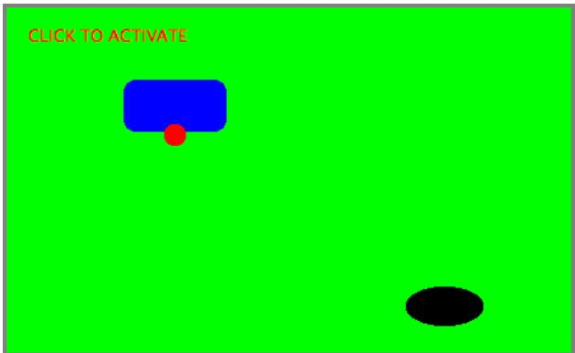

You have to click on the panel to give it the input focus. The program shows a black “submarine” near the bottom of the panel. When the panel has the input focus, this submarine moves back and forth erratically near the bottom. Near the top, there is a blue “boat”. You can move this boat back and forth by pressing the left and right arrow keys. Attached to the boat is a red “bomb” (or “depth charge”). You can drop the bomb by hitting the down arrow key. The objective is to blow up the submarine by hitting it with the bomb. If the bomb falls of the bottom of the screen, you get a new one. If the submarine explodes, a new sub is created and you get a new bomb. Try it! Make sure to hit the sub at least once, so you can see the explosion.

Let’s think about how this program can be programmed. First of all, since we are doing object-oriented programming, I decided to represent the boat, the depth charge, and the submarine as objects. Each of these objects is defined by a separate nested class inside the main panel class, and each object has its own state which is represented by the instance variables in the corresponding class. I use variables boat, bomb, and sub in the panel class to refer to the boat, bomb, and submarine objects.

Now, what constitutes the “state” of the program? That is, what things change from time to time and afect the appearance or behavior of the program? Of course, the state includes the positions of the boat, submarine, and bomb, so I need variables to store the positions. Anything else, possibly less obvious? Well, sometimes the bomb is falling, and sometimes it’s not. That is a diference in state. Since there are two possibilities, I represent this aspect of the state with a boolean variable in the bomb object, bomb.isFalling. Sometimes the submarine is moving left and sometimes it is moving right. The diference is represented by another boolean variable, sub.isMovingLeft. Sometimes, the sub is exploding. This is also part of the state, and it is represented by a boolean variable, sub.isExploding. However, the explosions require a little more thought. An explosion is something that takes place over a series of frames. While an explosion is in progress, the sub looks diferent in each frame, as the size of the explosion increases. Also, I need to know when the explosion is over so that I can go back to moving and drawing the sub as usual. So, I use an integer variable, sub.explosionFrameNumber to record how many frames have been drawn since the explosion started; the value of this variable is used only when an explosion is in progress.

How and when do the values of these state variables change? Some of them seem to change on their own: For example, as the sub moves left and right, the state variables the that specify its position are changing. Of course, these variables are changing because of an animation, and that animation is driven by a timer. Each time an event is generated by the timer, some of the state variables have to change to get ready for the next frame of the animation. The changes are made by the action listener that listens for events from the timer. The boat, bomb, and sub objects each contain an updateForNextFrame() method that updates the state variables of the object to get ready for the next frame of the animation. The action listener for the timer calls these methods with the statements

boat.updateForNewFrame();

bomb.updateForNewFrame();

sub.updateForNewFrame();

The action listener also calls repaint(), so that the panel will be redrawn to reflect its new state. There are several state variables that change in these update methods, in addition to the position of the sub: If the bomb is falling, then its y-coordinate increases from one frame to the next. If the bomb hits the sub, then the isExploding variable of the sub changes to true, and the isFalling variable of the bomb becomes false. The isFalling variable also becomes false when the bomb falls of the bottom of the screen. If the sub is exploding, then its explosionFrameNumber increases from one frame to the next, and when it reaches a certain value, the explosion ends and isExploding is reset to false. At random times, the sub switches between moving to the left and moving to the right. Its direction of motion is recorded in the the sub’s isMovingLeft variable. The sub’s updateForNewFrame() method includes the lines

if ( Math.random() < 0.04 )

isMovingLeft = ! isMovingLeft;

There is a 1 in 25 chance that Math.random() will be less than 0.04, so the statement “isMovingLeft = ! isMovingLeft” is executed in one in every twenty-five frames, on the average. The efect of this statement is to reverse the value of isMovingLeft, from false to true or from true to false. That is, the direction of motion of the sub is reversed.

In addtion to changes in state that take place from one frame to the next, a few state variables change when the user presses certain keys. In the program, this is checked in a method that responds to user keystrokes. If the user presses the left or right arrow key, the position of the boat is changed. If the user presses the down arrow key, the bomb changes from not-falling to falling. This is coded in the keyPressed()method of a KeyListener that is registered to listen for key events on the panel; that method reads as follows:

```java
public void keyPressed(KeyEvent evt) {
    int code = evt.getKeyCode();  // which key was pressed.
    if (code == KeyEvent.VK_LEFT) {
        // Move the boat left.  (If this moves the boat out of the frame, its
        // position will be adjusted in the boat.updateForNewFrame() method.)
        boat.centerX -= 15;
    }
    else if (code == KeyEvent.VK_RIGHT) {
        // Move the boat right.  (If this moves boat out of the frame, its
        // position will be adjusted in the boat.updateForNewFrame() method.)
        boat.centerX += 15;
    }
    else if (code == KeyEvent.VK_DOWN) {
        // Start the bomb falling, it is is not already falling.
        if ( bomb.isFalling == false )
            bomb.isFalling = true;
    }
}
```

Note that it’s not necessary to call repaint() when the state changes, since this panel shows an animation that is constantly being redrawn anyway. Any changes in the state will become visible to the user as soon as the next frame is drawn. At some point in the program, I have to make sure that the user does not move the boat of the screen. I could have done this in keyPressed(), but I choose to check for this in another routine, in the boat object.

I encourage you to read the source code in SubKillerPanel.java. Although a few points are tricky, you should with some efort be able to read and understand the entire program. Try to understand the program in terms of state machines. Note how the state of each of the three objects in the program changes in response to events from the timer and from the user.

You should also note that the program uses four listeners, to respond to action events from the timer, key events from the user, focus events, and mouse events. (The mouse is used only to request the input focus when the user clicks the panel.) The timer runs only when the panel has the input focus; this is programmed by having the focus listener start the timer when the panel gains the input focus and stop the timer when the panel loses the input focus. All four listeners are created in the constructor of the SubKillerPanel class using anonymous inner classes. (See Subsection 6.4.5.)

While it’s not at all sophisticated as arcade games go, the SubKiller game does use some interesting programming. And it nicely illustrates how to apply state-machine thinking in event-oriented programming.

## 6.6 Basic Components

In preceding sections, you’ve seen how to use a graphics context to draw on the screen and how to handle mouse events and keyboard events. In one sense, that’s all there is to GUI programming. If you’re willing to program all the drawing and handle all the mouse and keyboard events, you have nothing more to learn. However, you would either be doing a lot more work than you need to do, or you would be limiting yourself to very simple user interfaces. A typical user interface uses standard GUI components such as buttons, scroll bars, text-input boxes, and menus. These components have already been written for you, so you don’t have to duplicate the work involved in developing them. They know how to draw themselves, and they can handle the details of processing the mouse and keyboard events that concern them.

Consider one of the simplest user interface components, a push button. The button has a border, and it displays some text. This text can be changed. Sometimes the button is disabled, so that clicking on it doesn’t have any efect. When it is disabled, its appearance changes. When the user clicks on the push button, the button changes appearance while the mouse button is pressed and changes back when the mouse button is released. In fact, it’s more complicated than that. If the user moves the mouse outside the push button before releasing the mouse button, the button changes to its regular appearance. To implement this, it is necessary to respond to mouse exit or mouse drag events. Furthermore, on many platforms, a button can receive the input focus. The button changes appearance when it has the focus. If the button has the focus and the user presses the space bar, the button is triggered. This means that the button must respond to keyboard and focus events as well.

Fortunately, you don’t have to program any of this, provided you use an object belonging to the standard class javax.swing.JButton. A JButton object draws itself and processes mouse, keyboard, and focus events on its own. You only hear from the Button when the user triggers it by clicking on it or pressing the space bar while the button has the input focus. When this happens, the JButton object creates an event object belonging to the class java.awt.event.ActionEvent. The event object is sent to any registered listeners to tell them that the button has been pushed. Your program gets only the information it needs—the fact that a button was pushed.

## ∗ ∗ ∗

The standard components that are defined as part of the Swing graphical user interface API are defined by subclasses of the class JComponent, which is itself a subclass of Component. (Note that this includes the JPanel class that we have already been working with extensively.) Many useful methods are defined in the Component and JComponent classes and so can be used with any Swing component. We begin by looking at a few of these methods. Suppose that comp is a variable that refers to some JComponent. Then the following methods can be used:

• comp.getWidth() and comp.getHeight() are functions that give the current size of the component, in pixels. One warning: When a component is first created, its size is zero. The size will be set later, probably by a layout manager. A common mistake is to check the size of a component before that size has been set, such as in a constructor.

• comp.setEnabled(true) and comp.setEnabled(false) can be used to enable and disable the component. When a component is disabled, its appearance might change, and the user cannot do anything with it. There is a boolean-valued function, comp.isEnabled() that you can call to discover whether the component is enabled.

• comp.setVisible(true) and comp.setVisible(false) can be called to hide or show the component.

• comp.setFont(font) sets the font that is used for text displayed on the component. See Subsection 6.3.3 for a discussion of fonts.

• comp.setBackground(color) and comp.setForeground(color) set the background and foreground colors for the component. See Subsection 6.3.2.

• comp.setOpaque(true) tells the component that the area occupied by the component should be filled with the component’s background color before the content of the component is painted. By default, only JLabels are non-opaque. A non-opaque, or “transparent”, component ignores its background color and simply paints its content over the content of its container. This usually means that it inherits the background color from its container.

• comp.setToolTipText(string) sets the specified string as a “tool tip” for the component. The tool tip is displayed if the mouse cursor is in the component and the mouse is not moved for a few seconds. The tool tip should give some information about the meaning of the component or how to use it.

• comp.setPreferredSize(size) sets the size at which the component should be displayed, if possible. The parameter is of type java.awt.Dimension, where an object of type Dimension has two public integer-valued instance variables, width and height. A call to this method usually looks something like “setPreferredSize( new Dimension(100,50) )”. The preferred size is used as a hint by layout managers, but will not be respected in all cases. Standard components generally compute a correct preferred size automatically, but it can be useful to set it in some cases. For example, if you use a JPanel as a drawing surface, it might be a good idea to set a preferred size for it.

Note that using any component is a multi-step process. The component object must be created with a constructor. It must be added to a container. In many cases, a listener must be registered to respond to events from the component. And in some cases, a reference to the component must be saved in an instance variable so that the component can be manipulated by the program after it has been created. In this section, we will look at a few of the basic standard components that are available in Swing. In the next section we will consider the problem of laying out components in containers.

## 6.6.1 JButton

An object of class JButton is a push button that the user can click to trigger some action. You’ve already seen buttons used in Section 6.1 and Section 6.2, but we consider them in much more detail here. To use any component efectively, there are several aspects of the corresponding class that you should be familiar with. For JButton, as an example, I list these aspects explicitely:

• Constructors: The JButton class has a constructor that takes a string as a parameter. This string becomes the text displayed on the button. For example: stopGoButton = new JButton("Go"). This creates a button object that will display the text, “Go” (but remember that the button must still be added to a container before it can appear on the screen).

• Events: When the user clicks on a button, the button generates an event of type Action-Event. This event is sent to any listener that has been registered with the button as an ActionListener.

• Listeners: An object that wants to handle events generated by buttons must implement the ActionListener interface. This interface defines just one method, “public void actionPerformed(ActionEvent evt)”, which is called to notify the object of an action event.

• Registration of Listeners: In order to actually receive notification of an event from a button, an ActionListener must be registered with the button. This is done with the button’s addActionListener() method. For example: stopGoButton.addActionListener( buttonHandler );

• Event methods: When actionPerformed(evt) is called by the button, the parameter, evt, contains information about the event. This information can be retrieved by calling methods in the ActionEvent class. In particular, evt.getActionCommand() returns a String giving the command associated with the button. By default, this command is the text that is displayed on the button, but it is possible to set it to some other string. The method evt.getSource() returns a reference to the Object that produced the event, that is, to the JButton that was pressed. The return value is of type Object, not JButton, because other types of components can also produce ActionEvents.

• Component methods: Several useful methods are defined in the JButton class. For example, stopGoButton.setText("Stop") changes the text displayed on the button to “Stop”. And stopGoButton.setActionCommand("sgb") changes the action command associated to this button for action events.

Of course, JButtons also have all the general Component methods, such as setEnabled() and setFont(). The setEnabled() and setText() methods of a button are particularly useful for giving the user information about what is going on in the program. A disabled button is better than a button that gives an obnoxious error message such as “Sorry, you can’t click on me now!”

## 6.6.2 JLabel

JLabel is certainly the simplest type of component. An object of type JLabel exists just to display a line of text. The text cannot be edited by the user, although it can be changed by your program. The constructor for a JLabel specifies the text to be displayed:

```javascript
JLabel message = new JLabel("Hello World!");
```

There is another constructor that specifies where in the label the text is located, if there is extra space. The possible alignments are given by the constants JLabel.LEFT, JLabel.CENTER, and JLabel.RIGHT. For example,

JLabel message = new JLabel("Hello World!", JLabel.CENTER);

creates a label whose text is centered in the available space. You can change the text displayed in a label by calling the label’s setText() method:

message.setText("Goodby World!");

Since the JLabel class is a subclass of JComponent, you can use methods such as setForeground() with labels. If you want the background color to have any efect, you should call setOpaque(true) on the label, since otherwise the JLabel might not fill in its background. For example:

```javascript
JLabel message = new JLabel("Hello World!", JLabel.CENTER);
message.setForeground(Color.RED);  // Display red text...
message.setBackground(Color.BLACK); //      on a black background...
message.setFont(new Font("Serif",Font.BOLD,18));  // in a big bold font.
message.setOpaque(true);  // Make sure background is filled in.
```

## 6.6.3 JCheckBox

A JCheckBox is a component that has two states: selected or unselected. The user can change the state of a check box by clicking on it. The state of a checkbox is represented by a boolean value that is true if the box is selected and false if the box is unselected. A checkbox has a label, which is specified when the box is constructed:

JCheckBox showTime = new JCheckBox("Show Current Time");

Usually, it’s the user who sets the state of a JCheckBox, but you can also set the state in your program. The current state of a checkbox is set using its setSelected(boolean) method. For example, if you want the checkbox showTime to be checked, you would say “showTime.setSelected(true)". To uncheck the box, say “showTime.setSelected(false)". You can determine the current state of a checkbox by calling its isSelected() method, which returns a boolean value.

In many cases, you don’t need to worry about events from checkboxes. Your program can just check the state whenever it needs to know it by calling the isSelected() method. However, a checkbox does generate an event when its state is changed by the user, and you can detect this event and respond to it if you want something to happen at the moment the state changes. When the state of a checkbox is changed by the user, it generates an event of type ActionEvent. If you want something to happen when the user changes the state, you must register an ActionListener with the checkbox by calling its addActionListener() method. (Note that if you change the state by calling the setSelected() method, no ActionEvent is generated. However, there is another method in the JCheckBox class, doClick(), which simulates a user click on the checkbox and does generate an ActionEvent.)

When handling an ActionEvent, you can call evt.getSource() in the actionPerformed() method to find out which object generated the event. (Of course, if you are only listening for events from one component, you don’t even have to do this.) The returned value is of type Object, but you can type-cast it to another type if you want. Once you know the object that generated the event, you can ask the object to tell you its current state. For example, if you know that the event had to come from one of two checkboxes, cb1 or cb2, then your actionPerformed() method might look like this:

```txt
public void actionPerformed(ActionEvent evt) {
    Object source = evt.getSource();
    if (source == cb1) {
        boolean newState = cb1.isSelected();
        ... // respond to the change of state
    }
    else if (source == cb2) {
        boolean newState = cb2.isSelected();
        ... // respond to the change of state
    }
}
```

Alternatively, you can use evt.getActionCommand() to retrieve the action command associated with the source. For a JCheckBox, the action command is, by default, the label of the checkbox.

## 6.6.4 JTextField and JTextArea

The JTextField and JTextArea classes represent components that contain text that can be edited by the user. A JTextField holds a single line of text, while a JTextArea can hold multiple lines. It is also possible to set a JTextField or JTextArea to be read-only so that the user can read the text that it contains but cannot edit the text. Both classes are subclasses of an abstract class, JTextComponent, which defines their common properties.

JTextField and JTextArea have many methods in common. The instance method setText(), which takes a parameter of type String, can be used to change the text that is displayed in an input component. The contents of the component can be retrieved by calling its getText() instance method, which returns a value of type String. If you want to stop the user from modifying the text, you can call setEditable(false). Call the same method with a parameter of true to make the input component user-editable again.

The user can only type into a text component when it has the input focus. The user can give the input focus to a text component by clicking it with the mouse, but sometimes it is useful to give the input focus to a text field programmatically. You can do this by calling its requestFocus() method. For example, when I discover an error in the user’s input, I usually call requestFocus() on the text field that contains the error. This helps the user see where the error occurred and lets the user start typing the correction immediately.

By default, there is no space between the text in a text component and the edge of the component, which usually doesn’t look very good. You can use the setMargin() method of the component to add some blank space between the edge of the component and the text. This method takes a parameter of type java.awt.Insets which contains four integer instance variables that specify the margins on the top, left, bottom, and right edge of the component. For example,

textComponent.setMargin( new Insets(5,5,5,5) );

adds a five-pixel margin between the text in textComponent and each edge of the component.

∗ ∗ ∗

The JTextField class has a constructor

public JTextField(int columns)

where columns is an integer that specifies the number of characters that should be visible in the text field. This is used to determine the preferred width of the text field. (Because characters can be of diferent sizes and because the preferred width is not always respected, the actual number of characters visible in the text field might not be equal to columns.) You don’t have to specify the number of columns; for example, you might use the text field in a context where it will expand to fill whatever space is available. In that case, you can use the constructor JTextField(), with no parameters. You can also use the following constructors, which specify the initial contents of the text field:

public JTextField(String contents);

public JTextField(String contents, int columns);

The constructors for a JTextArea are

public JTextArea()

public JTextArea(int rows, int columns)

public JTextArea(String contents)

public JTextArea(String contents, int rows, int columns)

The parameter rows specifies how many lines of text should be visible in the text area. This determines the preferred height of the text area, just as columns determines the preferred width. However, the text area can actually contain any number of lines; the text area can be scrolled to reveal lines that are not currently visible. It is common to use a JTextArea as the CENTER component of a BorderLayout. In that case, it is less useful to specify the number of lines and columns, since the TextArea will expand to fill all the space available in the center area of the container.

The JTextArea class adds a few useful methods to those inherited from JTextComponent. For example, the instance method append(moreText), where moreText is of type String, adds the specified text at the end of the current content of the text area. (When using append() or setText() to add text to a JTextArea, line breaks can be inserted in the text by using the newline character, ’\n’.) And setLineWrap(wrap), where wrap is of type boolean, tells what should happen when a line of text is too long to be displayed in the text area. If wrap is true, then any line that is too long will be “wrapped” onto the next line; if wrap is false, the line will simply extend outside the text area, and the user will have to scroll the text area horizontally to see the entire line. The default value of wrap is false.

Since it might be necessary to scroll a text area to see all the text that it contains, you might expect a text area to come with scroll bars. Unfortunately, this does not happen automatically. To get scroll bars for a text area, you have to put the JTextArea inside another component, called a JScrollPane. This can be done as follows:

$$
\text {JTextArea inputArea} = \text {new JTextArea();}
$$

JScrollPane scroller = new JScrollPane( inputArea );

The scroll pane provides scroll bars that can be used to scroll the text in the text area. The scroll bars will appear only when needed, that is when the size of the text exceeds the size of the text area. Note that when you want to put the text area into a container, you should add the scroll pane, not the text area itself, to the container.

$$
\* \ * \ *
$$

When the user is typing in a JTextField and presses return, an ActionEvent is generated. If you want to respond to such events, you can register an ActionListener with the text field, using the text field’s addActionListener() method. (Since a JTextArea can contain multiple lines of text, pressing return in a text area does not generate an event; is simply begins a new line of text.)

JTextField has a subclass, JPasswordField, which is identical except that it does not reveal the text that it contains. The characters in a JPasswordField are all displayed as asterisks (or some other fixed character). A password field is, obviously, designed to let the user enter a password without showing that password on the screen.

Text components are actually quite complex, and I have covered only their most basic properties here. I will return to the topic of text components in Subsection 12.4.4.

## 6.6.5 JComboBox

The JComboBox class provides a way to let the user select one option from a list of options. The options are presented as a kind of pop-up menu, and only the currently selected option is visible on the screen.

When a JComboBox object is first constructed, it initially contains no items. An item is added to the bottom of the menu by calling the combo box’s instance method, addItem(str), where str is the string that will be displayed in the menu.

For example, the following code will create an object of type JComboBox that contains the options Red, Blue, Green, and Black:

JComboBox colorChoice = new JComboBox();

colorChoice.addItem("Red");

colorChoice.addItem("Blue");

colorChoice.addItem("Green");

colorChoice.addItem("Black");

You can call the getSelectedIndex() method of a JComboBox to find out which item is currently selected. This method returns an integer that gives the position of the selected item in the list, where the items are numbered starting from zero. Alternatively, you can call getSelectedItem() to get the selected item itself. (This method returns a value of type Object, since a JComboBox can actually hold other types of objects besides strings.) You can change the selection by calling the method setSelectedIndex(n), where n is an integer giving the position of the item that you want to select.

The most common way to use a JComboBox is to call its getSelectedIndex() method when you have a need to know which item is currently selected. However, like other components that we have seen, JComboBox components generate ActionEvents when the user selects an item. You can register an ActionListener with the JComboBox if you want to respond to such events as they occur.

JComboBoxes have a nifty feature, which is probably not all that useful in practice. You can make a JComboBox “editable” by calling its method setEditable(true). If you do this, the user can edit the selection by clicking on the JComboBox and typing. This allows the user to make a selection that is not in the pre-configured list that you provide. (The “Combo” in the name “JComboBox” refers to the fact that it’s a kind of combination of menu and text-input box.) If the user has edited the selection in this way, then the getSelectedIndex() method will return the value -1, and getSelectedItem() will return the string that the user typed. An ActionEvent is triggered if the user presses return while typing in the JComboBox.

## 6.6.6 JSlider

A JSlider provides a way for the user to select an integer value from a range of possible values. The user does this by dragging a “knob” along a bar. A slider can, optionally, be decorated with tick marks and with labels. This picture shows three sliders with diferent decorations and with diferent ranges of values:


Here, the second slider is decorated with ticks, and the third one is decorated with labels. It’s possible for a single slider to have both types of decorations.

The most commonly used constructor for JSliders specifies the start and end of the range of values for the slider and its initial value when it first appears on the screen:

public JSlider(int minimum, int maximum, int value)

```javascript
slider2.setPaintTicks(true);
```

If the parameters are omitted, the values 0, 100, and 50 are used. By default, a slider is horizontal, but you can make it vertical by calling its method setOrientation(JSlider.VERTICAL). The current value of a JSlider can be read at any time with its getValue() method, which returns a value of type int. If you want to change the value, you can do so with the method setValue(n), which takes a parameter of type int.

If you want to respond immediately when the user changes the value of a slider, you can register a listener with the slider. JSliders, unlike other components we have seen, do not generate ActionEvents. Instead, they generate events of type ChangeEvent. ChangeEvent and related classes are defined in the package javax.swing.event rather than java.awt.event, so if you want to use ChangeEvents, you should import javax.swing.event.\* at the beginning of your program. You must also define some object to implement the ChangeListener interface, and you must register the change listener with the slider by calling its addChangeListener() method. A ChangeListener must provide a definition for the method:

## public void stateChanged(ChangeEvent evt)

This method will be called whenever the value of the slider changes. (Note that it will also be called when you change the value with the setValue() method, as well as when the user changes the value.) In the stateChanged() method, you can call evt.getSource() to find out which object generated the event.

Using tick marks on a slider is a two-step process: Specify the interval between the tick marks, and tell the slider that the tick marks should be displayed. There are actually two types of tick marks, “major” tick marks and “minor” tick marks. You can have one or the other or both. Major tick marks are a bit longer than minor tick marks. The method setMinorTickSpacing(i) indicates that there should be a minor tick mark every i units along the slider. The parameter is an integer. (The spacing is in terms of values on the slider, not pixels.) For the major tick marks, there is a similar command, setMajorTickSpacing(i). Calling these methods is not enough to make the tick marks appear. You also have to call setPaintTicks(true). For example, the second slider in the above picture was created and configured using the commands:

slider2 = new JSlider(); // (Uses default min, max, and value.)

slider2.addChangeListener(this);

slider2.setMajorTickSpacing(25);

slider2.setMinorTickSpacing(5);

Labels on a slider are handled similarly. You have to specify the labels and tell the slider to paint them. Specifying labels is a tricky business, but the JSlider class has a method to simplify it. You can create a set of labels and add them to a slider named sldr with the command:

sldr.setLabelTable( sldr.createStandardLabels(i) );

where i is an integer giving the spacing between the labels. To arrange for the labels to be displayed, call setPaintLabels(true). For example, the third slider in the above picture was created and configured with the commands:

```javascript
slider3 = new JSlider(2000,2100,2006);
slider3.addChangeListener(this);
slider3.setLabelTable( slider3.createStandardLabels(50) );
slider3.setPaintLabels(true);
```

## 6.7 Basic Layout

Components are the fundamental building blocks of a graphical user interface. But you have to do more with components besides create them. Another aspect of GUI programming is laying out components on the screen, that is, deciding where they are drawn and how big they are. You have probably noticed that computing coordinates can be a dificult problem, especially if you don’t assume a fixed size for the drawing area. Java has a solution for this, as well.

Components are the visible objects that make up a GUI. Some components are containers, which can hold other components. Containers in Java are objects that belong to some subclass of java.awt.Container. The content pane of a JApplet or JFrame is an example of a container. The standard class JPanel, which we have mostly used as a drawing surface up till now, is another example of a container.

Because a JPanel object is a container, it can hold other components. Because a JPanel is itself a component, you can add a JPanel to another JPanel. This makes complex nesting of components possible. JPanels can be used to organize complicated user interfaces, as shown in this illustration:

  
Three panels, shown in color, containing six other components, shown in gray.

The components in a container must be “laid out,” which means setting their sizes and positions. It’s possible to program the layout yourself, but ordinarily layout is done by a layout manager. A layout manager is an object associated with a container that implements some policy for laying out the components in that container. Diferent types of layout manager implement diferent policies. In this section, we will cover the three most common types of layout manager, and then we will look at several programming examples that use components and layout.

Every container has an instance method, setLayout(), that takes a parameter of type LayoutManager and that is used to specify the layout manager that will be responsible for laying out any components that are added to the container. Components are added to a container by calling an instance method named add() in the container object. There are actually several versions of the add() method, with diferent parameter lists. Diferent versions of add() are appropriate for diferent layout managers, as we will see below.

## 6.7.1 Basic Layout Managers

Java has a variety of standard layout managers that can be used as parameters in the setLayout() method. They are defined by classes in the package java.awt. Here, we will look at just three of these layout manager classes: FlowLayout, BorderLayout, and GridLayout.

A FlowLayout simply lines up components in a row across the container. The size of each component is equal to that component’s “preferred size.” After laying out as many items as will fit in a row across the container, the layout manager will move on to the next row. The default layout for a JPanel is a FlowLayout; that is, a JPanel uses a FlowLayout unless you specify a diferent layout manager by calling the panel’s setLayout() method.

The components in a given row can be either left-aligned, right-aligned, or centered within that row, and there can be horizontal and vertical gaps between components. If the default constructor, “new FlowLayout()”, is used, then the components on each row will be centered and both the horizontal and the vertical gaps will be five pixels. The constructor

public FlowLayout(int align, int hgap, int vgap)

can be used to specify alternative alignment and gaps. The possible values of align are FlowLayout.LEFT, FlowLayout.RIGHT, and FlowLayout.CENTER.

Suppose that cntr is a container object that is using a FlowLayout as its layout manager. Then, a component, comp, can be added to the container with the statement

cntr.add(comp);

The FlowLayout will line up all the components that have been added to the container in this way. They will be lined up in the order in which they were added. For example, this picture shows five buttons in a panel that uses a FlowLayout:

Button Number 1Button Number 2Button Number 3

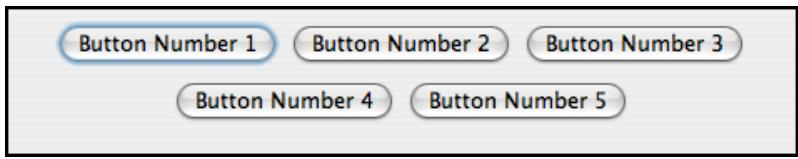

Button Number 4 Button Number 5

Note that since the five buttons will not fit in a single row across the panel, they are arranged in two rows. In each row, the buttons are grouped together and are centered in the row. The buttons were added to the panel using the statements:

panel.add(button1);

panel.add(button2);

panel.add(button3);

panel.add(button4);

panel.add(button5);

When a container uses a layout manager, the layout manager is ordinarily responsible for computing the preferred size of the container (although a diferent preferred size could be set by calling the container’s setPreferredSize method). A FlowLayout prefers to put its components in a single row, so the preferred width is the total of the preferred widths of all the components, plus the horizontal gaps between the components. The preferred height is the maximum preferred height of all the components.

A BorderLayout layout manager is designed to display one large, central component, with up to four smaller components arranged along the edges of the central component. If a container, cntr, is using a BorderLayout, then a component, comp, should be added to the container using a statement of the form

cntr.add( comp, borderLayoutPosition );

where borderLayoutPosition specifies what position the component should occupy in the layout and is given as one of the constants BorderLayout.CENTER, BorderLayout.NORTH, BorderLayout.SOUTH, BorderLayout.EAST, or BorderLayout.WEST. The meaning of the five positions is shown in this diagram:

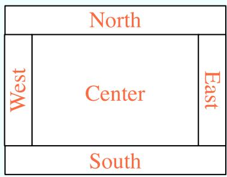

Note that a border layout can contain fewer than five compompontnts, so that not all five of the possible positions need to be filled.

A BorderLayout selects the sizes of its components as follows: The NORTH and SOUTH components (if present) are shown at their preferred heights, but their width is set equal to the full width of the container. The EAST and WEST components are shown at their preferred widths, but their height is set to the height of the container, minus the space occupied by the NORTH and SOUTH components. Finally, the CENTER component takes up any remaining space; the preferred size of the CENTER component is completely ignored. You should make sure that the components that you put into a BorderLayout are suitable for the positions that they will occupy. A horizontal slider or text field, for example, would work well in the NORTH or SOUTH position, but wouldn’t make much sense in the EAST or WEST position.

The default constructor, new BorderLayout(), leaves no space between components. If you would like to leave some space, you can specify horizontal and vertical gaps in the constructor of the BorderLayout object. For example, if you say

panel.setLayout(new BorderLayout(5,7));

then the layout manager will insert horizontal gaps of 5 pixels between components and vertical gaps of 7 pixels between components. The background color of the container will show through in these gaps. The default layout for the original content pane that comes with a JFrame or JApplet is a BorderLayout with no horizontal or vertical gap.

$$
\* \ * \ *
$$

Finally, we consider the GridLayout layout manager. A grid layout lays out components in a grid of equal sized rectangles. This illustration shows how the components would be arranged in a grid layout with 3 rows and 2 columns:

<table><tr><td>#1</td><td>#2</td></tr><tr><td>#3</td><td>#4</td></tr><tr><td>#5</td><td>#6</td></tr></table>

If a container uses a GridLayout, the appropriate add method for the container takes a single parameter of type Component (for example: cntr.add(comp)). Components are added to the grid in the order shown; that is, each row is filled from left to right before going on the next row.

The constructor for a GridLayout takes the form “new GridLayout(R,C)”, where R is the number of rows and C is the number of columns. If you want to leave horizontal gaps of H pixels between columns and vertical gaps of V pixels between rows, use “new GridLayout(R,C,H,V)” instead.

When you use a GridLayout, it’s probably good form to add just enough components to fill the grid. However, this is not required. In fact, as long as you specify a non-zero value for the number of rows, then the number of columns is essentially ignored. The system will use just as many columns as are necessary to hold all the components that you add to the container. If you want to depend on this behavior, you should probably specify zero as the number of columns. You can also specify the number of rows as zero. In that case, you must give a non-zero number of columns. The system will use the specified number of columns, with just as many rows as necessary to hold the components that are added to the container.

Horizontal grids, with a single row, and vertical grids, with a single column, are very common. For example, suppose that button1, button2, and button3 are buttons and that you’d like to display them in a horizontal row in a panel. If you use a horizontal grid for the panel, then the buttons will completely fill that panel and will all be the same size. The panel can be created as follows:

```javascript
JPanel buttonBar = new JPanel();
buttonBar.setLayout( new GridLayout(1,3) );
    // (Note:  The "3" here is pretty much ignored, and
    //  you could also say "new GridLayout(1,0)".
    //  To leave gaps between the buttons, you could use
    //  "new GridLayout(1,0,5,5)".)
buttonBar.add(button1);
buttonBar.add(button2);
buttonBar.add(button3);
```

You might find this button bar to be more attractive than the one that uses the default FlowLayout layout manager.

## 6.7.2 Borders

We have seen how to leave gaps between the components in a container, but what if you would like to leave a border around the outside of the container? This problem is not handled by layout managers. Instead, borders in Swing are represented by objects. A Border object can be added to any JComponent, not just to containers. Borders can be more than just empty space. The class javax.swing.BorderFactory contains a large number of static methods for creating border objects. For example, the function

## BorderFactory.createLineBorder(Color.BLACK)

returns an object that represents a one-pixel wide black line around the outside of a component. If comp is a JComponent, a border can be added to comp using its setBorder() method. For example:

comp.setBorder( BorderFactory.createLineBorder(Color.BLACK) );

When a border has been set for a JComponent, the border is drawn automatically, without any further efort on the part of the programmer. The border is drawn along the edges of the component, just inside its boundary. The layout manager of a JPanel or other container will take the space occupied by the border into account. The components that are added to the container will be displayed in the area inside the border. I don’t recommend using a border on a JPanel that is being used as a drawing surface. However, if you do this, you should take the border into account. If you draw in the area occupied by the border, that part of your drawing will be covered by the border.

Here are some of the static methods that can be used to create borders:

• BorderFactory.createEmptyBorder(top,left,bottom,right) — leaves an empty border around the edges of a component. Nothing is drawn in this space, so the background color of the component will appear in the area occupied by the border. The parameters are integers that give the width of the border along the top, left, bottom, and right edges of the component. This is actually very useful when used on a JPanel that contains other components. It puts some space between the components and the edge of the panel. It can also be useful on a JLabel, which otherwise would not have any space between the text and the edge of the label.

• BorderFactory.createLineBorder(color,thickness) — draws a line around all four edges of a component. The first parameter is of type Color and specifies the color of the line. The second parameter is an integer that specifies the thickness of the border. If the second parameter is omitted, a line of thickness 1 is drawn.

• BorderFactory.createMatteBorder(top,left,bottom,right,color) — is similar to createLineBorder, except that you can specify individual thicknesses for the top, left, bottom, and right edges of the component.

• BorderFactory.createEtchedBorder() — creates a border that looks like a groove etched around the boundary of the component. The efect is achieved using lighter and darker shades of the component’s background color, and it does not work well with every background color.

• BorderFactory.createLoweredBevelBorder()—gives a component a three-dimensional efect that makes it look like it is lowered into the computer screen. As with an Etched-Border, this only works well for certain background colors.

• BorderFactory.createRaisedBevelBorder()—similar to a LoweredBevelBorder, but the component looks like it is raised above the computer screen.

• BorderFactory.createTitledBorder(title)—creates a border with a title. The title is a String, which is displayed in the upper left corner of the border.

There are many other methods in the BorderFactory class, most of them providing variations of the basic border styles given here. The following illustration shows six components with six diferent border styles. The text in each component is the command that created the border for that component:

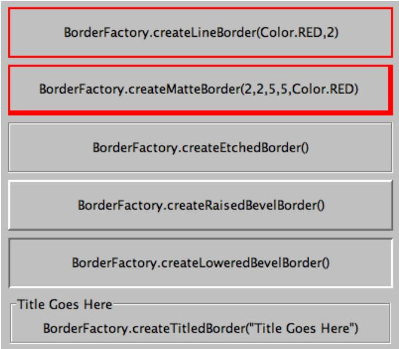  
(The source code for the applet that produced this picture can be found in BorderDemo.java.)

## 6.7.3 SliderAndComboBoxDemo

Now that we have looked at components and layouts, it’s time to put them together into some complete programs. We start with a simple demo that uses a JLabel, a JComboBox, and a couple of JSliders, all laid out in a GridLayout, as shown in this picture:


The sliders in this applet control the foreground and background color of the label, and the combo box controls its font style. Writing this program is a matter of creating the components, laying them out, and programming listeners to respond to events from the sliders and combo box. In my program, I define a subclass of JPanel which will be used for the applet’s content pane. This class implements ChangeListener and ActionListener, so the panel itself can act as the listener for change events from the sliders and action events from the combo box. In the constructor, the four components are created and configured, a GridLayout is installed as the layout manager for the panel, and the components are added to the panel:

/\* Create the sliders, and set up this panel to listen for

ChangeEvents that are generated by the sliders. \*/

$$
\text {bgColorSlider} = \text {new JSlider(0,255,100)};
$$

bgColorSlider.addChangeListener(this);

```javascript
/* Create the combo box, and add four items to it, listing
    different font styles.  Set up the panel to listen for
    ActionEvents from the combo box. */

fontStyleSelect = new JComboBox();
fontStyleSelect.addItem("Plain Font");
fontStyleSelect.addItem("Italic Font");
fontStyleSelect.addItem("Bold Font");
fontStyleSelect.addItem("Bold Italic Font");
fontStyleSelect.setSelectedIndex(2);
fontStyleSelect.addActionListener(this);

/* Create the display label, with properties to match the
    values of the sliders and the setting of the combo box. */
displayLabel = new JLabel("Hello World!", JLabel.CENTER);
displayLabel.setOpaque(true);
displayLabel.setBackground(new Color(100,100,100));
displayLabel.setForeground(new Color(255, 200, 200));
displayLabel.setFont(new Font("Serif", Font.BOLD, 30));

/* Set the layout for the panel, and add the four components.
    Use a GridLayout with 4 rows and 1 column. */

setLayout(new GridLayout(4,1));
add(displayLabel);
add(bgColorSlider);
add(fgColorSlider);
add(fontStyleSelect);
```

The class also defines the methods required by the ActionListener and ChangeListener interfaces. The actionPerformed() method is called when the user selects an item in the combo box. This method changes the font in the JLable, where the font depends on which item is currently selected in the combo box, fontStyleSelect:

```java
public void actionPerformed(ActionEvent evt) {
    switch ( fontStyleSelect.getSelectedIndex() ) {
        case 0:
            displayLabel.setFont( new Font("Serif", Font.PLAIN, 30) );
            break;
        case 1:
            displayLabel.setFont( new Font("Serif", Font.ITALIC, 30) );
            break;
        case 2:
            displayLabel.setFont( new Font("Serif", Font.BOLD, 30) );
            break;
        case 3:
            displayLabel.setFont( new Font("Serif", Font.BOLD + Font.ITALIC, 30) );
            break;
    }
}
```

And the stateChanged() method, which is called when the user manipulates one of the sliders, uses the value on the slider to compute a new foreground or background color for the label. The method checks evt.getSource() to determine which slider was changed:

```java
public void stateChanged(ChangeEvent evt) {
    if (evt.getSource() == bgColor) {
        int bgVal = bgColor.getValue();
        displayLabel.setBackground(new Color(bgVal,bgVal,bgVal) );
            // NOTE: The background color is a shade of gray,
            // determined by the setting on the slider.
    }
    else {
        int fgVal = fgetsValue();
        displayLabel.setForeground(new Color( 255, fgVal, fgVal) );
            // Note: The foreground color ranges from pure red to pure
            // white as the slider value increases from 0 to 255.
    }
}
```

(The complete source code is in the file SliderAndComboBoxDemo.java.)

## 6.7.4 A Simple Calculator

As our next example, we look briefly at an example that uses nested subpanels to build a more complex user interface. The program has two JTextFields where the user can enter two numbers, four JButtons that the user can click to add, subtract, multiply, or divide the two numbers, and a JLabel that displays the result of the operation:

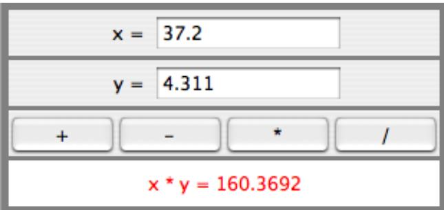

Like the previous example, this example uses a main panel with a GridLayout that has four rows and one column. In this case, the layout is created with the statement:

```javascript
setLayout(new GridLayout(4,1,3,3));
```

which allows a 3-pixel gap between the rows where the gray background color of the panel is visible. The gray border around the edges of the panel is added with the statement

setBorder( BorderFactory.createEmptyBorder(5,5,5,5) );

The first row of the grid layout actually contains two components, a JLabel displaying the text “x =” and a JTextField. A grid layout can only only have one component in each position. In this case, that component is a JPanel, a subpanel that is nested inside the main panel. This subpanel in turn contains the label and text field. This can be programmed as follows:

```txt
xInput = new JTextField("0", 10); // Create a text field sized to hold 10 chars.
JPanel xPanel = new JPanel();      // Create the subpanel.
xPanel.add( new JLabel(" x = ")); // Add a label to the subpanel.
xPanel.add(xInput);                  // Add the text field to the subpanel
mainPanel.add(xPanel);              // Add the subpanel to the main panel.
```

The subpanel uses the default FlowLayout layout manager, so the label and text field are simply placed next to each other in the subpanel at their preferred size, and are centered in the subpanel.

Similarly, the third row of the grid layout is a subpanel that contains four buttons. In this case, the subpanel uses a GridLayout with one row and four columns, so that the buttons are all the same size and completely fill the subpanel.

One other point of interest in this example is the actionPerformed() method that responds when the user clicks one of the buttons. This method must retrieve the user’s numbers from the text field, perform the appropriate arithmetic operation on them (depending on which button was clicked), and set the text of the label to represent the result. However, the contents of the text fields can only be retrieved as strings, and these strings must be converted into numbers. If the conversion fails, the label is set to display an error message:

```java
blic void actionPerformed(ActionEvent evt) {
    double x, y;  // The numbers from the input boxes.
    try {
        String xStr = xInput.getText();
        x = Double.parseDouble(xStr);
    }
    catch (NumberFormatException e) {
        // The string xStr is not a legal number.
        answer.setText("Illegal data for x.");
        xInput.requestFocus();
        return;
    }

    try {
        String yStr = yInput.getText();
        y = Double.parseDouble(yStr);
    }
    catch (NumberFormatException e) {
        // The string yStr is not a legal number.
        answer.setText("Illegal data for y.");
        yInput.requestFocus();
        return;
    }

    /* Perfrom the operation based on the action command from the button.  The action command is the text displayed on the button
    Note that division by zero produces an error message. */
    String op = evt.getActionCommand();
    if (op.equals("+"))
        answer.setText( "x + y = " + (x+y) );
    else if (op.equals("-"))
        answer.setText( "x - y = " + (x-y) );
    else if (op.equals("*"))
        answer.setText( "x * y = " + (x*y) );
    else if (op.equals("/")) {
        if (y == 0)
            answer.setText("Can't divide by zero!");
        else
            answer.setText( "x / y = " + (x/y) );
```

## } // end actionPerformed()

(The complete source code for this example can be found in SimpleCalc.java.)

## 6.7.5 Using a null Layout

As mentioned above, it is possible to do without a layout manager altogether. For out next example, we’ll look at a panel that does not use a layout manager. If you set the layout manager of a container to be null, by calling container.setLayout(null), then you assume complete responsibility for positioning and sizing the components in that container.

If comp is any component, then the statement

comp.setBounds(x, y, width, height);

puts the top left corner of the component at the point (x,y), measured in the coordinate system of the container that contains the component, and it sets the width and height of the component to the specified values. You should only set the bounds of a component if the container that contains it has a null layout manager. In a container that has a non-null layout manager, the layout manager is responsible for setting the bounds, and you should not interfere with its job.

Assuming that you have set the layout manager to null, you can call the setBounds() method any time you like. (You can even make a component that moves or changes size while the user is watching.) If you are writing a panel that has a known, fixed size, then you can set the bounds of each component in the panel’s constructor. Note that you must also add the components to the panel, using the panel’s add(component) instance method; otherwise, the component will not appear on the screen.

Our example contains four components: two buttons, a label, and a panel that displays a checkerboard pattern:


This is just an example of using a null layout; it doesn’t do anything, except that clicking the buttons changes the text of the label. (We will use this example in Section 7.5 as a starting point for a checkers game.)

For its content pane, this example uses a main panel that is defined by a class named NullLayoutPanel. The four components are created and added to the panel in the constructor of the NullLayoutPanel class. Then the setBounds() method of each component is called to set the size and position of the component:

```txt
blic NullLayoutPanel() {
    setLayout(null);  // I will do the layout myself!
    setBackground(new Color(0,150,0));  // A dark green background.
    setBorder( BorderFactory.createEtchedBorder() );
    setPreferredSize( new Dimension(350,240) );
        // I assume that the size of the panel is, in fact, 350-by-240
    /* Create the components and add them to the content pane.  If you don't add them to the a container, they won't appear, even if you set their bounds! */
    board = new Checkerboard();
        // (Checkerborad is a subclass of JPanel, defined elsewhere.) add(board);
    newGameButton = new JButton("New Game");
    newGameButton.addActionListener(this);
    add(newGameButton);
    resignButton = new JButton("Resign");
    resignButton.addActionListener(this);
    add(resignButton);
    message = new JLabel("Click \"New Game\" to begin a game.");
    message.setForeground( new Color(100,255,100) ); // Light green. message.setFont(new Font("Serif", Font.BOLD, 14));
    add(message);
    /* Set the position and size of each component by calling its setBounds() method. */
    board.setBounds(20,20,164,164);
    newGameButton.setBounds(210, 60, 120, 30);
    resignButton.setBounds(210, 120, 120, 30);
    message.setBounds(20, 200, 330, 30);
```

## } // end constructor

It’s reasonably easy, in this case, to get an attractive layout. It’s much more dificult to do your own layout if you want to allow for changes of size. In that case, you have to respond to changes in the container’s size by recomputing the sizes and positions of all the components that it contains. If you want to respond to changes in a container’s size, you can register an appropriate listener with the container. Any component generates an event of type ComponentEvent when its size changes (and also when it is moved, hidden, or shown). You can register a ComponentListener with the container and respond to size change events by recomputing the sizes and positions of all the components in the container. Consult a Java reference for more information about ComponentEvents. However, my real advice is that if you want to allow for changes in the container’s size, try to find a layout manager to do the work for you.

(The complete source code for this example is in NullLayoutDemo.java.)

## 6.7.6 A Little Card Game

For a final example, let’s look at something a little more interesting as a program. The example is a simple card game in which you look at a playing card and try to predict whether the next card will be higher or lower in value. (Aces have the lowest value in this game.) You’ve seen a text-oriented version of the same game in Subsection 5.4.3. Section 5.4 also introduced Deck, Hand, and Card classes that are used in the game program. In this GUI version of the game, you click on a button to make your prediction. If you predict wrong, you lose. If you make three correct predictions, you win. After completing one game, you can click the “New Game” button to start a new game. Here is what the game looks like:


The complete source code for this example is in the file HighLowGUI.java. You can try out the game in the on-line version of this section, or by running the program as a stand-alone application.

The overall structure of the main panel in this example should be clear: It has three buttons in a subpanel at the bottom of the main panel and a large drawing surface that displays the cards and a message. The main panel uses a BorderLayout. The drawing surface occupies the CENTER position of the border layout. The subpanel that contains the buttons occupies the SOUTH position of the border layout, and the other three positions of the layout are empty.

The drawing surface is defined by a nested class named CardPanel, which is a subclass of JPanel. I have chosen to let the drawing surface object do most of the work of the game: It listens for events from the three buttons and responds by taking the appropriate actions. The main panel is defined by HighLowGUI itself, which is another subclass of JPanel. The constructor of the HighLowGUI class creates all the other components, sets up event handling, and lays out the components:

```javascript
blic HighLowGUI() {   // The constructor.
    setBackground( new Color(130,50,40) );
    setLayout( new BorderLayout(3,3) );  // BorderLayout with 3-pixel gaps.
    CardPanel board = new CardPanel();  // Where the cards are drawn.
    add(board, BorderLayout.CENTER);
    JPanel buttonPanel = new JPanel();  // The subpanel that holds the buttons.
    buttonPanel.setBackground( new Color(220,200,180) );
    add(buttonPanel, BorderLayout.SOUTH);
    JButton higher = new JButton( "Higher" );
```

```javascript
higher.addActionListener(board);  // The CardPanel listens for events.
buttonPanel.add(higher);

JButton lower = new JButton( "Lower" );
lower.addActionListener(board);
buttonPanel.add(lower);

JButton newGame = new JButton( "New Game" );
newGame.addActionListener(board);
buttonPanel.add(newGame);

setBorder(BorderFactory.createLineBorder( new Color(130,50,40), 3) );
// end constructor
```

The programming of the drawing surface class, CardPanel, is a nice example of thinking in terms of a state machine. (See Subsection 6.5.4.) It is important to think in terms of the states that the game can be in, how the state can change, and how the response to events can depend on the state. The approach that produced the original, text-oriented game in Subsection 5.4.3 is not appropriate here. Trying to think about the game in terms of a process that goes step-by-step from beginning to end is more likely to confuse you than to help you.

The state of the game includes the cards and the message. The cards are stored in an object of type Hand. The message is a String. These values are stored in instance variables. There is also another, less obvious aspect of the state: Sometimes a game is in progress, and the user is supposed to make a prediction about the next card. Sometimes we are between games, and the user is supposed to click the “New Game” button. It’s a good idea to keep track of this basic diference in state. The CardPanel class uses a boolean instance variable named gameInProgress for this purpose.

The state of the game can change whenever the user clicks on a button. The CardPanel class implements the ActionListener interface and defines an actionPerformed() method to respond to the user’s clicks. This method simply calls one of three other methods, doHigher(), doLower(), or newGame(), depending on which button was pressed. It’s in these three eventhandling methods that the action of the game takes place.

We don’t want to let the user start a new game if a game is currently in progress. That would be cheating. So, the response in the newGame() method is diferent depending on whether the state variable gameInProgress is true or false. If a game is in progress, the message instance variable should be set to show an error message. If a game is not in progress, then all the state variables should be set to appropriate values for the beginning of a new game. In any case, the board must be repainted so that the user can see that the state has changed. The complete newGame() method is as follows:

```txt
/**
 * Called by the CardPanel constructor, and called by actionPerformed() if
 * the user clicks the "New Game" button.  Start a new game.
 */
void doNewGame() {
    if (gameInProgress) {
        // If the current game is not over, it is an error to try
        // to start a new game.
        message = "You still have to finish this game!";
        repaint();
        return;
    }
```

```javascript
deck = new Deck();  // Create the deck and hand to use for this game.
hand = new Hand();
deck.shuffle();
hand.addCard( deck.dealCard() );  // Deal the first card into the hand.
message = "Is the next card higher or lower?";
gameInProgress = true;
repaint();
// end doNewGame()
```

The doHigher() and doLower() methods are almost identical to each other (and could probably have been combined into one method with a parameter, if I were more clever). Let’s look at the doHigher() routine. This is called when the user clicks the “Higher” button. This only makes sense if a game is in progress, so the first thing doHigher() should do is check the value of the state variable gameInProgress. If the value is false, then doHigher() should just set up an error message. If a game is in progress, a new card should be added to the hand and the user’s prediction should be tested. The user might win or lose at this time. If so, the value of the state variable gameInProgress must be set to false because the game is over. In any case, the board is repainted to show the new state. Here is the doHigher() method:

```javascript
/**
 * Called by actionPerformed() when user clicks "Higher" button.
 * Check the user's prediction.  Game ends if user guessed
 * wrong or if the user has made three correct predictions.
 */
void doHigher() {
    if (gameInProgress == false) {
        // If the game has ended, it was an error to click "Higher",
        // So set up an error message and abort processing.
        message = "Click \"New Game\" to start a new game!";
        repaint();
        return;
    }
    hand.addCard( deck.dealCard() );      // Deal a card to the hand.
    int cardCt = hand.getCardCount();
    Card thisCard = hand.getCard( cardCt - 1 );  // Card just dealt.
    Card prevCard = hand.getCard( cardCt - 2 );  // The previous card.
    if ( thisCard.getValue() < prevCard.getValue() ) {
        gameInProgress = false;
        message = "Too bad! You lose.";
    }
    else if ( thisCard.getValue() == prevCard.getValue() ) {
        gameInProgress = false;
        message = "Too bad!  You lose on ties.";
    }
    else if ( cardCt == 4) {
        gameInProgress = false;
        message = "You win!  You made three correct guesses.";
    }
    else {
        message = "Got it right!  Try for " + cardCt + ".";
    }
    repaint();
} // end doHigher()
```

The paintComponent() method of the CardPanel class uses the values in the state variables to decide what to show. It displays the string stored in the message variable. It draws each of the cards in the hand. There is one little tricky bit: If a game is in progress, it draws an extra face-down card, which is not in the hand, to represent the next card in the deck. Drawing the cards requires some care and computation. I wrote a method, “void drawCard(Graphics g, Card card, int x, int y)”, which draws a card with its upper left corner at the point (x,y). The paintComponent() routine decides where to draw each card and calls this routine to do the drawing. You can check out all the details in the source code, HighLowGUI.java.

$$
* * *
$$

One further note on the programming of this example: The source code defines HighLowGUI as a subclass of JPanel. The class contains a main() routine so that it can be run as a stand-alone application; the main() routine simply opens a window that uses a panel of type HighLowGUI as its content pane. In addition, I decided to write an applet version of the program as a static nested class named Applet inside the HighLowGUI class. Since this is a nested class, its full name is HighLowGUI.Applet and the class file that is produced when the source code is compiled is named HighLowGUI\$Applet.class. This class is used for the applet version of the program in the on-line version of the book. The <applet> tag lists the class file for the applet as code="HighLowGUI\$Applet.class". This is admittedly an unusual way to organize the program, and it is probably more natural to have the panel, applet, and stand-alone program defined in separate classes. However, writing the program in this way does show the flexibility of Java classes. (Nested classes were discussed in Subsection 5.7.2.)

## 6.8 Menus and Dialogs

We have already encountered many of the basic aspects of GUI programming, but professional programs use many additional features. We will cover some of the advanced features of Java GUI programming in Chapter 12, but in this section we look briefly at a few more basic features that are essential for writing GUI programs. I will discuss these features in the context of a “MosaicDraw” program that is shown in this picture:

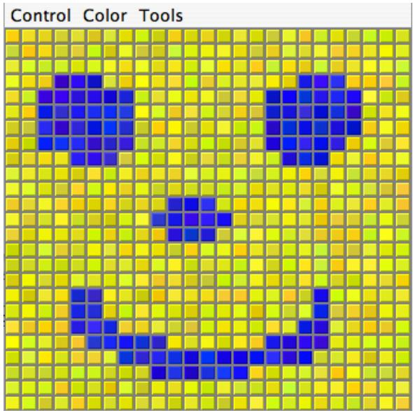

As the user clicks-and-drags the mouse in the large drawing area of this program, it leaves a trail of little colored squares. There is some random variation in the color of the squares. (This is meant to make the picture look a little more like a real mosaic, which is a picture made out of small colored stones in which there would be some natural color variation.) There is a menu bar above the drawing area. The “Control” menu contains commands for filling and clearing the drawing area, along with a few options that afect the appearance of the picture. The “Color” menu lets the user select the color that will be used when the user draws. The “Tools” menu afects the behavior of the mouse. Using the default “Draw” tool, the mouse leaves a trail of single squares. Using the “Draw 3x3” tool, the mouse leaves a swath of colored squares that is three squares wide. There are also “Erase” tools, which let the user set squares back to their default black color.

The drawing area of the program is a panel that belongs to the MosaicPanel class, a subclass of JPanel that is defined in MosaicPanel.java. MosaicPanel is a highly reusable class for representing mosaics of colored rectangles. It does not directly support drawing on the mosaic, but it does support setting the color of each individual square. The MosaicDraw program installs a mouse listener on the panel; the mouse listener responds to mousePressed and mouseDragged events on the panel by setting the color of the square that contains the mouse. This is a nice example of applying a listener to an object to do something that was not programmed into the object itself.

Most of the programming for MosaicDraw can be found in MosaicDrawController.java. (It could have gone into the MosaicPanel class, if I had not decided to use that pre-existing class in unmodified form.) It is the MosaicDrawController class that creates a MosaicPanel object and adds a mouse listener to it. It also creates the menu bar that is shown at the top of the program and implements all the commands in the menu bar. It has an instance method getMosaicPanel() that returns a reference to the mosaic panel that it has created, and it has another instance method getMenuBar() that returns a menu bar for the program. These methods are used to obtain the panel and menu bar so that they can be added to an applet or a frame.

To get a working program, an object of type JApplet or JFrame is needed. The files MosaicDrawApplet.java and MosaicDrawFrame.java define the applet and frame versions of the program. These are rather simple classes; they simply create a MosaicDrawController object and use its mosaic panel and menu bar. I urge you to study these files, along with MosaicDraw-Controller.java. I will not be discussing all aspects of the code here, but you should be able to understand it all after reading this section. As for MosaicPanel.java, it uses some techniques that you would not understand at this point, but I encourage you to at least read the comments in this file to learn about the API for mosaic panels.

## 6.8.1 Menus and Menubars

MosaicDraw is the first example that we have seen that uses a menu bar. Fortunately, menus are very easy to use in Java. The items in a menu are represented by the class JMenuItem (this class and other menu-related classes are in package javax.swing). Menu items are used in almost exactly the same way as buttons. In fact, JMenuItem and JButton are both subclasses of a class, AbstractButton, that defines their common behavior. In particular, a JMenuItem is created using a constructor that specifies the text of the menu item, such as:

$$
\text {JMenuItem fillCommand} = \text {new JMenuItem("Fill");}
$$

You can add an ActionListener to a JMenuItem by calling the menu item’s addActionListener()

method. The actionPerformed() method of the action listener is called when the user selects the item from the menu. You can change the text of the item by calling its setText(String) method, and you can enable it and disable it using the setEnabled(boolean) method. All this works in exactly the same way as for a JButton.

The main diference between a menu item and a button, of course, is that a menu item is meant to appear in a menu rather than in a panel. A menu in Java is represented by the class JMenu. A JMenu has a name, which is specified in the constructor, and it has an add(JMenuItem) method that can be used to add a JMenuItem to the menu. So, the “Tools” menu in the MosaicDraw program could be created as follows, where listener is a variable of type ActionListener:

```javascript
JMenu toolsMenu = new JMenu("Tools");  // Create a menu with name "Tools"
JMenuItem drawCommand = new JMenuItem("Draw");    // Create a menu item.
drawCommand.addActionListener(listener);          // Add listener to menu item.
toolsMenu.add(drawCommand);                    // Add menu item to menu.

JMenuItem eraseCommand = new JMenuItem("Erase"); // Create a menu item.
eraseCommand.addActionListener(listener);      // Add listener to menu item.
toolsMenu.add(eraseCommand);                   // Add menu item to menu.
.
.  // Create and add other menu items.
.
```

Once a menu has been created, it must be added to a menu bar. A menu bar is represented by the class JMenuBar. A menu bar is just a container for menus. It does not have a name, and its constructor does not have any parameters. It has an add(JMenu) method that can be used to add menus to the menu bar. For example, the MosaicDraw program uses three menus, controlMenu, colorMenu, and toolsMenu. We could create a menu bar and add the menus to it with the statements:

```javascript
JMenuBar menuBar = new JMenuBar();
menuBar.add(controlMenu);
menuBar.add(colorMenu);
menuBar.add(toolsMenu);
```

The final step in using menus is to use the menu bar in a JApplet or JFrame. We have already seen that an applet or frame has a “content pane.” The menu bar is another component of the applet or frame, not contained inside the content pane. Both the JApplet and the JFrame classes include an instance method setMenuBar(JMenuBar) that can be used to set the menu bar. (There can only be one, so this is a “set” method rather than an “add” method.) In the MosaicDraw program, the menu bar is created by a MosaicDrawController object and can be obtained by calling that object’s getMenuBar() method. Here is the basic code that is used (in somewhat modified form) to set up the interface both in the applet and in the frame version of the program:

MosaicDrawController controller = new MosaicDrawController();

MoasicPanel content = controller.getMosaicPanel();

Using menus always follows the same general pattern: Create a menu bar. Create menus and add them to the menu bar. Create menu items and add them to the menus (and set up listening to handle action events from the menu items). Use the menu bar in a JApplet or JFrame by calling the setJMenuBar() method of the applet or frame.

## ∗ ∗ ∗

There are other kinds of menu items, defined by subclasses of JMenuItem, that can be added to menus. One of these is JCheckBoxMenuItem, which represents menu items that can be in one of two states, selected or not selected. A JCheckBoxMenuItem has the same functionality and is used in the same way as a JCheckBox (see Subsection 6.6.3). Three JCheckBoxMenuItems are used in the “Control” menu of the MosaicDraw program. One can be used to turn the random color variation of the squares on and of. Another turns a symmetry feature on and of; when symmetry is turned on, the user’s drawing is reflected horizontally and vertically to produce a symmetric pattern. And the third check box menu item shows and hides the “grouting” in the mosaic; the grouting is the gray lines that are drawn around each of the little squares in the mosaic. The menu item that corresponds to the “Use Randomness” option in the “Control” menu could be set up with the statements:

JMenuItem useRandomnessToggle = new JCheckBoxMenuItem("Use Randomness");

useRandomnessToggle.addActionListener(listener); // Set up a listener.

useRandomnessToggle.setSelected(true); // Randomness is initially turned on.

controlMenu.add(useRandomnessToggle); // Add the menu item to the menu.

The “Use Randomness” JCheckBoxMenuItem corresponds to a boolean-valued instance variable named useRandomness in the MosaicDrawController class. This variable is part of the state of the controller object. Its value is tested whenever the user draws one of the squares, to decide whether or not to add a random variation to the color of the square. When the user selects the “Use Randomness” command from the menu, the state of the JCheckBoxMenuItem is reversed, from selected to not-selected or from not-selected to selected. The ActionListener for the menu item checks whether the menu item is selected or not, and it changes the value of useRandomness to match. Note that selecting the menu command does not have any immediate efect on the picture that is shown in the window. It just changes the state of the program so that future drawing operations on the part of the user will have a diferent efect. The “Use Symmetry” option in the “Control” menu works in much the same way. The “Show Grouting” option is a little diferent. Selecting the “Show Grouting” option does have an immediate efect: The picture is redrawn with or without the grouting, depending on the state of the menu item.

My program uses a single ActionListener to respond to all of the menu items in all the menus. This is not a particularly good design, but it is easy to implement for a small program like this one. The actionPerformed() method of the listener object uses the statement

String command = evt.getActionCommand();

to get the action command of the source of the event; this will be the text of the menu item. The listener tests the value of command to determine which menu item was selected by the user. If the menu item is a JCheckBoxMenuItem, the listener must check the state of the menu item. Then menu item is the source of the event that is being processed. The listener can get its hands on the menu item object by calling evt.getSource(). Since the return value of getSource() is Object, the the return value must be type-cast to the correct type. Here, for example, is the code that handles the “Use Randomness” command:

// Set the value of useRandomness depending on the menu item’s state.

```txt
JCheckBoxMenuItem toggle = (JCheckBoxMenuItem)evt.getSource();
    useRandomness = toggle.isSelected();
}
```

## ∗ ∗ ∗

In addition to menu items, a menu can contain lines that separate the menu items into groups. In the MosaicDraw program, the “Control” menu contains a separator. A JMenu has an instance method addSeparator() that can be used to add a separator to the menu. For example, the separator in the “Control” menu was created with the statement:

controlMenu.addSeparator();

A menu can also contain a submenu. The name of the submenu appears as an item in the main menu. When the user moves the mouse over the submenu name, the submenu pops up. (There is no example of this in the MosaicDraw program.) It is very easy to do this in Java: You can add one JMenu to another JMenu using a statement such as mainMenu.add(submenu).

## 6.8.2 Dialogs

One of the commands in the “Color” menu of the MosaicDraw program is “Custom Color. . . ”. When the user selects this command, a new window appears where the user can select a color. This window is an example of a dialog or dialog box. A dialog is a type of window that is generally used for short, single purpose interactions with the user. For example, a dialog box can be used to display a message to the user, to ask the user a question, to let the user select a file to be opened, or to let the user select a color. In Swing, a dialog box is represented by an object belonging to the class JDialog or to a subclass.

The JDialog class is very similar to JFrame and is used in much the same way. Like a frame, a dialog box is a separate window. Unlike a frame, however, a dialog is not completely independent. Every dialog is associated with a frame (or another dialog), which is called its parent window. The dialog box is dependent on its parent. For example, if the parent is closed, the dialog box will also be closed. It is possible to create a dialog box without specifying a parent, but in that case a an invisible frame is created by the system to serve as the parent.

Dialog boxes can be either modal or modeless. When a modal dialog is created, its parent frame is blocked. That is, the user will not be able to interact with the parent until the dialog box is closed. Modeless dialog boxes do not block their parents in the same way, so they seem a lot more like independent windows. In practice, modal dialog boxes are easier to use and are much more common than modeless dialogs. All the examples we will look at are modal.

Aside from having a parent, a JDialog can be created and used in the same way as a JFrame. However, I will not give any examples here of using JDialog directly. Swing has many convenient methods for creating many common types of dialog boxes. For example, the color choice dialog that appears when the user selects the “Custom Color” command in the MosaicDraw program belongs to the class JColorChooser, which is a subclass of JDialog. The JColorChooser class has a static method static method that makes color choice dialogs very easy to use:

Color JColorChooser.showDialog(Component parentComp, String title, Color initialColor)

When you call this method, a dialog box appears that allows the user to select a color. The first parameter specifies the parent of the dialog; the parent window of the dialog will be the window (if any) that contains parentComp; this parameter can be null and it can itself be a frame or dialog object. The second parameter is a string that appears in the title bar of the dialog box. And the third parameter, initialColor, specifies the color that is selected when the color choice dialog first appears. The dialog has a sophisticated interface that allows the user to change the selected color. When the user presses an “OK” button, the dialog box closes and the selected color is returned as the value of the method. The user can also click a “Cancel” button or close the dialog box in some other way; in that case, null is returned as the value of the method. By using this predefined color chooser dialog, you can write one line of code that will let the user select an arbitrary color. Swing also has a JFileChooser class that makes it almost as easy to show a dialog box that lets the user select a file to be opened or saved.

The JOptionPane class includes a variety of methods for making simple dialog boxes that are variations on three basic types: a “message” dialog, a “confirm” dialog, and an “input” dialog. (The variations allow you to provide a title for the dialog box, to specify the icon that appears in the dialog, and to add other components to the dialog box. I will only cover the most basic forms here.) The on-line version of this section includes an applet that demonstrates JOptionPane as well as JColorChooser.

A message dialog simply displays a message string to the user. The user (hopefully) reads the message and dismisses the dialog by clicking the “OK” button. A message dialog can be shown by calling the static method:

void JOptionPane.showMessageDialog(Component parentComp, String message)

The message can be more than one line long. Lines in the message should be separated by newline characters, \n. New lines will not be inserted automatically, even if the message is very long.

An input dialog displays a question or request and lets the user type in a string as a response. You can show an input dialog by calling:

String JOptionPane.showInputDialog(Component parentComp, String question)

Again, the question can include newline characters. The dialog box will contain an input box, an “OK” button, and a “Cancel” button. If the user clicks “Cancel”, or closes the dialog box in some other way, then the return value of the method is null. If the user clicks “OK”, then the return value is the string that was entered by the user. Note that the return value can be an empty string (which is not the same as a null value), if the user clicks “OK” without typing anything in the input box. If you want to use an input dialog to get a numerical value from the user, you will have to convert the return value into a number; see Subsection 3.7.2.

Finally, a confirm dialog presents a question and three response buttons: “Yes”, “No”, and “Cancel”. A confirm dialog can be shown by calling:

int JOptionPane.showConfirmDialog(Component parentComp, String question)

The return value tells you the user’s response. It is one of the following constants:

• JOptionPane.YES OPTION — the user clicked the “Yes” button

• JOptionPane.NO OPTION — the user clicked the “No” button

• JOptionPane.CANCEL OPTION — the user clicked the “Cancel” button

• JOptionPane.CLOSE OPTION — the dialog was closed in some other way.

By the way, it is possible to omit the Cancel button from a confirm dialog by calling one of the other methods in the JOptionPane class. Just call:

The final parameter is a constant which specifies that only a “Yes” button and a “No” button should be used. The third parameter is a string that will be displayed as the title of the dialog box window.

If you would like to see how dialogs are created and used in the sample applet, you can find the source code in the file SimpleDialogDemo.java.

## 6.8.3 Fine Points of Frames

In previous sections, whenever I used a frame, I created a JFrame object in a main() routine and installed a panel as the content pane of that frame. This works fine, but a more objectoriented approach is to define a subclass of JFrame and to set up the contents of the frame in the constructor of that class. This is what I did in the case of the MosaicDraw program. MosaicDrawFrame is defined as a subclass of JFrame. The definition of this class is very short, but it illustrates several new features of frames that I want to discuss:

```java
public class MosaicDrawFrame extends JFrame {

    public static void main(String[] args) {
        JFrame window = new MosaicDrawFrame();
        window.setDefaultCloseOperation(JFrame.EXIT_ON_CLOSE);
        window.setVisible(true);
    }

    public MosaicDrawFrame() {
        super("Mosaic Draw");
        MosaicDrawController controller = new MosaicDrawController();
        setContentView( controller.getMosaicPanel() );
        setJMenuBar( controller.getMenuBar() );
        pack();
        Dimension screensize = Toolkit.getDefaultToolkit().getScreenSize();
        setLocation( (screensize.width - getWidth()/2,
                             (screensize.height - getHeight()/2 );
    }
}
```

The constructor in this class begins with the statement super("Mosaic Draw"), which calls the constructor in the superclass, JFrame. The parameter specifies a title that will appear in the title bar of the window. The next three lines of the constructor set up the contents of the window; a MosaicDrawController is created, and the content pane and menu bar of the window are obtained from the controller. The next line is something new. If window is a variable of type JFrame (or JDialog), then the statement window.pack() will resize the window so that its size matches the preferred size of its contents. (In this case, of course, “pack()” is equivalent to “this.pack()”; that is, it refers to the window that is being created by the constructor.) The pack() method is usually the best way to set the size of a window. Note that it will only work correctly if every component in the window has a correct preferred size. This is only a problem in two cases: when a panel is used as a drawing surface and when a panel is used as a container with a null layout manager. In both these cases there is no way for the system to determine the correct preferred size automatically, and you should set a preferred size by hand. For example:

panel.setPreferredSize( new Dimension(400, 250) );

The last two lines in the constructor position the window so that it is exactly centered on the screen. The line

## Dimension screensize = Toolkit.getDefaultToolkit().getScreenSize();

determines the size of the screen. The size of the screen is screensize.width pixels in the horizontal direction and screensize.height pixels in the vertical direction. The setLocation() method of the frame sets the position of the upper left corner of the frame on the screen. The expression “screensize.width - getWidth()” is the amount of horizontal space left on the screen after subtracting the width of the window. This is divided by 2 so that half of the empty space will be to the left of the window, leaving the other half of the space to the right of the window. Similarly, half of the extra vertical space is above the window, and half is below.

Note that the constructor has created the window and set its size and position, but that at the end of the constructor, the window is not yet visible on the screen. (More exactly, the constructor has created the window object, but the visual representation of that object on the screen has not yet been created.) To show the window on the screen, it will be necessary to call its instance method, window.setVisible(true).

In addition to the constructor, the MosaicDrawFrame class includes a main() routine. This makes it possible to run MosaicDrawFrame as a stand-alone application. (The main() routine, as a static method, has nothing to do with the function of a MosaicDrawFrame object, and it could (and perhaps should) be in a separate class.) The main() routine creates a MosaicDrawFrame and makes it visible on the screen. It also calls

## window.setDefaultCloseOperation(JFrame.EXIT ON CLOSE);

which means that the program will end when the user closes the window. Note that this is not done in the constructor because doing it there would make MosaicDrawFrame less flexible. It would be possible, for example, to write a program that lets the user open multiple MosaicDraw windows. In that case, we don’t want to end the program just because the user has closed one of the windows. Furthermore, it is possible for an applet to create a frame, which will open as a separate window on the screen. An applet is not allowed to “terminate the program” (and it’s not even clear what that should mean in the case of an applet), and attempting to do so will produce an exception. There are other possible values for the default close operation of a window:

• JFrame.DO NOTHING ON CLOSE — the user’s attempts to close the window by clicking its close box will be ignored.

• JFrame.HIDE ON CLOSE — when the user clicks its close box, the window will be hidden just as if window.setVisible(false) were called. The window can be made visible again by calling window.setVisible(true). This is the value that is used if you do not specify another value by calling setDefaultCloseOperation.

• JFrame.DISPOSE ON CLOSE — the window is closed and any operating system resources used by the window are released. It is not possible to make the window visible again. (This is the proper way to permanently get rid of a window without ending the program. You can accomplish the same thing by calling the instance method window.dispose().)

I’ve written an applet version of the MosaicDraw program that appears on a Web page as a single button. When the user clicks the button, the applet opens a MosaicDrawFrame. In this case, the applet sets the default close operation of the window to JFrame.DISPOSE ON CLOSE. You can try the applet in the on-line version of this section.

The file MosaicDrawLauncherApplet.java contains the source code for the applet. One interesting point in the applet is that the text of the button changes depending on whether a window is open or not. If there is no window, the text reads “Launch MosaicDraw”. When the window is open, it changes to “Close MosaicDraw”, and clicking the button will close the window. The change is implemented by attaching a WindowListener to the window. The listener responds to WindowEvents that are generated when the window opens and closes. Although I will not discuss window events further here, you can look at the source code for an example of how they can be used.

## 6.8.4 Creating Jar Files

As the final topic for this chapter, we look again at jar files. Recall that a jar file is a “java archive” that can contain a number of class files. When creating a program that uses more than one class, it’s usually a good idea to place all the classes that are required by the program into a jar file, since then a user will only need that one file to run the program. Subsection 6.2.4 discusses how a jar file can be used for an applet. Jar files can also be used for stand-alone applications. In fact, it is possible to make a so-called executable jar file. A user can run an executable jar file in much the same way as any other application, usually by double-clicking the icon of the jar file. (The user’s computer must have a correct version of Java installed, and the computer must be configured correctly for this to work. The configuration is usually done automatically when Java is installed, at least on Windows and Mac OS.)

The question, then, is how to create a jar file. The answer depends on what programming environment you are using. The two basic types of programming environment—command line and IDE—were discussed in Section 2.6. Any IDE (Integrated Programming Environment) for Java should have a command for creating jar files. In the Eclipse IDE, for example, it’s done as follows: In the Package Explorer pane, select the programming project (or just all the individual source code files that you need). Right-click on the selection, and choose “Export” from the menu that pops up. In the window that appears, select “JAR file” and click “Next”. In the window that appears next, enter a name for the jar file in the box labeled “JAR file”. (Click the “Browse” button next to this box to select the file name using a file dialog box.) The name of the file should end with “.jar”. If you are creating a regular jar file, not an executable one, you can hit “Finish” at this point, and the jar file will be created. You could do this, for example, if the jar file contains an applet but no main program. To create an executable file, hit the “Next” button twice to get to the “Jar Manifest Specification” screen. At the bottom of this screen is an input box labeled “Main class”. You have to enter the name of the class that contains the main() routine that will be run when the jar file is executed. If you hit the “Browse” button next to the “Main class” box, you can select the class from a list of classes that contain main() routines. Once you’ve selected the main class, you can click the “Finish” button to create the executable jar file.

It is also possible to create jar files on the command line. The Java Development Kit includes a command-line program named jar that can be used to create jar files. If all your classes are in the default package (like the examples in this book), then the jar command is easy to use. To create a non-executable jar file on the command line, change to the directory that contains the class files that you want to include in the jar. Then give the command

$$
\text {jar} \quad \text {cf} \quad \text {JarFileName.jar} \quad *. \text {class}
$$

where JarFileName can be any name that you want to use for the jar file. The “\*” in “\*.class” is a wildcard that makes \*.class match every class file in the current directory. This means that all the class files in the directory will be included in the jar file. If you want to include only certain class files, you can name them individually, separated by spaces. (Things get more complicated if your classes are not in the default package. In that case, the class files must be in subdirectories of the directory in which you issue the jar file. See Subsection 2.6.4.)

Making an executable jar file on the command line is a little more complicated. There has to be some way of specifying which class contains the main() routine. This is done by creating a manifest file. The manifest file can be a plain text file containing a single line of the form

Main-Class: ClassName

where ClassName should be replaced by the name of the class that contains the main() routine. For example, if the main() routine is in the class MosaicDrawFrame, then the manifest file should read “Main-Class: MosaicDrawFrame”. You can give the manifest file any name you like. Put it in the same directory where you will issue the jar command, and use a command of the form

## jar cmf ManifestFileName JarFileName.jar \*.class

to create the jar file. (The jar command is capable of performing a variety of diferent operations. The first parameter to the command, such as “cf” or “cmf”, tells it which operation to perform.)

By the way, if you have successfully created an executable jar file, you can run it on the command line using the command “java -jar”. For example:

java -jar JarFileName.jar

## Exercises for Chapter 6

1. In the SimpleStamperPanel example from Subsection 6.4.2, a rectangle or oval is drawn on the panel when the user clicks the mouse, except that when the user shift-clicks, the panel is cleared instead. Modify this class so that the modified version will continue to draw figures as the user drags the mouse. That is, the mouse will leave a trail of figures as the user drags the mouse. However, if the user shift-clicks, the panel should simply be cleared and no figures should be drawn even if the user drags the mouse after shift-clicking. Use your panel either in an applet or in a stand-alone application (or both). Here is a picture of my solution:

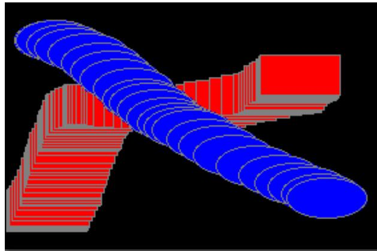

The source code for the original panel class is SimpleStamperPanel.java. An applet that uses this class can be found in SimpleStamperApplet.java, and a main program that uses the panel in a frame is in SimpleStamper.java. See the discussion of dragging in Subsection 6.4.4. (Note that in the original version, I drew a black outline around each shape. In the modified version, I decided that it would look better to draw a gray outline instead.)

2. Write a panel that shows a small red square and a small blue square. The user should be able to drag either square with the mouse. (You’ll need an instance variable to remember which square the user is dragging.) The user can drag the square of the applet if she wants; if she does this, it’s gone. Use your panel in either an applet or a stand-alone application.

3. Write a panel that shows a pair of dice. When the user clicks on the panel, the dice should be rolled (that is, the dice should be assigned newly computed random values). Each die should be drawn as a square showing from 1 to 6 dots. Since you have to draw two dice, its a good idea to write a subroutine, “void drawDie(Graphics g, int val, int x, int y)”, to draw a die at the specified (x,y) coordinates. The second parameter, val, specifies the value that is showing on the die. Assume that the size of the panel is 100 by 100 pixels. Also write an applet that uses your panel as its content pane. Here is a picture of the applet:

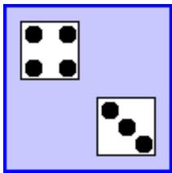

4. In Exercise 6.3, you wrote a pair-of-dice panel where the dice are rolled when the user clicks on the panel Now make a pair-of-dice program in which the user rolls the dice by clicking a button. The button should appear under the panel that shows the dice. Also make the following change: When the dice are rolled, instead of just showing the new value, show a short animation during which the values on the dice are changed in every frame. The animation is supposed to make the dice look more like they are actually rolling. Write your program as a stand-alone application.

5. In Exercise 3.6, you drew a checkerboard. For this exercise, write a checkerboard applet where the user can select a square by clicking on it. Hilite the selected square by drawing a colored border around it. When the applet is first created, no square is selected. When the user clicks on a square that is not currently selected, it becomes selected. If the user clicks the square that is selected, it becomes unselected. Assume that the size of the applet is exactly 160 by 160 pixels, so that each square on the checkerboard is 20 by 20 pixels.

6. For this exercise, you should modify the SubKiller game from Subsection 6.5.4. You can start with the existing source code, from the file SubKillerPanel.java. Modify the game so it keeps track of the number of hits and misses and displays these quantities. That is, every time the depth charge blows up the sub, the number of hits goes up by one. Every time the depth charge falls of the bottom of the screen without hitting the sub, the number of misses goes up by one. There is room at the top of the panel to display these numbers. To do this exercise, you only have to add a half-dozen lines to the source code. But you have to figure out what they are and where to add them. To do this, you’ll have to read the source code closely enough to understand how it works.

7. Exercise 5.2 involved a class, StatCalc.java, that could compute some statistics of a set of numbers. Write a program that uses the StatCalc class to compute and display statistics of numbers entered by the user. The panel will have an instance variable of type StatCalc that does the computations. The panel should include a JTextField where the user enters a number. It should have four labels that display four statistics for the numbers that have been entered: the number of numbers, the sum, the mean, and the standard deviation. Every time the user enters a new number, the statistics displayed on the labels should change. The user enters a number by typing it into the JTextField and pressing return. There should be a “Clear” button that clears out all the data. This means creating a new StatCalc object and resetting the displays on the labels. My panel also has an “Enter” button that does the same thing as pressing the return key in the JTextField. (Recall that a JTextField generates an ActionEvent when the user presses return, so your panel should register itself to listen for ActionEvents from the JTextField.) Write your program as a stand-alone application. Here is a picture of my solution to this problem:

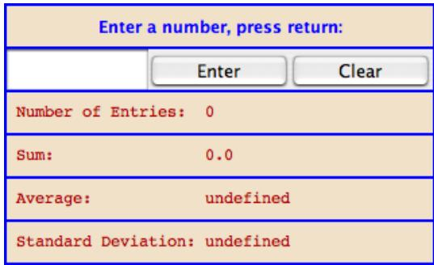

8. Write a panel with a JTextArea where the user can enter some text. The panel should have a button. When the user clicks on the button, the panel should count the number of lines in the user’s input, the number of words in the user’s input, and the number of characters in the user’s input. This information should be displayed on three labels in the panel. Recall that if textInput is a JTextArea, then you can get the contents of the JTextArea by calling the function textInput.getText(). This function returns a String containing all the text from the text area. The number of characters is just the length of this String. Lines in the String are separated by the new line character, ’\n’, so the number of lines is just the number of new line characters in the String, plus one. Words are a little harder to count. Exercise 3.4 has some advice about finding the words in a String. Essentially, you want to count the number of characters that are first characters in words. Don’t forget to put your JTextArea in a JScrollPane, and add the scroll pane to the container, not the text area. Scrollbars should appear when the user types more text than will fit in the available area. Here is a picture of my solution:

My little horse must think it queer To stop without a farmhouse near Between the woods and frozen lake The darkest evening of the year.


9. Write a Blackjack program that lets the user play a game of Blackjack, with the computer as the dealer. The applet should draw the user’s cards and the dealer’s cards, just as was done for the graphical HighLow card game in Subsection 6.7.6. You can use the source code for that game, HighLowGUI.java, for some ideas about how to write your Blackjack game. The structures of the HighLow panel and the Blackjack panel are very similar. You will certainly want to use the drawCard() method from the HighLow program.

You can find a description of the game of Blackjack in Exercise 5.5. Add the following rule to that description: If a player takes five cards without going over 21, that player wins immediately. This rule is used in some casinos. For your program, it means that you only have to allow room for five cards. You should assume that the panel is just wide enough to show five cards, and that it is tall enough show the user’s hand and the dealer’s hand.

Note that the design of a GUI Blackjack game is very diferent from the design of the text-oriented program that you wrote for Exercise 5.5. The user should play the game by clicking on “Hit” and “Stand” buttons. There should be a “New Game” button that can be used to start another game after one game ends. You have to decide what happens when each of these buttons is pressed. You don’t have much chance of getting this right unless you think in terms of the states that the game can be in and how the state can change.

Your program will need the classes defined in Card.java, Hand.java, Deck.java, and BlackjackHand.java.

10. In the Blackjack game from Exercise 6.9, the user can click on the “Hit”, “Stand”, and “NewGame” buttons even when it doesn’t make sense to do so. It would be better if the buttons were disabled at the appropriate times. The “New Game” button should be disabled when there is a game in progress. The “Hit” and “Stand” buttons should be disabled when there is not a game in progress. The instance variable gameInProgress tells whether or not a game is in progress, so you just have to make sure that the buttons are properly enabled and disabled whenever this variable changes value. I strongly advise writing a subroutine that can be called whenever it is necessary to set the value of the gameInProgress variable. Then the subroutine can take responsibility for enabling and disabling the buttons. Recall that if bttn is a variable of type JButton, then bttn.setEnabled(false) disables the button and bttn.setEnabled(true) enables the button.

As a second (and more dificult) improvement, make it possible for the user to place bets on the Blackjack game. When the applet starts, give the user \$100. Add a JTextField to the strip of controls along the bottom of the applet. The user can enter the bet in this JTextField. When the game begins, check the amount of the bet. You should do this when the game begins, not when it ends, because several errors can occur: The contents of the JTextField might not be a legal number. The bet that the user places might be more money than the user has, or it might be <= 0. You should detect these errors and show an error message instead of starting the game. The user’s bet should be an integral number of dollars.

It would be a good idea to make the JTextField uneditable while the game is in progress. If betInput is the JTextField, you can make it editable and uneditable by the user with the commands betInput.setEditable(true) and betInput.setEditable(false).

In the paintComponent() method, you should include commands to display the amount of money that the user has left.

There is one other thing to think about: Ideally, the applet should not start a new game when it is first created. The user should have a chance to set a bet amount before the game starts. So, in the constructor for the drawing surface class, you should not call doNewGame(). You might want to display a message such as “Welcome to Blackjack” before the first game starts.

Here is a picture of my program:

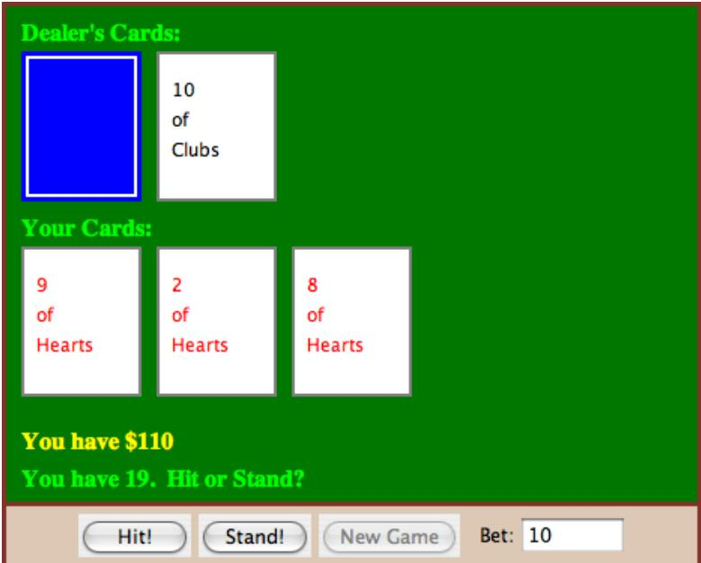

## Quiz on Chapter 6

1. Programs written for a graphical user interface have to deal with “events.” Explain what is meant by the term event. Give at least two diferent examples of events, and discuss how a program might respond to those events.

2. Explain carefully what the repaint() method does.

3. What is HTML?

4. Java has a standard class called JPanel. Discuss two ways in which JPanels can be used.

5. Draw the picture that will be produced by the following paintComponent() method:

```txt
public static void paintComponent(Graphics g) {
    super.paintComponent(g);
    for (int i=10; i <= 210; i = i + 50)
        for (int j = 10; j <= 210; j = j + 50)
            g.drawLine(i,10,j,60);
}
```

6. Suppose you would like a panel that displays a green square inside a red circle, as illustrated. Write a paintComponent() method for the panel class that will draw the image.


7. Java has a standard class called MouseEvent. What is the purpose of this class? What does an object of type MouseEvent do?

8. One of the main classes in Swing is the JComponent class. What is meant by a component? What are some examples?

9. What is the function of a LayoutManager in Java?

10. What type of layout manager is being used for each of the three panels in the following illustration from Section 6.7?

  
T h r e e p a n e l s , s h o w n i n c o l o r , c o n t a i n i n g s i x o t h e r c o m p o n e n t s , s h o w n i n g r a y .

11. Explain how Timers are used to do animation.

12. What is a JCheckBox and how is it used?

## Chapter 7

## Arrays

Computers get a lot of their power from working with data structures. A data structure is an organized collection of related data. An object is a data structure, but this type of data structure—consisting of a fairly small number of named instance variables—is just the beginning. In many cases, programmers build complicated data structures by hand, by linking objects together. We’ll look at these custom-built data structures in Chapter 9. But there is one type of data structure that is so important and so basic that it is built into every programming language: the array.

An array is a data structure consisting of a numbered list of items, where all the items are of the same type. In Java, the items in an array are always numbered from zero up to some maximum value, which is set when the array is created. For example, an array might contain 100 integers, numbered from zero to 99. The items in an array can belong to one of Java’s primitive types. They can also be references to objects, so that you could, for example, make an array containing all the buttons in a GUI program.

This chapter discusses how arrays are created and used in Java. It also covers the standard class java.util.ArrayList. An object of type ArrayList is very similar to an array of Objects, but it can grow to hold any number of items.

## 7.1 Creating and Using Arrays

When a number of data items are chunked together into a unit, the result is a data structure. Data structures can be very complex, but in many applications, the appropriate data structure consists simply of a sequence of data items. Data structures of this simple variety can be either arrays or records.

The term “record” is not used in Java. A record is essentially the same as a Java object that has instance variables only, but no instance methods. Some other languages, which do not support objects in general, nevertheless do support records. The C programming language, for example, is not object-oriented, but it has records, which in C go by the name “struct.” The data items in a record—in Java, an object’s instance variables—are called the fields of the record. Each item is referred to using a field name. In Java, field names are just the names of the instance variables. The distinguishing characteristics of a record are that the data items in the record are referred to by name and that diferent fields in a record are allowed to be of diferent types. For example, if the class Person is defined as:

class Person { String name;

```c
int id_number;
    Date birthday;
    int age;
}
```

then an object of class Person could be considered to be a record with four fields. The field names are name, id number, birthday, and age. Note that the fields are of various types: String, int, and Date.

Because records are just a special type of object, I will not discuss them further.

## 7.1.1 Arrays

Like a record, an array is a sequence of items. However, where items in a record are referred to by name, the items in an array are numbered, and individual items are referred to by their position number. Furthermore, all the items in an array must be of the same type. The definition of an array is: a numbered sequence of items, which are all of the same type. The number of items in an array is called the length of the array. The position number of an item in an array is called the index of that item. The type of the individual items in an array is called the base type of the array.

The base type of an array can be any Java type, that is, one of the primitive types, or a class name, or an interface name. If the base type of an array is int, it is referred to as an “array of ints.” An array with base type String is referred to as an “array of Strings.” However, an array is not, properly speaking, a list of integers or strings or other values. It is better thought of as a list of variables of type int, or of type String, or of some other type. As always, there is some potential for confusion between the two uses of a variable: as a name for a memory location and as a name for the value stored in that memory location. Each position in an array acts as a variable. Each position can hold a value of a specified type (the base type of the array). The value can be changed at any time. Values are stored in an array. The array is the container, not the values.

The items in an array—really, the individual variables that make up the array—are more often referred to as the elements of the array. In Java, the elements in an array are always numbered starting from zero. That is, the index of the first element in the array is zero. If the length of the array is N, then the index of the last element in the array is N-1. Once an array has been created, its length cannot be changed.

Java arrays are objects. This has several consequences. Arrays are created using a form of the new operator. No variable can ever hold an array; a variable can only refer to an array. Any variable that can refer to an array can also hold the value null, meaning that it doesn’t at the moment refer to anything. Like any object, an array belongs to a class, which like all classes is a subclass of the class Object. The elements of the array are, essentially, instance variables in the array object, except that they are referred to by number rather than by name.

Nevertheless, even though arrays are objects, there are diferences between arrays and other kinds of objects, and there are a number of special language features in Java for creating and using arrays.

## 7.1.2 Using Arrays

Suppose that A is a variable that refers to an array. Then the element at index k in A is referred to as A[k]. The first element is A[0], the second is A[1], and so forth. “A[k]” is really a variable, and it can be used just like any other variable. You can assign values to it, you can use it in expressions, and you can pass it as a parameter to a subroutine. All of this will be discussed in more detail below. For now, just keep in mind the syntax

harray-variablei [ hinteger-expressioni ]

for referring to an element of an array.

Although every array, as an object, belongs to some class, array classes never have to be defined. Once a type exists, the corresponding array class exists automatically. If the name of the type is BaseType, then the name of the associated array class is BaseType[ ]. That is to say, an object belonging to the class BaseType[ ] is an array of items, where each item is a variable of type BaseType. The brackets, “[]”, are meant to recall the syntax for referring to the individual items in the array. “BaseType[ ]” is read as “array of BaseType” or “BaseType array.” It might be worth mentioning here that if ClassA is a subclass of ClassB, then the class ClassA[ ] is automatically a subclass of ClassB[ ].

The base type of an array can be any legal Java type. From the primitive type int, the array type int[ ] is derived. Each element in an array of type int[ ] is a variable of type int, which holds a value of type int. From a class named Shape, the array type Shape[ ] is derived. Each item in an array of type Shape[ ] is a variable of type Shape, which holds a value of type Shape. This value can be either null or a reference to an object belonging to the class Shape. (This includes objects belonging to subclasses of Shape.)

$$
* * *
$$

Let’s try to get a little more concrete about all this, using arrays of integers as our first example. Since int[ ] is a class, it can be used to declare variables. For example,

int[] list;

creates a variable named list of type int[ ]. This variable is capable of referring to an array of ints, but initially its value is null (if list is a member variable in a class) or undefined (if list is a local variable in a method). The new operator is used to create a new array object, which can then be assigned to list. The syntax for using new with arrays is diferent from the syntax you learned previously. As an example,

list = new int[5];

creates an array of five integers. More generally, the constructor “new BaseType[N]” is used to create an array belonging to the class BaseType[ ]. The value N in brackets specifies the length of the array, that is, the number of elements that it contains. Note that the array “knows” how long it is. The length of the array is an instance variable in the array object. In fact, the length of an array, list, can be referred to as list.length. (However, you are not allowed to change the value of list.length, so it’s really a “final” instance variable, that is, one whose value cannot be changed after it has been initialized.)

The situation produced by the statement “list = new int[5];” can be pictured like this:

<table><tr><td rowspan="6">list:</td><td>(5) list.length</td></tr><tr><td>0 list[0]</td></tr><tr><td>0 list[1]</td></tr><tr><td>0 list[2]</td></tr><tr><td>0 list[3]</td></tr><tr><td>0 list[4]</td></tr></table>

Note that the newly created array of integers is automatically filled with zeros. In Java, a newly created array is always filled with a known, default value: zero for numbers, false for boolean, the character with Unicode number zero for char, and null for objects.

The elements in the array, list, are referred to as list[0], list[1], list[2], list[3], and list[4]. (Note again that the index for the last item is one less than list.length.) However, array references can be much more general than this. The brackets in an array reference can contain any expression whose value is an integer. For example if indx is a variable of type int, then list[indx] and list[2\*indx+7] are syntactically correct references to elements of the array list. Thus, the following loop would print all the integers in the array, list, to standard output:

```javascript
for (int i = 0; i < list.length; i++) {
    System.out.println( list[i] );
}
```

The first time through the loop, i is 0, and list[i] refers to list[0]. So, it is the value stored in the variable list[0] that is printed. The second time through the loop, i is 1, and the value stored in list[1] is printed. The loop ends after printing the value of list[4], when i becomes equal to 5 and the continuation condition “i < list.length” is no longer true. This is a typical example of using a loop to process an array. I’ll discuss more examples of array processing throughout this chapter.

Every use of a variable in a program specifies a memory location. Think for a moment about what the computer does when it encounters a reference to an array element, list[k], while it is executing a program. The computer must determine which memory location is being referred to. To the computer, list[k] means something like this: “Get the pointer that is stored in the variable, list. Follow this pointer to find an array object. Get the value of k. Go to the k-th position in the array, and that’s the memory location you want.” There are two things that can go wrong here. Suppose that the value of list is null. If that is the case, then list doesn’t even refer to an array. The attempt to refer to an element of an array that doesn’t exist is an error that will cause an exception of type NullPointerException to be thrown. The second possible error occurs if list does refer to an array, but the value of k is outside the legal range of indices for that array. This will happen if k < 0 or if k >= list.length. This is called an “array index out of bounds” error. When an error of this type occurs, an exception of type ArrayIndexOutOfBoundsException is thrown. When you use arrays in a program, you should be mindful that both types of errors are possible. However, array index out of bounds errors are by far the most common error when working with arrays.

## 7.1.3 Array Initialization

For an array variable, just as for any variable, you can declare the variable and initialize it in a single step. For example,

```txt
int[] list = new int[5];
```

If list is a local variable in a subroutine, then this is exactly equivalent to the two statements:

```txt
int[] list;
list = new int[5];
```

(If list is an instance variable, then of course you can’t simply replace “int[] list = new int[5];” with “int[] list; list = new int[5];” since the assignment statement “list = new int[5];” is only legal inside a subroutine.)

The new array is filled with the default value appropriate for the base type of the array—zero for int and null for class types, for example. However, Java also provides a way to initialize an array variable with a new array filled with a specified list of values. In a declaration statement that creates a new array, this is done with an array initializer. For example,

```javascript
int[] list = { 1, 4, 9, 16, 25, 36, 49 };
```

creates a new array containing the seven values 1, 4, 9, 16, 25, 36, and 49, and sets list to refer to that new array. The value of list[0] will be 1, the value of list[1] will be 4, and so forth. The length of list is seven, since seven values are provided in the initializer.

An array initializer takes the form of a list of values, separated by commas and enclosed between braces. The length of the array does not have to be specified, because it is implicit in the list of values. The items in an array initializer don’t have to be constants. They can be variables or arbitrary expressions, provided that their values are of the appropriate type. For example, the following declaration creates an array of eight Colors. Some of the colors are given by expressions of the form “new Color(r,g,b)” instead of by constants:

```javascript
Color[] palette = {
    Color.BLACK,
    Color.RED,
    Color.PINK,
    new Color(0,180,0),  // dark green
    Color.GREEN,
    Color.BLUE,
    new Color(180,180,255),  // light blue
    Color.WHITE
};
```

A list initializer of this form can be used only in a declaration statement, to give an initial value to a newly declared array variable. It cannot be used in an assignment statement to assign a value to a variable that has been previously declared. However, there is another, similar notation for creating a new array that can be used in an assignment statement or passed as a parameter to a subroutine. The notation uses another form of the new operator to both create and initialize a new array object at the same time. (The rather odd syntax is similar to the syntax for anonymous classes, which were discussed in Subsection 5.7.3.) For example to assign a new value to an array variable, list, that was declared previously, you could use:

```javascript
list = new int[] { 1, 8, 27, 64, 125, 216, 343 };
```

The general syntax for this form of the new operator is

```txt
new ⟨base-type⟩ [ ] { ⟨list-of-values⟩ }
```

This is actually an expression whose value is a reference to a newly created array object. This means that it can be used in any context where an object of type hbase-typei[] is expected. For example, if makeButtons is a method that takes an array of Strings as a parameter, you could say:

```typescript
makeButtons( new String[] { "Stop", "Go", "Next", "Previous" } );
```

Being able to create and use an array “in place” in this way can be very convenient, in the same way that anonymous nested classes are convenient.

By the way, it is perfectly legal to use the “new BaseType[] { ... }” syntax instead of the array initializer syntax in the declaration of an array variable. For example, instead of saying:

```javascript
int[] primes = { 2, 3, 5, 7, 11, 13, 17, 19 };
```

you can say, equivalently,

```txt
int[] primes = new int[] { 2, 3, 5, 7, 11, 17, 19 };
```

In fact, rather than use a special notation that works only in the context of declaration statements, I prefer to use the second form.

```txt
* * *
```

One final note: For historical reasons, an array declaration such as

int[] list;

can also be written as

int list[];

which is a syntax used in the languages C and C++. However, this alternative syntax does not really make much sense in the context of Java, and it is probably best avoided. After all, the intent is to declare a variable of a certain type, and the name of that type is “int[ ]”. It makes sense to follow the “htype-namei hvariable-namei;” syntax for such declarations.

## 7.2 Programming With Arrays

Arrays are the most basic and the most important type of data structure, and techniques for processing arrays are among the most important programming techniques you can learn. Two fundamental array processing techniques—searching and sorting—will be covered in Section 7.4. This section introduces some of the basic ideas of array processing in general.

## 7.2.1 Arrays and for Loops

In many cases, processing an array means applying the same operation to each item in the array. This is commonly done with a for loop. A loop for processing all the elements of an array A has the form:

```txt
// do any necessary initialization
for (int i = 0; i < A.length; i++) {
    . . . // process A[i]
}
```

Suppose, for example, that A is an array of type double[ ]. Suppose that the goal is to add up all the numbers in the array. An informal algorithm for doing this would be:

```txt
Start with 0;
Add A[0];   (process the first item in A)
Add A[1];   (process the second item in A)
.
.
.
Add A[ A.length - 1 ];   (process the last item in A)
```

Putting the obvious repetition into a loop and giving a name to the sum, this becomes:

```txt
double sum;  // The sum of the numbers in A.
sum = 0;      // Start with 0.
for (int i = 0; i < A.length; i++)
    sum += A[i];  // add A[i] to the sum, for
        //     i = 0, 1, ..., A.length - 1
```

Note that the continuation condition, “i < A.length”, implies that the last value of i that is actually processed is A.length-1, which is the index of the final item in the array. It’s important to use “<” here, not “<=”, since “<=” would give an array index out of bounds error. There is no element at position A.length in A.

Eventually, you should just about be able to write loops similar to this one in your sleep. I will give a few more simple examples. Here is a loop that will count the number of items in the array A which are less than zero:

```txt
int count;  // For counting the items.
count = 0;  // Start with 0 items counted.
for (int i = 0; i < A.length; i++) {
    if (A[i] < 0.0)   // if this item is less than zero...
        count++;          //      ...then count it
}
// At this point, the value of count is the number
// of items that have passed the test of being < 0
```

Replace the test “A[i] < 0.0”, if you want to count the number of items in an array that satisfy some other property. Here is a variation on the same theme. Suppose you want to count the number of times that an item in the array A is equal to the item that follows it. The item that follows A[i] in the array is A[i+1], so the test in this case is “if (A[i] == A[i+1])”. But there is a catch: This test cannot be applied when A[i] is the last item in the array, since then there is no such item as A[i+1]. The result of trying to apply the test in this case would be an ArrayIndexOutOfBoundsException. This just means that we have to stop one item short of the final item:

```txt
int count = 0;
for (int i = 0; i < A.length - 1; i++) {
    if (A[i] == A[i+1])
        count++;
}
```

Another typical problem is to find the largest number in A. The strategy is to go through the array, keeping track of the largest number found so far. We’ll store the largest number found so far in a variable called max. As we look through the array, whenever we find a number larger than the current value of max, we change the value of max to that larger value. After the whole array has been processed, max is the largest item in the array overall. The only question is, what should the original value of max be? One possibility is to start with max equal to A[0], and then to look through the rest of the array, starting from A[1], for larger items:

```javascript
double max = A[0];
for (int i = 1; i < A.length; i++) {
    if (A[i] > max)
        max = A[i];
}
// at this point, max is the largest item in A
```

(There is one subtle problem here. It’s possible in Java for an array to have length zero. In that case, A[0] doesn’t exist, and the reference to A[0] in the first line gives an array index out of bounds error. However, zero-length arrays are normally something that you want to avoid in real problems. Anyway, what would it mean to ask for the largest item in an array that contains no items at all?)

As a final example of basic array operations, consider the problem of copying an array. To make a copy of our sample array A, it is not suficient to say

```txt
double[] B = A;
```

since this does not create a new array object. All it does is declare a new array variable and make it refer to the same object to which A refers. (So that, for example, a change to A[i] will automatically change B[i] as well.) To make a new array that is a copy of A, it is necessary to make a new array object and to copy each of the individual items from A into the new array:

```txt
for (int i = 0; i < A.length; i++)
    B[i] = A[i];   // Copy each item from A to B.
```

Copying values from one array to another is such a common operation that Java has a predefined subroutine to do it. The subroutine, System.arraycopy(), is a static member subroutine in the standard System class. Its declaration has the form

public static void arraycopy(Object sourceArray, int sourceStartIndex, Object destArray, int destStartIndex, int count)

where sourceArray and destArray can be arrays with any base type. Values are copied from sourceArray to destArray. The count tells how many elements to copy. Values are taken from sourceArray starting at position sourceStartIndex and are stored in destArray starting at position destStartIndex. For example, to make a copy of the array, A, using this subroutine, you would say:

```txt
double B = new double[A.length];
System.arraycopy( A, 0, B, 0, A.length );
```

## 7.2.2 Arrays and for-each Loops

Java 5.0 introduced a new form of the for loop, the “for-each loop” that was introduced in Subsection 3.4.4. The for-each loop is meant specifically for processing all the values in a data structure. When used to process an array, a for-each loop can be used to perform the same operation on each value that is stored in the array. If anArray is an array of type BaseType[ ], then a for-each loop for anArray has the form:

```txt
for ( BaseType item : anArray ) {
    .
    . // process the item
    .
}
```

In this loop, item is the loop control variable. It is being declared as a variable of type BaseType, where BaseType is the base type of the array. (In a for-each loop, the loop control variable must be declared in the loop.) When this loop is executed, each value from the array is assigned to item in turn and the body of the loop is executed for each value. Thus, the above loop is exactly equivalent to:

```java
/**
 * Create a new array of doubles that is a copy of a given array.
 * @param source the array that is to be copied; the value can be null
 * @return a copy of source; if source is null, then the return value is also null
 */
public static double[]  copy( double[] source ) {
    if ( source == null )
```

## 7.2. PROGRAMMING WITH ARRAYS

```txt
for ( int index = 0; index < anArray.length; index++ ) {
    BaseType item;
    item = anArray[index];  // Get one of the values from the array
    .
    .   // process the item
    .
}
```

For example, if A is an array of type int[ ], then we could print all the values from A with the for-each loop:

```txt
for ( int item : A )
    System.out.println( item );
```

and we could add up all the positive integers in A with:

```txt
int sum = 0;   // This will be the sum of all the positive numbers in A
for ( int item : A ) {
    if (item > 0)
        sum = sum + item;
}
```

The for-each loop is not always appropriate. For example, there is no simple way to use it to process the items in just a part of an array. However, it does make it a little easier to process all the values in an array, since it eliminates any need to use array indices.

It’s important to note that a for-each loop processes the values in the array, not the elements (where an element means the actual memory location that is part of the array). For example, consider the following incorrect attempt to fill an array of integers with 17’s:

```txt
int[] intList = new int[10];
for ( int item : intList ) {   // INCORRECT! DOES NOT MODIFY THE ARRAY!
    item = 17;
}
```

The assignment statement item = 17 assigns the value 17 to the loop control variable, item. However, this has nothing to do with the array. When the body of the loop is executed, the value from one of the elements of the array is copied into item. The statement item = 17 replaces that copied value but has no efect on the array element from which it was copied; the value in the array is not changed.

## 7.2.3 Array Types in Subroutines

Any array type, such as double[ ], is a full-fledged Java type, so it can be used in all the ways that any other Java type can be used. In particular, it can be used as the type of a formal parameter in a subroutine. It can even be the return type of a function. For example, it might be useful to have a function that makes a copy of an array of double:

```txt
return null;
double[]  cpy;  // A copy of the source array.
cpy = new double[source.length];
System.arraycopy( source, 0, cpy, 0, source.length );
return cpy;
```

The main() routine of a program has a parameter of type String[ ]. You’ve seen this used since all the way back in Section 2.1, but I haven’t really been able to explain it until now. The parameter to the main() routine is an array of Strings. When the system calls the main() routine, the strings in this array are the command-line arguments from the command that was used to run the program. When using a command-line interface, the user types a command to tell the system to execute a program. The user can include extra input in this command, beyond the name of the program. This extra input becomes the command-line arguments. For example, if the name of the class that contains the main() routine is myProg, then the user can type “java myProg” to execute the program. In this case, there are no command-line arguments. But if the user types the command

## java myProg one two three

then the command-line arguments are the strings “one”, “two”, and “three”. The system puts these strings into an array of Strings and passes that array as a parameter to the main() routine. Here, for example, is a short program that simply prints out any command line arguments entered by the user:

```java
public class CLDemo {

    public static void main(String[] args) {
        System.out.println("You entered " + args.length
                          + " command-line arguments");
        if (args.length > 0) {
            System.out.println("They were:");
            for (int i = 0; i < args.length; i++)
                System.out.println("  " + args[i]);
        }
    } // end main()

} // end class CLDemo
```

Note that the parameter, args, is never null when main() is called by the system, but it might be an array of length zero.

In practice, command-line arguments are often the names of files to be processed by the program. I will give some examples of this in Chapter 11, when I discuss file processing.

## 7.2.4 Random Access

So far, all my examples of array processing have used sequential access. That is, the elements of the array were processed one after the other in the sequence in which they occur in the array. But one of the big advantages of arrays is that they allow random access. That is, every element of the array is equally accessible at any given time.

As an example, let’s look at a well-known problem called the birthday problem: Suppose that there are N people in a room. What’s the chance that there are two people in the room who have the same birthday? (That is, they were born on the same day in the same month, but not necessarily in the same year.) Most people severely underestimate the probability. We will actually look at a diferent version of the question: Suppose you choose people at random and check their birthdays. How many people will you check before you find one who has the same birthday as someone you’ve already checked? Of course, the answer in a particular case depends on random factors, but we can simulate the experiment with a computer program and run the program several times to get an idea of how many people need to be checked on average.

To simulate the experiment, we need to keep track of each birthday that we find. There are 365 diferent possible birthdays. (We’ll ignore leap years.) For each possible birthday, we need to keep track of whether or not we have already found a person who has that birthday. The answer to this question is a boolean value, true or false. To hold the data for all 365 possible birthdays, we can use an array of 365 boolean values:

```txt
boolean[] used;
used = new boolean[365];
```

The days of the year are numbered from 0 to 364. The value of used[i] is true if someone has been selected whose birthday is day number i. Initially, all the values in the array, used, are false. When we select someone whose birthday is day number i, we first check whether used[i] is true. If so, then this is the second person with that birthday. We are done. If used[i] is false, we set used[i] to be true to record the fact that we’ve encountered someone with that birthday, and we go on to the next person. Here is a subroutine that carries out the simulated experiment (of course, in the subroutine, there are no simulated people, only simulated birthdays):

```txt
boolean[] used;  // For recording the possible birthdays
            //   that have been seen so far.  A value
            //   of true in used[i] means that a person
            //   whose birthday is the i-th day of the
            //   year has been found.

int count;      // The number of people who have been checked.
used = new boolean[365];  // Initially, all entries are false.
count = 0;

while (true) {
    // Select a birthday at random, from 0 to 364.
    // If the birthday has already been used, quit.
    // Otherwise, record the birthday as used.
    int birthday;  // The selected birthday.
    birthday = (int)(Math.random()*365);
    count++;
    if ( used[birthday] )  // This day was found before; It's a duplicate.
        break;
    used[birthday] = true;
}

System.out.println("A duplicate birthday was found after "
```

```javascript
+ count + " tries.");
```

## } // end birthdayProblem()

This subroutine makes essential use of the fact that every element in a newly created array of boolean is set to be false. If we wanted to reuse the same array in a second simulation, we would have to reset all the elements in it to be false with a for loop:

```txt
for (int i = 0; i < 365; i++)
    used[i] = false;
```

The program that uses this subroutine is BirthdayProblemDemo.java. An applet version of the program can be found in the online version of this section.

## 7.2.5 Arrays of Objects

One of the examples in Subsection 6.4.2 was an applet that shows multiple copies of a message in random positions, colors, and fonts. When the user clicks on the applet, the positions, colors, and fonts are changed to new random values. Like several other examples from that chapter, the applet had a flaw: It didn’t have any way of storing the data that would be necessary to redraw itself. Arrays provide us with one possible solution to this problem. We can write a new version of the RandomStrings applet that uses an array to store the position, font, and color of each string. When the content pane of the applet is painted, this information is used to draw the strings, so the applet will paint itself correctly whenever it has to be redrawn. When the user clicks on the applet, the array is filled with new random values and the applet is repainted using the new data. So, the only time that the picture will change is in response to a mouse click.

In this applet, the number of copies of the message is given by a named constant, MESSAGE COUNT. One way to store the position, color, and font of MESSAGE COUNT strings would be to use four arrays:

```txt
int[] x = new int[MESSAGE_COUNT];
int[] y = new int[MESSAGE_COUNT];
Color[] color = new Color[MESSAGE_COUNT];
Font[] font = new Font[MESSAGE_COUNT];
```

These arrays would be filled with random values. In the paintComponent() method, the i-th copy of the string would be drawn at the point (x[i],y[i]). Its color would be given by color[i]. And it would be drawn in the font font[i]. This would be accomplished by the paintComponent() method

```java
public void paintComponent(Graphics g) {
    super.paintComponent(); // (Fill with background color.)
    for (int i = 0; i < MESSAGE_COUNT; i++) {
        g.setColor( color[i] );
        g.setFont( font[i] );
        g.drawString( message, x[i], y[i] );
    }
}
```

This approach is said to use parallel arrays. The data for a given copy of the message is spread out across several arrays. If you think of the arrays as laid out in parallel columns— array x in the first column, array y in the second, array color in the third, and array font in the fourth—then the data for the i-th string can be found along the the i-th row. There is nothing wrong with using parallel arrays in this simple example, but it does go against the object-oriented philosophy of keeping related data in one object. If we follow this rule, then we don’t have to imagine the relationship among the data, because all the data for one copy of the message is physically in one place. So, when I wrote the applet, I made a simple class to represent all the data that is needed for one copy of the message:

```txt
/**
 * An object of this type holds the position, color, and font
 * of one copy of the string.
 */
private static class StringData {
    int x, y;      // The coordinates of the left end of baseline of string.
    Color color;  // The color in which the string is drawn.
    Font font;     // The font that is used to draw the string.
}
```

(This class is actually defined as a static nested class in the main applet class.) To store the data for multiple copies of the message, I use an array of type StringData[ ]. The array is declared as an instance variable, with the name stringData:

```txt
StringData[] stringData;
```

Of course, the value of stringData is null until an actual array is created and assigned to it. This is done in the init() method of the applet with the statement

```txt
stringData = new StringData[MESSAGE_COUNT];
```

The base type of this array is StringData, which is a class. We say that stringData is an array of objects. This means that the elements of the array are variables of type StringData. Like any object variable, each element of the array can either be null or can hold a reference to an object. (Note that the term “array of objects” is a little misleading, since the objects are not in the array; the array can only contain references to objects). When the stringData array is first created, the value of each element in the array is null.

The data needed by the RandomStrings program will be stored in objects of type StringData, but no such objects exist yet. All we have so far is an array of variables that are capable of referring to such objects. I decided to create the StringData objects in the applet’s init method. (It could be done in other places—just so long as we avoid trying to use an object that doesn’t exist. This is important: Remember that a newly created array whose base type is an object type is always filled with null elements. There are no objects in the array until you put them there.) The objects are created with the for loop

```txt
for (int i = 0; i < MESSAGE_COUNT; i++)
    stringData[i] = new StringData();
```

For the RandomStrings applet, the idea is to store data for the i-th copy of the message in the variables stringData[i].x, stringData[i].y, stringData[i].color, and stringData[i].font. Make sure that you understand the notation here: stringData[i] refers to an object. That object contains instance variables. The notation stringData[i].x tells the computer: “Find your way to the object that is referred to by stringData[i]. Then go to the instance variable named x in that object.” Variable names can get even more complicated than this, so it is important to learn how to read them. Using the array, stringData, the paintComponent() method for the applet could be written

```java
public void paintComponent(Graphics g) {
    super.paintComponent(g); // (Fill with background color.)
    for (int i = 0; i < MESSAGE_COUNT; i++) {
        g.setColor( stringData[i].color );
        g.setFont( stringData[i].font );
        g.drawString( message, stringData[i].x, stringData[i].y );
    }
}
```

However, since the for loop is processing every value in the array, an alternative would be to use a for-each loop:

```java
public void paintComponent(Graphics g) {
    super.paintComponent(g);
    for ( StringData data : stringData) {
        // Draw a copy of the message in the position, color,
        // and font stored in data.
        g.setColor( data.color );
        g.setFont( data.font );
        g.drawString( message, data.x, data.y );
    }
}
```

In the loop, the loop control variable, data, holds a copy of one of the values from the array. That value is a reference to an object of type StringData, which has instance variables named color, font, x, and y. Once again, the use of a for-each loop has eliminated the need to work with array indices.

There is still the matter of filling the array, data, with random values. If you are interested, you can look at the source code for the applet, RandomStringsWithArray.java.

```txt
* * *
```

The RandomStrings applet uses one other array of objects. The font for a given copy of the message is chosen at random from a set of five possible fonts. In the original version of the applet, there were five variables of type Font to represent the fonts. The variables were named font1, font2, font3, font4, and font5. To select one of these fonts at random, a switch statement could be used:

```txt
Font randomFont;  // One of the 5 fonts, chosen at random.
int rand;          // A random integer in the range 0 to 4.

rand = (int)(Math.random() * 5);
switch (rand) {
    case 0:
        randomFont = font1;
        break;
    case 1:
        randomFont = font2;
        break;
    case 2:
        randomFont = font3;
        break;
    case 3:
        randomFont = font4;
        break;
    case 4:
```

## 7.2. PROGRAMMING WITH ARRAYS

```txt
randomFont = font5;
    break;
}
```

In the new version of the applet, the five fonts are stored in an array, which is named fonts. This array is declared as an instance variable of type Font[ ]

```txt
Font[] fonts;
```

The array is created in the init() method of the applet, and each element of the array is set to refer to a new Font object:

```txt
fonts = new Font[5];  // Create the array to hold the five fonts.
```

```javascript
fonts[0] = new Font("Serif", Font.BOLD, 14);
fonts[1] = new Font("SansSerif", Font.BOLD + Font.ITALIC, 24);
fonts[2] = new Font("Monospaced", Font.PLAIN, 20);
fonts[3] = new Font("Dialog", Font.PLAIN, 30);
fonts[4] = new Font("Serif", Font.ITALIC, 36);
```

This makes it much easier to select one of the fonts at random. It can be done with the statements

```javascript
Font randomFont;  // One of the 5 fonts, chosen at random.
int fontIndex;    // A random number in the range 0 to 4.
fontIndex = (int)(Math.random() * 5);
randomFont = fonts[ fontIndex ];
```

The switch statement has been replaced by a single line of code. In fact, the preceding four lines could be replaced by the single line:

```txt
Font randomFont = fonts[(int)(Math.random()*5)];
```

This is a very typical application of arrays. Note that this example uses the random access property of arrays: We can pick an array index at random and go directly to the array element at that index.

Here is another example of the same sort of thing. Months are often stored as numbers 1, 2, 3, . . . , 12. Sometimes, however, these numbers have to be translated into the names January, February, . . . , December. The translation can be done with an array. The array can be declared and initialized as

```txt
static String[] monthName = { "January", "February", "March",
            "April",   "May",      "June",
            "July",    "August",   "September",
            "October", "November", "December" };
```

If mnth is a variable that holds one of the integers 1 through 12, then monthName[mnth-1] is the name of the corresponding month. We need the “-1” because months are numbered starting from 1, while array elements are numbered starting from 0. Simple array indexing does the translation for us!

## 7.2.6 Variable Arity Methods

Arrays are used in the implementation of one of the new features in Java 5.0. Before version 5.0, every method in Java had a fixed arity. (The arity of a subroutine is defined as the number of parameters in a call to the method.) In a fixed arity method, the number of parameters must be the same in every call to the method. Java 5.0 introduced variable arity methods. In a variable arity method, diferent calls to the method can have diferent numbers of parameters. For example, the formatted output method System.out.printf, which was introduced in Subsection 2.4.4, is a variable arity method. The first parameter of System.out.printf must be a String, but it can have any number of additional parameters, of any types.

Calling a variable arity method is no diferent from calling any other sort of method, but writing one requires some new syntax. As an example, consider a method that can compute the average of any number of values of type double. The definition of such a method could begin with:

```txt
public static double average( double... numbers ) {
```

Here, the ... after the type name, double, indicates that any number of values of type double can be provided when the subroutine is called, so that for example average(1,2,3), average(3.14,2.17), average(0.375), and even average() are all legal calls to this method. Note that actual parameters of type int can be passed to average. The integers will, as usual, be automatically converted to real numbers.

When the method is called, the values of all the actual parameters that correspond to the variable arity parameter are placed into an array, and it is this array that is actually passed to the method. That is, in the body of a method, a variable arity parameter of type T actually looks like an ordinary parameter of type T[ ]. The length of the array tells you how many actual parameters were provided in the method call. In the average example, the body of the method would see an array named numbers of type double[ ]. The number of actual parameters in the method call would be numbers.length, and the values of the actual parameters would be numbers[0], numbers[1], and so on. A complete definition of the method would be:

```txt
public static double average( double... numbers ) {
    double sum;      // The sum of all the actual parameters.
    double average;  // The average of all the actual parameters.
    sum = 0;
    for (int i = 0; i < numbers.length; i++) {
        sum = sum + numbers[i];  // Add one of the actual parameters to the sum.
    }
    average = sum / numbers.length;
    return average;
}
```

Note that the “...” can be applied only to the last formal parameter in a method definition. Note also that it is possible to pass an actual array to the method, instead of a list of individual values. For example, if salesData is a variable of type double[ ], then it would be legal to call average(salesData), and this would compute the average of all the numbers in the array.

As another example, consider a method that can draw a polygon through any number of points. The points are given as values of type Point, where an object of type Point has two instance variables, x and y, of type int. In this case, the method has one ordinary parameter— the graphics context that will be used to draw the polygon—in addition to the variable arity parameter:

```txt
public static void drawPolygon(Graphics g, Point... points) {
    if (points.length > 1) { // (Need at least 2 points to draw anything.)
        for (int i = 0; i < points.length - 1; i++) {
            // Draw a line from i-th point to (i+1)-th point
            g.drawline( points[i].x, points[i].y, points[i+1].x, points[i+1].y );
        }
    }
}
```

```txt
// Now, draw a line back to the starting point.
g.drawLine( points[points.length-1].x, points[points.length-1].y,
               points[0].x, points[0].y );
}
}
```

Because of automatic type conversion, a variable arity parameter of type “Object...” can take actual parameters of any type whatsoever. Even primitive type values are allowed, because of autoboxing. (A primitive type value belonging to a type such as int is converted to an object belonging to a “wrapper” class such as Integer. See Subsection 5.3.2.) For example, the method definition for System.out.printf could begin:

```txt
public void printf(String format, Object... values) {
```

This allows the printf method to output values of any type. Similarly, we could write a method that strings together the string representations of all its parameters into one long string:

```txt
public static String concat( Object... values ) {
    String str = "";  // Start with an empty string.
    for ( Object obj : values ) {   // A "for each" loop for processing the values.
        if (obj == null )
            str = str + "null";  // Represent null values by "null".
        else
            str = str + obj.toString();
    }
}
```

## 7.3 Dynamic Arrays and ArrayLists

The size of an array is fixed when it is created. In many cases, however, the number of data items that are actually stored in the array varies with time. Consider the following examples: An array that stores the lines of text in a word-processing program. An array that holds the list of computers that are currently downloading a page from a Web site. An array that contains the shapes that have been added to the screen by the user of a drawing program. Clearly, we need some way to deal with cases where the number of data items in an array is not fixed.

## 7.3.1 Partially Full Arrays

Consider an application where the number of items that we want to store in an array changes as the program runs. Since the size of the array can’t actually be changed, a separate counter variable must be used to keep track of how many spaces in the array are in use. (Of course, every space in the array has to contain something; the question is, how many spaces contain useful or valid items?)

Consider, for example, a program that reads positive integers entered by the user and stores them for later processing. The program stops reading when the user inputs a number that is less than or equal to zero. The input numbers can be kept in an array, numbers, of type int[ ]. Let’s say that no more than 100 numbers will be input. Then the size of the array can be fixed at 100. But the program must keep track of how many numbers have actually been read and stored in the array. For this, it can use an integer variable, numCount. Each time a number is stored in the array, numCount must be incremented by one. As a rather silly example, let’s write a program that will read the numbers input by the user and then print them in reverse order. (This is, at least, a processing task that requires that the numbers be saved in an array. Remember that many types of processing, such as finding the sum or average or maximum of the numbers, can be done without saving the individual numbers.)

```java
public class ReverseInputNumbers {
    public static void main(String[] args) {
        int[] numbers;  // An array for storing the input values.
        int numCount;   // The number of numbers saved in the array.
        int num;           // One of the numbers input by the user.

        numbers = new int[100];   // Space for 100 ints.
        numCount = 0;            // No numbers have been saved yet.

        TextIO.putln("Enter up to 100 positive integers; enter 0 to end.");
        while (true) {   // Get the numbers and put them in the array.
            TextIO.put("? ");
            num = TextIO.getlnInt();
            if (num <= 0)
                break;
            numbers[numCount] = num;
            numCount++;
        }

        TextIO.putln("\nYour numbers in reverse order are:\n");
        for (int i = numCount - 1; i >= 0; i--) {
            TextIO.putln( numbers[i] );
        }
    } // end main();
    // end class ReverseInputNumbers
```

It is especially important to note that the variable numCount plays a dual role. It is the number of items that have been entered into the array. But it is also the index of the next available spot in the array. For example, if 4 numbers have been stored in the array, they occupy locations number 0, 1, 2, and 3. The next available spot is location 4. When the time comes to print out the numbers in the array, the last occupied spot in the array is location numCount - 1, so the for loop prints out values starting from location numCount - 1 and going down to 0.

Let’s look at another, more realistic example. Suppose that you write a game program, and that players can join the game and leave the game as it progresses. As a good object-oriented programmer, you probably have a class named Player to represent the individual players in the game. A list of all players who are currently in the game could be stored in an array, playerList, of type Player[ ]. Since the number of players can change, you will also need a variable, playerCt, to record the number of players currently in the game. Assuming that there will never be more than 10 players in the game, you could declare the variables as:

```txt
Player[] playerList = new Player[10];  // Up to 10 players.
int      playerCt = 0;   // At the start, there are no players.
```

After some players have joined the game, playerCt will be greater than 0, and the player objects representing the players will be stored in the array elements playerList[0], playerList[1], . . . , playerList[playerCt-1]. Note that the array element playerList[playerCt] is not in use. The procedure for adding a new player, newPlayer, to the game is simple:

```txt
playerList[playerCt] = newPlayer; // Put new player in next
                                //      available spot.
playerCt++;  // And increment playerCt to count the new player.
```

Deleting a player from the game is a little harder, since you don’t want to leave a “hole” in the array. Suppose you want to delete the player at index k in playerList. If you are not worried about keeping the players in any particular order, then one way to do this is to move the player from the last occupied position in the array into position k and then to decrement the value of playerCt:

```txt
playerList[k] = playerList[playerCt - 1];
playerCt--;
```

The player previously in position k is no longer in the array. The player previously in position playerCt - 1 is now in the array twice. But it’s only in the occupied or valid part of the array once, since playerCt has decreased by one. Remember that every element of the array has to hold some value, but only the values in positions 0 through playerCt - 1 will be looked at or processed in any way. (By the way, you should think about what happens if the player that is being deleted is in the last position in the list. The code does still work in this case. What exactly happens?)

Suppose that when deleting the player in position k, you’d like to keep the remaining players in the same order. (Maybe because they take turns in the order in which they are stored in the array.) To do this, all the players in positions k+1 and above must move down one position in the array. Player k+1 replaces player k, who is out of the game. Player k+2 fills the spot left open when player k+1 is moved. And so on. The code for this is

```txt
for (int i = k+1; i < playerCt; i++) {
    playerList[i-1] = playerList[i];
}
playerCt--;
```

It’s worth emphasizing that the Player example deals with an array whose base type is a class. An item in the array is either null or is a reference to an object belonging to the class, Player. The Player objects themselves are not really stored in the array, only references to them. Note that because of the rules for assignment in Java, the objects can actually belong to subclasses of Player. Thus there could be diferent classes of players such as computer players, regular human players, players who are wizards, . . . , all represented by diferent subclasses of Player.

As another example, suppose that a class Shape represents the general idea of a shape drawn on a screen, and that it has subclasses to represent specific types of shapes such as lines, rectangles, rounded rectangles, ovals, filled-in ovals, and so forth. (Shape itself would be an abstract class, as discussed in Subsection 5.5.5.) Then an array of type Shape[ ] can hold references to objects belonging to the subclasses of Shape. For example, the situation created by the statements

```html
Shape[] shapes = new Shape[100]; // Array to hold up to 100 shapes.
shapes[0] = new Rect();          // Put some objects in the array.
shapes[1] = new Line();
shapes[2] = new FilledOval();
int shapeCt = 3;  // Keep track of number of objects in array.
```

could be illustrated as:

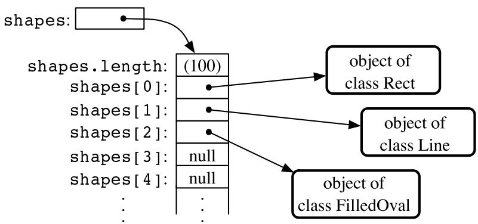

Such an array would be useful in a drawing program. The array could be used to hold a list of shapes to be displayed. If the Shape class includes a method, “void redraw(Graphics g)”, for drawing the shape in a graphics context g, then all the shapes in the array could be redrawn with a simple for loop:

$$
\begin{array}{l} \text {for (int i = 0; i <   shapeCt; i++)} \\ \text {shapes[i].redraw(g);} \end{array}
$$

The statement “shapes[i].redraw(g);” calls the redraw() method belonging to the particular shape at index i in the array. Each object knows how to redraw itself, so that repeated executions of the statement can produce a variety of diferent shapes on the screen. This is nice example both of polymorphism and of array processing.

## 7.3.2 Dynamic Arrays

In each of the above examples, an arbitrary limit was set on the number of items—100 ints, 10 Players, 100 Shapes. Since the size of an array is fixed, a given array can only hold a certain maximum number of items. In many cases, such an arbitrary limit is undesirable. Why should a program work for 100 data values, but not for 101? The obvious alternative of making an array that’s so big that it will work in any practical case is not usually a good solution to the problem. It means that in most cases, a lot of computer memory will be wasted on unused space in the array. That memory might be better used for something else. And what if someone is using a computer that could handle as many data values as the user actually wants to process, but doesn’t have enough memory to accommodate all the extra space that you’ve allocated for your huge array?

Clearly, it would be nice if we could increase the size of an array at will. This is not possible, but what is possible is almost as good. Remember that an array variable does not actually hold an array. It just holds a reference to an array object. We can’t make the array bigger, but we can make a new, bigger array object and change the value of the array variable so that it refers to the bigger array. Of course, we also have to copy the contents of the old array into the new array. The array variable then refers to an array object that contains all the data of the old array, with room for additional data. The old array will be garbage collected, since it is no longer in use.

Let’s look back at the game example, in which playerList is an array of type Player[ ] and playerCt is the number of spaces that have been used in the array. Suppose that we don’t want to put a pre-set limit on the number of players. If a new player joins the game and the current array is full, we just make a new, bigger one. The same variable, playerList, will refer to the new array. Note that after this is done, playerList[0] will refer to a diferent memory location, but the value stored in playerList[0] will still be the same as it was before. Here is some code that will do this:

```java
/**
 * An object of type DynamicArrayOfInt acts like an array of int
 * of unlimited size.  The notation A.get(i) must be used instead
 * of A[i], and A.set(i,v) must be used instead of A[i] = v.
 */
public class DynamicArrayOfInt {

    private int[] data;  // An array to hold the data.

    /**
     * Constructor creates an array with an initial size of 1,
     * but the array size will be increased whenever a reference
     * is made to an array position that does not yet exist.
     */
    public DynamicArrayOfInt() {
        data = new int[1];
    }

    /**
     * Get the value from the specified position in the array.
     * Since all array elements are initialized to zero, when the
     * specified position lies outside the actual physical size
     * of the data array, a value of 0 is returned.  Note that
     * a negative value of position will still produce an
     * IndexOutOfBoundsException.
```

// Add a new player, even if the current array is full.

```javascript
if (playerCt == playerList.length) {
    // Array is full.  Make a new, bigger array,
    // copy the contents of the old array into it,
    // and set playerList to refer to the new array.
    intcraftSize = 2 * playerList.length;  // Size of new array.
    Player[] temp = new Player[newSize];  // The new array.
    System.arraycopy(playerList, 0, temp, 0, playerList.length);
    playerList = temp;  // Set playerList to refer to new array.
}

// At this point, we KNOW there is room in the array.
```

```javascript
playerList[playerCt] = newPlayer; // Add the new player...
playerCt++;                      //      ...and count it.
```

If we are going to be doing things like this regularly, it would be nice to define a reusable class to handle the details. An array-like object that changes size to accommodate the amount of data that it actually contains is called a dynamic array. A dynamic array supports the same operations as an array: putting a value at a given position and getting the value that is stored at a given position. But there is no upper limit on the positions that can be used (except those imposed by the size of the computer’s memory). In a dynamic array class, the put and get operations must be implemented as instance methods. Here, for example, is a class that implements a dynamic array of ints:

```txt
*/
public int get(int position) {
    if (position >= data.length)
        return 0;
    else
        return data[position];
}

/**
 * Store the value in the specified position in the array.
 * The data array will increase in size to include this
 * position, if necessary.
 */
public void put(int position, int value) {
    if (position >= data.length) {
        // The specified position is outside the actual size of
        // the data array. Double the size, or if that still does
        // not include the specified position, set the new size
        // to 2*position.
        int新西兰 = 2 * data.length;
        if (position >=新西兰)
           新西兰 = 2 * position;
        int[]新西兰 = new int[newSize];
        System.arraycopy(data, 0, newData, 0, data.length);
        data = newData;
        // The following line is for demonstration purposes only !! 
        System.out.println("Size of dynamic array increased to " +新西兰);
    }
    data[position] = value;
}

// end class DynamicArrayOfInt
```

The data in a DynamicArrayOfInt object is actually stored in a regular array, but that array is discarded and replaced by a bigger array whenever necessary. If numbers is a variable of type DynamicArrayOfInt, then the command numbers.put(pos,val) stores the value val at position number pos in the dynamic array. The function numbers.get(pos) returns the value stored at position number pos.

The first example in this section used an array to store positive integers input by the user. We can rewrite that example to use a DynamicArrayOfInt. A reference to numbers[i] is replaced by numbers.get(i). The statement “numbers[numCount] = num;” is replaced by “numbers.put(numCount,num);”. Here’s the program:

public class ReverseWithDynamicArray {

```java
public static void main(String[] args) {
    DynamicArrayOfInt numbers;  // To hold the input numbers.
    int numCount;  // The number of numbers stored in the array.
    int num;      // One of the numbers input by the user.

    numbers = new DynamicArrayOfInt();
    numCount = 0;

    TextIO.putln("Enter some positive integers; Enter 0 to end");
    while (true) {  // Get numbers and put them in the dynamic array.
```

```javascript
TextIO.put("? ");
num = TextIO.getlnInt();
if (num <= 0)
    break;
numbers.put(numCount, num); // Store num in the dynamic array.
numCount++;
}
TextIO.putln("\nYour numbers in reverse order are:\n");
for (int i = numCount - 1; i >= 0; i--) {
    TextIO.putln( numbers.get(i) ); // Print the i-th number.
}
} // end main();
} // end class ReverseWithDynamicArray
```

## 7.3.3 ArrrayLists

The DynamicArrayOfInt class could be used in any situation where an array of int with no preset limit on the size is needed. However, if we want to store Shapes instead of ints, we would have to define a new class to do it. That class, probably named “DynamicArrayOfShape”, would look exactly the same as the DynamicArrayOfInt class except that everywhere the type “int” appears, it would be replaced by the type “Shape”. Similarly, we could define a DynamicArrayOfDouble class, a DynamicArrayOfPlayer class, and so on. But there is something a little silly about this, since all these classes are close to being identical. It would be nice to be able to write some kind of source code, once and for all, that could be used to generate any of these classes on demand, given the type of value that we want to store. This would be an example of generic programming. Some programming languages, including C++, have had support for generic programming for some time. With version 5.0, Java introduced true generic programming, but even before that it had something that was very similar: One can come close to generic programming in Java by working with data structures that contain elements of type Object. We will first consider the almost-generic programming that has been available in Java from the beginning, and then we will look at the change that was introduced in Java 5.0. A full discussion of generic programming will be given in Chapter 10.

In Java, every class is a subclass of the class named Object. This means that every object can be assigned to a variable of type Object. Any object can be put into an array of type Object[ ]. If we defined a DynamicArrayOfObject class, then we could store objects of any type. This is not true generic programming, and it doesn’t apply to the primitive types such as int and double. But it does come close. In fact, there is no need for us to define a DynamicArrayOfObject class. Java already has a standard class named ArrayList that serves much the same purpose. The ArrayList class is in the package java.util, so if you want to use it in a program, you should put the directive “import java.util.ArrayList;” at the beginning of your source code file.

The ArrayList class difers from my DynamicArrayOfInt class in that an ArrayList object always has a definite size, and it is illegal to refer to a position in the ArrayList that lies outside its size. In this, an ArrayList is more like a regular array. However, the size of an ArrayList can be increased at will. The ArrayList class defines many instance methods. I’ll describe some of the most useful. Suppose that list is a variable of type ArrayList. Then we have:

• list.size() — This function returns the current size of the ArrayList. The only valid positions in the list are numbers in the range 0 to list.size()-1. Note that the size can be zero. A call to the default constructor new ArrayList() creates an ArrayList of size zero.

• list.add(obj) — Adds an object onto the end of the list, increasing the size by 1. The parameter, obj, can refer to an object of any type, or it can be null.

• list.get(N) — This function returns the value stored at position N in the ArrayList. N must be an integer in the range 0 to list.size()-1. If N is outside this range, an error of type IndexOutOfBoundsException occurs. Calling this function is similar to referring to A[N] for an array, A, except that you can’t use list.get(N) on the left side of an assignment statement.

• list.set(N, obj) — Assigns the object, obj, to position N in the ArrayList, replacing the item previously stored at position N. The integer N must be in the range from 0 to list.size()-1. A call to this function is equivalent to the command A[N] = obj for an array A.

• list.remove(obj) — If the specified object occurs somewhere in the ArrayList, it is removed from the list. Any items in the list that come after the removed item are moved down one position. The size of the ArrayList decreases by 1. If obj occurs more than once in the list, only the first copy is removed.

• list.remove(N) — For an integer, N, this removes the N-th item in the ArrayList. N must be in the range 0 to list.size()-1. Any items in the list that come after the removed item are moved down one position. The size of the ArrayList decreases by 1.

• list.indexOf(obj) — A function that searches for the object, obj, in the ArrayList. If the object is found in the list, then the position number where it is found is returned. If the object is not found, then -1 is returned.

For example, suppose again that players in a game are represented by objects of type Player. The players currently in the game could be stored in an ArrayList named players. This variable would be declared as

ArrayList players;

and initialized to refer to a new, empty ArrayList object with

players = new ArrayList();

If newPlayer is a variable that refers to a Player object, the new player would be added to the ArrayList and to the game by saying

players.add(newPlayer);

and if player number i leaves the game, it is only necessary to say

players.remove(i);

Or, if player is a variable that refers to the Player that is to be removed, you could say

players.remove(player);

All this works very nicely. The only slight dificulty arises when you use the function players.get(i) to get the value stored at position i in the ArrayList. The return type of this function is Object. In this case the object that is returned by the function is actually of type Player. In order to do anything useful with the returned value, it’s usually necessary to type-cast it to type Player:

```javascript
Player plr = (Player)players.get(i);
```

For example, if the Player class includes an instance method makeMove() that is called to allow a player to make a move in the game, then the code for letting every player make a move is

```java
for (int i = 0;  i < players.size();  i++) {
    Player plr = (Player)players.get(i);
    plr.makeMove();
}
```

The two lines inside the for loop can be combined to a single line:

```txt
((Player)players.get(i)).makeMove();
```

This gets an item from the list, type-casts it, and then calls the makeMove() method on the resulting Player. The parentheses around “(Player)players.get(i)” are required because of Java’s precedence rules. The parentheses force the type-cast to be performed before the makeMove() method is called.

For-each loops work for ArrayLists just as they do for arrays. But note that since the items in an ArrayList are only known to be Objects, the type of the loop control variable must be Object. For example, the for loop used above to let each Player make a move could be written as the for-each loop

```txt
for ( Object plrObj : players ) {
    Player plr = (Player)plrObj;
    plr.makeMove();
}
```

In the body of the loop, the value of the loop control variable, plrObj, is one of the objects from the list, players. This object must be type-cast to type Player before it can be used.

```txt
* * *
```

In Subsection 5.5.5, I discussed a program, ShapeDraw, that uses ArrayLists. Here is another version of the same idea, simplified to make it easier to see how ArrayList is being used. The program supports the following operations: Click the large white drawing area to add a colored rectangle. (The color of the rectangle is given by a “rainbow palette” along the bottom of the applet; click the palette to select a new color.) Drag rectangles using the right mouse button. Hold down the Alt key and click on a rectangle to delete it. Shift-click a rectangle to move it out in front of all the other rectangles. You can try an applet version of the program in the on-line version of this section.

Source code for the main panel for this program can be found in SimpleDrawRects.java. You should be able to follow the source code in its entirety. (You can also take a look at the file RainbowPalette.java, which defines the color palette shown at the bottom of the applet, if you like.) Here, I just want to look at the parts of the program that use an ArrayList.

The applet uses a variable named rects, of type ArrayList, to hold information about the rectangles that have been added to the drawing area. The objects that are stored in the list belong to a static nested class, ColoredRect, that is defined as

```txt
/**
 * An object of type ColoredRect holds the data for one colored rectangle.
 */
private static class ColoredRect {
    int x,y;          // Upper left corner of the rectangle.
    int width,height;  // Size of the rectangle.
    Color color;       // Color of the rectangle.
}
```

If g is a variable of type Graphics, then the following code draws all the rectangles that are stored in the list rects (with a black outline around each rectangle):

```txt
for (int i = 0;  i < rects.size();  i++) {
    ColoredRect rect = (ColoredRect)rects.get(i);
    g.setColor( rect.color );
    g.fillRect( rect.x, rect.y, rect.width, rect.height);
    g.setColor( Color.BLACK );
    g.drawRect( rect.x, rect.y, rect.width - 1, rect.height - 1);
}
```

The i-th rectangle in the list is obtained by calling rects.get(i). Since this method returns a value of type Object, the return value must be typecast to its actual type, ColoredRect, to get access to the data that it contains.

To implement the mouse operations, it must be possible to find the rectangle, if any, that contains the point where the user clicked the mouse. To do this, I wrote the function

```javascript
/**
 * Find the topmost rect that contains the point (x,y). Return null
 * if no rect contains that point.  The rects in the ArrayList are
 * considered in reverse order so that if one lies on top of another,
 * the one on top is seen first and is returned.
 */
ColoredRect findRect(int x, int y) {

    for (int i = rects.size() - 1;  i >= 0;  i--) {
        ColoredRect rect = (ColoredRect)rects.get(i);
        if ( x >= rect.x && x < rect.x + rect.width
            && y >= rect.y && y < rect.y + rect.height )
        return rect;  // (x,y) is inside this rect.
    }

    return null;  // No rect containing (x,y) was found.
}
```

The code for removing a ColoredRect, rect, from the drawing area is simply rects.remove(rect) (followed by a repaint()). Bringing a given rectangle out in front of all the other rectangles is just a little harder. Since the rectangles are drawn in the order in which they occur in the ArrayList, the rectangle that is in the last position in the list is in front of all the other rectangles on the screen. So we need to move the selected rectangle to the last position in the list. This can most easily be done in a slightly tricky way using built-in ArrayList operations: The rectangle is simply removed from its current position in the list and then adding back at the end of the list:

```javascript
void bringToFront(ColoredRect rect) {
    if (rect != null) {
        rows.remove(rect); // Remove rect from the list.
        rows.add(rect);   // Add it back; it will be placed in the last position.
        repaint();
    }
}
```

This should be enough to give you the basic idea. You can look in the source code for more details.

## 7.3.4 Parameterized Types

The main diference between true generic programming and the ArrayList examples in the previous subsection is the use of the type Object as the basic type for objects that are stored in a list. This has at least two unfortunate consequences: First, it makes it necessary to use type-casting in almost every case when an element is retrieved from that list. Second, since any type of object can legally be added to the list, there is no way for the compiler to detect an attempt to add the wrong type of object to the list; the error will be detected only at run time when the object is retrieved from the list and the attempt to type-cast the object fails. Compare this to arrays. An array of type BaseType[ ] can only hold objects of type BaseType. An attempt to store an object of the wrong type in the array will be detected by the compiler, and there is no need to type-cast items that are retrieved from the array back to type BaseType.

To address this problem, Java 5.0 introduced parameterized types. ArrayList is an example: Instead of using the plain “ArrayList” type, it is possible to use ArrayList<BaseType>, where BaseType is any object type, that is, the name of a class or of an interface. (BaseType cannot be one of the primitive types.) ArrayList<BaseType> can be used to create lists that can hold only objects of type BaseType. For example,

ArrayList<ColoredRect> rects;

declares a variable named rects of type ArrayList<ColoredRect>, and

```txt
rects = new ArrayList<ColoredRect>();
```

sets rects to refer to a newly created list that can only hold objects belonging to the class ColoredRect (or to a subclass). The funny-looking name “ArrayList<ColoredRect>” is being used here in exactly the same way as an ordinary class name—don’t let the “<ColoredRect>” confuse you; it’s just part of the name of the type. When a statement such as rects.add(x); occurs in the program, the compiler can check whether x is in fact of type ColoredRect. If not, the compiler will report a syntax error. When an object is retrieve from the list, the compiler knows that the object must be of type ColoredRect, so no type-cast is necessary. You can say simply:

$$
\text {ColoredRect rect} = \text {rects.get(i)}
$$

You can even refer directly to an instance variable in the object, such as rects.get(i).color. This makes using ArrayList<ColoredRect> very similar to using ColoredRect[ ] with the added advantage that the list can grow to any size. Note that if a for-each loop is used to process the items in rects, the type of the loop control variable can be ColoredRect, and no type-cast is necessary. For example, when using ArrayList<ColoredRect> as the type for the list rects, the code for drawing all the rectangles in the list could be rewritten as:

```txt
for ( ColoredRect rect : rects ) {
    g.setColor( rect.color );
    g.fillRect( rect.x, rect.y, rect.width, rect.height);
    g.setColor( Color.BLACK );
    g.drawRect( rect.x, rect.y, rect.width - 1, rect.height - 1);
}
```

You can use ArrayList<ColoredRect> anyplace where you could use a normal type: to declare variables, as the type of a formal parameter in a subroutine, or as the return type of a subroutine. You can even create a subclass of ArrayList<ColoredRect>! (Nevertheless, technically speaking, ArrayList<ColoredRect> is not considered to be a separate class from ArrayList. An object of type ArrayList<ColoredRect> actually belongs to the class ArrayList, but the compiler restricts the type of objects that can be added to the list.)

The only drawback to using parameterized types is that the base type cannot be a primitive type. For example, there is no such thing as “ArrayList<int>”. However, this is not such a big drawback as it might seem at first, because of the “wrapper types” and “autoboxing” that were introduced in Subsection 5.3.2. A wrapper type such as Double or Integer can be used as a base type for a parameterized type. An object of type ArrayList<Double> can hold objects of type Double. Since each object of type Double holds a value of type double, it’s almost like having a list of doubles. If numlist is declared to be of type ArrayList<Double> and if x is of type double, then the value of x can be added to the list by saying:

numlist.add( new Double(x) );

Furthermore, because of autoboxing, the compiler will automatically do double-to-Double and Double-to-double type conversions when necessary. This means that the compiler will treat “numlist.add(x)” as begin equivalent to “numlist.add( new Double(x) )”. So, behind the scenes, “numlist.add(x)” is actually adding an object to the list, but it looks a lot as if you are working with a list of doubles.

## ∗ ∗ ∗

The sample program SimplePaint2.java demonstrates the use of parameterized types. In this program, the user can sketch curves in a drawing area by clicking and dragging with the mouse. The curves can be of any color, and the user can select the drawing color using a menu. The background color of the drawing area can also be selected using a menu. And there is a “Control” menu that contains several commands: An “Undo” command, which removes the most recently drawn curve from the screen, a “Clear” command that removes all the curves, and a “Use Symmetry” command that turns a symmetry feature on and of. Curves that are drawn by the user when the symmetry option is on are reflected horizontally and vertically to produce a symmetric pattern. You can try an applet version of the program in the on-line version of this section.

Unlike the original SimplePaint program in Subsection 6.4.4, this new version uses a data structure to store information about the picture that has been drawn by the user. This data is used in the paintComponent() method to redraw the picture whenever necessary. Thus, the picture doesn’t disappear when, for example, the picture is covered and then uncovered. The data structure is implemented using ArrayLists.

The main data for a curve consists of a list of the points on the curve. This data can be stored in an object of type ArrayList<Point>, where java.awt.Point is one of Java’s standard classes. (A Point object contains two public integer variables x and y that represent the coordinates of a point.) However, to redraw the curve, we also need to know its color, and we need to know whether the symmetry option should be applied to the curve. All the data that is needed to redraw the curve can be grouped into an object of type CurveData that is defined as

private static class CurveData {

Color color; // The color of the curve.

boolean symmetric; // Are horizontal and vertical reflections also drawn? ArrayList<Point> points; // The points on the curve.

However, a picture can contain many curves, not just one, so to store all the data necessary to redraw the entire picture, we need a list of objects of type CurveData. For this list, we can use a variable curves declared as

```java
currentCurve.points.add( new Point(evt.getX(), evt.getY()) );
    // The point where the user pressed the mouse is the first point on
    // the curve.  A new Point object is created to hold the coordinates
    // of that point and is added to the list of points for the curve.
```

```typescript
ArrayList<CurveData> curves = new ArrayList<CurveData>();
```

Here we have a list of objects, where each object contains a list of points as part of its data! Let’s look at a few examples of processing this data structure. When the user clicks the mouse on the drawing surface, it’s the start of a new curve, and a new CurveData object must be created and added to the list of curves. The instance variables in the new CurveData object must also be initialized. Here is the code from the mousePressed() routine that does this:

```txt
currentCurve = new CurveData();          // Create a new CurveData object.
currentCurve.color = currentColor;       // The color of the curve is taken from an
                                // instance variable that represents the
                                // currently selected drawing color.
currentCurve.symmetric = useSymmetry;   // The "symmetric" property of the curve
                                // is also copied from the current value
                                // of an instance variable, useSymmetry.
```

```typescript
currentCurve.points = new ArrayList<Point>();  // Create a new point list object.
```

```javascript
curves.add(currentCurve);  // Add the CurveData object to the list of curves.
```

As the user drags the mouse, new points are added to currentCurve, and repaint() is called. When the picture is redrawn, the new point will be part of the picture.

The paintComponent() method has to use the data in curves to draw all the curves. The basic structure is a for-each loop that processes the data for each individual curve in turn. This has the form:

```txt
for ( CurveData curve : curves ) {
    .
    . // Draw the curve represented by the object, curve, of type CurveData.
    .
}
```

In the body of this loop, curve.points is a variable of type ArrayList<Point> that holds the list of points on the curve. The i-th point on the curve can be obtained by calling the get() method of this list: curve.points.get(i). This returns a value of type Point which contains instance variables named x and y. We can refer directly to the x-coordinate of the i-th point as:

```txt
curve.points.get(i).x
```

This might seem rather complicated, but it’s a nice example of a complex name that specifies a path to a desired piece of data: Go to the object, curve. Inside curve, go to points. Inside points, get the i-th item. And from that item, get the instance variable named x. Here is the complete definition of the paintCompontent() method:

```java
public void paintComponent(Graphics g) {
    super.paintComponent(g);
    for ( CurveData curve : curves) {
        g.setColor(curve.color);
        for (int i = 1; i < curve.points.size(); i++) {
```

```javascript
// Draw a line segment from point number i-1 to point number i.
int x1 = curve.points.get(i-1).x;
int y1 = curve.points.get(i-1).y;
int x2 = curve.points.get(i).x;
int y2 = curve.points.get(i).y;
g.drawLine(x1,y1,x2,y2);
if (curve.symmetric) {
    // Also draw the horizontal and vertical reflections
    // of the line segment.
    int w = getWidth();
    int h = getHeight();
    g.drawLine(w-x1,y1,w-x2,y2);
    g.drawLine(x1,h-y1,x2,h-y2);
    g.drawLine(w-x1,h-y1,w-x2,h-y2);
}
}
} // end paintComponent()
```

I encourage you to read the full source code, SimplePaint2.java. In addition to serving as an example of using parameterized types, it also serves an another example of creating and using menus.

## 7.3.5 Vectors

The ArrayList class was introduced in Java version 1.2, as one of a group of classes designed for working with collections of objects. We’ll look at these “collection classes” in Chapter 10. Early versions of Java did not include ArrayList, but they did have a very similar class named java.util.Vector. You can still see Vectors used in older code and in many of Java’s standard classes, so it’s worth knowing about them. Using a Vector is similar to using an ArrayList, except that diferent names are used for some commonly used instance methods, and some instance methods in one class don’t correspond to any instance method in the other class.

Like an ArrayList, a Vector is similar to an array of Objects that can grow to be as large as necessary. The default constructor, new Vector(), creates a vector with no elements. Suppose that vec is a Vector. Then we have:

• vec.size() — a function that returns the number of elements currently in the vector.

• vec.elementAt(N) — returns the N-th element of the vector, for an integer N. N must be in the range 0 to vec.size()-1. This is the same as get(N) for an ArrayList.

• vec.setElementAt(obj,N) — sets the N-th element in the vector to be obj. N must be in the range 0 to vec.size()-1. This is the same as set(N,obj) for an ArrayList.

• vec.addElement(obj) — adds the Object, obj, to the end of the vector. This is the same as the add() method of an ArrayList.

• vec.removeElement(obj) — removes obj from the vector, if it occurs. Only the first occurrence is removed. This is the same as remove(obj) for an ArrayList.

• vec.removeElementAt(N) — removes the N-th element, for an integer N. N must be in the range 0 to vec.size()-1. This is the same as remove(N) for an ArrayList.

• vec.setSize(N) — sets the size of the vector to N. If there were more than N elements in vec, the extra elements are removed. If there were fewer than N elements, extra spaces are filled with null. The ArrayList class, unfortunately, does not have a setSize() method.

The Vector class includes many more methods, but these are probably the most commonly used. Note that in Java 5.0, Vector can be used as a paramaterized type in exactly the same way as ArrayList. That is, if BaseType is any class or interface name, then Vector<BaseType> represents vectors that can hold only objects of type BaseType.

## 7.4 Searching and Sorting

Two array processing techniques that are particularly common are searching and sorting. Searching here refers to finding an item in the array that meets some specified criterion. Sorting refers to rearranging all the items in the array into increasing or decreasing order (where the meaning of increasing and decreasing can depend on the context).

Sorting and searching are often discussed, in a theoretical sort of way, using an array of numbers as an example. In practical situations, though, more interesting types of data are usually involved. For example, the array might be a mailing list, and each element of the array might be an object containing a name and address. Given the name of a person, you might want to look up that person’s address. This is an example of searching, since you want to find the object in the array that contains the given name. It would also be useful to be able to sort the array according to various criteria. One example of sorting would be ordering the elements of the array so that the names are in alphabetical order. Another example would be to order the elements of the array according to zip code before printing a set of mailing labels. (This kind of sorting can get you a cheaper postage rate on a large mailing.)

This example can be generalized to a more abstract situation in which we have an array that contains objects, and we want to search or sort the array based on the value of one of the instance variables in that array. We can use some terminology here that originated in work with “databases,” which are just large, organized collections of data. We refer to each of the objects in the array as a record. The instance variables in an object are then called fields of the record. In the mailing list example, each record would contain a name and address. The fields of the record might be the first name, last name, street address, state, city and zip code. For the purpose of searching or sorting, one of the fields is designated to be the key field. Searching then means finding a record in the array that has a specified value in its key field. Sorting means moving the records around in the array so that the key fields of the record are in increasing (or decreasing) order.

In this section, most of my examples follow the tradition of using arrays of numbers. But I’ll also give a few examples using records and keys, to remind you of the more practical applications.

## 7.4.1 Searching

There is an obvious algorithm for searching for a particular item in an array: Look at each item in the array in turn, and check whether that item is the one you are looking for. If so, the search is finished. If you look at every item without finding the one you want, then you can be sure that the item is not in the array. It’s easy to write a subroutine to implement this algorithm. Let’s say the array that you want to search is an array of ints. Here is a method that will search the array for a specified integer. If the integer is found, the method returns the index of the location in the array where it is found. If the integer is not in the array, the method returns the value -1 as a signal that the integer could not be found:

```c
* Searches the array A for the integer N.  If N is not in the array,
* then -1 is returned.  If N is in the array, then return value is
* the first integer i that satisfies A[i] == N.
*/
static int find(int[] A, int N) {

    for (int index = 0; index < A.length; index++) {
        if ( A[index] == N )
            return index;  // N has been found at this index!
    }

    // If we get this far, then N has not been found
    // anywhere in the array.  Return a value of -1.

    return -1;
}
```

This method of searching an array by looking at each item in turn is called linear search. If nothing is known about the order of the items in the array, then there is really no better alternative algorithm. But if the elements in the array are known to be in increasing or decreasing order, then a much faster search algorithm can be used. An array in which the elements are in order is said to be sorted. Of course, it takes some work to sort an array, but if the array is to be searched many times, then the work done in sorting it can really pay of.

Binary search is a method for searching for a given item in a sorted array. Although the implementation is not trivial, the basic idea is simple: If you are searching for an item in a sorted list, then it is possible to eliminate half of the items in the list by inspecting a single item. For example, suppose that you are looking for the number 42 in a sorted array of 1000 integers. Let’s assume that the array is sorted into increasing order. Suppose you check item number 500 in the array, and find that the item is 93. Since 42 is less than 93, and since the elements in the array are in increasing order, we can conclude that if 42 occurs in the array at all, then it must occur somewhere before location 500. All the locations numbered 500 or above contain values that are greater than or equal to 93. These locations can be eliminated as possible locations of the number 42.

The next obvious step is to check location 250. If the number at that location is, say, -21, then you can eliminate locations before 250 and limit further search to locations between 251 and 499. The next test will limit the search to about 125 locations, and the one after that to about 62. After just 10 steps, there is only one location left. This is a whole lot better than looking through every element in the array. If there were a million items, it would still take only 20 steps for binary search to search the array! (Mathematically, the number of steps is approximately equal to the logarithm, in the base 2, of the number of items in the array.)

In order to make binary search into a Java subroutine that searches an array A for an item N, we just have to keep track of the range of locations that could possibly contain N. At each step, as we eliminate possibilities, we reduce the size of this range. The basic operation is to look at the item in the middle of the range. If this item is greater than N, then the second half of the range can be eliminated. If it is less than N, then the first half of the range can be eliminated. If the number in the middle just happens to be N exactly, then the search is finished. If the size of the range decreases to zero, then the number N does not occur in the array. Here is a subroutine that returns the location of N in a sorted array A. If N cannot be found in the array, then a value of -1 is returned instead:
