<!-- Source PDF pages 361-480 -->

## 7.4. SEARCHING AND SORTING

```solidity
* Searches the array A for the integer N.
* Precondition:  A must be sorted into increasing order.
* Postcondition: If N is in the array, then the return value, i,
*   satisfies A[i] == N.  If N is not in the array, then the
*   return value is -1.
*/
static int binarySearch(int[] A, int N) {

    int lowestPossibleLoc = 0;
    int highestPossibleLoc = A.length - 1;

    while (highestPossibleLoc >= lowestPossibleLoc) {
        int middle = (lowestPossibleLoc + highestPossibleLoc) / 2;
        if (A[middle] == N) {
            // N has been found at this index!
            return middle;
        }
        else if (A[middle] > N) {
            // eliminate locations >= middle
            highestPossibleLoc = middle - 1;
        }
        else {
            // eliminate locations <= middle
            lowestPossibleLoc = middle + 1;
        }
    }

    // At this point, highestPossibleLoc < LowestPossibleLoc,
    // which means that N is known to be not in the array.  Return
    // a -1 to indicate that N could not be found in the array.

    return -1;

}
```

## 7.4.2 Association Lists

One particularly common application of searching is with association lists. The standard example of an association list is a dictionary. A dictionary associates definitions with words. Given a word, you can use the dictionary to look up its definition. We can think of the dictionary as being a list of pairs of the form (w,d), where w is a word and d is its definition. A general association list is a list of pairs (k,v), where k is some “key” value, and v is a value associated to that key. In general, we want to assume that no two pairs in the list have the same key. There are two basic operations on association lists: Given a key, k, find the value v associated with k, if any. And given a key, k, and a value v, add the pair (k,v) to the association list (replacing the pair, if any, that had the same key value). The two operations are usually called get and put.

Association lists are very widely used in computer science. For example, a compiler has to keep track of the location in memory associated with each variable. It can do this with an association list in which each key is a variable name and the associated value is the address of that variable in memory. Another example would be a mailing list, if we think of it as associating an address to each name on the list. As a related example, consider a phone directory that associates a phone number to each name. The items in the list could be objects belonging to the class:

```dart
class PhoneEntry {
    String name;
    String phoneNum;
}
```

The data for a phone directory consists of an array of type PhoneEntry[ ] and an integer variable to keep track of how many entries are actually stored in the directory. The technique of “dynamic arrays” (Subsection 7.3.2) can be used in order to avoid putting an arbitrary limit on the number of entries that the phone directory can hold. Using an ArrayList would be another possibility. A PhoneDirectory class should include instance methods that implement the “get” and “put” operations. Here is one possible simple definition of the class:

```java
* A PhoneDirectory holds a list of names with a phone number for
* each name.  It is possible to find the number associated with
* a given name, and to specify the phone number for a given name.
*/
public class PhoneDirectory {

    /**
     * An object of type PhoneEntry holds one name/number pair.
     */
    private static class PhoneEntry {
        String name;      // The name.
        String number;   // The associated phone number.
    }

    private PhoneEntry[] data;  // Array that holds the name/number pairs.
    private int dataCount;       // The number of pairs stored in the array.

    /**
     * Constructor creates an initially empty directory.
     */
    public PhoneDirectory() {
        data = new PhoneEntry[1];
        dataCount = 0;
    }

    /**
     * Looks for a name/number pair with a given name.  If found, the index
     * of the pair in the data array is returned.  If no pair contains the
     * given name, then the return value is -1.
     */
    private int find( String name ) {
        for (int i = 0; i < dataCount; i++) {
            if (data[i].name.equals(name))
                return i;  // The name has been found in position i.
        }
        return -1;  // The name does not exist in the array.
    }

    /**
     * Finds the phone number, if any, for a given name.
```

```txt
* @return The phone number associated with the name; if the name does
*   not occur in the phone directory, then the return value is null.
*/
public String getNumber( String name ) {
    int position = find(name);
    if (position == -1)
        return null;  // There is no phone entry for the given name.
    else
        return data[position].number;
}

/**
 * Associates a given name with a given phone number.  If the name
 * already exists in the phone directory, then the new number replaces
 * the old one.  Otherwise, a new name/number pair is added.  The
 * name and number should both be non-null.  An IllegalArgumentException
 * is thrown if this is not the case.
 */
public void putNumber( String name, String number ) {
    if (name == null || number == null)
        throw new IllegalArgumentException("name and number cannot be null")
    int i = find(name);
    if (i >= 0) {
        // The name already exists, in position i in the array.
        // Just replace the old number at that position with the new.
        data[i].number = number;
    }
    else {
        // Add a new name/number pair to the array.  If the array is
        // already full, first create a new, larger array.
        if (dataCount == data.length) {
            PhoneEntry[] newData = new PhoneEntry[ 2{*data.length} ];
            System.arraycopy(newData,0,data,0,dataCount);
            data = newData;
        }
        PhoneEntry新征程 = new PhoneEntry();  // Create a new pair.
       新征程.name = name;
       新征程.number = number;
        data[dataCount] =新征程;  // Add the new pair to the array.
        dataCount++;
    }
}

// end class PhoneDirectory
```

The class defines a private instance method, find(), that uses linear search to find the position of a given name in the array of name/number pairs. The find() method is used both in the getNumber() method and in the putNumber() method. Note in particular that putNumber(name,number) has to check whether the name is in the phone directory. If so, it just changes the number in the existing entry; if not, it has to create a new phone entry and add it to the array.

This class could use a lot of improvement. For one thing, it would be nice to use binary search instead of simple linear search in the getNumber method. However, we could only do that if the list of PhoneEntries were sorted into alphabetical order according to name. In fact, it’s really not all that hard to keep the list of entries in sorted order, as you’ll see in the next subsection.

## 7.4.3 Insertion Sort

We’ve seen that there are good reasons for sorting arrays. There are many algorithms available for doing so. One of the easiest to understand is the insertion sort algorithm. This method is also applicable to the problem of keeping a list in sorted order as you add new items to the list. Let’s consider that case first:

Suppose you have a sorted list and you want to add an item to that list. If you want to make sure that the modified list is still sorted, then the item must be inserted into the right location, with all the smaller items coming before it and all the bigger items after it. This will mean moving each of the bigger items up one space to make room for the new item.

```lisp
/*
 * Precondition: itemsInArray is the number of items that are
 * stored in A. These items must be in increasing order
 * (A[0] <= A[1] <= ... <= A[itemsInArray-1]).
 * The array size is at least one greater than itemsInArray.
 * Postcondition: The number of items has increased by one,
 * newItem has been added to the array, and all the items
 * in the array are still in increasing order.
 * Note: To complete the process of inserting an item in the
 * array, the variable that counts the number of items
 * in the array must be incremented, after calling this
 * subroutine.
 */
static void insert(int[] A, int itemsInArray, int newItem) {
    int loc = itemsInArray - 1; // Start at the end of the array.
    /* Move items bigger than newItem up one space;
        Stop when a smaller item is encountered or when the
        beginning of the array (loc == 0) is reached. */
    while (loc >= 0 && A[loc] > newItem) {
        A[loc + 1] = A[loc]; // Bump item from A[loc] up to loc+1.
        loc = loc - 1;          // Go on to next location.
    }
    A[loc + 1] = newItem; // Put newItem in last vacated space.
}
```

Conceptually, this could be extended to a sorting method if we were to take all the items out of an unsorted array, and then insert them back into the array one-by-one, keeping the list in sorted order as we do so. Each insertion can be done using the insert routine given above. In the actual algorithm, we don’t really take all the items from the array; we just remember what part of the array has been sorted:

```txt
static void insertionSort(int[] A) {
    // Sort the array A into increasing order.
    int itemsSorted; // Number of items that have been sorted so far.
    for (itemsSorted = 1; itemsSorted < A.length; itemsSorted++) {
```

```txt
// Assume that items A[0], A[1], ... A[itemsSorted-1]
    // have already been sorted.  Insert A[itemsSorted]
    // into the sorted part of the list.

    int temp = A[itemsSorted];  // The item to be inserted.
    int loc = itemsSorted - 1;  // Start at end of list.

    while (loc >= 0 && A[loc] > temp) {
        A[loc + 1] = A[loc]; // Bump item from A[loc] up to loc+1.
        loc = loc - 1;          // Go on to next location.
    }

    A[loc + 1] = temp; // Put temp in last vacated space.
}
}
```

The following is an illustration of one stage in insertion sort. It shows what happens during one execution of the for loop in the above method, when itemsSorted is 5:


## 7.4.4 Selection Sort

Another typical sorting method uses the idea of finding the biggest item in the list and moving it to the end—which is where it belongs if the list is to be in increasing order. Once the biggest item is in its correct location, you can then apply the same idea to the remaining items. That is, find the next-biggest item, and move it into the next-to-last space, and so forth. This algorithm is called selection sort. It’s easy to write:

```txt
static void selectionSort(int[] A) {
    // Sort A into increasing order, using selection sort
    for (int lastPlace = A.length-1; lastPlace > 0; lastPlace--) {
        // Find the largest item among A[0], A[1], ...,
        // A[lastPlace], and move it into position lastPlace
        // by swapping it with the number that is currently
        // in position lastPlace.

        int maxLoc = 0;  // Location of largest item seen so far.

        for (int j = 1; j <= lastPlace; j++) {
            if (A[j] > A[maxLoc]) {
                // Since A[j] is bigger than the maximum we've seen
                // so far, j is the new location of the maximum value
                // we've seen so far.
                maxLoc = j;
            }
        }

        int temp = A[maxLoc];  // Swap largest item with A[lastPlace].
        A[maxLoc] = A[lastPlace];
        A[lastPlace] = temp;

    } // end of for loop
}
```

Insertion sort and selection sort are suitable for sorting fairly small arrays (up to a few hundred elements, say). There are more complicated sorting algorithms that are much faster than insertion sort and selection sort for large arrays. I’ll discuss one such algorithm in Chapter 9.

```txt
* * *
```

A variation of selection sort is used in the Hand class that was introduced in Subsection 5.4.1. (By the way, you are finally in a position to fully understand the source code for both the Hand class and the Deck class from that section. See the source files Deck.java and Hand.java.)

In the Hand class, a hand of playing cards is represented by a Vector. This is older code, which used Vector instead of ArrayList, and I have chosen not to modify it so that you would see at least one example of using Vectors. See Subsection 7.3.5 for a discussion of Vectors.

The objects stored in the Vector are of type Card. A Card object contains instance methods getSuit() and getValue() that can be used to determine the suit and value of the card. In my sorting method, I actually create a new vector and move the cards one-by-one from the old vector to the new vector. The cards are selected from the old vector in increasing order. In the end, the new vector becomes the hand and the old vector is discarded. This is certainly not the most eficient procedure! But hands of cards are so small that the ineficiency is negligible. Here is the code for sorting cards by suit:

```java
/**
 * Sorts the cards in the hand so that cards of the same suit are
 * grouped together, and within a suit the cards are sorted by value.
 * Note that aces are considered to have the lowest value, 1.
 */
public void sortBySuit() {
    Vector newHand = new Vector();
    while (hand.size() > 0) {
```

```javascript
int pos = 0;  // Position of minimal card found so far.
    Card c = (Card)hand.elementAt(0);  // The minimal card.
    for (int i = 1; i < hand.size(); i++) {
        Card c1 = (Card)hand.elementAt(i);
        if ( c1.getSuit() < c.getSuit() ||
            (c1.getSuit() == c.getSuit() && c1.getValue() < c.getValue())) {
            pos = i;
            c = c1;
        }
    }
    hand.removeElementAt(pos);
    newHand.addElement(c);
}
hand = newHand;
}
```

This example illustrates the fact that comparing items in a list is not usually as simple as using the operator “<”. In this case, we consider one card to be less than another if the suit of the first card is less than the suit of the second, and also if the suits are the same and the value of the second card is less than the value of the first. The second part of this test ensures that cards with the same suit will end up sorted by value.

Sorting a list of Strings raises a similar problem: the “<” operator is not defined for strings. However, the String class does define a compareTo method. If str1 and str2 are of type String, then

## str1.compareTo(str2)

returns an int that is 0 when str1 is equal to str2, is less than 0 when str1 preceeds str2, and is greater than 0 when str1 follows str2. The definition of “succeeds” and “follows” for strings uses what is called lexicographic ordering, which is based on the Unicode values of the characters in the strings. Lexicographic ordering is not the same as alphabetical ordering, even for strings that consist entirely of letters (because in lexicographic ordering, all the upper case letters come before all the lower case letters). However, for words consisting strictly of the 26 lower case letters in the English alphabet, lexicographic and alphabetic ordering are the same. Thus, if str1 and str2 are strings containing only letters from the English alphabet, then the test

```txt
str1.toLowerCase().compareTo(str2.toLowerCase()) < 0
```

is true if and only if str1 comes before str2 in alphabetical order.

## 7.4.5 Unsorting

I can’t resist ending this section on sorting with a related problem that is much less common, but is a bit more fun. That is the problem of putting the elements of an array into a random order. The typical case of this problem is shufling a deck of cards. A good algorithm for shufling is similar to selection sort, except that instead of moving the biggest item to the end of the list, an item is selected at random and moved to the end of the list. Here is a subroutine to shufle an array of ints:

```txt
/**
 * Postcondition:  The items in A have been rearranged into a random order.
 */
static void shuffle(int[] A) {
```

```javascript
for (int lastPlace = A.length-1; lastPlace > 0; lastPlace--) {
    // Choose a random location from among 0,1,...,lastPlace.
    int randLoc = (int)(Math.random()*(lastPlace+1));
    // Swap items in locations randLoc and lastPlace.
    int temp = A[randLoc];
    A[randLoc] = A[lastPlace];
    A[lastPlace] = temp;
}
}
```

## 7.5 Multi-dimensional Arrays

Any type can be used as the base type of an array. You can have an array of ints, an array of Strings, an array of Objects, and so on. In particular, since an array type is a first-class Java type, you can have an array of arrays. For example, an array of ints has type int[ ]. This means that there is automatically another type, int[ ][ ], which represents an “array of arrays of ints”. Such an array is said to be a two-dimensional array. Of course once you have the type int[ ][ ], there is nothing to stop you from forming the type int[ ][ ][ ], which represents a three-dimensional array—and so on. There is no limit on the number of dimensions that an array type can have. However, arrays of dimension three or higher are fairly uncommon, and I concentrate here mainly on two-dimensional arrays. The type BaseType[ ][ ] is usually read “two-dimensional array of BaseType” or “BaseType array array”.

## 7.5.1 Creating Two-dimensional Arrays

The declaration statement “int[][] A;” declares a variable named A of type int[ ][ ]. This variable can hold a reference to an object of type int[ ][ ]. The assignment statement “A = new int[3][4];” creates a new two-dimensional array object and sets A to point to the newly created object. As usual, the declaration and assignment could be combined in a single declaration statement “int[][] A = new int[3][4];”. The newly created object is an array of arraysof-ints. The notation int[3][4] indicates that there are 3 arrays-of-ints in the array A, and that there are 4 ints in each array-of-ints. However, trying to think in such terms can get a bit confusing—as you might have already noticed. So it is customary to think of a two-dimensional array of items as a rectangular grid or matrix of items. The notation “new int[3][4]” can then be taken to describe a grid of ints with 3 rows and 4 columns. The following picture might help:

If you create an array A = new int[3][4], you should think of it as a "matrix" with 3 rows and 4 columns.

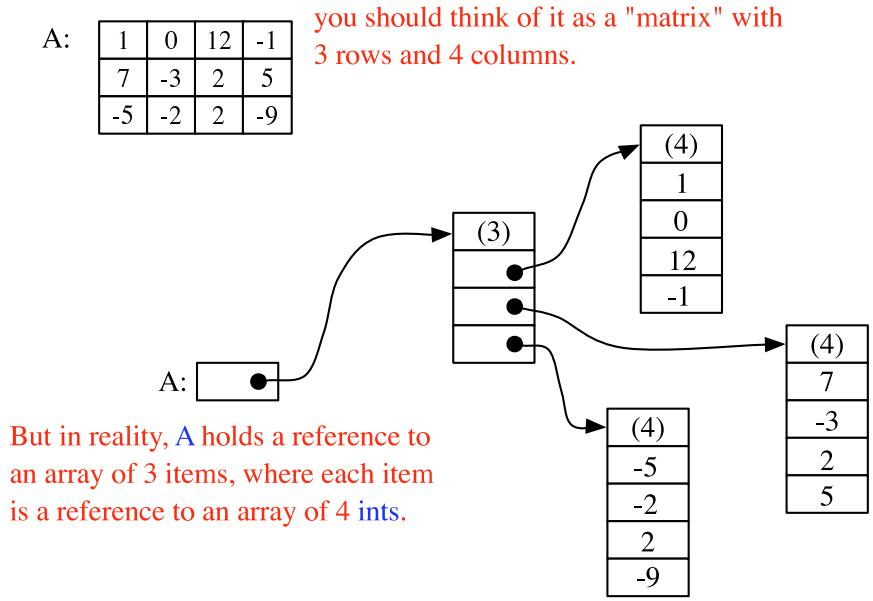

For the most part, you can ignore the reality and keep the picture of a grid in mind. Sometimes, though, you will need to remember that each row in the grid is really an array in itself. These arrays can be referred to as A[0], A[1], and A[2]. Each row is in fact a value of type int[ ]. It could, for example, be passed to a subroutine that asks for a parameter of type int[ ].

The notation A[1] refers to one of the rows of the array A. Since A[1] is itself an array of ints, you can use another subscript to refer to one of the positions in that row. For example, A[1][3] refers to item number 3 in row number 1. Keep in mind, of course, that both rows and columns are numbered starting from zero. So, in the above example, A[1][3] is 5. More generally, A[i][j] refers to the grid position in row number i and column number j. The 12 items in A are named as follows:

A[0][0] A[0][1] A[0][2] A[0][3]

A[1][0] A[1][1] A[1][2] A[1][3]

A[2][0] A[2][1] A[2][2] A[2][3]

A[i][j] is actually a variable of type int. You can assign integer values to it or use it in any other context where an integer variable is allowed.

It might be worth noting that A.length gives the number of rows of A. To get the number of columns in A, you have to ask how many ints there are in a row; this number would be given by A[0].length, or equivalently by A[1].length or A[2].length. (There is actually no rule that says that all the rows of an array must have the same length, and some advanced applications of arrays use varying-sized rows. But if you use the new operator to create an array in the manner described above, you’ll always get an array with equal-sized rows.)

Three-dimensional arrays are treated similarly. For example, a three-dimensional array of ints could be created with the declaration statement “int[][][] B = new int[7][5][11];”. It’s possible to visualize the value of B as a solid 7-by-5-by-11 block of cells. Each cell holds an int and represents one position in the three-dimensional array. Individual positions in the array can be referred to with variable names of the form B[i][j][k]. Higher-dimensional arrays follow the same pattern, although for dimensions greater than three, there is no easy way to visualize the structure of the array.

It’s possible to fill a multi-dimensional array with specified items at the time it is declared. Recall that when an ordinary one-dimensional array variable is declared, it can be assigned an “array initializer,” which is just a list of values enclosed between braces, { and }. Array initializers can also be used when a multi-dimensional array is declared. An initializer for a two-dimensional array consists of a list of one-dimensional array initializers, one for each row in the two-dimensional array. For example, the array A shown in the picture above could be created with:

```txt
int[][] A = { { 1, 0, 12, -1 },
        { 7, -3, 2, 5 },
        { -5, -2, 2, -9 }
};
```

If no initializer is provided for an array, then when the array is created it is automatically filled with the appropriate value: zero for numbers, false for boolean, and null for objects.

## 7.5.2 Using Two-dimensional Arrays

Just as in the case of one-dimensional arrays, two-dimensional arrays are often processed using for statements. To process all the items in a two-dimensional array, you have to use one for statement nested inside another. If the array A is declared as

```javascript
int[][] [ ] A = new int[3][4];
```

then you could store a zero into each location in A with:

```txt
for (int row = 0; row < 3; row++) {
    for (int column = 0; column < 4; column++) {
        A[row][column] = 0;
    }
}
```

The first time the outer for loop executes (with row = 0), the inner for loop fills in the four values in the first row of A, namely A[0][0] = 0, A[0][1] = 0, A[0][2] = 0, and A[0][3] = 0. The next execution of the outer for loop fills in the second row of A. And the third and final execution of the outer loop fills in the final row of A.

Similarly, you could add up all the items in A with:

```matlab
int sum = 0;
for (int i = 0; i < 3; i++)
    for (int j = 0; j < 4; j++)
        sum = sum + A[i][j];
```

This could even be done with nested for-each loops. Keep in mind that the elements in A are objects of type int[ ], while the elements in each row of A are of type int:

```txt
int sum = 0;
for ( int[] row : A ) {          // For each row in A...
    for ( int item : row )     // For each item in that row...
        sum = sum + item;       // Add item to the sum.
}
```

To process a three-dimensional array, you would, of course, use triply nested for loops.

```txt
* * *
```

A two-dimensional array can be used whenever the data that is being represented can be arranged into rows and columns in a natural way. Often, the grid is built into the problem. For example, a chess board is a grid with 8 rows and 8 columns. If a class named ChessPiece is available to represent individual chess pieces, then the contents of a chess board could be represented by a two-dimensional array:

```javascript
ChessPiece[][] board = new ChessPiece[8][8];
```

Or consider the “mosaic” of colored rectangles used in an example in Subsection 4.6.2. The mosaic is implemented by a class named MosaicCanvas.java. The data about the color of each of the rectangles in the mosaic is stored in an instance variable named grid of type Color[ ][ ]. Each position in this grid is occupied by a value of type Color. There is one position in the grid for each colored rectangle in the mosaic. The actual two-dimensional array is created by the statement:

```javascript
grid = new Color[ROWS][COLUMNS];
```

where ROWS is the number of rows of rectangles in the mosaic and COLUMNS is the number of columns. The value of the Color variable grid[i][j] is the color of the rectangle in row number i and column number j. When the color of that rectangle is changed to some color, c, the value stored in grid[i][j] is changed with a statement of the form “grid[i][j] = c;”. When the mosaic is redrawn, the values stored in the two-dimensional array are used to decide what color to make each rectangle. Here is a simplified version of the code from the MosaicCanvas class that draws all the colored rectangles in the grid. You can see how it uses the array:

```javascript
int rowHeight = getHeight() / ROWS;
int colWidth = getWidth() / COLUMNS;
for (int row = 0; row < ROWS; row++) {
    for (int col = 0; col < COLUMNS; col++) {
        g.setColor( grid[row][col] ); // Get color from array.
        g.fillRect( col*colWidth, row*rowHeight,
                             colWidth, rowHeight );
    }
}
```

Sometimes two-dimensional arrays are used in problems in which the grid is not so visually obvious. Consider a company that owns 25 stores. Suppose that the company has data about the profit earned at each store for each month in the year 2006. If the stores are numbered from 0 to 24, and if the twelve months from January ’06 through December ’06 are numbered from 0 to 11, then the profit data could be stored in an array, profit, constructed as follows:

$$
\text {double} [ ] [ ] \quad \text {profit} = \text {new double} [ 2 5 ] [ 1 2 ];
$$

profit[3][2] would be the amount of profit earned at store number 3 in March, and more generally, profit[storeNum][monthNum] would be the amount of profit earned in store number storeNum in month number monthNum. In this example, the one-dimensional array profit[storeNum] has a very useful meaning: It is just the profit data for one particular store for the whole year.

Let’s assume that the profit array has already been filled with data. This data can be processed in a lot of interesting ways. For example, the total profit for the company—for the whole year from all its stores—can be calculated by adding up all the entries in the array:

```txt
double totalProfit;  // Company's total profit in 2006.
totalProfit = 0;
for (int store = 0; store < 25; store++) {
    for (int month = 0; month < 12; month++)
        totalProfit += profit[store][month];
}
```

Sometimes it is necessary to process a single row or a single column of an array, not the entire array. For example, to compute the total profit earned by the company in December, that is, in month number 11, you could use the loop:

```txt
double decemberProfit = 0.0;
for (storeNum = 0; storeNum < 25; storeNum++)
    decemberProfit += profit[storeNum][11];
```

Let’s extend this idea to create a one-dimensional array that contains the total profit for each month of the year:

```solidity
double[] monthlyProfit;  // Holds profit for each month.
monthlyProfit = new double[12];

for (int month = 0; month < 12; month++) {
    // compute the total profit from all stores in this month.
    monthlyProfit[month] = 0.0;
    for (int store = 0; store < 25; store++) {
        // Add the profit from this store in this month
        // into the total profit figure for the month.
        monthlyProfit[month] += profit[store][month];
    }
}
```

As a final example of processing the profit array, suppose that we wanted to know which store generated the most profit over the course of the year. To do this, we have to add up the monthly profits for each store. In array terms, this means that we want to find the sum of each row in the array. As we do this, we need to keep track of which row produces the largest total.

```txt
double maxProfit; // Maximum profit earned by a store.
int bestStore;    // The number of the store with the
        // maximum profit.

double total = 0.0;    // Total profit for one store.

// First compute the profit from store number 0.

for (int month = 0; month < 12; month++)
    total += profit[0][month];

bestStore = 0;      // Start by assuming that the best
maxProfit = total;  //     store is store number 0.

// Now, go through the other stores, and whenever we
// find one with a bigger profit than maxProfit, revise
// the assumptions about bestStore and maxProfit.

for (store = 1; store < 25; store++) {
    // Compute this store's profit for the year.
    total = 0.0;
```

```txt
for (month = 0; month < 12; month++)
    total += profit[store][month];

// Compare this store's profits with the highest
// profit we have seen among the preceding stores.

if (total > maxProfit) {
    maxProfit = total;   // Best profit seen so far!
    bestStore = store;   // It came from this store.
}

} // end for

// At this point, maxProfit is the best profit of any
// of the 25 stores, and bestStore is a store that
// generated that profit. (Note that there could also be
// other stores that generated exactly the same profit.)
```

## 7.5.3 Example: Checkers

For the rest of this section, we’ll look at a more substantial example. We look at a program that lets two users play checkers against each other. A player moves by clicking on the piece to be moved and then on the empty square to which it is to be moved. The squares that the current player can legally click are hilited. The square containing a piece that has been selected to be moved is surrounded by a white border. Other pieces that can legally be moved are surrounded by a cyan-colored border. If a piece has been selected, each empty square that it can legally move to is hilited with a green border. The game enforces the rule that if the current player can jump one of the opponent’s pieces, then the player must jump. When a player’s piece becomes a king, by reaching the opposite end of the board, a big white “K” is drawn on the piece. You can try an applet version of the program in the on-line version of this section. Here is what it looks like:


I will only cover a part of the programming of this applet. I encourage you to read the complete source code, Checkers.java. At over 750 lines, this is a more substantial example than anything you’ve seen before in this course, but it’s an excellent example of state-based, event-driven programming.

The data about the pieces on the board are stored in a two-dimensional array. Because of the complexity of the program, I wanted to divide it into several classes. In addition to the main class, there are several nested classes. One of these classes is CheckersData, which handles the data for the board. It is mainly this class that I want to talk about.

The CheckersData class has an instance variable named board of type int[][]. The value of board is set to “new int[8][8]”, an 8-by-8 grid of integers. The values stored in the grid are defined as constants representing the possible contents of a square on a checkerboard:

```txt
static final int
    EMPTY = 0,          // Value representing an empty square.
    RED = 1,            // A regular red piece.
    RED_KING = 2,       // A red king.
    BLACK = 3,           // A regular black piece.
    BLACK_KING = 4;      // A black king.
```

The constants RED and BLACK are also used in my program (or, perhaps, misused) to represent the two players in the game. When a game is started, the values in the variable, board, are set to represent the initial state of the board. The grid of values looks like

<table><tr><td></td><td>0</td><td>1</td><td>2</td><td>3</td><td>4</td><td>5</td><td>6</td><td>7</td></tr><tr><td>0</td><td>BLACK</td><td>EMPTY</td><td>BLACK</td><td>EMPTY</td><td>BLACK</td><td>EMPTY</td><td>BLACK</td><td>EMPTY</td></tr><tr><td>1</td><td>EMPTY</td><td>BLACK</td><td>EMPTY</td><td>BLACK</td><td>EMPTY</td><td>BLACK</td><td>EMPTY</td><td>BLACK</td></tr><tr><td>2</td><td>BLACK</td><td>EMPTY</td><td>BLACK</td><td>EMPTY</td><td>BLACK</td><td>EMPTY</td><td>BLACK</td><td>EMPTY</td></tr><tr><td>3</td><td>EMPTY</td><td>EMPTY</td><td>EMPTY</td><td>EMPTY</td><td>EMPTY</td><td>EMPTY</td><td>EMPTY</td><td>EMPTY</td></tr><tr><td>4</td><td>EMPTY</td><td>EMPTY</td><td>EMPTY</td><td>EMPTY</td><td>EMPTY</td><td>EMPTY</td><td>EMPTY</td><td>EMPTY</td></tr><tr><td>5</td><td>EMPTY</td><td>RED</td><td>EMPTY</td><td>RED</td><td>EMPTY</td><td>RED</td><td>EMPTY</td><td>RED</td></tr><tr><td>6</td><td>RED</td><td>EMPTY</td><td>RED</td><td>EMPTY</td><td>RED</td><td>EMPTY</td><td>RED</td><td>EMPTY</td></tr><tr><td>7</td><td>EMPTY</td><td>RED</td><td>EMPTY</td><td>RED</td><td>EMPTY</td><td>RED</td><td>EMPTY</td><td>RED</td></tr></table>

A black piece can only move “down” the grid. That is, the row number of the square it moves to must be greater than the row number of the square it comes from. A red piece can only move up the grid. Kings of either color, of course, can move in both directions.

One function of the CheckersData class is to take care of all the details of making moves on the board. An instance method named makeMove() is provided to do this. When a player moves a piece from one square to another, the values stored at two positions in the array are changed. But that’s not all. If the move is a jump, then the piece that was jumped is removed from the board. (The method checks whether the move is a jump by checking if the square to which the piece is moving is two rows away from the square where it starts.) Furthermore, a RED piece that moves to row 0 or a BLACK piece that moves to row 7 becomes a king. This is good programming: the rest of the program doesn’t have to worry about any of these details. It just calls this makeMove() method:

/\*\*

```txt
* Make the move from (fromRow,fromCol) to (toRow,toCol).  It is
```

\* ASSUMED that this move is legal! If the move is a jump, the

\* jumped piece is removed from the board. If a piece moves

\* to the last row on the opponent’s side of the board, the

\* piece becomes a king.

void makeMove(int fromRow, int fromCol, int toRow, int toCol) {

```lisp
board[toRow][toCol] = board[fromRow][fromCol]; // Move the piece.
board[fromRow][fromCol] = EMPTY;

if (fromRow - toRow == 2 || fromRow - toRow == -2) {
    // The move is a jump. Remove the jumped piece from the board.
    int jumpRow = (fromRow + toRow) / 2; // Row of the jumped piece.
    int jumpCol = (fromCol + toCol) / 2; // Column of the jumped piece.
    board[jumpRow][jumpCol] = EMPTY;
}

if (toRow == 0 && board[toRow][toCol] == RED)
    board[toRow][toCol] = RED_KING; // Red piece becomes a king.
if (toRow == 7 && board[toRow][toCol] == BLACK)
    board[toRow][toCol] = BLACK_KING; // Black piece becomes a king.
// end makeMove()
```

An even more important function of the CheckersData class is to find legal moves on the board. In my program, a move in a Checkers game is represented by an object belonging to the following class:

```groovy
/**
 * A CheckersMove object represents a move in the game of
 * Checkers.  It holds the row and column of the piece that is
 * to be moved and the row and column of the square to which
 * it is to be moved.  (This class makes no guarantee that
 * the move is legal.)
 */
private static class CheckersMove {

    int fromRow, fromCol;  // Position of piece to be moved.
    int toRow, toCol;      // Square it is to move to.

    CheckersMove(int r1, int c1, int r2, int c2) {
        // Constructor.  Set the values of the instance variables
        fromRow = r1;
        fromCol = c1;
        toRow = r2;
        toCol = c2;
    }

    boolean isJump() {
        // Test whether this move is a jump.  It is assumed that
        // the move is legal.  In a jump, the piece moves two
        // rows.  (In a regular move, it only moves one row.)
        return (fromRow - toRow == 2 || fromRow - toRow == -2);
    }

} // end class CheckersMove.
```

The CheckersData class has an instance method which finds all the legal moves that are currently available for a specified player. This method is a function that returns an array of type CheckersMove[ ]. The array contains all the legal moves, represented as CheckersMove objects. The specification for this method reads

```c
* Return an array containing all the legal CheckersMoves
* for the specified player on the current board.  If the player
* has no legal moves, null is returned.  The value of player
* should be one of the constants RED or BLACK; if not, null
* is returned.  If the returned value is non-null, it consists
* entirely of jump moves or entirely of regular moves, since
* if the player can jump, only jumps are legal moves.
*/
CheckersMove[] getLegalMoves(int player)
```

A brief pseudocode algorithm for the method is

```python
Start with an empty list of moves
Find any legal jumps and add them to the list
if there are no jumps:
    Find any other legal moves and add them to the list
if the list is empty:
    return null
else:
    return the list
```

Now, what is this “list”? We have to return the legal moves in an array. But since an array has a fixed size, we can’t create the array until we know how many moves there are, and we don’t know that until near the end of the method, after we’ve already made the list! A neat solution is to use an ArrayList instead of an array to hold the moves as we find them. In fact, I use an object defined by the parameterized type ArrayList<CheckersMove> so that the list is restricted to holding objects of type CheckersMove. As we add moves to the list, it will grow just as large as necessary. At the end of the method, we can create the array that we really want and copy the data into it:

```python
Let "moves" be an empty ArrayList<CheckerMove>
Find any legal jumps and add them to moves
if moves.size() is 0:
    Find any other legal moves and add them to moves
if moves.size() is 0:
    return null
else:
    Let moveArray be an array of CheckersMoves of length moves.size()
    Copy the contents of moves into moveArray
    return moveArray
```

Now, how do we find the legal jumps or the legal moves? The information we need is in the board array, but it takes some work to extract it. We have to look through all the positions in the array and find the pieces that belong to the current player. For each piece, we have to check each square that it could conceivably move to, and check whether that would be a legal move. There are four squares to consider. For a jump, we want to look at squares that are two rows and two columns away from the piece. Thus, the line in the algorithm that says “Find any legal jumps and add them to moves” expands to:

```python
For each row of the board:
    For each column of the board:
        if one of the player's pieces is at this location:
            if it is legal to jump to row + 2, column + 2
                add this move to moves
```

```txt
if it is legal to jump to row - 2, column + 2
    add this move to moves
if it is legal to jump to row + 2, column - 2
    add this move to moves
if it is legal to jump to row - 2, column - 2
    add this move to moves
```

The line that says “Find any other legal moves and add them to moves” expands to something similar, except that we have to look at the four squares that are one column and one row away from the piece. Testing whether a player can legally move from one given square to another given square is itself non-trivial. The square the player is moving to must actually be on the board, and it must be empty. Furthermore, regular red and black pieces can only move in one direction. I wrote the following utility method to check whether a player can make a given non-jump move:

```txt
/**
 * This is called by the getLegalMoves() method to determine
 * whether the player can legally move from (r1,c1) to (r2,c2).
 * It is ASSUMED that (r1,c1) contains one of the player's
 * pieces and that (r2,c2) is a neighboring square.
 */
private boolean canMove(int player, int r1, int c1, int r2, int c2) {
    if (r2 < 0 || r2 >= 8 || c2 < 0 || c2 >= 8)
        return false;  // (r2,c2) is off the board.

    if (board[r2][c2] != EMPTY)
        return false;  // (r2,c2) already contains a piece.

    if (player == RED) {
        if (board[r1][c1] == RED && r2 > r1)
            return false;  // Regular red piece can only move down.
        return true;  // The move is legal.
    }
    else {
        if (board[r1][c1] == BLACK && r2 < r1)
            return false;  // Regular black piece can only move up.
        return true;  // The move is legal.
    }
} // end canMove()
```

This method is called by my getLegalMoves() method to check whether one of the possible moves that it has found is actually legal. I have a similar method that is called to check whether a jump is legal. In this case, I pass to the method the square containing the player’s piece, the square that the player might move to, and the square between those two, which the player would be jumping over. The square that is being jumped must contain one of the opponent’s pieces. This method has the specification:

```txt
/**
 * This is called by other methods to check whether
 * the player can legally jump from (r1,c1) to (r3,c3).
 * It is assumed that the player has a piece at (r1,c1), that
 * (r3,c3) is a position that is 2 rows and 2 columns distant
 * from (r1,c1) and that (r2,c2) is the square between (r1,c1)
 * and (r3,c3).
```

```txt
*/
private boolean canJump(int player, int r1, int c1,
                          int r2, int c2, int r3, int c3) { . . .
```

Given all this, you should be in a position to understand the complete getLegalMoves() method. It’s a nice way to finish of this chapter, since it combines several topics that we’ve looked at: one-dimensional arrays, ArrayLists, and two-dimensional arrays:

```txt
eckersMove[] getLegalMoves(int player) {
    if (player != RED && player != BLACK)
        return null;

    int playerKing;  // The constant for a King belonging to the player.
    if (player == RED)
        playerKing = RED_KING;
    else
        playerKing = BLACK_KING;

    ArrayList<ChecherMove> moves = new ArrayList<CheckerMove>();
            // Moves will be stored in this list.

    /* First, check for any possible jumps. Look at each square on
       the board. If that square contains one of the player's pieces,
       look at a possible jump in each of the four directions from that
       square. If there is a legal jump in that direction, put it in
       the moves ArrayList.
    */

    for (int row = 0; row < 8; row++) {
        for (int col = 0; col < 8; col++) {
            if (board[row][col] == player || board[row][col] == playerKing) {
                if (canJump(player, row, col, row+1, col+1, row+2, col+2))
                    moves.add(new CheckersMove(row, col, row+2, col+2));
                if (canJump(player, row, col, row-1, col+1, row-2, col+2))
                    moves.add(new CheckersMove(row, col, row-2, col+2));
                if (canJump(player, row, col, row+1, col-1, row+2, col-2))
                    moves.add(new CheckersMove(row, col, row+2, col-2));
                if (canJump(player, row, col, row-1, col-1, row-2, col-2))
                    moves.add(new CheckersMove(row, col, row-2, col-2));
            }
        }
    }

    /* If any jump moves were found, then the user must jump, so we
       don't add any regular moves. However, if no jumps were found,
       check for any legal regular moves. Look at each square on
       the board. If that square contains one of the player's pieces,
       look at a possible move in each of the four directions from
       that square. If there is a legal move in that direction,
       put it in the moves ArrayList.
    */

    if (moves.size() == 0) {
        for (int row = 0; row < 8; row++) {
            for (int col = 0; col < 8; col++) {
                if (board[row][col] == player || board[row][col] == playerKing) {
```

```javascript
if (canMove(player,row,col,row+1,col+1))
    moves.add(new CheckersMove(row,col,row+1,col+1));
if (canMove(player,row,col,row-1,col+1))
    moves.add(new CheckersMove(row,col,row-1,col+1));
if (canMove(player,row,col,row+1,col-1))
    moves.add(new CheckersMove(row,col,row+1,col-1));
if (canMove(player,row,col,row-1,col-1))
    moves.add(new CheckersMove(row,col,row-1,col-1));
}
}
}
}
/* If no legal moves have been found, return null. Otherwise, create
an array just big enough to hold all the legal moves, copy the
legal moves from the ArrayList into the array, and return the array.
*/
if (moves.size() == 0)
return null;
else {
CheckersMove[] moveArray = new CheckersMove[moves.size()];
for (int i = 0; i < moves.size(); i++)
moveArray[i] = moves.get(i);
return moveArray;
}
// end getLegalMoves
```

## Exercises for Chapter 7

1. An example in Subsection 7.2.4 tried to answer the question, How many random people do you have to select before you find a duplicate birthday? The source code for that program can be found in the file BirthdayProblemDemo.java. Here are some related questions:

• How many random people do you have to select before you find three people who share the same birthday? (That is, all three people were born on the same day in the same month, but not necessarily in the same year.)

• Suppose you choose 365 people at random. How many diferent birthdays will they have? (The number could theoretically be anywhere from 1 to 365).

• How many diferent people do you have to check before you’ve found at least one person with a birthday on each of the 365 days of the year?

Write three programs to answer these questions. Each of your programs should simulate choosing people at random and checking their birthdays. (In each case, ignore the possibility of leap years.)

2. Write a program that will read a sequence of positive real numbers entered by the user and will print the same numbers in sorted order from smallest to largest. The user will input a zero to mark the end of the input. Assume that at most 100 positive numbers will be entered.

3. A polygon is a geometric figure made up of a sequence of connected line segments. The points where the line segments meet are called the vertices of the polygon. The Graphics class includes commands for drawing and filling polygons. For these commands, the coordinates of the vertices of the polygon are stored in arrays. If g is a variable of type Graphics then

• g.drawPolygon(xCoords, yCoords, pointCt) will draw the outline of the polygon with vertices at the points (xCoords[0],yCoords[0]), (xCoords[1],yCoords[1]), . . . , (xCoords[pointCt-1],yCoords[pointCt-1]). The third parameter, pointCt, is an int that specifies the number of vertices of the polygon. Its value should be 3 or greater. The first two parameters are arrays of type int[]. Note that the polygon automatically includes a line from the last point, (xCoords[pointCt-1],yCoords[pointCt-1]), back to the starting point (xCoords[0],yCoords[0]).

• g.fillPolygon(xCoords, yCoords, pointCt) fills the interior of the polygon with the current drawing color. The parameters have the same meaning as in the drawPolygon() method. Note that it is OK for the sides of the polygon to cross each other, but the interior of a polygon with self-intersections might not be exactly what you expect.

Write a panel class that lets the user draw polygons, and use your panel as the content pane in an applet (or standalone application). As the user clicks a sequence of points, count them and store their x- and y-coordinates in two arrays. These points will be the vertices of the polygon. Also, draw a line between each consecutive pair of points to give the user some visual feedback. When the user clicks near the starting point, draw the complete polygon. Draw it with a red interior and a black border. The user should then be able to start drawing a new polygon. When the user shift-clicks on the applet, clear it.

For this exercise, there is no need to store information about the contents of the applet. Do the drawing directly in the mouseDragged() routine, and use the getGraphics() method to get a Graphics object that you can use to draw the line. (Remember, though, that this is considered to be bad style.) You will not need a paintComponent() method, since the default action of filling the panel with its background color is good enough.

Here is a picture of my solution after the user has drawn a few polygons:

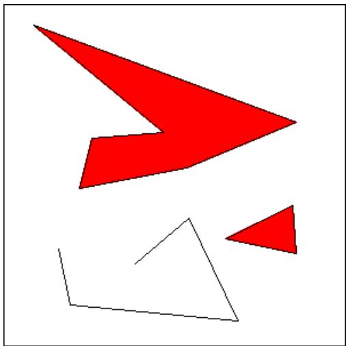

4. For this problem, you will need to use an array of objects. The objects belong to the class MovingBall, which I have already written. You can find the source code for this class in the file MovingBall.java. A MovingBall represents a circle that has an associated color, radius, direction, and speed. It is restricted to moving in a rectangle in the (x,y) plane. It will “bounce back” when it hits one of the sides of this rectangle. A MovingBall does not actually move by itself. It’s just a collection of data. You have to call instance methods to tell it to update its position and to draw itself. The constructor for the MovingBall class takes the form

new MovingBall(xmin, xmax, ymin, ymax)

where the parameters are integers that specify the limits on the x and y coordinates of the ball. In this exercise, you will want balls to bounce of the sides of the applet, so you will create them with the constructor call

new MovingBall(0, getWidth(), 0, getHeight())

The constructor creates a ball that initially is colored red, has a radius of 5 pixels, is located at the center of its range, has a random speed between 4 and 12, and is headed in a random direction. There is one problem here: You can’t use this constructor until the width and height of the component are known. It would be OK to use it in the init() method of an applet, but not in the constructor of an applet or panel class. If you are using a panel class to display the ball, one slightly messy solution is to create the MovingBall objects in the panel’s paintComponent() method the first time that method is called. You can be sure that the size of the panel has been determined before paintComponent() is called. This is what I did in my own solution to this exercise.

If ball is a variable of type MovingBall, then the following methods are available:

• ball.draw(g) — draw the ball in a graphics context. The parameter, g, must be of type Graphics. (The drawing color in g will be changed to the color of the ball.)

• ball.travel() — change the (x,y)-coordinates of the ball by an amount equal to its speed. The ball has a certain direction of motion, and the ball is moved in that direction. Ordinarily, you will call this once for each frame of an animation, so the speed is given in terms of “pixels per frame”. Calling this routine does not move the ball on the screen. It just changes the values of some instance variables in the object. The next time the object’s draw() method is called, the ball will be drawn in the new position.

• ball.headTowards(x,y) — change the direction of motion of the ball so that it is headed towards the point (x,y). This does not afect the speed.

These are the methods that you will need for this exercise. There are also methods for setting various properties of the ball, such as ball.setColor(color) for changing the color and ball.setRadius(radius) for changing its size. See the source code for more information.

For this exercise, you should create an applet that shows an animation of balls bouncing around on a black background. Use a Timer to drive the animation. (See Subsection 6.5.1.) Use an array of type MovingBall[] to hold the data for the balls. In addition, your program should listen for mouse and mouse motion events. When the user presses the mouse or drags the mouse, call each of the ball’s headTowards() methods to make the balls head towards the mouse’s location. My solution uses 50 balls and a time delay of 50 milliseconds for the timer.

5. The sample program RandomArtPanel.java from Subsection 6.5.1 shows a diferent random “artwork” every four seconds. There are three types of “art”, one made from lines, one from circles, and one from filled squares. However, the program does not save the data for the picture that is shown on the screen. As a result, the picture cannot be redrawn when necessary. In fact, every time paintComponent() is called, a new picture is drawn.

Write a new version of RandomArtPanel.java that saves the data needed to redraw its pictures. The paintComponent() method should simply use the data to draw the picture. New data should be recomputed only every four seconds, in response to an event from the timer that drives the program.

To make this interesting, write a separate class for each of the three diferent types of art. Also write an abstract class to serve as the common base class for the three classes. Since all three types of art use a random gray background, the background color can be defined in their superclass. The superclass also contains a draw() method that draws the picture; this is an abstract method because its implementation depends on the particular type of art that is being drawn. The abstract class can be defined as:

```txt
private abstract class ArtData {
    Color thirdColor;  // The background color for the art.
    ArtData() {  // Constructor sets background color to be a random gray.
        int x = (int)(256*Math.random());
        thirdColor = new Color( x, x, x, );
    }
    abstract void draw(Graphics g);  // Draws this artwork.
}
```

Each of the three subclasses of ArtData must define its own draw() method. It must also define instance variables to hold the data necessary to draw the picture. I suggest that you should create random data for the picture in the constructor of the class, so that constructing the object will automatically create the data for a random artwork. (One problem with this is that you can’t create the data until you know the size of the panel, so you can’t create an artdata object in the constructor of the panel. One solution is to create an artdata object at the beginning of the paintComponent() method, if the object has not already been created.) In all three subclasses, you will need to use several arrays to store the data.

The file RandomArtPanel.java only defines a panel class. A main program that uses this panel can be found in RandomArt.java, and an applet that uses it can be found in RandomArtApplet.java.

6. Write a program that will read a text file selected by the user, and will make an alphabetical list of all the diferent words in that file. All words should be converted to lower case, and duplicates should be eliminated from the list. The list should be written to an output file selected by the user. As discussed in Subsection 2.4.5, you can use TextIO to read and write files. Use a variable of type ArrayList<String> to store the words. (See Subsection 7.3.4.) It is not easy to separate a file into words as you are reading it. You can use the following method:

```javascript
/**
 * Read the next word from TextIO, if there is one.  First, skip past
 * any non-letters in the input.  If an end-of-file is encountered before
 * a word is found, return null.  Otherwise, read and return the word.
 * A word is defined as a sequence of letters.  Also, a word can include
 * an apostrophe if the apostrophe is surrounded by letters on each side.
 * @return the next word from TextIO, or null if an end-of-file is
 * encountered
 */
private static String readNextWord() {
    char ch = TextIO.peek(); // Look at next character in input.
    while (ch != TextIO.EOF && ! Character.isLetter(ch)) {
        TextIO.getAnyChar();  // Read the character.
        ch = TextIO.peek();   // Look at the next character.
    }
    if (ch == TextIO.EOF) // Encountered end-of-file
        return null;
    // At this point, we know the next character is a letter, so read a word.
    String word = "";  // This will be the word that is read.
    while (true) {
        word += TextIO.getAnyChar();  // Append the letter onto word.
        ch = TextIO.peek();  // Look at next character.
        if ( ch == '\') {
            // The next character is an apostrophe.  Read it, and
            // if the following character is a letter, add both the
            // apostrophe and the letter onto the word and continue
            // reading the word.  If the character after the apostrophe
            // is not a letter, the word is done, so break out of the loop.
        TextIO.getAnyChar();   // Read the apostrophe.
        ch = TextIO.peek();      // Look at char that follows apostrophe.
        if (Character.isLetter(ch)) {
```

```dart
word += "\"' + TextIO.getAnyChar();
ch = TextIO.peek(); // Look at next char.
}
else
break;
}
if ( ! Character.isLetter(ch) ) {
// If the next character is not a letter, the word is
// finished, so break out of the loop.
break;
}
// If we haven't broken out of the loop, next char is a letter.
}
return word; // Return the word that has been read.
}
```

Note that this method will return null when the file has been entirely read. You can use this as a signal to stop processing the input file.

7. The game of Go Moku (also known as Pente or Five Stones) is similar to Tic-Tac-Toe, except that it played on a much larger board and the object is to get five squares in a row rather than three. Players take turns placing pieces on a board. A piece can be placed in any empty square. The first player to get five pieces in a row—horizontally, vertically, or diagonally—wins. If all squares are filled before either player wins, then the game is a draw. Write a program that lets two players play Go Moku against each other.

Your program will be simpler than the Checkers program from Subsection 7.5.3. Play alternates strictly between the two players, and there is no need to hilite the legal moves. You will only need two classes, a short panel class to set up the interface and a Board class to draw the board and do all the work of the game. Nevertheless, you will probably want to look at the source code for the checkers program, Checkers.java, for ideas about the general outline of the program.

The hardest part of the program is checking whether the move that a player makes is a winning move. To do this, you have to look in each of the four possible directions from the square where the user has placed a piece. You have to count how many pieces that player has in a row in that direction. If the number is five or more in any direction, then that player wins. As a hint, here is part of the code from my applet. This code counts the number of pieces that the user has in a row in a specified direction. The direction is specified by two integers, dirX and dirY. The values of these variables are 0, 1, or -1, and at least one of them is non-zero. For example, to look in the horizontal direction, dirX is 1 and dirY is 0.

```javascript
int ct = 1;  // Number of pieces in a row belonging to the player.
int r, c;    // A row and column to be examined
r = row + dirX;  // Look at square in specified direction.
c = col + dirY;
while ( r >= 0 && r < 13 && c >= 0 && c < 13
                          && board[r][c] == player ) {
    // Square is on the board, and it
    // contains one of the players's pieces.
    ct++;
```

```lisp
r += dirX;  // Go on to next square in this direction.
    c += dirY;
}

r = row - dirX;  // Now, look in the opposite direction.
c = col - dirY;
while ( r >= 0 && r < 13 && c >= 0 && c < 13
                          && board[r][c] == player ) {
    ct++;
    r -= dirX;   // Go on to next square in this direction.
    c -= dirY;
}
```

Here is a picture of my program It uses a 13-by-13 board. You can do the same or use a normal 8-by-8 checkerboard.


## Quiz on Chapter 7

1. What does the computer do when it executes the following statement? Try to give as complete an answer as possible.

```txt
Color[] palette = new Color[12];
```

2. What is meant by the basetype of an array?

3. What does it mean to sort an array?

4. What is the main advantage of binary search over linear search? What is the main disadvantage?

5. What is meant by a dynamic array? What is the advantage of a dynamic array over a regular array?

6. Suppose that a variable strlst has been declared as

```dart
ArrayList<String> strlst = new ArrayList<String>();
```

Assume that the list is not empty and that all the items in the list are non-null. Write a code segment that will find and print the string in the list that comes first in lexicographic order. How would your answer change if strlst were declared to be of type ArrayList instead of ArrayList<String>?

7. What is the purpose of the following subroutine? What is the meaning of the value that it returns, in terms of the value of its parameter?

```txt
static String concat( String[] str ) {
    if (str == null)
        return "";
    String ans = "";
    for (int i = 0; i < str.length; i++) {
        ans = ans + str[i];
    return ans;
}
```

8. Show the exact output produced by the following code segment.

```txt
char[][] pic = new char[6][6];
for (int i = 0; i < 6; i++)
    for (int j = 0; j < 6; j++) {
        if ( i == j || i == 0 || i == 5 )
            pic[i][j] = '*';
        else
            pic[i][j] = '.';
    }
for (int i = 0; i < 6; i++) {
    for (int j = 0; j < 6; j++)
        System.out.print(pic[i][j]);
    System.out.println();
}
```

9. Write a complete subroutine that finds the largest value in an array of ints. The subroutine should have one parameter, which is an array of type int[]. The largest number in the array should be returned as the value of the subroutine.

10. Suppose that temperature measurements were made on each day of 1999 in each of 100 cities. The measurements have been stored in an array

```javascript
int[][] temps = new int[100][365];
```

where temps[c][d] holds the measurement for city number c on the ${ \mathsf { d } } ^ { t h }$ day of the year. Write a code segment that will print out the average temperature, over the course of the whole year, for each city. The average temperature for a city can be obtained by adding up all 365 measurements for that city and dividing the answer by 365.0.

11. Suppose that a class, Employee, is defined as follows:

```dart
class Employee {
    String lastName;
    String firstName;
    double hourlyWage;
    int yearsWithCompany;
}
```

Suppose that data about 100 employees is already stored in an array:

```txt
Employee[] employeeData = new Employee[100];
```

Write a code segment that will output the first name, last name, and hourly wage of each employee who has been with the company for 20 years or more.

12. Suppose that A has been declared and initialized with the statement

```javascript
double[] A = new double[20];
```

and suppose that A has already been filled with 20 values. Write a program segment that will find the average of all the non-zero numbers in the array. (The average is the sum of the numbers, divided by the number of numbers. Note that you will have to count the number of non-zero entries in the array.) Declare any variables that you use.

## Chapter 8

# Correctness and Robustness

In previous chapters, we have covered the fundamentals of programming. The chapters that follow will cover more advanced aspects of programming. The ideas that are presented will be a little more complex and the programs that use them a little more complicated. This chapter is a kind of turning point in which we look at the problem of getting such complex programs right.

Computer programs that fail are much too common. Programs are fragile. A tiny error can cause a program to misbehave or crash. Most of us are familiar with this from our own experience with computers. And we’ve all heard stories about software glitches that cause spacecraft to crash, telephone service to fail, and, in a few cases, people to die.

Programs don’t have to be as bad as they are. It might well be impossible to guarantee that programs are problem-free, but careful programming and well-designed programming tools can help keep the problems to a minimum. This chapter will look at issues of correctness and robustness of programs. It also looks more closely at exceptions and the try..catch statement, and it introduces assertions, another of the tools that Java provides as an aid in writing correct programs.

This chapter also includes sections on two topics that are only indirectly related to correctness and robustness. Section 8.5 will introduce threads while Section 8.6 looks briefly at the Analysis of Algorithms. Both of these topics do fit into this chapter in its role as a turning point, since they are part of the foundation for more advanced programming.

## 8.1 Introduction to Correctness and Robustness

A program is correct if it accomplishes the task that it was designed to perform. It is robust if it can handle illegal inputs and other unexpected situations in a reasonable way. For example, consider a program that is designed to read some numbers from the user and then print the same numbers in sorted order. The program is correct if it works for any set of input numbers. It is robust if it can also deal with non-numeric input by, for example, printing an error message and ignoring the bad input. A non-robust program might crash or give nonsensical output in the same circumstance.

Every program should be correct. (A sorting program that doesn’t sort correctly is pretty useless.) It’s not the case that every program needs to be completely robust. It depends on who will use it and how it will be used. For example, a small utility program that you write for your own use doesn’t have to be particularly robust.

The question of correctness is actually more subtle than it might appear. A programmer works from a specification of what the program is supposed to do. The programmer’s work is correct if the program meets its specification. But does that mean that the program itself is correct? What if the specification is incorrect or incomplete? A correct program should be a correct implementation of a complete and correct specification. The question is whether the specification correctly expresses the intention and desires of the people for whom the program is being written. This is a question that lies largely outside the domain of computer science.

## 8.1.1 Horror Stories

Most computer users have personal experience with programs that don’t work or that crash. In many cases, such problems are just annoyances, but even on a personal computer there can be more serious consequences, such as lost work or lost money. When computers are given more important tasks, the consequences of failure can be proportionately more serious.

Just a few years ago, the failure of two multi-million space missions to Mars was prominent in the news. Both failures were probably due to software problems, but in both cases the problem was not with an incorrect program as such. In September 1999, the Mars Climate Orbiter burned up in the Martian atmosphere because data that was expressed in English units of measurement (such as feet and pounds) was entered into a computer program that was designed to use metric units (such as centimeters and grams). A few months later, the Mars Polar Lander probably crashed because its software turned of its landing engines too soon. The program was supposed to detect the bump when the spacecraft landed and turn of the engines then. It has been determined that deployment of the landing gear might have jarred the spacecraft enough to activate the program, causing it to turn of the engines when the spacecraft was still in the air. The unpowered spacecraft would then have fallen to the Martian surface. A more robust system would have checked the altitude before turning of the engines!

There are many equally dramatic stories of problems caused by incorrect or poorly written software. Let’s look at a few incidents recounted in the book Computer Ethics by Tom Forester and Perry Morrison. (This book covers various ethical issues in computing. It, or something like it, is essential reading for any student of computer science.)

In 1985 and 1986, one person was killed and several were injured by excess radiation, while undergoing radiation treatments by a mis-programmed computerized radiation machine. In another case, over a ten-year period ending in 1992, almost 1,000 cancer patients received radiation dosages that were 30% less than prescribed because of a programming error.

In 1985, a computer at the Bank of New York started destroying records of on-going security transactions because of an error in a program. It took less than 24 hours to fix the program, but by that time, the bank was out \$5,000,000 in overnight interest payments on funds that it had to borrow to cover the problem.

The programming of the inertial guidance system of the F-16 fighter plane would have turned the plane upside-down when it crossed the equator, if the problem had not been discovered in simulation. The Mariner 18 space probe was lost because of an error in one line of a program. The Gemini V space capsule missed its scheduled landing target by a hundred miles, because a programmer forgot to take into account the rotation of the Earth.

In 1990, AT&T’s long-distance telephone service was disrupted throughout the United States when a newly loaded computer program proved to contain a bug.

These are just a few examples. Software problems are all too common. As programmers, we need to understand why that is true and what can be done about it.

## 8.1.2 Java to the Rescue

Part of the problem, according to the inventors of Java, can be traced to programming languages themselves. Java was designed to provide some protection against certain types of errors. How can a language feature help prevent errors? Let’s look at a few examples.

Early programming languages did not require variables to be declared. In such languages, when a variable name is used in a program, the variable is created automatically. You might consider this more convenient than having to declare every variable explicitly. But there is an unfortunate consequence: An inadvertent spelling error might introduce an extra variable that you had no intention of creating. This type of error was responsible, according to one famous story, for yet another lost spacecraft. In the FORTRAN programming language, the command “DO 20 $\mathrm { ~ I ~ } = \mathrm { ~ 1 ~ } , 5 ^ { \prime }$ is the first statement of a counting loop. Now, spaces are insignificant in FORTRAN, so this is equivalent to $\mathrm { \Omega ^ { 6 4 } D 0 2 0 I { = } 1 } , 5 ^ { \mathrm { 9 } }$ . On the other hand, the command $\therefore \mathrm { D } 0 2 0 \mathrm { I } = 1 . 5 ^ { \mathrm { 3 } }$ , with a period instead of a comma, is an assignment statement that assigns the value 1.5 to the variable DO20I. Supposedly, the inadvertent substitution of a period for a comma in a statement of this type caused a rocket to blow up on take-of. Because FORTRAN doesn’t require variables to be declared, the compiler would be happy to accept the statement $\mathrm { \mathrm { ~ \stackrel { . . } { D 0 2 0 I } = 1 . 5 . \mathrm { ~ \stackrel { . } { ~ } } } }$ It would just create a new variable named DO20I. If FORTRAN required variables to be declared, the compiler would have complained that the variable DO20I was undeclared.

While most programming languages today do require variables to be declared, there are other features in common programming languages that can cause problems. Java has eliminated some of these features. Some people complain that this makes Java less eficient and less powerful. While there is some justice in this criticism, the increase in security and robustness is probably worth the cost in most circumstances. The best defense against some types of errors is to design a programming language in which the errors are impossible. In other cases, where the error can’t be completely eliminated, the language can be designed so that when the error does occur, it will automatically be detected. This will at least prevent the error from causing further harm, and it will alert the programmer that there is a bug that needs fixing. Let’s look at a few cases where the designers of Java have taken these approaches.

An array is created with a certain number of locations, numbered from zero up to some specified maximum index. It is an error to try to use an array location that is outside of the specified range. In Java, any attempt to do so is detected automatically by the system. In some other languages, such as C and C++, it’s up to the programmer to make sure that the index is within the legal range. Suppose that an array, A, has three locations, A[0], A[1], and A[2]. Then A[3], A[4], and so on refer to memory locations beyond the end of the array. In Java, an attempt to store data in A[3] will be detected. The program will be terminated (unless the error is “caught”, as discussed in Section 3.7). In C or C++, the computer will just go ahead and store the data in memory that is not part of the array. Since there is no telling what that memory location is being used for, the result will be unpredictable. The consequences could be much more serious than a terminated program. (See, for example, the discussion of bufer overflow errors later in this section.)

Pointers are a notorious source of programming errors. In Java, a variable of object type holds either a pointer to an object or the special value null. Any attempt to use a null value as if it were a pointer to an actual object will be detected by the system. In some other languages, again, it’s up to the programmer to avoid such null pointer errors. In my old Macintosh computer, a null pointer was actually implemented as if it were a pointer to memory location zero. A program could use a null pointer to change values stored in memory near location zero. Unfortunately, the Macintosh stored important system data in those locations. Changing that data could cause the whole system to crash, a consequence more severe than a single failed program.

Another type of pointer error occurs when a pointer value is pointing to an object of the wrong type or to a segment of memory that does not even hold a valid object at all. These types of errors are impossible in Java, which does not allow programmers to manipulate pointers directly. In other languages, it is possible to set a pointer to point, essentially, to any location in memory. If this is done incorrectly, then using the pointer can have unpredictable results.

Another type of error that cannot occur in Java is a memory leak. In Java, once there are no longer any pointers that refer to an object, that object is “garbage collected” so that the memory that it occupied can be reused. In other languages, it is the programmer’s responsibility to return unused memory to the system. If the programmer fails to do this, unused memory can build up, leaving less memory for programs and data. There is a story that many common programs for older Windows computers had so many memory leaks that the computer would run out of memory after a few days of use and would have to be restarted.

Many programs have been found to sufer from bufer overflow errors. Bufer overflow errors often make the news because they are responsible for many network security problems. When one computer receives data from another computer over a network, that data is stored in a bufer. The bufer is just a segment of memory that has been allocated by a program to hold data that it expects to receive. A bufer overflow occurs when more data is received than will fit in the bufer. The question is, what happens then? If the error is detected by the program or by the networking software, then the only thing that has happened is a failed network data transmission. The real problem occurs when the software does not properly detect bufer overflows. In that case, the software continues to store data in memory even after the bufer is filled, and the extra data goes into some part of memory that was not allocated by the program as part of the bufer. That memory might be in use for some other purpose. It might contain important data. It might even contain part of the program itself. This is where the real security issues come in. Suppose that a bufer overflow causes part of a program to be replaced with extra data received over a network. When the computer goes to execute the part of the program that was replaced, it’s actually executing data that was received from another computer. That data could be anything. It could be a program that crashes the computer or takes it over. A malicious programmer who finds a convenient bufer overflow error in networking software can try to exploit that error to trick other computers into executing his programs.

For software written completely in Java, bufer overflow errors are impossible. The language simply does not provide any way to store data into memory that has not been properly allocated. To do that, you would need a pointer that points to unallocated memory or you would have to refer to an array location that lies outside the range allocated for the array. As explained above, neither of these is possible in Java. (However, there could conceivably still be errors in Java’s standard classes, since some of the methods in these classes are actually written in the C programming language rather than in Java.)

It’s clear that language design can help prevent errors or detect them when they occur. Doing so involves restricting what a programmer is allowed to do. Or it requires tests, such as checking whether a pointer is null, that take some extra processing time. Some programmers feel that the sacrifice of power and eficiency is too high a price to pay for the extra security. In some applications, this is true. However, there are many situations where safety and security are primary considerations. Java is designed for such situations.

## 8.1.3 Problems Remain in Java

There is one area where the designers of Java chose not to detect errors automatically: numerical computations. In Java, a value of type int is represented as a 32-bit binary number. With 32 bits, it’s possible to represent a little over four billion diferent values. The values of type int range from -2147483648 to 2147483647. What happens when the result of a computation lies outside this range? For example, what is 2147483647 + 1? And what is 2000000000 \* 2? The mathematically correct result in each case cannot be represented as a value of type int. These are examples of integer overflow. In most cases, integer overflow should be considered an error. However, Java does not automatically detect such errors. For example, it will compute the value of 2147483647 + 1 to be the negative number, -2147483648. (What happens is that any extra bits beyond the 32-nd bit in the correct answer are discarded. Values greater than 2147483647 will “wrap around” to negative values. Mathematically speaking, the result is always “correct modulo 2<sup>32</sup>”.)

For example, consider the 3N+1 program, which was discussed in Subsection 3.2.2. Starting from a positive integer N, the program computes a certain sequence of integers:

```txt
while ( N != 1 ) {
    if ( N % 2 == 0 )  // If N is even...
        N = N / 2;
    else
        N = 3 * N + 1;
    System.out.println(N);
}
```

But there is a problem here: If N is too large, then the value of 3\*N+1 will not be mathematically correct because of integer overflow. The problem arises whenever 3\*N+1 > 2147483647, that is when N > 2147483646/3. For a completely correct program, we should check for this possibility before computing 3\*N+1:

```txt
while ( N != 1 ) {
    if ( N % 2 == 0 )  // If N is even...
        N = N / 2;
    else {
        if (N > 2147483646/3) {
            System.out.println("Sorry, but the value of N has become");
            System.out.println("too large for your computer!");
            break;
        }
        N = 3 * N + 1;
    }
    System.out.println(N);
}
```

The problem here is not that the original algorithm for computing 3N+1 sequences was wrong. The problem is that it just can’t be correctly implemented using 32-bit integers. Many programs ignore this type of problem. But integer overflow errors have been responsible for their share of serious computer failures, and a completely robust program should take the possibility of integer overflow into account. (The infamous “Y2K” bug was, in fact, just this sort of error.)

For numbers of type double, there are even more problems. There are still overflow errors, which occur when the result of a computation is outside the range of values that can be represented as a value of type double. This range extends up to about 1.7 times 10 to the power 308. Numbers beyond this range do not “wrap around” to negative values. Instead, they are represented by special values that have no real numerical equivalent. The special values Double.POSITIVE INFINITY and Double.NEGATIVE INFINITY represent numbers outside the range of legal values. For example, 20 \* 1e308 is computed to be Double.POSITIVE INFINITY. Another special value of type double, Double.NaN, represents an illegal or undefined result. (“NaN” stands for “Not a Number”.) For example, the result of dividing by zero or taking the square root of a negative number is Double.NaN. You can test whether a number x is this special non-a-number value by calling the boolean-valued function Double.isNaN(x).

For real numbers, there is the added complication that most real numbers can only be represented approximately on a computer. A real number can have an infinite number of digits after the decimal point. A value of type double is only accurate to about 15 digits. The real number $1 / 3 ,$ , for example, is the repeating decimal 0.333333333333..., and there is no way to represent it exactly using a finite number of digits. Computations with real numbers generally involve a loss of accuracy. In fact, if care is not exercised, the result of a large number of such computations might be completely wrong! There is a whole field of computer science, known as numerical analysis, which is devoted to studying algorithms that manipulate real numbers.

So you see that not all possible errors are avoided or detected automatically in Java. Furthermore, even when an error is detected automatically, the system’s default response is to report the error and terminate the program. This is hardly robust behavior! So, a Java programmer still needs to learn techniques for avoiding and dealing with errors. These are the main topics of the rest of this chapter.

## 8.2 Writing Correct Programs

Correct programs don’t just happen. It takes planning and attention to detail to avoid errors in programs. There are some techniques that programmers can use to increase the likelihood that their programs are correct.

## 8.2.1 Provably Correct Programs

In some cases, it is possible to prove that a program is correct. That is, it is possible to demonstrate mathematically that the sequence of computations represented by the program will always produce the correct result. Rigorous proof is dificult enough that in practice it can only be applied to fairly small programs. Furthermore, it depends on the fact that the “correct result” has been specified correctly and completely. As I’ve already pointed out, a program that correctly meets its specification is not useful if its specification was wrong. Nevertheless, even in everyday programming, we can apply some of the ideas and techniques that are used in proving that programs are correct.

The fundamental ideas are process and state. A state consists of all the information relevant to the execution of a program at a given moment during its execution. The state includes, for example, the values of all the variables in the program, the output that has been produced, any input that is waiting to be read, and a record of the position in the program where the computer is working. A process is the sequence of states that the computer goes through as it executes the program. From this point of view, the meaning of a statement in a program can be expressed in terms of the efect that the execution of that statement has on the computer’s state. As a simple example, the meaning of the assignment statement $\mathrm { ~ \ddot { ~ } \vec { ~ } x ~ } = \mathrm { ~ 7 ; ~ } \mathrm { ~ \ddot { ~ } \vec { ~ } x ~ }$ is that after this statement is executed, the value of the variable x will be 7. We can be absolutely sure of this fact, so it is something upon which we can build part of a mathematical proof.

In fact, it is often possible to look at a program and deduce that some fact must be true at a given point during the execution of a program. For example, consider the do loop:

```javascript
do {
    TextIO.put("Enter a positive integer: ");
    N = TextIO.getlnInt();
} while (N <= 0);
```

After this loop ends, we can be absolutely sure that the value of the variable N is greater than zero. The loop cannot end until this condition is satisfied. This fact is part of the meaning of the while loop. More generally, if a while loop uses the test “while (hconditioni)”, then after the loop ends, we can be sure that the hcondition i is false. We can then use this fact to draw further deductions about what happens as the execution of the program continues. (With a loop, by the way, we also have to worry about the question of whether the loop will ever end. This is something that has to be verified separately.)

A fact that can be proven to be true after a given program segment has been executed is called a postcondition of that program segment. Postconditions are known facts upon which we can build further deductions about the behavior of the program. A postcondition of a program as a whole is simply a fact that can be proven to be true after the program has finished executing. A program can be proven to be correct by showing that the postconditions of the program meet the program’s specification.

Consider the following program segment, where all the variables are of type double:

```matlab
disc = B*B - 4*A*C;
x = (-B + Math.sqrt(disc)) / (2*A);
```

The quadratic formula (from high-school mathematics) assures us that the value assigned to x is a solution of the equation $\mathtt { A } * \mathtt { x } ^ { 2 } \ + \ \mathtt { B } * \mathtt { x } \ + \ \mathtt { C } \ = \ 0$ , provided that the value of disc is greater than or equal to zero and the value of A is not zero. If we can assume or guarantee that $\mathtt { B } * \mathtt { B } - 4 * \mathtt { A } * \mathtt { C } > = \ 0$ and that A != 0, then the fact that x is a solution of the equation becomes a postcondition of the program segment. We say that the condition, B\*B-4\*A\*C >= 0 is a precondition of the program segment. The condition that A != 0 is another precondition. A precondition is defined to be condition that must be true at a given point in the execution of a program in order for the program to continue correctly. A precondition is something that you want to be true. It’s something that you have to check or force to be true, if you want your program to be correct.

We’ve encountered preconditions and postconditions once before, in Subsection 4.6.1. That section introduced preconditions and postconditions as a way of specifying the contract of a subroutine. As the terms are being used here, a precondition of a subroutine is just a precondition of the code that makes up the definition of the subroutine, and the postcondition of a subroutine is a postcondition of the same code. In this section, we have generalized these terms to make them more useful in talking about program correctness.

Let’s see how this works by considering a longer program segment:

```javascript
do {
TextIO.putln("Enter A, B, and C.  B*B-4*A*C must be >= 0.");
TextIO.put("A = ");
A = TextIO.getlnDouble();
TextIO.put("B = ");
B = TextIO.getlnDouble();
TextIO.put("C = ");
```

```matlab
C = TextIO.getInDouble();
if (A == 0 || B*B - 4*A*C < 0)
    TextIO.putIn("Your input is illegal.  Try again.");
} while (A == 0 || B*B - 4*A*C < 0);

disc = B*B - 4*A*C;
x = (-B + Math.sqrt(disc)) / (2*A);
```

After the loop ends, we can be sure that B\*B-4\*A\*C >= 0 and that A != 0. The preconditions for the last two lines are fulfilled, so the postcondition that x is a solution of the equation A\*x<sup>2</sup> + B\*x + C = 0 is also valid. This program segment correctly and provably computes a solution to the equation. (Actually, because of problems with representing numbers on computers, this is not 100% true. The algorithm is correct, but the program is not a perfect implementation of the algorithm. See the discussion in Subsection 8.1.3.)

Here is another variation, in which the precondition is checked by an if statement. In the first part of the if statement, where a solution is computed and printed, we know that the preconditions are fulfilled. In the other parts, we know that one of the preconditions fails to hold. In any case, the program is correct.

```txt
TextIO.putln("Enter your values for A, B, and C.");
TextIO.put("A = ");
A = TextIO.getInDouble();
TextIO.put("B = ");
B = TextIO.getInDouble();
TextIO.put("C = ");
C = TextIO.getInDouble();

if (A != 0 && B*B - 4*A*C >= 0) {
    disc = B*B - 4*A*C;
    x = (-B + Math.sqrt(disc)) / (2*A);
    TextIO.putln("A solution of A*X*X + B*X + C = 0 is " + x);
}
else if (A == 0) {
    TextIO.putln("The value of A cannot be zero.");
}
else {
    TextIO.putln("Since B*B - 4*A*C is less than zero, the");
    TextIO.putln("equation A*X*X + B*X + C = 0 has no solution.");
}
```

Whenever you write a program, it’s a good idea to watch out for preconditions and think about how your program handles them. Often, a precondition can ofer a clue about how to write the program.

For example, every array reference, such as A[i], has a precondition: The index must be within the range of legal indices for the array. For A[i], the precondition is that 0 <= i < A.length. The computer will check this condition when it evaluates A[i], and if the condition is not satisfied, the program will be terminated. In order to avoid this, you need to make sure that the index has a legal value. (There is actually another precondition, namely that A is not null, but let’s leave that aside for the moment.) Consider the following code, which searches for the number x in the array A and sets the value of i to be the index of the array element that contains x:

```txt
i = 0;
while (A[i] != x) {
    i++;
}
```

As this program segment stands, it has a precondition, namely that x is actually in the array. If this precondition is satisfied, then the loop will end when A[i] == x. That is, the value of i when the loop ends will be the position of x in the array. However, if x is not in the array, then the value of i will just keep increasing until it is equal to A.length. At that time, the reference to A[i] is illegal and the program will be terminated. To avoid this, we can add a test to make sure that the precondition for referring to A[i] is satisfied:

```txt
i = 0;
while (i < A.length && A[i] != x) {
    i++;
}
```

Now, the loop will definitely end. After it ends, i will satisfy either i == A.length or A[i] == x. An if statement can be used after the loop to test which of these conditions caused the loop to end:

```txt
i = 0;
while (i < A.length && A[i] != x) {
    i++;
}

if (i == A.length)
    System.out.println("x is not in the array");
else
    System.out.println("x is in position " + i);
```

## 8.2.2 Robust Handling of Input

One place where correctness and robustness are important—and especially dificult—is in the processing of input data, whether that data is typed in by the user, read from a file, or received over a network. Files and networking will be covered in Chapter 11, which will make essential use of material that will be covered in the next two sections of this chapter. For now, let’s look at an example of processing user input.

Examples in this textbook use my TextIO class for reading input from the user. This class has built-in error handling. For example, the function TextIO.getDouble() is guaranteed to return a legal value of type double. If the user types an illegal value, then TextIO will ask the user to re-enter their response; your program never sees the illegal value. However, this approach can be clumsy and unsatisfactory, especially when the user is entering complex data. In the following example, I’ll do my own error-checking.

Sometimes, it’s useful to be able to look ahead at what’s coming up in the input without actually reading it. For example, a program might need to know whether the next item in the input is a number or a word. For this purpose, the TextIO class includes the function TextIO.peek(). This function returns a char which is the next character in the user’s input, but it does not actually read that character. If the next thing in the input is an end-of-line, then TextIO.peek() returns the new-line character, ’\n’.

Often, what we really need to know is the next non-blank character in the user’s input. Before we can test this, we need to skip past any spaces (and tabs). Here is a function that does this. It uses TextIO.peek() to look ahead, and it reads characters until the next character in the input is either an end-of-line or some non-blank character. (The function TextIO.getAnyChar() reads and returns the next character in the user’s input, even if that character is a space. By contrast, the more common TextIO.getChar() would skip any blanks and then read and return the next non-blank character. We can’t use TextIO.getChar() here since the object is to skip the blanks without reading the next non-blank character.)

```txt
/**
 * Reads past any blanks and tabs in the input.
 * Postcondition:  The next character in the input is an
 *               end-of-line or a non-blank character.
 */
static void skipBlanks() {
    char ch;
    ch = TextIO.peek();
    while (ch == ' ' || ch == '\t') {
        // Next character is a space or tab; read it
        // and look at the character that follows it.
        ch = TextIO.getAnyChar();
        ch = TextIO.peek();
    }
} // end skipBlanks()
```

(In fact, this operation is so common that it is built into the most recent version of TextIO. The method TextIO.skipBlanks() does essentially the same thing as the skipBlanks() method presented here.)

An example in Subsection 3.5.3 allowed the user to enter length measurements such as “3 miles” or “1 foot”. It would then convert the measurement into inches, feet, yards, and miles. But people commonly use combined measurements such as “3 feet 7 inches”. Let’s improve the program so that it allows inputs of this form.

More specifically, the user will input lines containing one or more measurements such as “1 foot” or “3 miles 20 yards 2 feet”. The legal units of measure are inch, foot, yard, and mile. The program will also recognize plurals (inches, feet, yards, miles) and abbreviations (in, ft, yd, mi). Let’s write a subroutine that will read one line of input of this form and compute the equivalent number of inches. The main program uses the number of inches to compute the equivalent number of feet, yards, and miles. If there is any error in the input, the subroutine will print an error message and return the value -1. The subroutine assumes that the input line is not empty. The main program tests for this before calling the subroutine and uses an empty line as a signal for ending the program.

Ignoring the possibility of illegal inputs, a pseudocode algorithm for the subroutine is

```txt
inches = 0      // This will be the total number of inches
while there is more input on the line:
    read the numerical measurement
    read the units of measure
    add the measurement to inches
return inches
```

We can test whether there is more input on the line by checking whether the next non-blank character is the end-of-line character. But this test has a precondition: Before we can test the next non-blank character, we have to skip over any blanks. So, the algorithm becomes

```python
inches = 0
skipBlanks()
while TextIO.peek() is not '\n':
    read the numerical measurement
    read the unit of measure
    add the measurement to inches
    skipBlanks()
return inches
```

Note the call to skipBlanks() at the end of the while loop. This subroutine must be executed before the computer returns to the test at the beginning of the loop. More generally, if the test in a while loop has a precondition, then you have to make sure that this precondition holds at the end of the while loop, before the computer jumps back to re-evaluate the test.

What about error checking? Before reading the numerical measurement, we have to make sure that there is really a number there to read. Before reading the unit of measure, we have to test that there is something there to read. (The number might have been the last thing on the line. An input such as “3”, without a unit of measure, is illegal.) Also, we have to check that the unit of measure is one of the valid units: inches, feet, yards, or miles. Here is an algorithm that includes error-checking:

```python
inches = 0
skipBlanks()

while TextIO.peek() is not '\n':

    if the next character is not a digit:
        report an error and return -1
    Let measurement = TextIO.getDouble();

    skipBlanks()   // Precondition for the next test!!
    if the next character is end-of-line:
        report an error and return -1
    Let units = TextIO.getWord()

    if the units are inches:
        add measurement to inches
    else if the units are feet:
        add 12*measurement to inches
    else if the units are yards:
        add 36*measurement to inches
    else if the units are miles:
        add 12*5280*measurement to inches
    else
        report an error and return -1

    skipBlanks()

return inches
```

As you can see, error-testing adds significantly to the complexity of the algorithm. Yet this is still a fairly simple example, and it doesn’t even handle all the possible errors. For example, if the user enters a numerical measurement such as 1e400 that is outside the legal range of values of type double, then the program will fall back on the default error-handling in TextIO. Something even more interesting happens if the measurement is “1e308 miles”. The number 1e308 is legal, but the corresponding number of inches is outside the legal range of values for type double. As mentioned in the previous section, the computer will get the value Double.POSITIVE INFINITY when it does the computation.

Here is the subroutine written out in Java:

```txt
/**
 * Reads the user's input measurement from one line of input.
 * Precondition:    The input line is not empty.
 * Postcondition:   If the user's input is legal, the measurement
 *                  is converted to inches and returned.  If the
 *                  input is not legal, the value -1 is returned.
 *                  The end-of-line is NOT read by this routine.
 */
static double readMeasurement() {
    double inches;  // Total number of inches in user's measurement.
    double measurement;  // One measurement,
                   //   such as the 12 in "12 miles"
    String units;      // The units specified for the measurement,
                   //   such as "miles"
    char ch;  // Used to peek at next character in the user's input.
    inches = 0;  // No inches have yet been read.
    skipBlanks();
    ch = TextIO.peek();
    /* As long as there is more input on the line, read a measurement and
       add the equivalent number of inches to the variable, inches.  If an
       error is detected during the loop, end the subroutine immediately
       by returning -1. */
    while (ch != '\n') {
        /* Get the next measurement and the units.  Before reading
          anything, make sure that a legal value is there to read. */
        if ( ! Character.isdigit(ch) ) {
            TextIO.putln(
                "Error:  Expected to find a number, but found " + ch);
            return -1;
        }
        measurement = TextIO.getDouble();
        skipBlanks();
        if (TextIO.peek() == '\n') {
            TextIO.putln(
                "Error:  Missing unit of measure at end of line.");
            return -1;
        }
        units = TextIO.getWord();
        units = units.toLowerCase();

        /* Convert the measurement to inches and add it to the total. */
        if (units.equals("inch")
            || units.equals("inches") || units.equals("in")) {
            inches += measurement;
```

```javascript
}
else if (units.equals("foot")
        || units.equals("feet") || units.equals("ft")) {
    inches += measurement * 12;
}
else if (units.equals("yard")
        || units.equals("yards") || units.equals("yd")) {
    inches += measurement * 36;
}
else if (units.equals("mile")
        || units.equals("miles") || units.equals("mi")) {
    inches += measurement * 12 * 5280;
}
else {
    TextIO.putln("Error: \"\" + units
            + "\" is not a legal unit of measure.");
    return -1;
}

/* Look ahead to see whether the next thing on the line is
    the end-of-line. */

skipBlanks();
ch = TextIO.peek();

} // end while

return inches;

} // end readMeasurement()
```

The source code for the complete program can be found in the file LengthConverter2.java.

## 8.3 Exceptions and try..catch

Getting a program to work under ideal circumstances is usually a lot easier than making the program robust. A robust program can survive unusual or “exceptional” circumstances without crashing. One approach to writing robust programs is to anticipate the problems that might arise and to include tests in the program for each possible problem. For example, a program will crash if it tries to use an array element A[i], when i is not within the declared range of indices for the array A. A robust program must anticipate the possibility of a bad index and guard against it. One way to do this is to write the program in a way that ensures that the index is in the legal range. Another way is to test whether the index value is legal before using it in the array. This could be done with an if statement:

```txt
if (i < 0 || i >= A.length) {
    ...  // Do something to handle the out-of-range index, i
}
else {
    ...  // Process the array element, A[i]
}
```

There are some problems with this approach. It is dificult and sometimes impossible to anticipate all the possible things that might go wrong. It’s not always clear what to do when an error is detected. Furthermore, trying to anticipate all the possible problems can turn what would otherwise be a straightforward program into a messy tangle of if statements.

## 8.3.1 Exceptions and Exception Classes

We have already seen that Java (like its cousin, C++) provides a neater, more structured alternative method for dealing with errors that can occur while a program is running. The method is referred to as exception handling. The word “exception” is meant to be more general than “error.” It includes any circumstance that arises as the program is executed which is meant to be treated as an exception to the normal flow of control of the program. An exception might be an error, or it might just be a special case that you would rather not have clutter up your elegant algorithm.

When an exception occurs during the execution of a program, we say that the exception is thrown. When this happens, the normal flow of the program is thrown of-track, and the program is in danger of crashing. However, the crash can be avoided if the exception is caught and handled in some way. An exception can be thrown in one part of a program and caught in a diferent part. An exception that is not caught will generally cause the program to crash. (More exactly, the thread that throws the exception will crash. In a multithreaded program, it is possible for other threads to continue even after one crashes. We will cover threads in Section 8.5. In particular, GUI programs are multithreaded, and parts of the program might continue to function even while other parts are non-functional because of exceptions.)

By the way, since Java programs are executed by a Java interpreter, having a program crash simply means that it terminates abnormally and prematurely. It doesn’t mean that the Java interpreter will crash. In efect, the interpreter catches any exceptions that are not caught by the program. The interpreter responds by terminating the program. In many other programming languages, a crashed program will sometimes crash the entire system and freeze the computer until it is restarted. With Java, such system crashes should be impossible—which means that when they happen, you have the satisfaction of blaming the system rather than your own program.

Exceptions were introduced in Section 3.7, along with the try..catch statement, which is used to catch and handle exceptions. However, that section did not cover the complete syntax of try..catch or the full complexity of exceptions. In this section, we cover these topics in full detail.

$$
\* \ * \ *
$$

When an exception occurs, the thing that is actually “thrown” is an object. This object can carry information (in its instance variables) from the point where the exception occurs to the point where it is caught and handled. This information always includes the subroutine call stack, which is a list of the subroutines that were being executed when the exception was thrown. (Since one subroutine can call another, several subroutines can be active at the same time.) Typically, an exception object also includes an error message describing what happened to cause the exception, and it can contain other data as well. All exception objects must belong to a subclass of the standard class java.lang.Throwable. In general, each diferent type of exception is represented by its own subclass of Throwable, and these subclasses are arranged in a fairly complex class hierarchy that shows the relationship among various types of exception. Throwable has two direct subclasses, Error and Exception. These two subclasses in turn have many other predefined subclasses. In addition, a programmer can create new exception classes to represent new types of exception.

Most of the subclasses of the class Error represent serious errors within the Java virtual machine that should ordinarily cause program termination because there is no reasonable way to handle them. In general, you should not try to catch and handle such errors. An example is a ClassFormatError, which occurs when the Java virtual machine finds some kind of illegal data in a file that is supposed to contain a compiled Java class. If that class was being loaded as part of the program, then there is really no way for the program to proceed.

On the other hand, subclasses of the class Exception represent exceptions that are meant to be caught. In many cases, these are exceptions that might naturally be called “errors,” but they are errors in the program or in input data that a programmer can anticipate and possibly respond to in some reasonable way. (However, you should avoid the temptation of saying, “Well, I’ll just put a thing here to catch all the errors that might occur, so my program won’t crash.” If you don’t have a reasonable way to respond to the error, it’s best just to let the program crash, because trying to go on will probably only lead to worse things down the road—in the worst case, a program that gives an incorrect answer without giving you any indication that the answer might be wrong!)

The class Exception has its own subclass, RuntimeException. This class groups together many common exceptions, including all those that have been covered in previous sections. For example, IllegalArgumentException and NullPointerException are subclasses of RuntimeException. A RuntimeException generally indicates a bug in the program, which the programmer should fix. RuntimeExceptions and Errors share the property that a program can simply ignore the possibility that they might occur. (“Ignoring” here means that you are content to let your program crash if the exception occurs.) For example, a program does this every time it uses an array reference like A[i] without making arrangements to catch a possible ArrayIndexOut-OfBoundsException. For all other exception classes besides Error, RuntimeException, and their subclasses, exception-handling is “mandatory” in a sense that I’ll discuss below.

The following diagram is a class hierarchy showing the class Throwable and just a few of its subclasses. Classes that require mandatory exception-handling are shown in italic:

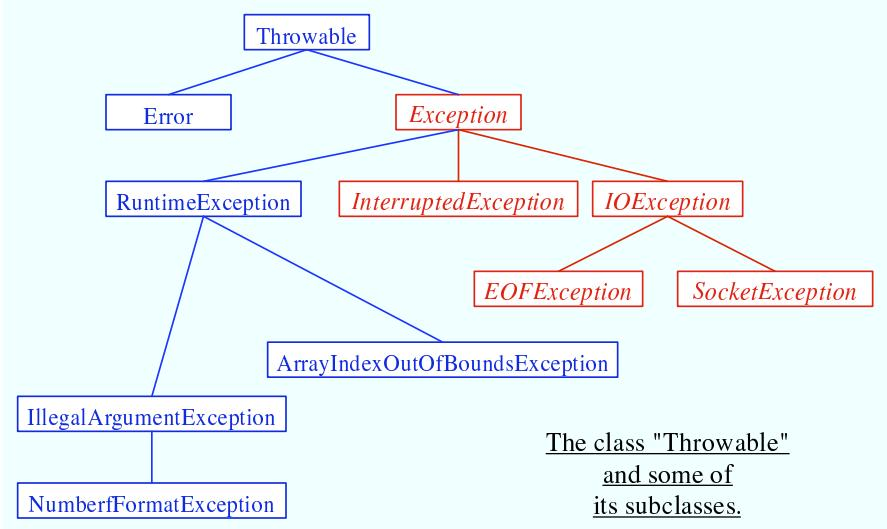

The class Throwable includes several instance methods that can be used with any exception object. If e is of type Throwable (or one of its subclasses), then e.getMessage() is a function that returns a String that describes the exception. The function e.toString(), which is used by the system whenever it needs a string representation of the object, returns a String that contains the name of the class to which the exception belongs as well as the same string that would be returned by e.getMessage(). And e.printStackTrace() writes a stack trace to standard output that tells which subroutines were active when the exception occurred. A stack trace can be very useful when you are trying to determine the cause of the problem. (Note that if an exception is not caught by the program, then the system automatically prints the stack trace to standard output.)

## 8.3.2 The try Statement

To catch exceptions in a Java program, you need a try statement. We have been using such statements since Section 3.7, but the full syntax of the try statement is more complicated than what was presented there. The try statements that we have used so far had a syntax similar to the following example:

```txt
try {
    double determinant = M[0][0]*M[1][1] - M[0][1]*M[1][0];
    System.out.println("The determinant of M is " + determinant);
}
catch ( ArrayIndexOutOfBoundsException e ) {
    System.out.println("M is the wrong size to have a determinant.");
    e.printStackTrace();
}
```

Here, the computer tries to execute the block of statements following the word “try”. If no exception occurs during the execution of this block, then the “catch” part of the statement is simply ignored. However, if an exception of type ArrayIndexOutOfBoundsException occurs, then the computer jumps immediately to the catch clause of the try statement. This block of statements is said to be an exception handler for ArrayIndexOutOfBoundsException. By handling the exception in this way, you prevent it from crashing the program. Before the body of the catch clause is executed, the object that represents the exception is assigned to the variable e, which is used in this example to print a stack trace.

However, the full syntax of the try statement allows more than one catch clause. This makes it possible to catch several diferent types of exception with one try statement. In the above example, in addition to the possible ArrayIndexOutOfBoundsException, there is a possible NullPointerException which will occur if the value of M is null. We can handle both possible exceptions by adding a second catch clause to the try statement:

```txt
try {
    double determinant = M[0][0]*M[1][1] - M[0][1]*M[1][0];
    System.out.println("The determinant of M is " + determinant);
}
catch ( ArrayIndexOutOfBoundsException e ) {
    System.out.println("M is the wrong size to have a determinant.");
}
catch ( NullPointerExceptionException e ) {
    System.out.print("Programming error!  M doesn't exist." + );
}
```

Here, the computer tries to execute the statements in the try clause. If no error occurs, both of the catch clauses are skipped. If an ArrayIndexOutOfBoundsException occurs, the computer executes the body of the first catch clause and skips the second one. If a NullPointerException occurs, it jumps to the second catch clause and executes that.

Note that both ArrayIndexOutOfBoundsException and NullPointerException are subclasses of RuntimeException. It’s possible to catch all RuntimeExceptions with a single catch clause. For example:

```txt
try {
    double determinant = M[0][0]*M[1][1] - M[0][1]*M[1][0];
    System.out.println("The determinant of M is " + determinant);
}
catch ( RuntimeException err ) {
    System.out.println("Sorry, an error has occurred.");
    System.out.println("The error was: " + err);
}
```

The catch clause in this try statement will catch any exception belonging to class RuntimeException or to any of its subclasses. This shows why exception classes are organized into a class hierarchy. It allows you the option of casting your net narrowly to catch only a specific type of exception. Or you can cast your net widely to catch a wide class of exceptions. Because of subclassing, when there are multiple catch clauses in a try statement, it is possible that a given exception might match several of those catch clauses. For example, an exception of type NullPointerException would match catch clauses for NullPointerException, RuntimeException, Exception, or Throwable. In this case, only the first catch clause that matches the exception is executed.

The example I’ve given here is not particularly realistic. You are not very likely to use exception-handling to guard against null pointers and bad array indices. This is a case where careful programming is better than exception handling: Just be sure that your program assigns a reasonable, non-null value to the array M. You would certainly resent it if the designers of Java forced you to set up a try..catch statement every time you wanted to use an array! This is why handling of potential RuntimeExceptions is not mandatory. There are just too many things that might go wrong! (This also shows that exception-handling does not solve the problem of program robustness. It just gives you a tool that will in many cases let you approach the problem in a more organized way.)

## ∗ ∗ ∗

I have still not completely specified the syntax of the try statement. There is one additional element: the possibility of a finally clause at the end of a try statement. The complete syntax of the try statement can be described as:

```txt
try {
    <statements>
}
<optional-catch-clauses>
<optional-finally-clause>
```

Note that the catch clauses are also listed as optional. The try statement can include zero or more catch clauses and, optionally, a finally clause. The try statement must include one or the other. That is, a try statement can have either a finally clause, or one or more catch clauses, or both. The syntax for a catch clause is

```groovy
catch ( <exception-class-name> <variable-name>) {
  <statements>
}
```

and the syntax for a finally clause is

```txt
finally {
    <statements>
}
```

The semantics of the finally clause is that the block of statements in the finally clause is guaranteed to be executed as the last step in the execution of the try statement, whether or not any exception occurs and whether or not any exception that does occur is caught and handled. The finally clause is meant for doing essential cleanup that under no circumstances should be omitted. One example of this type of cleanup is closing a network connection. Although you don’t yet know enough about networking to look at the actual programming in this case, we can consider some pseudocode:

```txt
try {
    open a network connection
}
catch ( IOException e ) {
    report the error
    return  // Don't continue if connection can't be opened!
}

// At this point, we KNOW that the connection is open.

try {
    communicate over the connection
}
catch ( IOException e ) {
    handle the error
}
finally {
    close the connection
}
```

The finally clause in the second try statement ensures that the network connection will definitely be closed, whether or not an error occurs during the communication. The first try statement is there to make sure that we don’t even try to communicate over the network unless we have successfully opened a connection. The pseudocode in this example follows a general pattern that can be used to robustly obtain a resource, use the resource, and then release the resource.

## 8.3.3 Throwing Exceptions

There are times when it makes sense for a program to deliberately throw an exception. This is the case when the program discovers some sort of exceptional or error condition, but there is no reasonable way to handle the error at the point where the problem is discovered. The program can throw an exception in the hope that some other part of the program will catch and handle the exception. This can be done with a throw statement. You have already seen an example of this in Subsection 4.3.5. In this section, we cover the throw statement more fully. The syntax of the throw statement is:

```txt
throw 〈exception-object〉 ;
```

The hexception-objecti must be an object belonging to one of the subclasses of Throwable. Usually, it will in fact belong to one of the subclasses of Exception. In most cases, it will be a newly constructed object created with the new operator. For example:

throw new ArithmeticException("Division by zero");

The parameter in the constructor becomes the error message in the exception object; if e refers to the object, the error message can be retrieved by calling e.getMessage(). (You might find this example a bit odd, because you might expect the system itself to throw an ArithmeticException when an attempt is made to divide by zero. So why should a programmer bother to throw the exception? Recall that if the numbers that are being divided are of type int, then division by zero will indeed throw an ArithmeticException. However, no arithmetic operations with floating-point numbers will ever produce an exception. Instead, the special value Double.NaN is used to represent the result of an illegal operation. In some situations, you might prefer to throw an ArithmeticException when a real number is divided by zero.)

An exception can be thrown either by the system or by a throw statement. The exception is processed in exactly the same way in either case. Suppose that the exception is thrown inside a try statement. If that try statement has a catch clause that handles that type of exception, then the computer jumps to the catch clause and executes it. The exception has been handled. After handling the exception, the computer executes the finally clause of the try statement, if there is one. It then continues normally with the rest of the program, which follows the try statement. If the exception is not immediately caught and handled, the processing of the exception will continue.

When an exception is thrown during the execution of a subroutine and the exception is not handled in the same subroutine, then that subroutine is terminated (after the execution of any pending finally clauses). Then the routine that called that subroutine gets a chance to handle the exception. That is, if the subroutine was called inside a try statement that has an appropriate catch clause, then that catch clause will be executed and the program will continue on normally from there. Again, if the second routine does not handle the exception, then it also is terminated and the routine that called it (if any) gets the next shot at the exception. The exception will crash the program only if it passes up through the entire chain of subroutine calls without being handled. (In fact, even this is not quite true: In a multithreaded program, only the thread in which the exception occurred is terminated.)

A subroutine that might generate an exception can announce this fact by adding a clause “throws hexception-class-namei” to the header of the routine. For example:

```txt
/**
 * Returns the larger of the two roots of the quadratic equation
 * A*x*x + B*x + C = 0, provided it has any roots. If A == 0 or
 * if the discriminant, B*B - 4*A*C, is negative, then an exception
 * of type IllegalArgumentException is thrown.
 */
static public double root( double A, double B, double C )
            throws IllegalArgumentException {
    if (A == 0) {
        throw new IllegalArgumentException("A can't be zero.");
    }
    else {
        double disc = B*B - 4*A*C;
        if (disc < 0)
            throw new IllegalArgumentException("Discriminant < zero.");
```

```txt
return (-B + Math.sqrt(disc)) / (2*A);
    }
}
```

As discussed in the previous section, the computation in this subroutine has the preconditions that A != 0 and B\*B-4\*A\*C >= 0. The subroutine throws an exception of type IllegalArgumentException when either of these preconditions is violated. When an illegal condition is found in a subroutine, throwing an exception is often a reasonable response. If the program that called the subroutine knows some good way to handle the error, it can catch the exception. If not, the program will crash—and the programmer will know that the program needs to be fixed.

A throws clause in a subroutine heading can declare several diferent types of exception, separated by commas. For example:

void processArray(int[] A) throws NullPointerException,

ArrayIndexOutOfBoundsException { ...

## 8.3.4 Mandatory Exception Handling

In the preceding example, declaring that the subroutine root() can throw an IllegalArgumentException is just a courtesy to potential readers of this routine. This is because handling of IllegalArgumentExceptions is not “mandatory.” A routine can throw an IllegalArgumentException without announcing the possibility. And a program that calls that routine is free either to catch or to ignore the exception, just as a programmer can choose either to catch or to ignore an exception of type NullPointerException.

For those exception classes that require mandatory handling, the situation is diferent. If a subroutine can throw such an exception, that fact must be announced in a throws clause in the routine definition. Failing to do so is a syntax error that will be reported by the compiler.

On the other hand, suppose that some statement in the body of a subroutine can generate an exception of a type that requires mandatory handling. The statement could be a throw statement, which throws the exception directly, or it could be a call to a subroutine that can throw the exception. In either case, the exception must be handled. This can be done in one of two ways: The first way is to place the statement in a try statement that has a catch clause that handles the exception; in this case, the exception is handled within the subroutine, so that any caller of the subroutine will never see the exception. The second way is to declare that the subroutine can throw the exception. This is done by adding a “throws” clause to the subroutine heading, which alerts any callers to the possibility that an exception might be generated when the subroutine is executed. The caller will, in turn, be forced either to handle the exception in a try statement or to declare the exception in a throws clause in its own header.

Exception-handling is mandatory for any exception class that is not a subclass of either Error or RuntimeException. Exceptions that require mandatory handling generally represent conditions that are outside the control of the programmer. For example, they might represent bad input or an illegal action taken by the user. There is no way to avoid such errors, so a robust program has to be prepared to handle them. The design of Java makes it impossible for programmers to ignore the possibility of such errors.

Among the exceptions that require mandatory handling are several that can occur when using Java’s input/output routines. This means that you can’t even use these routines unless you understand something about exception-handling. Chapter 11 deals with input/output and uses mandatory exception-handling extensively.

## 8.3.5 Programming with Exceptions

Exceptions can be used to help write robust programs. They provide an organized and structured approach to robustness. Without exceptions, a program can become cluttered with if statements that test for various possible error conditions. With exceptions, it becomes possible to write a clean implementation of an algorithm that will handle all the normal cases. The exceptional cases can be handled elsewhere, in a catch clause of a try statement.

When a program encounters an exceptional condition and has no way of handling it immediately, the program can throw an exception. In some cases, it makes sense to throw an exception belonging to one of Java’s predefined classes, such as IllegalArgumentException or IOException. However, if there is no standard class that adequately represents the exceptional condition, the programmer can define a new exception class. The new class must extend the standard class Throwable or one of its subclasses. In general, if the programmer does not want to require mandatory exception handling, the new class will extend RuntimeException (or one of its subclasses). To create a new exception class that does require mandatory handling, the programmer can extend one of the other subclasses of Exception or can extend Exception itself.

Here, for example, is a class that extends Exception, and therefore requires mandatory exception handling when it is used:

```java
public class ParseError extends Exception {
    public ParseError(String message) {
        // Create a ParseError object containing
        // the given message as its error message.
        super(message);
    }
}
```

The class contains only a constructor that makes it possible to create a ParseError object containing a given error message. (The statement “super(message)” calls a constructor in the superclass, Exception. See Subsection 5.6.3.) Of course the class inherits the getMessage() and printStackTrace() routines from its superclass. If e refers to an object of type ParseError, then the function call e.getMessage() will retrieve the error message that was specified in the constructor. But the main point of the ParseError class is simply to exist. When an object of type ParseError is thrown, it indicates that a certain type of error has occurred. (Parsing, by the way, refers to figuring out the syntax of a string. A ParseError would indicate, presumably, that some string that is being processed by the program does not have the expected form.)

A throw statement can be used in a program to throw an error of type ParseError. The constructor for the ParseError object must specify an error message. For example:

throw new ParseError("Encountered an illegal negative number.");

or

```javascript
throw new ParseError("The word ''' + word
                          + "' is not a valid file name.");
```

If the throw statement does not occur in a try statement that catches the error, then the subroutine that contains the throw statement must declare that it can throw a ParseError by adding the clause “throws ParseError” to the subroutine heading. For example,

void getUserData() throws ParseError {

This would not be required if ParseError were defined as a subclass of RuntimeException instead of Exception, since in that case exception handling for ParseErrors would not be mandatory.

A routine that wants to handle ParseErrors can use a try statement with a catch clause that catches ParseErrors. For example:

```txt
try {
    getUserData();
    processUserData();
}
catch (ParseError pe) {
    . . .  // Handle the error
}
```

Note that since ParseError is a subclass of Exception, a catch clause of the form “catch (Exception e)” would also catch ParseErrors, along with any other object of type Exception. Sometimes, it’s useful to store extra data in an exception object. For example,

```dart
class ShipDestroyed extends RuntimeException {
    Ship ship;  // Which ship was destroyed.
    int where_x, where_y;  // Location where ship was destroyed.
    ShipDestroyed(String message, Ship s, int x, int y) {
        // Constructor creates a ShipDestroyed object
        // carrying an error message plus the information
        // that the ship s was destroyed at location (x,y)
        // on the screen.
        super(message);
        ship = s;
        where_x = x;
        where_y = y;
    }
}
```

Here, a ShipDestroyed object contains an error message and some information about a ship that was destroyed. This could be used, for example, in a statement:

```javascript
if ( userShip.isHit() )
    throw new ShipDestroyed("You've been hit!", userShip, xPos, yPos);
```

Note that the condition represented by a ShipDestroyed object might not even be considered an error. It could be just an expected interruption to the normal flow of a game. Exceptions can sometimes be used to handle such interruptions neatly.

```txt
* * *
```

The ability to throw exceptions is particularly useful in writing general-purpose subroutines and classes that are meant to be used in more than one program. In this case, the person writing the subroutine or class often has no reasonable way of handling the error, since that person has no way of knowing exactly how the subroutine or class will be used. In such circumstances, a novice programmer is often tempted to print an error message and forge ahead, but this is almost never satisfactory since it can lead to unpredictable results down the line. Printing an error message and terminating the program is almost as bad, since it gives the program no chance to handle the error.

The program that calls the subroutine or uses the class needs to know that the error has occurred. In languages that do not support exceptions, the only alternative is to return some special value or to set the value of some variable to indicate that an error has occurred. For example, the readMeasurement() function in Subsection 8.2.2 returns the value -1 if the user’s input is illegal. However, this only does any good if the main program bothers to test the return value. It is very easy to be lazy about checking for special return values every time a subroutine is called. And in this case, using -1 as a signal that an error has occurred makes it impossible to allow negative measurements. Exceptions are a cleaner way for a subroutine to react when it encounters an error.

```txt
/**
 * Reads the user's input measurement from one line of input.
 * Precondition:    The input line is not empty.
 * Postcondition:    If the user's input is legal, the measurement
 *                  is converted to inches and returned.
 * @throws ParseError if the user's input is not legal.
 */
static double readMeasurement() throws ParseError {

  double inches;  // Total number of inches in user's measurement.

  double measurement;  // One measurement,
                   //   such as the 12 in "12 miles."
  String units;      // The units specified for the measurement,
                   //   such as "miles."

  char ch;  // Used to peek at next character in the user's input.

  inches = 0;  // No inches have yet been read.

  skipBlanks();
  ch = TextIO.peek();

  /* As long as there is more input on the line, read a measurement and
     add the equivalent number of inches to the variable, inches.  If an
     error is detected during the loop, end the subroutine immediately
     by throwing a ParseError. */

  while (ch != '\n') {

    /* Get the next measurement and the units. Before reading
      anything, make sure that a legal value is there to read. */
    if ( ! Character.isdigit(ch) ) {
      throw new ParseError("Expected to find a number, but found " + ch);
    }
    measurement = TextIO.getDouble();

    skipBlanks();
    if (TextIO.peek() == '\n') {
      throw new ParseError("Missing unit of measure at end of line.");
    }
    units = TextIO.getWord();
    units = units.toLowerCase();
```

It is easy to modify the readMeasurement() subroutine to use exceptions instead of a special return value to signal an error. My modified subroutine throws a ParseError when the user’s input is illegal, where ParseError is the subclass of Exception that was defined above. (Arguably, it might be reasonable to avoid defining a new class by using the standard exception class IllegalArgumentException instead.) The changes from the original version are shown in italic:

/\* Convert the measurement to inches and add it to the total. \*/

```javascript
if (units.equals("inch")
    || units.equals("inches") || units.equals("in")) {
    inches += measurement;
}
else if (units.equals("foot")
    || units.equals("feet") || units.equals("ft")) {
    inches += measurement * 12;
}
else if (units.equals("yard")
    || units.equals("yards") || units.equals("yd")) {
    inches += measurement * 36;
}
else if (units.equals("mile")
    || units.equals("miles") || units.equals("mi")) {
    inches += measurement * 12 * 5280;
}
else {
    throw new ParseError("\\" + units
        + "\" is not a legal unit of measure.");
}

/* Look ahead to see whether the next thing on the line is
    the end-of-line. */

skipBlanks();
ch = TextIO.peek();

// end while

return inches;

end readMeasurement()
```

In the main program, this subroutine is called in a try statement of the form

```txt
try {
    inches = readMeasurement();
}
catch (ParseError e) {
    . . .  // Handle the error.
}
```

The complete program can be found in the file LengthConverter3.java. From the user’s point of view, this program has exactly the same behavior as the program LengthConverter2 from the previous section. Internally, however, the programs are significantly diferent, since LengthConverter3 uses exception-handling.

## 8.4 Assertions

In this short section, we look at assertions, another feature of the Java programming language that can be used to aid in the development of correct and robust programs.

Recall that a precondition is a condition that must be true at a certain point in a program, for the execution of the program to continue correctly from that point. In the case where there is a chance that the precondition might not be satisfied—for example, if it depends on input from the user—then it’s a good idea to insert an if statement to test it. But then the question arises, What should be done if the precondition does not hold? One option is to throw an exception. This will terminate the program, unless the exception is caught and handled elsewhere in the program.

In many cases, of course, instead of using an if statement to test whether a precondition holds, a programmer tries to write the program in a way that will guarantee that the precondition holds. In that case, the test should not be necessary, and the if statement can be avoided. The problem is that programmers are not perfect. In spite of the programmer’s intention, the program might contain a bug that screws up the precondition. So maybe it’s a good idea to check the precondition—at least during the debugging phase of program development.

Similarly, a postcondition is a condition that is true at a certain point in the program as a consequence of the code that has been executed before that point. Assuming that the code is correctly written, a postcondition is guaranteed to be true, but here again testing whether a desired postcondition is actually true is a way of checking for a bug that might have screwed up the postcondition. This is somthing that might be desirable during debugging.

The programming languages C and C++ have always had a facility for adding what are called assertions to a program. These assertions take the form “assert(hconditioni)”, where hconditioni is a boolean-valued expression. This condition expresses a precondition or postcondition that should hold at that point in the program. When the computer encounters an assertion during the execution of the program, it evaluates the condition. If the condition is false, the program is terminated. Otherwise, the program continues normally. This allows the programmer’s belief that the condition is true to be tested; if if it not true, that indicates that the part of the program that preceded the assertion contained a bug. One nice thing about assertions in C and C++ is that they can be “turned of” at compile time. That is, if the program is compiled in one way, then the assertions are included in the compiled code. If the program is compiled in another way, the assertions are not included. During debugging, the first type of compilation is used. The release version of the program is compiled with assertions turned of. The release version will be more eficient, because the computer won’t have to evaluate all the assertions.

Although early versions of Java did not have assertions, an assertion facility similar to the one in C/C++ has been available in Java since version 1.4. As with the C/C++ version, Java assertions can be turned on during debugging and turned of during normal execution. In Java, however, assertions are turned on and of at run time rather than at compile time. An assertion in the Java source code is always included in the compiled class file. When the program is run in the normal way, these assertions are ignored; since the condition in the assertion is not evaluated in this case, there is little or no performance penalty for having the assertions in the program. When the program is being debugged, it can be run with assertions enabled, as discussed below, and then the assertions can be a great help in locating and identifying bugs.

$$
* * *
$$

An assertion statement in Java takes one of the following two forms:

assert hcondition i ;

or

$$
\text {assert} \langle \text {condition} \rangle : \langle \text {error - message} \rangle ;
$$

where hconditioni is a boolean-valued expression and herror-messagei is a string or an expression of type String. The word “assert” is a reserved word in Java, which cannot be used as an identifier. An assertion statement can be used anyplace in Java where a statement is legal.

If a program is run with assertions disabled, an assertion statement is equivalent to an empty statement and has no efect. When assertions are enabled and an assertion statement is encountered in the program, the hconditioni in the assertion is evaluated. If the value is true, the program proceeds normally. If the value of the condition is false, then an exception of type java.lang.AssertionError is thrown, and the program will crash (unless the error is caught by a try statement). If the assert statement includes an herror-messagei, then the error message string becomes the message in the AssertionError.

So, the statement “assert hcondition i : herror-message i;" is similar to

```javascript
if ( <condition> == false )
    throw new AssertionError( <error-message> );
```

except that the if statement is executed whenever the program is run, and the assert statement is executed only when the program is run with assertions enabled.

The question is, when to use assertions instead of exceptions? The general rule is to use assertions to test conditions that should definitely be true, if the program is written correctly. Assertions are useful for testing a program to see whether or not it is correct and for finding the errors in an incorrect program. After testing and debugging, when the program is used in the normal way, the assertions in the program will be ignored. However, if a problem turns up later, the assertions are still there in the program to be used to help locate the error. If someone writes to you to say that your program doesn’t work when he does such-and-such, you can run the program with assertions enabled, do such-and-such, and hope that the assertions in the program will help you locate the point in the program where it goes wrong.

Consider, for example, the root() method from Subsection 8.3.3 that calculates a root of a quadratic equation. If you believe that your program will always call this method with legal arguments, then it would make sense to write the method using assertions instead of exceptions:

```c
/**
 * Returns the larger of the two roots of the quadratic equation
 * A*x*x + B*x + C = 0, provided it has any roots.
 * Precondition: A != 0 and B*B - 4*A*C >= 0.
 */
static public double root( double A, double B, double C ) {
    assert A != 0 : "Leading coefficient of quadratic equation cannot be zero.";
    double disc = B*B - 4*A*C;
    assert disc >= 0 : "Discriminant of quadratic equation cannot be negative.";
    return (-B + Math.sqrt(disc)) / (2*A);
}
```

The assertions are not checked when the program is run in the normal way. If you are correct in your belief that the method is never called with illegal arguments, then checking the conditions in the assertions would be unnecessary. If your belief is not correct, the problem should turn up during testing or debugging, when the program is run with the assertions enabled.

If the root() method is part of a software library that you expect other people to use, then the situation is less clear. Sun’s Java documentation advises that assertions should not be used for checking the contract of public methods: If the caller of a method violates the contract by passing illegal parameters, then an exception should be thrown. This will enforce the contract whether or not assertions are enabled. (However, while it’s true that Java programmers expect the contract of a method to be enforced with exceptions, there are reasonable arguments for using assertions instead, in some cases.)

On the other hand, it never hurts to use an assertion to check a postcondition of a method. A postcondition is something that is supposed to be true after the method has executed, and it can be tested with an assert statement at the end of the method. If the postcodition is false, there is a bug in the method itself, and that is something that needs to be found during the development of the method.

$$
\* *\ *\]*\n\nabla
$$

To have any efect, assertions must be enabled when the program is run. How to do this depends on what programming environment you are using. (See Section 2.6 for a discussion of programming environments.) In the usual command line environment, assertions are enabled by adding the option -enableassertions to the java command that is used to run the program. For example, if the class that contains the main program is RootFinder, then the command

java -enableassertions RootFinder

will run the program with assertions enabled. The -enableassertions option can be abbreviated to -ea, so the command can alternatively be written as

java -ea RootFinder

In fact, it is possible to enable assertions in just part of a program. An option of the form “-ea:hclass-name i” enables only the assertions in the specified class. Note that there are no spaces between the -ea, the “:”, and the name of the class. To enable all the assertions in a package and in its sub-packages, you can use an option of the form “-ea:hpackage-name i...”. To enable assertions in the “default package” (that is, classes that are not specified to belong to a package, like almost all the classes in this book), use “-ea:...”. For example, to run a Java program named “MegaPaint” with assertions enabled for every class in the packages named “paintutils” and “drawing”, you would use the command:

java -ea:paintutils... -ea:drawing... MegaPaint

If you are using the Eclipse integrated development environment, you can specify the -ea option by creating a run configuration. Right-click the name of the main program class in the Package Explorer pane, and select “Run As” from the pop-up menu and then “Run. . . ” from the submenu. This will open a dialog box where you can manage run configurations. The name of the project and of the main class will be already be filled in. Click the “Arguments” tab, and enter -ea in the box under “VM Arguments”. The contents of this box are added to the java command that is used to run the program. You can enter other options in this box, including more complicated enableassertions options such as -ea:paintutils.... When you click the “Run” button, the options will be applied. Furthermore, they will be applied whenever you run the program, unless you change the run configuration or add a new configuration. Note that it is possible to make two run configurations for the same class, one with assertions enabled and one with assertions disabled.

## 8.5 Introduction to Threads

Like people, computers can multitask. That is, they can be working on several diferent tasks at the same time. A computer that has just a single central processing unit can’t literally do two things at the same time, any more than a person can, but it can still switch its attention back and forth among several tasks. Furthermore, it is increasingly common for computers to have more than one processing unit, and such computers can literally work on several tasks simultaneously. It is likely that from now on, most of the increase in computing power will come from adding additional processors to computers rather than from increasing the speed of individual processors. To use the full power of these multiprocessing computers, a programmer must do parallel programming, which means writing a program as a set of several tasks that can be executed simultaneously. Even on a single-processor computer, parallel programming techniques can be useful, since some problems can be tackled most naturally by breaking the solution into a set of simultaneous tasks that cooperate to solve the problem.

In Java, a single task is called a thread. The term “thread” refers to a “thread of control” or “thread of execution,” meaning a sequence of instructions that are executed one after another— the thread extends through time, connecting each instruction to the next. In a multithreaded program, there can be many threads of control, weaving through time in parallel and forming the complete fabric of the program. (Ok, enough with the metaphor, already!) Every Java program has at least one thread; when the Java virtual machine runs your program, it creates a thread that is responsible for executing the main routine of the program. This main thread can in turn create other threads that can continue even after the main thread has terminated. In a GUI program, there is at least one additional thread, which is responsible for handling events and drawing components on the screen. This GUI thread is created when the first window is opened. So in fact, you have already done parallel programming! When a main routine opens a window, both the main thread and the GUI thread can continue to run in parallel. Of course, parallel programming can be used in much more interesting ways.

Unfortunately, parallel programming is even more dificult than ordinary, single-threaded programming. When several threads are working together on a problem, a whole new category of errors is possible. This just means that techniques for writing correct and robust programs are even more important for parallel programming than they are for normal programming. (That’s one excuse for having this section in this chapter—another is that we will need threads at several points in future chapters, and I didn’t have another place in the book where the topic fits more naturally.) Since threads are a dificult topic, you will probably not fully understand everything in this section the first time through the material. Your understanding should improve as you encounter more examples of threads in future sections.

## 8.5.1 Creating and Running Threads

In Java, a thread is represented by an object belonging to the class java.lang.Thread (or to a subclass of this class). The purpose of a Thread object is to execute a single method. The method is executed in its own thread of control, which can run in parallel with other threads. When the execution of the method is finished, either because the method terminates normally or because of an uncaught exception, the thread stops running. Once this happens, there is no way to restart the thread or to use the same Thread object to start another thread.

There are two ways to program a thread. One is to create a subclass of Thread and to define the method public void run() in the subclass. This run() method defines the task that will be performed by the thread; that is, when the thread is started, it is the run() method that will be executed in the thread. For example, here is a simple, and rather useless, class that defines a thread that does nothing but print a message on standard output:

```java
public class NamedThread extends Thread {
    private String name;  // The name of this thread.
    public NamedThread(String name) {  // Constructor gives name to thread.
        this.name = name;
    }
    public void run() {  // The run method prints a message to standard output.
```

```txt
* * *
```

```txt
System.out.println("Greetings from thread '" + name + "'!");
    }
}
```

To use a NamedThread, you must of course create an object belonging to this class. For example,

```javascript
NamedThread greetings = new NamedThread("Fred");
```

However, creating the object does not automatically start the thread running. To do that, you must call the start() method in the thread object. For the example, this would be done with the statement

```javascript
greetings.start();
```

The purpose of the start() method is to create a new thread of control that will execute the Thread object’s run() method. The new thread runs in parallel with the thread in which the start() method was called, along with any other threads that already existed. This means that the code in the run() method will execute at the same time as the statements that follow the call to greetings.start(). Consider this code segment:

```javascript
NamedThread greetings = new NamedThread("Fred");
greetings.start();
System.out.println("Thread has been started.");
```

After greetings.start() is executed, there are two threads. One of them will print “Thread has been started.” while the other one wants to print “Greetings from thread ’Fred’!”. It is important to note that these messages can be printed in either order. The two threads run simultaneously and will compete for access to standard output, so that they can print their messages. Whichever thread happens to be the first to get access will be the first to print its message. In a normal, single-threaded program, things happen in a definite, predictable order from beginning to end. In a multi-threaded program, there is a fundamental indeterminancy. You can’t be sure what order things will happen in. This indeterminacy is what makes parallel programming so dificult!

Note that calling greetings.start() is very diferent from calling greetings.run(). Calling greetings.run() will execute the run() method in the same thread, rather than creating a new thread. This means that all the work of the run() will be done before the computer moves on to the statement that follows the call to greetings.run() in the program. There is no parallelism and no indeterminacy.

I mentioned that there are two ways to program a thread. The first way was to define a subclass of Thread. The second is to define a class that implements the interface java.lang.Runnable. The Runnable interface defines a single method, public void run(). An object that implements the Runnable interface can be passed as a parameter to the constructor of an object of type Thread. When that thread’s start method is called, the thread will execute the run() method in the Runnable object. For example, as an alternative to the NamedThread class, we could define the class:

```java
public class NamedRunnable implements Runnable {
    private String name;  // The name of this thread.
    public NamedRunnable(String name) {  // Constructor gives name to object.
        this.name = name;
    }
```

```groovy
public void run() {  // The run method prints a message to standard output.
    System.out.println("Greetings from thread '" + name +"'!");
}
}
```

To use this version of the class, we would create a NamedRunnable object and use that object to create an object of type Thread:

```javascript
NamedRunnable greetings = new NamedRunnable("Fred");
Thread greetingsThread = new Thread(greetings);
greetingsThread.start();
```

Finally, I’ll note that it is sometimes convenient to define a thread using an anonymous inner class (Subsection 5.7.3). For example:

```java
Thread greetingsFromFred = new Thread() {
    public void run() {
        System.out.println("Greetings from Fred!");
    }
};
greetingsFromFred.start();
```

To help you understand how multiple threads are executed in parallel, we consider the sample program ThreadTest1.java. This program creates several threads. Each thread performs exactly the same task. The task is to count the number of integers less than 1000000 that are prime. (The particular task that is done is not important for our purposes here.) On my computer, this task takes a little more than one second of processing time. The threads that perform this task are defined by the following static nested class:

```java
/**
 * When a thread belonging to this class is run it will count the
 * number of primes between 2 and 1000000.  It will print the result
 * to standard output, along with its ID number and the elapsed
 * time between the start and the end of the computation.
 */
private static class CountPrimesThread extends Thread {
    int id;  // An id number for this thread; specified in the constructor
    public CountPrimesThread(int id) {
        this.id = id;
    }
    public void run() {
        long startTime = System.currentTimeMillis();
        int count = countPrimes(2,1000000); // Counts the primes.
        long elapsedTime = System.currentTimeMillis() - startTime;
        System.out.println("Thread " + id + " counted " +
            count + " primes in " + (elapsedTime/1000.0) + " seconds.");
    }
}
```

The main program asks the user how many threads to run, and then creates and starts the specified number of threads:

```java
public static void main(String[] args) {
    int numberOfThreads = 0;
    while (numberOfThreads < 1 || numberOfThreads > 25) {
        System.out.print("How many threads do you want to use (1 to 25) ? ");
        numberOfThreads = TextIO.getlnInt();
        if (numberOfThreads < 1 || numberOfThreads > 25)
            System.out.println("Please enter a number between 1 and 25!");
    }
    System.out.println("\nCreating " + numberOfThreads
                                + " prime counting threads...");
    CountPrimesThread[] worker = new CountPrimesThread[numberOfThreads];
    for (int i = 0; i < numberOfThreads; i++)
        worker[i] = new CountPrimesThread( i );
    for (int i = 0; i < numberOfThreads; i++)
        worker[i].start();
    System.out.println("Threads have been created and started.");
}
```

It would be a good idea for you to compile and run the program or to try the applet version, which can be found in the on-line version of this section.

When I ran the program with one thread, it took 1.18 seconds for my computer to do the computation. When I ran it using six threads, the output was:

```txt
Creating 6 prime counting threads...
Threads have been created and started.
Thread 1 counted 78498 primes in 6.706 seconds.
Thread 4 counted 78498 primes in 6.693 seconds.
Thread 0 counted 78498 primes in 6.838 seconds.
Thread 2 counted 78498 primes in 6.825 seconds.
Thread 3 counted 78498 primes in 6.893 seconds.
Thread 5 counted 78498 primes in 6.859 seconds.
```

The second line was printed immediately after the first. At this point, the main program has ended but the six threads continue to run. After a pause of about seven seconds, all six threads completed at about the same time. The order in which the threads complete is not the same as the order in which they were started, and the order is indeterminate. That is, if the program is run again, the order in which the threads complete will probably be diferent.

On my computer, six threads take about six times longer than one thread. This is because my computer has only one processor. Six threads, all doing the same task, take six times as much processing as one thread. With only one processor to do the work, the total elapsed time for six threads is about six times longer than the time for one thread. On a computer with two processors, the computer can work on two tasks at the same time, and six threads might complete in as little as three times the time it takes for one thread. On a computer with six or more processors, six threads might take no more time than a single thread. Because of overhead and other reasons, the actual speedup will probably be smaller than this analysis indicates, but on a multiprocessor machine, you should see a definite speedup. What happens when you run the program on your own computer? How many processors do you have?

Whenever there are more threads to be run than there are processors to run them, the computer divides its attention among all the runnable threads by switching rapidly from one thread to another. That is, each processor runs one thread for a while then switches to another thread and runs that one for a while, and so on. Typically, these “context switches” occur about 100 times or more per second. The result is that the computer makes progress on all the tasks, and it looks to the user as if all the tasks are being executed simultaneously. This is why in the sample program, in which each thread has the same amount of work to do, all the threads complete at about the same time: Over any time period longer than a fraction of a second, the computer’s time is divided approximately equally among all the threads.

When you do parallel programming in order to spread the work among several processors, you might want to take into account the number of available processors. You might, for example, want to create one thread for each processor. In Java, you can find out the number of processors by calling the function

Runtime.getRuntime().availableProcessors()

which returns an int giving the number of processors that are available to the Java Virtual Machine. In some cases, this might be less than the actual number of processors in the computer.

## 8.5.2 Operations on Threads

The Thread class includes several useful methods in addition to the start() method that was discussed above. I will mention just a few of them.

If thrd is an object of type Thread, then the boolean-valued function thrd.isAlive() can be used to test whether or not the thread is alive. A thread is “alive” between the time it is started and the time when it terminates. After the thread has terminated it is said to be “dead”. (The rather gruesome metaphor is also used when we refer to “killing” or “aborting” a thread.)

The static method Thread.sleep(milliseconds) causes the thread that executes this method to “sleep” for the specified number of milliseconds. A sleeping thread is still alive, but it is not running. While a thread is sleeping, the computer will work on any other runnable threads (or on other programs). Thread.sleep() can be used to insert a pause in the execution of a thread. The sleep method can throw an exception of type InterruptedException, which is an exception class that requires mandatory exception handling (see Subsection 8.3.4). In practice, this means that the sleep method is usually used in a try..catch statement that catches the potential InterruptedException:

```txt
try {
    Thread.sleep(lengthOfPause);
}
catch (InterruptedException e) {
}
```

One thread can interrupt another thread to wake it up when it is sleeping or paused for some other reason. A Thread, thrd, can be interrupted by calling its method thrd.interrupt(), but you are not likely to do this until you start writing rather advanced applications, and you are not likely to need to do anything in response to an InterruptedException (except to catch it). It’s unfortunate that you have to worry about it at all, but that’s the way that mandatory exception handling works.

Sometimes, it’s necessary for one thread to wait for anther thread to die. This is done with the join() method from the Thread class. Suppose that thrd is a Thread. Then, if another thread calls thrd.join(), that other thread will go to sleep until thrd terminates. If thrd is already dead when thrd.join() is called, then it simply has no efect— the thread that called thrd.join() proceeds immediately. The method join() can throw an InterruptedException, which must be handled. As an example, the following code starts several threads, waits for them all to terminate, and then outputs the elapsed time:

## 8.5. INTRODUCTION TO THREADS

```javascript
CountPrimesThread[] worker = new CountPrimesThread[numberOfThreads];
long startTime = System.currentTimeMillis();
for (int i = 0; i < numberOfThreads; i++) {
    worker[i] = new CountPrimesThread();
    worker[i].start();
}
for (int i = 0; i < numberOfThreads; i++) {
    try {
        worker[i].join();  // Sleep until worker[i] has terminated.
    }
    catch (InterruptedException e) {
    }
}
// At this point, all the worker threads have terminated.
long elapsedTime = System.currentTimeMillis() - startTime;
System.out.println("Elapsed time:  " + (elapsedTime/1000.0) + " seconds.");
```

An observant reader will note that this code assumes that no InterruptedException will occur. To be absolutely sure that the thread worker[i] has terminated in an environment where InterruptedExceptions are possible, you would have to do something like:

```txt
while (worker[i].isAlive()) {
    try {
        worker[i].join();
    }
    catch (InterruptedException e) {
    }
}
```

## 8.5.3 Mutual Exclusion with “synchronized”

Programming several threads to carry out independent tasks is easy. The real dificulty arises when threads have to interact in some way. One way that threads interact is by sharing resources. When two threads need access to the same resource, such as a variable or a window on the screen, some care must be taken that they don’t try to use the same resource at the same time. Otherwise, the situation could be something like this: Imagine several cooks sharing the use of just one measuring cup, and imagine that Cook A fills the measuring cup with milk, only to have Cook B grab the cup before Cook A has a chance to empty the milk into his bowl. There has to be some way for Cook A to claim exclusive rights to the cup while he performs the two operations: Add-Milk-To-Cup and Empty-Cup-Into-Bowl.

Something similar happens with threads, even with something as simple as adding one to a counter. The statement

```javascript
count = count + 1;
```

is actually a sequence of three operations:

```txt
Step 1. Get the value of count
Step 2. Add 1 to the value.
Step 3. Store the new value in count
```

Suppose that several threads perform these three steps. Remember that it’s possible for two threads to run at the same time, and even if there is only one processor, it’s possible for that processor to switch from one thread to another at any point. Suppose that while one thread is between Step 2 and Step 3, another thread starts executing the same sequence of steps. Since the first thread has not yet stored the new value in count, the second thread reads the old value of count and adds one to that old value. After both threads have executed Step 3, the value of count has gone up only by 1 instead of by 2! This type of problem is called a race condition. This occurs when one thread is in the middle of a multi-step operation, and another thread changes some value or condition that the first thread is depending upon. (The first thread is “in a race” to complete all the steps before it is interrupted by another thread.) Another example of a race condition can occur in an if statement. Suppose the following statement, which is meant to avoid a division-by-zero error is executed by a thread:

```txt
if ( A != 0 )
    B = C / A;
```

If the variable A is shared by several threads, and if nothing is done to guard against the race condition, then it is possible that a second thread will change the value of A to zero between the time that the first thread checks the condition A != 0 and the time that it does the division. This means that the thread ends up dividing by zero, even though it just checked that A was not zero!

To fix the problem of race conditions, there has to be some way for a thread to get exclusive access to a shared resource. This is not a trivial thing to implement, but Java provides a high level and relatively easy-to-use approach to exclusive access. It’s done with synchronized methods and with the synchronized statement. These are used to protect shared resources by making sure that only one thread at a time will try to access the resource. Synchronization in Java actually provides only mutual exclusion, which means that exclusive access to a resource is only guaranteed if every thread that needs access to that resource uses synchronization. Synchronization is like a cook leaving a note that says, “I’m using the measuring cup.” This will get the cook exclusive access to the cup—but only if all the cooks agree to check the note before trying to grab the cup.

Because this is a dificult topic, I will start with a simple example. Suppose that we want to avoid the race condition that occurs when several threads all want to add 1 to a counter. We can do this by defining a class to represent the counter and by using synchronized methods in that class:

```txt
public class ThreadSafeCounter {

    private int count = 0;  // The value of the counter.

    synchronized public void increment() {
        count = count + 1;
    }

    synchronized public int getValue() {
        return count;
    }
}
```

If tsc is of type ThreadSafeCounter, then any thread can call tsc.increment() to add 1 to the counter in a completely safe way. The fact that tsc.increment() is synchronized means that only one thread can be in this method at a time; once a thread starts executing this method, it is guaranteed that it will finish executing it without having another thread change the value of tsc.count in the meantime. There is no possibility of a race condition. Note that the guarantee depends on the fact that count is a private variable. This forces all access to tsc.count to occur in the synchronized methods that are provided by the class. If count were public, it would be possible for a thread to bypass the synchronization by, for example, saying tsc.count++. This could change the value of count while another thread is in the middle of the tsc.increment(). Synchronization does not guarantee exclusive access; it only guarantees mutual exclusion among all the threads that are properly synchronized.

The ThreadSafeCounter class does not prevent all possible race conditions that might arise when using a counter. Consider the if statement:

```javascript
if ( tsc.getValue() == 0 )
    doSomething();
```

where doSomething() is some method that requires the value of the counter to be zero. There is still a race condition here, which occurs if a second thread increments the counter between the time the first thread tests tsc.getValue() == 0 and the time it executes doSomething(). The first thread needs exclusive access to the counter during the execution of the whole if statement. (The synchronization in the ThreadSafeCounter class only gives it exclusive access during the time it is evaluating tsc.getValue().) We can solve the race condition by putting the if statement in a synchronized statement:

```txt
synchronized(tsc) {
    if ( tsc.getValue() == 0 )
        doSomething();
}
```

Note that the synchronized statement takes an object—tsc in this case—as a kind of parameter. The syntax of the synchronized statement is:

```txt
synchronized( <object> ) {
    <statements>
}
```

In Java, mutual exclusion is always associated with an object; we say that the synchronization is “on” that object. For example, the if statement above is “synchronized on tsc.” A synchronized instance method, such as those in the class ThreadSafeCounter, is synchronized on the object that contains the instance method. In fact, adding the synchronized modifier to the definition of an instance method is pretty much equivalent to putting the body of the method in a synchronized statement, synchronized(this) {...}. It is also possible to have synchronized static methods; a synchronized static method is synchronized on a special class object that represents the class that contains the static method.

The real rule of synchronization in Java is: Two threads cannot be synchronized on the same object at the same time; that is, they cannot simultaneously be executing code segments that are synchronized on that object. If one thread is synchronized on an object, and a second thread tries to synchronize on the same object, the second thread is forced to wait until the first thread has finished with the object. This is implemented using something called a lock. Every object has a lock, and that lock can be “held” by only one thread at a time. To enter a synchronized statement or synchronized method, a thread must obtain the associated object’s lock. If the lock is available, then the thread obtains the lock and immediately begins executing the synchronized code. It releases the lock after it finishes executing the synchronized code. If Thread A tries to obtain a lock that is already held by Thread B, then Thread A has to wait until Thread B releases the lock. In fact, Thread A will go to sleep, and will not be awoken until the lock becomes available.

$$
\* *\ *
$$

As a simple example of shared resources, we return to the prime-counting problem. Suppose that we want to count all the primes in a given range of integers, and suppose that we want to divide the work up among several threads. Each thread will be assigned part of the range of integers and will count the primes in its assigned range. At the end of its computation, the thread has to add its count to the overall total number of primes found. The variable that represents the total is shared by all the threads. If each thread just says

```txt
total = total + count;
```

then there is a (small) chance that two threads will try to do this at the same time and that the final total will be wrong. To prevent this race condition, access to total has to be synchronized. My program uses a synchronized method to add the counts to the total:

```txt
synchronized private static void addToTotal(int x) {
    total = total + x;
    System.out.println(total + " primes found so far.");
}
```

The source code for the program can be found in ThreadTest2.java. This program counts the primes in the range 3000001 to 6000000. (The numbers are rather arbitrary.) The main() routine in this program creates between 1 and 5 threads and assigns part of the job to each thread. It then waits for all the threads to finish, using the join() method as described above, and reports the total elapsed time. If you run the program on a multiprocessor computer, it should take less time for the program to run when you use more than one thread. You can compile and run the program or try the equivalent applet in the on-line version of this section.

$$
\* *\ *\]*\n\nabla
$$

Synchronization can help to prevent race conditions, but it introduces the possibility of another type of error, deadlock. A deadlock occurs when a thread waits forever for a resource that it will never get. In the kitchen, a deadlock might occur if two very simple-minded cooks both want to measure a cup of milk at the same time. The first cook grabs the measuring cup, while the second cook grabs the milk. The first cook needs the milk, but can’t find it because the second cook has it. The second cook needs the measuring cup, but can’t find it because the first cook has it. Neither cook can continue and nothing more gets done. This is deadlock. Exactly the same thing can happen in a program, for example if there are two threads (like the two cooks) both of which need to obtain locks on the same two objects (like the milk and the measuring cup) before they can proceed. Deadlocks can easily occur, unless great care is taken to avoid them. Fortunately, we won’t be looking at any examples that require locks on more than one object, so we will avoid that source of deadlock.

## 8.5.4 Wait and Notify

Threads can interact with each other in other ways besides sharing resources. For example, one thread might produce some sort of result that is needed by another thread. This imposes some restriction on the order in which the threads can do their computations. If the second thread gets to the point where it needs the result from the first thread, it might have to stop and wait for the result to be produced. Since the second thread can’t continue, it might as well go to sleep. But then there has to be some way to notify the second thread when the result is ready, so that it can wake up and continue its computation. Java, of course, has a way to do this kind of waiting and notification: It has wait() and notify() methods that are defined as instance methods in class Object and so can be used with any object. The reason why wait() and notify() should be associated with objects is not obvious, so don’t worry about it at this point. It does, at least, make it possible to direct diferent notifications to a diferent recipients, depending on which object’s notify() method is called.

The general idea is that when a thread calls a wait() method in some object, that thread goes to sleep until the notify() method in the same object is called. It will have to be called, obviously, by another thread, since the thread that called wait() is sleeping. A typical pattern is that Thread A calls wait() when it needs a result from Thread B, but that result is not yet available. When Thread B has the result ready, it calls notify(), which will wake Thread A up so that it can use the result. It is not an error to call notify() when no one is waiting; it just has no efect. To implement this, Thread A will execute code simlar to the following, where obj is some object:

if ( resultIsAvailable() == false )

obj.wait(); // wait for noification that the result is available useTheResult();

while Thread B does something like:

generateTheResult();

obj.notify(); // send out a notification that the result is available

Now, there is a really nasty race condition in this code. The two threads might execute their code in the following order:

1. Thread A checks resultIsAvailable() and finds that the result is not ready, so it decides to execute the obj.wait() statement, but before it does,

2. Thread B finishes generating the result and calls obj.notify()

3. Thread A calls obj.wait() to wait for notification that the result is ready.

In Step 3, Thread A is waiting for a notification that will never come, because notify() has already been called. This is a kind of deadlock that can leave Thread A waiting forever. Obviously, we need some kind of synchronization. The solution is to enclose both Thread A’s code and Thread B’s code in synchronized statements, and it is very natural to synchronize on the same object, obj, that is used for the calls to wait() and notify(). In fact, since synchronization is almost always needed when wait() and notify() are used, Java makes it an absolute requirement. In Java, a thread can legally call obj.wait() or obj.notify() only if that thread holds the synchronization lock associated with the object obj. If it does not hold that lock, then an exception is thrown. (The exception is of type IllegalMonitorStateException, which does not require mandatory handling and which is typically not caught.) One further complication is that the wait() method can throw an InterruptedException and so should be called in a try statement that handles the exception.

To make things more definite, lets consider a producer/consumer problem where one thread produces a result that is consumed by another thread. Assume that there is a shared variable named sharedResult that is used to transfer the result from the producer to the consumer. When the result is ready, the producer sets the variable to a non-null value. The producer can check whether the result is ready by testing whether the value of sharedResult is null. We will use a variable named lock for synchronization. The the code for the producer thread could have the form:

```txt
makeResult = generateTheResult();  // Not synchronized!
synchronized(lock) {
    sharedResult = makeResult;
    lock.notify();
}
```

while the consumer would execute code such as:

```java
synchronized(lock) {
    while ( sharedResult == null ) {
        try {
            lock.wait();
        }
        catch (InterruptedException e) {
        }
    }
    useEffect = sharedResult;
}
useTheResult(useResult);  // Not synchronized!
```

The calls to generateTheResult() and useTheResult() are not synchronized, which allows them to run in parallel with other threads that might also synchronize on lock. Since sharedResult is a shared variable, all references to sharedResult should be synchronized, so the references to sharedResult must be inside the synchronized statements. The goal is to do as little as possible (but not less) in synchronized code segments.

If you are uncommonly alert, you might notice something funny: lock.wait() does not finish until lock.notify() is executed, but since both of these methods are called in synchronized statements that synchronize on the same object, shouldn’t it be impossible for both methods to be running at the same time? In fact, lock.wait() is a special case: When the consumer thread calls lock.wait(), it gives up the lock that it holds on the synchronization object, lock. This gives the producer thread a chance to execute the synchronized(lock) block that contains the lock.notify() statement. After the producer thread exits from this block, the lock is returned to the consumer thread so that it can continue.

The producer/consumer pattern can be generalized and made more useful without making it any more complex. In the general case, multiple results are produced by one or more producer threads and are consumed by one or more consumer threads. Instead of having just one sharedResult object, we keep a list of objects that have been produced but not yet consumed. Producer threads add objects to this list. Consumer threads remove objects from this list. The only time when a thread is blocked from running is when a consumer thread tries to get a result from the list, and no results are available. It is easy to encapsulate the whole producer/consumer pattern in a class (where I assume that there is a class ResultType that represents the result objects):

```java
/**
 * An object of type ProducerConsumer represents a list of results
 * that are available for processing. Results are added to the list
 * by calling the produce method and are remove by calling consume.
 * If no result is available when consume is called, the method will
 * not return until a result becomes available.
 */
private static class ProducerConsumer {
```

// This ArrayList holds results that have been produced and are waiting // to be consumed. See Subsection 7.3.3 for information on ArrayList.

```java
public void produce(ResultType item) {
    synchronized(items) {
        items.add(item); // Add item to the list of results.
        items.notify();  // Notify any thread waiting in consume() method.
    }
}

public ResultType consume() {
    ResultType item;
    synchronized(items) {
        // If no results are available, wait for notification from produce().
        while (items.size() == 0) {
            try {
                items.wait();
            }
            catch (InterruptedException e) {
            }
        }
        // At this point, we know that at least one result is available.
        item = items.remove(0);
    }
    return item;
}

}
```

For an example of a program that uses a ProducerConsumer class, see ThreadTest3.java. This program performs the same task as ThreadTest2.java, but the threads communicate using the producer/consumer pattern instead of with a shared variable.

Going back to our kitchen analogy for a moment, consider a restaurant with several waiters and several cooks. If we look at the flow of customer orders into the kitchen, the waiters “produce” the orders and leave them in a pile. The orders are “consumed” by the cooks; whenever a cook needs a new order to work on, she picks one up from the pile. The pile of orders, or course, plays the role of the list of result objects in the producer/consumer pattern. Note that the only time that a cook has to wait is when she needs a new order to work on, and there are no orders in the pile. The cook must wait until one of the waiters places an order in the pile. We can complete the analogy by imagining that the waiter rings a bell when he places the order in the pile—ringing the bell is like calling the notify() method to notify the cooks that an order is available.

A final note on notify: It is possible for several threads to be waiting for notification. A call to obj.notify() will wake only one of the threads that is waiting on obj. If you want to wake all threads that are waiting on obj, you can call obj.notifyAll(). And a final note on wait: There is an another version of wait() that takes a number of milliseconds as a parameter. A thread that calls obj.wait(milliseconds) will wait only up to the specified number of milliseconds for a notification. If a notification doesn’t occur during that period, the thread will wake up and continue without the notification. In practice, this feature is most often used to let a waiting thread wake periodically while it is waiting in order to perform some periodic task, such as causing a message “Waiting for computation to finish” to blink.

## 8.5.5 Volatile Variables

And a final note on communication among threads: In general, threads communicate by sharing variables and accessing those variables in synchronized methods or synchronized statements. However, synchronization is fairly expensive computationally, and excessive use of it should be avoided. So in some cases, it can make sense for threads to refer to shared variables without synchronizing their access to those variables.

However, a subtle problem arises when the value of a shared variable is set is one thread and used in another. Because of the way that threads are implemented in Java, the second thread might not see the changed value of the variable immediately. That is, it is possible that a thread will continue to see the old value of the shared variable for some time after the value of the variable has been changed by another thread. This is because threads are allowed to cache shared data. That is, each thread can keep its own local copy of the shared data. When one thread changes the value of a shared variable, the local copies in the caches of other threads are not immediately changed, so the other threads continue to see the old value.

When a synchronized method or statement is entered, threads are forced to update their caches to the most current values of the variables in the cache. So, using shared variables in synchronized code is always safe.

It is still possible to use a shared variable outside of synchronized code, but in that case, the variable must be declared to be volatile. The volatile keyword is a modifier that can be added to a variable declaration, as in

## private volatile int count;

If a variable is declared to be volatile, no thread will keep a local copy of that variable in its cache. Instead, the thread will always use the oficial, main copy of the variable. This means that any change made to the variable will immediately be available to all threads. This makes it safe for threads to refer to volatile shared variables even outside of synchronized code. (Remember, though, that synchronization is still the only way to prevent race conditions.)

When the volatile modifier is applied to an object variable, only the variable itself is declared to be volatile, not the contents of the object that the variable points to. For this reason, volatile is generally only used for variables of simple types such as primitive types and enumerated types.

A typical example of using volatile variables is to send a signal from one thread to another that tells the second thread to terminate. The two threads would share a variable

```txt
volatile boolean terminate = false;
```

The run method of the second thread would check the value of terminate frequently and end when the value of terminate becomes true:

```solidity
public void run() {
    while (true) {
        if (terminate)
            return;
        .
        . // Do some work
        .
    }
}
```

This thread will run until some other thread sets the value of terminate to true. Something like this is really the only clean way for one thread to cause another thread to die.

(By the way, you might be wondering why threads should use local data caches in the first place, since it seems to complicate things unnecessarily. Caching is allowed because of the structure of multiprocessing computers. In many multiprocessing computers, each processor has some local memory that is directly connected to the processor. A thread’s cache is stored in the local memory of the processor on which the thread is running. Access to this local memory is much faster than access to other memory, so it is more eficient for a thread to use a local copy of a shared variable rather than some “master copy” that is stored in non-local memory.)

## 8.6 Analysis of Algorithms

This chapter has concentrated mostly on correctness of programs. In practice, another issue is also important: eficiency. When analyzing a program in terms of eficiency, we want to look at questions such as, “How long does it take for the program to run?” and “Is there another approach that will get the answer more quickly?” Eficiency will always be less important than correctness; if you don’t care whether a program works correctly, you can make it run very quickly indeed, but no one will think it’s much of an achievement! On the other hand, a program that gives a correct answer after ten thousand years isn’t very useful either, so eficiency is often an important issue.

The term “eficiency” can refer to eficient use of almost any resource, including time, computer memory, disk space, or network bandwidth. In this section, however, we will deal exclusively with time eficiency, and the major question that we want to ask about a program is, how long does it take to perform its task?

It really makes little sense to classify an individual program as being “eficient” or “ineficient.” It makes more sense to compare two (correct) programs that perform the same task and ask which one of the two is “more eficient,” that is, which one performs the task more quickly. However, even here there are dificulties. The running time of a program is not well-defined. The run time can be diferent depending on the number and speed of the processors in the computer on which it is run and, in the case of Java, on the design of the Java Virtual Machine which is used to interpret the program. It can depend on details of the compiler which is used to translate the program from high-level language to machine language. Furthermore, the run time of a program depends on the size of the problem which the program has to solve. It takes a sorting program longer to sort 10000 items than it takes it to sort 100 items. When the run times of two programs are compared, it often happens that Program A solves small problems faster than Program B, while Program B solves large problems faster than Program A, so that it is simply not the case that one program is faster than the other in all cases.

In spite of these dificulties, there is a field of computer science dedicated to analyzing the eficiency of programs. The field is known as Analysis of Algorithms. The focus is on algorithms, rather than on programs as such, to avoid having to deal with multiple im plementations of the same algorithm written in diferent languages, compiled with diferent compilers, and running on diferent computers. Analysis of Algorithms is a mathematical field that abstracts away from these down-and-dirty details. Still, even though it is a theoretical field, every working programmer should be aware of some of its techniques and results. This section is a very brief introduction to some of those techniques and results. Because this is not a mathematics book, the treatment will be rather informal.

One of the main techniques of analysis of algorithms is asymptotic analysis. The term “asymptotic” here means basically “the tendency in the long run.” An asymptotic analysis of an algorithm’s run time looks at the question of how the run time depends on the size of the problem. The analysis is asymptotic because it only considers what happens to the run time as the size of the problem increases without limit; it is not concerned with what happens for problems of small size or, in fact, for problems of any fixed finite size. Only what happens in the long run, as the problem size increases without limit, is important. Showing that Algorithm A is asymptotically faster than Algorithm B doesn’t necessarily mean that Algorithm A will run faster than Algorithm B for problems of size 10 or size 1000 or even size 1000000—it only means that if you keep increasing the problem size, you will eventually come to a point where Algorithm A is faster than Algorithm B. An asymptotic analysis is only a first approximation, but in practice it often gives important and useful information.

$$
\* \ * \ *
$$

Central to asymptotic analysis is $B i g  – O h$ notation. Using this notation, we might say, for example, that an algorithm has a running time that is $\mathcal { O } ( \mathrm { n } ^ { 2 } )$ or ${ \mathcal { O } } ( { \mathrm { n } } )$ or $\mathcal { O } ( \log ( \mathrm { n } ) )$ . These notations are read “Big-Oh of n squared,” “Big-Oh of $\mathrm { n } , \ '$ and “Big-Oh of log $\mathrm { n } ^ { \dag }$ (where log is a logarithm function). More generally, we can refer to $\mathcal { O } ( \mathrm { f } ( \mathrm { n } ) )$ (“Big-Oh of f of $\mathbf { n } ^ { \prime \prime } )$ , where $\operatorname { f } ( \mathrm { n } )$ is some function that assigns a positive real number to every positive integer n. The $\mathrm { ^ { 6 6 } n } ^ { \prime \mathrm { 3 } }$ in this notation refers to the size of the problem. Before you can even begin an asymptotic analysis, you need some way to measure problem size. Usually, this is not a big issue. For example, if the problem is to sort a list of items, then the problem size can be taken to be the number of items in the list. When the input to an algorithm is an integer, as in the case of algorithm that checks whether a given positive integer is prime, the usual measure of the size of a problem is the number of bits in the input integer rather than the integer itself. More generally, the number of bits in the input to a problem is often a good measure of the size of the problem.

To say that the running time of an algorithm is $\mathcal { O } ( \mathrm { f } ( \mathrm { n } ) )$ means that for large values of the problem size, n, the running time of the algorithm is no bigger than some constant times $\operatorname { f } ( \mathrm { n } )$ . (More rigorously, there is a number C and a positive integer M such that whenever n is greater than M, the run time is less than or equal to $\mathrm { C ^ { * } f ( n ) . } )$ The constant takes into account details such as the speed of the computer on which the algorithm is run; if you use a slower computer, you might have to use a bigger constant in the formula, but changing the constant won’t change the basic fact that the run time is $\mathcal { O } ( \mathrm { f } ( \mathrm { n } ) )$ . The constant also makes it unnecessary to say whether we are measuring time in seconds, years, CPU cycles, or any other unit of measure; a change from one unit of measure to another is just multiplication by a constant. Note also that $\mathcal { O } ( \mathrm { f } ( \mathrm { n } ) )$ doesn’t depend at all on what happens for small problem sizes, only on what happens in the long run as the problem size increases without limit.

To look at a simple example, consider the problem of adding up all the numbers in an array. The problem size, n, is the length of the array. Using A as the name of the array, the algorithm can be expressed in Java as:

$$
\begin{array}{l} \text {total = 0 ;} \\ \text {for (int i = 0; i <   n; i++)} \\ \text {total = total + A[i];} \end{array}
$$

This algorithm performs the same operation, total = total + A[i], n times. The total time spent on this operation is $\mathrm { a } ^ { * } \mathrm { n }$ , where a is the time it takes to perform the operation once. Now, this is not the only thing that is done in the algorithm. The value of i is incremented and is compared to n each time through the loop. This adds an additional time of $\mathrm { b ^ { * } n }$ to the run time, for some constant b. Furthermore, i and total both have to be initialized to zero; this adds some constant amount c to the running time. The exact running time would then be $( \mathrm { a { + } b ) ^ { \ast } n { + } c }$ , where the constants a, b, and c depend on factors such as how the code is compiled and what computer it is run on. Using the fact that c is less than or equal to $\mathrm { c } ^ { \ast } \mathrm { n }$ for any positive integer n, we can say that the run time is less than or equal to $( \mathrm { a } { + } \mathrm { b } { + } \mathrm { c } ) ^ { * } \mathrm { n }$ . That is, the run time is less than or equal to a constant times n. By definition, this means that the run time for this algorithm is ${ \mathcal { O } } ( { \mathrm { n } } )$

If this explanation is too mathematical for you, we can just note that for large values of n, the c in the formula $( \mathrm { a + b } ) ^ { * } \mathrm { n + c }$ is insignificant compared to the other term, $( \mathrm { a } + \mathrm { b } ) ^ { * } \mathrm { n }$ . We say that c is a “lower order term.” When doing asymptotic analysis, lower order terms can be discarded. A rough, but correct, asymptotic analysis of the algorithm would go something like this: Each iteration of the for loop takes a certain constant amount of time. There are n iterations of the loop, so the total run time is a constant times n, plus lower order terms (to account for the initialization). Disregarding lower order terms, we see that the run time is O(n).

$$
\* \ * \ *
$$

Note that to say that an algorithm has run time $\mathcal { O } ( \mathrm { f } ( \mathrm { n } ) )$ is to say that its run time is no bigger than some constant times n (for large values of n). O(f(n)) puts an upper limit on the run time. However, the run time could be smaller, even much smaller. For example, if the run time is ${ \mathcal { O } } ( { \mathrm { n } } )$ , it would also be correct to say that the run time is $\mathcal { O } ( \mathrm { n } ^ { 2 } )$ or even $\mathcal { O } ( \mathrm { n } ^ { 1 0 } )$ . If the run time is less than a constant times n, then it is certainly less than the same constant times $\mathrm { n ^ { 2 } ~ o r ~ n ^ { 1 0 } }$

Of course, sometimes it’s useful to have a lower limit on the run time. That is, we want to be able to say that the run time is greater than or equal to some constant times f(n) (for large values of n). The notation for this is $\Omega ( \mathrm { f ( n ) } )$ , read “Omega of f of n.” “Omega” is the name of a letter in the Greek alphabet, and Ω is the upper case version of that letter. (To be technical, saying that the run time of an algorithm is $\Omega ( \mathrm { f ( n ) } )$ means that there is a positive number C and a positive integer M such that whenever n is greater than M, the run time is greater than or equal to $\mathrm { C ^ { \ast } f ( n ) . ) ~ } \mathcal { O } ( \mathrm { f ( n ) } )$ tells you something about the maximum amount of time that you might have to wait for an algorithm to finish; $\Omega ( \mathrm { f ( n ) } )$ ) tells you something about the minimum time.

The algorithm for adding up the numbers in an array has a run time that is $\Omega ( \mathrm n )$ as well as O(n). When an algorithm has a run time that is both $\Omega ( \mathrm { f ( n ) } )$ and $\mathcal { O } ( \mathrm { f } ( \mathrm { n } ) )$ , its run time is said to be $\Theta ( \mathrm { f ( n ) } )$ , read “Theta of f of n.” (Theta is another letter from the Greek alphabet.) To say that the run time of an algorithm is $\Theta ( \mathrm { f ( n ) } )$ means that for large values of n, the run time is between $\mathrm { a ^ { * } f ( n ) }$ and $\mathrm { b ^ { * } f ( n ) }$ , where a and b are constants (with b greater than a, and both greater than 0).

Let’s look at another example. Consider the algorithm that can be expressed in Java in the following method:

```java
public static simpleBubbleSort( int[] A, int n ) {
    for (int i = 0; i < n; i++) {
        // Do n passes through the array...
        for (int j = 0; j < n-1; j++) {
            if ( A[j] > A[j+1] ) {
                // A[j] and A[j+1] are out of order, so swap them
                int temp = A[j];
                A[j] = A[j+1];
                A[j+1] = temp;
```

$$
\begin{array}{c} \} \\ \} \\ \} \\ \} \end{array}
$$

Here, the parameter n represents the problem size. The outer for loop in the method is executed n times. Each time the outer for loop is executed, the inner for loop is exectued n-1 times, so the if statement is executed $\mathrm { n ^ { * } ( n { - } 1 ) }$ times. This is $\mathrm { n ^ { 2 } \mathrm { - } n }$ , but since lower order terms are not significant in an asymptotic analysis, it’s good enough to say that the if statement is executed about $\mathrm { n ^ { 2 } }$ times. In particular, the test $\mathsf { A } [ \mathsf { j } ] \ > \ \mathsf { A } [ \mathsf { j } + 1 ]$ is executed about $\mathrm { n ^ { 2 } }$ times, and this fact by itself is enough to say that the run time of the algorithm is $\Omega ( \mathrm { n } ^ { 2 } )$ , that is, the run time is at least some constant times $\mathrm { n ^ { 2 } }$ . Furthermore, if we look at other operations—the assignment statements, incrementing i and j, etc.—none of them are executed more than $\mathrm { n ^ { 2 } }$ times, so the run time is also $\mathcal { O } ( \mathrm { n } ^ { 2 } )$ , that is, the run time is no more than some constant times $\mathrm { n ^ { 2 } }$ . Since it is both $\Omega ( \mathrm { n } ^ { 2 } )$ and $\mathcal { O } ( \mathrm { n } ^ { 2 } )$ , the run time of the simpleBubbleSort algorithm is $\Theta ( \mathrm { n } ^ { 2 } )$ .

You should be aware that some people use the notation $\mathcal { O } ( \mathrm { f } ( \mathrm { n } ) )$ as if it meant $\Theta ( \mathrm { f ( n ) } )$ . That is, when they say that the run time of an algorithm is $\mathcal { O } ( \mathrm { f } ( \mathrm { n } ) )$ , they mean to say that the run time is about equal to a constant times $\operatorname { f } ( \mathrm { n } )$ . For that, they should use $\Theta ( \mathrm { f } ( \mathrm { n } ) )$ . Properly speaking, $\mathcal { O } ( \mathrm { f } ( \mathrm { n } ) )$ means that the run time is less than a constant times $\operatorname { f } ( \mathrm { n } )$ , possibly much less.

$$
\* \ * \ *
$$

So far, my analysis has ignored an important detail. We have looked at how run time depends on the problem size, but in fact the run time usually depends not just on the size of the problem but on the specific data that has to be processed. For example, the run time of a sorting algorithm can depend on the initial order of the items that are to be sorted, and not just on the number of items.

To account for this dependency, we can consider either the worst case run time analysis or the average case run time analysis of an algorithm. For a worst case run time analysis, we consider all possible problems of size n and look at the longest possible run time for all such problems. For an average case analysis, we consider all possible problems of size n and look at the average of the run times for all such problems. Usually, the average case analysis assumes that all problems of size n are equally likely to be encountered, although this is not always realistic—or even possible in the case where there is an infinite number of diferent problems of a given size.

In many cases, the average and the worst case run times are the same to within a constant multiple. This means that as far as asymptotic analysis is concerned, they are the same. That is, if the average case run time is $\mathcal { O } ( \mathrm { f } ( \mathrm { n } ) )$ or $\Theta ( \mathrm { f ( n ) } )$ , then so is the worst case. However, later in the book, we will encounter a few cases where the average and worst case asymptotic analyses difer.

$$
* * *
$$

So, what do you really have to know about analysis of algorithms to read the rest of this book? We will not do any rigorous mathematical analysis, but you should be able to follow informal discussion of simple cases such as the examples that we have looked at in this section. Most important, though, you should have a feeling for exactly what it means to say that the running time of an algorithm is $\mathcal { O } ( \mathrm { f } ( \mathrm { n } ) )$ or $\Theta ( \mathrm { f ( n ) } )$ for some common functions $\operatorname { f } ( \mathrm { n } )$ . The main point is that these notations do not tell you anything about the actual numerical value of the running time of the algorithm for any particular case. They do not tell you anything at all about the running time for small values of n. What they do tell you is something about the rate of growth of the running time as the size of the problem increases.

Suppose you compare two algorithm that solve the same problem. The run time of one algorithm is $\Theta ( \mathrm { n } ^ { 2 } )$ , while the run time of the second algorithm is $\Theta ( \mathrm { n ^ { 3 } } )$ . What does this tell you? If you want to know which algorithm will be faster for some particular problem of size, say, 100, nothing is certain. As far as you can tell just from the asymptotic analysis, either algorithm could be faster for that particular case—or in any particular case. But what you can say for sure is that if you look at larger and larger problems, you will come to a point where the $\Theta ( \mathrm { n } ^ { 2 } )$ algorithm is faster than the $\Theta ( \mathrm { n ^ { 3 } } )$ algorithm. Furthermore, as you continue to increase the problem size, the relative advantage of the $\Theta ( \mathrm { n } ^ { 2 } )$ algorithm will continue to grow. There will be values of n for which the $\Theta ( \mathrm { n } ^ { 2 } )$ algorithm is a thousand times faster, a million times faster, a billion times faster, and so on. This is because for any positive constants a and b, the function $\mathrm { a ^ { * } n ^ { 3 } }$ grows faster than the function $\mathrm { b ^ { * } n ^ { 2 } }$ as n gets larger. (Mathematically, the limit of the ratio of $\mathrm { a ^ { * } n ^ { 3 } }$ to $\mathrm { b ^ { * } n ^ { 2 } }$ is infinite as n approaches infinity.)

This means that for “large” problems, a $\Theta ( \mathrm { n } ^ { 2 } )$ algorithm will definitely be faster than a $\Theta ( \mathrm { n ^ { 3 } } )$ algorithm. You just don’t know—based on the asymptotic analysis alone—exactly how large “large” has to be. In practice, in fact, it is likely that the $\Theta ( \mathrm { n } ^ { 2 } )$ algorithm will be faster even for fairly small values of ${ \mathrm { n } } ,$ and absent other information you would generally prefer a $\Theta ( \mathrm { n } ^ { 2 } )$ algorithm to a $\Theta ( \mathrm { n ^ { 3 } } )$ algorithm.

So, to understand and apply asymptotic analysis, it is essential to have some idea of the rates of growth of some common functions. For the power functions $\mathrm { n , n ^ { 2 } , n ^ { 3 } , n ^ { 4 } , \ldots }$ the larger the exponent, the greater the rate of growth of the function. Exponential functions such as $2 ^ { n }$ and $1 0 ^ { n }$ , where the n is in the exponent, have a growth rate that is faster than that of any power function. In fact, exponential functions grow so quickly that an algorithm whose run time grows exponentially is almost certainly impractical even for relatively modest values of n, because the running time is just too long. Another function that often turns up in asymptotic analysis is the logarithm function, log(n). There are actually many diferent logarithm functions, but the one that is usually used in computer science is the so-called logarithm to the base two, which is defined by the fact that $\log ( 2 ^ { x } ) = x$ for any number x. (Usually, this function is written $\log _ { 2 } ( \mathrm { n } )$ but I will leave out the subscript 2, since I will only use the base-two logarithm in this book.) The logarithm function grows very slowly. The growth rate of log(n) is much smaller than the growth rate of n. The growth rate of $\mathrm { n ^ { * } l o g ( n ) }$ is a little larger than the growth rate of $\mathrm { n , }$ but much smaller than the growth rate of $\mathrm { n ^ { 2 } }$ . The following table should help you understand the diferences among the rates of grows of various functions:

<table><tr><td>n</td><td>log(n)</td><td>n*log(n)</td><td> $n^2$ </td><td>n / log(n)</td></tr><tr><td>16</td><td>4</td><td>64</td><td>256</td><td>4.0</td></tr><tr><td>64</td><td>6</td><td>384</td><td>4096</td><td>10.7</td></tr><tr><td>256</td><td>8</td><td>2048</td><td>65536</td><td>32.0</td></tr><tr><td>1024</td><td>10</td><td>10240</td><td>1048576</td><td>102.4</td></tr><tr><td>1000000</td><td>20</td><td>19931568</td><td>1000000000000</td><td>50173.1</td></tr><tr><td>1000000000</td><td>30</td><td>29897352854</td><td>10000000000000000000</td><td>33447777.3</td></tr></table>

The reason that log(n) shows up so often is because of its association with multiplying and dividing by two: Suppose you start with the number n and divide it by 2, then divide by 2 again, and so on, until you get a number that is less than or equal to 1. Then the number of divisions is equal (to the nearest integer) to log(n).

As an example, consider the binary search algorithm from Subsection 7.4.1. This algorithm searches for an item in a sorted array. The problem size, n, can be taken to be the length of the array. Each step in the binary search algorithm divides the number of items still under consideration by 2, and the algorithm stops when the number of items under consideration is less than or equal to 1 (or sooner). It follows that the number of steps for an array of length n is at most log(n). This means that the worst-case run time for binary search is Θ(log(n)). (The average case run time is also Θ(log(n)).) By comparison, the linear search algorithm, which was also presented in Subsection 7.4.1 has a run time that is Θ(n). The Θ notation gives us a quantitative way to express and to understand the fact that binary search is “much faster” than linear search.

In binary search, each step of the algorithm divides the problem size by 2. It often happens that some operation in an algorithm (not necessarily a single step) divides the problem size by 2. Whenever that happens, the logarithm function is likely to show up in an asymptotic analysis of the run time of the algorithm.

Analysis of Algorithms is a large, fascinating field. We will only use a few of the most basic ideas from this field, but even those can be very helpful for understanding the diferences among algorithms.

## Exercises for Chapter 8

1. Write a program that uses the following subroutine, from Subsection 8.3.3, to solve equations specified by the user.

```txt
* Returns the larger of the two roots of the quadratic equation
* A*x*x + B*x + C = 0, provided it has any roots. If A == 0 or
* if the discriminant, B*B - 4*A*C, is negative, then an exception
* of type IllegalArgumentException is thrown.
*/
static public double root( double A, double B, double C )
            throws IllegalArgumentException {
    if (A == 0) {
        throw new IllegalArgumentException("A can't be zero.");
    }
    else {
        double disc = B*B - 4*A*C;
        if (disc < 0)
            throw new IllegalArgumentException("Discriminant < zero.");
        return (-B + Math.sqrt(disc)) / (2*A);
    }
}
```

Your program should allow the user to specify values for A, B, and C. It should call the subroutine to compute a solution of the equation. If no error occurs, it should print the root. However, if an error occurs, your program should catch that error and print an error message. After processing one equation, the program should ask whether the user wants to enter another equation. The program should continue until the user answers no.

2. As discussed in Section 8.1, values of type int are limited to 32 bits. Integers that are too large to be represented in 32 bits cannot be stored in an int variable. Java has a standard class, java.math.BigInteger, that addresses this problem. An object of type BigInteger is an integer that can be arbitrarily large. (The maximum size is limited only by the amount of memory on your computer.) Since BigIntegers are objects, they must be manipulated using instance methods from the BigInteger class. For example, you can’t add two BigIntegers with the + operator. Instead, if N and M are variables that refer to BigIntegers, you can compute the sum of N and M with the function call N.add(M). The value returned by this function is a new BigInteger object that is equal to the sum of N and M.

The BigInteger class has a constructor new BigInteger(str), where str is a string. The string must represent an integer, such as “3” or “39849823783783283733”. If the string does not represent a legal integer, then the constructor throws a NumberFormatException.

There are many instance methods in the BigInteger class. Here are a few that you will find useful for this exercise. Assume that N and M are variables of type BigInteger.

• N.add(M) — a function that returns a BigInteger representing the sum of N and M.

• N.multiply(M) — a function that returns a BigInteger representing the result of multiplying N times M.

• N.divide(M) — a function that returns a BigInteger representing the result of divid ing N by M, discarding the remainder.

• N.signum() — a function that returns an ordinary int. The returned value represents the sign of the integer N. The returned value is 1 if N is greater than zero. It is -1 if N is less than zero. And it is 0 if N is zero.

• N.equals(M) — a function that returns a boolean value that is true if N and M have the same integer value.

• N.toString() — a function that returns a String representing the value of N.

• N.testBit(k) — a function that returns a boolean value. The parameter k is an integer. The return value is true if the k-th bit in N is 1, and it is false if the k-th bit is 0. Bits are numbered from right to left, starting with 0. Testing “if (N.testBit(0))” is an easy way to check whether N is even or odd. N.testBit(0) is true if and only if N is an odd number.

For this exercise, you should write a program that prints 3N+1 sequences with starting values specified by the user. In this version of the program, you should use BigIntegers to represent the terms in the sequence. You can read the user’s input into a String with the TextIO.getln() function. Use the input value to create the BigInteger object that represents the starting point of the 3N+1 sequence. Don’t forget to catch and handle the NumberFormatException that will occur if the user’s input is not a legal integer! You should also check that the input number is greater than zero.

If the user’s input is legal, print out the 3N+1 sequence. Count the number of terms in the sequence, and print the count at the end of the sequence. Exit the program when the user inputs an empty line.

3. A Roman numeral represents an integer using letters. Examples are XVII to represent 17, MCMLIII for 1953, and MMMCCCIII for 3303. By contrast, ordinary numbers such as 17 or 1953 are called Arabic numerals. The following table shows the Arabic equivalent of all the single-letter Roman numerals:

<table><tr><td>M</td><td>1000</td><td>X</td><td>10</td></tr><tr><td>D</td><td>500</td><td>V</td><td>5</td></tr><tr><td>C</td><td>100</td><td>I</td><td>1</td></tr><tr><td>L</td><td>50</td><td></td><td></td></tr></table>

When letters are strung together, the values of the letters are just added up, with the following exception. When a letter of smaller value is followed by a letter of larger value, the smaller value is subtracted from the larger value. For example, IV represents 5 - 1, or 4. And MCMXCV is interpreted as M + CM + XC + V, or 1000 + (1000 - 100) + (100 - 10) + 5, which is 1995. In standard Roman numerals, no more than thee consecutive copies of the same letter are used. Following these rules, every number between 1 and 3999 can be represented as a Roman numeral made up of the following one- and two-letter combinations:

<table><tr><td>M</td><td>1000</td><td>X</td><td>10</td></tr><tr><td>CM</td><td>900</td><td>IX</td><td>9</td></tr><tr><td>D</td><td>500</td><td>V</td><td>5</td></tr><tr><td>CD</td><td>400</td><td>IV</td><td>4</td></tr><tr><td>C</td><td>100</td><td>I</td><td>1</td></tr><tr><td>XC</td><td>90</td><td></td><td></td></tr></table>

```asm
L 50
XL 40
```

Write a class to represent Roman numerals. The class should have two constructors. One constructs a Roman numeral from a string such as “XVII” or “MCMXCV”. It should throw a NumberFormatException if the string is not a legal Roman numeral. The other constructor constructs a Roman numeral from an int. It should throw a NumberFormatException if the int is outside the range 1 to 3999.

In addition, the class should have two instance methods. The method toString() returns the string that represents the Roman numeral. The method toInt() returns the value of the Roman numeral as an int.

At some point in your class, you will have to convert an int into the string that represents the corresponding Roman numeral. One way to approach this is to gradually “move” value from the Arabic numeral to the Roman numeral. Here is the beginning of a routine that will do this, where number is the int that is to be converted:

```txt
String roman = "";
int N = number;
while (N >= 1000) {
    // Move 1000 from N to roman.
    roman += "M";
    N -= 1000;
}
while (N >= 900) {
    // Move 900 from N to roman.
    roman += "CM";
    N -= 900;
}
.
. // Continue with other values from the above table.
.
```

(You can save yourself a lot of typing in this routine if you use arrays in a clever way to represent the data in the above table.)

Once you’ve written your class, use it in a main program that will read both Arabic numerals and Roman numerals entered by the user. If the user enters an Arabic numeral, print the corresponding Roman numeral. If the user enters a Roman numeral, print the corresponding Arabic numeral. (You can tell the diference by using TextIO.peek() to peek at the first character in the user’s input. If that character is a digit, then the user’s input is an Arabic numeral. Otherwise, it’s a Roman numeral.) The program should end when the user inputs an empty line.

4. The source code file file Expr.java defines a class, Expr, that can be used to represent mathematical expressions involving the variable x. The expression can use the operators +, -, \*, /, and ^ (where ^ represents the operation of raising a number to a power). It can use mathematical functions such as sin, cos, abs, and ln. See the source code file for full details. The Expr class uses some advanced techniques which have not yet been covered in this textbook. However, the interface is easy to understand. It contains only a constructor and two public methods.

The constructor new Expr(def) creates an Expr object defined by a given expression. The parameter, def, is a string that contains the definition. For example, new Expr $( " \mathbf { x } ^ { \frown } 2 " )$ or new $\mathtt { E x p r } ( \ " \mathbf { s i n } ( \mathbf { x } ) + 3 * \mathbf { x } \ " )$ . If the parameter in the constructor call does not represent a legal expression, then the constructor throws an IllegalArgumentException. The message in the exception describes the error.

If func is a variable of type Expr and num is of type double, then func.value(num) is a function that returns the value of the expression when the number num is substituted for the variable x in the expression. For example, if Expr represents the expression 3\*x+1, then func.value(5) is 3\*5+1, or 16. If the expression is undefined for the specified value of x, then the special value Double.NaN is returned.

Finally, func.toString() returns the definition of the expression. This is just the string that was used in the constructor that created the expression object.

For this exercise, you should write a program that lets the user enter an expression. If the expression contains an error, print an error message. Otherwise, let the user enter some numerical values for the variable x. Print the value of the expression for each number that the user enters. However, if the expression is undefined for the specified value of x, print a message to that efect. You can use the boolean-valued function Double.isNaN(val) to check whether a number, val, is Double.NaN.

The user should be able to enter as many values of x as desired. After that, the user should be able to enter a new expression. In the on-line version of this exercise, there is an applet that simulates my solution, so that you can see how it works.

5. This exercise uses the class Expr, which was described in Exercise 8.4 and which is defined in the source code file Expr.java. For this exercise, you should write a GUI program that can graph a function, f(x), whose definition is entered by the user. The program should have a text-input box where the user can enter an expression involving the variable x, such as x^2 or sin(x-3)/x. This expression is the definition of the function. When the user presses return in the text input box, the program should use the contents of the text input box to construct an object of type Expr. If an error is found in the definition, then the program should display an error message. Otherwise, it should display a graph of the function. (Note: A JTextField generates an ActionEvent when the user presses return.)

The program will need a JPanel for displaying the graph. To keep things simple, this panel should represent a fixed region in the xy-plane, defined by $- 5 < = \textbf { x } < = \textbf { 5 }$ and $- 5 < = \mathrm { ~ y ~ } < = \mathrm { ~ 5 ~ }$ . To draw the graph, compute a large number of points and connect them with line segments. (This method does not handle discontinuous functions properly; doing so is very hard, so you shouldn’t try to do it for this exercise.) My program divides the interval $- 5 < = \textbf { x } < = \textbf { 5 }$ into 300 subintervals and uses the 301 endpoints of these subintervals for drawing the graph. Note that the function might be undefined at one of these x-values. In that case, you have to skip that point.

A point on the graph has the form (x,y) where y is obtained by evaluating the user’s expression at the given value of x. You will have to convert these real numbers to the integer coordinates of the corresponding pixel on the canvas. The formulas for the conversion are:

$$
\begin{array}{r c l} \text {a} & = & (\text {int}) ((x + 5) / 1 0 * \text {width}); \\ \text {b} & = & (\text {int}) ((5 - y) / 1 0 * \text {height}); \end{array}
$$

where a and b are the horizontal and vertical coordinates of the pixel, and width and height are the width and height of the panel.

You can find an applet version of my solution in the on-line version of this exercise.

6. Exercise 3.2 asked you to find the integer in the range 1 to 10000 that has the largest number of divisors. Now write a program that uses multiple threads to solve the same problem. By using threads, your program will take less time to do the computation when it is run on a multiprocessor computer. At the end of the program, output the elapsed time, the integer that has the largest number of divisors, and the number of divisors that it has. The program can be modeled on the sample prime-counting program ThreadTest2.java from Subsection 8.5.3.

## Quiz on Chapter 8

1. What does it mean to say that a program is robust?

2. Why do programming languages require that variables be declared before they are used? What does this have to do with correctness and robustness?

3. What is a precondition? Give an example.

4. Explain how preconditions can be used as an aid in writing correct programs.

5. Java has a predefined class called Throwable. What does this class represent? Why does it exist?

6. Write a method that prints out a 3N+1 sequence starting from a given integer, N. The starting value should be a parameter to the method. If the parameter is less than or equal to zero, throw an IllegalArgumentException. If the number in the sequence becomes too large to be represented as a value of type int, throw an ArithmeticException.

7. Rewrite the method from the previous question, using assert statements instead of exceptions to check for errors. What the diference between the two versions of the method when the program is run?

8. Some classes of exceptions require mandatory exception handling. Explain what this means.

9. Consider a subroutine processData() that has the header

static void processData() throws IOException

Write a try..catch statement that calls this subroutine and prints an error message if an IOException occurs.

10. Why should a subroutine throw an exception when it encounters an error? Why not just terminate the program?

11. Suppose that a program uses a single thread that takes 4 seconds to run. Now suppose that the program creates two threads and divides the same work between the two threads. What can be said about the expected execution time of the program that uses two threads?

12. Consider the ThreadSafeCounter example from Subsection 8.5.3:

```java
public class ThreadSafeCounter {
    private int count = 0;  // The value of the counter.
    synchronized public void increment() {
        count = count + 1;
    }
    synchronized public int getValue() {
        return count;
    }
}
```

The increment() method is synchronized so that the caller of the method can complete the three steps of the operation “Get value of count,” “Add 1 to value,” “Store new value in count” without being interrupted by another thread. But getValue() consists of a single, simple step. Why is getValue() synchronized? (This is a deep and tricky question.)

# Linked Data Structures and Recursion

In this chapter, we look at two advanced programming techniques, recursion and linked data structures, and some of their applications. Both of these techniques are related to the seemingly paradoxical idea of defining something in terms of itself. This turns out to be a remarkably powerful idea.

A subroutine is said to be recursive if it calls itself, either directly or indirectly. That is, the subroutine is used in its own definition. Recursion can often be used to solve complex problems by reducing them to simpler problems of the same type.

A reference to one object can be stored in an instance variable of another object. The objects are then said to be “linked.” Complex data structures can be built by linking objects together. An especially interesting case occurs when an object contains a link to another object that belongs to the same class. In that case, the class is used in its own definition. Several important types of data structures are built using classes of this kind.

## 9.1 Recursion

At one time or another, you’ve probably been told that you can’t define something in terms of itself. Nevertheless, if it’s done right, defining something at least partially in terms of itself can be a very powerful technique. A recursive definition is one that uses the concept or thing that is being defined as part of the definition. For example: An “ancestor” is either a parent or an ancestor of a parent. A “sentence” can be, among other things, two sentences joined by a conjunction such as “and.” A “directory” is a part of a disk drive that can hold files and directories. In mathematics, a “set” is a collection of elements, which can themselves be sets. A “statement” in Java can be a while statement, which is made up of the word “while”, a boolean-valued condition, and a statement.

Recursive definitions can describe very complex situations with just a few words. A definition of the term “ancestor” without using recursion might go something like “a parent, or a grandparent, or a great-grandparent, or a great-great-grandparent, and so on.” But saying “and so on” is not very rigorous. (I’ve often thought that recursion is really just a rigorous way of saying “and so on.”) You run into the same problem if you try to define a “directory” as “a file that is a list of files, where some of the files can be lists of files, where some of those files can be lists of files, and so on.” Trying to describe what a Java statement can look like, without using recursion in the definition, would be dificult and probably pretty comical.

Recursion can be used as a programming technique. A recursive subroutine is one that calls itself, either directly or indirectly. To say that a subroutine calls itself directly means that its definition contains a subroutine call statement that calls the subroutine that is being defined. To say that a subroutine calls itself indirectly means that it calls a second subroutine which in turn calls the first subroutine (either directly or indirectly). A recursive subroutine can define a complex task in just a few lines of code. In the rest of this section, we’ll look at a variety of examples, and we’ll see other examples in the rest of the book.

## 9.1.1 Recursive Binary Search

Let’s start with an example that you’ve seen before: the binary search algorithm from Subsection 7.4.1. Binary search is used to find a specified value in a sorted list of items (or, if it does not occur in the list, to determine that fact). The idea is to test the element in the middle of the list. If that element is equal to the specified value, you are done. If the specified value is less than the middle element of the list, then you should search for the value in the first half of the list. Otherwise, you should search for the value in the second half of the list. The method used to search for the value in the first or second half of the list is binary search. That is, you look at the middle element in the half of the list that is still under consideration, and either you’ve found the value you are looking for, or you have to apply binary search to one half of the remaining elements. And so on! This is a recursive description, and we can write a recursive subroutine to implement it.

Before we can do that, though, there are two considerations that we need to take into account. Each of these illustrates an important general fact about recursive subroutines. First of all, the binary search algorithm begins by looking at the “middle element of the list.” But what if the list is empty? If there are no elements in the list, then it is impossible to look at the middle element. In the terminology of Subsection 8.2.1, having a non-empty list is a “precondition” for looking at the middle element, and this is a clue that we have to modify the algorithm to take this precondition into account. What should we do if we find ourselves searching for a specified value in an empty list? The answer is easy: If the list is empty, we can be sure that the value does not occur in the list, so we can give the answer without any further work. An empty list is a base case for the binary search algorithm. A base case for a recursive algorithm is a case that is handled directly, rather than by applying the algorithm recursively. The binary search algorithm actually has another type of base case: If we find the element we are looking for in the middle of the list, we are done. There is no need for further recursion.

The second consideration has to do with the parameters to the subroutine. The problem is phrased in terms of searching for a value in a list. In the original, non-recursive binary search subroutine, the list was given as an array. However, in the recursive approach, we have to able to apply the subroutine recursively to just a part of the original list. Where the original subroutine was designed to search an entire array, the recursive subroutine must be able to search part of an array. The parameters to the subroutine must tell it what part of the array to search. This illustrates a general fact that in order to solve a problem recursively, it is often necessary to generalize the problem slightly.

Here is a recursive binary search algorithm that searches for a given value in part of an array of integers:

/\*\*

\* Search in the array A in positions numbered loIndex to hiIndex,

\* inclusive, for the specified value. If the value is found, return

\* the index in the array where it occurs. If the value is not found,

```txt
* return -1.  Precondition:  The array must be sorted into increasing
* order.
*/
static int binarySearch(int[] A, int loIndex, int hiIndex, int value) {
    if (loIndex > hiIndex) {
        // The starting position comes after the final index,
        // so there are actually no elements in the specified
        // range.  The value does not occur in this empty list!
        return -1;
    }
    else {
        // Look at the middle position in the list.  If the
        // value occurs at that position, return that position.
        // Otherwise, search recursively in either the first
        // half or the second half of the list.
        int middle = (loIndex + hiIndex) / 2;
        if (value == A[middle])
            return middle;
        else if (value < A[middle])
            return binarySearch(A, loIndex, middle - 1, value);
        else   // value must be > A[middle]
            return binarySearch(A, middle + 1, hiIndex, value);
    }
} // end binarySearch()
```

In this routine, the parameters loIndex and hiIndex specify the part of the array that is to be searched. To search an entire array, it is only necessary to call binarySearch(A, 0, A.length - 1, value). In the two base cases—when there are no elements in the specified range of indices and when the value is found in the middle of the range—the subroutine can return an answer immediately, without using recursion. In the other cases, it uses a recursive call to compute the answer and returns that answer.

Most people find it dificult at first to convince themselves that recursion actually works. The key is to note two things that must be true for recursion to work properly: There must be one or more base cases, which can be handled without using recursion. And when recursion is applied during the solution of a problem, it must be applied to a problem that is in some sense smaller—that is, closer to the base cases—than the original problem. The idea is that if you can solve small problems and if you can reduce big problems to smaller problems, then you can solve problems of any size. Ultimately, of course, the big problems have to be reduced, possibly in many, many steps, to the very smallest problems (the base cases). Doing so might involve an immense amount of detailed bookkeeping. But the computer does that bookkeeping, not you! As a programmer, you lay out the big picture: the base cases and the reduction of big problems to smaller problems. The computer takes care of the details involved in reducing a big problem, in many steps, all the way down to base cases. Trying to think through this reduction in detail is likely to drive you crazy, and will probably make you think that recursion is hard. Whereas in fact, recursion is an elegant and powerful method that is often the simplest approach to solving a complex problem.

A common error in writing recursive subroutines is to violate one of the two rules: There must be one or more base cases, and when the subroutine is applied recursively, it must be applied to a problem that is smaller than the original problem. If these rules are violated, the result can be an infinite recursion, where the subroutine keeps calling itself over and over, without ever reaching a base case. Infinite recursion is similar to an infinite loop. However, since each recursive call to the subroutine uses up some of the computer’s memory, a program that is stuck in an infinite recursion will run out of memory and crash before long. (In Java, the program will crash with an exception of type StackOverflowError.)

## 9.1.2 Towers of Hanoi

Binary search can be implemented with a while loop, instead of with recursion, as was done in Subsection 7.4.1. Next, we turn to a problem that is easy to solve with recursion but dificult to solve without it. This is a standard example known as “The Towers of Hanoi.” The problem involves a stack of various-sized disks, piled up on a base in order of decreasing size. The object is to move the stack from one base to another, subject to two rules: Only one disk can be moved at a time, and no disk can ever be placed on top of a smaller disk. There is a third base that can be used as a “spare.” The starting situation for a stack of ten disks is shown in the top half of the following picture. The situation after a number of moves have been made is shown in the bottom half of the picture. These pictures are from the applet at the end of Section 9.5, which displays an animation of the step-by-step solution of the problem.

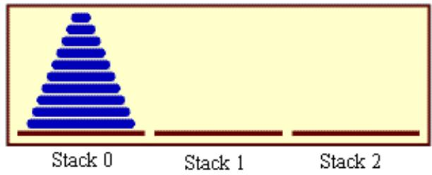

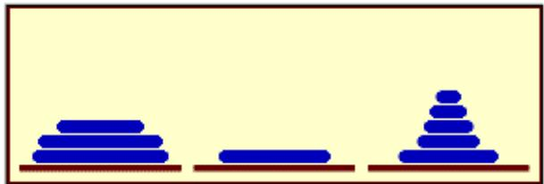  
The stacks after a number of moves.

The problem is to move ten disks from Stack 0 to Stack 1, subject to certain rules. Stack 2 can be used as a spare location. Can we reduce this to smaller problems of the same type, possibly generalizing the problem a bit to make this possible? It seems natural to consider the size of the problem to be the number of disks to be moved. If there are N disks in Stack 0, we know that we will eventually have to move the bottom disk from Stack 0 to Stack 1. But before we can do that, according to the rules, the first N-1 disks must be on Stack 2. Once we’ve moved the N-th disk to Stack 1, we must move the other N-1 disks from Stack 2 to Stack 1 to complete the solution. But moving N-1 disks is the same type of problem as moving N disks, except that it’s a smaller version of the problem. This is exactly what we need to do recursion! The problem has to be generalized a bit, because the smaller problems involve moving disks from Stack 0 to Stack 2 or from Stack 2 to Stack 1, instead of from Stack 0 to Stack 1. In the recursive subroutine that solves the problem, the stacks that serve as the source and destination of the disks have to be specified. It’s also convenient to specify the stack that is to be used as a spare, even though we could figure that out from the other two parameters. The base case is when there is only one disk to be moved. The solution in this case is trivial: Just move the disk in one step. Here is a version of the subroutine that will print out step-by-step instructions for solving the problem:

```java
/**
 * Solve the problem of moving the number of disks specified
 * by the first parameter from the stack specified by the
 * second parameter to the stack specified by the third
 * parameter.  The stack specified by the fourth parameter
 * is available for use as a spare.  Stacks are specified by
 * number: 0, 1, or 2.
 */
static void TowersOfHanoi(int disks, int from, int to, int spare) {
    if (disks == 1) {
        // There is only one disk to be moved.  Just move it.
        System.out.println("Move a disk from stack number "
               + from + " to stack number " + to);
    }
    else {
        // Move all but one disk to the spare stack, then
        // move the bottom disk, then put all the other
        // disks on top of it.
        TowersOfHanoi(disks-1, from, spare, to);
        System.out.println("Move a disk from stack number "
               + from + " to stack number " + to);
        TowersOfHanoi(disks-1, spare, to, from);
    }
}
```

This subroutine just expresses the natural recursive solution. The recursion works because each recursive call involves a smaller number of disks, and the problem is trivial to solve in the base case, when there is only one disk. To solve the “top level” problem of moving N disks from Stack 0 to Stack 1, it should be called with the command TowersOfHanoi(N,0,1,2). The subroutine is demonstrated by the sample program TowersOfHanoi.java.

Here, for example, is the output from the program when it is run with the number of disks set equal to 3:

```txt
Move a disk from stack number 0 to stack number 2
Move a disk from stack number 0 to stack number 1
Move a disk from stack number 2 to stack number 1
Move a disk from stack number 0 to stack number 2
Move a disk from stack number 1 to stack number 0
Move a disk from stack number 1 to stack number 2
Move a disk from stack number 0 to stack number 2
Move a disk from stack number 0 to stack number 1
Move a disk from stack number 2 to stack number 1
Move a disk from stack number 2 to stack number 0
Move a disk from stack number 1 to stack number 0
Move a disk from stack number 2 to stack number 1
Move a disk from stack number 0 to stack number 2
Move a disk from stack number 0 to stack number 1
Move a disk from stack number 2 to stack number 1
```

The output of this program shows you a mass of detail that you don’t really want to think about! The dificulty of following the details contrasts sharply with the simplicity and elegance of the recursive solution. Of course, you really want to leave the details to the computer. It’s much more interesting to watch the applet from Section 9.5, which shows the solution graph ically. That applet uses the same recursive subroutine, except that the System.out.println statements are replaced by commands that show the image of the disk being moved from one stack to another.

There is, by the way, a story that explains the name of this problem. According to this story, on the first day of creation, a group of monks in an isolated tower near Hanoi were given a stack of 64 disks and were assigned the task of moving one disk every day, according to the rules of the Towers of Hanoi problem. On the day that they complete their task of moving all the disks from one stack to another, the universe will come to an end. But don’t worry. The number of steps required to solve the problem for N disks is $2 ^ { N } \mathrm { ~  ~ { ~ 1 ~ } ~ }$ , and $2 ^ { 6 4 } \mathrm { ~ - ~ } 1$ days is over 50,000,000,000,000 years. We have a long way to go.

(In the terminology of Section 8.6, the Towers of Hanoi algorithm has a run time that is $\Theta ( 2 ^ { n } )$ , where n is the number of disks that have to be moved. Since the exponential function $2 ^ { n }$ grows so quickly, the Towers of Hanoi problem can be solved in practice only for a small number of disks.)

$$
\* *\ *\]*\n\nabla
$$

By the way, in addtion to the graphical Towers of Hanoi applet at the end of this chapter, there are two other end-of-chapter applets in the on-line version of this text that use recursion. One is a maze-solving applet from the end of Section 11.5, and the other is a pentominos applet from the end of Section 10.5.

The Maze applet first builds a random maze. It then tries to solve the maze by finding a path through the maze from the upper left corner to the lower right corner. This problem is actually very similar to a “blob-counting” problem that is considered later in this section. The recursive maze-solving routine starts from a given square, and it visits each neighboring square and calls itself recursively from there. The recursion ends if the routine finds itself at the lower right corner of the maze.

The Pentominos applet is an implementation of a classic puzzle. A pentomino is a connected figure made up of five equal-sized squares. There are exactly twelve figures that can be made in this way, not counting all the possible rotations and reflections of the basic figures. The problem is to place the twelve pentominos on an 8-by-8 board in which four of the squares have already been marked as filled. The recursive solution looks at a board that has already been partially filled with pentominos. The subroutine looks at each remaining piece in turn. It tries to place that piece in the next available place on the board. If the piece fits, it calls itself recursively to try to fill in the rest of the solution. If that fails, then the subroutine goes on to the next piece. A generalized version of the pentominos applet with many more features can be found at http://math.hws.edu/xJava/PentominosSolver/.

The Maze applet and the Pentominos applet are fun to watch, and they give nice visual representations of recursion.

## 9.1.3 A Recursive Sorting Algorithm

Turning next to an application that is perhaps more practical, we’ll look at a recursive algorithm for sorting an array. The selection sort and insertion sort algorithms, which were covered in Section 7.4, are fairly simple, but they are rather slow when applied to large arrays. Faster sorting algorithms are available. One of these is Quicksort, a recursive algorithm which turns out to be the fastest sorting algorithm in most situations.

```c
* Apply QuicksortStep to the list of items in locations lo through 1
* in the array A. The value returned by this routine is the final
* position of the pivot item in the array.
*/
static int quicksortStep(int[] A, int lo, int hi) {
    int pivot = A[lo]; // Get the pivot value.
    // The numbers hi and lo mark the endpoints of a range
    // of numbers that have not yet been tested. Decrease hi
    // and increase lo until they become equal, moving numbers
    // bigger than pivot so that they lie above hi and moving
    // numbers less than the pivot so that they lie below lo.
    // When we begin, A[lo] is an available space, since it used
    // to hold the pivot.
    while (hi > lo) {
        while (hi > lo && A[hi] > pivot) {
            // Move hi down past numbers greater than pivot.
            // These numbers do not have to be moved.
            hi--;
        }
        if (hi == lo)
            break;
```

The Quicksort algorithm is based on a simple but clever idea: Given a list of items, select any item from the list. This item is called the pivot. (In practice, I’ll just use the first item in the list.) Move all the items that are smaller than the pivot to the beginning of the list, and move all the items that are larger than the pivot to the end of the list. Now, put the pivot between the two groups of items. This puts the pivot in the position that it will occupy in the final, completely sorted array. It will not have to be moved again. We’ll refer to this procedure as QuicksortStep.

```txt
To apply QuicksortStep to a list of numbers, select one of the numbers, 23 in this case. Arrange the numbers so that numbers less than 23 lie to its left and numbers greater than 23 lie to its right.
23 10 7 45 16 86 56 2 31 18
18 12 7 2 16 23 86 56 31 45
To finish sorting the list, sort the numbers to the left of 23, and sort the numbers to the right of 23. The nuber 23 itself is already in its final position and doesn't have to be moved again
```

QuicksortStep is not recursive. It is used as a subroutine by Quicksort. The speed of Quicksort depends on having a fast implementation of QuicksortStep. Since it’s not the main point of this discussion, I present one without much comment.

```txt
// The number A[hi] is less than pivot. Move it into
// the available space at A[lo], leaving an available
// space at A[hi].
A[lo] = A[hi];
lo++;

while (hi > lo && A[lo] < pivot) {
    // Move lo up past numbers less than pivot.
    // These numbers do not have to be moved.
    lo++;
}

if (hi == lo)
    break;

// The number A[lo] is greater than pivot. Move it into
// the available space at A[hi], leaving an available
// space at A[lo].
A[hi] = A[lo];
hi--;
} // end while
// At this point, lo has become equal to hi, and there is
// an available space at that position. This position lies
// between numbers less than pivot and numbers greater than
// pivot. Put pivot in this space and return its location.
A[lo] = pivot;
return lo;

// end QuicksortStep
```

With this subroutine in hand, Quicksort is easy. The Quicksort algorithm for sorting a list consists of applying QuicksortStep to the list, then applying Quicksort recursively to the items that lie to the left of the new position of the pivot and to the items that lie to the right of that position. Of course, we need base cases. If the list has only one item, or no items, then the list is already as sorted as it can ever be, so Quicksort doesn’t have to do anything in these cases.

```txt
/**
 * Apply quicksort to put the array elements between
 * position lo and position hi into increasing order.
 */
static void quicksort(int[] A, int lo, int hi) {
    if (hi <= lo) {
        // The list has length one or zero. Nothing needs
        // to be done, so just return from the subroutine.
        return;
    }
    else {
        // Apply quicksortStep and get the new pivot position.
        // Then apply quicksort to sort the items that
        // precede the pivot and the items that follow it.
        int pivotPosition = quicksortStep(A, lo, hi);
        quicksort(A, lo, pivotPosition - 1);
        quicksort(A, pivotPosition + 1, hi);
```

As usual, we had to generalize the problem. The original problem was to sort an array, but the recursive algorithm is set up to sort a specified part of an array. To sort an entire array, A, using the quickSort() subroutine, you would call quicksort(A, 0, A.length - 1).

Quicksort is an interesting example from the point of view of the analysis of algorithms (Section 8.6), because its average case run time difers greatly from its worst case run time. Here is a very informal analysis, starting with the average case: Note that an application of quicksortStep divides a problem into two sub-problems. On the average, the subproblems will be of approximately the same size. A problem of size n is divided into two problems that are roughly of size $\mathrm { n } / 2 ;$ these are then divided into four problems that are roughly of size $\mathrm { n } / 4 ;$ and so on. Since the problem size is divided by 2 on each level, there will be approximately log(n) levels of subdivision. The amount of processing on each level is proportional to n. (On the top level, each element in the array is looked at and possibly moved. $\mathrm { O n }$ the second level, where there are two subproblems, every element but one in the array is part of one of those two subproblems and must be looked at and possibly moved, so there is a total of about n steps in both subproblems combined. Similarly, on the third level, there are four subproblems and a total of about n steps in all four subproblems combined on that level. . . .) With a total of n steps on each level and approximately log(n) levels in the average case, the average case run time for Quicksort is $\Theta ( \mathrm { n ^ { * } l o g ( n ) } )$ . This analysis assumes that quicksortStep divides a problem into two approximately equal parts. However, in the worst case, each application of quicksortStep divides a problem of size n into a problem of size 0 and a problem of size n-1. This happens when the pivot element ends up at the beginning or end of the array. In this worst case, there are n levels of subproblems, and the worst-case run time is $\Theta ( \mathrm { n } ^ { 2 } )$ . The worst case is very rare—it depends on the items in the array being arranged in a very special way, so the average performance of Quicksort can be very good even though it is not so good in certain rare cases. There are sorting algorithms that have both an average case and a worst case run time of $\Theta ( \mathrm { n ^ { * } l o g ( n ) } )$ ). One example is MergeSort, which you can look up if you are interested.

## 9.1.4 Blob Counting

The program Blobs.java displays a grid of small white and gray squares. The gray squares are considered to be “filled” and the white squares are “empty.” For the purposes of this example, we define a “blob” to consist of a filled square and all the filled squares that can be reached from it by moving up, down, left, and right through other filled squares. If the user clicks on any filled square in the program, the computer will count the squares in the blob that contains the clicked square, and it will change the color of those squares to red. The program has several controls. There is a “New Blobs” button; clicking this button will create a new random pattern in the grid. A pop-up menu specifies the approximate percentage of squares that will be filled in the new pattern. The more filled squares, the larger the blobs. And a button labeled “Count the Blobs” will tell you how many diferent blobs there are in the pattern. You can try an applet version of the program in the on-line version of the book. Here is a picture of the program after the user has clicked one of the filled squares:

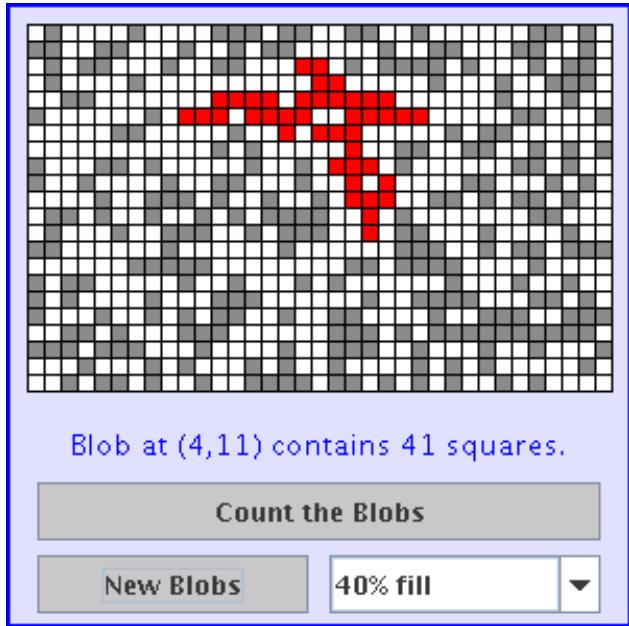

Recursion is used in this program to count the number of squares in a blob. Without recursion, this would be a very dificult thing to implement. Recursion makes it relatively easy, but it still requires a new technique, which is also useful in a number of other applications.

The data for the grid of squares is stored in a two dimensional array of boolean values,

```txt
boolean[][] filled;
```

The value of filled[r][c] is true if the square in row r and in column c of the grid is filled. The number of rows in the grid is stored in an instance variable named rows, and the number of columns is stored in columns. The program uses a recursive instance method named getBlobSize() to count the number of squares in the blob that contains the square in a given row r and column c. If there is no filled square at position (r,c), then the answer is zero. Otherwise, getBlobSize() has to count all the filled squares that can be reached from the square at position (r,c). The idea is to use getBlobSize() recursively to get the number of filled squares that can be reached from each of the neighboring positions, (r+1,c), (r-1,c), (r,c+1), and (r,c-1). Add up these numbers, and add one to count the square at (r,c) itself, and you get the total number of filled squares that can be reached from (r,c). Here is an implementation of this algorithm, as stated. Unfortunately, it has a serious flaw: It leads to an infinite recursion!

```txt
int getBlobSize(int r, int c) {  // BUGGY, INCORRECT VERSION!!
    // This INCORRECT method tries to count all the filled
    // squares that can be reached from position (r,c) in the grid.
    if (r < 0 || r >= rows || c < 0 || c >= columns) {
        // This position is not in the grid, so there is
        // no blob at this position.  Return a blob size of zero.
        return 0;
    }
    if (filled[r][c] == false) {
        // This square is not part of a blob, so return zero.
        return 0;
    }
    int size = 1;  // Count the square at this position, then count the
```

```txt
//  the blobs that are connected to this square
        //  horizontally or vertically.
    size += getBlobSize(r-1,c);
    size += getBlobSize(r+1,c);
    size += getBlobSize(r,c-1);
    size += getBlobSize(r,c+1);
    return size;
} // end INCORRECT getBlobSize()
```

Unfortunately, this routine will count the same square more than once. In fact, it will try to count each square infinitely often! Think of yourself standing at position (r,c) and trying to follow these instructions. The first instruction tells you to move up one row. You do that, and then you apply the same procedure. As one of the steps in that procedure, you have to move down one row and apply the same procedure yet again. But that puts you back at position (r,c)! From there, you move up one row, and from there you move down one row. . . . Back and forth forever! We have to make sure that a square is only counted and processed once, so we don’t end up going around in circles. The solution is to leave a trail of breadcrumbs—or on the computer a trail of boolean values—to mark the squares that you’ve already visited. Once a square is marked as visited, it won’t be processed again. The remaining, unvisited squares are reduced in number, so definite progress has been made in reducing the size of the problem. Infinite recursion is avoided!

A second boolean array, visited[r][c], is used to keep track of which squares have already been visited and processed. It is assumed that all the values in this array are set to false before getBlobSize() is called. As getBlobSize() encounters unvisited squares, it marks them as visited by setting the corresponding entry in the visited array to true. When getBlobSize() encounters a square that is already visited, it doesn’t count it or process it further. The technique of “marking” items as they are encountered is one that used over and over in the programming of recursive algorithms. Here is the corrected version of getBlobSize(), with changes shown in italic:

```javascript
/**
 * Counts the squares in the blob at position (r,c) in the
 * grid. Squares are only counted if they are filled and
 * unvisited. If this routine is called for a position that
 * has been visited, the return value will be zero.
 */
int getBlobSize(int r, int c) {
    if (r < 0 || r >= rows || c < 0 || c >= columns) {
        // This position is not in the grid, so there is
        // no blob at this position. Return a blob size of zero.
        return 0;
    }
    if (filled[r][c] == false // visited[r][c] == true) {
        // This square is not part of a blob, or else it has
        // already been counted, so return zero.
        return 0;
    }
    visited[r][c] = true;   // Mark the square as visited so that
                                // we won't count it again during the
                                // following recursive calls.
    int size = 1; // Count the square at this position, then count the
        // the blobs that are connected to this square
```

```txt
// horizontally or vertically.
    size += getBlobSize(r-1,c);
    size += getBlobSize(r+1,c);
    size += getBlobSize(r,c-1);
    size += getBlobSize(r,c+1);
    return size;
} // end getBlobSize()
```

In the program, this method is used to determine the size of a blob when the user clicks on a square. After getBlobSize() has performed its task, all the squares in the blob are still marked as visited. The paintComponent() method draws visited squares in red, which makes the blob visible. The getBlobSize() method is also used for counting blobs. This is done by the following method, which includes comments to explain how it works:

```txt
/**
 * When the user clicks the "Count the Blobs" button, find the
 * number of blobs in the grid and report the number in the
 * message label.
 */
void countBlobs() {

    int count = 0; // Number of blobs.

    /* First clear out the visited array. The getBlobSize() method
       will mark every filled square that it finds by setting the
       corresponding element of the array to true. Once a square
       has been marked as visited, it will stay marked until all the
       blobs have been counted. This will prevent the same blob from
       being counted more than once. */

    for (int r = 0; r < rows; r++)
        for (int c = 0; c < columns; c++)
            visited[r][c] = false;

    /* For each position in the grid, call getBlobSize() to get the
       size of the blob at that position. If the size is not zero,
       count a blob. Note that if we come to a position that was part
       of a previously counted blob, getBlobSize() will return 0 and
       the blob will not be counted again. */

    for (int r = 0; r < rows; r++)
        for (int c = 0; c < columns; c++) {
            if (getBlobSize(r,c) > 0)
                count++;
        }

    repaint(); // Note that all the filled squares will be red,
           // since they have all now been visited.

    message.setText("The number of blobs is " + count);

+ // end countBlobs()
```

## 9.2 Linked Data Structures

Every useful object contains instance variables. When the type of an instance variable is given by a class or interface name, the variable can hold a reference to another object. Such a reference is also called a pointer, and we say that the variable points to the object. (Of course, any variable that can contain a reference to an object can also contain the special value null, which points to nowhere.) When one object contains an instance variable that points to another object, we think of the objects as being “linked” by the pointer. Data structures of great complexity can be constructed by linking objects together.

## 9.2.1 Recursive Linking

Something interesting happens when an object contains an instance variable that can refer to another object of the same type. In that case, the definition of the object’s class is recursive. Such recursion arises naturally in many cases. For example, consider a class designed to represent employees at a company. Suppose that every employee except the boss has a supervisor, who is another employee of the company. Then the Employee class would naturally contain an instance variable of type Employee that points to the employee’s supervisor:

```java
/**
 * An object of type Employee holds data about one employee.
 */
public class Employee {
    String name;          // Name of the employee.
    Employee supervisor;  // The employee's supervisor.
        .
        .  // (Other instance variables and methods.)
        .
} // end class Employee
```

If emp is a variable of type Employee, then emp.supervisor is another variable of type Employee. If emp refers to the boss, then the value of emp.supervisor should be null to indicate the fact that the boss has no supervisor. If we wanted to print out the name of the employee’s supervisor, for example, we could use the following Java statement:

```java
if ( emp.supervisor == null) {
    System.out.println( emp.name + " is the boss and has no supervisor!" );
}
else {
    System.out.print( "The supervisor of " + emp.name + " is " );
    System.out.println( emp.supervisor.name );
}
```

Now, suppose that we want to know how many levels of supervisors there are between a given employee and the boss. We just have to follow the chain of command through a series of supervisor links, and count how many steps it takes to get to the boss:

```perl
if ( emp.supervisor == null ) {
    System.out.println( emp.name + " is the boss!" );
}
else {
```

W h e n a n o b j e c t c o n t a i n s a r e f e r e n c e t o a n o b j e c t o f t h e s a m e t y p e , t h e n s e v e r a l o b j e c t s c a n b e l i n k e d t o g e t h e r into a list. Each object refers to the next object.  
```txt
Employee runner;  // For "running" up the chain of command.
runner = emp.supervisor;
if ( runner.supervisor == null) {
    System.out.println( emp.name + " reports directly to the boss."]
}
else {
    int count = 0;
    while ( runner.supervisor != null ) {
        count++;  // Count the supervisor on this level.
        runner = runner.supervisor; // Move up to the next level.
    }
    System.out.println( "There are " + count
                          + " supervisors between " + emp.name
                          + " and the boss." );
}
}
```

As the while loop is executed, runner points in turn to the original employee, emp, then to emp’s supervisor, then to the supervisor of emp’s supervisor, and so on. The count variable is incremented each time runner “visits” a new employee. The loop ends when runner.supervisor is null, which indicates that runner has reached the boss. At that point, count has counted the number of steps between emp and the boss.

In this example, the supervisor variable is quite natural and useful. In fact, data structures that are built by linking objects together are so useful that they are a major topic of study in computer science. We’ll be looking at a few typical examples. In this section and the next, we’ll be looking at linked lists. A linked list consists of a chain of objects of the same type, linked together by pointers from one object to the next. This is much like the chain of supervisors between emp and the boss in the above example. It’s also possible to have more complex situations, in which one object can contain links to several other objects. We’ll look at an example of this in Section 9.4.

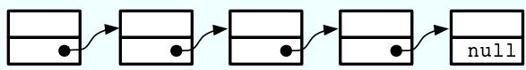

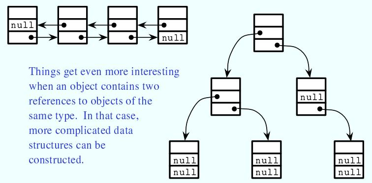

T h i n g s g e t e v e n m o r e i n t e r e s t i n g wh e n a n o b j e c t c o n t a i n s two r e f e r e n c e s t o o b j e c t s o f t h e s a m e t y p e . I n t h a t c a s e , m o r e c o m p l i c a t e d d a t a structures can be<sub>c</sub> <sub>o</sub> <sub>n</sub> <sub>s</sub> <sub>t</sub> <sub>r</sub> <sub>u</sub> <sub>c</sub> <sub>t</sub> <sub>e</sub> <sub>d</sub> <sub>.</sub>

## 9.2.2 Linked Lists

For most of the examples in the rest of this section, linked lists will be constructed out of objects belonging to the class Node which is defined as follows:

```dart
class Node {
    String item;
    Node next;
}
```

The term node is often used to refer to one of the objects in a linked data structure. Objects of type Node can be chained together as shown in the top part of the above picture. Each node holds a String and a pointer to the next node in the list (if any). The last node in such a list can always be identified by the fact that the instance variable next in the last node holds the value null instead of a pointer to another node. The purpose of the chain of nodes is to represent a list of strings. The first string in the list is stored in the first node, the second string is stored in the second node, and so on. The pointers and the node objects are used to build the structure, but the data that we are interested in representing is the list of strings. Of course, we could just as easily represent a list of integers or a list of JButtons or a list of any other type of data by changing the type of the item that is stored in each node.

Although the Nodes in this example are very simple, we can use them to illustrate the common operations on linked lists. Typical operations include deleting nodes from the list, inserting new nodes into the list, and searching for a specified String among the items in the list. We will look at subroutines to perform all of these operations, among others.

For a linked list to be used in a program, that program needs a variable that refers to the first node in the list. It only needs a pointer to the first node since all the other nodes in the list can be accessed by starting at the first node and following links along the list from one node to the next. In my examples, I will always use a variable named head, of type Node, that points to the first node in the linked list. When the list is empty, the value of head is null.

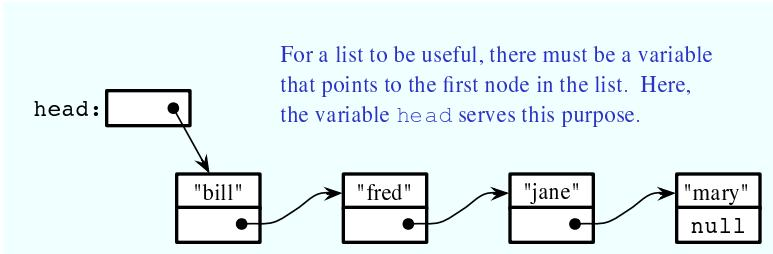

## 9.2.3 Basic Linked List Processing

It is very common to want to process all the items in a linked list in some way. The common pattern is to start at the head of the list, then move from each node to the next by by following the pointer in the node, stopping when the null that marks the end of the list is reached. If head is a variable of type Node that points to the first node in the list, then the general form of the code is:

```txt
Node runner;      // A pointer that will be used to traverse the list.
runner = head;  // Start with runner pointing to the head of the list.
while ( runner != null ) {       // Continue until null is encountered.
    process( runner.item );     // Do something with the item in the current node.
```

```hcl
runner = runner.next;          // Move on to the next node in the list.
}
```

Our only access to the list is through the variable head, so we start by getting a copy of the value in head with the assignment statement runner = head. We need a copy of head because we are going to change the value of runner. We can’t change the value of head, or we would lose our only access to the list! The variable runner will point to each node of the list in turn. When runner points to one of the nodes in the list, runner.next is a pointer to the next node in the list, so the assignment statement runner = runner.next moves the pointer along the list from each node to the next. We know that we’ve reached the end of the list when runner becomes equal to null. Note that our list-processing code works even for an empty list, since for an empty list the value of head is null and the body of the while loop is not executed at all. As an example, we can print all the strings in a list of Strings by saying:

```txt
Node runner = head;
while ( runner != null ) {
    System.out.println( runner.item );
    runner = runner.next;
}
```

The while loop can, by the way, be rewritten as a for loop. Remember that even though the loop control variable in a for loop is often numerical, that is not a requirement. Here is a for loop that is equivalent to the above while loop:

```txt
for ( Node runner = head; runner != null; runner = runner.next ) {
    System.out.println( runner.item );
}
```

Similarly, we can traverse a list of integers to add up all the numbers in the list. A linked list of integers can be constructed using the class

```txt
public class IntNode {
    int item;      // One of the integers in the list.
    IntNode next;   // Pointer to the next node in the list.
}
```

If head is a variable of type IntNode that points to a linked list of integers, we can find the sum of the integers in the list using:

```txt
int sum = 0;
IntNode runner = head;
while ( runner != null ) {
    sum = sum + runner.item;   // Add current item to the sum.
    runner = runner.next;
}
System.out.println("The sum of the list items is " + sum);
```

It is also possible to use recursion to process a linked list. Recursion is rarely the natural way to process a list, since it’s so easy to use a loop to traverse the list. However, understanding how to apply recursion to lists can help with understanding the recursive processing of more complex data structures. A non-empty linked list can be thought of as consisting of two parts: the head of the list, which is just the first node in the list, and the tail of the list, which consists of the remainder of the list after the head. Note that the tail is itself a linked list and that it is shorter than the original list (by one node). This is a natural setup for recursion, where the problem of processing a list can be divided into processing the head and recursively processing the tail. The base case occurs in the case of an empty list (or sometimes in the case of a list of length one). For example, here is a recursive algorithm for adding up the numbers in a linked list of integers:

```txt
if the list is empty then
    return 0 (since there are no numbers to be added up)
otherwise
    let listsum = the number in the head node
    let tailsum be the sum of the numbers in the tail list (recursively)
    add tailsum to listsum
    return listsum
```

One remaining question is, how do we get the tail of a non-empty linked list? If head is a variable that points to the head node of the list, then head.next is a variable that points to the second node of the list—and that node is in fact the first node of the tail. So, we can view head.next as a pointer to the tail of the list. One special case is when the original list consists of a single node. In that case, the tail of the list is empty, and head.next is null. Since an empty list is represented by a null pointer, head.next represents the tail of the list even in this special case. This allows us to write a recursive list-summing function in Java as

```solidity
/**
 * Compute the sum of all the integers in a linked list of integers.
 * @param head a pointer to the first node in the linked list
 */
public static int addItemsInList( IntNode head ) {
    if ( head == null ) {
        // Base case: The list is empty, so the sum is zero.
        return 0;
    }
    else {
        // Recursive case: The list is non-empty. Find the sum of
        // the tail list, and add that to the item in the head node.
        // (Note that this case could be written simply as
        // return head.item + addItemsInList( head.next );)
        int listsum = head.item;
        int tailsum = addItemsInList( head.next );
        listsum = listsum + tailsum;
        return listsum;
    }
}
```

I will finish by presenting a list-processing problem that is easy to solve with recursion, but quite tricky to solve without it. The problem is to print out all the strings in a linked list of strings in the reverse of the order in which they occur in the list. Note that when we do this, the item in the head of a list is printed out after all the items in the tail of the list. This leads to the following recursive routine. You should convince yourself that it works, and you should think about trying to do the same thing without using recursion:

```java
public static void printReversed( Node head ) {
    if ( head == null ) {
        // Base case:  The list is empty, and there is nothing to print.
        return;
    }
    else {
```

```txt
// Recursive case:  The list is non-empty.
    printReversed( head.next );  // Print strings in tail, in reverse order.
    System.out.println( head.item );  // Print string in head node.
}
}
```

In the rest of this section, we’ll look at a few more advanced operations on a linked list of strings. The subroutines that we consider are instance methods in a class, StringList. An object of type StringList represents a linked list of nodes. The class has a private instance variable named head of type Node that points to the first node in the list, or is null if the list is empty. Instance methods in class StringList access head as a global variable. The source code for StringList is in the file StringList.java, and it is used in the sample program ListDemo.java.

Suppose we want to know whether a specified string, searchItem, occurs somewhere in a list of strings. We have to compare searchItem to each item in the list. This is an example of basic list traversal and processing. However, in this case, we can stop processing if we find the item that we are looking for.

```java
***
* Searches the list for a specified item.
* @param searchItem the item that is to be searched for
* @return true if searchItem is one of the items in the list or false if
*     searchItem does not occur in the list.
*/
public boolean find(String searchItem) {

    Node runner;    // A pointer for traversing the list.

    runner = head;  // Start by looking at the head of the list.
        //   (head is an instance variable! )

    while ( runner != null ) {
        // Go through the list looking at the string in each
        // node.  If the string is the one we are looking for,
        // return true, since the string has been found in the list.
        if ( runner.item.equals(searchItem) )
            return true;
        runner = runner.next;  // Move on to the next node.
    }

    // At this point, we have looked at all the items in the list
    // without finding searchItem.  Return false to indicate that
    // the item does not exist in the list.

    return false;

+ // end find()
```

It is possible that the list is empty, that is, that the value of head is null. We should be careful that this case is handled properly. In the above code, if head is null, then the body of the while loop is never executed at all, so no nodes are processed and the return value is false. This is exactly what we want when the list is empty, since the searchItem can’t occur in an empty list.

## 9.2.4 Inserting into a Linked List

The problem of inserting a new item into a linked list is more dificult, at least in the case where the item is inserted into the middle of the list. (In fact, it’s probably the most dificult operation on linked data structures that you’ll encounter in this chapter.) In the StringList class, the items in the nodes of the linked list are kept in increasing order. When a new item is inserted into the list, it must be inserted at the correct position according to this ordering. This means that, usually, we will have to insert the new item somewhere in the middle of the list, between two existing nodes. To do this, it’s convenient to have two variables of type Node, which refer to the existing nodes that will lie on either side of the new node. In the following illustration, these variables are previous and runner. Another variable, newNode, refers to the new node. In order to do the insertion, the link from previous to runner must be “broken,” and new links from previous to newNode and from newNode to runner must be added:

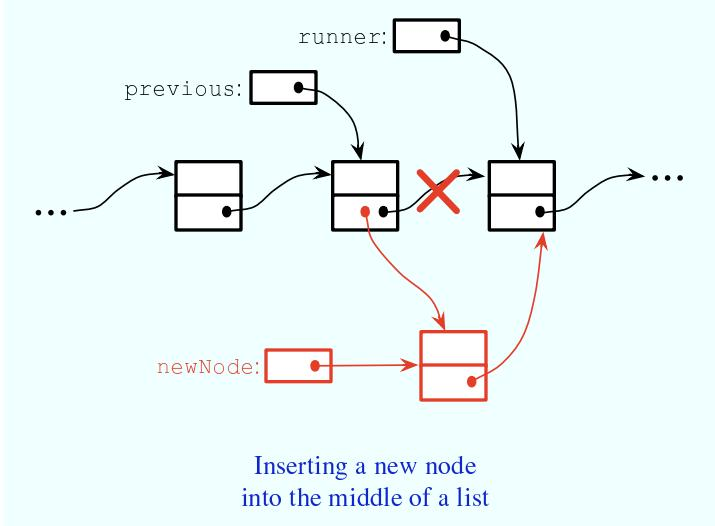

Once we have previous and runner pointing to the right nodes, the command “previous.next = newNode;” can be used to make previous.next point to the new node, instead of to the node indicated by runner. And the command “newNode.next = runner” will set newNode.next to point to the correct place. However, before we can use these commands, we need to set up runner and previous as shown in the illustration. The idea is to start at the first node of the list, and then move along the list past all the items that are less than the new item. While doing this, we have to be aware of the danger of “falling of the end of the list.” That is, we can’t continue if runner reaches the end of the list and becomes null. If insertItem is the item that is to be inserted, and if we assume that it does, in fact, belong somewhere in the middle of the list, then the following code would correctly position previous and runner:

```txt
Node runner, previous;
previous = head;      // Start at the beginning of the list.
runner = head.next;
while ( runner != null && runner.item.compareTo(insertItem) < 0 ) {
    previous = runner;   // "previous = previous.next" would also work
    runner = runner.next;
}
```

(This uses the compareTo() instance method from the String class to test whether the item in the node is less than the item that is being inserted. See Subsection 2.3.2.)

This is fine, except that the assumption that the new node is inserted into the middle of the list is not always valid. It might be that insertItem is less than the first item of the list. In that case, the new node must be inserted at the head of the list. This can be done with the instructions

```javascript
newNode.next = head;    // Make newNode.next point to the old head.
head = newNode;       // Make newNode the new head of the list.
```

It is also possible that the list is empty. In that case, newNode will become the first and only node in the list. This can be accomplished simply by setting head = newNode. The following insert() method from the StringList class covers all of these possibilities:

```txt
/**
 * Insert a specified item to the list, keeping the list in order.
 * @param insertItem the item that is to be inserted.
 */
public void insert(String insertItem) {

    Node newNode;          // A Node to contain the new item.
    newNode = new Node();
    newNode.item = insertItem;  // (N.B.  newNode.next is null.)

    if ( head == null ) {
        // The new item is the first (and only) one in the list.
        // Set head to point to it.
        head = newNode;
    }
    else if ( head.item.compareTo(insertItem) >= 0 ) {
        // The new item is less than the first item in the list,
        // so it has to be inserted at the head of the list.
        newNode.next = head;
        head = newNode;
    }
    else {
        // The new item belongs somewhere after the first item
        // in the list.  Search for its proper position and insert it.
        Node runner;      // A node for traversing the list.
        Node previous;   // Always points to the node preceding runner.
        runner = head.next;   // Start by looking at the SECOND position.
        previous = head;
        while ( runner != null && runner.item.compareTo(insertItem) < 0 ) {
            // Move previous and runner along the list until runner
            // falls off the end or hits a list element that is
            // greater than or equal to insertItem.  When this
            // loop ends, runner indicates the position where
            // insertItem must be inserted.
            previous = runner;
            runner = runner.next;
        }
        newNode.next = runner;      // Insert newNode after previous.
        previous.next = newNode;
    }

} // end insert()
```

If you were paying close attention to the above discussion, you might have noticed that there is one special case which is not mentioned. What happens if the new node has to be inserted at the end of the list? This will happen if all the items in the list are less than the new item. In fact, this case is already handled correctly by the subroutine, in the last part of the if statement. If insertItem is greater than all the items in the list, then the while loop will end when runner has traversed the entire list and become null. However, when that happens, previous will be left pointing to the last node in the list. Setting previous.next = newNode adds newNode onto the end of the list. Since runner is null, the command newNode.next = runner sets newNode.next to null, which is the correct value that is needed to mark the end of the list.

## 9.2.5 Deleting from a Linked List

The delete operation is similar to insert, although a little simpler. There are still special cases to consider. When the first node in the list is to be deleted, then the value of head has to be changed to point to what was previously the second node in the list. Since head.next refers to the second node in the list, this can be done by setting head = head.next. (Once again, you should check that this works when head.next is null, that is, when there is no second node in the list. In that case, the list becomes empty.)

If the node that is being deleted is in the middle of the list, then we can set up previous and runner with runner pointing to the node that is to be deleted and with previous pointing to the node that precedes that node in the list. Once that is done, the command “previous.next = runner.next;” will delete the node. The deleted node will be garbage collected. I encourage you to draw a picture for yourself to illustrate this operation. Here is the complete code for the delete() method:

```java
/**
 * Delete a specified item from the list, if that item is present.
 * If multiple copies of the item are present in the list, only
 * the one that comes first in the list is deleted.
 * @param deleteItem the item to be deleted
 * @return true if the item was found and deleted, or false if the item
 *     was not in the list.
 */
public boolean delete(String deleteItem) {

    if ( head == null ) {
        // The list is empty, so it certainly doesn't contain deleteString
        return false;
    }
    else if ( head.item.equals(deleteItem) ) {
        // The string is the first item of the list.  Remove it.
        head = head.next;
        return true;
    }
    else {
        // The string, if it occurs at all, is somewhere beyond the
        // first element of the list.  Search the list.
        Node runner;      // A node for traversing the list.
        Node previous;   // Always points to the node preceding runner.
        runner = head.next;   // Start by looking at the SECOND list node.
        previous = head;
```

```javascript
while ( runner != null && runner.item.compareTo(deleteItem) < 0 ) {
    // Move previous and runner along the list until runner
    // falls off the end or hits a list element that is
    // greater than or equal to deleteItem.  When this
    // loop ends, runner indicates the position where
    // deleteItem must be, if it is in the list.
    previous = runner;
    runner = runner.next;
}
if ( runner != null && runner.item.equals(deleteItem) ) {
    // Runner points to the node that is to be deleted.
    // Remove it by changing the pointer in the previous node.
    previous.next = runner.next;
    return true;
}
else {
    // The item does not exist in the list.
    return false;
}
}
} // end delete()
```

## 9.3 Stacks, Queues, and ADTs

A linked list is a particular type of data structure, made up of objects linked together by pointers. In the previous section, we used a linked list to store an ordered list of Strings, and we implemented insert, delete, and find operations on that list. However, we could easily have stored the list of Strings in an array or ArrayList, instead of in a linked list. We could still have implemented the same operations on the list. The implementations of these operations would have been diferent, but their interfaces and logical behavior would still be the same.

The term abstract data type, or ADT, refers to a set of possible values and a set of operations on those values, without any specification of how the values are to be represented or how the operations are to be implemented. An “ordered list of strings” can be defined as an abstract data type. Any sequence of Strings that is arranged in increasing order is a possible value of this data type. The operations on the data type include inserting a new string, deleting a string, and finding a string in the list. There are often several diferent ways to implement the same abstract data type. For example, the “ordered list of strings” ADT can be implemented as a linked list or as an array. A program that only depends on the abstract definition of the ADT can use either implementation, interchangeably. In particular, the implementation of the ADT can be changed without afecting the program as a whole. This can make the program easier to debug and maintain, so ADTs are an important tool in software engineering.

In this section, we’ll look at two common abstract data types, stacks and queues. Both stacks and queues are often implemented as linked lists, but that is not the only possible implementation. You should think of the rest of this section partly as a discussion of stacks and queues and partly as a case study in ADTs.

## 9.3.1 Stacks

A stack consists of a sequence of items, which should be thought of as piled one on top of the other like a physical stack of boxes or cafeteria trays. Only the top item on the stack is accessible at any given time. It can be removed from the stack with an operation called pop. An item lower down on the stack can only be removed after all the items on top of it have been popped of the stack. A new item can be added to the top of the stack with an operation called push. We can make a stack of any type of items. If, for example, the items are values of type int, then the push and pop operations can be implemented as instance methods

• void push (int newItem) — Add newItem to top of stack.

• int pop() — Remove the top int from the stack and return it.

It is an error to try to pop an item from an empty stack, so it is important to be able to tell whether a stack is empty. We need another stack operation to do the test, implemented as an instance method

• boolean isEmpty() — Returns true if the stack is empty.

This defines a “stack of ints” as an abstract data type. This ADT can be implemented in several ways, but however it is implemented, its behavior must correspond to the abstract mental image of a stack.

In a stack, all operations take place at the "top" of the stack. The "push" operation adds an item to the top of the stack. The "pop" operation removes the item on the top of the stack and returns it.

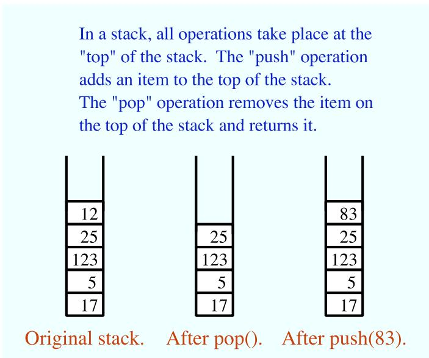

In the linked list implementation of a stack, the top of the stack is actually the node at the head of the list. It is easy to add and remove nodes at the front of a linked list—much easier than inserting and deleting nodes in the middle of the list. Here is a class that implements the “stack of ints” ADT using a linked list. (It uses a static nested class to represent the nodes of the linked list. If the nesting bothers you, you could replace it with a separate Node class.)

public class StackOfInts {

/\*\*

\* An object of type Node holds one of the items in the linked list

\* that represents the stack.

```java
private static class Node {
    int item;
    Node next;
}

private Node top;  // Pointer to the Node that is at the top of
            //   of the stack.  If top == null, then the
            //   stack is empty.

/**
 * Add N to the top of the stack.
 */
public void push( int N ) {
    Node newTop;          // A Node to hold the new item.
    newTop = new Node();
    newTop.item = N;     // Store N in the new Node.
    newTop.next = top;   // The new Node points to the old top.
    top = newTop;         // The new item is now on top.
}

/**
 * Remove the top item from the stack, and return it.
 * Throws an IllegalStateException if the stack is empty when
 * this method is called.
 */
public int pop() {
    if ( top == null )
        throw new IllegalStateException("Can't pop from an empty stack.");
    int头顶 = top.item;  // The item that is being popped.
    top = top.next;           // The previous second item is now on top.
    return头顶;
}

/**
 * Returns true if the stack is empty.  Returns false
 * if there are one or more items on the stack.
 */
public boolean isEmpty() {
    return (top == null);
}

// end class StackOfInts
```

You should make sure that you understand how the push and pop operations operate on the linked list. Drawing some pictures might help. Note that the linked list is part of the private implementation of the StackOfInts class. A program that uses this class doesn’t even need to know that a linked list is being used.

Now, it’s pretty easy to implement a stack as an array instead of as a linked list. Since the number of items on the stack varies with time, a counter is needed to keep track of how many spaces in the array are actually in use. If this counter is called top, then the items on the stack are stored in positions 0, 1, . . . , top-1 in the array. The item in position 0 is on the bottom of the stack, and the item in position top-1 is on the top of the stack. Pushing an item onto the stack is easy: Put the item in position top and add 1 to the value of top. If we don’t want to put a limit on the number of items that the stack can hold, we can use the dynamic array techniques from Subsection 7.3.2. Note that the typical picture of the array would show the stack “upside down”, with the top of the stack at the bottom of the array. This doesn’t matter. The array is just an implementation of the abstract idea of a stack, and as long as the stack operations work the way they are supposed to, we are OK. Here is a second implementation of the StackOfInts class, using a dynamic array:

```java
public class StackOfInts {  // (alternate version, using an array)
    private int[] items = new int[10];  // Holds the items on the stack.
    private int top = 0;  // The number of items currently on the stack.
    /**
     * Add N to the top of the stack.
     */
    public void push( int N ) {
        if (top == items.length) {
            // The array is full, so make a new, larger array and
            // copy the current stack items into it.
            int[] newArray = new int[ 2*items.length ];
            System.arraycopy(items, 0, newArray, 0, items.length);
            items = newArray;
        }
        items[top] = N;  // Put N in next available spot.
        top++;          // Number of items goes up by one.
    }

    /**
     * Remove the top item from the stack, and return it.
     * Throws an IllegalStateException if the stack is empty when
     * this method is called.
     */
    public int pop() {
        if ( top == 0 )
            throw new IllegalStateException("Can't pop from an empty stack.");
        int topItem = items[top - 1]  // Top item in the stack.
        top--;   // Number of items on the stack goes down by one.
        return topItem;
    }

    /**
     * Returns true if the stack is empty.  Returns false
     * if there are one or more items on the stack.
     */
    public boolean isEmpty() {
        return (top == 0);
    }
} // end class StackOfInts
```

Once again, the implentation of the stack (as an array) is private to the class. The two versions of the StackOfInts class can be used interchangeably, since their public interfaces are identical.

```txt
* * *
```

It’s interesting to look at the run time analysis of stack operations. (See Section 8.6). We can measure the size of the problem by the number of items that are on the stack. For the linked list implementation of a stack, the worst case run time both for the push and for the pop operation is Θ(1). This just means that the run time is less than some constant, independent of the number of items on the stack. This is easy to see if you look at the code. The operations are implemented with a few simple assignment statements, and the number of items on the stack has no efect.

For the array implementation, on the other hand, a special case occurs in the push operation when the array is full. In that case, a new array is created and all the stack items are copied into the new array. This takes an amount of time that is proportional to the number of items on the stack. So, although the run time for push is usually Θ(1), the worst case run time is Θ(n), where n is the number of items on the stack.

## 9.3.2 Queues

Queues are similar to stacks in that a queue consists of a sequence of items, and there are restrictions about how items can be added to and removed from the list. However, a queue has two ends, called the front and the back of the queue. Items are always added to the queue at the back and removed from the queue at the front. The operations of adding and removing items are called enqueue and dequeue. An item that is added to the back of the queue will remain on the queue until all the items in front of it have been removed. This should sound familiar. A queue is like a “line” or “queue” of customers waiting for service. Customers are serviced in the order in which they arrive on the queue.

<table><tr><td colspan="2">Front</td><td>46</td><td>125</td><td>8</td><td>22</td><td>17</td><td></td></tr><tr><td colspan="8">Items enter queue at back and leave from front</td></tr><tr><td colspan="2"></td><td>125</td><td>8</td><td>22</td><td>17</td><td colspan="2"></td></tr><tr><td colspan="8">After dequeue()</td></tr><tr><td colspan="2"></td><td>125</td><td>8</td><td>22</td><td>17</td><td>83</td><td></td></tr></table>

A queue can hold items of any type. For a queue of ints, the enqueue and dequeue operations can be implemented as instance methods in a “QueueOfInts” class. We also need an instance method for checking whether the queue is empty:

• void enqueue(int N) — Add N to the back of the queue.

• int dequeue() — Remove the item at the front and return it.

• boolean isEmpty() — Return true if the queue is empty.

A queue can be implemented as a linked list or as an array. An eficient array implementation is a little trickier than the array implementation of a stack, so I won’t give it here. In the linked list implementation, the first item of the list is at the front of the queue. Dequeueing an item from the front of the queue is just like popping an item of a stack. The back of the queue is at the end of the list. Enqueueing an item involves setting a pointer in the last node of the current list to point to a new node that contains the item. To do this, we’ll need a command like “tail.next = newNode;”, where tail is a pointer to the last node in the list. If head is a pointer to the first node of the list, it would always be possible to get a pointer to the last node of the list by saying:

```txt
Node tail;    // This will point to the last node in the list.
tail = head;  // Start at the first node.
while (tail.next != null) {
    tail = tail.next;  // Move to next node.
}
// At this point, tail.next is null, so tail points to
// the last node in the list.
```

However, it would be very ineficient to do this over and over every time an item is enqueued. For the sake of eficiency, we’ll keep a pointer to the last node in an instance variable. This complicates the class somewhat; we have to be careful to update the value of this variable whenever a new node is added to the end of the list. Given all this, writing the QueueOfInts class is not all that dificult:

```java
public class QueueOfInts {
    /**
     * An object of type Node holds one of the items
     * in the linked list that represents the queue.
     */
    private static class Node {
        int item;
        Node next;
    }

    private Node head = null;  // Points to first Node in the queue.
                               // The queue is empty when head is null

    private Node tail = null;  // Points to last Node in the queue.

    /**
     * Add N to the back of the queue.
     */
    public void enqueue( int N ) {
        Node newTail = new Node();  // A Node to hold the new item.
        newTail.item = N;
        if (head == null) {
            // The queue was empty.  The new Node becomes
            // the only node in the list.  Since it is both
            // the first and last node, both head and tail
            // point to it.
            head = newTail;
            tail = newTail;
        }
        else {
            // The new node becomes the new tail of the list.
            // (The head of the list is unaffected.)
```

```java
tail.next = newTail;
    tail = newTail;
}
}

/**
 * Remove and return the front item in the queue.
 * Throws an IllegalStateException if the queue is empty.
 */
public int dequeue() {
    if ( head == null)
        throw new IllegalStateException("Can't dequeue from an empty queue.");
    int firstItem = head.item;
    head = head.next;  // The previous second item is now first.
    if (head == null) {
        // The queue has become empty.  The Node that was
        // deleted was the tail as well as the head of the
        // list, so now there is no tail.  (Actually, the
        // class would work fine without this step.)
        tail = null;
    }
    return firstItem;
}

/**
 * Return true if the queue is empty.
 */
boolean isEmpty() {
    return (head == null);
}

} // end class QueueOfInts
```

Queues are typically used in a computer (as in real life) when only one item can be processed at a time, but several items can be waiting for processing. For example:

• In a Java program that has multiple threads, the threads that want processing time on the CPU are kept in a queue. When a new thread is started, it is added to the back of the queue. A thread is removed from the front of the queue, given some processing time, and then—if it has not terminated—is sent to the back of the queue to wait for another turn.

• Events such as keystrokes and mouse clicks are stored in a queue called the “event queue”. A program removes events from the event queue and processes them. It’s possible for several more events to occur while one event is being processed, but since the events are stored in a queue, they will always be processed in the order in which they occurred.

• A web server is a progam that receives requests from web browsers for “pages.” It is easy for new requests to arrive while the web server is still fulfilling a previous request. Requests that arrive while the web server is busy are placed into a queue to await processing. Using a queue ensures that requests will be processed in the order in which they were received.

Queues are said to implement a FIFO policy: First In, First Out. Or, as it is more commonly expressed, first come, first served. Stacks, on the other hand implement a LIFO policy: Last In, First Out. The item that comes out of the stack is the last one that was put in. Just like queues, stacks can be used to hold items that are waiting for processing (although in applications where queues are typically used, a stack would be considered “unfair”).

## ∗ ∗ ∗

To get a better handle on the diference between stacks and queues, consider the sample program DepthBreadth.java. I suggest that you run the program or try the applet version that can be found in the on-line version of this section. The program shows a grid of squares. Initially, all the squares are white. When you click on a white square, the program will gradually mark all the squares in the grid, starting from the one where you click. To understand how the program does this, think of yourself in the place of the program. When the user clicks a square, you are handed an index card. The location of the square—its row and column—is written on the card. You put the card in a pile, which then contains just that one card. Then, you repeat the following: If the pile is empty, you are done. Otherwise, take an index card from the pile. The index card specifies a square. Look at each horizontal and vertical neighbor of that square. If the neighbor has not already been encountered, write its location on a new index card and put the card in the pile.

While a square is in the pile, waiting to be processed, it is colored red; that is, red squares have been encountered but not yet processed. When a square is taken from the pile and processed, its color changes to gray. Once a square has been colored gray, its color won’t change again. Eventually, all the squares have been processed, and the procedure ends. In the index card analogy, the pile of cards has been emptied.

The program can use your choice of three methods: Stack, Queue, and Random. In each case, the same general procedure is used. The only diference is how the “pile of index cards” is managed. For a stack, cards are added and removed at the top of the pile. For a queue, cards are added to the bottom of the pile and removed from the top. In the random case, the card to be processed is picked at random from among all the cards in the pile. The order of processing is very diferent in these three cases.

You should experiment with the program to see how it all works. Try to understand how stacks and queues are being used. Try starting from one of the corner squares. While the process is going on, you can click on other white squares, and they will be added to the pile. When you do this with a stack, you should notice that the square you click is processed immediately, and all the red squares that were already waiting for processing have to wait. On the other hand, if you do this with a queue, the square that you click will wait its turn until all the squares that were already in the pile have been processed.

## ∗ ∗ ∗

Queues seem very natural because they occur so often in real life, but there are times when stacks are appropriate and even essential. For example, consider what happens when a routine calls a subroutine. The first routine is suspended while the subroutine is executed, and it will continue only when the subroutine returns. Now, suppose that the subroutine calls a second subroutine, and the second subroutine calls a third, and so on. Each subroutine is suspended while the subsequent subroutines are executed. The computer has to keep track of all the subroutines that are suspended. It does this with a stack.

When a subroutine is called, an activation record is created for that subroutine. The activation record contains information relevant to the execution of the subroutine, such as its local variables and parameters. The activation record for the subroutine is placed on a stack. It will be removed from the stack and destroyed when the subroutine returns. If the subroutine calls another subroutine, the activation record of the second subroutine is pushed onto the stack, on top of the activation record of the first subroutine. The stack can continue to grow as more subroutines are called, and it shrinks as those subroutines return.

## 9.3.3 Postfix Expressions

As another example, stacks can be used to evaluate postfix expressions. An ordinary mathematical expression such as 2+(15-12)\*17 is called an infix expression. In an infix expression, an operator comes in between its two operands, as in $^ { 6 6 } 2 \ + \ 2 ^ { 3 }$ . In a postfix expression, an operator comes after its two operands, as in $^ { 6 6 } 2 \ 2 \ + ^ { 5 }$ . The infix expression $^ { \mathrm { . 4 } } 2 + ( 1 5 \mathrm { - } 1 2 ) \ast 1 7 ^ { \mathrm { 3 } }$ would be written in postfix form as “2 15 12 - 17 \* +”. The “-” operator in this expression applies to the two operands that precede it, namely “15” and $^ { 6 6 } 1 2 ^ { \mathfrak { s } }$ . The “\*” operator applies to the two operands that precede it, namely “15 $1 2 ~ - ^ { 5 }$ and $^ { 6 6 } 1 7 ^ { 5 }$ . And the “+” operator applies to “2” and $^ {  } 1 5 \ : \ : 1 2 \ : \ : - \ : 1 7 \ : \ : * ^ {  }$ . These are the same computations that are done in the original infix expression.

Now, suppose that we want to process the expression “2 15 $1 2 ~ - ~ 1 7 ~ * ~ + ^ { ; \dag }$ , from left to right and find its value. The first item we encounter is the 2, but what can we do with it? At this point, we don’t know what operator, if any, will be applied to the 2 or what the other operand might be. We have to remember the 2 for later processing. We do this by pushing it onto a stack. Moving on to the next item, we see a 15, which is pushed onto the stack on top of the 2. Then the 12 is added to the stack. Now, we come to the operator, “-”. This operation applies to the two operands that preceded it in the expression. We have saved those two operands on the stack. So, to process the “-” operator, we pop two numbers from the stack, 12 and 15, and compute 15 - 12 to get the answer 3. This 3 must be remembered to be used in later processing, so we push it onto the stack, on top of the 2 that is still waiting there. The next item in the expression is a 17, which is processed by pushing it onto the stack, on top of the 3. To process the next item, “\*”, we pop two numbers from the stack. The numbers are 17 and the 3 that represents the value of $^ { 6 6 } 1 5 1 2 - ^ { 5 }$ . These numbers are multiplied, and the result, 51 is pushed onto the stack. The next item in the expression is a “+” operator, which is processed by popping 51 and 2 from the stack, adding them, and pushing the result, 53, onto the stack. Finally, we’ve come to the end of the expression. The number on the stack is the value of the entire expression, so all we have to do is pop the answer from the stack, and we are done! The value of the expression is 53.

Although it’s easier for people to work with infix expressions, postfix expressions have some advantages. For one thing, postfix expressions don’t require parentheses or precedence rules. The order in which operators are applied is determined entirely by the order in which they occur in the expression. This allows the algorithm for evaluating postfix expressions to be fairly straightforward:

```asm
Start with an empty stack
for each item in the expression:
    if the item is a number:
        Push the number onto the stack
    else if the item is an operator:
        Pop the operands from the stack  // Can generate an error
        Apply the operator to the operands
        Push the result onto the stack
    else
        There is an error in the expression
Pop a number from the stack  // Can generate an error
if the stack is not empty:
    There is an error in the expression
else:
    The last number that was popped is the value of the expression
```

Errors in an expression can be detected easily. For example, in the expression “2 3 + \*”, there are not enough operands for the “\*” operation. This will be detected in the algorithm when an attempt is made to pop the second operand for “\*” from the stack, since the stack will be empty. The opposite problem occurs in “2 3 4 +”. There are not enough operators for all the numbers. This will be detected when the 2 is left still sitting in the stack at the end of the algorithm.

This algorithm is demonstrated in the sample program PostfixEval.java. This program lets you type in postfix expressions made up of non-negative real numbers and the operators “+”, “-”, “\*”, “/”, and ”^”. The “^” represents exponentiation. That is, “2 3 ^” is evaluated as 2<sup>3</sup>. The program prints out a message as it processes each item in the expression. The stack class that is used in the program is defined in the file StackOfDouble.java. The StackOfDouble class is identical to the first StackOfInts class, given above, except that it has been modified to store values of type double instead of values of type int.

The only interesting aspect of this program is the method that implements the postfix evaluation algorithm. It is a direct implementation of the pseudocode algorithm given above:

```javascript
/**
 * Read one line of input and process it as a postfix expression.
 * If the input is not a legal postfix expression, then an error
 * message is displayed. Otherwise, the value of the expression
 * is displayed. It is assumed that the first character on
 * the input line is a non-blank.
 */
private static void readAndEvaluate() {
    StackOfDouble stack; // For evaluating the expression.
    stack = new StackOfDouble(); // Make a new, empty stack.
    TextIO.putln();
    while (TextIO.peek() != '\n') {
        if ( Character.isdigit(TextIO.peek()) ) {
            // The next item in input is a number. Read it and
            // save it on the stack.
            double num = TextIO.getDouble();
            stack.push(num);
            TextIO.putln(" Pushed constant " + num);
        }
        else {
            // Since the next item is not a number, the only thing
            // it can legally be is an operator. Get the operator
            // and perform the operation.
            char op; // The operator, which must be +, -, *, /, or ^. double x,y;      // The operands, from the stack, for the operation.
            double answer; // The result, to be pushed onto the stack.
            op = TextIO.getChar();
            if (op != '+' && op != '-' && op != '*' && op != '/' && op != '^')} {
                // The character is not one of the acceptable operations.
                TextIO.putln("\nIllegal operator found in input: " + op);
                return;
            }
            if (stack.isEmpty()) {
```

```javascript
TextIO.putln(" Stack is empty while trying to evaluate " + op);
TextIO.putln("\nNot enough numbers in expression!");
return;
}
y = stack.pop();
if (stack.isEmpty()) {
TextIO.putln(" Stack is empty while trying to evaluate " + op);
TextIO.putln("\nNot enough numbers in expression!");
return;
}
x = stack.pop();
switch (op) {
case '+':
answer = x + y;
break;
case '-':
answer = x - y;
break;
case '*':
answer = x * y;
break;
case '/':
answer = x / y;
break;
default:
answer = Math.pow(x,y); // (op must be '^'.)
}
stack.push(answer);
TextIO.putln(" Evaluated " + op + " and pushed " + answer);
}
TextIO.skipBlanks();
} // end while
// If we get to this point, the input has been read successfully.
// If the expression was legal, then the value of the expression is
// on the stack, and it is the only thing on the stack.
if (stack.isEmpty()) { // Impossible if the input is really non-empty.
TextIO.putln("No expression provided.");
return;
}
double value = stack.pop(); // Value of the expression.
TextIO.putln(" Popped " + value + " at end of expression.");
if (stack.isEmpty() == false) {
TextIO.putln(" Stack is not empty.");
TextIO.putln("\nNot enough operators for all the numbers!");
return;
}
TextIO.putln("\nValue = " + value);

// end readAndEvaluate()
```

Postfix expressions are often used internally by computers. In fact, the Java virtual machine is a “stack machine” which uses the stack-based approach to expression evaluation that we have been discussing. The algorithm can easily be extended to handle variables, as well as constants. When a variable is encountered in the expression, the value of the variable is pushed onto the stack. It also works for operators with more or fewer than two operands. As many operands as are needed are popped from the stack and the result is pushed back on to the stack. For example, the unary minus operator, which is used in the expression “-x”, has a single operand. We will continue to look at expressions and expression evaluation in the next two sections.

## 9.4 Binary Trees

We have seen in the two previous sections how objects can be linked into lists. When an object contains two pointers to objects of the same type, structures can be created that are much more complicated than linked lists. In this section, we’ll look at one of the most basic and useful structures of this type: binary trees. Each of the objects in a binary tree contains two pointers, typically called left and right. In addition to these pointers, of course, the nodes can contain other types of data. For example, a binary tree of integers could be made up of objects of the following type:

```dart
class TreeNode {
    int item;          // The data in this node.
    TreeNode left;   // Pointer to the left subtree.
    TreeNode right;  // Pointer to the right subtree.
}
```

The left and right pointers in a TreeNode can be null or can point to other objects of type TreeNode. A node that points to another node is said to be the parent of that node, and the node it points to is called a child. In the picture below, for example, node 3 is the parent of node 6, and nodes 4 and 5 are children of node 2. Not every linked structure made up of tree nodes is a binary tree. A binary tree must have the following properties: There is exactly one node in the tree which has no parent. This node is called the root of the tree. Every other node in the tree has exactly one parent. Finally, there can be no loops in a binary tree. That is, it is not possible to follow a chain of pointers starting at some node and arriving back at the same node.

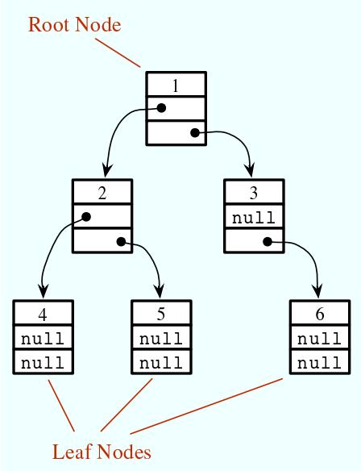

A node that has no children is called a leaf. A leaf node can be recognized by the fact that both the left and right pointers in the node are null. In the standard picture of a binary tree, the root node is shown at the top and the leaf nodes at the bottom—which doesn’t show much respect for the analogy to real trees. But at least you can see the branching, tree-like structure that gives a binary tree its name.

## 9.4.1 Tree Traversal

Consider any node in a binary tree. Look at that node together with all its descendents (that is, its children, the children of its children, and so on). This set of nodes forms a binary tree, which is called a subtree of the original tree. For example, in the picture, nodes 2, 4, and 5 form a subtree. This subtree is called the left subtree of the root. Similarly, nodes 3 and 6 make up the right subtree of the root. We can consider any non-empty binary tree to be made up of a root node, a left subtree, and a right subtree. Either or both of the subtrees can be empty. This is a recursive definition, matching the recursive definition of the TreeNode class. So it should not be a surprise that recursive subroutines are often used to process trees.

Consider the problem of counting the nodes in a binary tree. (As an exercise, you might try to come up with a non-recursive algorithm to do the counting, but you shouldn’t expect to find one.) The heart of problem is keeping track of which nodes remain to be counted. It’s not so easy to do this, and in fact it’s not even possible without an auxiliary data structure such as a stack or queue. With recursion, however, the algorithm is almost trivial. Either the tree is empty or it consists of a root and two subtrees. If the tree is empty, the number of nodes is zero. (This is the base case of the recursion.) Otherwise, use recursion to count the nodes in each subtree. Add the results from the subtrees together, and add one to count the root. This gives the total number of nodes in the tree. Written out in Java:

```txt
/**
 * Count the nodes in the binary tree to which root points, and
 * return the answer.  If root is null, the answer is zero.
 */
static int countNodes( TreeNode root ) {
    if ( root == null )
```

## 9.4. BINARY TREES

```txt
return 0;  // The tree is empty.  It contains no nodes.
else {
    int count = 1;   // Start by counting the root.
    count += countNodes(root.left);  // Add the number of nodes
                                //     in the left subtree.
    count += countNodes(root.right); // Add the number of nodes
                                //     in the right subtree.
    return count;  // Return the total.
}
} // end countNodes()
```

Or, consider the problem of printing the items in a binary tree. If the tree is empty, there is nothing to do. If the tree is non-empty, then it consists of a root and two subtrees. Print the item in the root and use recursion to print the items in the subtrees. Here is a subroutine that prints all the items on one line of output:

```groovy
/**
 * Print all the items in the tree to which root points.
 * The item in the root is printed first, followed by the
 * items in the left subtree and then the items in the
 * right subtree.
 */
static void preorderPrint( TreeNode root ) {
    if ( root != null ) {  // (Otherwise, there's nothing to print.)
        System.out.print( root.item + " " );  // Print the root item.
        preorderPrint( root.left );   // Print items in left subtree.
        preorderPrint( root.right );  // Print items in right subtree.
    }
} // end preorderPrint()
```

This routine is called “preorderPrint” because it uses a preorder traversal of the tree. In a preorder traversal, the root node of the tree is processed first, then the left subtree is traversed, then the right subtree. In a postorder traversal, the left subtree is traversed, then the right subtree, and then the root node is processed. And in an inorder traversal, the left subtree is traversed first, then the root node is processed, then the right subtree is traversed. Printing subroutines that use postorder and inorder traversal difer from preorderPrint only in the placement of the statement that outputs the root item:

```groovy
/**
 * Print all the items in the tree to which root points.
 * The item in the left subtree printed first, followed
 * by the items in the right subtree and then the item
 * in the root node.
 */
static void postorderPrint( TreeNode root ) {
    if ( root != null ) {  // (Otherwise, there's nothing to print.)
        postorderPrint( root.left );   // Print items in left subtree.
        postorderPrint( root.right );  // Print items in right subtree.
        System.out.print( root.item + " " );  // Print the root item.
    }
} // end postorderPrint()

/**
 * Print all the items in the tree to which root points.
```

```groovy
* The item in the left subtree printed first, followed
* by the item in the root node and then the items
* in the right subtree.
*/
static void inorderPrint( TreeNode root ) {
    if ( root != null ) {  // (Otherwise, there's nothing to print.)
        inorderPrint( root.left );   // Print items in left subtree.
        System.out.print( root.item + " " );  // Print the root item.
        inorderPrint( root.right );  // Print items in right subtree.
    }
} // end inorderPrint()
```

Each of these subroutines can be applied to the binary tree shown in the illustration at the beginning of this section. The order in which the items are printed difers in each case:

```typescript
preorderPrint outputs: 1 2 4 5 3 6
postorderPrint outputs: 4 5 2 6 3 1
inorderPrint outputs: 4 2 5 1 3 6
```

In preorderPrint, for example, the item at the root of the tree, 1, is output before anything else. But the preorder printing also applies to each of the subtrees of the root. The root item of the left subtree, 2, is printed before the other items in that subtree, 4 and 5. As for the right subtree of the root, 3 is output before 6. A preorder traversal applies at all levels in the tree. The other two traversal orders can be analyzed similarly.

## 9.4.2 Binary Sort Trees

One of the examples in Section 9.2 was a linked list of strings, in which the strings were kept in increasing order. While a linked list works well for a small number of strings, it becomes ineficient for a large number of items. When inserting an item into the list, searching for that item’s position requires looking at, on average, half the items in the list. Finding an item in the list requires a similar amount of time. If the strings are stored in a sorted array instead of in a linked list, then searching becomes more eficient because binary search can be used. However, inserting a new item into the array is still ineficient since it means moving, on average, half of the items in the array to make a space for the new item. A binary tree can be used to store an ordered list of strings, or other items, in a way that makes both searching and insertion eficient. A binary tree used in this way is called a binary sort tree.

A binary sort tree is a binary tree with the following property: For every node in the tree, the item in that node is greater than every item in the left subtree of that node, and it is less than or equal to all the items in the right subtree of that node. Here for example is a binary sort tree containing items of type String. (In this picture, I haven’t bothered to draw all the pointer variables. Non-null pointers are shown as arrows.)

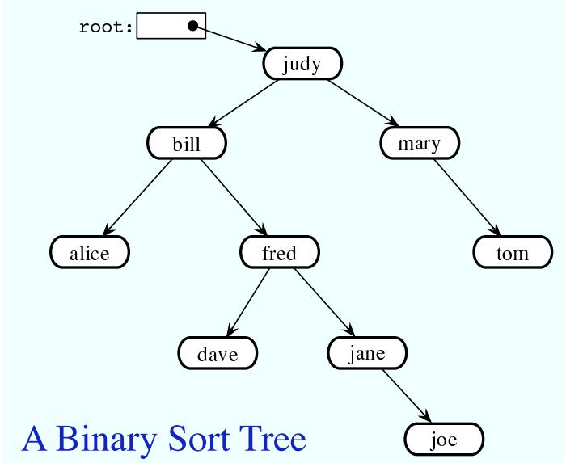

Binary sort trees have this useful property: An inorder traversal of the tree will process the items in increasing order. In fact, this is really just another way of expressing the definition. For example, if an inorder traversal is used to print the items in the tree shown above, then the items will be in alphabetical order. The definition of an inorder traversal guarantees that all the items in the left subtree of “judy” are printed before “judy”, and all the items in the right subtree of “judy” are printed after “judy”. But the binary sort tree property guarantees that the items in the left subtree of “judy” are precisely those that precede “judy” in alphabetical order, and all the items in the right subtree follow “judy” in alphabetical order. So, we know that “judy” is output in its proper alphabetical position. But the same argument applies to the subtrees. “Bill” will be output after “alice” and before “fred” and its descendents. “Fred” will be output after “dave” and before “jane” and “joe”. And so on.

Suppose that we want to search for a given item in a binary search tree. Compare that item to the root item of the tree. If they are equal, we’re done. If the item we are looking for is less than the root item, then we need to search the left subtree of the root—the right subtree can be eliminated because it only contains items that are greater than or equal to the root. Similarly, if the item we are looking for is greater than the item in the root, then we only need to look in the right subtree. In either case, the same procedure can then be applied to search the subtree. Inserting a new item is similar: Start by searching the tree for the position where the new item belongs. When that position is found, create a new node and attach it to the tree at that position.

Searching and inserting are eficient operations on a binary search tree, provided that the tree is close to being balanced. A binary tree is balanced if for each node, the left subtree of that node contains approximately the same number of nodes as the right subtree. In a perfectly balanced tree, the two numbers difer by at most one. Not all binary trees are balanced, but if the tree is created by inserting items in a random order, there is a high probability that the tree is approximately balanced. (If the order of insertion is not random, however, it’s quite possible for the tree to be very unbalanced.) During a search of any binary sort tree, every comparison eliminates one of two subtrees from further consideration. If the tree is balanced, that means cutting the number of items still under consideration in half. This is exactly the same as the binary search algorithm, and the result, is a similarly eficient algorithm.

In terms of asymptotic analysis (Section 8.6), searching, inserting, and deleting in a binary search tree have average case run time Θ(log(n)). The problem size, n, is the number of items in the tree, and the average is taken over all the diferent orders in which the items could have been inserted into the tree. As long the actual insertion order is random, the actual run time can be expected to be close to the average. However, the worst case run time for binary search tree operations is Θ(n), which is much worse than Θ(log(n)). The worst case occurs for certain particular insertion orders. For example, if the items are inserted into the tree in order of increasing size, then every item that is inserted moves always to the right as it moves down the tree. The result is a “tree” that looks more like a linked list, since it consists of a linear string of nodes strung together by their right child pointers. Operations on such a tree have the same performance as operations on a linked list. Now, there are data structures that are similar to simple binary sort trees, except that insertion and deletion of nodes are implemented in a way that will always keep the tree balanced, or almost balanced. For these data structures, searching, inserting, and deleting have both average case and worst case run times that are Θ(log(n)). Here, however, we will look at only the simple versions of inserting and searching.

The sample program SortTreeDemo.java is a demonstration of binary sort trees. The program includes subroutines that implement inorder traversal, searching, and insertion. We’ll look at the latter two subroutines below. The main() routine tests the subroutines by letting you type in strings to be inserted into the tree.

In this program, nodes in the binary tree are represented using the following static nested class, including a simple constructor that makes creating nodes easier:

```txt
/**
 * An object of type TreeNode represents one node in a binary tree of strings.
 */
private static class TreeNode {
    String item;      // The data in this node.
    TreeNode left;     // Pointer to left subtree.
    TreeNode right;   // Pointer to right subtree.
    TreeNode(String str) {
        // Constructor.  Make a node containing str.
        item = str;
    }
} // end class TreeNode
```

A static member variable of type TreeNode points to the binary sort tree that is used by the program:

```txt
private static TreeNode root;  // Pointer to the root node in the tree.
// When the tree is empty, root is null.
```

A recursive subroutine named treeContains is used to search for a given item in the tree. This routine implements the search algorithm for binary trees that was outlined above:

```javascript
/**
 * Return true if item is one of the items in the binary
 * sort tree to which root points.  Return false if not.
 */
static boolean treeContains( TreeNode root, String item ) {
    if ( root == null ) {
        // Tree is empty, so it certainly doesn't contain item.
        return false;
    }
    else if ( item.equals(root.item) ) {
```
