<!-- Source PDF pages 601-699 -->

from CONNECTED to CLOSED.) Note that closing the window will also close the connection in the same way.

It is also possible for the user on the other side of the connection to close the connection. When that happens, the stream of incoming messages ends, and the in.readLine() on this side of the connection returns the value null, which indicates end-of-stream and acts as a signal that the connection has been closed by the remote user.

For a final look into the GUIChat code, consider the methods that send and receive messages. These methods are called from diferent threads. The send() method is called by the eventhandling thread in response to a user action. It’s purpose is to transmit a message to the remote user. It uses a PrintWriter, out, that writes to the socket’s output stream. Synchronization of this method prevents the connection state from changing in the middle of the send operation:

```java
/**
 * Send a message to the other side of the connection, and post the
 * message to the transcript.  This should only be called when the
 * connection state is ConnectionState.CONNECTED; if it is called at
 * other times, it is ignored.
 */
synchronized void send(String message) {
    if (state == ConnectionState.CONNECTED) {
        postMessage("SEND:  " + message);
        out.println(message);
        out.flush();
        if (out.checkError()) {
            postMessage("\nERROR OCCURRED WHILE TRYING TO SEND DATA.");
            close();  // Closes the connection.
        }
    }
}
```

The received() method is called by the connection-handling thread after a message has been read from the remote user. Its only job is to display the message to the user, but again it is synchronized to avoid the race condition that could occur if the connection state were changed by another thread while this method is being executed:

```java
/**
 * This is called by the run() method when a message is received from
 * the other side of the connection.  The message is posted to the
 * transcript, but only if the connection state is CONNECTED.  (This
 * is because a message might be received after the user has clicked
 * the "Disconnect" button; that message should not be seen by the
 * user.)
 */
synchronized private void received(String message) {
    if (state == ConnectionState.CONNECTED)
        postMessage("RECEIVE:  " + message);
}
```

## 11.5.2 A Multithreaded Server

There is still one big problem with the GUIChat program. In order to open a connection to another computer, a user must know that there is a GUIChat program listening on some particular port on some particular computer. Except in rather contrived situations, there is no way for a user to know that. It would be nice if it were possible to discover, somehow, who’s out there on the Internet waiting for a connection. Unfortunately, this is not possible. And yet, applications such as AOL Instant Messenger seem to do just that—they can show you a list of users who are available to receive messages. How can they do that?

I don’t know the details of instant messenger protocols, but it has to work something like this: When you start the client program, that program contacts a server program that runs constantly on some particular computer and on some particular port. Since the server is always available at the same computer and port, the information needed to contact it can be built into the client program or otherwise made available to the users of the program. The purpose of the server is to keep a list of available users. When your client program contacts the server, it gets a list of available users, along with whatever information is necessary to send messages to those users. At the same time, your client program registers you with the server, so that the server can tell other users that you are on-line. When you shut down the client program, you are removed from the server’s list of users, and other users can be informed that you have gone of-line.

Of course, in an application like AOL server, you only get to see a list of available users from your “buddy list,” a list of your friends who are also AOL users. To implement this, you need to have an account on the AOL server. The server needs to keep a database of information about all user accounts, including the buddy list for each user. This makes the server program rather complicated, and I won’t consider that aspect of its functionality here. However, it is not very dificult to write a scaled-down application that uses the network in a similar way. I call my scaled-down version “BuddyChat.” It doesn’t keep separate buddy lists for each user; it assumes that you’re willing to be buddies with anyone who happens to connect to the server. In this application, the server keeps a list of connected users and makes that list available to each connected user. A user can connect to another user and chat with that user, using a window that is very similar to the chat window in GUIChat. BuddyChat is still just a toy, compared to serious network applications, but it does illustrate some core ideas.

The BuddyChat application comes in several pieces. BuddyChatServer.java is the server program, which keeps the list of available users and makes that list available to clients. Ideally, the server program would run constantly (as a daemon) on a computer and port that are known to all the possible client users. For testing, of course, it can simply be stated like any other program. The client program is BuddyChat.java. This program is to be run by any user who wants to use the BuddyChat service. When a user starts the client program, it connects to the server, and it gets from the server a list of other users who are currently connected. The list is displayed to the user of the client program, who can send a request for a chat connection with any user on the list. The client can also receive incoming chat connection requests from other users. The window that is used for chatting is defined by BuddyChatWindow.java, which is not itself a program but just a subclass of JFrame that defines the chat window. (There is also a fourth piece, BuddyChatServerShutdown.java. This is a program that can be run to shut down the BuddyChatServer gracefully. I will not discuss it further here. See the source code for more information, if you are interested.)

I urge you to compile the programs and try them out. For testing, you can try them on a single computer (although all the windows can get a little confusing). First, start BuddyChatServer. The server has no GUI interface, but it does print some information to standard output as it runs. Then start the BuddyChat client program. When BuddyChat starts up, it presents a window where you can enter the name and port number for the server and your “handle,” which is just a name that will identify you in the server’s list of users. The server info is already set up to connect to a server on the same machine. When you hit the “Connect” button, a new window will open with a list, currently empty, of other users connected to the server. Now, start another copy of the BuddyChat client program. When you click “Connect”, you’ll have two client list windows, one for each copy of the client program that you’ve started. (One of these windows will be exactly on top of the other, so you’ll have to move it to see the second window.) Each client window will display the other client in its list of users. You can run additional copies of the client program, if you want, and you might want to try connecting from another computer if one is available.

At this point, there is a network connection in place between the server and each client. Whenever a client connects to or disconnects from the server, the server sends a notification of the event to each connected client, so that the client can modify its own list of connected users. The server also maintains a listening socket that listens for connection requests from new clients. In order to manage all this, the server is running several threads. One thread waits for connection requests on the listening socket. In addition to this, there are two threads for each connected client—one thread for sending messages to the client and one thread for reading messages sent by the client to the server.

Back to trying out the program. Remember that the whole point was to provide each user with a list of potential chat partners. Click on a user in one of the client user lists, and then click the “Connect to Selected Buddy” button. When you do this, your BuddyChat program sends a connection request to the BuddyChat program that is being run by the selected user. Each BuddyChat program, one on each side of the connection, opens a chat window (of type BuddyChatWindow). A network connection between these two windows is set up without any further action on the part of the two users, and the users can use the windows to send messages back and forth to each other. The BuddyChatServer program has nothing to do with opening, closing, or using the connection between its two clients (although a diferent design might have had the messages go through the server).

In order to open the chat connection from one program to another, the second program must be listening for connection requests and the first program must know the computer and port on which the first user is listening. In the BuddyChat system, the BuddyChatServer knows this information and provides it to each BuddyChat client program. The users of the client programs never have to be aware of this information.

How does the server know about the clients’ computers and port numbers? When a BuddyChat client program is run, in addition to opening a connection to the BuddyChatServer, the client also creates a listening socket to accept connection requests from other users. When the client registers with the server, it tells the server the port number of the client’s listening socket. The server also knows the IP address of the computer on which the client is running, since it has a network connection to that computer. This means that the BuddyChatServer knows the IP address and listening socket port number of every BuddyChat client. A copy of this information is provided (along with the users’ handles) to each connected client program. The net result is that every BuddyChat client program has the information that it needs to contact all the other clients.

The basic techniques used in the BuddyChat system are the same as those used in previous networking examples: server sockets, client sockets, input and output streams for sending messages over the network, and threads to handle the communication. The important diference is how these basic building blocks are combined to build a more complex application. I have tried to explain the logic of that application here. I will not discuss the BuddyChat source code here, since it is locally similar to examples that we have already looked at, but I encourage you to study the source code if you are interested in network programming.

BuddyChat seems to have a lot of functionality, yet I said it was still a “toy” program. What exactly makes it a toy? There are at least two big problems. First of all, it is not scalable. A network program is scalable if it will work well for a large number of simultaneous users. BuddyChat would have problems with a large number of users because it uses so many threads (two for each user). It takes a certain amount of processing for a computer to switch its attention from one thread to another. On a very busy server, the constant switching between threads would soon start to degrade the performance. One solution to this is to use a more advanced network API. Java has a class SelectableChannel that makes it possible for one thread to manage communication over a large number of network connections. This class is part of the package java.nio that provides a number of advanced I/O capabilities for working with files and networking. However, I will not cover those capabilities in this book.

But the biggest problem is that BuddyChat ofers absolutely no defense against denial of service attacks. In a denial of service, a malicious user attacks a network server in some way that prevents other users from accessing the service or severely degrades the performance of the service for those users. It would be simple to launch a denial of service attack on BuddyChat by making a huge number of connections to the server. The server would then spend most of its time servicing those bogus connections. The server could guard against this to some extent by putting a limit on the number of simultaneous connections that it will accept from a given IP address. It would also be helpful to add some security to the server by requiring users to know a password in order to connect. However, neither of these measures would fully solve the problem, and it is very dificult to find a complete defense against denial of service attacks.

## 11.5.3 Distributed Computing

In Section 8.5, we saw how threads can be used to do parallel processing, where a number of processors work together to complete some task. In that section, it was assumed that all the processors were inside one multi-processor computer. But parallel processing can also be done using processors that are in diferent computers, as long as those computers are connected to a network over which they can communicate. This type of parallel processing—in which a number of computers work together on a task and communicate over a network—is called distributed computing.

In some sense, the whole Internet is an immense distributed computation, but here I am interested in how computers on a network can cooperate to solve some computational problem. There are several approaches to distributed computing that are supported in Java. RMI and CORBA are standards that enable a program running on one computer to call methods in objects that exist on other computers. This makes it possible to design an object-oriented program in which diferent parts of the program are executed on diferent computers. RMI (Remote Method Invocation) only supports communication between Java objects. CORBA (Common Object Request Broker Architecture) is a more general standard that allows objects written in various programming languages, including Java, to communicate with each other. As is commonly the case in networking, there is the problem of locating services (where in this case, a “service” means an object that is available to be called over the network). That is, how can one computer know which computer a service is located on and what port it is listening on? RMI and CORBA solve this problem using something like our little BuddyChatServer example—a server running at a known location keeps a list of services that are available on other computers. Computers that ofer services register those services with the server; computers that need services contact the server to find out where they are located.

RMI and CORBA are complex systems that are not very easy to use. I mention them here because they are part of Java’s standard network API, but I will not discuss them further. Instead, we will look at a relatively simple demonstration of distributed computing that is uses only basic networking.

The problem that we will look at uses the simplest type of parallel programming, in which the problem can be broken down into tasks that can be performed independently, with no communication between the tasks. To apply distributed computing to this type of problem, we can use one “master” program that divides the problem into tasks and sends those tasks over the network to “worker” programs that do the actual work. The worker programs send their results back to the master program, which combines the results from all the tasks into a solution of the overall problem. In this context, the worker programs are often called “slaves,” and the program uses the so-called master/slave approach to distributed computing.

The demonstration program is defined by three source code files: CLMandelbrotMaster.java defines the master program; CLMandelbrotWorker.java defines the worker programs; and CLMandelbrotTask.java defines the class, CLMandelbrotTask, that represents an individual task that is performed by the workers. To run the demonstration, you must start the CLMandelbrotWorker program on several computers (probably by running it on the command line). This program uses CLMandelbrotTask, so both class files, CLMandelbrotWorker.class and CLMandelbrotTask.class, must be present on the worker computers. You can then run CLMandelbrotMaster on the master computer. Note that this program also requires the class CLMandelbrotTask. You must specify the host name or IP address of each of the worker computers as command line arguments for CLMandelbrotMaster. A worker programs listens for connection requests from the master program, and the master program must be told where to send those requests. For example, if the worker program is running on three computers with IP addresses 172.30.217.101, 172.30.217.102, and 172.30.217.103, then you can run CLMandelbrotMaster with the command

java CLMandelbrotMaster 172.30.217.101 172.30.217.102 172.30.217.103

The master will make a network connection to the worker at each IP address; these connections will be used for communication between the master program and the workers.

It is possible to run several copies of CLMandelbrotWorker on the same computer, but they must listen for network connections on diferent ports. It is also possible to run CLMandelbrotWorker on the same computer as CLMandelbrotMaster. You might even see some speed-up when you do this, if your computer has several processors. See the comments in the program source code files for more information, but here are some commands that you can use to run the master program and two copies of the worker program on the same computer. Give these commands in separate command windows:

java CLMandelbrotWorker

(Listens on default port)

java CLMandelbrotWorker 1501

(Listens on port 1501)

java CLMandelbrotMaster localhost localhost:1501

Every time CLMandelbrotMaster is run, it solves exactly the same problem. (For this demonstration, the nature of the problem is not important, but the problem is to compute the data needed for a picture of a small piece of the famous “Mandelbrot Set.” If you are interested in seeing the picture that is produced, uncomment the call to the saveImage() method at the end of the main() routine in CLMandelbrotMaster.java. We will encounter the Mandelbrot Set again as an example in Chapter 12.)

You can run CLMandelbrotMaster with diferent numbers of worker programs to see how the time required to solve the problem depends on the number of workers. (Note that the worker programs continue to run after the master program exists, so you can run the master program several times without having to restart the workers.) In addition, if you run CLMandelbrotMaster with no command line arguments, it will solve the entire problem on its own, so you can see how long it takes to do so without using distributed computing. In a trial that I ran, it took 40 seconds for CLMandelbrotMaster to solve the problem on its own. Using just one worker, it took 43 seconds. The extra time represents extra work involved in using the network; it takes time to set up a network connection and to send messages over the network. Using two workers (on diferent computers), the problem was solved in 22 seconds. In this case, each worker did about half of the work, and their computations were performed in parallel, so that the job was done in about half the time. With larger numbers of workers, the time continued to decrease, but only up to a point. The master program itself has a certain amount of work to do, no matter how many workers there are, and the total time to solve the problem can never be less than the time it takes for the master program to do its part. In this case, the minimum time seemed to be about five seconds.

## ∗ ∗ ∗

Let’s take a look at how this distributed application is programmed. The master program divides the overall problem into a set of tasks. Each task is represented by an object of type CLMandelbrotTask. These tasks have to be communicated to the worker programs, and the worker programs must send back their results. Some protocol is needed for this communication. I decided to use character streams. The master encodes a task as a line of text, which is sent to a worker. The worker decodes the text (into an object of type CLMandelbrotTask) to find out what task it is supposed to perform. It performs the assigned task. It encodes the results as another line of text, which it sends back to the master program. Finally, the master decodes the results and combines them with the results from other tasks. After all the tasks have been completed and their results have been combined, the problem has been solved.

The problem is divided into a fairly large number of tasks. A worker receives not just one task, but a sequence of tasks. Each time it finishes a task and sends back the result, it is assigned a new task. After all tasks are complete, the worker receives a “close” command that tells it to close the connection. In CLMandelbrotWorker.java, all this is done in a method named handleConnection() that is called to handle a connection that has already been opened to the master program. It uses a method readTask() to decode a task that it receives from the master and a method writeResults() to encode the results of the task for transmission back to the master. It must also handle any errors that occur:

```java
private static void handleConnection(Socket connection) {
    try {
        BufferedReader in = new BufferedReader( new InputStreamReader(
            connection.getInputStream()) );
        PrintWriter out = new PrintWriter(connection.getOutputStream());
        while (true) {
            String line = in.readLine();  // Message from the master.
            if (line == null) {
                // End-of-steram encountered -- should not happen.
                throw new Exception("Connection closed unexpectedly.");
            }
        }
    }
}
```

```groovy
if (line.startsWith(CLOSE_CONNECTION_COMMAND)) {
    // Represents the normal termination of the connection.
    System.out.println("Received close command.");
    break;
}
else if (line.startsWith(TASK_COMMAND)) {
    // Represents a CLMandelbrotTask that this worker is
    // supposed to perform.
    CLMandelbrotTask task = readTask(line);  // Decode the message.
    task.compute();  // Peform the task.
    out.println(writeResults(task));  // Send back the results.
    out.flush();
}
else {
    // No other messages are part of the protocol.
    throw new Exception("Illegal command received.");
}
}
catch (Exception e) {
    System.out.println("Client connection closed with error " + e);
}
finally {
    try {
        connection.close();  // Make sure the socket is closed.
    }
    catch (Exception e) {
    }
}
}
```

Note that this method is not executed in a separate thread. The worker has only one thing to do at a time and does not need to be multithreaded.

You might wonder why so many tasks are used. Why not just divide the problem into one task for each worker? The reason is that using a larger number of tasks makes it possible to do load balancing. Not all tasks take the same amount of time to execute. This is true for many reasons. Some of the tasks might simply be more computationally complex than others. Some of the worker computers might be slower than others. Or some worker computers might be busy running other programs, so that they can only give part of their processing power to the worker program. If we assigned one task per worker, it is possible that a complex task running on a slow, busy computer would take much longer than the other tasks to complete. This would leave the other workers idle and delay the completion of the job while that worker completes its task. To complete the job as quickly as possible, we want to keep all the workers busy and have them all finish at about the same time. This is called load balancing. If we have a large number of tasks, the load will automatically be approximately balanced: A worker is not assigned a new task until it finishes the task that it is working on. A slow worker, or one that happens to receive more complex tasks, will complete fewer tasks than other workers, but all workers will be kept busy until close to the end of the job. On the other hand, individual tasks shouldn’t be too small. Network communication takes some time. If it takes longer to transmit a task and its results than it does to perform the task, then using distributed computing will take more time than simply doing the whole job on one computer! A problem is a good candidate for distributed computing if it can be divided into a fairly large number of fairly large tasks.

Turing to the master program, CLMandelbrotMaster.java, we encounter a more complex situation. The master program must communicate with several workers over several network connections. To accomplish this, the master program is multi-threaded, with one thread to manage communication with each worker. A pseudocode outline of the main() routine is quite simple:

```prolog
create a list of all tasks that must be performed
if there are no command line arguments {
    // The master program does all the tasks itself.
    Perform each task.
}
else {
    // The tasks will be performed by worker programs.
    for each command line argument:
        Get information about a worker from command line argument.
        Create and start a thread to communicate with the worker.
    Wait for all threads to terminate.
}
// All tasks are now complete (assuming no error occurred).
```

The list of tasks is stored in a variable, tasks, of type ArrayList<CLMandelbrotTask>. The communication threads take tasks from this list and send them to worker programs. The method getNextTask() gets one task from the list. If the list is empty, it returns null as a signal that all tasks have been assigned and the communication thread can terminate. Since tasks is a resource that is shared by several threads, access to it must be controlled; this is accomplished by writing getNextTask() as a synchronized method:

```java
synchronized private static CLMandelbrotTask getNextTask() {
    if (tasks.size() == 0)
        return null;
    else
        return tasks.remove(0);
}
```

(The reason for the synchronization is to avoid the race condition that could occur between the time that the value of tasks.size() is tested and the time that tasks.remove() is called. See Subsection 8.5.3 for information about parallel programming, race conditions, and synchronized.)

The job of a thread is to send a sequence of tasks to a worker thread and to receive the results that the worker sends back. The thread is also responsible for opening the connection in the first place. A pseudocode outline for the process executed by the thread might look like:

```txt
Create a socket connected to the worker program.
Create input and output streams for communicating with the worker
while (true) {
    Let task = getNextTask().
    If task == null
        break;  // All tasks have been assigned.
    Encode the task into a message and transmit it to the worker.
    Read the response from the worker.
    Decode and process the response.
}
```

```txt
Send a "close" command to the worker.
Close the socket.
```

This would work OK. However, there are a few subtle points. First of all, the thread must be ready to deal with a network error. For example, a worker might shut down unexpectedlyy. But if that happens, the master program can continue, provided other workers are still available. (You can try this when you run the program: Stop one of the worker programs, with CONTROL-C, and observe that the master program still completes successfully.) A dificulty arises if an error occurs while the thread is working on a task: If the problem as a whole is going to be completed, that task will have to be reassigned to another worker. I take care of this by putting the uncompleted task back into the task list. (Unfortunately, my program does not handle all possible errors. If a network connection “hangs” indefinitely without actually generating an error, my program will also hang, waiting for a response from a worker that will never arrive. A more robust program would have some way of detecting the problem and reassigning the task.)

Another defect in the procedure outlined above is that it leaves the worker program idle while the thread is processing the worker’s response. It would be nice to get a new task to the worker before processing the response from the previous task. This would keep the worker busy and allow two operations to proceed simultaneously instead of sequentially. (In this example, the time it takes to process a response is so short that keeping the worker waiting while it is done probably makes no significant diference. But as a general principle, it’s desirable to have as much parallelism as possible in the algorithm.) We can modify the procedure to take this into account:

```txt
try {
    Create a socket connected to the worker program.
    Create input and output streams for communicating with the worker.
    Let currentTask = getNextTask().
    Encode currentTask into a message and send it to the worker.
    while (true) {
        Read the response from the worker.
        Let nextTask = getNextTask().
        If nextTask != null {
            // Send nextTask to the worker before processing the
            // response to currentTask.
            Encode nextTask into a message and send it to the worker.
        }
        Decode and process the response to currentTask.
        currentTask = nextTask.
        if (currentTask == null)
            break; // All tasks have been assigned.
    }
    Send a "close" command to the worker.
    Close the socket.
}
catch (Exception e) {
    Put uncompleted task, if any, back into the task list.
}
finally {
    Close the connection.
}
```

```java
/**
 * This class represents one worker thread.  The job of a worker thread
 * is to send out tasks to a CLMandelbrotWorker program over a network
 * connection, and to get back the results computed by that program.
 */
private static class WorkerConnection extends Thread {

    int id;          // Identifies this thread in output statements.
    String host;   // The host to which this thread will connect.
    int port;       // The port number to which this thread will connect.

    /**
     * The constructor just sets the values of the instance
     * variables id, host, and port and starts the thread.
     */
    WorkerConnection(int id, String host, int port) {
        this.id = id;
        this.host = host;
        this.port = port;
        start();
    }

    /**
     * The run() method of the thread opens a connection to the host and
     * port specified in the constructor, then sends tasks to the
     * CLMandelbrotWorker program on the other side of that connection.
     * If the thread terminates normally, it outputs  the number of tasks
     * that it processed.  If it terminates with an error, it outputs
     * an error message.
     */
    public void run() {

        int tasksCompleted = 0; // How many tasks has this thread handled.
        Socket socket;  // The socket for the connection.

        try {
            socket = new Socket(host,port);  // open the connection.
        }
        catch (Exception e) {
            System.out.println("Thread " + id + " could not open connection to " +
                host + ":" + port);
            System.out.println("  Error: " + e);
            return;
        }

        CLMandelbrotTask currentTask = null;
        CLMandelbrotTask nextTask = null;

        try {
            PrintWriter out = new PrintWriter(socket.getOutputStream());
            BufferedReader in = new BufferedReader(
                new InputStreamReader(socket.getInputStream()) );
            currentTask = getNextTask();
            if (currentTask != null) {
                // Send first task to the worker program.
                String taskString = writeTask(currentTask);
```

```groovy
out.println(taskString);
    out.flush();
}
while (currentTask != null) {
    String resultString = in.readLine(); // Get results for currentTask.
    if (resultString == null)
        throw new IOException("Connection closed unexpectedly.");
    if (! resultString.startsWith(RESULT_COMMAND))
        throw new IOException("Illegal string received from worker.");
    nextTask = getNextTask();  // Get next task and send it to worker.
    if (nextTask != null) {
        // Send nextTask to worker before processing results for
        // currentTask, so that the worker can work on nextTask
        // while the currentTask results are processed.
        String taskString = writeTask(nextTask);
        out.println(taskString);
        out.flush();
    }
    readResults(resultString, currentTask);
    finishTask(currentTask);  // Process results from currentTask.
    tasksCompleted++;
    currentTask = nextTask;   // We are finished with old currentTask.
    nextTask = null;
}
out.println(CLOSE_CONNECTION_COMMAND);  // Send close command to worker
out.flush();
}
catch (Exception e) {
    System.out.println("Thread " + id + " terminated because of an error");
    System.out.println("  Error: " + e);
    e.printStackTrace();
        // Put uncompleted task, if any, back into the task list.
    if (currentTask != null)
        reassignTask(currentTask);
    if (nextTask != null)
        reassignTask(nextTask);
}
finally {
    System.out.println("Thread " + id + " ending after completing " +
        tasksCompleted + " tasks");
    try {
        socket.close();
    }
    catch (Exception e) {
}
}
//end run()
' end nested class WorkerConnection
```

## 11.6 A Brief Introduction to XML

When data is saved to a file or transmitted over a network, it must be represented in some way that will allow the same data to be rebuilt later, when the file is read or the transmission is received. We have seen that there are good reasons to prefer textual, character-based representations in many cases, but there are many ways to represent a given collection of data as text. In this section, we’ll take a brief look at one type of character-based data representation that has become increasingly common.

XML (eXtensible Markup Language) is a syntax for creating data representation languages. There are two aspects or levels of XML. On the first level, XML specifies a strict but relatively simple syntax. Any sequence of characters that follows that syntax is a well-formed XML document. On the second level, XML provides a way of placing further restrictions on what can appear in a document. This is done by associating a DTD (Document Type Definition) with an XML document. A DTD is essentially a list of things that are allowed to appear in the XML document. A well-formed XML document that has an associated DTD and that follows the rules of the DTD is said to be a valid XML document. The idea is that XML is a general format for data representation, and a DTD specifies how to use XML to represent a particular kind of data. (There is also an alternative to DTDs, known as XML schemas, for defining valid XLM documents, but let’s ignore them here.)

There is nothing magical about XML. It’s certainly not perfect. It’s a very verbose language, and some people think it’s ugly. On the other hand it’s very flexible; it can be used to represent almost any type of data. It was built from the start to support all languages and alphabets. Most important, it has become an accepted standard. There is support in just about any programming language for processing XML documents. There are standard DTDs for describing many diferent kinds of data. There are many ways to design a data representation language, but XML is the one that has happened to come into widespread use. In fact, it has found its way into almost every corner of information technology. For example: There are XML languages for representing mathematical expressions (MathML), musical notation (MusicXML), molecules and chemical reactions (CML), vector graphics (SVG), and many other kinds of information. XML is used by OpenOfice and recent versions of Microsoft Ofice in the document format for ofice applications such as word processing, spreadsheets, and presentations. XML site syndication languages (RSS, ATOM) make it possible for web sites, newspapers, and blogs to make a list of recent headlines available in a standard format that can be used by other web sites and by web browsers; the same format is used to publish podcasts. And XML is a common format for the electronic exchange of business information.

My purpose here is not to tell you everything there is to know about XML. I will just explain a few ways in which it can be used in your own programs. In particular, I will not say anything further about DTDs and valid XML. For many purposes, it is suficient to use well-formed XML documents with no associated DTDs.

## 11.6.1 Basic XML Syntax

An XML document looks a lot like an HTML document (see Subsection 6.2.3). HTML is not itself an XML language, since it does not follow all the strict XML syntax rules, but the basic ideas are similar. Here is a short, well-formed XML document:

```xml
<?xml version="1.0"?>
<simplepaint version="1.0">
    <background red='255' green='153' blue='51'/>
```

```xml
<curve>
    <color red='0' green='0' blue='255'/>
    <symmetric>false</symmetric>
    <point x='83' y='96'/>
    <point x='116' y='149'/>
    <point x='159' y='215'/>
    <point x='216' y='294'/>
    <point x='264' y='359'/>
    <point x='309' y='418'/>
    <point x='371' y='499'/>
    <point x='400' y='543'/>
</curve>
<curve>
    <color red='255' green='255' blue='255'/>
    <symmetric>true</symmetric>
    <point x='54' y='305'/>
    <point x='79' y='289'/>
    <point x='128' y='262'/>
    <point x='190' y='236'/>
    <point x='253' y='209'/>
    <point x='341' y='158'/>
</curve>
</simplepaint>
```

The first line, which is optional, merely identifies this as an XML document. This line can also specify other information, such as the character encoding that was used to encode the characters in the document into binary form. If this document had an associated DTD, it would be specified in a “DOCTYPE” directive on the next line of the file.

Aside from the first line, the document is made up of elements, attributes, and textual content. An element starts with a tag, such as <curve> and ends with a matching end-tag such as </curve>. Between the tag and end-tag is the content of the element, which can consist of text and nested elements. (In the example, the only textual content is the true or false in the <symmetric> elements.) If an element has no content, then the opening tag and end-tag can be combined into a single empty tag, such as <point $\mathrm { x } { = } ^ { , } 8 3 ^ { , } \mathrm { y } { = } ^ { , } 9 6 ^ { , } / { > } ,$ , which is an abbreviation for <point $\mathrm { x } { = } ^ { \prime } 8 3 ^ { \prime } \mathrm { y } { = } ^ { \prime } 9 6 ^ { \prime } { > } { < } / \mathrm { p o i n t } { > }$ . A tag can include attributes such as the x and y in <point $\mathrm { x } { = } ^ { , } 8 3 ^ { , } \mathrm { y } { = } ^ { , } 9 6 ^ { , } / { > }$ or the version in <simplepaint version="1.0">. A document can also include a few other things, such as comments, that I will not discuss here.

The basic structure should look familiar to someone familiar with HTML. The most striking diference is that in XML, you get to choose the tags. Whereas HTML comes with a fixed, finite set of tags, with XML you can make up meaningful tag names that are appropriate to your application and that describe the data that is being represented. (For an XML document that uses a DTD, it’s the author of the DTD who gets to choose the tag names.)

Every well-formed XML document follows a strict syntax. Here are some of the most important syntax rules: Tag names and attribute names in XML are case sensitive. A name must begin with a letter and can contain letters, digits and certain other characters. Spaces and ends-of-line are significant only in textual content. Every tag must either be an empty tag or have a matching end-tag. By “matching” here, I mean that elements must be properly nested; if a tag is inside some element, then the matching end-tag must also be inside that element. A document must have a root element, which contains all the other elements. The root element in the above example has tag name simplepaint. Every attribute must have a value, and that value must be enclosed in quotation marks; either single quotes or double quotes can be used for this. The special characters < and &, if they appear in attribute values or textual content, must be written as &lt; and &amp;. “&lt;” and “&amp;” are examples of entities. The entities &gt;, &quot;, and &apos; are also defined, representing >, double quote, and single quote. (Additional entities can be defined in a DTD.)

While this description will not enable you to understand everything that you might encounter in XML documents, it should allow you to design well-formed XML documents to represent data structures used in Java programs.

## 11.6.2 XMLEncoder and XMLDecoder

We will look at two approaches to representing data from Java programs in XML format. One approach is to design a custom XML language for the specific data structures that you want to represent. We will consider this approach in the next subsection. First, we’ll look at an easy way to store data in XML files and to read those files back into a program. The technique uses the classes XMLEncoder and XMLDecoder. These classes are defined in the package java.beans. An XMLEncoder can be used to write objects to an OutputStream in XML form. An XMLDecoder can be used to read the output of an XMLEncoder and reconstruct the objects that were written by it. XMLEncoder and XMLDecoder have much the same functionality as ObjectOutputStream and ObjectInputStream and are used in much the same way. In fact, you don’t even have to know anything about XML to use them. However, you do need to know a little about Java beans.

A Java bean is just an object that has certain characteristics. The class that defines a Java bean must be a public class. It must have a constructor that takes no parameters. It should have a “get” method and a “set” method for each of its important instance variables. (See Subsection 5.1.3). The last rule is a little vague. The idea is that is should be possible to inspect all aspects of the object’s state by calling “get” methods, and it should be possible to set all aspects of the state by calling “set” methods. A bean is not required to implement any particular interface; it is recognized as a bean just by having the right characteristics. Usually, Java beans are passive data structures that are acted upon by other objects but don’t do much themselves.

XMLEncoder and XMLDecoder can’t be used with arbitrary objects; they can only be used with beans. When an XMLEncoder writes an object, it uses the “get” methods of that object to find out what information needs to be saved. When an XMLDecoder reconstructs an object, it creates the object using the constructor with no parameters and it uses “set” methods to restore the object’s state to the values that were saved by the XMLEncoder. (Some standard java classes are processed using additional techniques. For example, a diferent constructor might be used, and other methods might be used to inspect and restore the state.)

For an example, we return to the same SimplePaint example that was used in Subsection 11.3.4. Suppose that we want to use XMLEncoder and XMLDecoder to create and read files in that program. Part of the data for a SimplePaint sketch is stored in objects of type CurveData, defined as:

private static class CurveData {

Color color; // The color of the curve.

boolean symmetric; // Are reflections also drawn?

ArrayList<Point> points; // The points on the curve.

To use such objects with XMLEncoder and XMLDecoder, we have to modify this class so that it follows the Java bean pattern. The class has to be public, and we need get and set methods for each instance variable. This gives:

```java
public static class CurveData {
    private Color color;  // The color of the curve.
    private boolean symmetric;  // Are reflections also drawn?
    private ArrayList<Point> points;  // The points on the curve.
    public Color getColor() {
        return color;
    }
    public void setColor(Color color) {
        this.color = color;
    }
    public ArrayList<Point> getPoints() {
        return points;
    }
    public void setPoints(ArrayList<Point> points) {
        this.points = points;
    }
    public boolean isSymmetric() {
        return symmetric;
    }
    public void setSymmetric(boolean symmetric) {
        this.symmetric = symmetric;
    }
}
```

I didn’t really need to make the instance variables private, but bean properties are usually private and are accessed only through their get and set methods.

At this point, we might define another bean class, SketchData, to hold all the necessary data for representing the user’s picture. If we did that, we could write the data to a file with a single output statement. In my program, however, I decided to write the data in several pieces.

An XMLEncoder can be constructed to write to any output stream. The output stream is specified in the encoder’s constructor. For example, to create an encoder for writing to a file:

```txt
XMLEncoder encoder;
try {
    FileOutputStream stream = new FileOutputStream(selectedFile);
    encoder = new XMLEncoder( stream );
    .
    .
```

Once an encoder has been created, its writeObject() method is used to write objects, coded into XML form, to the stream. In the SimplePaint program, I save the background color, the number of curves in the picture, and the data for each curve. The curve data are stored in a list of type ArrayList<CurveData> named curves. So, a complete representation of the user’s picture can be created with:

```txt
encoder.writeObject(getBackground());
encoder.writeObject(new Integer(curves.size()));
for (CurveData c : curves)
    encoder.writeObject(c);
encoder.close();
```

When reading the data back into the program, an XMLDecoder is created to read from an input file stream. The objects are then read, using the decoder’s readObject() method, in the same order in which they were written. Since the return type of readObject() is Object, the returned values must be type-cast to their correct type:

```txt
Color bgColor = (Color)decoder.readObject();
Integer curveCt = (Integer)decoder.readObject();
ArrayList<CurveData> newCurves = new ArrayList<CurveData>();
for (int i = 0; i < curveCt; i++) {
    CurveData c = (CurveData)decoder.readObject();
    newCurves.add(c);
}
decoder.close();
curves = newCurves; // Replace the program's data with data from the file.
setBackground(bgColor);
repaint();
```

You can look at the sample program SimplePaintWithXMLEncoder.java to see this code in the context of a complete program. Files are created by the method doSaveAsXML() and are read by doOpenAsXML().

The XML format used by XMLEncoder and XMLDecoder is more robust than the binary format used for object streams and is more appropriate for long-term storage of objects in files.

## 11.6.3 Working With the DOM

The output produced by an XMLEncoder tends to be long and not very easy for a human reader to understand. It would be nice to represent data in a more compact XML format that uses meaningful tag names to describe the data and makes more sense to human readers. We’ll look at yet another version of SimplePaint that does just that. See SimplePaintWithXML.java for the source code. The sample XML document shown earlier in this section was produced by this program. I designed the format of that document to represent all the data needed to reconstruct a picture in SimplePaint. The document encodes the background color of the picture and a list of curves. Each <curve> element contains the data from one object of type CurveData.

It is easy enough to write data in a customized XML format, although we have to be very careful to follow all the syntax rules. Here is how I write the data for a SimplePaint picture to a PrintWriter, out:

```txt
out.println("<?xml version=\"1.0\"?>");
out.println("<simplepaint version=\"1.0\">");
Color bgColor = getBackground();
out.println(" <background red='" + bgColor.getRed() + "' green='" +
    bgColor.getGreen() + "' blue='" + bgColor.getBlue() + "''/>");
for (CurveData c : curves) {
    out.println(" <curve>");
    out.println(" <color red='" + c.color.getRed() + "' green='" +
        c.color.getGreen() + "' blue='" + c.color.getBlue() + "''/>");
    out.println(" <symmetric>" + c.symmetric + "</symmetric>");
    for (Point pt : c.points)
        out.println(" <point x='" + pt.x + "' y='" + pt.y + "''/>");
    out.println(" </curve>");
}
out.println("</simplepaint>");
```

Reading the data back into the program is another matter. To reconstruct the data structure represented by the XML Document, it is necessary to parse the document and extract the data from it. Fortunately, Java has a standard API for parsing and processing XML Documents. (Actually, it has two, but we will only look at one of them.)

A well-formed XML document has a certain structure, consisting of elements containing attributes, nested elements, and textual content. It’s possible to build a data structure in the computer’s memory that corresponds to the structure and content of the document. Of course, there are many ways to do this, but there is one common standard representation known as the Document Object Model, or DOM. The DOM specifies how to build data structures to represent XML documents, and it specifies some standard methods for accessing the data in that structure. The data structure is a kind of tree whose structure mirrors the structure of the document. The tree is constructed from nodes of various types. There are nodes to represent elements, attributes, and text. (The tree can also contain several other types of node, representing aspects of XML that we can ignore here.) Attributes and text can be processed without directly manipulating the corresponding nodes, so we will be concerned almost entirely with element nodes.

The sample program XMLDemo.java lets you experiment with XML and the DOM. It has a text area where you can enter an XML document. Initially, the input area contains the sample XML document from this section. When you click a button named “Parse XML Input”, the program will attempt to read the XML from the input box and build a DOM representation of that document. If the input is not legal XML, an error message is displayed. If it is legal, the program will traverse the DOM representation and display a list of elements, attributes, and textual content that it encounteres. (The program uses a few techniques that I won’t discuss here.)

In Java, the DOM representation of an XML document file can be created with just two statements. If selectedFile is a variable of type File that represents the XML file, then

DocumentBuilder docReader

= DocumentBuilderFactory.newInstance().newDocumentBuilder();

xmldoc = docReader.parse(selectedFile);

will open the file, read its contents, and build the DOM representation. The classes Document-Builder and DocumentBuilderFactory are both defined in the package javax.xml.parsers. The method docReader.parse() does the actual work. It will throw an exception if it can’t read the file or if the file does not contain a legal XML document. If it succeeds, then the value returned by docReader.parse() is an object that represents the entire XML document. (This is a very complex task! It has been coded once and for all into a method that can be used very easily in any Java program. We see the benefit of using a standardized syntax.)

The structure of the DOM data structure is defined in the package org.w3c.dom, which contains several data types that represent an XML document as a whole and the individual nodes in a document. The “org.w3c” in the name refers to the World Wide Web Consortium, W3C, which is the standards organization for the Web. DOM, like XML, is a general standard, not just a Java standard. The data types that we need here are Document, Node, Element, and NodeList. (They are defined as interfaces rather than classes, but that fact is not relevant here.) We can use methods that are defined in these data types to access the data in the DOM representation of an XML document.

An object of type Document represents an entire XML document. The return value of docReader.parse()—xmldoc in the above example—is of type Document. We will only need one one method from this class: If xmldoc is of type Document, then

## xmldoc.getDocumentElement()

returns a value of type Element that represents the root element of the document. (Recall that this is the top-level element that contains all the other elements.) In the sample XML document from earlier in this section, the root element consists of the tag <simplepaint version="1.0">, the end-tag </simplepaint>, and everything in between. The elements that are nested inside the root element are represented by their own nodes, which are said to be children of the root node. An object of type Element contains several useful methods. If element is of type Element, then we have:

• element.getTagName() — returns a String containing the name that is used in the element’s tag. For example, the name of a <curve> element is the string “curve”.

• element.getAttribute(attrName) — if attrName is the name of an attribute in the element, then this method returns the value of that attribute. For the element, <point x="83" y="42"/>, element.getAttribute("x") would return the string “83”. Note that the return value is always a String, even if the attribute is supposed to represent a numerical value. If the element has no attribute with the specified name, then the return value is an empty string.

• element.getTextContent() — returns a String containing all the textual content that is contained in the element. Note that this includes text that is contained inside other elements that are nested inside the element.

• element.getChildNodes() — returns a value of type NodeList that contains all the Nodes that are children of the element. The list includes nodes representing other elements and textual content that are directly nested in the element (as well as some other types of node that I don’t care about here). The getChildNodes() method makes it possible to traverse the entire DOM data structure by starting with the root element, looking at children of the root element, children of the children, and so on. (There is a similar method that returns the attributes of the element, but I won’t be using it here.)

• element.getElementsByTagName(tagName) — returns a NodeList that contains all the nodes representing all elements that are are nested inside element and which have the given tag name. Note that this includes elements that are nested to any level, not just elements that are directly contained inside element. The getElementsByTagName() method allows you to reach into the document and pull out specific data that you are interested in.

An object of type NodeList represents a list of Nodes. It does not use the API defined for lists in the Java Collection Framework. Instead, a value, nodeList, of type NodeList has two methods: nodeList.getLength() returns the number of nodes in the list, and nodeList.item(i) returns the node at position i, where the positions are numbered 0, 1, . . . , nodeList.getLength() - 1. Note that the return value of nodeList.get() is of type Node, and it might have to be type-cast to a more specific node type before it is used.

Knowing just this much, you can do the most common types of processing of DOM representations. Let’s look at a few code fragments. Suppose that in the course of processing a document you come across an Element node that represents the element

$$
<   \text {background red} = ^ {\prime} 2 5 5 ^ {\prime} \text {green} = ^ {\prime} 1 5 3 ^ {\prime} \text {blue} = ^ {\prime} 5 1 ^ {\prime} / >
$$

This element might be encountered either while traversing the document with getChildNodes() or in the result of a call to getElementsByTagName("background"). Our goal is to reconstruct the data structure represented by the document, and this element represents part of that data. In this case, the element represents a color, and the red, green, and blue components are given by the attributes of the element. If element is a variable that refers to the node, the color can be obtained by saying:

```javascript
int r = Integer.parseInt( element.getAttribute("red" ) );
int g = Integer.parseInt( element.getAttribute("green" ) );
int b = Integer.parseInt( element.getAttribute("blue" ) );
Color bgColor = new Color(r,g,b);
```

Suppose now that element refers to the node that represents the element

```xml
<symmetric>true</symmetric>
```

In this case, the element represents the value of a boolean variable, and the value is encoded in the textual content of the element. We can recover the value from the element with:

```java
String bool = element.getTextContent();
boolean symmetric;
if (bool.equals("true"))
    symmetric = true;
else
    symmetric = false;
```

Next, consider an example that uses a NodeList. Suppose we encounter an element that represents a list of Points:

```xml
<pointlist>
  <point x='17' y='42'/>
  <point x='23' y='8'/>
  <point x='109' y='342'/>
  <point x='18' y='270'/>
</pointlist>
```

Suppose that element refers to the node that represents the <pointlist> element. Our goal is to build the list of type ArrayList<Point> that is represented by the element. We can do this by traversing the NodeList that contains the child nodes of element:

```txt
ArrayList<Point> points = new ArrayList<Point>();
NodeList children = element.getChildren();
for (int i = 0; i < children.getLength(); i++) {
    Node child = children.item(i);   // One of the child nodes of element.
    if ( child instanceof Element ) {
        Element pointElement = (Element)child;  // One of the <point> elements.
        int x = Integer.parseInt( pointElement.getAttribute("x") );
        int y = Integer.parseInt( pointElement.getAttribute("y") );
        Point pt = new Point(x,y); // Create the Point represented by pointElement.
        points.add(pt);             // Add the point to the list of points.
    }
}
```

All the nested <point> elements are children of the <pointlist> element. The if statement in this code fragment is necessary because an element can have other children in addition to its nested elements. In this example, we only want to process the children that are elements.

All these techniques can be employed to write the file input method for the sample program SimplePaintWithXML.java. When building the data structure represented by an XML file, my approach is to start with a default data structure and then to modify and add to it as I traverse the DOM representation of the file. It’s not a trivial process, but I hope that you can follow it:

```groovy
Color newBackground = Color.WHITE;
ArrayList<CurveData> newCurves = new ArrayList<CurveData>();

Element rootElement = xmldoc.getDocumentElement();

if ( ! rootElement.getNodeName().equals("simplepaint") )
    throw new Exception("File is not a SimplePaint file.");
String version = rootElement.getAttribute("version");
try {
    double versionNumber = Double.parseDouble(version);
    if (versionNumber > 1.0)
        throw new Exception("File requires a newer version of SimplePaint.");
}
catch (NumberFormatException e) {

}

NodeList nodes = rootElement.getChildNodes();

for (int i = 0; i < nodes.getLength(); i++) {
    if (nodes.item(i) instanceof Element) {
        Element element = (Element)nodes.item(i);
        if (element.getTagName().equals("background")) { // Read background color.
            int r = Integer.parseInt(element.getAttribute("red"));
            int g = Integer.parseInt(element.getAttribute("green"));
            int b = Integer.parseInt(element.getAttribute("blue"));
            newBackground = new Color(r,g,b);
        }
        else if (element.getTagName().equals("curve")) { // Read data for a curve.
            CurveData curve = new CurveData();
            curve.color = Color.BLACK;
            curve.points = new ArrayList<Point>();
            newCurves.add(curve);  // Add this curve to the new list of curves.
            NodeList curveNodes = element.getChildNodes();
            for (int j = 0; j < curveNodes.getLength(); j++) {
                if (curveNodes.item(j) instanceof Element) {
                    Element curveElement = (Element)curveNodes.item(j);
                    if (curveElement.getTagName().equals("color")) {
                        int r = Integer.parseInt(curveElement.getAttribute("red"));
                        int g = Integer.parseInt(curveElement.getAttribute("green"));
                        int b = Integer.parseInt(curveElement.getAttribute("blue"));
                        curve.color = new Color(r,g,b);
                    }
                else if (curveElement.getTagName().equals("point")) {
                    int x = Integer.parseInt(curveElement.getAttribute("x"));
                    int y = Integer.parseInt(curveElement.getAttribute("y"));
                    curve.points.add(new Point(x,y));
                }
                else if (curveElement.getTagName().equals("symmetric")) {
                    String content = curveElement.getTextContent();
                    if (content.equals("true"))
                        curve.symmetric = true;
                }
            }
        }
    }
```

} } curves = newCurves; // Change picture in window to show the data from file. setBackground(newBackground); repaint();

## ∗ ∗ ∗

XML has developed into an extremely important technology, and some applications of it are very complex. But there is a core of simple ideas that can be easily applied in Java. Knowing just the basics, you can make good use of XML in your own Java programs.

## Exercises for Chapter 11

1. The sample program DirectoryList.java, given as an example in Subsection 11.2.2, will print a list of files in a directory specified by the user. But some of the files in that directory might themselves be directories. And the subdirectories can themselves contain directories. And so on. Write a modified version of DirectoryList that will list all the files in a directory and all its subdirectories, to any level of nesting. You will need a recursive subroutine to do the listing. The subroutine should have a parameter of type File. You will need the constructor from the File class that has the form

public File( File dir, String fileName )

// Constructs the File object representing a file

// named fileName in the directory specified by dir.

2. Write a program that will count the number of lines in each file that is specified on the command line. Assume that the files are text files. Note that multiple files can be specified, as in:

java LineCounts file1.txt file2.txt file3.txt

Write each file name, along with the number of lines in that file, to standard output. If an error occurs while trying to read from one of the files, you should print an error message for that file, but you should still process all the remaining files. Do not use TextIO to process the files; use a FileReader to access each file.

3. For this exercise, you will write a network server program. The program is a simple file server that makes a collection of files available for transmission to clients. When the server starts up, it needs to know the name of the directory that contains the collection of files. This information can be provided as a command-line argument. You can assume that the directory contains only regular files (that is, it does not contain any sub-directories). You can also assume that all the files are text files.

When a client connects to the server, the server first reads a one-line command from the client. The command can be the string “index”. In this case, the server responds by sending a list of names of all the files that are available on the server. Or the command can be of the form “get filename”, where filename is a file name. The server checks whether the requested file actually exists. If so, it first sends the word “ok” as a message to the client. Then it sends the contents of the file and closes the connection. Otherwise, it sends the word “error” to the client and closes the connection.

Ideally, your server should start a separate thread to handle each connection request. However, if you don’t want to deal with threads you can just call a subroutine to handle the request. See the DirectoryList example in Subsection 11.2.2 for help with the problem of getting the list of files in the directory.

4. Write a client program for the server from Exercise 11.3. Design a user interface that will let the user do at least two things: (1) Get a list of files that are available on the server and display the list on standard output; and (2) Get a copy of a specified file from the server and save it to a local file (on the computer where the client is running).

5. The sample program PhoneDirectoryFileDemo.java, from Subsection 11.3.2, stores name/number pairs for a simple phone book in a text file in the user’s home directory.

Modify that program so that is uses an XML format for the data. The only significant changes that you will have to make are to the parts of the program that read and write the data file. Use the DOM to read the data, as discussed in Subsection 11.6.3. You can use the XML format illustrated in the following sample phone directory file:

```xml
<?xml version="1.0"?>
<phone_directory>
  <entry name='barney' number='890-1203'/>
  <entry name='fred' number='555-9923'/>
</phone_directory>
```

(This is just an easy exercise in simple XML processing; as before, the program in this exercise is not meant to be a useful phone directory program.)

6. The sample program Checkers.java from Subsection 7.5.3 lets two players play checkers. It would be nice if, in the middle of a game, the state of the game could be saved to a file. Later, the file could be read back into the file to restore the game and allow the players to continue. Add the ability to save and load files to the checkers program. Design a simple text-based format for the files. Here is a picture of my solution to this exercise, just after a file has been loaded into the program:

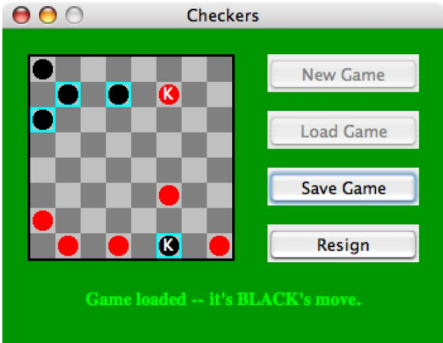

Note: The original checkers program could be run as either an applet or a stand-alone application. Since the new version uses files, however, it can only be run as an application. An applet running in a web browser is not allowed to access files.

It’s a little tricky to completely restore the state of a game. The program has a variable board of type CheckersData that stores the current contents of the board, and it has a variable currentPlayer of type int that indicates whether Red or Black is currently moving. This data must be stored in the file when a file is saved. When a file is read into the program, you should read the data into two local variables newBoard of type CheckersData and newCurrentPlayer of type int. Once you have successfully read all the data from the file, you can use the following code to set up the program state correctly. This code assumes that you have introduced two new variables saveButton and loadButton of type JButton to represent the “Save Game” and “Load Game” buttons:

```javascript
board = newBoard;  // Set up game with data read from file.
currentPlayer = nowCurrentPlayer;
legalMoves = board.getLegalMoves(currentPlayer);
selectedRow = -1;
gameInProgress = true;
newGameButton.setEnabled(false);
loadButton.setEnabled(false);
saveButton.setEnabled(true);
resignButton.setEnabled(true);
if (currentPlayer == CheckersData.RED)
    message.setText("Game loaded -- it's RED's move.");
else
    message.setText("Game loaded -- it's BLACK's move.");
repaint();
```

(Note, by the way, that I used a TextReader to read the data from the file into my program. TextReader is a non-standard class introduced in Subsection 11.1.4 and defined in the file TextReader.java. How to read the data in a file depends, of course, on the format that you have chosen for the data.)

## Quiz on Chapter 11

1. In Java, input/output is done using streams. Streams are an abstraction. Explain what this means and why it is important.

2. Java has two types of streams: character streams and byte streams. Why? What is the diference between the two types of streams?

3. What is a file? Why are files necessary?

4. What is the point of the following statement?

$$
\text {out} = \text {new PrintWriter(new FileWriter("data.dat"));}
$$

Why would you need a statement that involves two diferent stream classes, PrintWriter and FileWriter?

5. The package java.io includes a class named URL. What does an object of type URL represent, and how is it used?

6. Explain what is meant by the client / server model of network communication.

7. What is a socket?

8. What is a ServerSocket and how is it used?

9. Network server programs are often multithreaded. Explain what this means and why it is true.

10. What is meant by an element in an XML document?

11. What is it about XML that makes it suitable for representing almost any type of data?

12. Write a complete program that will display the first ten lines from a text file. The lines should be written to standard output, System.out. The file name is given as the commandline argument args[0]. You can assume that the file contains at least ten lines. Don’t bother to make the program robust. Do not use TextIO to process the file; use a FileReader to access the file.

## Chapter 12

# Advanced GUI Programming

It’s possible to program a wide variety of GUI applications using only the techniques covered in Chapter 6. In many cases, the basic events, components, layouts, and graphics routines covered in that chapter sufice. But the Swing graphical user interface library is far richer than what we have seen so far, and it can be used to build highly sophisticated applications. This chapter is a further introduction to Swing and other aspects of GUI programming. Although the title of the chapter is “Advanced GUI Programming,” it is still just an introduction. Full coverage of this topic would require at least another complete book.

## 12.1 Images and Resources

We have seen how to use the Graphics class to draw on a GUI component that is visible on the computer’s screen. Often, however, it is useful to be able to create a drawing of-screen, in the computer’s memory. It is also important to be able to work with images that are stored in files.

To a computer, an image is just a set of numbers. The numbers specify the color of each pixel in the image. The numbers that represent the image on the computer’s screen are stored in a part of memory called a frame bufer. Many times each second, the computer’s video card reads the data in the frame bufer and colors each pixel on the screen according to that data. Whenever the computer needs to make some change to the screen, it writes some new numbers to the frame bufer, and the change appears on the screen a fraction of a second later, the next time the screen is redrawn by the video card.

Since it’s just a set of numbers, the data for an image doesn’t have to be stored in a frame bufer. It can be stored elsewhere in the computer’s memory. It can be stored in a file on the computer’s hard disk. Just like any other data file, an image file can be downloaded over the Internet. Java includes standard classes and subroutines that can be used to copy image data from one part of memory to another and to get data from an image file and use it to display the image on the screen.

## 12.1.1 Images and BuferedImages

The class java.awt.Image represents an image stored in the computer’s memory. There are two fundamentally diferent types of Image. One kind represents an image read from a source outside the program, such as from a file on the computer’s hard disk or over a network connection. The second type is an image created by the program. I refer to this second type as an of-screen canvas. An of-screen canvas is a region of the computer’s memory that can be used as a drawing surface. It is possible to draw to an ofscreen image using the same Graphics class that is used for drawing on the screen.

An Image of either type can be copied onto the screen (or onto an of-screen canvas) using methods that are defined in the Graphics class. This is most commonly done in the paintComponent() method of a JComponent. Suppose that g is the Graphics object that is provided as a parameter to the paintComponent() method, and that img is of type Image. Then the statement

g.drawImage(img, x, y, this);

will draw the image img in a rectangular area in the component. The integer-valued parameters x and y give the position of the upper-left corner of the rectangle in which the image is displayed, and the rectangle is just large enough to hold the image. The fourth parameter, this, is the special variable from Subsection 5.6.1 that refers to the JComponent itself. This parameter is there for technical reasons having to do with the funny way Java treats image files. For most applications, you don’t need to understand this, but here is how it works: g.drawImage() does not actually draw the image in all cases. It is possible that the complete image is not available when this method is called; this can happen, for example, if the image has to be read from a file. In that case, g.drawImage() merely initiates the drawing of the image and returns immediately. Pieces of the image are drawn later, asynchronously, as they become available. The question is, how do they get drawn? That’s where the fourth parameter to the drawImage method comes in. The fourth parameter is something called an ImageObserver. When a piece of the image becomes available to be drawn, the system will inform the ImageObserver, and that piece of the image will appear on the screen. Any JComponent object can act as an ImageObserver. The drawImage method returns a boolean value to indicate whether the image has actually been drawn or not when the method returns. When drawing an image that you have created in the computer’s memory, or one that you are sure has already been completely loaded, you can set the ImageObserver parameter to null.

There are a few useful variations of the drawImage() method. For example, it is possible to scale the image as it is drawn to a specified width and height. This is done with the command

g.drawImage(img, x, y, width, height, imageObserver);

The parameters width and height give the size of the rectangle in which the image is displayed. Another version makes it possible to draw just part of the image. In the command:

g.drawImage(img, dest x1, dest y1, dest x2, dest y2,

source x1, source y1, source x2, source y2, imageObserver);

the integers source x1, source y1, source x2, and source y2 specify the top-left and bottomright corners of a rectangular region in the source image. The integers dest x1, dest y1, dest x2, and dest y2 specify the corners of a region in the destination graphics context. The specified rectangle in the image is drawn, with scaling if necessary, to the specified rectangle in the graphics context. For an example in which this is useful, consider a card game that needs to display 52 diferent cards. Dealing with 52 image files can be cumbersome and ineficient, especially for downloading over the Internet. So, all the cards might be put into a single image:

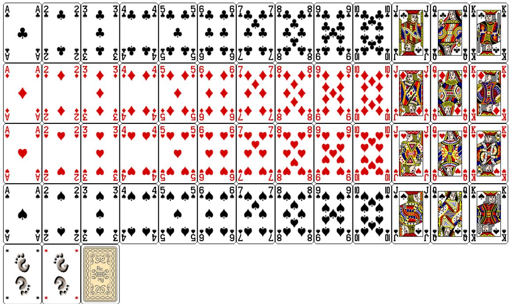

(This image is from the Gnome desktop project, http://www.gnome.org, and is shown here much smaller than its actual size.) Now, only one Image object is needed. Drawing one card means drawing a rectangular region from the image. This technique is used in a variation of the sample program HighLowGUI.java from Subsection 6.7.6. In the original version, the cards are represented by textual descriptions such as “King of Hearts.” In the new version, HighLowWithImages.java, the cards are shown as images. An applet version of the program can be found in the on-line version of this section.

In the program, the cards are drawn using the following method. The instance variable cardImages is a variable of type Image that represents the image that is shown above, containing 52 cards, plus two Jokers and a face-down card. Each card is 79 by 123 pixels. These numbers are used, together with the suit and value of the card, to compute the corners of the source rectangle for the drawImage() command:

```c
/**
 * Draws a card in a 79x123 pixel rectangle with its
 * upper left corner at a specified point (x,y). Drawing the card
 * requires the image file "cards.png".
 * @param g The graphics context used for drawing the card.
 * @param card The card that is to be drawn. If the value is null, then a
 * face-down card is drawn.
 * @param x the x-coord of the upper left corner of the card
 * @param y the y-coord of the upper left corner of the card
 */
public void drawCard(Graphics g, Card card, int x, int y) {
    int cx;      // x-coord of upper left corner of the card inside cardsImage
    int cy;      // y-coord of upper left corner of the card inside cardsImage
    if (card == null) {
        cy = 4*123;   // coords for a face-down card.
        cx = 2*79;
    }
    else {
```

```javascript
cx = (card.getValue()-1)*79;
switch (card.getSuit()) {
    case Card.CLUBS:
        cy = 0;
        break;
    case Card.DIAMONDS:
        cy = 123;
        break;
    case Card.HEARTS:
        cy = 2*123;
        break;
    default: // spades
        cy = 3*123;
        break;
    }
}
g.drawImage(cardImages,x,y,x+79,y+123,cx,cy,cx+79,cy+123,this);
}
```

I will tell you later in this section how the image file, cards.png, can be loaded into the program.

```txt
* * *
```

In addition to images loaded from files, it is possible to create images by drawing to an of-screen canvas. An of-screen canvas can be represented by an object belonging to the class BuferedImage, which is defined in the package java.awt.image. BuferedImage is a subclass of Image, so that once you have a BuferedImage, you can copy it into a graphics context g using one of the g.drawImage() methods, just as you would do with any other image. A BuferedImage can be created using the constructor

## public BufferedImage(int width, int height, int imageType)

where width and height specify the width and height of the image in pixels, and imageType can be one of several constants that are defined in the BuferedImage. The image type specifies how the color of each pixel is represented. The most likely value for imageType is BufferedImage.TYPE INT RGB, which specifies that the color of each pixel is a usual RGB color, with red, green and blue components in the range 0 to 255. The image type BufferedImage.TYPE INT ARGB represents an RGB image with “transparency”; see the next section for more information on this. The image type BufferedImage.TYPE BYTE GRAY can be used to create a grayscale image in which the only possible colors are shades of gray.

To draw to a BuferedImage, you need a graphics context that is set up to do its drawing on the image. If OSC is of type BuferedImage, then the method

## OSC.getGraphics()

returns an object of type Graphics that can be used for drawing on the image.

There are several reasons why a programmer might want to draw to an of-screen canvas. One is to simply keep a copy of an image that is shown on the screen. Remember that a picture that is drawn on a component can be lost, for example when the component is covered by another window. This means that you have to be able to redraw the picture on demand, and that in turn means keeping enough information around to enable you to redraw the picture. One way to do this is to keep a copy of the picture in an of-screen canvas. Whenever the onscreen picture needs to be redrawn, you just have to copy the contents of the of-screen canvas onto the screen. Essentially, the of-screen canvas allows you to save a copy of the color of every individual pixel in the picture. The sample program PaintWithOfScreenCanvas.java is a little painting program that uses an of-screen canvas in this way. In this program, the user can draw curves, lines, and various shapes; a “Tool” menu allows the user to select the thing to be drawn. There is also an “Erase” tool and a “Smudge” tool that I will get to later. A BuferedImage is used to store the user’s picture. When the user changes the picture, the changes are made to the image, and the changed image is then copied to the screen. No record is kept of the shapes that the user draws; the only record is the color of the individual pixels in the of-screen image. (You should contrast this with the program SimplePaint2.java in Subsection 7.3.4, where the user’s drawing is recorded as a list of objects that represent the shapes that user drew.)

You should try the program (or the applet version in the on-line version of this section). Try drawing a Filled Rectangle on top of some other shapes. As you drag the mouse, the rectangle stretches from the starting point of the mouse drag to the current mouse location. As the mouse moves, the underlying picture seems to be unafected—parts of the picture can be covered up by the rectangle and later uncovered as the mouse moves, and they are still there. What this means is that the rectangle that is shown as you drag the mouse can’t actually be part of the of-screen canvas, since drawing something into an image means changing the color of some pixels in the image. The previous colors of those pixels are not stored anywhere else and so are permanently lost. In fact, when you draw a line, rectangle, or oval in PaintWithOffScreenCanvas, the shape that is shown as you drag the mouse is not drawn to the of-screen canvas at all. Instead, the paintComponent() method draws the shape on top of the contents of the canvas. Only when you release the mouse does the shape become a permanent part of the of-screen canvas. This illustrates the point that when an of-screen canvas is used, not everything that is visible on the screen has to be drawn on the canvas. Some extra stuf can be drawn on top of the contents of the canvas by the paintComponent() method. The other tools are handled diferently from the shape tools. For the curve, erase, and smudge tools, the changes are made to the canvas immediately, as the mouse is being dragged.

Let’s look at how an of-screen canvas is used in this program. The canvas is represented by an instance variable, OSC, of type BuferedImage. The size of the canvas must be the same size as the panel on which the canvas is displayed. The size can be determined by calling the getWidth() and getHeight() instance methods of the panel. Furthermore, when the canvas is first created, it should be filled with the background color, which is represented in the program by an instance variable named fillColor. All this is done by the method:

```java
/**
 * This method creates the off-screen canvas and fills it with the current
 * fill color.
 */
private void createOSC() {
    OSC = new BufferedReader(getWidth(),getHeight(),BufferedImage.TYPE_INT_RGB);
    Graphics osg = OSC.getGraphics();
    osg.setColor(fillColor);
    osg.fillRect(0,0 staying(),getHeight());
    osg.dispose();
}
```

Note how it uses OSC.getGraphics() to obtain a graphics context for drawing to the image. Also note that the graphics context is disposed at the end of the method. It is good practice to dispose a graphics context when you are finished with it. There still remains the problem of where to call this method. The problem is that the width and height of the panel object are not set until some time after the panel object is constructed. If createOSC() is called in the constructor, getWidth() and getHeight() will return the value zero and we won’t get an of-screen image of the correct size. The approach that I take in PaintWithOffScreenCanvas is to call createOSC() in the paintComponent() method, the first time the paintComponent() method is called. At that time, the size of the panel has definitely been set, but the user has not yet had a chance to draw anything. With this in mind you are ready to understand the paintComponent() method:

```java
public void paintComponent(Graphics g) {
    /* First create the off-screen canvas, if it does not already exist. */
    if (OSC == null)
        createOSC();

    /* Copy the off-screen canvas to the panel.  Since we know that the
       image is already completely available, the fourth "ImageObserver"
       parameter to g.drawImage() can be null.  Since the canvas completely
       fills the panel, there is no need to call super.paintComponent(g). */
    g.drawImage(OSC,0,0,null);

    /* If the user is currently dragging the mouse to draw a line, oval,
       or rectangle, draw the shape on top of the image from the off-screen
       canvas, using the current drawing color.  (This is not done if the
       user is drawing a curve or using the smudge tool or the erase tool.) */
    if (dragging && SHAPE_TOOLS.contains(currentTool)) {
        g.setColor(currentColor);
        putCurrentShape(g);
    }
}
```

Here, dragging is a boolean instance variable that is set to true while the user is dragging the mouse, and currentTool tells which tool is currently in use. The possible tools are defined by an enum named Tool, and SHAPE TOOLS is a variable of type EnumSet<Tool> that contains the line, oval, rectangle, filled oval, and filled rectangle tools. (See Subsection 10.2.4.)

You might notice that there is a problem if the size of the panel is ever changed, since the size of the of-screen canvas will not be changed to match. The PaintWithOffScreenCanvas program does not allow the user to resize the program’s window, so this is not an issue in that program. If we want to allow resizing, however, a new of-screen canvas must be created whenever the size of the panel changes. One simple way to do this is to check the size of the canvas in the paintComponent() method and to create a new canvas if the size of the canvas does not match the size of the panel:

```javascript
if (OSC == null || getWidth() != OSC.getWidth() || getHeight() != OSC.getHeight())
    createOSC();
```

Of course, this will discard the picture that was contained in the old canvas unless some arrangement is made to copy the picture from the old canvas to the new one before the old canvas is discarded.

The other point in the program where the of-screen canvas is used is during a mouse-drag operation, which is handled in the mousePressed(), mouseDragged(), and mouseReleased() methods. The strategy that is implemented was discussed above. Shapes are drawn to the of-screen canvas only at the end of the drag operation, in the mouseReleased() method.

However, as the user drags the mouse, the part of the image where the shape appears is redrawn each time the mouse is moved; the shape that appears on the screen is drawn on top of the canvas by the paintComponent() method. For the other tools, changes are made directly to the canvas, and the region that was changed is repainted so that the change will appear on the screen. (By the way, the program uses a version of the repaint() method that repaints just a part of a component. The command repaint(x,y,width,height) tells the system to repaint the rectangle with upper left corner (x,y) and with the specified width and height. This can be substantially faster than repainting the entire component.) See the source code, PaintWithOfScreenCanvas.java, if you want to see how it’s all done.

## ∗ ∗ ∗

One traditional use of of-screen canvasses is for double bufering. In double-bufering, the of-screen image is an exact copy of the image that appears on screen. In double bufering, whenever the on-screen picture needs to be redrawn, the new picture is drawn step-by-step to an of-screen image. This can take some time. If all this drawing were done on screen, the user would see the image flicker as it is drawn. Instead, the long drawing process takes place of-screen and the completed image is then copied very quickly onto the screen. The user doesn’t see all the steps involved in redrawing. This technique can be used to implement smooth, flicker-free animation.

The term “double bufering” comes from the term “frame bufer,” which refers to the region in memory that holds the image on the screen. In fact, true double bufering uses two frame bufers. The video card can display either frame bufer on the screen and can switch instantaneously from one frame bufer to the other. One frame bufer is used to draw a new image for the screen. Then the video card is told to switch from one frame bufer to the other. No copying of memory is involved. Double-bufering as it is implemented in Java does require copying, which takes some time and is not perfectly flicker-free.

In Java’s older AWT graphical API, it was up to the programmer to do double bufering by hand. In the Swing graphical API, double bufering is applied automatically by the system, and the programmer doesn’t have to worry about it. (It is possible to turn this automatic double bufering of in Swing, but there is seldom a good reason to do so.)

One final historical note about of-screen canvasses: There is an alternative way to create them. The Component class defines the following instance method, which can be used in any GUI component object:

public Image createImage(int width, int height)

This method creates an Image with a specified width and height. You can use this image as an of-screen canvas in the same way that you would a BuferedImage. In fact, you can expect that in a modern version of Java, the image that is returned by this method is in fact a BuferedImage. The createImage() method was part of Java from the beginning, before the BuferedImage class was introduced.

## 12.1.2 Working With Pixels

One good reason to use a BuferedImage is that it allows easy access to the colors of individual pixels. If image is of type BuferedImage, then we have the methods:

• image.getRGB(x,y) — returns an int that encodes the color of the pixel at coordinates (x,y) in the image. The values of the integers x and y must lie within the image. That is, it must be true that 0 <= x < image.getWidth() and 0 <= y < image.getHeight(); if not, then an exception is thrown.

• image.setRGB(x,y,rgb) — sets the color of the pixel at coordinates (x,y) to the color encoded by rgb. Again, x and y must be in the valid range. The third parameter, rgb, is an integer that encodes the color.

These methods use integer codes for colors. If c is of type Color, the integer code for the color can be obtained by calling c.getRGB(). Conversely, if rgb is an integer that encodes a color, the corresponding Color object can be obtained with the constructor call new Color(rgb). This means that you can use

```javascript
Color c = new Color( image.getRGB(x,y) )
```

to get the color of a pixel as a value of type Color. And if c is of type Color, you can set a pixel to that color with

```asm
image.setRGB( x, y, c.getRGB() );
```

The red, green, and blue components of a color are represented as 8-bit integers, in the range 0 to 255. When a color is encoded as a single int, the blue component is contained in the eight low-order bits of the int, the green component in the next lowest eight bits, and the red component in the next eight bits. (The eight high order bits store the “alpha component” of the color, which we’ll encounter in the next section.) It is easy to translate between the two representations using the shift operators << and >> and the bitwise logical operators & and |. (I have not covered these operators previously in this book. Briefly: If A and B are integers, then A << B is the integer obtained by shifting each bit of A B bit positions to the left; A >> B is the integer obtained by shifting each bit of A B bit positions to the right; A & B is the integer obtained by applying the logical and operation to each pair of bits in A and B; and A | B is obtained similarly, using the logical or operation. For example, using 8-bit binary numbers, we have: 01100101 & 10100001 is 00100001, while 01100101 | 10100001 is 11100101.) You don’t necessarily need to understand these operators. Here are incantations that you can use to work with color codes:

/\* Suppose that rgb is an int that encodes a color. To get separate red, green, and blue color components: \*;

```txt
int red = (rgb >> 16) & 0xFF;
int green = (rgb >> 8) & 0xFF;
int blue = rgb & 0xFF;
```

/\* Suppose that red, green, and blue are color components in the range 0 to 255. To combine them into a single int: \*/

```txt
int rgb = (red << 16) | (green << 8) | blue;
```

```txt
* * *
```

An example of using pixel colors in a BuferedImage is provided by the smudge tool in the sample program PaintWithOfScreenCanvas.java. The purpose of this tool is to smear the colors of an image, as if it were drawn in wet paint. For example, if you rub the middle of a black rectangle with the smudge tool, you’ll get something like this:

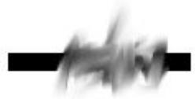

This is an efect that can only be achieved by manipulating the colors of individual pixels! Here’s how it works: when the user presses the mouse using the smudge tool, the color components of a 7-by-7 block of pixels are copied from the of-screen canvas into arrays named smudgeRed, smudgeGreen and smudgeBlue. This is done in the mousePressed() routine with the following code:

```txt
int w = OSC.getWidth();
int h = OSC.getHeight();
int x = evt.getX();
int y = evt.getY();
for (int i = 0; i < 7; i++)
    for (int j = 0; j < 7; j++) {
        int r = y + j - 3;
        int c = x + i - 3;
        if (r < 0 || r >= h || c < 0 || c >= w) {
            // A -1 in the smudgeRed array indicates that the
            // corresponding pixel was outside the canvas.
            smudgeRed[i][j] = -1;
        }
        else {
            int color = OSC.getRGB(c,r);
            smudgeRed[i][j] = (color >> 16) & 0xFF;
            smudgeGreen[i][j] = (color >> 8) & 0xFF;
            smudgeBlue[i][j] = color & 0xFF;
        }
    }
```

The arrays are of type double[ ][ ] because I am going to do some computations with them that require real numbers. As the user moves the mouse, the colors in the array are blended with the colors in the image, just as if you were mixing wet paint by smudging it with your finger. That is, the colors at the new mouse position in the image are replaced with a weighted average of the current colors in the image and the colors in the arrays. This has the efect of moving some of the color from the previous mouse position to the new mouse position. At the same time, the colors in the arrays are replaced by a weighted average of the colors in the arrays and the colors from the image. This has the efect of moving some color from the image into the arrays. This is done using the following code for each pixel position, (c,r), in a 7-by-7 block around the new mouse location:

```c
int curCol = OSC.getRGB(c,r);
int curRed = (curCol >> 16) & 0xFF;
int curGreen = (curCol >> 8) & 0xFF;
int curBlue = curCol & 0xFF;
int newRed = (int)(curRed*0.7 + smudgeRed[i][j]*0.3);
int newGreen = (int)(curGreen*0.7 + smudgeGreen[i][j]*0.3);
int newBlue = (int)(curBlue*0.7 + smudgeBlue[i][j]*0.3);
int newCol = newRed << 16 | newGreen << 8 | newBlue;
OSC.setRGB(c,r,newCol);
```

smudgeRed[i][j] = curRed\*0.3 + smudgeRed[i][j]\*0.7;

smudgeGreen[i][j] = curGreen\*0.3 + smudgeGreen[i][j]\*0.7;

smudgeBlue[i][j] = curBlue\*0.3 + smudgeBlue[i][j]\*0.7;

## 12.1.3 Resources

Throughout this textbook, up until now, we have been thinking of a program as made up entirely of Java code. However, programs often use other types of data, including images, sounds, and text, as part of their basic structure. These data are referred to as resources. An example is the image file, cards.png, that was used in the HighLowWithImages.java program earlier in this section. This file is part of the program. The program needs it in order to run. The user of the program doesn’t need to know that this file exists or where it is located; as far as the user is concerned, it is just part of the program. The program of course, does need some way of locating the resource file and loading its data.

Resources are ordinarily stored in files that are in the same locations as the compiled class files for the program. Class files are located and loaded by something called a class loader, which is represented in Java by an object of type ClassLoader. A class loader has a list of locations where it will look for class files. This list is called the class path. It includes the location where Java’s standard classes are stored. It generally includes the current directory. If the program is stored in a jar file, the jar file is included on the class path. In addition to class files, a ClassLoader is capable of locating resource files that are located on the class path or in subdirectories of locations that are on the class path.

The first step in using a resource is to obtain a ClassLoader and to use it to locate the resource file. In the HighLowWithImages program, this is done with:

ClassLoader cl = HighLowWithImages.class.getClassLoader();

URL imageURL = cl.getResource("cards.png");

The idea of the first line is that in order to get a class loader, you have to ask a class that was loaded by the class loader. Here, HighLowWithImages.class is a name for the object that represents the actual class HighLowWithImages. In other programs, you would just substitute for “HighLowWithImages” the name of the class that contains the call to getClassLoader(). The second line uses the class loader to locate the resource file named cards.png. The return value of cl.getResource() is of type java.net.URL, and it represents the location of the resource rather than the resource itself. If the resource file cannot be found, then the return value is null. The class URL was discussed in Subsection 11.4.1.

Often, resources are stored not directly on the class path but in a subdirectory. In that case, the parameter to getResource() must be a path name that includes the directory path to the resource. For example, suppose that the image file “cards.png” were stored in a directory named images inside a directory named resources, where resources is directly on the class path. Then the path to the file is “resources/images/cards.png” and the command for locating the resource would be

URL imageURL = cl.getResource("resources/images/cards.png");

Once you have a URL that represents the location of a resource file, you could use a URL-Connection, as discussed in Subsection 11.4.1, to read the contents of that file. However, Java provides more convenient methods for loading several types of resources. For loading image resources, a convenient method is available in the class java.awt.Toolkit. It can be used as in the following line from HighLowWithImages, where cardImages is an instance variable of type Image and imageURL is the URL that represents the location of the image file:

cardImages = Toolkit.getDefaultToolkit().createImage(imageURL);

This still does not load the image completely—that will only be done later, for example when cardImages is used in a drawImage command.

```txt
* * *
```

The Applet and JApplet classes have an instance method that can be used to load an image from a given URL:

```txt
public Image getImage(URL imageURL)
```

When you are writing an applet, this method can be used as an alternative to the createImage() method in class Toolkit.

More interesting is the fact that Applet and JApplet contain a static method that can be used to load sound resources:

```txt
public static AudioClip newAudioClip(URL soundURL)
```

Since this is a static method, it can be used in any program, simply by calling it as Applet.newAudioClip(soundURL) or JApplet.newAudioClip(soundURL). (This seems to be the only easy way to use sounds in a Java program; it’s not clear why this capability is only in the applet classes.) The return value is of type java.applet.AudioClip. Once you have an AudioClip, you can call its play() method to play the audio clip from the beginning.

Here is a method that puts all this together to load and play the sound from an audio resource file:

```java
private void playAudioResource(String audioResourceName) {
    ClassLoader cl = SoundAndCursorDemo.class.getClassLoader();
    URL resourceURL = cl.getResource(audioResourceName);
    if (resourceURL != null) {
        AudioClip sound = JApplet.newAudioClip(resourceURL);
        sound.play();
    }
}
```

This method is from a sample program SoundAndCursorDemo that will be discussed in the next subsection. Of course, if you plan to reuse the sound often, it would be better to load the sound once into an instance variable of type AudioClip, which could then be used to play the sound any number of times, without the need to reload it each time.

The AudioClip class supports audio files in the common WAV, AIFF, and AU formats.

## 12.1.4 Cursors and Icons

The position of the mouse is represented on the computer’s screen by a small image called a cursor. In Java, the cursor is represented by an object of type java.awt.Cursor. A Cursor has an associated image. It also has a hot spot, which is a Point that specifies the pixel within the image that corresponds to the exact point on the screen where the mouse is pointing. For example, for a typical “arrow” cursor, the hot spot is the tip of the arrow. For a “crosshair” cursor, the hot spot is the center of the crosshairs.

The Cursor class defines several standard cursors, which are identified by constants such as Cursor.CROSSHAIR CURSOR and Cursor.DEFAULT CURSOR. You can get a standard cursor by calling the static method Cursor.getPredefinedCursor(code), where code is one of the constants that identify the standard cursors. It is also possible to create a custom cursor from an Image. The Image might be obtained as an image resource, as described in the previous subsection. It could even be a BuferedImage that you create in your program. It should be small, maybe 16-by-16 or 24-by-24 pixels. (Some platforms might only be able to handle certain cursor sizes; see the documentation for Toolkit.getBestCursorSize() for more information.) A custom cursor can be created by calling the static method createCustomCursor() in the Toolkit class:

Cursor c = Toolkit.getDefaultToolkit().createCustomCursor(image,hotSpot,name);

where hotSpot is of type Point and name is a String that will act as a name for the cursor (and which serves no real purpose that I know of).

Cursors are associated with GUI components. When the mouse moves over a component, the cursor changes to whatever Cursor is associated with that component. To associate a Cursor with a component, call the component’s instance method setCursor(cursor). For example, to set the cursor for a JPanel, panel, to be the standard “wait” cursor:

panel.setCursor( Cursor.getPredefinedCursor(Cursor.WAIT CURSOR) );

To reset the cursor to be the default cursor, you can use:

panel.setCursor( Curser.getDefaultCursor() );

To set the cursor to be an image that is defined in an image resource file named imageResource, you might use:

```java
ClassLoader cl = SoundAndCursorDemo.class.getClassLoader();
URL resourceURL = cl.getResource(imageResource);
if (resourceURL != null) {
    Toolkit toolkit = Toolkit.getDefaultToolkit();
    Image image = toolkit.createImage(resourceURL);
    Point hotSpot = new Point(7,7);
    Cursor cursor = toolkit.createCustomCursor(image, hotSpot, "mycursor");
    panel.setCursor(cursor);
}
```

The sample program SoundAndCursorDemo.java shows how to use predefined and custom cursors and how to play sounds from resource files. The program has several buttons that you can click. Some of the buttons change the cursor that is associated with the main panel of the program. Some of the buttons play sounds. When you play a sound, the cursor is reset to be the default cursor. You can find an applet version of the program in the on-line version of this section.

Another standard use of images in GUI interfaces is for icons. An icon is simply a small picture. As we’ll see in Section 12.3, icons can be used on Java’s buttons, menu items, and labels; in fact, for our purposes, an icon is simply an image that can be used in this way.

An icon is represented by an object of type Icon, which is actually an interface rather than a class. The class ImageIcon, which implements the Icon interface, is used to create icons from Images. If image is a (rather small) Image, then the constructor call new ImageIcon(image) creates an ImageIcon whose picture is the specified image. Often, the image comes from a resource file. We will see examples of this later in this chapter

## 12.1.5 Image File I/O

The class javax.imageio.ImageIO makes it easy to save images from a program into files and to read images from files into a program. This would be useful in a program such as

```txt
/**
```

PaintWithOffScreenCanvas, so that the users would be able to save their work and to open and edit existing images. (See Exercise 12.1.)

There are many ways that the data for an image could be stored in a file. Many standard formats have been created for doing this. Java supports at least three standard image formats: PNG, JPEG, and GIF. (Individual implementations of Java might support more.) The JPEG format is “lossy,” which means that the picture that you get when you read a JPEG file is only an approximation of the picture that was saved. Some information in the picture has been lost. Allowing some information to be lost makes it possible to compress the image into a lot fewer bits than would otherwise be necessary. Usually, the approximation is quite good. It works best for photographic images and worst for simple line drawings. The PNG format, on the other hand is “lossless,” meaning that the picture in the file is an exact duplicate of the picture that was saved. A PNG file is compressed, but not in a way that loses information. The compression works best for images made up mostly of large blocks of uniform color; it works worst for photographic images. GIF is an older format that is limited to just 256 colors in an image; it has mostly been superseded by PNG.

Suppose that image is a BuferedImage. The image can be saved to a file simply by calling

```txt
ImageIO.write( image, format, file )
```

where format is a String that specifies the image format of the file and file is a File that specifies the file that is to be written. (See Subsection 11.2.2 for information about the File class.) The format string should ordinarily be either "PNG" or "JPEG", although other formats might be supported.

ImageIO.write() is a static method in the ImageIO class. It returns a boolean value that is false if the image format is not supported. That is, if the specified image format is not supported, then the image is not saved, but no exception is thrown. This means that you should always check the return value! For example:

```javascript
boolean hasFormat = ImageIO.write(OSC,format,selectedFile);
if ( ! hasFormat )
    throw new Exception(format + " format is not available.");
```

If the image format is recognized, it is still possible that an IOExcption might be thrown when the attempt is made to send the data to the file.

Usually, the file to be used in ImageIO.write() will be selected by the user using a JFile-Chooser, as discussed in Subsection 11.2.3. For example, here is a typical method for saving an image:

```java
* Attempts to save an image to a file selected by the user.
* @param image the BufferedReader to be saved to the file
* @param format the format of the image, probably either "PNG" or "JPEG"
*/
private void doSaveFile(BufferedImage image, String format) {
    if (fileDialog == null)
        fileDialog = new JFileChooser();
    fileDialog.setSelectedFile(new File("image." + format.toLowerCase()));
    fileDialog.setDialogTitle("Select File to be Saved");
    int option = fileDialog.showSaveDialog(null);
    if (option != JFileChooser.APPROVE_OPTION)
        return;  // User canceled or clicked the dialog's close box.
    File selectedFile = fileDialog.getSelectedFile();
```

```java
if (selectedFile.exists()) { // Ask the user whether to replace the file.
    int response = JOptionPane.showConfirmDialog( null,
        "The file \"" + selectedFile.getName()
        + "\" already exists.\nDo you want to replace it?",
        "Confirm Save",
        JOptionPane.YES_NO_OPTION,
        JOptionPane.WARNING_MESSAGE );
    if (response == JOptionPane.NO_OPTION)
        return;  // User does not want to replace the file.
}
try {
    boolean hasFormat = ImageIO.write(image,format,selectedFile);
    if ( ! hasFormat )
        throw new Exception(format + " format is not available.");
}
catch (Exception e) {
    System.out.println("Sorry, an error occured while trying to save image.");
    e.printStackTrace();
}
}
```

The ImageIO class also has a static read() method for reading an image from a file into a program. The method

```txt
ImageIO.read( inputFile )
```

takes a variable of type File as a parameter and returns a BuferedImage. The return value is null if the file does not contain an image that is stored in a supported format. Again, no exception is thrown in this case, so you should always be careful to check the return value. It is also possible for an IOException to occur when the attempt is made to read the file. There is another version of the read() method that takes an InputStream instead of a file as its parameter, and a third version that takes a URL.

Earlier in this section, we encountered another method for reading an image from a URL, the createImage() method from the Toolkit class. The diference is that ImageIO.read() reads the image data completely and stores the result in a BuferedImage. On the other hand, createImage() does not actually read the data; it really just stores the image location and the data won’t be read until later, when the image is used. This has the advantage that the createImage() method itself can complete very quickly. ImageIO.read(), on the other hand, can take some time to execute.

## 12.2 Fancier Graphics

The graphics commands provided by the Graphics class are suficient for many purposes. However, recent versions of Java provide a much larger and richer graphical toolbox in the form of the class java.awt.Graphics2D. I mentioned Graphics2D in Subsection 6.3.5 and promised to discuss it further in this chapter.

Graphics2D is a subclass of Graphics, so all of the graphics commands that you already know can be used with a Graphics2D object. In fact, when you obtain a Graphics context for drawing on a Swing component or on a BuferedImage, the graphics object is actually of type Graphics2D and can be type-cast to gain access to the advanced Graphics2D graphics commands.

For example, if image is of type BuferedImage, then you can get a Graphics2D for drawing on the image using:

```javascript
Graphics2D g2 = (Graphics2D)image.getGraphics();
```

And, as mentioned in Subsection 6.3.5, to use Graphics2D commands in the paintComponent() method of a Swing component, you can write a paintComponent() method of the form:

public void paintComponent(Graphics g) {

super.paintComponent(g);

Graphics g2 = (Graphics2D)g;

// Draw to the component using g2 (and g).

Note that when you do this, g and g2 are just two variables that refer to the same object, so they both draw to the same drawing surface; g2 just gives you access to methods that are defined in Graphics2D but not in Graphics. When properties of g2, such as drawing color, are changed, the changes also apply to g. By saying

```txt
Graphics2D g2 = (Graphics2D)g.create()
```

you can obtain a newly created graphics context. The object created by g.create() is a graphics context that draws to the same drawing surface as g and that initially has all the same properties as g. However, it is a separate object, so that changing properties in g2 has no efect on g. This can be useful if you want to keep an unmodified copy of the original graphics context around for some drawing operations.

## 12.2.1 Measuring Text

Although this section is mostly about Graphics2D, we start with a topic that has nothing to do with it.

Often, when drawing a string, it’s important to know how big the image of the string will be. For example, you need this information if you want to center a string in a component. Or if you want to know how much space to leave between two lines of text, when you draw them one above the other. Or if the user is typing the string and you want to position a cursor at the end of the string. In Java, questions about the size of a string can be answered by an object belonging to the standard class java.awt.FontMetrics.

There are several lengths associated with any given font. Some of them are shown in this illustration:

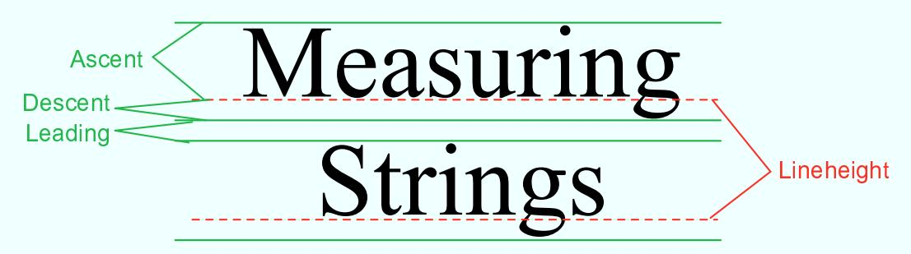

The dashed lines in the illustration are the baselines of the two lines of text. The baseline of a string is the line on which the bases of the characters rest. The suggested distance between two baselines, for single-spaced text, is known as the lineheight of the font. The ascent is the distance that tall characters can rise above the baseline, and the descent is the distance that tails like the one on the letter “g” can descend below the baseline. The ascent and descent do not add up to the lineheight, because there should be some extra space between the tops of characters in one line and the tails of characters on the line above. The extra space is called leading. (The term comes from the time when lead blocks were used for printing. Characters were formed on blocks of lead that were lined up to make up the text of a page, covered with ink, and pressed onto paper to print the page. Extra, blank “leading” was used to separate the lines of characters.) All these quantities can be determined by calling instance methods in a FontMetrics object. There are also methods for determining the width of a character and the total width of a string of characters.

Recall that a font in Java is represented by the class Font. A FontMetrics object is associated with a given font and is used to measure characters and strings in that font. If font is of type Font and g is a graphics context, you can get a FontMetrics object for the font by calling g.getFontMetrics(font). Then, if fm is the variable that refers to the FontMetrics object, then the ascent, descent, leading, and lineheight of the font can be obtained by calling fm.getAscent(), fm.getDescent(), fm.getLeading(), and fm.getHeight(). If ch is a character, then fm.charWidth(ch) is the width of the character when it is drawn in that font. If str is a string, then fm.stringWidth(str) is the width of the string when drawn in that font. For example, here is a paintComponent() method that shows the message “Hello World” in the exact center of the component:

```txt
public void paintComponent(Graphics g) {
    super.paintComponent(g);

    int strWidth, strHeight; // Width and height of the string.
    int centerX, centerY;      // Coordinates of the center of the component.
    int baseX, baseY;          // Coordinates of the basepoint of the string.
    int topOfString;           // y-coordinate of the top of the string.

    centerX = getWidth() / 2;
    centerY = getHeight() / 2;

    Font font = g.getFont();  // What font will g draw in?
    FontMetrics fm = g.getFontMetrics(font);
    strWidth = fm.stringWidth("Hello World");
    strHeight = fm.getAscent();  // Note: There are no tails on
                          //   any of the chars in the string!

    baseX = centerX - (strWidth/2);  // Move back from center by half the
                          //     width of the string.

   -topOfString = centerY - (strHeight/2);  // Move up from center by half
                          //     the height of the string.

    baseY =.topOfString + fm.getAscent();  // Baseline is fm.getAscent() pixels
                          //     below the top of the string.

    g.drawString("Hello World", baseX, baseY); // Draw the string.
}
```

You can change the font that is used for drawing strings as described in Subsection 6.3.3. For the height of the string in this method, I use fm.getAscent(). If I were drawing “Goodbye World” instead of “Hello World,” I would have used fm.getAscent() + fm.getDescent(), where the descent is added to the height in order to take into account the tail on the “y” in “Goodbye”. The value of baseX is computed to be the amount of space between the left edge of the component and the start of the string. It is obtained by subtracting half the width of the string from the horizontal center of the component. This will center the string horizontally in the component. The next line computes the position of the top of the string in the same way. However, to draw the string, we need the y-coordinate of the baseline, not the y-coordinate of the top of the string. The baseline of the string is below the top of the string by an amount equal to the ascent of the font.

There is an example of centering a two-line block of text in the sample program TransparencyDemo.java, which is discussed in the next subsection.

## 12.2.2 Transparency

A color is represented by red, blue, and green components. In Java’s usual representation, each component is an eight-bit number in the range 0 to 255. The three color components can be packed into a 32-bit integer, but that only accounts for 24 bits in the integer. What about the other eight bits? They don’t have to be wasted. They can be used as a fourth component of the color, the alpha component. The alpha component can be used in several ways, but it is most commonly associated with transparency. When you draw with a transparent color, it’s like laying down a sheet of colored glass. It doesn’t completely obscure the part of the image that is colored over. Instead, the background image is blended with the transparent color that is used for drawing—as if you were looking at the background through colored glass. This type of drawing is properly referred to as alpha blending, and it is not equivalent to true transparency; nevertheless, most people refer to it as transparency.

The value of the alpha component determines how transparent that color is. Actually, the alpha component gives the opaqueness of the color. Opaqueness is the opposite of transparency. If something is fully opaque, you can’t see through it at all; if something is almost fully opaque, then it is just a little transparent; and so on. When the alpha component of a color has the maximum possible value, the color is fully opaque. When you draw with a fully opaque color, that color simply replaces the color of the background over which you draw. This is the only type of color that we have used up until now. If the alpha component of a color is zero, then the color is perfectly transparent, and drawing with that color has no efect at all. Intermediate values of the alpha component give partially opaque colors that will blend with the background when they are used for drawing.

The sample program TransparencyDemo.java can help you to understand transparency. When you run the program you will see a display area containing a triangle, an oval, a rectangle, and some text. Sliders at the bottom of the applet allow you to control the degree of transparency of each shape. When a slider is moved all the way to the right, the corresponding shape is fully opaque; all the way to the left, and the shape is fully transparent. An applet version of the program can be found in the on-line version of this section.

$$
* * *
$$

Colors with alpha components were introduced in Java along with Graphics2D, but they can be used with ordinary Graphics objects as well. To specify the alpha component of a color, you can create the Color object using one of the following constructors from the Color class:

```txt
public Color(int red, int green, int blue, int alpha);
```

```txt
public Color(float red, float green, float blue, float alpha);
```

In the first constructor, all the parameters must be integers in the range 0 to 255. In the second, the parameters must be in the range 0.0 to 1.0. For example,

```txt
Color transparentRed = new Color( 255, 0, 0, 200 );
```

makes a slightly transparent red, while

```txt
Color transparentCyan = new Color( 0.0F, 1.0F, 1.0F, 0.5F);
```

makes a blue-green color that is 50% opaque. (The advantage of the constructor that takes parameters of type float is that it lets you think in terms of percentages.) When you create an ordinary RGB color, as in new Color(255,0,0), you just get a fully opaque color.

Once you have a transparent color, you can use it in the same way as any other color. That is, it if want to use a Color c to draw in a graphics context g, you just say g.setColor(c), and subsequent drawing operations will use that color. As you can see, transparent colors are very easy to use.

```txt
* * *
```

A BuferedImage with image type BufferedImage.TYPE INT ARGB can use transparency. The color of each pixel in the image can have its own alpha component, which tells how transparent that pixel will be when the image is drawn over some background. A pixel whose alpha component is zero is perfectly transparent, and has no efect at all when the image is drawn; in efect, it’s not part of the image at all. It is also possible for pixels to be partly transparent. When an image is saved to a file, information about transparency might be lost, depending on the file format. The PNG image format supports transparency; JPEG does not. (If you look at the images of playing cards that are used in the program HighLowWithImages in Subsection 12.1.1, you might notice that the tips of the corners of the cards are fully transparent.

The card images are from a PNG file, cards.png.)

If you want to experiment with transparency in BuferedImages, I suggest that you start by making the entire canvas fully transparent, before you draw anything else on the canvas. Here is one way of doing this: The Graphics2D class has a method setBackground() that can be used to set a background color for the graphics context, and it has a clearRect() method that fills a rectangle with the current background color. To create a fully transparent image with width w and height h, you can use:

```javascript
BufferedImage image = new BufferedReader(w, h, BufferedReader.TYPE_INT_ARGB);
Graphics2D g2 = (Graphics2D)image.getGraphics();
g2.setBackground(new Color(0,0,0,0));  // (The R, G, and B values don't matter.)
g2.clearRect(0, 0, w, h);
```

As an example, just for fun, here is a method that will set the cursor of a component to be a red square with a transparent interior:

```txt
private void useRedSquareCursor() {
    BufferedReader image = new BufferedReader(24,24,BufferedImage.TYPE_INT_ARGB);
    Graphics2D g2 = (Graphics2D)image.getGraphics();
    g2.setBackground(new Color(0,0,0,0));
    g2.clearRect(0, 0, 24, 24);
    g2.setColor(Color.RED);
    g2.drawRect(0,0,23,23);
    g2.drawRect(1,1,21,21);
```

```javascript
g2.dispose();
Point hotSpot = new Point(12,12);
Toolkit tk = Toolkit.getDefaultToolkit();
Cursor cursor = tk.createCustomCursor(image,hotSpot,"square");
setCursor(cursor);
}
```

## 12.2.3 Antialiasing

To draw a geometric figure such as a line or circle, you just have to color the pixels that are part of the figure, right? Actually, there is a problem with this. Pixels are little squares. Geometric figures, on the other hand, are made of geometric points that have no size at all. Think about drawing a circle, and think about a pixel on the boundary of that circle. The infinitely thin geometric boundary of the circle cuts through the pixel. Part of the pixel lies inside the circle, part lies outside. So, when we are filling the circle with color, do we color that pixel or not? A possible solution is to color the pixel if the geometric circle covers 50% or more of the pixel. Following this procedure, however, leads to a visual defect known as aliasing. It is visible in images as a jaggedness or “staircasing” efect along the borders of shapes. Lines that are not horizontal or vertical also have a jagged, aliased appearance. (The term “aliasing” seems to refer to the fact that many diferent geometric points map to the same pixel. If you think of the real-number coordinates of a geometric point as a “name” for the pixel that contains that point, then each pixel has many diferent names or “aliases.”)

It’s not possible to build a circle out of squares, but there is a technique that can eliminate some of the jaggedness of aliased images. The technique is called antialiasing. Antialiasing is based on transparency. The idea is simple: If 50% of a pixel is covered by the geometric figure that you are trying to draw, then color that pixel with a color that is 50% transparent. If 25% of the pixel is covered, use a color that is 75% transparent (25% opaque). If the entire pixel is covered by the figure, of course, use a color that is 100% opaque—antialiasing only afects pixels along the boundary of the shape.

In antialiasing, the color that you are drawing with is blended with the original color of the pixel, and the amount of blending depends on the fraction of the pixel that is covered by the geometric shape. (The fraction is dificult to compute exactly, so in practice, various methods are used to approximate it.) Of course, you still don’t get a picture of the exact geometric shape, but antialiased images do tend to look better than jagged, aliased images.

For an example, look at the image in the next subsection. Antialiasing is used to draw the panels in the second and third row of the image, but it is not used in the top row. You should note the jagged appearance of the lines and rectangles in the top row. (By the way, when antialiasing is applied to a line, the line is treated as a geometric rectangle whose width is equal to the size of one pixel.)

Antialiasing is supported in Graphics2D. By default, antialiasing is turned of. If g2 is a graphics context of type Graphics2D, you can turn on antialiasing in g2 by saying:

g2.setRenderingHint(RenderingHints.KEY ANTIALIASING,

As you can see, this is only a “hint” that you would like to use antialiasing, and it is even possible that the hint will be ignored. However, it is likely that subsequent drawing operations in g2 will be antialiased. If you want to turn antialiasing of in g2, you can just say:

g2.setRenderingHint(RenderingHints.KEY ANTIALIASING, RenderingHints.VALUE ANTIALIAS OFF);

## 12.2.4 Strokes and Paints

When using the Graphics class, any line that you draw will be a solid line that is one pixel thick. The Graphics2D class makes it possible to draw a much greater variety of lines. You can draw lines of any thickness, and you can draw lines that are dotted or dashed instead of solid.

An object of type Stroke contains information about how lines should be drawn, including how thick the line should be and what pattern of dashes and dots, if any, should be used. Every Graphics2D has an associated Stroke object. The default Stroke draws a solid line of thickness one. To get lines with diferent properties, you just have to install a diferent stroke into the graphics context.

Stroke is an interface, not a class. The class BasicStroke, which implements the Stroke interface, is the one that is actually used to create stroke objects. For example, to create a stroke that draws solid lines with thickness equal to 3, use:

BasicStroke line3 = new BasicStroke(3);

If g2 is of type Graphics2D, the stroke can be installed in g2 by calling its setStroke() command:

g2.setStroke(line3)

After calling this method, subsequent drawing operations will use lines that are three times as wide as the usual thickness. The thickness of a line can be given by a value of type float, not just by an int. For example, to use lines of thickness 2.5 in the graphics context g2, you can say:

g2.setStroke( new BasicStroke(2.5F) );

(Fractional widths make more sense if antialiasing is turned on.)

When you have a thick line, the question comes up, what to do at the ends of the line. If you draw a physical line with a large, round piece of chalk, the ends of the line will be rounded. When you draw a line on the computer screen, should the ends be rounded, or should the line simply be cut of flat? With the BasicStroke class, the choice is up to you. Maybe it’s time to look at examples. This illustration shows fifteen lines, drawn using diferent BasicStrokes. Lines in the middle row have rounded ends; lines in the other two rows are simpley cut of at their endpoints. Lines of various thicknesses are shown, and the bottom row shows dashed lines. (And, as mentioned above, only the bottom two rows are antialiased.)

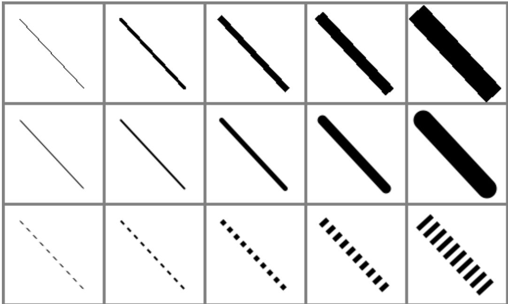

This illustration shows the sample program StrokeDemo.java. (You can try an applet version of the program in the on-line version of this section.) In this program, you can click and drag in any of the small panels, and the lines in all the panels will be redrawn as you move the mouse. In addition, if you right-click and drag, then rectangles will be drawn instead of lines; this shows that strokes are used for drawing the outlines of shapes and not just for straight lines. If you look at the corners of the rectangles that are drawn by the program, you’ll see that there are several ways of drawing a corner where two wide line segments meet.

All the options that you want for a BasicStroke have to be specified in the constructor. Once the stroke object is created, there is no way to change the options. There is one constructor that lets you specify all possible options:

public BasicStroke( float width, int capType, int joinType, float miterlimit,

float[] dashPattern, float dashPhase )

I don’t want to cover all the options in detail, but here’s some basic info:

• width specifies the thickness of the line

• capType specifies how the ends of a line are “capped.” The possible values are BasicStroke.CAP SQUARE, BasicStroke.CAP ROUND and BasicStroke.CAP BUTT. These values are used, respectively, in the first, second, and third rows of the above picture. The default is BasicStroke.CAP SQUARE.

• joinType specifies how two line segments are joined together at corners. Possible values are BasicStroke.JOIN MITER, BasicStroke.JOIN ROUND, and BasicStroke.JOIN BEVEL. Again, these are used in the three rows of panels in the sample program. The default is BasicStroke.JOIN MITER.

• miterLimit is used only if the value of joinType is JOIN MITER; just use the default value, 10.0F.

• dashPattern is used to specify dotted and dashed lines. The values in the array specify lengths in the dot/dash pattern. The numbers in the array represent the length of a solid piece, followed by the length of a transparent piece, followed by the length of a solid piece, and so on. At the end of the array, the pattern wraps back to the beginning of the array. If you want a solid line, use a diferent constructor that has fewer parameters.

• dashPhase tells the computer where to start in the dashPattern array, for the first segment of the line. Use 0 for this parameter in most cases.

For the third row in the above picture, the dashPattern is set to new float[] {5,5}. This means that the lines are drawn starting with a solid segment of length 5, followed by a transparent section of length 5, and then repeating the same pattern. A simple dotted line would have thickness 1 and dashPattern new float[] {1,1}. A pattern of short and long dashes could be made by using new float[] {10,4,4,4}. For more information, see the Java documentation, or try experimenting with the source code for the sample program.

## ∗ ∗ ∗

So now we can draw fancier lines. But any drawing operation is still restricted to drawing with a single color. We can get around that restriction by using Paint. An object of type Paint is used to assign color to each pixel that is “hit” by a drawing operation. Paint is an interface, and the Color class implements the Paint interface. When a color is used for painting, it applies the same color to every pixel that is hit. However, there are other types of paint where the color that is applied to a pixel depends on the coordinates of that pixel. Standard Java includes two classes that define paint with this property: GradientPaint and TexturePaint. In a gradient, the color that is applied to pixels changes gradually from one color to a second color as you move in a certain direction. In a texture, the pixel colors come from an image, which is repeated, if necessary, like a wallpaper pattern to cover the entire xy-plane.

It will be helpful to look at some examples. This illustration shows a polygon filled with two diferent textures. The polygon on the left uses a GradientPaint while the one on the right uses a TexturePaint. Note that in this picture, the paint is used only for filling the polygon. The outline of the polygon is drawn in a plain black color. However, Paint objects can be used for drawing lines as well as for filling shapes. These pictures were made by the sample program PaintDemo.java. In that program, you can select among several diferent paints, and you can control certain properties of the paints. As usual, an applet version of the program is available on line.

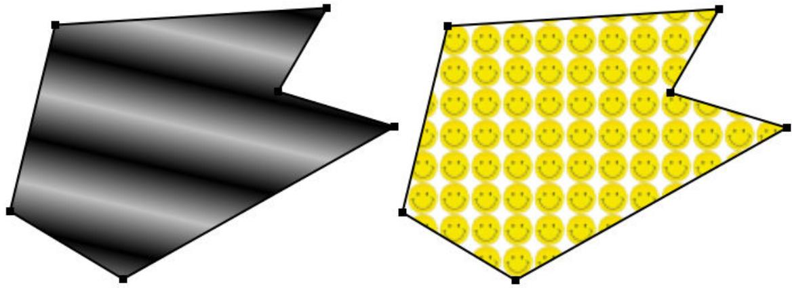

Gradient paints are created using the constructor

public GradientPaint(float x1, float y1, Color c1,

float x2, float y2, Color c2, boolean cyclic)

This constructs a gradient that has color c1 at the point with coordinates (x1,y1) and color c2 at the point (x2,y2). As you move along the line between the two points, the color of the gradient changes from c1 to c2; along lines perpendicular to this line, the color is constant. The last parameter, cyclic, tells what happens if you move past the point (x2,y2) on the line from $( \mathbf { x } \mathbf { 1 } , \mathbf { y } \mathbf { 1 } )$ to $( \mathbf { x } 2 , \mathbf { y } 2 )$ . If cyclic is false, the color stops changing and any point beyond $( \mathbf { x } 2 , \mathbf { y } 2 )$ has color c2. If cyclic is true, then the colors continue to change in a cyclic pattern after you move past (x2,y2). (It works the same way if you move past the other endpoint, $( \mathtt { x 1 } , \mathtt { y 1 } ) .$ ) In most cases, you will set cyclic to true. Note that you can vary the points (x1,y1) and (x2,y2) to change the width and direction of the gradient. For example, to create a cyclic gradient that varies from black to light gray along the line from (0,0) to (100,100), use:

new GradientPaint( 0, 0, Color.BLACK, 100, 100, Color.LIGHT GRAY, true)

To construct a TexturePaint, you need a BuferedImage that contains the image that will be used for the texture. You also specify a rectangle in which the image will be drawn. The image will be scaled, if necessary, to exactly fill the rectangle. Outside the specified rectangle, the image will be repeated horizontally and vertically to fill the plane. You can vary the size and position of the rectangle to change the scale of the texture and its positioning on the plane. Ordinarily, however the upper left corner of the rectangle is placed at (0,0), and the size of the rectangle is the same as the actual size of the image. The constructor for TexturePaint is defined as

public TexturePaint( BufferedImage textureImage, Rectangle2D anchorRect)

The Rectangle2D is part of the Graphics2D framework and will be discussed at the end of this section. Oftern, a call to the constructor takes the form:

new TexturePaint( image,

new Rectangle2D.Double(0,0,image.getWidth(),image.getHeight() )

Once you have a Paint object, you can use the setPaint() method of a Graphics2D object to install the paint in a graphics context. For example, if g2 is of type Graphics2D, then the command

g2.setPaint( new GradientPaint(0,0,Color.BLUE,100,100,Color.GREEN,true) );

sets up g2 to use a gradient paint. Subsequent drawing operations with g2 will draw using a blue/green gradient.

## 12.2.5 Transforms

In the standard drawing coordinates on a component, the upper left corner of the component has coordinates (0,0). Coordinates are integers, and the coordinates (x,y) refer to the point that is x pixels over from the left edge of the component and y pixels down from the top. With Graphics2D, however, you are not restricted to using these coordinates. In fact, you can can set up a Graphics2D graphics context to use any system of coordinates that you like. You can use this capability to select the coordinate system that is most appropriate for the things that you want to draw. For example, if you are drawing architectural blueprints, you might use coordinates in which one unit represents an actual distance of one foot.

Changes to a coordinate system are referred to as transforms. There are three basic types of transform. A translate transform changes the position of the origin, (0,0). A scale transform changes the scale, that is, the unit of distance. And a rotation transforms applies a rotation about some point. You can make more complex transforms by combining transforms of the three basic types. For example, you can apply a rotation, followed by a scale, followed by a translation, followed by another rotation. When you apply several transforms in a row, their efects are cumulative. It takes a fair amount of study to fully understand complex transforms. I will limit myself here to discussing a few of the most simple cases, just to give you an idea of what transforms can do

Suppose that g2 is of type Graphics2D. Then g2.translate(x,y) moves the origin, (0,0), to the point (x,y). This means that if you use coordinates (0,0) after saying g2.translate(x,y), then you are referring to the point that used to be (x,y), before the translation was applied. All other coordinate pairs are moved by the same amount. For example saying

g.translate(x,y);

g.drawLine( 0, 0, 100, 200 );

draws the same line as

g.drawLine( x, y, 100+x, 200+y );

In the second case, you are just doing the same translation “by hand.” A translation (like all transforms) afects all subsequent drawing operations. Instead of thinking in terms of coordinate systems, you might find it clearer to think of what happens to the objects that are drawn. After you say g2.translate(x,y), any objects that you draw are displaced x units vertically and y units horizontally. Note that the parameters x and y can be real numbers.

As an example, perhaps you would prefer to have (0,0) at the center of a component, instead of at its upper left corner. To do this, just use the following command in the paintComponent() method of the component:

g2.translate( getWidth()/2, getHeight()/2 );

To apply a scale transform to a Graphics2D g2, use g2.scale(s,s), where s is the real number that specifies the scaling factor. If s is greater than 1, everything is magnified by a factor of s, while if s is between 0 and 1, everything is shrunk by a factor of s. The center of scaling is (0,0). That is, the point (0,0) is unafected by the scaling, and other points more towards or away from (0,0) by a factor of s. Again, it can be clearer to think of the efect on objects that are drawn after a scale transform is applied. Those objects will be magnified or shrunk by a factor of s. Note that scaling afects everything, including thickness of lines and size of fonts. By the way, it is possible to use scale factors that are less than 0. It is even possible to use diferent scale factors in the horizontal and vertical direction with a command of the form g2.scale(sx,sy), although that will distort the shapes of objects.

The third type of basic transform is rotation. The command g2.rotate(r) rotates all subsequently drawn objects through an angle of r about the point (0,0). You can rotate instead about the point (x,y) with the command g2.rotate(r,x,y). All the parameters can be real numbers. Angles are measured in radians, where one radian is equal to 180 degrees. To rotate through an angle of d degrees, use

g2.rotate( d \* Math.PI / 180 );

Positive angles are clockwise rotations, while negative angles are counterclockwise (unless you have already applied a negative scale factor, which reverses the orientation).

Rotation is not as common as translation or scaling, but there are a few things that you can do with it that can’t be done any other way. For example, you can use it to draw an image “on the slant.” Rotation also makes it possible to draw text that is rotated so that its baseline is slanted or even vertical. To draw the string “Hello World” with its basepoint at (x,y) and rising at an angle of 30 degrees, use:

```javascript
g2.rotate( -30 * Math.PI / 180, x, y );
g2.drawString( "Hello World", x, y );
```

To draw the message vertically, with the center of its baseline at the point (x,y), we can use FontMetrics to measure the string, and say:

```javascript
FontMetrics fm = g2.getFontMetrics( g2.getFont() );
int baseelineLength = fm.stringWidth("Hello World");
g2.rotate( -90 * Math.PI / 180, x, y);
g2.drawString( "Hello World", x - baselineLength/2, y );
```

```txt
* * *
```

The drawing operations in the Graphics class use integer coordinates only. Graphics2D makes it possible to use real numbers as coordinates. This becomes particularly important once you start using transforms, since after you apply a scale, a square of size one might cover many pixels instead of just a single pixel. Unfortunately, the designers of Java couldn’t decide whether to use numbers of type float or double as coordinates, and their indecision makes things a little more complicated than they need to be. (My guess is that they really wanted to use float, since values of type float have enough accuracy for graphics and are probably used in the underlying graphical computations of the computer. However, in Java programming, it’s easier to use double than float, so they wanted to make it possible to use double values too.)

To use real number coordinates, you have to use classes defined in the package java.awt.geom. Among the classes in this package are classes that represent geometric shapes such as lines and rectangles. For example, the class Line2D represents a line whose endpoints are given as real number coordinates. The unfortunate thing is that Line2D is an abstract class, which means that you can’t create objects of type Line2D directly. However, Line2D has two concrete subclasses that can be used to create objects. One subclass uses coordinates of type float, and one uses coordinates of type double. The most peculiar part is that these subclasses are defined as static nested classes inside Line2D. Their names are Line2D.Float and Line2D.Double. This means that Line2D objects can be created, for example, with:

Line2D line1 = new Line2D.Float( 0.17F, 1.3F, -2.7F, 5.21F );

Line2D line2 = new Line2D.Double( 0, 0, 1, 0);

Line2D line3 = new Line2D.Double( x1, y1, x2, y2 );

where x1, y1, x2, y2 are any numeric variables. In my own code, I generally use Line2D.Double rather than Line2D.Float.

Other shape classes in java.awt.geom are similar. The class that represents rectangles is Rectangle2D. To create a rectangle object, you have to use either Rectangle2D.Float or Rectangle2D.Double. For example,

Rectangle2D rect = new Rectangle2D.Double( -0.5, -0.5, 1.0, 1.0 );

creates a rectangle with a corner at (-0.5,-0.5) and with width and height both equal to 1. Other classes include Point2D, which represents a single point; Ellipse2D, which represents an oval; and Arc2D, which represents an arc of a circle.

If g2 is of type Graphcis2D and shape is an object belonging to one of the 2D shape classes, then the command

g2.draw(shape);

draws the shape. For a shape such as a rectangle or ellipse that has an interior, only the outline is drawn. To fill in the interior of such a shape, use

$$
\mathrm{g2.fill(shape)}
$$

For example, to draw a line from (x1,y1) to (x2,y2), use

$$
\text {g2. draw ( new Line2D.Double(x1,y1,x2,y2));}
$$

and to draw a filled rectangle with a corner at (3.5,7), with width 5, and with height 3, use

$$
\text {g2.fill(new Rectangle2D.Double(3.5, 7, 5, 3));}
$$

The package java.awt.geom also has a very nice class GeneralPath that can be used to draw polygons and curves defined by any number of points. See the Java documentation if you want to find out how to use it. There is still a large part of the Graphics2D framework for you to explore.

## 12.3 Actions and Buttons

For the past two sections, we have been looking at some of the more advanced aspects of the Java graphics API. But the heart of most graphical user interface programming is using GUI components. In this section and the next, we’ll be looking at JComponents. We’ll cover several component classes that were not covered in Chapter 6, as well as some features of classes that were covered there.

This section is mostly about buttons. Buttons are among the simplest of GUI components, and it seems like there shouldn’t be all that much to say about them. However, buttons are not as simple as they seem. For one thing, there are many diferent types of buttons. The basic functionality of buttons in Java is defined by the class javax.swing.AbstractButton. Subclasses of this class represent push buttons, check boxes, and radio buttons. Menu items are also considered to be buttons. The AbstractButton class defines a surprisingly large API for controlling the appearance of buttons. This section will cover part of that API, but you should see the class documentation for full details.

In this section, we’ll also encounter a few classes that do not themselves define buttons but that are related to the button API, starting with “actions.”

## 12.3.1 Action and AbstractAction

The JButton class represents push buttons. Up until now, we have created push buttons using the constructor

$$
\text {public JButton(String text);}
$$

which specifies text that will appear on the button. We then added an ActionListener to the button, to respond when the user presses it. Another way to create a JButton is using an Action. The Action interface represents the general idea of some action that can be performed, together with properties associated with that action, such as a name for the action, an icon that represents the action, and whether the action is currently enabled or disabled. Actions are usually defined using the class AbstractAction, an abstract class which includes a method,

$$
\text {public void actionPerformed(ActionEvent evt)}
$$

that must be defined in any concrete subclass. Often, this is done in an anonymous inner class. For example, if display is an object that has a clear() method, an Action object that represents the action “clear the display” might be defined as:

```txt
Action clearAction = new AbstractAction("Clear") {
    public void actionPerformed(ActionEvent evt) {
        display.clear();
    }
};
```

The parameter, "Clear", in the constructor of the AbstractAction is the name of the action. Other properties can be set by calling the method setValue(key,value), which is part of the Action interface. For example,

```javascript
clearAction.setValue(Action.SHORT_DESCRIPTION, "Clear the Display");
```

sets the SHORT DESCRIPTION property of the action to have the value “Clear the Display”. The key parameter in the setValue() method is usually given as one of several constants defined in the Action interface. As another example, you can change the name of an action by using Action.NAME as the key in the setValue() method.

Once you have an Action, you can use it in the constructor of a button. For example, using the action clearAction defined above, we can create the JButton

```javascript
JButton clearButton = new JButton( clearAction );
```

The name of the action will be used as the text of the button, and some other properties of the button will be taken from properties of the action. For example, if the SORT DESCRIPTION property of the action has a value, then that value is used as the tooltip text for the button. (The tooltip text appears when the user hovers the mouse over the button.) Furthermore, when you change a property of the action, the corresponding property of the button will also be changed.

The Action interface defines a setEnabled() method that is used to enable and disable the action. The clearAction action can be enabled and disabled by calling clearAction.setEnabled(true) and clearAction.setEnabled(false). When you do this, any button that has been created from the action is also enabled or disabled at the same time.

Now of course, the question is, why should you want to use Actions at all? One advantage is that using actions can help you to organize your code better. You can create separate objects that represent each of the actions that can be performed in your program. This represents a nice division of responsibility. Of course, you could do the same thing with individual ActionListener objects, but then you couldn’t associate descriptions and other properties with the actions.

More important is the fact that Actions can also be used in other places in the Java API. You can use an Action to create a JMenuItem in the same way as for a JButton:

```txt
JMenuItem clearCommand = new JMenuItem( clearAction );
```

A JMenuItem, in fact, is a kind of button and shares many of the same properties that a JButton can have. You can use the same Action to create both a button and a menu item (or even several of each if you want). Whenever you enable or disable the action or change its name, the button and the menu item will both be changed to match. If you change the NAME property of the action, the text of both the menu item and the button will be set to new name of the action. You can think of the button and the menu items as being two presentations of the Action, and you don’t have to keep track of the button or menu item after you create them. You can do everything that you need to do by manipulating the Action object.

It is also possible to associate an Action with any key, so that the action will be performed whenever the user presses that key. I won’t explain how to do it here, but you can look up the documentation for the classes javax.swing.InputMap and javax.swing.ActionMap.

By the way, if you want to add a menu item that is defined from an Action to a menu, you don’t even need to create the JMenuItem yourself. You can add the action object directly to the menu, and the menu item will be created from the properties of the action. For example, if menu is a JMenu and clearAction is an Action, you can simply say menu.add(clearAction).

## 12.3.2 Icons on Buttons

In addition to—or instead of—text, buttons can also show icons. Icons are represented by the Icon interface and are usually created as ImageIcons, as discussed in Subsection 12.1.4. For example, here is a picture of a button that displays an image of a large “X” as its icon:


The icon for a button can be set by calling the button’s setIcon() method, or by passing the icon object as a parameter to the constructor when the button is created. To create the button shown above, I created an ImageIcon from a BuferedImage on which I drew the picture that I wanted, and I constructed the JButton using a constructor that takes both the text and the icon for the button as parameters. Here’s the code segment that does it:

BufferedImage image = new BufferedImage(24,24,BufferedImage.TYPE INT RGB);

```javascript
Graphics2D g2 = (Graphics2D)image.getGraphics();
g2.setColor(Color.LIGHT_GRAY);          // Draw the image for the icon.
g2.fillRect(0,0,24,24);
g2.setStroke(new BasicStroke(3));      // Use thick lines.
g2.setColor(Color.BLACK);
g2.drawLine(4,4,20,20);                  // Draw the "X".
g2.drawLine(4,20,20,4);
g2.dispose();

Icon clearIcon = new ImageIcon(image);     // Create the icon.

JButton clearButton = new JButton("Clear the Display", clearIcon);
```

You can create a button with an icon but no text by using a constructor that takes just the icon as parameter. Another alternative is for the button to get its icon from an Action. When a button is constructed from an action, it takes its icon from the value of the action property Action.SMALL ICON. For example, suppose that we want to use an action named clearAction to create the button shown above. This could be done with:

```java
clearAction.putValue( Action.SMALL_ICON, clearIcon );
JButton clearButton = new JButton( clearAction );
```

The icon could also be associated with the action by passing it as a parameter to the constructor of an AbstractAction:

```txt
Action clearAction = new AbstractAction("Clear the Display", clearIcon) {
    public void actionPerformed(ActionEvent evt) {
        .
        . // Carry out the action.
        .
    }
}
JButton clearButton = new JButton( clearAction );
```

The appearance of buttons can be tweaked in many ways. For example, you can change the size of the gap between the button’s text and its icon. You can associate additional icons with a button that are used when the button is in certain states, such as when it is pressed or when it is disabled. It is even possible to change the positioning of the text with respect to the icon. For example, to place the text centered below the icon on a button, you can say:

button.setHorizontalTextPosition(JButton.CENTER);

button.setVerticalTextPosition(JButton.BOTTOM);

These methods and many others are defined in the class AbstractButton. This class is a superclass for JMenuItem, as well as for JButton and for the classes that define check boxes and radion buttons. Note in particular that an icon can be shown in a menu by associating the icon with a menu item or with the action that is used to create the menu item.

Finally, I will mention that it is possible to use icons on JLabels in much the same way that they can be used on JButtons.

## 12.3.3 Radio Buttons

The JCheckBox class was covered in Subsection 6.6.3, and the equivalent for use in menus, JCheckBoxMenuItem, in Subsection 6.8.1. A checkbox has two states, selected and not selected, and the user can change the state by clicking on the check box. The state of a checkbox can also be set programmatically by calling its setSelected() method, and the current value of the state can be checked using the isSelected() method.

Closely related to checkboxes are radio buttons. Like a checkbox, a radio button can be either selected or not. However, radio buttons are expected occur in groups, and at most one radio button in a group can be selected at any given time. In Java, a radio button is represented by an object of type JRadioButton. When used in isolation, a JRadioButton acts just like a JCheckBox, and it has the same methods and events. Ordinarily, however, a JRadioButton is used in a group. A group of radio buttons is represented by an object belonging to the class ButtonGroup. A ButtonGroup is not a component and does not itself have a visible representation on the screen. A ButtonGroup works behind the scenes to organize a group of radio buttons, to ensure that at most one button in the group can be selected at any given time.

To use a group of radio buttons, you must create a JRadioButton object for each button in the group, and you must create one object of type ButtonGroup to organize the individual buttons into a group. Each JRadioButton must be added individually to some container, so that it will appear on the screen. (A ButtonGroup plays no role in the placement of the buttons on the screen.) Each JRadioButton must also be added to the ButtonGroup, which has an add() method for this purpose. If you want one of the buttons to be selected initially, you can call setSelected(true) for that button. If you don’t do this, then none of the buttons will be selected until the user clicks on one of them.

As an example, here is how you could set up a set of radio buttons that can be used to select a color:

JRadioButton redRadio, blueRadio, greenRadio, blackRadio;

// Variables to represent the radio buttons.

// These should probably be instance variables, so

// that they can be used throughout the program.

```javascript
redRadio = new JRadioButton("Red");  // Create a button.
colorGroup.add(redRadio);          // Add it to the group.

blueRadio = new JRadioButton("Blue");
colorGroup.add(blueRadio);

greenRadio = new JRadioButton("Green");
colorGroup.add(greenRadio);

blackRadio = new JRadioButton("Black");
colorGroup.add(blackRadio);

redRadio.setSelected(true);  // Make an initial selection.
```

The individual buttons must still be added to a container if they are to appear on the screen. If you want to respond immediately when the user clicks on one of the radio buttons, you can register an ActionListener for each button. Just as for checkboxes, it is not always necessary to register listeners for radio buttons. In some cases, you can simply check the state of each button when you need to know it, using the button’s isSelected() method.

All this is demonstrated in the sample program RadioButtonDemo.java. The program shows four radio buttons. When the user selects one of the radio buttons, the text and background color of a label is changed. Here is a picture of the program, with the “Green” radio button selected:

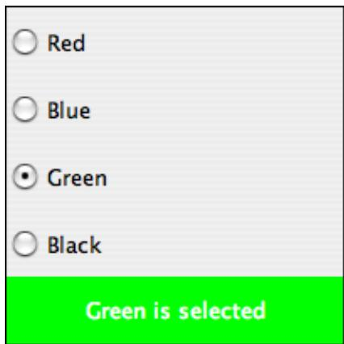

You can add the equivalent of a group of radio buttons to a menu by using the class JRadioButtonMenuItem. To use this class, create several objects of this type, and create a ButtonGroup to manage them. Add each JRadioButtonMenuItem to the ButtonGroup, and also add them to a JMenu. If you want one of the items to be selected initially, call its setSelected() method to set its selection state to true. You can add ActionListeners to each JRadioButton-MenuItem if you need to take some action when the user selects the menu item; if not, you can simply check the selected states of the buttons whenever you need to know them. As an example, suppose that menu is a JMenu. Then you can add a group of buttons to menu as follows:

```txt
JRadionButtonMenuItem selectRedItem, selectGreenItem, selectBlueItem;
    // These might be defined as instance variables
ButtonGroup group = new ButtonGroup();
selectRedItem = new JRadioButtonMenuItem("Red");
group.add(selectRedItem);
menu.add(selectRedItem);
```

```javascript
selectGreenItem = new JRadioButtonMenuItem("Green");
group.add(selectGreenItem);
menu.add(selectGreenItem);
selectBlueItem = new JRadioButtonMenuItem("Blue");
group.add(selectBlueItem);
menu.add(selectBlueItem);
```

## ∗ ∗ ∗

When it’s drawn on the screen, a JCheckBox includes a little box that is either checked or unchecked to show the state of the box. That box is actually a pair of Icons. One icon is shown when the check box is unselected; the other is shown when it is selected. You can change the appearance of the check box by substituting diferent icons for the standard ones.

The icon that is shown when the check box is unselected is just the main icon for the JCheckBox. You can provide a diferent unselected icon in the constructor or you can change the icon using the setIcon() method of the JCheckBox object. To change the icon that is shown when the check box is selected, use the setSelectedIcon() method of the JCheckBox. All this applies equally to JRadioButton, JCheckBoxMenuItem, and JRadioButtonMenuItem.

An example of this can be found in the sample program ToolBarDemo.java, which is discussed in the next subsection. That program creates a set of radio buttons that use custom icons. The buttons are created by the following method:

```java
/**
 * Create a JRadioButton and add it to a specified button group.  The button
 * is meant for selecting a drawing color in the display.  The color is used to
 * create two custom icons, one for the unselected state of the button and one
 * for the selected state.  These icons are used instead of the usual
 * radio button icons.
 * @param c the color of the button, and the color to be used for drawing.
 *      (Note that c has to be "final" since it is used in the anonymous inner
 *      class that defines the response to ActionEvents on the button.)
 * @param grp the ButtonGroup to which the radio button will be added.
 * @param selected if true, then the state of the button is set to selected.
 * @return the radio button that was just created; sorry, but the button
       is not as pretty as I would like!
 */
private JRadioButton makeColorRadioButton(final Color c,
                          ButtonGroup grp, boolean selected) {

    /* Create an ImageIcon for the normal, unselected state of the button,
       using a BufferedReader that is drawn here from scratch. */

    BufferedReader image = new BufferedReader(30,30,BufferedImage.TYPE_INT_RGB);
    Graphics g = image.getGraphics();
    g.setColor(Color.LIGHT_GRAY);
    g.fillRect(0,0,30,30);
    g.setColor(c);
    g.fill3DRect(1, 1, 24, 24, true);
    g.dispose();
    Icon unselectedIcon = new ImageIcon(image);

    /* Create an ImageIcon for the selected state of the button. */

    image = new BufferedReader(30,30,BufferedImage.TYPE_INT_RGB);
    g = image.getGraphics();
```

```java
g.setColor(Color.DARK_GRAY);
g.fillRect(0,0,30,30);
g.setColor(c);
g.fill3DRect(3, 3, 24, 24, false);
g.dispose();
Icon selectedIcon = new ImageIcon(image);

/* Create and configure the button. */

JRadioButton button = new JRadioButton(unselectedIcon);
button.setSelectedIcon(selectedIcon);
button.addActionListener(new ActionListener() {
    public void actionPerformed(ActionEvent e) {
        // The action for this button sets the current drawing color
        // in the display to c.
        display.setCurrentColor(c);
    }
});
grp.add(button);
if (selected)
    button.getSelected(true);

return button;
// end makeColorRadioButton
```

It is possible to create radio buttons and check boxes from Actions. The button takes its name, main icon, tooltip text, and enabled/disabled state from the action. However, in Java 5.0, an action has no property corresponding to the selected/unselected state. This means that you can’t check or set the selection state through the action. In Java 6.0, the action API will be considerably improved, and among the changes is support for selection state.

## 12.3.4 Toolbars

It has become increasingly common for programs to have a row of small buttons along the top or side of the program window that ofer access to some of the commonly used features of the program. The row of buttons is known as a tool bar. Typically, the buttons in a tool bar are presented as small icons, with no text. Tool bars can also contain other components, such as JTextFields and JLabels.

In Swing, tool bars are represented by the class JToolBar. A JToolBar is a container that can hold other components. It is also itself a component, and so can be added to other containers. In general, the parent component of the tool bar should use a BorderLayout. The tool bar should occupy one of the edge positions—NORTH, SOUTH, EAST, or WEST—in the BorderLayout. Furthermore, the other three edge positions should be empty. The reason for this is that it might be possible (depending on the platform and configuration) for the user to drag the tool bar from one edge position in the parent container to another. It might even be possible for the user to drag the toolbar of its parent entirely, so that it becomes a separate window.

Here is a picture of a tool bar from the sample program ToolBarDemo.java.

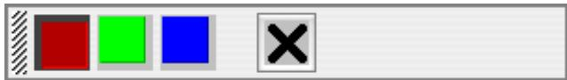

In this program, the user can draw colored curves in a large drawing area. The first three buttons in the tool bar are a set of radio buttons that control the drawing color. The fourth button is a push button that the user can click to clear the drawing.

Tool bars are easy to use. You just have to create the JToolBar object, add it to a container, and add some buttons and possibly other components to the tool bar. One fine point is adding space to a tool bar, such as the gap between the radio buttons and the push button in the sample program. You can leave a gap by adding a separator to the tool bar. For example:

```javascript
toolbar.addSeparator(new Dimension(20,20));
```

This adds an invisible 20-by-20 pixel block to the tool bar. This will appear as a 20 pixel gap between components.

Here is the constructor from the ToolBarDemo program. It shows how to create the tool bar and place it in a container. Note that class ToolBarDemo is a subclass of JPanel, and the tool bar and display are added to the panel object that is being constructed:

```java
public ToolBarDemo() {
    setLayout(new BorderLayout(2,2));
    setBackground(Color.GRAY);
    setBorder(BorderFactory.createLineBorder(Color.GRAY,2));

    display = new Display();
    add(display, BorderLayout.CENTER);

    JToolBar toolbar = new JToolBar();
    add(toolbar, BorderLayout.NORTH);

    ButtonGroup group = new ButtonGroup();
    toolbar.add( makeColorRadioButton(Color.RED,group,true) );
    toolbar.add( makeColorRadioButton(Color.GREEN,group,false) );
    toolbar.add( makeColorRadioButton(Color.BLUE,group,false) );
    toolbar.addSeparator(new Dimension(20,20));

    toolbar.add( makeClearButton() );

}
```

Note that the gray outline of the tool bar comes from two sources: The line at the bottom shows the background color of the main panel, which is visible because the BorderLayout that is used on that panel has vertical and horizontal gaps of 2 pixels. The other three sides are part of the border of the main panel.

If you want a vertical tool bar that can be placed in the EAST or WEST position of a Border-Layout, you should specify the orientation in the tool bar’s constructor:

```txt
JToolBar toolbar = new JToolBar( JToolBar.VERTICAL );
```

The default orientation is JToolBar.HORIZONTAL. The orientation is adjusted automatically when the user drags the toolbar into a new position. If you want to prevent the user from dragging the toolbar, just say toolbar.setFloatable(false).

## 12.3.5 Keyboard Accelerators

In most programs, commonly used menu commands have keyboard equivalents. The user can type the keyboard equivalent instead of selecting the command from the menu, and the result will be exactly the same. Typically, for example, the “Save” command has keyboard equivalent CONTROL-C, and the “Undo” command corresponds to CONTROL-Z. (Under Mac OS, the keyboard equivalents for these commands would probably be META-C and META-Z, where META refers to holding down the “apple” key.) The keyboard equivalents for menu commands are referred to as accelerators.

The class javax.swing.KeyStroke is used to represent key strokes that the user can type on the keyboard. A key stroke consists of pressing a key, possibly while holding down one or more of the modifier keys control, shift, alt, and meta. The KeyStroke class has a static method, getKeyStroke(String), that makes it easy to create key stroke objects. For example,

KeyStroke.getKeyStroke( "ctrl S" )

returns a KeyStroke that represents the action of pressing the “S” key while holding down the control key. In addition to “ctrl”, you can use the modifiers “shift”, “alt”, and “meta” in the string that describes the key stroke. You can even combine several modifiers, so that

KeyStroke.getKeyStroke( "ctrl shift Z" )

represents the action of pressing the “Z” key while holding down both the control and the shift keys. When the key stroke involves pressing a character key, the character must appear in the string in upper case form. You can also have key strokes that correspond to non-character keys. The number keys can be referred to as “1”, “2”, etc., while certain special keys have names such as “F1”, “ENTER”, and “LEFT” (for the left arrow key). The class KeyEvent defines many constants such as VK ENTER, VK LEFT, and VK S. The names that are used for keys in the keystroke description are just these constants with the leading “VK ” removed.

There are at least two ways to associate a keyboard accelerator with a menu item. One is to use the setAccelerator() method of the menu item object:

JMenuItem saveCommand = new JMenuItem( "Save..." );

saveCommand.setAccelerator( KeyStroke.getKeyStroke("ctrl S") );

The other technique can be used if the menu item is created from an Action. The action property Action.ACCELERATOR KEY can be used to associate a KeyStroke with an Action. When a menu item is created from the action, the keyboard accelerator for the menu item is taken from the value of this property. For example, if redoAction is an Action representing a “Redo” action, then you might say:

redoAction.putValue( Action.ACCELERATOR KEY,

KeyStroke.getKeyStroke("ctrl shift Z") );

JMenuItem redoCommand = new JMenuItem( redoAction );

or, alternatively, you could simply add the action to a JMenu, editMenu, with editMenu.add(redoAction). (Note, by the way, that accelerators apply only to menu items, not to push buttons. When you create a JButton from an action, the ACCELERATOR KEY property of the action is ignored.)

Note that you can use accelerators for JCheckBoxMenuItems and JRadioButtonMenuItems, as well as for simple JMenuItems.

For an example of using keyboard accelerators, see the solution to Exercise 12.2.

$$
\* \ * \ *
$$

By the way, as noted above, in the Macintosh operating system, the meta (or apple) key is usually used for keyboard accelerators instead of the control key. If you would like to make your program more Mac-friendly, you can test whether your program is running under Mac OS and, if so, adapt your accelerators to the Mac OS style. The recommended way to detect Mac

OS is to test the value of System.getProperty("mrj.version"). This function call happens to return a non-null value under Mac OS but returns null under other operating systems. For example, here is a simple utility routine for making Mac-friendly accelerators:

```java
/**
 * Create a KeyStroke that uses the meta key on Mac OS and
 * the control key on other operating systems.
 * @param description a string that describes the keystroke,
 *   without the "meta" or "ctrl"; for example, "S" or
 *   "shift Z" or "alt F1"
 * @return a keystroke created from the description string
 *   with either "ctrl " or "meta " prepended
 */
private static KeyStroke makeAccelerator(String description) {
    String commandKey;
    if ( System.getProperty("mrj.version") == null )
        commandKey = "ctrl";
    else
        commandKey = "meta";
    return KeyStroke.getKeyStroke( commandKey + " " + description );
}
```

## 12.3.6 HTML on Buttons

As a final stop in this brief tour of ways to spif up your buttons, I’ll mention the fact that the text that is displayed on a button can be specified in HTML format. HTML is the markup language that is used to write web pages. A brief introduction to HTML can be found in Subsection 6.2.3. HTML allows you to apply color or italics or other styles to just part of the text on your buttons. It also makes it possible to have buttons that display multiple lines of text. (You can also use HTML on JLabels, which can be even more useful.) Here’s a picture of a button with HTML text (along with a “Java” icon):


If the string of text that is applied to a button starts with “<html>”, then the string is interpreted as HTML. The string does not have to use strict HTML format; for example, you don’t need a closing </html> at the end of the string. To get multi-line text, use <br> in the string to represent line breaks. If you would like the lines of text to be center justified, include the entire text (except for the <html>) between <center> and </center>. For example,

```txt
JButton button = new JButton(
    "<html><center>This button has<br>two lines of text</center>" );
```

creates a button that displays two centered lines of text. You can apply italics to part of the string by enclosing that part between <i> and </i>. Similarly, use <b>...</b> for bold text and <u>...</u> for underlined text. For green text, enclose the text between <font color=green> and </font >. You can, of course, use other colors in place of “green.” The “Java” button that is shown above was created using:

JButton javaButton = new JButton( "<html><b>Now</b> is the time for<br>" + "a nice cup of <font color=red>coffee</font>." );

Other HTML features can also be used on buttons and labels—experiment to see what you can get away with!

## 12.4 Complex Components and MVC

Since even buttons turn out to be pretty complex, as seen in the previous section, you might guess that there is a lot more complexity lurking in the Swing API. While this is true, a lot of that complexity works to your benefit as a programmer, since a lot of it is hidden in normal uses of Swing components. For example, you don’t have to know about all the complex details of buttons in order to use them efectively in most programs.

Swing defines several component classes that are much more complex than those we have looked at so far, but even the most complex components are not very dificult to use for many purposes. In this section, we’ll look at components that support display and manipulation of lists, tables, and text documents. To use these complex components efectively, you’ll need to know something about the Model-View-Controller pattern that is used as a basis for the design of many Swing components. This pattern is discussed in the first part of this section.

This section is our last look at Swing components, but there are a number of component classes that have not even been touched on in this book. Some useful ones that you might want to look into include: JTabbedPane, JSplitPane, JTree, JSpinner, JPopupMenu, JProgressBar, JScrollBar, and JPasswordField.

At the end of the section, we’ll look briefly at the idea of writing custom component classes— something that you might consider when even the large variety of components that are already defined in Swing don’t do quite what you want.

## 12.4.1 Model-View-Controller

One of the principles of object-oriented design is division of responsibilities. Ideally, an object should have a single, clearly defined role, with a limited realm of responsibility. One application of this principle to the design of graphical user interfaces is the MVC pattern. “MVC” stands for “Model-View-Controller” and refers to three diferent realms of responsibility in the design of a graphical user interface.

When the MVC pattern is applied to a component, the model consists of the data that represents the current state of the component. The view is simply the visual presentation of the component on the screen. And the controller is the aspect of the component that carries out actions in response to events generated by the user. The idea is to assign responsibility for the model, the view, and the controller to diferent objects.

The view is the easiest part of the MVC pattern to understand. It is often represented by the component object itself, and its responsibility is to draw the component on the screen. In doing this, of course, it has to consult the model, since the model represents the state of the component, and that state can determine what appears on the screen. To get at the mode data—which is stored in a separate object according to the MVC pattern—the component object needs to keep a reference to the model object. Furthermore, when the model changes, the view might have to be redrawn to reflect the changed state. The component needs some way of knowing when changes in the model occur. Typically, in Java, this is done with events and listeners. The model object is set up to generate events when its data changes. The view object registers itself as a listener for those events. When the model changes, an event is generated, the view is notified of that event, and the view responds by updating its appearance on the screen.

When MVC is used for Swing components, the controller is generally not so well defined as the model and view, and its responsibilities are often split among several objects. The controller might include mouse and keyboard listeners that respond to user events on the view; Actions that respond to menu commands or buttons; and listeners for other high-level events, such as those from a slider, that afect the state of the component. Usually, the controller responds to events by making modifications to the model, and the view is changed only indirectly, in response to the changes in the model.

The MVC pattern is used in many places in the design of Swing. It is even used for buttons. The state of a Swing button is stored in an object of type ButtonModel. The model stores such information as whether the button is enabled, whether it is selected, and what ButtonGroup it is part of, if any. If button is of type JButton (or one of the other subclasses of AbstractButton), then its ButtonModel can be obtained by calling button.getModel(). In the case of buttons, you might never need to use the model or even know that it exists. But for the list and table components that we will look at next, knowledge of the model is essential.

## 12.4.2 Lists and ListModels

A JList is a component that represents a list of items that can be selected by the user. The sample program SillyStamper.java allows the user to select one icon from a JList of Icons. The user selects an icon from the list by clicking on it. The selected icon can be “stamped” onto a drawing area by clicking on the drawing area. (The icons in this program are from the KDE desktop project.) Here is a picture of the program with several icons already stamped onto the drawing area and with the “light bulb” icon selected:

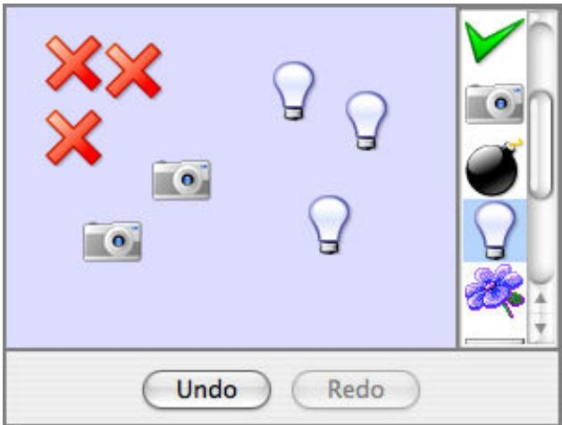

Note that the scrollbar in this program is not part of the JList. To add a scrollbar to a list, the list must be placed into a JScrollPane. See Subsection 6.6.4, where the use of JScrollPane to hold a JTextArea was discussed. Scroll panes are used in the same way with lists and with other components. In this case, the JList, iconList, was added to a scroll pane and the scroll pane was added to a panel with the single command:

add( new JScrollPane(iconList), BorderLayout.EAST );

One way to construct a JList is from an array that contains the objects that will appear in the list. The items can be of any type, but only icons and strings can actually appear in the list; an item that is not of type Icon or String is converted into a string by calling its toString() method. (It’s possible to “teach” a JList to display other types of items; see the setCellRenderer() method in the JList class.) In the SillyStamper program, the images for the icons are read from resource files, the icons are placed into an array, and the array is used to construct the list. This is done by the following method:

```javascript
ivate JList createIconList() {
String[] iconNames = new String[] {
    "icon5.png", "icon7.png", "icon8.png", "icon9.png", "icon10.png",
    "icon11.png", "icon24.png", "icon25.png", "icon26.png", "icon31.png",
    "icon33.png", "icon34.png"
};          // Array containing resource file names for the icon images.
iconImages = new Image[iconNames.length];
ClassLoader classLoader = getClass().getClassLoader();
Toolkit toolkit = Toolkit.getDefaultToolkit();
try {                  // Get the icon images from the resource files.
    for (int i = 0; i < iconNames.length; i++) {
        URL imageURL = classLoader.getResource("stamper_icons/" + iconNames[i])
        if (imageURL == null)
            throw new Exception();
        iconImages[i] = toolkit.createImage(imageURL);
    }
}
catch (Exception e) {
    iconImages = null;
    return null;
}

ImageIcon[] icons = new ImageIcon[iconImages.length];
for (int i = 0; i < iconImages.length; i++)      // Create the icons.
    icons[i] = new ImageIcon(iconImages[i]);

JList list = new JList(icons);       // A list containing the image icons.
list.setSelectionMode(ListSelectionModel.SINGLE_SELECTION);
list.setSelectedIndex(0);   // First item in the list is currently selected.
return list;
```

By default, the user can select any number of items in a list. A single item is selected by clicking on it. Multiple items can be selected by shift-clicking and by either control-clicking or meta-clicking (depending on the platform). In the SillyStamper program, I wanted to restrict the selection so that only one item can be selected at a time. This restriction is imposed by calling

## list.setSelectionMode(ListSelectionModel.SINGLE SELECTION);

With this selection mode, when the user selects an item, the previously selected item, if any, is deselected. Note that the selection can be changed by the program by calling list.setSelectedIndex(itemNum). Items are numbered starting from zero. To find out the currently selected item in single selection mode, call list.getSelectedIdex(). This returns the item number of the selected item, or -1 if no item is currently selected. If multiple selections are allowed, you can call list.getSelectedIndices(), which returns an array of ints that contains the item numbers of all selected items.

Now, the list that you see on the screen is only the view aspect of the list. The controller consists of the listener objects that respond when the user clicks an item in the list. For its model, a JList uses an object of type ListModel. This is the object that knows the actual list of items. Now, a model is defined not only by the data that it contains but by the set of operations that can be performed on the data. When a JList is constructed from an array of objects, the model that is used is very simple. The model can tell you how many items it contains and what those items are, but it can’t do much else. In particular, there is no way to add items to the list or to delete items from the list. If you need that capability, you will have to use a diferent list model.

The class DefaultListModel defines list models that support adding items to and removing items from the list. (Note that the list model that you get when you create a JList from an array is not of this type.) If dlmodel is of type DefaultListModel, the following methods, among others, are defined:

• dlmodel.getSize() — returns the number of items

• dlmodel.getElementAt(index) — returns the item at position index in the list.

• dlmodel.addElement(item) — Adds item to the end of the list; item can be any Object.

• dlmodel.insertElementAt(item, index) — inserts the specified item into the list at the specified index; items that come after that position in the list are moved down to make room for the new item.

• dlmodel.setElementAt(item, index) — Replaces the item that is currently at position index in the list with item.

• dlmodel.remove(index) — removes the item at position index in the list.

• dlmodel.removeAllElements() — removes everything from the list, leaving it empty.

To use a modifiable JList, you should create a DefaultListModel, add any items to it that should be in the list initially, and pass it to the JList constructor. For example:

```txt
DefaultListModel listModel;  // Should probably be instance variables!
JList flavorList;

listModel = new DefaultListModel();    // Create the model object.
listModel.addElement("Chocolate");      // Add items to the model.
listModel.addElement("Vanilla");
listModel.addElement("Strawberry");
listModel.addElement("Rum Raisen");

flavorList = new JList(listModel);     // Create the list component.
```

By keeping a reference to the model around in an instance variable, you will be able to add and delete flavors as the program is running by calling the appropriate methods in listModel. Keep in mind that changes that are made to the model will automatically be reflected in the view. Behind the scenes, when a list model is modified, it generates an event of type ListDataEvent. The JList registers itself with its model as a listener for these events, and it responds to an event by redrawing itself to reflect the changes in the model. The programmer doesn’t have to take any extra action, beyond changing the model.

By the way, the model for a JList actually has another part in addition to the ListModel: An object of type ListSelectionModel stores information about which items in the list are currently selected. When the model is complex, it’s not uncommon to use several model objects to store diferent aspects of the state.

## 12.4.3 Tables and TableModels

Like a JList, a JTable displays a collection of items to the user. However, tables are much more complicated than lists. Perhaps the most important diference is that it is possible for the user to edit items in the table. Table items are arranged in a grid of rows and columns. Each grid position is called a cell of the table. Each column can have a header, which appears at the top of the column and contains a name for the column.

It is easy to create a JTable from an array that contains the names of the columns and a two-dimensional array that contains the items that go into the cells of the table. As an example, the sample program StatesAndCapitalsTableDemo.java creates a table with two columns named “State” and “Capital City.” The first column contains a list of the states of the United States and the second column contains the name of the capital city of each state. The table can be created as follows:

```txt
String[][] statesAndCapitals = new String[][] {
    { "Alabama", "Montgomery" },
    { "Alaska", "Juneau" },
    { "Arizona", "Phoenix" },
    .
    .
    .
    { "Wisconsin", "Madison" },
    { "Wyoming", "Cheyenne" }
};
String[] columnHeads = new String[] { "State", "Capital City" };
JTable table = new JTable(statesAndCapitals, columnHeads);
```

Since a table does not come with its own scroll bars, it is almost always placed in a JScrollPane to make it possible to scroll the table. In the example program this is done with:

```javascript
add( new JScrollPane(table), BorderLayout.CENTER );
```

The column headers of a JTable are not actually part of the table; they are in a separate component. But when you add the table to a JScrolPane, the column headers are automatically placed at the top of the pane.

Using the default settings, the user can edit any cell in the table. (To select an item for editing, click it and start typing. The arrow keys can be used to move from one cell to another.) The user can change the order of the columns by dragging a column header to a new position. The user can also change the width of the columns by dragging the line that separates neighboring column headers. You can try all this in the sample program; there is an applet version in the on-line version of this section.

Allowing the user to edit all entries in the table is not always appropriate; certainly it’s not appropriate in the “states and capitals” example. A JTable uses an object of type TableModel to store information about the contents of the table. The model object is also responsible for deciding whether or not the user should be able to edit any given cell in the table. TableModel includes the method

## public boolean isCellEditable(int rowNum, columnNum)

where rowNum and columnNum are the position of a cell in the grid of rows and columns that make up the table. When the controller wants to know whether a certain cell is editable, it calls this method in the table model. If the return value is true, the user is allowed to edit the cell.

The default model that is used when the table is created, as above, from an array of objects allows editing of all cells. For this model, the return value of isCellEditable() is true in all cases. To make some cells non-editable, you have to provide a diferent model for the table. One way to do this is to create a subclass of DefaultTableModel and override the isCellEditable() method. (DefaultTableModel and some other classes that are discussed in this section are defined in the package javax.swing.table.) Here is how this might be done in the “states and capitals” program to make all cells non-editable:

```java
TableModel model = new DefaultTableModel(statesAndCapitals,columnHeads) {
    public boolean isCellEditable(int row, int col) {
        return false;
    }
};
JTable table = new JTable(model);
```

Here, an anonymous subclass of DefaultTableModel is created in which the isCellEditable() method returns false in all cases, and the model object that is created from that class is passed as a parameter to the JTable constructor.

The DefaultTableModel class defines many methods that can be used to modify the table, including for example: setValueAt(item,rowNum,colNum) to change the item in a given cell; removeRow(rowNum) to delete a row; and addRow(itemArray) to add a new row at the end of the table that contains items from the array itemArray. Note that if the item in a given cell is null, then that cell will be empty. Remember, again, that when you modify the model, the view is automatically changed to reflect the changes.

In addition to the isCellEditable() method, the table model method that you are most likely to want to override is getColumnClass(), which is defined as

## public Class<?> getColumnClass(columnNum)

The purpose of this method is to specify what kind of values are allowed in the specified column. The return value from this method is of type Class. (The “<?>” is there for technical reasons having to do with generic programming. See Section 10.5, but don’t worry about understanding it here.) Although class objects have crept into this book in a few places— in the discussion of ClassLoaders in Subsection 12.1.3 for example—this is the first time we have directly encountered the class named Class. An object of type Class represents a class. A Class object is usually obtained from the name of the class using expressions of the form “Double.class” or “JTable.class”. If you want a three-column table in which the column types are String, Double, and Boolean, you can use a table model in which getColumnClass is defined as:

```java
public Class<?> getColumnClass(columnNum) {
    if (columnNum == 0)
        return String.class;
    else if (columnNum = 1)
        return Double.class;
    else
        return Boolean.class;
```

The table will call this method and use the return value to decide how to display and edit items in the table. For example, if a column is specified to hold Boolean values, the cells in that column will be displayed and edited as check boxes. For numeric types, the table will not accept illegal input when the user types in the value. (It is possible to change the way that a table edits or displays items. See the methods setDefaultEditor() and setDefaultRenderer() in the JTable class.)

As an alternative to using a subclass of DefaultTableModel, a custom table model can also be defined using a subclass of AbstractTableModel. Whereas DefaultTableModel provides a lot of predefined functionality, AbstractTableModel provides very little. However, using Abstract-TableModel gives you the freedom to represent the table data any way you want. The sample program ScatterPlotTableDemo.java uses a subclass of AbstractTableModel to define the model for a JTable. In this program, the table has three columns. The first column holds a row number and is not editable. The other columns hold values of type Double; these two columns represent the x- and y-coordinates of points in the plane. The points themselves are graphed in a “scatter plot” next to the table. Initially, the program fills in the first six points with random values. Here is a picture of the program, with the x-coordinate in row 5 selected for editing:

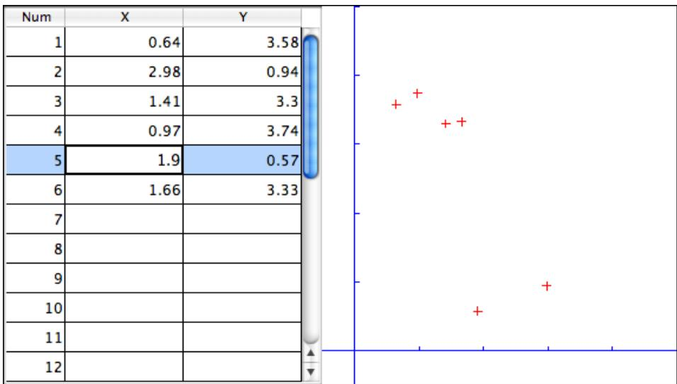

Note, by the way, that in this program, the scatter plot can be considered to be a view of the table model, in the same way that the table itself is. The scatter plot registers itself as a listener with the model, so that it will receive notification whenever the model changes. When that happens, the scatter plot redraws itself to reflect the new state of the model. It is an important property of the MVC pattern that several views can share the same model, ofering alternative presentations of the same data. The views don’t have to know about each other or communicate with each other except by sharing the model. Although I didn’t do it in this program, it would even be possible to add a controller to the scatter plot view. This would let the user drag a point in the scatter plot to change its coordinates. Since the scatter plot and table share the same model, the values in the table would automatically change to match.

Here is the definition of the class that defines the model in the scatter plot program. All the methods in this class must be defined in any subclass of AbstractTableModel except for setValueAt(), which only has to be defined if the table is modifiable.

```java
* This class defines the TableModel that is used for the JTable in this
* program.  The table has three columns.  Column 0 simply holds the
* row number of each row.  Column 1 holds the x-coordinates of the
* points for the scatter plot, and Column 2 holds the y-coordinates.
* The table has 25 rows.  No support is provided for adding more rows.
*/
private class CoordInputTableModel extends AbstractTableModel {

    private Double[] xCoord = new Double[25];  // Data for Column 1.
    private Double[] yCoord = new Double[25];  // Data for Column 2.
        // Initially, all the values in the array are null, which means
        // that all the cells are empty.

    public int getColumnCount() {  // Tells caller how many columns there are.
        return 3;
    }

    public int getRowCount() {  // Tells caller how many rows there are.
        return xCoord.length;
    }

    public Object getValueAt(int row, int col) {  // Get value from cell.
        if (col == 0)
            return (row+1);          // Column 0 holds the row number.
        else if (col == 1)
            return xCoord[row];   // Column 1 holds the x-coordinates.
        else
            return yCoord[row];   // column 2 holds the y-coordinates.
    }

    public Class<?> getColumnClass(int col) {  // Get data type of column.
        if (col == 0)
            return Integer.class;
        else
            return Double.class;
    }

    public String getColumnName(int col) {  // Returns a name for column header
        if (col == 0)
            return "Num";
        else if (col == 1)
            return "X";
        else
            return "Y";
    }

    public boolean isCellEditable(int row, int col) { // Can user edit cell?
        return col > 0;
    }

    public void setValueAt(Object obj, int row, int col) {
        // (This method is called by the system if the value of the cell
        // needs to be changed because the user has edited the cell.
        // It can also be called to change the value programmatically.
        // In this case, only columns 1 and 2 can be modified, and the data
        // type for obj must be Double.  The method fireTableCellUpdated()
        // has to be called to send an event to registered listeners to
```

```objectivec
// notify them of the modification to the table model.)
    if (col == 1)
        xCoord[row] = (Double)obj;
    else if (col == 2)
        yCoord[row] = (Double)obj;
    fireTableCellUpdated(row, col);
}
} // end nested class CoordInputTableModel
```

In addition to defining a custom table model, I customized the appearance of the table in several ways. Because this involves changes to the view, most of the changes are made by calling methods in the JTable object. For example, since the default height of the cells was too small for my taste, I called table.setRowHeight(25) to increase the height. To make lines appear between the rows and columns, I found that I had to call both table.setShowGrid(true) and table.setGridColor(Color.BLACK). Some of the customization has to be done to other objects. For example, to prevent the user from changing the order of the columns by dragging the column headers, I had to use

table.getTableHeader().setReorderingAllowed(false);

Tables are quite complex, and I have only discussed a part of the table API here. Nevertheless, I hope that you have learned enough to start using them and to learn more about them on your own.

## 12.4.4 Documents and Editors

As a final example of complex components, we look briefly at JTextComponent and its subclasses. A JTextComponent displays text that can, optionally, be edited by the user. Two subclasses, JTextField and JTextArea, were introduced in Subsection 6.6.4. But the real complexity comes in another subclass, JEditorPane, that supports display and editing of styled text, which allows features such as boldface and italic. A JEditorPane can even work with basic HTML documents.

It is almost absurdly easy to write a simple web browser program using a JEditorPane. This is done in the sample program SimpleWebBrowser.java. In this program, the user enters the URL of a web page, and the program tries to load and display the web page at that location. A JEditorPane can handle pages with content type “text/plain”, “text/html”, and “text/rtf”. (The content type “text/rtf” represents styled or “rich text format” text. URLs and content types were covered in Subsection 11.4.1.) If editPane is of type JEditorPane and url is of type URL, then the statement “editPane.setPage(url);” is suficient to load the page and display it. Since this can generate an exception, the following method is used in SimpleWebBrowser.java to display a page:

```java
private void loadURL(URL url) {
    try {
        editPane.setPage(url);
    }
    catch (Exception e) {
        editPane.setContentType("text/plain"); // Set pane to display plain text.
        editPane.setText( "Sorry, the requested document was not found\n"
            +"or cannot be displayed.\n\nError:" + e);
    }
}
```

An HTML document can display links to other pages. When the user clicks on a link, the web browser should go to the linked page. A JEditorPane does not do this automatically, but it does generate an event of type HyperLinkEvent when the user clicks a link (provided that the edit pane has been set to be non-editable by the user). A program can register a listener for such events and respond by loading the new page.

There are a lot of web pages that a JEditorPane won’t be able to display correctly, but it can be very useful in cases where you have control over the pages that will be displayed. A nice application is to distribute HTML-format help and information files with a program. The files can be stored as resource files in the jar file of the program, and a URL for a resource file can be obtained in the usual way, using the getResource() method of a ClassLoader. (See Subsection 12.1.3.)

It turns out, by the way, that SimpleWebBrowser.java is a little too simple. A modified version, SimpleWebBrowserWithThread.java, improves on the original by using a thread to load a page and by checking the content type of a page before trying to load it. It actually does work as a simple web browser.

The model for a JTextComponent is an object of type Document. If you want to be notified of changes in the model, you can add a listener to the model using

textComponent.getDocument().addDocumentListener(listener)

where textComponent is of type JTextComponent and listener is of type DocumentListener. The Document class also has methods that make it easy to read a document from a file and write a document to a file. I won’t discuss all the things you can do with text components here. For one more peek at their capabilities, see the sample program SimpleRTFEdit.java, a very minimal editor for files that contain styled text of type “text/rtf.”

## 12.4.5 Custom Components

Java’s standard component classes are often all you need to construct a user interface. At some point, however, you might need a component that Java doesn’t provide. In that case, you can write your own component class, building on one of the components that Java does provide. We’ve already done this, actually, every time we’ve written a subclass of the JPanel class to use as a drawing surface. A JPanel is a blank slate. By defining a subclass, you can make it show any picture you like, and you can program it to respond in any way to mouse and keyboard events. Sometimes, if you are lucky, you don’t need such freedom, and you can build on one of Java’s more sophisticated component classes.

For example, suppose I have a need for a “stopwatch” component. When the user clicks on the stopwatch, I want it to start timing. When the user clicks again, I want it to display the elapsed time since the first click. The textual display can be done with a JLabel, but we want a JLabel that can respond to mouse clicks. We can get this behavior by defining a StopWatchLabel component as a subclass of the JLabel class. A StopWatchLabel object will listen for mouse clicks on itself. The first time the user clicks, it will change its display to “Timing...” and remember the time when the click occurred. When the user clicks again, it will check the time again, and it will compute and display the elapsed time. (Of course, I don’t necessarily have to define a subclass. I could use a regular label in my program, set up a listener to respond to mouse events on the label, and let the program do the work of keeping track of the time and changing the text displayed on the label. However, by writing a new class, I have something that can be reused in other projects. I also have all the code involved in the stopwatch function collected together neatly in one place. For more complicated components, both of these considerations are very important.)

The StopWatchLabel class is not very hard to write. I need an instance variable to record the time when the user starts the stopwatch. Times in Java are measured in milliseconds and are stored in variables of type long (to allow for very large values). In the mousePressed() method, I need to know whether the timer is being started or stopped, so I need a boolean instance variable, running, to keep track of this aspect of the component’s state. There is one more item of interest: How do I know what time the mouse was clicked? The method System.currentTimeMillis() returns the current time. But there can be some delay between the time the user clicks the mouse and the time when the mousePressed() routine is called. To make my stopwatch as accurate as possible, I don’t want to know the current time. I want to know the exact time when the mouse was pressed. When I wrote the StopWatchLabel class, this need sent me on a search in the Java documentation. I found that if evt is an object of type MouseEvent, then the function evt.getWhen() returns the time when the event occurred. I call this function in the mousePressed() routine to determine the exact time when the user clicked on the label. The complete StopWatch class is rather short:

```java
import java.awt.event.*;
import javax.swing.*;

/**
 * A custom component that acts as a simple stop-watch.  When the user clicks
 * on it, this component starts timing.  When the user clicks again,
 * it displays the time between the two clicks.  Clicking a third time
 * starts another timer, etc.  While it is timing, the label just
 * displays the message "Timing...".
 */
public class StopWatchLabel extends JLabel implements MouseListener {

    private long startTime;   // Start time of timer.
                       //  (Time is measured in milliseconds.)

    private boolean running;  // True when the timer is running.

    /**
     * Constructor sets initial text on the label to
     * "Click to start timer." and sets up a mouse listener
     * so the label can respond to clicks.
     */
    public StopWatchLabel() {
        super("  Click to start timer.  ", JLabel.CENTER);
        addMouseListener(this);
    }

    /**
     * Tells whether the timer is currently running.
     */
    public boolean isRunning() {
        return running;
    }

    /**
     * React when the user presses the mouse by starting or stopping
```

```java
* the timer and changing the text that is shown on the label.
*/
public void mousePressed(MouseEvent evt) {
    if (running == false) {
        // Record the time and start the timer.
        running = true;
        startTime = evt.getWhen();  // Time when mouse was clicked.
        setText("Timing....");
    }
    else {
        // Stop the timer.  Compute the elapsed time since the
        // timer was started and display it.
        running = false;
        long endTime = evt.getWhen();
        double seconds = (endTime - startTime) / 1000.0;
        setText("Time: " + seconds + " sec.");
    }
}

public void mouseReleased(MouseEvent evt) { }
public void mouseClicked(MouseEvent evt) { }
public void mouseEntered(MouseEvent evt) { }
public void mouseExited(MouseEvent evt) { }
```

Don’t forget that since StopWatchLabel is a subclass of JLabel, you can do anything with a StopWatchLabel that you can do with a JLabel. You can add it to a container. You can set its font, foreground color, and background color. You can set the text that it displays (although this would interfere with its stopwatch function). You can even add a Border if you want.

Let’s look at one more example of defining a custom component. Suppose that—for no good reason whatsoever—I want a component that acts like a JLabel except that it displays its text in mirror-reversed form. Since no standard component does anything like this, the MirrorText class is defined as a subclass of JPanel. It has a constructor that specifies the text to be displayed and a setText() method that changes the displayed text. The paintComponent() method draws the text mirror-reversed, in the center of the component. This uses techniques discussed in Subsection 12.1.1 and Subsection 12.2.1. Information from a FontMetrics object is used to center the text in the component. The reversal is achieved by using an of-screen canvas. The text is drawn to the of-screen canvas, in the usual way. Then the image is copied to the screen with the following command, where OSC is the variable that refers to the of-screen canvas, and width and height give the size of both the component and the of-screen canvas:

## g.drawImage(OSC, width, 0, 0, height, 0, 0, width, height, this);

This is the version of drawImage() that specifies corners of destination and source rectangles. The corner (0,0) in OSC is matched to the corner (width,0) on the screen, while (width,height) is matched to (0,height). This reverses the image left-to-right. Here is the complete class:

```java
import java.awt.*;
import javax.swing.*;
import java.awt.image.BufferedReader;
```

```txt
* A component for displaying a mirror-reversed line of text.
* The text will be centered in the available space.  This component
* is defined as a subclass of JPanel.  It respects any background
* color, foreground color, and font that are set for the JPanel.
* The setText(String) method can be used to change the displayed
* text.  Changing the text will also call revalidate() on this
* component.
*/
public class MirrorText extends JPanel {
```

```java
/**
 * Construct a MirrorText component that will display the specified
 * text in mirror-reversed form.
 */
public MirrorText(String text) {
    if (text == null)
        text = "";
    this.text = text;
}

/**
 * Change the text that is displayed on the label.
 * @param text the new text to display
 */
public void setText(String text) {
    if (text == null)
        text = "";
    if ( ! text.equals(this.text) ) {
        this.text = text; // Change the instance variable.
        revalidate();      // Tell container to recompute its layout.
        repaint();          // Make sure component is redrawn.
    }
}

/**
 * Return the text that is displayed on this component.
 * The return value is non-null but can be an empty string.
 */
public String getText() {
    return text;
}

/**
 * The paintComponent method makes a new off-screen canvas, if necessary,
 * writes the text to the off-screen canvas, then copies the canvas onto
 * the screen in mirror-reversed form.
 */
public void paintComponent(Graphics g) {
    int width = getWidth();
    int height = getHeight();
    if (OSC == null || width != OSC.getWidth()
            || height != OSC.getHeight()) {
```

```java
OSC = new BufferedReader(width,height,BufferedImage.TYPE_INT_RGB);
}
Graphics OSG = OSC.getGraphics();
OSG.setColor(getBackground());
OSG.fillRect(0, 0, width, height);
OSG.setColor(getForeground());
OSG.setFont(getFont());
FontMetrics fm = OSG.getFontMetrics(getFont());
int x = (width - fm.stringWidth(text)) / 2;
int y = (height + fm.getAscent() - fm.getDescent()) / 2;
OSG.drawString(text, x, y);
OSG.dispose();
g.drawImage(OSC, width, 0, 0, height, 0, 0, width, height, null);
}

/**
 * Compute a preferred size that includes the size of the text, plus
 * a boundary of 5 pixels on each edge.
 */
public Dimension getPreferredSize() {
    FontMetrics fm = getFontMetrics(getFont());
    return new Dimension(fm.stringWidth(text) + 10,
            fm.getAscent() + fm.getDescent() + 10);
}
} // end MirrorText
```

This class defines the method “public Dimension getPreferredSize()”. This method is called by a layout manager when it wants to know how big the component would like to be. Standard components come with a way of computing a preferred size. For a custom component based on a JPanel, it’s a good idea to provide a custom preferred size. Every component has a method setPrefferedSize() that can be used to set the preferred size of the component. For our MirrorText component, however, the preferred size depends the font and the text of the component, and these can change from time to time. We need a way to compute a preferred size on demand, based on the current font and text. That’s what we do by defining a getPreferredSize() method. The system calls this method when it wants to know the preferred size of the component. In response, we can compute the preferred size based on the current font and text.

The StopWatchLabel and MirrorText classes define components. Components don’t stand on their own. You have to add them to an panel or other container. The sample program CustomComponentTest.java demonstrates using a MirrorText and a StopWatchLabel component.

In this program, the two custom components and a button are added to a panel that uses a FlowLayout as its layout manager, so the components are not arranged very neatly. If you click the button labeled “Change Text in this Program”, the text in all the components will be changed. You can also click on the stopwatch label to start and stop the stopwatch. When you do any of these things, you will notice that the components will be rearranged to take the new sizes into account. This is known as “validating” the container. This is done automatically when a standard component changes in some way that requires a change in preferred size or location. This may or may not be the behavior that you want. (Validation doesn’t always cause as much disruption as it does in this program. For example, in a GridLayout, where all the components are displayed at the same size, it will have no efect at all. I chose a FlowLayout for this example to make the efect more obvious.) When the text is changed in a MirrorText component, there is no automatic validation of its container. A custom component such as MirrorText must call the revalidate() method to indicate that the container that contains the component should be validated. In the MirrorText class, revalidate() is called in the setText() method.

## 12.5 Finishing Touches

In this final section, I will present a program that is more complex and more polished than those we have looked at previously. Most of the examples in this book have been “toy” programs that illustrated one or two points about programming techniques. It’s time to put it all together into a full-scale program that uses many of the techniques that we have covered, and a few more besides. After discussing the program and its basic design, I’ll use it as an excuse to talk briefly about some of the features of Java that didn’t fit into the rest of this book.

The program that we will look at is a Mandelbrot Viewer that lets the user explore the famous Mandelbrot set. I will begin by explaining what that means. If you have downloaded the web version of this book, note that the jar file MandelbrotViewer.jar is an executable jar file that you can use to run the program as a stand-alone application. The jar file is in the directory c12, which contains all the files for this chapter. The on-line version of this page has two applet versions of the program. One shows the program running on the web page. The other applet appears on the web page as a button; clicking the button opens the program in a separate window.

## 12.5.1 The Mandelbrot Set

The Mandelbrot set is a set of points in the xy-plane that is defined by a computational procedure. To use the program, all you really need to know is that the Mandelbrot set can be used to make some pretty pictures, but here are the mathematical details: Consider the point that has real-number coordinates (a,b) and apply the following computation:

```txt
Let x = a
Let y = b
Repeat:
    Let newX = x*x - y*y + a
    Let newY = 2*x*y + b
    Let x = newX
    Let y = newY
```

As the loop is repeated, the point $( \mathbf { x } , \mathbf { y } )$ changes. The question is, does $( \mathbf { x } , \mathbf { y } )$ grow without bound or is it trapped forever in a finite region of the plane? If $( \mathtt { x } , \mathtt { y } )$ escapes to infinity (that is, grows without bound), then the starting point (a,b) is not in the Mandelbrot set. If $( \mathtt { x } , \mathtt { y } )$ is trapped in a finite region, then $( a , b )$ is in the Mandelbrot set. Now, it is known that if $\tt { x } ^ { 2 } + \tt { y } ^ { 2 }$ ever becomes strictly greater than 4, then $( \mathbf { x } , \mathbf { y } )$ will escape to infinity. If $\tt { x } ^ { 2 } + \tt { y } ^ { 2 }$ ever becomes bigger than 4 in the above loop, we can end the loop and say that $( a , b )$ is not in the Mandelbrot set. For a point $( a , b )$ in the Mandelbrot set, this will never happen. When we do this on a computer, of course, we don’t want to have a loop that runs forever, so we put a limit on the number of times that the loop is executed:

$$
\begin{array}{l} \text {x = a;} \\ \text {y = b;} \end{array}
$$

```txt
count = 0;
while ( x*x + y*y < 4.1 ) {
    count++;
    if (count > maxIterations)
        break;
    double newX = x*x - y*y + a;
    double newY = 2*x*y + b;
    x = newY;
    y = newY;
}
```

After this loop ends, if count is less than or equal to maxIterations, we can say that (a,b) is not in the Mandelbrot set. If count is greater than maxIterations, then (a,b) might or might not be in the Mandelbrot set (but the larger maxIterations is, the more likely that (a,b) is actually in the set).

To make a picture from this procedure, use a rectangular grid of pixels to represent some rectangle in the plane. Each pixel corresponds to some real number coordinates (a,b). (Use the coordinates of the center of the pixel.) Run the above loop for each pixel. If the count goes past maxIterations, color the pixel black; this is a point that is possibly in the Mandelbrot set. Otherwise, base the color of the pixel on the value of count after the loop ends, using diferent colors for diferent counts. In some sense, the higher the count, the closer the point is to the Mandelbrot set, so the colors give some information about points outside the set and about the shape of the set. However, it’s important to understand that the colors are arbitrary and that colored points are not in the set. Here is a picture that was produced by the Mandelbrot Viewer program using this computation. The black region is the Mandelbrot set:

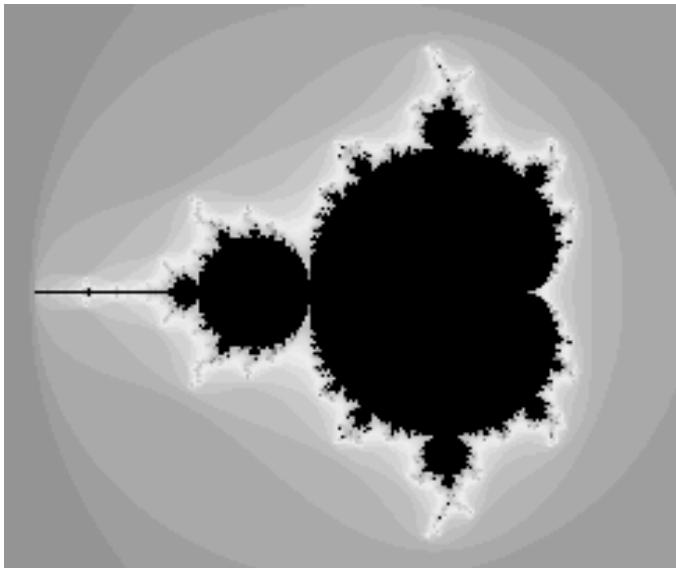

When you use the program, you can “zoom in” on small regions of the plane. To do so, just drag the mouse on the picture. This will draw a rectangle around part of the picture. When you release the mouse, the part of the picture inside the rectangle will be zoomed to fill the entire display. If you simply click a point in the picture, you will zoom in on the point where you click by a magnification factor of two. (Shift-click or use the right mouse button to zoom out instead of zooming in.) The interesting points are along the boundary of the Mandelbrot set. In fact, the boundary is infinitely complex. (Note that if you zoom in too far, you will exceed the capabilities of the double data type; nothing is done in the program to prevent this.)

Use the “MaxIterations” menu to increase the maximum number of iterations in the loop. Remember that black pixels might or might not be in the set; when you increase “MaxIterations,” you might find that a black region becomes filled with color. The “Palette” menu determines the set of colors that are used. Diferent palettes give very diferent visualizations of the set. The “PaletteLength” menu determines how many diferent colors are used. In the default setting, a diferent color is used for each possible value of count in the algorithm. Some times, you can get a much better picture by using a diferent number of colors. If the palette length is less than maxIterations, the palette is repeated to cover all the possible values of count; if the palette length is greater than maxIterations, only part of of the palette will be used. (If the picture is of an almost uniform color, try decreasing the palette length, since that makes the color vary more quickly as count changes. If you see what look like randomly colored dots instead of bands of color, try increasing the palette length.)

If you run the Mandelbrot Viewer program as a stand-alone application, it will have a “File” menu that can be used to save the picture as a PNG image file. You can also save a “param” file which simply saves the settings that produced the current picture. A param file can be read back into the program using the “Open” command.

The Mandelbrot set is named after Benoit Mandelbrot, who was the first person to note the incredible complexity of the set. It is astonishing that such complexity and beauty can arise out of such a simple algorithm.

## 12.5.2 Design of the Program

Most classes in Java are defined in packages. While we have used standard packages such as javax.swing and java.io extensively, all of my programming examples have been in the “default package,” which means that they are not declared to belong to any named package. However, when doing more serious programming, it is good style to create a package to hold the classes for your program. Sun Microsystems recommends that package names should be based on an Internet domain name of the organization that produces the package. My ofice computer has domain name eck.hws.edu, and no other computer in the world should have the same name. According to Sun, this allows me to use the package name edu.hws.eck, with the elements of the domain name in reverse order. I can also use sub-packages of this package, such as edu.hws.eck.mdb, which is the package name that I decided to use for my Mandelbrot Viewer application. No one else—or at least no one else who uses Sun’s naming convention—will ever use the same package name, so this package name uniquely identifies my program.

I briefly discussed using packages in Subsection 2.6.4. Here’s what you need to know for the Mandelbrot Viewer program: The program is defined in ten Java source code files. They can be found in the directory edu/hws/eck/mdb inside the source directory of the web site. (That is, they are in a directory named mdb, which is inside a directory named eck, which is inside hws, which is inside edu. The directory structure must follow the package name in this way.) The same directory also contains a file named strings.properties that is used by the program and that will be discussed below. For an Integrated Development Environment such as Eclipse, you should just have to add the edu directory to your project. To compile the files on the command line, you must be working in the directory that contains the edu directory. Use the command

or, if you use Windows,

javac edu\hws\eck\mdb\*.java

to compile the source code. The main routine for the stand-alone application version of the program is defined by a class named Main. To run this class, use the command:

java edu.hws.eck.mdb.Main

This command must also be given in the directory that contains the edu directory.

$$
* * *
$$

The work of computing and displaying images of the Mandelbrot set is done in Mandelbrot-Display.java. The MandelbrotDisplay class is a subclass of JPanel. It uses an of-screen canvas to hold a copy of the image. (See Subsection 12.1.1.) The paintComponent() method copies this image onto the panel. Then, if the user is drawing a “zoom box” with the mouse, the zoom box is drawn on top of the image. In addition to the image, the class uses a two-dimensional array to store the iteration count for each pixel in the image. If the range of xy-values changes, or if the size of the window changes, all the counts must be recomputed. Since the computation can take quite a while, it would not be acceptable to block the user interface while the computation is being performed. The solution is to do the computation in a separate thread. (See Section 8.5.) When the computation begins, the image is filled with gray. Every so often, about twice a second, the data that has been computed by the computation thread is gathered and applied to the of-screen canvas, and the part of the canvas that has been modified is copied to the screen. The user can continue to use the menus and even the mouse while the image is being computed. Actually, this simplifies things a bit, because there can be more than one computational thread. The program creates as many computational threads as there are available processors in the computer, and the task of computing the image is split among these threads. The algorithm that is used is essentially the same as the distributed algorithm from Subsection 11.5.3, except that in this case all the computational threads are on the same computer.

The file MandelbrotPanel.java defines the main panel of the Mandelbrot Viewer window. MandelbrotPanel is another subclass of JPanel. A MandelbrotPanel is mostly filled with a MandelbrotDisplay. It also adds a JLabel beneath the display. The JLabel is used as a “status bar” that shows some information that might be interesting to the user. The MandelbrotPanel also defines the program’s mouse listener. In addition to handling zooming, the mouse listener puts the x and y coordinates of the current mouse location in the status bar as the user moves or drags the mouse. Also, when the mouse exits the drawing area, the text in the status bar is set to read “Idle”. This is the first time that we have seen an actual use for mouseMoved and mouseExited events. (See Subsection 6.4.2 and Subsection 6.4.4.)

The menu bar for the program is defined in Menus.java. Commands in the “File” and “Control” menu are defined as Actions. (See Subsection 12.3.1.) Note that among the actions are file manipulation commands that use techniques from Subsection 11.2.3, Subsection 11.6.3, and Subsection 12.1.5. The “MaxIterations,” “Palette,” and “PaletteLength” menus each contain a group of JRadioButtonMenuItems. (See Subsection 12.3.3.) I have tried several approaches for handling such groups, and none of them have satisfied me completely. In this program, I have defined a nested class inside Menus to represent each group. For example, the PaletteManager class contains the menu items in the “Palette” menu as instance variables. It registers an action listener with each item, and it defines a few utility routines for operating on the menu. The classes for the three menus are very similar and should probably have been defined as subclasses of some more general class.

One interesting point is that the contents of the menu bar are diferent, depending on whether the program is being run as an applet or as a stand-alone application. Since applets cannot access the file system, there is no “File” menu for an applet. Furthermore, accelerator keys are generally not functional in an applet that is running on a web page, so accelerator keys are only added to menu items if the program is being run in its own window. (See Subsection 12.3.5 for information on accelerators.) To accomplish this, the constructor in the Menus class has parameters that tell it whether the menu bar will be used in an applet and whether it will be used in a frame, and these parameters are consulted as the menu bar is being built.

A third parameter to the constructor is the MandelbrotPanel that is being used in the program. Many of the menu commands operate on this panel or on the MandelbrotDisplay that it contains. In order to carry out these commands, the Menus object needs a reference to the MandelbrotPanel. As for the MandelbrotDisplay, the panel has a method getDisplay() that returns a reference to the display that it contains. So as long as the menu bar has a reference to the panel, it can obtain a reference to the display. In previous examples, everything was written as one large class file, so all the objects were directly available to all the code. When a program is made up of multiple interacting files, getting access to the necessary objects can be more of a problem.

MandelbrotPanel, MandelbrotDisplay, and Menus are the main classes that make up the Mandelbrot Viewer program. MandelbrotFrame.java defines a simple subclass of JFrame that runs the program in its own window. MandelbrotApplet.java defines an applet that runs the program on a web page. (This applet version has an extra “Examples” menu that is discussed in the source code file.) There are a few other classes that I will discuss below.

This brief discussion of the design of the Mandelbrot Viewer has shown that it uses a wide variety of techniques that were covered earlier in this book. In the rest of this section, we’ll look at a few new features of Java that were used in the program.

## 12.5.3 Internationalization

Internationalization refers to writing a program that is easy to adapt for running in diferent parts of the world. Internationalization is often referred to as I18n, where 18 is the number of letters between the “I” and the final “n” in “Internationalization.” The process of adapting the program to a particular location is called localization, and the locations are called locales. Locales difer in many ways, including the type of currency used and the format used for numbers and dates, but the most obvious diference is language. Here, I will discuss how to write a program so that it can be easily translated into other languages.

The key idea is that strings that will be presented to the user should not be coded into the program source code. If they were, then a translator would have to search through the entire source code, replacing every string with its translation. Then the program would have to be recompiled. In a properly internationalized program, all the strings are stored together in one or more files that are separate from the source code, where they can easily be found and translated. And since the source code doesn’t have to be modified to do the translation, no recompilation is necessary.

To implement this idea, the strings are stored in one or more properties files. A properties file is just a list of key/value pairs. For translation purposes, the values are strings that will be presented to the user; these are the strings that have to be translated. The keys are also strings, but they don’t have to be translated because they will never be presented to the user. Since they won’t have to be modified, the key strings can be used in the program source code. Each key uniquely identifies one of the value strings. The program can use the key string to look up the corresponding value string from the properties file. The program only needs to know the key string; the user will only see the value string. When the properties file is translated, the user of the program will see diferent value strings.

The format of a properties file is very simple. The key/value pairs take the form

key.string=value string

There are no spaces in the key string or before the equals sign. The value string can contain spaces or any other characters. If the line ends with a backslash (“\”), the value string can be continued on the next line; in this case, spaces at the beginning of that line are ignored. One unfortunate detail is that a properties file can contain only plain ASCII characters. The ASCII character set only supports the English alphabet. Nevertheless, a value string can include arbitrary UNICODE characters. Non-ASCII characters just have to be specially encoded. Sun Microsystems provides a program, native2ascii, that can convert files that use non-ASCII characters into a form that is suitable for use as a properties file.

Suppose that the program wants to present a string to the user (as the name of a menu command, for example). The properties file would contain a key/value pair such as

menu.saveimage=Save PNG Image...

where “Save PNG Image. . . ” is the string that will appear in the menu. The program would use the key string, “menu.saveimage”, to look up the corresponding value string and would then use the value string as the text of the menu item. In Java, the look up process is supported by the ResourceBundle class, which knows how to retrieve and use properties files. Sometimes a string that is presented to the user contains substrings that are not known until the time when the program is running. A typical example is the name of a file. Suppose, for example, that the program wants to tell the user, “Sorry, the file, filename, cannot be loaded”, where filename is the name of a file that was selected by the user at run time. To handle cases like this, value strings in properties files can include placeholders that will be replaced by strings to be determined by the program at run time. The placeholders take the form “{0}”, “{1}”, “{2}”, . . . . For the file error example, the properties file might contain:

error.cantLoad=Sorry, the file, {0}, cannot be loaded

The program would fetch the value string for the key error.cantLoad. It would then substitute the actual file name for the placeholder, “{0}”. Note that when the string is translated, the word order might be completely diferent. By using a placeholder for the file name, you can be sure that the file name will be put in the correct grammatical position for the language that is being used. Placeholder substitution is not handled by the ResourceBundle class, but Java has another class, MessageFormat, that makes such substitutions easy.

For the Mandelbrot Viewer program, the properties file is strings.properties. (Any properties file should have a name that ends in “.properties”.) Any string that you see when you run the program comes from this file. For handling value string lookup, I wrote I18n.java. The I18n class has a static method

public static tr( String key, Object... args )

that handles the whole process. Here, key is the key string that will be looked up in strings.properties. Additional parameters, if any, will be substituted for placeholders in the value string. (Recall that the formal parameter declaration “Object...” means that there can be any number of actual parameters after key; see Subsection 7.2.6.) Typical uses would include:

String saveImageCommandText = I18n.tr( "menu.saveimage" );

String errMess = I18n.tr( "error.cantLoad" , selectedFile.getName() );

You will see function calls like this throughout the Mandelbrot Viewer source code. The I18n class is written in a general way so that it can be used in any program. As long as you provide a properties file as a resource, the only things you need to do are change the resource file name in I18n.java and put the class in your own package.

It is actually possible to provide several alternative properties files in the same program. For example, you might include French and Japanese versions of the properties file along with an English version. If the English properties file is named string.properties, then the names for the French and Japanese versions should be strings fr.properties and strings ja.properties. Every language has a two-letter code, such as “fr” and “ja”, that is used in constructing properties file names for that language. The program asks for the properties file using the simple name “string”. If the program is being run on a Java system in which the preferred language is French, the program will try to load “string fr.properties”; if that fails, it will look for “strings.properties”. This means that the program will use the French properties files in a French locale; it will use the Japanese properties file in a Japanese locale; and in any other locale it will use the default properties file.

## 12.5.4 Events, Events, Events

We have worked extensively with mouse events, key events, and action events, but these are only a few of the event types that are used in Java. The Mandelbrot Viewer program makes use of several other types of events. It also serves as an example of the benefits of event-oriented programming.

Let’s start from the following fact: The MandelbrotDisplay class knows nothing about any of the other classes that make up the program (with the single exception of one call to the internationalization method I18n.tr). Yet other classes are aware of things that are going on in the MandelbrotDisplay class. For example, when the size of the display is changed, the new size is reported in the status bar that is part of the MandelbrotPanel class. In the Menus class, certain menus are disabled when the display begins the computation of an image and are re-enabled when the computation completes. The display doesn’t call methods in the MandelbrotPanel or Menus classes, so how do these classes get their information about what is going on in the display? The answer, of course, is events. The MandelbrotDisplay object emits events of various types when various things happen. The MandelbrotPanel and MandelbrotDisplay objects set up listeners that hear those events and respond to them.

The point is that because events are used for communication, the MandelbrotDisplay class is not strongly coupled to the other classes. In fact, it can be used in other programs without any modification and without access to the other classes. The alternative to using events would be to have the display object call methods such as displaySizeChanged() or computationStarted() in the MandelbrotPanel and MandelbrotFrame objects to tell them what is going on in the display. This would be strong coupling: Any programmer who wanted to use MandelbrotDisplay would also have to use the other two classes or would have to modify the display class so that it no longer refers to the other classes. Of course, not everything can be done with events and not all strong coupling is bad: The MandelbrotPanel class refers directly to the MandelbrotDisplay class and cannot be used without it—but since the whole purpose of a MandelbrotPanel is to hold a MandelbrotDisplay, the coupling is not a problem.

The Mandelbrot Viewer program responds to mouse events on the display. These events are generated by the display object, but the display class itself doesn’t care about mouse events and doesn’t do anything in response to them. Mouse events are handled by a listener in the MandelbrotPanel, which responds to them by zooming the display and by showing mouse coordinates in the status bar.

The staus bar also shows the new size of the display whenever that size is changed. To handle this, events of type ComponentEvent are used. When the size of a component is changed, a ComponentEvent is generated. In the Mandelbrot Viewer program, a ComponentListener in the MandelbrotPanel class listens for size-change events in the display. When one occurs, the listener responds by showing the new size in the status bar; the display knows nothing about the status bar that shows the display’s size.

Component events are also used internally in the MandelbrotDisplay class in an interesting way. When the user dynamically changes the size of the display, its size can change several times each second. Normally, a change of display size would trigger the creation of a new ofscreen canvas and the start of a new asynchronous computation of the image. However, doing this is a big deal, not something I want to do several times in a second. If you try resizing the program’s window, you’ll notice that the image doesn’t change size dynamically as the window size changes. The same image and of-screen canvas are used as long as the size is changing. Only about one-third of a second after the size has stopped changing will a new, resized image be produced. Here is how this works: The display sets up a ComponentEvent to listen for resize events on itself. When a resize occurs, the listener starts a Timer that has a delay of 1/3 second. (See Subsection 6.5.1.) While this timer is running, the paintComponent() method does not resize the image; instead, it reuses the image that already exists. If the timer fires 1/3 second later, the image will be resized at that time. However, if another resize event occurs while the first timer is running, then the first timer will be stopped before it has a chance to fire, and a new timer will be started with a delay of 1/3 second. The result is that the image does not get resized until 1/3 second after the size of the window stops changing.

The Mandelbrot Viewer program also uses events of type WindowEvent, which are generated by a window when it opens or closes (among other things). One example is in the file Launcher-Applet.java. This file defines an applet that appears as a button on the web page. The button is labeled “Launch Mandelbrot Viewer”. When the user clicks the button, a MandelbrotFrame is opened on the screen, and the text on the button changes to “Close Mandelbrot Viewer”. When the frame closes, the button changes back to “Launch Mandelbrot Viewer”, and the button can be used to open another window. The frame can be closed by clicking the button, but it can also be closed using a “Close” command in the frame’s menu bar or by clicking the close box in the frame’s title bar. The question is, how does the button’s text get changed when the frame is closed by one of the latter two methods? One possibility would be to have the frame call a method in the applet to tell the applet that it is closing, but that would tightly couple the frame class to the applet class. In fact, it’s done with WindowEvents. A WindowListener in the applet listens for close events from the frame. In response to a close event, the text of the button is changed. Again, this can happen even though the frame class knows nothing about the applet class. Window events are also used by Main.java to trigger an action that has to be taken when the program is ending; this will be discussed below.

Perhaps the most interesting use of events in the Mandelbrot Viewer program is to enable and disable menu commands based on the status of the display. For this, events of type PropertyChangeEvent are used. This event class is part of the “bean” framework that was discussed briefly in Subsection 11.6.2, and class PropertyChangeEvent and related classes are defined in the package java.beans. The idea is that bean objects are defined by their “properties” (which are just aspects of the state of the bean). When a bean property changes, the bean can emit a PropertyChangeEvent to notify other objects of the change. Properties for which property change events are emitted are known technically as bound properties. A bound property has a name that identifies that particular property among all the properties of the bean. When a property change event is generated, the event object includes the name of the property that has changed, the previous value of the property, and the new value of the property.

The MandelbrotDisplay class has a bound property whose name is given by the constant MandelbrotDisplay.STATUS PROPERTY. A display emits a property change event when its status changes. The possible values of the status property are given by other constants, such as MandelbrotDisplay.STATUS READY. The READY status indicates that the display is not currently running a computation and is ready to do another one. There are several menu commands that should be enabled only when the status of the display is READY. To implement this, the Menus class defines a PropertyChangeListener to listen for property change events from the display. When this listener hears an event, it responds by enabling or disabling menu commands according to the new value of the status property.

All of Java’s GUI components are beans and are capable of emitting property change events. In any subclass of Component, this can be done simply by calling the method

```java
public void firePropertyChange(String propertyName,
                                      Object oldValue, Object newValue)
```

For example, the MandelbrotDisplay class uses the following method for setting its current status:

```groovy
private void setStatus(String status) {
    if (status == this.status) {
        // Note: Event should be fired only if status actually changes.
        return;
    }
    String oldStatus = this.status;
    this.status = status;
    propertyChange(STATUS_PROPERTY, oldStatus, status);
}
```

When writing bean classes from scratch, you have to add support for property change events, if you need them. To make this easier, the java.beans package provides the PropertyChange-Support class.

## 12.5.5 Custom Dialogs

Java has several standard dialog boxes that are defined in the classes JOptionPane, JColor-Chooser, and JFileChooser. These were introduced in Subsection 6.8.2 and Subsection 11.2.3. Dialogs of all these types are used in the Mandelbrot Viewer program. However, sometimes other types of dialog are needed. In such cases, you can build a custom dialog box.

Dialog boxes are defined by subclasses of the class JDialog. Like frames, dialog boxes are separate windows on the screen, and the JDialog class is very similar to the JFrame class. The big diference is that a dialog box has a parent, which is a frame or another dialog box that “owns” the dialog box. If the parent of a dialog box closes, the dialog box closes automatically. Furthermore, the dialog box will probably “float” on top of its parent, even when its parent is the active window.

Dialog boxes can be either modal or modeless. When a modal dialog is put up on the screen, the rest of the application is blocked until the dialog box is dismissed. This is the most common case, and all the standard dialog boxes are modal. Modeless dialog boxes are more like independent windows, since they can stay on the screen while the user interacts with other windows. There are no modeless dialogs in the Mandelbrot Viewer program.

The Mandelbrot Viewer program uses two custom dialog boxes. They are used to implement the “Set Image Size” and “Set Limits” commands and are defined by the files SetImageSizeDialog.java and SetLimitsDialog.java. The “set image size” dialog lets the user enter a new width and height for the Mandelbrot image. The “set limits” dialog lets the user input the minimum and maximum values for x and y that are shown in the image. The two dialog classes are very similar. In both classes, several JTextFields are used for user input. Two buttons named “OK” and “Cancel” are added to the window, and listeners are set up for these buttons. If the user clicks “OK”, the listener checks whether the inputs in the text fields are legal; if not, an error message is displayed to the user and the dialog stays on the screen. If the input is legal when the user clicks “OK”, the dialog is disposed. The dialog is also disposed if the user clicks “Cancel” or clicks the dialog box’s close box. The net efect is that the dialog box stays on the screen until the user either cancels the dialog or enters legal values for the inputs and clicks “OK”. The user can find out which of these occurred by calling a method named getInput() in the dialog object after showing the dialog. This method returns null if the dialog was canceled; otherwise it returns the user input.

To make my custom dialog boxes easy to use, I added a static showDialog() method to each dialog class. When this function is called, it shows the dialog, waits for it to be dismissed, and then returns the value of the getInput() method. This makes it possible to use my custom dialog boxes in much the same way as Java’s standard dialog boxes are used.

Custom dialog boxes are not dificult to create and to use, if you already know about frames. I will not discuss them further here, but you can look at the source code file SetImageSizeDialog.java as a model.

## 12.5.6 Preferences

Most serious programs allow the user to set preferences. A preference is really just a piece of the program’s state that is saved between runs of the program. In order to make preferences persistent from one run of the program to the next, the preferences could simply be saved to a file in the user’s home directory. However, there would then be the problem of locating the file. There would be the problem of naming the file in a way that avoids conflicts with file names used by other programs. And there would be the problem of cluttering up the user’s home directory with files that the user shouldn’t even have to know about.

To deal with these problems, Java has a standard means of handling preferences. It is defined by the package java.util.prefs. In general, the only thing that you need from this package is Preferences.

In the Mandelbrot Viewer program, the file Main.java has an example of using Preferences. Main.java runs the stand-alone application version of the program, and its use of preferences applies only when the program is run in that way.

In most programs, the user sets preferences in a custom dialog box. However, the Mandelbrot program doesn’t have any preferences that are appropriate for that type of treatment. Instead, as an example, I automatically save a few aspects of the program’s state as preferences. Every time the program starts up, it reads the preferences, if any are available. Every time the program terminates, it saves the preferences. (Saving the preferences poses an interesting problem because the program ends when the MandelbrotFrame window closes, not when the main() routine ends. In fact, the main() routine ends as soon as the window appears on the screen. So, it won’t work to save the preferences at the end of the main program. The solution is to use events: A listener listens for WindowEvents from the frame. When a window-closed event is received, indicating that the program is ending, the listener saves the preferences.)

Preferences for Java programs are stored in some platform-dependent form in some platform dependent location. As a Java programmer, you don’t have to worry about it; the Java pref erences system knows where to store the data. There is still the problem of identifying the preferences for one program among all the possible Java programs that might be running on a computer. Java solves this problem in the same way that it solves the package naming problem. In fact, by convention, the preferences for a program are identified by the package name of the program, with a slight change in notation. For example, the Mandelbrot Viewer program is defined in the package edu.hws.eck.mdb, and its preferences are identified by the string “/edu/hws/eck/mdb”. (The periods have been changed to “/”, and an extra “/” has been added at the beginning.)

The preferences for a program are stored in something called a “node.” The user preferences node for a given program identifier can be accessed as follows:

Preferences root = Preferences.userRoot();

Preferences node = root.node(pathName);

where pathname is the string, such as “/edu/hws/eck/mdb”, that identifies the node. The node itself consists of a simple list of key/value pairs, where both the key and the value are strings. You can store any strings you want in preferences nodes—they are really just a way of storing some persistent data between program runs. In general, though, the key string identifies some particular preference item, and the associated value string is the value of that preference. A Preferences object, node, contains methods node.get(key) for retrieving the value string associated with a given key and node.put(key,value) for setting the value string for a given key.

In Main.java, I use preferences to store the shape and position of the program’s window. This makes the size and shape of the window persistent between runs of the program; when you run the program, the window will be right where you left it the last time you ran it. I also store the name of the directory that is currently selected in the file dialog box that is used by the program for the Save and Open commands. This is particularly satisfying, since the default behavior for a file dialog box is to start in the user’s home directory, which is hardly ever the place where the user wants to keep a program’s files. With the preferences feature, I can switch to the right directory the first time I use the program, and from then on I’ll automatically be back in that directory when I use the program. You can look at the source code in Main.java for the details.

$$
* * *
$$

And that’s it. . . . There’s a lot more that I could say about Java and about programming in general, but this book is only “An Introduction to Programming with Java,” and it’s time for our journey to end. I hope that it has been a pleasant journey for you, and I hope that I have helped you establish a foundation that you can use as a basis for further exploration.

## Exercises for Chapter 12

1. The sample program PaintWithOfScreenCanvas.java from Section 12.1 is a simple paint program. Make two improvements to this program: First, add a “File” menu that lets the user open an image file and save the current image in either PNG or JPEG format. Second, add a basic one-level “Undo” command that lets the user undo the most recent operation that was applied to the image. (Do not try to make a multilevel Undo, which would allow the user to undo several operations.)

When you read a file into the program, you should copy the image that you read into the program’s of-screen canvas. Since the canvas in the program has a fixed size, you should scale the image that you read so that it exactly fills the canvas.

2. For this exercise, you should continue to work on the program from the previous exercise. Add a “StrokeWidth” menu that allows the user to draw lines of varying thicknesses. Make it possible to use diferent colors for the interior of a filled shape and for the outline of that shape. To do this, change the “Color” menu to “StrokeColor” and add a “Fill-Color” menu. (My solution adds two new tools, “Stroked Filled Rectangle” and “Stroked Filled Oval”, to represent filled shapes that are outlined with the current stroke.) Add support for filling shapes with transparent color. A simple approach to this is to use a JCheckboxMenuItem to select either fully opaque or 50% opaque fill. (Don’t try to apply transparency to stokes—it’s dificult to make transparency work correctly for the Curve tool, and in any case, shape outlines look better if they are opaque.) Finally, make the menus more user friendly by adding some keyboard accelerators to some commands and by using JRadioButtonMenuItems where appropriate, such as in the color and tool menus. This exercise takes quite a bit of work to get it all right, so you should tackle the problem in pieces.

3. The StopWatchLabel component from Subsection 12.4.5 displays the text “Timing. . . ” when the stop watch is running. It would be nice if it displayed the elapsed time since the stop watch was started. For that, you need to create a Timer. (See Subsection 6.5.1.) Add a Timer to the original source code, StopWatchLabel.java, to drive the display of the elapsed time in seconds. Create the timer in the mousePressed() routine when the stop watch is started. Stop the timer in the mousePressed() routine when the stop watch is stopped. The elapsed time won’t be very accurate anyway, so just show the integral number of seconds. You only need to set the text a few times per second. For my Timer method, I use a delay of 200 milliseconds for the timer.

4. The custom component example MirrorText.java, from Subsection 12.4.5, uses an ofscreen canvas to show mirror-reversed text in a JPanel. An alternative approach would be to draw the text after applying a transform to the graphics context that is used for drawing. (See Subsection 12.2.5.) With this approach, the custom component can be defined as a subclass of JLabel in which the paintComponent() method is overridden. Write a version of the MirrorText component that takes this approach. The solution is very short, but tricky. Note that the scale transform g2.scale(-1,1) does a left-right reflection through the left edge of the component.

5. The sample program PhoneDirectoryFileDemo.java from Subsection 11.3.2 keeps data for a “phone directory” in a file in the user’s home directory. Exercise 11.5 asked you to revise that program to use an XML format for the data. Both programs have a simple command-line user interface. For this exercise, you should provide a GUI interface for the phone directory data. You can base your program either on the original sample program or on the modified version from the exercise. Use a JTable to hold the data. The user should be able to edit all the entries in the table. Also, the user should be able to add and delete rows. Include either buttons or menu commands that can be used to perform these actions. The delete command should delete the selected row, if any. New rows should be added at the end of the table. For this program, you can use a standard DefaultTableModel.

Your program should load data from the file when it starts and save data to the file when it ends, just as the two previous programs do. For a GUI program, you can’t simply save the data at the end of the main() routine, since main() terminates as soon as the window shows up on the screen. You want to save the data when the user closes the window and ends the program. There are several approaches. One is to use a WindowListener to detect the event that occurs when the window closes. Another is to use a “Quit” command to end the program; when the user quits, you can save the data and close the window (by calling its dispose() method), and end the program. If you use the “Quit” command approach, you don’t want the user to be able to end the program simply by closing the window. To accomplish this, you should call

frame.setDefaultCloseOperation(JFrame.DO NOTHING ON CLOSE);

where frame refers to the JFrame that you have created for the program’s user interface. When using a WindowListener, you want the close box on the window to close the window, not end the program. For this, you need

frame.setDefaultCloseOperation(JFrame.DISPOSE ON CLOSE);

When the listener is notified of a window closed event, it can save the data and end the program.

Most of the JTable and DefaultTableModel methods that you need for this exercise are discussed in Subsection 12.4.3, but there are a few more that you need to know about. To determine which row is selected in a JTable, call table.getSelectedRow(). This method returns the row number of the selected row, or returns -1 if no row is selected. To specify which cell is currently being edited, you can use:

table.setRowSelectionInterval(rowNum, rowNum); // Selects row number rowNum. table.editCellAt( rowNum, colNum ); // Edit cell at position (rowNum,colNum). phoneTable.getEditorComponent().requestFocus(); // Put input cursor in cell.

One particularly troublesome point is that the data that is in the cell that is currently being edited is not in the table model. The value in the edit cell is not put into the table model until after the editing is finished. This means that even though the user sees the data in the cell, its not really part of the table data yet. If you lose that data, the user would be justified in complaining. To make sure that you get the right data when you save the data at the end of the program, you have to turn of editing before retrieving the data from the model. This can be done with the following method:

```java
private void stopEditing() {
    if (table.getCellEditor() != null)
        table.getCellEditor().stopCellEditing();
}
```

This method must also be called before modifying the table by adding or deleting rows; if such modifications are made while editing is in progress, the efect can be very strange.

## Quiz on Chapter 12

1. Describe the object that is created by the following statement, and give an example of how it might be used in a program:

BufferedImage OSC = new BufferedImage(32,32,BufferedImage.TYPE INT RGB);

2. Many programs depend on resource files. What is meant by a resource in this sense? Give an example.

3. What is the FontMetrics class used for?

4. If a Color, c, is created as c = new Color(0,0,255,125), what is efect of drawing with this color?

5. What is antialiasing?

6. How is the ButtonGroup class used?

7. What does the acronym MVC stand for, and how does it apply to the JTable class?

8. Describe the picture that is produced by the following paintComponent() method:

```java
public void paintComponent(Graphics g) {
    super.paintComponent(g);
    Graphics2D g2 = (Graphics2D)g;
    g2.translate( getWidth()/2, getHeight()/2 );
    g2.rotate( 30 * Math.PI / 180 );
    g2.fillRect(0,0,100,100);
}
```

9. What is meant by Internationalization of a program?

10. Suppose that the class that you are writing has an instance method doOpen() (with no parameters) that is meant to be used to open a file selected by the user. Write a code segment that creates an Action that represents the action of opening a file. Then show how to create a button and a menu item from that action.

## Appendix: Source Files

This section contains a list of the examples appearing in the free, on-line textbook Introduction to Programming Using Java, Version 5.0. You should be able to compile these files and use them. Note however that some of these examples depend on other source files, such as TextIO.java and MosaicPanel.java, that are not built into Java. These are classes that I have written. Links to all necessary non-standard source code files are provided below. To use examples that depend on my classes, you will need to compile the source code for the required classes and place the compiled classes in the same directory with the main class file. If you are using an integrated development environment such as Eclipse, you can simply add any required source code files to your project.

Most of the solutions to end-of-chapter exercises are not listed in this section. Each endof-chapter exercise has its own Web page, which discusses its solution. The source code of a sample solution of each exercise is given in full on the solution page for that exercise. If you want to compile the solution, you should be able to cut-and-paste the solution out of a Web browser window and into a text editing program. (You can’t cut-and-paste from the HTML source of the solution page, since it contains extra HTML markup commands that the Java compiler won’t understand; the HTML markup does not appear when the page is displayed in a Web browser.)

Note that many of these examples require Java version 5.0 or later. Some of them were written for older versions, but will still work with current versions. When you compile some of these older programs with current versions of Java, you might get warnings about “deprecated” methods. These warnings are not errors. When a method is deprecated, it means that it should not be used in new code, but it has not yet been removed from the language. It is possible that deprecated methods might be removed from the language at some future time, but for now you just get a warning about using them.

## Part 1: Text-oriented Examples

Many of the sample programs in the text are based on console-style input/output, where the computer and the user type lines of text back and forth to each other. Some of these programs use the standard output object, System.out, for output. Many of them use my non-standard class, TextIO, for both input and output. For the programs that use TextIO, one of the files TextIO.java or TextIO.class must be available when you compile the program, and TextIO.class must be available when you run the program. There is also a GUI version of TextIO; you can find information about it at the end of Part 4, below.

The programs listed here are stand-alone applications, not applets, but I have written applets that simulate many of the programs. These “console applets” appear on Web pages in the on-line version of this textbook. They are based on TextIOApplet.java, which provides the same methods as TextIO, but in an applet instead of in a stand-alone application. It is straightforward to convert a TextIO program to a TextIOApplet applet. See the comments in the TextIOApplet.java file for information about how to do it. One example of this can be found in the file Interest3Console.java.

• Interest.java, from Section 2.2, computes the interest on a specific amount of money over a period of one year.

• TimedComputation.java, from Section 2.3, demonstrates a few basic built-in subroutines and functions.

• EnumDemo.java, from Section 2.3, a very simple first demonstration of enum types.

• PrintSquare.java, from Section 2.4, reads an integer typed in by the user and prints the square of that integer. This program depends on TextIO.java.

• Interest2.java, from Section 2.4, calculates interest on an investment for one year, based on user input. This program depends on TextIO.java. The same is true for almost all of the programs in the rest of this list.

• CreateProfile.java, from Section 2.4, a simple demo of output to a file, using TextIO.

• Interest3.java, from Section 3.1, the first example that uses control statements.

• ThreeN1.java, from Section 3.2, outputs a 3N+1 sequence for a given stating value.

• ComputeAverage.java, from Section 3.3, computes the average value of some integers entered by the user.

• CountDivisors.java, from Section 3.4, counts the number of divisors of an integer entered by the user.

• ListLetters.java, from Section 3.4, lists all the distinct letters in a string entered by the user.

• LengthConverter.java, from Section 3.5, converts length measurements input by the user into diferent units of measure.

• ReadNumbersFromFile.java, from Section 3.7, finds the sum and the average of numbers read from a file. Demonstrates try..catch statements.

• GuessingGame.java, from Section 4.2, lets the user play guessing games where the computer picks a number and the user tries to guess it. A slight variation of this program, which reports the number of games won by the user, is GuessingGame2.java.

• RowsOfChars.java, from Section 4.3, a rather useless program in which one subroutine calls another.

• ThreeN2.java, from Section 4.4, is an improved 3N+1 program that uses subroutines and prints its output in neat columns.

• HighLow.java, from Section 5.4, a simple card game. It uses the classes Card.java and Deck.java, which are given as examples of object-oriented programming. Also available, the card-related classes Hand.java and, from Subsection 5.5.1, BlackjackHand.java.

• BirthdayProblemDemo.java, from Section 7.2, demonstrates random access to array elements using the “birthday problem” (how many people do you have to choose at random until two are found whose birthdays are on the same day of the year).

• ReverseInputNumbers.java, from Section 7.3, is a short program that illustrates the use of a partially full array by reading some numbers from the user and then printing them in reverse order.

• ReverseWithDynamicArray.java, from Section 7.3, reads numbers from the user then prints them out in reverse order. It does this using the class DynamicArrayOfInt.java as an example of using dynamic arrays.

• LengthConverter2.java, from Section 8.2, converts measurements input by the user to inches, feet, yards, and miles. This improvement on LengthConverter.java allows inputs combining several measurements, such as “3 feet 7 inches,” and it detects illegal inputs.

• LengthConverter3.java, from Section 8.3, a revision of the previous example that uses exceptions to handle errors in the user’s input.

• ThreadTest1.java, from Section 8.5, runs several threads all computing the same task to test whether there is any speedup when more than one thread is used.

• ThreadTest2.java, from Section 8.5, divides a task among several threads and combines the results from all the threads. Also shows how to wait for all threads to finish. And Thread-Test3.java from the same section performs the same task but uses the producer/consumer pattern for communication between threads.

• TowersOfHanoi.java, from Section 9.2, prints out the steps in a solution to the Towers of Hanoi problem; an example of recursion.

• StringList.java, from Section 9.2, implements a linked list of strings. The program List-Demo.java tests this class.

• PostfixEval.java, from Section 9.3, evaluates postfix expressions using a stack. Depends on the StackOfDouble class defined in StackOfDouble.java.

• SortTreeDemo.java, from Section 9.4, demonstrates a binary sort tree of strings.

• SimpleParser1.java, from Section 9.5, evaluates fully parenthesized expressions input by the user.

• SimpleParser2.java, from Section 9.5, evaluates ordinary infix expressions input by the user.

• SimpleParser3.java, from Section 9.5, reads infix expressions input by the user and constructs expression trees that represent those expressions.

• WordListWithTreeSet.java, from Section 10.2, makes an alphabetical list of words from a file. A TreeSet is used to eliminate duplicates and sort the words.

• SimpleInterpreter.java, from Section 10.4, demonstrates the use of a HashMap as a symbol table in a program that interprets simple commands from the user.

• WordCount.java, from Section 10.4, counts the number of occurrences of each word in a file. The program uses several features from the Java Collection Framework.

• ReverseFile.java, from Section 11.2, shows how to read and write files in a simple command-line application; uses the non-standard class TextReader.java.

• DirectoryList.java, from Section 11.2, lists the contents of a directory specified by the user; demonstrates the use of the File class.

• CopyFile.java, from Section 11.3, is a program that makes a copy of a file, using file names that are given as command-line arguments.

• PhoneDirectoryFileDemo.java, from Section 11.3, demonstrates the use of a file for storing data between runs of a program.

• ShowMyNetwork.java, mentioned in Section 11.4, is a short program that prints information about each network interface on the computer where it is run, including IP addresses associated with each interface.

• DateClient.java and DateServer.java, from Section 11.4, are very simple first examples of network client and server programs.

• CLChatClient.java and CLChatServer.java, from Section 11.4, demonstrate two-way communication over a network by letting users send messages back and forth; however, no threading is used and the messages must strictly alternate.

• CLMandelbrotMaster.java, CLMandelbrotWorker.java, and CLMandelbrotTask.java, from Section 11.5, are a demonstration of distributed computing in which pieces of a large computation are sent over a network to be computed by “worker” programs.

## Part 2: Graphical Examples from the Text

The following programs use a graphical user interface. The majority of them can be run both as stand-alone applications and as applets. (If you have downloaded the web site for this book, note that most of the jar files for Chapter 6 and Chapter 12 are executable jar files which can be be run as applications.)

• GUIDemo.java is a simple demonstration of some basic GUI components from the Swing graphical user interface library. It appears in the text in Section 1.6, but you won’t be able to understand it until you learn about GUI programming.

• StaticRects.java is a rather useless applet that simply draws a static image. It is the first example of GUI programming, in Section 3.8.

• MovingRects.java, also from Section 3.8, draws an animated version of the image in the preceding example. This applet depends on SimpleAnimationApplet2.java, which is a simple framework for writing animated applets.

• RandomMosaicWalk.java, a standalone program that displays a window full of colored squares with a moving disturbance, from Section 4.6. This program depends on Mosaic-Canvas.java and Mosaic.java.

• RandomMosaicWalk2.java is a version of the previous example, modified to use a few named constants. From Section 4.7.

• ShapeDraw.java, from Section 5.5, is an applet that lets the user place various shapes on a drawing area; an example of abstract classes, subclasses, and polymorphism.

• HelloWorldGUI1.java and HelloWorldGUI2.java, from Section 6.1, show the message “Hello World” in a window, the first one by using the built-in JOptionPane class and the second by building the interface “by hand.” Another variation, HelloWorldGUI4.java, from Section 6.4, uses anonymous nested classes where HelloWorldGUI1.java uses named nested classes.

• HelloWorldApplet.java, from Section 6.2, defines an applet that displays the message “Hello World” or “Goodbye World”. The message changes when the user clicks a button.

• HelloWorldPanel.java, from Section 6.2, is a panel that displays a message. The panel is used as the content pane both in the applet HelloWorldApplet2.java and in the window of the stand-alone application HelloWorldGUI3.java. This example illustrates the technique of using the same panel class in both an applet and a stand-alone application, a technique that will be used in many examples in the rest of the book.

• ColorChooserApplet.java, used in Section 6.3 to demonstrate RGB and HSB colors. This old applet uses the AWT rather than Swing for its user interface. Since it is not presented as a programming example, it has not been revised.

• RandomStringsApplet.java, from Section 6.3, shows 25 copies of the string “Java!” (or some other string specified in an applet param) in random colors and fonts. The applet uses RandomStringsPanel.java for its content pane, and there is a stand-alone application RandomStringsApp.java that uses the same panel class.

• ClickableRandomStringsApp.java, from Section 6.4, is similar to RandomStringsApp.java except that the window is repainted when the user clicks the window. This is a first example of using a mouse listener. The applet version is ClickableRandomStringsApplet.java.

• SimpleStamper.java, from Section 6.4, lets the user place rectangles and ovals on a drawing area by clicking with the mouse. The applet version is SimpleStamperApplet.java. Both versions use SimpleStamperPanel.java for their content panes.

• SimpleTrackMouse.java, from Section 6.4, shows information about mouse events. The applet version is SimpleTrackMouseApplet.java. Both versions use SimpleTrackMousePanel.java for their content panes.

• SimplePaint.java, from Section 6.4, lets the user draw curves in a drawing area and select the drawing color from a palette. The class SimplePaint can be used either as as applet or as a stand-alone application.

• RandomArtPanel.java, from Section 6.5, shows a new random “artwork” every four seconds. This is an example of using a Timer. Used in an applet version of the program, RandomArtApplet.java, and a stand-alone application version, RandomArt.java.

• KeyboardAndFocusDemo.java, from Section 6.5, shows how to use keyboard and focus events. This class can be run either has an applet or as a stand-alone application.

• SubKillerPanel.java, from Section 6.5, lets the user play a simple game. Uses a timer as well as keyboard and focus events. The applet version is SubKillerApplet.java, and the stand-alone application version is SubKiller.java.

• SliderDemo.java, a simple demo from Section 6.6, is an applet that shows three JSliders.

• TextAreaDemo.java, from Section 6.6, is an applet that demonstrates a JTextArea in a JScrollPane.

• BorderDemo.java, from Section 6.7, a very simple applet that demonstrates six types of border.

• SliderAndComboBoxDemo.java, from Section 6.7, shows how to create several components and lay them out in a GridLayout. Can be used either as an applet or as a stand-alone application.

• SimpleCalc.java, from Section 6.7, lets the user add, subtract, multiply, or divide two numbers input by the user. A demo of text fields, buttons, and layout with nested subpanels. Can be used either as an applet or as a stand-alone application.

• NullLayoutDemo.java, from Section 6.7, shows how to lay out the components in a container for which the layout manager has been set to null. Can be used either as an applet or as a stand-alone application.

• HighLowGUI.java, from Section 6.7, is a GUI version of HighLow.java, a game where the user sees a playing card and guesses whether the next card will be higher or lower in value. This program also requires Card.java, Hand.java, and Deck.java. Can be used as a standalone application and also contains a nested class HighLowGUI.Applet that represents the applet version of the program

• MosaicDrawController.java, from Section 6.8, demonstrates menus and a color chooser dialog. This is used in a program where the user colors the squares of a mosaic by clicking-and-dragging the mouse. It uses MosaicPanel.java to define the mosaic panel itself. MosaicDrawController is used in the stand-alone application MosaicDrawFrame.java, in the applet MosaicDrawApplet.java, and in the applet MosaicDrawLauncherApplet.java. The latter applet appears as a button on a web page; clicking the button opens a Mosaic-DrawFrame.

• SimpleDialogDemo.java, from Section 6.8, is an applet that demonstrates JColorChooser and some dialogs from JOptionPane.

• RandomStringsWithArray.java, from Section 7.2, shows 25 copies of a message in random colors, sizes, and positions. This is an improved version of RandomStringsPanel.java that uses an array to keep track of the data, so that the same picture can be redrawn whenever necessary. (Written only as an applet.)

• SimpleDrawRects.java, from Section 7.3, lets the user place colored rectangles in a drawing area. Illustrates the use of an ArrayList. An applet version is SimpleDrawRectsApplet.java. This program uses and depends on RainbowPalette.java.

• SimplePaint2.java, from Section 7.3, lets the user draw colored curves and stores the data needed for repainting the drawing surface in a list of type ArrayList<CurveData>.

• Checkers.java, from Section 7.5, lets two users play a game of checkers against each other. Illustrates the use of a two-dimensional array. (This is the longest program in the book so far, at over 750 lines!)

• Blobs.java, from Section 9.1, recursively counts groups of colored squares in a grid.

• DepthBreadth.java, from Section 9.3, demonstrates stacks and queues.

• TrivialEdit.java, from Section 11.3, lets the user edit short text files. This program demonstrates reading and writing files and using file dialogs.

• SimplePaintWithFiles.java, from Section 11.3, demonstrates saving data from a program to a file in both binary and character form. The program is a simple sketching program based on SimplePaint2.java.

• ChatSimulation.java, from Section 11.5 (on-line version only), is an applet that simulates a network chat. There is no networking in this applet. The only point is to demonstrate how a thread could be used to process (simulated) incoming messages.

• GUIChat.java, from Section 11.5, is a simple GUI program for chatting between two people over a network.

• BuddyChat.java, BuddyChatServer.java, BuddyChatWindow.java, and BuddyChatServer-Shutdown.java, from Section 11.5, represent a multithreaded server and a client program for the service that it ofers. The BuddyChatServer program is a non-GUI server that keeps a list of connected clients. These clients are available to chat to other clients. The client program is BuddyChat. Each client connects to the server and gets a list of other clients that are connected. A BuddyChat user can request a connection to one of the other clients in the list; when a connection is made, a pair of BuddyChatWindows is used for chatting between the two clients. (The server has no part in the chat connections.) BuddyChatServerShutdown can be used to shut down the server cleanly. This example is not scalable; that is, it should only be used for fairly small numbers of clients. There is absolutely no defense against denial of service attacks, such as someone opening a very large number of connections. It is just an example of basic client/server programming using threads.

• XMLDemo.java, from Section 11.6, is a simple program that demonstrates basic parsing of an XML document and traversal of the Document Object Model representation of the document. The user enters the XML to be parsed in a text area. The nested class XMLDemo.XMLDemoApplet runs the program as an applet.

• SimplePaintWithXML.java and SimplePaintWithXMLEncoder.java, from Section 11.6, demonstrate saving data from a program to a file in XML format. The first program uses an invented XML language, while the second uses an XMLEncoder for writing files and an XMLDecoder for reading files. These programs are modifications of SimplePaintWith-Files.java.

• HighLowWithImages.java, from Section 12.1, is a variation of HighLowGUI.java that takes playing card images from an image file. Requires the image file cards.png and depends on Card.java, Deck.java, and Hand.java.

• PaintWithOfScreenCanvas.java, from Section 12.1, is a little paint program that illustrates the use of a BuferedImage as an of-screen canvas.

• SoundAndCursorDemo.java, from Section 12.1, lets the user play a few sounds and change the cursor by clicking some buttons. This demonstrates using audio resource files and using an image resource to create a custom cursor. Requires the resource files in the directory snc resources.

• TransparencyDemo.java, from Section 12.2, demonstrates using the alpha component of colors. It is also an example of using FontMetrics.

• StrokeDemo.java, from Section 12.2, demonstrates the use of various BasicStrokes for drawing lines and rectangles. Also demonstrates antialiasing.

• PaintDemo.java, from Section 12.2, demonstrates using a GradientPaint and using a TexturePaint to fill a polygon. Uses the image resource files TinySmiley.png and QueenOf-Hearts.png.

• RadioButtonDemo.java, from Section 12.3, does what its name indicates.

• ToolBarDemo.java, from Section 12.3, uses a JToolBar that holds a group of 3 radio buttons and a push button. All the buttons use custom icons, and the push button is created from an Action.

• SillyStamper.java, from Section 12.4, demonstrates using a JList of Icons. The user can “stamp” images of a selected icon onto a drawing area. This program uses the icon images in the directory stamper icons as resources.

• StatesAndCapitalsTableDemo.java, from Section 12.4, is a completely trivial demo of a JTable.

• ScatterPlotTableDemo.java, from Section 12.4, uses a TableModel to customize a JTable. The table is a list of xy-points that the user can edit. A scatter plot of the points is displayed.

• SimpleWebBrowser.java and SimpleWebBrowserWithThread.java, from Section 12.4, implement a simple web browser using JEditorPane (which is ridiculously easy). The difference between the programs is that the first loads documents synchronously, which can hang the program in an unpleasant way, while the second uses a thread to load documents asynchronously.

• SimpleRTFEdit.java, mentioned but just barely discussed in Section 12.4, lets the user edit RTF files, which are text files in a format that include style information such as bold and italics. This is mainly a simple demo of using Actions defined by “editor kits.”

• StopWatchLabel.java and MirrorText.java, from Section 12.4, are classes that implement custom components. CustomComponentTest.java is a program that tests them.

• The Mandelbrot program from Section 12.5, which computes and displays visualizations of the Mandelbrot set, is defined by several classes in the package edu.hws.eck.mdb. The source code files can be found in the directory edu/hws/eck/mdb.

## Part 3: End-of-Chapter Applets

This section contains the source code for the applets that are used as decorations at the end of each chapter. In general, you should not expect to be able to understand these applets at the time they occur in the text. Many of these are older applets that will work with Java 1.1 or even Java 1.0. They are not meant as examples of good programming practice for more recent versions of Java.

1. Moire.java, an animated design, shown at the end of Section 1.7. You can use applet parameters to control various aspects of this applet’s behavior. Also note that you can click on the applet and drag the pattern around by hand. See the source code for details.

2. JavaPops.java, from Section 2.6 is a simple animation that shows copies of the string “Java!” in various sizes and colors appearing and disappearing. This is an old applet that depends on an old animation framework named SimpleAnimationApplet.java

3. MovingRects.java shows a simple animation of rectangles continuously shrinking towards the center of the applet. This is also a programming example in Section 3.8. It depends on SimpleAnimationApplet2.java.

4. RandomBrighten.java, showing a grid of colored squares that get more and more red as a wandering disturbance visits them, from the end of Section 4.7. Depends on MosaicCanvas.java

5. SymmetricBrighten.java, a subclass of the previous example that makes a symmetric pattern, from the end of Section 5.7. Depends on MosaicCanvas.java and Random-Brighten.java.

6. TrackLines.java, an applet with lines that track the mouse, from Section 6.8.

7. KaleidoAnimate.java, from Section 7.5, shows moving kaleidoscopic images.

8. SimpleCA.java, a Cellular Automaton applet, from the end of Section 8.4. This applet depends on the file CACanvas.java For more information on cellular automata see http://math.hws.edu/xJava/CA/.

9. TowersOfHanoiGUI.java, from Section 9.5, graphically shows the solution to the Towers of Hanoi problem with 10 disks.

10. LittlePentominosApplet.java, from Section 10.5, solves pentominos puzzles using a simple recursive backtracking algorithm. This applet depends on MosaicPanel.java. For a much more complex Pentominos applet, see http://math.hws.edu/xJava/PentominosSolver/.

11. Maze.java, an applet that creates a random maze and solves it, from Section 11.6.

12. The applet at the end of Section 12.5 is the same Mandelbrot program that is discussed as an example in that section, with source files in the directory edu/hws/eck/mdb.

## Part 4: Required Auxiliary Files

This section lists some of the extra source files that are required by various examples in the previous sections, along with a description of each file. The files listed here are those which are general enough to be potentially useful in other programming projects. All of them are also referred to above, along with the programming examples that depend on them.

• TextIO.java defines a class containing some static methods for doing input/output. These methods make it easier to use the standard input and output streams, System.in and System.out. TextIO also supports other input sources and output destinations, such as files. Note that this version of TextIO is new with the fifth edition of this textbook and requires Java 5.0 (or higher). The TextIO class defined by this file will be useless on a system that does not implement standard input, and might be inconvenient to use in integrated development environments such as Eclipse in which standard input works poorly. In that case, you might want to use the following file instead.

• TextIO.java for GUI defines an alternative to the preceding file. It defines a version of TextIO with the same set of input and output routines as the original version. But instead of using standard I/O, this GUI version opens its own window, and the input/output is done in that window. Please read the comments at the beginning of the file. (For people who have downloaded this book: The file is located in a directory named TextIO-GUI inside the source directory.)

• TextIOApplet.java can be used for writing applets that simulate TextIO applets. This makes it possible to write applets that use “console-style” input/output. Such applets are created as subclasses of TextIOApplet. See the comments in the file for more information about how to convert a TextIO program into a TextIOApplet applet. An example can be found in the file Interest3Console.java.

• TextReader.java can be used to “wrap” an input stream in an object that makes it easy to read data from the stream. A TextReader object has basically the same input methods as the TextIO class. The TextReader class is introduced in Subsection 11.1.4

• SimpleAnimationApplet2.java, a class that can be used as a framework for writing animated applets. To use the framework, you have to define a subclass of SimpleAnimation-Applet2. Section 3.8 has an example.

• Mosaic.java contains subroutines for opening and controlling a window that contains a grid of colored rectangles. It depends on MosaicCanvas.java. This is a toolbox for writing simple stand-alone applications that use a “mosaic window”. This is rather old code, but it is used in examples in Section 4.6 and Section 4.7.

• MosaicPanel.java is a greatly improved version of MosaicCanvas.java that has many options. This class defines a subclass of JPanel that shows little rectangles arranged in rows and columns. It is used in the “mosaic draw” example in Section 6.8.

• Expr.java defines a class Expr that represent mathematical expressions involving the variable x. It is used in some of the exercises in Chapter 8.

• I18n.java is a class that can be used to help in internationalization of a program. See Subsection 12.5.3. (If you have downloaded the web site for this book, you can find this file in the subdirectory edu/hws/eck/mdb of the source directory.)
